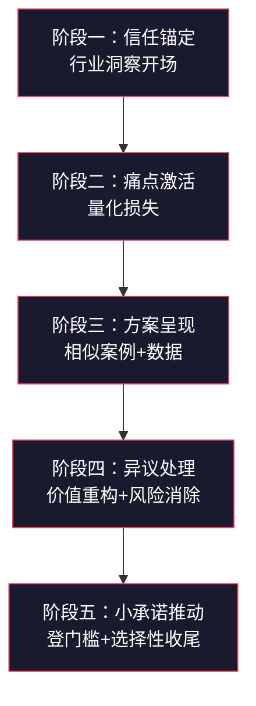
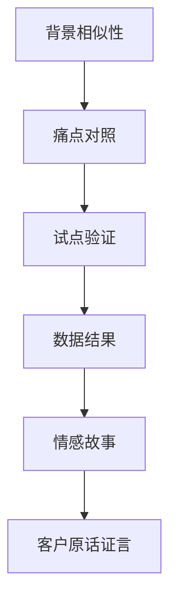
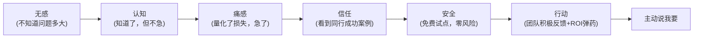
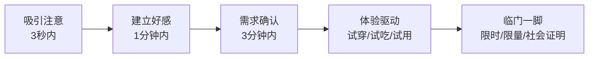
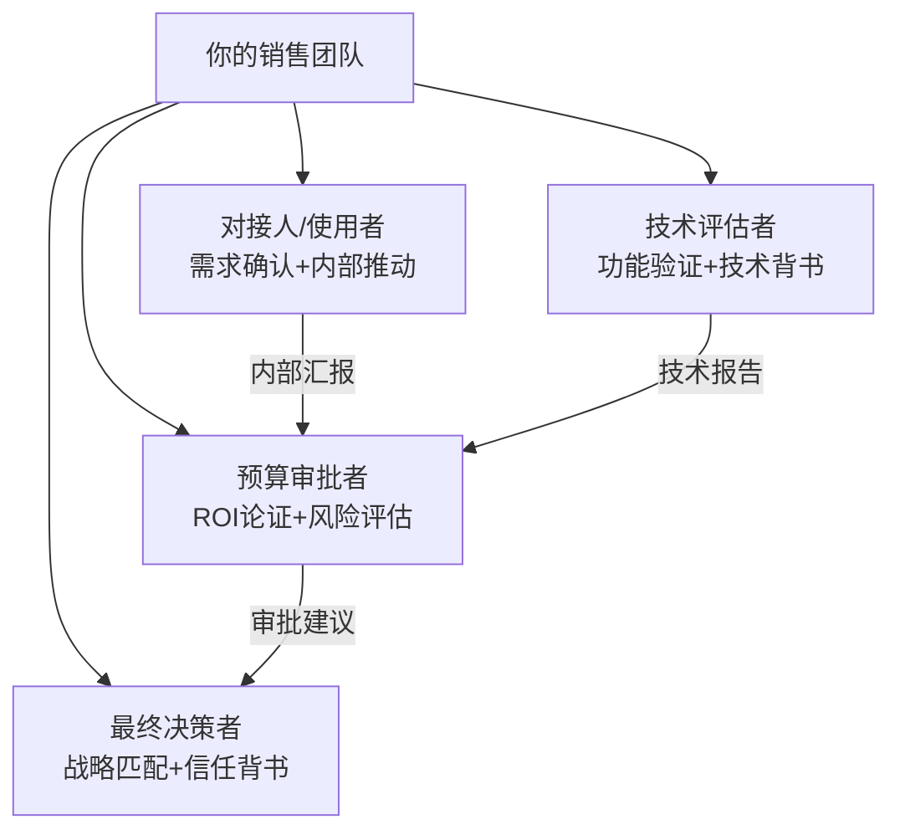

## 场景一：销售说服——让客户主动说"我要"

### 为什么销售说服是最值得研究的说服场景

销售说服是所有说服场景中结构最完整、反馈最直接的一种。政治说服的结果可能要等几年才能验证，管理说服的效果可能被多种因素干扰，但销售说服——客户买不买、什么时候买、买了之后是否复购——每一环都有明确的反馈信号。正因为这种即时反馈，销售说服领域积累了大量经过实战验证的说服技术和心理机制，这些技术远不止"会说话"那么简单。

从知识体系的角度看，销售说服融合了社会心理学（权威、社会证明、稀缺性）、行为经济学（损失厌恶、框架效应、锚定效应）、认知科学（决策启发式、注意力机制）和沟通学（叙事结构、非语言信号）四大领域的核心原理。掌握销售说服，等于同时训练了这四个维度的能力，这些能力可以迁移到谈判、管理、创业、融资等所有需要影响他人决策的场景。

本章通过一个完整的B2B销售案例，拆解从"客户犹豫"到"客户主动说我要"的全过程，让你看到每一个说服节点背后的心理学原理和具体话术设计。随后扩展到B2C、电话销售、线上销售、复杂方案销售等多种场景，并提供可直接复用的模板和工具。

---

### 完整案例：李明如何拿下王总的订单

#### 案例背景

李明是一家企业级SaaS公司的销售经理，负责华东区域。他的目标客户王总是某中型制造企业（年产值约2亿元，员工500人）的运营总监。王总对李明公司的生产管理系统感兴趣——产品演示时表现出明显的购买意愿——但在价格和实施风险上有顾虑，已经拖延决策三周。这三周里，李明发了两封跟进邮件，王总的回复都很简短："还在评估中"、"需要再内部讨论一下"。

这是B2B销售中最典型的困境：客户有需求，产品能解决，但就是不下单。这种困境背后通常有三层原因：

1. **认知层：** 客户对问题的严重性认识不足，"知道有问题"和"痛感强烈必须解决"之间有巨大鸿沟
2. **信任层：** 客户对产品效果存疑，"演示好看"和"实际好用"是两回事
3. **行动层：** 客户内部存在决策阻力——预算审批、部门协调、风险顾虑等组织因素

这三个层面的问题不解决，再好的产品也卖不出去。李明接下来的每一步都是在逐一攻克这三个层面。

#### 客户画像与需求分析

在任何销售说服开始之前，你必须先完成客户画像分析。这一步的深度直接决定了后续说服的精准度。很多销售人员的失败不是因为话术不好，而是因为根本没有理解客户。

李明通过前期沟通和行业研究，已经掌握了以下信息：

| 维度 | 王总的情况 | 说服策略影响 |
|------|-----------|-------------|
| 决策角色 | 运营总监，不是最终拍板人，但有重大建议权 | 需要给他"向上汇报的弹药" |
| 核心痛点 | 订单交付延迟频繁，库存积压严重 | 说服切入点从痛点出发 |
| 决策风格 | 数据驱动型，重视ROI计算 | 用数据说话，避免空洞承诺 |
| 风险偏好 | 偏保守，过去两年没有引入过新系统 | 需要降低感知风险 |
| 内部政治 | CFO对IT投入持谨慎态度 | 要帮王总说服CFO |
| 个人动机 | 想在公司内部提升影响力 | 展示成功案例中运营总监的"升职故事" |

这些信息决定了李明的整个说服策略设计。注意：**脱离客户画像的说服话术是无效的**。同一套话术，对数据驱动型客户和对关系驱动型客户的效果完全不同。

##### 客户画像信息收集的五个渠道

很多销售人员苦于"不知道客户的信息"，以下是五个实战中最有效的信息收集渠道：

| 渠道 | 可获取信息 | 操作方法 |
|------|-----------|---------|
| 公开信息 | 企业规模、行业地位、财务状况、近期动态 | 企查查/天眼查查工商信息，官网查新闻动态，行业报告查市场地位 |
| 首次沟通 | 核心痛点、决策流程、预算范围 | 用开放式问题引导，"您目前最关注哪些方面的改善？" |
| 行业人脉 | 内部政治、决策风格、个人偏好 | 通过共同朋友、行业活动等渠道了解 |
| 社交媒体 | 个人兴趣、关注话题、价值观 | 查看朋友圈/LinkedIn/微博，了解其关注的行业话题 |
| 竞品情报 | 已有方案的不足、决策卡点 | 了解客户是否在对比其他方案，卡在哪个环节 |

##### 不同决策风格的说服策略对比

理解决策风格是精准说服的前提。根据组织行为学研究，商业决策者通常分为四种风格：

| 决策风格 | 特征 | 说服重点 | 应避免 |
|---------|------|---------|--------|
| 数据驱动型 | 重视数字、ROI、对比分析 | 提供详尽的数据分析、ROI计算、竞品对比表 | 空洞的故事、模糊的承诺 |
| 关系驱动型 | 重视信任、口碑、人际推荐 | 客户见证、面对面沟通、高层背书 | 冷冰冰的数据轰炸 |
| 直觉驱动型 | 重视感觉、愿景、可能性 | 产品演示、未来场景描绘、创新亮点 | 过多细节、过度分析 |
| 怀疑驱动型 | 重视风险、证据、第三方验证 | 免费试用、退保障、独立评测、详细FAQ | 过度热情、施压话术 |

王总属于典型的数据驱动型，所以李明全程用数据说话，每个论点都有数字支撑。

---

### 五阶段说服流程拆解

下面将整个销售说服过程拆解为五个阶段，每个阶段标注所用的心理学原理、具体话术、设计意图，以及关键的注意事项。

#### 第一阶段：重建连接与信任锚定

##### 目标

在三周的沉默之后，重新激活对话，同时建立专业信任。这个阶段的核心任务是把自己从"推销员"重新定位为"行业专家"——客户愿意听专家说话，但本能地抵触推销员。

##### 具体做法

李明没有发第四封跟进邮件，而是约了一个15分钟的电话。开场白如下：

> "王总，打扰您几分钟。我最近一直在研究制造业的数字化转型，看到一个数据挺有意思——根据德勤2023年制造业报告，67%的中型制造企业把'订单交付准时率'列为最需要改善的运营指标。您觉得这个数据准不准？"

##### 原理拆解

这段开场白包含了三个精心设计的要素：

**要素一：行业数据引入（权威原则）。** 引用德勤报告而非自己的观点，这把李明从"推销员"定位切换到了"行业研究者"。王总听到的不是"我要卖东西给你"，而是"我了解你的行业"。罗伯特·西奥迪尼在《影响力》中指出，权威原则的关键不是"你是否权威"，而是"你是否展示了专业度"。引用行业数据是最快速建立专业度的方式。

**要素二：开放式问题（苏格拉底式提问）。** "您觉得这个数据准不准？"这不是在问答案——王总作为制造业从业者当然有自己的判断——而是在邀请王总进入对话。开放式问题让对方主动输出信息，而信息是说服的基础。

**要素三：共同话题建立连接（喜好原则）。** 不聊产品，聊行业。这让王总感受到李明是在"交流"而非"推销"。心理学研究表明，人们更愿意被自己认为是"同类"的人说服。

##### 信任锚定的三种开场模式

| 开场模式 | 适用场景 | 示例 | 心理机制 |
|---------|---------|------|---------|
| 行业数据开场 | 数据驱动型客户、首次接触 | "看到一组数据挺有意思..." | 权威原则 |
| 同行案例开场 | 已知客户行业和规模 | "上周跟XX行业的张总聊天，他们遇到一个问题跟您很像..." | 社会证明+相似性 |
| 洞察式开场 | 客户已有一定了解 | "我注意到贵公司最近在XX方面的布局，有个趋势想跟您交流..." | 专业度+个性化 |

##### 关键注意事项

- 不要在重建连接阶段提及"上次的方案"、"您考虑得怎么样了"这类跟进话术。这会把对话拉回到"推销-被推销"的框架中。
- 开场白的行业数据必须真实、可验证。如果王总去查发现数据不对，信任直接归零。
- 15分钟是上限。主动设时间限制反而会降低王总的防御心理——"他不会浪费我太多时间"。
- 如果客户明确表示"现在不方便"或"不需要"，不要硬聊。回复"好的，我一个月后再联系您"，然后在一个月后用新的行业洞察重新触达。

#### 第二阶段：痛点激活与需求确认

##### 目标

让王总从"知道有问题"升级到"痛感强烈，必须解决"。这个阶段是整个说服流程中最关键的转折点——如果痛点没有被充分激活，后续的方案呈现和异议处理都会变成"对牛弹琴"。

##### 具体做法

王总回应了李明的数据问题后，李明顺势深入：

> "我理解，那王总您这边目前交付准时率大概在什么水平？"
> 
> （王总回答：大概78%左右，行业平均确实不高。）
> 
> "78%在行业里其实不算低了。不过我好奇一个事——每100个订单里有22个延迟交付，按照您的订单规模，这些延迟的罚款和客户流失，一年大概是什么量级？"

##### 原理拆解

**痛点激活技术的核心是"量化痛苦"。** 人对抽象的问题（"交付率不高"）和具体损失（"22个延迟订单，一年罚款80万"）的感知完全不同。神经科学研究表明，具体的数字会激活大脑的损失厌恶回路——当人意识到"我每年都在损失这个钱"时，解决问题的紧迫感会急剧上升。

这里李明用了两个技巧：

**技巧一：先肯定再质疑。** "78%在行业里不算低了"——这是对王总的尊重和肯定，避免了直接否定带来的防御心理。然后"不过我好奇一个事"引出更深层的问题。这是心理学中的"先同步再引导"（pacing and leading）。

**技巧二：让客户自己算账。** 李明没有直接说"你们一年损失XX万"，而是引导王总自己估算。自己算出来的数字，说服力是别人告诉你的十倍。这叫"承诺一致性"——当王总亲口说出损失金额，他的大脑就会开始寻找解决方案。

##### 痛点量化的标准话术模板

1. 确认现状："你们目前 [关键指标] 大概在什么水平？"
2. 引入对标："行业头部企业能达到 [更优水平]，你们有了解过差距的原因吗？"
3. 量化损失："按照这个差距，一年在 [损失维度] 上大概是什么量级？"
4. 感受锚定："如果这个数字能改善 [X]%，对你们意味着什么？"

这四步完成后，客户的需求就从"可选"变成了"必选"。

##### 痛点激活的三层递进法

有效的痛点激活不是一次性的，而是需要三层递进：

| 层次 | 描述 | 话术示例 | 心理效果 |
|------|------|---------|---------|
| 第一层：认知 | 让客户意识到问题存在 | "你们有没有注意到最近XX指标的变化？" | "哦，确实有问题" |
| 第二层：量化 | 让客户知道问题有多大 | "这个问题一年大概造成多少损失？" | "原来损失这么大" |
| 第三层：紧迫 | 让客户感到必须立刻解决 | "如果再拖半年，这个损失会扩大到什么程度？" | "不能再等了" |

很多销售人员只做到了第一层就急着推方案，结果客户觉得"问题不大，以后再说"。必须走到第三层，客户才会主动说"我要"。

##### 常见的痛点激活错误

| 错误做法 | 为什么错 | 正确做法 |
|---------|---------|---------|
| 直接告诉客户"你有问题" | 触发防御心理，客户会否认 | 用提问引导客户自己发现问题 |
| 列举一堆问题 | 信息过载，客户麻木 | 聚焦1-2个最痛的点深入 |
| 只谈问题不量化 | 抽象问题不构成行动动力 | 必须换算成金额/时间/机会成本 |
| 夸大问题制造焦虑 | 客户会质疑你的动机 | 基于事实，让数据自己说话 |
| 忽视客户已有的改善努力 | 让客户觉得被否定 | 先肯定已有努力，再指出优化空间 |

#### 第三阶段：方案呈现与社会证明

##### 目标

展示解决方案的可信性和有效性，同时为价格讨论铺垫价值基础。这个阶段的核心挑战是：如何让客户相信"你的方案真的能解决我的问题"，而不只是"演示好看"。

##### 具体做法

在王总确认了损失规模后，李明开始呈现案例：

> "王总，去年我们帮一家和贵公司规模非常接近的企业——XX制造——解决了几乎一模一样的问题。他们当时的交付准时率是76%，比您还低两个点。
> 
> 他们的运营总监赵总做了一个很聪明的决定：先用三个月在一条产线做试点，跑通了再全面铺开。试点三个月后，那条产线的准时交付率从76%到了92%。赵总拿着这个数据去跟董事会汇报，全面实施的预算当场就批了。
> 
> 全面上线六个月后，整厂准时交付率到了95%，库存周转率提高了30%。赵总后来跟我说了一句话，我到现在还记得——'以前每个月底我都要在仓库通宵盘点，现在系统自动出报表，我终于能准时下班陪孩子了。'"

##### 原理拆解

这个案例陈述包含了四层说服机制：

**机制一：相似性原则（社会证明的核心）。** 李明特别强调"和贵公司规模非常接近"、"几乎一模一样的问题"。心理学家指出，社会证明的强度与"可比性"直接相关——看到跟自己处境相似的人成功了，说服力远大于看到一个完全不同的人成功了。如果案例客户跟目标客户差距太大（比如世界500强 vs 中小企业），不仅没有说服力，反而会让客户觉得"他们的条件比我好太多了，没法比"。

**机制二：阶梯式成功叙事。** 不是直接说"最终效果多好"，而是先讲试点（76%→92%），再讲全面实施（→95%）。阶梯式叙事有两个好处：降低感知风险（"先试点再决定"比"一步到位"更安全），同时暗示过程是可控的。

**机制三：具身化的结果描述。** "通宵盘点"到"准时下班陪孩子"——这不是数据，是生活场景。神经科学研究表明，具身化的场景描述会激活大脑的镜像神经元系统，让听者在心理上"体验"到那个结果。数据说服理性，故事说服情感，两者缺一不可。

**机制四：第三方证言。** "赵总后来跟我说了一句话"——这不是李明在夸自己产品好，是客户赵总在夸。第三方证言的信任度是自我推荐的3-5倍（尼尔森信任度研究）。

##### 案例陈述的黄金结构

每一步都不可省略。缺了A，客户觉得"跟我没关系"；缺了B，客户觉得"我的问题更复杂"；缺了C，客户觉得"直接上风险太大"；缺了D，客户觉得"效果不确定"；缺了E和F，客户觉得"冷冰冰的，感受不到真实感"。

##### 方案呈现中的价值锚定技巧

在呈现方案价格之前，先让客户对价值形成一个高锚点：

| 步骤 | 目的 | 话术示例 |
|------|------|---------|
| 1. 展示问题代价 | 让客户意识到"不解决"的代价 | "这个问题如果不解决，按照当前规模，三年累计损失大约在600万" |
| 2. 展示行业标杆 | 让客户看到"理想状态"是什么样 | "行业头部企业的准时交付率在95%以上，这意味着他们的客户留存率比行业平均高20%" |
| 3. 展示解决方案 | 将方案定位为"从现状到标杆的路径" | "我们的方案就是帮您从78%提升到95%的完整路径" |
| 4. 客户参与评估 | 让客户自己判断价值 | "您觉得这个提升对贵公司值多少钱？" |

当客户自己估算出"这个提升值几百万"时，你再报出60万的价格，客户的感受是"很划算"而不是"很贵"。

#### 第四阶段：异议处理与价值重构

##### 目标

化解价格顾虑，将"成本"重新定义为"投资回报"。这个阶段是大多数销售失败的地方——客户明明已经心动了，但在价格面前退缩。处理异议的核心原则是：**不要对抗异议，要重构异议背后的认知框架**。

##### 具体做法

王总终于亮出了核心异议："方案确实不错，但你们这个价格比竞品高了将近40%，我们CFO那边很难通过。"

李明的回应：

> "王总，我完全理解价格是关键考量。我换个角度跟您算一笔账：
> 
> 您刚才提到每年因为延迟交付导致的罚款和客户流失损失大概在200万左右。我们的系统年费是60万，相当于这个损失的30%。按照XX制造的经验，第一年就能把交付损失降低60%以上——也就是节省120万，减去60万的系统费用，净收益60万。
> 
> 换句话说，这笔投资第一年就能回本，第二年开始净赚。如果我把这个ROI分析做一份详细的报告，您觉得拿去给CFO看够不够有说服力？
> 
> 另外，我们这个季度有一个早期采用者计划——前三个月免费，等于您有三个月零成本验证效果。如果三个月后指标没有改善，您可以直接退出，没有任何损失。这个计划月底就截止了，因为我们今年的早期采用者名额就15个，目前还剩3个。"

##### 原理拆解

这段回应综合运用了五种说服原理：

**原理一：框架效应。** 60万的年费，在"成本框架"下是"好贵"，在"投资框架"下是"投入60万赚120万"。同一件事，框架不同，感受完全不同。丹尼尔·卡尼曼的研究表明，人类对同一信息的判断，可以因为表达框架的改变而产生高达40%的评价差异。

**原理二：损失厌恶。** "每年损失200万"——这是客户已经在承受的损失。人类对"避免损失"的动力是"获得收益"的2倍（卡尼曼和特沃斯基的前景理论）。李明不是在说"买了你会赚"，而是在说"不买你每年继续亏200万"。

**原理三：具体化ROI计算。** 不是笼统地说"很快回本"，而是给出精确的计算：60万投入→120万节省→净收益60万→第一年回本。具体的数字计算比任何修辞都有说服力。

**原理四：降低风险承诺。** 三个月免费试点+无条件退出。这几乎把决策风险降到了零。行为经济学中的"零风险偏见"表明，当风险从"很小"变成"零"时，接受率会出现跳跃式上升——这不是线性关系，而是断崖式的。

**原理五：稀缺性。** "15个名额，还剩3个，月底截止"——三个限定条件叠加，制造紧迫感。但请注意，这里有一个关键前提：**稀缺性必须是真实的**。虚假的紧迫感一旦被识破，信任直接崩塌。

##### 八大常见异议处理对照表

| 客户异议 | 错误回应 | 正确回应 | 底层原理 |
|---------|---------|---------|---------|
| "太贵了" | "我们可以打折" | "我帮您算一笔账：投入X，回报Y，回本周期Z" | 框架效应+ROI量化 |
| "竞品更便宜" | "他们功能没我们全" | "您最在意的是价格还是总拥有成本？竞品的隐性成本包括..." | 重新定义比较维度 |
| "我需要再考虑" | "好的，您考虑考虑" | "您主要在考虑哪方面？是实施风险、预算审批，还是其他？" | 具体化模糊异议 |
| "我们目前的系统够用" | "但我们的更好" | "您目前系统处理不了的那个场景（具体场景），一年大概遇到几次？" | 痛点精准打击 |
| "我一个人决定不了" | "那您帮我们推荐一下？" | "我准备一份ROI分析报告，您觉得用什么格式给决策层看最合适？" | 提供决策支持工具 |
| "之前上过类似的系统失败了" | "我们的不一样" | "那次失败的主要原因是什么？我看看我们怎么规避同样的风险" | 直面恐惧根源 |
| "现在经济形势不好" | "现在投才更划算" | "正因为形势不好，每一分浪费都更需要避免。您现在因为交付问题流失的客户，形势好了也回不来" | 损失厌恶+紧迫感 |
| "我再看看其他方案" | "您看了就知道我们最好" | "完全理解，货比三家是应该的。我给您一份对比清单，帮您系统地评估所有方案" | 主动提供评估工具，展示自信 |

##### 异议处理的通用四步法

遇到任何异议，都可以用这个四步框架来应对：

第一步：共情认同 —— "完全理解您的顾虑"
第二步：确认本质 —— "您主要是担心 [具体问题] 对吗？"
第三步：重构框架 —— "我换个角度来看这个问题..."
第四步：提供证据 —— "给您看一个具体的数据/案例..."

**关键原则：永远不要直接否定客户。** "不对"、"您理解错了"、"其实不是这样的"——这些话会瞬间触发客户的防御心理。正确的做法是先认同，再引导。这不是虚伪，而是尊重——你尊重客户的感受，客户才会愿意听你的观点。

##### 价格谈判中的锚定策略

当价格成为核心障碍时，以下锚定策略可以帮助你重新定义价格的参照系：

| 策略 | 操作方法 | 示例 |
|------|---------|------|
| 更高方案锚定 | 先报一个更高价格的方案 | "全面定制方案150万，标准方案60万，您觉得哪个更适合？" |
| 日均成本法 | 将年费换算成日均 | "60万一年，相当于每天1643元，比一个实习生的成本还低" |
| 损失对比法 | 将价格与客户已知损失对比 | "60万相当于您三个月的交付损失，但效果是永久的" |
| 替代方案对比 | 将价格与替代方案的总成本对比 | "招一个有经验的生产计划员年薪30万+，而且只管一个维度" |
| 分期付款法 | 降低单次支付的心理压力 | "可以按季度支付，每季度15万" |

#### 第五阶段：小承诺推动与收尾

##### 目标

不直接要签约，而是要一个小的"是"，然后用承诺一致性原理推动后续。这个阶段的精妙之处在于：让客户觉得每一步都是自己主动选择的，而不是被推着走的。

##### 具体做法

> "王总，这样，我们先安排一次免费的需求评估——派我们的实施顾问到贵公司，用半天时间帮您的团队跑一遍核心业务流程，看看系统实际能解决多少问题。这个评估完全免费，也不需要任何承诺，就是让您和团队亲眼看看实际效果。
> 
> 如果评估结果好，我们再讨论后续方案；如果觉得不合适，就当我们交个朋友，以后有其他需求再合作。您看下周二或者周四，哪天方便？"

##### 原理拆解

**登门槛技术（Foot-in-the-Door）。** 这是社会心理学中最经典、最可靠的说服技术之一。1966年弗里德曼和弗雷泽的经典实验表明，先获得一个小承诺（同意评估），后续接受大请求（签约购买）的概率会提高3-4倍。因为人在心理上需要保持行为的一致性——"我已经同意评估了，说明我对这个产品是有兴趣的，那签约也顺理成章。"

**选择性收尾。** "下周二或者周四，哪天方便？"——不问"要不要评估"，而是问"什么时候评估"。这个话术技巧叫做"选择性收尾"（alternative close），它预设了"评估会进行"这个前提，客户只需要选择时间，而不是选择是否进行。

**风险对冲话术。** "如果觉得不合适，就当我们交个朋友"——这句话进一步降低了决策压力。当客户感受到零压力时，反而更容易做出积极的回应。

##### 收尾阶段的进阶话术库

| 场景 | 话术 | 原理 |
|------|------|------|
| 约下次沟通 | "我周三下午或周四上午都有空，您哪个时间更方便？" | 选择性收尾 |
| 推动试用 | "我给您开一个14天的试用账号，您让团队先体验一下" | 登门槛+零风险 |
| 推动内部汇报 | "我帮您做一份3页的PPT摘要，您直接拿去汇报" | 降低行动成本 |
| 推动决策会议 | "我可以参加贵公司的内部评审会，现场解答技术问题" | 消除信息不对称 |
| 处理犹豫 | "这样，我们先从一个部门开始试点，三个月后看数据说话" | 缩小承诺范围 |

---

### 案例结果

王总同意了免费评估。评估当天，他的生产团队对系统演示反响积极——特别是库存预警和订单追踪功能。评估结束后，王总主动对李明说："你把合同模板发我吧，我先让法务看看。"两周后，合同正式签署。

**关键转折点回顾：** 王总从"还在评估中"到主动说"把合同发我"，这个转变发生在第五阶段的免费评估之后。评估让他亲眼看到了效果，团队的积极反馈给了他内部推动的信心，而李明精心设计的ROI分析则给了他说服CFO的"弹药"。

从心理学角度看，王总的转变经历了完整的决策路径：

---

### 买方心理学：理解客户决策的真实过程

要成为顶级销售，不能只懂"怎么说"，更要懂"客户怎么想"。以下是客户从接收到信息到做出购买决策的心理过程。

#### 客户决策的双系统模型

诺贝尔经济学奖得主卡尼曼提出的"双系统理论"完美解释了客户的购买决策：

| 系统 | 特征 | 在销售中的表现 | 对应的说服策略 |
|------|------|---------------|---------------|
| 系统1（直觉） | 快速、自动、情感驱动 | "第一印象不错"、"感觉靠谱" | 专业形象、产品演示、故事感染 |
| 系统2（理性） | 缓慢、费力、逻辑驱动 | "让我算算ROI"、"跟竞品对比一下" | 数据分析、ROI计算、功能对比 |

B2C决策以系统1为主（"喜欢就买"），B2B决策以系统2为主（"算清楚再买"）。但即便是最理性的B2B决策者，最终的"拍板"往往也是系统1在起作用——数据让人信服，但最终推动行动的是"感觉"。所以李明的案例中，"通宵盘点到准时下班陪孩子"这个情感故事跟ROI数据一样重要。

#### 客户从犹豫到购买的五个信号

经验丰富的销售人员能从客户的言行中识别出购买信号。以下是五个关键信号及其应对：

| 购买信号 | 客户的言行表现 | 正确应对 |
|---------|--------------|---------|
| 细节询问 | "实施周期多长？"、"培训怎么安排？" | 立即提供具体信息，这是客户在心理上预演购买 |
| 异议具体化 | 从"太贵了"变成"能不能分期付款？" | 异议越具体，购买意愿越强，立即配合解决 |
| 引入他人 | "我让技术部的李工也来听听" | 说明客户已经在内部推动，配合安排多方沟通 |
| 时间讨论 | "你们最快什么时候能进场？" | 极强的购买信号，立即确认时间表 |
| 默认假设 | "签约后数据迁移怎么办？" | 预设了签约会发生，顺着回答即可 |

当出现以上信号时，不要继续"推销"，而是立即配合客户推进下一步。这时候多说一句废话都可能打断客户的决策节奏。

---

### 可复用的销售说服框架

将上述案例提炼为通用框架，适用于任何B2B销售场景：

每个阶段的检查清单：

**阶段一检查项：**
- [ ] 是否用行业数据/洞察开场（而非产品介绍）
- [ ] 是否通过开放式问题让客户输出信息
- [ ] 是否在5分钟内建立了"专家"而非"推销员"的定位

**阶段二检查项：**
- [ ] 是否让客户亲口确认了核心痛点
- [ ] 是否量化了痛点带来的具体损失（金额/时间/机会）
- [ ] 是否让客户自己计算了损失（而非你替他算）
- [ ] 是否走到三层递进的第三层（紧迫感）

**阶段三检查项：**
- [ ] 案例中的客户是否与目标客户高度相似
- [ ] 是否包含阶梯式成功叙事（试点→全面→最终结果）
- [ ] 是否同时包含数据证明和情感故事
- [ ] 是否引用了客户原话作为第三方证言
- [ ] 是否在报价前完成了价值锚定

**阶段四检查项：**
- [ ] 是否将成本重构为投资回报
- [ ] 是否用具体的ROI计算替代笼统的价值描述
- [ ] 是否提供了降低风险的保障措施
- [ ] 是否创造了合理的紧迫感（稀缺性必须真实）
- [ ] 是否用四步法处理异议（共情→确认→重构→证据）

**阶段五检查项：**
- [ ] 是否用小承诺替代直接签约
- [ ] 是否使用了选择性收尾（二选一而非开放式）
- [ ] 是否消除了客户的"被推销"感受
- [ ] 是否降低了每一步的行动成本

---

### 多场景变体应用

#### 变体一：B2C零售销售

B2C销售与B2B有本质区别——决策时间短（分钟级而非周/月）、决策更感性、决策者通常就是使用者本人。以下是B2C场景的针对性调整：

##### B2C销售说服的核心框架

##### B2C常见异议处理话术

| 客户异议 | 错误回应 | 正确回应 | 底层原理 |
|---------|---------|---------|---------|
| "我再看看" | "好的" | "您主要在看哪方面？我帮您对比一下" | 具体化+服务姿态 |
| "网上更便宜" | "质量不一样" | "您方便看一下这个细节（做工/材质/售后），这些是线上看不到的" | 体验价值差异化 |
| "我再想想" | "这个今天有活动" | "完全理解。不过这个颜色/尺码/款式库存就剩两个了，要不您先试试？" | 稀缺性+降低承诺门槛 |
| "不需要" | "您看一下嘛" | "好的，您是给自己看还是送人？" | 重新定义需求 |
| "太贵了" | "这个不贵" | "这个确实比普通款贵一些，主要是因为[具体差异]。您觉得这个差异对您重要吗？" | 价值解释+客户判断 |

##### B2C销售的五个关键时刻

1. **3秒吸引：** 客户路过你的柜台/店铺/广告时，你只有3秒吸引注意力。方法：视觉冲击（陈列、色彩）、利益点前置（"今天买一送一"）、好奇心钩子（"你知道90%的人都用错了XX吗？"）。

2. **1分钟建立好感：** 不要一上来就推销。"今天是给自己看还是送人？"——这句话同时完成了三件事：开启对话、了解需求、展示服务态度。

3. **体验驱动：** B2C决策的核心是体验。"您试一下就知道了"比任何话术都有效。试穿、试吃、试用、试驾——让客户的感官替你说话。

4. **临门一脚：** 当客户犹豫时，使用社会证明（"这款卖得最好"）、稀缺性（"最后一个了"）、限时优惠（"今天活动最后一天"）三板斧。

5. **连带销售：** 成交后追加推荐。"这条裤子配这双鞋效果特别好"——此时客户的购买心理阈值已经降低，追加推荐的成功率是首次推荐的2-3倍。

#### 变体二：电话销售

电话销售是最难的销售场景之一——没有面对面的非语言信息，客户的挂断成本几乎为零，前10秒决定生死。

##### 电话销售的黄金结构

[0-3秒] 利益钩子："张总您好，我注意到贵公司最近在扩张产能..."
[3-10秒] 身份建立："我是XX公司的李明，专注制造业数字化10年..."
[10-20秒] 价值主张："我们帮同行业的XX企业把交付准时率从76%提到了95%..."
[20-30秒] 低门槛邀约："方便的话，我发一份案例给您看看？"

##### 电话销售的关键技巧

| 技巧 | 具体做法 | 原理 |
|------|---------|------|
| 前10秒给理由 | 不说"打扰您一下"，说"有一个行业数据想跟您分享" | 给客户听下去的理由 |
| 声音掌控 | 语速比面对面慢10-15%，关键信息前做0.5秒停顿 | 声音是电话销售的唯一武器 |
| 频繁确认 | 每30-45秒问一次"您觉得呢？" | 保持客户参与感，防止走神 |
| 微笑说话 | 即使看不见，微笑会改变声音的频率和温度 | 声音表情学研究证实 |
| 记录关键信息 | 客户提到的任何痛点、时间、人名都立刻记下 | 后续跟进的素材 |
| 不要在电话里报价 | "价格根据方案不同有差异，我先了解一下您的具体需求" | 避免价格成为唯一的判断标准 |

##### 电话销售的跟进节奏

首次通话后 → 2小时内发跟进短信/微信（总结通话要点）
第2天 → 发送案例材料或行业报告
第5天 → 第二次电话（基于发送的材料切入）
第10天 → 分享新的行业洞察或客户案例
第20天 → 邀约线下见面或产品演示
第30天 → 最后一次尝试，提供一个特别的理由

#### 变体三：线上销售（微信/邮件/社交媒体）

数字化时代，越来越多的销售发生在微信、邮件、LinkedIn等线上渠道。线上销售的核心挑战是：信息密度低、注意力稀缺、信任建立更难。

##### 微信销售的关键原则

| 原则 | 具体做法 | 反面教材 |
|------|---------|---------|
| 朋友圈即名片 | 定期分享行业洞察、客户案例、专业观点 | 只发产品广告和促销信息 |
| 先价值后推销 | 每3条有价值的内容中夹1条产品信息 | 每条消息都是在卖东西 |
| 个性化沟通 | "王总，看到您朋友圈分享的那个行业趋势，我们最近刚好有一个相关案例..." | 群发"尊敬的客户您好" |
| 异步沟通 | 给客户充足的时间回复，不催促 | 连发5条消息追问"您看到了吗" |
| 语音/视频辅助 | 复杂问题用30秒语音解释比打字高效 | 用文字写一大段技术说明 |

##### 邮件跟进的模板设计

**初次触达邮件模板：**

主题：[行业痛点] + [具体数字] + [行业名称]

[称呼]，您好：

我是[公司]的[名字]，专注[领域]领域[X]年。

最近我在研究[行业]的[趋势/挑战]，发现一个有意思的数据：
[具体数据+来源]。

这个数据背后的问题是[痛点描述]。我们最近帮[相似企业]
解决了这个问题，效果是[具体成果]。

如果您感兴趣，我可以把详细案例发给您看看。
不需要任何承诺，就是做个行业交流。

[签名]

**跟进邮件模板：**

主题：上次聊到的[具体话题]，有个新进展

[称呼]，您好：

上次跟您聊到[具体话题]，最近我们有一个新的客户案例
想跟您分享——[简述案例，强调与客户情况的相似性]。

[1-2个关键数据点]

另外，我根据上次沟通了解到的贵公司情况，初步整理了一份
[价值分析/方案建议]，您看方便的话我发给您？

[签名]

#### 变体四：复杂方案型销售（长周期、多决策者）

当销售周期超过6个月、涉及多个决策者时，说服策略需要根本性的调整。你不再是在说服一个人，而是在推动一个组织的决策流程。

##### 多决策者说服地图

每个角色需要不同的说服材料：

| 角色 | 关注点 | 需要的材料 | 沟通频率 |
|------|--------|-----------|---------|
| 对接人/使用者 | 好不好用、能不能解决我的问题 | 产品演示、试用账号、使用培训 | 高频（每周） |
| 技术评估者 | 技术架构、安全性、集成能力 | 技术白皮书、API文档、安全认证 | 中频（按需） |
| 预算审批者 | 花多少钱、回报多少、风险多大 | ROI分析报告、竞品对比、付款方案 | 低频（关键节点） |
| 最终决策者 | 战略价值、行业趋势、竞争对手在做什么 | 行业趋势报告、标杆案例、战略合作方案 | 最低频（一次即可） |

##### 长周期销售的内容营销策略

在长周期销售中，你需要持续在客户视野中"刷存在感"，但不是靠骚扰，而是靠价值：

| 时间段 | 行动 | 价值输出 |
|-------|------|---------|
| 第1-2周 | 发送行业白皮书 | 展示行业理解深度 |
| 第3-4周 | 分享客户成功案例 | 建立方案可信度 |
| 第5-6周 | 邀请参加线上研讨会 | 提供学习价值+社交场景 |
| 第7-8周 | 发送竞品动态分析 | 制造紧迫感+展示情报能力 |
| 第9-10周 | 邀请参观现有客户现场 | 眼见为实 |
| 第11-12周 | 提供免费试用/评估 | 降低行动门槛 |

---

### 常见误区与纠正

#### 误区一：过早报价

**错误做法：** 客户一问价格就直接报价。

**为什么错：** 在价值没有建立之前报价，客户只会用价格来评判你。如果竞品更便宜，你直接出局；即使你更便宜，客户也会觉得"便宜没好货"。报价的前提是客户已经理解了你的价值——在客户眼中，你值100万他才觉得60万便宜，你只值10万他觉得60万就是抢劫。

**正确做法：** 在阶段二（痛点激活）和阶段三（方案呈现）完成之前，不讨论价格。如果客户提前问价，可以回应："价格当然重要，不过在讨论价格之前，我想先确认一下——您最关注的是总投入金额，还是投入产出比？因为同样的投入，不同方案的回报可能差3-5倍。"

#### 误区二：案例不真实或不可验证

**错误做法：** 编造或夸大客户案例。

**为什么错：** 一次不真实的案例被识破，信任归零。而且在互联网时代，客户很容易交叉验证。更严重的是，如果客户基于虚假承诺签约，后续效果不达预期，纠纷和负面口碑的代价远超一单生意。

**正确做法：** 案例必须真实，最好能让客户联系到案例中的当事人。如果案例不能公开具体公司名，可以说"一家年产值相近的制造企业"，但数据必须是真实的。如果目前没有合适的案例，可以用行业公开数据来替代——"根据XX研究报告，这类方案的平均ROI是XX%"。

#### 误区三：异议处理变成辩论

**错误做法：** 客户说"太贵了"，你开始证明"不贵"。

**为什么错：** 辩论只会让客户更加坚持自己的立场。心理学中的"逆火效应"（backfire effect）表明，直接否定对方的观点反而会强化对方的原有信念。

**正确做法：** 先认同，再重构。"完全理解您的顾虑，价格确实是重要考量。我换个角度来看..."——先让客户感受到被理解，再引导到新的视角。

#### 误区四：只做单次沟通

**错误做法：** 一次电话/会议没搞定就放弃或频繁骚扰。

**为什么错：** B2B销售的平均决策周期是3-6个月，平均需要6-8次有效接触才能成交。单次沟通就期望成交是不现实的。但频繁骚扰同样会适得其反——客户会觉得你只关心成交，不关心他的需求。

**正确做法：** 设计多触点跟进策略。每次跟进提供新的价值（行业报告、案例更新、产品新功能），而不是简单问"您考虑得怎么样了"。建立一个跟进节奏：首次沟通后2天发总结邮件→1周后分享行业洞察→2周后提供新案例→1个月后邀约线下活动/参观。

**跟进的价值密度公式：** 每次跟进必须携带至少一个新信息点。如果实在没有新东西可以分享，宁可等一等也不要空手跟进。"只是想问问您考虑得怎么样了"是最低效的跟进方式。

#### 误区五：忽视决策链中的其他角色

**错误做法：** 只跟对接人沟通，忽视最终决策者和影响者。

**为什么错：** B2B采购决策通常涉及3-7个角色：使用者、影响者、决策者、批准者、采购者、把关者。只说服其中一个人是远远不够的。

**正确做法：** 帮助你的对接人成为"内部推销员"。李明的做法是给王总准备ROI分析报告——这份报告的本质是给王总一把说服CFO的武器。你要思考：对接人拿到什么材料，才能在他的组织内部推动决策？

#### 误区六：只讲功能不讲场景

**错误做法：** "我们的系统有XX功能、YY功能、ZZ功能..."

**为什么错：** 客户不关心你有什么功能，关心的是"这个功能能不能解决我的具体问题"。功能是抽象的，场景是具体的。人脑更容易理解和记住具体的场景。

**正确做法：** 把每个功能翻译成客户的使用场景。"库存预警功能"→"当某个SKU的库存低于安全线时，系统会自动提醒采购部，避免因为缺料导致产线停工"。场景越具体，客户越能想象自己在使用这个产品。

#### 误区七：成交后消失

**错误做法：** 签约之后就不再联系客户，直到续约前才出现。

**为什么错：** 客户签了约不代表满意。如果在使用过程中遇到问题没有及时解决，续约时你就是"那个卖了东西就不管的人"。更重要的是，满意的客户是最好的销售渠道——转介绍的成交率是冷启动的5倍以上。

**正确做法：** 建立成交后的关系维护计划（见下文"售后即售前"部分）。

---

### 进阶：销售说服的高阶技巧

#### 高阶技巧一：锚定定价策略

在报价之前，先抛出一个高锚点。例如：

> "行业里全面的智能制造解决方案，市场价通常在150-200万之间。我们这次的方案聚焦您最核心的两个需求，投入只需要60万。"

当150万成为锚点时，60万就显得"便宜"了。但锚定必须合理——如果你的产品本来就不值150万，客户会觉得你在玩套路。

**锚定的三层应用：**

| 层次 | 方法 | 示例 |
|------|------|------|
| 第一层：行业锚 | 引用行业整体价格水平 | "行业平均解决方案在100-150万之间" |
| 第二层：替代方案锚 | 展示替代方案的总成本 | "自己开发这个系统至少需要6个月+200万" |
| 第三层：损失锚 | 将价格与客户的已有损失对比 | "60万只相当于您三个月的交付损失" |

三层锚定叠加使用，效果最佳。客户在三个不同维度上都形成了"这个价格不贵"的认知。

#### 高阶技巧二：预设成交法

在对话中多次使用预设成交的语言，让"购买"成为默认选项：

- "签约后我们一般在两周内安排实施团队进场"（预设了签约会发生）
- "您这边的财务审批流程大概需要多久？我提前安排资源"（预设了审批会进行）
- "首批培训安排10人还是15人比较合适？"（预设了培训会进行）

每一次预设成交都在客户的潜意识中增加一层"这事会成"的暗示。心理学中的"启动效应"（priming effect）表明，即使是微妙的语言暗示也会影响人的后续判断和行为。

#### 高阶技巧三：反向销售

偶尔"推走"客户反而能加强说服力：

> "王总，说实话，如果您的核心诉求只是报表自动化，市面上有不少更便宜的工具能满足。我们的核心价值在于全流程的生产调度优化——如果这个不是您的主要需求，我建议您可以先看看其他方案。"

这看起来像是在把客户推走，实际上是在做两件事：筛选出真正的高价值需求，同时展示你的专业和诚实——"他没有为了成交而什么都答应，说明他是真的在帮我分析需求。"

**反向销售的使用条件：**
- 你对客户的需求已经有深入了解
- 你确信你的产品不是所有需求的最佳方案
- 你有足够的自信"推走"后客户会回来
- 你在推走的同时给出了具体建议（"如果只是XX需求，可以看看YY方案"）

如果对自己产品的适用性不确定，不要使用反向销售——你可能真的把客户推走了。

#### 高阶技巧四：让客户成为"共同创作者"

在方案呈现阶段，邀请客户参与方案设计：

> "王总，您觉得这个实施方案里，哪几个模块是必须第一批上的？您的团队更习惯哪种培训方式？"

当客户参与了方案设计，他就从"被推销的对象"变成了"方案的共同作者"。人对自己参与创造的东西有天然的认同感——这比任何话术都有效。心理学家称之为"宜家效应"（IKEA effect）：人们对自己参与组装的家具赋予更高的价值。

#### 高阶技巧五：售后即售前

高明的销售在成交之后才真正开始建立长期关系。成交后的30天是"关系巩固黄金期"：

| 时间点 | 行动 | 目的 |
|-------|------|------|
| 签约当天 | 发感谢信，附上实施计划 | 降低购后焦虑 |
| 实施第1周 | 亲自到场跟进第一次实施 | 展示重视程度 |
| 实施第30天 | 发送首月效果报告 | 强化"正确决策"的信念 |
| 实施第90天 | 邀请客户参加用户分享会 | 培养案例客户+扩展转介绍 |
| 第6个月 | 深度回访，收集改进建议 | 续约铺垫+产品改进 |

**转介绍的时机与话术：**

当客户表达了满意（"效果不错"、"比预期好"），是请求转介绍的最佳时机：

> "王总，听到您这么说我很高兴。您身边有没有其他制造企业的朋友也在关注数字化转型的？如果方便的话，能否帮我引荐一下？当然，我保证不会让您为难。"

请求转介绍的三个原则：
1. 只在客户明确满意后才提
2. 降低客户的行动成本（"我发一份资料给您，您觉得合适再转发"）
3. 绝不让介绍人为难（如果被介绍的人不满意，第一时间保护介绍人的面子）

#### 高阶技巧六：沉默的力量

很多销售害怕对话中的沉默，总觉得需要填补空白。但高水平的销售人员知道，**适时的沉默是最强的说服工具之一**。

当你抛出一个关键问题或重要数字后，保持3-5秒的沉默。这几秒钟的沉默会产生三个效果：
1. 给客户消化信息的时间
2. 制造心理压力，促使客户回应
3. 展示你的自信——你不需要用话语来填补不安

> "王总，按照刚才的计算，您每年在这方面的损失是200万。"（沉默5秒）
> 
> 客户通常会在这个沉默中说出真话："确实不少..."或"那你们的方案能改善多少？"

---

### 说服失败的诊断与应对

并非每次销售说服都能成功。当说服失败时，你需要能准确诊断失败的原因，而不是盲目重试。

#### 说服失败的五种类型

| 失败类型 | 表现 | 根本原因 | 应对策略 |
|---------|------|---------|---------|
| 需求不匹配 | 客户全程冷淡，对案例和数据无动于衷 | 产品不是客户当前最紧迫的需求 | 重新评估客户需求，考虑是否需要调整方案或放弃 |
| 信任不足 | 客户总在质疑数据的真实性 | 销售人员或品牌的可信度不够 | 增加第三方验证（客户参观、独立评测、行业认证） |
| 风险过高 | 客户认同价值但就是不敢行动 | 客户的风险承受能力或组织的政治风险 | 进一步降低风险（免费试点、分阶段实施、退保障） |
| 决策阻塞 | 对接人认同但推进不了 | 内部有你不知道的反对力量或预算限制 | 了解内部政治，帮助对接人构建内部方案 |
| 时机不对 | "现在不是好时候" | 客户有更紧迫的事务或外部环境不利 | 保持联系，定期提供价值，等待时机窗口 |

#### 失败后的复盘清单

每次说服失败后，用这个清单复盘：

1. 我是否真正理解了客户的核心需求？还是只在推自己想卖的东西？
2. 痛点是否被充分激活？客户是否真的感受到了"不解决不行"的紧迫感？
3. 案例是否足够有说服力？客户是否觉得"跟我有关"？
4. 异议处理是否到位？是化解了异议还是只是绕过了异议？
5. 客户的决策流程我是否完全了解？有没有我不知道的决策者或反对者？
6. 时机是否合适？客户是否正处于预算审批期或组织变革期？
7. 我跟客户的关系深度是否足够？他是否信任我这个人而不只是信任产品？

---

### 总结：销售说服的本质

销售说服的本质不是"让客户买东西"，而是"帮客户做出对自己最有利的决策"。当你的产品确实能解决客户的问题时，说服就是帮客户看清这个事实——用他能理解的语言（行业数据）、他能共鸣的故事（相似案例）、他能接受的方式（降低风险）。

回看李明的案例，每一个阶段都不是在"推"客户，而是在"拉"——用专业度拉近信任距离，用量化痛苦拉出决策紧迫感，用真实案例拉出购买信心，用ROI重构拉平价格顾虑，用小承诺拉出第一步行动。最终王总不是被"说服"了，而是"自己想明白了"——这就是销售说服的最高境界。

将整个案例的核心逻辑浓缩为一句话：**先让客户感受到痛（痛点量化），再让客户看到希望（案例证明），然后让客户觉得安全（风险消除），最后让客户迈出第一步（小承诺推动）。** 痛、望、安、行——这四个字就是销售说服的底层密码。
