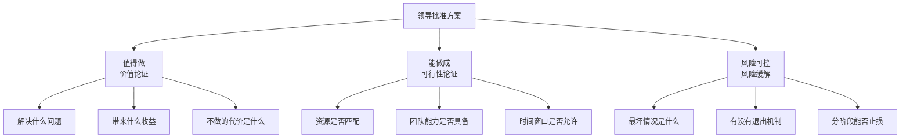
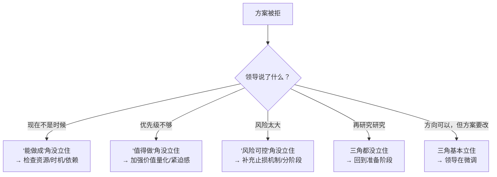
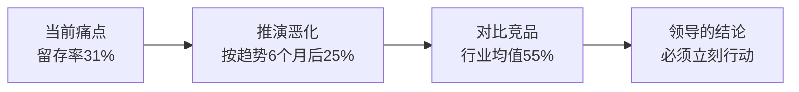
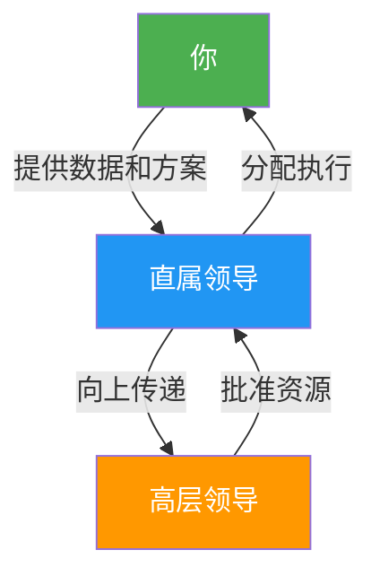
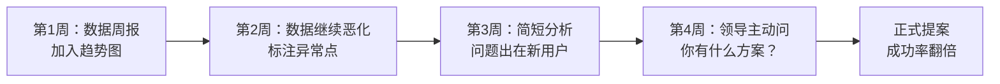
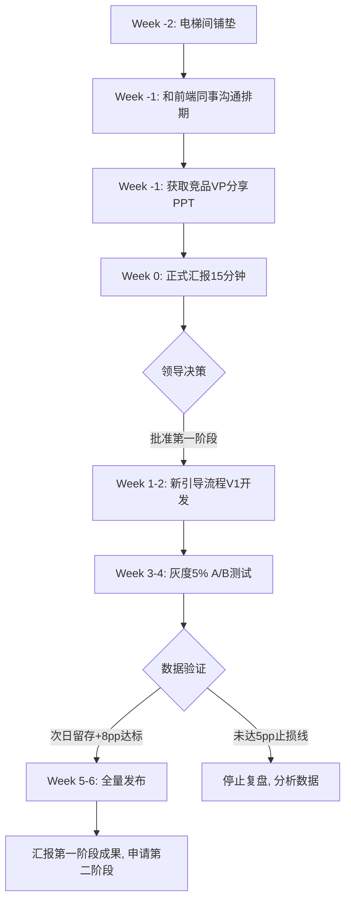

## 场景二：向上管理——说服领导批准你的方案

向上管理是职场说服力中最关键、也最具挑战性的场景。与平级说服不同，向上管理涉及**权力不对称**——领导掌握资源分配权、决策权和对你职业发展的影响力。你不能"说服"领导，你只能让领导"自己想通"。本节将系统拆解向上管理的底层逻辑、决策心理、实操方法和避坑指南，覆盖从初级员工到高级管理者的全职业周期。

### 为什么向上管理如此困难

#### 三重结构性矛盾

向上管理的难度源于三个结构性矛盾：

| 矛盾 | 表现 | 核心障碍 |
|--------|------|----------|
| 信息不对称 | 你掌握执行细节，领导掌握战略全局 | 你以为重要的事，领导视角可能不重要 |
| 风险不对称 | 方案失败你的损失有限，领导承担更大责任 | 领导天然倾向保守，因为失败成本更高 |
| 激励不对称 | 你想推新方案获得成就感，领导要稳定交付 | 领导对"创新"的态度取决于犯错空间 |

理解这三重不对称，是做好向上管理的前提。你不是在对一个"不懂行"的人做科普，你是在帮助一个承担更大风险的决策者降低决策成本。

#### 中国职场的隐性规则

在中文语境下做向上管理，还有几层西方管理学不常讨论的隐性规则：

**面子机制。** 领导在公开场合被下属"教育"，即使内容正确也会产生抵触。永远不要在有第三人在场的情况下指出领导的判断有误。给领导留面子不是虚伪，是组织运转的润滑剂。

**关系先行。** 中国职场的信任建立路径是"先做人，再做事"。如果你和领导之间没有足够的信任储备，再完美的方案也可能被否。信任是向上管理的"隐性货币"，需要在日常中持续积累——按时交付、主动补位、在关键时刻站队正确。

**层级敏感度。** 越级汇报在多数中国组织中是大忌。即使你的直属领导能力平庸，绕过他直接向高层提方案，等于在组织中宣判了他的死刑，也等于给自己树立了一个永久的敌人。

**含蓄表达。** "领导，这个方案可能还有些不成熟的地方"比"我的方案完美无缺"更容易被接受。适度的谦逊不是示弱，而是给领导"指导你"的空间，让他觉得自己在决策中发挥了作用。

### 向上管理的理论基础

#### Cialdini 六大影响力原理在向上管理中的应用

Robert Cialdini 在《影响力》中提出的六大原理，在向上管理场景中有特定的应用方式：

| 原理 | 向上管理应用 | 实操示例 |
|------|-------------|----------|
| **互惠** | 先帮领导解决一个难题，再提你的方案 | "上次数据危机我连夜处理了，顺便我也发现了一个长期优化机会……" |
| **承诺与一致** | 让领导先承认问题存在，再引出方案 | "您上周也提到留存率是个问题，我做了一些深入分析……" |
| **社会认同** | 用同行/竞品的成功案例证明方案可行 | "行业前三的公司都已经在做了，XX公司的VP上周分享了数据……" |
| **权威** | 引用权威数据源和专家观点 | "根据麦肯锡最新的行业报告……"、"我们的数据模型显示……" |
| **喜好** | 建立个人信任和好感，在轻松场合沟通 | 日常互动中展示专业性和可靠性 |
| **稀缺** | 制造紧迫感，强调时间窗口 | "这个窗口期只有3个月，竞品一旦先做，我们就变成追赶者" |

关键原则：**互惠和承诺一致是最强的两个武器。** 先帮领导解决问题（互惠），再让领导亲口承认某个问题存在（承诺一致），此时提出方案，领导的心理防线已经降低了大半。

#### Agency 理论视角

从委托-代理理论看，你和领导的关系本质上是**代理人向委托人汇报**。委托人（领导）面临的核心风险是：

1. **道德风险：** 代理人是否在为自己的利益而非组织利益行动？
2. **逆向选择：** 代理人是否掌握了委托人不知道的负面信息？

因此，你的方案被怀疑时，领导真正在想的往往不是"方案好不好"，而是"这个人是否可信"和"他是否在隐瞒什么"。

**应对策略：** 主动暴露方案的弱点。当你主动说"这个方案有一个风险是XX，我的应对方案是YY"，领导反而会更信任你——因为你展示了诚实和全局思考能力，降低了他心中的道德风险评估。

### 向上管理的底层逻辑：决策三角模型

任何领导批准方案，都需要满足三个条件——我们可以称之为"决策三角"：

**你的方案被拒，99%的情况是三角中至少有一个角没立住。** 领导说"现在时机不对"，本质是"能做成"角没立住；说"这个优先级不够"，是"值得做"角没立住；说"风险太大"，是"风险可控"角没立住。

向上管理的本质工作，就是在开口之前，把三个角都立住。

#### 决策三角的诊断框架

当你不确定方案被拒的真实原因时，用这个诊断框架：

### 第一步：读懂你的领导——四种决策风格与应对策略

向上管理最大的错误是"一招走天下"。不同领导的决策逻辑完全不同，你必须先识别领导的决策风格，再选择对应策略。

#### 分析型领导（数据驱动型）

**特征：** 重视数据、逻辑严密、讨厌模糊表述、喜欢追问细节。

**识别信号：**
- 开会时经常问"数据来源是什么""样本量多大"
- 报告中划出每一个不精确的表述
- 决策前要反复对比多个方案

**应对策略：**
- 准备详尽的数据报告，每一个结论都有数据支撑
- 预判他会追问的10个问题，提前准备好答案
- 用对比表格呈现方案，而非叙述性文字
- 提供数据来源和方法论说明

**话术模板：**
> "我分析了过去6个月的用户数据，样本量覆盖了全量320万活跃用户。核心发现是：首次体验完成率低于40%的用户，30天留存仅为12%；而完成率高于70%的用户，30天留存达到58%。两者相差4.8倍。基于这个数据，我建议优先优化引导流程的第一到第三步。"

**禁忌：** 不要用"我觉得""我感觉""行业趋势是"这类模糊表述。分析型领导听到这些，大脑会自动降低你的可信度。

**反直觉提醒：** 分析型领导虽然重数据，但如果你给的数据太多，他会陷入细节无法决策。学会在数据的"深度"和"可操作性"之间平衡——给3个关键数据点比给30个数据点更有效。

#### 愿景型领导（战略驱动型）

**特征：** 关注大方向、喜欢创新、对细节不耐烦、决策靠直觉和格局。

**识别信号：**
- 开会时喜欢说"我们能不能做得更大""这跟公司战略的关系是什么"
- 快速做决策，但可能对执行难度估计不足
- 对竞争对手的动态非常敏感

**应对策略：**
- 先讲战略价值和行业趋势，再讲具体方案
- 用"如果我们不做，竞争对手会怎样"来激发紧迫感
- 方案要大胆，但执行计划要务实
- 准备一个"理想版"和一个"务实版"，让领导选择

**话术模板：**
> "这个方案的战略价值在于，它能让我们在留存率上从行业第7提升到前3。目前行业内只有两家公司在做类似的用户引导重构，如果我们现在启动，可以在6个月内建立先发优势。如果等到竞品都做了我们再跟进，就变成了追赶者。"

**禁忌：** 不要一开始就铺陈大量细节数据。愿景型领导会在第三页数据中失去耐心，还没看到你的核心论点就否决了。

**隐藏陷阱：** 愿景型领导容易"过度承诺"——他觉得方案好，可能会给你安排超出实际能力的资源或时间表。在获得批准后，务必用书面形式确认具体资源和时间节点，避免事后扯皮。

#### 支持型领导（关系驱动型）

**特征：** 重视团队感受、害怕冲突、决策谨慎、倾向于维持现状。

**识别信号：**
- 经常说"大家意见怎么样""会不会影响团队节奏"
- 做决策时会征求多方意见
- 对可能引起团队不满的方案特别谨慎

**应对策略：**
- 先获取团队中关键人物的支持，形成"多数人意见"
- 强调方案对团队的正面影响（减负、成长机会）
- 用"我们"代替"我"，营造集体决策的感觉
- 降低方案的"冲击感"，用渐进方式提出

**话术模板：**
> "我和前端、后端的几个同事分别聊了这个想法，大家普遍认为当前的引导流程确实存在优化空间。我们初步的共识是，如果分阶段推进，不会对现有排期造成太大冲击。第一阶段只需要前端团队配合两周，后端基本不用改。"

**禁忌：** 不要搞突然袭击。支持型领导最讨厌"你私下搞了个大方案然后来逼我表态"的感觉。提前沟通、提前铺垫、提前获取支持者。

**深层策略：** 支持型领导做决策依赖"安全感"。你需要成为他的安全感来源——让他觉得"这件事有人兜底"。话术上可以说"我会全程跟进，有任何问题第一时间向您汇报"。

#### 指令型领导（效率驱动型）

**特征：** 果断、高效、不喜欢废话、重视结果、对过程不感兴趣。

**识别信号：**
- 开会时说"直接说结论""需要我做什么决策"
- 报告只看摘要和结论页
- 对长篇大论明显不耐烦

**应对策略：**
- 结论前置：第一句话就告诉领导你要什么
- 方案用一页纸呈现，细节放附录
- 给出明确的选项（A/B/C），而非开放式讨论
- 准备好"如果领导问就展开，不问就到此为止"的弹性方案

**话术模板：**
> "我有一个方案可以将月流失用户减少40%，需要一个团队6周时间。预期投入产出比是1:8。详细分析在附录，需要我现在过一下吗？"

**禁忌：** 不要用"我来给大家讲一下背景"开场。指令型领导听到这句话已经在想"这个人要浪费我20分钟"。

**高阶技巧：** 指令型领导通常只给3-5分钟窗口。用"电梯演讲"框架准备——30秒说清问题，30秒说清方案，30秒说清收益，30秒说清风险。如果30秒内没有引起兴趣，后面的15分钟都是浪费。

#### 如何应对混合型领导

现实中，很少有领导是纯粹的单一类型。多数领导是混合型，比如"分析+指令"（要数据但不想看太多）或"愿景+支持"（要大方向但也考虑团队感受）。

**混合型领导识别方法：**

1. 观察他在不同场景下的表现——对上级是什么风格，对下属是什么风格，开会时是什么风格
2. 注意他的"切换信号"——当他开始问细节，切换到分析模式；当他说"这个方向对"，切换回愿景模式
3. 准备"分层材料"——一页纸（给指令型时刻）、完整报告（给分析型时刻）、战略概览（给愿景型时刻）

### 第二步：构建不可拒绝的方案论证

#### 价值论证：回答"为什么要做"

价值论证不是说"这个很重要"，而是要让领导自己得出"这个必须做"的结论。核心方法是**痛点放大法**——不是描述问题有多严重，而是让领导感受到不解决的代价。

**三步痛点放大法：**

1. **量化现状痛点：** 用具体数据描述问题的规模和影响
2. **推演恶化趋势：** 如果不解决，3个月/6个月/1年后会怎样
3. **对比竞品差距：** 行业标准是什么，我们差多少

**反面教材 vs 正确示范：**

| 反面教材 | 正确示范 |
|----------|----------|
| "用户留存率在下降，我们需要优化引导流程" | "30天留存从42%跌到31%，每月流失12万用户，按35元获客成本算，月损失420万。按当前趋势，6个月后留存会跌到25%，届时LTV模型会崩，直接影响融资估值" |
| "竞品做得比我们好" | "行业头部30天留存均值55%，我们是31%，差距24个百分点。这意味着同样的获客投入，他们的用户价值是我们的1.8倍" |

**价值论证的"不做的代价"框架：**

很多人的价值论证只说"做了有什么好处"，但更有力的论证是"不做会损失什么"。心理学上，人对损失的敏感度是收益的2-2.5倍（前景理论，Kahneman & Tversky）。

做了：留存率提升14pp，月增收200万 ← 收益框架
不做：月损失420万，6个月后LTV模型崩溃 ← 损失框架（更有说服力）

#### 可行性论证：回答"能不能做成"

可行性论证的关键不是"我们能做到"，而是"我们已经想清楚了每一步怎么做"。

**可行性论证清单：**

- [ ] **资源需求明确：** 需要几个人、多长时间、多少预算，精确到周
- [ ] **依赖关系梳理：** 需要哪些团队配合，他们是否有排期
- [ ] **能力匹配评估：** 团队是否具备所需技能，是否需要外部支持
- [ ] **里程碑规划：** 每个阶段的交付物和验收标准
- [ ] **历史先例参考：** 公司内部或行业内是否有类似成功案例

**制作"可行性一页纸"：**

┌─────────────────────────────────────────────┐
│           方案可行性摘要                      │
├─────────────────────────────────────────────┤
│ 项目目标：将30天留存从31%提升至45%             │
│ 所需资源：前端3人 + 后端1人，6周               │
│ 关键依赖：设计团队（已确认排期）、数据团队（已对齐）│
│ 里程碑：                                      │
│   Week 1-2：新用户引导流程 V1 开发完成          │
│   Week 3-4：A/B测试上线，灰度5%用户            │
│   Week 5-6：数据验证 + 全量发布                │
│ 预期收益：次日留存+8pp，30天留存+14pp           │
│ 先例参考：XX公司同类优化留存提升22%              │
└─────────────────────────────────────────────┘

**可行性论证的"已经在做"策略：**

最强的可行性论证不是"我们可以做"，而是"我们已经在做了"。如果你能在汇报时说"我已经用业余时间做了一个小规模测试，数据显示方向是对的"，可行性论证直接完成——因为你已经证明了它可行。

汇报前：用个人时间做一个最小化验证（1-2天的工作量）
汇报时："我花了一个周末做了一个概念验证，数据如下……"
效果：可行性从"推测"变成"已验证"

#### 风险缓解：回答"出了问题怎么办"

领导批准方案的最大障碍不是"这个方案不好"，而是"出了问题我怎么交代"。你必须帮领导消除这个顾虑。

**五层风险缓解策略：**

| 层级 | 策略 | 示例 |
|------|------|------|
| 第一层 | 分阶段实施，每阶段独立止损 | "第一阶段6周完成，效果不达标就停，不会影响主业务" |
| 第二层 | A/B测试验证，用数据说话 | "5%灰度发布，数据不达标立刻回滚" |
| 第三层 | 设置止损指标和触发机制 | "如果次日留存没有提升5pp，自动触发回滚" |
| 第四层 | 预留缓冲资源和应急方案 | "预留1周buffer，如果进度延迟可以砍掉P3功能" |
| 第五层 | 把失败变成学习 | "即使效果不达预期，我们也能拿到用户行为数据，为下次优化提供依据" |

**话术模板：**
> "关于风险控制，我的建议是分三步走。第一步6周内只做新用户引导的核心路径优化，灰度5%用户。如果次日留存提升不到5个百分点，我们就停下来复盘，不会影响主业务。这5个百分点的止损线我写在了方案里，您看一下是否合理。"

**"给领导留退路"话术：**

在中国职场中，风险缓解还需要一层额外的技巧——**帮领导准备好"如果失败了怎么说"**。

"这个项目我们是以'探索性试点'的名义推进的，
即使结果不达预期，对外也可以说是'有计划的实验'，
不会影响团队整体的OKR完成率。"

这句话消除了领导最隐秘的焦虑："如果失败了，我在上级面前怎么交代？"

### 第三步：完整的说服对话模拟

以下是一个完整的向上管理对话模拟，展示从铺垫到收尾的全流程。

#### 对话前的准备清单

- [ ] 了解领导近期最关心的1-2个KPI
- [ ] 准备好3个层次的材料（一页纸 / 简版报告 / 完整报告）
- [ ] 提前和2-3个关键同事对齐立场
- [ ] 选择领导心情较好、工作不太紧急的时间
- [ ] 准备好"如果被拒"的备选方案
- [ ] 模拟演练至少一次，让同事用最刁钻的角度挑战你
- [ ] 准备好所有数据的来源文档（以防领导追问）

#### 完整对话过程

**第一阶段：铺垫（非正式场合）**

在正式汇报前1-2周，通过日常沟通完成铺垫：

> **赵婷（电梯间偶遇领导）：** "王总，上周数据周报您看了吗？留存率那个数字挺触目惊心的，我最近在研究这个问题，发现了一些有意思的规律。"
>
> **领导：** "嗯，确实是个问题。你研究出了什么？"
>
> **赵婷：** "我发现问题可能不在产品功能本身，而在新用户的前30分钟体验。等我把数据整理清楚，跟您详细汇报一下。"

**目的：** 让领导对问题产生初步认知，为正式汇报"预热"。心理学上这叫**曝光效应**——人们对重复接触的信息更容易接受。Cialdini的**承诺一致**原理也在此起作用——领导一旦口头承认"确实是个问题"，后续就很难说"这个问题不重要"。

**第二阶段：正式汇报**

> **赵婷：** "王总，关于用户留存率下降的问题，我做了一份分析，需要大概15分钟和您过一下，可以吗？"
>
> **（获得许可后）**
>
> **赵婷：** "先说结论：我有一个方案可以在6周内将次日留存提升8个百分点，需要前端团队3个人配合。这是分析报告和方案概要。"
>
> **（递上一页纸方案，等待领导快速浏览）**
>
> **领导：** "8个百分点？你怎么得出这个数字的？"
>
> **赵婷：** "两个依据。第一，我们对320万活跃用户的行为数据做了分析，发现首次体验完成率和留存率的相关系数是0.73——完成率每提升10个百分点，30天留存提升约4.2个百分点。第二，XX公司去年做了类似的优化，他们的产品VP在上周行业峰会上分享了数据，留存提升了22%。他们的分享PPT我拿到了，需要的话可以发给您。"
>
> **领导：** "现在团队排期这么紧，哪有人手做这个？"
>
> **赵婷：** "这个问题我想过。第一阶段只需要前端团队，不涉及后端改动。我和前端的李明聊过，他的团队有两个同学下周刚好有一个项目的gap期，可以先启动。另外，第一阶段只做新用户的核心引导路径，不是全量重构，工作量可控。"
>
> **领导：** "万一做完效果不好呢？"
>
> **赵婷：** "我设了一个止损线：灰度5%用户，如果次日留存提升不到5个百分点，就停下来复盘，不会影响主业务。而且即使效果不完全达标，我们至少能拿到用户行为的详细数据，知道用户到底在哪一步流失的，这对后续任何优化都有价值。"
>
> **领导：** "（思考片刻）先做第一阶段吧，6周后看数据再说。"

**对话分析：** 赵婷的整个过程遵循了决策三角模型——先用数据立住"值得做"（留存下降→成本损失），再用资源方案立住"能做成"（前端团队可用、分阶段实施），最后用止损机制立住"风险可控"（灰度发布+止损线）。

**第三阶段：确认与跟进**

批准不是终点。汇报结束后24小时内，发一封确认邮件：

主题：【确认】用户引导优化项目第一阶段方案

王总，

感谢今天的沟通。确认以下要点：

1. 项目范围：新用户引导核心路径优化（第一阶段）
2. 资源投入：前端3人，6周
3. 止损指标：灰度5%用户，次日留存提升<5pp则暂停
4. 启动时间：下周一开始
5. 预期交付：Week 6完成数据验证和全量发布决策

如有任何需要调整的地方，请随时告诉我。

赵婷

**为什么要发确认邮件？** 三个原因：(1) 防止领导事后"我没说过这个"；(2) 展示你的专业性和执行力；(3) 为后续汇报建立基准线。

### 第四步：书面沟通模板

向上管理不仅发生在口头对话中，书面沟通同样重要。

#### 申请资源的邮件模板

主题：关于[项目名]的资源申请——[一句话价值]

[领导称呼]，

【背景】
[用1-2句话描述问题，必须有数据]

【方案概述】
[用1-2句话描述方案，包含时间和资源需求]

【预期收益】
- [收益1：量化]
- [收益2：量化]

【风险控制】
- 止损线：[具体指标]
- 灰度策略：[具体比例]

详细分析报告见附件。

如方便，希望能在[具体时间]和您当面讨论。

[你的名字]

#### 向上汇报的周报模板（为方案铺路用）

【数据异常/趋势】
留存率本周继续下滑0.3pp，已连续4周下降。
[附趋势图]

【初步分析】
问题集中在新用户第一周，[具体发现]。

【下一步】
计划做更深入的用户行为分析，预计下周出结论。

**作用：** 这不是汇报方案，而是"喂养"领导对问题的认知。持续4-6周后，领导会主动问你"有什么解决方案"——此时你的说服已经成功了一半。

### 第五步：必须避开的七大陷阱

#### 陷阱一：只讲方案，不讲问题

**错误示范：** "我设计了一套新的用户引导流程，需要开发团队支持。"

**为什么错：** 领导的第一反应是"你凭什么认为现在的问题需要你的方案来解决"。你跳过了"为什么要做"这一步。

**正确做法：** 先用数据建立"问题共识"，再引出方案。领导必须先认同"这是个问题"，才会关心"怎么解决"。

**心理学原理：** 这对应Cialdini的"承诺一致"原理。当领导亲口说出"确实，留存率是个问题"，他在心理上就已经向"解决问题"的方向迈出了一步，后续更难拒绝具体方案。

#### 陷阱二：只给一个选项

**错误示范：** "我建议做方案A。"

**为什么错：** 只给一个选项会让领导觉得你在逼他表态，没有选择余地。领导会本能地产生抵触心理。

**正确做法：** 准备2-3个方案，给出明确的推荐和理由。让领导做"选择题"而不是"判断题"。选择题让领导感觉掌控全局，判断题让领导感觉被你推着走。

**方案设计模板：**

方案A（推荐）：投入一个团队6周，预期次日留存+8pp，投入产出比1:8
方案B（保守）：投入两个开发2周，只做第一阶段优化，预期次日留存+3pp
方案C（激进）：投入两个团队3个月，全量重构引导流程，预期30天留存+20pp

推荐方案A，原因：投入可控，效果明确，风险最低。

**高级技巧：** 三个方案中，方案A是"你真正想要的"，方案B是"明显太保守"的陪衬，方案C是"明显太激进"的陪衬。领导在对比中自然会倾向方案A——这是锚定效应的经典应用。

#### 陷阱三：用"专业术语"建立权威

**错误示范：** "我们需要对新用户的onboarding流程做growth hacking，通过nudge机制提升activation rate。"

**为什么错：** 领导可能不懂这些术语，但他不会承认不懂——他会认为你在"炫技"或者故意让他难堪。

**正确做法：** 用领导能理解的语言解释专业概念。如果必须用术语，给出一句话解释。

**翻译对照表：**

| 专业术语 | 领导能听懂的表达 |
|----------|-----------------|
| Onboarding | 新用户第一次使用产品的完整体验 |
| Growth hacking | 低成本的快速增长策略 |
| Nudge | 轻推，用小设计引导用户行为 |
| Activation rate | 用户完成关键动作的比率 |
| Retention | 用户持续使用产品的比例 |
| LTV（Lifetime Value） | 一个用户在整个使用周期内贡献的总价值 |

#### 陷阱四：在错误的时机开口

**错误时机清单：**
- 领导刚被上级批评完
- 公司正在裁员或预算紧缩期
- 季度末/年末冲刺期
- 领导刚开完一个冗长的会议
- 你在公开场合突然抛出方案

**正确时机：**
- 领导刚完成一个重要目标，心情较好
- 你刚完成一个出色的工作，领导对你的信任度最高
- 非正式场合的轻松对话中自然引入
- 你提前预约了专门的沟通时间

**时机选择的"窗口期"理论：**

最佳的提案时机不是随机的，而是有规律可循：

窗口期1：领导刚完成一个重要里程碑（如季度目标达成）
         → 心态放松，对新想法的接受度最高

窗口期2：数据恶化到临界点（如KPI连续3周不达标）
         → 领导开始焦虑，急需解决方案

窗口期3：竞品有了新动向（如竞品发布了类似功能）
         → 外部压力驱动内部行动

窗口期4：组织架构调整期（如新领导上任、团队重组）
         → 新领导需要快速出成绩，对创新方案更开放

#### 陷阱五：没有预演反对意见

**错误做法：** 准备了方案就直接去讲，被领导一问就卡壳。

**正确做法：** 预判领导可能提出的5-10个反对意见，提前准备好回答。找一个信任的同事做模拟演练，让他用最刁钻的角度挑战你。

**常见反对意见预判清单：**

| 领导可能说 | 他真正担心的是 | 你的回答策略 |
|------------|----------------|-------------|
| "现在不是时候" | 资源不足或有更高优先级 | "理解排期紧张，所以我建议只用前端团队的gap期，不增加额外负担" |
| "数据不够充分" | 担心你拍脑袋决策 | "我补充了更多数据维度，这是详细分析报告" |
| "之前有人提过类似方案失败了" | 担心重蹈覆辙 | "我了解了上次失败的原因，这次方案专门做了针对性调整" |
| "投入太大" | 预算/资源压力 | "我准备了一个最小化方案，只需要X资源" |
| "回报不确定" | ROI无法保证 | "我设置了止损机制，最坏情况是损失X，但能获得Y数据" |
| "这个谁来负责？" | 担心没有人兜底 | "我愿意作为项目负责人，每周向您同步进展" |
| "其他部门会怎么看？" | 担心跨部门协调成本 | "我已经和XX部门的同事沟通过了，他们表示支持" |

**模拟演练的方法：**

1. 找一个了解业务的同事，给他10分钟看你的方案
2. 让他扮演"最刁钻的领导"，连续追问
3. 记录所有你回答不好的问题
4. 针对这些问题准备更好的回答
5. 再演练一次，直到所有问题都能流畅回答

#### 陷阱六：方案被改得面目全非后放弃

**现实情况：** 领导批准了，但把你的方案改了50%，你觉得改完的版本根本不会有效果。

**错误反应：** "既然改成这样了，那算了。"或者"好吧，您说了算"（消极执行）。

**正确做法：**
- 区分核心部分和可妥协部分。你的方案中真正不可替代的是什么？守住核心，放手边缘。
- 用数据说明为什么某个关键环节不能改。
- 如果必须改，请求"先按原来的方案小范围验证，再决定是否推广"。

**核心 vs 边界的判断框架：**

核心部分（必须守住）：
├── 方案的目标和成功标准
├── 关键的数据指标和止损线
└── 不可替代的技术路径

可妥协部分（可以放手）：
├── 实施时间表（推迟2周没关系）
├── 资源配置方式（换人没关系）
├── 非核心功能的取舍
└── 汇报频率和形式

#### 陷阱七：被拒后就放弃了

**现实情况：** 领导说"现在不行"。

**错误反应：** 默默放弃，再也不提。

**正确做法：**
- 追问原因："我理解，方便说一下主要是哪方面的顾虑吗？是资源、时机还是方案本身的问题？"
- 记录下来，针对性补充。
- 3-4周后带着更完善的方案再次提出，或者等到外部条件变化时（竞品动了、数据继续恶化、领导的KPI压力变了）再开口。
- 很多成功的方案都是"第二次开口"才通过的。第一次开口的价值在于：让领导知道了这个问题和你的解决方案。第二次开口时，领导已经有了心理准备。

**被拒后的"二次攻势"策略：**

第一次被拒
    ↓
记录拒绝原因（资源？时机？方案本身？）
    ↓
针对性补充（补数据/减资源/换时机）
    ↓
等待条件变化（数据恶化/竞品动作/领导KPI变化）
    ↓
第二次开口（用新的信息触发重新评估）
    ↓
如果再拒 → 考虑方案本身是否需要大改，或是否应该换赛道

### 第六步：不同职业阶段的策略差异

向上管理不是一招走天下。初级员工和高级管理者的策略完全不同。

#### 初级员工（1-3年经验）

**核心挑战：** 信任储备不足，领导可能不认为你有足够的判断力。

**策略重点：**
- **用数据说话，不凭经验。** 你没有足够的经验背书，数据是你唯一的武器。
- **小切口，大展示。** 不要一上来就提大方案，先在小问题上展示你的分析能力和执行力。
- **借力打力。** 引用行业报告、权威数据、竞品案例来增加可信度。
- **找到"导师型"领导。** 有些领导喜欢指导下属成长，这类领导对初级员工的方案更包容。

**话术调整：**
初级员工应避免："我认为我们应该……"（缺乏权威）
初级员工应该说："根据数据/行业报告/竞品案例……"（有据可依）

#### 中级员工（3-8年经验）

**核心挑战：** 有一定信任储备，但领导可能把你定位为"执行者"而非"决策者"。

**策略重点：**
- **从"提方案"升级到"提战略"。** 不只说"怎么做"，还要说"为什么做"和"做了之后怎么发展"。
- **建立跨部门影响力。** 中级员工的方案往往需要跨部门协作，你需要展示你的协调能力。
- **培养"向上管理"的直觉。** 多观察领导的决策模式，建立自己的判断库。
- **适度"越权"但不"越级"。** 可以做超出岗位职责的事（展示潜力），但不要绕过直属领导。

#### 高级员工/管理者（8年以上经验）

**核心挑战：** 你的方案可能威胁到领导的地位或挑战他的判断。

**策略重点：**
- **让领导成为"方案的共同作者"。** 不要让领导觉得这是你的方案，而是"我们一起想出来的方案"。
- **关注政治风险。** 高层级的方案涉及更多利益方，你需要评估谁会支持、谁会反对。
- **学会"做减法"。** 高级管理者容易陷入"方案太大"的陷阱——你以为方案越全面越容易获批，实际上方案越大，被攻击的面积越大。
- **考虑领导的领导。** 你的领导也需要向他的领导汇报。帮他准备好"向上传递"的材料。

### 第七步：多层级说服——当你的领导也需要被说服

很多时候，你的直属领导不是最终决策者。他可能也需要说服他的领导。此时你的角色不仅是"方案提出者"，还要成为"领导的弹药库"。

#### "弹药库"策略

**你要做的：**

1. **准备好领导可以直接用的材料。** 不要给领导一份需要他重新整理的报告，给他一份他可以直接转发给上级的材料。
2. **预判高层领导的问题。** 你的直属领导可能会被高层追问，帮他准备好回答。
3. **简化信息。** 信息每经过一个层级，就会被压缩一次。确保你的核心论点能在30秒内传递。
4. **给领导提供"向上汇报"的话术。** 比如："如果李总问为什么要做这个，您可以说'这是基于320万用户数据的分析结论，投入产出比1:8'。"

#### 多层级说服的时机选择

你的方案需要多个层级批准时：

Step 1：先搞定直属领导（1v1）
Step 2：帮直属领导准备向上传递的材料
Step 3：如果可能，参加直属领导的汇报（作为"技术支持"）
Step 4：高层批准后，和直属领导一起确认执行细节

绝对不要：绕过直属领导直接找高层
原因：(1) 毁掉和直属领导的信任 (2) 高层可能尊重层级体系而拒绝你 (3) 即使成功，你也给自己树了一个敌人

### 第八步：行业差异化场景

#### 互联网/科技公司

**特点：** 扁平化组织、数据驱动、迭代思维、OKR导向。

**策略重点：**
- 用A/B测试数据说话，"小步快跑，快速验证"
- 方案包装成"实验"而非"改革"，降低组织阻力
- 利用内部工具（数据看板、用户反馈系统）建立论证

**话术示例：**
> "我建议用2周做一个MVP，灰度5%用户跑A/B test。如果数据验证了假设，再申请资源扩大规模。"

#### 传统企业/国企

**特点：** 层级分明、流程规范、风险厌恶、关系导向。

**策略重点：**
- 正式流程比非正式沟通更重要——写正式的方案书
- 先建立关系再提方案——领导不认识你时不要提大方案
- 方案要"稳"不要"新"——包装成"优化"而非"颠覆"
- 引用政策文件、上级指示来增加合法性

**话术示例：**
> "根据集团下发的数字化转型指导意见，我对照了我们的现状，发现有几个方面可以优化……"

#### 外企

**特点：** 矩阵式组织、英文汇报文化、强调ROI和stakeholder management。

**策略重点：**
- 用ROI、NPV、IRR等财务指标量化方案价值
- 做stakeholder mapping，识别所有利益相关者
- 用executive summary格式，第一段就给出结论
- 准备好Q&A文档（FAQ），预判所有可能的问题

#### 创业公司

**特点：** 资源极度有限、创始人主导决策、速度优先。

**策略重点：**
- 用最小资源验证最大假设
- 直接找创始人/CEO谈，层级障碍少
- 强调"如果现在不做，机会窗口就关了"
- 准备好"零成本起步"的方案

### 进阶技巧：高阶向上管理

#### 预算管理法：让领导主动找你

最高级的向上管理不是"说服领导批准你的方案"，而是"让领导主动来问你有什么方案"。

**方法：** 定期用数据"喂养"领导对问题的认知。每周在数据周报中加入留存率的趋势图，在旁边加一句"持续关注中，下周提供分析报告"。不需要推荐方案，只需要让领导知道问题在恶化。当领导主动问"你有什么解决方案"时，你的说服已经成功了一半。

#### 向上管理的"预批准"技术

在正式提出方案之前，通过多次非正式沟通，逐步获取领导对方案各个要素的"预批准"：

1. **第一次沟通：** "您觉得用户留存这个问题值得投入资源解决吗？"（获取对问题的认同）
2. **第二次沟通：** "如果要做的话，您觉得前端团队能配合吗？"（获取对资源的预判）
3. **第三次沟通：** "我初步想了两个方向，您觉得哪个更合适？"（获取对方案方向的认可）
4. **正式汇报：** 整合以上所有已获取的认可，形成完整方案。

这个方法的核心是**分解决策难度**。让领导在每一次小沟通中做一个小决定，远比让他一次性批准一个大方案容易得多。

**心理学解释：** 这利用了"登门槛效应"（Foot-in-the-door technique）。一旦领导同意了一个小请求（"这个问题值得解决"），他就更倾向于同意后续的大请求（"给我一个团队来做"），因为他需要保持自我认知的一致性。

#### 借力打力：利用组织力量

- **获取同级支持：** 在正式汇报前，先和其他部门的同事沟通，获取他们的支持。汇报时说"我和XX部门已经对齐了"，领导会觉得这是"组织共识"而非你的"个人提案"。
- **利用外部压力：** 如果竞品在做类似的事，或者行业报告提到了这个趋势，把这些信息自然地传递给领导。外部压力比内部提议更有说服力。
- **向上级的上级传递信号：** 如果你的领导比较保守，可以通过跨级沟通（比如在高层会议上做数据分享），让更高层的领导意识到这个问题。当你的领导从上级那里收到"这个问题要关注"的信号时，他会主动来找你。
- **利用客户/用户的反馈：** 如果你能收集到用户对当前问题的投诉或反馈，把这些声音传递给领导。领导可以忽略你的建议，但很难忽略客户的声音。

### 案例完整复盘

让我们回到赵婷的案例，完整复盘她的每一步决策：

**赵婷做对了什么：**

1. **提前铺垫：** 在正式汇报两周前就让领导知道了问题的存在（曝光效应+承诺一致）
2. **数据先行：** 每一个论点都有数据支撑，不是"我觉得"
3. **翻译语言：** 把产品语言翻译成领导关心的KPI和成本语言
4. **分阶段降低风险：** 不是要求一步到位，而是先做最小投入获取最大验证
5. **借力权威：** 用竞品的成功案例增强可信度（社会认同原理）
6. **预判反对：** 对领导可能的每个顾虑都提前准备了回应
7. **设置止损：** 让领导知道最坏情况可控，而且"给领导留了退路"
8. **及时确认：** 汇报后发确认邮件，锁定决策成果

**如果赵婷做错了某一步会怎样：**

| 错误做法 | 可能后果 |
|----------|----------|
| 没有铺垫直接汇报 | 领导毫无准备，本能反应是"再说吧" |
| 只说"留存在下降"不给数据 | 领导觉得问题可能没那么严重 |
| 要求两个团队三个月全量重构 | 领导听到资源需求就否决了 |
| 不提止损机制 | 领导担心失败后果不可控 |
| 在领导刚被批评后提出 | 领导心情不好，直接拒绝 |
| 被拒后就放弃 | 错过3个月后数据进一步恶化时的最佳时机 |
| 绕过直属领导找高层 | 即使方案获批，也树立了永久敌人 |

### 向上管理自检清单

在开口之前，用这个清单自检：

- [ ] **问题共识：** 领导是否已经认同"这是一个需要解决的问题"？
- [ ] **价值量化：** 我能否用一句话说清"做了能省/赚多少，不做会损失多少"？
- [ ] **资源可行：** 所需资源是否在领导可控范围内？
- [ ] **风险可控：** 我是否准备好了"最坏情况"的应对方案？
- [ ] **方案选项：** 我是否准备了至少2个方案供领导选择？
- [ ] **反对预判：** 我是否预判了领导的5个反对意见并准备了回应？
- [ ] **时机合适：** 领导现在是否有精力和意愿听我讲完？
- [ ] **支持网络：** 我是否提前获取了关键同事的支持？
- [ ] **备选方案：** 如果被拒，我的Plan B是什么？
- [ ] **领导风格：** 我是否识别了领导的决策风格并调整了沟通方式？
- [ ] **向上材料：** 我是否准备好了领导可以向上传递的材料？

**评分标准：** 如果有3项以上未勾选，建议暂缓开口，先补齐准备工作。

### 常见误区总结

| 误区 | 正确认知 |
|------|----------|
| "方案好就能获批" | 方案好只是基础，时机、关系、包装同样重要 |
| "领导不批是领导的问题" | 先反思自己的方案论证是否有漏洞 |
| "被拒了说明领导不支持" | 被拒可能只是时机不对或准备不足 |
| "数据越多越有说服力" | 3个关键数据点比30个数据点更有效 |
| "向上管理就是拍马屁" | 向上管理是降低领导决策成本的专业能力 |
| "只有领导喜欢的人才能成功" | 信任可以系统性建立，不是天赋 |
