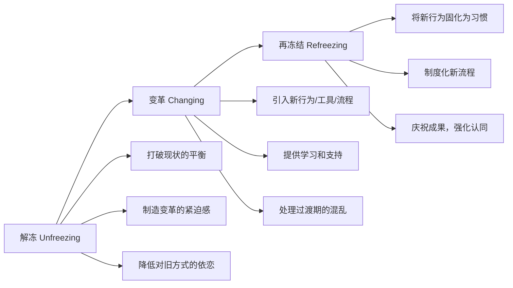
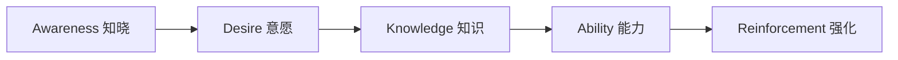
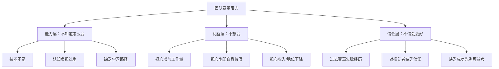
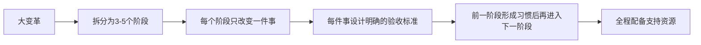

## 场景三：团队影响——推动团队接受变革

推动团队接受变革是说服与影响力领域最具挑战性的场景之一。与一对一说服不同，团队变革涉及群体动力学、组织政治、利益分配和文化惯性的多重博弈。一个人可以说服，但一群人需要被"转化"——这不仅是说服技巧的放大版，更是一门融合了组织行为学、社会心理学和变革管理的系统工程。

本节以一个完整的数字化转型案例为主线，系统拆解从诊断阻力到落地执行的全流程方法论，涵盖六大经典策略、三套诊断工具和一条可复用的变革路线图。

### 案例背景

张浩是一家传统零售企业的数字化部门负责人，公司在全国拥有120家门店。总部决定推行新的数字化运营系统，要求所有门店在六个月內完成上线。张浩的任务是说服一线门店店长接受这套系统。

这是一个典型的"自上而下推动、自下而上执行"的变革困境：决策者不在一线，执行者没有决策权，中间的推动者两头受压。

**问题诊断**

项目启动前，张浩做了两个关键动作：

1. **匿名问卷调研**：向120位店长发放问卷，回收107份（回收率89%，说明大家确实关心这个问题）。结果发现：
   - 68%的店长认为"新系统太复杂，学不会"
   - 52%的店长担心"增加工作量，影响本职业绩"
   - 31%的店长直言"以前推的系统都没用，这次也一样"
   - 只有15%的店长表示"愿意尝试"

2. **关键人物访谈**：张浩挑选了10位代表性店长进行一对一深度访谈（选择标准：不同区域、不同年龄段、不同业绩水平），发现抵触背后有三类核心诉求：
   - **能力焦虑**：年龄偏大的店长（40岁以上）对数字化工具有天然的畏惧感
   - **利益担忧**：系统上线后是否会增加考核指标、削减人手
   - **信任缺失**：过去总部推过两次系统，都因为体验差、没人维护而不了了之

这三类诉求分别对应变革阻力的三个层面——**不知道怎么变（能力层）、不想变（利益层）、不信会变好（信任层）**。张浩的说服策略必须同时覆盖这三个层面。

### 变革阻力诊断：多维模型

#### 经典理论框架

在设计说服策略之前，需要先理解变革阻力的理论根源。以下三个经典模型提供了不同的诊断视角：

**模型一：勒温（Lewin）三阶段模型**

库尔特·勒温在1947年提出的变革三阶段模型至今仍是变革管理的基石：

张浩的案例中，问卷调研和体验日就是"解冻"，渐进式培训是"变革"，支持体系和进度追踪是"再冻结"。很多变革失败的原因是跳过了"解冻"阶段——人们还沉浸在旧方式的舒适区中，直接被推入新系统，自然会产生强烈抵触。

**模型二：科特（Kotter）八步变革模型**

约翰·科特在《领导变革》中提出的八步模型是目前应用最广泛的变革管理框架：

| 步骤 | 核心动作 | 张浩的对应做法 |
|------|---------|--------------|
| 1. 制造紧迫感 | 让团队意识到不变不行 | 竞争对手数据对比（XX超市库存周转率快40%） |
| 2. 组建领导联盟 | 争取关键人物支持 | 识别5位意见领袖并逐一说服 |
| 3. 形成变革愿景 | 描述变革后的美好图景 | "省出2.3小时做更有价值的事" |
| 4. 传播变革愿景 | 反复沟通，覆盖全员 | 意见领袖分享+全员故事会 |
| 5. 授权行动 | 移除障碍，赋予能力 | 数字化教练+在线社区+降低学习门槛 |
| 6. 创造短期胜利 | 用快速成果证明变革有效 | 试点门店的效率数据 |
| 7. 巩固成果 | 避免过早宣布胜利 | 持续支持体系+进度追踪 |
| 8. 融入文化 | 让变革成为"新的常态" | 将系统使用纳入门店评优 |

**模型三：ADKAR 模型（Prosci）**

ADKAR 模型从个人层面分析变革成功的五个必要条件：

- **知晓（Awareness）**：为什么要变？——张浩用竞争对手数据和试点成果回答
- **意愿（Desire）**：我想变吗？——体验日让店长亲身感受效率差异
- **知识（Knowledge）**：怎么变？——渐进式培训，每次只教一个功能
- **能力（Ability）**：我能独立做到吗？——一对一教练手把手辅导
- **强化（Reinforcement）**：变好了会怎样？——正向激励+同伴社区+管理层认可

ADKAR 模型的诊断价值在于：它能帮你精确定位某个个体"卡"在了哪个环节。如果一个店长"知道"要变但"不想"变，问题在意愿层，需要解决利益和情感问题；如果"想"变但"不会"，问题在知识和能力层，需要培训和支持。

#### 三层诊断框架

综合以上模型，张浩构建了一个实操性的三层诊断框架：

**诊断工具：阻力来源矩阵**

| 阻力类型 | 表面说辞 | 深层原因 | 应对核心 | 对应ADKAR环节 |
|---------|---------|---------|---------|-------------|
| 能力焦虑 | "太复杂了" "我学不会" | 缺乏技能+害怕暴露不足 | 降低学习门槛+提供支持 | Knowledge/Ability |
| 利益担忧 | "增加了工作量" "没必要" | 担心投入得不到回报 | 明确收益+消除威胁 | Desire |
| 信任缺失 | "以前推过没用" "又是形式主义" | 过往失败+对推动者不信 | 先做后说+用事实说话 | Awareness/Reinforcement |
| 惯性依赖 | "现在这样挺好" "没必要改" | 舒适区+改变成本高 | 制造紧迫感+降低切换成本 | Awareness/Desire |
| 群体压力 | "其他人都不做" "等别人先试" | 从众心理+害怕出头 | 意见领袖带动+小范围示范 | Desire |

#### 变革情绪曲线：理解团队的心理历程

除了理性层面的阻力分析，还需要理解变革过程中团队的情绪变化。伊丽莎白·库伯勒-罗斯（Kübler-Ross）的情绪变化曲线同样适用于组织变革场景：

**关键认知**：变革推进过程中，团队满意度不会线性上升，而是会先下降再回升。张浩在项目第二个月观察到一个现象——部分已经"上手"的店长突然开始抱怨系统"不好用"。这不是系统退步了，而是他们进入了"焦虑/迷茫"阶段：基础功能会了，但面对更复杂的功能时又感到了无力感。

**应对策略**：在情绪最低谷期（通常是变革启动后第3-6周），需要加倍投入支持资源——增加教练频次、安排成功案例分享、管理层亲自到店鼓励。这个阶段放弃支持，前期所有努力都会付诸东流。

### 策略一：找到"意见领袖"先行突破

**理论基础：社会证明与扩散曲线**

罗杰斯（Everett Rogers）的创新扩散理论将人群分为五类：创新者（2.5%）、早期采用者（13.5%）、早期多数（34%）、晚期多数（34%）、落后者（16%）。推动团队变革的核心策略不是一上来就覆盖所有人，而是**先撬动早期采用者，通过他们的示范效应带动早期多数**。

在任何群体中，都存在少数对群体决策有不成比例影响力的"意见领袖"。说服100个普通人的效果，往往不如说服5个意见领袖。

**张浩的做法**

张浩没有试图一次性说服所有120位店长。他通过以下标准锁定了5位关键意见领袖：

| 筛选维度 | 具体标准 | 为什么重要 |
|---------|---------|-----------|
| 群体声望 | 在店长群体中被尊重和认可 | 他们的选择会被模仿 |
| 开放度 | 对新事物不排斥，愿意尝试 | 降低说服成本 |
| 覆盖面 | 来自不同区域和门店类型 | 确保示范的普适性 |
| 表达力 | 愿意且善于分享经验 | 能主动传播正面口碑 |

排名第一的李店长在店长群体中经营了15年，每次区域会上大家都听她的意见。张浩私下约她喝了两次咖啡：

**第一次沟通（建立关系，不推销）**：张浩问了李店长三个问题——"您现在工作中最头疼的事是什么？""如果有一个工具能解决您最头疼的问题，您希望它能做什么？""您觉得门店数字化最大的障碍是什么？"全程没有提系统，只是倾听。

**第二次沟通（针对痛点演示）**：根据第一次的反馈，张浩准备了一份定制化演示——重点展示了系统如何将李店长最头疼的"月底盘点"从4小时缩短到40分钟，以及如何自动生成她每周要花3小时手工整理的销售报表。李店长当场说："这个如果真能做到，我第一个试。"

**为什么先找意见领袖比全员宣讲更有效？**

- **减少群体性抵触**：在全员大会上提出变革，会触发群体防御机制——"大家都在反对，我也反对"。一对一沟通避免了这种群体效应。
- **利用社会证明**：当李店长这样的权威人物率先接受，其他店长的反应会从"为什么要变"变成"李姐都用了，我是不是也该试试"。
- **降低感知风险**：有人先试了没出问题，说明变革是安全的。

**实操模板：意见领袖识别清单**

步骤一：绘制群体关系图
  - 列出目标群体中的所有关键人物
  - 标注谁经常被征询意见、谁在非正式场合有话语权
  - 标注各人物之间的关系（联盟、对立、中立）

步骤二：评估候选人
  - 对每位候选人打分（1-5分）：
    · 群体影响力（其他人遇到问题会找他吗？）
    - 开放度（过去对新事物的态度如何？）
    - 表达意愿（愿意公开分享正面体验吗？）
    - 代表性（他代表的是哪一类人群？）

步骤三：制定沟通计划
  - 第一轮：一对一建立关系，了解真实诉求
  - 第二轮：针对痛点定制演示，争取试用承诺
  - 第三轮：协助试点，收集数据和故事素材
  - 第四轮：请意见领袖在正式场合分享体验

**陷阱警示**：不要只选"最听话的人"当意见领袖——他们往往不是真正有影响力的人。最有价值的意见领袖是那些"一开始有疑虑，但被说服后态度发生180度转变"的人，因为他们的转变最有说服力。

### 策略二：用体验代替说教

**理论基础：中心路径说服与具身认知**

佩蒂（Petty）和卡乔波（Cacioppo）的精细加工可能性模型（ELM）指出，说服有两条路径：

- **中心路径**：受众认真分析论据，依据逻辑和证据做出判断——说服力强但需要高动机和高能力
- **边缘路径**：受众依赖表面线索（谁说的、说得多自信）做判断——说服力弱但省力

对于"新系统好不好用"这类问题，最好的说服方式不是让对方听你论证（中心路径），也不是让对方看你演示（边缘路径），而是**让对方自己动手体验（具身体验路径）**。当一个人亲身体验到"以前2小时的事现在20分钟搞定"，任何PPT和话术都不如这一体验有说服力。

具身认知理论（Embodied Cognition）为此提供了科学解释：人的认知不仅发生在大脑中，还与身体体验密切相关。亲手操作带来的"手感记忆"和"效率惊喜"会形成强烈的情感印记，远比抽象信息更难忘记。

**张浩的做法**

张浩组织了一次"数字化体验日"，具体设计如下：

**场景设置**：选择了一个真实的门店，准备了真实的数据。不是模拟环境，而是让店长们在真实业务场景中操作系统。

**任务驱动**：给每位店长一个具体任务——"用系统完成今天的日盘"。不是自由参观，而是有明确目标的动手操作。

**对比体验**：上午先用传统方式完成一半盘点（手工记录、Excel汇总），下午用系统完成另一半。让店长在同一天内感受两种方式的效率差异。

**结果呈现**：活动结束时，大屏幕上实时显示对比数据——传统方式平均耗时2小时13分钟，系统方式平均耗时18分钟。

体验日后，愿意试用系统的店长比例从15%跃升到62%。

**体验日设计的五个关键原则**

| 原则 | 说明 | 反面教材 |
|------|------|---------|
| 真实场景 | 用真实业务数据和流程 | 用精心准备的demo数据——"这和实际不一样" |
| 对比感知 | 让新旧差异在同一时空被感知 | 只展示新系统——缺乏参照系 |
| 任务导向 | 给具体任务而非自由参观 | 让人自己探索——不知道看什么、体验不到价值 |
| 即时反馈 | 完成后立刻展示效率对比数据 | 事后再统计——感知冲击力大幅减弱 |
| 同伴在场 | 让多人同时参与，形成讨论氛围 | 一人一台机器独立操作——缺乏社会催化 |

**扩展：不同场景的体验设计**

体验式说服不限于数字化系统。以下是一些通用的体验设计模式：

- **流程变革**：让团队用新流程完成一个小型真实任务，对比旧流程的耗时和步骤
- **工具切换**：提供一周免费试用期，设置"用新工具完成X任务"的挑战
- **理念变革**：组织一次工作坊，让团队在新理念指导下解决一个真实问题
- **协作模式变革**：用新协作方式完成一次跨部门项目，让参与者亲身体验差异

### 策略三：降低改变门槛

**理论基础：登门槛技术与认知负荷理论**

弗里德曼（Freedman）和弗雷泽（Fraser）的登门槛效应研究表明：先让人接受一个小请求，后续接受大请求的概率会显著增加。在变革场景中，这意味着**不要求团队一步到位，而是设计递进式的改变路径**。

同时，斯威勒（Sweller）的认知负荷理论指出，当学习内容超过工作记忆容量（通常为4±1个信息组块）时，学习效率急剧下降。这对变革培训的设计有直接指导意义——每次只教一个功能，直到自动化后再引入下一个。

**张浩的做法**

张浩将系统上线设计为三个阶段的渐进路径：

第一阶段（第1-2周）：只学一件事
  └─ 目标：用手机查看实时销售数据
  └─ 配备：每店一位数字化教练，每天到店30分钟
  └─ 验收：店长能独立打开APP查看当日销售、品类占比、同比数据
  └─ 心理锚点："您只需要学会看数据这一个功能"

第二阶段（第3-4周）：增加一个功能
  └─ 目标：用系统完成每日库存盘点
  └─ 前提：第一阶段已形成日常习惯
  └─ 验收：店长能用系统完成盘点并自动提交
  └─ 心理锚点："您已经会看数据了，盘点只是多点几下"

第三阶段（第5-8周）：全面使用
  └─ 目标：使用系统进行排班、促销申请、顾客分析
  └─ 前提：前两阶段已建立信任和使用习惯
  └─ 验收：所有日常运营操作均通过系统完成
  └─ 心理锚点："您已经是系统的老用户了，这些只是进阶功能"

**关键设计细节**

1. **一对一教练而非集体培训**：集体培训中，学得慢的人会感到压力和羞耻。一对一教练允许每个人按自己的节奏学习，消除了"当众暴露不足"的恐惧。

2. **"只学一件事"话术**：每一阶段的启动话术都强调"只学一个功能"，降低心理门槛。这不是欺骗——确实每次只教一个，但通过三阶段累积实现全面使用。

3. **验收标准明确**：每个阶段有具体的验收标准，让店长清楚知道自己"学完了"，获得完成感。完成感是持续动力的关键燃料。

4. **前置条件设计**：第二阶段的启动前提是第一阶段已形成习惯（而不是"已经学过"）。这防止了"学了不用"的情况。

**降低门槛的通用框架**

**陷阱警示**

| 常见错误 | 为什么有害 | 正确做法 |
|---------|-----------|---------|
| 一次性推出所有功能 | 认知超载，导致全面抵触 | 分阶段推出，每阶段聚焦一个功能 |
| 只培训不跟进 | 学了不用等于没学 | 配教练、设验收、建习惯 |
| 跳过体验直接培训 | 缺乏动机，培训效果差 | 先体验产生兴趣，再培训建立能力 |
| 所有人同一进度 | 进度慢的人产生挫败感 | 允许个体差异，但设定最低标准 |
| 没有明确的"完成感" | 不知道自己进步了，失去动力 | 每阶段有明确的验收和认可 |

### 策略四：讲好"变革故事"

**理论基础：叙事传输理论与身份认同**

格林（Green）和布洛克（Brock）的叙事传输理论表明，当人沉浸在故事中时，其批判性思维会降低，对故事中的观点接受度会提高。在变革沟通中，一个好故事比十条数据更有效。

变革故事的核心不是"新系统有多好"，而是**"和你一样的人，经历了和你一样的挣扎，最终获得了你想要的结果"**。这种故事通过三重机制发挥作用：

1. **降低感知风险**：别人试过了，没出问题
2. **提供身份模板**：他和我一样，他做到了，我也能
3. **激发情感共鸣**：故事比数据更能触动人心

**张浩的做法**

在全员会上，张浩没有讲KPI和数据，而是讲了三个故事：

**故事一：李店长的转变**（信任层）
"李店长跟我们很多同事一样，一开始也觉得'又搞新花样'。她跟我说了一句心里话：'以前推的两次系统，一个卡得要命，一个数据不准，我对总部的技术已经没信心了。'但这次她愿意试一试。一个月后，她给我发了一条消息：'这次不一样，系统真的能用。月底盘点以前我要盯到晚上十点，现在下午三点就搞定了。我终于能按时接孩子放学了。'"

**故事二：竞争威胁**（紧迫感）
"去年我们的竞争对手XX超市完成了数字化改造。我去他们门店暗访过一次，发现他们的库存周转率比我们快40%。他们的一个店长跟我说了一句话：'以前每天下班后我还要花两小时录数据，现在系统自动处理，我终于有时间去做我最擅长的事——和顾客聊天、了解他们的需求。'"

**故事三：未来愿景**（希望感）
"我给大家看一个数据：我们试点的5家门店，上线两个月后，店长们平均每天省出了2.3小时。这些时间他们用在了三件事上——优化陈列、培训员工、服务VIP客户。而这三件事，恰恰是提升门店业绩最关键的事。"

**变革故事的结构模板**

一个有效的变革故事包含五个要素：

1. 痛点共鸣
   "你也遇到过这样的情况吧——[描述普遍痛点]"
   
2. 初始怀疑（建立真实感）
   "他/她一开始也和你一样，觉得[常见的抵触理由]"
   
3. 转折体验
   "但是当他/她[尝试了什么]，发现[意外的好结果]"
   
4. 具体收获（用数字说话）
   "现在，他/她[具体改善]，从[旧数据]变成了[新数据]"
   
5. 身份升华（与受众关联）
   "他/她和你一样[共同特征]，如果你也[行动]，你也可以[结果]"

**故事素材的收集方法**

| 收集渠道 | 操作方式 | 注意事项 |
|---------|---------|---------|
| 试点门店日志 | 要求试点店长每周记录使用感受 | 真实记录，不要代写或美化 |
| 教练观察记录 | 数字化教练记录店长的进步和惊喜时刻 | 关注"啊哈时刻"——意识到系统好用的瞬间 |
| 数据对比 | 系统自动生成试点前后的效率对比数据 | 数据必须真实，造假一旦被发现信任归零 |
| 非正式对话 | 在食堂、休息室与店长聊天时收集 | 最真实的反馈往往来自非正式场合 |

**讲故事的三个禁忌**：

1. **不要编造**：故事必须基于真实事件。一旦被发现是编的，所有已建立的信任都会崩塌。
2. **不要只讲成功**：适度提及初期的困难和挫折，反而增加可信度——"李店长第一周也觉得手忙脚乱，但第二周就上手了"。
3. **不要只由推动者讲**：让故事的主人公自己讲，效果远好于由你代述。张浩在全员会上邀请李店长亲自分享，比自己复述更有感染力。

### 策略五：构建支持系统

说服不是一次性的事件，而是一个持续的过程。即使店长被说服了、开始用了，如果缺乏持续支持，很容易因为一个挫折就回到旧方式。

**张浩的三层支持体系**

第一层：数字化教练（人力支持）
  ├── 每5家门店配备1位教练
  ├── 前两周每天到店，之后每周两次
  ├── 职责：手把手教、解答疑问、收集反馈
  └── 选拔标准：耐心、懂业务、善沟通

第二层：在线支持社区（同伴支持）
  ├── 建立"数字化店长群"
  ├── 每天有一位"值班店长"分享使用技巧
  ├── 遇到问题先在群里问——"你们遇到过XX问题吗？"
  └── 周评选"最佳实践"并公开表彰

第三层：管理层支持（制度保障）
  ├── 区域经理每周检查各门店系统使用数据
  ├── 将系统使用纳入门店评优（非惩罚性）
  ├── 总部每周发布"数字化进度榜"（正向激励）
  └── 对持续不使用的门店，区域经理亲自到店沟通

**支持系统的关键设计原则**

1. **人比文档重要**：再完善的使用手册，都不如一个你可以随时打电话问的人。一对一教练是降低抵触最有效的支持手段。

2. **同伴互助优于自上而下**：店长遇到问题时，"问隔壁店的张姐"比"问总部的技术支持"心理压力小得多。在线社区的价值就在于建立同伴互助网络。

3. **正向激励优于惩罚威胁**：将系统使用与惩罚挂钩会加剧抵触。正确做法是让"用了系统的门店"获得可见的好处（评优加分、优先获得资源）。

4. **管理层以身作则**：如果区域经理自己不用系统看数据，店长会觉得"领导都不用，凭什么让我用"。要求区域经理每周通过系统查看所辖门店数据。

### 策略六：应对深层抵触

在推进过程中，总会遇到少数"死硬派"——不是不懂、不是不愿试，而是从根本上抗拒改变。对这类人需要更精细的策略。

**抵触类型与应对策略**

**类型一：地位威胁型**
- 表现："我用手下人就能搞定，不需要系统"
- 深层原因：系统可能会暴露他的管理短板，或者让他失去信息垄断优势
- 应对：让系统成为他展示能力的工具——"系统能生成区域对比报告，您可以在月会上用数据展示您的管理成果"

**类型二：完美主义型**
- 表现："系统还有XX问题没解决，等完善了再说"
- 深层原因：追求完美导致无法接受任何不完美
- 应对：承认系统不完美，但强调"80分的工具现在用起来，比100分的工具永远等不到要好"

**类型三：被伤害过型**
- 表现："上次推的XX系统后来谁都不管了，这次也一样"
- 深层原因：过去被伤害过，形成了"变革=被抛弃"的认知模式
- 应对：承认过去的失败（不要否认），用这次的不同之处建立信心——"这次我们配备了持续的教练支持，不是推完就走"

**类型四：群体受益型**
- 表现："系统对公司好，对我个人有什么好处？"
- 深层原因：只看到组织获益，看不到个人获益
- 应对：将组织收益转化为个人收益——"用系统省出的时间，您可以用来做提升业绩的事，业绩好了您的奖金也上去了"

**类型五：惯性舒适型**
- 表现："我现在干得好好的，为什么非要改？"
- 深层原因：当前方式虽然低效但已形成肌肉记忆，改变意味着重新学习的成本
- 应对：不直接对抗惯性，而是让新方式的便利性自然"吸附"用户——"您先试试这个功能，不好用随时可以不用"。一旦尝到甜头，惯性会反过来帮你说服他

**处理"死硬派"的三条底线原则**

1. **不要公开对抗**：公开批评反对者会让旁观者同情弱者，反而扩大反对阵营
2. **不要放弃**：今天不接受不代表永远不接受，保持沟通渠道畅通
3. **设定底线**：尊重个人选择，但明确"这是公司战略，最终必须执行"——给足时间，但不允许无限期拒绝

### 变革推动的完整路线图

将以上策略整合为一个可执行的时间线：

```mermaid
gantt
    title 团队变革推动路线图
    dateFormat  W
    axisFormat  第%W周
    
    section 诊断阶段
    阻力调研与分析           :a1, 1, 2w
    意见领袖识别与沟通       :a2, 1, 3w
    
    section 示范阶段
    意见领袖试点             :b1, 3, 4w
    数据收集与故事素材整理   :b2, 4, 3w
    
    section 推广阶段
    体验日活动               :c1, 6, 1w
    渐进式培训启动           :c2, 7, 8w
    
    section 巩固阶段
    支持体系运行             :d1, 7, 16w
    进度追踪与正向激励       :d2, 7, 16w
    深层抵触个案处理         :d3, 10, 12w
```

### 结果与复盘

**量化成果**

三个月内，张浩的项目取得了以下成果：

| 指标 | 启动前 | 第三个月 | 变化 |
|------|--------|---------|------|
| 系统上线门店比例 | 0% | 90% | — |
| 平均工作效率 | 基线 | +35% | 显著提升 |
| 店长满意度评分（5分制） | 2.1 | 3.8 | +81% |
| 月度盘点耗时 | 4小时 | 45分钟 | -81% |
| 每日手工录数据时间 | 2.1小时 | 0.3小时 | -86% |

**失败的10%——未上线门店的教训**

剩余10%（12家）未能按时上线，原因分析：

- 4家是因为店长即将退休，没有学习动力——解决方案：安排副店长先学，实现权力平稳交接
- 3家是因为门店正在进行装修，客观条件不允许——解决方案：装修完成后优先安排教练入驻
- 3家是因为区域经理自身不支持数字化——解决方案：更换区域经理或由总部直接介入
- 2家是因为门店网络基础设施差——解决方案：先解决网络问题再推系统

这个"失败清单"的价值在于：它揭示了变革受阻的客观因素——不是所有的阻力都是"态度问题"。把基础设施问题当成"抵触情绪"来处理，只会南辕北辙。

**经验总结**

1. **变革的本质是人的问题，不是技术的问题**：系统再好，不解决人的恐惧、利益和信任问题，推不动。
2. **先做后说优于先说后做**：让少数人先成功，用事实说话，比全员宣讲有效十倍。
3. **降低门槛是最重要的策略**：大部分抵触不是"不愿意"，而是"觉得自己做不到"。降低门槛直接消除这个障碍。
4. **支持系统决定持续性**：说服只是开始，持续的支持才能让改变固化为习惯。
5. **数据是最好的说服工具**：试点门店的效率提升数据，比任何话术都有说服力。

### 常见误区与纠正

| 误区 | 为什么有害 | 正确做法 |
|------|-----------|---------|
| "高层拍板，下面必须执行" | 强制执行只会产生表面配合和暗中抵触 | 理解抵触原因，针对性解决 |
| "推一次培训就够了" | 学了不练等于没学，缺乏支持会退回到旧方式 | 配教练、建社区、持续跟进 |
| "把反对者当敌人" | 对抗只会强化抵触，而且其他人会站到反对者一边 | 把反对者当成"尚未被说服的人"，理解他们的诉求 |
| "只靠数据说服" | 人是情感动物，数据打动的是理性，但行动由情感驱动 | 数据+故事+体验三管齐下 |
| "所有人同一进度" | 快的人觉得被拖后腿，慢的人觉得被催促 | 允许差异，设最低标准 |
| "变革是一次性事件" | 习惯的形成需要至少21天，一个项目至少3个月的跟进期 | 将变革设计为持续过程，而非一次性活动 |
| "忽视变革疲劳" | 同时推动多个变革会让团队精疲力竭，对所有变革产生免疫 | 合理安排变革节奏，避免同时推进多个大项目 |
| "过早宣布胜利" | 第一批用户上线不等于变革成功，过早放松会导致回潮 | 用数据追踪使用率和满意度，达到稳定水平后才算成功 |

### 变革就绪度评估工具

在启动任何团队变革之前，可以用以下清单评估团队的变革就绪度：

【变革就绪度自检表】
请对以下每项打分（1-5分，1=完全不具备，5=完全具备）

一、紧迫感维度
  □ 团队清楚理解为什么需要变革           ___分
  □ 团队认识到不变的后果                  ___分
  □ 存在具体的数据/案例支撑紧迫性        ___分
  
二、能力维度
  □ 团队具备学习新方式的基础能力           ___分
  □ 已设计好培训和支持计划                 ___n分
  □ 有专人负责辅导和答疑                   ___分
  
三、信任维度
  □ 推动者在团队中有基本信任               ___分
  □ 过去的变革承诺基本兑现                 ___分
  □ 有可信的成功先例可参考                 ___分

四、资源维度
  □ 管理层明确支持并愿意投入资源           ___分
  □ 有足够的时间和人力用于过渡期           ___分
  □ 技术/基础设施条件已具备               ___分

五、激励维度
  □ 团队能清楚看到变革对个人的好处         ___分
  □ 已设计正向激励机制                     ___分
  □ 变革过程中有人持续跟进和鼓励           ___分

总分解读：
  60-75分：高度就绪，可以全面启动
  45-59分：基本就绪，需重点补强薄弱环节
  30-44分：部分就绪，建议先做小范围试点
  15-29分：就绪度不足，需先解决基础问题再启动

### 进阶：从推动变革到建设变革文化

最高级的团队影响不是在每次变革时费力说服，而是**建设一种拥抱变革的组织文化**。当团队习惯于变革时，每次新变革的阻力都会大幅降低。

**变革文化建设的四个支柱**

1. **心理安全感**：团队成员不怕犯错、不怕暴露不足。谷歌的"亚里士多德项目"研究发现，心理安全感是高效团队的第一要素。只有在安全的环境中，人们才愿意尝试新事物。建设心理安全感的具体做法：领导者公开承认自己的错误、对"试错"给予正向反馈而非惩罚、在团队会议中专门留出"我们犯了什么错"的讨论环节。

2. **持续学习机制**：将学习新工具、新方法纳入日常工作节奏，而非等到变革时才突击培训。每月一次"技能分享会"、每季度一次"工具评审"，让学习成为习惯而非危机响应。

3. **实验精神**：鼓励小规模试错——"先试一个月，不行再换"比"一步到位"更容易被接受。将"尝试新方法"纳入正向评价体系。具体做法：设立"最佳实验奖"，奖励那些虽然失败但提供了有价值教训的尝试。

4. **透明沟通**：变革的原因、预期、风险、收益都向团队公开。信息不对称会滋生猜疑和谣言，透明沟通能建立信任。具体做法：变革启动前召开"为什么变"说明会，变革过程中每周发布进度简报，变革结束后公开复盘成果和教训。

**变革文化的衡量指标**

| 指标 | 测量方式 | 健康值 |
|------|---------|--------|
| 新方案采纳率 | 首次提出后30天内主动试用的比例 | >40% |
| 变革满意度 | 每次变革后匿名评分（1-10） | >7分 |
| 主动建议率 | 每月收到的改进建议数量 | 团队规模×0.5条/月 |
| 失败复盘率 | 失败项目中有正式复盘的比例 | >80% |
| 二次变革响应速度 | 从宣布到首批采纳的平均天数 | <14天 |

### 小结

推动团队接受变革的核心逻辑可以用一句话概括：**理解人、尊重人、帮助人**。

理解人——诊断抵触背后的真实原因，不要被表面说辞迷惑。

尊重人——不强迫、不欺骗、不贬低，把每个人当成有合理诉求的成年人。

帮助人——降低门槛、提供支持、创造成功体验，让改变变得容易而非困难。

做到了这三点，说服团队接受变革就不再是"推石头上山"，而是"顺着坡道把石头滚下去"。

**本节核心工具清单**

| 工具 | 用途 | 使用时机 |
|------|------|---------|
| 阻力来源矩阵 | 诊断团队抵触的深层原因 | 变革启动前 |
| 变革就绪度评估表 | 评估团队是否具备变革条件 | 决策是否启动变革前 |
| 意见领袖识别清单 | 找到最有影响力的早期支持者 | 变革规划阶段 |
| 变革故事结构模板 | 设计有说服力的变革叙事 | 全员沟通阶段 |
| 体验日设计原则 | 组织有效的体验式说服活动 | 推广阶段 |
| 渐进式推进框架 | 设计低门槛的变革路径 | 实施阶段 |
| 三层支持体系 | 确保变革的持续性 | 巩固阶段 |
