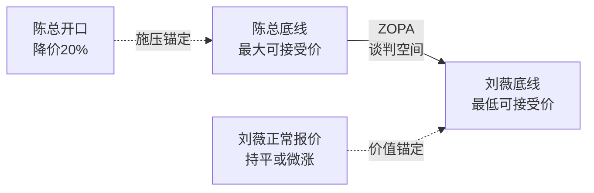
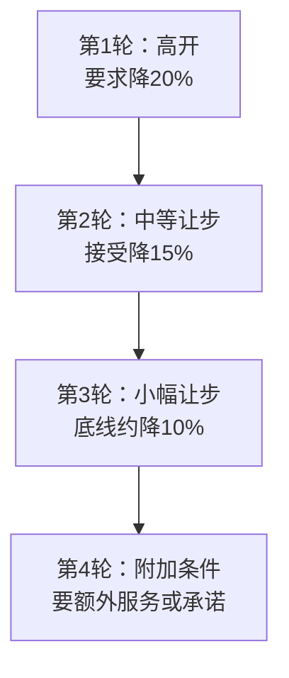
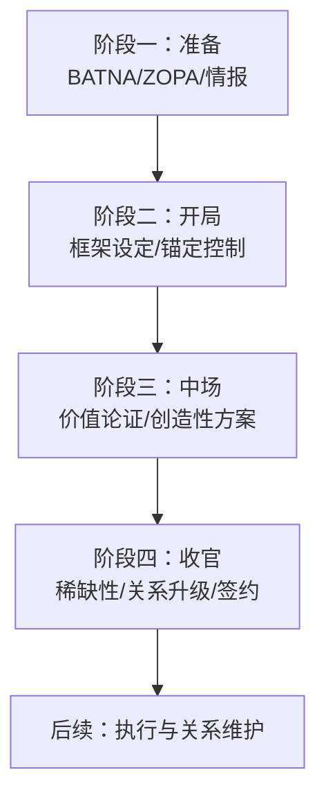
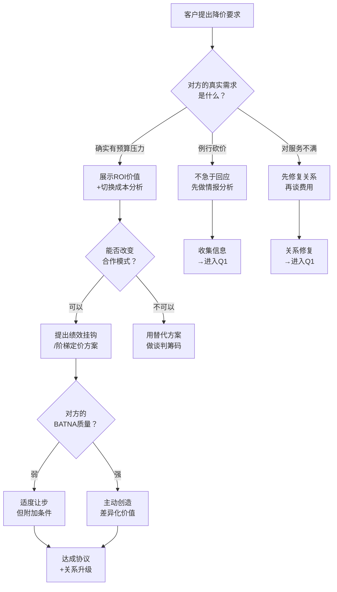

## 场景四：客户谈判——在博弈中创造双赢

谈判是说服力的最高强度竞技场。在销售说服中，你面对的是一个犹豫的客户；在向上管理中，你面对的是一个审慎的上级；但在客户谈判中，你面对的是一个**有备而来、手握筹码、随时准备离场**的对手。对方不仅带着自己的立场和底线，还可能拥有多个替代方案，甚至刻意制造压力来测试你的底线。

客户谈判的特殊性在于：它不是单向的说服，而是**双向的博弈**。你既要坚守自己的利益，又不能破坏长期关系；既要展现合作诚意，又不能暴露过多信息；既要创造价值让蛋糕变大，又要确保自己分到足够的份额。这种多目标、多约束、多回合的复杂性，使得客户谈判成为检验说服力的终极考场。

本节通过一个完整的B2B年度合作谈判案例，拆解从"谈判准备"到"达成双赢"的全过程。你将看到：如何在看似零和的博弈中创造新的价值空间，如何用心理学原理化解僵局，以及如何将一次性的谈判转化为长期的战略伙伴关系。

---

### 一、谈判前的说服力布局——赢在开谈之前

大多数人把谈判等同于"坐在谈判桌前的那一刻"。这是一个致命的误解。哈佛商学院谈判项目的奠基人Roger Fisher在其经典著作《Getting to Yes》中指出：**谈判结果的80%在你坐到桌前之前就已经决定了**。你对对方的了解程度、你准备的替代方案、你设定的目标框架——这些"桌下"的因素，远比"桌上"的技巧更能决定成败。

#### 1.0 谈判准备自检清单

在进入具体案例之前，先提供一份可复用的准备清单。每次重要谈判前，逐项确认：

| 序号 | 检查项 | 状态 | 备注 |
|------|--------|------|------|
| 1 | 我是否清楚对方的真实利益（而非表面立场）？ | □ | 至少通过两个独立渠道交叉验证 |
| 2 | 我是否完成了BATNA分析？我的BATNA有多强？ | □ | 写下具体替代方案，而非模糊的"还有其他选择" |
| 3 | 我是否估算了ZOPA？双方的底线分别在哪里？ | □ | 用数据支撑估算，不能凭直觉 |
| 4 | 我是否了解对方的决策链和内部政治？ | □ | 谁拍板？谁影响？谁执行？ |
| 5 | 我是否准备了至少三种方案（而非单一底线）？ | □ | 每个方案都要对双方有吸引力 |
| 6 | 我是否预判了对方的让步模式和可能策略？ | □ | 研究对方过往谈判记录 |
| 7 | 我是否设计了开场框架（而非被动接受对方框架）？ | □ | 准备好重新定义议题的切入点 |
| 8 | 我是否准备了应对对方极端行为的预案？ | □ | 对方施压、威胁、沉默、激怒时怎么办 |
| 9 | 我的团队内部是否对齐了立场和底线？ | □ | 谈判桌上最怕自己人说法不一 |
| 10 | 我是否考虑了谈判后的执行和关系维护？ | □ | 签约不是终点，是新关系的起点 |

这十项全部打勾，你才真正准备好了。

#### 1.1 案例背景：刘薇与陈总的年度谈判

**刘薇**，35岁，某4A广告公司的客户总监（Account Director），负责管理公司最重要的快消品类客户群。她拥有12年广告行业经验，3年前从策划岗位转入客户管理，兼具策略思维和客户关系能力。

**陈总**（陈建国），42岁，某头部快消品牌的市场副总裁，掌管年度约3000万的营销预算。他以精明著称——过去三年，他每年都会向所有供应商发起一轮降价施压，并且成功将平均采购成本压低了15%。行业内的广告公司私下称他为"陈一刀"，因为他每次谈判都精准地"砍"在供应商的利润线上。

**谈判背景**：刘薇的公司与陈总的品牌合作了四年，年度框架协议约800万元。在过去一年中，公司为该品牌策划的三次整合营销活动表现优异——品牌认知度提升了18%，社交媒体互动量增长了240%，一次成功的联名活动直接带动了季度销售额23%的增长。

**危机信号**：陈总在季度回顾会上突然提出："刘总，我对你们的工作是认可的。但坦白说，我们的预算压力很大，董事会要求明年所有供应商成本下降20%。我已经收到了另外三家公司的提案，价格都比你们低不少。我希望我们能找到一个双方都能接受的方案——否则我可能需要重新评估合作方式。"

这是一个典型的**成本施压型谈判开场**。陈总使用了三个经典的谈判技巧：**锚定**（20%降幅作为起点）、**替代方案暗示**（三家公司的提案）、**关系威胁**（"重新评估合作方式"）。

#### 1.2 刘薇的谈判准备：七步情报战

收到陈总信号后，刘薇没有急于回应。她用了一周时间完成了系统的谈判准备——正是这七步准备工作，让她在谈判桌上始终掌握主动权。

**第一步：确认真实需求而非表面立场**

| 维度 | 陈总的表面立场 | 真实需求（推断） | 确认方式 |
|------|--------------|-----------------|---------|
| 价格 | 要求降低20% | 可能受到上级/董事会成本压力 | 向行业消息源打探 |
| 替代方案 | 声称有三家竞品 | 可能是施压手段，也可能确有其事 | 分析竞品动态 |
| 关系 | "重新评估合作方式" | 不希望真正换供应商（换成本很高） | 观察其行为信号 |
| 隐性需求 | 未明确表达 | 需要在内部展示"谈判成果"向上汇报 | 判断其组织角色 |

Fisher的"利益vs立场"理论在此得到完美体现：**立场是表面的（降价20%），利益是深层的（预算控制、向上汇报、品牌增长）**。刘薇的目标不是在20%这个数字上讨价还价，而是找到能满足陈总真实利益的替代方案。

**第二步：分析BATNA（最佳替代方案）**

BATNA（Best Alternative to a Negotiated Agreement）是谈判力量的根本来源。谁的BATNA更强，谁就更有底气说"不"。

| 方面 | 刘薇的BATNA | 陈总的BATNA | 评估 |
|------|-----------|-----------|------|
| 替代客户 | 公司业务多元化，失去该客户影响营收约10%，但不影响生存 | 换供应商意味着3-6个月磨合期，期间营销效率可能下降30-50% | 刘薇略优 |
| 信息优势 | 对品牌调性、消费者洞察、内部政治了如指掌 | 对广告公司的利润结构了解有限 | 刘薇明显优势 |
| 时间压力 | 年底前不签新约可转投其他项目 | 董事会Q1预算审批有截止日期 | 陈总有更大时间压力 |
| 关系资产 | 与品牌团队建立了深度信任，关键联络人（品牌经理小林）私下表示不愿换 | 需要向上级解释更换理由，承担切换风险 | 刘薇明显优势 |

BATNA分析的核心启示：**刘薇的实际谈判力量比表面看到的要强得多**。陈总表面上强势（大客户、有替代方案），但他的替代方案质量远不如现有合作关系。问题在于——陈总自己可能也知道这一点，但他希望刘薇不知道。

**第三步：确定ZOPA（谈判空间）**

ZOPA（Zone of Possible Agreement）是双方可能达成协议的价格区间。

| 价格点 | 估算 | 依据 |
|--------|------|------|
| 陈总开口价 | 640万（降20%） | 明确提出的数字 |
| 陈总真实预期 | 700-720万（降10-12%） | 行业惯例：开口砍一半 |
| 陈总底线 | 740万（降7.5%） | 低于此价格他不愿承担换供应商的风险 |
| 刘薇正常报价 | 840-880万（涨5-10%） | 基于业绩增长，合理要求 |
| 刘薇底线 | 720万（降10%） | 低于此利润率不值得维持 |

ZOPA存在于720-740万之间——但这只是传统框架下的空间。刘薇的真正机会在于**扩大ZOPA**，通过改变合作模式来创造新的价值。

**第四步：识别对方的决策链和内部政治**

谈判从来不只是两个人之间的事。刘薇通过内部关系了解到：

| 角色 | 态度 | 影响力 | 诉求 |
|------|------|--------|------|
| 陈总（市场副总裁） | 主导谈判，希望控制成本 | 最高 | 展示"谈判成果"给董事会 |
| 品牌经理小林 | 支持继续合作 | 中等（日常对接人） | 不想换供应商增加工作量 |
| 采购部 | 中立，配合陈总 | 低（执行角色） | 遵循公司采购政策 |
| CEO | 不直接参与 | 最终审批 | 关注整体业绩增长 |

**关键洞察**：陈总需要的不只是降价，更需要一份能向董事会展示的"降本增效"叙事。刘薇需要提供的不是更低的价格，而是更聪明的价值包装。

**第五步：准备多种方案而非单一底线**

传统谈判思维是"守住一个底线"，但哈佛谈判项目的研究表明：**准备多种方案的谈判者，比只准备一个方案的谈判者平均多获得12%的价值**。原因在于：多种方案给对方选择权，而选择权本身就是一种心理满足。

| 方案 | 基础费用 | 激励机制 | 双方收益 |
|------|---------|---------|---------|
| 方案A：阶梯定价 | 降10%基础费 | 年度业绩达标后返还5%作为奖金 | 陈总获短期降价，刘薇获业绩激励 |
| 方案B：范围扩展 | 持平当前费用 | 增加2个新渠道的服务内容 | 陈总获更多服务，刘薇获更高收入 |
| 方案C：战略伙伴 | 涨5% | 签3年长约+独占品类+年度战略共创 | 双方长期稳定，陈总获行业影响力 |

**第六步：预判对方的让步模式**

通过对陈总过去三年谈判行为的分析，刘薇总结出他的让步模式：

陈总典型的让步节奏是"大步→中步→小步→附加条件"。这意味着他的真正底线在10%左右，而他会在最后阶段要求额外的"面子价值"——比如公开场合的让步或某种仪式性的承诺。

**第七步：设计开场策略——用框架重定义替代正面交锋**

基于以上准备，刘薇决定不按照陈总的框架（"降20%还是不降"）来谈判，而是**重新定义谈判框架**。这是说服力在谈判中最高级的应用——不在对方的棋盘上下棋，而是换一张棋盘。

---

### 二、谈判实录：四轮对话的心理博弈

以下是刘薇与陈总的四轮关键对话，每一轮都包含具体的策略分析和心理学解读。

#### 第一轮对话：框架重定义——从"降价"到"投资回报"

**场景**：陈总办公室，正式谈判首次会议。

> **陈总**：刘总，感谢你过来。我之前邮件里说的事情，你们内部讨论过了吗？
>
> **刘薇**（微笑，身体前倾，语速放缓）：陈总，我非常感谢您提前跟我们沟通这个问题。说实话，收到您的消息后，我们团队认真做了复盘——也做了一份关于我们过去一年合作价值的详细报告。（拿出准备好的价值报告）
>
> 在讨论费用之前，我想先跟您确认一件事——这也是我们团队内部反复讨论的核心问题：您最关注的是**降低绝对成本**，还是**提升每一笔营销投入的回报率**？
>
> **陈总**（愣了一下）：这两个有区别吗？
>
> **刘薇**：区别很大。如果目标是降低绝对成本，那最简单的做法是砍预算、减项目——但这样做的风险是，去年我们花一年时间建立的品牌势能可能中断。如果目标是提升投资回报率，那我们的讨论方向完全不同——我们要谈的是如何让每一分钱产生更大的效果。
>
> **陈总**（沉吟片刻）：董事会当然希望两方面都优化。
>
> **刘薇**：完全理解。那我们今天就谈一个方案，既能帮您实现成本优化，又能确保甚至提升投资回报。我带了一份数据，先给您看一下——

**策略解读**：

这段对话运用了三个心理学原理：

1. **框架效应（Framing Effect）**：Daniel Kahneman和Amos Tversky的研究表明，同一信息的不同表述方式会导致截然不同的决策。"降价20%"是一个**零和框架**（我少你多），而"提升投资回报率"是一个**正和框架**（蛋糕变大）。刘薇在谈判第一分钟就完成了框架切换——从"分蛋糕"变成"做大蛋糕"。

2. **锚定重置（Anchor Reset）**：陈总以"20%"为锚点开局。刘薇没有在这个锚点上讨价还价（"我们最多降5%"），而是直接换了一个锚点——"投资回报率"。当讨论框架从"降多少"变成"回报多少"时，20%这个数字就失去了锚定效应。

3. **信息不对称优势**：刘薇带了价值报告，而陈总只带了一个降价诉求。在谈判中，**掌握数据的一方天然拥有话语权**——因为你定义了讨论的基础事实。

---

#### 第二轮对话：数据论证——用ROI构建价值锚定

> **刘薇**（翻开报告第一页）：陈总，这是过去12个月我们合作的三个核心项目的ROI分析。第一个项目，春季新品上市整合营销，总投入280万，直接带动新增销售额超过1100万，ROI达到3.9倍。第二个项目，618大促内容营销，投入160万，直接转化GMV 520万，ROI 3.25倍。第三个——也是最成功的——与故宫IP的联名活动，投入340万，带动品牌搜索量增长340%，当季销售额同比提升23%，综合ROI超过4.2倍。
>
> （展示一张对比图表）这三个项目的平均ROI是3.7倍。我做了同行业对比——快消品类的广告投放平均ROI在2.0到2.5倍之间。换句话说，我们过去一年的合作表现，比行业平均水平高出60%以上。
>
> **陈总**（看着报告，语气有所松动）：数据确实不错，但你也知道，ROI的计算方式有很多种……
>
> **刘薇**（点头）：您说得对，所以这份报告我们用了三种计算方式——直接归因、多触点归因和混合模型——结论基本一致。不过陈总，我想分享一个可能对您更有价值的数字：**更换供应商的隐性成本**。
>
> （翻到报告后半部分）根据麦肯锡的一项研究，B2B供应商切换的平均隐性成本是合同金额的15-25%——包括新团队的磨合期（通常3-6个月）、品牌调性的重新校准、内部沟通成本的增加，以及最不可控的——**试错成本**。您在新供应商身上可能损失的效率，保守估计在200-400万之间。
>
> **陈总**：这个数字有点夸张吧。
>
> **刘薇**：我理解您的质疑。让我举一个具体的例子——您的竞争对手A品牌去年更换了广告代理商，新团队前两个季度的Campaign效果都很不理想，品牌搜索量下降了15%。虽然我没有确切数据证明这和换供应商直接相关，但时间线上高度吻合。

**策略解读**：

1. **损失厌恶（Loss Aversion）**：Kahneman的前景理论表明，人们对损失的敏感度是获得的2-2.5倍。刘薇没有说"我们能给你带来多少价值"（获得框架），而是说"换供应商你会损失多少"（损失框架）。同一件事，损失框架的说服力是获得框架的两倍。

2. **数据阶梯（Data Ladder）**：从具体项目ROI（微观）→ 行业对比（中观）→ 切换成本研究（宏观），层层递进，构建了一个立体的价值论证。单一数据点容易被质疑，但一个数据体系很难被整体推翻。

3. **竞争对手案例（Indirect Social Proof）**：刘薇没有直接说"你应该选我们"，而是通过竞争对手的失败间接证明——这个技巧的高明之处在于，它让陈总自己得出了结论，而不是被别人告知。

---

#### 第三轮对话：创造性方案——打破零和框架

> **刘薇**：陈总，我理解董事会的成本压力是真实的。所以我和团队做了一件过去四年都没有做过的事——我们重新设计了合作模式。我想向您提出一个**风险共担、收益共享**的方案。
>
> （展示方案A的一页概要）具体是这样的：我们将基础服务费从800万降低到720万——这是10%的降幅，不是您要求的20%，但请注意这个方案的第二部分：我们设定一个绩效基准线。如果我们明年的营销活动帮您实现**15%以上的销售增长**，贵方额外支付年度合同金额的8%作为绩效奖金——也就是57.6万。
>
> 这样算下来：
> - 如果我们表现一般（低于15%增长），您实付720万，节省了10%的费用——您赢了。
> - 如果我们表现优秀（超过15%增长），您实付777.6万，但这意味着您多花了不到10%的费用，却获得了至少15%的销售增长——您赢得更多。
> - 而对我们来说，这意味着如果我们想拿到完整的合同金额，我们必须比过去做得更好——我们也有了更强的动力。
>
> **陈总**（开始认真计算）：如果按这个方案，你们的风险其实不小。你们不怕拿不到全额？
>
> **刘薇**：说实话，如果15%的增长我们都做不到，那我们确实不值得收全额。这个方案的核心逻辑是——**我们把定价权交给了业绩本身**。这不正是最公平的定价方式吗？
>
> **陈总**（微笑）：你这个思路确实有意思。但我需要一些时间评估。

**策略解读**：

1. **创造性问题解决（Creative Problem Solving）**：这是哈佛谈判项目的核心理念——当双方在分配问题上僵持不下时，最好的策略不是妥协，而是创造新的价值。传统的谈判是"你多一块，我就少一块"，但绩效奖金模式创造了一个**取决于未来业绩的变量**——这个变量不在当前的分配框架之内，因此不产生直接的利益冲突。

2. **互惠原则（Reciprocity）**：刘薇主动降了10%基础费——这是一个实际的让步，触发了陈总的心理互惠义务。根据Cialdini的研究，当一方主动让步时，另一方会产生强烈的回报压力。这让陈总更难拒绝后续的方案讨论。

3. **控制权转移（Control Transfer）**：刘薇说"把定价权交给业绩本身"——这句话的说服力在于它触及了一个深层的心理需求：**公平感**。人类天生对"不劳而获"和"劳而不获"感到不满。绩效定价机制同时满足了双方的公平诉求——你得到的和你创造的价值成正比。

4. **选择幻觉（Illusion of Choice）**：刘薇呈现的不是"你接受还是不接受"，而是"你赢还是你赢得更多"——两种结果都对陈总有吸引力。这种框架设计消除了"让步"的感觉，取而代之的是"选择对自己更有利的方案"。

---

#### 第四轮对话：稀缺性与关系升级——锁定长期合作

> **陈总**：方案逻辑我认可。但我想再谈一个事情——基础费用能不能再低一点？720万基础上再降5%，我今天就可以签。
>
> **刘薇**（停顿三秒，身体微微后靠）：陈总，我理解您希望争取到最好的条件。720万已经是我们能给到的基础费用底线了——说实话，我们内部讨论时，财务团队是反对的。但我要跟您分享一个信息——这个信息我本来打算在签约后再提的。
>
> （稍微放低声音）目前我们在接洽的品牌中，有两个和贵品牌在同一品类。按照我们公司的原则——**同一品类只服务一个客户**。如果我们的合作继续，我们会为贵品牌提供品类独占服务。这意味着我们在策略层面不会为任何竞品提供类似的服务。这个独占权的价值，坦白说，远超那5%的费用差额。
>
> **陈总**（表情变化）：这个信息我很感兴趣。你能写进合同里吗？
>
> **刘薇**：当然。我们可以将品类独占条款作为合同附件。同时，我想提一个建议——如果我们这次合作模式调整成功，明年我们可以探讨一个**三年战略合作伙伴关系**。这意味着我们可以更早介入贵品牌的年度营销规划，提供更前瞻性的策略支持，而不仅是在执行层面接单。
>
> **陈总**（最终微笑）：好，我们就按这个框架来推进。让你的团队把合同草案发过来。

**策略解读**：

1. **稀缺性（Scarcity）**：品类独占服务是一个经典的稀缺性策略——"独占"意味着如果陈总不签，他的竞争对手可能获得这个优势。Cialdini的研究表明，当一个选项从"得到"变成"可能失去"时，人们对它的估值会大幅上升。

2. **损失厌恶的二次应用**：这次不是"换供应商的损失"，而是"竞争对手获得优势的损失"——后者对陈总的触动更大，因为它直接影响他的**相对竞争地位**，而不仅仅是绝对成本。

3. **关系升级（Relationship Escalation）**：刘薇在解决当前谈判的同时，埋下了三年战略合作的种子。这运用了**承诺与一致性原则**——一旦陈总同意了"品类独占"和"绩效奖金"的框架，他在心理上已经将刘薇的公司视为"合作伙伴"而非"供应商"，这使得未来的关系升级更加自然。

4. **沉默的力量**：注意刘薇在回应降价请求时的三秒停顿和身体后靠——这是一种非语言信号，表明这个请求进入了"认真考量"而非"可以商量"的区域。在谈判中，**沉默比说话更有力量**——它迫使对方用信息来填补空白。

---

### 三、谈判结果与复盘

#### 3.1 最终协议

| 条款 | 原合同 | 新协议 | 变化 |
|------|-------|--------|------|
| 基础服务费 | 800万 | 720万 | -10% |
| 绩效奖金机制 | 无 | 业绩增长≥15%时支付57.6万 | 新增 |
| 品类独占条款 | 无 | 合同附件中明确 | 新增 |
| 合同期限 | 1年 | 1年（含续约优先权） | 微调 |
| 预期总费用 | 800万 | 720-777.6万（取决于业绩） | 取决于结果 |
| 服务范围 | 原有 | 原有+品类独占 | 增值 |

#### 3.2 双方的实际收益

**陈总（客户方）的收益**：
- 获得了10%的即时成本降低——满足董事会的降本要求
- 引入了绩效挂钩机制——向董事会展示了"创新的供应商管理模式"
- 获得了品类独占服务——在竞争中获得了信息优势
- 锁定了续约优先权——为长期合作奠定了基础

**刘薇（服务方）的收益**：
- 保住了800万级别的核心客户——避免了客户流失
- 引入了绩效奖金——如果业绩好，收入可能超过原合同
- 获得了品类独占——在服务深度上建立了竞争壁垒
- 将关系从"供应商"升级为"战略伙伴"——为未来增长铺路

#### 3.3 后续执行与长期价值

合同签订后的六个月，刘薇团队为该品牌策划了两次营销活动，整体业绩增长达到22%——远超15%的绩效基准线。陈总不仅支付了绩效奖金，还在年底的行业会议上主动分享了与刘薇公司的合作模式，称其为"行业标杆"。这个案例在快消品类圈子里产生了连锁反应——三家新的品牌主动联系刘薇，希望采用类似的绩效合作模式。

#### 3.4 签约后的关系管理

很多谈判者犯一个错误：合同签完就松懈了。实际上，**签约是新关系的起点，不是终点**。刘薇在签约后做了三件事，确保谈判成果转化为长期价值：

**第一，建立季度复盘机制**。不是等到年底才看数据，而是每季度和陈总做一次ROI回顾。这有两个作用：一是持续证明价值（为下一轮谈判积累筹码），二是及时发现问题、调整策略（避免小问题积累成大矛盾）。复盘不只是看数字，更要看趋势——哪个渠道的ROI在上升？哪个在下降？竞争对手在做什么？

**第二，超额交付创造惊喜**。第一年绩效基准线是15%，刘薇团队实际做到了22%——这个7%的超额不是偶然，而是刻意的"超额交付"策略。在谈判中，你承诺了15%，如果刚好做到15%，对方觉得"你只是完成了本职"；但如果做到22%，对方觉得"这个伙伴值得长期合作"。超额交付的本质是**用行动重塑对方对你价值的感知**，为下一轮谈判创造更高的价值锚点。

**第三，主动升级关系层次**。签约后第三个月，刘薇主动邀请陈总参加公司内部的"行业趋势闭门会"——这是一个只有战略级客户才能参加的活动。这个动作的潜台词是"我们已经把您当作战略伙伴，而不仅仅是客户"。根据社会交换理论，当一方主动提升关系层级时，另一方会感到一种隐性的义务去匹配这种投入——这就是关系升级的正向螺旋。

---

### 四、客户谈判的说服力框架

#### 4.1 谈判中常用的六大说服技巧对应关系

| 说服技巧 | 在谈判中的具体应用 | 本案例中的运用 |
|---------|-------------------|--------------|
| 框架效应 | 重新定义谈判议题，改变讨论维度 | "降价"→"投资回报率" |
| 损失厌恶 | 强调不合作的代价而非合作的好处 | 切换成本分析、竞争对手案例 |
| 互惠原则 | 主动做出让步，触发对方回报义务 | 主动降10%基础费 |
| 稀缺性 | 制造"不签就会失去"的紧迫感 | 品类独占权 |
| 社会证明 | 展示第三方认可或同行行为 | 行业ROI数据、竞争对手案例 |
| 承诺与一致性 | 引导对方逐步接受小承诺，最终达成大协议 | 从"确认问题"到"接受方案" |

#### 4.2 谈判说服的四阶段框架

| 阶段 | 核心任务 | 关键技巧 | 常见错误 |
|------|---------|---------|---------|
| 准备 | 了解对方、分析力量对比、准备方案 | BATNA分析、ZOPA估算、情报收集 | 准备不足，仓促上阵 |
| 开局 | 设定议题框架，控制谈判节奏 | 框架重定义、先发锚定、建立信任 | 被动接受对方的议题设定 |
| 中场 | 展示价值、提出方案、化解僵局 | 数据论证、创造性方案、让步策略 | 僵持在价格上无法突破 |
| 收官 | 锁定协议、升级关系、创造后续 | 稀缺性、附加条件、关系承诺 | 急于收尾而放弃潜在价值 |

#### 4.3 谈判中的心理学工具箱

**（一）锚定效应的攻防**

锚定效应是指人们在做决策时，会过度依赖最先接收到的信息（"锚点"）。在谈判中：

- **进攻**：先发制人提出你的锚点。如果你是服务方，先报价（锚定高位）；如果你是采购方，可以先提出一个较低的参考价格（锚定低位）。
- **防守**：当对方先提出极端锚点时，不要在该锚点的基础上讨价还价——直接换一个锚点（如刘薇所做的），或者明确指出这个数字缺乏依据。

**（二）BATNA的心理学**

BATNA不只是一个谈判工具，它还深刻影响谈判者的**心理状态**。研究表明：

- 知道自己有强力BATNA的谈判者，在谈判中表现得更自信、更少做出不必要的让步
- 即使BATNA没有被使用，它的存在本身就增强了谈判力量——因为你随时可以说"不"
- 对方对你的BATNA的**认知**比你的BATNA的实际质量更重要——这就是为什么陈总提到"另外三家公司的提案"

**（三）时间压力的运用**

时间压力是最被低估的谈判武器。在本案例中：

- 陈总有董事会预算审批的截止日期——这是他的时间压力
- 刘薇没有直接利用这一点（避免激怒对方），但在方案设计中"不着急"——她的从容本身就暗示"我没有时间压力，你有"

**（四）让步策略的科学**

在谈判中，让步不是示弱，而是一种有策略的信息传递。关键在于**如何让、何时让、让多少**。

| 让步方式 | 效果 | 适用场景 | 具体话术示例 |
|---------|------|---------|------------|
| 递减式让步 | 传递"接近底线"的信号 | 逐步缩小让步幅度（10%→5%→2%→0） | "我最多再让2个点，这已经是极限了" |
| 条件式让步 | 每一次让步都换来对方的回报 | "如果您能接受X，我可以考虑Y" | "如果合同期延长到两年，我可以再降3%" |
| 非金钱让步 | 不花成本但创造价值感 | 增加服务内容、延长付款周期、提供培训 | "价格没法再降了，但我们可以免费加一个季度复盘" |
| 延迟让步 | 不在压力下立即回应 | "我需要和团队讨论一下，明天给您回复" | "这个数字我需要回去跟财务确认" |
| 捆绑式让步 | 把多个议题打包，避免逐项被蚕食 | 同时谈价格、服务范围、合同期限 | "我们整体看一下这几个条件的组合" |

在本案例中，刘薇的"降10%基础费"就是典型的**条件式让步**——它不是无条件的退让，而是绑定了"绩效奖金机制"和"品类独占"的交换条件。

---

### 五、客户谈判中的常见陷阱

#### 陷阱一：在对方的框架内讨价还价

**表现**：对方说"降20%"，你就开始在这个基础上还价——"我们最多降8%"。此时你已经接受了对方的框架（降价），只是在数字上讨价还价。

**为什么是陷阱**：当讨论框架被对方定义后，你永远在防守。你降了8%，对方会要求12%；你降了12%，对方会要求15%。这种消耗战对服务方极为不利。

**纠正方法**：像刘薇一样，在第一时间切换框架——"我们不谈降多少，我们谈如何让您的投入产生更大回报"。只要框架切换成功，原来的数字就不再有意义。

#### 陷阱二：急于亮出底牌

**表现**：为了表示诚意，过早地告诉对方"最多降10%"。对方听到后会认为10%不是你的底线，继续施压。

**为什么是陷阱**：信息在谈判中就是筹码。你亮出的每一张牌，都减少了你的回旋余地。

**纠正方法**：用"条件式回应"替代"直接回应"——"如果我们能调整合作模式，也许可以在费用上找到一些空间"。这给了对方希望，但不暴露你的底线。

#### 陷阱三：忽视沉默的压力

**表现**：对方一沉默，你就紧张，开始补充信息或主动让步来填补尴尬。

**为什么是陷阱**：沉默在谈判中是一种主动策略——它迫使对方用信息或让步来打破安静。你如果急于打破沉默，就中了对方的计。

**纠正方法**：学会拥抱沉默。当对方沉默时，你也沉默。如果你刚提出了一个方案，让沉默帮你传达"这个方案已经考虑得很周全了"的信号。

#### 陷阱四：把谈判当成一次性事件

**表现**：只关注这次能拿到什么条件，不考虑谈判结果对长期关系的影响。

**为什么是陷阱**：B2B客户关系通常持续多年。一次"赢了"但伤害了关系的谈判，可能导致客户流失、口碑受损。反之，一次"妥协"但建立了信任的谈判，可能带来未来数年的持续收入。

**纠正方法**：在评估方案时，同时考虑**短期财务收益**和**长期关系价值**。刘薇放弃的10%基础费，在长期来看是一笔划算的投资——它换来的是品类独占、绩效激励和战略伙伴地位。

#### 陷阱五：过度使用稀缺性

**表现**：频繁使用"这是最后的机会"、"其他客户也在等"等稀缺性话术。

**为什么是陷阱**：稀缺性的效果依赖于**可信度**。当对方发现你的"最后机会"并不真的是最后机会时，你未来的每一次稀缺性声明都会失去说服力。更糟糕的是，过度使用稀缺性会让对方觉得你在操控他，损害信任。

**纠正方法**：稀缺性声明必须是真实的、可验证的。刘薇的"品类独占"之所以有效，是因为它是一个可以写进合同的、可验证的承诺——不是空洞的话术。

#### 陷阱六：团队内部立场不统一

**表现**：谈判桌上，你说"这已经是底线了"，你的同事却说"其实我们还可以再商量"。或者你和同事对同一个问题给出不同的数据。

**为什么是陷阱**：内部不统一会瞬间摧毁你的可信度。对方会抓住你们的分歧，逐个击破。更严重的是，对方会质疑你团队的专业性——"连自己人都没对齐，你们的方案靠谱吗？"

**纠正方法**：谈判前必须完成内部对齐——统一口径、明确分工、设定暗号。如果谈判中出现意料之外的问题，宁可说"我需要和团队确认"，也不能现场互相矛盾。

---

### 六、应对对方的不道德谈判策略

在理想的商业世界里，所有谈判者都诚实守信。但现实中，你可能遇到使用不道德策略的对手。识别这些策略并知道如何应对，是谈判能力的重要组成部分。

#### 6.1 六种常见不道德策略及应对

**策略一：虚假信息（Bluffing）**

对手声称"我们收到了更低的报价"，但实际上可能并不存在。陈总在本案例中就使用了这一招——"已经收到了另外三家公司的提案"。

**识别信号**：
- 对方无法或不愿提供具体细节（"具体是哪几家？报价多少？"）
- 对方的说法与你掌握的行业信息不一致
- 对方在你表示要验证时迅速转移话题

**应对方式**：
- 不要直接指控对方说谎——这会破坏关系
- 用提问来测试真实性："方便分享一下那三家的方案要点吗？我想看看我们是否能匹配"
- 把焦点从"对方有没有替代方案"转移到"我们的方案为什么更好"
- 像刘薇一样，用数据和价值论证来覆盖对方的虚假信息

**策略二：红脸白脸（Good Cop, Bad Cop）**

两个人配合——一个唱红脸（友善、表示理解），一个唱白脸（强硬、施压）。目的是让你在心理上更依赖"友善方"，从而对"友善方"的提议做出更多让步。

**识别信号**：同一个人突然改变态度，或者两个人的态度反差过于明显。

**应对方式**：
- 识别后直接对两人同时说话："我理解两位有不同的关注点，让我们一起看看怎样兼顾"
- 不要被"友善方"牵着走——他的提议可能比"强硬方"的更不利于你
- 把注意力放在方案本身，而不是谁更友善

**策略三：最后通牒（Ultimatum）**

"这是我们的最终报价，不接受就算了。"很多谈判者被这种高压策略吓住，匆忙让步。

**识别信号**：在谈判早期或中期就出现"不可商量"的强硬表态，且没有合理的解释。

**应对方式**：
- 不要在情绪上做出反应。平静地说："我理解您的立场。如果我们暂时无法在这个条件下达成一致，也许我们可以看看是否有其他维度可以调整"
- 检验通牒的真实性——如果你的BATNA足够强，你可以选择不接受
- 用提问来软化对方："您提到这是最终报价，是因为有具体的时间限制，还是因为这是您评估后的最优方案？"

**策略四：故意制造情绪压力**

大声说话、摔文件、质疑你的专业能力、人身攻击——这些行为的目的不是解决分歧，而是让你在情绪上失去平衡，从而在非理性状态下做出让步。

**识别信号**：对方的攻击从"问题"转向了"人"——不再是"这个价格不合理"，而是"你们公司就是这个水平"。

**应对方式**：
- 不要在情绪上对抗。深呼吸，降低语速，保持微笑
- 用"标签法"回应："我感觉您对这个数字有很强的情绪反应。能告诉我，这个数字背后最让您担心的是什么吗？"——这会让对方从情绪模式切换到理性模式
- 如果人身攻击持续，可以叫停："陈总，我们今天的目标是找到双赢方案。如果您对我们的能力有疑虑，我们可以用数据来说明。但我认为人身层面的讨论对达成协议没有帮助。"

**策略五：蚕食策略（Nibbling）**

大框架达成一致后，对方开始逐项提出小要求——"再降5%"、"送三个月免费服务"、"延长账期到90天"。每一项都很小，你不好意思拒绝，但加起来可能侵蚀掉你大部分利润。

**识别信号**：签约前突然出现一系列"小要求"，每一个单独看都不大。

**应对方式**：
- 使用"捆绑打包"策略——"我们可以讨论这些附加条件，但需要把它们作为整体方案的一部分重新评估"
- 记录每一个额外让步的累积成本——让数字说话
- 用条件式回应——"免费服务可以，但合同期需要延长到两年"

**策略六：拖延战术（Delay Tactics）**

对方不断推迟决策——"我需要再请示"、"下周再开会讨论"、"最近太忙了"。拖延可能是一种策略——他们知道你有时间压力，用拖延来迫使你在不利条件下让步。

**识别信号**：决策时间远超合理范围，且每次推迟都没有给出明确的下一步时间表。

**应对方式**：
- 明确设定时间线——"我理解这需要内部讨论。我们是否可以约定一个时间点，在那之前给出明确的回复？"
- 释放轻微的时间压力——"我们本季度还有其他项目在排期，如果到X日还没有确定，我需要把资源分配给其他项目了"
- 不要为了加快进度而主动让步——这正是拖延策略的目的

#### 6.2 道德底线原则

在应对不道德策略时，你需要注意两个原则：

**原则一：识别不等于模仿**。了解不道德策略是为了防御，不是为了你自己去使用。长期来看，诚信的谈判者比使用花招的谈判者获得更好的结果——因为信任是可以复利的资产，而欺骗是一次性消耗品。

**原则二：区分策略和欺骗**。框架效应、锚定、稀缺性——这些是合法的说服策略，不涉及虚假信息。而虚构报价、伪造数据、空头承诺——这些是欺骗。前者是谈判的正常组成部分，后者可能涉及法律风险。底线很简单：**你呈现的信息必须是真实的，你做出的承诺必须是可以兑现的**。

---

### 七、谈判说服的进阶技巧

#### 7.1 信息不对称的主动构建

谈判中的力量很大程度上来自信息。高段位的谈判者不仅利用现有的信息不对称，还会**主动构建**有利于自己的信息格局。

| 策略 | 做法 | 案例中的体现 |
|------|------|------------|
| 选择性披露 | 只释放对你有利的信息 | 刘薇展示了ROI数据，但没有透露利润率 |
| 信息锚定 | 先提供一个有利于你的"参考事实" | 先展示3.7倍ROI再谈费用 |
| 第三方背书 | 引用权威来源支撑你的论点 | 麦肯锡的切换成本研究 |
| 信息询问 | 通过提问获取对方的信息 | 问"您关注的是绝对成本还是投资回报率？" |

#### 7.2 情绪管理与微表情识别

谈判不仅是理性的博弈，更是情绪的互动。研究表明，谈判者的情绪状态直接影响其决策质量：

- **愤怒**的谈判者倾向于做出更激进的要求，但也更容易犯错
- **焦虑**的谈判者倾向于过快让步以结束不适感
- **自信**的谈判者倾向于坚持立场，但也可能过于强硬

刘薇在谈判中的情绪策略：

| 时刻 | 刘薇的情绪表现 | 对陈总的影响 |
|------|-------------|------------|
| 陈总提出20%降价 | 平静、微笑 | 传递"不慌张"的信号，削弱施压效果 |
| 展示ROI数据 | 专业、自信 | 增强论点的可信度 |
| 提出新方案 | 热情但克制 | 传递"这是精心准备的"而非"临时编造的" |
| 品类独占信息 | 轻微降低音量 | 制造"内部消息"的亲近感 |

**微表情识别的实战价值**：在谈判中，对方的微表情会泄露真实想法——如果他说"这个价格太低了"但嘴角微微上扬，说明他内心已经倾向于接受。注意这些信号：眉毛上扬（惊讶或兴趣）、嘴唇紧闭（不满或坚持）、身体前倾（关注或准备让步）、手指轻敲桌面（不耐烦或焦虑）。

#### 7.3 多层博弈的认知

在B2B谈判中，你不仅在和桌子对面的人博弈，还在和**他背后的组织**博弈。陈总需要向董事会展示成果，品牌经理小林需要减少工作量，采购部需要符合流程。

高段位的谈判者会：

1. **为对方准备"向上汇报的弹药"**：刘薇的绩效奖金方案，本质上就是给陈总一份能向董事会展示的"创新采购模式"。
2. **在对方组织内部建立盟友**：品牌经理小林已经是潜在盟友——不换供应商意味着他的工作量不增加。
3. **理解对方组织的决策流程**：知道最终审批在CEO手中，所以方案设计要让CEO也能看到价值。

#### 7.4 谈判风格的自我认知

不同的谈判者有不同的默认风格。了解自己的风格有助于扬长避短。Thomas-Kilmann冲突模型将谈判风格分为五种：

| 风格 | 特征 | 优势 | 风险 | 适用场景 |
|------|------|------|------|---------|
| 竞争型 | 坚持自己的立场，追求赢 | 在需要快速决断时效率高 | 容易破坏关系 | 一次性交易、底线不能退让时 |
| 合作型 | 寻找双方都满意的方案 | 创造最大总价值 | 耗时较长 | 长期合作关系、有创造性空间时 |
| 妥协型 | 各让一步，快速达成一致 | 效率高，双方都有参与感 | 可能错过更优方案 | 时间紧迫、需要快速推进时 |
| 回避型 | 暂时搁置争议 | 避免在情绪化时做决定 | 问题可能积累 | 对方情绪激动、信息不充分时 |
| 迁就型 | 优先维护关系 | 保护重要关系 | 容易被对方利用 | 关系价值远大于单次利益时 |

刘薇在本案例中展现了**合作型为主、竞争型为辅**的风格——她主动创造价值（合作型），但在底线问题上不退让（竞争型）。这种组合是B2B长期合作谈判中最有效的风格。

了解自己的默认风格后，你需要：
- 如果你是天然竞争型：在长期合作谈判中刻意增加合作行为，避免过度强硬
- 如果你是天然合作型：在底线问题上提前设定"硬边界"，避免过度让步
- 如果你是天然回避型：给谈判设定明确的时间线，逼迫自己正面回应
- 如果你是天然迁就型：每次让步前问自己"如果对方不回报这个让步，我能接受吗？"

#### 7.5 从谈判者到战略伙伴的关系跃迁

谈判的终极目标不是赢得这一次的博弈，而是**将对手变成伙伴**。这需要在谈判过程中埋下关系升级的种子：

| 阶段 | 关系性质 | 行为特征 |
|------|---------|---------|
| 初始阶段 | 买卖双方 | 讨价还价，利益对立 |
| 中期阶段 | 合作伙伴 | 共同解决问题，利益部分一致 |
| 长期阶段 | 战略联盟 | 共同创造价值，利益深度绑定 |

刘薇的方案设计——绩效奖金、品类独占、三年战略合作——正是引导关系从"买卖双方"向"战略联盟"跃迁的关键路径。

#### 7.6 线上谈判的特殊策略

在后疫情时代，越来越多的谈判通过视频会议、邮件或即时通讯进行。线上谈判有一些独特的挑战：

| 挑战 | 影响 | 应对策略 |
|------|------|---------|
| 缺少肢体语言线索 | 无法读取微表情和姿态 | 更依赖语气、语速、停顿来判断情绪；关键谈判尽量安排线下面谈 |
| 信息过载或不足 | 屏幕共享时信息量太大，或文字沟通时信息太少 | 提前发送材料让对方预习；关键数据用图表而非纯文字 |
| 技术干扰 | 断线、音画不同步、多人同时说话 | 提前测试设备；指定发言顺序；录屏存档 |
| 注意力分散 | 对方可能同时在处理其他事情 | 设置议程和时间限制；定期用提问拉回注意力 |
| 异步沟通的陷阱 | 邮件/消息来回可能导致信息碎片化 | 复杂议题用同步沟通（视频/电话）；邮件仅用于确认和记录 |

线上谈判的一个关键原则：**如果议题涉及创造性方案、情绪管理或多轮博弈，尽量安排面对面会议**。文字和视频在传递框架切换、沉默压力、情绪感染等方面远不如线下有效。本案例中刘薇的很多技巧——身体前倾、三秒停顿、降低音量——在线上环境中会大打折扣。

---

### 八、谈判说服决策树

面对一个客户谈判场景时，使用以下决策树来规划你的说服策略：

---

### 九、核心规律总结

本案例揭示了客户谈判中说服力运用的四条核心规律：

**规律一：框架决定结果。** 不要在对方设定的框架内讨价还价——重新定义谈判的议题、维度和评价标准，你就能改变整个谈判的走向。降价谈判的本质不是"降多少"的问题，而是"如何定义价值"的问题。

**规律二：信息就是力量。** 谁掌握了更多、更准确的信息，谁就拥有谈判的主动权。这包括对对方需求的了解、对行业数据的掌握、对替代方案的评估。在坐到谈判桌之前，信息战已经开始了。

**规律三：创造价值优于分配价值。** 传统谈判思维是"分蛋糕"——你多一块我就少一块。高级谈判思维是"做大蛋糕"——绩效奖金、品类独占、战略伙伴，这些都是创造新价值的手段。当蛋糕变大时，双方都能分到更多。

**规律四：关系是最重要的长期资产。** 一次谈判的结果是暂时的，但谈判中建立的信任、尊重和合作模式会产生长期复利。刘薇放弃的10%基础费，换来的是一整年的品类独占、战略伙伴地位和三个新客户——这笔账怎么算都是赢的。

最后，记住谈判大师Heraclitus的那句话：**"看不见的和谐比看得见的和谐更好。"** 最好的谈判结果，是双方都觉得"我得到了我需要的"——不是因为你亏了，而是因为你们一起创造了更大的价值。

---
