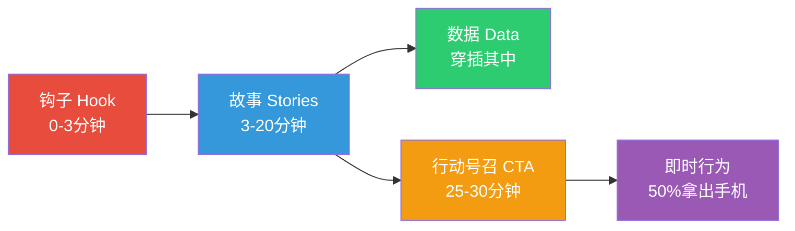
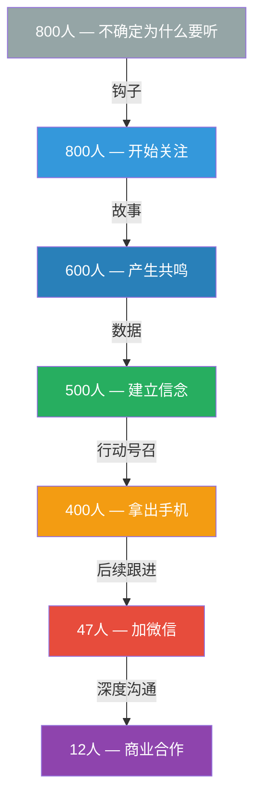
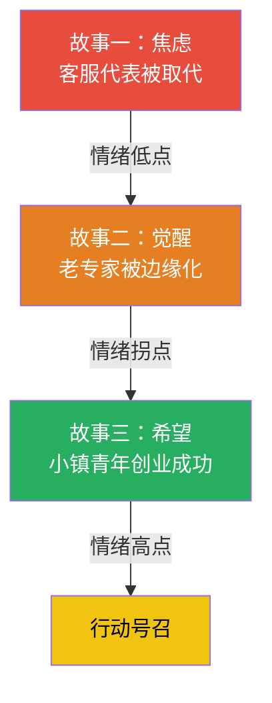

## 场景五：公开演讲——让千人厅场为你鼓掌

公开演讲是说服力的终极形态——你同时面对数百甚至上千人，没有一对一的反馈回路，没有第二次机会修正第一印象。一场成功的公开演讲能让听众在结束后主动排着队加你微信，邀请你做后续合作；一场失败的公开演讲则让你在台上看到一片低头看手机的画面，甚至提前离场。

这一节将完整拆解一个实战案例，从理论基础到具体执行，展示如何让千人厅场为你鼓掌。

### 一、为什么公开演讲是最难的说服场景

#### 1.1 公开演讲的独特挑战

公开演讲与日常沟通有本质区别，难点体现在四个维度：

| 维度 | 日常沟通 | 公开演讲 |
|------|---------|---------|
| 反馈回路 | 即时（表情、语言） | 延迟且模糊（掌声、沉默） |
| 听众注意力 | 相对集中（社交义务） | 极易分散（匿名感降低约束） |
| 信息密度要求 | 容忍停顿和重复 | 每分钟都要有信息增量 |
| 说服难度 | 可反复澄清 | 一次通过，不可回放 |
| 情绪感染范围 | 一对一双向传递 | 单向辐射，情绪涟漪效应 |
| 容错空间 | 随时修正措辞 | 说出口即成定局 |

这四个维度叠加在一起，意味着公开演讲的说服策略必须**比日常沟通强十倍**才能达到同等效果。

#### 1.2 大规模听众的心理特征

当听众从5人变成500人，个体心理会发生三个关键变化：

**去个体化效应（Deindividuation）**：当人处于人群中，自我意识降低，更容易被情绪感染。Philip Zimbardo的监狱实验证明，群体环境会显著降低个体的自我监控能力。在演讲场景中，这意味着你可以用情绪驱动共鸣，但也意味着一旦节奏断裂，消极情绪会快速蔓延。一个哈欠可以传染一整排。

**社会认同压力（Social Proof）**：Robert Cialdini在《影响力》中详细阐述了这一原则——人们会观察周围人的反应来决定自己的态度。如果前排的人在笑，后排的人也更容易笑。如果前排的人在玩手机，后排的人也会掏出手机。这就是为什么很多专业演讲会安排"托"坐在前排——不是造假，而是启动正向的社会认同循环。

**注意力窗口更短**：神经科学研究表明，成年人的持续注意力窗口约为8-10分钟（John Medina, *Brain Rules*）。超过这个时间，大脑需要一个新的刺激来重新聚焦。这就是为什么最好的演讲每8-10分钟就有一个"重置点"——一个故事转折、一个互动环节、一段视频或一个震撼数据。

**群体情绪的非线性放大**：在小群体中，情绪传递是线性的——A感染B，B感染C。但在千人规模的演讲中，情绪传递呈现非线性放大特征。一个前排听众的笑声可以像涟漪一样扩散到全场，而一个冷场也可以像病毒一样蔓延。这意味着你在演讲中的每一个情绪节点都有可能被放大数倍——无论是正面还是负面。

#### 1.3 公开演讲的说服力公式

理解了上述挑战后，我们可以提炼出公开演讲的说服力公式：

> **说服力 = 注意力捕获率 × 信息传递效率 × 情感共鸣深度 × 行为转化概率**

四个变量缺一不可：
- 注意力捕获率低：后面做得再好也没人听
- 信息传递效率低：听了但没理解
- 情感共鸣深度浅：理解了但没感觉
- 行为转化概率低：有感觉但不行动

下面的案例将展示如何同时优化这四个变量。

### 二、案例拆解：陈教授的30分钟主题演讲

#### 2.1 案例背景

陈教授受邀在一场行业大会上做30分钟的主题演讲，台下有800多位从业者。主题是"AI时代的人才培养"。大部分听众是带着手机来"听个大概"的心态——这在行业大会上极为常见，80%的听众是被动参与而非主动选择。

这是典型的**低动机听众**场景：他们没有义务认真听，没有考试压力，随时可以走神。说服他们的难度远高于主动报名的听众。

**听众画像分析**

在准备阶段，陈教授对听众做了如下分析：

| 维度 | 分析结果 | 策略影响 |
|------|---------|---------|
| 年龄分布 | 25-45岁为主（70%） | 案例选择需要覆盖不同职业阶段 |
| 行业背景 | 互联网、金融、制造、教育 | 避免使用行业黑话，案例跨行业 |
| 参会动机 | 60%公司安排，40%主动参加 | 默认听众是被动的，需要用钩子激活 |
| 对AI的态度 | 好奇但焦虑，缺少系统认知 | 从情绪切入而非技术切入 |
| 决策权 | 30%中高层，70%基层到中层 | 行动号召要兼顾不同层级的可执行性 |

这个分析决定了整个演讲的基调：不讲技术细节，讲人的故事；不讲理论框架，讲可执行的行动。

#### 2.2 完整策略架构

陈教授的演讲遵循了一个精心设计的说服架构，可以概括为"钩子—故事—数据—行动"四段式：

这个架构的本质是**说服力漏斗**：

下面逐段拆解每一部分的策略原理和执行细节。

#### 2.3 第一段：开场钩子（0-3分钟）

**原文还原**

陈教授没有用"各位领导、各位嘉宾"的传统开场，而是直接抛出一个问题：

> "在座的各位，你们的岗位在5年后还会存在吗？"

全场安静了3秒。然后他说：

> "我不确定我的会不会。"

**策略分析**

这3秒安静是整个演讲最关键的时间窗口。这个开场同时运用了三个说服机制：

1. **恐惧诉诸（Fear Appeal）**：直接触及听众最深层的职业焦虑。根据Elaboration Likelihood Model（精细加工可能性模型），当信息与个人利益高度相关时，人们会启动中心路径加工——开始认真思考你的内容。"我的工作会不会被AI取代"是每个从业者都在想但不愿意说出口的问题，陈教授把它公开说出来，等于替800人完成了心理破冰。

2. **脆弱性展示（Vulnerability Display）**：当一个教授在台上说"我不确定我的会不会"时，他打破了权威的架子，建立了"我们是同一阵营"的连接感。Brené Brown在TED演讲《The Power of Vulnerability》中证明，适度展示脆弱能显著提升信任度和说服力。这场TED演讲获得了超过6000万次观看，成为TED历史上最受欢迎的演讲之一。

3. **模式打断（Pattern Interrupt）**：传统的"各位领导好"开场是一种仪式性语言，听众的大脑已经习惯自动忽略。当陈教授用一个尖锐问题代替仪式性语言时，大脑的自动过滤机制被打破，注意力被强制拉回。NLP（神经语言程序学）中将这种技术称为"模式打断"——通过违反预期来重新获取注意力。

**执行要点**

- **绝对不要**以感谢主办方、介绍自己的头衔作为开场。这些内容可以放在中段作为信任背书，但放在开场等于告诉听众"可以先玩会儿手机"。
- 问题要**与每个听众直接相关**，用"你"而不是"大家"或"各位"。"你"是最有力量的词——它让800个人都觉得你在单独和他说话。
- 说完问题后**停顿3-5秒**，让问题在每个人脑中回响。停顿的力量远超你的想象——新手演讲者最大的错误就是害怕沉默。

**开场设计的四种可选模式**

| 模式 | 适用场景 | 示例 | 神经科学原理 |
|------|---------|------|-------------|
| 尖锐问题 | 听众有共同痛点 | "你的岗位5年后还在吗？" | 触发杏仁核的威胁响应，激活注意力系统 |
| 反常识声明 | 打破听众固有认知 | "我今天要告诉你们一个坏消息和一个好消息。" | 违反预期引发的认知冲突迫使大脑重新校准 |
| 现场实验 | 需要即时参与感 | "请所有人闭上眼睛。现在请举起你用的那只手。" | 身体参与激活运动皮层，增强记忆编码 |
| 故事开头 | 情感型主题 | "三个月前，我的一个学生给我发了一条微信。" | 叙事激活镜像神经元，产生代入感 |
| 震撼数据 | 需要快速建立紧迫感 | "过去12个月，全球有23%的白领岗位被AI工具替代了部分职能。" | 具体数字激活逻辑加工通道 |
| 现场投票 | 需要了解听众状态 | "认为自己已经熟练使用AI工具的，请举手。" | 群体行为创造社会认同基准线 |

**开场的"黄金90秒"法则**

研究表明，听众在前90秒内就会决定是否认真听你的演讲（Willis, 2006, *Journal of Cognitive Neuroscience*）。这90秒内，大脑的默认模式网络（DMN）会被关闭，注意力网络被激活——但只有当刺激足够强烈时才会发生。如果你的开场是冗长的自我介绍和感谢词，DMN会继续保持活跃，听众就进入了"半听不听"的状态。

#### 2.4 第二段：故事构建情感弧线（3-20分钟）

**原文还原**

整个演讲围绕三个故事展开：
- 一个被AI取代的客服代表如何转型成为AI训练师
- 一个拒绝学习新技术的老专家如何被边缘化
- 一个小镇青年利用AI工具创业成功的经历

每个故事都遵循STAR结构（情境Situation-困境Trouble-行动Action-结果Result），情感从焦虑到觉醒到希望，与受众的心理状态同步共振。

**策略分析**

三个故事构成了一个完整的情感弧线，这不是随机选择的：

这个弧线遵循了亚里士多德在《修辞学》中提出的情感说服三要素：**Pathos（情感）→ Logos（逻辑）→ Ethos（可信度）**。先用情感抓住注意力，再用逻辑建立论证，最后用可信度推动行动。

**STAR结构的深层用法**

STAR结构不仅是一个叙事框架，更是一个注意力管理工具。每个STAR周期大约5-7分钟，正好落在注意力窗口之内。当一个故事结束时，大脑获得一个"完成感"，可以重新聚焦。

具体来说，STAR的每个部分承担不同的说服功能：

| STAR阶段 | 功能 | 时间占比 | 技巧要点 |
|----------|------|---------|---------|
| Situation（情境） | 建立代入感 | 20% | 用具体细节（人名、地点、数字）让听众"看见"场景 |
| Trouble（困境） | 制造张力 | 25% | 描述困境时放慢语速，降低音量，让听众屏息 |
| Action（行动） | 提供方案 | 35% | 详细描述行动步骤，让听众觉得"我也可以这样做" |
| Result（结果） | 证明可行 | 20% | 用具体数字量化结果，增强可信度 |

**为什么三个故事比一个好**

三个故事而不是一个，是因为：

1. **数据点建立趋势**：一个故事是轶事，三个故事是趋势。当听众听到三个不同的案例时，大脑会自动归纳出一个模式："AI转型是普遍现象，不是个例。"认知心理学将这种现象称为"归纳推理"——三个数据点是建立模式识别的最低阈值。
2. **覆盖不同听众类型**：第一个故事覆盖基层员工，第二个故事覆盖中高层管理者（老专家形象），第三个故事覆盖年轻人和创业者。不同身份的听众都能在至少一个故事中找到代入感。
3. **情绪节奏控制**：单一故事很难维持15分钟的注意力。三个短故事提供了三个注意力重置点。每个故事结束时的"完成感"让大脑可以短暂休息，然后重新投入下一个故事。

**故事讲述的六大技巧**

| 技巧 | 说明 | 示例 |
|------|------|------|
| 感官细节 | 调动视觉、听觉、触觉 | "她坐在杭州城西一间不到10平米的格子间里，空调声音嗡嗡响" |
| 对话还原 | 用直接引语代替间接叙述 | "老板说：'小王，我们需要谈谈。'她的心一下子沉到了底" |
| 情绪标记 | 明确说出角色的情绪 | "那一刻她不是愤怒，是一种深深的无力感" |
| 时间压力 | 设置截止日期增加紧张感 | "距离最后通牒只剩下两周" |
| 反转设计 | 故事中途出现意外转折 | "但真正改变她命运的，不是那次裁员，而是裁员后收到的一条短信" |
| 留白技巧 | 在关键处停顿，让听众自己补全 | "她看着屏幕上那行字，沉默了很久。（停顿3秒）" |

**执行要点**

- 每个故事的第一句话必须包含**一个具体的人**。"小王，28岁，杭州一家电商公司的客服"比"有一个客服代表"强十倍。人名、年龄、地点——这三个元素在3秒内建立代入感。
- 讲故事时**变换站位**。讲第一个故事时站在舞台左侧，讲第二个时移到中间，讲第三个时到右侧。空间位置的变化帮助听众区分不同故事。这是演员的基本功——在空间中建立"记忆宫殿"。
- 在困境部分，**降低语速到平时的60%**，在结果部分**提高语速到平时的120%**。语速本身就是一种修辞工具。
- **用"你"代替"他"**。在故事的关键转折处，从第三人称切换到第二人称："想象一下，如果那是你——老板走进来，说公司不再需要你的岗位了——你会怎么做？"这个切换能瞬间提升代入感。

#### 2.5 第三段：数据穿插——逻辑的锚点

**原文还原**

在故事之间穿插关键数据：

> "根据麦肯锡的研究，到2030年，全球将有3.75亿人需要转换职业。但同时，AI将创造9.5万亿美元的新经济价值。挑战和机遇是同一个硬币的两面。"

**策略分析**

这段数据运用了两个经典修辞手法：

1. **对比框架（Contrast Framing）**：将恐惧数据（3.75亿人转换职业）与希望数据（9.5万亿美元新价值）并置。人类大脑对对比特别敏感——单独看任何一个数字都不会有这么强的冲击力，但放在一起时，大脑会自动完成"虽然有挑战但也有巨大机遇"的推理。Daniel Kahneman在《思考，快与慢》中指出，框架效应（Framing Effect）是影响人类决策的最强大因素之一。

2. **权威背书（Authority Citation）**：引用麦肯锡的研究而非个人推测，将论证从"某个人的观点"升级为"行业共识"。Cialdini的影响力原则之一就是权威性——人们更容易被他们认为权威的来源说服。

**数据运用的进阶技巧：STEAL框架**

除了简单引用数据，高明的演讲者会用STEAL框架让数据产生最大冲击力：

| 步骤 | 含义 | 示例 |
|------|------|------|
| **S**etup（铺垫） | 先给一个预期 | "你以为AI取代工作只是科幻小说里的情节？" |
| **T**hrow（抛出） | 给出数据 | "麦肯锡2023年报告：到2030年，3.75亿人需要转换职业" |
| **E**xplain（解释） | 翻译成人话 | "这意味着每8个工作者中就有1个" |
| **A**nchor（锚定） | 与听众的生活关联 | "在座800人，按这个比例，至少有100位" |
| **L**eap（跳跃） | 引出行动或结论 | "问题是——你是那100人中的一个，还是帮助那100人转型的人？" |

**数据使用的三条红线**

| 红线 | 错误做法 | 正确做法 |
|------|---------|---------|
| 堆砌数据 | 一页PPT上放10个数据 | 30分钟演讲最多用5-7个核心数据 |
| 数据无锚点 | "AI市场很大" | "AI市场将从2024年的2000亿美元增长到2030年的1.8万亿美元——增长9倍" |
| 数据无来源 | "据统计..." | "根据麦肯锡2023年报告..." |
| 数据无情感 | 冷冰冰地念数字 | 让数据连接到一个具体的人的故事 |
| 数据过时 | 引用5年前的数据 | 使用最近1-2年的数据，标注年份 |

**执行要点**

- 每个数据后面**必须跟一句人话翻译**。"3.75亿人"之后要说"这意味着每8个工作者中就有1个"。
- 数据要**与前面的故事形成因果关系**。讲完客服被取代的故事后引用麦肯锡数据，而不是单独抛出数据。
- 关键数据**说两遍**：第一遍正常语速说出来，第二遍放慢语速强调核心数字。
- **用手势辅助数据表达**。说"增长9倍"时，一只手从腰部抬到头顶，视觉化地传递"暴涨"的感觉。说"每8个人中有1个"时，伸出一根手指。

#### 2.6 第四段：行动号召（25-30分钟）

**原文还原**

演讲最后，陈教授没有说"谢谢大家"，而是说：

> "请拿出手机，打开微信，发一条消息给你团队里最年轻的那个人，告诉他/她：'这周末我请你喝咖啡，聊聊你的职业规划。'这个动作只需要10秒钟。"

全场有超过一半的人拿出了手机。

**策略分析**

这个行动号召之所以有效，是因为它同时满足了五个条件——我称之为**"行动号召五要素"**：

| 要素 | 陈教授的做法 | 为什么有效 |
|------|-------------|-----------|
| **具体** | 不是"关注AI转型"，而是"发一条微信" | 模糊的号召大脑会忽略，具体的动作大脑会执行 |
| **即时** | "现在就拿出手机"，不是"回去以后" | 延迟的行动约等于不行动。行为科学研究表明，延迟24小时后的行动执行率下降90% |
| **低门槛** | "只需要10秒钟" | 心理阻力最小化，没有理由不做 |
| **有对象** | "你团队里最年轻的那个人" | 有了具体对象，行动就不再是抽象概念 |
| **有意义** | "聊聊职业规划" | 听众能理解这个行动的价值，不是为了互动而互动 |

这个行动还运用了**承诺一致性原则**（Cialdini）：当人们在公开场合做出一个小小的行动承诺时，大脑会产生一种内在压力，要求后续行为与这个承诺保持一致。拿出手机发消息是一个公开承诺——你周围的人都看到你在行动——这就大大增加了后续真正去请那杯咖啡的概率。

**行动号召设计模板**

设计自己的行动号召时，用这个公式：

> "请[具体动作]，[指向具体对象]，[用具体方式]，这只需要[极短时间]。"

示例对比：

| 差 | 好 |
|---|---|
| "希望大家重视人才培养" | "请现在打开备忘录，写下你团队中一个需要培养的人的名字，这只需要5秒" |
| "让我们一起行动起来" | "请拿出手机，给你的HR发一条消息：'我们下周开一次人才发展讨论会'" |
| "感谢大家的聆听" | "请站起来，和你旁边的人握个手，告诉他：'我们可以一起做得更好'" |

**行动号召的三个层级**

不同的行动号召适合不同的说服目标：

| 层级 | 目标 | 示例 | 转化率 |
|------|------|------|--------|
| 微行动 | 制造承诺感 | "请拿出手机，打开备忘录" | 60-80% |
| 中行动 | 建立连接 | "请加我的微信，我会发一份资料给你" | 10-20% |
| 大行动 | 真正改变 | "下周开始，在你的团队中试行这个方法" | 3-5% |

陈教授的行动号召巧妙地**从微行动自然过渡到大行动**：拿出手机（微）→ 发消息（中）→ 约咖啡聊职业规划（大）。微行动降低了心理门槛，但最终指向的是一次真正的行为改变。

**为什么"谢谢大家"是最弱的结尾**

"谢谢大家"之所以是最弱的结尾，是因为它完成了心理闭环——听众觉得"演讲结束了"，大脑开始切换到下一个任务。而一个好的行动号召**故意不完成闭环**——它留下一个未完成的动作，让听众带着任务离开。根据蔡格尼克效应（Zeigarnik Effect），未完成的任务比已完成的任务更让人念念不忘。

#### 2.7 结果分析

演讲获得全场最长的掌声，会后有47位听众主动添加了陈教授的微信，其中12位后续邀请他做企业内训。

**用数据反推策略有效性**

- **47/800 = 5.9%的转化率**：在800人规模的演讲中，近6%的听众主动添加联系方式，这远高于行业平均水平（通常1-2%）。说明演讲不仅打动了"容易被打动的人"，还突破了"理性旁观者"的心理防线。
- **12/47 = 25.5%的深度转化率**：加微信的人中有四分之一发展为商业合作，说明演讲的质量足够高，留下的不是"好奇看看"的人，而是真正被说服的人。
- **50%的即时行动率**：超过一半的人当场拿出手机，说明行动号召的设计是精准有效的。

### 三、演讲前的系统准备

案例分析了"台上做什么"，但一场成功的千人演讲，70%的功夫在台下。

#### 3.1 听众研究：在写第一行PPT之前

| 准备项目 | 具体方法 | 对演讲的影响 |
|---------|---------|-------------|
| 听众画像 | 向主办方索取参会者名单、职位分布、行业分布 | 决定案例选择和语言风格 |
| 听众动机 | 了解参会是自愿还是公司安排 | 被动听众需要更强的钩子 |
| 知识水平 | 发送预调研问卷（3-5个问题） | 避免讲太浅或太深 |
| 痛点分析 | 提前访谈3-5位典型听众 | 确保内容与听众真实需求对齐 |
| 文化背景 | 了解听众的地域、企业文化特征 | 避免文化敏感的笑话或比喻 |
| 先前演讲 | 了解你之前的演讲者讲了什么 | 避免重复，制造差异化 |

#### 3.2 场地踩点：不可省略的一步

在演讲前一天或当天早上，**必须**亲自到场地踩点。这不是可选项，这是必选项。

**场地检查清单**

□ 舞台大小和形状（影响走位设计）
□ 舞台与第一排的距离（影响互动方式）
□ 最后排的距离（决定肢体动作幅度）
□ 灯光位置（确保脸上有光，不是背光）
□ 音响系统（试麦克风，确认回声和混响）
□ 屏幕位置和大小（确认PPT可读性）
□ 翻页器信号范围（在舞台上走一圈测试）
□ 计时器位置（确保不用低头看表）
□ 水的位置（放在固定位置，避免找水的尴尬动作）
□ 上下台路线（确认不会撞到东西）

#### 3.3 心理建设：管理演讲焦虑

即使是经验丰富的演讲者，在面对800人时也会紧张。关键不是消除紧张，而是**将紧张转化为能量**。

**焦虑管理的三重策略**

**生理层面——呼吸控制**：在上台前5分钟，使用4-7-8呼吸法——吸气4秒，屏住7秒，呼气8秒。重复3-5次。这个方法激活副交感神经系统，降低心率和皮质醇水平。Andrew Weil医学博士将其称为"天然的镇静剂"。

**认知层面——重构紧张**：哈佛商学院教授Alison Wood Brooks的研究表明，将"我很紧张"重新标记为"我很兴奋"可以显著提升表现。两者都是高唤醒状态，但"兴奋"是一个正面框架，大脑更容易处理。上台前对自己说"我很兴奋"而不是"别紧张"。

**行为层面——力量姿势**：Amy Cuddy在TED演讲中提出，在上台前2分钟做一个"扩展性姿势"——双手叉腰、挺胸抬头、双脚与肩同宽——可以提升睾酮水平（自信激素）并降低皮质醇水平（压力激素）。虽然学术界对这个研究有争议，但许多演讲者反馈这个方法确实有效，可能是因为它打断了"缩成一团"的焦虑行为模式。

**预演灾难场景**

在准备阶段，花15分钟做"灾难预演"——想象最坏的情况并准备应对方案：

| 灾难场景 | 应对方案 |
|---------|---------|
| PPT崩溃 | 准备一个不需要PPT也能讲的版本（脱稿能力） |
| 麦克风故障 | 提前确认备用麦克风位置，练习不用麦克风的声音投射 |
| 时间被压缩 | 准备一个15分钟的精简版，知道哪些内容可以砍 |
| 冷场无人响应 | 准备2-3个"救场"问题，降低互动门槛（"同意的举手"比"谁来分享"更容易） |
| 听众提前离场 | 不受影响，专注于留下的人——离开的人本来就不是你的目标受众 |
| 讲到一半忘词 | 准备"关键词卡片"（不是完整稿），用故事自然过渡 |

### 四、被遗漏的关键要素

案例分析了"做了什么"，但没有提到"还需要做什么"。一场千人演讲的成功，除了内容策略，还需要以下支撑：

#### 4.1 舞台管理与肢体语言

在800人的大厅里，坐在最后排的听众距离你可能超过30米。你的面部表情已经看不清了，但**肢体动作**会被放大。

**站位管理**

| 区域 | 作用 | 使用场景 |
|------|------|---------|
| 舞台中央 | 主叙述区 | 80%的时间待在这里 |
| 舞台左侧（观众视角右） | 强调区域 | 讲故事时向左走一步，暗示"这是过去的事" |
| 舞台右侧（观众视角左） | 行动区域 | 号召行动时向右走一步，暗示"这是未来的方向" |
| 舞台前沿 | 亲密时刻 | 关键句子或极安静的瞬间向前走一步 |

**手势原则**

- 手势幅度要在**肩膀以上**，否则后排看不见。
- 用**双手同时动作**而非单手，因为单手在远处看起来像是在抓东西。
- 讲数字时**伸出对应的手指**，帮助视觉化。
- **开放式手势**（手掌朝上、双臂展开）传递信任和邀请。**封闭式手势**（双臂交叉、双手插袋）传递防御和不自信。在台上，80%的时间使用开放式手势。
- **手势要有"落点"**。做了一个手势后，手要回到自然位置（腰际或腹前），而不是悬在空中。悬空的手看起来像在颤抖。

**目光接触的"三角扫描法"**

在千人厅场中，你不可能和每个人有目光接触。使用"三角扫描法"：将全场分成左、中、右三个区域，每个区域选一个"代表"——一个看起来在认真听的人。在演讲过程中，你的目光在这三个"代表"之间循环移动。其他听众会觉得你在看他们，因为800人的距离下，20度范围内的人都会觉得你在看自己。

具体节奏：每句话看一个区域，每3句话完成一个三角循环。这样全场每个角落都能感受到你的关注。

#### 4.2 声线控制

声线是演讲者最被低估的武器。在千人厅场中，声线控制直接影响说服力：

**音量变化**

- 讲故事的困境部分：**降低音量到正常音量的70%**。全场会变得非常安静，因为听众需要集中注意力才能听清——这正是你要的效果。降低音量比提高音量更能控制注意力。
- 讲到结果和希望时：**提高音量到正常音量的130%**。能量直接传递给听众。
- 关键金句：**突然降低音量到耳语级别**，然后恢复正常。这个反差制造的震撼力远超一直大声喊。

**语速控制**

| 内容类型 | 语速 | 原因 |
|---------|------|------|
| 开场问题 | 正常偏慢（120字/分钟） | 让每个字都沉入心里 |
| 故事的情境 | 正常（150字/分钟） | 建立画面感 |
| 故事的困境 | 慢（100字/分钟） | 制造紧张感 |
| 故事的行动 | 稍快（160字/分钟） | 传递紧迫感和行动力 |
| 数据 | 先快后慢 | 第一遍正常说，第二遍放慢强调核心数字 |
| 行动号召 | 逐字清晰（100字/分钟） | 每个指令都要精确传达 |

**声线的四个维度**

| 维度 | 变化方式 | 传递的情感 |
|------|---------|-----------|
| 音量 | 高→低→高 | 能量、紧迫感、亲密感 |
| 语速 | 快→慢→快 | 兴奋、紧张、从容 |
| 音调 | 高→低 | 权威、自信、终结感 |
| 音质 | 清晰→沙哑（适度） | 情感真实、动情 |

高手演讲时，四个维度同时变化。新手往往只控制音量，其他三个维度保持不变，听起来像是在"读稿"。

**停顿的力量**

新手演讲者害怕停顿，但停顿是最强的修辞工具。三个关键停顿位置：

1. 说完开场问题后：**停3-5秒**
2. 说完一个震撼数据后：**停2-3秒**
3. 说完行动号召后：**停5秒**——这5秒是给听众执行行动的时间
4. 在故事的高潮转折前：**停1-2秒**——制造悬念

停顿期间做什么？**不要低头，不要看PPT，不要喝水**。保持目光接触，面部表情保持在故事的情绪中。停顿是你的表演，不是休息。

#### 4.3 PPT/视觉辅助设计

在千人演讲中，PPT是你的"第二演员"。但大多数演讲者的PPT要么信息过载，要么毫无设计感。

**PPT设计的六条铁律**

| 铁律 | 说明 | 违反后果 |
|------|------|---------|
| 10字法则 | 每页PPT文字不超过10个字 | 听众读PPT不听你说话 |
| 图片优先 | 能用图片就不用文字 | 文字PPT让人昏昏欲睡 |
| 字体最小24号 | 最后排能看清的最小字体 | 小字体等于没有PPT |
| 一图一意 | 每页PPT只传递一个信息 | 信息过载导致零信息吸收 |
| 颜色不超过3种 | 主色、辅色、强调色 | 花花绿绿分散注意力 |
| 动画服务于内容 | 动画用来引导注意力而非炫技 | 无意义的动画让人烦躁 |

**PPT与演讲的配合节奏**

PPT出现 → 听众看向屏幕（3-5秒）
         → 你继续说话，听众的注意力回到你身上
         → PPT成为背景，你才是主角

错误做法：念PPT
正确做法：PPT是视觉锚点，你是内容载体

**高级技巧：空白页策略**

在关键故事环节，故意插入几页空白的黑色PPT。当屏幕变黑时，所有注意力回到你身上。这是戏剧舞台上"暗场"技术的数字化版本。用在情感高潮或关键金句之前，效果极佳。

#### 4.4 排练与技术准备

**排练节奏**

| 阶段 | 次数 | 关注点 |
|------|------|--------|
| 脱稿念读 | 3-5次 | 确保内容流畅，找到需要修改的卡顿处 |
| 站立模拟 | 2-3次 | 加入手势和走位，确认时间分配 |
| 录像回看 | 1-2次 | 发现自己看不到的习惯（摸鼻子、晃身体、看地板） |
| 真实环境彩排 | 1次 | 在实际场地测试灯光、音响、屏幕 |
| 压力测试 | 1次 | 找3-5个朋友当听众，让他们中途提问或走动 |

**录像回看的检查清单**

录像回看是提升演讲质量最有效的方法之一，但大多数演讲者不愿意看自己的录像。克服这个不适感，关注以下几点：

- **口头禅**：你是否频繁说"然后"、"对吧"、"就是说"？统计频率，超过每分钟2次就需要刻意纠正。
- **小动作**：是否在不停摸头发、搓手、晃身体？这些小动作在远处会被放大。
- **眼神**：是否一直盯着一个方向？是否频繁看地板或PPT？
- **站姿**：是否重心一直在一条腿上？是否身体前倾过度？
- **能量曲线**：从头到尾能量是递减的还是有起伏的？能量单调递减是最常见的问题。

**技术检查清单**

- [ ] 翻页器是否配对，电池是否充足
- [ ] 屏幕上的文字后排是否能看清（最小24号字体）
- [ ] 麦克风是否贴身（头戴式优于手持式，解放双手）
- [ ] 灯光是否能照到你的脸（而不是只照PPT）
- [ ] 计时器是否可见（放一个在讲台上）
- [ ] 备用方案：如果PPT崩了，是否能脱稿完成
- [ ] 录制设备是否就位（演讲回看是最佳学习素材）
- [ ] 提词器或关键词卡片是否准备好（不是完整稿子）
- [ ] 音乐播放设备是否测试过（如果需要背景音乐）

#### 4.5 Q&A环节的处理

很多演讲者在Q&A环节丢分。Q&A是你展示深度和真诚的机会，也是最容易暴露弱点的环节。

**Q&A的PREP+结构**

| 步骤 | 含义 | 示例 |
|------|------|------|
| **P**oint（观点） | 一句话给出核心回答 | "我认为最关键的是保持学习能力" |
| **R**eason（原因） | 解释为什么 | "因为技术会变，但学习能力是元能力" |
| **E**xample（案例） | 用具体案例支撑 | "就像我之前提到的小王，她转型成功的关键就是..." |
| **P**oint（重申） | 重申核心观点 | "所以核心不是学什么，而是保持学习的能力" |
| **+Bridge（桥接）** | 连接到你的演讲主题 | "这也呼应了我今天演讲的核心观点..." |

**三个Q&A原则**

1. **预设5个最可能的问题并准备好答案**。80%的Q&A问题可以提前预测。在准备阶段，问自己："如果我是台下最挑剔的人，我会问什么？"
2. **用PREP+结构回答**。不要漫无目的地回答，也不要简单地说"好问题"来拖延时间。
3. **如果不知道答案，诚实说"这个我需要回去查一下，会后可以加微信讨论"**——这比胡扯强一百倍，还自然地引导了后续连接。

**应对挑衅性问题**

在大型演讲中，偶尔会遇到挑衅性提问——有人试图用尖锐问题来显示自己比你强。处理方法：

| 策略 | 做法 | 示例 |
|------|------|------|
| 承认价值 | 先肯定提问者 | "这是一个非常尖锐的问题，说明你对这个领域有深入思考" |
| 转化框架 | 重新定义问题 | "这个问题的本质是..." |
| 诚实回应 | 不知道就说不知道 | "坦率说，这个具体数据我不确定，但我知道的趋势是..." |
| 控制时间 | 不要被一个人拖住 | "这个问题很值得深入讨论，我们可以会后详细聊" |

**绝对不要做的事**：和提问者争论、嘲讽提问者、说"你没听懂我的意思"、花超过2分钟回答一个问题。

### 五、常见错误与纠正方法

| 错误 | 为什么有害 | 纠正方法 |
|------|-----------|---------|
| 开场自报家门 | 听众还没决定为什么要听你说话就要求他们记住你的头衔 | 先用钩子抓住注意力，5分钟后再自然带入身份 |
| PPT上放大量文字 | 听众会读PPT而不是听你说话 | 每页PPT不超过10个字，图片优先 |
| 一直站在原地 | 后排听众觉得你是一个"静态物体"，注意力会飘走 | 每2-3分钟变换一次位置 |
| 全程用同一个语调 | 大脑对恒定刺激会适应并忽略 | 刻意在每个段落之间切换语速和音量 |
| 结尾说"谢谢大家" | 这是最弱的收尾方式，暗示"我说完了你可以走了" | 用行动号召结束，让听众带着任务离开 |
| 时间超时 | 在大会上超时是最大的不尊重，直接影响后续安排 | 每次排练都计时，目标28分钟（留2分钟缓冲） |
| 忘记和后排互动 | 只看前排会让后排觉得被忽视 | 刻意把目光投向后排区域，至少每分钟扫一次全场 |
| 读PPT/念稿 | 听众觉得你没有准备，或者觉得被低估了 | PPT是视觉辅助，你才是内容载体；只带关键词卡片 |
| 使用过多专业术语 | 800人来自不同背景，术语制造隔阂 | 用类比和比喻替代术语："机器学习就像教小孩认猫" |
| 笑话不落地 | 冷笑话比不笑更尴尬 | 如果不擅长幽默，不要硬讲笑话，用故事代替 |
| 过度道歉 | "不好意思我没准备""讲得不好请见谅" | 永远不要道歉，这只会降低听众的期望和信任 |
| 忽略时间信号 | 主办方举牌子提醒时间但你假装没看到 | 提前约定时间信号，严格执行 |

### 六、不同场景的策略调整

不是所有公开演讲都是800人行业大会。根据场景不同，策略需要调整：

| 场景 | 人数 | 关键调整 | 时间分配 |
|------|------|---------|---------|
| 公司内部分享 | 50-200人 | 减少权威背书，增加内部案例；可以用更口语化的表达 | 互动占20% |
| 投资路演 | 20-50人 | 强化数据和逻辑，弱化情感；Q&A时间占比提高到30% | 数据占40% |
| 大学客座讲座 | 100-500人 | 增加互动环节（举手投票、小组讨论），因为大学生注意力更短 | 互动占30% |
| 行业峰会主题演讲 | 500-2000人 | 强化舞台感和故事感，PPT以图片为主，减少技术细节 | 故事占60% |
| 线上直播演讲 | 不限 | 每3-5分钟需要一个"视觉变化"（切画面、放视频、切换PPT风格） | 视觉变化每3min |
| TED式演讲 | 100-1000人 | 一个核心观点，一个完整故事，18分钟以内 | 故事占70% |
| 产品发布会 | 200-2000人 | 每个功能用一个"用户故事"引入，制造产品与生活的连接 | 演示占50% |
| 悼词/纪念演讲 | 50-500人 | 真诚第一，不追求技巧，用具体回忆代替抽象赞美 | 情感占80% |

**线上演讲的特殊挑战**

线上演讲比线下更难，因为：
- 听众可以随时关闭摄像头，你失去了反馈信号
- 多任务处理的诱惑极大（开着你的直播同时刷手机）
- 注意力窗口缩短到3-5分钟（而非线下的8-10分钟）
- 互动成本更高（打字比举手难）

应对策略：
- 每3分钟做一个互动（投票、提问、切换视觉元素）
- 开头直接进入内容，不要做冗长的开场
- 用"直播聊天区"替代举手互动——降低参与门槛
- 语速比线下快10-15%（线上听众期望更快的信息流）

### 七、进阶技巧：从"好演讲"到"不可替代的演讲"

#### 7.1 制造"记忆锚点"

心理学中的**峰终定律（Peak-End Rule）**（Daniel Kahneman）告诉我们，人们对一段经历的记忆主要取决于两个时刻：**最高峰**和**结尾**。一场30分钟的演讲，听众不会记住每一分钟，但他们会记住最震撼的那一刻和最后的收尾。

在陈教授的演讲中：
- **峰值**：可能是那句"我不确定我的会不会"（开场震撼）
- **终值**：拿出手机发消息的行动号召（集体行动的仪式感）

这两个点必须精心设计，投入最多的排练时间。

**如何设计峰值**

峰值不是一个"点"，而是一个"瞬间"——它需要满足三个条件：
1. **情感强度最高**：全场最震撼、最感动或最惊喜的时刻
2. **感官参与最多**：不只听到，还要看到、做到（比如拿出手机）
3. **违反预期**：打破听众的预测模式

#### 7.2 建立"可传播的一句话"

好的演讲需要一个**一句话摘要**，听众在会后能用一句话转述给别人。如果听众无法在30秒内向朋友转述你的核心观点，这场演讲的传播力就打了折扣。

陈教授的一句话可能是："他说AI时代最安全的做法不是逃避，而是主动成为使用AI的那个人。"

设计你的演讲时，先写好这一句话，然后确保整个演讲都在为这句话服务。这一句话就是你的**"可传播单元"（Transmissible Unit）**——它是演讲在人群中传播的最小载体。

**测试方法**：在排练后，请3个朋友分别用一句话总结你的演讲。如果三个人说的不一样，说明你的核心信息不够清晰。如果三个人说的差不多，说明你的信息传递是成功的。

#### 7.3 留下"未完成的钩子"

在结尾不要把所有问题都回答完。留一个开放性问题让听众回去继续思考——这会让你的演讲在他们脑中多停留几天。

例如："今天我分享了三个转型故事，但最让我困惑的是：那些没有主动转型的人，他们真的没有机会了吗？这个问题我还没有答案，如果你想到了，请告诉我。"

开放性问题会激发听众的**蔡格尼克效应**——未完成的任务比已完成的任务更让人念念不忘。心理学家Bluma Zeigarnik在1927年发现，餐厅服务员对未结账的订单记忆清晰，一旦结账就立刻忘记。同样，一个未回答的问题会持续占据听众的心智空间。

#### 7.4 建立"仪式感"

最顶级的演讲会创造一个集体仪式——让所有人在同一时刻做同一件事。这种仪式感会产生强大的群体凝聚力和记忆深度。

陈教授的"拿出手机发消息"就是一个集体仪式。800人同时拿出手机，屏幕的光芒在暗场中闪烁——这个画面本身就具有强烈的视觉记忆效果。

其他仪式感设计：
- "请所有人站起来，和身边的人握手"
- "请所有人闭上眼睛，想一个你最想保护的人"
- "请所有人拿出一张纸，写下你5年后想成为的样子"

#### 7.5 从单次演讲到持续影响力

一场演讲的影响力不应该在走出会场时结束。高明的演讲者会在演讲中埋下"延时触发器"——在演讲结束后的特定时间点，继续影响听众的行为。

| 触发器 | 时机 | 方式 |
|--------|------|------|
| 资料分享 | 演讲后24小时 | 通过微信群或邮件发送演讲中提到的资料 |
| 进展追踪 | 演讲后1周 | 在社交媒体分享"一周后的回访" |
| 社群建设 | 演讲后1个月 | 建立听众社群，持续分享相关内容 |
| 案例更新 | 演讲后3个月 | 分享"那三个故事的后续进展" |

### 八、演讲者的自我修炼体系

成为千人演讲的高手不是一朝一夕的事。以下是系统化的成长路径：

#### 8.1 刻意练习的四个维度

| 维度 | 练习方法 | 频率 |
|------|---------|------|
| 内容 | 每天写500字的演讲段落，练习用不同方式说同一件事 | 每天 |
| 声线 | 录音回听，练习语速、音量、停顿的变化 | 每周2次 |
| 肢体 | 对着镜子练习手势和走位 | 每周2次 |
| 心理 | 在小型场合（10人以内）练习即兴演讲 | 每周1次 |

#### 8.2 建立个人演讲素材库

| 素材类型 | 积累方式 | 数量目标 |
|---------|---------|---------|
| 故事 | 记录日常生活中的故事片段 | 50+ |
| 数据 | 收集行业权威报告中的关键数字 | 100+ |
| 金句 | 记录打动你的句子，改编成自己的版本 | 30+ |
| 类比 | 为复杂概念准备通俗类比 | 20+ |
| 笑话 | 不需要专业笑话，记录生活中的有趣瞬间 | 15+ |

#### 8.3 向顶级演讲者学习

| 演讲者 | 学习重点 | 推荐演讲 |
|--------|---------|---------|
| Steve Jobs | 极简PPT、悬念制造、产品叙事 | 2007年iPhone发布会 |
| Brené Brown | 脆弱性展示、学术内容的故事化 | TED: The Power of Vulnerability |
| Martin Luther King | 修辞结构、重复的力量、情感递进 | I Have a Dream |
| Simon Sinek | 逻辑框架（Golden Circle）、开场技巧 | TED: How Great Leaders Inspire |
| Hans Rosling | 数据可视化叙事、让枯燥数据变有趣 | TED: The Best Stats You've Ever Seen |

### 总结：千人演讲的说服力公式

一场让千人厅场为你鼓掌的演讲，核心公式是：

> **注意力钩子 × 情感弧线 × 数据锚点 × 即时行动号召 = 最大化说服力**

四个要素缺一不可：
- 没有钩子，后续内容再好也传不进耳朵
- 没有情感弧线，信息传递只是单向灌输
- 没有数据，故事只是个案而非规律
- 没有行动号召，感动了但什么都不会发生

**完整的准备-执行-跟进清单**

【准备阶段】（演讲前1-4周）
  □ 完成听众画像分析
  □ 确定一句话核心信息
  □ 设计开场钩子
  □ 选择3个故事并构建情感弧线
  □ 准备5-7个核心数据
  □ 设计行动号召
  □ 制作PPT（遵循10字法则）
  □ 排练5次以上（含1次录像回看）
  □ 场地踩点
  □ 技术设备检查
  □ 心理建设（呼吸法+重构紧张+力量姿势）
  □ 灾难预演

【执行阶段】（演讲当天）
  □ 提前30分钟到场
  □ 测试所有设备
  □ 4-7-8呼吸法
  □ 力量姿势2分钟
  □ 开场钩子 → 故事弧线 → 数据穿插 → 行动号召
  □ 三角扫描全场
  □ 声线变化（音量/语速/音调/停顿）
  □ Q&A用PREP+结构

【跟进阶段】（演讲后）
  □ 24小时内分享资料给感兴趣的听众
  □ 1周内回访关键听众
  □ 录像回看，记录改进点
  □ 更新演讲素材库
  □ 为下一次演讲迭代优化

记住：演讲的终极目标不是让听众觉得"讲得真好"，而是让听众在走出会场后**做出改变**。陈教授做到了——47人加微信，12人转化为合作，50%的人在当场就按下了发送键。这才是真正的说服力。
