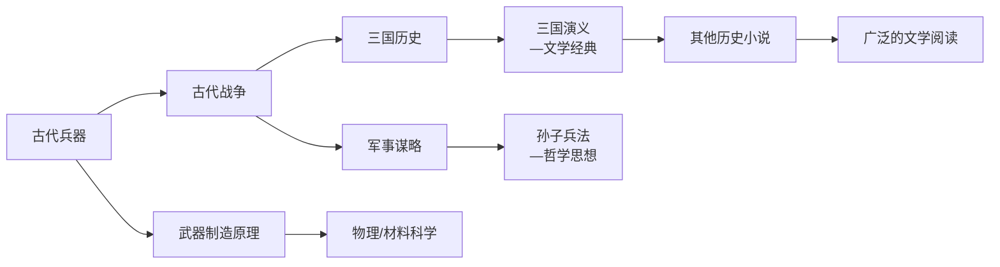
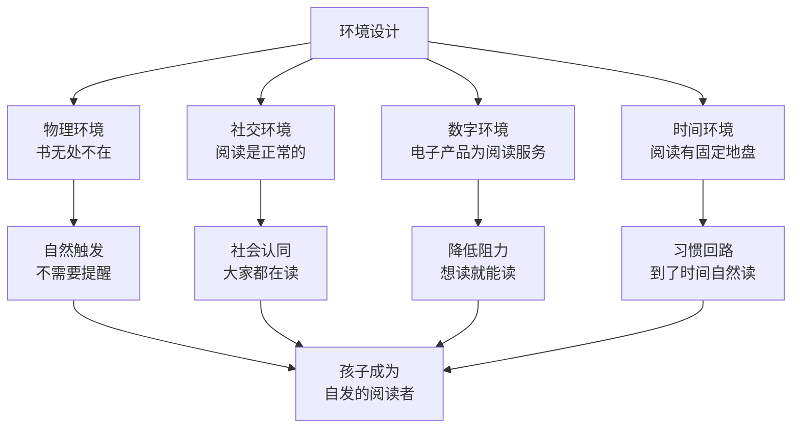

## 场景七：日常说服——让孩子爱上阅读

### 为什么"说服孩子阅读"是日常说服的顶级难题

在所有日常说服场景中，说服孩子养成阅读习惯是最具挑战性的一种。这并非主观判断——中国新闻出版研究院发布的《全国国民阅读调查报告》显示，2023年我国0-17周岁未成年人图书阅读率为86.2%，但其中"非常喜欢阅读"的仅占21.6%，超过半数属于"被动阅读"（被要求才读）。这意味着绝大多数孩子的阅读是外力驱动而非内驱力驱动。

这种困难源于三个结构性矛盾：

**第一，你不能用权力压服。** 职场说服失败了，大不了换个方案；客户谈判失败了，大不了丢一单。但亲子说服中，过度使用权威会导致亲子关系受损，而且"被迫阅读"本质上和"不阅读"一样无效——孩子会假装翻书、磨洋工、读了等于没读。更危险的是，强制阅读会让孩子在"阅读"和"不愉快"之间建立条件反射式联结，这种联结一旦形成，可能需要数年才能消除。

**第二，对手是整个娱乐产业。** 你在和短视频、游戏、社交媒体争夺孩子的注意力。这些产品背后有数以千计的行为设计师，专门研究如何让大脑分泌多巴胺。一个15秒的短视频能提供即时反馈和新鲜感，而一本200页的书需要数小时才能获得回报——从神经科学角度看，这两种活动对多巴胺回路的刺激强度完全不在一个量级。你用一句"读书有用"去对抗整个注意力经济，赢面极小。

**第三，改变的主体不是你。** 最终要培养的是孩子**内驱力**——不是"妈妈让我读"，而是"我想读"。这意味着说服的终极目标是让说服本身变得多余。这与其他说服场景有本质区别：商业说服追求的是"对方按照你说的做"，而亲子说服追求的是"对方不再需要你推就能自己做"。

本章通过一个完整的真实案例，拆解从"孩子完全不碰书"到"主动要求买新书"的全过程，涵盖学龄前到青春期的不同年龄段策略，让你掌握日常说服中最核心的方法论。

---

### 完整案例：刘女士如何让9岁儿子爱上阅读

#### 案例背景

刘女士是一位9岁男孩（小宇）的妈妈，全职工作，每天和孩子的有效相处时间约3小时（晚6点到9点）。小宇沉迷手机游戏（每天至少玩1.5小时），对阅读毫无兴趣。学校的阅读任务都是在最后时刻草草完成，作文经常被老师批注"内容空洞，缺乏素材"。

刘女士过去尝试过以下方法，全部失败：

| 方法 | 具体做法 | 短期效果 | 长期效果 | 为什么失败 |
|------|---------|---------|---------|-----------|
| 强制没收 | 直接没收手机，规定必须读书1小时 | 孩子坐在书桌前发呆 | 孩子学会偷藏旧手机 | 触发心理抗拒，孩子把阅读=惩罚 |
| 威胁 | "不读书就没收所有玩具" | 孩子哭闹后勉强翻了几页 | 孩子对书产生敌意情绪 | 将阅读与负面情绪绑定 |
| 说教 | "读书才能考好大学" | 孩子点头但无行动 | 孩子学会了"假听" | 空洞的长远道理无法驱动9岁儿童 |
| 榜样 | 刘女士自己在孩子面前读书 | 孩子偶尔好奇问一句 | 没有持续效果 | 缺乏参与感，孩子是旁观者 |

这四种失败方法恰好对应了说服中最常见的四个误区。在分析成功策略之前，先理解为什么这些方法注定失败。

---

#### 四种失败方法的原理分析

```mermaid
graph TD
    A[强制没收] --> B[心理抗拒理论<br/>Brehm, 1966]
    C[威胁惩罚] --> D[外在动机挤出效应<br/>Deci & Ryan, 1985]
    E[空洞说教] --> F[解释水平错配<br/>Construal Level Theory]
    G[单纯榜样] --> H[观察学习需要动机前提<br/>Bandura, 1977]
    
    B --> I[孩子感到自由被剥夺<br/>产生逆反行为]
    D --> J[外部奖励/惩罚削弱<br/>内在兴趣]
    F --> K[抽象远期目标<br/>无法驱动即时行为]
    H --> L[没有参与动机<br/>榜样无法被模仿]
    
    I --> M[全部失败的共同根源]
    J --> M
    K --> M
    L --> M
    M --> N[把阅读变成了<br/>"被迫的事"而非"想要的事"]
```

**误区一：强制=心理抗拒。** 心理学家Jack Brehm在1966年提出的心理抗拒理论（Psychological Reactance Theory）指出，当人感到自由被威胁时，会产生强烈的恢复自由的动机。对孩子来说，"你必须读书"= "我的自由被夺走了"，他们会本能地反抗，即使内心可能并不讨厌阅读本身。越聪明、越有主见的孩子，抗拒越强烈。实验数据表明，当被试者感到选择自由被威胁时，被限制的选项的吸引力会提升40%-60%——也就是说，你越禁止孩子玩游戏，游戏的吸引力反而越大。

**误区二：威胁=挤出效应。** 自我决定理论（Self-Determination Theory）的创始人Deci和Ryan在大量实验中证明，外部奖励和惩罚会削弱内在动机。这被称为"过度理由效应"或"挤出效应"——当你为一个行为附加了外部奖惩，孩子的大脑会把行为归因为"我是为了奖惩才做的"，而不是"我是因为喜欢才做的"。经典实验中，原本因为兴趣而画画的孩子，在获得物质奖励后，失去了奖励便不再画画。这个效应在儿童群体中尤为显著，因为儿童的认知灵活性较低，一旦建立"阅读=换取奖励"的框架，很难自行跳出来。

**误区三：说教=解释水平错配。** "读书考大学"对孩子来说是遥不可及的抽象目标。解释水平理论（Construal Level Theory）告诉我们，人在面对远期、抽象的目标时，缺乏行动驱动力。9岁孩子的时间概念里，"下周"已经很远了，"十年后上大学"基本等于不存在。神经科学研究显示，儿童的前额叶皮层（负责长远规划和延迟满足）要到25岁才完全成熟，用成年人的时间观念要求儿童是生理上不合理的。

**误区四：榜样不等于模仿。** 班杜拉的社会学习理论指出，观察学习需要四个条件：注意、保持、再现、动机。刘女士自己读书满足了"注意"，但小宇没有"再现"的动机——他不知道为什么要模仿这个行为。单纯的榜样展示只有在观察者已经具备模仿动机的前提下才有效。这也是为什么"别人家的孩子"的榜样不仅无效，反而有害——它只触发了比较焦虑，没有提供可模仿的路径。

---

#### 刘女士的五阶段说服策略

##### 第一阶段：消除敌意——停止一切强制行为

**时间：第1-2周**

刘女士做的第一件事，是和小宇进行了一次"平等对话"：

> "小宇，妈妈之前对你发过脾气，逼你看书，这样做不对。读书是你的事，你什么时候想读就读，不想读就不读。妈妈不会再强迫你了。"

这次对话有三个关键要素：（1）承认自己过去做错了——这让孩子感到被尊重；（2）明确归还选择权——这消除了威胁感；（3）不附加任何条件——"不会强迫你"后面没有"但是你至少要……"。

同时，她做了两件关键的事：
1. **把家里所有的书都从书桌上撤走**，放到客厅的开放式书架上——不再有任何"你该读书了"的环境暗示。
2. **恢复了正常的游戏时间**，不再用阅读做交换条件。

**原理拆解：**

这一步的核心是**消除条件反射式的敌意**。当孩子看到书就联想到"被逼""不开心""妈妈生气"时，任何后续的正面策略都会被这种负面联想抵消。必须先切断"书=负面情绪"的条件反射，才能重新建立"书=正面体验"的联想。

这在心理学中叫做**消退（Extinction）**——当条件刺激反复出现而不再伴随无条件刺激时，条件反射会逐渐减弱。刘女士需要一个"冷静期"，让小宇对书的负面情绪自然消退。根据行为心理学的实证研究，一个建立较深的条件反射通常需要2-4周的消退期，这也解释了为什么第一阶段需要持续两周。

> **关键提醒：** 这一步很多家长做不到。他们会觉得"放任不管孩子永远不会读书"。但实际上，带着敌意的"管"比"不管"更糟糕。你必须先退一步，才能前进两步。如果你跳过这一步直接进入后面的策略，效果会大打折扣——因为旧的条件反射会和新的正面体验相互干扰。

> **常见疑问：** "如果这两周孩子真的完全不碰书怎么办？"——完全没问题。这两周的目标不是让孩子读书，而是让孩子的神经系统对书的"威胁感"降为零。没有这一步的地基，后面的建筑全部会塌。

---

##### 第二阶段：重建连接——从孩子的需求出发

**时间：第3-4周**

刘女士开始用心观察小宇的游戏行为，不再批判，而是带着好奇心去了解。她甚至让小宇教她玩了几次游戏，这一步非常重要——它传递了一个信号："我对你的世界感兴趣，而不是只想改变你。"

她发现小宇玩的是一款RPG游戏，最喜欢的是"打副本"和"收集装备"。他能准确说出几十种武器的属性和克制关系，记忆力惊人。刘女士意识到：这不是一个"不爱学习"的孩子，而是一个拥有强烈好奇心和信息处理能力的孩子——只是这些能力目前只用在了游戏上。

一天晚饭时，刘女士"无意中"提起了一个话题：

> "我今天看到一个新闻，说考古学家挖出了一把2000年前的青铜剑，居然还能削铁如泥。你说游戏里那些武器跟真实的古代武器比，哪个更厉害？"

小宇立刻来了兴趣："真的吗？那古代有比游戏里还厉害的武器吗？"

刘女士说："我也不知道，要不咱查查看？"

**原理拆解：**

这段对话包含了三个精心设计的说服技术：

| 技术 | 具体运用 | 为什么有效 |
|------|---------|-----------|
| 喜好原则（Liking） | 从小宇感兴趣的游戏话题切入 | 人在面对自己喜欢的话题时，防御心理最低 |
| 好奇心缺口（Curiosity Gap） | "我也不知道"——制造信息缺口 | 乔治·洛温斯坦的好奇心理论：当人意识到自己知道的和想知道的之间存在差距时，会产生强烈的填补欲望 |
| 共同探索（Joint Discovery） | "咱查查看"——而不是"你去读" | 把"你的任务"变成"我们的活动"，消除对抗感 |

**为什么"我也不知道"这三个字是整个策略中最高明的地方？** 大多数家长在和孩子对话时，不自觉地扮演"我知道答案你来听"的权威角色。但当刘女士说"我也不知道"时，她做了两件事：（1）把自己从"教育者"降到了"探索伙伴"的位置；（2）暗示"答案不是我告诉你的，而是一起发现的"。这让孩子感觉知识的获取是自己主导的，而不是被灌输的。

刘女士带小宇去了书店。她没有直奔童书区，而是去了科普区，让小宇自己翻。小宇在一本《古代兵器大百科》面前停了下来——因为封面上有一把闪着寒光的戟。

> **转折时刻：** 小宇翻开书后发现，里面的古代武器比游戏里画得更酷、更有细节。他主动问妈妈："这本书可以买吗？"这是整个过程中第一次，小宇**主动**对一本书产生了兴趣。

**选书的关键细节：** 刘女士没有给小宇推荐任何"经典名著"或"教育部推荐书目"。她选的切入点是科普书——这类书有三个适合"阅读新手"的优势：（1）图文并茂，视觉吸引力强；（2）可以碎片化阅读，不需要连贯情节；（3）知识性强，孩子读完有"我学到了东西"的即时成就感。对于长期不阅读的孩子来说，一上来就推荐纯文字小说几乎是必败策略。

---

##### 第三阶段：设计体验——让阅读本身产生愉悦感

**时间：第5-8周**

买书只是开始。关键是让"读这本书"的体验足够好，好到孩子愿意读第二本。

**策略一：降低启动门槛**

刘女士没有要求小宇"每天读一小时"。她把《古代兵器大百科》放在小宇的床头，说："睡前随便翻两页就行，不用读完。"

**原理：** 这是登门槛技术（Foot-in-the-Door）的变体。"翻两页"是一个几乎不可能拒绝的小请求，但一旦翻开，孩子往往会继续读下去——因为好奇心会接管行为控制。行为经济学家理查德·塞勒把这叫"助推"（Nudge）：不是命令你做，而是让你更容易做。

**为什么"睡前"这个时间点特别好？** 睡前是孩子一天中防御心理最低的时段——没有作业压力，没有同伴竞争，大脑处于放松的α波状态。更重要的是，睡前的阅读会自然地过渡到睡眠，让孩子在潜意识中把"阅读"和"安心入睡"联系起来。长此以往，阅读就变成了"睡前仪式"的一部分，而仪式感是习惯养成最强大的催化剂。

**策略二：制造"炫耀资本"**

刘女士在家庭聚餐时，有意引导话题：

> "小宇最近研究古代兵器呢，知道三国时期的方天画戟到底多重吗？小宇，给你叔叔说说。"

小宇（得意地）："方天画戟大概有24斤重，但实际作战用的可能更轻，大概18斤左右。"

**原理：** 这是社会认同（Social Proof）加自我效能感（Self-Efficacy）的组合拳。当小宇在亲戚面前"炫耀"知识并获得赞赏时，他的大脑把"阅读→获取知识→被认可"这个链条连起来了。班杜拉指出，"掌握体验"（Mastery Experience）是自我效能感最强大的来源——小宇通过阅读获得了在游戏里也得不到的"被尊重感"。

**注意分寸：** "炫耀"必须是孩子主动愿意分享的，而不是被家长架上去表演的。刘女士的做法是"引出话题但不指定主角"——她只是抛出了一个话题，小宇可以接也可以不接。如果孩子表现出不自在，立刻收回，不要强行"表演"。过度的炫耀安排会让孩子感到被利用，反而产生抗拒。

**策略三：创造阅读社交**

刘女士发现小宇的好朋友小杰也喜欢军事类的东西。她邀请小杰来家里玩，并"不经意地"在茶几上放了几本军事科普书。两个男孩果然一起翻了起来，还讨论得热火朝天。

**原理：** 维果茨基的社会文化理论强调，学习本质上是一种社会活动。当阅读变成"和朋友一起做的事"而非"被妈妈逼着做的事"时，它的社会意义完全改变了。同伴效应在8-12岁儿童中的影响力甚至超过父母。发展心理学研究表明，9-10岁的儿童开始进入"同伴导向"阶段，同伴的行为和态度对其行为模式的塑造力是家长的1.5-2倍。

**策略四：善用"故事悬念"**

刘女士在小宇读完《古代兵器大百科》的某个章节后，"不经意地"提到：

> "你知道吗，这本书里提到的那个铸剑师干将，他老婆莫邪的故事更离奇。不过这个故事好像不在百科里，在另一本书里。"

**原理：** 这是蔡格尼克效应（Zeigarnik Effect）——未完成的任务比已完成的任务更让人记忆深刻、更想了解。当小宇知道有"更离奇的故事"但不知道具体内容时，好奇心的缺口被打开了，他会主动寻找下一个信息来源。这个技术的核心是：用一个故事的尾巴，勾出下一段阅读的开始。

---

##### 第四阶段：系统强化——从兴趣到习惯

**时间：第9-16周**

小宇已经对军事和历史类书籍产生了兴趣，但这种兴趣仍然局限于单一领域。刘女士需要做两件事：拓宽阅读范围，建立稳定习惯。

**策略一：兴趣迁移地图**

刘女士根据小宇现有的兴趣，画了一张"阅读迁移地图"：



每一步迁移都自然衔接。比如小宇读完《古代兵器大百科》后，刘女士问："你知道关羽的青龙偃月刀到底历史上存不存在吗？"这个问题自然引向了三国历史，进而引向《三国演义》。

**原理：** 这是"最近发展区"（Zone of Proximal Development）在阅读中的应用。维果茨基指出，最有效的学习发生在孩子"够一够能达到"的区域——既不是完全陌生的（太难），也不是已经知道的（太无聊）。每次迁移只跨一小步，确保小宇不会因为难度跳跃太大而放弃。

**迁移中常见的陷阱：**

| 陷阱 | 具体表现 | 后果 | 正确做法 |
|------|---------|------|---------|
| 跨度太大 | 从军事科普直接跳到《三国演义》原著 | 文言文和复杂情节让孩子放弃 | 先用白话版/漫画版过渡 |
| 家长主导 | "你读完兵器的该读历史了" | 孩子感到被安排，丧失自主感 | 用提问引导，让孩子自己发现关联 |
| 兴趣窄化 | 孩子只读军事，拒绝其他类型 | 阅读面无法拓宽 | 不急于拓宽，先让"军事读者"身份稳固，再自然迁移 |
| 急于求成 | 一个月内安排5本新书 | 信息过载导致放弃 | 一个月引入1-2本新书，给足消化时间 |

**策略二：积分系统的精妙设计**

刘女士设计了一套"阅读积分"系统，但这套系统的设计比表面看起来精密得多：

| 设计要素 | 具体规则 | 心理学原理 |
|---------|---------|-----------|
| 积分获取 | 每阅读30分钟=10积分 | 量化进步，满足成就需求 |
| 积分兑换 | 10积分=15分钟游戏时间 | 自主选择权——孩子决定何时兑换 |
| 额外奖励 | 读完一本书+50积分"完结奖励" | 可变比率强化（类似游戏的任务奖励机制） |
| 积分可见性 | 贴在冰箱上的积分表 | 进度可视化，创造"沉没成本"不愿放弃 |
| 选择自由 | 孩子自己决定读什么书 | 自主性满足——自我决定理论的核心需求 |
| 无惩罚 | 一天不读书不会扣积分 | 避免损失厌恶带来的负面情绪 |

**关键设计细节：** 积分兑换比例故意设为"阅读30分钟=游戏15分钟"，而非1:1。这不是为了减少游戏时间——实际上，通过积分系统，小宇的游戏时间反而从每天90分钟变成了"通过阅读赚取的45分钟+周末额外30分钟"，总量变化不大。真正的设计意图是：**让游戏时间从"默认权利"变成"自己挣来的奖励"**。这完全改变了孩子对游戏时间的心理体验——"赚来的"比"被允许的"更有成就感。

**积分系统的退出机制：** 这是很多家长忽略的关键点。积分系统是过渡工具，不是永久制度。当阅读习惯稳定后（通常是3-4个月），应该逐步淡化积分，比如从"每次计分"变为"每周统计一次"，最终过渡到完全不需要积分。退出的标准是：孩子即使没有积分也会自发阅读。如果停掉积分后阅读立刻消失，说明内化还没完成，需要继续但调整策略。

---

##### 第五阶段：内化身份——从"我在读书"到"我是读书人"

**时间：第17周以后**

这是最关键也最容易被忽略的阶段。习惯只是行为层面的改变，身份才是根本性的改变。

**策略一：语言锚定**

刘女士开始在日常对话中有意识地使用身份性语言：

- ~~"你今天读书了吗？"~~ → "你最近在读什么？"
- ~~"你要多读书"~~ → "你这么爱看书，知识面比妈妈还广"
- ~~"读完这本再玩游戏"~~ → "你们读书人真厉害，什么东西都能聊"

**原理：** 这是身份一致性效应（Identity-Based Habit），詹姆斯·克利尔在《原子习惯》中深入阐述了这一机制：当一个行为被内化为身份的一部分时，维持这个行为不再需要意志力。"我在读书"需要刻意安排时间，"我是读书人"则自然而然——因为读书人当然会读书。

**语言锚定的科学依据：** 斯坦福大学的研究表明，当人们用名词（"我是读书人"）而非动词（"我在读书"）来描述自己时，该行为的持续性提高约30%。这是因为名词暗示了身份属性，而身份属性比行为模式更稳定——你可以随时"停止做某事"，但你不会轻易"不再是某种人"。

**策略二：创造"作者感"**

刘女士鼓励小宇把从书中学到的知识写成"小文章"，发在家庭微信群里。爷爷奶奶的点赞和评论让小宇获得了双重满足：表达欲+被认可。

当小宇的作文因为引用了历史典故而被老师在全班朗读时，阅读和写作之间的正向循环正式启动了。

**原理：** 这是"宜家效应"（IKEA Effect）的延伸——人们对自己参与创造的东西赋予更高价值。当小宇不只是"输入"知识而是"输出"成果时，他对阅读的价值感知大幅提升。

**策略三：赋予"文化资本"的地位感**

刘女士发现小宇在和同学聊天时，偶尔会引用历史故事，其他同学觉得"好厉害"。她有意识地强化这个现象：

> "你同学都说你懂好多，这都是你自己读书读出来的，别人想学都学不来。"

**原理：** 皮埃尔·布迪厄的"文化资本"理论指出，知识和教养是一种无形的社会资本，可以在社交中转化为地位和影响力。当孩子意识到"读书让我在同伴中获得独特地位"时，阅读就从"妈妈要求的任务"变成了"我获得社交优势的工具"。这比任何外部奖惩都更持久、更有力。

---

#### 最终成果

经过四个月的系统性引导：

| 指标 | 改变前 | 改变后 |
|------|-------|-------|
| 每日阅读时间 | 0分钟（靠催促才翻几页） | 30-45分钟（自发行为） |
| 阅读类型 | 无 | 从军事历史扩展到科普、小说、漫画 |
| 游戏时间 | 90分钟（偷着玩可能更久） | 45-60分钟（积分兑换制） |
| 语文成绩 | 中下（作文扣分多） | 中上（老师评语"素材丰富"） |
| 亲子关系 | 对抗紧张 | 合作信任 |

更重要的是，小宇开始主动在作文中运用从书里读到的知识。有一次作文题目是"我最佩服的人"，小宇写了诸葛亮，从草船借箭写到空城计的心理博弈，还引用了《三国志》和《三国演义》的区别。老师在作文本上批注："阅读面非常广，继续保持！"

**这个案例的核心启示：** 整个过程没有一次强迫、没有一次惩罚、没有一次说教。所有的改变都建立在"理解→连接→体验→强化→内化"的自然递进之上。说服孩子阅读的最高境界，是让孩子觉得"读书是我自己想做的"——而事实上，他的确是自己想做的，只不过有人帮他搭建了通往这个想法的阶梯。

---

### 不同年龄段的说服策略差异

上面的案例针对9岁儿童，但不同年龄段的孩子需要完全不同的说服策略。核心原理相同，但技术运用差异很大。

#### 学龄前（3-6岁）：无意识植入期

这个阶段的孩子还没有"阅读"的概念，策略核心是**让书成为环境的一部分**。

| 策略 | 具体做法 | 原理 |
|------|---------|------|
| 环境浸润 | 家里到处放书，沙发旁、床头、餐桌边、厕所 | 曝光效应——熟悉产生好感 |
| 亲子共读 | 每天睡前读15-20分钟，声情并茂 | 经典条件反射：书=温暖+父母陪伴 |
| 互动式阅读 | 让孩子翻页、指图、猜情节 | 参与感创造"拥有感" |
| 角色扮演 | 读完故事后和孩子演出来 | 具身认知——身体参与加深记忆 |
| 选择权 | "今晚你选两本书" | 自主性满足——即便是小选择也重要 |
| 重复阅读 | 孩子要求反复读同一本书时，耐心满足 | 重复是幼儿学习的核心机制，每次重读都在加深理解 |

**绝对不要做的事：** 教认字、纠正发音、要求复述故事。这个阶段的目标是**好感**，不是**技能**。把阅读和"被纠正""做作业"联系起来，会摧毁整个阅读兴趣的基础。哈佛大学教育学院的研究明确指出：早期阅读体验的情感质量比识字速度更能预测孩子未来的阅读水平和阅读意愿。

**选书建议：** 学龄前选书的核心标准不是"教育价值"，而是"孩子是否愿意再听一遍"。优先选择：有韵律感的文字（如童谣、儿歌）、色彩鲜明的插图、有翻翻页或触摸元素的互动书、贴近孩子生活经验的故事（如上幼儿园、交朋友、害怕黑暗）。

#### 小学低年级（6-9岁）：兴趣点燃期

这个阶段是培养阅读习惯的**黄金窗口**。孩子已经具备基本的识字能力，开始建立自己的兴趣偏好，但尚未被电子产品完全占据。

| 策略 | 具体做法 | 原理 |
|------|---------|------|
| 漫画过渡 | 先从漫画版读物入手（如《半小时漫画》系列） | 登门槛技术——降低初始门槛 |
| 系列书策略 | 找到孩子喜欢的系列，一本接一本读 | 承诺一致性——"我已经读了前三本了" |
| 同伴社交 | 组织"读书小团体"，和朋友一起读同一本书 | 社会认同+竞争心理 |
| 读→讲循环 | 让孩子给你"讲"书里的故事 | 费曼学习法——教是最好的学 |
| 图书馆仪式 | 每周末固定去图书馆，让孩子自己选书 | 环境线索+仪式感强化习惯 |
| 听书+读结合 | 用有声书（如凯叔讲故事）激发兴趣，再引导读纸质书 | 听觉先行降低阅读门槛，好奇心驱动转为自主阅读 |

**关于漫画的争议：** 很多家长认为漫画"不算阅读"，这是一个严重的认知误区。日本的研究数据表明，漫画阅读量大的孩子在中学阶段的阅读理解能力并不逊色于纯文字阅读者。漫画培养的是图像叙事理解能力、信息整合能力、以及持续阅读的注意力耐力——这些都是纯文字阅读的前置技能。**任何阅读都比不阅读好**，这是这个阶段最重要的原则。

#### 小学高年级（9-12岁）：习惯巩固期

这个阶段孩子开始追求独立和同伴认同，"妈妈让我读"的效果急剧下降。策略核心是**让孩子感到阅读是自己的选择**。

| 策略 | 具体做法 | 原理 |
|------|---------|------|
| 问题驱动 | 提出孩子好奇的问题，让书成为"答案来源" | 好奇心缺口 |
| 生活链接 | 把书中的知识和孩子的日常生活联系起来 | 具体化——抽象知识变为实用价值 |
| 尊重选择 | 即使孩子选了你觉得"没营养"的书也不要阻止 | 任何阅读都比不阅读好 |
| 输出渠道 | 鼓励写读书笔记、做手抄报、给朋友推荐 | 输出倒逼输入+成就感 |
| 家庭讨论 | 读同一本书后讨论观点 | 阅读成为社交活动而非孤立任务 |
| 书评社交 | 鼓励孩子在班级或网上写书评、推荐书 | 社交反馈强化阅读动机 |

**这个阶段的核心矛盾：** 家长想让孩子读"好书"（经典名著、科普百科），孩子想读"有趣的书"（漫画、网络小说、游戏攻略）。解决这个矛盾的关键认知是：**阅读兴趣的培养是先"广"后"精"的**。一个从不阅读的孩子如果因为《米小圈上学记》而爱上了阅读，这比一个被迫读《红楼梦》却从此厌恶阅读的孩子，在未来10年内的阅读量会高出数倍。

#### 青春期（12-18岁）：独立阅读者塑造期

青春期的孩子最抗拒"被安排"。你不能再说"你应该读这本书"，因为他们会本能地拒绝一切来自父母的指令。

| 策略 | 具体做法 | 原理 |
|------|---------|------|
| 退居幕后 | 不再推荐具体书目，改为提供"选书的资源" | 自主性需求——尊重边界 |
| 真诚好奇 | 对孩子在读的书表现出真正的好奇 | 平等对话取代居高临下 |
| 共同兴趣 | 读孩子感兴趣的书，进行"成年人对等"的讨论 | 关系质量决定影响效果 |
| 社交场景 | 让孩子在同龄人中因"博学"获得地位 | 同伴认同是青春期最强驱动力 |
| 生活验证 | 在生活中自然展示"读过书的人看世界的不同" | 身份认同而非行为控制 |
| 尊重隐私 | 不翻看孩子正在读的书，不追问内容 | 信任是青春期亲子关系的基石 |

**青春期的特殊挑战：** 这个阶段孩子可能开始接触一些家长认为"不合适"的书籍（如言情小说、推理悬疑、网络文学）。处理原则是：**除非内容确实有害（如暴力、色情），否则不要禁止**。理由有二：（1）禁止只会增加好奇心和偷读的刺激感；（2）阅读偏好会随着年龄和阅历自然进化，今天读网络小说的孩子，明天可能因为其中某个引用而去读经典。读书的品味是"长"出来的，不是"管"出来的。

---

### 特殊场景：当孩子有注意力或阅读困难时

并非所有孩子都只需要"点燃兴趣"就能爱上阅读。一些孩子面临更深层的挑战，需要额外的策略支持。

#### 注意力缺陷多动障碍（ADHD）儿童的阅读策略

ADHD儿童的阅读困难不是"不想读"，而是"坐不住"。他们的大脑对即时反馈的需求比普通儿童更强，对延迟满足的耐受度更低。

| 策略 | 具体做法 | 原理 |
|------|---------|------|
| 超短阅读 | 从每次5分钟开始，逐步延长 | ADHD儿童的注意力持续时间较短，强迫延长只会产生挫败感 |
| 高互动书 | 选择有迷宫、解谜、互动元素的书 | 频繁的互动提供即时反馈，匹配ADHD大脑需求 |
| 站立/走动阅读 | 允许孩子站着、走着、甚至倒立着读书 | 身体运动帮助ADHD儿童维持注意力水平 |
| 番茄阅读法 | 读10分钟→休息3分钟（做喜欢的事）→再读10分钟 | 间隔强化比连续强化更适合ADHD |
| 有声书同步 | 边听有声书边看纸质书 | 双通道输入提高注意力维持时间 |
| 环境极简化 | 阅读时周围没有任何干扰物（玩具、手机、宠物） | ADHD儿童的干扰过滤能力弱，需要外部帮助 |

**重要提醒：** 如果孩子被诊断为ADHD，阅读困难很可能只是表面问题之一。建议同时寻求专业的行为治疗和/或药物治疗。本章的策略是辅助手段，不能替代专业干预。

#### 阅读障碍（Dyslexia）儿童的支持策略

阅读障碍是一种神经发育性的学习困难，全球约5%-10%的儿童受影响。这类孩子不是"不努力"，而是大脑在处理文字符号时存在困难。

| 策略 | 具体做法 | 原理 |
|------|---------|------|
| 有声书优先 | 用有声书替代纸质书作为主要阅读形式 | 绕过文字解码困难，直接获取内容 |
| 大字版/特排版 | 选择大字号、宽行距、 dyslexia-friendly字体的版本 | 减少视觉拥挤效应，降低阅读疲劳 |
| 指读工具 | 使用尺子或指读卡辅助定位文字行 | 减少跳行和漏字 |
| 多感官学习 | 边读边用手指在沙盘上写字、用橡皮泥捏出文字形状 | 多感官通道强化文字记忆 |
| 避免朗读考核 | 不要求孩子在人前朗读 | 减少焦虑和羞耻感，保护阅读自尊 |

**核心原则：** 对阅读障碍儿童来说，**听书是阅读的合法形式**。不要因为孩子"读不了纸质书"就认为他"不爱阅读"。很多伟大的作家和思想家（如爱因斯坦、史蒂芬·斯皮尔伯格）都有阅读障碍。保护孩子对知识的好奇心，比强迫他用一种不适合他的方式"阅读"重要一百倍。

---

### 日常说服孩子的十大核心原则

从上述案例和年龄策略中，可以提炼出说服孩子（其实也适用于成人）的十大核心原则：

#### 原则一：先修关系，再谈改变

孩子只会被自己信任和喜欢的人说服。如果亲子关系紧张，任何说服技巧都是空中楼阁。修关系不是"讨好孩子"，而是让孩子感受到：你尊重他的感受、他的选择、他作为独立个体的价值。

约翰·鲍尔比的依恋理论研究表明，安全型依恋关系中的儿童更愿意尝试新事物、接受父母的引导。而安全型依恋的核心不是"给够物质"，而是"情感回应的及时性和一致性"。具体到阅读场景：当孩子主动跟你分享书里的内容时，放下手机认真听——这一刻的回应质量，比你买100本书都重要。

#### 原则二：理解先行，说服在后

在提出任何建议之前，先花足够的时间去理解孩子为什么这样想、这样做。小宇喜欢游戏不是因为"贪玩"，而是因为游戏满足了他的成就需求、社交需求和自主感需求。当你真正理解了原因，解决方案自然浮现。

#### 原则三：兴趣是最好的入口

不要试图让孩子对"阅读"产生兴趣——这太抽象了。让孩子对**某个具体话题**产生兴趣，然后让书成为满足这个兴趣的工具。喜欢恐龙的孩子会主动翻恐龙百科；喜欢太空的孩子会追着看天文科普。兴趣不来自阅读，阅读来自兴趣。

#### 原则四：降低门槛，降低门槛，降低门槛

重要的事情说三遍。"每天读一小时"太难了。"睡前翻两页"——这个谁都能做到。一旦开始，继续下去比开始容易得多。行为科学家BJ·福格指出：**让行为更容易发生，比让人更有动机去做，效果好十倍。**

#### 原则五：让孩子自己选

选什么书、什么时候读、读多长时间——尽可能多的决定权交给孩子。自主感是内在动机的三大支柱之一（另外两个是胜任感和归属感）。当孩子觉得"这是我的选择"时，执行力会大幅提升。

#### 原则六：把阅读变成社交活动

人是社会动物。和朋友一起读、和父母一起讨论、在班级里分享——当阅读从"孤独的苦差事"变成"有趣的社交活动"时，性质完全变了。

#### 原则七：制造"哇"的时刻

小宇翻到《古代兵器大百科》时的那个"哇"，是一切的起点。你需要帮孩子找到那个让他惊叹的"哇"——可能是恐龙的震撼、宇宙的浩瀚、历史的跌宕、人体的神奇。每个孩子都有自己的"哇"点。

**如何找到孩子的"哇"点？** 观察法：注意孩子在看视频时会在哪些内容上停下来、反复看。提问法：问孩子"如果你能穿越到任何一个时代/地方，你想去哪？"孩子脱口而出的答案，就是他的"哇"点所在。

#### 原则八：不要用阅读惩罚孩子

"你犯错了，罚你读一小时书"——这种做法把阅读等同于惩罚，是最具破坏性的做法之一。它会让孩子对书建立条件反射式的厌恶，而且这种厌恶可能持续很多年。类似的做法还有："不许玩了，去读书"（暗示读书是玩的对立面，是无聊的事）、"考试考这么差，以后每天多读一小时"（暗示阅读是对学习差的惩罚）。

#### 原则九：奖励过程，而非结果

"读完10本书奖励一个玩具"——这是结果导向的奖励，会让孩子为了完成数量而囫囵吞枣。更好的做法是奖励阅读过程本身："读了30分钟的阅读时间，你赚到了15分钟的游戏时间。"重点放在"读"这个行为上，而不是"读完"这个结果上。

**更深层的思考：** 理想状态下，连过程奖励都应该逐步撤除。外部奖励是"拐杖"，最终目标是让孩子在没有拐杖的情况下也能行走。判断标准：如果停掉所有奖励后孩子仍然阅读，说明内化成功；如果停掉奖励阅读就消失，说明你只是用一种外部动机替代了另一种。

#### 原则十：耐心等待，不要急于求成

习惯的建立需要时间。心理学研究表明，一个新习惯的形成平均需要66天（不是流行的21天）。而且阅读习惯的建立可能更久，因为它需要跨越多个阶段：从抗拒→接受→喜欢→习惯→身份认同。每个阶段都需要时间，不能跳过。

---

### 选书方法论：如何为孩子找到"对的那本书"

很多家长的困惑不在于"怎么让孩子读"，而在于"让孩子读什么"。选书是一门技术活，选对了入口书，后面的路会顺畅很多。

#### 选书的四个黄金法则

**法则一：尊重孩子的选择权，但提供有质量的选项**

不要直接说"你自己去选吧"然后把孩子扔进书店——这会让选择过载。正确的做法是：提前做功课，找到5-8本不同类型但都符合孩子兴趣的书，然后让孩子从这个范围里选。这既保证了自主感，又避免了选择瘫痪。

**法则二：第一本书的难度必须低于孩子的阅读能力**

这违反直觉但至关重要。第一本书的目标不是"学习"，而是"建立信心和愉悦感"。如果第一本书太难，孩子会把"阅读=挫败"而不是"阅读=快乐"。宁可让孩子觉得"这本书太简单了"也不要让他觉得"这本书好难"。简单的书读完的速度快，读完的成就感会驱动下一本。

**法则三：系列书优于单本书**

找到孩子喜欢的系列书（如《哈利·波特》《查理九世》《大中华寻宝记》），效果远好于一本一本孤立的书。原因有三：（1）熟悉的人物和世界观降低了每次新开一本的认知成本；（2）"我已经读了前三本了"的承诺一致性驱动力会让孩子主动追下去；（3）系列书提供了长期的阅读目标感。

**法则四：定期轮换"舒适区"和"挑战区"**

在孩子建立了稳定的阅读习惯后，偶尔引入一本略高于当前水平的书。但引入的方式很关键——不要说"你应该试试更有深度的"，而是用好奇心缺口引导："你读的那本《三国演义》里提到的空城计，有一本心理学的书专门分析了这个计策为什么能成功，特别有意思。"

#### 年龄段推荐书目参考

以下推荐仅作起点参考，实际选书应以孩子的兴趣和阅读水平为准：

| 年龄段 | 类型 | 推荐示例 | 选择理由 |
|--------|------|---------|---------|
| 3-6岁 | 绘本 | 《好饿的毛毛虫》《猜猜我有多爱你》 | 经典、韵律感强、插图精美 |
| 3-6岁 | 互动书 | 《点点点》《小金鱼逃走了》 | 动手参与、游戏化阅读 |
| 6-9岁 | 漫画科普 | 《半小时漫画》系列、《大中华寻宝记》 | 降低文字门槛、趣味性强 |
| 6-9岁 | 故事书 | 《米小圈上学记》《窗边的小豆豆》 | 贴近校园生活、引发共鸣 |
| 9-12岁 | 科幻冒险 | 《哈利·波特》《纳尼亚传奇》 | 想象力丰富、有系列效应 |
| 9-12岁 | 科普 | 《万物简史（少年版）》《DK百科》 | 知识密度高、满足好奇心 |
| 12-15岁 | 文学经典 | 《杀死一只知更鸟》《牧羊少年奇幻之旅》 | 深度思考、价值观启蒙 |
| 12-15岁 | 社科入门 | 《人类简史（少年版）》《苏菲的世界》 | 宏观视野、哲学思维 |
| 15-18岁 | 自主选择 | 尊重孩子自行选择 | 自主性是青春期第一需求 |

---

### 常见失败模式与纠正方案

| 失败模式 | 典型表现 | 根本原因 | 纠正方案 |
|---------|---------|---------|---------|
| 虎头蛇尾 | 前两周热情高涨，第三周放弃 | 期望过高+缺乏系统 | 设计可持续的小习惯，而非宏伟计划 |
| 选书错配 | 给孩子买了"好书"但孩子不看 | 用成人的标准选书 | 让孩子自己选，哪怕选漫画、笑话书 |
| 监控过度 | 每5分钟问"读到哪了""记住了什么" | 不信任孩子+焦虑传递 | 退出孩子的阅读空间，只在孩子主动分享时回应 |
| 比较伤害 | "你看人家小明一年读50本" | 比较不会产生动力，只产生怨恨 | 只和孩子自己的过去比："比上个月多读了一本呢" |
| 只读"有用的" | 只允许读教辅和名著 | 功利心态 | 所有阅读都有价值，漫画培养图像叙事能力，笑话书培养语感 |
| 忽视电子产品 | 完全禁止手机游戏 | 对抗只会激发更大的欲望 | 游戏和阅读共存，关键是平衡和优先级 |
| 表扬空洞 | "你真棒""你真聪明" | 空洞表扬没有指导意义 | 具体化表扬："你选的这本书眼光真好""你能把这段讲给我听，说明你读得很用心" |
| 过早撤退 | 孩子刚有兴趣就放手不管 | 误以为"有了一本就够了" | 兴趣萌芽期最脆弱，需要持续提供新书和新话题 |

---

### 进阶：从"说服"到"设计环境"

最高层次的说服，不是说服孩子去读书，而是**设计一个让孩子自然想读书的环境**。

环境设计的四个维度：

**物理环境——让书无处不在**
- 客厅：开放式书架（不是封闭的柜子），书脊朝外，色彩丰富
- 卧室：床头灯旁放书，而不是充电器旁放手机
- 卫生间：放几本轻松的杂志或短篇集
- 车里：后座口袋放几本书
- 餐桌旁：放一本最近在读的书（偶尔在吃饭时翻两页是好的示范）

**社交环境——让阅读成为"正常的事"**
- 家里有"读书角"，每个人都有自己的阅读时间
- 家庭讨论中自然引用读到的内容
- 送礼时优先考虑书
- 朋友圈里有爱读书的人

**数字环境——让电子产品为阅读服务**
- 在平板上装阅读App（微信读书、Kindle等），让孩子用电子产品读书
- 利用听书App（喜马拉雅、凯叔讲故事）作为过渡
- 控制短视频时间，但不要完全禁止——关键是"阅读也有，短视频也有"

**时间环境——让阅读有固定的"地盘"**
- 睡前20分钟是"家庭阅读时间"，全家人都在读
- 周末有一个固定的"图书馆时间"
- 旅行时带书，在飞机、火车上阅读



> **核心洞见：** 当环境设计到位时，说服变得多余。你不需要说服一个在满是书的家庭里长大的孩子去读书——就像你不需要说服一个在厨房长大的孩子喜欢美食一样。环境是最沉默、也最强大的说服者。

---

### 可复用的操作模板

#### 模板一：兴趣-书籍匹配表

当孩子有一个兴趣点时，用这张表找到对应的书：

| 孩子的兴趣 | 入门书（第一本） | 扩展书（第二阶段） | 迁移方向 |
|-----------|----------------|------------------|---------|
| 恐龙 | 《恐龙大百科》 | 《古生物化石的故事》→地质学 | 地球科学→环境科学 |
| 游戏 | 游戏改编漫画/小说 | 《游戏设计的艺术》→编程入门 | 创造力→学习编程 |
| 足球 | 《足球明星传记》 | 《运动中的科学》→物理 | 科学素养 |
| 烹饪 | 《儿童食谱》 | 《食物的科学》→化学 | 科学实验 |
| 星空 | 《DK宇宙大百科》 | 《时间简史》（少年版）→物理 | 哲学思考 |
| 动画 | 官方设定集/漫画 | 《动画的艺术》→美术设计 | 创意表达 |
| 音乐 | 音乐家传记 | 《声音的科学》→声学/物理 | 科学素养 |

#### 模板二：阅读习惯启动清单

□ 第1周：停止一切强制阅读行为，进行一次平等对话
□ 第2周：观察孩子的真实兴趣点，不批判、纯记录
□ 第3周：找到兴趣与书籍的连接点，准备5本候选书
□ 第4周：带孩子去书店/图书馆，让他从候选书中自己选
□ 第5-6周：创造"翻书"的小机会（床头、沙发上），每天不设目标
□ 第7-8周：第一次"炫耀"机会（创造让孩子给别人讲书里知识的场景）
□ 第9-10周：引入阅读伙伴（邀请喜欢同类话题的朋友一起读）
□ 第11-12周：设计积分系统（如有必要），注意设计退出机制
□ 第13-16周：拓宽阅读类型（用兴趣迁移地图逐步引导）
□ 第17周以后：身份锚定——使用身份性语言，创造"作者感"

#### 模板三：每日对话脚本

**好的对话方式：**
- "你最近在读什么有意思的东西吗？"（开放、好奇）
- "这本书最让你惊讶的地方是什么？"（邀请分享感受）
- "你给我说说呗，我也想知道。"（表达真诚兴趣）
- "你比我懂得多了。"（赋能、身份强化）
- "你是怎么知道这个的？在哪本书里看到的？"（强化"阅读→知识"的连接）

**不好的对话方式：**
- "今天读书了吗？"（监控感）
- "读了几页了？"（量化考核感）
- "读完这本我再给你买下一本。"（条件交换）
- "你同学都读了十本了。"（比较施压）
- "这本书有什么感想？写个读后感吧。"（把阅读变成作业）

---

### 家长常见疑虑FAQ

**问：孩子只看漫画不看文字书怎么办？**

答：恭喜你，你的孩子在阅读。漫画是阅读的合法形式，而且是文字阅读的优秀跳板。不要急于把孩子从漫画"升级"到文字书。正确的做法是：在孩子读的漫画领域找到同主题的文字书，自然引入。比如孩子喜欢《三国》漫画，就可以在他读完某一段后说"你知道吗，原著里这段的描写比漫画更精彩，因为……"。好奇心会驱动跨越。

**问：孩子阅读速度很慢，是不是能力有问题？**

答：不一定。阅读速度和年龄、阅读经验、文本难度都相关。一个刚开始培养阅读习惯的孩子，速度慢是正常的——他在同时处理文字解码和内容理解两层任务。随着阅读量的积累，速度会自然提升。不要催促，不要计时，不要和别人比较。如果你确实担心有阅读障碍的可能，建议寻求专业评估。

**问：电子书和纸质书哪个好？**

答：研究结论是：对于阅读理解和记忆，纸质书略优于电子书（因为翻页提供了空间记忆线索，有助于内容定位）。但对于培养阅读习惯，形式不重要——重要的是"在读"。如果孩子更愿意在平板上读书，就让他在平板上读。等习惯稳定后，再自然引入纸质书。听书也是阅读的合法形式，尤其适合通勤、做家务等场景。

**问：孩子读完书记不住内容怎么办？**

答：首先，"记不住"≠"没用"。阅读对大脑的影响是潜移默化的：词汇量的积累、句式的感觉、思维方式的拓展，这些都不需要逐字记忆就能沉淀。其次，如果你确实希望加深记忆，最好的方式不是"考孩子"，而是让孩子"讲给你听"——复述是最有效的记忆巩固手段，但它应该是孩子主动愿意做的，而不是被要求做的。

**问：孩子已经十几岁了，还能培养阅读习惯吗？**

答：任何时候开始都不晚，但策略需要调整。青春期的孩子不会再被"妈妈推荐的书"打动，但会被同伴、偶像、社交需求驱动。具体策略参考前文"青春期"部分。核心要点：不要试图"补课"（"你小时候没读的书现在要补回来"），而是从孩子当前的兴趣和需求出发。

**问：家里经济条件有限，买不起很多书怎么办？**

答：图书馆是最好的免费资源。很多城市的公共图书馆可以免费借阅，部分还提供线上借阅服务。此外，微信读书等App提供大量免费电子书。一些社区和学校也有图书漂流活动。重要的不是"拥有多少书"，而是"书是否随手可得"——哪怕家里只有20本书，如果放在孩子随处可见的地方，效果也比200本书锁在柜子里好。

---

### 总结：说服孩子爱上阅读的底层逻辑

说服孩子爱上阅读，本质上不是"说服"，而是**帮助孩子发现阅读能满足他原本就有的需求**。每个孩子都有好奇心、成就需求、社交需求和自主感需求——阅读恰好是一种同时满足这四种需求的活动。问题是，在很多家庭中，阅读被错误地与惩罚、无聊、被控制联系在一起，遮蔽了它本有的吸引力。

你的任务不是"说服孩子读书"，而是**搬开那些遮蔽物**——停止强制、消除敌意、重建连接、设计体验、然后耐心等待。当你做对了所有前置步骤，阅读习惯会自己生长出来，就像种子只需要合适的土壤和阳光，不需要被命令发芽。

记住这个核心模型：


说服的最高境界，是让被说服者觉得一切决定都是自己做的。在阅读这件事上，你做到了——孩子会觉得"我就是喜欢读书"，而你知道，这份喜欢是你精心搭建的阶梯引导出来的。但那又怎样呢？结果是好的，过程是温暖的，关系是健康的。这不就是最好的说服吗？
