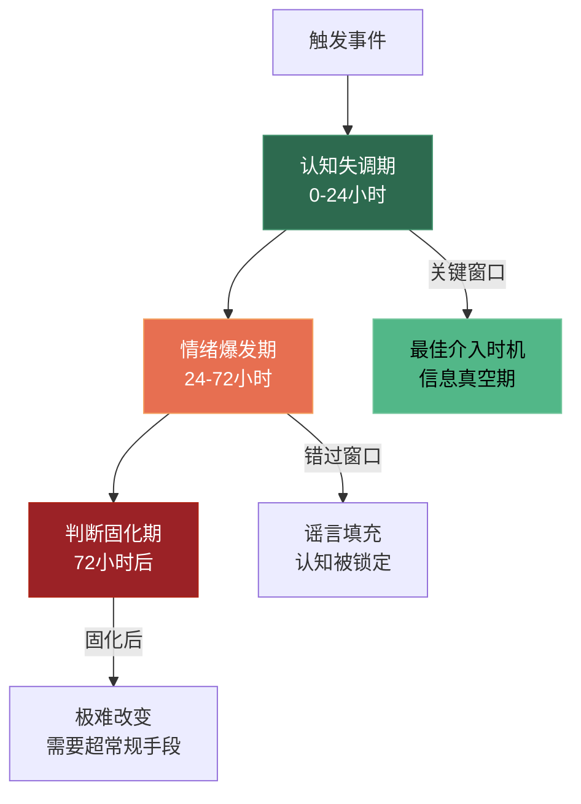
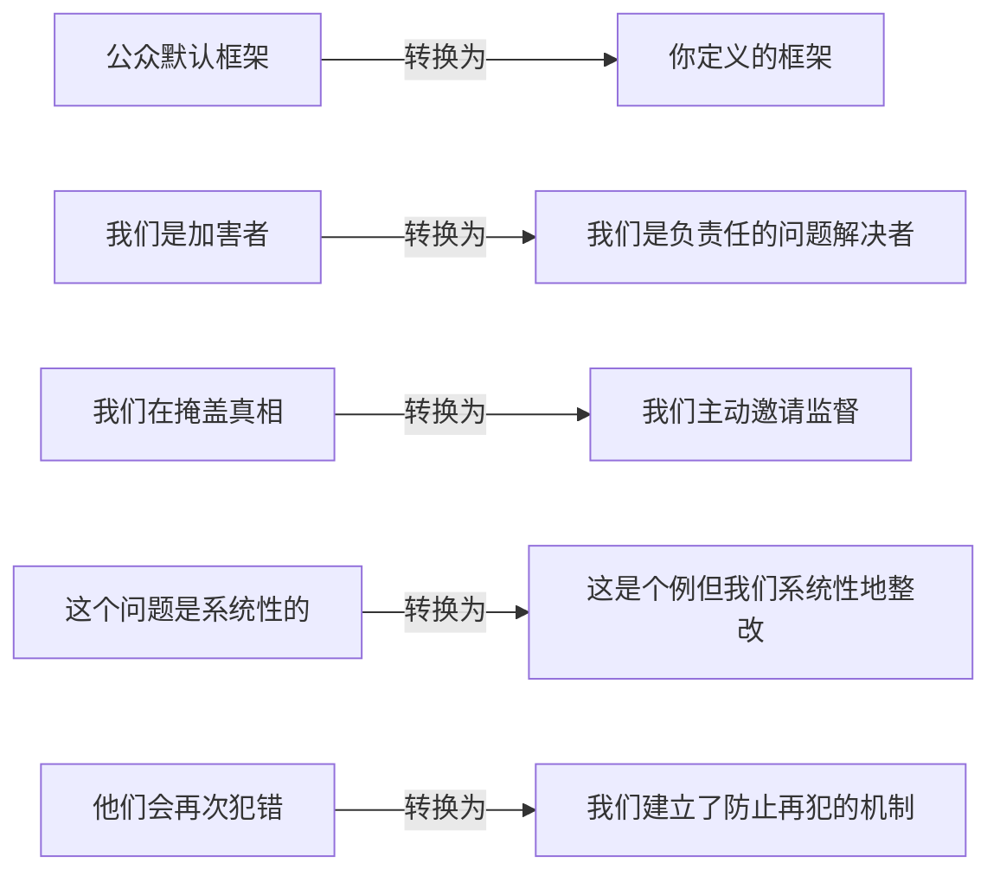
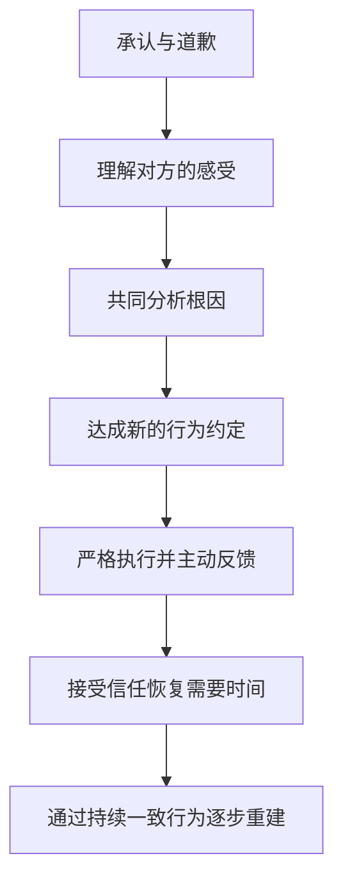

## 场景八：危机说服——在信任崩塌时重建关系

信任崩塌是所有说服场景中最极端的一种——你面对的不是一个犹豫不决的听众，而是一个已经对你产生负面判断的人。此时常规说服技巧不仅无效，甚至会适得其反。危机说服需要一套完全不同的逻辑框架：先止血，再重建，最后超越。

本章将从组织危机和个人关系两个维度，系统拆解信任崩塌的心理学机制、四阶段修复模型、数字化时代的特殊挑战，以及可直接套用的话术模板和评估工具。

### 信任崩塌的心理学机制

#### 信任的不对称性

信任的建立和崩塌遵循一个残酷的不对称公式：

| 维度 | 建立信任 | 摧毁信任 |
|------|----------|----------|
| 时间 | 数月至数年 | 一次事件即可 |
| 行为数量 | 需要数十次正面行为累积 | 一次负面行为即可触发 |
| 修复成本 | 1x（基准） | 5-15x（心理学研究数据） |
| 记忆深度 | 渐进式淡化 | 峰终定律强化 |

诺贝尔经济学奖得主丹尼尔·卡尼曼的研究表明：人类对负面信息的敏感度是正面信息的2-5倍（损失厌恶效应）。这意味着你需要付出5倍以上的正面努力才能抵消一次负面事件的影响。

**为什么进化塑造了这种不对称？** 从生存角度看，忽略一个危险信号的代价（死亡）远大于忽略一个机会信号的代价（错过一顿饭）。大脑的杏仁核对负面信息的处理速度比正面信息快约200毫秒——这200毫秒在危机场景中决定了公众的第一反应是愤怒还是观望。

#### 信任崩塌的三个阶段

**认知失调期（0-24小时）**：公众得知消息后，心理上处于"信息饥渴"状态——他们需要一个解释来填补认知空白。此时谁先给出可信的叙事框架，谁就能主导公众认知。这就是危机公关中"黄金4小时法则"的心理学基础。认知失调理论（Leon Festinger, 1957）指出，当人们面对与既有信念矛盾的信息时，会产生强烈的心理不适，驱使他们迅速寻找一个能够消除矛盾的解释——无论这个解释是否准确。

**情绪爆发期（24-72小时）**：愤怒、失望、背叛感集中爆发。社交媒体成为情绪放大器。此时公众不是在"理性评估事实"，而是在"宣泄情绪和寻找替罪羊"。任何试图理性解释的行为都会被解读为"狡辩"。神经科学研究显示，强烈情绪状态下前额叶皮层（负责理性思考）的活动会被杏仁核（负责情绪反应）抑制，这就是为什么"讲道理"在愤怒高峰期完全无效。

**判断固化期（72小时后）**：公众形成稳定判断，后续信息会被选择性接受（确认偏误）。如果没有在前两个阶段有效介入，此后改变公众认知的成本将呈指数级增长。社会心理学中的"首因效应"使得人们倾向于信任最先接触到的信息版本，后续的修正信息即使更准确，也难以覆盖最初的印象。

#### 信任的四个维度

组织行为学家Roger Mayer提出的信任四维度模型指出，信任由四个要素构成，危机可能导致其中一个或多个维度崩塌：

| 维度 | 含义 | 崩塌表现 | 修复重点 |
|------|------|----------|----------|
| 能力信任 | 相信你有能力做到 | 产品质量事故、服务失败 | 展示改进后的专业能力 |
| 善意信任 | 相信你关心我的利益 | 数据泄露、价格欺诈 | 展示利他动机和牺牲 |
| 正直信任 | 相信你遵守道德原则 | 造假、腐败、言行不一 | 展示制度约束和透明度 |
| 可预测信任 | 相信你的行为一致 | 突然改变政策、背弃承诺 | 展示行为模式的稳定性 |

不同类型的信任崩塌需要不同的修复策略。用"展示善意"的方式去修复"能力信任"问题，就像用创可贴去包扎骨折——方向完全错误。

**诊断工具：信任维度定位矩阵**

在制定修复策略之前，先用这个矩阵定位信任崩塌的核心维度：

| 诊断问题 | 如果答案是"是" | 核心崩塌维度 |
|----------|---------------|-------------|
| "他们是不是做不到了？" | 能力信任受损 | → 重点展示能力恢复 |
| "他们是不是不在乎我？" | 善意信任受损 | → 重点展示利他动机 |
| "他们是不是在骗我？" | 正直信任受损 | → 重点展示透明度和制度 |
| "他们会不会又变卦？" | 可预测信任受损 | → 重点展示行为一致性 |

大多数危机场景会同时涉及2-3个维度，但一定有一个主导维度。修复策略必须以主导维度为核心，其他维度为辅助。主导维度判断错误，修复努力的效率会降低60%以上。

### 数字化时代的信任崩塌加速机制

传统时代的信任崩塌以"天"为单位传播，数字化时代以"分钟"为单位。理解这个加速机制是有效应对的前提。

#### 社交媒体的情绪放大效应

**算法推荐的"愤怒偏好"**：社交平台的推荐算法以"互动率"为核心指标，而愤怒内容的互动率是正面内容的2-3倍（MIT研究数据）。这意味着一旦负面内容开始传播，算法会自动将其推送给更多人——你面对的不仅是信息传播，更是一个自动化的放大机器。

**群体极化效应**：当持有相似负面看法的人在评论区聚集时，群体讨论会使个体的极端态度进一步加剧。原本只是"不满"的个体，经过评论区互动后可能升级为"愤怒"甚至"抵制"。

**搜索结果的长期阴影**：危机事件一旦被搜索引擎收录，会在搜索结果中停留数年甚至永久。即使信任已经修复，潜在客户搜索品牌名时首先看到的仍是危机报道。这就是为什么危机后的SEO管理（发布大量正面内容压制负面搜索结果）是信任重建的必要组成部分。

#### 传播速度对比

| 时代 | 传播速度 | 影响范围 | 修复窗口 | 典型工具 |
|------|----------|----------|----------|----------|
| 传统媒体时代 | 数天 | 区域性 | 数周 | 新闻发布会、声明稿 |
| 门户/论坛时代 | 数小时 | 全国性 | 数天 | 官方声明、论坛回应 |
| 移动社交时代 | 数分钟 | 全球性 | 4小时内 | 短视频、实时直播、社交媒体 |

### 危机说服的核心原则

#### 原则一：承认优于辩解

在信任崩塌的瞬间，公众最不需要的就是你的"合理解释"。心理学中的"基本归因错误"决定了人们倾向于将他人的错误归因为品格问题而非情境因素。此时任何辩解都会被解读为"推卸责任"。

**正确做法**：先无条件承认问题的存在和严重性，把"事实确认"和"责任界定"分开处理。承认问题不等于认罪——你可以说"我们确实出了问题"，而不必说"我们是故意害人的"。

**语言模板**：
- "我们确实犯了错"（承认事实）
- "这个问题不应该发生"（表达态度）
- "每一位受影响的人都是我们最在乎的"（展示善意）
- "接下来我会告诉大家我们怎么做"（转向行动）

**承认的层次模型**：

| 层次 | 话术示例 | 适用场景 | 风险等级 |
|------|----------|----------|----------|
| 层次1：确认知情 | "我们已经了解到这个情况" | 刚发生，事实未明 | 最低 |
| 层次2：承认问题 | "这确实是一个问题" | 事实基本确认 | 低 |
| 层次3：承认错误 | "我们确实犯了错" | 责任基本明确 | 中 |
| 层次4：承认责任 | "这是我们的责任" | 责任完全明确 | 较高 |
| 层次5：承认系统性问题 | "这反映了我们系统性的不足" | 反复发生或性质严重 | 最高 |

原则：从低层次开始，随着事实明朗逐步升级。跳过层次直接承认会被质疑诚意，停留在低层次过久会被质疑态度。

**反面案例**：2010年英国石油公司（BP）墨西哥湾漏油事件中，CEO Tony Hayward公开说"我希望我的生活能回到正轨"——这句话暴露了他只关心自己而非受害者，导致公众愤怒急剧升级，最终被迫辞职。更深层的错误在于，BP在事发后长达数周内持续淡化事故严重性，反复使用"泄漏"而非"灾难"来描述事件，试图用语言操控降低公众的认知严重度——这直接摧毁了正直信任维度。

#### 原则二：行动优于语言

信任崩塌后，语言的可信度降至冰点。此时唯一能证明你诚意的是行动——而且是具体的、可验证的、有成本的行动。

**行动可信度公式**：

> 行动可信度 = 具体性 × 可验证性 × 个人成本 × 时间紧迫性

| 公式要素 | 低可信度示例 | 高可信度示例 |
|----------|-------------|-------------|
| 具体性 | "我们会加强管理" | "全国1200家门店72小时内完成自查" |
| 可验证性 | "我们已经改进了流程" | "邀请SGS第三方检测机构突击检查并公开报告" |
| 个人成本 | "公司会承担责任" | "我个人对每一个投诉电话24小时内回复" |
| 时间紧迫性 | "未来会逐步改善" | "涉事门店今天停业，明天开始整改" |

四个要素缺一不可。只有具体性没有可验证性，公众会认为你在画饼；只有可验证性没有个人成本，公众会认为你在应付检查。

**可信度评分实战**：用这个公式对你的每一条公开承诺打分（每项1-5分，相乘满分625分）。低于100分的承诺必须重写，100-250分之间需要补充至少一个维度，250分以上的承诺可以发布。

**真实案例——海底捞后厨危机（2017年）**：2017年8月，媒体曝光海底捞北京两家门店后厨存在卫生问题（老鼠出没、漏勺掏下水道）。海底捞在事件曝光后约4小时内发布致歉声明，随后公布7条具体整改措施，包括：涉事门店停业整改、所有门店安装后厨直播摄像头、设立专项调查组、公布整改时间表。声明中直接指出"这锅我背、这错我改、员工我养"——三个短句分别对应了责任承担、行动承诺和内部善意（不对基层员工甩锅），精准击中了所有可信度要素。海底捞的股价在短暂下跌后迅速恢复，被业界视为危机公关的经典正面案例。

#### 原则三：脆弱性展示

传统危机公关培训教你要"表现专业、自信、掌控全局"。但心理学研究恰恰相反——在信任崩塌的场景中，适度展示脆弱反而能加速信任重建。

布芮尼·布朗（Brené Brown）的脆弱性研究表明：当领导者展示真诚的情感（而非职业化的冷漠）时，公众的共情回路会被激活，从"攻击模式"切换到"理解模式"。

**操作要点**：
- 穿着工作服而非西装——传达"我亲自来处理"而非"我派公关团队来了"
- 站在事故现场而非光鲜的办公室——传达"我直面问题"而非"我躲起来了"
- 用第一人称"我"而非第三人称"公司"——传达"我个人负责"而非"推给组织"
- 表达真实的歉意而非公式化的声明——让公众感受到你是一个有情感的人

**注意边界**：脆弱性展示不等于情绪崩溃。你需要的是"真诚的遗憾"，不是"无助的哭泣"。前者激发共情，后者引发鄙视。

**脆弱性的"安全区间"**：

| 过低（冷漠） | 安全区间（真诚） | 过高（崩溃） |
|-------------|----------------|-------------|
| "公司对此事高度重视" | "我个人对此深感抱歉" | 泣不成声、无法继续 |
| 面无表情念稿 | 语气沉重但表达清晰 | 情绪失控、攻击记者 |
| "我们将依法处理" | "每一位顾客的信任对我们来说都是无价的" | "你们不知道我有多难" |

判断标准：你的脆弱是否在展示"对他人痛苦的共情"，还是在展示"自己的委屈"。前者有效，后者致命。

#### 原则四：框架转换

危机发生后，公众会迅速形成一个"叙事框架"来理解事件。如果你不主动提供一个更有利的框架，媒体和竞争对手就会替你定义——而他们定义的版本一定对你不利。

**框架转换策略**：

**关键话术**：
- 不说"我们没有故意这么做"（辩解框架），而说"不管原因是什么，结果是我们造成的，我们来承担"（责任框架）
- 不说"这只是个别事件"（淡化框架），而说"一个门店的问题就是整个品牌的问题"（升级框架，展示重视程度）
- 不说"我们会调查清楚"（被动框架），而说"我们已经邀请独立第三方介入"（主动框架）

**框架转换的底层逻辑**：人类通过"叙事"来理解世界。同一个事实，放进不同的故事框架，会激发完全不同的评价。"公司出了问题正在整改"和"公司在被曝光后才被迫整改"描述的是同一事件，但前者将公司定位为"主动者"，后者将其定位为"被动者"。你的任务是在公众形成默认框架之前，抢先植入你定义的框架。

#### 原则五：分层沟通

不同利益相关者关注的信息不同、接受的沟通渠道不同、需要的情感回应不同。用同一份声明打天下是低效且危险的。

| 利益相关者 | 最关注什么 | 首选渠道 | 情感需求 | 信息密度 |
|-----------|-----------|---------|---------|---------|
| 直接受害者 | 赔偿方案、道歉诚意 | 一对一电话/面谈 | 高度共情、个人化 | 中等，重点在态度 |
| 普通消费者 | 自己是否受影响、后续保障 | 社交媒体、官网 | 真诚、不过度煽情 | 中等，重点在方案 |
| 媒体 | 新闻价值、独家信息 | 新闻发布会、媒体通稿 | 专业、有回应诚意 | 高，需要完整信息 |
| 投资者/股东 | 财务影响、长期风险 | 电话会议、公告 | 专业、数据驱动 | 最高，需要量化分析 |
| 员工 | 自己的职位是否受影响 | 内部邮件、全员会议 | 安全感、归属感 | 高，需要明确指示 |
| 监管机构 | 合规性、整改方案 | 正式函件、当面汇报 | 尊重、配合态度 | 最高，需要技术细节 |

### 四阶段危机说服模型

#### 阶段一：止血（0-24小时）

**目标**：控制叙事权，阻断信任进一步崩塌

**核心动作**：

**1. 黄金4小时回应**

在危机曝光后的4小时内发出第一份回应。不需要完整的调查结论，只需要三件事：

- 确认事实："我们已经得知/看到了这个情况"
- 表达态度："我们对此深感抱歉"
- 预告行动："我们的团队已经在现场，稍后会公布详细处理方案"

**黄金4小时回应模板**：

【关于[事件]的声明】

我们已关注到[简述事件]，对此我们高度重视并深感抱歉。

目前我们已采取以下即时措施：
1. [措施一，具体到人/地点/时间]
2. [措施二，具体到人/地点/时间]
3. [措施三，具体到人/地点/时间]

我们的[负责人姓名/职位]已赶赴现场，将在[具体时间]前
公布详细调查进展和处理方案。

对于受到影响的[群体名称]，我们深表歉意。
如需联系我们，请拨打[具体联系方式]，专人24小时值守。

[署名]
[日期、时间]

**2. 指定唯一发言人**

危机期间，所有对外口径必须统一。多人发声、口径不一是信任崩塌的加速器。指定一位有权威的发言人（最好是CEO或最高负责人），其他人一律不对外评论。

**发言人选择标准**：

| 条件 | 理想人选 | 次优人选 | 避免人选 |
|------|---------|---------|---------|
| 权威性 | CEO/创始人 | 业务线负责人 | 公关部门/法务部门 |
| 专业性 | 了解事件技术细节 | 有相关业务背景 | 完全不熟悉业务 |
| 表达力 | 能自然表达情感 | 能清晰陈述事实 | 僵硬念稿、回避问题 |
| 公众形象 | 有正面公众认知 | 中性形象 | 本身有争议 |

**为什么不能让法务部门出面？** 法务的职业训练是"减少法律风险"，其语言风格天然趋向模糊、防御、推诿——这恰恰是危机沟通中最致命的错误。法务应该在幕后提供"安全话术清单"，而不是走到台前。

**3. 信息透明化**

主动公布你所知道的信息，包括"我们还不确定的"部分。诚实地说"我们还在调查中，目前确认的信息是X、Y、Z"，远比沉默或模糊回应更能赢得信任。信息真空会被谣言填充，而谣言永远比真相更负面。

**止血阶段检查清单**：

| 检查项 | 完成标准 | 常见错误 |
|--------|----------|----------|
| 首次回应 | 4小时内发出 | 等"调查清楚"再回应，错过窗口 |
| 回应主体 | CEO或最高负责人 | 让公关部门或法务部门出面 |
| 情感基调 | 真诚、遗憾、负责任 | 冷漠、官僚、防御性 |
| 信息透明度 | 已知信息全部公布 | 只说有利信息，隐藏不利信息 |
| 行动预告 | 承诺具体时间节点 | 模糊的"尽快"、"会处理" |
| 舆情监控 | 实时跟踪舆情走向 | 不关注社交媒体反馈 |
| 内部通知 | 员工先于公众知情 | 员工从新闻中得知自己公司出事 |
| 利益方通知 | 投资者/合作伙伴提前沟通 | 大客户从媒体得知消息后质问 |

#### 阶段二：止痛（24-72小时）

**目标**：直接回应受损者的痛苦，展示实质性的补救措施

**核心动作**：

**1. 分层响应**

不同受损群体需要不同的回应方式：

| 受损群体 | 回应方式 | 具体措施 |
|----------|----------|----------|
| 直接受害者 | 一对一沟通 | 专人对接、先行赔付、道歉信 |
| 间接受影响者 | 公开声明+渠道沟通 | 退换货政策、补偿方案 |
| 关注此事的公众 | 公开声明+持续更新 | 整改进展、第三方检测报告 |
| 合作伙伴/投资者 | 私下沟通+公开声明 | 风险评估报告、合作保障方案 |
| 内部员工 | 全员会议+部门会议 | 明确表态保护员工、稳定军心 |

**2. 先行赔付**

在责任完全界定之前就启动赔付。这不是"认罪"，而是"展示善意"。心理学中的"互惠原则"表明：当一方主动给予补偿时，另一方的愤怒会显著降低。

赔付方案设计要点：
- 赔付标准略高于公众预期——"过度赔偿"的信号效果远大于其实际成本
- 赔付流程尽可能简化——让受损者感受到你的诚意而非你的刁难
- 赔付时间尽可能快——拖延本身就是二次伤害

**赔付方案设计模板**：

| 赔付层级 | 适用对象 | 赔付标准 | 启动时间 |
|---------|---------|---------|---------|
| 第一层 | 直接受害者 | 实际损失×1.5-2倍 | 24小时内 |
| 第二层 | 间接受影响者 | 实际损失×1-1.5倍 | 48小时内 |
| 第三层 | 感到不安的消费者 | 无条件退换货+小额度关怀 | 72小时内 |

**为什么"过度赔偿"反而更省钱？** 心理学中的"最后通牒博弈"实验表明，当一方提出的分配方案被感知为"公平"或"慷慨"时，接受率显著提升。适度的过度赔偿能快速终止个体维权行为，避免其升级为集体诉讼或持续负面传播——后者的总成本通常是赔偿金额的10-50倍。

**3. 发布详细整改方案**

止血阶段的行动预告在这里必须兑现。整改方案需要满足四个标准：

具体性标准：不说"加强管理"，说"增加X项检查、Y名专职人员、Z套监控设备"
可验证性标准：不说"改进了流程"，说"流程文件公开、第三方审计、突击检查机制"
时限性标准：不说"逐步改善"，说"72小时内完成自查、30天内完成整改、90天内通过第三方认证"
问责性标准：不说"我们会负责"，说"XX总监直接向我汇报整改进展，未达标则问责"

**整改方案发布模板**：

【[品牌名]整改措施详细方案（第一版）】

一、问题调查结果
[用数据和事实描述问题，不回避、不淡化]

二、立即执行措施（0-7天）
1. [措施] —— 负责人：[姓名/职位] —— 完成时间：[具体日期]
2. [措施] —— 负责人：[姓名/职位] —— 完成时间：[具体日期]
...

三、短期整改措施（7-30天）
1. [措施] —— 验证方式：[如何证明已完成]
2. [措施] —— 验证方式：[如何证明已完成]
...

四、长期制度建设（30-90天）
1. [制度] —— 监督机制：[谁来监督、如何监督]
2. [制度] —— 评估标准：[如何量化评估效果]
...

五、透明化承诺
- [频率]发布整改进展报告
- [机制]接受公众/媒体/第三方监督
- [渠道]消费者反馈直达整改组

六、问责机制
[明确到人、明确到标准、明确到后果]

#### 阶段三：重建（1周-3个月）

**目标**：通过持续一致的行为重建信任

**核心动作**：

**1. 建立可验证的信任机制**

空洞的承诺无法重建信任，只有制度化的、可验证的机制才能。以下是经过验证的信任重建机制：

| 机制类型 | 具体形式 | 信任效果 |
|----------|----------|----------|
| 第三方背书 | 权威机构认证、独立审计 | 高——外部验证比自我声明可信3倍 |
| 公众参与 | 消费者监督员、开放日、透明直播 | 高——参与感转化为拥有感 |
| 制度约束 | 新的监管流程、自动惩罚机制 | 中高——制度比人更可信 |
| 领导人承诺 | CEO定期汇报、个人问责 | 中——取决于领导人的信誉存量 |
| 同行比较 | 公开行业对比数据 | 中——相对优势比绝对水平更有说服力 |

**2. 节奏感管理**

信任重建不是一次性事件，而是一个持续的过程。你需要设计一个有节奏的"信任积分"计划：

第1周：发布详细调查报告和整改方案
第2周：公布第三方检测机构入驻进展
第1个月：发布首份食品安全透明报告
第6周：公布消费者监督员招募和反馈汇总
第2个月：发布第二份透明报告，含整改前后对比数据
第3个月：公布第三方独立审计结果
持续：每月发布透明报告，每季度第三方审计

**节奏管理的核心原则**：每次更新都必须包含"新信息"——公众不会关注重复的承诺，但会关注新的证据。如果你的更新只是"我们在继续努力"，不如不发。

**3. 关键意见领袖（KOL）管理**

在信任重建期，行业意见领袖和有影响力的消费者的态度对公众认知有巨大影响。主动邀请他们参观、体验、监督，把他们从"潜在批评者"转化为"信任传递者"。

**KOL管理策略**：

| KOL类型 | 态度 | 策略 | 沟通方式 |
|---------|------|------|---------|
| 友好型 | 已经支持你 | 给予独家信息，让他们成为"信息源" | 私下深度沟通 |
| 中立型 | 观望中 | 邀请参观、体验，用事实说服 | 正式邀请+开放日 |
| 批评型 | 持负面态度 | 尊重其观点，邀请监督，用行动改变 | 不对抗，不讨好，用事实说话 |
| 敌意型 | 明确反对 | 不直接接触，通过第三方间接影响 | 避免正面冲突 |

**真实案例——强生泰诺投毒事件（1982年）**：这是危机管理史上最经典的正面案例。当发现泰诺胶囊被人为注入氰化物导致7人死亡后，强生公司做出了当时被认为"疯狂"的决定：全国召回3100万瓶泰诺（价值约1亿美元），并通过全国媒体发出警告。CEO James Burke亲自出现在电视上，坦诚面对公众。随后强生推出防篡改包装（三重密封），成为行业标准。尽管短期内损失巨大，但泰诺在一年内恢复了市场份额的70%，强生的危机处理被哈佛商学院列为经典教学案例。这个案例的核心启示是：短期巨额损失可以换来长期的品牌信任资产。

#### 阶段四：超越（3个月以后）

**目标**：将危机转化为品牌升级的契机

当信任重建到一定程度后，你有机会将这次危机变成品牌的转折点——"因为这次事件，我们变得比以前更好了"。

**核心动作**：

**1. 行业标准推动者**

将你在危机中建立的高标准制度推广为行业标准。这不仅提升了你的品牌形象，还抬高了竞争对手的成本——你从"问题企业"变成了"行业标杆"。

**2. 持续透明化品牌叙事**

将"透明"和"可验证"固化为品牌核心价值。消费者选择你不再是因为"你的产品好"，而是因为"你是我见过最透明的品牌，出了问题我能看到，也能被解决"。

**3. 危机叙事**

在适当的时候（通常是危机发生一年后），以品牌故事的形式回顾这次事件。不是炫耀"我们多厉害"，而是真诚地分享"我们学到了什么"。这种叙事对新客户和年轻一代尤其有效。

**超越阶段的关键判断**：何时从"重建"切换到"超越"？三个信号：
- 公众讨论中正面声音超过负面声音
- 媒体报道角度从"事故"转向"整改成效"
- 新客户不再提及危机事件作为疑虑

如果这三个信号都不具备，说明信任重建尚未完成，不宜过早进入超越阶段。强行"翻篇"会被解读为"遗忘教训"。

### 实战案例深度剖析

#### 案例一：餐饮品牌食品安全危机

**背景**：某知名餐饮品牌被媒体曝光一家门店存在食品安全问题。视频在社交媒体上疯传，品牌面临严重的公关危机。CEO需要在48小时内做出回应，重建消费者信任。

**第一阶段：止血（0-6小时）**

CEO在事件曝光后6小时内发布了一条视频声明。视频中他没有穿西装坐在办公室里念稿，而是穿着工作服站在涉事门店的厨房里说："我刚到现场，我看到了问题，我对不起每一位信任我们的顾客。"

这个回应精准命中了危机说服的核心原则：

| 原则 | CEO的行为 | 心理学效果 |
|------|----------|------------|
| 承认优于辩解 | 直接说"我看到了问题"而非"我们会核实" | 终止公众的猜疑和愤怒升级 |
| 脆弱性展示 | 穿工作服在厨房而非西装在办公室 | 激活共情回路，从攻击转为理解 |
| 具体行动 | 没说空话，直接列出五项措施 | 展示诚意和掌控力 |
| 时间紧迫性 | 6小时内回应，不等调查结论 | 抢占叙事权，阻断谣言传播 |

**五项具体措施及其可信度分析**：

| 措施 | 具体性 | 可验证性 | 个人成本 | 可信度评分 |
|------|--------|----------|----------|------------|
| 涉事门店立即停业整改 | 极高（今天就停） | 极高（可实地查看） | 高（收入损失） | ★★★★★ |
| 全国门店72小时内完成自查 | 高（1200家门店、72小时） | 高（可抽查验证） | 高（人力成本巨大） | ★★★★★ |
| 邀请第三方食品安全机构突击检查 | 极高（具体机构名称） | 极高（第三方独立验证） | 极高（结果不可控） | ★★★★★ |
| 开通24小时消费者监督热线 | 高（24小时、专人接听） | 极高（消费者可拨打体验） | 中（运营成本） | ★★★★ |
| 每月发布食品安全透明报告 | 高（每月、公开渠道） | 高（可追踪历史记录） | 中（持续承诺压力） | ★★★★ |

**第二阶段：止痛（24-72小时）**

CEO特别说了一句："我邀请每一位顾客成为我们的食品安全监督员。如果您在任何门店发现问题，可以直接拨打这个热线，我个人承诺24小时内给您回复。"

这句话同时运用了三个说服原理：
- **框架转换**：将消费者从"愤怒的受害者"转变为"有权力的监督者"
- **社会证明**：当消费者参与监督时，他们实际上在向自己证明"这个品牌值得我花时间去监督"
- **承诺一致性**：CEO的个人承诺将组织行为与个人信誉绑定，提升了承诺的可信度

**第三阶段：重建（1周-3个月）**

在接下来的三个月里，品牌持续发布食品安全透明报告，CEO定期在社交媒体上分享巡店视频。每一条承诺都得到了兑现。

信任重建的关键不是"做了什么"，而是"持续做了什么"。一次性的大动作能吸引注意力，但信任的真正重建依赖于日复一日的小行为的累积。每一条兑现的承诺都是在往"信任账户"里存入一笔存款。

**第四阶段：超越（3个月后）**

事件发生后的一个月内，品牌信任度从危机时的23%恢复到了61%。三个月后，由于食品安全透明度在行业内领先，品牌反而获得了"最值得信赖的餐饮品牌"之一的口碑。

#### 案例二：互联网企业数据泄露危机

**背景**：某互联网平台因安全漏洞导致500万用户的个人信息（包括手机号、地址、部分支付信息）被泄露。暗网上开始出现数据交易帖，安全研究机构发布报告确认泄露属实。

**危机特殊性**：数据泄露危机的独特之处在于——损害不可逆。你无法"修回"已经泄露的数据，就像你无法收回说出去的话。因此修复策略必须围绕"未来防止"而非"弥补过去"。

**处理过程**：

| 时间 | 行动 | 可信度分析 |
|------|------|-----------|
| 第2小时 | 官方确认漏洞存在，说明影响范围 | 具体性高（明确了数据类型和数量），但可验证性需要补充 |
| 第6小时 | CEO发视频致歉，宣布免费提供2年身份盗用保险 | 个人成本高（CEO亲自出面+免费服务的财务成本） |
| 第24小时 | 公布技术漏洞细节和已采取的修复措施 | 可验证性极高（安全社区可独立验证修复是否有效） |
| 第1周 | 邀请白帽黑客团队进行全平台安全审计 | 制度化监督，展示长期整改决心 |
| 第1个月 | 发布第一份安全透明报告，含渗透测试结果 | 持续验证机制启动 |
| 第3个月 | 获得ISO 27001信息安全认证 | 第三方权威背书 |

**关键教训**：数据泄露危机中，"快速"比"完美"更重要。安全社区和媒体对技术细节有深入理解，任何试图掩盖或模糊技术原因的行为都会被迅速识破，造成的信任损害远大于信息本身。坦诚"我们犯了这个技术错误"比"我们遭受了高级持续性攻击"更有效——后者看起来像是在甩锅给黑客。

#### 案例三：创始人个人丑闻引发的品牌危机

**背景**：某消费品牌创始人被曝出个人道德丑闻（非违法行为），社交媒体上出现抵制该品牌的呼声，部分渠道商表示考虑下架。

**危机特殊性**：创始人个人问题与品牌价值的绑定越紧密，危机传播越快。公众会问："如果创始人是这样的人，品牌承诺的价值观是否也是假的？"这直接攻击的是正直信任和可预测信任维度。

**处理策略对比**：

| 策略选项 | 操作方式 | 风险 | 适用条件 |
|---------|---------|------|---------|
| 切割策略 | 创始人辞职，品牌声明独立运营 | 高——可能被解读为"抛弃创始人"或"品牌空心化" | 品牌价值已超越个人 |
| 共担策略 | 创始人道歉+品牌共同整改 | 中——需要创始人真诚配合 | 创始人愿意配合且过错不严重 |
| 沉默策略 | 不回应，等事件过去 | 极高——信息真空被填充 | 仅适用于极小范围传播的事件 |

**实际执行要点**：
1. 在24小时内将品牌官方账号与创始人个人账号做明确切割
2. 品牌声明重点强调"品牌价值属于每一位用户和员工，不属于任何个人"
3. 如果创始人必须道歉，要求其在个人渠道而非品牌渠道发表，且道歉内容聚焦于"辜负了用户对品牌的信任"而非个人感受
4. 建立"去个人化"的品牌治理架构并公开——从"创始人品牌"转型为"制度品牌"

### 个人关系中的危机说服

组织危机和个人关系危机的核心机制相同，但操作方式截然不同。在职场、亲密关系、友谊中，信任崩塌的修复有其独特的规律。

#### 职场信任崩塌

**典型场景**：承诺的项目延期、在会议上被当众拆台、被发现汇报的数据有误、跳槽未提前告知团队。

**职场信任修复的核心原则**：

| 原则 | 错误做法 | 正确做法 |
|------|---------|---------|
| 承认 | "延期是因为需求变了" | "我低估了复杂度，这是我的失误" |
| 行动 | "下次一定按时" | "我已经重新做了排期，每周五给你进度同步" |
| 共情 | "你也不用这么生气吧" | "我理解你的失望，你为这个项目投入了很多" |
| 超越 | 等时间冲淡 | 主动在下一次合作中交付超额价值 |

**关键差异**：组织危机靠"制度"重建信任，个人危机靠"行为一致性"重建信任。你不需要写一份整改方案，但你需要在接下来的每一次互动中展示可靠性——兑现每一个小承诺、准时出现在每一个约定、提前沟通每一个可能的延期。

**话术模板**：
- 承认："我想跟你聊一下[事件]。这件事是我做得不对，我应该[正确做法]。"
- 共情："我能理解这给你带来了[具体影响]，这完全是我的责任。"
- 行动："接下来我会[具体行动1]和[具体行动2]。我会在[具体时间]跟你同步进展。"
- 请求："我希望有机会重建你的信任。如果你觉得我哪里做得不够，请直接告诉我。"

#### 亲密关系中的信任崩塌

**典型场景**：承诺未兑现、隐瞒重要信息、情感背叛、对伴侣的关心不足被忽视。

**亲密关系信任修复的特殊性**：

在亲密关系中，"制度"和"第三方监督"都无法使用——你不能给伴侣一份"整改方案"，也不能请第三方审计你的行为。修复完全依赖于自发的、持续的、可感知的行为改变。

**修复路径**：

**每一步的关键细节**：

**承认与道歉**：道歉必须包含三个要素——承认具体错误（不是笼统的"我错了"）、表达对对方感受的理解（不是"你别生气了"）、承诺具体改变（不是"我以后不会了"）。反面示例："对不起让你不开心了，但我也是有原因的。"——这句话表面是道歉，实际是辩解。

**理解对方的感受**：在信任崩塌后，对方需要的不是你的解释，而是你真正理解了他们的痛苦。使用"情感映射"技巧："我知道你现在感到[情感词]，因为[具体原因]。这种感受是完全合理的。"

**共同分析根因**：不是你单方面分析，而是邀请对方一起讨论"这件事为什么会发生"。这传达了两个信号——你重视他们的观点，你真的在思考如何改变。

**接受信任恢复需要时间**：这是最容易被忽视的一步。很多人在道歉后期待对方立刻恢复信任，当对方仍然怀疑时会感到沮丧甚至愤怒——"我都道歉了你还要怎样？"这种反应本身就是二次伤害。正确的心态是：信任恢复的时间由对方决定，不由你决定。

### 反面案例：危机说服的常见失败模式

仅看成功案例容易产生幸存者偏差。以下六种失败模式在真实的危机场景中更为常见：

| 失败模式 | 典型表现 | 心理学原因 | 后果 |
|----------|----------|------------|------|
| 沉默策略 | 不回应，等事件"自然过去" | 信息真空被谣言填充 | 舆论失控，错过黄金窗口 |
| 过度辩解 | 大量解释"为什么这不是我们的错" | 基本归因错误——公众不接受情境解释 | 被解读为推卸责任，火上浇油 |
| 口径不一 | 多人发言，说法矛盾 | 认知不一致加剧不信任 | 公众认为"他们在撒谎" |
| 空洞承诺 | "我们会加强管理"、"我们会更重视" | 具体性原则缺失 | 被解读为敷衍，信任进一步崩塌 |
| 过度反应 | 惩罚过重、措施过激 | 被解读为恐慌或甩锅 | 造成二次伤害，引发新的质疑 |
| 一次性修复 | 发布声明后就不再跟进 | 一致性累积原则缺失 | 公众认为"热度过了就不管了" |

**每个失败模式的应对策略**：

**如果是沉默策略**：设定强制回应时间线——4小时内必须发出第一份回应，哪怕只说"我们已知晓此事，团队正在处理中"。

**如果是过度辩解**：培训发言人使用"承认-行动-未来"三段式结构，每段不超过3句话。

**如果是口径不一**：建立危机沟通手册，预设各场景的标准回应口径，危机时由唯一发言人统一输出。

**如果是空洞承诺**：使用"行动可信度公式"（具体性×可验证性×个人成本×时间紧迫性）对每条承诺进行评分，低于3分的承诺必须重写。

**如果是过度反应**：区分"责任界定"和"惩罚力度"——惩罚应与实际过错匹配，过度惩罚会被解读为甩锅或恐慌。

**如果是一次性修复**：制定90天信任重建路线图，设置每周固定节点发布进展更新。

#### 真实失败案例深度分析

**案例：某品牌"甩锅供应商"事件**

某食品品牌被检出产品质量问题后，第一时间发布声明称"问题出在供应商提供的原料上"，并表示已终止与该供应商的合作。

表面上看，品牌"查明了原因"并"采取了行动"。但公众的反应是愤怒而非释然，因为：
1. 品牌将自己定位为"受害者"而非"责任方"——消费者不关心你的供应链管理问题，他们关心的是"我买的你的产品出了问题"
2. "终止合作"被解读为甩锅——"你自己没有检验机制吗？"
3. 没有对已购产品的消费者提出任何补偿方案——"我买到的问题产品怎么办？"

**正确的处理方式**应该是：
1. "我们的产品出了问题，这是我们的责任"（先承担）
2. "问题原因是原料环节，但我们作为品牌方，有义务确保每一批原料的质量"（再解释，但以自我批评的角度）
3. "已购产品的消费者可以[具体补偿方案]"（展示对消费者的关心）
4. "我们已经[具体整改措施]防止类似问题再次发生"（面向未来）

### 进阶：特殊场景的危机说服

#### 场景一：责任不清的危机

有些危机的责任归属并不明确——可能是供应商的问题、可能是第三方平台的漏洞、可能是不可抗力。此时你需要：

- 不急于认全责，但也不急于甩锅
- 说"不管最终责任如何界定，我们先承担后果"——这句话同时展示了善意和公正
- 建立独立调查机制，承诺公开调查结果
- 对直接受损者先行赔付，对责任界定留待后续

**责任不清时的沟通框架**：

第一句：承认事实——"发生了[事件]，造成了[影响]"
第二句：展示态度——"不管原因是什么，受影响的人是无辜的"
第三句：说明行动——"我们正在[调查/处理]，同时已对受影响者[补偿措施]"
第四句：预告跟进——"调查结果将在[时间]前公布，届时将明确责任归属"

这个框架的精妙之处在于：它既没有认罪（保护法律利益），也没有甩锅（保护公关形象），同时展示了善意和行动力。

#### 场景二：被竞争对手借势攻击

危机发生后，竞争对手可能借机落井下石。此时你需要：

- 不要反击竞争对手——这会让你看起来在转移焦点
- 专注于解决自己的问题，用行动说话
- 如果竞争对手的攻击包含虚假信息，通过第三方而非自己来澄清
- 当你的整改效果显现后，竞争对手的攻击反而会成为你"受害者"形象的佐证

**应对竞争对手攻击的"三不原则"**：
1. 不回应——让第三方或公众为你说话
2. 不反击——保持道德高地
3. 不比较——专注于自身改进，不做"比烂"叙事

#### 场景三：法律风险下的沟通

当危机可能引发诉讼时，法务部门往往会建议"少说话"。但过度沉默会导致公关灾难。平衡策略是：

- 区分"事实陈述"和"法律承认"——你可以说"我们对此深感遗憾"而不构成法律上的认罪
- 与法务团队提前沟通，确定"安全话术清单"
- 优先使用行动语言而非口头语言——行动比语言更安全，也更有效
- 如果必须法律化，至少在法律声明之外附加一份"致公众信"，保持情感连接

**安全话术对照表**：

| 高法律风险话术 | 安全替代话术 | 效果差异 |
|---------------|-------------|---------|
| "我们承认错误" | "我们对此深感遗憾" | 后者表达情感但不构成法律认罪 |
| "这是我们的责任" | "我们将全力配合调查" | 后者展示态度但不自认过错 |
| "我们将赔偿所有损失" | "我们将积极妥善处理每一位受影响者的问题" | 后者保留灵活性但展示善意 |
| "我们管理不善" | "我们将全面审视和加强相关环节" | 后者面向未来但不自认过失 |

#### 场景四：反复发生的危机

如果同类危机反复发生，公众的信任修复难度会呈指数级增长。此时需要：

- 承认"我们之前的整改不够彻底"——这是唯一能获得第二次机会的态度
- 公开"为什么之前的措施没有奏效"的根因分析
- 引入更高层级的外部监督——如果之前用的是行业机构，这次升级到政府监管部门
- 考虑组织层面的变革——更换相关负责人，向公众传递"不是改流程，是改人"的信号

**反复危机的信任衰减模型**：

| 发生次数 | 信任修复难度 | 公众默认心态 | 修复策略 |
|---------|------------|------------|---------|
| 第一次 | 基准（1x） | "可能是偶然" | 标准四阶段流程 |
| 第二次 | 3-5倍 | "他们根本没改" | 需要超出常规的制度化改革 |
| 第三次 | 10-20倍 | "这个品牌不可信" | 需要组织层面的根本变革（换人、换制度、换监督） |
| 第四次及以上 | 几乎不可能 | "狗改不了吃屎" | 可能需要品牌重塑或业务转型 |

### 跨文化危机沟通差异

在全球化商业环境中，危机沟通不能忽视文化差异。同样的回应策略，在不同文化背景下可能产生截然不同的效果。

| 维度 | 高语境文化（中日韩） | 低语境文化（欧美） |
|------|-------------------|------------------|
| 道歉风格 | 深度鞠躬、撤职、个人承担 | 书面声明、法律框架内表达 |
| 期望的回应速度 | 越快越好，沉默=傲慢 | 可以接受调查时间，但需表态 |
| 对"制度"的重视 | 看人——"谁来负责" | 看制度——"什么机制防止再犯" |
| 修复的关键信号 | 领导人亲自道歉、引咎辞职 | 第三方审计、制度保障 |
| 舆论特点 | 情绪集中爆发后较快消退 | 持续关注，法律诉讼周期长 |

**在中国市场的特殊注意事项**：
1. 微博/抖音的舆情传播速度远超其他平台，4小时窗口可能缩短为1小时
2. 中国消费者对"官方回应"的期待很高——"不回应"等于"不在乎"
3. "央视315"等时间节点的危机需要提前预案
4. 政府监管部门的态度对公众认知有决定性影响——主动配合监管远比被动被查好

### 危机说服者的心理自我管理

在危机场景中，说服者自身的心理状态直接影响说服效果。恐慌、愤怒、委屈都会通过微表情和语气传递给受众，削弱说服力。

#### 危机中的心理压力源

| 压力源 | 表现 | 对说服的影响 |
|--------|------|-------------|
| 时间压力 | 感觉"来不及了" | 决策草率，遗漏关键信息 |
| 舆论压力 | 感觉"所有人都在骂我" | 防御性增强，丧失共情能力 |
| 责任压力 | 感觉"都是我的错" | 过度自责导致行动瘫痪 |
| 不确定性压力 | 不知道"事情会发展到什么程度" | 焦虑导致沟通时语无伦次 |

#### 自我调节技术

**1. 30秒呼吸重置法**

在任何公开发言前，用30秒做4-7-8呼吸：吸气4秒→屏气7秒→呼气8秒。这能激活副交感神经系统，降低心率和皮质醇水平，让你从"战斗模式"切换到"思考模式"。

**2. 认知重构**

将"所有人都在攻击我"重构为"人们在表达他们的受伤和失望，他们需要我帮助解决问题"。这个视角转换能将你从"受害者心态"中解放出来，恢复解决问题的主动性。

**3. "5-5-5"视角法**

问自己：这件事5天后会怎样？5个月后会怎样？5年后会怎样？大多数危机在5个月后已经不再是焦点，在5年后只会成为案例研究。这个方法能帮助你从当下的恐慌中抽离，做出更理性的判断。

**4. 建立"危机心理支持小组"**

在危机期间指定2-3个信任的人组成心理支持小组，他们的唯一任务是：在你做重大决策前帮你检查心理状态是否正常。人在高压下容易做出极端决策（过度道歉或过度防御），需要有人帮你找到平衡点。

### 危机说服的工具箱

#### 工具一：信任恢复评估量表

危机处理的效果不能靠感觉判断，需要量化评估。以下是经过实践验证的信任恢复评估框架：

| 评估维度 | 指标 | 测量方法 | 恢复达标线 |
|---------|------|---------|-----------|
| 舆情温度 | 负面提及占比 | 社交媒体监听工具 | 负面占比低于危机前水平 |
| 消费者信心 | 复购率/退款率 | 销售数据 | 复购率恢复至危机前80% |
| 媒体态度 | 正面/负面报道比例 | 媒体监测 | 正面报道超过负面 |
| 搜索形象 | 搜索结果前三页负面占比 | SEO监测 | 前三页负面低于20% |
| 合作伙伴 | 渠道商续约率 | CRM系统 | 续约率恢复至危机前90% |
| 员工信心 | 内部满意度/离职率 | 内部调查 | 离职率不高于行业平均 |

**评估节奏**：危机后第1周、第2周、第1个月、第3个月各做一次完整评估，之后每月一次，持续至所有指标恢复达标。

#### 工具二：危机沟通手册模板

每个组织都应提前准备危机沟通手册，而非在危机发生时才临时起草。

**手册核心内容**：

一、危机分级标准
  - 一级危机（重大）：CEO亲自回应，4小时内
  - 二级危机（中等）：业务负责人回应，8小时内
  - 三级危机（轻微）：公关部门回应，24小时内

二、发言人名单及培训记录
  - 主发言人：[姓名]，已完成[日期]培训
  - 备选发言人：[姓名]，已完成[日期]培训

三、各场景标准回应口径（按信任维度分类）
  - 能力信任类：[标准口径]
  - 善意信任类：[标准口径]
  - 正直信任类：[标准口径]
  - 可预测信任类：[标准口径]

四、利益相关者联系清单
  - 媒体联系人：[名单]
  - 投资者关系：[联系方式]
  - 监管机构：[联系方式]
  - 法律顾问：[联系方式]

五、发布渠道矩阵
  - 官方微博/微信：[操作流程]
  - 官网公告：[操作流程]
  - 媒体通稿：[操作流程]

六、模拟演练计划
  - 频率：每季度一次桌面推演
  - 上次演练日期：[日期]
  - 演练发现的改进点：[列表]

#### 工具三：危机时间线追踪表

| 时间节点 | 事件 | 回应内容 | 回应渠道 | 舆情变化 | 负责人 |
|---------|------|---------|---------|---------|--------|
| [具体时间] | [发生了什么] | [说了什么] | [在哪说的] | [公众反应] | [谁执行的] |

这张表必须在危机发生后的第一时间开始填写，每次对外沟通后立即更新。它有三个用途：复盘时的事实基础、法律场景的证据链、后续信任重建的进度基准。

### 危机说服的底层逻辑

危机说服的本质不是"让别人原谅你"，而是"让别人相信你不会再犯"。原谅是情感上的，信任是认知上的。你可能永远无法让所有人原谅你，但你可以让大多数人相信你已经建立了防止再犯的机制。

这正是为什么"具体可验证的制度"比"真诚的道歉"更重要——道歉解决的是情感问题，制度解决的是认知问题。在危机说服中，两者缺一不可，但如果只能选一个，选制度。

记住一个核心公式：

> 信任重建 = （承认错误 × 真诚情感 × 具体行动 × 持续一致）÷ 时间

每一项都是乘数关系——任何一项为零，结果都为零。承认了但不行动，为零。行动了但不持续，为零。持续了但不真诚，为零。都做到了但拖了太久，信任重建速度趋近于零。

**最终认知**：危机既是威胁也是筛选器。经历过危机考验并成功修复的信任，其强度往往超过从未经历过考验的信任——因为这种信任经过了"压力测试"，双方都确认了对方在极端情况下的可靠程度。这就是为什么很多经历过重大危机的品牌，其核心用户群反而更加忠诚。他们不再是因为"没出过事"而信任你，而是因为"出了事你如何应对"而信任你——后者是更深层、更持久的信任。

这就是危机说服的残酷现实，也是它区别于所有其他说服场景的根本特征：你没有第二次机会，但你有无数个"第一次"可以证明自己。
