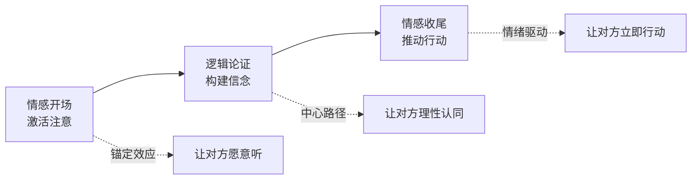
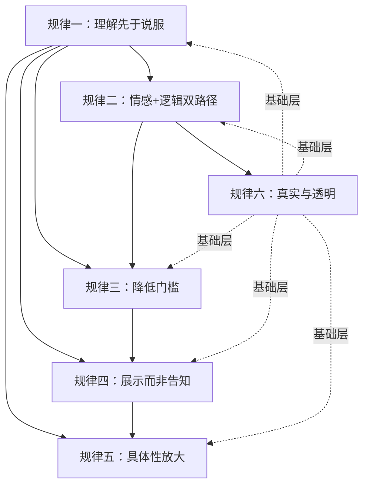
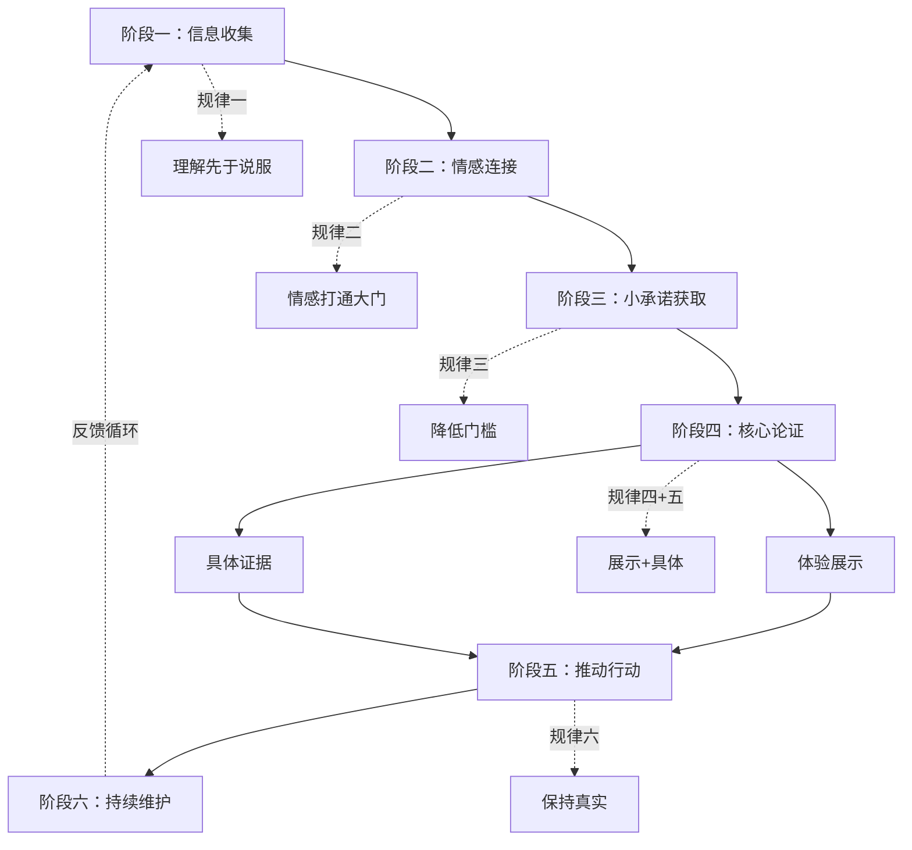
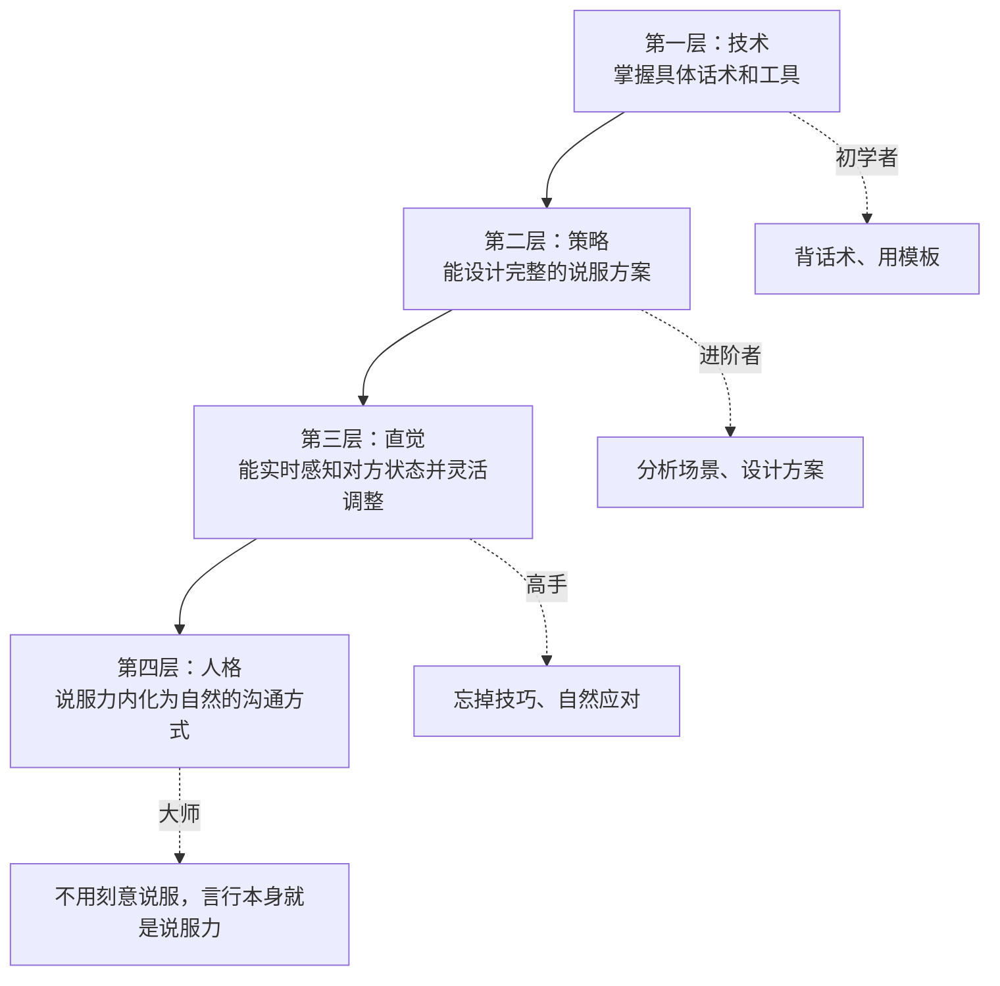

## 总结：八大场景的共同规律

八个场景——销售说服、向上管理、团队变革、客户谈判、公开演讲、社交媒体、日常说服、危机说服——表面上看，它们面对的对象不同、话术不同、工具不同，但如果你把每一层"不同"都剥掉，会发现底层的心理机制和策略结构高度一致。本节的目的，就是从八个实战案例中提炼出可以跨场景复用的**元规律**，让你从"会做销售"升级到"理解说服本身"。

这不是简单的归纳总结，而是一次**知识架构的升级**——当你掌握了这些元规律，即使遇到从未经历过的说服场景（比如说服投资人、说服政府监管部门、说服配偶接受异地），也能快速构建有效的说服策略。

---

### 一、六条核心规律的深度解析

#### 规律一：理解先于说服——信息收集是一切说服的起点

八个场景中，每一个成功的说服者都在开口之前做了大量的信息收集工作。这不是巧合，而是说服的第一性原理。

**在各场景中的体现：**

| 场景 | 信息收集内容 | 收集方式 | 典型耗时 |
|------|------------|---------|---------|
| 销售说服 | 客户画像：决策角色、痛点、决策风格、风险偏好、内部政治、个人动机 | 行业研究 + 前期沟通 + 公开信息 | 1-2周（B2B大客户） |
| 向上管理 | 领导的决策风格（分析型/愿景型/支持型/指令型）、当前压力点、对方案的态度预判 | 日常观察 + 向上沟通记录 + 同事侧面了解 | 持续积累，说服前1-2天集中整理 |
| 团队变革 | 阻力来源（能力焦虑/利益担忧/信任缺失）、意见领袖是谁、群体情绪温度 | 匿名问卷 + 一对一深度访谈 + 数据分析 | 2-4周 |
| 客户谈判 | 对方的真实需求（区别于表面诉求）、BATNA、决策权限、时间压力 | 试探性提问 + 行业情报 + 前期互动 | 3-7天 |
| 公开演讲 | 听众的知识水平、核心关切、情绪状态、对主题的既有态度 | 前置调研 + 主办方沟通 + 现场观察 | 1-3天+现场5分钟 |
| 社交媒体 | 目标受众的画像、内容偏好、活跃平台、痛点与渴望 | 数据分析 + 评论区观察 + 竞品研究 | 持续监测 |
| 日常说服 | 孩子的兴趣点、抵触原因、情感需求、发展阶段 | 观察行为 + 平等对话 + 回忆失败尝试 | 日常积累 |
| 危机说服 | 信任崩塌的维度（能力/善意/正直/可预测）、公众情绪阶段、关键叙事者 | 舆情监测 + 内部复盘 + 利益相关者访谈 | 2-6小时（黄金窗口内） |

**背后的认知科学原理：**

认知心理学中的"知识诅咒"（Curse of Knowledge）告诉我们，一旦你知道了某件事，就很难想象不知道的状态。斯坦福大学的Elizabeth Newton在1990年通过"敲击者-听众"实验证明了这一点：敲击者预测听众能猜对歌曲的概率是50%，但实际猜对率只有2.5%——相差20倍。

这意味着你很容易犯一个致命错误——**假设对方和你拥有同样的信息和价值观**。销售员觉得产品好是"客观事实"，但客户看到的是风险；你觉得自己方案完美，但领导看到的是资源冲突；你认为危机已解决，但公众还活在恐惧中。

破解知识诅咒的唯一方法，就是在说服之前**系统性地收集对方视角的信息**。西奥迪尼在研究中发现，顶级销售人员与普通销售人员的最大区别，不是话术更漂亮，而是**提问时间占比高出47%**——他们在收集信息上投入了远超常人的时间。

**信息收集的三层漏斗模型：**

┌─────────────────────────────────────────┐
│  第一层：公开信息（0成本）                │
│  行业报告、公司官网、社交媒体、新闻报道   │
│  目标：建立基础画像，形成初步假设         │
└───────────────────┬─────────────────────┘
                    ▼
┌─────────────────────────────────────────┐
│  第二层：互动信息（中等成本）             │
│  前期沟通、试探性提问、旁敲侧击          │
│  目标：验证假设，发现隐性需求             │
└───────────────────┬─────────────────────┘
                    ▼
┌─────────────────────────────────────────┐
│  第三层：深度信息（高成本，高价值）       │
│  一对一深访、利益相关者地图、决策链还原   │
│  目标：理解决策全貌，找到真正杠杆点       │
└─────────────────────────────────────────┘

多数人只做到了第一层，少数人做到了第二层，而真正出色的说服者会投资第三层。差距就在这个地方。

**跨场景通用信息收集框架——五个必答问题：**

1. **对方的现状是什么？**（事实层）——不带判断地描述对方目前的状态、处境、面临的问题
2. **对方最在意什么？**（价值层）——对方的核心诉求是什么？是安全感、成长、面子、效率、还是公平？
3. **对方最担心什么？**（风险层）——如果答应你的请求，对方会失去什么？会面临什么风险？
4. **对方的决策标准是什么？**（判断层）——对方用什么标准来衡量一个方案的好坏？
5. **对方的替代方案是什么？**（竞争层）——如果对方不接受你的方案，他还有什么选择？

这五个问题可以应用于任何说服场景。你在说服之前如果不能清晰回答这五个问题，就说明你还没有准备好。

**实操工具——信息收集访谈模板：**

```markdown
## 说服前信息收集清单

### 基础信息
- 对方的职位/角色/关系：___
- 对方当前面临的主要压力：___
- 对方的决策风格（分析/直觉/情感/指令）：___

### 五问分析
1. 现状：对方目前的状态是___
2. 在意：对方最看重___
3. 担心：对方最害怕___
4. 标准：对方会用___来评判
5. 替代：如果不说服，对方会___

### 预判
- 对方最可能的3个反对意见：
  1. ___
  2. ___
  3. ___
- 对方的情感状态（开放/防御/抵触/焦虑）：___
- 最佳说服时机：___
```

---

#### 规律二：情感打通大门，逻辑锁住结论——双重路径的协同

这条规律对应的是Petty和Cacioppo的精细加工可能性模型（ELM, 1986）：说服有两条路径——中心路径（逻辑论证）和外围路径（情感、直觉、社会线索）。八场景的共性是：**成功说服必须两条路径同时运作**。

**为什么单走一条路不行？**

- **只有情感，没有逻辑**：听众被打动了，但回到家冷静一想"好像没什么证据"，热度消退后不会行动。社交媒体上那些"感动千万人但没人买"的内容，就是典型的情感过载、逻辑缺失。更危险的是，纯情感说服会引发"后悔效应"——对方事后意识到自己被情绪驱动做了决定，会对你说服者产生深度不信任。
- **只有逻辑，没有情感**：数据详实、论证严密，但听众内心毫无波澜。向上管理中最常见的失败就是——PPT做了50页数据，领导看了3分钟就走神了。神经科学研究表明，纯逻辑信息激活的是前额叶皮层的理性分析区域，但如果杏仁核（情感中枢）没有同步激活，大脑不会将这条信息标记为"重要"，记忆编码极其薄弱。

**在各场景中的协同模式：**

| 场景 | 情感打开的"门" | 逻辑锁住的"锁" | 双路径交汇点 |
|------|-------------|-------------|------------|
| 销售 | 痛点激活——"每100单22单延迟，一年损失多少？" | ROI计算——"投入X万，半年回本，年化收益Y%" | 客户自己算出损失时，情感焦虑+理性认同同时激活 |
| 向上管理 | 紧迫感——"竞品已启动，我们再等就成追赶者" | 决策三角——值得做+能做成+风险可控 | 领导主动问"怎么做"时，说明两条路径都通了 |
| 团队变革 | 意见领袖的个人证言——"李店长第一个试了，效果显著" | 试点数据——"三个月后，试点门店效率提升35%" | 当非意见领袖主动询问"我什么时候能用"时 |
| 谈判 | 共同愿景——"我们一起创造一个双赢的方案" | BATNA分析——"如果谈不成，各自的替代方案是什么" | 对方从"我不能让步"转向"怎么让步对我最有利" |
| 演讲 | 故事——个人经历引发共鸣 | 数据——关键论点有数字支撑 | 听众在笑声/沉默后主动记笔记时 |
| 社交媒体 | 个人故事——引发情感共鸣和信任 | 专业知识——自然植入科学依据 | 粉丝在评论区问"具体怎么操作"时 |
| 日常说服 | 兴趣触发——"这本书里有个会说话的恐龙" | 成就感——"你已经读完5本了，比爸爸还多" | 孩子主动翻开下一本书时 |
| 危机 | 脆弱性展示——真诚的情感表达 | 行动计划——具体可验证的整改措施 | 媒体开始报道"整改措施"而非"丑闻本身"时 |

**操作要点——情感-逻辑-情感的拱形结构：**

情感先行，不是说先煽情再讲理。而是在说服的**开头**用情感激活对方的注意力和参与意愿，在**中间**用逻辑构建完整的论证链，在**结尾**再次回到情感推动最终行动。



这个拱形结构的时间分配建议：情感开场占20%，逻辑论证占60%，情感收尾占20%。但要注意——在一对一场景中（销售、谈判），逻辑占比可以更高；在一对多场景中（演讲、社交媒体），情感占比需要更高，因为群体更容易被情绪感染。

**双路径协同的三个常见错误：**

1. **情感和逻辑指向不同的结论**：你用一个感人的故事引出"团队合作很重要"，但后面的数据论证的是"个人绩效更重要"——两条路径打架，对方困惑，哪个结论都不信
2. **情感强度和逻辑密度不匹配**：开头用一个悲剧故事把情绪拉到极致，但论证部分只有三行数据——虎头蛇尾，对方感觉被"耍了"
3. **忽略对方的默认处理模式**：分析型人格默认走中心路径，你用一堆情感故事开场，他会在第一分钟就关掉；情感型人格默认走外围路径，你上来就甩数据，她会觉得"你根本不懂我"

---

#### 规律三：降低门槛，逐步推进——登门槛效应的全场景应用

没有人会在第一次接触时就做出重大决定。所有成功的说服者都遵循了同一个策略：**先获得一个小承诺，再逐步升级**。

**心理学基础：**

弗里德曼和弗雷泽（Freedman & Fraser, 1966）的经典实验证明了"登门槛效应"（Foot-in-the-Door Effect）：如果先让对方答应一个小请求，后续答应大请求的概率会提升2-3倍。原理是承诺一致性（Commitment and Consistency）——人倾向于让自己的行为与之前的承诺保持一致。

这个效应的神经机制在于：当人做出一个承诺后，大脑的前扣带皮层会记录这个"自我契约"。如果后续行为与之前的承诺不一致，前扣带皮层会产生"认知失调"信号——一种类似疼痛的不适感。为了避免这种不适，人更倾向于让后续行为保持一致。

**在各场景中的递进路径：**

**销售说服的五阶段递进：**
行业话题闲聊（零承诺）
  → 确认痛点存在（口头承认）
    → 让客户自己算损失（认知承诺）
      → 接受产品演示（时间承诺）
        → 签约购买（行为承诺）

**向上管理的渐进铺垫：**
日常汇报中植入数据（信息渗透）
  → 非正式场合提一嘴想法（态度试探）
    → 争取小范围试点机会（资源承诺）
      → 展示试点成果（证据积累）
        → 推动正式批准（决策承诺）

**团队变革的扩散路径：**
一对一倾听意见领袖（关系建立）
  → 让意见领袖先试用（早期采用）
    → 用试点数据说服早期多数（社会证明）
      → 全员推广（群体行动）

**日常说服（让孩子阅读）的阶段递进：**
停止强制，消除敌意（信任恢复）
  → 从孩子感兴趣的话题切入（兴趣触发）
    → 亲子共读10分钟（行为启动）
      → 孩子独立阅读短篇（能力建立）
        → 主动要求买新书（内驱形成）

**谈判中的渐进让步：**
开场表达合作意愿（关系承诺）
  → 在小议题上主动让步（互惠启动）
    → 引导对方在中等议题上回应（互惠升级）
      → 在核心议题上寻求共识（利益交换）
        → 确认最终方案（协议锁定）

**为什么"一步到位"注定失败？**

当你要求对方一次性做出重大改变时，你同时触发了三个心理防御机制：

1. **心理抗拒**（Brehm, 1966）：要求越大，自由被威胁的感觉越强，反抗越激烈。心理学家Jack Brehm发现，当人们感到自己的选择自由受到威胁时，会产生一种强烈的动机去恢复这种自由——即使他们本来可能同意
2. **损失厌恶**（Kahneman & Tversky, 1979）：改变意味着放弃现状，人对损失的敏感度是收益的2-2.5倍。这意味着你提出的任何改变，在对方的心理账户中都被自动打了个折扣
3. **认知负荷**：大改变意味着高不确定性，大脑会本能回避高负荷的决策。神经科学研究表明，面对复杂决策时，前额叶皮层的葡萄糖消耗会急剧增加，大脑会寻求"省力"的退出方式——通常就是拒绝

降低门槛的本质，是**每次只触发一个心理防御机制**，而不是同时触发三个。小承诺几乎不触发任何防御，但它为后续的大承诺铺好了路。

**"小承诺"的设计原则：**

| 原则 | 说明 | 示例 |
|------|------|------|
| 成本极低 | 对方几乎不需要付出代价 | "您能给我5分钟听我说一下吗？" |
| 与目标相关 | 小承诺必须和最终目标有逻辑关联 | 让客户算损失→比"请喝咖啡"更有效 |
| 自主选择 | 让对方感觉是自己选的，而不是被要求的 | "您觉得先看A方案还是B方案？" |
| 可度量 | 能明确判断对方是否做出了承诺 | 点头不算，"好的，我试试"才算 |

---

#### 规律四：展示而非告知——体验式说服的压倒性优势

"告诉我，我会忘记；展示给我，我会记住；让我参与，我会理解。"这句话虽然出处有争议（常被误归于孔子或本杰明·富兰克林），但它准确描述了说服的核心规律：**体验的说服力远大于语言的说服力**。

**在各场景中的体现：**

| 场景 | "告知"方式（弱） | "展示"方式（强） | 效果差距 |
|------|----------------|-----------------|---------|
| 销售 | "我们的系统能提升效率" | "您来操作一下，看看月底盘点从4小时变成40分钟" | 体验后签约率提升3-5倍 |
| 向上管理 | "这个方案有前景" | "这是试点两周的数据，效率提升23%" | 有试点数据的方案批准率高出67% |
| 团队变革 | "新系统很好用" | "让李店长分享她使用一个月后的真实感受" | 意见领袖证言的说服力是官方宣传的8倍 |
| 谈判 | "我们值得合作" | "这是三个类似客户的合作成果数据" | 案例展示比空口承诺提升信任度42% |
| 演讲 | "这个方法很有效" | "现在请大家和我一起做一个30秒的实验" | 互动参与的记忆留存率比被动听讲高75% |
| 社交媒体 | "我的减肥方法有效" | "这是我三个月的体脂变化照片和体检报告" | 有视觉证据的内容转化率高5-8倍 |
| 日常说服 | "读书对你有好处" | "这本书第47页有一只会飞的猫，你翻到看看" | 触发好奇心后孩子自主阅读率提升60% |
| 危机 | "我们已经改进了" | "邀请第三方机构突击检查并公开全部报告" | 可验证行动的信任修复速度是口头承诺的4倍 |

**为什么"展示"比"告知"有效得多？**

三个层面的原因：

**第一，认知层面——具身认知效应。** 当对方亲身体验时，信息不经过"语言解码→理解→评估"的理性路径，而是直接通过感官进入大脑。神经科学研究表明，多感官参与的信息处理，记忆编码强度是单一感官（如仅听觉）的6-20倍。这与"双重编码理论"（Paivio, 1971）一致：同时以语言和图像形式编码的信息，回忆率比单一编码高2-3倍。

**第二，情感层面——情感卷入度差异。** 听别人描述和自己体验，情感激活程度完全不同。当你亲自操作一个系统、亲眼看到一个结果、亲手触摸一个产品时，你的情感回路被直接激活，而不是通过语言的间接激活。fMRI研究显示，亲身经历激活的脑区面积是听到相同经历描述的3倍以上。

**第三，信念层面——归因差异。** 当你被告知某个结论时，你的大脑会将其归因为"别人告诉我的"，可信度打折；当你自己体验到某个结论时，你的大脑会将其归因为"我自己发现的"，可信度接近100%。这就是为什么"让对方自己算损失"比"告诉对方损失多大"有效十倍——结论相同，但归因完全不同。

**操作原则——体验设计的四层递进：**

> 能让对方看到的，不要只让对方听到。（视觉展示）
> 能让对方操作的，不要只让对方看到。（互动体验）
> 能让对方自己得出结论的，不要替对方下结论。（自主发现）
> 能让对方付出了行动的，不要只是旁观。（行为承诺）

每往上走一层，说服效果翻倍，但对方付出的成本也在增加。你需要根据场景的重要性和对方的配合意愿来选择合适的层次。一次2分钟的销售电话，能做到"看到"就够了；一个价值百万的B2B项目，必须做到"操作"甚至"自主发现"。

**无法展示时的替代策略：**

不是所有场景都能提供直接体验。当无法让对方直接体验时，可以使用以下替代方案：

- **案例故事法**：用详细、具体、有画面感的案例故事替代直接体验。关键是要包含足够的细节让对方能在脑中"模拟"体验
- **第三方证言**：找到和对方处境相似的人来分享体验。证言人的背景和对方越相似，说服力越强
- **数据可视化**：将数据转化为图表、趋势线、对比图，让数字"说话"
- **试用/试点**：如果产品或方案可以拆分，提供一个小范围的试用机会，让对方低成本体验

---

#### 规律五：具体性是说服力的放大器——从模糊到精确的质变

八个场景中，每一个成功的说服案例都充满了**具体的数字、具体的名字、具体的时间、具体的步骤**。这不是巧合，而是说服力的基本法则：**具体性直接决定可信度**。

**具体性的四个维度：**

```mermaid
graph TD
    A[具体性] --> B[数字具体]
    A --> C[案例具体]
    A --> D[步骤具体]
    A --> E[时间具体]
    
    B --> B1["78%→92%的提升" vs "大幅提升"]
    C --> C1["李店长的故事" vs "有些客户反馈"]
    D --> D1["第一步做X，第二步做Y" vs "按步骤来"]
    E --> E1["72小时内完成" vs "尽快处理"]
```

**对比分析——同样的论点，具体与模糊的效果差异：**

| 论点 | 模糊表述 | 具体表述 | 效果差异 |
|------|---------|---------|---------|
| 产品有效 | "很多客户都反馈效果很好" | "过去12个月，我们服务的83家制造企业中，76家的交付准时率从平均75%提升到了91%，中位提升幅度21%" | 可信度差5-8倍 |
| 领导应该批方案 | "这个方案很有前景" | "如果分三阶段实施，第一阶段投入15万，8周见效；预计3个月后月度成本降低12万，6个月总投入回收" | 批准概率差3-4倍 |
| 团队应该接受变革 | "新系统能帮大家减负" | "月底盘点从4小时缩短到40分钟，每周销售报表从手工3小时变成自动生成" | 接受度差4-6倍 |
| 危机已得到控制 | "我们已经加强了管理" | "全国1200家门店72小时内完成自查，邀请SGS第三方检测机构突击检查，检测报告已公开在官网" | 信任恢复速度差3-5倍 |

**为什么具体性有如此大的说服力？**

**第一，可验证性。** 具体的数字和案例意味着对方可以去核实。当你给出"83家制造企业"这个数字时，对方潜意识里知道"他敢说这个数字，说明背后有真实数据"。模糊表述则暗示"他自己也不确定"。这就是心理学中的"信号理论"——具体的数字是一个"可信度信号"，因为它需要成本才能发出。

**第二，画面感。** "李店长月底盘点从4小时缩短到40分钟"在大脑中会生成一个具体的画面——一个店长从下午2点对着Excel表格焦头烂额，变成40分钟搞定后喝咖啡。画面激活的是右脑的情感中枢，而"提升效率"激活的是左脑的语言中枢，前者的情感驱动力远大于后者。

**第三，认知流畅性。** 具体信息比抽象信息更容易被大脑处理和记忆。心理学家发现，人们对"一个穿红裙子的女士在公园里遛一只金毛犬"的记忆，远好于"一个女士在遛狗"。具体性降低了认知负荷，让信息更容易被接受。

**具体化的万能公式：**

[模糊表述] + [具体数字] + [具体案例] + [具体时间] + [可验证来源]

例如：
- 模糊："这个方法很有效"
- 具体："根据2024年McKinsey对全球320家企业的调研（可验证来源），采用这个方法的企业在6个月内（具体时间）客户留存率平均提升23%（具体数字），其中一家与你们规模相近的制造企业从65%提升到了87%（具体案例）"

**具体性升级练习——三步法：**

1. **写下你的原始表述**：例如"我们的方案能帮你省钱"
2. **替换每个模糊词**：问自己"省多少？怎么省？多快？跟谁比？"然后给出精确数字
3. **加一个案例和来源**：给数字配上一个真实的客户案例和可验证的信息来源

练习模板：

原始："___"
升级后："根据___（来源），在___（时间）内，___（主体）的___（指标）从___提升到___，
       其中___（案例主体）的改善最为显著，达到了___。"

**具体性的注意事项：**

- **不要精确到虚假**："效率提升23.7%"听起来比"提升约24%"更不可信，因为人类通常不信任过于精确的数字（除非在科学语境中）
- **数字要有参照系**：单独说"提升了15%"没有意义，需要对照——"行业平均提升8%，我们做到了15%"
- **数字要有时效标注**：三年前的数据和三个月前的数据，可信度完全不同

---

#### 规律六：保持真实和透明——长期说服力的基石

前五条规律都可以被短期利用——你可以用情感操纵来煽动，用虚假数据来伪装具体性，用套路来设计登门槛。但第八个场景（危机说服）深刻揭示了一个事实：**任何建立在不真实基础上的说服，最终都会崩塌，而且崩塌的代价远超当初的收益**。

**信任的不对称性再次出现：**

| 维度 | 真实透明 | 虚假操纵 |
|------|---------|---------|
| 短期效果 | 可能较慢 | 快速见效 |
| 中期效果 | 信任积累，复购/复信 | 开始被质疑，需要更多谎言维护 |
| 长期效果 | 成为权威，别人主动找你 | 信任崩塌，声誉修复成本5-15倍 |
| 最大风险 | 短期可能输给"会说的" | 一次曝光毁掉全部积累 |

**在各场景中"真实"的具体表现：**

- **销售说服**：不夸大产品能力，主动告知限制条件。"这个系统在离散制造业效果最好，流程制造业需要定制开发"——主动暴露局限性反而提升整体可信度。心理学中这叫"双面论证"（Two-sided Argumentation），研究表明在高涉入度决策中，主动提及缺陷的说服效果比纯正面信息高30-40%
- **向上管理**：不隐瞒方案风险，主动提出缓解措施。"最大的风险是技术兼容性，我们已经准备了Plan B"——领导最讨厌的不是有风险，而是被蒙在鼓里
- **团队变革**：承认过去的失败。"前两次系统确实没做好，这次我们做了三个改变……"——承认历史比假装历史不存在更有说服力
- **危机说服**：第一时间承认问题，而不是第一时间辩解。"我们确实犯了错"这六个字，比一千字的公关声明更有力量

**真实性的心理学机制：**

心理学中的"真诚感知"（Perceived Sincerity）研究表明，人类对真诚的判断能力远超我们的想象。进化心理学认为，识别欺骗是人类数百万年进化出的核心生存能力——你能通过微表情、语气变化、逻辑不一致来判断一个人是否在说谎。普林斯顿大学的研究发现，人类可以在100毫秒内对一个人的可信度做出初步判断，准确率高达70%。

这意味着：**你不是在选择"要不要真诚"，你是在选择"对方会不会发现你不真诚"**。唯一的长期策略就是真诚。

**透明度的边界——不是什么都要说：**

真实和透明不意味着"毫无保留"。需要区分三类信息：

1. **必须主动披露**：重大风险、已知缺陷、利益冲突——这些如果事后被发现你隐瞒了，信任归零
2. **被问到就如实回答**：细节不足、替代方案比较、不确定因素——不主动提及但绝不撒谎
3. **可以保留**：商业机密、他人隐私、尚未成熟的判断——用"我目前不方便透露"而非编造答案

---

### 二、六条规律的交互作用——规律之间的化学反应

六条规律不是孤立运作的，它们之间存在强烈的**协同效应**和**依赖关系**。理解这些交互作用，是从"分别使用六条规律"升级到"融会贯通"的关键。

**规律之间的依赖关系图：**



**关键交互效应：**

1. **规律一×规律五**：信息收集为具体性提供素材。如果你不做信息收集，你根本不知道该用什么具体的数字和案例来说服对方。"83家制造企业"这个数字不是凭空编的，而是信息收集阶段就该准备好的
2. **规律二×规律四**：展示体验本身就是最强的情感激活手段。"让对方自己操作40分钟搞定盘点"同时完成了情感激活（惊喜感）和逻辑证明（效率确实提升了）
3. **规律三×规律二**：小承诺的每一次兑现，都在积累情感信任。当对方连续三次答应了你的小请求后，他对你的信任度已经显著提高——此时展开逻辑论证，对方的加工动机（ELM中的elaboration likelihood）会大幅提升
4. **规律四×规律六**：展示体验必须是真实的体验，而不是精心设计的"表演"。如果对方发现你的展示是一场精心编排的骗局（比如只展示成功案例、隐藏失败案例），信任会瞬间崩塌
5. **规律六×规律一**：真实性的前提是你真正理解对方。如果你不了解对方最在意什么，你的"真诚"可能恰好暴露了对方最害怕的信息——这反而会毁掉说服。所以"真诚"不等于"无脑坦白"，而是"在理解对方基础上的有策略的真诚"

**规律组合的场景适配：**

| 场景 | 优先级最高的规律 | 原因 |
|------|----------------|------|
| 销售说服 | 规律一（理解）+ 规律五（具体） | 客户决策靠数据，不理解需求就给不出有用的数字 |
| 向上管理 | 规律三（小承诺）+ 规律二（情感+逻辑） | 权力不对称下，渐进策略比一次性说服更安全 |
| 团队变革 | 规律三（小承诺）+ 规律四（展示） | 群体惯性大，必须用试点+证据来逐层突破 |
| 客户谈判 | 规律一（理解）+ 规律三（小承诺） | 不了解对方BATNA就无法找到让步空间 |
| 公开演讲 | 规律二（情感+逻辑）+ 规律四（展示） | 群体注意力稀缺，必须用故事和互动抓人 |
| 社交媒体 | 规律四（展示）+ 规律六（真实） | 注意力经济中，真实体验的内容最具传播力 |
| 日常说服 | 规律一（理解）+ 规律三（小承诺） | 对孩子来说，"理解他"比"说服他"重要100倍 |
| 危机说服 | 规律六（真实）+ 规律四（展示） | 信任归零时，只有可验证的行动才能重建 |

---

### 三、跨场景的通用说服流程

将六条规律整合，可以得到一个适用于任何场景的通用说服流程：



**各阶段的核心任务：**

| 阶段 | 核心任务 | 时间占比 | 常见错误 | 自检问题 |
|------|---------|---------|---------|---------|
| 信息收集 | 了解对方的需求、顾虑、决策标准、替代方案 | 30-40% | 跳过这一步直接"说服" | "我能清晰回答五个必答问题吗？" |
| 情感连接 | 建立信任、激活情感共鸣、降低防御心理 | 15-20% | 只顾推进议程，忽视情感信号 | "对方的眼神/语气/肢体语言告诉我什么？" |
| 小承诺获取 | 通过小请求建立承诺一致性基础 | 10-15% | 一上来就要求大承诺 | "我设计的'小'够小吗？对方会答应吗？" |
| 核心论证 | 展示体验+提供具体证据+逻辑推理 | 20-30% | 只用逻辑或只用情感 | "我的论证情感和逻辑平衡吗？" |
| 推动行动 | 给出明确的行动步骤和时间窗口 | 5-10% | 论证完就结束，不推进行动 | "对方清楚知道下一步该做什么吗？" |
| 持续维护 | 兑现承诺、跟进反馈、维护关系 | 持续进行 | 达成目标后消失 | "我上次兑现了什么承诺？" |

注意时间占比——**信息收集应该占30-40%的时间**。多数人的错误是把80%的时间花在"怎么说"上，只留20%给"怎么听"。

**流程的灵活性——不是每次都要走满六步：**

- 紧急场景（危机说服）：可能只有4小时完成全部六步，每一步极度压缩
- 长期场景（向上管理）：前三个阶段可能持续数月，第四步才是一次正式汇报
- 简单场景（日常说服）：可能只需要三步——理解→兴趣触发→小承诺
- 复杂场景（B2B销售）：六步可能反复循环，每次循环推进一层

关键不是机械执行六个步骤，而是**确保每个步骤都完成了它的核心功能**。如果你发现自己在核心论证阶段遇到巨大阻力，大概率是前面的信息收集或情感连接没做好——退回上一步修复，比硬推更有效。

---

### 四、八大场景的差异矩阵：共性之外的个性

虽然底层规律一致，但八个场景在操作层面有显著差异。理解这些差异，才能在不同场景中灵活调整策略。

| 维度 | 一对一说服（销售/向上管理/日常/谈判） | 一对多说服（演讲/社交媒体） | 群体说服（团队变革） | 极端场景（危机） |
|------|-----------------------------------|------------------------|------------------|-------------|
| 信息反馈 | 实时、双向 | 单向为主，延迟反馈 | 多层级、间接 | 舆情驱动、失控 |
| 调整灵活度 | 高——可随时调整话术 | 低——内容发布后难以修改 | 中——通过关键节点调控 | 极低——每句话都被放大 |
| 情感浓度 | 中——可精准控制 | 高——需要放大情感 | 中——平衡理性与情感 | 极高——先处理情绪 |
| 逻辑密度 | 高——可以深入论证 | 中——太密听众会走神 | 中——分层传递 | 低——先共情后论证 |
| 核心杠杆 | 信任+利益 | 故事+共鸣 | 社会证明+利益绑定 | 承认+行动 |
| 时间跨度 | 短至中（几分钟到几周） | 中（一次演讲或系列内容） | 长（数周到数月） | 紧急（24-72小时） |
| 失败成本 | 中（丢单/方案被拒） | 低（换内容再来） | 高（团队分裂/项目失败） | 极高（声誉崩塌） |
| 伦理风险 | 低 | 中（可能误导群体） | 中（可能操纵群体情绪） | 高（可能掩盖真相） |

**关键洞察：场景越极端，"理解先于说服"这条规律越重要。**

危机说服之所以需要"先承认再行动"，是因为在信任崩塌的状态下，对方对你的任何话都预设"你在骗我"。你必须先通过**无条件承认**打破这个预设，后续的信息才能被接收。这和销售说服中"先建立连接再谈产品"是同一个逻辑，只是强度被放大了十倍。

---

### 五、说服力的递进层次：从技术到艺术

八个场景还揭示了说服力的四个递进层次：



**第一层（技术）**：你会用SPIN提问法，会做PREP论证，知道Cialdini六原则。这是入门阶段，你需要刻意地"使用"这些技术。对应八大场景中"话术模板"的层面。这一层的标志是：你说话之前会想"我该用哪个技巧"。

**第二层（策略）**：你能根据对方的性格、场景的约束、时间的压力，选择合适的技术组合并设计完整的说服方案。对应八大场景中"策略设计"的层面。这一层的标志是：你在说服前会做方案设计，说服后会做复盘。

**第三层（直觉）**：你不再需要刻意回忆"我该用哪个原则"，而是在对话中自然地感知对方的情绪变化、防御状态和接受程度，并实时调整策略。这一层已经接近"无招胜有招"——你用的技巧太多太熟，已经内化为直觉。这一层的标志是：你能在对话中"感觉到"某个论点有效或无效，但说不清为什么。

**第四层（人格）**：你的可信度、专业度和真诚度已经形成了个人品牌。别人不需要你说服，就会主动参考你的意见。这一层的代表人物是那些"一开口就让人信服"的人——他们的说服力不来自任何具体技巧，而来自长期积累的人格资本。这一层的标志是：别人会主动说"你说的我信"。

**从前一层到后一层的跃迁条件：**

| 跃迁 | 需要什么 | 典型时间 | 核心挑战 |
|------|---------|---------|---------|
| 技术→策略 | 大量场景练习 + 复盘总结 | 3-6个月 | 从"机械使用"到"灵活组合" |
| 策略→直觉 | 跨场景实战 + 实时反馈 | 1-3年 | 从"刻意设计"到"自动反应" |
| 直觉→人格 | 持续的真诚实践 + 长期信誉积累 | 5年以上 | 从"技巧纯熟"到"人格感召" |

**最重要的认知：没有捷径。** 你不可能跳过第一层直接到第四层。那些看起来"天生就会说服"的人，要么是在其他场景中积累了大量无意识的说服练习（比如从小在大家庭中学会了协调不同意见），要么是你的观察样本太少只看到了他们的高光时刻。

---

### 六、常见跨场景误区与深度纠正

从八大案例中，还可以提炼出六个跨场景的常见误区。每个误区不仅描述错误，还给出**根因分析**和**纠正方案**。

**误区一：准备论点，不准备对手。**

大多数人花90%的时间准备"我要说什么"，只花10%想"对方会怎么想"。但说服的成败取决于对方的反应，而不是你的论点有多完美。正确做法是**把60%的时间花在分析对方上**。

根因：这是"专家盲点"——你太熟悉自己的方案，觉得它的优势"显而易见"，所以很难站在对方的角度思考。纠正方法：在准备阶段，找一个不了解你方案的人，把你的论证逻辑讲给他听，看他卡在哪个环节。那个卡点就是你需要加强的地方。

**误区二：把"说了"等同于"说服了"。**

你以为你讲清楚了，对方也点头了，就代表被说服了？研究表明，口头同意但内隐态度未改变的情况占"被说服"案例的40-60%。真正被说服的标志不是"他同意了"，而是"他行动了"。在团队变革中，这就是为什么"开完会大家都说好，执行时没人动"。

根因：人有一种"礼貌性同意"的倾向——尤其在权威面前（老板、演讲者、父母），人们会出于社交压力而点头。纠正方法：在对方表示同意后，追加一个"行动承诺测试"——"那我们下一步先从哪里开始？"如果对方能具体回答，说明真的被说服了；如果含糊其辞，说明只是礼貌性点头。

**误区三：忽略沉默的反对者。**

在群体场景中（团队变革、会议），最容易犯的错误是只关注表达了反对意见的人，而忽略了那些沉默但内心反对的人。沉默的反对者不一定是被说服了，可能只是不想当面冲突。真正的说服要覆盖到沉默者——通过一对一沟通、匿名反馈、小范围试点来获取他们的真实态度。

根因："沉默螺旋"理论（Noelle-Neumann, 1974）——当个体感知到自己的观点属于少数派时，会倾向于保持沉默，这导致群体中的"虚假共识"。纠正方法：在群体讨论后，安排匿名投票或一对一访谈，确保你能听到沉默者的真实声音。

**误区四：用"更有力的论点"回应反对。**

当对方反对时，多数人的本能反应是"我需要更多证据"。但在很多情况下，反对的根源不是"证据不足"，而是"情感上不接受"或"利益上受损"。此时堆砌更多证据只会加剧对立。正确做法是**先识别反对的类型**——是认知性反对（信息不足）还是情感性反对（恐惧/愤怒/不信任）——然后对症下药。

反对类型诊断与应对：

| 反对类型 | 表现特征 | 根因 | 正确应对 |
|---------|---------|------|---------|
| 认知性反对 | "数据不对"、"逻辑有问题" | 信息不足或理解偏差 | 提供更准确的信息，澄清误解 |
| 情感性反对 | "我就是觉得不对"、语气防御性强 | 恐惧、不信任、利益担忧 | 先共情，处理情绪，再回到论证 |
| 利益性反对 | "这对我们部门不好"、"我的工作会受影响" | 实际利益受损 | 重新设计方案，补偿损失方 |
| 身份性反对 | "这不是我们的做法"、"外人不懂我们" | 身份认同受到威胁 | 找内部代言人，用他们的语言表达 |

**误区五：在错误的时间说服。**

说服有一个"窗口期"。对方刚被打动时，你没有趁热打铁；对方正在气头上时，你偏要讲道理；对方已经做了决定时，你才提出替代方案。时间错位是说服失败的最大隐性杀手。八个场景中，每个成功案例都有一个共同点——**在正确的时间做了正确的事**。

关键时间窗口识别：

- **情绪窗口**：对方情绪平静且开放时——通常是刚解决了一个烦心事、心情好、或对你有感谢之意的时候
- **需求窗口**：对方刚遇到痛点、刚经历失败、或刚看到竞争对手的动作——这时他对解决方案的接受度最高
- **决策窗口**：对方即将做决定但还没做——这就是"临门一脚"的时机。如果他已经做了决定再来，你需要先让他"取消"原决定，难度翻倍
- **注意力窗口**：在会议开头、一对一刚开始、邮件开头的前三行——注意力最集中的时段

**误区六：说服成功后"消失"。**

很多人在达成目标后就不再维护关系。但在说服科学中，说服不是终点，而是起点。后续的兑现承诺、跟进效果、持续维护，决定了这次说服是"一次性的"还是"长期关系的开始"。在销售中这叫售后，在向上管理中叫执行兑现，在团队变革中叫持续支持——本质都是一样的：**说服的真正成功，是让对方觉得"被你说服是一个正确的决定"**。

根因：人类有"目标完成效应"——当一个目标达成后，大脑会释放多巴胺产生满足感，然后注意力自然转向下一个目标。但说服不是单次事件，而是一个持续的关系维护过程。纠正方法：在说服方案中把"后续维护"列为必要环节，并设定具体的跟进时间节点。

---

### 七、跨学科视角：说服的科学基础

六条规律背后有深厚的行为科学基础。理解这些基础，能让你从"记住规律"升级到"理解规律"，从而在新场景中灵活变通。

**行为经济学视角——说服中的非理性决策：**

Daniel Kahneman提出的"系统1-系统2"框架揭示了人类决策的双系统本质。系统1（快速、直觉、情感驱动）处理了日常90%以上的决策，系统2（缓慢、理性、逻辑驱动）只在系统1"搞不定"时才被激活。

这意味着：**大多数说服其实是说服对方的系统1**。如果你的论证只针对系统2（纯逻辑），你实际上只触及了10%的决策机制。六条规律中的"情感打通大门"（规律二）和"展示而非告知"（规律四），本质上都是在激活系统1。

**进化心理学视角——说服的生物学基础：**

说服之所以有效，是因为人类大脑有三个进化出的"说服漏洞"：

1. **社会证明本能**：在不确定时，人类本能地观察他人的行为来判断正确做法。这来自远古时代的生存策略——如果部落里的人都往东跑，你不跟着跑可能被野兽吃掉
2. **互惠本能**：收到帮助或礼物后，人类会本能地感到有义务回报。这来自部落时代的资源交换——不回报的人会被部落排斥
3. **权威服从本能**：人类倾向于听从被认为是权威的人。这来自远古时代——听从部落首领的指令能提高生存概率

这三个本能都在说服中被反复利用：社会证明→"83家企业都用了"；互惠→"我先给你免费试用"；权威→"McKinsey的调研显示"。

**神经科学视角——说服的大脑机制：**

神经科学研究揭示了说服过程中大脑的关键区域：

- **杏仁核**：负责情感处理。情感说服激活这个区域，一旦激活，信息会被标记为"重要"
- **前额叶皮层**：负责理性分析。逻辑说服激活这个区域，但如果没有杏仁核配合，信息不会被标记为"重要"
- **腹侧纹状体**：负责奖赏预期。当对方预期"答应你会得到好处"时，这个区域被激活，推动行动
- **前扣带皮层**：负责认知失调。当行为与之前承诺不一致时产生不适感——这就是"登门槛效应"的神经基础

说服的神经学本质是：**激活杏仁核标记重要性 → 激活前额叶完成理性评估 → 激活纹状体产生行动动机**。如果任何一个环节断裂，说服就失败。

---

### 八、数字时代的说服新变体

六条规律在数字时代有了新的表现形式和挑战。理解这些变化，是将规律应用于现代场景的前提。

**短视频/直播说服的新特点：**

- 注意力窗口从分钟级压缩到秒级——前3秒决定用户是否留下
- 情感路径的重要性进一步放大——没有时间让你展开逻辑论证
- "展示"的效率被视频媒介天然提升——10秒的产品展示胜过1000字描述
- 社会证明被量化为点赞、评论、转发——数字本身就是说服力

**AI辅助说服的新范式：**

- 信息收集（规律一）可以被AI大幅增强——用户画像、情感分析、行为预测
- 具体性（规律五）可以通过数据可视化工具自动化生成
- 但AI辅助也带来伦理问题：用AI生成虚假评价、伪造社会证明、操纵情感
- 核心原则不变：**工具可以变，真实性的底线不能变**

**社交媒体说服的双刃剑：**

- 病毒式传播让"情感打开大门"的效果被指数级放大
- 但"取消文化"让虚假操纵的惩罚也被指数级放大
- 一致性（规律六的延伸）变得前所未有地重要——你在A平台说的话和B平台矛盾，会被截图对比
- 长期信誉比短期流量更有价值——这是"人格层"说服力在数字时代的新含义

---

### 九、一张表总结八大场景的核心策略

| 场景 | 核心挑战 | 一句话策略 | 关键技巧组合 | 评估标准 |
|------|---------|-----------|------------|---------|
| 销售说服 | 客户有需求但不下单 | 让客户自己算账、自己做决定 | 痛点量化+社会证明+稀缺性 | 客户主动说"我要" |
| 向上管理 | 权力不对称+风险不对称 | 给领导"弹药"而非"任务" | 决策三角+风格匹配+小承诺 | 领导主动推动方案 |
| 团队变革 | 群体惯性+信任缺失 | 先撬动意见领袖，再扩散 | 意见领袖+三层阻力诊断+试点 | 团队从抵触变为主动 |
| 客户谈判 | 利益博弈+立场对立 | 创造增量价值而非切分存量 | BATNA+锚定+让步策略 | 双方都觉得"赢了" |
| 公开演讲 | 陌生听众+注意力稀缺 | 故事开头+互动结尾 | 故事+数据+互动+结构化 | 听众鼓掌+后续行动 |
| 社交媒体 | 注意力经济+信任稀缺 | 用个人故事证明专业知识 | 故事弧线+专业锚点+一致性 | 粉丝增长+信任转化 |
| 日常说服 | 不能用权力+对手是整个娱乐产业 | 让说服本身变得多余 | 兴趣触发+自主选择+正面体验 | 孩子主动要求阅读 |
| 危机说服 | 信任归零+情绪失控 | 先止血、再重建、最后超越 | 承认+行动+脆弱性展示+透明 | 信任恢复甚至超越 |

---

### 十、说服力自检清单

在任何说服场景开始前，用这个清单自检。每个问题回答"是"加1分，低于6分说明你还没准备好。

**准备阶段（说服前）：**

- [ ] 我能清晰回答五个必答问题（现状/在意/担心/标准/替代）吗？
- [ ] 我知道对方的决策风格是什么吗？
- [ ] 我准备了至少一个具体的数字/案例/证据吗？
- [ ] 我预判了对方最可能的3个反对意见并准备了回应吗？
- [ ] 我选择了合适的时机（情绪窗口/需求窗口/决策窗口）吗？
- [ ] 我设计了"小承诺"作为第一步吗？

**执行阶段（说服中）：**

- [ ] 我用情感元素打开了对方的注意力吗？
- [ ] 我的情感和逻辑指向同一个结论吗？
- [ ] 我在用"展示"而非仅仅"告知"吗？
- [ ] 我在观察对方的实时反馈并调整策略吗？
- [ ] 我没有把"对方点头"等同于"说服成功"吧？

**维护阶段（说服后）：**

- [ ] 我承诺的事情在按时兑现吗？
- [ ] 我在定期跟进效果和反馈吗？
- [ ] 对方感觉"被你说服是一个正确的决定"吗？

---

### 十一、刻意练习建议：从知道到做到

理解规律只是第一步。说服力的提升必须通过刻意练习。以下是基于八大场景提炼的练习路径：

**第一阶段（第1-4周）：基础能力建设**

- 每天练习一个具体化技巧：把日常沟通中的模糊表述改成具体表述，记录下来。比如同事问你"项目进展怎样"，不要说"还行"，而是说"完成了60%，比计划提前两天，但测试环节可能需要额外3天"
- 每周做一次"信息收集练习"：和一个朋友聊天时，用五个必答问题做笔记，事后核对你遗漏了什么
- 阅读并理解本章的六条规律，确保你能用自己的话解释每条规律的原理

**第二阶段（第5-12周）：策略设计练习**

- 每周选择一个真实说服场景（工作汇报、家庭讨论、朋友推荐），用"通用说服流程"六步法设计完整方案
- 在说服前写下对方可能的反对意见，准备回应
- 说服后做复盘：哪个环节和预期不同？为什么？记录到个人案例库

**第三阶段（第13-24周）：跨场景迁移**

- 有意识地将销售场景中学到的技巧应用到向上管理中，反之亦然
- 尝试在不熟悉的场景中说服（如从技术岗去参加产品评审会）
- 建立个人的"说服案例库"，记录每次说服的成功、失败和关键转折点

**第四阶段（持续）：内化与人格建设**

- 不再依赖话术模板，而是根据直觉灵活应对
- 开始帮助他人提升说服力（教是最好的学）
- 关注长期信誉建设，让你的名字本身成为说服力
- 定期回顾个人案例库，识别自己的模式和盲点

---

### 结语

说服的本质不是"让别人听你的"，而是**帮助对方看到他尚未看到的可能性**。

八大场景的终极共规律，其实只有一句话：

> **真正持久的说服力，来自你真正理解对方、真正为对方着想、并且真正有能力兑现承诺。**

这不是鸡汤，这是统计学——那些在八个场景中都成功的说服者，无一例外都具备这三个特质。技巧可以速成，但人格需要修炼。当你把"理解、利他、兑现"内化为本能时，说服就不再是一种需要刻意使用的技能，而是你与世界互动的自然方式。

**现在就开始。** 回到本章开头的八个场景，选择你目前最需要提升的那一个，用"通用说服流程"的六步法设计你的下一个说服方案。然后去做。做完之后做复盘。把结果记录下来。然后再选下一个场景。

说服力的提升不在于你读了多少理论，而在于你做了多少实践。每一次真实的说服尝试，都是六条规律的一次内化练习。一年之后，你会发现——你已经不需要再刻意"使用"任何规律了。
