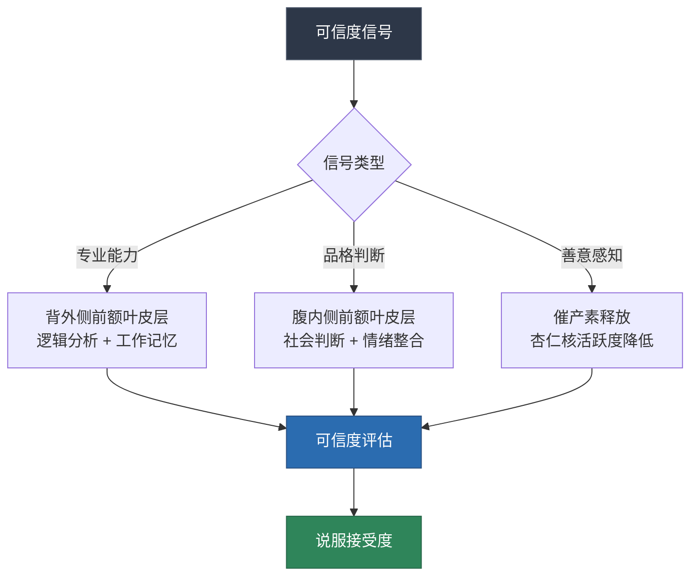
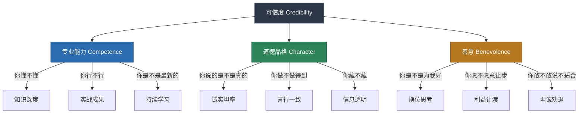
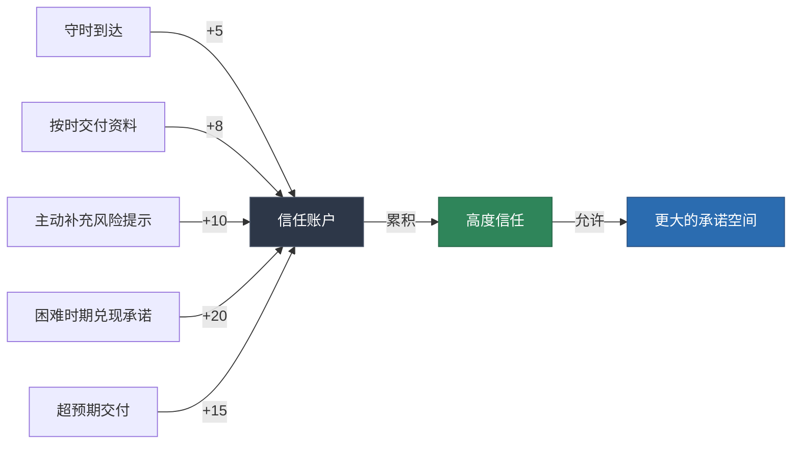
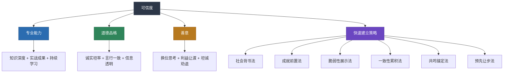

# 一、建立可信度：让你的话有分量

> "人们会忘记你说过什么，会忘记你做过什么，但永远不会忘记你带给他们的感受。" —— 玛雅·安杰洛

说服力的起点不是你的论点有多严密，不是你的故事有多动人，而是一个更基本的问题：**对方是否愿意听你说**。这个"愿意"，就是可信度（Credibility）。

如果对方不信任你，再完美的逻辑也打动不了他。心理学研究反复证实，可信度是说服的"入场券"——没有它，你的所有技巧都无处施展；有了它，即使表达不那么完美，对方也会善意地理解你的意图。

本节将从理论根源出发，系统拆解可信度的构建机制、实操策略、常见陷阱和进阶方法，帮助你在任何场景中快速建立"让别人愿意听你说话"的能力。

---

## 1.1 为什么可信度是说服的第一块基石

### 可信度的心理学根源

亚里士多德在《修辞学》中将说服力拆解为三个要素：**Ethos（品格/可信度）、Pathos（情感）、Logos（逻辑）**。他将Ethos排在第一位，并指出："品格是说服中最有效的说服手段。"这不是随意的排序——两千多年的说服研究不断验证了这个判断。

现代心理学给出了更精确的解释。社会心理学家Carl Hovland在耶鲁大学的说服研究中发现，信息来源的可信度（Source Credibility）直接影响说服效果。他的经典实验表明：同一则信息，当被告知出自"权威专家"时，受众的态度改变程度比被告知出自"普通学生"时高出40%以上。

这背后的机制可以用**精细加工可能性模型（ELM）**来解释：

- **中心路径**：当受众高度投入、认真思考时，他们会评估论点本身的质量。但即使在中心路径下，可信度也起着"启动器"的作用——只有当来源可信时，受众才会愿意花精力深入思考你的论点。
- **外围路径**：当受众投入度低、不愿深入思考时，可信度本身就是最核心的说服线索。"这个人看起来很专业"就足以让低卷入受众接受你的观点。

换句话说，可信度在两种路径下都发挥作用，只是机制不同：在中心路径下它是"开门钥匙"，在外围路径下它本身就是"理由"。

### 可信度的神经科学基础

可信度不仅仅是"判断"，它有明确的神经生物学基础。理解这些底层机制，能让你更精准地操控可信度的建立过程。

**催产素与信任的生化通路**

神经经济学家Paul Zak的研究发现，当人们感受到信任信号时，大脑会释放催产素（Oxytocin）。这种神经递质直接降低杏仁核（恐惧中枢）的活跃度，降低对他人的防御心理。Zak的实验表明：

- 催产素水平升高时，人们愿意借给陌生人的金额平均增加17%
- 当催产素被阻断时，即使面对高可信度来源，信任行为也会显著下降

实践含义：催产素的释放与"被关心的感觉"高度相关。当你展示善意（换位思考、利益让渡）时，你实际上是在触发对方大脑中的催产素释放——这是善意在三个支柱中往往"效果最显著"的生理学解释。

**前额叶皮层与可信度评估**

可信度的理性评估主要由前额叶皮层（PFC）完成。功能性磁共振成像（fMRI）研究发现：

- 当人们评估信息来源的专业能力时，背外侧前额叶皮层（dlPFC）高度活跃——这是负责逻辑分析和工作记忆的区域
- 当人们评估品格和善意时，腹内侧前额叶皮层（vmPFC）更活跃——这是负责社会判断和情绪整合的区域
- 两个区域同时被激活时，说服效果最佳

实践含义：只展示数据（激活dlPFC）或只讲故事（激活vmPFC）都不够。最有效的可信度建设是同时满足对方的理性分析需求和情感判断需求。

**镜像神经元与可信度的"传染"**

镜像神经元系统（Mirror Neuron System）解释了为什么可信度可以"传染"。当你看到一个人展现出真诚、专业或善意的行为时，你的大脑会"模拟"这种状态，产生类似的感受。这就是为什么：

- 视频通话中，对方的微笑会激活你大脑中的微笑反应
- 一个真诚的道歉会让对方也感到"被理解"的温暖
- 团队中高可信度成员的言行会影响整个团队的信任水平



### 可信度的经济学视角

把可信度想象成一个**银行账户**。每一次守时、每一次兑现承诺、每一次展示专业能力，都是在往账户里存款。每一次失信、每一次夸大、每一次自相矛盾，都是在取款。当账户余额充足时，对方会宽容你偶尔的失误；当账户透支时，即使你说的是真话，对方也会怀疑。

这个"账户"有一个关键特性：**存款慢，取款快**。建立可信度可能需要数月甚至数年，但摧毁它只需要一瞬间。研究表明，一个负面事件对可信度的破坏力，相当于5-10个正面事件的建设力。这就是为什么保护已有的可信度，比从零建立更需要谨慎。

**信任衰减的量化模型**

可信度不是恒定的，它会随时间自然衰减。根据社会心理学的近因效应研究：

- **信任半衰期**：如果你与某人没有互动，信任感大约每6-12个月衰减一半。这意味着一个两年未联系的前同事，你对他的可信度评估大约只有当初的25%
- **衰减速度差异**：品格信任衰减最慢（因为人们倾向于维持"这个人本质是好的"的判断），专业能力信任衰减最快（因为知识会过时），善意信任衰减中等（因为"他对我好不好"的记忆比专业知识更持久）
- **衰减可逆**：一次高质量的互动可以快速"刷新"衰减的信任账户，效果相当于3-5次普通互动

实践含义：不要以为过去建立了高可信度就一劳永逸。定期"刷新"信任账户——哪怕只是一条有价值的信息分享、一次及时的回复——都能有效对抗信任衰减。

### 可信度与说服效果的量化关系

多项研究提供了可信度影响力的具体数据：

| 研究来源 | 发现 | 实践启示 |
|---------|------|---------|
| Hovland & Weiss (1951) | 高可信度来源的信息接受度比低可信度来源高40% | 在开口前先建立可信度，效果等同于把论点强度提升40% |
| Petty, Cacioppo & Goldman (1981) | 当议题与受众无关时（低卷入），来源可信度是决定性因素 | 对不感兴趣的受众，可信度比论点更重要 |
| Pornpitakpan (2004) 元分析 | 高可信度来源在态度改变上的效应量d=0.73，属于"中到大"效应 | 可信度不是"锦上添花"，而是"核心驱动力" |
| McGinnies & Ward (1980) | 受众更倾向于将高可信度来源的论点解释为合理的，即使论点本身存在瑕疵 | 高可信度可以弥补论点的不足，但不能替代 |
| Zak (2017) | 催产素水平与信任行为呈正相关（r=0.42） | 善意展示有生理基础，不是"玄学" |

这些数据的实践含义是：**在你开口说话之前，你的可信度已经在替你"说话"了**。

---

## 1.2 可信度的三个支柱

可信度不是单一维度的概念。经过半个多世纪的实证研究，学者们一致认为可信度由三个相互独立但又彼此强化的维度构成：



三个支柱的权重因场景而异，但缺一不可。下面我们逐个深入拆解。

---

### 1.2.1 第一支柱：专业能力（Competence）——"你懂不懂"

专业能力是可信度中最直观的维度。它回答的核心问题是：**你是否有资格谈论这个话题？**

专业能力包含三个层次：

**第一层：知识深度**

你对所谈论话题的了解是否足够深入？这不只是"知道"，而是"理解"——能解释因果关系，能预见潜在问题，能比较不同方案的优劣。

展示知识深度的方式：
- **分享从业经验**："我在这个领域深耕了15年，经历了三次行业周期。"——时间维度的专业积累。
- **引用专业资质**："我们团队持有CFA和CPA双证，管理着超过20亿的资产。"——第三方认证背书。
- **使用精确数据**："根据我们对327个样本的跟踪分析，这个方案的平均回报周期是14.3个月。"——具体数据比模糊描述更有说服力。
- **展示系统思维**：不只说"这个方案好"，而是说"这个方案在A场景下效果最好，在B场景下需要配合C措施"——展示你理解问题的复杂性。

但专业能力的展示有一个关键原则：**够用就好，不要过度**。在一个技术讨论中适当使用术语彰显专业度，但在面向非专业人士时过度使用术语反而会造成距离感。判断标准是：你的受众能否理解你说的话？如果不能，降低专业术语的密度，用类比和案例替代。

**判断"够用"的实操标准：**

| 受众类型 | 专业术语密度 | 替代策略 |
|---------|------------|---------|
| 同行专家 | 高（可以直接使用行业术语） | 无需替代 |
| 相关领域从业者 | 中（使用通用术语，避免太深的细分） | 用类比连接对方已知领域 |
| 非专业决策者 | 低（用结果和数据代替术语） | 用故事和可视化代替专业描述 |
| 普通大众 | 极低（只用日常语言） | 用生活中的类比解释复杂概念 |

**第二层：实战成果**

知道和做到之间有一道鸿沟。展示实战成果是跨越这道鸿沟的最直接方式：
- "过去三年，我们帮助37家企业完成了类似的数字化转型，平均提效28%。"
- "这个方法我自己在三个项目中验证过，每次都能将交付周期缩短30%以上。"
- "上个月我们刚帮一家同行业的公司解决了同样的问题，他们的CTO可以作证。"

关键原则：**成果必须具体**。"我做过很多项目"远不如"我做过12个项目，其中8个提前交付"有说服力。模糊的成就是噪音，精确的数据才是信号。

**成果展示的STAR框架：**

S（Situation）：什么背景下
T（Task）：面对什么挑战
A（Action）：采取了什么行动
R（Result）：取得了什么结果（量化）

示例：
> "去年Q3（S），一家制造业客户面临产线良品率持续下降的问题（T）。我们通过部署实时数据监控系统+AI异常检测模型（A），在3个月内将良品率从87%提升到95%，年化节省成本约400万元（R）。"

**第三层：持续学习**

在快速变化的时代，专业能力不是一劳永逸的。展示你持续学习的状态，能让对方相信你的知识是"新鲜"的：
- "我最近在研究GPT-4在客服场景的应用，发现了一些有趣的规律。"
- "上个月我刚参加了一个行业峰会，有几个趋势值得我们关注。"
- "我订阅了这个领域的三个顶级期刊，最新的研究发现……"

**持续学习的信号清单：**

| 信号类型 | 具体做法 | 可信度提升 |
|---------|---------|-----------|
| 知识更新 | 引用最近6个月的研究/案例 | ★★★★ |
| 跨领域连接 | "我从XX领域学到了一个方法，可以应用到我们的问题上" | ★★★★★ |
| 坦诚知识边界 | "这个方面我不太确定，让我查一下最新资料" | ★★★★ |
| 学习社区参与 | 分享读书笔记、参会心得、实验结果 | ★★★ |
| 逆向学习 | "我最近在跟XX学习，他是这方面的专家" | ★★★★ |

---

### 1.2.2 第二支柱：道德品格（Character）——"你是否诚实"

品格是可信度中最难建立、也最容易失去的维度。它回答的核心问题是：**你说的话能不能信？**

品格的三个核心要素：

**诚实坦率：敢于说真话**

诚实不是"有什么说什么"的直率——那可能只是缺乏情商。真正的诚实是：在对方需要知道的关键信息上，不隐瞒、不扭曲、不美化。

具体表现：
- **坦率面对方案的局限**："坦率地说，这个方案在初期可能会遇到技术兼容性问题，我们的应对方案是……"——主动暴露风险比被对方发现要好一万倍。
- **承认自己的不确定**："这个问题我不确定答案，我需要进一步调研后再给你回复。"——"我不确定"三个字比"应该没问题"更有可信度。
- **不夸大事实**：将"效果显著"替换为"效率提升了15%"，将"很多人认可"替换为"87%的用户给出了4星以上评价"。

一个关键的研究发现来自社会心理学家Bella DePaulo：人们每天平均说1-2个谎言，其中大部分是"善意的"或"无伤大雅的"。但问题在于，一旦对方发现你在小事上不诚实，就会怀疑你在大事上也不诚实。品格的可信度是**全局性**的——不存在"小事可以说谎，大事一定诚实"的选择性诚实。

**诚实的边际成本与边际收益分析：**

很多人不诚实是因为觉得诚实有"成本"（承认错误会丢面子、暴露风险会吓走客户）。但这个计算是错的——不诚实的成本不是"0"，而是"被发现的概率×被发现后的损失"。长期来看：

诚实的净收益 = 短期不便的避免 - 信任持续积累的价值
不诚实的净收益 = 短期便利 - 被发现概率 × 损失 - 未被发现但信任仍被侵蚀的隐性成本

研究表明，人对不诚实行为的检测能力比人们想象的强得多。DePaulo的元分析发现，普通人对谎言的识别准确率约为54%——看起来只比随机猜测高4%，但在反复互动中，累积检测概率会迅速上升。与一个人互动10次后，至少发现1次谎言的概率约为65%。

**言行一致：承诺了就做到**

言行一致是品格可信度的行为验证。它不只是"说到做到"的大承诺，更体现在日常的小事中：
- 说"明天给你回复"，就在明天给回复——不是后天，不是"忘了"。
- 说"我会在会议开始前发资料"，就在会议开始前发——即使只提前5分钟。
- 说"这个问题我来跟进"，就真的跟进并反馈结果——而不是说完就忘。

心理学家把这叫做**行为一致性（Behavioral Consistency）**。研究表明，当一个人的行为前后一致时，观察者会倾向于认为这个人是"可靠的"、"可预测的"，从而愿意给予更高的信任。相反，行为忽高忽低、承诺频频落空的人，即使偶尔表现出色，也难以建立稳固的可信度。

**言行一致的量化管理：**

建议用"承诺追踪"来管理你的言行一致性：

承诺类型        | 频率      | 最大响应时间  | 违约后果
---------------|----------|-------------|--------
微承诺（"我查一下"）| 每日多次  | 当天        | 轻微
日常承诺（"明天发"）| 每周多次  | 承诺时间     | 中等
重要承诺（"本月完成"）| 每月  | 承诺时间+缓冲 | 严重
关键承诺（"保证做到"）| 每季度  | 提前预警     | 致命

原则：宁可少承诺，也不违约。"我会在周五前给你"比"我尽快给你"好——因为前者可以被验证，后者无法被验证（也就无法建立信任）。

**信息透明：不藏底牌**

透明度是品格可信度的高级表现。它意味着你愿意让对方看到你决策背后的逻辑和信息：
- "我推荐这个方案，是因为它在成本和效率之间取得了最佳平衡。以下是三个备选方案的对比分析。"
- "这个报价是基于我们的成本结构和合理的利润率计算出来的。如果你需要，我可以分享成本构成。"
- "我需要坦诚告诉你，这个项目对我们来说也是有价值的——它能帮我们验证这个方法论在新领域的适用性。"

**透明度的边界：**

透明不等于"什么都说"。关键原则是：
- **决策相关的透明**：对方需要知道什么来理解你的推荐？这些必须透明
- **利益相关的透明**：你从这件事中获得什么？坦诚比隐瞒更好
- **风险相关的透明**：有什么可能出错？主动说比被问到更好
- **隐私和机密的边界**：不违反保密义务，但可以说明"有些信息我无法分享，原因是……"

---

### 1.2.3 第三支柱：善意（Benevolence）——"你是否为我着想"

善意是可信度三个支柱中最容易被忽视，但往往效果最显著的维度。它回答的核心问题是：**你是不是真心为我的利益着想？**

为什么善意如此重要？因为人类天生对"被利用"保持警惕。当我们感觉对方只关心自己的利益时，心理防线会自动升起——即使对方的专业能力和品格都无可挑剔。相反，当我们感受到对方真心在为我们考虑时，防御会大幅降低，对信息的接受度会大幅提高。

善意的三个具体表现：

**换位思考：真正理解对方的需求和担忧**

换位思考不是嘴上说"我理解你"，而是能够准确地说出对方的处境、需求和顾虑：
- 错误示范："我理解你的顾虑。"（空洞）
- 正确示范："你现在面临的情况是Q3预算已经用了70%，如果这个项目投入太大，你很难向财务解释。我说得对吗？"（具体）

检验标准：你能否用自己的话准确描述对方的处境，让对方说"对，就是这样"？如果能，说明你真正理解了对方，而不只是在表演同理心。

**换位思考的结构化练习——"五层提问法"：**

第1层：表层需求
  "你希望解决什么问题？"

第2层：业务背景
  "这个问题对你的业务/团队有什么影响？"

第3层：决策约束
  "做这个决定时，你最需要考虑的因素是什么？"

第4层：情感关切
  "这件事让你最担心/最焦虑的是什么？"

第5层：深层期望
  "如果一切顺利，你最希望看到的结果是什么？"

大多数人只停留在第1层。当你能触及第4-5层时，对方会感受到"这个人真的理解我"——善意可信度由此建立。

**适度让渡自身利益**

在不影响大局的情况下，主动为对方争取利益，是建立善意可信度最有效的方式：
- "这个方案对你来说风险最小，虽然我们利润会薄一些，但我觉得长期合作更重要。"
- "如果你的预算有限，我建议先做核心模块，把锦上添花的功能放到下一期。这样你既能按时上线，又能控制成本。"
- "坦率说，这个需求我们能做，但不是我们最擅长的。如果你愿意，我可以推荐一个更专业的团队给你。"

最后一种情况——**推荐竞争对手**——是善意可信度的终极表现。当你愿意说"我的对手可能更适合你"时，你在对方心中的可信度会飙升。因为你用行动证明了：你把对方的利益放在了自己的商业利益之上。

**坦诚建议不适合**

有时候最有效的善意表达，是告诉对方"这个产品不适合你"：
- "根据你的情况，我其实不建议你买这个高端版本——基础版就能满足你的需求，省下来的钱可以用在更有价值的地方。"
- "说实话，以你目前的团队规模，上这个系统有点杀鸡用牛刀。我建议你先用一个更轻量的方案，等团队扩大了再考虑升级。"

这种"反向销售"短期内可能让你损失一笔交易，但长期来看，它建立的信任会为你带来更多的推荐和复购。研究数据显示，被坦诚告知"不适合"的客户，其推荐率比普通满意客户高出65%。

**善意的信号强度等级：**

不同善意信号的"可信度提升效果"差异很大：

| 善意信号 | 信号强度 | 原因 |
|---------|---------|------|
| 推荐竞争对手 | ★★★★★ | 用短期利益损失证明长期善意 |
| 坦诚说"不适合你" | ★★★★★ | 直接对抗自身利益 |
| 主动让渡利润 | ★★★★ | 有实际代价的善意 |
| 准确说出对方困境 | ★★★★ | 展示了真正的理解 |
| 关心对方的长期利益 | ★★★ | 需要后续行为验证 |
| 口头表达关心 | ★★ | 最弱的信号，容易被视为客套 |

---

### 1.2.4 三个支柱的权重与组合

三个支柱不是平均分配的。在不同场景下，它们的权重差异明显：

| 场景 | 最重要的支柱 | 原因 |
|------|-------------|------|
| 医疗建议 | 专业能力 | 人命关天，专业是第一要求 |
| 财务顾问 | 品格 | 客户无法实时验证你的判断，信任基于你的诚实 |
| 销售场景 | 善意 | 客户最担心的是"你只想赚我的钱" |
| 团队管理 | 品格 + 善意 | 下属需要相信领导说话算话、关心团队 |
| 公开演讲 | 专业能力 + 品格 | 听众无法逐一验证，需要权威背书和真诚态度 |
| 亲密关系 | 善意 + 品格 | 专业能力不是重点，关心和诚实才是核心 |
| 危机沟通 | 品格 | 危机中所有人最关心的是"你说的是不是真的" |
| 跨文化商务 | 依文化而定 | 高权力距离文化重专业能力，低权力距离文化重品格 |
| 线上社交 | 专业能力 + 品格 | 缺少非verbal线索，内容质量成为主要可信度信号 |
| 谈判场景 | 三者平衡 | 对方在全面评估你，任何短板都会被利用 |

**实践原则**：在准备任何一次重要沟通时，先判断场景对三个支柱的优先级，然后集中精力强化最重要的那个。不要试图三个都做到极致——那会让你的准备工作失去焦点。

---

## 1.3 可信度的快速建立策略

在实际的说服场景中，你不可能总是有充足的时间来慢慢积累可信度。有时你需要在几分钟甚至几十秒内，让一个对你一无所知的人愿意听你说话。以下是经过实证检验的快速建立策略。

### 1.3.1 社会背书法：借用第三方的信任

**原理**：人对陌生人的天然警惕，可以通过"共同认识的人"来快速瓦解。当对方发现你和他信任的人有关系时，会自动将对那个人的信任"转移"一部分给你。心理学上这叫做**信任转移（Trust Transfer）**。

**具体话术**：
- "张总推荐我联系您的，他说您在这个项目上有很深的见解，建议我直接跟您交流。"——借力权威背书 + 恭维对方。
- "我是王教授的学生，他提到您在这个领域有丰富的实战经验。"——学术背书 + 尊重对方。
- "李姐跟我说，您是这个行业的专家，让我一定来请教您。"——中间人背书 + 谦虚姿态。

**关键原则**：
- 提到的中间人必须是对方真正信任的人。如果对方对中间人评价一般，这个策略会适得其反。
- 不要过度依赖——社会背书只是一块敲门砖，后续仍需用专业能力和善意来巩固。
- 如果你没有共同认识的人怎么办？可以退而求其次使用"群体背书"："我是XX协会的会员"、"我在这个行业工作了N年"、"我们服务过XX行业的头部企业"。

**进阶用法：多重背书叠加**

一个背书有说服力，多个背书叠加效果更佳：
- "张总推荐我来的，另外我也看到您在《XX杂志》上发表的文章，非常受启发。"
- "王教授介绍的同时，我也了解到您团队去年获得的行业创新奖，确实实至名归。"

这种叠加既展示了社会关系，又表达了你对对方的了解，形成双向的可信度建立。

**社会背书的层级体系：**

强背书（信任转移率60-80%）
  → 对方主动推荐你（"他说你一定要找XX"）
  → 对方在场时引荐（面对面介绍）
  → 对方书面推荐（邮件/消息引荐）

中背书（信任转移率30-50%）
  → 共同认识但对方未主动推荐（"我是XX的朋友"）
  → 同一机构/学校/社区（"我们是校友"）
  → 权威机构认证（"我是XX协会认证的"）

弱背书（信任转移率10-20%）
  → 同行业背景（"我在XX行业工作了N年"）
  → 间接关联（"我关注您很久了"）
  → 群体归属（"我是XX的用户/读者"）

### 1.3.2 成就前置法：通过展示价值来建立权威

**原理**：人们倾向于服从权威。当你在对话开头自然地展示相关成就时，对方会自动赋予你更高的可信度。这就是心理学上的**权威偏误（Authority Bias）**。

**正确做法**：通过分享洞察来间接展示专业度，而不是直接罗列成就。

| 做法 | 示例 | 效果 |
|------|------|------|
| ❌ 直接罗列 | "我是XX大学博士，发了20篇论文，拿了3个专利。" | 像在炫耀，容易引起反感 |
| ✅ 间接展示 | "我研究这个问题已经超过十年了，期间有一些有趣的发现，比如……" | 自然地建立了权威感，同时给了对方价值 |
| ✅ 成果嵌入 | "我们之前帮一家类似企业解决过这个问题，他们的营收在6个月后增长了23%。具体做法是……" | 用案例说话，可信度自然浮现 |
| ✅ 洞察先导 | "很多人认为这个问题的根源是A，但根据我们的经验，实际上是B。因为……" | 用独特见解展示深度，权威感随之而来 |
| ✅ 第三方转述 | "上次客户跟我们说，用了这个方案后他们最惊讶的是……" | 让别人的嘴替你背书，比自夸更有说服力 |

**注意事项**：
- 成就前置必须与当前话题相关。在讨论技术方案时提你的高尔夫成绩，不仅不会加分，还会显得你在刻意炫耀。
- 要判断场合。一对一交流可以更自然地展示，群体场合需要更含蓄。
- 永远不要夸大——一旦被发现言过其实，损失的可信度远大于收益。

### 1.3.3 脆弱性展示法：适度暴露弱点反而增加信任

**原理**：心理学研究发现了一个反直觉的现象——**Pratfall Effect（出丑效应）**。1966年，社会心理学家Elliot Aronson的经典实验表明：一个被公认能力很强的人，在展示适度的弱点或失误后，反而会被认为更真实、更可爱、更值得信任。但需要注意，这个效应只对已经被认为"有能力"的人有效——如果你还没建立能力印象就展示弱点，效果会适得其反。

**具体话术**：
- "说实话，我第一次面对这类问题时也犯了不少错误，后来才总结出这套方法。"——展示成长历程。
- "这个行业里我最不擅长的是XX，所以我专门找了一个这方面比我强十倍的搭档。"——坦诚短板 + 展示自知之明。
- "我必须承认，这个方案有两个我无法完全控制的风险，让我跟你说说我们的应对计划。"——主动暴露不确定性。

**使用条件与注意事项**：
- **前提**：你必须先建立了能力印象，然后才能展示脆弱。顺序不能反。
- **程度**：展示的是"可以理解的弱点"或"过去的失败"，而不是"致命的缺陷"。"我曾经在演讲时紧张到忘词"可以增加亲和力，"我对这个领域完全不了解"只会摧毁可信度。
- **频率**：偶尔为之，不要变成习惯。反复展示脆弱会让人怀疑你的能力。
- **时机**：在建立初始信任阶段最合适，特别是在一对一或小范围沟通中。

**脆弱性展示的"安全区"与"危险区"：**

安全区（展示后可信度提升）：
  ✓ 过去的失败 + 从中学到的教训
  ✓ 无关紧要的小弱点（"我方向感很差"）
  ✓ 通用的人性弱点（"当时我也很紧张"）
  ✓ 有补救方案的不确定性

危险区（展示后可信度下降）：
  ✗ 当前核心能力的缺陷
  ✗ 对方正在依赖的领域的弱点
  ✗ 没有补救方案的不确定性
  ✗ 道德层面的弱点

### 1.3.4 一致性累积法：用小事堆出大信任

**原理**：可信度的建立是一个**渐进式累积**的过程。心理学家Robert Cialdini在《影响力》中指出的"承诺与一致性"原则表明，人们倾向于保持行为的一致性。当你连续做出可信的行为时，观察者会形成"这个人是可靠的"的整体判断，这个判断会延伸到新的、未曾验证的领域。

**具体做法**：

**第一阶段：微承诺兑现**
- 说"明天给你发一份资料"，就在明天发——不拖延、不遗忘。
- 说"我5分钟后到"，就在5分钟内出现——守时是最简单的可信度存款。
- 说"这个我来查一下"，就在当天回复结果——即使答案是"我查了但没有找到"。

**第二阶段：超预期交付**
- 对方要一份简单的数据，你附上了趋势分析和建议。
- 对方问一个你知道答案的问题，你不仅给了答案，还主动补充了相关风险提示。
- 对方需要一份报告，你提前一天交付，并附上了执行建议。

**第三阶段：困难承诺兑现**
- 在资源紧张时仍然按时完成承诺。
- 在遇到意外问题时主动沟通而不是拖延隐瞒。
- 在对方遗忘的小事上仍然记得并跟进。

**累积效果的可视化**：

每一次可信的行为都是往"信任账户"中存款：



**关键原则**：小事比大事更重要。因为大事发生频率低，而小事每天都在发生。你可能一年只做一次大型汇报，但你每天都在做微承诺的兑现或违背。日复一日的守时、交付、跟进，比偶尔一次漂亮的PPT更能建立稳固的可信度。

### 1.3.5 共鸣锚定法：快速建立"我们是一类人"的感觉

**原理**：社会心理学中的**相似性-吸引力效应（Similarity-Attraction Effect）**表明，人们天然更信任与自己相似的人。当你在短时间内让对方感受到"我们有共同点"时，信任壁垒会迅速降低。

**具体做法**：
- **共同经历**："我也是从小城市出来的，特别理解资源有限时的焦虑。"
- **共同价值观**："我一直觉得做产品最重要的不是功能多，而是把核心体验做到极致。"
- **共同挑战**："我们团队也经历过这种规模扩张的阵痛，当时的情况是……"
- **共同兴趣**："我看到你桌上放着《原则》，这本书我也读了三遍。"

**共鸣锚定的四个维度：**

| 维度 | 示例 | 效果强度 | 持久性 |
|------|------|---------|--------|
| 价值观共鸣 | "我们都相信数据驱动决策" | ★★★★★ | 高（价值观不会变） |
| 经历共鸣 | "我也经历过创业失败" | ★★★★ | 中（经历是固定的，但感受会淡化） |
| 挑战共鸣 | "我们团队也面临同样的问题" | ★★★★ | 中（问题可能被解决） |
| 兴趣共鸣 | "我也喜欢钓鱼" | ★★★ | 低（兴趣共鸣的深度有限） |

**注意事项**：
- 共鸣必须是真实的。编造共同经历一旦被拆穿，后果比没有共鸣更严重。
- 不要过度——一次性说出太多共同点反而显得刻意。
- 先观察再出击：留意对方办公室的摆设、言谈中透露的背景信息、LinkedIn上的教育经历等。

### 1.3.6 预先让步法：主动暴露弱点，消除对方的攻击动机

**原理**：当你主动说出自己方案的不足时，对方反而失去了"攻击"的快感和动力。这在心理学上叫做**预防接种效应（Inoculation Effect）**——你先暴露一个弱化的"病毒"，让对方的"免疫系统"产生反应，当真正的"病毒"（反对意见）来袭时，对方已经有了抵抗力。

**具体话术**：
- "这个方案的成本确实比竞品高15%，但它的维护成本在第二年就会低于竞品——让我给你算一笔账。"
- "我知道你可能会觉得这个时间表太紧了。坦白说，按照传统方法确实不可能。但我们的做法不同……"
- "我必须承认，我们在这个垂直领域的经验不如A公司深。但我们的优势在于跨行业的通用方法论和更快的交付速度。"

**关键原则**：
- 先承认弱点，再给出解决方案——这个顺序很重要。如果只承认弱点不给方案，只会削弱你的可信度。
- 弱点应该选择对方"一定会发现"的那个——因为你主动说了，就避免了被"揭穿"的尴尬。
- 弱点和方案之间要有逻辑联系——让对方觉得"虽然有不足，但整体是合理的"。

**预先让步的结构模板：**

[承认弱点] + [但是/然而] + [优势或补偿] + [具体证据]

示例：
"我们的报价比竞品高20%（弱点），
但这是因为我们的方案包含了完整的售后支持和定制化服务（优势），
过去三年，选择我们的客户续约率达到了92%，远高于行业平均的65%（证据）。"

---

## 1.4 不同场景的可信度构建策略

可信度的构建不是一套通用模板，而是需要根据具体场景进行定制。以下针对五个高频场景给出具体策略。

### 1.4.1 初次见面的陌生人

**挑战**：零基础，没有任何历史信任积累。

**策略组合**：社会背书 + 成就前置 + 共鸣锚定

**具体步骤**：
1. 提前做功课：了解对方的背景、兴趣、近期动态（LinkedIn、公司官网、行业媒体）。
2. 开场时自然引入共同点或中间人背书。
3. 用一个有洞察力的问题或观点展示专业度。
4. 在对话中注意倾听，展示善意和尊重。

**话术示例**：
> "王总您好，我是XX公司的张明。李总经常提到您在智能制造领域的前瞻性视野，特别是您去年推动的那个数字孪生项目，我读过相关的报道，很有启发。我今天想跟您交流的是一个类似场景的解决方案——我们最近帮一家同体量的企业把产线效率提升了22%，有几个关键发现想跟您分享。"

**时间分配建议（30分钟初次会面）**：

0-3分钟：社会背书 + 共鸣锚定（建立基础信任）
3-10分钟：倾听对方的需求和痛点（展示善意）
10-20分钟：针对性地分享专业洞察（建立专业能力）
20-25分钟：提出具体建议（综合展示三个支柱）
25-30分钟：确认对方感受 + 约定后续（巩固信任）

### 1.4.2 向上级/领导汇报

**挑战**：领导每天接收大量信息，注意力有限，且天然带有"审视"心态。

**策略组合**：专业能力（数据驱动）+ 品格（坦诚风险）+ 善意（为领导考虑）

**具体步骤**：
1. 用数据开头而不是结论开头——让领导先看到事实。
2. 主动提及风险和应对方案——比领导先一步想到问题。
3. 明确说明对领导/团队的价值——"这个方案能帮你在Q3的OKR中……"
4. 给出清晰的决策选项——"方案A和方案B的对比是……我的建议是A，原因是……"

**向上汇报的可信度公式：**

可信度 = 数据支撑 × 主动风险披露 × 对上级KPI的关联度

反面：
不可信 = 结论先行 + 回避风险 + 与上级目标脱节

**具体模板**：
> "领导，我先说数据：过去一个月，我们的客户流失率从5.2%上升到了7.8%（数据）。我分析了原因，主要是两个方面（分析）。我有两个方案，方案A投入小见效快但有X风险，方案B投入大但能从根本上解决问题（坦诚）。考虑到您的OKR是Q3前把流失率降到5%以下，我建议先用A方案止血，同时启动B方案（善意——为领导考虑）。您觉得呢？"

### 1.4.3 客户销售场景

**挑战**：客户天然对销售人员保持警惕，认为你"只想赚我的钱"。

**策略组合**：善意（优先级最高）+ 社会背书 + 专业能力

**具体步骤**：
1. 先了解客户需求再推产品——"我想先了解一下您目前的情况和痛点。"
2. 主动推荐不适合的产品——"坦率说，我们的高端版本对您来说有点大材小用，我建议您先看看标准版。"
3. 分享同行案例——"您同行业的XX公司去年也遇到了类似问题，他们的做法是……"
4. 给客户留退步空间——"如果您现在不方便决定，我可以先把详细资料发您，您看完再决定。"

**销售可信度的三个关键时刻：**

| 时刻 | 做什么 | 不做什么 |
|------|--------|---------|
| 初次接触 | 先倾听30分钟，再开口10分钟 | 一上来就介绍产品 |
| 需求确认 | 用自己的话复述客户痛点，确认理解 | 假设自己已经理解 |
| 方案推荐 | 坦诚说明方案的局限和替代选项 | 只说优点不说缺点 |
| 异议处理 | 先认可客户顾虑的合理性，再给解决方案 | 直接反驳或回避 |
| 成交后 | 主动跟进使用情况，及时解决问题 | 成交后消失 |

### 1.4.4 团队内部推动变革

**挑战**：团队成员对变革有天然的抵触心理，担心利益受损。

**策略组合**：品格（言行一致）+ 善意（关心团队利益）+ 专业能力（展示变革的必要性）

**具体步骤**：
1. 先倾听团队的顾虑——"我知道大家对这个变革有一些担心，我们先聊聊你们最担心的是什么。"
2. 坦诚变革的成本和风险——不画大饼，实事求是。
3. 展示变革对每个人的具体好处——不是笼统的"公司会更好"，而是"你在这个过程中会获得……"
4. 给出过渡方案和支持——"我会安排培训，前两周我跟大家一起做，确保你们适应新流程。"

**变革可信度的Kotter+信任框架：**

1. 制造紧迫感（专业能力）：用数据说明为什么不变不行
2. 展示同理心（善意）：承认变革对每个人的不便
3. 自己先变（品格）：领导率先垂范，不是"你们变，我看"
4. 提供安全网（善意）：培训、过渡期、容错机制
5. 短期胜利（专业能力）：在2-4周内展示可感知的改进
6. 持续跟进（品格）：定期回顾、持续优化、不虎头蛇尾

### 1.4.5 危机沟通

**挑战**：可信度已经受损或面临崩塌，需要紧急修复。

**策略组合**：品格（坦诚透明，最优先）+ 专业能力（展示解决方案）+ 善意（关心受影响方）

**具体步骤**：
1. 第一时间承认问题——不要等被揭露后才回应。
2. 展示完整的事实——不隐瞒、不避重就轻。
3. 给出明确的补救方案和时间表。
4. 持续跟进并公开进展——用行动重建信任。

**经典案例**：2017年美联航拖拽乘客事件中，CEO的第一次声明用了"重新安置乘客"这种避重就轻的措辞，导致舆论进一步恶化。直到第二天才发布诚恳的道歉声明，但损失已经造成。反观2008年星巴克因种族歧视事件关闭全美8000家门店进行培训的做法——用果断、高成本的行动展示诚意，反而赢得了公众的认可。

**危机沟通的"黄金4小时"法则：**

第1小时：内部确认事实，评估影响范围
第2小时：起草声明，核心要素：承认+事实+方案+时间表
第3小时：内部对齐口径，确保所有人传达一致信息
第4小时：对外发布，主动接触受影响方

声明结构模板：
"我们发现了[问题]（承认）。
具体情况是[事实]（透明）。
我们正在采取[措施]（方案），
预计在[时间]完成[目标]（可验证的承诺）。
我们会持续更新进展（持续沟通）。"

---

## 1.5 可信度的维护与修复

建立可信度只是第一步，长期维护才是更大的挑战。

### 1.5.1 日常维护清单

| 维护行为 | 频率 | 重要度 | 说明 |
|---------|------|-------|------|
| 承诺了就做到，做不到就提前沟通 | 每次承诺 | ★★★★★ | 违约后补救比事前沟通的成本高10倍 |
| 主动跟进承诺的进度 | 每次承诺后 | ★★★★☆ | 让对方不用追问本身就是善意的体现 |
| 保持信息透明，不隐瞒坏消息 | 持续 | ★★★★★ | 坏消息晚说比早说损失大5倍 |
| 持续更新专业知识，保持前沿 | 每月 | ★★★★☆ | 过时的专业知识比没有知识更糟糕 |
| 主动分享有价值的信息和资源 | 每周 | ★★★☆☆ | "无用之用"——不求回报的分享建立长期善意 |
| 回顾并修正之前说错的话 | 发现时 | ★★★★☆ | 主动纠错比被纠正的可信度提升效果更好 |
| 定期审视信任账户余额 | 每季度 | ★★★★☆ | 主动评估，不要等到危机才发现信任不足 |

### 1.5.2 可信度受损后的修复策略

当可信度受到损害时（承诺未兑现、被发现说了不准确的话、犯了错误），修复策略至关重要。研究表明，有效的可信度修复包含四个步骤：

**第一步：快速承认（24小时内）**
- 不要试图掩盖、辩解或等待热度过去。
- 直接承认："关于XX事件，我需要坦诚地跟大家说——这确实是我的失误。"

**第二步：完整解释（但不是找借口）**
- 说明发生了什么，但不要推卸责任。
- 区分"解释"和"借口"：解释是"事情的经过是这样的"，借口是"这不是我的错"。
- 话术："这件事的原因是我在XX环节的判断失误。具体来说……"

**第三步：明确补救方案**
- 给出具体的、可衡量的补救措施和时间表。
- 话术："我的补救计划是：第一，在本周五之前完成XX；第二，从下周开始，我会每周向你汇报进展。"

**第四步：用后续行动验证**
- 修复承诺本身就是一次可信度测试——如果你的修复方案都做不到，可信度会进一步崩塌。
- 在修复期间，主动增加沟通频率，让对方看到你的努力。

**修复的时间预期**：一次小的信任破损可能需要3-5次一致的正面行为来修复。一次严重破损可能需要数月甚至数年。关键是保持耐心，持续用行动证明。

**可信度修复的"信任重建曲线"：**

可信度
  ↑
100%|——●                        ●●●●●●●●
    |    \                     /
 80%|     \        ●●●●      /
    |      \      /    \    /
 60%|       \    /      \  /
    |        \  /        ●
 40%|         ●
    |
 20%|
    |
  0%|_______●________________________→ 时间
    事件   承认   补救   持续行动   恢复
    
    ↑       ↑      ↑       ↑         ↑
    信任    第1步  第2-3步  第4步     完全恢复
    崩塌    (快)   (中)    (慢)      (需要耐心)

**不同类型信任破损的修复难度：**

| 破损类型 | 修复难度 | 修复周期 | 关键修复行为 |
|---------|---------|---------|------------|
| 承诺未兑现 | ★★ | 3-5次正面行为 | 补偿性超预期交付 |
| 信息不准确 | ★★★ | 1-2周 | 纠正+提供正确信息+解释原因 |
| 被发现隐瞒 | ★★★★ | 1-3月 | 全面信息透明+持续证明 |
| 道德瑕疵 | ★★★★★ | 数月-数年 | 持续的行为一致性+第三方验证 |

---

## 1.6 常见误区：可信度建设中的七个陷阱

### 误区一：把"头衔"等同于可信度

**表现**：过分依赖职位、学历、证书来建立可信度，忽视了品格和善意。

**为什么是误区**：头衔只能建立"专业能力"的一个维度，而且只能建立"初始可信度"。如果后续行为不匹配头衔带来的期望，反而会造成更大的可信度落差。一个哈佛博士如果在会议上说的数据是错的，比一个普通员工说错数据的后果更严重——因为他被期望应该说得对。心理学上这叫做**期望落差效应**——初始期望越高，失望的冲击越大。

**纠正方法**：头衔是敲门砖，不是保险箱。在亮出头衔之后，立即用实际内容（数据、洞察、方案）来验证你的专业度。

### 误区二：过度展示能力，忽视善意

**表现**：在说服过程中不断强调自己的成就、资质、成功案例，但从未表达对对方需求的理解和关心。

**为什么是误区**：一个能力很强但看起来"只关心自己"的人，会激发对方的防御心理。对方可能承认你很厉害，但不会信任你。在心理学上，这触发了**竞争性框架**——当对方感觉你在"比他强"而不是"帮他"时，说服就会变成对抗。

**纠正方法**：每展示一次能力，就同步展示一次善意。例如："我们帮37家企业完成了转型（能力），在这个过程中我学到最重要的一课是——每家企业的情况都不同，不能照搬模板。所以我想先深入了解您的具体情况（善意）。"

### 误区三：以为可信度一旦建立就永久有效

**表现**：过去建立了良好的可信度，之后就松懈了——开始迟到、延迟交付、敷衍了事。

**为什么是误区**：可信度是一个"动态账户"，需要持续存款。长期不存款（行为不一致）会导致余额自然下降，而一次大额取款（重大失信）可能直接清零。前面讲过的信任衰减模型表明，6-12个月不互动，信任就衰减一半。

**纠正方法**：把可信度维护当成日常习惯，而不是一次性建设。

### 误区四：用"讨好"代替"善意"

**表现**：对对方有求必应、过度恭维、从不说"不"。

**为什么是误区**：讨好不是善意，而是一种不真诚的策略性行为。时间久了，对方会感觉到你的"好"不是发自内心的，而是有目的的。真正有善意的人，会在必要时说"不"——因为他们的出发点是对方的长期利益，而不是短期好感。

**讨好与善意的关键区别：**

| 维度 | 讨好 | 真正的善意 |
|------|------|-----------|
| 动机 | 让对方喜欢我 | 帮对方做出好决定 |
| 是否说"不" | 从不 | 在必要时坦诚说"不" |
| 关注点 | 对方的情绪（短期） | 对方的利益（长期） |
| 可持续性 | 疲惫、不可持续 | 自然、可持续 |
| 对方的感受 | 初期高兴，后期怀疑 | 初期可能不适应，长期信任 |

**纠正方法**：善意的核心是"为对方着想"，而不是"让对方高兴"。当对方的要求不合理时，坦诚地说"我不建议这样做，因为……"，比违心地说"好的没问题"更能建立真正的信任。

### 误区五：在数字时代忽视线上可信度

**表现**：只注重面对面沟通中的可信度建设，忽视了LinkedIn、社交媒体、邮件等数字渠道。

**为什么是误区**：在远程工作和数字化沟通日益普及的今天，很多"第一印象"和"持续印象"都是在线上形成的。一个LinkedIn上没有任何推荐信的人、一个邮件回复总是拖延的人、一个社交媒体上内容质量参差不齐的人，其可信度在见面之前就已经打了折扣。

**纠正方法**：
- 保持LinkedIn等专业平台的资料更新和推荐信积累。
- 邮件回复不超过24小时（即使只是"收到，我需要X天处理"的确认）。
- 在专业社区（知乎、GitHub、行业论坛）持续输出高质量内容。
- 视频会议中保持专业形象（背景整洁、准时上线、开启摄像头）。

### 误区六：忽视文化差异对可信度的影响

**表现**：在跨文化沟通中使用同一套可信度策略。

**为什么是误区**：不同文化对可信度的三个支柱权重不同：
- **高权力距离文化**（如中国、日本、韩国）：专业能力和社会地位对可信度的影响更大。在这些文化中，资历、头衔、所属机构的声望是重要的可信度信号。直接挑战权威会降低你的可信度。
- **低权力距离文化**（如北欧、荷兰、澳大利亚）：平等和真诚更受重视，过度强调地位反而降低可信度。在这些文化中，"我和大家一样"比"我是CEO"更有效。
- **集体主义文化**（如东亚、拉美）：群体背书和关系网络更重要。"我的团队/公司/学校"比"我个人"更有说服力。关系建立先于业务讨论。
- **个人主义文化**（如美国、英国）：个人成就和独立见解更受重视。"我做了什么"比"我的团队做了什么"更有说服力。
- **高语境文化**（如日本、中国）：非verbal信号、间接表达、面子考量对可信度影响大。过于直接可能被视为粗鲁。
- **低语境文化**（如德国、美国）：直接、清晰的表达更受重视。过于含蓄可能被视为不自信或有所隐瞒。

**跨文化可信度快速参考表：**

| 文化维度 | 高（如中国/日本） | 低（如美国/北欧） |
|---------|----------------|----------------|
| 权力距离 | 强调资历、头衔、尊重等级 | 强调平等、真诚、不拘形式 |
| 集体主义 | 用团队/机构背书 | 用个人成就说话 |
| 语境依赖 | 注意非verbal信号，说话含蓄 | 直接表达，不拐弯抹角 |
| 不确定性规避 | 展示充分准备和详细计划 | 接受不确定性，展示灵活性 |
| 长期导向 | 强调长期关系和互惠 | 强调当下结果和效率 |

**纠正方法**：在跨文化场景中，提前了解对方文化对可信度的偏好，调整你的策略重心。

### 误区七：在犯错后过度道歉

**表现**：当犯了错误后，反复道歉、自我贬低、过度补偿。

**为什么是误区**：适度道歉展示品格，过度道歉反而降低可信度——它让对方觉得你能力不足或者缺乏自信。更重要的是，过度道歉把注意力集中在"错误"上，而不是"解决方案"上。

**道歉的黄金比例**：

有效道歉 = 1次真诚承认 + 1个具体解释 + 1个明确补救方案
无效道歉 = N次重复道歉 + 自我贬低 + 没有解决方案

示例对比：
❌ "太对不起了，我真的很抱歉，我不应该犯这种错误，
    我太不应该了，真的很对不起……"

✅ "这是我的失误，我在数据核对环节疏忽了。
    我已经在今天下午重新核对并修正了数据，
    并且加了一道交叉验证流程防止再次发生。"

**纠正方法**：道歉一次就够，把更多时间花在"我怎么弥补"和"我怎么确保不再犯"上。语气应该是"我承担这个责任，以下是我的行动计划"，而不是"我太抱歉了，我太不应该了"。

---

## 1.7 进阶：可信度的深层机制与高级策略

### 1.7.1 可信度的"光环效应"与"破窗效应"

**光环效应（Halo Effect）**：当对方在一个维度上对你产生高度信任后，这种信任会自动"溢出"到其他维度。例如，一个在专业能力上非常出色的人，即使偶尔在品格上犯了小错，对方也会倾向于"合理化"这个错误——"他可能是太忙了"。

实践启示：如果你在某个维度上有明显优势，充分利用它来建立初始可信度，这种信任会自然延伸到其他维度。

**破窗效应（Broken Windows Effect）**：反过来，一个维度上的重大失误也会迅速"传染"到其他维度。一个被发现在财务上不诚实的人，即使他在专业上确实有能力，别人也会开始怀疑他的专业判断是否有私心。

实践启示：保护你最脆弱的维度。一个专业能力很强的人，最怕的不是专业上犯错，而是在品格上出问题——因为品格的失误会"污染"已有的专业信任。

**光环与破窗的非对称性：**

光环效应：高能力 → 容忍小品格失误（缓和系数0.3-0.5）
破窗效应：品格崩塌 → 怀疑所有能力（放大系数1.5-2.0）

结论：品格是可信度的"根基"，能力是"上层建筑"。
根基倒塌时，上层建筑一同崩塌；
上层建筑损坏时，根基可以托住修复。

### 1.7.2 可信度与权力的微妙关系

一个不太被讨论但非常重要的议题：可信度和权力的关系。

**有权力时的可信度建设**：
- 当你处于权力高位（领导、客户、长辈）时，你的可信度建设重点应该放在"善意"上——因为你已经有权力带来的默认权威，但权力也让人天然怀疑你的动机。
- 关键策略：主动展示你对弱势方利益的关心。"我知道这个决定对你们团队来说意味着额外的工作量，我会申请相应的资源支持。"

**没有权力时的可信度建设**：
- 当你处于权力低位（下属、供应商、晚辈）时，你的可信度建设重点应该放在"专业能力"上——因为你最需要的是"让对方愿意听你说"，而专业能力是打破权力壁垒最有效的方式。
- 关键策略：用数据和洞察说话，而不是用情绪和请求。"我分析了过去6个月的数据，发现了一个可能影响Q4业绩的趋势，想跟您分享一下。"

**权力-可信度矩阵：**

| | 对方高权力 | 对方低权力 |
|---|----------|----------|
| **你高权力** | 展示善意，避免权力压制 | 展示品格，不滥用权力 |
| **你低权力** | 展示专业能力，用数据说话 | 三个支柱均衡建设 |

### 1.7.3 可信度的代际传递

可信度不仅存在于个体之间，还可以在群体中传递。当一个团队中某个人建立了高度可信度，这种可信度会部分"传递"给整个团队。

实践应用：
- 让团队中可信度最高的人出面进行关键沟通。
- 在团队介绍中，先介绍团队中最具公信力的成员。
- 在客户关系中，确保客户对接的每个人都能维护（而不是消耗）团队的可信度。

**团队可信度的"木桶效应"：**

团队的可信度不是由最强的人决定的，而是由最弱的人决定的。一个客户可能因为一个团队成员的不专业行为，对整个团队失去信任。

团队可信度 = min(每个成员的可信度)

修复方法：
1. 识别团队中可信度最弱的环节
2. 提供培训和标准话术
3. 在关键场景中不让可信度低的成员独立面对客户
4. 建立团队可信度标准和考核机制

### 1.7.4 数字时代的可信度新规则

在信息爆炸的时代，可信度面临新的挑战和机遇：

**挑战**：
- 信息过载导致注意力稀缺，你建立可信度的时间窗口越来越短。
- 深度伪造和AI生成内容让人对一切都更怀疑。
- 社交媒体上的"人设"与真实行为的落差被放大。

**机遇**：
- 内容平台（知乎、YouTube、播客）让你可以用高质量内容持续建立专业可信度。
- 在线评价和推荐系统让社会证明更容易被获取和展示。
- 数据透明度提高，让"用数据说话"比以往更容易。

**新规则**：
1. **内容即可信度**：在你不在场的时候，你发布的内容就是你的"代言人"。确保每一篇帖子、每一个回答都能代表你的专业水准。
2. **一致性跨平台**：你的LinkedIn、朋友圈、知乎回答、邮件风格应该传达一致的形象。不一致会让对方困惑——"这个人到底是做什么的？"
3. **响应速度即善意**：在数字时代，快速回复本身就是一种善意的表达。一个2小时内回复邮件的人和一个3天后才回复的人，在可信度上的差距远超你的想象。
4. **透明度为王**：在信息高度流通的时代，隐瞒的成本远高于坦诚。主动公开信息（项目进展、决策逻辑、甚至失败教训）是建立长期可信度的最佳策略。

**数字时代可信度的三个"信任锚点"：**

| 锚点 | 含义 | 建设方法 |
|------|------|---------|
| 内容锚点 | 你发布的内容质量 | 持续输出专业、有深度的原创内容 |
| 社交锚点 | 他人对你的评价 | 积累推荐、评价、背书 |
| 行为锚点 | 你在数字平台的行为一致性 | 按时回复、信守承诺、保持专业 |

### 1.7.5 冲突场景中的可信度博弈

当双方存在利益冲突时，可信度的建设变得更加复杂——你需要在"不放弃自身立场"的前提下，仍然让对方觉得你值得信任。

**策略框架：**

1. 共同利益先行
   "虽然我们在XX上有分歧，但我们都希望项目成功。"

2. 承认对方立场的合理性
   "我理解你的顾虑，换成我站在你的角度，也会有同样的考虑。"

3. 透明化你的利益
   "坦率说，这个方案对我们团队来说也有好处——但我觉得对你的好处更大，让我解释一下。"

4. 提供可验证的论据
   "你可以看一下这份第三方报告，它独立验证了这个结论。"

5. 留出谈判空间
   "这个方案的XX部分是可以调整的，我们可以在哪些方面找到平衡？"

关键原则：在冲突中，品格比专业能力更重要。对方需要知道你是"讲道理的"、"说话算话的"——这比你有多厉害更决定谈判能否达成。

### 1.7.6 可信度与情绪智力的协同

可信度建设不是纯理性的过程——它与情绪智力（EQ）密切相关。高EQ的人能更精准地感知对方的信任状态，从而调整自己的可信度策略。

**EQ在可信度建设中的四个作用：**

| EQ维度 | 在可信度建设中的作用 | 具体表现 |
|--------|-------------------|---------|
| 自我觉察 | 知道自己在哪些维度可信度高/低 | 不在弱点上强行展示，聚焦优势 |
| 自我管理 | 控制可能损害可信度的情绪反应 | 被质疑时保持冷静，不急于辩解 |
| 社会觉察 | 感知对方的信任信号和警惕信号 | 读懂对方的非verbal反馈，及时调整策略 |
| 关系管理 | 在互动中持续维护和增强信任 | 根据对方的需求调整展示方式 |

**信任信号识别指南：**

对方正在建立信任的信号：
  ✓ 主动分享个人信息或背景
  ✓ 询问你的意见而不是只陈述自己的
  ✓ 使用"我们"而不是"你和我"
  ✓ 延长对话时间
  ✓ 提出后续交流的建议

对方信任正在下降的信号：
  ✗ 开始交叉验证你说的话
  ✗ 减少eye contact或身体后倾
  ✗ 提问变得更加尖锐或具体
  ✗ 使用更多正式/法律性的语言
  ✗ 提前结束对话或推迟决策

---

## 1.8 实操工具箱

### 工具一：可信度自检清单

在任何一次重要沟通前，用这个清单自检：

```text
□ 专业能力
  - 我对这个话题的了解是否足够深入？
  - 我能否用数据和案例支撑我的观点？
  - 我是否准备了对方可能提出的专业问题的答案？
  - 我是否用对方能理解的语言表达专业内容？

□ 道德品格
  - 我是否诚实地呈现了所有相关信息（包括不利的）？
  - 我的承诺是否是我能做到的？
  - 我是否避免了任何形式的夸大或误导？
  - 我是否准备了坦诚面对质疑的心态？

□ 善意
  - 我是否真正理解了对方的需求和顾虑？
  - 我的方案是否考虑了对方的利益？
  - 我是否准备了"不适合就直说"的心理准备？
  - 我是否能让对方感受到"这个人是为我着想的"？

□ 快速建立策略
  - 我是否有可用的社会背书？
  - 我是否准备了自然展示专业度的方式？
  - 我是否识别了可以建立共鸣的共同点？
  - 我是否准备了预先让步的弱点和应对方案？

□ 对方分析
  - 对方最关心什么？（利益/风险/效率/关系）
  - 对方可能的疑虑是什么？
  - 对方的信任风格是什么？（重数据/重关系/重结果/重过程）
  - 对方的文化背景对可信度有什么偏好？
```

### 工具二：可信度话术模板

**开场建立可信度（30秒版本）**：
> "[称呼]您好，我是[姓名]，[简短背景]。[中间人背书/共同点]。今天想跟您交流的是[话题]，[价值陈述]。"

示例：
> "王总您好，我是张明，在智能制造领域工作了12年。李总经常提到您的前瞻性视野。今天想跟您分享一个我们最近的发现——通过一种新的数据建模方法，我们帮一家同体量的企业把良品率提升了8个百分点。"

**承认局限（展示品格）**：
> "坦率地说，这个方案[具体局限]。我们的应对计划是[具体措施]。"

**展示善意**：
> "基于您目前的情况，我其实更建议[更有利于对方的方案]。虽然这对我们的[收入/指标]会有些影响，但我觉得[长期关系/对方的实际收益]更重要。"

**危机中的可信度声明**：
> "我需要坦诚地告诉各位[问题]。目前我们确认的情况是[事实]。我们正在采取[措施]，预计[时间表]完成[目标]。我会在[下次时间]再次更新进展。如果你们有任何疑问，随时可以找我。"

### 工具三：可信度评估矩阵

对你的每个重要关系（领导、客户、合作伙伴、团队成员），定期评估你在三个支柱上的得分：

```text
关系：___________
评估日期：___________

专业能力（1-10分）：___
  依据：___________
  最近一次展示是：___________

道德品格（1-10分）：___
  依据：___________
  最近一次被验证是：___________

善意（1-10分）：___
  依据：___________
  最近一次被感知是：___________

总分：___/30

最需要加强的维度：___________
具体行动计划：___________
下次评估日期：___________
```

### 工具四：可信度场景速查卡

当你不确定在某个场景中应该优先展示哪个支柱时，用这张速查卡：

```text
对方最可能担心什么？

"你够不够专业？" → 优先展示专业能力（数据、案例、资质）
"你说话算不算数？" → 优先展示品格（坦诚风险、言行一致）
"你是不是只想利用我？" → 优先展示善意（换位思考、利益让渡）
"你能不能被信任？" → 三个支柱均衡展示

时间紧张时的最小可行策略：
  15秒版本：社会背书 + 一句专业洞察
  30秒版本：社会背书 + 专业洞察 + 价值陈述
  2分钟版本：社会背书 + 共鸣锚定 + 专业洞察 + 善意展示
```

---

## 1.9 本节小结

可信度是说服的入场券，由三个支柱构成：



**记住三个核心原则**：

1. **可信度是动态账户**：需要持续存款（守时、兑现、透明），存款慢取款快，一次重大失误可能抵消数月的积累。信任还会随时间自然衰减——定期"刷新"是必需的。
2. **三个支柱缺一不可但有权重**：根据场景调整策略重心——销售场景重点展示善意，技术场景重点展示专业能力，危机场景重点展示品格。品格是根基，能力是上层建筑。
3. **最有效的可信度建设是"做"而不是"说"**：每一次守时、每一次兑现、每一次超预期交付，比任何话术都更有说服力。行为的信号强度永远高于语言。

> 可信度不是你声称自己是什么样的人，而是你日复一日证明自己是什么样的人。当你不再需要"建立"可信度，因为你的行为自然地传递了专业、诚实和善意时，你就达到了可信度的最高境界。
