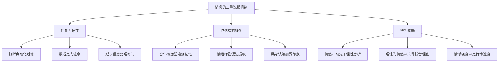
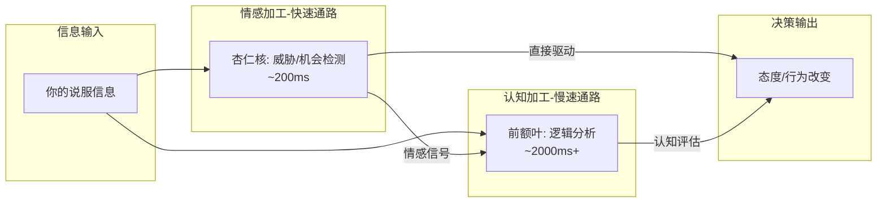
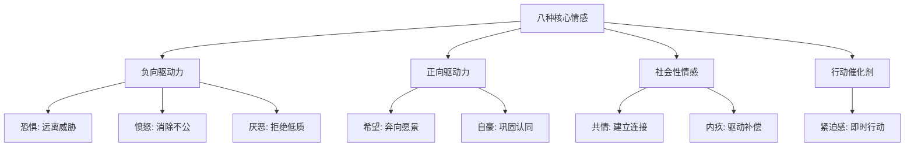
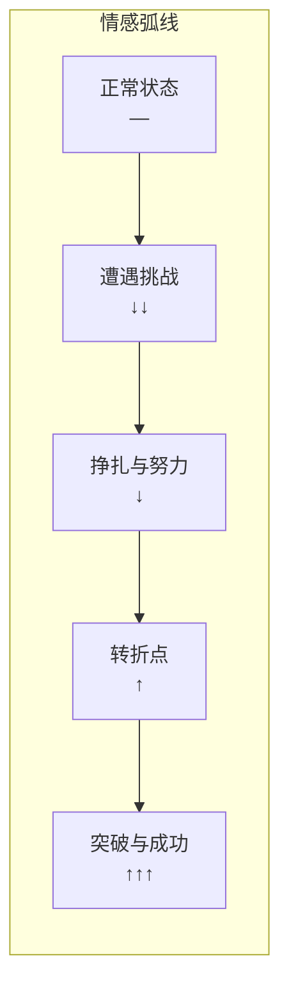
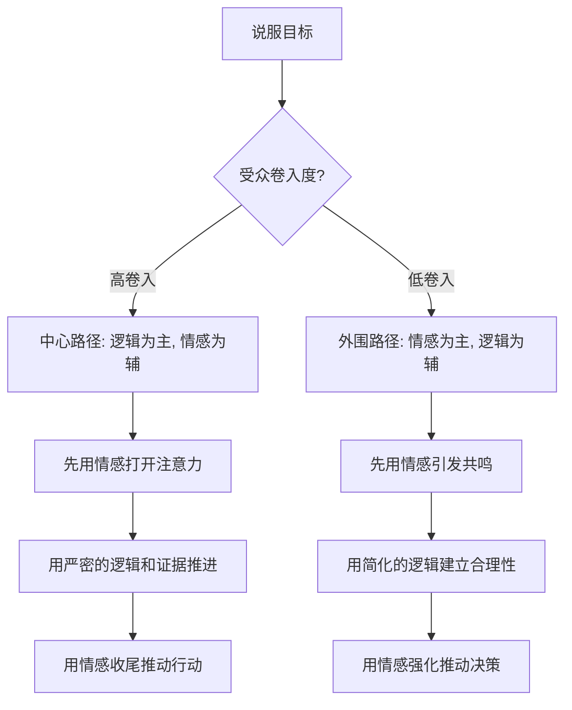
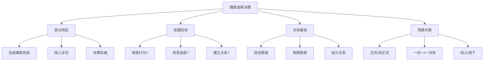

# 二、诉诸情感：打动人心的力量

> "人们会忘记你说过什么，会忘记你做过什么，但永远不会忘记你带给他们的感受。" —— 玛雅·安杰洛

如果说可信度是说服的"入场券"，那么情感就是说服的"发动机"。逻辑可以让人点头，但只有情感能让人行动。你可能用无懈可击的数据证明了某项投资的回报率，但对方真正掏出支票簿的那一刻，一定是某个画面、某句话、某种感受击中了他。

本节将从神经科学和心理学的底层原理出发，系统拆解情感在说服中的运作机制、八种核心情感的精确运用方法、讲故事的完整技术体系、情感与逻辑的协同策略、数字时代的情感说服新范式、情感选择的决策框架，以及常见的误区和进阶技巧，帮助你掌握这门"打动人心"的系统能力。

---

## 2.1 情感说服的科学基础

### 2.1.1 Damasio的躯体标记假说：情感不是理性的敌人，而是决策的导航仪

传统观念将情感与理性对立——理性是好的，情感是干扰。但神经科学家安东尼奥·达马西奥（Antonio Damasio）在20世纪90年代的研究彻底颠覆了这一认知。

达马西奥研究了一组特殊的患者：他们的前额叶皮层（特别是腹内侧前额叶）受损，导致情感能力严重受损，但智力、记忆、逻辑推理能力完好无损。按传统理论，这些人应该做出更"理性"的决策。但事实恰恰相反——他们连最基本的日常决策都无法完成：无法决定午餐吃什么、无法安排一天的行程、无法在两个相似的选项之间做出选择。

达马西奥由此提出了**躯体标记假说（Somatic Marker Hypothesis）**：每当我们面对一个选项时，身体会产生微妙的生理反应（心跳加速、胃部收紧、肌肉放松等），这些反应就是"躯体标记"，它们像指南针一样告诉大脑"这个选项感觉好"或"这个选项感觉不好"。没有这些情感信号，大脑就像一台没有操作系统的计算机——硬件完好，但无法运行任何程序。

后续研究进一步证实了这一假说。Iowa赌博任务实验（Bechara et al., 1994）中，正常参与者在还没有明确意识到哪副牌更有利之前，他们的皮肤电反应已经对不利的牌组产生了更大的生理反应——身体"知道"了答案，而大脑的意识层面还没跟上。

**对说服的启示**：你不能只说服对方的大脑（逻辑），还必须说服对方的身体（情感）。当对方说"道理我都懂，但就是过不了心里那道坎"时，他描述的正是躯体标记在发挥作用。

### 2.1.2 情感的三重说服机制

在说服过程中，情感通过三个相互独立又相互增强的机制发挥作用：

**机制一：注意力捕获**

人类每天接触约1100万比特的感官信息，但意识只能处理约50比特。大脑依靠自动化过滤机制（选择性注意）来决定哪些信息值得加工。情感是最强大的"破滤器"——一条带有强烈情感色彩的信息能瞬间突破注意力屏障，进入意识加工。

神经科学的解释是：杏仁核（amygdala）作为大脑的"威胁检测器"，会对情感性刺激做出极快的反应（快于意识加工），并通过释放去甲肾上腺素来提升整个大脑的警觉水平。这意味着情感性信息会自动获得更多认知资源。

一个经典的广告研究（Teixeira et al., 2012）发现，在视频广告中引发情感反应（无论是正面还是负面）的时刻，观众跳过广告的概率大幅降低。情感就像大脑的"高亮标记"——一旦打上，注意力就被锁定。

**实操含义**：在说服的开场阶段，你需要一个情感"钩子"来捕获注意力。数据、事实、逻辑不是好的开场——它们需要对方已经投入注意力才能被加工。先用情感"开门"，再用逻辑"请进"。

**机制二：记忆编码强化**

加州大学尔湾分校的James McGaugh团队通过大量实验证明：情感唤醒度（arousal）越高的事件，记忆越深刻、越持久。机制是杏仁核在情感唤醒时释放的应激激素（如肾上腺素和皮质醇）会增强海马体的记忆编码功能。

**具象化理解**：你可能不记得三天前午饭吃了什么（低情感唤醒），但你一定记得五年前那次当众出丑的场景（高情感唤醒），甚至能回忆起当时穿的衣服、周围人的表情。

**"闪光灯记忆"现象**（Brown & Kulik, 1977）：人们对于伴随强烈情感的重大事件会形成极其详细、持久的记忆——就像大脑拍了一张高分辨率照片。911事件、重大自然灾害、个人生命中的关键转折点，这些记忆即使多年后依然清晰如昨。

**实操含义**：如果受众在听完你的信息后没有产生任何情感反应，这条信息大概率会在24小时内被遗忘。你必须给你的信息"贴上情感标签"，让它能在记忆中被检索到。

**机制三：行为驱动**

2004年，普林斯顿大学的Jonathan Haidt提出了"象与骑象人"隐喻：情感是大象，理性是骑象人。骑象人以为自己在控制方向，但实际上大象想去哪，骑象人就跟到哪。更准确地说，情感先做出决定（在200-500毫秒内），然后理性再为这个决定编造合理的解释（在2000毫秒后）。

哈佛商学院教授Gerald Zaltman的研究更直接：95%的消费决策发生在潜意识层面，即情感驱动的层面。消费者事后给出的"理性理由"，大多数是事后合理化（post-hoc rationalization）。

**实操含义**：不要试图用逻辑"压倒"情感，而要用情感"启动"行动，然后用逻辑给对方一个"可以告诉别人的理由"。

### 2.1.3 情感与认知的交互模型

情感和认知不是两条独立的加工通路，而是深度交织的。理解它们的交互关系，是精确运用情感说服的前提。

**关键交互模式**：

| 交互模式 | 机制 | 说服策略 |
|---------|------|---------|
| 情感启动认知 | 积极情感降低认知防御，促进信息加工 | 先用幽默/共鸣放松对方，再进入核心论点 |
| 认知重评情感 | 通过重新解释情境改变情感反应 | 帮对方换个角度看问题，化解负面情感 |
| 情感锚定判断 | 情感状态影响风险/收益评估 | 在对方心情好时提出要求（"心情好效应"） |
| 认知放大情感 | 注意力聚焦增强情感体验 | 引导对方想象细节来增强情感反应 |
| 情感竞争 | 不同情感之间相互抑制 | 用积极情感置换消极情感（如用希望替代恐惧） |
| 情感惯性 | 已有情感倾向影响新信息的加工方式 | 先了解对方已有立场，找到情感切入点 |

### 2.1.4 镜像神经元与情感共鸣的神经基础

1990年代，意大利帕尔马大学的Giacomo Rizzolatti团队在研究恒河猴运动皮层时意外发现了一组特殊神经元：猴子自己抓取食物时这些神经元放电，看到实验员抓取食物时它们也放电——仿佛猴子的大脑在"镜像"他人的行为。这些神经元被命名为**镜像神经元（Mirror Neurons）**。

后续的人类脑成像研究表明，人类大脑中存在类似的镜像系统，分布在运动前皮层、顶下小叶和脑岛等区域。更重要的是，这个系统不仅镜像行为，还镜像**情感**。

当你看到别人痛苦的表情时，你大脑中的前脑岛（anterior insula）——处理自身痛苦体验的区域——也会被激活。你不是"知道"对方在痛，而是在某种程度上"感受"到了对方的痛。这就是共情的神经基础。

**对说服的启示**：

1. **情感是传染的**：你的情感状态会通过镜像系统"传染"给受众——不是通过语言，而是通过面部表情、语调、身体姿态的无意识模仿
2. **真实是核心**：镜像神经系统对虚假情感的反应与对真实情感的反应截然不同（这解释了为什么虚假共情总让人觉得"哪里不对"）
3. **具身体验胜过抽象信息**：让受众"看到"和"感受到"比让他们"听到"更有效，因为镜像系统对视觉-运动信息的加工最为直接

---

## 2.2 八种核心情感的精确运用

人类的基本情感虽多，但在说服场景中，有八种情感的使用频率最高、效果最强、也最容易出错。掌握它们的精确运用方法，是情感说服的核心能力。

### 2.2.1 恐惧：最强大也最危险的双刃剑

恐惧是进化留给我们最古老的生存机制。面对威胁时，恐惧能在瞬间调动全身资源（心跳加速、瞳孔放大、血液流向大肌肉群），为"战或逃"做准备。在说服中，恐惧同样是调动行动的强大引擎——但也是最容易失控的引擎。

**恐惧说服的运作机制**

恐惧通过两个阶段发挥作用：

1. **威胁评估阶段**：大脑评估威胁的严重性（severity）和自身的脆弱性（vulnerability）。只有当"这件事很严重"且"我可能受害"两个条件同时满足时，恐惧才会被激活。
2. **应对评估阶段**：大脑评估是否有有效的应对方案（efficacy）以及自己是否有能力执行（self-efficacy）。只有当"存在解决方案"且"我能做得到"时，恐惧才会转化为行动；否则，恐惧会触发防御机制（否认、逃避、信息回避）。

这就是Witte（1992）提出的**扩展平行过程模型（Extended Parallel Process Model, EPPM）**的核心思想。该模型预测了恐惧诉求的两种截然不同的结果：

- **危险控制反应**（当应对效能高时）：受众接受威胁信息，采取保护性行动——"这确实危险，但我知道该怎么做"
- **恐惧控制反应**（当应对效能低时）：受众拒绝或逃避信息，用否认、合理化来消除不适——"没那么严重"、"不会发生在我身上"

**恐惧说服的最优公式**

有效恐惧 = 感知威胁 × 感知脆弱性 × 应对效能 × 自我效能

四者缺一不可。缺少任何一项，恐惧说服就会失败甚至适得其反。

**恐惧强度的倒U型曲线**

恐惧说服的效果与恐惧强度呈倒U型关系：

| 恐惧强度 | 受众反应 | 说服效果 |
|---------|---------|---------|
| 过低 | "这事跟我没关系" | 无效——威胁未激活 |
| 适中 | "这确实是个问题，我得做点什么" | 最佳——激活行动动机 |
| 过高 | "这太可怕了，我不想想了" | 反效果——触发防御机制 |

Tannenbaum等人（2015）对48项实验的元分析证实了这一规律：适度恐惧诉求的说服效果显著优于无恐惧和高恐惧诉求。但元分析也发现了一个重要修正：当恐惧诉求配以强有力的、具体的行动方案时，即使恐惧强度偏高，说服效果依然可以维持——关键在于"出路"是否与"威胁"匹配。

**实操模板：恐惧说服的四步框架**

1. **描绘威胁**（具体、可感知）："去年，我们行业中有3家公司因为没有及时数字化转型而被迫裁员30%以上"
2. **连接受众**（建立脆弱性感知）："我们的现状和那3家公司转型前几乎一模一样"
3. **展示出路**（建立应对效能）："但好消息是，我们现在行动还来得及，这是已经被验证有效的方案"
4. **降低门槛**（建立自我效能）："第一步只需要两周，投入小、风险可控"

**恐惧说服的常见错误**

- **只制造恐惧不提供出路**：这会触发"恐惧控制"——受众为了消除不适感，会选择否认威胁（"不会那么严重"）或逃避信息（"我不想听"），而非采取行动。
- **恐惧强度过高**：大量研究（Witte, 1992; Tannenbaum et al., 2015元分析）表明，当恐惧超过受众的承受阈值时，说服效果急剧下降。
- **威胁过于抽象**："不重视安全可能导致问题"——这种抽象的威胁无法激活恐惧反应。必须具体化："上个月，竞争对手A因为数据泄露损失了2000万"。
- **忽略受众的已有信念**：如果受众已经相信"这种事不会发生在我身上"（乐观偏见），你需要先打破这种信念，才能激活恐惧。常用方法是展示"和你类似的人/公司也曾这么想，但……"。
- **恐惧与行动方案脱节**：如果恐惧指向A风险，但行动方案解决的是B问题，受众会感到困惑而不是被说服。威胁和出路必须精确对应。

### 2.2.2 愤怒：最被低估的行动驱动力

愤怒是一种被严重低估的说服情感。在公共话语中，愤怒常被贴上"负面""不理性"的标签。但从说服科学的角度看，愤怒是人类最强大的行动驱动情感之一——它的核心特征是**"向外指向"和"追求改变"**。

**愤怒的运作机制**

愤怒与恐惧的方向性截然不同：

| 维度 | 恐惧 | 愤怒 |
|------|------|------|
| 方向 | 向内收缩（远离威胁） | 向外扩张（消除威胁源） |
| 认知评估 | "我可能受害" | "有人/有事做错了" |
| 行为倾向 | 逃避、回避 | 接近、对抗、改变 |
| 信心水平 | 降低（感到无力） | 提高（感到有力量） |
| 风险感知 | 放大风险 | 低估风险 |
| 对信息的需求 | 寻求安慰和保护方案 | 寻求行动方案和敌人 |

Lerner和Keltner（2001）的研究发现，愤怒让人对未来的预期更加乐观，更愿意承担风险，更倾向于采取行动——这些特质在说服中恰恰是推动决策的关键因素。

**愤怒说服的三种激活模式**

模式一：不公正愤怒（Injustice Anger）

当受众发现"有人受到了不公平对待"时，不公正愤怒被激活。这是社会运动、公益倡导和政策推动中最常使用的愤怒类型。

激活公式：**"看，他们正在对[弱势群体/你关心的对象]做这件事——这不公平"**

示例：
- "你知道吗？外卖骑手平均每天跑12小时，但平台算法给他们的配送时间越来越短，上个月有3位骑手因为赶时间出了交通事故"
- "这家公司年利润增长40%，但一线员工的工资三年没涨过"

模式二：背叛愤怒（Betrayal Anger）

当受众发现"我信任的人/组织辜负了我"时，背叛愤怒被激活。这种愤怒极为强烈，因为它同时包含愤怒和失望两种情感。

激活公式：**"你信任的[人/机构/品牌]，一直在做[与你的信任相悖的事]"**

示例：
- "你花高价买的'有机蔬菜'，实际检测出三种禁用农药"
- "你以为你的数据是安全的，但这家公司的内部文件显示他们一直在出售用户数据"

模式三：无力愤怒（Frustration Anger）

当受众反复遇到同一问题却无法解决时，无力愤怒被激活。这种愤怒的特点是已经积累了大量的不满，只需要一个引爆点。

激活公式：**"你已经忍受[这个问题]太久了——而这是[根本原因/真正的解决办法]"**

示例：
- "每次系统出bug都要手动修，你已经跟IT提了三年了——问题不在IT，而在架构本身"
- "年年体检年年说要减肥，但节食方案从来坚持不了一个月——因为你一直在用错误的方法"

**愤怒说服的风险与控制**

愤怒是高能量情感，但也最难精确控制：

1. **愤怒指向错误**：如果愤怒的目标不是你希望的，受众可能把怒火转向你或无关的人
2. **愤怒强度过高**：过度愤怒会损害理性判断，导致冲动决策和事后后悔
3. **愤怒持续时间短**：愤怒来得快去得也快，如果不迅速转化为行动方案，愤怒消退后受众可能感到空虚甚至羞愧
4. **文化敏感性**：在中国文化中，公开表达愤怒（尤其是下属对上级、弱势对强势）可能被视为"不成熟"或"不合适"，需要更含蓄的表达方式

**控制策略**：

- **愤怒必须有明确指向**：愤怒的对象必须清晰——是一个具体的行为、政策或决策，而不是模糊的"他们"或"体制"
- **愤怒必须伴随方案**：愤怒是燃料，方案是引擎——没有引擎的燃料只会引发火灾
- **愤怒后接希望**：在愤怒达到顶点后，迅速切换到希望和行动方案——"这不公平，但我们可以改变它"
- **愤怒后留出口**：给受众一个立即可以做的行动（签名、分享、投票、购买），将愤怒的能量转化为行为

### 2.2.3 厌恶：拒绝与净化的驱动力

厌恶是一种古老的情感，最初进化出来是为了让我们避免有害物质（腐烂食物、疾病载体）。在说服中，厌恶的功能是**激发"拒绝"和"净化"的冲动**——让人想要远离、清除或替换某个事物。

**厌恶在说服中的两种应用**

应用一：产品/品牌竞争中的"替代厌恶"

在营销和商业说服中，让受众对现有方案/竞品产生轻微的厌恶感（不是恶心，而是"不够好""过时了""不够干净"），能有效降低其吸引力，为你的替代方案创造空间。

示例：
- 洗衣液广告中展示衣服上的"隐藏污渍"放大图——让受众对"表面干净但实际有残留"产生轻微厌恶
- 数码产品发布会中展示老旧设备的卡顿、厚重、低分辨率——让受众对现有设备产生"过时感"

应用二：道德和社会议题中的"义愤厌恶"

当受众对某种行为或现象产生道德层面的厌恶（"这种做法令人不齿"），这种情感会驱动强烈的排斥和改变意愿。

示例：
- 曝光食品安全问题时的详细描述——"用过期肉重新加工、地沟油回收再利用"——激发的不仅是恐惧，更是对这种行为本身的道德厌恶
- 揭露学术造假、数据篡改的细节——激发知识分子群体的"纯洁性厌恶"

**厌恶的边界与风险**

厌恶是双刃剑，因为它可能从目标扩散到不相关的事物：

- **光环效应逆转**：如果受众对你的竞争对手产生厌恶，这种厌恶可能扩散到整个产品类别（"都是骗人的"）
- **代言人风险**：如果厌恶的故事讲得太过生动，受众可能在记忆中将这种不适与你的品牌联系在一起
- **道德厌恶失控**：如果道德厌恶过于强烈，可能引发群体性的攻击行为而非建设性改变

**安全使用的三原则**：

1. 厌恶强度控制在"轻微不适"级别，不要到"恶心"
2. 厌恶对象必须与你的说服目标精确对应
3. 厌恶之后必须立即提供"净化/替代"方案——"以前的做法令人担忧，但现在有了更干净的选择"

### 2.2.4 希望与兴奋：正向情感的驱动力

恐惧是"推力"——让人远离威胁；希望是"拉力"——让人奔向愿景。很多说服者过度依赖恐惧而忽视了正向情感的力量。事实上，对于有明确目标追求的受众，希望和兴奋往往比恐惧更有效。

**希望的构成要素**

希望不是盲目乐观，而是一种包含三个要素的认知-情感状态（Snyder, 2002的希望理论）：

1. **目标感**（Goals）：存在一个值得追求的目标
2. **路径感**（Pathways）：相信有可行的方法达到目标
3. **动力感**（Agency）：相信自己有能力沿着路径前进

三者缺一不可：有目标无路径是空想，有路径无动力是画饼，有动力无目标是盲动。

**希望说服的实操技巧**

- **具象化愿景**：不要说"这会改善我们的业绩"，要说"想象一下，明年的这个时候，我们的客户满意度从72%提升到90%，团队每周加班时间从12小时降到3小时，而你的部门预算反而节省了15%"
- **制造"几乎成功"的感觉**：展示进展和里程碑，让受众感觉"成功就在眼前"——这比"从零开始"更能激发行动。LinkedIn的"档案完成度"进度条就是这一原理的经典应用：显示"你的档案已完成85%——只需再添加一项技能"，点击率远高于"请添加你的技能"
- **利用"预期快感"**：神经科学研究表明，预期奖励时大脑释放的多巴胺与实际获得奖励时一样多（Knutson et al., 2001）。引导对方想象成功的场景，能直接激活大脑的奖励系统
- **提供"最小第一步"**：希望需要被行动来维护。如果愿景太远而第一步太大，希望会迅速消退。将第一步压缩到"今天就能做的"范围——"你只需要给我15分钟，我来演示一下"

**希望 vs. 恐惧：选择策略**

| 适用情感 | 场景特征 | 典型案例 |
|---------|---------|---------|
| 恐惧 | 需要阻止/避免某种行为；受众对现状满意但面临隐藏风险 | 安全培训、保险销售、健康警示 |
| 希望 | 需要推动/启动某种行为；受众有内在目标和追求 | 创业融资、学习推广、产品推广 |
| 愤怒 | 需要打破现状、挑战权威或不公 | 社会运动、政策倡导、行业改革 |
| 两者结合 | 需要既打破现状又建立新方向；变革管理 | 组织变革、政策倡导、健康生活方式推广 |

**两者结合的黄金比例**：研究表明，正向情感与负向情感的比例在3:1到5:1之间时说服效果最佳（Fredrickson的"拓展-建构"理论的延伸应用）。即先用一个负面因素破冰，再用三到五个正向因素建设。

### 2.2.5 共情与共鸣：最深层的情感连接

共情（empathy）是让对方感受到"你理解我"的能力。在所有情感说服手段中，共情是建立深层信任最有效的方式——它不操纵，而是建立真实的连接。

**共情的两个维度**

神经科学研究（Decety & Jackson, 2004）发现，共情包含两个独立但协同的维度：

1. **情感共情**（Affective Empathy）：感受到对方的情绪状态——"我能感受到你的焦虑"
2. **认知共情**（Cognitive Empathy）：理解对方的观点和处境——"我理解你为什么做了这个决定"

两个维度缺一不可：只有情感共情会让对方觉得你"有同感但不懂"；只有认知共情会让对方觉得你"懂但不在乎"。

**共情的第三维度——共情关注**（Empathic Concern）

Batson（1991）的研究区分了第三种共情维度：共情关注，即不仅理解和感受对方，还产生了**帮助对方的动机**。这是说服中最有力的共情形式——它让受众不仅觉得你理解他，还觉得你站在他这一边。

共情关注的表达公式：**"我理解你的处境[认知共情]，我能感受到这对你有多难[情感共情]，而我想帮你找到出路[共情关注]"**

**共情表达的实操技术**

技术一：情感标注（Affect Labeling）

UCLA的Matthew Lieberman团队通过fMRI研究发现，当人们的情绪被准确命名时，杏仁核的活跃度会显著降低——情绪依然存在，但不再那么令人不适。这就是"说出来就好了"的神经科学基础。

实操公式：**"你现在感到[情绪词]，因为[原因]"**

示例：
- "你现在感到失望，因为你花了三个月准备的方案被否决了"
- "我能感受到你的焦虑，这次裁员的消息来得太突然了"
- "你一定很沮丧，明明已经很努力了但结果还是不如预期"

注意：情感标注必须准确。标注错误（"你一定很生气"——其实对方是伤心）会造成反效果，让对方觉得"你根本不理解我"。如果不确定，用试探性语气："你是不是觉得有点……失望？"

技术二：经历共鸣（Experiential Resonance）

分享自己类似的经历，让对方知道"你不是一个人"。关键技巧：
- 你的经历要与对方的相似但不必完全相同
- 重点放在你当时的情感体验上，而非事件本身
- 必须从对方的经历出发，而不是把话题转移到自己身上
- 分享的时间不宜过长——你的故事是配角，对方的处境才是主角

示例："三年前我也经历过类似的困境——团队核心成员离职，项目进度严重滞后。那时候我每天晚上都睡不着，一直在想是不是自己哪里做错了。"

技术三：观点采择（Perspective Taking）

暂时放下自己的立场，从对方的角度看问题。这不是策略性的"假装理解"，而是真正尝试理解对方的处境、约束和优先级。

示例："如果我站在你的位置，面对董事会对成本的严格控制和团队对资源的迫切需求之间的夹击，我也会非常纠结。"

观点采择的深层技巧——"约束清单法"：在说服前，列出对方面临的3-5个约束条件（预算限制、时间限制、上级压力、既有承诺等），并确保你的方案考虑到了这些约束。当对方发现你理解他的约束时，信任感会急剧上升。

技术四：情感验证（Emotional Validation）

不急于解决问题，先确认对方的情感反应是合理的、被理解的。

公式：**"任何人处在你的情况，都会有这样的感受"**

这句话的力量在于去病理化——它告诉对方"你不是过度反应，你的感受是正常的"。这会大幅降低对方的防御心理，为后续的方案讨论打开通道。

### 2.2.6 内疚：精密校准的道德杠杆

内疚是一种复杂的"自我意识情感"——它在我们违背自己的道德标准或伤害了他人时被激活，驱动补偿和修复行为。在说服中，适度唤起内疚可以有效地推动改变。

**内疚说服的运作机制**

内疚的核心是"我本可以做得更好"的认知-情感体验。它包含三个要素：
1. **责任归因**：我对自己或他人的困境负有责任
2. **标准违反**：我的行为未能达到自己的道德/行为标准
3. **修复动机**：我想要弥补或改变

**内疚说服的实操技巧**

- **"你本可以"框架**：暗示受众有改善的能力但尚未行动——"你这么有影响力，如果能在社交媒体上分享这个公益项目，能帮助多少人啊"
- **对比框架**：展示受众的当前行为与理想行为之间的差距——"你每周花5小时刷短视频，如果把其中1小时用来陪伴孩子阅读……"
- **受益人具体化**：内疚的强度与受益人的具体程度成正比。"帮助非洲儿童"远不如"帮助8岁的Amina获得干净的饮用水"有效。这就是"可识别受害者效应"（Identifiable Victim Effect）——一个具体的、有名有姓的受害者比一百万个统计数字更能激发内疚和行动
- **时间框架缩窄**：将抽象的长期后果缩短为眼前的、可感知的影响——"你今天多用一个塑料袋，它会在海洋里存在400年"

**内疚说服的红线**

过度使用内疚会造成严重的关系损害。以下情况必须避免：
- 让对方觉得自己"整个人"都是坏的（这会转化为羞耻而非内疚，效果截然不同）
- 反复使用同一内疚话题（会让对方产生"道德疲劳"和抵触）
- 在公开场合唤起内疚（会激发防御和敌意）
- 对不在对方控制范围内的事情施加内疚（会引发愤怒而非改变）

**内疚 vs. 羞耻的关键区分**

| 维度 | 内疚（Guilt） | 羞耻（Shame） |
|------|-------------|-------------|
| 焦点 | "我做了坏事" | "我是坏人" |
| 心理反应 | 想要弥补、修复 | 想要逃避、隐藏 |
| 对关系的影响 | 趋近行为（想修复关系） | 回避行为（想逃离关系） |
| 说服效果 | 正向——驱动补偿行为 | 负向——触发防御和敌意 |
| 自我评价 | 整体自我完整，特定行为需改善 | 整体自我受到质疑 |
| 行为结果 | 采取建设性行动 | 退缩、否认或攻击 |

说服中只应激活内疚，绝不应激活羞耻。如果你的表达可能让对方觉得"我这个人不好"而非"我这个行为可以改善"，就需要立即调整措辞。

**实操检验**：说完你想说的话后，问自己——这句话的主语是"你做的事"还是"你这个人"？如果是后者，改写。

### 2.2.7 自豪与认同：最持久的正向驱动力

自豪感（pride）是一种"我做得好"的自我肯定情感，而认同感（identity）是"我是这样的人"的自我定义。两者结合，能创造出最持久、最有力量的说服效果——因为你在帮对方完成自我叙事。

**自豪感说服的三个层次**

1. **成就自豪**：基于具体成果——"你完成了这个项目，团队的业绩提升了30%"
2. **能力自豪**：基于能力认可——"你的分析能力在公司里是数一数二的"
3. **道德自豪**：基于品格肯定——"你始终坚持做正确的事，即使这不容易"

层次越高，说服效果越持久。成就自豪会被遗忘，但道德自豪会内化为自我认同。

**自豪感的"向上螺旋"效应**

当一个人体验到自豪感时，他的自我效能感上升，更愿意接受挑战，更倾向于做出与自豪来源一致的行为——这就形成了正向螺旋。

在说服中的应用：先通过一件小事让对方体验成功和自豪，然后将更大的请求与这种自豪感绑定——"你上次解决那个技术难题的方式让所有人都印象深刻，这次的挑战虽然更大，但以你的能力完全没问题"

**认同说服的高级技巧**

最高级的情感说服不是让对方觉得"你说得对"，而是让对方觉得"这就是我"。

技巧一：身份标签法

给对方一个正面的身份标签，然后将你的说服目标与这个标签绑定：
- "你是一个注重家庭的人——所以为家人选择最健康的食物是自然而然的事"
- "作为团队中最受信赖的人，你的表态会决定大家的方向"

技巧二：预先赞美法（Pre-suasion）

Robert Cialdini在其著作《Pre-suasion》中提出的概念：在提出请求之前，先赞美对方与你请求相关的特质。被赞美后，人们会倾向于做出与赞美一致的行为来维护自我形象。
- "我知道你是一个敢于做决定的人——所以这件事我直接找你"
- "你一直都是那种说到做到的人——我相信这次也不例外"

技巧三：群体认同法

将你的说服目标与对方所属群体的正面价值观绑定：
- "我们团队一直以来的特点就是不畏困难——这次挑战正是展现这一点的机会"
- "真正的创业者不会因为短期困难就放弃长期愿景"

技巧四：未来自我联结法（Future Self-Continuity）

Hershfield（2011）的研究发现，当人们感到与"未来的自己"有更强的联结感时，他们更愿意做出长期有利的决策。在说服中，引导受众想象未来的自己如何看待今天的决定——"一年后的你，会感谢今天做出这个决定的自己"。

### 2.2.8 紧迫感：行动的催化剂

紧迫感本身不是一种基础情感，而是一种认知-情感状态——"我必须现在就行动"。它与恐惧、希望等情感结合时，能显著增强行动驱动力。

**紧迫感的两个心理来源**

1. **稀缺紧迫**：机会有限，错过就没了——"这个优惠只剩最后三天"
2. **时间紧迫**：行动窗口在关闭——"如果不在本季度完成，明年预算就拿不到了"

**紧迫感的第三种来源——社会紧迫**

当受众意识到"别人正在行动"时，社会性紧迫感被激活——"如果我现在不行动，就会被落下"。

示例：
- "这个岗位的投递量已经超过了200份"
- "上周有5家同行企业已经开始了数字化转型"
- "你的三个主要竞争对手都在用这个方案"

**紧迫感的精确校准**

| 紧迫度 | 适用场景 | 风险 |
|-------|---------|------|
| 低紧迫 | 长期关系建设、品牌认知 | 无法驱动即时行动 |
| 中紧迫 | 一般销售、项目推动 | 最佳平衡点 |
| 高紧迫 | 紧急决策、危机处理 | 可能引发决策焦虑和后悔 |

**制造真实紧迫感的方法**（注意：虚假紧迫感会摧毁信任）

- **真实的截止日期**："季度预算审批在下周五，过了这个时间点就要等下一个季度"
- **真实的竞争**："目前有另外两家供应商也在竞标这个项目"
- **真实的后果**："如果本月不能完成系统迁移，下个月新税法生效后我们的合规成本会增加40%"
- **真实的窗口期**："这次展会是今年唯一一次接触目标客户群的机会"
- **不可逆的条件变化**："原材料价格在过去的三个月上涨了25%，如果不在价格锁定前下单，成本会进一步上升"

**紧迫感的"可信度公式"**

紧迫感的效果 = 感知真实性 × 感知相关性 × 可采取的行动清晰度

三个因素缺一不可。如果受众觉得"这是套路"（真实性低），或者觉得"跟我没关系"（相关性低），或者不知道"我该做什么"（行动不清晰），紧迫感就不会转化为行动。

---

## 2.3 讲故事：情感说服的终极武器

故事是人类文明最古老的信息传递方式——远早于文字、数据和PPT。在说服中，故事之所以具有无与伦比的力量，是因为它能同时激活大脑的多个加工系统。

### 2.3.1 为什么故事有效：神经科学的解释

普林斯顿大学的Uri Hasson团队在2010年做了一个里程碑式的实验：让一个人讲故事，同时用fMRI扫描听者的大脑。结果发现：

1. **神经耦合**（Neural Coupling）：听者的大脑活动模式开始与讲述者的大脑活动模式同步——仿佛听者在"亲身体验"故事
2. **全脑激活**：故事不仅激活语言加工区域，还激活了与故事内容对应的感觉和运动区域——听"他抓起粗糙的绳子"时，触觉皮层会激活；听"她跑过终点线"时，运动皮层会激活
3. **情感同步**：听者的大脑中与情感相关的区域（杏仁核、岛叶）也会被故事激活，产生真实的情感体验

加州大学伯克利分校的Paul Zak进一步发现，一个有情感张力的故事能让听者的催产素（oxytocin）水平显著升高——催产素是"信任和连接"的神经化学物质，它直接增强了听者对讲述者的信任和合作意愿。

**故事 vs. 数据：效果对比**

| 维度 | 纯数据/论证 | 故事化表达 |
|------|------------|-----------|
| 记忆保持率（72小时后） | 约5-10% | 约65-70% |
| 情感卷入度 | 低 | 高 |
| 行动转化率 | 中 | 高 |
| 信息传递效率 | 单通道（语言） | 多通道（语言+感官+情感+运动） |
| 信任建立 | 需要来源权威 | 通过共鸣自动建立 |
| 大脑激活区域 | Broca区+Wernicke区（语言） | 全脑（语言+感觉+运动+情感） |

斯坦福大学Jennifer Aaker教授的研究进一步证实：当信息以故事形式呈现时，人们记住的信息量是纯数据呈现的22倍。

**关键结论**：故事不是"信息的包装"，而是"体验的传递"。当你的受众在听故事时，他们的大脑在某种程度上是在"经历"你描述的场景——这种经历产生的信念改变远比纯粹的信息传递深刻得多。

### 2.3.2 说服性故事的四种经典结构

不同类型的说服目标适合不同的故事结构。掌握四种核心结构，你就能应对绝大多数说服场景。

**结构一：STAR框架（最通用）**

STAR是Situation-Trouble-Action-Result的缩写，适用于案例分享、项目汇报、面试回答等场景。

| 要素 | 作用 | 内容要求 |
|------|------|---------|
| Situation（情境） | 建立共鸣起点 | 描述受众熟悉的情境，让对方代入 |
| Trouble（困境） | 引入冲突和挑战 | 激发情感卷入，制造"然后呢？"的悬念 |
| Action（行动） | 展示解决方案 | 具体、可操作，不能笼统说"采取了措施" |
| Result（结果） | 验证行动有效性 | 用数据和具体变化支撑，不说"效果很好" |

示例（说服团队接受新工具）：

> **S**：上个季度，我们团队每周花15个小时在数据整理和报表制作上。
> **T**：每次客户要求定制报表，小王都要手动从三个系统导出数据，复制粘贴到Excel里——上个月因为一个公式错误，给客户的报表数据有误，差点丢掉一个大客户。
> **A**：我们引入了XX自动化工具，小王用了两周时间把三个系统的数据打通，设置了自动化报表模板。
> **R**：现在客户报表只需一键生成，数据准确率100%，小王每周节省了12个小时，用来做更有价值的客户分析工作。上个月的客户满意度提升了18%。

**结构二：英雄之旅（最打动人心）**

Joseph Campbell的"英雄之旅"（Hero's Journey）是人类叙事的原型结构。在说服中，它特别适合激励变革、推动创新：

平凡世界 → 冒险召唤 → 拒绝召唤 → 遇见导师
→ 跨越门槛 → 试炼与盟友 → 最深的洞穴
→ 最大的磨难 → 获得奖赏 → 返回之路 → 重生

简化为说服版的三幕结构：

1. **第一幕（旧世界）**：描述受众当前的困境/现状，建立共鸣——"我们一直用Excel管理客户数据，这在过去够用了"
2. **第二幕（突破）**：讲述转变的关键时刻，展示挑战和应对——"直到有一天，三个客户同时要求定制化报表，而我们的Excel模板彻底崩溃了"
3. **第三幕（新世界）**：描绘转变后的美好状态，激发希望——"现在，我们不仅解决了报表问题，还因为数据洞察赢得了两个新客户"

英雄之旅在企业变革中的变体——"集体英雄之旅"：主角不是个人而是团队。团队的"平凡世界"是旧流程，"冒险召唤"是市场变化，"试炼"是实施过程中的困难，"新世界"是变革后的高效状态。

**结构三：对比故事（最能强化立场）**

通过"以前 vs. 现在"或"有 vs. 没有"的对比，让差异和价值一目了然：

> "李经理的团队用了新方法后，季度人均产出从80万提升到120万。而隔壁张经理的团队还在用老方法，人均产出还在原地踏步，而且团队离职率从8%上升到了15%。"

对比故事的关键是控制变量——两个场景的差异应该尽可能只体现在你要推广的方案上，否则受众会质疑"可能是其他因素导致的差异"。

对比故事的三种变体：
- **时间对比**：同一对象的前后变化
- **空间对比**：不同对象在同一时间的差异
- **假设对比**：采取行动 vs. 不采取行动的未来预测

**结构四：个人转变故事（最有感染力）**

讲述讲述者自己或一个真实人物的转变经历，尤其适合价值观层面的说服：

> "五年前，我是一个典型的'加班狂'——每天工作12小时以上，觉得这才是敬业的标志。直到有一天，我女儿在作文里写'我的爸爸总是在工作，我希望他能来看我的运动会'……那一刻我意识到，高效工作不是做得多，而是做得对。从那以后，我……"

### 2.3.3 故事的核心要素与创作技术

**要素一：主角要与受众相似**

心理学中的"相似-吸引"效应表明，人们更容易被与自己相似的人打动。故事主角的背景、处境、挑战越接近受众，代入感越强。

操作技巧：
- 如果受众是中层管理者，主角也应该是中层管理者
- 如果受众面临预算压力，主角也应该面临预算压力
- 使用受众行业/领域的术语和场景
- 在故事开头用一两个细节建立"主角和你们一样"的信号

**要素二：具体细节增加真实感**

"一个客户对我们很满意"——苍白无力。
"上个月，深圳的王总在使用我们的系统三个月后，主动给我们打电话说，他的团队现在每天节省了两个小时，他终于能在6点前回家陪孩子吃晚饭了"——具体、可信、有感染力。

有效细节的类型：
- **人名和称谓**：比"某客户"真实100倍
- **数字**：具体的数字比模糊的描述有力得多（"3.7%" vs. "大幅提升"）
- **对话**：引用当事人的原话——"他说的第一句话是'我怎么不早点知道这个'"
- **感官细节**：视觉、听觉、触觉——"会议室里的空气突然安静了"
- **时间锚点**：具体的日期/时间——"那是去年12月的一个周五下午"
- **矛盾细节**：出乎意料的细节更能增强真实感——"他当时穿着拖鞋就冲进来了"

**要素三：情感弧线要有起伏**

平坦的故事是无效的故事。真正有感染力的故事必须有情感的"低谷-高峰"变化。

关键技巧：
- 低谷越深，高峰越有力量——"在几乎要放弃的那一刻，转机出现了"
- 在低谷处停留足够长，让受众充分感受困境——不要急着跳到解决方案
- 转折点要有可信的原因——不能"突然就好了"，要有触发转变的具体事件或决策
- 情感弧线的"节奏感"——不要在低谷停留太久（会让人绝望），也不要在高峰停留太久（会让人怀疑）

**要素四：结尾要与说服目标精确对接**

故事的最后一句话是整个说服的"落点"——它应该直接指向你希望受众采取的行动或接受的观点。

差的结尾："所以这个方法很好。"
好的结尾："所以当你的团队也在经历同样的困境时，你知道该找谁了。"

结尾的三种有效模式：
1. **行动号召式**："如果你也面临同样的问题，第一步是……"
2. **反问式**："如果三年前他就做了这个决定，今天的局面会怎样？"
3. **呼应式**：回到故事开头的场景，展示转变——"同样是那个会议室，同样的人，但今天的讨论完全不同了"

### 2.3.4 讲故事的表达技巧

拥有好故事只是一半，如何讲出来同样关键。

**节奏控制**

- 在描述情境时语速适中，营造稳定感
- 在描述困境时放慢语速，降低音量，制造紧张感
- 在描述转折时稍作停顿（2-3秒），让悬念发酵
- 在描述成功时加快语速，提升音量，传递兴奋感

**停顿的艺术**

停顿是最被低估的表达工具。一个恰到好处的停顿：
- 在关键信息之前停顿：制造"接下来要说重要的事"的预期
- 在关键信息之后停顿：让信息有时间被消化和感受
- 在情感高潮处停顿：让情感有空间膨胀
- 在提问之后停顿：给受众思考的时间（即使只有3秒）

停顿的科学依据：大脑需要约3-5秒来完成一次情感加工循环（识别情感 → 体验情感 → 产生反应）。如果信息密度太高、停顿太少，受众的情感加工会被打断，说服效果大打折扣。

**声音的"色彩"**

| 声音维度 | 传达的情感 | 操作方法 |
|---------|-----------|---------|
| 语速加快 | 兴奋、紧迫 | 描述成就、行动时使用 |
| 语速放慢 | 严肃、沉重 | 描述困境、风险时使用 |
| 音量降低 | 私密、信任 | 分享个人经历、关键洞察时使用 |
| 音量提升 | 力量、号召 | 总结、呼吁行动时使用 |
| 音调上扬 | 好奇、疑问 | 提出问题、制造悬念时使用 |
| 音调下沉 | 肯定、权威 | 给出结论、做出承诺时使用 |

**身体语言**

- 讲故事时面向受众，保持眼神接触
- 用手势辅助空间描述（"就这么大一个办公室"）
- 面部表情与故事情感一致——如果你讲的是悲伤的故事但面带微笑，信息会严重失真
- 身体姿态开放——双臂不要交叉，身体略微前倾表示投入

### 2.3.5 故事素材库的建设与管理

好故事不是临场编造的，而是系统积累的。每个说服者都应该建设自己的故事素材库。

**素材来源**

1. **个人经历**：你亲身经历的挑战、失败、转变——最真实，最有感染力
2. **客户/用户案例**：真实的成功故事和失败教训——最有说服力
3. **行业新闻和事件**：公开报道中的典型案例——最容易让受众验证
4. **历史故事和名人轶事**：经过时间检验的经典叙事——最有权威感
5. **团队成员的故事**：来自身边人的真实故事——最有亲切感

**素材整理的"STAR卡"方法**

为每个故事素材建立一张STAR卡片：

故事标题：[简短描述]
核心情感：[恐惧/希望/共情/内疚/自豪/愤怒]
适用场景：[说服目标/受众类型]
S（情境）：[1-2句话]
T（困境）：[1-2句话，突出情感冲突]
A（行动）：[1-2句话，具体且可操作]
R（结果）：[1-2句话，含数据]
关键细节：[3-5个让故事更生动的细节]
连接句：[这个故事与说服目标的对接方式]

建议维护至少20-30张STAR卡，覆盖不同情感类型和说服场景，这样在任何说服情境中都能快速找到合适的故事。

---

## 2.4 情感说服的高级策略

### 2.4.1 情感与逻辑的协同：双通道说服模型

最强的说服不是"只用情感"或"只用逻辑"，而是两者的精确配合。基于Petty和Cacioppo的精细加工可能性模型（ELM），我们可以构建一个双通道说服策略：

**高卷入受众的策略**（如投资者、技术评审、高管决策）
1. 开场：用一个引人入胜的故事/场景捕获注意力（情感通道）
2. 主体：提供完整的数据、逻辑、证据（认知通道）
3. 收尾：用愿景或紧迫感推动决策（情感通道）

**低卷入受众的策略**（如大众传播、社交媒体、日常说服）
1. 开场：情感钩子——恐惧、希望、好奇心（情感通道）
2. 主体：简单的逻辑线索+社会证明（简化认知+情感）
3. 收尾：清晰的行动呼吁+紧迫感（情感驱动）

**情感-逻辑协同的"三明治"结构**

这是最经典也最有效的结构：

情感开场（10-15%）→ 逻辑主体（70-80%）→ 情感收尾（10-15%）

为什么这个结构有效？
- 情感开场打开注意力通道，降低认知防御
- 逻辑主体提供"理性理由"，让受众有东西可以向他人解释
- 情感收尾推动行动，将"同意"转化为"执行"

### 2.4.2 情感校准：识别并匹配受众的情感状态

情感说服的前提是理解受众当前的情感状态。对一个正在焦虑的人讲希望的故事可能不够——你需要先处理他的焦虑，再引入希望。

**情感校准三步法**

1. **识别**：观察对方的非语言信号（表情、语气、身体姿态）和语言信号（用词、语调、话题选择），判断其当前情感状态
2. **镜像**：先用共情表达匹配对方的情感——"我能感受到你现在压力很大"——建立情感连接
3. **引导**：在建立连接后，逐步将对方的情感引导向有利于说服的方向——"不过我有一个想法，也许能让情况好一些"

**情感识别的"四维观察法"**

| 观察维度 | 积极情感信号 | 消极情感信号 |
|---------|------------|------------|
| 面部 | 微笑、眼神明亮、眉毛放松 | 皱眉、眼神回避、嘴唇紧闭 |
| 声音 | 语速适中、音调平稳、表达流畅 | 语速加快或放慢、音调变高、说话犹豫 |
| 身体 | 身体前倾、手势开放、姿态放松 | 身体后仰、双臂交叉、姿态紧绷 |
| 语言 | 用词积极、主动提问、表达认同 | 用词消极、沉默寡言、频繁质疑 |

### 2.4.3 情感的"引爆点"设计

在说服过程中，某些关键节点是情感影响力的"引爆点"——在这些节点上，微小的情感投入能产生最大的效果。

| 引爆点 | 时机 | 技巧 |
|-------|------|------|
| 开场引爆 | 说服的前30秒 | 惊人数据、反直觉结论、情感故事 |
| 转折引爆 | 从问题转向方案的时刻 | "但是"、"直到"——引入希望和新可能 |
| 证据引爆 | 关键数据/案例出现时 | 用故事包裹数据，用情感标注意义 |
| 收尾引爆 | 最后的行动呼吁 | 蓝图描绘、紧迫感、身份认同 |

**引爆点的设计原则**：

1. **反差越大，引爆力越强**：平静之后的爆发、绝望之后的转机、共识之中的质疑
2. **准备越充分，引爆效果越好**：情感引爆需要"铺垫"——先建立基线，再制造落差
3. **位置越靠前，记忆效果越好**（首因效应）：最重要的情感引爆应放在开场或前三分之一处
4. **结束位置决定行动力**（近因效应）：最后一个引爆点应直接指向行动呼吁

### 2.4.4 文化差异与情感说服

不同文化背景下，情感的表达和接收方式存在显著差异。在中国文化语境下，情感说服有若干特殊性：

| 维度 | 西方文化倾向 | 中国文化倾向 |
|------|------------|------------|
| 情感表达 | 直接外露 | 含蓄内敛 |
| 共情方式 | 直接表达理解 | 通过行动和细节暗示理解 |
| 恐惧诉求 | 个人风险最有效 | 家庭/集体风险更有效 |
| 自豪诉求 | 个人成就自豪 | 家族/集体荣誉自豪 |
| 故事偏好 | 个人英雄叙事 | 集体奋斗/师徒传承叙事 |
| 内疚诉求 | 对个人标准的违反 | 对家人/集体期望的辜负 |
| 愤怒表达 | 可接受的情绪化表达 | 更需含蓄，通过逻辑论证表达 |

在中国商务场景中，以下情感策略特别有效：
- **关系情感**：强调"我们之间的信任"和"合作的情谊"
- **集体认同**：将说服目标与团队/公司/行业的荣誉绑定
- **面子策略**：通过赞美对方的格局和眼光，使其难以拒绝（内在机制是维护"面子"这一特殊的社会情感需求）
- **含蓄内疚**：不说"你让我失望了"，而说"我相信以你的能力，本来可以做得更好"
- **知恩图报**：暗示或提醒过去获得的帮助和支持，激发回报心理（但不等于公开施压）
- **"给面子"与"留面子"**：在说服中给对方留足退路和台阶，反而更容易达成共识

### 2.4.5 年龄代际与情感说服的差异

不同代际的人群对情感说服的响应模式有显著差异，了解这些差异能帮助你更精确地校准策略：

| 维度 | 年长受众（50+） | 中年受众（30-50） | 年轻受众（18-30） |
|------|---------------|-----------------|-----------------|
| 最有效的情感 | 安全感、尊重、传承 | 成就、责任、保障 | 自由、认同、体验 |
| 故事偏好 | 经验传承、经典案例 | 实用案例、同行比较 | 创新故事、颠覆叙事 |
| 恐惧敏感度 | 健康风险、社会变化 | 经济安全、子女未来 | 社交排斥、落后于同龄人 |
| 共情方式 | 尊重经验、请教姿态 | 认可压力、提供支持 | 理解困惑、共同探索 |
| 表达风格 | 正式、有分寸、引经据典 | 直接、务实、结果导向 | 轻松、有创意、视觉化 |
| 紧迫感来源 | 时不我待、为时未晚 | 窗口期、竞争压力 | FOMO（错过恐惧） |

---

## 2.5 情感选择的决策框架

在实际说服中，很多人知道要用情感，但不知道该用哪种情感。本节提供一个系统化的决策框架，帮助你在任何说服场景中快速选择最合适的情感策略。

### 2.5.1 情感选择的"四维决策矩阵"

选择情感策略需要考虑四个维度：

### 2.5.2 情感选择速查表

| 说服目标 | 首选情感 | 辅助情感 | 不宜使用 | 典型场景 |
|---------|---------|---------|---------|---------|
| 推动购买决策 | 希望+紧迫感 | 共情 | 过度恐惧 | 产品推介、方案销售 |
| 阻止危险行为 | 恐惧（中等强度） | 共情、内疚 | 纯希望 | 安全培训、健康警示 |
| 推动组织变革 | 希望+自豪 | 适度恐惧 | 过度内疚 | 企业转型、流程优化 |
| 建立长期关系 | 共情+自豪 | 希望 | 恐惧、紧迫感 | 客户关系、合作洽谈 |
| 激励团队行动 | 自豪+紧迫感 | 希望 | 内疚、恐惧 | 项目启动、冲刺动员 |
| 争取资源/预算 | 恐惧+希望 | 愤怒（适度） | 纯自豪 | 融资、预算申请 |
| 修复受损关系 | 共情+内疚（轻度） | 希望 | 愤怒、恐惧 | 客户挽回、团队修复 |
| 传播理念/价值观 | 自豪+愤怒（正义） | 共情 | 紧迫感 | 公益倡导、品牌建设 |
| 应对危机公关 | 共情+紧迫感 | 希望 | 愤怒、内疚 | 危机处理、舆情管理 |
| 说服上级支持 | 恐惧+希望 | 自豪 | 内疚 | 提案、项目审批 |

### 2.5.3 情感组合的"配方"模式

在实际说服中，很少只用单一情感。以下是经过验证的情感组合配方：

**配方一："先破后立"（最经典）**

恐惧/问题 → 希望/方案 → 紧迫感/行动

适用场景：提案、销售、变革推动。先用恐惧让人意识到问题，再用希望给出出路，最后用紧迫感推动行动。

**配方二："先建后推"（关系优先）**

共情/连接 → 自豪/认同 → 希望/愿景

适用场景：初次建立关系、长期合作谈判。先用共情建立信任，再用自豪强化认同，最后用希望描绘共同愿景。

**配方三："激浊扬清"（争议性话题）**

愤怒/不公 → 希望/可能 → 自豪/行动者身份

适用场景：社会议题、行业改革、政策倡导。先用愤怒揭露问题，再用希望展示可能，最后用自豪赋予行动者身份。

**配方四："温水煮青蛙"（渐进式）**

共情/理解 → 轻度恐惧/风险 → 希望/方案 → 共情/支持

适用场景：说服保守型受众、改变根深蒂固的观念。先用共情降低防御，再用轻度恐惧引入风险，然后用希望给出方案，最后用共情承诺支持。

---

## 2.6 情感说服的常见误区与纠正

### 误区一：把情感说服等同于"煽情"

**错误表现**：用夸张的语言、过度的情绪渲染、戏剧化的表演来试图打动受众。

**为什么错误**：现代受众（尤其是高教育水平群体）对煽情有很强的识别能力和抵触心理。过度煽情不仅不能打动受众，还会损害你的可信度——"这个人太浮夸了，不靠谱"。

**纠正方法**：情感说服的核心不是"放大情感"，而是"触动真实的情感"。一个真实的细节胜过一百个感叹号。与其说"这太令人震惊了！！！"，不如平静地描述一个具体的、与受众相关的真实场景——让受众自己产生情感反应。

**自检标准**：如果你删除所有感叹号和形容词，你的论点是否仍然成立？如果答案是"是"，说明你的情感表达是有实质的；如果答案是"否"，说明你在依赖修辞而非内容。

### 误区二：忽略情感的"度"

**错误表现**：恐惧诉求过重导致受众逃避，内疚诉求过重导致关系受损，兴奋诉求过重导致决策冲动后后悔。

**纠正方法**：始终监控受众的反应。如果对方出现以下信号，说明情感过载，需要降低强度：
- 回避眼神接触
- 身体后倾或转向远离你
- 回应变得简短或敷衍
- 开始反驳或找理由
- 表情僵硬或面无表情
- 开始转移话题
- 出现防御性姿态（双臂交叉、身体后靠）

**降强度的三个即时技巧**：
1. **切回逻辑**："让我换个角度，从数据层面来说……"
2. **注入幽默**：适当的幽默能迅速降低情感张力
3. **给对方说话权**："你怎么看？"——让对方参与对话，从被动接收转为主动表达

### 误区三：只用一种情感

**错误表现**：全程只用恐惧，或全程只用希望。

**为什么错误**：单一情感会导致"情感疲劳"——受众的大脑会逐渐降低对该情感的反应。而且不同受众对不同情感的敏感度不同，只用一种情感可能错过一部分受众。

**纠正方法**：设计"情感旅程"——在一段说服中合理搭配多种情感。典型模式：开场用好奇/惊讶捕获注意力 → 中段用共鸣/共情建立连接 → 关键论证用恐惧或希望推动思考 → 结尾用自豪/认同推动行动。

### 误区四：虚假情感

**错误表现**：假装共情、伪造紧迫感、编造情感故事。

**为什么错误**：人类对虚假情感的识别能力远超多数人的想象。加州大学旧金山分校的Paul Ekman研究表明，面部微表情会泄露真实情感，持续时间仅1/25秒，但敏感的观察者能下意识地捕捉到。一旦受众识别出虚假情感，信任会瞬间崩塌——而信任一旦崩塌，极难重建。

**纠正方法**：如果你需要在某个情感点上说服受众但自己无法真实感受到，先不要去"表演"情感，而是去找一个你真正相信的、与说服目标相关的角度，从那个角度出发来表达。

### 误区五：在错误的时机使用情感

**错误表现**：在对方需要安静独处时强行共情，在严肃的逻辑讨论中突然煽情，在对方还未建立信任时就使用内疚诉求。

**纠正方法**：情感运用必须与对话的阶段、场景、氛围匹配。一个简单的检查清单：
- 对方目前的情绪状态是什么？→ 匹配后再引导
- 我们的关系到了什么程度？→ 内疚/亲密情感需要更深的关系基础
- 场合是正式还是非正式？→ 正式场合需要更含蓄的情感表达
- 对方期望的是什么类型的信息？→ 如果对方期望数据，先给数据再用情感点缀

### 误区六：忽略文化语境

**错误表现**：在需要含蓄的文化环境中使用直接的情感表达；在集体主义文化中过度强调个人情感诉求；对不同年龄层使用不匹配的情感语言。

**纠正方法**：
- 根据受众的文化背景调整情感表达的直接程度
- 在集体主义文化中，将个人情感诉求转化为集体情感诉求
- 对年长受众使用更含蓄、更有分寸的情感表达
- 注意跨文化沟通中的情感误读风险

### 误区七：情感与行动脱节

**错误表现**：花了大量精力唤起情感，却没有提供清晰的行动路径。受众被感动了，但不知道接下来该做什么。

**为什么错误**：情感唤起后如果不迅速转化为行动，情感能量会迅速消散——而且受众可能产生"情感空虚"感，对说服者产生负面印象（"他只是在煽情"）。

**纠正方法**：每次唤起情感后，必须在30秒-1分钟内提供具体的、可执行的下一步行动。行动的门槛要低——"现在就可以做的第一步"比"完整的方案"更有效。

---

## 2.7 进阶：情感说服的深层原理与高级应用

### 2.7.1 情感传染：从个体到群体的情感说服

情感传染（Emotional Contagion）是指一个人的情感状态会自动"传染"给周围的人。Hatfield等人（1993）的研究表明，情感传染是自动发生的，人们会在无意识中模仿他人的面部表情、声音语调和身体姿态，进而产生相应的情感体验。

Facebook在2014年进行的一项有争议的实验（发表于PNAS）直接证实了在线情感传染：当用户的信息流中正面内容比例降低时，用户自己发布的正面内容也会减少；反之亦然。这证明情感传染不仅存在于面对面互动中，也存在于数字环境中。

**在说服中的应用**：

作为说服者，你的情感状态会直接"感染"受众：
- 如果你自己都不相信你说的话，你的微表情、语调、身体语言会泄露这一点
- 如果你充满热情和信念，这种情感会自然地传递给受众
- 在群体场景中（演讲、会议），你的情感影响力会被放大——积极的会放大，消极的也会放大

**情感传染的放大器**：
- 群体规模越大，传染效应越强
- 情感表达者地位越高，传染越快
- 群体成员之间的社会连接越紧密，传染越容易
- 情感表达的一致性越强（面部+声音+身体），传染越有效

**实操建议**：在重要说服场合之前，先调整自己的情感状态。回顾你真正相信这个方案的原因，回忆最让你激动的可能结果——让你自己先"感受到"，再去传递给受众。

### 2.7.2 具身认知：身体影响情感，情感影响决策

具身认知（Embodied Cognition）研究表明，身体状态会直接影响情感和判断：
- 手握热饮的人比手握冷饮的人评价他人更"温暖"（Williams & Bargh, 2008）
- 坐在硬椅子上的人在谈判中比坐在软椅子上的人更坚持立场
- 点头（同意的身体动作）会增加对所听信息的接受度
- 有力的身体姿势（双手叉腰、挺胸抬头）能提升自信感和冒险意愿（Carney et al., 2010）
- 皱眉（即使被要求做出）会增加对所读信息的批判性

**在说服中的应用**：
- 让受众在舒适的身体环境中接收你的信息（舒适的座椅、适宜的温度、舒适的房间布置）
- 如果可能，在受众进行积极身体活动后进行说服（如散步后、运动后——此时积极情感和开放性最高）
- 在关键信息时引导受众做出"同意"的身体姿态（如轻微点头）
- 在会议场景中，通过座位安排影响受众的身体舒适度——面对光源、靠背舒适的座位有利于积极情感
- 手持咖啡/热饮的受众更容易产生积极评价——如果场合允许，提供热饮

### 2.7.3 情感框架效应：同样的信息，不同的情感框架，截然不同的反应

框架效应（Framing Effect）不仅存在于认知层面，也存在于情感层面。同一个事实，用不同的情感框架呈现，会引发截然不同的情感反应和决策。

| 事实 | 负面情感框架 | 正面情感框架 |
|------|------------|------------|
| 产品有5%的故障率 | "每20个产品就有1个会出问题"（恐惧） | "95%的产品运行完美"（安心） |
| 方案需要6个月 | "需要等半年才能看到效果"（焦虑） | "半年后您就能享受成果"（期待） |
| 需要投入100万 | "前期需要投入100万"（损失感） | "只需100万就能撬动500万的市场"（收益感） |
| 竞争对手很强 | "他们在这个领域已经深耕10年"（压力） | "他们深耕10年，我们的方案却在三个维度上超越了他们"（自信） |
| 项目有风险 | "这个项目成功率只有60%"（恐惧） | "与行业平均30%的成功率相比，我们的60%已经是两倍"（希望） |

**高级框架技巧——"预先框定"（Pre-framing）**

在呈现信息之前，先设定一个参照框架。参照框架决定了受众用什么标准来评估后续信息。

示例：
- "在讨论预算之前，我想先分享一下不做这件事的隐性成本——去年因为这个问题，我们损失了……"（先框定"成本"为比较基准）
- "和您之前做的XX项目相比，这个项目的规模其实只有一半……"（先框定一个更大的参照物）

### 2.7.4 情感说服的伦理边界

情感说服是一把强大的工具，使用它需要伦理自觉。

**可以做的**：
- 用真实的情感共鸣来建立连接
- 用合理的情感框架来呈现信息
- 用故事来让抽象的数据变得可感知
- 用希望来激励行动
- 用适度的恐惧来引起对真实风险的重视
- 用共情来理解和支持对方

**不应该做的**：
- 利用对方的恐惧来操纵决策
- 伪造情感来骗取信任
- 利用内疚来控制对方
- 制造虚假的紧迫感
- 利用对方的脆弱性（悲伤、焦虑）来降低其判断力
- 使用情感胁迫（"如果你不……我会很失望"）

**伦理自检的"三重测试"**：

1. **透明性测试**：如果对方完全了解你使用的情感策略，他是否还会觉得你的行为是正当的？
2. **双向受益测试**：你的说服结果是否对双方都有利？还是只对你有利而对对方有害？
3. **自主性测试**：你的说服是否保留了对方的自主选择权？对方是否在知情的情况下做出了选择？

如果三个测试的答案都是"是"，那么你的情感说服是道德的。如果有任何一个答案是"否"，你就需要重新审视你的策略。

---

## 2.8 数字时代的情感说服

在数字化沟通日益占主导的今天，情感说服的规则正在发生深刻变化。屏幕背后的情感传递、算法驱动的内容分发、AI辅助的个性化沟通——这些新场景对情感说服提出了新挑战，也创造了新机遇。

### 2.8.1 文字沟通中的情感传达

在没有面对面互动的纯文字场景中（邮件、即时消息、社交媒体、文档），情感传达面临独特挑战——93%的情感信号（面部表情、语调、身体语言）被屏蔽了（Mehrabian, 1971的经典研究常被误用，但其核心洞察——非语言信号对情感传达至关重要——是成立的）。

**文字情感传达的五种工具**

| 工具 | 作用 | 使用方法 |
|------|------|---------|
| 标点符号 | 传达语气和节奏感 | 问号制造好奇，省略号制造悬念，句号传达确定 |
| 表情符号/emoji | 传达面部表情缺失的情感 | 适度使用，正式场合谨慎 |
| 措辞选择 | 传达情感温度 | "感谢"vs."太棒了"，"请考虑"vs."别错过" |
| 句式结构 | 传达情感强度 | 短句紧迫，长句沉稳，反问有力，排比激昂 |
| 格式强调 | 引导注意力 | 加粗、大写、换行、列表的合理使用 |

**文字沟通的情感校准原则**：

1. **宁可温度偏低**：文字中的情感表达比面对面更易被误读（研究显示，发送者认为传达了的情感，接收者只能准确识别约56%）。宁可被解读为"冷静专业"，也不要冒险被解读为"虚伪"或"过度热情"
2. **用具体替代形容词**：不说"我很兴奋地分享这个好消息"，而说"刚才收到客户反馈，我们的方案让他团队的效率提升了40%，他已经在推荐给其他三个部门了"
3. **提前读一遍自己写的东西**：从读者的角度重新审视——如果没有你的语调和表情，这段文字会给人什么感觉？

### 2.8.2 社交媒体时代的情感传播

社交媒体的信息流环境对情感说服有独特的影响：

**病毒传播的情感特征**

Berger和Milkman（2012）对《纽约时报》文章分享行为的研究发现，最易被分享的内容具有以下情感特征：
- **高唤醒度**情感（愤怒、兴奋、焦虑）比**低唤醒度**情感（悲伤、满足）更容易引发分享
- **正面高唤醒**（兴奋、敬畏）和**负面高唤醒**（愤怒、焦虑）都是强传播驱动
- **悲伤**虽然是负面情感，但因为是低唤醒的，反而不利于传播

**社交媒体情感说服的策略**：

1. **选择高唤醒情感**：在社交媒体环境中，温和的情感是"隐形"的。你需要选择能让人心跳加速的情感——无论是愤怒、兴奋、敬畏还是焦虑
2. **制造"社交货币"**：人们分享内容是为了塑造自己的形象。如果你的内容能让分享者看起来更有见识、更有爱心、更幽默、更有品味，它就更可能被分享
3. **触发"公共情感"**：群体性情感事件（公共危机、集体成就、行业争议）比个人情感更容易引发大规模共鸣和转发
4. **设计"情感钩子"在第一行**：社交媒体的注意力窗口极短（约1.3秒），你的情感钩子必须在标题/第一句话中出现

### 2.8.3 AI辅助情感分析与个性化

AI技术正在改变情感说服的方式：

**情感分析工具**：自然语言处理（NLP）技术可以实时分析客户/受众的文字、语音和表情中的情感状态，帮助说服者进行更精确的情感校准。

**个性化情感内容**：AI可以根据受众的历史行为、偏好和当前状态，自动生成最合适的情感框架和内容。例如，对焦虑型受众自动使用更多安全感诉求，对追求型受众使用更多成就诉求。

**AI时代的伦理挑战**：
- AI能识别并利用人类的情感脆弱性，这需要更强的伦理约束
- 个性化情感操纵（micro-targeting）可能绕过个体的理性防线
- 生成式AI可以创造高度逼真的虚假故事和情感内容

**应对原则**：技术是工具，伦理是底线。无论技术如何进步，情感说服的伦理标准——透明性、双向受益、自主性——不会改变。

---

## 2.9 本节实践框架

### 2.9.1 情感说服准备清单

将本节所有内容浓缩为一个可操作的情感说服清单，在每次重要说服前对照检查：

┌─────────────────────────────────────────────────────────┐
│                   情感说服准备清单                        │
├─────────────────────────────────────────────────────────┤
│                                                         │
│  1. 受众分析                                            │
│     □ 对方当前的情感状态是什么？                          │
│     □ 对方最关心/最担心的是什么？                         │
│     □ 对方的目标和追求是什么？                            │
│     □ 我们的关系基础能支撑哪种深度的情感诉求？             │
│     □ 对方的文化背景/代际特征？                           │
│     □ 沟通场景是正式/非正式？线上/线下？                   │
│                                                         │
│  2. 情感策略选择                                         │
│     □ 主要情感：恐惧/希望/愤怒/共情/内疚/自豪/紧迫感      │
│     □ 辅助情感：用于开场或收尾的配角情感                   │
│     □ 情感强度：低/中/高（是否在倒U型曲线的最优区间）       │
│     □ 情感组合配方：先破后立/先建后推/激浊扬清/温水煮青蛙  │
│     □ 是否经过决策框架验证？                              │
│                                                         │
│  3. 故事准备                                             │
│     □ 选择故事结构：STAR/英雄之旅/对比/个人转变            │
│     □ 主角是否与受众相似？                                │
│     □ 细节是否具体可信（人名/数字/对话/感官）？            │
│     □ 情感弧线是否有起伏？                                │
│     □ 结尾是否精确对接说服目标？                           │
│                                                         │
│  4. 逻辑支撑                                             │
│     □ 情感之后是否有逻辑"托底"？                          │
│     □ 对方能用什么"理性理由"向他人解释自己的决定？          │
│                                                         │
│  5. 表达计划                                             │
│     □ 语速、音量、停顿的节奏安排                          │
│     □ 关键情感引爆点的位置                                │
│     □ 身体语言与情感的一致性                              │
│     □ 文字沟通的情感校准（如适用）                         │
│                                                         │
│  6. 应急预案                                             │
│     □ 如果对方情感过载的降强度方案                        │
│     □ 如果主情感策略失败的备选情感                        │
│     □ 如果对方出现防御信号的应对方式                      │
│                                                         │
│  7. 伦理检查                                             │
│     □ 透明性：对方了解策略后是否仍觉得正当？               │
│     □ 双向受益：结果对双方都有利？                        │
│     □ 自主性：对方保有自由选择权？                        │
│     □ 我是否在帮助对方做出对他有利的决定？                 │
│                                                         │
└─────────────────────────────────────────────────────────┘

### 2.9.2 情感说服的刻意练习方案

情感说服是一项技能，需要刻意练习才能内化。以下是四阶练习体系：

**第一阶段：观察（1-2周）**

目标：培养情感敏感度
- 每天观察3次人际互动中情感的流动——谁的情感在影响谁？用了什么技巧？
- 记录让你产生强烈情感反应的广告、演讲、文章——分析它们的情感策略
- 观看TED演讲，标注每个演讲中的情感引爆点和情感弧线
- 每天记录自己的3个情感时刻——什么触发了你？强度如何？持续多久？

**第二阶段：模仿（2-4周）**

目标：掌握基本情感表达技术
- 练习情感标注：每天尝试准确命名3个他人的情感状态
- 练习故事讲述：选择一个STAR故事，对着镜子讲10遍，每次调整节奏和停顿
- 练习声音控制：用手机录音，分别用不同的语速、音量、语调读同一段话
- 收集并整理10个故事素材，建立STAR卡

**第三阶段：创造（4-8周）**

目标：独立设计情感说服策略
- 为不同的说服场景设计情感策略方案——用决策框架选择情感，设计故事，规划表达
- 在低风险场景中尝试——说服朋友尝试新餐厅、在团队会议中推动一个小改进
- 每次说服后复盘：情感策略是否有效？受众反应如何？哪里可以改进？
- 尝试不同的"情感配方"，记录哪种组合最有效

**第四阶段：内化（持续）**

目标：情感说服成为直觉
- 在日常沟通中自然运用情感校准和共情技术
- 建立完整的故事素材库（30+STAR卡）
- 能够在即兴场景中快速选择和运用情感策略
- 持续反思和改进，保持伦理自觉

### 2.9.3 情感说服的自检问题

在每次重要说服后，用以下问题进行复盘：

1. 我选择了什么情感策略？效果如何？
2. 受众的情感反应是否如我预期？有哪些偏差？
3. 我的故事是否真正引起了共鸣？受众的反应是什么？
4. 情感和逻辑的协同是否流畅？转折是否自然？
5. 我是否监控了情感强度？有没有过载或不足的时刻？
6. 结尾的行动呼吁是否足够清晰和有力？
7. 我是否保持了真实？有没有"演"的成分？
8. 伦理检查是否通过？

---

## 2.10 本节小结

情感说服的核心不在于"操控情绪"，而在于**理解人类决策的本质——情感是决策的底层操作系统，逻辑是运行在操作系统上的应用程序**。

关键要点回顾：

1. **情感不是理性的敌人**——Damasio的研究证明，没有情感就无法做出决策；躯体标记是我们做选择的导航仪
2. **情感通过三重机制发挥作用**——捕获注意力、强化记忆、驱动行动；镜像神经元系统是情感传染的神经基础
3. **八种核心情感各有精确的运用方法**——恐惧是双刃剑，愤怒是行动引擎，厌恶是净化驱动，希望是拉力，共情是连接，内疚是杠杆，自豪是锚点，紧迫感是催化剂
4. **故事是最强大的情感说服工具**——因为它能让受众的大脑"亲身体验"你的信息，记忆保持率是纯数据的22倍
5. **情感和逻辑必须协同**——情感开门，请逻辑进来，再用情感推动行动；"三明治"结构是最经典的协同模式
6. **情感选择需要系统决策**——四维决策矩阵和情感组合配方能帮助你在任何场景中选择最优策略
7. **数字时代需要新策略**——文字情感传达、社交媒体传播规律、AI辅助分析都要求你更新情感说服的工具箱
8. **伦理是底线**——帮助对方做出对他有利的决定，而非操纵对方做出对你有利的决定；透明性、双向受益、自主性三重测试是你的伦理护栏
9. **情感说服是可练习的技能**——从观察到模仿到创造到内化，四阶练习体系让你从新手到高手

掌握情感说服，你就掌握了让"道理"变成"行动"的钥匙。
