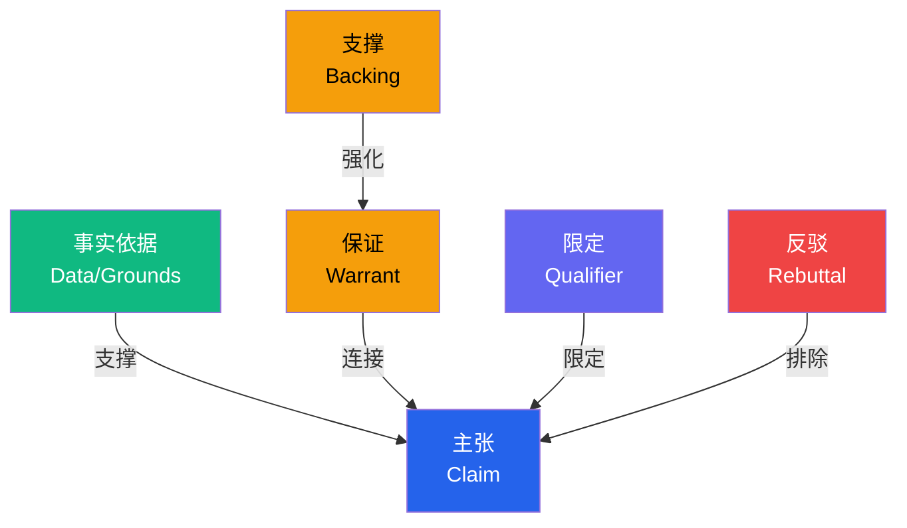
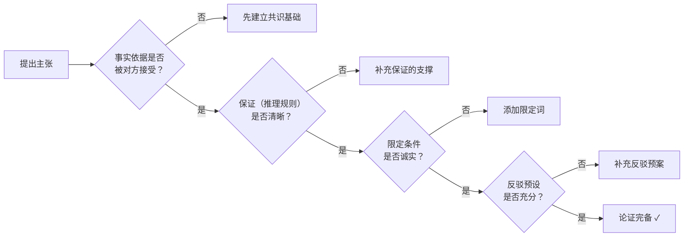
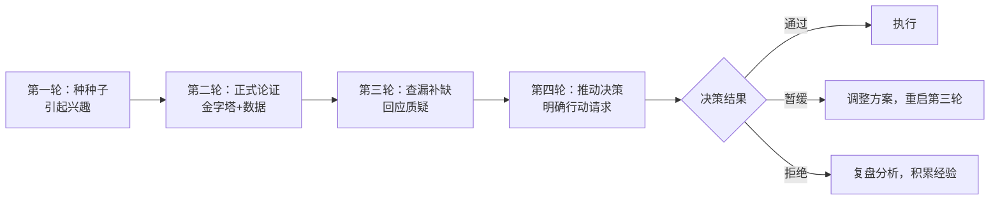

情感共鸣触动人心，但要让人心服口服，最终需要逻辑论证来完成临门一脚。逻辑论证是说服力的骨架——没有它，再动人的情感也只是空中楼阁；没有情感的润滑，再严密的逻辑也可能让人敬而远之。本章将系统讲解如何构建严密、有力、无懈可击的推理链，让你的每一个主张都有理有据、令人信服。

## 3.1 逻辑论证的心理学基础

### 3.1.1 为什么逻辑论证是说服的根基

亚里士多德在《修辞学》中将说服的三大支柱定义为：**Logos（逻辑）**、**Pathos（情感）**、**Ethos（人格）**。三者的关系不是并列的，而是有层次的——Ethos 让人愿意听你说话，Pathos 让人愿意考虑你的观点，Logos 让人最终接受你的结论。缺少任何一个，说服链条都会断裂。

现代认知科学对这一古老框架给出了精确的验证：

**双加工理论（Kahneman, 2011）**：人类思维分为系统1（快思考：直觉、情感、自动化）和系统2（慢思考：分析、逻辑、费力）。日常生活中系统1主导——我们凭直觉做决定、用情感评价事物。但面对重要决策时，系统2会被激活，开始审查论据的质量。这意味着：如果你的受众正在用系统2思考（比如审批预算、评估方案），逻辑论证的质量就是决定性因素。

**详尽可能性模型（Petty & Cacioppo, 1986）**：该模型将说服路径分为两条——中心路线和边缘路线。当受众的动机和能力都较高时（比如专业会议上讨论技术方案），他们走中心路线，仔细评估论据的逻辑强度；当动机或能力较低时（比如刷社交媒体看到广告），他们走边缘路线，依赖表面线索（名人代言、视觉冲击、情绪感染）。逻辑论证主要服务于中心路线说服。

**认知失调理论（Festinger, 1957）**：当人面对与自己既有信念矛盾的信息时，会产生心理不适。严密的逻辑推理能制造认知压力，让对方不得不重新审视自己的立场。但要注意——如果压力过大，对方可能选择拒绝你的信息而非改变信念。所以逻辑论证要"有力但不具攻击性"。

**情绪与逻辑的协同效应**：达马西奥（Damasio, 1994）的躯体标记假说揭示了一个关键事实——纯粹理性的人反而做不好决策。情感不是逻辑的敌人，而是决策的"加速器"。最好的说服是：用情感打开通道，用逻辑给出理由，再用情感推动行动。

> 换言之：情感让人愿意听，逻辑让人愿意信，两者的配合比例取决于场景——日常消费决策偏情感（7:3），商业提案和学术讨论偏逻辑（3:7），团队管理则需要均衡（5:5）。

### 3.1.2 逻辑论证的六大认知效应

理解以下认知效应，可以让你的论证更精准地击中受众的心理机制：

| 效应名称 | 心理机制 | 说服应用策略 | 注意事项 |
|---------|------|---------|------|
| 锚定效应 | 先接受的第一个信息成为后续判断的基准 | 先给出最强论据或最大数字，锚定对方的认知框架 | 锚定值要有合理性，过于离谱会适得其反 |
| 首因效应 | 最先接收的信息印象最深、权重最大 | 将核心主张和最有力证据放在开头，不要"先铺垫再揭晓" | 首因效应在受众注意力集中时更强 |
| 近因效应 | 最后接收的信息记忆最清晰 | 结尾用最强论据做收束，最后的话影响行动决策 | 近因效应在时间间隔短时更明显 |
| 确认偏误 | 人们倾向于接受与已有信念一致的信息，忽视矛盾信息 | 从对方已接受的事实出发推导结论，先建立共识再推进 | 不要试图一步推翻对方的根深蒂固信念 |
| 权威效应 | 专家和权威的意见更容易被接受，降低认知成本 | 引用权威来源支撑论据，但要确保权威领域对口 | 权威跨领域引用会适得其反 |
| 框架效应 | 同一信息的不同表述方式会导致不同的判断 | 用正面框架描述收益（"成功率80%"而非"失败率20%"） | 损失框架在推动紧急行动时更有效 |

## 3.2 论证的完整结构：从三要素到图尔敏模型

### 3.2.1 经典三段论与三要素

最基础的论证结构包含三个要素，缺一不可：

**主张（Claim）**：你要说服对方接受的核心观点。好的主张应该满足三个标准——清晰（不含歧义）、具体（可操作、可验证）、有立场（不是"既A也B"的骑墙表态）。"我们应该采用远程办公"是好主张，"远程办公不错"则是模糊表态，"我们应该在三个月内将60%的非生产线岗位转为远程办公"则是优秀主张。

**理由（Reason）**：支撑主张的逻辑推理路径。理由回答的是"为什么这个主张成立"。它是一个因果链条，将已知事实与你的主张连接起来。好的理由应该独立成立——即使删掉其他理由，它自身也能支撑主张。

**证据（Evidence）**：支撑理由的事实依据。证据是具体的、可查证的数据、案例或权威引用。没有证据的理由只是推测。证据的质量直接决定论证的可信度。

**完整示例**：

主张：公司应立即启动数字化转型

理由：因为数字化转型能同时解决增长、效率、竞争力三大问题
├── 证据1：行业数字化渗透率已达67%，我们已落后于行业均值（市场报告）
├── 证据2：客户需求调研显示82%希望线上服务，当前仅35%能获得（内部调研n=2000）
├── 证据3：竞争对手A已完成第一阶段转型，其客户满意度提升18%（公开信息）
├── 证据4：未转型企业市场份额年均下降15%，持续三年（行业数据）
├── 证据5：试点项目效率提升40%，错误率下降62%（内部试点，3个月数据）
└── 证据6：参与试点的员工满意度提升28%，离职意愿下降35%（内部调查n=200）

**三要素的检验标准**：

| 要素 | 检验问题 | 常见缺陷 |
|------|---------|---------|
| 主张 | 能否用一句话说清？是否有歧义？ | 模糊（"应该改进"）、骑墙（"A和B都有道理"）、过大（无法验证） |
| 理由 | 为什么这个主张成立？推理链是否有跳跃？ | 跳跃（A直接到C，缺B）、重叠（两个理由本质相同）、无关（理由不支撑主张） |
| 证据 | 数据从哪来？能查证吗？时效性如何？ | 模糊（"有研究表明"）、过时（三年前的数据）、不可查（"据说"） |

### 3.2.2 图尔敏论证模型：六要素严密论证

英国哲学家斯蒂芬·图尔敏（Stephen Toulmin）在1958年提出的论证模型，比经典三段论更贴近现实世界的复杂论证。三段论在形式逻辑中是完美的，但现实论证往往没有"绝对正确的大前提"。图尔敏模型的价值在于：它承认论证的或然性，并提供了一套系统化的方式来加固每一个推理环节。



**六个要素详解**：

1. **事实依据（Data/Grounds）**：论证的起点，已知的客观事实或数据。它是双方共同认可的基础——如果对方不接受你的事实依据，论证就无法开始。所以在正式论证前，先确认双方对基础事实的认知是否一致。

2. **主张（Claim）**：论证的终点，你希望对方接受的结论。主张应该明确、可验证，不要模糊。

3. **保证（Warrant）**：连接事实与主张的推理规则——"为什么从这些事实能推出这个结论"。这是最常被忽略也最容易出问题的环节。人们倾向于从"事实"直接跳到"结论"，而省略了中间的推理规则。但保证恰恰是论证最脆弱的地方——如果对方质疑你的保证，整个论证链就断了。

4. **支撑（Backing）**：为保证本身提供支撑——"为什么这个推理规则是可靠的"。当保证被质疑时，你需要支撑来加固它。支撑可以是已被广泛接受的原理、权威研究或逻辑推理。

5. **限定（Qualifier）**：对主张的适用范围进行限定——"在什么条件下这个结论成立"。好的论证不是宣称"绝对正确"，而是诚实地说明适用条件。限定词包括："在当前条件下"、"大概率"、"如果市场不出现重大变化"等。

6. **反驳（Rebuttal）**：预先声明主张不成立的条件——"什么情况下这个结论不成立"。这展示了你的思考全面性，反而增强了论证的可信度。

**实战示例**：

事实依据：我们的客户留存率从去年的65%下降到今年的48%，且下降趋势在加速
主张：我们应在下季度投入200万提升客户服务（限定：大概率有效）
保证：客户流失主要原因是服务响应慢——调查显示68%流失客户提及此原因
支撑：行业研究证实服务响应时间每缩短1小时，留存率提升3%（麦肯锡2024报告，
      覆盖全球1200家企业，跟踪期3年）
限定：在市场竞争格局不发生剧变的前提下，且假设现有客户结构不变
反驳：除非出现重大竞品价格战（降价30%以上）或行业性危机，否则该方案有效

图尔敏模型的核心价值在于：它迫使你思考每一个推理环节是否都有支撑，而不是想当然地从"事实"跳到"结论"。当你发现某个环节说不清楚时，那个环节就是论证的薄弱点——你需要加强它，或者承认局限。

**图尔敏模型的自查流程**：



### 3.2.3 三种推理方式及其组合策略

**演绎推理**：从一般原则推导出具体结论。结论在前提正确的条件下必然成立。演绎推理的力量在于确定性——如果大前提为真，结论就不可能为假。但它的弱点也很明显：大前提本身需要被证明。

大前提：所有响应时间超过24小时的客服系统，客户满意度都会低于60%
小前提：我们的客服平均响应时间是36小时
结论：我们的客户满意度必然低于60%
适用场景：有明确规则或定律时（数学证明、法规适用、技术规范）
风险提示：大前提可能是过度概括——"所有"需要严格验证

**归纳推理**：从多个具体案例中总结出一般规律。结论具有高概率性但不是绝对。归纳推理是商业决策中最常用的方式——你无法"演绎"出市场趋势，但可以通过多个信号"归纳"出大概率方向。

案例1：A公司数字化转型后营收增长30%
案例2：B公司数字化转型后效率提升45%
案例3：C公司数字化转型后客户满意度提升22%
结论：数字化转型大概率能显著提升企业关键指标
适用场景：数据充分、样本多样时（市场分析、趋势预测）
风险提示：样本量不足或样本偏差会导致"以偏概全"谬误
关键改进：注明样本量、来源、时间范围，避免过度泛化

**溯因推理（Abductive Reasoning）**：从结果推断最可能的原因。这是科学发现和问题诊断中最常用的推理方式，但在说服场景中常被忽略。

观察：客户留存率从65%降到48%
可能原因A：服务响应变慢（证据：响应时间从12h升至36h）
可能原因B：产品质量下降（证据：退货率仅微升2%）
可能原因C：竞品降价（证据：竞品价格未变）
推断：最可能的原因是A，因为其变化幅度最大且有直接因果机制
适用场景：问题诊断、根因分析、事故调查
风险提示：最可能的原因未必是真正原因，需要验证

**类比推理**：从两个事物的相似性推断它们在其他方面也可能相似。类比推理的力量在于降低认知门槛——用对方熟悉的事物解释陌生的概念。但类比是说服中最危险的推理方式，因为差异点可能大于相似点。

已知：亚马逊通过数据驱动决策成为电商巨头
类比：我们的电商公司同样拥有大量用户数据
推断：如果我们同样采用数据驱动决策，也有可能实现显著增长
适用场景：缺乏直接证据、需要建立直觉时
风险提示：亚马逊的成功有多个因素（资本、规模、技术），数据驱动只是其一
防御策略：主动说明类比的局限，增强可信度

**推理方式的组合策略**：在复杂论证中，单一推理方式往往不够。最有力的论证是三种方式的交叉验证：

第一步（归纳）：展示多个行业案例证明数字化转型的价值
第二步（演绎）：从经济学原理推导出"不转型必然被淘汰"的逻辑必然性
第三步（类比）：用已成功的标杆企业说明转型路径的可行性
第四步（溯因）：分析我们当前面临的问题，指出数字化是最可能的解法
效果：四个角度指向同一结论，说服力呈指数级提升

| 场景 | 推荐推理方式 | 原因 |
|------|------------|------|
| 有明确规则/定律 | 演绎推理 | 结论确定性最高 |
| 有大量数据/案例 | 归纳推理 | 从实际出发最有说服力 |
| 缺乏直接证据 | 类比推理 | 降低认知门槛 |
| 问题诊断 | 溯因推理 | 最符合诊断思维 |
| 复杂决策 | 多种结合 | 多角度交叉验证 |

## 3.3 金字塔原理：说服力的结构化引擎

### 3.3.1 金字塔原理的四个核心法则

麦肯锡的金字塔原理是组织论证最强有力的框架。它的核心思想可以一句话概括：任何复杂的想法都可以组织成一个从上到下、层层支撑的金字塔结构。以下是四个核心法则在说服场景中的应用：

**法则一：结论先行**

先亮出核心主张，再展开支撑论据。这不是武断，而是尊重受众的认知效率。

心理学依据：米勒定律（7±2法则）表明人的工作记忆容量有限。先给结论，让受众有了"认知锚点"，后续论据就有了"挂靠处"。反之，先铺垫再给结论，受众需要在脑海中同时存储多个不确定信息，认知负荷极大——当负荷超过工作记忆容量时，受众会选择放弃理解。

错误示范（归纳式）：
"我们调研了市场，发现数字化渗透率很高；我们的客户也反馈希望线上
服务；竞争对手已经开始了转型；我们的试点项目效果也不错……所以我们
应该数字化转型。"
→ 听者在前几句就已经分心了，因为他不知道你在往哪里走

正确示范（演绎式）：
"我建议公司立即启动数字化转型。原因有三：市场需求已成熟、竞争
压力在加大、内部条件已具备。下面逐一展开。"
→ 听者立刻知道方向，带着预期听论据，认知负荷最小

**法则二：以上统下**

每一层级的论点都是下一层级论据的总结。这意味着：看你的上层论点，就能预测下层要说什么；看你的下层论据，就能验证上层论点是否成立。检验方法——对于任何一层论点，问自己："我下面的证据是否足以证明这句话？如果不能，要么加强证据，要么修改论点。"

**法则三：归类分组**

同一层级的论点按同一维度归类，遵循MECE原则（Mutually Exclusive, Collectively Exhaustive——相互独立、完全穷尽）。常见的归类维度包括：

| 归类维度 | 适用场景 | 示例 |
|---------|---------|------|
| 时间维度 | 展示过程、规划、趋势 | 过去→现在→未来 |
| 空间维度 | 全局分析、区域对比 | 内部→外部，国内→国际 |
| 重要性维度 | 优先级排序、资源分配 | 最重要→次重要→辅助 |
| 因果维度 | 问题诊断、方案论证 | 原因→过程→结果 |
| 流程维度 | 操作说明、执行计划 | 步骤1→步骤2→步骤3 |
| 矩阵维度 | 多维分析 | 内部优势/劣势 × 外部机会/威胁 |

MECE的违反有两种常见情况：重叠（两个理由说的是同一件事）和遗漏（某个重要维度被忽略）。重叠让论证显得冗余，遗漏则让论证显得片面。

**法则四：逻辑递进**

论点之间有清晰的推进顺序，而不是罗列堆砌。三种常用的递进逻辑：

- **时间递进**："第一步……第二步……第三步……"——适用于执行方案、历史分析
- **结构递进**："从战略层面……从执行层面……从资源层面……"——适用于全面分析
- **重要性递进**："最关键的是……其次是……最后补充……"——适用于说服决策者

递进逻辑的选择取决于受众。决策者通常关注"最重要的是什么"（重要性递进），执行者关注"先做什么后做什么"（时间递进），分析师关注"各个层面的情况如何"（结构递进）。

### 3.3.2 说服性金字塔的完整构建流程

**第一步：明确核心主张**

用一句话概括你要说服对方接受什么。标准格式："我建议/认为/主张 + 具体行动或观点"。核心主张应该满足SMART原则——具体（Specific）、可衡量（Measurable）、可实现（Achievable）、相关（Relevant）、有时限（Time-bound）。

**第二步：确定2-4个支撑理由**

每个理由应该独立支撑核心主张，理由之间不重叠（MECE）。问自己："如果只有这三个理由中的任何一个，是否足以支撑我的主张？"理想状态是：每个理由都独立有力，合在一起形成压倒性论证。

**第三步：为每个理由配备2-3条证据**

证据必须是具体的、可查证的。优先级排序：内部数据（最高可信度）> 权威研究 > 行业报告 > 专家意见 > 合理推测。注意证据的时效性——超过两年的数据需要注明并说明为什么仍然适用。

**第四步：检查逻辑链的完整性**

从证据到理由，从理由到主张，每一步的推理是否都有保证？有没有跳跃的环节？用"所以呢？"测试——对每个证据问"所以呢？"，看能否自然地推出理由；对每个理由问"所以呢？"，看能否自然地推出主张。

**第五步：预设反驳**

站在对方立场，找出最可能的反对意见，准备回应。反驳预设不仅增强了论证的严密性，还向受众展示你的思考全面性。

**完整金字塔示例**：

核心主张：公司应将营销预算的40%从传统媒体转移到短视频平台

├── 理由一：目标用户注意力已转移
│   ├── 证据：我们的25-35岁目标用户日均刷短视频98分钟（QuestMobile 2025）
│   ├── 证据：同一群体看电视的时间降至日均22分钟（CSM数据）
│   └── 证据：67%的目标用户表示通过短视频发现新品牌（内部调研n=2000）
│
├── 理由二：短视频投放ROI显著高于传统媒体
│   ├── 证据：Q1短视频广告ROI为1:4.7，电视广告ROI为1:1.8（内部数据）
│   ├── 证据：短视频可精准定向，浪费率仅12%，传统媒体浪费率达65%（媒介报告）
│   └── 证据：竞品B转投短视频后获客成本下降38%（行业情报）
│
└── 理由三：传统媒体渠道效果持续下滑
    ├── 证据：电视广告触达率连续3年下降（-8%/年）（CSM数据）
    ├── 证据：报纸杂志发行量同比减少22%（行业报告）
    └── 证据：传统媒体CPM同比上涨31%（媒介采购数据）

### 3.3.3 金字塔构建的常见错误

| 错误类型 | 表现 | 修正方法 |
|---------|------|---------|
| 纵向关系断裂 | 上层论点无法被下层证据支撑 | 对每个"上下级"关系做"所以呢？"测试 |
| 横向关系混乱 | 同层论点不在同一个逻辑维度 | 选定归类维度，重新分组 |
| 层级过多 | 超过4层导致受众迷失 | 压缩到3层：主张→理由→证据 |
| 证据不足 | 只有1条证据支撑一个理由 | 每个理由至少2-3条独立证据 |
| 堆砌而非递进 | 论点之间没有逻辑顺序 | 选择递进维度（时间/重要性/结构） |

## 3.4 论证的六种强化技巧

### 3.4.1 数据可视化：让数字说话

抽象数字只有转化为直观形式才能产生冲击力。核心原则：**数字要有参照系**。孤立的数字几乎没有说服力——"480万"意味着什么？取决于你拿它和什么比较。

| 表达方式 | 示例 | 效果 | 适用场景 |
|---------|------|------|---------|
| 纯数字 | "年节省480万" | 模糊，难以感知 | 内部报告（读者有上下文） |
| 百分比 | "成本降低23%" | 有比例感但缺乏规模 | 同比/环比分析 |
| 对比锚定 | "相当于20个全职员工的年薪" | 立体可感知 | 面向非专业受众 |
| 时间延伸 | "10年累计节省4800万，可建一座新工厂" | 放大长期价值 | 战略决策 |
| 可视化 | 柱状图/趋势图/饼图 | 一目了然 | 所有场景 |
| 类比转换 | "相当于每分钟烧掉100元" | 制造紧迫感 | 推动即时行动 |

**数据可视化的实操要点**：

- 趋势用折线图，比较用柱状图，占比用饼图（不超过5类），分布用散点图，关系用气泡图
- 颜色不超过5种，关键数据用高亮色，对比数据用对比色
- 图表标题直接写结论，而非描述性标题：
  - 不好："2024年各季度销售数据"
  - 好："Q3销售额逆势增长27%，验证新渠道策略有效性"
- 坐标轴起点要合理——从0开始还是从某基准值开始，会影响视觉感受
- 注明数据来源和时间范围，增强可信度

### 3.4.2 对比论证：在比较中凸显价值

人脑天生擅长比较，不擅长绝对判断。你告诉别人"响应时间4小时"，他不知道好坏；但你说"行业平均12小时，我们4小时"，他立刻知道你的优势。善用对比可以极大增强说服力。

**五种核心对比方式**：

**前后对比**：展示变化幅度
"采用新客服系统前：平均响应时间36小时，客户满意度62%
 采用新客服系统后：平均响应时间4小时，客户满意度91%"
→ 变化幅度越大，说服力越强

**有无对比**：展示方案的价值
"有CRM系统支持的销售团队：成交率28%，客单价1.2万
 无CRM系统的销售团队：成交率12%，客单价8千"
→ 差距 = 方案的价值

**竞品对比**：展示相对优势（注意不要恶意贬低）
"我们的方案：实施周期3个月，首年ROI 180%
 行业平均水平：实施周期8个月，首年ROI 90%"
→ 用行业数据而非具体竞品名，更安全

**成本对比**：将投入转化为日常可感知的单位
"这个系统年费36万，听起来不少。但除以365天，每天不到1000元。
 而它每天能帮我们挽回至少3个客户，每个客户年均消费2万。
 每天投入1000元，产出6万元——你愿意做这笔交易吗？"
→ 将大数字拆解为小单位，降低心理门槛

**机会成本对比**：展示"不做"的代价
"选择A：投入200万，预计回报800万
 选择B：不投入，但客户流失率继续以每年15%的速度增长
 到明年，光流失客户的营收损失就超过500万"
→ "不做"往往比"做"更贵

### 3.4.3 反驳预设：堵住反对的通道

主动提出对方可能的反对意见并给出回应，是高级说服技巧。它有三重效果：

1. **展示全面性**：说明你已经考虑过各种情况，不是一厢情愿
2. **抢占先机**：不让对方有机会用这些反对意见打断你的论证节奏
3. **建立信任**：坦诚面对风险比掩盖风险更可信——有研究表明，主动提出并回应反对意见的论证，说服效果比只呈现正面论据高出37%（Crowley & Hoyer, 1994）

**反驳预设的结构模板**：

"您可能会担心[具体反对意见]。这确实是一个合理的问题/顾虑。
 但根据[证据来源]，[具体数据或事实]。
 而且，[进一步的补充证据]。
 所以，虽然这个风险存在，但我们已经[具体应对措施]，
 可以将风险控制在[具体范围]内。"

**反驳预设的三个层次**：

| 层次 | 目标 | 示例 |
|------|------|------|
| 承认 | 表明你听到了反对意见 | "您说得对，200万确实不是小数目" |
| 回应 | 用证据化解反对 | "但试点数据显示回收期仅8个月" |
| 转化 | 将反对变成支持的理由 | "正因为投入不小，我们才更需要用数据验证过的方案，而不是拍脑袋" |

**实战示例**：

"您可能会担心200万的数字化投入风险太大。这确实是一个合理的顾虑。
但根据我们已完成的试点数据，投资回收期仅为8个月，远低于行业平均的18个月。
而且我们计划分三阶段投入，每个阶段都设置了明确的验收指标和止损点——
第一阶段投入50万验证可行性，不达标即止损。
所以虽然投入不小，但风险是可控的，回报是确定的。"

### 3.4.4 递进式呈现：步步为营的说服节奏

不要一次性抛出所有论据，而是按照逻辑强度递进呈现。这背后的原理是"登门槛效应"——先让对方同意一个小的、容易接受的观点，再逐步推进到更大的主张。

**渐强式**：从容易接受的论据开始，逐步加强
第一步（常识）：数字化是大势所趋，这点大家都认可
第二步（数据）：具体数据显示，行业渗透率已达67%
第三步（紧迫）：我们的竞争对手已经开始行动，差距在扩大
第四步（行动）：所以现在启动是最优时间窗口，晚半年成本增加40%

**三段式**：问题→原因→方案——最经典的说服结构
第一步（痛点）：我们的客户流失率已从8%升至15%，年损失超过2000万
第二步（诊断）：核心原因是服务响应慢（36小时）和体验不一致（标准差42%）
第三步（处方）：建议部署智能客服系统，目标将响应时间降至4小时以内

**对比递进**：先说常规方案，再说更优方案
第一步（常规）：我们可以招5个客服，解决响应问题，年成本150万
第二步（优化）：或者部署智能客服+2个客服，同样解决问题，年成本60万
第三步（最优）：进一步，智能客服还能收集客户数据，反哺产品优化，一举两得
→ 通过递进展示，让对方自己得出"最优方案"的结论

### 3.4.5 权威借力：站在巨人肩上

引用权威来源可以大幅提升论据可信度。权威效应的本质是认知捷径——当人们没有时间或能力独立验证论据时，权威来源提供了一种"信任代理"。但权威引用是一把双刃剑，用得好加分，用得不好减分。

**高效引用方式**：
- 明确来源全称："根据麦肯锡2025年发布的《数字转型报告》……"
- 指明研究背景："该研究覆盖了全球3000家企业，历时3年跟踪……"
- 原话引用关键论点：在核心主张上使用权威的原话
- 数据精确定位："报告显示第47页的表3.2中……"
- 说明与你的场景的相关性："该研究覆盖的企业中，有35%与我们的规模和行业相似"

**低效引用方式**（应当避免）：
- "有研究表明……"（哪个研究？何时发表？样本量多少？）
- "专家认为……"（哪个专家？哪个领域的专家？）
- "据说……"（根据什么？谁说的？）
- "大家都知道……"（这不是引用，这是诉诸大众）

**权威来源的可信度排序**：

可信度从高到低：
1. 自己的一手数据（最高可信度——直接经验）
2. 同行评审的学术论文（经过严格审查）
3. 权威咨询机构报告（麦肯锡、BCG、Gartner等）
4. 政府/行业组织统计数据（有调查方法论）
5. 知名企业公开案例（可查证）
6. 行业专家意见（有专业背景但可能有偏见）
7. 媒体报道（最低可信度，需交叉验证）

### 3.4.6 故事化论证：用叙事承载逻辑

纯粹的逻辑推理可能枯燥，用故事包装可以大幅提升说服力。但这不是用故事替代逻辑，而是用故事为逻辑"穿上衣服"。研究表明，信息+故事的组合比纯信息的记忆保持率高出22倍（Stanford, Chip Heath）。

**PREP故事框架**：
- **P（Point）**：先说结论
- **R（Reason）**：给出理由
- **E（Example）**：用故事/案例说明
- **P（Point）**：重申结论

"我建议我们投入资源做客户成功体系（结论）。
因为获取新客户的成本是维系老客户的5倍（理由）。
去年我们流失了一个年消费80万的大客户，原因仅仅是我们3个月没有主动联系。
如果我们有客户成功体系，每月定期回访、季度复盘，这个客户根本不会走。
那位客户后来去了竞品，竞品专门配了客户成功经理，现在那位客户的年消费
已经涨到了120万（故事+数据）。
一个客户成功经理的年薪是30万，但一个这样的客户就值120万（重申结论）。"

**故事化论证的注意事项**：
- 故事必须服务于论点，不能喧宾夺主
- 选择与受众场景相似的故事——技术团队不要用营销案例
- 故事要有具体细节（时间、地点、人物、数字），越具体越可信
- 不要编造故事——虚假故事一旦被拆穿，信任归零

## 3.5 常见逻辑谬误：识别与规避

逻辑谬误是论证的大敌。识别谬误既能帮你避免自己犯错，也能在对方使用谬误时精准反击。以下是最常见的十种谬误，每种都配有识别方法和反驳话术。

### 3.5.1 十大高频逻辑谬误

| 谬误名称 | 定义 | 示例 | 识别信号 | 反驳方式 |
|---------|------|------|---------|---------|
| 稻草人谬误 | 歪曲对方观点后攻击 | "你说要控制成本？所以你想裁员？" | 对方复述你的观点时变了味 | "我的原话是优化流程，不是裁员。请针对我的实际观点讨论" |
| 滑坡谬误 | 夸大因果链的连锁反应 | "允许远程办公→员工偷懒→公司倒闭" | 因果链超过2步，且每步缺乏证据 | "请提供从A直接到C的证据，中间每个环节都需要论证" |
| 诉诸权威 | 用不相关领域的权威背书 | "马云说过X，所以一定对" | 权威的领域与话题不匹配 | "马云擅长电商，这个话题需要HR专家的意见" |
| 虚假二分法 | 只给两个选项，忽略其他可能 | "要么全盘数字化，要么等着被淘汰" | 只有"要么A要么B"，没有其他选项 | "还有渐进式转型、局部试点等其他选择" |
| 以偏概全 | 用个别案例代表整体 | "我认识的程序员都不善社交" | 样本量小、来源单一、无统计支撑 | "你的样本不具有统计代表性，我们需要更大范围的数据" |
| 循环论证 | 用结论证明前提 | "这个方案好因为它最优秀" | 前提和结论说的是同一件事 | "请给出'优秀'的具体标准和证据" |
| 诉诸情感 | 用情感代替论据 | "如果你不支持这个方案，就是否定团队的努力" | 情感绑架替代了逻辑推理 | "我们讨论的是方案效果，不是团队态度。让我们回到数据" |
| 人身攻击 | 攻击提出者而非观点 | "你又不是这个专业的，你懂什么" | 针对人而非针对论据 | "请针对论据本身讨论，我的专业背景不影响数据的真实性" |
| 错误因果 | 把相关性当因果性 | "冰淇淋销量增加时溺水也增加，所以冰淇淋导致溺水" | A和B同时发生，但没有因果机制 | "两者可能都是第三个因素（夏天）的结果" |
| 诉诸大众 | "大家都这么认为" | "80%的同行都在用这个方案" | 用人数代替证据 | "多数人做不代表正确，关键要看数据和效果" |

### 3.5.2 高阶谬误识别

除了上述十种基础谬误，还有几种在商业场景中常见但不易察觉的谬误：

**幸存者偏差**：只看到成功案例，忽略失败案例。"看看那些成功的创业公司，都是大胆冒险的！"——但你没看到的是：有100家同样冒险的公司已经倒闭了。反驳："那些失败的冒险者呢？成功者可能是幸存者偏差。"

**沉没成本谬误**：因为已经投入了很多，所以继续投入。"我们已经在这个项目上花了500万，不能现在放弃。"反驳："过去的投入不应该影响未来的决策。关键问题是：从现在起继续投入的回报率如何？"

**合成谬误**：部分正确推导出整体正确。"每个部门的成本控制方案都很好，所以公司整体成本一定能降下来。"反驳："局部最优不等于全局最优，需要看部门之间的协调效应。"

**虚假精度**：用过于精确的数字制造专业假象。"这个方案的ROI是237.6%。"——当你的模型输入有30%的误差时，输出精确到小数点后一位是自欺欺人。反驳："考虑到输入数据的不确定性范围，这个数字的合理表达应该是200-280%。"

### 3.5.3 自查清单：你的论证有漏洞吗？

在提交论证之前，用以下清单逐项自查：

□ 主张是否清晰具体，不含歧义？
□ 理由是否直接支撑主张，没有逻辑跳跃？
□ 每个理由都有至少2条事实证据支撑吗？
□ 证据来源是否可靠、可查证、时效性足够？
□ 推理过程是否存在上述十四种谬误之一？
□ 是否考虑了反面观点并做了有力回应？
□ 类比是否恰当？差异点是否已经说明？
□ 数据是否最新？样本是否足够？是否有幸存者偏差？
□ 是否存在选择性引用（只挑有利数据）？
□ 逻辑链的每一步是否有"保证"支撑？
□ 限定条件是否诚实？是否过度承诺？
□ 一个理性人看完这个论证，会信服吗？

## 3.6 场景化论证适配

不同场景对论证的要求截然相同。在错误的场景使用错误的论证方式，即使内容正确也会失败。

### 3.6.1 书面论证 vs 口头论证

| 维度 | 书面论证（报告/邮件/方案） | 口头论证（会议/演讲/对话） |
|------|------------------------|------------------------|
| 结构 | 完整金字塔，层次分明 | STAR框架，30秒内完成核心论证 |
| 证据 | 详细数据+附录+来源链接 | 关键数字+一句话来源 |
| 逻辑链 | 可以长，读者可以反复看 | 必须短，听者无法回翻 |
| 反驳预设 | 完整的反驳+回应，放在附录或专门章节 | 只预设最重要的1-2个反对意见 |
| 修辞 | 精确、正式、无歧义 | 口语化、有节奏感、适当重复 |
| 认知负荷 | 读者自己控制节奏 | 你控制节奏，必须减轻听者负担 |

### 3.6.2 不同受众的论证策略

**高层决策者（CEO/VP）**：他们的时间极度稀缺，注意力窗口只有3-5分钟。论证策略——结论先行，只讲最关键的2-3个论据，数据用大数字、大趋势，避免细节纠缠。他们关注两个核心问题："值不值得做？"和"风险有多大？"。格式：一页纸摘要+详细附件。

**中层管理者（总监/经理）**：他们需要足够的信息来向上汇报和向下执行。论证策略——方案+数据并重，提供完整的因果链和对比数据，说明资源需求和时间节点。他们关注："怎么做？"和"需要什么资源？"。

**执行层（团队/同事）**：聚焦具体操作和细节。论证要转化为可执行的步骤，说明"做了对我有什么好处"。他们关注："具体做什么？"和"为什么是我？"。

**跨部门协作方**：他们不关心你的专业细节，只关心对自己的影响。论证策略——从对方的利益出发，说明"这件事对你有什么好处"或"不做对你有什么坏处"。

### 3.6.3 认知负荷管理

论证失败的一个常见原因不是内容不好，而是信息过载。受众的认知负荷一旦超过阈值，就会放弃理解。以下是管理认知负荷的关键策略：

**信息分块**：将复杂论证拆分为3-5个独立的"信息块"，每个块自成一体。块之间用过渡句连接。

**进度标记**：在论证过程中不断告诉受众你在哪里。"我们刚才讨论了市场需求，接下来看竞争态势。"——这帮助受众建立心理地图。

**冗余消除**：删除所有不直接支撑主张的内容。"但书"（"不过"、"但是"后面跟的补充说明）如果不在主线论证上，移到附录。

**重复关键信息**：核心主张在开头说一次，中间呼应一次，结尾重申一次。重复不是啰嗦，是降低认知负荷。

## 3.7 论证的伦理边界

### 3.7.1 说服与操纵的分界线

逻辑论证是强大的工具，但强大的工具需要伦理约束。说服与操纵的分界线在于：

| 维度 | 正当说服 | 操纵 |
|------|---------|------|
| 信息完整性 | 呈现所有相关信息，包括不利信息 | 选择性呈现，隐藏不利信息 |
| 目的 | 帮助对方做出更好的决策 | 只追求自己想要的结果 |
| 手段 | 逻辑+证据+坦诚 | 情感操纵+信息控制+压力 |
| 后果 | 对方事后感谢你的建议 | 对方事后后悔被误导 |
| 可逆性 | 对方可以自由选择接受或拒绝 | 通过信息不对称限制对方选择 |

**底线原则**：如果你的论证需要依赖对方的信息劣势才能成立，那就是操纵而非说服。

### 3.7.2 常见的"灰色地带"

有些论证技巧处于灰色地带——它们不完全是操纵，但也不完全正当：

**过度框架效应**：用"成功率80%"替代"失败率20%"是正当的修辞技巧；但如果故意隐瞒"失败率20%"这一信息，就进入了灰色地带。

**紧迫感制造**：合理的紧迫感（"窗口期只有3个月"有数据支撑）是正当的；虚假的紧迫感（"今天不签就没了"）是操纵。

**社会证明**：引用真实的行业趋势是正当的；编造"90%的企业都在做"是操纵。

## 3.8 实操模板与工具

### 3.8.1 商业提案论证模板

```markdown
## 核心主张
[一句话说明你要什么——满足SMART原则]

## 背景与现状
- 当前问题：[用数据描述痛点，注明数据来源]
- 影响范围：[量化问题的代价——年损失金额/客户数/市场份额]
- 趋势判断：[问题在恶化还是改善？数据支撑]

## 解决方案
### 方案概述
[2-3句话概括方案的核心逻辑]

### 核心理由
#### 理由一：[标题]
- 数据/证据：[具体数字和来源]
- 逻辑链：[为什么这个数据支持你的方案——补上"保证"]

#### 理由二：[标题]
- 数据/证据：[具体数字和来源]
- 逻辑链：[为什么这个数据支持你的方案]

#### 理由三：[标题]
- 数据/证据：[具体数字和来源]
- 逻辑链：[为什么这个数据支持你的方案]

## 风险与应对
| 风险 | 概率 | 影响 | 应对措施 |
|------|------|------|---------|
| ... | 高/中/低 | 大/中/小 | 具体措施+止损点 |

## 投入产出
- 投入：[金额+时间+人力]
- 预期回报：[量化，注明计算方法]
- 回收周期：[时间，注明假设条件]
- 机会成本：[不做的代价]

## 结论
重申核心主张 + 最关键的一个论据 + 明确的下一步行动请求
```

### 3.8.2 快速说服的STAR论证框架

在时间紧迫的场景（电梯演讲、会议发言、走廊对话）中，用STAR框架在30秒内完成一次完整论证：

- **S（Situation）**：一句话描述现状/问题
- **T（Target）**：一句话说明目标/主张
- **A（Action）**：一句话说明关键行动
- **R（Result）**：一句话说明预期结果

S："我们的客户留存率已经从65%降到48%了"
T："我建议下季度投入200万建客户成功体系"
A："招3个客户成功经理，配智能提醒系统"
R："预计6个月内留存率回升到70%，年增收800万"

### 3.8.3 论证力量自评量表

对自己的论证进行评分（每项1-5分），总分30分以上为强论证：

| 评估维度 | 评分标准 | 得分 |
|---------|---------|------|
| 主张清晰度 | 一句话能说清？不含歧义？可验证？满足SMART？ | /5 |
| 理由充分性 | 2-4个独立理由？覆盖全面？MECE？ | /5 |
| 证据质量 | 数据可靠？来源权威？时效性？样本量？ | /5 |
| 逻辑严密性 | 无跳跃？无循环？无谬误？有保证？ | /5 |
| 反驳预设 | 考虑了主要反对意见？回应有数据支撑？ | /5 |
| 表达效果 | 结构清晰？可视化好？节奏感强？认知负荷合理？ | /5 |

## 3.9 高阶技巧：论证的攻防艺术

### 3.9.1 面对质疑时的论证应变

当你的论证被挑战时，不要慌张，按以下步骤应对：

**第一步：倾听完整**——让对方说完所有质疑，不打断。打断会激化对立情绪，而且你可能误解对方的核心反对点。

**第二步：确认理解**——"您的意思是不是说……"确保你理解了对方的核心反对点。这一步有两个好处：一是避免误解，二是给对方"被尊重"的感觉。

**第三步：分类应对**——

| 质疑类型 | 应对策略 | 示例话术 |
|---------|---------|---------|
| 质疑数据 | 补充数据来源，提供更多佐证 | "这个数据来自XX报告，我还可以提供另外两个独立来源" |
| 质疑逻辑 | 拆解推理步骤，逐点回应 | "让我把推理链展开，您看看哪一步有疑问" |
| 质疑方案 | 承认局限，强调优势 | "这个方案确实不能解决XX，但它能解决最关键的YY" |
| 提出替代方案 | 客观比较，用数据说话 | "我们来对比两个方案在成本、效果、风险三个维度的表现" |
| 情绪化反对 | 共情+拉回理性 | "我理解您的担忧，我们来看具体数据怎么说" |
| 质疑你的资格 | 回避身份之争，聚焦论据 | "我们回到论据本身——这个数据是否准确？这个推理是否有误？" |

**第四步：不懂就说不懂**——对于确实不了解的问题，诚实承认并承诺跟进。"这个问题我目前没有确切数据，我会在明天下午之前调研清楚回复您。"——这比硬撑然后出错要好一万倍。

### 3.9.2 论证的"降维打击"：改变讨论框架

最高级的论证技巧不是在对方的框架内说服他们，而是换一个更有利的框架。框架决定了哪些因素被纳入考虑，哪些被排除——改变框架就是改变游戏规则。

对方框架："这个方案太贵了"（在成本框架内你很难赢）
你的框架："这不是成本，这是投资。让我算一下投入产出比……"
→ 切换到投资回报框架，成本高反而成了"投入大=回报大"

对方框架："我们以前没这么做过"（在惯例框架内你很难赢）
你的框架："市场环境变了，以前有效的方法未必继续有效。让我们看看数据……"
→ 切换到变化适应框架，经验反而成了"路径依赖的风险"

对方框架："风险太大了"（在风险框架内你很难输）
你的框架："真正的风险是不行动。让我们看看不做的代价……"
→ 切换到机会成本框架，风险从"做了可能亏"变成"不做一定亏"

### 3.9.3 多轮论证的策略规划

真正的说服很少一次完成。面对重要决策者，你需要规划多轮论证：

**第一轮：种下种子**——不期望当场说服，只期望引起兴趣。"我有一个想法，可能能把获客成本降30%。我做个详细方案下周给您看？"

**第二轮：正式论证**——完整的金字塔论证+反驳预设。给对方消化的时间，不要追着问"您同意吗"。

**第三轮：查漏补缺**——根据对方的反馈，补充数据、调整方案、回应质疑。这轮的目标是消除所有疑虑。

**第四轮：推动决策**——时机成熟时，给出明确的行动请求和时间表。"如果方案没有问题，我希望在下周一之前获得审批，以便Q3按时启动。"



## 3.10 综合实战：从零构建一个完整论证

**场景**：你是某SaaS公司的产品经理，需要说服CEO投入资源开发AI功能。

**第一步：明确主张**

"我建议在Q3投入3名工程师、1名设计师，开发AI智能分析功能，预计6个月上线。"

**第二步：构建金字塔**

核心主张：Q3投入资源开发AI智能分析功能

├── 理由一：市场需求已成熟
│   ├── 证据：NPS调研中，AI功能需求排名#1（n=1500，占比34%）
│   ├── 证据：竞品A、B均已上线AI功能，市场反馈积极（App Store评分提升0.3）
│   └── 证据：Gartner预测2026年80%的SaaS产品将内置AI能力
│
├── 理由二：技术可行性已验证
│   ├── 证据：技术预研完成，核心API调用延迟<200ms（目标<500ms）
│   ├── 证据：开源模型效果评测达标（准确率92%，目标90%）
│   └── 证据：基础设施成本可控（预估月均$3,000，占总云成本5%）
│
└── 理由三：商业回报明确
    ├── 证据：AI功能可将客单价提升15-20%（基于竞品定价策略分析）
    ├── 证据：预计新增ARR 240万，ROI 400%（假设转化率保守估计）
    └── 证据：可形成竞争壁垒，提高切换成本（数据飞轮效应）

**第三步：预设反驳**

| 可能的反对 | 回应 |
|----------|------|
| "3个人投入6个月太重了" | 可以从2人+外包启动，但会延长到9个月，总成本相当。建议完整方案 |
| "AI准确率不够怎么办" | 设定85%准确率为MVP门槛，不达标不上线。已预留2周缓冲期 |
| "竞品已经做了，我们跟得上吗" | 竞品的AI功能集中在基础分析，我们的差异化在行业垂直场景——这反而是后发优势 |
| "资源从哪来" | 建议从"自动化运维"项目借调1人，该项目Q2已达标收尾。另外2人从新HC中出 |

**第四步：STAR快速版本**

当在电梯间遇到CEO只有30秒时：

"用户调研中AI分析需求排名第一，竞品已经行动。技术预研已完成，投入3人6个月能上线，预计新增ARR 240万。详细方案我已经发到您邮箱了。"

## 3.11 本章小结

逻辑论证的核心公式：

强论证 = 清晰主张 + 充分理由 + 可靠证据 + 严密推理 + 预设反驳 + 场景适配

**快速检查口诀**——"主理证反效场"：

1. **主**张：一句话能说清吗？满足SMART吗？
2. **理**由：2-4个独立理由够不够？MECE了吗？
3. **证**据：每个理由都有数据支撑吗？来源可靠吗？
4. **反**驳：最可能的反对意见回应了吗？回应有力吗？
5. **效**果：用金字塔/对比/可视化增强了吗？认知负荷合理吗？
6. **场**景：论证方式匹配受众和场景吗？

记住：逻辑论证不是要你变成冷冰冰的数据机器，而是让你的每一个判断都有根基，让对方在接受你的情感感召后，也有充足的理由说服自己。逻辑和情感的完美结合，才是说服力的终极形态。

> **与前后章节的关系**：本章聚焦说服的"骨架"——逻辑论证。前一章"故事化表达"解决了"怎么讲得动人"的问题，下一章"谈判与博弈"将解决"对方也在说服你"时的攻防策略。三者结合，构成完整的说服力体系。
