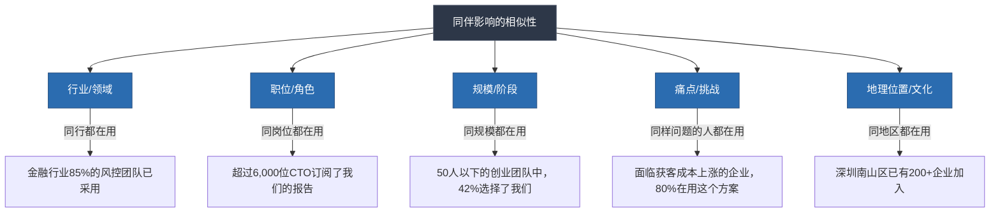
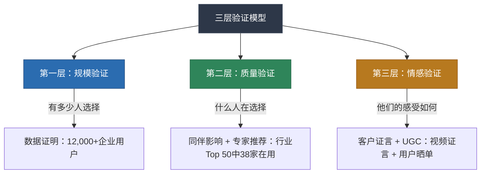
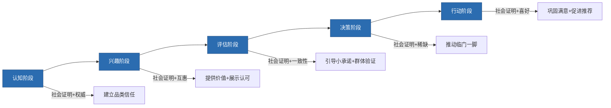
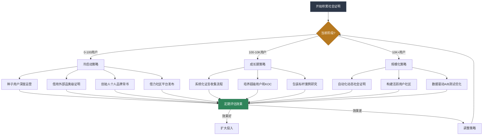
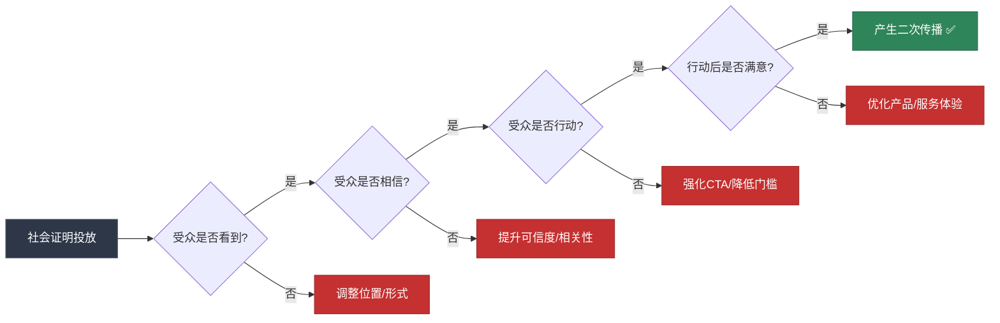

# 四、社会证明：让群体力量为你所用

> "当一个人不确定该怎么做时，他会观察别人在做什么来指导自己的行为。" —— Robert Cialdini，《影响力》

想象一个场景：你走进一条陌生的美食街，面前有两家紧挨着的面馆。A店门口排着20人的长队，B店门可罗雀。即使你对两家店一无所知，你的大脑也会在毫秒之间做出判断——"排队那家应该更好吃"。你甚至不会意识到自己在做决策，因为这个过程完全发生在自动化的直觉层面。

这就是**社会证明（Social Proof）**的威力。它不需要逻辑推理，不需要情感共鸣，甚至不需要对方"认真听你说话"——它直接绕过了理性分析，作用于人类决策的底层操作系统。

社会证明是Cialdini影响力六大原则之一，也是日常生活中被运用最频繁、最容易上手、同时又最容易被误用的说服工具。本节将从心理学根源出发，系统拆解社会证明的类型、机制、运用方法、常见误区和高级策略，帮助你在任何场景中将"群体的力量"转化为说服力。

---

## 4.1 社会证明的心理学根源

### 4.1.1 进化视角：为什么"跟随多数"是生存优势

人类的祖先生活在充满危险的环境中——猛兽、毒草、敌对部落。在信息极度匮乏的条件下，观察同伴的行为并跟随多数人的选择，是最低成本、最高成功率的生存策略。"别人都在吃这个果子，那它大概率没毒"——这种思维模式被自然选择深深烙印在人类的神经系统中。

进化心理学家认为，社会证明不是一种"弱点"，而是一种**认知节能机制（Cognitive Heuristic）**。在信息爆炸的现代社会，我们每天面临数以万计的决策。如果每一个决策都需要从头分析，大脑的认知资源很快就会耗尽。社会证明提供了一条捷径：既然这么多人已经做出了选择，我直接参考他们的选择，既省力又安全。

这一机制的深层逻辑在于**信息不对称下的贝叶斯推理**：当你对某个选项缺乏直接信息时，"其他人的选择"就是一条有效的间接证据。选择该选项的人越多，贝叶斯更新后的后验概率越高——换句话说，群体行为为你提供了免费的信息增量。这解释了为什么即使在信息充足的场景中，人们仍然会被社会证明影响：大脑的默认设定就是"群体行为是有信息含量的"，而且这套默认设定在大多数时候是正确的。

### 4.1.2 经典实验：社会证明的科学验证

社会证明并非只是理论推测，它有大量严密的实验支撑：

**谢里夫的自动运动效应实验（Sherif, 1936）**

心理学家穆扎费尔·谢里夫将被试带入一个完全黑暗的房间，观察一个静止的光点。由于黑暗中缺乏参照物，光点看起来会"移动"（自动运动效应）。当被试单独观察时，每个人给出了不同的估计。但当几个人同时在场并大声说出自己的估计时，每个人的判断开始趋向群体的平均值——即使这个平均值是完全错误的。

**意义**：在不确定的情境中，人们会将他人的判断当作信息来源，即使这个信息是错误的。这也解释了为什么在新兴市场或技术领域，早期的群体判断（即使粗糙）会对后来者产生巨大影响。

**阿希的从众实验（Asch, 1951）**

所罗门·阿希设计了一个看似简单的实验：让被试判断三条线段中哪一条与参照线段等长。答案明显且唯一，但当房间里的其他"被试"（实际是实验助手）一致给出错误答案时，**约75%的被试至少从众了一次，平均从众率为37%**。

**意义**：即使在答案显而易见的情况下，群体的一致意见仍然能影响个体判断。社会证明的力量不仅限于不确定情境。更值得注意的是，阿希的后续研究发现，只要群体中出现一个"异议者"（哪怕给出的也是错误答案），从众率就会大幅下降——这说明社会证明的威力部分来自于群体的"一致性"，而非单纯的数量。

**电梯实验（Milgram, 1961）**

米尔格拉姆的电梯从众实验更加直观：当电梯里的所有人都面向墙壁站立时，新进入电梯的人也会不由自主地转向墙壁——即使没有任何人说话或施压。

**意义**：行为层面的社会证明比语言层面更强大——人们不仅会被别人"说的"影响，更会被别人"做的"影响。这也解释了为什么"用脚投票"比"用嘴推荐"更有说服力——行动是最诚实的信号。

**紧急情境实验（Latané & Darley, 1968）**

拉塔内和达利设计了一系列实验来研究紧急情境中的旁观者行为。当被试独自一人听到隔壁房间有人摔倒并呼救时，85%的人会去帮忙。但当被试相信还有其他人在场时，只有31%的人采取行动——因为"既然别人没动，可能情况不严重"。

**意义**：社会证明不仅影响消费决策，还影响道德判断和紧急行动。当群体行为是"不行动"时，社会证明会产生反效果——这也是4.5节"负面社会证明"的心理学基础。

### 4.1.3 神经科学基础：大脑中的"从众回路"

现代脑成像研究揭示了社会证明的神经机制：

- **前扣带皮层（ACC）**：当个体的判断与群体不一致时，ACC区域会激活，产生"冲突信号"——一种类似犯错的不适感。为了消除这种不适，人们会调整自己的判断以符合群体。Klucharev等人（2009）的研究发现，这种冲突信号的强度与从众行为的程度直接相关。
- **纹状体（Striatum）**：当个体与群体意见一致时，纹状体的奖赏回路会被激活——"和大家一样"本身就能带来愉悦感。Campbell-Meiklejohn等人（2010）发现，当被试得知自己的审美偏好与大多数人一致时，纹状体的激活程度与获得金钱奖励相当。
- **腹内侧前额叶皮层（vmPFC）**：负责整合社会信息和价值判断。研究表明，当被告知"大多数人喜欢这个产品"时，vmPFC对产品的价值评估会显著提高。这意味着社会证明不仅影响"你认为别人怎么想"，还直接影响"你自己觉得值不值"。

克利斯蒂基斯和福勒在《Connected》一书中总结：人类大脑中存在专门处理社会信息的"社会脑"网络，从众不是"软弱"，而是这个网络正常运行的结果。**社会证明利用的不是人性的弱点，而是人性的设计特性。**

### 4.1.4 社会证明与ELM模型

回到前面介绍的精细加工可能性模型（ELM），社会证明在两条路径上发挥不同但同样重要的作用：

| 路径 | 触发条件 | 社会证明的角色 | 示例 |
|------|---------|-------------|------|
| 外围路径 | 受众投入度低、不愿深入思考 | **直接作为决策线索** | "已有10万人购买" → 直接接受 |
| 中心路径 | 受众投入度高、认真思考 | **作为论据的补充验证** | 专家推荐 + 数据证明 → 辅助验证论点 |

**实践含义**：面对"随便看看"的受众，社会证明本身就是说服力；面对"认真比较"的受众，社会证明是逻辑论证的补充。两种情况都需要社会证明，但用法不同。

进一步说，**社会证明的类型应该与受众的加工路径匹配**。外围路径受众更适合数据证明（"10万人购买"）和动态展示（实时购买通知），因为这些信息不需要深度加工就能产生影响。中心路径受众更适合专家推荐和深度案例研究，因为这些信息提供了可供分析的具体内容。

---

## 4.2 社会证明的七种类型

社会证明不是单一形态，而是一个包含多种类型的工具箱。不同类型在不同场景下的效力差异巨大。理解每种类型的机制、优势和局限，是有效运用社会证明的前提。

### 4.2.1 客户证言（Testimonials）

**定义**：真实客户的使用体验和评价。

**为什么有效**：客户证言是最原始、最直接的社会证明形式。一个真实用户讲述自己的故事，比企业自己说一百遍"我们很好"更有说服力。心理学上，这是因为**可识别受害者效应（Identifiable Victim Effect）**——一个具体的、有面孔的故事比抽象的统计数据更能打动人心。Small等人（2007）的研究发现，同时呈现统计数据和个人故事时，个人故事引发的捐款金额比统计数据高出两倍。

**效力层级**：

| 证言类型 | 说服力 | 示例 |
|---------|-------|------|
| 匿名好评 | ★☆☆☆☆ | "产品不错" |
| 带姓名的好评 | ★★☆☆☆ | "张明：产品不错" |
| 带姓名+身份的好评 | ★★★☆☆ | "张明，某公司技术总监：产品不错" |
| 带具体数据的证言 | ★★★★☆ | "张明，某公司技术总监：使用3个月后，团队效率提升32%" |
| 带视频+数据+前后对比的证言 | ★★★★★ | 视频证言中展示真实场景和数据变化 |

**提升证言说服力的关键要素**：

1. **具体性**：包含具体的时间、数字、场景。"用了3个月，每月节省约40小时"远比"节省了很多时间"有力。具体信息激活了大脑的精细化加工（Elaboration），让受众在脑中构建出更清晰的使用画面。
2. **可信缺陷**：提及产品的某个小不足反而增加整体可信度。"唯一的缺点是上手需要一周，但之后效率翻倍"——因为完美的证言反而让人起疑。心理学中称之为**两面说服（Two-sided Persuasion）**：适度的负面信息增强了正面信息的可信度。
3. **情感真实**：使用客户的原始语言，不要过度润色。"刚开始我其实很怀疑"比"一开始就非常满意"更有可信度。过度修饰的证言会让受众感受到"商业气息"，激活心理防御。
4. **身份对齐**：证言人的身份越接近目标受众，影响力越大。给中小企业主看的证言，应该来自中小企业主，而不是世界500强CEO。
5. **故事弧线**：最好的证言遵循"困境→转折→结果"的叙事结构。"曾经深陷XX困境→尝试了XX方案→现在实现了XX改变"——这种结构天然具有吸引力，因为它符合人类理解世界的基本叙事模式。

### 4.2.2 数据证明（Quantitative Proof）

**定义**：用具体数量展示社会认可的规模。

**为什么有效**：具体数字激活了大脑的"锚定效应"——一旦看到"10,000家企业"这个数字，大脑会自动将其作为评估产品价值的基准。同时，大数字传递了一种"安全信号"——这么多人都做了同样的选择，说明这个选择的风险很低。

**高效数据证明的公式**：

[精确数字] + [与受众相关的量词] + [时间维度]

| 低效表达 | 高效表达 | 改进点 |
|---------|---------|-------|
| "很多人在用" | "127,453位营销人员正在使用" | 精确数字 + 相关量词 |
| "好评如潮" | "连续18个月保持4.8/5.0评分" | 时间维度 + 量化标准 |
| "行业领先" | "2024年Gartner魔力象限领导者" | 权威机构 + 具体排名 |
| "增长很快" | "过去6个月用户增长340%" | 时间范围 + 百分比 |

**数据证明的组合技巧**：单一数字的说服力有限，多个维度的数据叠加效果更强。

示例：
> "截至目前，已有8,742位来自1,200家企业的HR负责人加入了我们的学习社群，覆盖互联网、金融、制造等23个行业。社群成员的平均留存率为89%，NPS评分达到72（行业平均水平为35）。"

这段话同时展示了：规模（8,742人）、质量（1,200家企业、HR负责人）、覆盖度（23个行业）、满意度（89%留存率）、口碑（NPS 72）。五个维度的数据叠加，远比单说"很多人在用"有力。

**数据呈现的心理学技巧**：

- **精确数字比整数更有说服力**：一项研究发现，将"100万人"改为"1,023,847人"后，受众的可信度评分提高了14%，因为精确数字暗示"这是经过统计的真实数据"。
- **用比例来放大小数字**：如果你的产品只有200个用户，不要说"200位用户"，而是说"试用用户中68%选择续费"——比例数字的说服力与绝对数字不在同一个维度。
- **对比框架**：不要孤立地呈现数字，要提供参照系。"NPS评分72"没有感觉，"NPS评分72（行业平均为35）"立刻产生冲击力。

### 4.2.3 专家推荐（Expert Endorsement）

**定义**：行业内权威人士或机构的认可。

**为什么有效**：专家推荐同时激活了社会证明和权威原则两个影响力机制的叠加效应。受众不仅看到"别人认可"，更看到"最有资格评判的人认可"——后者的信息价值远高于前者。

**专家推荐的效力公式**：

专家推荐效力 = 专家权威度 × 与受众的相关度 × 推荐的具体度

**三个变量缺一不可**：
- 权威度低的专家推荐 = 无效（"我的邻居说这个产品好"）
- 权威度高但不相关 = 效果弱（诺贝尔物理学奖得主推荐护肤品）
- 权威度高且相关但笼统 = 打折（"我觉得不错"）

**高效专家推荐的模板**：

> "作为在[领域]深耕[N]年的[身份]，我见过太多[问题类型]的解决方案。[产品/方案]之所以让我印象深刻，是因为它在[具体方面]的表现——[具体数据或观察]。这不是恭维，这是基于[依据]的判断。"

**专家推荐的常见陷阱**：

- **名人≠专家**：明星代言是"喜好原则"的应用，不是真正的专家推荐。在技术决策场景中，一个行业从业者的推荐比明星代言更有分量。
- **头衔堆砌**：列出过多头衔反而降低可信度。选择最具相关性的一个头衔，配合具体的行业背景即可。
- **缺乏细节的专家推荐等于零**："XX教授推荐"不如"XX教授在对比了12种方案后，选择了我们的产品用于他的实验室，因为我们的精度比竞品高0.3%"——后者展示了选择的理性和过程。

### 4.2.4 媒体背书（Media Endorsement）

**定义**：权威媒体的报道、评选和推荐。

**为什么有效**：媒体背书是一种**间接的社会证明**——它暗示"经过专业筛选和审核后，这个产品/人值得被报道"。特别是当媒体报道看似是"编辑推荐"而非"付费广告"时，其可信度更高。这是因为媒体在受众心智中扮演了"守门人（Gatekeeper）"的角色——通过守门人的筛选本身就是一种质量信号。

**媒体背书的层级**：

| 层级 | 示例 | 说服力 |
|------|------|-------|
| 行业垂直媒体 | "被《产品经理日报》评为月度推荐工具" | ★★★☆☆ |
| 权威商业媒体 | "被《福布斯》评为年度最具创新力产品" | ★★★★☆ |
| 央视/国家级媒体 | "央视《经济半小时》专题报道" | ★★★★★ |
| 多家媒体同时报道 | "被《华尔街日报》《彭博社》《TechCrunch》同时报道" | ★★★★★ |

**使用媒体背书的原则**：

1. **展示原始出处**：附上报道链接或截图，让受众可以验证。可验证性是媒体背书可信度的基础。
2. **引用原话而非自编标题**：使用媒体的原始表述，不要自己改写。"被《XX》评为'最具潜力'"和"《XX》说'这家公司值得关注'"是完全不同的可信度。
3. **避免断章取义**：截取媒体的一句话来暗示全面好评，一旦被核实会适得其反。
4. **注意时效性**：三年前的报道在快速变化的行业中说服力会递减。
5. **区分付费与自然报道**：如果媒体报道实际上是软文/付费内容，不要暗示它是编辑推荐。一旦被识别为"广告包装"，不仅该条背书失效，连带所有其他背书都会被质疑。

### 4.2.5 同伴影响（Peer Influence）

**定义**：与受众相似的人的选择和行为。

**为什么有效**：这是社会证明中最具杀伤力的类型。心理学中的**相似性-吸引力效应**表明，人们最容易被与自己相似的人影响。相似性越强，社会证明的效力越大——因为受众的潜意识推理是："他和我很像，他的选择大概也适合我。"

这一效应在社会认同理论（Social Identity Theory）中有更深的解释：人们通过群体成员身份来定义自我概念。当一个与自己"同类"的人做出某个选择时，这个选择不仅是一个信息参考，更是对"我们这个群体的人应该怎么做"的一种规范性暗示。

**相似性的五个维度**：

**高效同伴影响的话术公式**：

"和您[相似维度1]的[具体客户名称]，在面临[相似痛点]时选择了[方案]，
在[时间周期]内实现了[具体成果]。"

示例：
> "和您一样做跨境电商的张总（深圳XX贸易，年GMV约5000万），去年也面临物流成本上涨20%的困境。他用了我们的方案后，6个月内将物流成本降低了18%，同时配送时效反而提升了2天。"

### 4.2.6 群体智慧（Wisdom of Crowds）

**定义**：大量独立个体的集体判断往往比个体专家更准确。

**为什么有效**：詹姆斯·索罗维基在《群体的智慧》中指出，当满足三个条件时——多样性（判断者背景不同）、独立性（判断不受彼此影响）、去中心化（没有单一权威控制信息）——大量普通人的平均判断往往优于任何个体专家。

**经典案例**：1906年，统计学家弗朗西斯·高尔顿在一次乡村集市上发现，787位村民对一头公牛体重的猜测的平均值（1,207磅）与实际重量（1,198磅）仅差0.8%——没有一个村民的个人猜测比群体平均值更准确。

**群体智慧的三个必要条件**：

| 条件 | 含义 | 违反后果 |
|------|------|---------|
| 多样性 | 判断者背景、知识、视角不同 | 同质群体产生"群体极化"，集体判断偏离更远 |
| 独立性 | 每个人独立做出判断，不受他人影响 | 信息瀑布（Information Cascade）导致群体判断丧失独立信息 |
| 去中心化 | 没有单一权威控制信息和判断 | 权威效应压制个体判断，群体智慧退化为权威意见 |

**应用场景**：
- 产品评分系统（Amazon的星级评分是百万用户判断的平均值）
- 预测市场（Polymarket等平台汇聚众人的概率判断）
- 维基百科的群体编辑模式
- 众筹平台的项目评估（Kickstarter上被大量支持的项目）

**关键警示**：当三个条件中的任何一个被破坏时，"群体智慧"会退化为"群体疯狂"。社交媒体上的信息瀑布（一条热门观点引发跟风）、饭圈文化（同质群体的极端化）、KOL带货（权威压制独立判断）都是群体智慧条件被破坏后的反面教材。

### 4.2.7 用户生成内容（UGC）

**定义**：用户自发创建的与产品/品牌相关的内容。

**为什么有效**：UGC是社会证明的"核武器"，因为它同时具备三个说服力特征——**自发性**（不是企业要求的，是用户主动做的）、**真实性**（用户用自己的语言和视角）、**可见性**（在社交媒体上形成滚雪球效应）。

**UGC的形式**：

| 形式 | 示例 | 说服力机制 |
|------|------|-----------|
| 用户晒单 | 小红书开箱分享 | 真实使用场景 + 视觉冲击 |
| 用户教程 | B站UP主的产品测评视频 | 专业度展示 + 深度信息 |
| 用户自发推荐 | 微信朋友圈推荐语 | 信任关系 + 私域背书 |
| 用户创作 | 围绕产品创作的段子、表情包 | 情感共鸣 + 病毒传播 |
| 社区讨论 | 知乎上的产品讨论帖 | 多角度视角 + 公开辩论 |
| 使用数据展示 | Strava用户分享跑步轨迹 | 行为证据 + 社区认同 |

**UGC的激活策略**：
1. **降低创作门槛**：提供模板、话题标签、挑战赛框架，让用户"有话可说"。
2. **给予创作激励**：不是花钱买好评（那会适得其反），而是对优质UGC给予曝光、积分、实物奖励。
3. **放大优质内容**：将用户UGC放到官网、广告、产品页面中，让用户感到被重视。
4. **保护真实性**：绝不修改UGC的核心内容，允许包含合理的批评。
5. **创造"可分享"的产品体验**：在产品设计中嵌入"值得分享"的时刻——比如Keep的运动成就分享、网易云音乐的年度听歌报告。最好的UGC策略不是"让用户帮你宣传"，而是"让用户忍不住分享"。

---

## 4.3 社会证明的核心运用原则

知道社会证明的类型只是第一步，如何正确运用才是关键。以下是经过大量实践验证的核心原则。

### 4.3.1 具体性原则：细节是可信度的货币

**原理**：大脑对具体信息的加工深度远大于模糊信息。"已有3,247位营销经理加入了我们的学习社群"比"数千人已加入"更有说服力，因为精确数字传递出"这是经过严格统计的真实数据"的信号。

**具体性原则的四个维度**：

| 维度 | 模糊表达 | 具体表达 |
|------|---------|---------|
| 数量 | "很多企业" | "2,847家注册企业" |
| 时间 | "最近很受欢迎" | "过去30天新增1,200位用户" |
| 效果 | "效果很好" | "平均效率提升34%，中位数提升28%" |
| 身份 | "专业人士在用" | "来自腾讯、字节、阿里的600+产品经理" |
| 场景 | "适用各种场景" | "已在跨部门周会、客户汇报、融资路演三大场景中验证" |

**注意**：具体数字必须是真实的。编造的"精确"数字一旦被质疑，可信度会崩塌。如果你没有精确数据，使用合理的范围表达（"2,000-3,000位用户"）比编造一个精确数字更诚实、更安全。

### 4.3.2 相似性原则：选对证人比选对名人更重要

**原理**：社会证明的效力与证言来源和受众之间的相似度正相关。一个与受众处境相同的普通人的推荐，往往比一个与受众毫无交集的名人的推荐更有效。

**实证支持**：一项针对医疗广告的研究发现，当广告中的患者与受众年龄、性别相同时，受众对治疗方案的接受度比使用名人代言时高出23%。原因是受众的心理推理路径不同——"他和我一样"比"他是名人"更直接地触发"这适合我"的判断。

**选择证言来源的优先级**：

1. **最佳**：与受众同一行业、同一职位、同一规模的直接用户
2. **次优**：与受众同一行业、但职位或规模略有差异的用户
3. **可用**：同一领域的权威专家
4. **谨慎**：跨领域的名人（除非是超级名人，否则相关性太弱）

**实操建议——受众分层匹配**：

| 受众画像 | 最佳证言来源 | 次优来源 | 避免使用 |
|---------|------------|---------|---------|
| 中小企业主 | 同行业、同规模企业主 | 同行业但规模稍大的企业主 | 世界500强CEO |
| 技术开发者 | 同技术栈、同规模项目的工程师 | 技术社区知名Contributor | 非技术背景的管理层 |
| 职场新人 | 同岗位、入职2-3年的前辈 | 同行业HR/猎头 | 行业大佬（距离太远） |
| 宝妈群体 | 同年龄段、同城市、孩子同龄的妈妈 | 育儿博主 | 明星妈妈 |

### 4.3.3 动态展示原则：让社会证明"活起来"

**原理**：静态的社会证明（放在页面底部的几条好评）已经失去了大部分说服力，因为现代消费者已经对此"脱敏"。动态的、实时的社会证明能创造一种"正在发生"的紧迫感和群体效应。

**动态展示的方式**：

| 方式 | 具体做法 | 适用场景 |
|------|---------|---------|
| 实时通知 | "北京的张先生刚刚购买了此课程" | 电商、在线教育 |
| 实时计数器 | 产品页面显示"当前有237人正在浏览" | 旅游、票务 |
| 时间轴展示 | 按时间顺序滚动显示最新评价 | SaaS产品、APP |
| 社交媒体动态 | 实时展示品牌相关的社交媒体提及 | 品牌官网 |
| 用户地图 | 在地图上标注全球用户的分布 | 全球化产品 |
| 进度条/限量显示 | "名额已售出87%，仅剩13个" | 训练营、线下活动 |

**经典案例**：Booking.com是动态社会证明的大师。它在酒店页面上同时展示："过去24小时有32人预订了这家酒店"、"您正在查看的房型仅剩2间"、"今天有487人正在搜索此目的地的酒店"。这些动态信息叠加稀缺性（下一条将详述），创造了极强的购买紧迫感。

**注意**：动态社会证明的数据必须是真实的。如果"实时购买通知"是虚构的（用脚本随机生成虚假的购买人名和城市），一旦被用户察觉（例如同一时间不同用户看到完全不同的"实时数据"），品牌可信度会遭受毁灭性打击。

### 4.3.4 叙事优先原则：故事比数据更打动人

**原理**：虽然数据很重要，但**叙事性的社会证明**（即用故事的形式呈现）比纯粹的数据更有效。神经科学研究发现，当人们听到故事时，大脑的活动模式会与讲述者"同步"——这就是**神经耦合（Neural Coupling）**现象。数据激活的是大脑的数字处理区域，而故事激活的是情感、想象和记忆区域，影响范围更广、更深。

**高效叙事的结构**：

[身份描述] + [面临的困境] + [发现方案的过程] + [使用后的改变] + [具体数据验证]

**示例对比**：

低效（纯数据）：
> "我们的课程帮助95%的学员提升了沟通能力。"

高效（叙事+数据）：
> "李明是一位技术出身的产品经理，每次向高层汇报都被打断——'能不能说重点？'。他参加了我们的结构化表达训练后，第一个变化是：在一次季度汇报中，原本30分钟的汇报15分钟就完成了，而且CFO主动追问了三个细节问题。上个月他的年终述职评分从B+升到了A。他说：'最大的区别不是说得更好，而是知道什么时候该闭嘴。'"

第二个版本同时包含了：身份（产品经理）、困境（被说"说重点"）、改变（汇报效率翻倍、评分提升）、数据（B+→A）、真实感（引用原话）。

**叙事的层次选择**：

| 层次 | 内容 | 适用场景 | 示例 |
|------|------|---------|------|
| 微叙事 | 一句话证言 | 页面装饰、广告素材 | "效率提升34%，省下的时间够我追完一部剧" |
| 中叙事 | 一段完整的客户故事 | 产品详情页、邮件营销 | 上面李明的完整故事 |
| 宏叙事 | 深度案例研究（Case Study） | 官网专题、白皮书、演讲 | 2000字+的客户转型全过程，含数据、图表、访谈 |

### 4.3.5 位置与时机原则：社会证明放在哪里最有效

社会证明不是"越多越好"，而是"在正确的时机出现才有效"。

**位置策略**：

| 位置 | 作用 | 最佳类型 |
|------|------|---------|
| 首屏/入口 | 建立初始信任，降低跳出率 | 数据证明（规模）、媒体背书 |
| 产品/方案详情页 | 验证产品价值 | 客户证言、专家推荐 |
| 价格页面 | 消除价格犹豫 | 同伴影响（"同行业XX公司也在用"）、数据证明 |
| CTA（行动号召）按钮旁 | 推动临门一脚 | 数据证明（"已有X人购买"） |
| 结算/注册页面 | 降低放弃率 | 安全保障证明 + 退款承诺 |
| 错误/空状态页面 | 转化消极时刻 | "已有X万人遇到过这个问题，他们都通过XX解决了" |

**时机策略**：

| 时机 | 社会证明的作用 | 示例 |
|------|-------------|------|
| 初次接触 | 降低心理门槛 | "来自腾讯、阿里的600+产品经理已加入" |
| 犹豫阶段 | 打破决策僵局 | "和您情况类似的张总最终选择了方案A，原因是……" |
| 最后决策 | 推动临门一脚 | "今天已有47人下单，库存仅剩23件" |
| 售后阶段 | 巩固选择正确感 | "98%的用户在使用3个月后表示'物超所值'" |
| 续费/复购阶段 | 消除流失意图 | "和您同期加入的89%的用户已经选择续费" |

### 4.3.6 可验证性原则：越容易被验证的社会证明越有力

**原理**：在信任稀缺的时代，"可验证"本身就是一种说服力。当受众知道他们可以自行验证你提供的社会证明时，信任的建立不需要"信不信由你"——而是"你可以自己看"。

**提高可验证性的方法**：

1. **附上原始链接**：媒体报道附链接，专家推荐附来源页面，数据附报告出处。
2. **展示证言人的真实身份**：不是"某公司张总"，而是"XX公司产品VP张明（LinkedIn主页链接）"。
3. **使用第三方平台的评价**：淘宝评价、大众点评评分、Google Reviews——这些平台上的评价无法被品牌方编辑，可信度天然高于官网自建的评价系统。
4. **公开透明数据**：Buffer公司公开了所有员工薪资、公司收入、用户数据，这种极端透明本身就是最强的社会证明——"我们对自己这么有信心，所以把一切都公开了"。

---

## 4.4 社会证明的组合策略：从单点到系统

单一类型的社会证明有其局限性，多种类型组合使用可以形成说服力的"立体攻势"。

### 4.4.1 三层验证模型

最有效的社会证明组合遵循"三层验证"逻辑——让受众从三个不同角度看到同样的信号：

**示例：一个SaaS产品的落地页布局**

1. **首屏**（规模验证）：大字展示"12,000+企业的选择"，下方滚动显示最近注册的公司logo。
2. **中部**（质量验证）：展示3-4个来自目标行业的详细客户案例，附带具体数据和客户原话。
3. **底部/CTA**（情感验证）：播放一段2分钟的客户视频证言，展示使用前后的真实变化。

三层叠加后，受众经历的是"规模可信 → 品质可信 → 情感共鸣"的递进说服过程。

### 4.4.2 社会证明与其他说服力原则的协同

社会证明不是孤立运作的，它与其他Cialdini原则组合时，会产生1+1>2的效果：

| 组合 | 机制 | 示例 |
|------|------|------|
| 社会证明 + 稀缺性 | "这么多人想要" + "但数量有限" | "本期训练营已有327人报名，仅剩23个名额" |
| 社会证明 + 互惠 | 先给予价值，再展示众人认可 | 免费试用后提示"85%的试用用户选择升级" |
| 社会证明 + 权威 | 专家推荐 + 用户数据双重验证 | "哈佛教授推荐 + 10万学员好评" |
| 社会证明 + 一致性 | 引导小承诺后展示群体行为 | "您已完成了3个测试模块，92%完成到这一步的用户选择了完整课程" |
| 社会证明 + 喜好 | 相似用户的情感故事 | "和你一样的职场妈妈小林，在忙碌中找到了学习节奏" |

**组合的时机排序**：不同原则在购买决策的不同阶段发挥作用，正确的组合不是"同时使用所有原则"，而是"在正确的阶段使用正确的组合"。

### 4.4.3 案例拆解：Dropbox的"病毒式"社会证明系统

Dropbox的增长故事是社会证明组合运用的经典案例：

1. **产品内嵌入社会证明**：邀请好友注册可获得额外存储空间（互惠+社会证明）
2. **社交网络扩散**：用户在Facebook/Twitter上分享Dropbox使用体验（UGC+同伴影响）
3. **"好友正在使用"通知**：当你注册时看到通讯录中的好友已经在用（同伴影响的最强形式——你认识的人）
4. **数据滚动**：注册页面实时显示用户总数，从百万到亿级（数据证明+动态展示）

结果：Dropbox在15个月内从10万用户增长到400万用户，获客成本几乎为零。这不是单一社会证明的效果，而是多种类型在一个系统中持续运转的结果。

### 4.4.4 B2B与B2C场景的策略差异

社会证明在B2B和B2C场景中的运用存在本质差异，不能简单套用同一策略：

| 维度 | B2C场景 | B2B场景 |
|------|---------|---------|
| 决策者 | 通常为个人 | 多人决策链（用户→部门→采购→高管） |
| 决策周期 | 短（秒到天） | 长（周到月甚至年） |
| 最有效的类型 | 同伴影响、UGC、数据证明 | 专家推荐、标杆案例、行业报告 |
| 证言重点 | 情感体验、生活方式改变 | ROI数据、效率提升、风险降低 |
| 展示形式 | 短视频、社交晒单、表情包 | 白皮书、案例研究、行业报告 |
| 关键相似性维度 | 年龄、性别、生活方式、兴趣 | 行业、公司规模、职位、痛点 |
| 平台偏好 | 小红书、抖音、微信朋友圈 | LinkedIn、行业论坛、线下峰会 |

**B2B场景的特殊策略**：

1. **多层级证言**：针对决策链中的每个角色准备不同的社会证明——给用户看"易用性"，给部门看"效率提升"，给高管看"ROI"，给采购看"行业客户数量"。
2. **"灯塔客户"策略**：在目标行业拿下1-2个标杆客户，然后以其为核心展开社会证明——"XX行业Top 3企业中有2家已采用"。
3. **行业报告背书**：与Gartner、IDC、艾瑞等机构合作，在行业报告中获得推荐或排名——这在B2B领域的说服力远超任何个人证言。
4. **POC（概念验证）作为社会证明**："我们已经为同行业的15家企业做了POC，其中12家转化为了正式客户"——POC的高转化率本身就是强有力的质量信号。

---

## 4.5 社会证明的反面：当群体力量反噬

社会证明是一把双刃剑。使用不当，不仅无法说服对方，反而会产生反效果。

### 4.5.1 负面社会证明的陷阱

**什么是负面社会证明**：用"大多数人没有做某事"来试图说服人们做某事，结果反而强化了"不做"的行为。

**经典案例**：亚利桑那州石化森林国家公园的标牌曾写道："每年有14吨石化木被盗走。"这条信息的本意是呼吁游客保护资源，但它传递的潜台词是："很多游客都在偷——所以偷一点也没关系。"结果偷窃行为反而增加了。后来公园将标牌改为"石化木是不可再生的自然遗产，请帮助我们保护它"，偷窃率才开始下降。

**背后的原理**：心理学家Cialdini将此称为**描述性规范（Descriptive Norm）**与**命令性规范（Injunctive Norm）**的区别：
- 描述性规范：大多数人实际在做什么（"很多人在偷"）
- 命令性规范：大多数人认为应该做什么（"不应该偷"）

当你的社会证明无意中强化了描述性规范中的负面行为时，效果就会适得其反。

**常见的负面社会证明错误**：

| 错误表达 | 问题所在 | 正确表达 |
|---------|---------|---------|
| "很多用户还没有完成注册" | 暗示不完成是常态 | "已有87%的用户完成了注册" |
| "大多数人不了解这个风险" | 暗示不了解是正常的 | "了解这个风险的人已经采取了行动" |
| "只有少数人选择了这个方案" | 暗示少数=不值得选 | "选择这个方案的客户满意度高达96%" |
| "很多人浪费了这个机会" | 暗示浪费是常见行为 | "抓住这个机会的人都实现了XX" |
| "70%的用户没有备份数据" | 暗示不备份是常态 | "30%的用户已经通过备份避免了数据丢失" |

### 4.5.2 旁观者效应：太多人反而没人行动

**原理**：当社会证明呈现的是"很多人在看但没人行动"时，会产生旁观者效应——"既然这么多人都没有买，那我也不急"。

**场景**：一个产品页面显示"已有5,000人浏览"但销量只有10个。浏览数字本意是展示人气，但与销量的悬殊对比反而传递了一个负面信号："这么多人看了但没人买，说明产品有问题。"

**解决方案**：
- 展示转化后的数据（"5,000人中已有3,800人购买"），而不是浏览数据。
- 使用行动导向的表述（"今天已有23人购买"），而不是被动浏览的表述（"237人正在浏览"）。
- 结合紧迫感（"剩余名额仅5个"），推动从观望到行动的转化。
- **隐藏悬殊数据**：如果浏览量高但转化率低，不要展示浏览量——用其他维度的社会证明替代。

### 4.5.3 虚假社会证明的毁灭性后果

**这是社会证明运用中最严重的错误。**

虚假社会证明包括：编造不存在的客户评价、购买刷量数据、使用虚构的用户故事、PS不存在的媒体报道。一旦被识破，后果不仅是当前说服失败，而是整个品牌的可信度崩塌。

**真实案例**：
- 2019年，一家在线教育公司被曝在官网展示虚假的企业客户logo（被展示的公司表示从未使用过该产品），事件发酵后该公司品牌声誉严重受损，三个月内用户流失率上升40%。
- 多个电商平台上的"刷好评"行为已被纳入监管。2021年起，中国市场监管部门开始对虚假评价进行处罚，单次处罚金额可达数十万元。
- 2023年，美国FTC对一家使用虚假评论的公司开出了420万美元罚单——虚假社会证明不仅是道德问题，更是法律风险。

**底线原则**：社会证明必须基于真实事件。可以优化表达方式（用更好的方式讲述真实故事），但绝不能编造事实。如果你现在缺乏社会证明，正确的方法是积累真实的社会证明（见4.6节），而不是伪造。

### 4.5.4 "一窝蜂"效应与社会证明的稀释

**原理**：当市场上所有竞品都在使用相同类型的社会证明时，社会证明的差异化效果会被稀释。如果每家SaaS公司都说"10万+企业用户"，这个数字就失去了区分度。

**解决方案**：
- **找到差异化的证明维度**：当竞品都在展示规模时，转向展示深度（"用户平均使用时长2.3年"）或独特指标（"NPS评分72，行业Top 5%"）。
- **用独特的故事替代通用的数字**：一个有血有肉的客户转型故事，比一个"10万用户"的数字更有区分度。
- **创造新的社会证明形式**：当竞品都在做"客户证言"时，尝试"用户社区实况直播"或"产品使用数据仪表盘公开"。

### 4.5.5 过度依赖社会证明的信任透支

**原理**：如果一个品牌的所有说服力都建立在社会证明上，而产品本身没有持续的价值输出，那么社会证明就变成了一种"信任透支"——用户购买后的实际体验无法匹配社会证明建立的预期，导致口碑反噬。

**信号**：当你发现自己需要不断地投入资源"维持"社会证明（刷量、买评论、制造虚假热度），而无法依靠产品自身的价值让用户主动产生正面社会证明时，问题不在社会证明的策略，而在产品本身。

**正确的心态**：社会证明是放大器，不是发动机。它放大的是产品的真实价值——好产品+社会证明=增长飞轮，差产品+社会证明=信任炸弹。

---

## 4.6 从零开始：如何积累和制造社会证明

很多人面临的问题是："我知道社会证明很有效，但我没有足够的社会证明怎么办？"以下是针对不同阶段的系统性积累策略。

### 4.6.1 冷启动阶段（0-100个用户）

这个阶段的核心挑战是**没有用户就没有证言，没有证言就难以获得新用户**。破解这个鸡生蛋问题的方法：

**策略一：种子用户深度运营**
- 选择5-10个种子用户，投入额外的时间和资源确保他们的使用体验超预期。
- 主动请求具体的反馈和证言——不是群发的"请给个好评"，而是一对一的"您使用后最大的感受是什么？可以分享一下具体的数据变化吗？"
- 为种子用户提供"创始会员"身份标签，增强归属感和推荐意愿。

**策略二：借用外部社会证明**
- 在没有自有用户证言时，先使用行业数据、学术研究、权威媒体报道来构建"品类级"的社会证明。
- 示例：你做的是项目管理工具，虽然你的产品还没有大量用户，但你可以引用"根据PMI的研究，使用专业项目管理工具的团队，项目成功率高出28%"。

**策略三：创始人个人品牌**
- 创始人的个人经历、专业背景和行业影响力，本身就是一种社会证明。
- 在产品初期，让创始人走到前台——写文章、做演讲、参与行业讨论——用个人可信度为产品背书。

**策略四：借力平台**
- 在Product Hunt、Hacker News、V2EX等社区发布产品，获取早期用户和反馈。这些平台上的评论、投票和讨论本身就是社会证明。
- 参加行业展会、创业路演——线下场景中的一对一反馈比线上的批量证言更有深度。

### 4.6.2 成长期阶段（100-10,000个用户）

**策略一：建立系统化的证言收集流程**
- 在用户完成关键里程碑时（如使用30天、完成第一个项目、达到某个成就），自动触发证言请求。
- 提供结构化的证言模板，降低用户的表达成本："请分享：(1) 使用前的痛点 (2) 使用后的变化 (3) 最喜欢的功能 (4) 给同行业的建议"。
- 多渠道收集：邮件、产品内弹窗、客户成功团队一对一访谈。

**策略二：培养超级用户和KOC**
- 识别活跃度高、满意度高的用户，培养为品牌的"超级用户"。
- 为超级用户提供专属权益（提前体验新功能、参与产品决策、线下活动邀请）。
- 鼓励超级用户在自己的社交圈内推荐——KOC（Key Opinion Consumer）的推荐比KOL更真实、更持久。

**策略三：包装标杆案例**
- 选择3-5个最有代表性的客户，投入资源制作深度案例研究（Case Study）。
- 一份好的案例研究包含：客户背景、面临的挑战、解决方案、实施过程、量化结果、客户原话。
- 将案例研究多渠道分发：官网专题页、PDF白皮书、公众号文章、演讲素材。

### 4.6.3 规模化阶段（10,000+个用户）

**策略一：自动化社会证明展示**
- 在产品页面、邮件、广告中嵌入动态社会证明模块。
- 实时展示用户数据、最新评价、购买动态。
- 根据访问者画像（行业、职位、地区）自动匹配最相关的社会证明。

**策略二：构建用户社区**
- 建立用户交流社区（微信群、Discord、论坛），让用户之间互相分享使用体验。
- 社区本身就是活的社会证明——潜在用户可以看到真实的讨论，而不是企业包装好的证言。
- 定期举办用户分享会、案例大赛，激励优质UGC的产出。

**策略三：数据驱动的社会证明优化**
- A/B测试不同类型的社会证明对转化率的影响。
- 跟踪社会证明的"新鲜度"——定期更新证言和数据，避免"年久失修"的老证言。
- 分析哪些社会证明对哪些用户群体最有效，实现精准匹配。

### 4.6.4 社会证明积累的完整流程图

---

## 4.7 跨文化视角：社会证明的地域差异

社会证明是人类的普遍心理机制，但它在不同文化中的表现形式和效力差异显著。在全球化和跨文化沟通日益频繁的今天，理解这些差异至关重要。

### 4.7.1 集体主义vs个人主义文化

| 维度 | 集体主义文化（中国、日本、韩国） | 个人主义文化（美国、欧洲） |
|------|-------------------------------|-------------------------|
| 社会证明的天然效力 | **更强**——群体归属是核心价值 | **相对较弱**——独立判断被高度重视 |
| 最有效的证言来源 | 熟人推荐（关系网络） | 专业评测和独立评论 |
| 高效表达方式 | "大家都在用"、"XX万人都在选" | "被评为行业最佳"、"专业评分第一" |
| 从众的心理压力 | 高——"不合群"的社会成本大 | 低——"与众不同"可能被正面看待 |
| 最忌讳的方式 | 用"只有少数精英在用"——暗示脱离群众 | 用"大家都在用"——暗示缺乏独立判断 |

**实践含义**：在中国市场，"已有10万人选择"是高效的社会证明；在美国市场，"被《Wirecutter》评为年度最佳"可能更有效。同一个产品进入不同市场时，社会证明的策略必须调整。

### 4.7.2 信任结构的差异

不同文化中的信任建立机制不同，直接影响社会证明的有效形式：

- **高语境文化（中国、日本）**：信任建立在关系（guanxi）和长期互动之上。社会证明的最佳形式是"熟人推荐"和"圈层口碑"——微信群中的朋友推荐比任何广告都有效。
- **低语境文化（美国、德国）**：信任建立在制度、规则和第三方认证之上。社会证明的最佳形式是"独立评测"、"行业认证"和"专业媒体报道"。

**具体差异**：在中国的社交电商生态中（拼多多、微信小程序），"帮我砍一刀"和"拼团"之所以有效，本质上是在利用集体主义文化中"关系网络+从众效应"的双重社会证明。这套机制在美国市场几乎不可能复制——因为美国用户对"让朋友帮自己砍价"感到社交尴尬。

### 4.7.3 数字平台的文化特征

不同国家的主流平台有不同的"社会证明语法"：

| 国家/地区 | 主流平台 | 平台特有的社会证明形式 |
|---------|---------|-------------------|
| 中国 | 微信、小红书、抖音、淘宝 | 朋友圈晒单、小红书种草笔记、抖音点赞量、淘宝销量+评价+问大家 |
| 日本 | LINE、Twitter/X、楽天 | LINE群组推荐、Twitter转发量、楽天评价+排名 |
| 美国 | Instagram、Reddit、Amazon | Instagram故事分享、Reddit讨论帖、Amazon评价+Best Seller标 |
| 韩国 | KakaoTalk、Naver | KakaoTalk群组分享、Naver博客评价、Naver Shopping排名 |

---

## 4.8 AI时代的社会证明：新挑战与新策略

人工智能正在深刻改变社会证明的生态——既是威胁，也是机遇。

### 4.8.1 AI生成虚假评价的威胁

大语言模型可以批量生成逼真的"用户评价"，深度伪造技术可以制作虚假的"视频证言"。这意味着：

- **虚假社会证明的制造成本趋近于零**：以前需要雇人写假评价，现在AI可以在几秒内生成数千条看似真实的评价。
- **受众的辨别能力面临考验**：AI生成的评价在语言流畅度、细节丰富度上甚至可能超过真实评价，传统的"看评价是否真实"的判断方法正在失效。
- **平台的审核压力加大**：Amazon、淘宝等平台正在部署AI检测系统来识别虚假评价，但生成和检测之间的"军备竞赛"还在持续。

### 4.8.2 应对策略：打造"不可伪造"的社会证明

面对AI伪造的威胁，以下类型的社会证明因其"不可伪造性"而变得更加珍贵：

1. **可验证的公开数据**：GitHub的Star数、npm的下载量、App Store的排名——这些数据由第三方平台维护，无法被品牌方伪造。
2. **实时视频证言**：面对面的视频访谈、直播中的用户分享——深度伪造虽然存在，但在实时场景中仍难以完美复制。
3. **线下活动的现场证明**：参加行业峰会的照片、线下活动的参与者名单——物理世界的存在性是最难伪造的。
4. **第三方平台的评价**：在品牌无法控制的平台上（如大众点评、G2、Capterra）的用户评价，因为品牌无法编辑这些评价。
5. **时间跨度证明**：长期稳定的评价趋势比单次好评更有说服力——AI可以伪造一次好评，但很难伪造一个持续3年、每月都有新评价的评分曲线。

### 4.8.3 AI增强的社会证明策略

AI不仅是威胁，也是优化社会证明的工具：

1. **智能匹配**：AI可以根据访问者的画像（行业、职位、地区、行为历史）自动匹配最相关的社会证明，实现"千人千面"的个性化展示。
2. **情感分析**：AI可以分析海量用户评价，自动提取最有说服力的证言和数据点。
3. **A/B测试自动化**：AI可以同时测试数十种社会证明的组合和位置，找到最优方案。
4. **反欺诈检测**：AI可以识别竞争对手的虚假差评，保护品牌的声誉。

---

## 4.9 社会证明的伦理边界

社会证明是一种强大的影响力工具，但力量越大，责任越大。以下是运用社会证明时必须遵守的伦理框架。

### 4.9.1 伦理红线：绝对不能做的事

| 行为 | 为什么不可接受 | 后果 |
|------|-------------|------|
| 编造客户评价 | 欺骗消费者，违反广告法 | 法律处罚 + 品牌崩塌 |
| 购买刷量数据 | 伪造人气，误导判断 | 平台处罚 + 用户流失 |
| 隐藏负面评价 | 选择性呈现，扭曲事实 | 消费者发现后信任归零 |
| 断章取义引用媒体 | 歪曲媒体立场 | 媒体追责 + 声誉损失 |
| 冒用他人身份做证言 | 侵犯肖像权、姓名权 | 法律诉讼 + 刑事风险 |
| 操纵评分系统 | 破坏平台生态 | 平台封禁 + 行业黑名单 |

### 4.9.2 灰色地带：需要谨慎处理的情况

以下情况不是明确的"对/错"，但需要谨慎权衡：

1. **激励评价**：给用户优惠券换取评价——如果用户被要求"只写好评"，这是不道德的；如果只是"邀请您分享真实体验，作为感谢我们提供优惠"，且不干预评价内容，则可以接受。
2. **选择性展示**：展示最好的证言而没有展示所有证言——只要展示的内容是真实的，选择性展示是合理的营销行为。但如果隐藏了系统性的负面反馈（如产品存在严重缺陷），则跨越了伦理边界。
3. **数据包装**：用更有利的方式呈现真实数据——"100位用户中95位满意"和"95%满意度"是同一数据的不同表达，后者更精练但不构成欺骗。但如果把"100位中95位满意（5位不满意）"中的"5位不满意"刻意隐藏，则需要评估这5位不满意是否反映了产品的真实问题。

### 4.9.3 伦理决策的三问框架

当你不确定某个社会证明的运用是否合适时，问自己三个问题：

1. **真实性检验**：这个社会证明是基于真实事件吗？如果被完全公开审查，我是否能经得起检验？
2. **知情同意检验**：被引用的用户/客户是否知道并同意他们的评价被这样使用？
3. **全面性检验**：我的呈现是否让消费者做出了他们充分知情后不会做出的决定？

三个问题中有任何一个答案为"否"，就不要使用这个社会证明。

---

## 4.10 常见误区与纠正方法

### 误区一：以为社会证明越多越好

**表现**：页面上堆满了各种评价、数字、logo，恨不得每个像素都塞一条社会证明。

**为什么是误区**：信息过载会让受众的认知资源耗尽，反而忽略所有社会证明。更严重的是，过多的社会证明会引发"操控感"——"他们为什么这么急着说服我？是不是产品本身有问题？"

**纠正方法**：选择2-3个最强的社会证明，在关键决策节点展示。少而精，胜过多而杂。

### 误区二：只展示正面评价，隐藏所有负面

**表现**：网站上只有5星好评，没有一条4星或3星的评价。

**为什么是误区**：现代消费者对"全好评"高度警惕——他们知道没有产品能让100%的用户满意。全好评不仅不会增加可信度，反而会暗示"评价是假的"或"差评被删了"。

**纠正方法**：保留合理的负面评价（特别是已解决的问题），展示企业的回应和解决方案。研究表明，包含少量负面评价的产品页面，其转化率比全好评页面高出5%-10%——因为整体评价看起来更真实。心理学上称之为**瑕疵效应（Pratfall Effect）**：适度的不完美反而增强了整体的吸引力。

### 误区三：使用与受众无关的社会证明

**表现**：面向中小企业主的产品，展示的全是世界500强企业的使用案例。

**为什么是误区**：相似性原则告诉我们，受众最能被与自己相似的人影响。中小企业主看到世界500强的案例，心理反应不是"那我也用"，而是"那是大企业，跟我没关系"。

**纠正方法**：根据受众画像定制社会证明。给中小企业看中小企业的案例，给大企业看大企业的案例。如果产品面向多个细分市场，每个市场应该有独立的社会证明集。

### 误区四：社会证明过期不更新

**表现**：网站上的证言来自3年前，数据还是2021年的。

**为什么是误区**：过期的社会证明传递的信号是"这个产品/企业可能已经不行了"或者"他们不重视用户体验"。在快速变化的行业中，一年前的数据可能已经完全不适用。

**纠正方法**：建立社会证明的定期更新机制——至少每季度审查一次所有对外展示的社会证明，替换老旧内容，补充最新数据。

### 误区五：混淆"社会证明"与"从众压力"

**表现**：用带有道德评判的方式暗示"别人都做了，你不做就是异类"。

**为什么是误区**：有效的社会证明是**信息性的**——"这么多人选择，说明这个选择是好的"。无效甚至有害的社会证明是**压力性的**——"你不做就是不合群"。后者会激发心理抗拒（Reactance），人们不喜欢被强迫，哪怕强迫来自"群体"。

**纠正方法**：社会证明的语气应该是分享信息，而不是施加压力。"已有12,000位用户选择了这个方案"是信息分享，"你怎么还没加入？12,000人都比你先行动了"是压力施加。

### 误区六：忽视社会证明的"质量信号"

**表现**：只关注数量（多少人在用），忽视质量（什么水平的人在用、他们的使用深度如何）。

**为什么是误区**：在信息泛滥的时代，用户已经学会了穿透表面数字。"100万下载量"如果配合的是"2.3分的评分"和"90%的用户安装后一周内卸载"，这个数字不仅没有说服力，反而暴露了问题。

**纠正方法**：质量信号往往比数量信号更有说服力。优先展示：
- 留存率（"89%的用户在使用30天后仍然活跃"）
- 深度使用数据（"用户平均每天使用47分钟"）
- 付费转化率（"免费用户中有34%选择升级付费"）
- 复购率（"72%的客户在第一年后选择续约"）
- NPS净推荐值（"NPS 72，行业平均35"）

### 误区七：把社会证明当作"万能药"

**表现**：产品本身质量一般，却试图通过大量社会证明来弥补。

**为什么是误区**：社会证明是放大器，不是发动机。好产品+社会证明=增长飞轮，差产品+社会证明=信任炸弹。如果用户购买后发现产品不匹配社会证明建立的预期，失望会被放大——"这么多人推荐的东西居然这么差"——负面口碑的传播速度远快于正面。

**纠正方法**：先确保产品/方案本身有足够的价值，再用社会证明去放大它。如果社会证明的效果不佳，首先审视的不是社会证明的策略，而是产品本身的价值。

---

## 4.11 实操工具箱

### 4.11.1 社会证明审计清单

在运用社会证明之前，先用这个清单审计你现有的社会证明资产：

| 检查项 | 现状 | 优先级 | 行动计划 |
|-------|------|-------|---------|
| 是否有真实的客户评价？ | ☐ 有 ☐ 无 | | |
| 评价是否包含具体数据？ | ☐ 是 ☐ 否 | | |
| 是否有与目标受众相似的证言来源？ | ☐ 是 ☐ 否 | | |
| 是否有权威机构/媒体的背书？ | ☐ 是 ☐ 否 | | |
| 社会证明是否在定期更新？ | ☐ 是 ☐ 否 | | |
| 社会证明是否展示了在关键决策节点？ | ☐ 是 ☐ 否 | | |
| 是否避免了负面社会证明？ | ☐ 是 ☐ 否 | | |
| 社会证明是否有量化的效果追踪？ | ☐ 是 ☐ 否 | | |
| 社会证明是否可以通过第三方验证？ | ☐ 是 ☐ 否 | | |
| 不同受众群体是否有针对性的社会证明？ | ☐ 是 ☐ 否 | | |

### 4.11.2 社会证明话术模板库

**产品/服务推荐场景**：

"和您情况类似的[客户名称/身份]，在面临[具体痛点]时，
选择了[方案名称]。在[时间段]内，他们实现了：
- [量化成果1]
- [量化成果2]
- [量化成果3]
[客户的一句原话评价]"

**向上汇报场景**：

"目前市场上[行业/领域]中，[百分比]的企业已经开始采用[方案/方法]。
其中包括[2-3个知名企业名称]。
根据[权威来源]的调研，采用该方案的企业平均[效益指标]提升了[百分比]。
如果我们现在不跟进，可能会在[时间维度]内面临[具体风险]。"

**团队推动变革场景**：

"在我们之前，[同行业/同规模公司]已经尝试了类似的变革。
他们的经验是：[具体数据]。
其中最大的收获是[收益]，最大的挑战是[挑战]。
我们已经从他们的经验中学习，并针对性地准备了[应对措施]。"

**日常社交场景**：

"我最近在用一个[东西]，[共同朋友/同事]也在用。
他的评价是[原话]，我自己用下来的感受是[体验]。
如果你也有[需求/痛点]，可以试试看。"

**B2B销售场景（针对决策链中的不同角色）**：

给用户（技术层面）：
"[同行业用户]反馈，使用后[具体功能]的效率提升了[数据]，
上手时间仅需[时间]。"

给部门负责人（管理层面）：
"采用后部门的[核心指标]在[时间段]内提升了[数据]，
团队的[协作/效率/质量]有了显著改善。"

给高管（战略层面）：
"[行业头部企业]已经全面采用，行业渗透率达到[百分比]。
不跟进可能意味着在[时间]内面临[竞争风险]。"

### 4.11.3 社会证明效果评估框架

**每一层的优化重点**：
- **看到**：位置是否在关键路径上？形式是否符合平台习惯？
- **相信**：来源是否可信？数据是否可验证？是否与受众相关？
- **行动**：是否有明确的行动指引？是否降低了行动门槛？
- **满意**：产品/服务体验是否配得上社会证明带来的期望？——如果不配，社会证明会变成"过度承诺"，反而损害长期口碑。

### 4.11.4 社会证明类型速查表

| 场景 | 首选类型 | 次选类型 | 避免类型 |
|------|---------|---------|---------|
| 新产品冷启动 | 借用品类级数据 + 创始人品牌 | 种子用户深度证言 | 刷量数据 |
| 电商产品页 | 用户评价 + 销量数据 | UGC晒单 + 专家推荐 | 只展示好评 |
| B2B销售拜访 | 同行案例 + ROI数据 | 专家推荐 + 行业报告 | 跨行业名人背书 |
| 向上汇报 | 行业数据 + 标杆企业案例 | 权威研究 + 专家观点 | 匿名好评 |
| 社交媒体传播 | UGC + 同伴影响 | 话题活动 + 挑战赛 | 硬广式证言 |
| 续费/续约场景 | 留存数据 + 深度使用数据 | 同行续费率 | 新用户好评 |
| 危机公关 | 权威机构背书 + 真实用户声援 | 媒体正面报道 | 删评控评 |

### 4.11.5 练习：社会证明实战设计

**练习一：诊断现有社会证明**

选择你目前参与的一个项目或产品，回答以下问题：
1. 你目前使用了哪些类型的社会证明？（参考4.2节的七种类型）
2. 这些社会证明是否满足"具体性"和"相似性"原则？
3. 社会证明展示的位置和时机是否在受众的关键决策节点上？
4. 是否存在"负面社会证明"的风险？
5. 社会证明的"新鲜度"如何？最近一次更新是什么时候？

**练习二：设计三层验证**

为一个你熟悉的产品或方案设计三层验证模型：
1. **规模层**：你有什么数据可以展示选择这个方案的人的规模？
2. **质量层**：你有什么证据可以证明选择者是"懂行的人"？
3. **情感层**：你有什么故事可以引发受众的情感共鸣？

**练习三：话术改写**

将以下模糊的社会证明改写为具体、有说服力的版本：

原文："我们的产品很受欢迎，很多企业都在用。"

改写要求：
- 包含精确数字
- 指明受众相关的量词
- 加入时间维度
- 至少一个具体场景
- 引用一句客户原话

---

## 4.12 本节核心要点回顾

| 维度 | 关键要点 |
|------|---------|
| 本质 | 社会证明是人类决策的认知节能机制——在不确定时跟随多数 |
| 心理学基础 | 进化适应 + 认知节能 + 神经奖赏回路（ACC/纹状体/vmPFC） |
| 七种类型 | 客户证言、数据证明、专家推荐、媒体背书、同伴影响、群体智慧、UGC |
| 核心原则 | 具体性 > 模糊性；相似性 > 权威性；动态 > 静态；叙事 > 数据；可验证 > 不可验证 |
| 组合策略 | 三层验证（规模+质量+情感）+ 与其他影响力原则协同 + B2B/B2C差异化 |
| 反面风险 | 负面社会证明、旁观者效应、虚假证明、群体稀释、信任透支 |
| 积累路径 | 冷启动→成长期→规模化，每阶段有不同的策略重点 |
| 跨文化差异 | 集体主义文化效力更强，信任结构和平台语法不同 |
| AI时代 | 虚假证明成本趋零，"不可伪造"的社会证明更珍贵 |
| 伦理底线 | 真实、知情同意、全面呈现——三问框架 |
| 质量底线 | 真实、相关、及时、适量——宁缺毋滥 |

社会证明是一种"借力"的说服工具——你借的是群体的力量。但借力的前提是：群体真的在那里，而且他们的选择是真实的。任何试图伪造群体的行为，终将被识破，并付出远超收益的代价。

最好的社会证明策略不是"如何展示群体力量"，而是"如何成为一个真正值得被群体推荐的选择"——当你的产品、方案或观点真正有价值时，社会证明只是把它放大；当它没有价值时，再精巧的社会证明也只能推迟、而不能阻止真相的到来。

***
