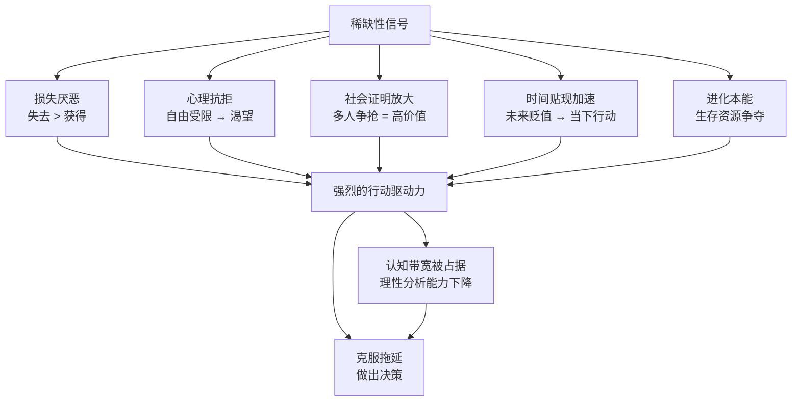
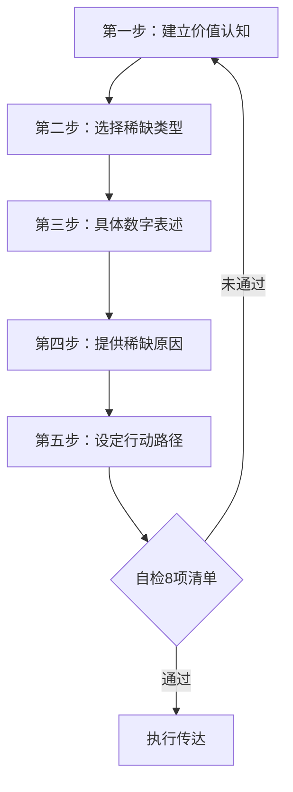
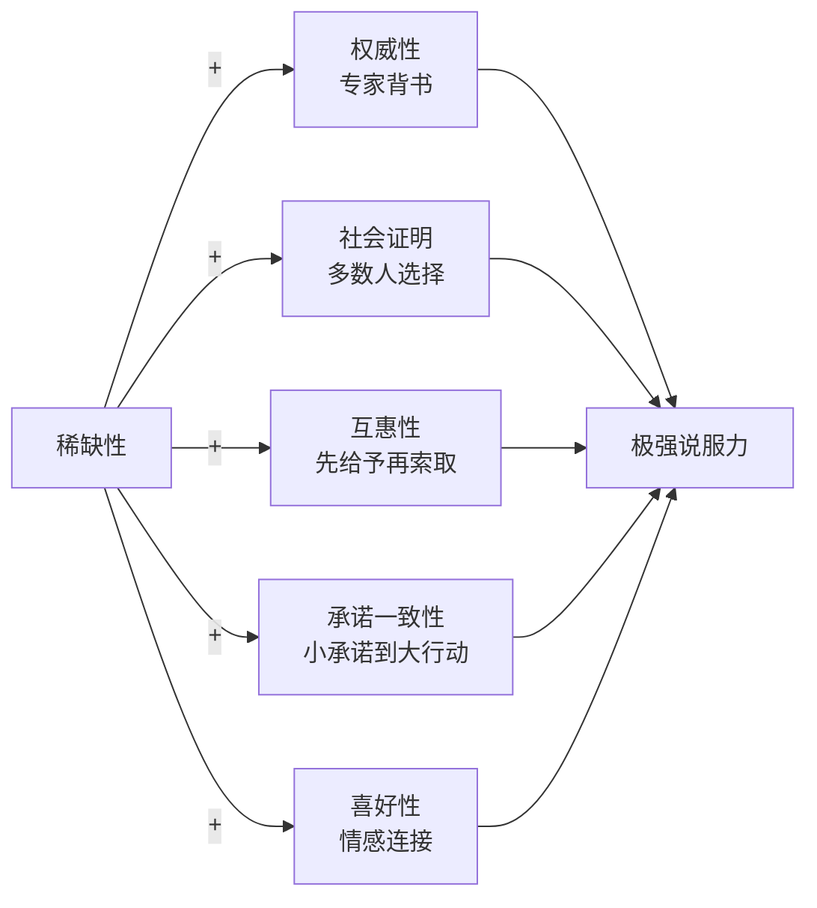

## 五、稀缺性运用：激发行动的心理杠杆

你有没有经历过这样的场景：浏览电商网站时看到"仅剩2件"，心跳突然加速；收到一封"限时24小时"的促销邮件，明明不需要也忍不住点进去；听说某个培训课程"只开放50个名额"，立刻决定报名。这些都不是巧合——你正在被稀缺性（Scarcity）这个强大的心理杠杆驱动。

稀缺性是罗伯特·西奥迪尼（Robert Cialdini）在《影响力》中提出的六大说服原则之一，也是人类决策系统中最原始、最难以理性抵抗的触发器之一。理解稀缺性，不是为了操纵他人，而是为了在沟通中精准地传递价值信号，帮助对方克服拖延和犹豫，做出对自己有利的决定。

本节将从心理学底层机制出发，系统讲解稀缺性的类型、使用框架、实操技巧、常见误区和伦理边界，让你掌握这个说服利器的完整知识体系。

### 5.1 为什么稀缺性有效：心理学底层机制

稀缺性之所以能撬动人的决策，是因为它同时激活了多个深层心理机制。理解这些机制，才能真正掌握稀缺性的用法，而不是机械地模仿话术。

#### 5.1.1 损失厌恶（Loss Aversion）

诺贝尔经济学奖得主丹尼尔·卡尼曼（Daniel Kahneman）和阿莫斯·特沃斯基（Amos Tversky）的前景理论揭示：**人对损失的敏感度是对同等收益的2-2.5倍**。换句话说，失去100元的痛苦感，大约是获得100元快乐感的两倍。

稀缺性之所以有效，正是因为它暗示的是"即将失去"而非"即将获得"。当你说"仅剩3个名额"时，受众的心理反应不是"我可以获得一个名额"，而是"我可能会失去这个机会"。损失厌恶让后者的情绪驱动力远强于前者。

实验证据：沃顿商学院一项经典实验中，受试者被要求为一个杯子出价。当告知"这是最后一个"时，受试者的平均出价比告知"还有很多"时高出近50%。同一个杯子，仅仅是稀缺信息就改变了感知价值。

更进一步，卡尼曼在《思考，快与慢》中指出，损失厌恶的强度会随着以下因素增强：

- **拥有感**：已经"拥有"或"即将拥有"的东西，失去它的痛苦更大。这就是为什么"试用期"和"体验装"如此有效——一旦你体验过，失去它的感觉就不再是"没得到"，而是"被拿走"。
- **临近性**：损失越临近，情绪反应越强烈。"明天截止"比"下个月截止"的驱动力强10倍以上。
- **确定性**：确定会失去比可能会失去的驱动力更强。"最后1个名额"比"名额不多了"更有效，因为前者暗示确定的损失。

#### 5.1.2 心理抗拒（Psychological Reactance）

杰克·布雷姆（Jack Brehm）1966年提出的心理抗拒理论指出：**当人感知到自己的自由选择受到限制或威胁时，会产生一种不愉快的动机状态，驱使他们试图恢复自由**。

稀缺性本质上是一种自由限制信号——"你可能无法再选择了"。这会激发受众的抗拒心理，让他们更强烈地想要获得那个被限制的选项。这就是为什么"禁止购买"或"限购"反而会刺激购买欲望。

心理抗拒有两个关键变量：

- **自由的重要性**：被限制的自由越重要，抗拒越强。限制你买一个你不在乎的东西，几乎不会产生抗拒；限制你买一个你已经决定要买的东西，抗拒会非常强烈。
- **威胁的可信度**：威胁越可信，抗拒越强。"这个机会可能随时关闭"比"这个机会明天关闭"的抗拒反而更弱，因为前者不够确定，大脑不会把它当作真实的自由威胁。

日常例子：限量球鞋的抽签发售、"仅对会员开放"的活动、需要邀请码才能注册的产品——这些限制都在利用心理抗拒激发渴望。

#### 5.1.3 社会证明的放大效应

稀缺性与社会证明（Social Proof）之间存在协同关系。当稀缺性暗示"很多人想要但只有少数人能得到"时，它同时传递了两个信号：一是"这个东西很有价值"（社会证明），二是"你可能得不到"（损失预期）。这两个信号叠加后，说服力远超单独使用。

典型案例：排队效应。当你看到一家餐厅门口排着长队，你同时感知到两个信息——"这家店很受欢迎"（社会证明）和"我可能吃不上"（稀缺）。双重驱动让你更想去尝试。

社会证明放大稀缺的三种模式：

1. **竞争模式**："已有3000人申请，仅录取50人"——竞争越激烈，价值感知越高
2. **消耗模式**："昨天还有15个名额，今天只剩8个"——消耗速度证明需求真实性
3. **排队模式**："您前面还有12位等待者"——等待本身就是价值证明

#### 5.1.4 时间贴现与决策紧迫感

人类存在"时间贴现"（Temporal Discounting）倾向——未来的收益会被主观打折，延迟越久，感知价值越低。稀缺性通过设定截止期限，将决策从"未来的事"变成"现在的事"，迫使受众提高对当前选项的重视程度。

神经科学研究发现，紧迫感会激活大脑的杏仁核（负责情绪反应），同时抑制前额叶皮层（负责理性分析）。这意味着在稀缺压力下，人更容易做出情绪驱动的决策，而非经过深思熟虑的理性选择。

时间贴现的非线性特征值得注意：**人们对近期时间的贴现率远高于远期**。也就是说，"今天截止"和"明天截止"之间的心理差距，远大于"30天后截止"和"31天后截止"之间的差距。这就是为什么倒计时器（countdown timer）在最后几小时的转化率会急剧上升。

#### 5.1.5 进化心理学视角：生存本能的残留

从进化角度看，稀缺性触发的是人类在资源匮乏环境中的生存本能。在原始社会，食物、水源、庇护所的稀缺直接关系到生死。当大脑检测到"稀缺信号"时，它会启动一套古老的应急决策系统——快速评估、立即行动、不做过多分析。

这套系统在现代环境中仍然活跃，尽管大多数稀缺场景已不再涉及生存威胁。这就是为什么即使你知道"限时促销"是营销手段，你的身体仍然会产生心跳加速、注意力集中的生理反应——你的杏仁核在按照10万年前的规则行事。

普林斯顿大学的研究者Sendhil Mullainathan和Eldar Shafir在《稀缺》（Scarcity）一书中进一步指出：**稀缺不仅影响决策，还会占据认知带宽**。当人处于稀缺状态时，其认知能力会下降约13-14个IQ点——相当于一夜未眠或醉酒的状态。这意味着稀缺压力下的人更容易做出冲动决策，也更容易被说服。

### 5.2 稀缺性的五种核心类型

稀缺性不是简单的"限时抢购"。根据触发机制和应用场景的不同，可以分为五种核心类型。每种类型的心理作用路径和适用场景都有显著差异。

| 类型 | 核心机制 | 典型话术 | 心理驱动力 | 适用场景 |
|------|----------|----------|------------|----------|
| 时间稀缺 | 截止期限 | "优惠截止到周五" | 损失厌恶+时间贴现 | 促销、决策推进、项目节点 |
| 数量稀缺 | 有限供给 | "仅剩3个名额" | 损失厌恶+社会证明 | 产品销售、招生、资源分配 |
| 机会稀缺 | 排斥性准入 | "需要内部推荐" | 心理抗拒+身份认同 | 高端服务、圈子、合作机会 |
| 信息稀缺 | 信息不对称 | "这个消息还没公开" | 好奇心+竞争优势 | 资讯分享、投资建议、行业洞察 |
| 能力稀缺 | 资源排期 | "专家档期只剩2周" | 损失厌恶+权威效应 | 咨询服务、专业外包、技术支援 |

#### 5.2.1 时间稀缺：最常见也最容易被滥用的类型

时间稀缺是最直观的稀缺形式——"过了这个村就没这个店"。它的优势是受众理解成本为零，劣势是如果使用不当，最容易被视为套路。

有效的时间稀缺需要满足三个条件：

1. **截止时间具体且可信**："本周五下午5点"比"限时优惠"可信度高出数倍。模糊的截止时间让人觉得你随时可以延长，稀缺感荡然无存。
2. **截止原因合理**："因为仓库需要在月底前清空库存为新品腾出空间"比"限时促销"更能说服人。原因让稀缺从"可能是套路"变成"确实有约束"。
3. **截止后果明确**："下周一价格恢复原价"或"届时将开放给等待名单上的其他人"。让受众清楚知道不行动会失去什么。

时间稀缺的三种子类型：

- **绝对截止**："本周五下午5点"——适用于明确的促销和决策场景
- **相对截止**："从你看到这条消息起24小时内"——适用于个性化触达场景
- **周期稀缺**："每年只开放两次"——适用于长期价值感知建设

#### 5.2.2 数量稀缺：暗示高需求的有力信号

数量稀缺传递的是"供不应求"的信号，它同时激活损失厌恶和社会证明两种心理机制。关键在于数字的表达方式：

- **绝对数字**："仅剩3个名额"——适合小规模场景，数字越小越有冲击力
- **百分比**："已售出92%"——适合大规模场景，高比例暗示受欢迎程度
- **对比数字**："申请者3000人，录取30人"——适合竞争性场景，突出选择性

使用数量稀缺的高级技巧：**动态展示消耗速度**。"昨天还有15个名额，今天只剩8个"——消耗速度本身比剩余数量更能制造紧迫感。这就是为什么很多网站会显示"过去24小时有XX人浏览了这个商品"。

数量稀缺的心理阈值：

- **个位数（1-9）**：冲击力最强，适用于高价值、低产量场景
- **两位数（10-99）**：仍有紧迫感，适用于课程、活动类场景
- **三位数以上**：需要用百分比或对比来强化，单独的数字已不足以制造紧迫感

#### 5.2.3 机会稀缺：利用排斥性制造价值感

机会稀缺的核心不是"少"，而是"不是谁都能得到"。它利用的是人的身份认同需求——被选中意味着被认可，被排斥意味着被否定。

机会稀缺的三个层次：

1. **条件准入**："需要满足XX条件才能参与"——设立门槛，让达标者感到优越
2. **邀请制**："仅限内部推荐"——利用人际信任网络，同时提升被邀请者的身份感
3. **竞争筛选**："经过面试/评审后择优录取"——将稀缺包装为选拔，将限制转化为荣誉

机会稀缺的心理机制与"排斥群体"（Exclusive Group）效应密切相关。社会心理学研究表明，人们对"被选中"的渴望强度，往往超过对"被排斥"的恐惧。当一个群体说"不是所有人都能加入"时，它不仅在限制准入，更在暗示"加入即精英"。这就是为什么高端俱乐部、精英校友会、VIP会员体系如此有效——它们把"稀缺"变成了"身份象征"。

#### 5.2.4 信息稀缺：利用信息不对称创造价值

信息稀缺的底层逻辑是：**拥有别人不知道的信息，本身就是一种权力和价值**。当你说"这个消息还没公开"时，你同时在做三件事：展示自己的信息渠道（权威性），给予对方优先知情权（特殊待遇），创造竞争优势（实用价值）。

使用信息稀缺的关键：信息必须真的有价值，且确实尚未公开。如果你分享的"独家信息"对方在别处早已看到，不仅稀缺感消失，你的可信度也会受损。

信息稀缺的三个层次：

1. **时间领先**："这个消息明天才会公开发布"——给予对方24小时的信息优势
2. **渠道独占**："这个信息只有我们行业内部的人知道"——暗示信息来源的稀缺性
3. **解读稀缺**："数据是公开的，但这个解读角度是我独有的"——最高等级的信息稀缺，因为解读能力比数据本身更有价值

#### 5.2.5 能力稀缺：基于真实资源约束的稀缺

能力稀缺是最诚实的稀缺类型——它基于真实的产能、时间和精力限制。"我的团队今年只能承接5个项目"、"这个专家的预约已经排到下个月"——这些陈述传递的不是人为制造的紧迫感，而是客观存在的约束。

能力稀缺的优势在于：它几乎不会被视为套路，因为它描述的是事实。同时，它还能传递另一个隐含信号——"我们很受欢迎，所以很忙"。

能力稀缺的三个维度：

- **产能约束**："生产线满负荷运转，新订单排到3个月后"
- **精力约束**："我亲自带的项目不超过5个，以保证质量"
- **时间约束**："本周只剩周三下午2点和周五上午10点可约"

能力稀缺的高级用法：**将能力稀缺与质量承诺绑定**。"因为我们只接5个项目，所以每个项目我都能亲自跟进"——稀缺不再只是限制，而是质量保证的证据。这种表述将"少"从劣势转化为优势。

### 5.3 稀缺性的实操应用框架

理解了心理机制和类型后，下一步是在实际沟通中运用稀缺性。以下是一个完整的五步框架，适用于销售、谈判、项目推进、资源分配等多种场景。

#### 5.3.1 第一步：先建立价值，再展示稀缺

**这是稀缺性使用中最关键的规则：如果受众不理解价值，稀缺毫无意义。**

试想两个场景：

- 场景A："这个课程仅剩5个名额，赶快报名！"
- 场景B："这个课程由前麦肯锡合伙人主讲，往期学员平均薪资涨幅40%，目前仅剩5个名额。"

场景A的稀缺是空洞的——受众不知道为什么要这5个名额。场景B中，价值认知（麦肯锡合伙人、40%薪资涨幅）为稀缺提供了意义框架。

**价值-稀缺的正确顺序：**

1. 先用具体数据和案例建立价值认知
2. 让受众产生"我想要"的感觉
3. 此时再展示稀缺，将"想要"转化为"必须现在就行动"

如果顺序颠倒——先说稀缺再建立价值——受众会感到被推销，产生抵触心理。

价值建立的四个维度：

| 维度 | 方法 | 示例 |
|------|------|------|
| 结果证明 | 展示过往成果数据 | "往期学员晋升率73%" |
| 权威背书 | 引用专家或机构认可 | "哈佛商学院案例收录" |
| 同行验证 | 展示同类人群的选择 | "已有500位产品经理报名" |
| 个人体验 | 让受众先体验价值 | "免费试听第一节课" |

#### 5.3.2 第二步：选择合适的稀缺类型

不同类型的目标、不同性质的受众，适合不同的稀缺类型。盲目套用"限时优惠"式的稀缺，效果可能适得其反。

**决策流程：**

1. 你希望推动的目标是什么？（购买、决策、承诺、行动）
2. 你的受众最在意什么？（价格、品质、机会、信息、时间）
3. 你有哪些真实的稀缺约束？（时间、数量、能力、排期）
4. 选择与受众在意点匹配的真实稀缺约束

示例：你是一个咨询顾问，想推动客户尽快签约。你的受众是企业高管，最在意的是解决问题的能力和时间。你的真实约束是季度排期有限。那么，能力稀缺（"我的Q3排期只剩2个项目的空间"）比时间稀缺（"本周签约有折扣"）更有效，因为前者与高管的关切点（能力和时间）直接匹配。

受众类型与稀缺类型的匹配矩阵：

| 受众类型 | 最有效的稀缺 | 最无效的稀缺 | 原因 |
|----------|-------------|-------------|------|
| 价格敏感型 | 时间稀缺（限时折扣） | 机会稀缺（邀请制） | 他们在意性价比，身份感驱动弱 |
| 品质导向型 | 能力稀缺（排期有限） | 时间稀缺（限时优惠） | 他们更在意质量，价格促销反而降低感知价值 |
| 社交驱动型 | 机会稀缺（邀请制） | 数量稀缺（仅剩X个） | 他们在意身份认同和社交圈层 |
| 信息敏感型 | 信息稀缺（独家消息） | 能力稀缺（专家排期） | 他们在意信息优势，对产能约束不敏感 |
| 决策犹豫型 | 数量稀缺（动态消耗） | 信息稀缺（独家消息） | 他们需要外部压力推动，信息只会增加分析瘫痪 |

#### 5.3.3 第三步：用具体数字替代模糊表述

模糊的稀缺表述（"名额有限"、"限时优惠"、"即将售罄"）已经因为被过度使用而失去了说服力。具体数字的说服力远强于模糊表述。

| 模糊表述（弱） | 具体表述（强） | 说服力差异 |
|----------------|----------------|------------|
| 名额有限 | 仅剩7个名额 | 具体数字激活损失厌恶 |
| 限时优惠 | 优惠截止本周五下午5点 | 截止时间创造倒计时感 |
| 即将售罄 | 200件已售出187件 | 进度条效应增强紧迫感 |
| 档期紧张 | 本周只剩周三下午2点可约 | 具体时间推动立即行动 |
| 机会难得 | 这个活动3年来只开放过2次 | 频率数据强化稀缺认知 |

数字表述的进阶技巧：

- **用奇数比偶数更可信**："仅剩7个名额"比"仅剩8个名额"感觉更真实，因为精确的奇数暗示你真的在计数
- **用递减数字比静态数字更有力**："刚才还有9个，现在只剩7个"——变化比状态更能制造紧迫
- **用百分比配合绝对数字**："92%已售出（200件中仅剩16件）"——百分比展示整体热度，绝对数字制造个体紧迫

#### 5.3.4 第四步：提供合理的稀缺原因

没有原因的稀缺会被默认为"套路"。有原因的稀缺会被理解为"真实的约束"。

**稀缺原因的三个层次：**

1. **客观约束型**（最强）："因为工厂生产线只有3条，每月最大产能1000件"
2. **规则设计型**（中等）："为了保证教学质量，每班限制在30人"
3. **人为设定型**（最弱）："我们决定只招50人"——如果没有任何理由，受众会质疑为什么不多招

注意：第三种并非不能用，但需要补充原因。"我们决定只招50人，因为超过这个数量后，导师无法给每位学员提供一对一的反馈时间"——这就从"人为设定"升级为"规则设计"。

稀缺原因的可信度层级：

| 原因类型 | 示例 | 可信度 | 可验证性 |
|----------|------|--------|----------|
| 物理/产能约束 | "生产线满负荷" | 最高 | 可实地考察 |
| 法规/合规约束 | "监管要求每批不超过X件" | 高 | 可查法规文件 |
| 质量承诺约束 | "为保证质量限收30人" | 中高 | 可观察往期效果 |
| 品牌策略约束 | "限量发售维护品牌调性" | 中 | 需要品牌力支撑 |
| 无理由约束 | "就这么多" | 最低 | 无法验证，易被质疑 |

#### 5.3.5 第五步：设定清晰的行动路径

稀缺性制造了紧迫感，但如果受众不知道如何行动，紧迫感会变成焦虑而非行动。在展示稀缺的同时，必须提供清晰、简单的行动路径。

错误示范："名额有限，想要的赶紧联系我！"——"联系我"是什么意思？打电话？发微信？发邮件？说什么？

正确示范："目前还剩3个名额。如果你有兴趣，直接回复这条消息'我要报名'，我会在2小时内发给你报名链接和付款方式。"

行动路径的三个要素：

1. **具体动作**：回复什么、点击哪里、联系谁
2. **时间承诺**：多久会得到回应
3. **下一步预期**：接下来会发生什么

降低行动阻力的技巧：

- **减少步骤**：从"注册→验证→登录→填写→付款"精简为"扫码→付款"
- **提供默认选项**："大多数学员选择年付方案（省20%）"——默认选项减少决策负担
- **降低首次承诺**："先付定金锁定名额，尾款可在开课前7天付清"——小额承诺比大额更容易触发

### 5.4 不同场景的稀缺性应用实例

#### 5.4.1 商业销售场景

**场景：SaaS产品年费续费**

普通话术："您的订阅即将到期，请尽快续费。"

稀缺性话术："您的专业版订阅将在5天后到期。续费后您将保留当前的高级功能权限和历史数据。如果不续费，您的数据将在30天后被清理。另外，从下个月起，专业版价格将调整为每月299元（当前您享受的是月付199元的锁定价格），现在续费年付可以继续享受199元/月的价格。"

分析：这个话术同时运用了三种稀缺——时间稀缺（5天后到期）、能力/功能稀缺（高级功能权限）、价格稀缺（即将涨价）。每种稀缺都有具体的数字和合理的理由。

**场景：房产销售**

普通话术："这套房子很抢手，要买趁早。"

稀缺性话术："这套房子上架3天，已经有4组客户来看过，其中2组明确表示有意向。业主目前的心理价位是X万，但我了解到另一组客户已经在准备报价了。如果您确实有意，我建议今天下午就安排看房，看完我们直接谈价格策略。"

分析：用具体数据（3天、4组、2组）建立社会证明和紧迫感，用"另一组在准备报价"制造竞争稀缺，用"今天下午就看"提供明确的行动路径。

**场景：电商大促**

普通话术："限时特惠，错过等一年！"

稀缺性话术："这款降噪耳机日常售价1299元，本次618活动价799元。活动期间共备货500台，目前已售出437台，剩余63台。活动截止时间：6月18日23:59:59。活动结束后价格恢复原价，且下一批货到货时间为8月中旬。"

分析：价格对比（1299→799）建立价值感，具体数字（500台/437台/63台）制造紧迫，截止时间精确到秒增加可信度，下一批到货时间暗示"现在不买要等两个月"。

#### 5.4.2 职场沟通场景

**场景：推动项目决策**

普通话术："这个方案需要尽快审批，不然来不及了。"

稀缺性话术："这个方案需要在本周三之前完成审批。原因是：供应商的排期窗口在下周一关闭，如果周三前不能确认，我们至少要再等6周才能排上下一批次，这会导致整个项目延期1.5个月，按目前的日均运营成本计算，大约增加45万元的额外支出。"

分析：时间稀缺（周三之前）+ 客观约束原因（供应商排期）+ 不行动的具体后果（延期1.5个月、45万元），将"赶紧批"的模糊催促变成了有理有据的决策支持。

**场景：争取资源**

普通话术："我们团队人手不够，需要加人。"

稀缺性话术："目前市场上有3年以上经验的算法工程师，平均在岗周期是2.3个月就会被其他公司签走。我上周筛选到的两个候选人，其中一个昨天已经收到了竞品的offer。如果我们能在本周内完成面试流程，还有机会争取到另一个。"

分析：用行业数据（2.3个月在岗周期）建立稀缺背景，用具体案例（一个已被签走）强化紧迫感，用明确的时间窗口（本周内）推动行动。

**场景：跨部门协作推进**

普通话术："你们部门的反馈能快点吗？"

稀缺性话术："我们这个迭代的代码冻结（code freeze）时间是下周五。如果你们部门的需求评审能在本周三前完成，开发团队还有10个工作日来实现；如果周四之后才完成，开发时间压缩到5个工作日，按历史数据估算，bug率会上升约40%，可能需要额外一轮回归测试。"

分析：用技术节点（code freeze）建立客观时间约束，用两种情况的对比（10天vs5天）让对方看到延迟的具体代价，用历史数据（bug率上升40%）增加可信度。

#### 5.4.3 个人沟通场景

**场景：说服朋友接受建议**

普通话术："你应该去试试这个健身房，挺好的。"

稀缺性话术："我发现了一家新开的CrossFit box，创始会员价是月卡599元（正常价899），这个价格只开放到开业首月结束，还剩10天。而且创始会员可以锁定这个价格终身，之后就算涨价也不受影响。上周我试了一节课，教练水平确实不错，WOD设计也很合理。"

分析：价格稀缺（创始会员价）+ 时间稀缺（还剩10天）+ 长期收益（锁定终身价格），先用个人体验建立价值认知（"试了一节课，教练不错"），再展示稀缺。注意没有强迫对方做决定，只是提供了充分的信息。

**场景：劝说家人做体检**

普通话术："你应该去做个全面体检。"

稀缺性话术："市医院下周有一批日本进口的低剂量螺旋CT设备刚到位，正在做推广期的全面体检套餐，原价3800元，推广期1980元，只持续到月底。这个设备的肺部筛查精度比普通CT高30%，辐射量却低60%。我已经帮我们俩都预约了下周三上午的号，到时候一起去。"

分析：设备稀缺（新设备推广期）+ 价格稀缺（半价）+ 时间稀缺（到月底），用具体数据（精度高30%、辐射低60%）建立价值，用"我已经预约了"降低对方的行动成本。

#### 5.4.4 内容营销场景

**场景：在线课程招生文案**

低效文案："重磅课程上线！名额有限，速来报名！"

高效文案：

"过去两年，我辅导了127位产品经理完成从P5到P6的晋升。这些学员的共同反馈是：最大的瓶颈不是技能，而是缺少一套系统的方法论框架。

基于这127个真实案例，我提炼出了一套'产品晋升五步法'。这套方法论将在《产品经理晋升特训营》中完整教授。

课程详情：
- 为期6周，每周2次直播+1次作业批改
- 我本人亲自授课和点评（不是助教）
- 往期学员晋升通过率73%

因为我要亲自批改每一份作业，这一期只开放40个名额。目前已报名31人，剩余9个名额。

报名截止：本周日24:00

[立即报名]"

分析：价值建立（127个案例、五步法、73%通过率）→ 能力稀缺（亲自授课，批改每份作业，所以只收40人）→ 动态数字（已报31人，剩9人）→ 时间截止（本周日24:00）→ 行动路径（立即报名按钮）。完整的价值-稀缺-行动链路。

**场景：社群运营——知识星球/付费社群**

低效文案："我的知识星球开放加入，干货满满！"

高效文案：

"我在知识星球'产品沉思录'中已经持续输出了365天的深度思考，累计超过80万字。星球内有312位产品经理，其中P7以上占比34%。

过去一年，星球内产出了：
- 23篇被36氪转载的行业分析
- 156个真实的面试真题及解析
- 47次与大厂PM的线上交流录音

下周一，我将发布一份独家的'2024年AI产品机会地图'，这份报告花了我3个月调研，只在星球内发布，不会公开。

星球定价每年299元，目前已有312位成员。当成员达到500人时，价格将调整为499元。

[立即加入]"

分析：内容价值（80万字、23篇转载）→ 社群价值（312位成员、34% P7+）→ 信息稀缺（独家报告，不公开）→ 价格稀缺（满500人涨价）→ 社会证明（已有312人）。

### 5.5 稀缺性的常见误区与纠正方法

稀缺性是最容易被误用的说服技巧之一。以下是七个常见误区及其纠正方法。

#### 误区一：虚假稀缺

**错误表现**：人为制造假的稀缺——"仅剩3件"实际库存充足，"限时24小时"结束后立即重新开始，"名额已满"但随时可以加塞。

**后果**：一旦被识破，不仅当前说服失败，你未来所有的沟通都会被打上"不可信"的标签。在社交媒体时代，一个被揭穿的虚假稀缺可以在几小时内传播给数千人。

**真实案例**：2019年，某知名电商平台被曝光在双11期间将原价先抬高再"限时折扣"，"仅剩X件"的库存数据与实际不符。事件被媒体报道后，该平台当季用户信任指数下降了18%，监管部门也介入调查。

**纠正**：只在有真实约束时使用稀缺。如果没有真实的稀缺约束，用其他说服技巧——价值主张、社会证明、权威背书——不要硬造稀缺。

#### 误区二：稀缺先于价值

**错误表现**："仅剩5个名额！"——受众的第一反应是："所以呢？这5个名额里有什么？"

**后果**：稀缺感无法建立，反而让受众感到被催促和被低估。

**纠正**：严格遵守"先价值，后稀缺"的顺序。用至少60%的篇幅建立价值认知，再用稀缺作为催化剂。

#### 误区三：频繁使用导致脱敏

**错误表现**：每次沟通都用"最后一次机会"、"限时优惠"、"仅剩X个"。

**后果**：受众会形成"狼来了"效应，对你的稀缺信号完全脱敏。更糟的是，他们会开始质疑你所有陈述的可信度。

**纠正**：稀缺性是"战略武器"而非"日常工具"。一个季度内，对同一受众群体使用稀缺性的频率不应超过2-3次。将稀缺保留给真正重要的决策节点。

脱敏效应的量化参考：

| 使用频率 | 受众反应 | 说服力衰减 |
|----------|----------|------------|
| 每季度1次 | 高度关注，行动率最高 | 无衰减 |
| 每月1次 | 仍有关注，但开始选择性响应 | 衰减约20% |
| 每周1次 | 基本脱敏，视为常规营销 | 衰减约60% |
| 每天1次 | 完全脱敏，产生负面印象 | 衰减90%+，且损害品牌 |

#### 误区四：模糊表述

**错误表现**："名额有限"、"即将售罄"、"优惠即将截止"——没有任何具体数字或时间。

**后果**：模糊的稀缺无法激活损失厌恶，因为受众无法感知具体的损失规模。"名额有限"可以是剩1个也可以是剩1000个，大脑无法为模糊信息产生情绪反应。

**纠正**：所有稀缺表述都必须包含具体数字。"名额有限"→"还剩7个名额"，"即将售罄"→"200件已售出191件"，"优惠即将截止"→"优惠截止本周五下午5点"。

#### 误区五：缺乏稀缺原因

**错误表现**："这个产品只卖100件。"——为什么？是产能限制？是设计理念？还是人为设定？

**后果**：没有原因的稀缺让人感觉是营销话术，而非真实约束。

**纠正**：为每一条稀缺声明提供一个合理的解释。原因不需要很复杂，但必须存在。

#### 误区六：稀缺与行动路径脱节

**错误表现**：花了大量篇幅营造紧迫感，但最后只有一句"感兴趣请联系我"。

**后果**：紧迫感消散，受众的行动意愿在"如何行动"这一步被阻断。

**纠正**：稀缺声明之后立即跟上具体的行动指引——回复什么、点击哪里、多快会得到回应。

#### 误区七：忽视受众情绪状态

**错误表现**：在受众还没有任何兴趣或价值认知时，就用稀缺施压。

**后果**：受众会感到被操纵和被逼迫，产生强烈的逆反心理。

**纠正**：在使用稀缺之前，先确认受众对你的价值主张有基本认同。一个简单的判断标准：受众是否主动问了关于价格、时间或下一步的问题？如果是，说明他们已经有兴趣，此时稀缺是催化剂；如果不是，先解决价值认知问题。

#### 误区八：线上虚假倒计时（数字时代特有）

**错误表现**：在网页或App中嵌入倒计时器，但倒计时结束后自动重置或跳转到另一个"限时优惠"页面。

**后果**：用户截图分享后，你的品牌会在社交媒体上被群嘲。欧盟和美国FTC已经对虚假倒计时行为进行过处罚。

**纠正**：如果使用倒计时器，它必须对应真实的截止时间。宁可不用，也不能造假。

### 5.6 稀缺性与其他说服原则的协同

稀缺性很少单独发挥作用。在实际沟通中，将稀缺性与其他说服原则组合使用，可以产生远超单一原则的效果。

**稀缺性 + 权威性**："这是行业顶级专家最后一次公开授课"——稀缺提升权威的珍贵感，权威为稀缺提供价值背书。权威性让受众相信稀缺的资源确实有价值，而稀缺性让权威资源显得更加珍贵。两者结合时，效果不是相加而是相乘。

**稀缺性 + 社会证明**："已有5000人报名，最后100个名额"——社会证明验证价值，稀缺加速行动。社会证明回答"这个东西好不好"，稀缺回答"我现在要不要行动"。前者解决价值认知，后者解决行动时机。

**稀缺性 + 互惠性**："我免费分享了3个月的干货内容，下个月的深度课程仅剩最后20个名额"——互惠建立好感和亏欠感，稀缺将好感转化为行动。互惠让受众觉得"欠你一个人情"，稀缺给了他们一个"还人情"的具体时机。

**稀缺性 + 承诺一致性**："你已经完成了前3关挑战，最后一关的资格只剩48小时"——之前的承诺（完成3关）让受众不愿半途而废，稀缺加速最终决策。承诺一致性让受众有完成的动力，稀缺给了他们"现在就完成"的理由。

**稀缺性 + 喜好性**："我特别想推荐给你，因为以你的水平，这个机会真的很适合你——不过名额快满了"——喜好让推荐变成关心，稀缺让关心变成紧迫。喜好性让受众信任你的推荐，稀缺性让他们觉得"你是为我好才现在告诉我"。

组合使用的优先级建议：

| 组合方式 | 适用场景 | 效果强度 |
|----------|----------|----------|
| 稀缺+社会证明 | 大众消费品、课程招生 | ★★★★★ |
| 稀缺+权威 | 专业服务、高端产品 | ★★★★★ |
| 稀缺+互惠 | 内容营销、社群运营 | ★★★★ |
| 稀缺+承诺一致性 | 挑战赛、学习计划、会员升级 | ★★★★ |
| 稀缺+喜好 | 一对一推荐、朋友间建议 | ★★★ |

### 5.7 稀缺性的伦理边界

稀缺性是一种强大的说服工具，但强大意味着需要谨慎使用。以下是使用稀缺性时必须遵守的伦理准则。

#### 5.7.1 三条红线

1. **不伪造稀缺**：永远不要人为制造不存在的稀缺。如果库存充足，不要说"仅剩3件"。如果报名通道不会关闭，不要说"即将截止"。
2. **不利用恐惧**：不要用稀缺性制造过度的恐惧和焦虑。"如果你不现在签约，你的公司就会倒闭"——这是恐吓，不是说服。
3. **不针对弱势群体**：对认知能力有限的群体（如老人、儿童、处于极端压力下的人）使用稀缺性需要格外谨慎。

#### 5.7.2 三个自检问题

在使用稀缺性之前，问自己三个问题：

1. **真实性**：我描述的稀缺是真实的吗？如果受众能够验证我的说法，他们会发现我说的是实话吗？
2. **受益性**：如果受众因为我的稀缺性提示而行动，他们会从中受益吗？还是只有我受益？
3. **可逆性**：受众做出决定后，如果后悔，是否还有回旋的余地？我是否给了他们合理的退出机制？

如果三个问题的答案都是肯定的，你的稀缺性使用在伦理上是站得住脚的。

#### 5.7.3 不同文化背景下的伦理差异

稀缺性在不同文化中的接受度存在显著差异：

- **东亚文化（中日韩）**：对"限量"、"限定"有天然好感，日本的"限定商品"文化就是典型。但同时，对虚假稀缺的容忍度极低，一旦被揭穿，品牌修复成本极高。
- **欧美文化**：消费者对稀缺性的警惕性更高，FTC（美国联邦贸易委员会）对虚假稀缺有明确的法律规制。使用稀缺性时需要更多数据支撑和透明度。
- **新兴市场**：消费者对稀缺性的敏感度可能更高（资源相对稀缺的社会背景），但也更容易产生信任危机。

无论在哪种文化中，**真实性和透明度**都是不可逾越的底线。

### 5.8 进阶技巧：稀缺性的高级运用

#### 5.8.1 动态稀缺：实时变化的稀缺信号

静态的"仅剩5个"不如动态的"刚才还是8个，现在只剩5个"有冲击力。动态稀缺通过展示稀缺的实时变化，增强真实感和紧迫感。

实现方式：

- 电商网站显示"过去1小时有23人加购了这件商品"
- 活动页面显示实时报名人数增长曲线
- 会议中口头提及"刚才又有2个名额被确认了"
- 社群运营中定期播报"本周新增15位成员，总名额剩余XX"

动态稀缺的心理学原理：**变化比状态更能吸引注意力**。人类的注意力系统对"变化"高度敏感（这是进化赋予的生存优势），静态的信息会被习惯化（habituation），而动态变化的信息持续吸引注意。

#### 5.8.2 对比稀缺：有vs没有的差距

展示"稀缺状态下的结果"与"非稀缺状态下的结果"之间的差距，比单独展示稀缺更有效。

示例："去年我们开放了100个名额，最终只有23人坚持完成。今年我们决定只收30人，但每个人都必须全程参与。去年坚持完成的23人中，有19人在6个月内实现了薪资翻倍。"

这里的稀缺不是"30个名额"本身，而是"稀缺带来的筛选效应"——更少的人意味着更高的质量，更高的质量意味着更好的结果。

对比稀缺的三种用法：

1. **时间对比**："上一期100人，完成率23%；这一期30人，完成率预计85%"
2. **结果对比**："大规模班级平均薪资涨幅15%，精品小班平均涨幅40%"
3. **体验对比**："大众版有5000人，没有答疑；限量版30人，每周一对一答疑"

#### 5.8.3 预告稀缺：提前种下期待

在稀缺真正到来之前，先预告稀缺的存在，让受众提前做好心理准备。

示例："下个月我们将推出年度特惠，但因为成本原因，这次特惠只持续3天，总共只有200个名额。如果你有兴趣，可以先加入等候名单，到时候我会第一时间通知你。"

预告稀缺的优势：在稀缺到来之前就建立了价值认知和行动意愿，当稀缺真正出现时，受众已经准备好了。

预告稀缺的实施节奏：

| 阶段 | 时间点 | 动作 | 目的 |
|------|--------|------|------|
| 预热 | 活动前2-4周 | 暗示即将有稀缺机会 | 种下期待 |
| 预告 | 活动前1周 | 公布具体稀缺细节 | 建立等待名单 |
| 开启 | 活动当天 | 通知等待名单优先 | 利用承诺一致性 |
| 提醒 | 活动中期 | 报告剩余数量 | 制造紧迫感 |
| 收尾 | 活动最后24小时 | 最终提醒+动态数字 | 推动犹豫者行动 |

#### 5.8.4 稀缺性的反转运用

有时候，**反稀缺**（Anti-scarcity）比稀缺更有效。在某些场景下，展示"充裕"反而能建立信任。

示例：一家餐厅老板对犹豫不决的顾客说："不着急，我们的招牌菜今天备料充足，你慢慢选。"这种反稀缺传递的信号是"我不急着赚你的钱，我关心你的体验"，反而可能让顾客更快做出决定并产生好感。

反稀缺适用的场景：

- 受众已经处于高度焦虑状态（额外的稀缺会让他们崩溃）
- 你的核心价值主张是"可靠、稳定、值得信赖"
- 你在建立长期关系而非推动一次性交易
- 你面对的是B2B决策者（他们需要充足的信息和时间来内部协调）

反稀缺与稀缺的决策矩阵：

| 受众状态 | 你的目标 | 选择策略 |
|----------|----------|----------|
| 冷漠/无兴趣 | 激发兴趣 | 先建立价值，暂不用稀缺 |
| 有兴趣/犹豫 | 推动行动 | 使用稀缺（最佳时机） |
| 高度焦虑 | 缓解压力 | 使用反稀缺 |
| 已决定/拖延 | 加速执行 | 使用稀缺（强调后果） |

#### 5.8.5 阶梯稀缺：逐步升级的紧迫感

不是一次抛出所有稀缺信息，而是分阶段、逐步升级紧迫感。这种技巧适用于较长的销售周期或复杂决策场景。

示例（B2B销售周期）：

- **第一次沟通**（建立价值）："我们的解决方案已经帮助30多家同行业企业降低了25%的运营成本。"（无稀缺）
- **第二次沟通**（轻度稀缺）："目前我们的实施团队Q3还有2个项目的位置。"（能力稀缺）
- **第三次沟通**（中度稀缺）："上周有一个Q3的位置被确认了，目前只剩1个。"（数量+动态稀缺）
- **第四次沟通**（重度稀缺）："如果本周五前不能签约，下一个可用排期是明年Q1，而且明年的价格会调整。"（时间+价格稀缺）

阶梯稀缺的关键原则：每一级稀缺都必须是真实的，不能为了制造紧迫感而虚报进度。

#### 5.8.6 稀缺性的防御：识破他人的稀缺操控

理解稀缺性不仅是为了使用它，也是为了保护自己不被操控。以下是识别虚假稀缺的信号：

**红旗信号（Red Flags）：**

1. **重复出现的"限时"**：如果同一个"限时优惠"每隔几周就出现一次，它就不是真的限时
2. **无法验证的数字**："仅剩3个名额"但你无法看到任何实时数据
3. **压力话术叠加**：同时使用多种稀缺+权威+社会证明，且语速极快——这是高压销售（hard sell）的典型特征
4. **不让你思考的紧迫**："现在就决定，过了这村没这店"——真正好的机会经得起你花24小时考虑
5. **不合理的折扣幅度**：如果一个东西"原价"10000元但"限时特价"只要999元，那个"原价"很可能是虚构的

**防御策略：**

1. **24小时冷却法则**：面对任何"限时"决策，给自己至少24小时的冷静期。如果24小时后你仍然想要，再行动
2. **独立验证**：对稀缺声明进行第三方验证——查看库存、询问客服、搜索评价
3. **反向思考**：问自己"如果这个东西永远都在，我还会想要吗？"如果答案是"不会"，你的欲望很可能完全是由稀缺感驱动的
4. **记录追踪**：记录你遇到的"限时优惠"，过一段时间回头看是否真的结束了——这会让你对虚假稀缺脱敏

### 5.9 稀缺性的度量与优化

稀缺性不是用完就完的技巧，它是可以度量和持续优化的。

#### 5.9.1 关键指标

| 指标 | 定义 | 优化方向 |
|------|------|----------|
| 稀缺转化率 | 看到稀缺信息后采取行动的比例 | 提高：优化稀缺类型和表述方式 |
| 紧迫感指数 | 受众从"看到稀缺"到"采取行动"的平均时间 | 缩短：优化行动路径和紧迫程度 |
| 稀缺疲劳率 | 同一受众多次接触稀缺信息后的响应衰减比例 | 降低：控制使用频率，丰富稀缺类型 |
| 信任损耗率 | 使用稀缺后受众信任度的变化 | 维持正值：确保稀缺真实性和透明度 |

#### 5.9.2 A/B测试方法

对于数字化场景，可以通过A/B测试找到最优的稀缺表述方式：

1. **测试变量一次只改一个**：不要同时改数字、改措辞、改位置
2. **样本量要足够**：至少1000次曝光才能得出有意义的结论
3. **分时段对比**：稀缺性在工作日和周末、上午和晚上的效果可能不同
4. **记录长期影响**：短期转化率提升但长期信任度下降的方案不是好方案

可测试的变量：

- 数字大小（"剩3个" vs "剩7个" vs "剩12个"）
- 表述方式（绝对数 vs 百分比 vs 进度条）
- 稀缺类型（时间 vs 数量 vs 机会）
- 位置（标题 vs 正文 vs CTA旁边）
- 紧迫程度（温和提示 vs 强调后果）

### 5.10 稀缺性的练习与自查清单

#### 练习一：识别日常中的稀缺性

未来一周，注意你在日常生活中遇到的所有稀缺性信号——广告、邮件、对话、新闻。记录下来并分析：它属于哪种类型？它有没有提供原因？它的表述是模糊还是具体？你当时的情绪反应是什么？

记录模板：

| 日期 | 来源 | 稀缺类型 | 具体表述 | 有无原因 | 模糊/具体 | 你的反应 | 是否行动 |
|------|------|----------|----------|----------|-----------|----------|----------|
| | | | | | | | |

#### 练习二：改写练习

将以下模糊的稀缺表述改写为具体、有说服力的版本：

1. "课程名额有限，欲报从速"
2. "优惠即将结束"
3. "仅限老客户参加"
4. "机会难得，不容错过"
5. "活动倒计时中"

参考改写（供对照）：

1. → "本期课程限招40人，目前已报名33人，剩余7个名额"
2. → "年中特惠截止本周日23:59:59，届时所有商品恢复原价"
3. → "本活动仅对消费满5000元的VIP客户开放，您已符合资格"
4. → "这个行业峰会过去3年仅举办过2届，每届参会者不超过200人"
5. → "活动报名截止时间：本周五下午5点，距今还有47小时"

#### 练习三：场景模拟

选择以下场景之一，运用5步框架写出一份完整的稀缺性表述：

- 你是一个自由设计师，想推动一个潜在客户签约
- 你在组织一次线下沙龙，需要在3天内招满30人
- 你发现了一个很好的投资机会，想说服朋友关注
- 你的团队有一个重要的项目deadline，需要推动其他部门配合

#### 自查清单

在每次使用稀缺性之前，对照以下清单：

- [ ] 价值认知是否已经建立？（受众是否理解这个东西为什么好）
- [ ] 稀缺是否基于真实的约束？（是否存在真实的时间/数量/能力限制）
- [ ] 是否提供了合理的稀缺原因？（受众是否理解为什么会稀缺）
- [ ] 数字是否具体、可验证？（有没有避免"名额有限"等模糊表述）
- [ ] 行动路径是否清晰简单？（受众是否知道具体该怎么做）
- [ ] 是否考虑了受众的情绪状态？（受众是否已经对价值有基本认同）
- [ ] 是否通过了三条伦理红线的检验？（真实、不恐吓、不针对弱势群体）
- [ ] 对同一受众，近期是否已经用过稀缺性？（避免脱敏和信任损耗）

通过所有8项检查，你的稀缺性表述才具备完整的说服力。

### 5.11 本节核心要点回顾

1. **稀缺性有效的根本原因**：损失厌恶、心理抗拒、社会证明放大、时间贴现、进化本能五重心理机制叠加
2. **五种稀缺类型**：时间、数量、机会、信息、能力——根据受众特点和场景选择合适的类型
3. **五步应用框架**：建立价值→选择类型→具体数字→合理原因→清晰行动
4. **最大禁忌**：虚假稀缺——一旦被识破，信任归零
5. **最重要的顺序**：先价值，后稀缺——没有价值基础的稀缺是空洞的催促
6. **伦理自检**：真实、受益方包含受众、可逆可退出
7. **高级技巧**：动态稀缺、对比稀缺、预告稀缺、阶梯稀缺、反稀缺——丰富你的稀缺工具箱
8. **防御意识**：识别虚假稀缺的红旗信号，用24小时冷却法则保护自己

稀缺性是一种心理杠杆，但杠杆的支点必须是真实的价值。用真实的稀缺传递真实的价值，帮助受众克服拖延做出对自己有利的决定——这是稀缺性的正确使用方式，也是说服的最高境界。
