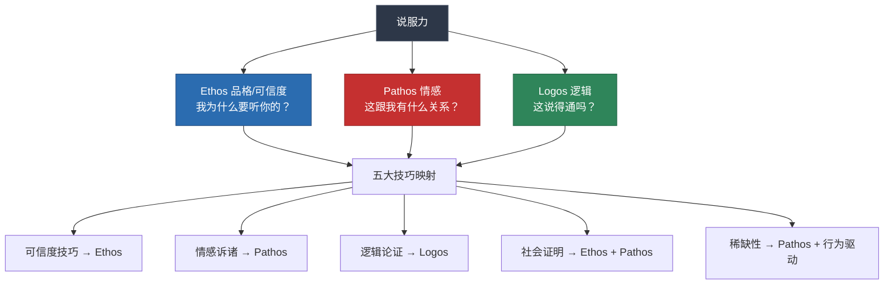
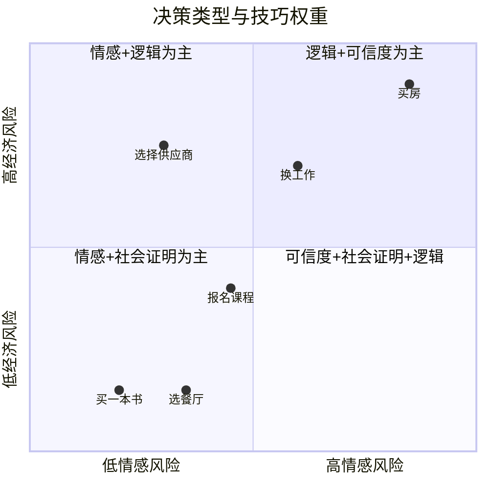
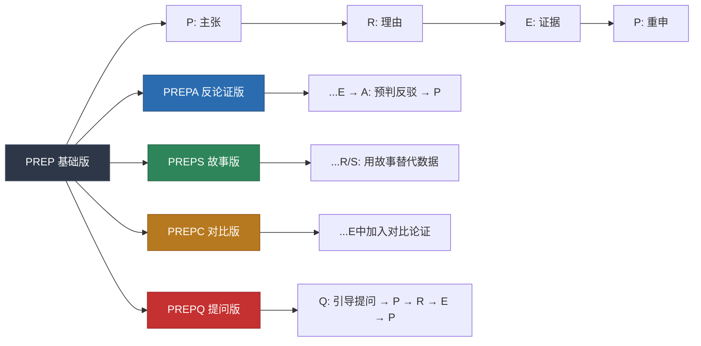
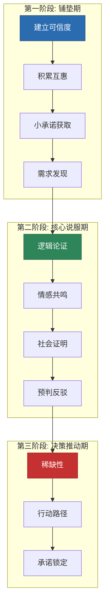

## 六、综合运用：说服技巧的组合与升级

前五节分别拆解了说服的五大核心技巧——可信度、情感、逻辑、社会证明、稀缺性。但如果只掌握单一技巧，就像一个只会用锤子的工匠，面对所有问题都只能敲打。真正的说服高手，懂得在正确的时机、以正确的顺序、用正确的比例组合多种技巧，形成远超单一技巧的合力。

本节是核心技巧的**总装线**——从单一零件到完整武器，从机械套用到灵活组合，从技巧层面到战略层面。读完本节，你将拥有一套完整的说服组合操作系统：知道什么时候该用什么、怎么搭配、怎么切换、怎么升级。

### 6.1 为什么组合比单一技巧更强

#### 6.1.1 单一技巧的天花板

每种说服技巧都有明确的优势和局限：

| 技巧 | 核心优势 | 天然局限 | 容易失效的场景 | 典型失效表现 |
|------|----------|----------|----------------|-------------|
| 可信度 | 建立信任基础 | 需要时间积累，难以速成 | 陌生人、初次接触 | 对方不给你展示可信度的机会 |
| 情感 | 激发行动的最强驱动力 | 情绪消退快，理性反弹 | 高卷入度决策（买房、投资） | 感动完了回去一算账，发现不划算 |
| 逻辑 | 提供理性支撑，经得起审视 | 冷冰冰，缺乏感染力 | 低卷入度决策、感性型受众 | 数据摆了一堆，对方毫无反应 |
| 社会证明 | 利用从众心理降低决策成本 | 同质化严重时失效 | 小众市场、创新产品 | "别人做的不代表适合我" |
| 稀缺性 | 克服拖延，推动即时行动 | 频繁使用导致脱敏 | 受众无价值认知时 | "就剩最后三个了"→"跟我有什么关系" |

单一技巧的说服力存在**边际递减效应**——同样的技巧用第二次，效果只有第一次的40-60%。Cialdini在《影响力》中描述的"熟悉导致轻视"现象（Familiarity Breeds Contempt），本质上就是单一技巧过度使用后的心理免疫。而组合技巧通过不同维度的叠加，突破单一技巧的天花板——就像药物的联合用药方案，多种机制同时作用，不仅效果叠加，还能防止"抗药性"的产生。

#### 6.1.2 亚里士多德三要素的现代诠释

两千多年前，亚里士多德就在《修辞学》中指出说服由三要素构成。这个框架至今仍是理解技巧组合的最佳心智模型：

**关键洞察**：社会证明同时作用于Ethos（别人信任他，所以他也可信）和Pathos（别人都在做，我也不想落后）；稀缺性主要作用于Pathos（害怕失去的情绪），同时也通过价格信号传递Logos（如果供不应求，说明确实有价值）。这种**跨要素的双重作用**正是组合技巧强大之处——某些技巧天生就是"复合型选手"，使用一种技巧就能同时激活多个说服通道。

#### 6.1.3 协同效应的科学基础

认知心理学研究证实，当多种说服路径同时作用时，态度改变的幅度和持久度都显著优于单一路径：

**双通道加工理论的实证支持**：Petty和Cacioppo的ELM模型表明，中心路径（深思论点质量）和外围路径（依赖表面线索）可以同时运作。当受众既被高质量论据（逻辑）打动，又被外围线索（可信度、社会证明）引导时，说服效果最为稳固。这是因为态度改变同时发生在认知层面和直觉层面，不容易被单一反论证推翻。

一个关键的实验证明了这一点：Petty等人（1981）让两组受试者看说服性信息。一组只看到强论据（逻辑通道），另一组同时看到强论据和高可信度信源（逻辑+可信度通道）。结果：后者的观点改变幅度比前者高出37%，且在一周后的回访中，后者的观点保持率高达78%，前者仅为45%。这说明**多通道说服不仅更强，而且更持久**。

**情绪-认知耦合效应**：Damasio的躯体标记假说表明，情绪不是理性的对立面，而是决策的必要组成部分。当情感先行激发兴趣、逻辑随后提供支撑时，大脑的边缘系统（情绪中枢）和前额叶（理性中枢）同时被激活，决策的确定感最高。这就是为什么"先讲故事再给数据"比"先给数据再讲故事"更有效——情绪打开了接收通道，逻辑填充了通道的内容。

**多线索信息整合理论**：Anderson的信息整合理论指出，人在做判断时会将多条线索按权重加权平均。当多条不同类型的线索都指向同一结论时，结论的可信度呈超线性增长——三条独立线索的说服力不是三倍于一条线索，而可能是五到八倍。这解释了为什么"数据+故事+专家证言"的组合远强于三者之一。

**冗余增益效应**（Redundancy Gain）：神经科学研究发现，当同一信息通过不同感官通道（视觉+听觉、数据+故事）同时输入时，大脑的信息处理效率反而提高。这不是简单的重复，而是多通道校验——大脑会将多个独立信号进行交叉验证，信号一致性越高，可信度判定越高。这就是为什么成功的说服者总是"说+写+展示"同时进行：口头讲述数据，PPT展示图表，纸质材料留给受众事后查阅。

### 6.2 场景诊断：在组合之前先判断

在组合技巧之前，你需要先完成三个诊断。错误的诊断会导致错误的技巧组合——就像医生不问诊就开药，效果可能适得其反。

#### 6.2.1 诊断一：受众卷入度判断

ELM模型的核心启示是：**先判断对方的卷入状态，再选择路径**。这是技巧组合的基础。

| 判断维度 | 高卷入特征 | 低卷入特征 | 判断方法 |
|----------|-----------|-----------|----------|
| 主动性 | 主动提问、索取资料 | 被动听讲、心不在焉 | 观察是否主动追问细节 |
| 时间投入 | 愿意花时间了解细节 | 只想快速知道结论 | 给出一个复杂解释，看对方是打断还是耐心听 |
| 信息处理 | 逐条分析论据 | 依赖直觉和印象 | 抛出一个数据，看对方是追问来源还是点头就过 |
| 决策重要性 | 高价、长期、不可逆 | 低价、短期、可逆 | 评估决策对对方的影响程度 |
| 知识储备 | 有相关背景知识 | 对领域陌生 | 用专业术语试探，看对方是否跟得上 |

**高卷入组合策略**：逻辑论证为主轴（30-40%），可信度建立信任基础（20-25%），情感作为催化剂（15-20%），社会证明作为补充证据（15-20%），稀缺性用于推动最终决策（5-10%）。

**低卷入组合策略**：情感和故事开场（30-35%），社会证明激活从众（25-30%），可信度快速建立（15-20%），稀缺性推动行动（10-15%），逻辑作为附录（5-10%，放在受众表现出兴趣之后）。

**中卷入组合策略**（这个常被忽略）：受众介于高低之间时——认真听但不深究——用"故事+逻辑交替"的节奏。先用故事抓住注意力，再用逻辑给出口感，再用故事加深印象。这种波浪式的节奏最能维持中卷入受众的注意力。

**快速判断小技巧**：在说服开始的前2分钟，故意抛出一个稍微复杂的概念或数据。如果对方追问细节、要来源、翻资料——高卷入；如果对方说"嗯，你继续"——低卷入；如果对方点一下头但眼神表示需要消化——中卷入。这个"探测弹"比你事先猜测准确得多。

#### 6.2.2 诊断二：受众决策类型判断

不同的决策类型需要不同的技巧权重：

- **低经济风险+低情感风险**（买一本书、选餐厅）：情感+社会证明为主，快速决策。受众不需要被深度说服，只需要一个"为什么不呢"的理由。
- **低经济风险+高情感风险**（选择人生方向、关系决策）：情感+逻辑为主，需要深度共鸣。钱不是问题，但选错了后悔很久。
- **高经济风险+低情感风险**（采购设备、选供应商）：逻辑+可信度为主，数据驱动。选错了能算出具体损失金额。
- **高经济风险+高情感风险**（买房、换工作、创业）：可信度+社会证明+逻辑，多维度验证。决策周期长，需要反复论证。

**混合型决策的处理**：很多现实决策是混合型的——比如"选择合伙人"，经济风险高、情感风险也高，同时还涉及信任（Ethos）和价值观（Pathos）。对于混合型决策，不要试图同时使用所有技巧，而是**按决策者的优先级排序**：先问自己"这个人做决策时，最在意什么？"然后把对应的技巧放在首位。

#### 6.2.3 诊断三：关系阶段判断

你和受众的关系阶段直接决定了哪些技巧可用、哪些技巧禁用：

| 关系阶段 | 可用技巧 | 禁用/慎用技巧 | 核心策略 | 典型时长 |
|----------|----------|--------------|----------|----------|
| 陌生阶段 | 可信度（社会背书）+ 逻辑 | 情感（太冒进）、稀缺性（太压迫） | 先建立信任，再展示价值 | 首次接触的5-10分钟 |
| 认识阶段 | 可信度 + 社会证明 + 逻辑 | 深度情感诉诸 | 积累一致性，扩大共识 | 2-5次接触 |
| 熟悉阶段 | 全部技巧可用 | 无 | 根据场景灵活组合 | 数周到数月 |
| 信任阶段 | 情感 + 逻辑 + 稀缺性 | 过度可信度建设（画蛇添足） | 直接切入，高效推进 | 已有信任基础 |

**关键原则**：关系越浅，越要倚重Ethos（可信度）和Logos（逻辑）；关系越深，越可以使用Pathos（情感）和稀缺性。跳过关系阶段直接使用深层技巧，是新手最常犯的组合错误。

**关系阶段的"快进"机制**：如果时间紧迫，有没有办法加速关系推进？有——**共同纽带**（Shared Connection）是最有效的加速器。提到共同的朋友、共同的经历、共同的学校或城市，可以在几分钟内将关系从"陌生"推进到"认识"。"张明推荐我来找你的"——这句话比十分钟的自我介绍更有效。

#### 6.2.4 诊断四：受众说服风格判断（进阶）

除了卷入度和关系阶段，还有一个常被忽略的维度——**受众的说服风格偏好**。不同人对不同类型的说服信号敏感度差异极大：

| 说服风格 | 特征表现 | 对什么敏感 | 对什么免疫 | 怎么识别 |
|----------|---------|-----------|-----------|---------|
| 分析型 | 追问数据、要看报告、表情冷静 | 逻辑、对比数据、ROI计算 | 故事、煽情、权威头衔 | 会议中反复问"数据来源是什么" |
| 驱动型 | 关注结果、决策快、不喜欢废话 | 效率提升、竞争优势、行动路径 | 冗长论证、过多细节 | "你就说结果怎样" |
| 表现型 | 喜欢互动、表情丰富、爱分享 | 故事、愿景、情感共鸣、新颖性 | 纯数据、枯燥分析 | 讲到故事时眼睛发亮 |
| 和蔼型 | 需要安全感、看重关系、决策慢 | 社会证明、关系保障、渐进方案 | 高压、突然变化、强硬措辞 | "我再考虑考虑"是口头禅 |

识别方法：在说服前的闲聊中观察5分钟，注意对方最关注什么——是数据、是结果、是故事、还是安全感。或者直接问一个开放性问题："关于这个方案，你最关心的是什么？"对方的回答会直接告诉你他的风格类型。

### 6.3 六种经典组合模式

以下是六种经过验证的技巧组合模式，覆盖最常见的说服场景。每种模式都有明确的适用条件、技巧配比和执行步骤。

#### 6.3.1 模式一：信任奠基型（Ethos-Logos-Pathos）

**适用场景**：初次说服重要对象、向上管理、求职面试、学术答辩、向投资人路演

**核心逻辑**：先让人信你，再让人服你，最后让人动心

**技巧配比**：可信度40% + 逻辑35% + 情感15% + 社会证明10%

**执行步骤**：

1. **可信度开场**（2-3分钟）：用最精炼的语言建立你的专业资质。不是炫耀履历，而是让对方快速回答"我为什么要听你说话"这个问题。

   示范话术："过去三年我负责了公司东南亚市场的开拓，从零做到年营收2400万。在这个过程中，我踩过很多坑，也总结出了一套可复制的方法。今天想跟您分享其中的关键发现。"

   > **可信度开场的三要素**：①具体时间跨度（不是"我有丰富经验"，而是"过去三年"）；②具体成果（不是"取得显著成效"，而是"年营收2400万"）；③承上启下（不是炫耀，而是"因此我有资格谈这个话题"）。

2. **逻辑论证主体**（10-15分钟）：用金字塔结构呈现核心论点。每个论点都有数据支撑和逻辑链条。提前预判2-3个最可能的反对意见，在论证中主动回应。

3. **情感收尾**（2-3分钟）：在逻辑论证的最后，用一个简短的故事或愿景激发情感共鸣。情感在这里的作用不是说服，而是将"道理上说得通"升级为"我也想这么做"。

4. **社会证明点缀**：在论证过程中穿插行业案例、标杆企业做法、权威机构数据，作为逻辑论证的补充证据。

**完整示例——向CEO提案新项目**：

> （可信度开场）"王总，我从2023年开始负责海外业务，两年时间团队从3人扩展到28人，营收做到公司的15%。在这个过程中我发现了一个重要的市场机会。"
>
> （逻辑论证主体）"东南亚市场的B2B SaaS渗透率目前只有12%，但增长率是42%。我们的产品在功能上已经具备竞争力，缺的是本地化和渠道。我建议分三个阶段推进——Q3做产品本地化，Q4建本地渠道，明年Q1正式上线。预计投入800万，18个月回本，第三年贡献3000万营收。"
>
> （社会证明点缀）"同类企业中，Notion进入日本市场时采用了类似的三阶段策略，12个月内实现了日本区营收占全球的8%。"
>
> （情感收尾）"说实话，这是我在公司看到的最大一次增长机会。如果我们现在不进入，等到2027年市场成熟后再进，成本至少翻三倍。我不想让公司错过这个窗口。"

**为什么这个模式有效**：CEO这类高卷入决策者的核心顾虑是"这人靠谱吗？这事儿靠谱吗？"可信度回答第一个问题，逻辑回答第二个问题，情感把"靠谱"升级为"值得做"。

#### 6.3.2 模式二：情感驱动型（Pathos-Ethos-Logos）

**适用场景**：公开演讲、品牌营销、公益倡导、团队动员、众筹推广

**核心逻辑**：先让人感动，再让人信任，最后让人信服

**技巧配比**：情感40% + 可信度25% + 社会证明20% + 逻辑15%

**执行步骤**：

1. **故事开场**（3-5分钟）：用一个具体、真实、有情感张力的故事开场。故事的主角最好是受众能认同的人物，故事的冲突应该映射受众自身的困境。好故事有三个要素：**一个有缺陷的主角**（让人产生认同）、**一个真实可信的困境**（让人感同身受）、**一个转折或洞见**（让人看到可能性）。

2. **可信度背书**（1-2分钟）：在故事引发情感共鸣后，简要建立你的可信度——你为什么有资格谈这个话题。

3. **社会证明扩散**（3-5分钟）：用大量案例证明"不只是故事中的主角，很多人都在经历/解决了这个问题"。社会证明在这里的作用是将个体故事扩展为普遍现象。

4. **逻辑落地**（3-5分钟）：给出具体的路径、方法、数据，让情感驱动的行动意愿有理性的落脚点。

**完整示例——团队变革动员会**：

> （故事开场）"去年我们部门的小李跟我说，他每天花3个小时手动整理报表，周末还要加班。他问我：'我们做的是互联网公司，为什么比传统企业还低效？'这个问题我回答不了。但正是这个问题让我开始思考，我们的工作方式是不是出了问题。"
>
> （可信度背书）"过去两个月，我和核心团队做了深度调研，访谈了37位同事，分析了12个部门的工作流。"
>
> （社会证明扩散）"调研发现，68%的同事认为至少30%的工作时间花在了重复性事务上。不只是我们，McKinsey的报告显示，知识工作者平均45%的时间用于信息收集和协调沟通——这是行业通病，但我们有机会做得比别人好。"
>
> （逻辑落地）"我提出的工作流优化方案，预计能在6个月内将重复性工作减少40%，释放出来的时间用于核心业务创新。方案分三步走……"

**关键技巧——故事的"代入感"设计**：故事主角必须是受众能代入的人——同部门的同事、同行业的从业者、同年龄段的普通人。不要用马云、乔布斯这类"遥远的成功者"，受众会自动将他们归类为"不适用于我"。小李比马云更有说服力，因为受众心里想的是"小李就是我"。

#### 6.3.3 模式三：社会验证型（SP-Ethos-Logos-Scarcity）

**适用场景**：销售说服、产品推广、招生营销、用户增长、社群运营

**核心逻辑**：别人都在做，所以可信，所以有道理，所以你也要快

**技巧配比**：社会证明35% + 可信度25% + 逻辑20% + 稀缺性20%

**执行步骤**：

1. **社会证明开场**：用具体数字和案例展示"很多人已经做出了同样的选择"。优先使用与受众同质的案例（同行业、同规模、同处境）。**关键**：数字要具体——"超过2000家企业"比"很多企业"有效10倍。"其中50家是上市公司"比"包括一些知名企业"更有效。

2. **可信度背书**：展示产品/方案背后的团队、资质、荣誉，增强可信度。这不是炫耀，而是回答"这么多人选了，靠不靠谱？"这个必然出现的疑问。

3. **逻辑论证**：解释"为什么这么多人选择"——不是盲目从众，而是因为产品/方案确实有核心优势。用对比、数据、机制分析支撑论点。

4. **稀缺性推动**：在受众已经被说服的基础上，用稀缺性克服拖延——"如果现在不行动，会失去什么"。

**详细示例——企业级SaaS产品销售**：

> （社会证明开场）"李总，您的行业里目前有327家企业在使用我们的产品，其中包括行业前10中的7家——XX集团、YY科技、ZZ控股。上个月又有14家新客户签约，其中有8家是从竞品迁移过来的。"
>
> （可信度背书）"我们的产品已经运营了6年，服务过超过2000家企业，系统可用率99.97%。去年获得了Gartner 'Cool Vendor'认证，也是国内唯一通过SOC2 Type II认证的同类产品。"
>
> （逻辑论证）"这些企业选择我们的核心原因是三个——部署成本比自建低60%，数据处理速度快3倍，API对接平均只需2周。这是我们的技术架构图和竞品对比……"
>
> （稀缺性推动）"现在签约的话，年度企业版还有最后8个名额享受7折优惠，下个月开始恢复原价。另外，这个季度签约可以免费获得为期3个月的专属客户成功经理服务。"

**社会证明的"同质性"原则**：社会证明的效果与案例的"同质性"成正比。受众心里的潜台词是"跟我差不多的人做了这个选择"——越"差不多"，说服力越强。对中小企业主说"阿里巴巴也在用"效果远不如"跟你同行业的XX公司用了之后效率提升了30%"。

#### 6.3.4 模式四：逻辑碾压型（Logos-SP-Ethos-Scarcity）

**适用场景**：技术方案评审、投资决策、招标答辩、法律论证、学术评审、政府汇报

**核心逻辑**：用严密的逻辑链和数据碾压一切质疑

**技巧配比**：逻辑45% + 社会证明25% + 可信度20% + 稀缺性10%

这种模式的核心是**数据密度和推理严密性**。受众是高卷入度的决策者，他们不会被故事打动，只会被数据说服。

**执行要点**：

1. **数据先行**：每个论点都有至少两个独立数据源支撑。用对比论证（"方案A vs 方案B"）让数据产生冲击力。**数据的"三重验证"原则**：核心数据至少有三个独立来源互相印证——内部数据、第三方报告、行业基准。当三个来源都指向同一结论时，数据的可信度指数级增长。

2. **预判反驳**：在论证中主动回应最可能的3个反对意见，而不是等对方提出。这展示了你思考的全面性。**预判的技巧**：站在反对者立场思考——"如果我要否决这个方案，我会从哪个角度攻击？"然后在论述中主动封堵。

3. **案例佐证**：用同行/竞品的实施数据证明方案的可行性。"X公司用了类似方案，效果是Y"比"我们的方案理论上能达到Y"更有说服力。

4. **可信度收尾**：在逻辑论证完成后，简要展示团队资质和过往成功案例，给决策者一个"选你不会错"的安心感。

5. **稀缺性点缀**：如果存在真实的资源或时间约束，简要提及。但如果不存在，不要硬造——在这种场景中，虚假稀缺的代价极高（专业决策者一眼就能看穿）。

**完整示例——技术方案选型评审**：

> （数据先行）"根据我们对三个候选方案的POC测试结果：方案A的处理延迟中位数是23ms，P99是89ms；方案B是15ms和42ms；方案C是31ms和156ms。在10万QPS压力测试下，方案B的CPU利用率保持在62%，其他两个都超过了85%。"
>
> （社会证明）"方案B的技术栈在字节跳动、快手、B站都有大规模生产环境部署。我们联系到了字节的基础架构团队，他们分享了在50万QPS场景下的调优经验。"
>
> （预判反驳）"我知道大家会担心方案B的学习成本。但我们做了团队技能评估——目前12个后端开发中，有7个有Go语言经验，迁移成本可控。附上详细的培训计划和时间表。"
>
> （可信度收尾）"我们的基础设施团队过去三年成功完成了4次技术栈迁移，零重大事故。这是每次迁移的复盘报告。"

#### 6.3.5 模式五：关系渗透型（Ethos-Likability-Consistency）

**适用场景**：长期客户关系、跨部门协作、社区运营、人脉建设、合作伙伴关系

**核心逻辑**：不追求一次说服，而是通过持续的价值输出和一致性积累，让说服成为水到渠成的结果

**技巧配比**：可信度35% + 情感/喜好30% + 承诺一致性25% + 社会证明10%

这种模式不追求单次说服的"爆发力"，而是追求长期关系的"渗透力"。核心策略是**登门槛效应**（Foot-in-the-Door）——从小请求开始，逐步升级。

**执行步骤**：

1. **价值先行**：在提出任何请求之前，先无条件提供价值——分享有用信息、帮忙解决小问题、引荐有用的人脉。这建立了互惠基础和好感。**关键**：价值要具体、可感知——"我帮你看了代码里那个并发bug，是锁的粒度太大导致的，改成行级锁就好了"比"有什么需要帮忙的尽管说"有效100倍。

2. **小承诺启动**：提出一个微小的、对方几乎不会拒绝的请求。"能不能帮我看一下这份报告的前两页？"对方同意后，一致性心理开始运作——人会倾向于保持与之前行为一致的态度。

3. **逐步升级**：在小承诺的基础上，逐步提出更大的请求。每次请求的升级幅度不要超过前一次的50%。过快的升级会让对方产生"得寸进尺"的警觉，破坏已建立的信任。

4. **社会证明嵌入**：在关系发展过程中，自然地提及"张总他们团队也在用这个方案"，利用同伴影响力降低决策阻力。

**完整示例——跨部门推动技术方案**：

> 第1周：主动帮目标部门解决了一个技术问题，建立了好感。
> 第2周：分享了一篇行业报告，附上简要分析："看到这篇想到你们部门的XX项目，里面有些数据可能有用。"
> 第3周：提出小请求："能不能借你们的测试环境跑个demo？大概10分钟。"
> 第4周：展示demo结果，对方主动问"这个方案能不能用在我们的项目上？"
> 第5周：正式提案，此时对方已经是"自己人"，说服阻力极低。

**关系渗透的时间成本计算**：有人可能觉得5周太慢。但对比一下：如果你在第1周就直接提案，成功率可能只有10-15%；用5周的关系渗透法，成功率可以提升到60-70%。这不是慢——这是用时间换确定性。

#### 6.3.6 模式六：危机逆转型（Pathos-Logos-Ethos）

**适用场景**：信任崩塌后的修复、危机公关、投诉处理、关系挽回、品牌修复

**核心逻辑**：先止血（情感），再缝合（逻辑），最后重建（可信度）

**技巧配比**：情感40% + 逻辑35% + 可信度25%

**执行步骤**：

1. **情感先行——共情与道歉**（最关键的一步）：不解释、不辩解、不推卸。先完整地承认对方的感受和损失。"我完全理解你的愤怒，如果我是你，我也会非常失望。"

   **共情的三个层次**：
   - 表层共情（弱）："我理解你的感受"——空洞，对方感受不到诚意
   - 中层共情（中）："我理解你的感受，因为XX确实给你带来了XX损失"——具体化
   - 深层共情（强）："如果我是你，在XX的情况下遇到XX问题，我会比你更愤怒。你已经非常克制了"——换位+肯定对方的合理性

2. **逻辑展开——原因分析与改进方案**：在情绪被接住后，用逻辑解释发生了什么、为什么发生、如何防止再次发生。改进方案必须具体、可验证、有时间表。**关键**：不要在情绪未平复时就开始解释——对方还在愤怒中，你的任何解释都会被解读为"找借口"。

3. **可信度重建——行动证明**：承诺的改进必须被第三方可验证地执行。"我们会在下周三之前完成系统升级，届时我会发给你完整的测试报告。"之后，**超额交付**——不只做到承诺的，还要做到比承诺的更多。可信度的重建需要的不是言语，而是行动的累积。

**完整示例——客户投诉处理**：

> （情感先行）"张总，首先我要真诚地向您道歉。您把这么重要的项目交给我们，结果在关键节点出了问题，给您的团队增加了额外的工作量，也影响了您的进度。我完全理解您的不满——这不是我们应有的服务水平。"
>
> （逻辑展开）"我们的技术团队做了完整的复盘。问题的根因是数据库连接池配置不当，在并发峰值时连接耗尽导致超时。这是我们的技术失误，不应该在生产环境出现。我们已经完成了三件事：①修复了连接池配置，②增加了连接池监控告警，③建立了并发压测的自动化流程。"
>
> （可信度重建）"作为补偿和保证：第一，本月服务费全额减免；第二，我们安排了专属技术工程师7×24小时值班一个月；第三，我下周一会亲自到您公司，当面向您的技术团队汇报改进方案。"

### 6.4 PREP说服框架：万能说服结构

当面对一个不确定用哪种组合模式的场景时，PREP框架是最安全的万能选择。它将多种技巧整合为一个线性流程，降低了组合的认知负担。

#### 6.4.1 PREP四步详解

- **P - Point（主张）**：开门见山亮出核心观点。一句话说清楚你要对方做什么或相信什么。不要铺垫，不要迂回——受众的注意力是最稀缺的资源。

  示范："我建议公司在今年Q3启动东南亚市场拓展计划。"

- **R - Reason（理由）**：给出2-3个支撑主张的核心理由。每个理由用一句话概括，再用一句话解释。理由之间应该有逻辑递进关系（时间顺序、重要性顺序、因果关系）。

  示范："理由有三个。第一，市场窗口期——东南亚B2B SaaS渗透率只有12%，但增长率42%，现在进入成本最低。第二，竞争格局——目前头部玩家尚未建立壁垒，我们有6-12个月的先发窗口。第三，能力匹配——我们的产品和技术团队已经具备出海的基础条件。"

- **E - Evidence（证据）**：用数据、案例、故事来强化理由。这是社会证明、可信度和情感技巧的综合运用区。

  示范："数据上，Gartner预测东南亚SaaS市场2027年达到280亿美元。案例上，Notion进入日本市场12个月就做到全球营收的8%。我们自己的小规模测试也验证了需求——上个月在印尼做的MVP测试，3周内获得了47个企业客户注册。"

- **P - Point（重申）**：再次强调核心主张，并给出明确的下一步行动。

  示范："所以，我建议在Q3启动东南亚拓展计划。具体来说，需要在本月底前完成团队组建，下个月启动产品本地化。王总，您觉得这个时间节点是否可行？"

**PREP的底层逻辑**：PREP之所以万能，是因为它天然地整合了多种说服技巧——主张（明确性让人感到专业→可信度），理由（逻辑论证），证据（社会证明+数据），重申（情感推动+行动导向）。一个结构良好的PREP本身就包含了Ethos、Logos和Pathos。

#### 6.4.2 PREP的变体与升级

**PREP+反论证（PREPA）**：在Evidence和Point之间加入Anticipation（预判反驳），主动回应最可能的反对意见。适用于受众有明确顾虑的场景。

**PREP+故事（PREPS）**：将Reason或Evidence替换为一个完整的故事，适合低卷入度受众。故事比数据更有感染力。

**PREP+对比（PREPC）**：在Evidence中加入对比论证——"用方案A vs 用方案B"，"现在行动 vs 不行动"。对比让论点的冲击力倍增。

**PREP+提问（PREPQ）**：在Point之前加入Question（提问），通过引导式提问让受众自己发现需求，然后再给出主张。这是弹性说服与PREP的结合。

#### 6.4.3 PREP的时间分配建议

| 场景 | 总时长 | P(主张) | R(理由) | E(证据) | P(重申) |
|------|--------|---------|---------|---------|---------|
| 电梯演讲 | 30秒 | 5秒 | 10秒 | 10秒 | 5秒 |
| 会议发言 | 3分钟 | 15秒 | 60秒 | 90秒 | 15秒 |
| 正式提案 | 15分钟 | 1分钟 | 4分钟 | 8分钟 | 2分钟 |
| 书面报告 | 3页 | 1段 | 1页 | 1.5页 | 0.5页 |

**时间分配的黄金比例**：证据（E）永远是最长的部分——它承载了说服力的核心。主张（P）永远是最短的——它只需要让受众知道"你要说什么"。

### 6.5 蒙洛迪诺的弹性说服：让对方自己说服自己

物理学家兼作家Leonard Mlodinow在《弹性》（Elastic）中提出了一个反直觉的说服理念：**最有效的说服不是灌输答案，而是引导对方自己得出结论**。

#### 6.5.1 为什么引导比灌输更有效

心理学中有一个概念叫**生成效应**（Generation Effect）：人们对"自己想出来的"信息的记忆和接受度，远高于"被告知的"信息。当受众自己得出结论时，他们会把这个结论当成自己的想法来捍卫，而不是当成别人的观点来质疑。

哈佛商学院的一项实验显示：当销售人员直接告诉客户"这个产品最适合你"时，客户的购买意愿评分为5.2/10；当销售人员通过提问引导客户自己得出"这个产品最适合我"的结论时，购买意愿评分上升到7.8/10。同样的结论，不同的"来源感"，效果差距高达50%。

更关键的是**持久性差异**：直接灌输的说服效果在3天后衰减45%，而引导式说服的效果在3天后只衰减12%。因为"自己想到的结论"会被纳入自我认知体系，而"被告知的结论"只存在于外部记忆中。

#### 6.5.2 弹性说服的四种核心技术

**技术一：用问题代替陈述**

| 灌输式（弱） | 引导式（强） | 为什么引导更强 |
|-------------|-------------|---------------|
| "你的方案有三个致命缺陷" | "如果竞争对手用X策略反击，你的方案如何应对？" | 前者触发防御，后者激发思考 |
| "你应该用我们的产品" | "你目前在XX环节的效率大概是多少？你理想的目标是多少？" | 前者是推销，后者是帮对方算账 |
| "这个方案风险很大" | "如果市场在下半年回调20%，你有没有Plan B？" | 前者是否定，后者是预防 |

引导式问题的设计原则：问题要指向你希望对方关注的点，但不要暗示答案。让对方在回答过程中自己发现你希望他们看到的东西。同时，问题要具体——"你觉得这个方案怎么样？"是无效的开放问题；"如果用这个方案，你的团队能在Q3之前完成部署吗？"是有效的引导问题。

**技术二：让对方填充细节**

当你说"我们的方案能帮你节省30%的成本"，对方的反应是质疑。但当你说"你目前每个月在XX环节的成本大概是多少？"对方算出数字后，你说"如果这个数字能减少三分之一呢？"——同样的结论，对方的接受度完全不同。

这是因为**心理所有权效应**（Psychological Ownership）：当一个数字或结论是对方自己算出来的，他会对这个结论产生"拥有感"，而人天然不愿意放弃自己"拥有"的东西。

**技术三：创造认知空白**

认知空白是指受众意识到"我知道的不够"的状态。当人处于认知空白时，会主动寻求信息来填补空白，这时候你的信息就从"被推销"变成了"被渴求"。

创造认知空白的方式：
- "你知道你们的竞品上个月做了什么吗？"——暗示有你不知道的重要信息
- "我做了一个分析，结果让我自己都吃了一惊"——暗示有意外发现
- "大部分公司在这个阶段都会犯一个错误"——暗示可能有盲区
- "你有没有想过，为什么你的XX指标一直上不去？"——暗示有被忽略的根因

**认知空白的边界**：不要制造虚假的恐慌——"你知道你的系统其实有严重安全漏洞吗？"如果没有漏洞，这种手段会立刻摧毁你的可信度。认知空白必须建立在真实信息的基础上——你确实有有价值的信息，只是用问题激发对方的好奇心。

**技术四：苏格拉底式追问**

苏格拉底从不直接告诉学生答案，而是通过一系列精心设计的问题，引导学生自己推理出结论。在说服中，这种方法同样强大：

1. "你觉得目前最大的挑战是什么？"（确认痛点）
2. "这个挑战如果不解决，一年后会怎样？"（放大后果）
3. "你试过哪些方法？效果如何？"（排除已有方案）
4. "如果有一种方法能在X时间内解决这个问题，你愿意花多少时间了解？"（锚定兴趣）

当对方在第4步给出肯定回答时，你的说服已经完成了一半——因为对方主动表达了"想要解决方案"的意愿。此时你再介绍方案，就不是"推销"而是"响应需求"。

**苏格拉底式追问的注意事项**：不要连续问太多问题——超过4个就变成了"审讯"。最佳节奏是"问-听-确认-再问"。每个问题后给对方充分的回答时间，并用自己的话复述对方的回答（"所以你的意思是……"），让对方感到被理解。

#### 6.5.3 弹性说服与传统说服的配合

弹性说服不是要取代传统说服技巧，而是要和它们配合使用。在实际操作中：

- **前期用弹性说服建立需求**：通过提问和引导，让受众自己发现痛点和需求
- **中期用逻辑和可信度提供方案**：在受众已经"想要"之后，用高质量的论据提供解决方案
- **后期用稀缺性推动行动**：在受众已经"认同"之后，用稀缺性克服拖延

这个顺序遵循的是**需求创造→方案供给→行动推动**的三阶段模型，比直接"一上来就推销"的效果强出数倍。

### 6.6 情境化技巧组合矩阵

不同的场景需要不同的技巧配比。以下矩阵将六大核心技巧与八大高频场景进行交叉，给出每个场景的最优组合建议。

| 场景 | 主技巧(40%+) | 辅技巧(20-30%) | 点缀技巧(10-15%) | 关键顺序 | 核心陷阱 |
|------|-------------|---------------|------------------|----------|---------|
| 销售说服 | 社会证明 | 稀缺性+可信度 | 情感+逻辑 | 社会证明→可信度→逻辑→稀缺性 | 稀缺性造假导致信任崩塌 |
| 向上管理 | 逻辑论证 | 可信度 | 社会证明+稀缺性 | 可信度→逻辑→社会证明→稀缺性 | 数据不扎实被当场质疑 |
| 团队影响 | 情感+可信度 | 社会证明 | 逻辑 | 情感→可信度→社会证明→逻辑 | 只打鸡血不给方法 |
| 客户谈判 | 逻辑+稀缺性 | 可信度 | 情感 | 可信度→逻辑→稀缺性→情感 | 谈判中过早让步 |
| 公开演讲 | 情感 | 社会证明+逻辑 | 可信度 | 情感→社会证明→逻辑→可信度 | 故事太长，逻辑太短 |
| 社交媒体 | 社会证明+情感 | 稀缺性 | 可信度 | 情感→社会证明→稀缺性 | 过度营销导致取关 |
| 日常说服 | 情感+喜好 | 逻辑 | 社会证明 | 情感→逻辑→社会证明 | 太过正式引起反感 |
| 危机修复 | 情感(共情) | 逻辑 | 可信度 | 情感→逻辑→可信度 | 共情不够就急着解释 |

**矩阵使用方法**：

1. 确定你面对的场景类型
2. 查找对应的技巧配比
3. 按照"关键顺序"排列技巧
4. 根据具体受众特征微调比例——理性型受众上调逻辑权重，感性型受众上调情感权重
5. 留意"核心陷阱"——每个场景都有最常犯的错误，提前防范

#### 6.6.1 混合场景的处理策略

现实中的说服场景往往不是纯粹的某一种类型。比如"在客户谈判中推动团队变革"——既是客户谈判，又涉及团队影响。处理混合场景的方法：

1. **确定主场景**：哪一种场景的权重更大，就以哪种模式为主
2. **叠加辅助场景的关键技巧**：从次要场景中提取1-2个关键技巧，融入主模式
3. **注意技巧之间的冲突**：比如"逻辑碾压型"和"情感驱动型"的技巧配比是矛盾的，不能简单叠加

### 6.7 多阶段说服的技巧编排

复杂的说服往往不是一次对话就能完成的。当说服需要跨越多个阶段（多次会议、多天、甚至数月）时，技巧的编排就从"空间组合"升级为"时间编排"。

#### 6.7.1 三阶段说服编排模型

**第一阶段：铺垫期（占总时长的40-50%）**

目标不是说服，而是为说服创造条件。核心任务是建立可信度、发现对方的真实需求和顾虑、通过互惠和小承诺建立正向关系惯性。

可用技巧：可信度建设、互惠（给予价值）、倾听（发现需求）、小承诺获取（一致性）

禁用技巧：稀缺性（太早）、深度情感诉诸（关系不够）

**具体操作清单**：
- 第1次接触：自我介绍+无条件价值输出（分享有用信息、帮助解决小问题）
- 第2次接触：深入对方的需求和痛点，用提问引导对方表达
- 第3次接触：提供小规模的方案预览或概念验证，获取反馈
- 第4次接触：根据反馈调整方案，获取对方的"小承诺"（比如同意看正式提案）

**第二阶段：核心说服期（占总时长的30-40%）**

目标是改变受众的态度——从"不感兴趣"到"觉得有道理"。这是逻辑、情感和社会证明集中发力的阶段。

可用技巧：逻辑论证、情感诉诸、社会证明、弹性说服（引导式提问）

技巧顺序：先逻辑（建立理性框架）→ 再情感（激发行动意愿）→ 后社会证明（消除残余疑虑）

**第三阶段：决策推动期（占总时长的10-20%）**

目标是将态度改变转化为行为——从"觉得有道理"到"做出决定"。这是稀缺性和行动路径发挥作用的阶段。

可用技巧：稀缺性、行动路径设计、承诺锁定

关键原则：不要在第三阶段引入新的论点或信息。任何新信息都会让受众重新进入"评估模式"，推迟决策。这个原则叫做**决策窗口保护**——一旦受众进入决策窗口，你的任务是帮他"过马路"，不是给他一张新地图。

#### 6.7.2 说服节奏的控制

说服不是匀速进行的。高手懂得在不同阶段控制节奏：

**慢-快-慢节奏**：铺垫期要慢（耐心建立关系和需求），核心说服期可以快（信息密度高，节奏紧凑），决策推动期要慢（给受众决策的安全感，不要催促）。

**关键节点的"加速器"**：在受众出现以下信号时，可以切换到决策推动：
- 主动询问价格、时间、下一步（"这个多少钱？""什么时候能开始？"）
- 开始讨论细节和执行（"谁来负责这个？""需要多久完成？"）
- 表达认同但犹豫（"道理我都懂，就是……"）
- 向你索要书面材料或合同模板
- 向第三方提及你的方案

**遇到阻力时的"减速器"**：当受众出现以下信号时，退回上一阶段：
- 提出质疑和反对意见（回到逻辑论证层，回应质疑）
- 情绪波动（回到情感层，先处理情绪）
- 沉默或回避（退回铺垫期，重新建立需求认知）
- 开始比较其他方案（补充社会证明和差异化论证）
- 说"我需要和XX商量"（理解决策链，找到真正的决策者）

#### 6.7.3 跨多次会议的技巧编排

当说服需要跨越多次会议时，每次会议的目标和技巧配比应该不同：

| 会议轮次 | 核心目标 | 主要技巧 | 避免行为 |
|---------|---------|---------|---------|
| 第1次 | 建立信任，了解需求 | 可信度+提问 | 不要急着给方案 |
| 第2次 | 展示能力，建立信心 | 逻辑+案例 | 不要施压做决定 |
| 第3次 | 正式提案，打动决策 | 全技巧组合 | 不要忽略反对意见 |
| 第4次 | 处理异议，推动决策 | 稀缺性+行动路径 | 不要引入新信息 |
| 第5次 | 敲定细节，锁定承诺 | 逻辑+一致性 | 不要临门加价 |

**会议间的信息管理**：每次会议结束后，发送一封总结邮件，确认双方共识、行动项和时间节点。这不仅是专业性的体现，更是利用**承诺一致性**——对方收到邮件后没有反对，就等于默认了邮件中的内容。

### 6.8 技巧组合的进阶策略

#### 6.8.1 对比框架：制造"显而易见"的选择

不要让受众在"你的方案"和"什么都不做"之间选择，而要在"你的方案"和"一个明显更差的替代方案"之间选择。这就是**诱饵效应**（Decoy Effect）的实际应用。

示范：向领导争取预算时，不要只呈现"投入500万做项目A"，而是呈现三个选项：
- 选项A：投入500万，全面启动，预计回报率180%（你推荐的方案）
- 选项B：投入200万，只做基础版，预计回报率60%（合理的替代方案）
- 选项C：不投入，维持现状，预计市场份额每年下降5%（不做后果）

选项B是"诱饵"——它的存在让选项A看起来性价比最高。选项C则用损失框架（损失厌恶）强化紧迫感。

**对比框架的使用原则**：
- 三个选项必须都是"合理选项"——不能把选项B设计得明显荒谬，否则受众会怀疑你的诚意
- 选项A的优势必须是"自然而然"的，不需要你特别强调
- 让受众自己比较后得出"A最好"的结论，而不是你替他下结论

#### 6.8.2 锚定效应在组合中的运用

**先给出一个高锚点**，再给出你真正想推动的方案。高锚点会让方案看起来更合理。

示范：薪资谈判中，先说"这个岗位市场上的薪资范围是35-50万"（锚点），然后说"基于我的经验和能力，我期望38万"——38万在35-50万的锚定区间内显得合理且克制。

示范：项目预算中，先说"如果找外部咨询公司做这个项目，报价大概在800万"（锚点），然后说"如果我们内部做，只需要300万预算"——300万立刻显得极具性价比。

**双锚策略**（进阶技巧）：同时设置上下两个锚点。"行业头部企业的方案报价在600-800万（上锚），低端方案在50-80万（下锚），我们的方案在200万，兼顾了专业性和成本可控性"——200万在两个锚点之间显得"恰到好处"。

#### 6.8.3 损失框架与收益框架的切换

同一事实，用损失框架和收益框架表述，说服效果截然不同：

| 收益框架（弱） | 损失框架（强） | 心理机制 |
|---------------|---------------|---------|
| "用我们的方案可以提升30%效率" | "不用我们的方案，你每个月浪费的成本是XX万" | 损失厌恶：失去的痛苦是获得快乐的2倍 |
| "加入会员可以享受8折优惠" | "非会员需要支付全价，每年多花XX元" | 消费者更在意"多花的"而非"省下的" |
| "投资这个项目预计回报率150%" | "如果不投资，这个市场窗口关闭后，再进入成本至少翻三倍" | 机会成本比预期收益更有冲击力 |
| "学习这个技能可以拓展职业选择" | "不学这个技能，3年后你的岗位可能被AI替代" | 生存恐惧比发展欲望驱动力更强 |

**使用原则**：损失框架适用于推动决策（第三阶段），收益框架适用于建立认知（第一、二阶段）。过早使用损失框架会让受众产生防御心理。同时，损失框架不能过度使用——连续使用3次以上会产生"恐慌疲劳"，反而降低说服力。

**收益-损失的"三明治"结构**：收益→损失→收益。先用收益框架建立积极期待，再用损失框架制造紧迫感，最后用收益框架给对方一个"不用失去任何东西"的安全感。"这个方案能帮你提升30%效率（收益），如果不做，每个月浪费XX万（损失），做了之后你还能额外获得XX（收益）"。

#### 6.8.4 信息投放的节奏控制

不要一次性把所有论据和信息都倒出来。信息投放的节奏本身就是说服策略的一部分：

**递进式投放**：先给出最有力的论据，引发兴趣后逐步展开细节。每个新信息都是对前一个信息的"补强"。好比下棋——先出"王后"（最强论据），再出"车马"（支撑论据），最后出"兵"（细节补充）。

**间隔式投放**：如果需要多次沟通，每次沟通只解决一个核心问题。间隔2-3天，给受众消化和发酵的时间。心理学研究表明，间隔学习（Spaced Learning）的效果优于集中学习——说服也是一样，分次说服比一次性倾倒所有论据更有效。

**按需式投放**：准备10个论据，但只在受众表现出特定需求时才投放对应的论据。这需要你在说服过程中保持敏锐的观察力——受众的眼神、提问、肢体语言都在告诉你"我在意什么"。

**信息投放的"7±2"法则**：认知心理学研究发现，人的工作记忆一次只能处理7±2个信息块（Miller's Law）。所以，单次说服中的核心信息不要超过5个——3个最佳。如果你有更多论据，按优先级分批次投放，而不是一次性全部倾倒。

### 6.9 跨文化说服的组合调整

在不同文化背景下，说服技巧的配比和顺序需要调整。忽略文化差异是跨国团队、国际业务中最常见的说服失败原因。

#### 6.9.1 高语境文化 vs 低语境文化

| 维度 | 高语境文化（中日韩、中东、拉美） | 低语境文化（美英德、北欧） |
|------|------|------|
| 关系优先级 | 先建立关系，再谈事情 | 先谈事情，关系随合作自然建立 |
| 可信度来源 | 人际关系、资历、推荐人 | 专业资质、数据、案例 |
| 情感表达 | 含蓄、暗示、留面子 | 直接、明确、不绕弯 |
| 最佳开场 | 寒暄、共同纽带、互惠 | 开门见山、亮出核心价值 |
| 稀缺性运用 | 慎用——可能被视为施压 | 可以直接使用 |
| 决策速度 | 慢——需要多轮沟通和共识 | 快——关键决策者拍板即可 |

#### 6.9.2 集体主义 vs 个人主义

在集体主义文化中，**社会证明**的说服力远高于个人主义文化。"大家都在用"在中国和日本比在美国更有效——因为集体主义文化中的人更依赖群体决策线索。

在个人主义文化中，**独特性和自主选择**反而是更强的说服信号。"专为你定制""不是大众选择，而是精选方案"比"千万人的选择"更能打动美国受众。

#### 6.9.3 实操建议

面对不同文化背景的受众时，记住三原则：
1. **先观察，再行动**——观察对方的沟通风格和决策习惯，不要用自己习惯的方式强推
2. **找到"文化桥梁"**——找一个了解双方文化的人帮你做中间人，他能告诉你"在这种场合下什么合适、什么不合适"
3. **对文化差异保持敏感，但不要刻板化**——文化倾向是概率性的，不是决定性的。同一种文化中的个体差异也很大

### 6.10 数字时代的说服组合

数字环境（微信、邮件、社交媒体、视频会议）改变了说服的物理条件，技巧组合需要相应调整。

#### 6.10.1 数字环境对说服的影响

| 维度 | 线下说服 | 数字说服 | 调整策略 |
|------|---------|---------|---------|
| 注意力 | 30-60分钟 | 30秒-3分钟 | 核心信息前置，删掉所有铺垫 |
| 情感传递 | 丰富（表情、语气、肢体） | 有限（文字、emoji、语音） | 用故事和案例替代直接情感表达 |
| 互动性 | 实时反馈，即时调整 | 异步沟通，难以即时调整 | 预判可能的问题，一次性提供完整信息 |
| 社会证明 | 面对面的从众压力 | 线上的数据和评价 | 数字（具体数字+截图+链接）比描述更有效 |
| 可信度 | 面对面的信任感 | 屏幕背后的不确定性 | 第三方背书、认证标识、客户证言视频 |

#### 6.10.2 微信/消息场景的说服技巧

在微信等即时消息工具中说服人，遵循"**30字法则**"——核心信息在30个字以内说清楚。超过30字的消息，阅读完成率下降50%。

**微信说服的结构**：
1. 第一句：核心主张（≤30字）
2. 第二句：最有力的一个理由
3. 第三句：行动指引（"方便的话我们明天下午3点聊15分钟？"）
4. 附件/链接：详细资料（只在对方表现出兴趣后发送）

**避免的错误**：发送超长的语音消息（对方可能不会听完）、一次性发送5条以上的消息（信息轰炸感）、深夜发送重要的说服信息（情绪状态不对）。

#### 6.10.3 邮件场景的说服技巧

邮件是半正式的说服场景，核心挑战是"被忽略"——普通商务邮件的打开率只有20-25%。

**提高打开率**：标题包含对方的名字或公司名，包含具体数字或时间节点，不超过8个字。"关于Q3东南亚计划的3个关键数据"比"关于拓展东南亚市场的建议方案"更有效。

**邮件说服的PREP结构**：
- 第一段：核心主张（3句话以内）
- 第二段：关键数据和案例（用项目符号列出，不要用长段落）
- 第三段：明确的行动请求和时间节点
- 附件：详细方案（只放关键信息，不要发50页PPT）

#### 6.10.4 视频会议场景的说服技巧

视频会议是介于线下和纯数字之间的混合场景。关键调整：

- **画面说服力**：背景整洁、灯光充足、镜头平视——这些"表面功夫"会直接影响可信度判断
- **前3分钟定胜负**：视频会议的注意力衰减比线下更快，核心信息必须在前3分钟内传递
- **善用屏幕共享**：数据和图表通过屏幕共享展示，比口头描述有效3倍
- **互动频率加倍**：每3-5分钟抛出一个问题或投票，维持参与者的注意力

### 6.11 组合技巧的常见误区

#### 误区一：技巧堆砌，缺乏主次

**错误表现**：在一个3分钟的汇报中，试图同时运用所有五种技巧，结果每种都浅尝辄止，没有一种深入人心。

**纠正**：每个说服场景最多主打2种技巧，辅助1-2种技巧。宁可把一种技巧用到极致，也不要五种技巧各用20%。记住：**深度胜过广度**——受众记住的是"那个数据让我印象深刻"，不是"他用了五种说服技巧"。

#### 误区二：忽略技巧之间的冲突

**错误表现**：在同一个论证中，前半段用情感故事打动受众，后半段突然切换到冷冰冰的数据分析，导致情感冷却。

**纠正**：技巧之间的切换需要过渡。从情感过渡到逻辑时，用一句话做桥接——"正因为这个故事让我深受触动，我开始去查数据，结果发现……"。好的过渡是隐形的——受众感觉不到你在"切换技巧"，只觉得你的论证自然流畅。

#### 误区三：对所有受众用同一套组合

**错误表现**：对理性型领导和感性型领导用同一套话术和技巧组合。

**纠正**：快速判断受众类型。理性型受众（关注数据、追问细节、表情冷静）：上调逻辑和可信度权重。感性型受众（关注故事、表情丰富、容易共鸣）：上调情感和社会证明权重。最简单的方法：回顾上次跟这个人沟通时，什么东西引起了他的反应——是数据还是故事？是案例还是愿景？

#### 误区四：在错误的阶段使用稀缺性

**错误表现**：在受众还没有任何价值认知时就用稀缺性施压。

**纠正**：稀缺性是"最后一公里"的催化剂，不是开场白。严格遵守"先价值认知，后行动推动"的顺序。如果受众还没有问"多少钱""怎么报名""什么时候开始"这类问题，说明价值认知尚未建立，此时使用稀缺性只会引起反感。**稀缺性的"绿灯信号"**：受众开始主动讨论时间、资源、下一步行动时，才是使用稀缺性的正确时机。

#### 误区五：组合过于复杂，受众无法跟随

**错误表现**：在一个10分钟的汇报中穿插了7个不同的案例、5组数据、3个故事，信息密度过高。

**纠正**：说服不是信息量的竞争，而是影响力的竞争。一个打动人心的故事胜过十个平庸的数据点。做减法比做加法更重要——删掉所有"有也不错但没有也不影响"的内容。**终极检验标准**：如果你的论证中有一个核心论点被删掉，论证是否还成立？如果不成立，保留；如果成立，删除。

#### 误区六：忽略反驳的"后续管理"

**错误表现**：成功回应了一个反对意见后就继续推进，但受众心里其实还在纠结。

**纠正**：回应反驳后，观察受众的微表情和反应。如果对方皱眉、交叉双臂、沉默——说明没有被真正说服，需要追问："我刚才的解释是否回答了你的顾虑？还是你还有其他方面需要讨论？"不要假设回应就等于说服。

#### 误区七：只准备"攻"，不准备"守"

**错误表现**：精心准备了自己的论证和技巧，但没有准备如何应对对方的反击。

**纠正**：准备说服方案时，花50%的时间准备"攻"（你的论证），花50%的时间准备"守"（预判对方的反对意见和应对策略）。如果可能的话，找一个信任的人做"魔鬼代言人"——让他扮演反对者，帮你发现论证的薄弱环节。

### 6.12 说服的伦理边界

掌握强大的说服技巧组合，也需要明确伦理边界。技巧越强大，滥用的后果越严重。

#### 6.12.1 四条伦理准则

1. **正当使用**：帮助他人做出对他们有利的决定。说服的目的是创造双赢——你的主张实现，对方的利益也得到满足或至少不受损害。

2. **避免操纵**：不利用信息不对称或情感弱点来损害他人利益。操纵和说服的区别在于：说服是让对方看到更好的选择，操纵是让对方看不到真实的选择。

3. **尊重自主权**：即使你认为自己的方案是最佳的，也要尊重对方的最终决定权。过度的说服压力会侵犯对方的自主感，即使成功了也会损害长期关系。

4. **信息透明**：在涉及重要利益的说服中，保持关键信息的透明。你可以选择强调什么、淡化什么，但不应该隐瞒或伪造关键事实。

#### 6.12.2 说服与操纵的边界测试

在使用组合技巧之前，用这三个问题自检：

1. **镜像测试**：如果对方知道我在使用的所有技巧和策略，他会觉得被尊重还是被欺骗？
2. **受益测试**：如果对方按照我的建议行动，他会从中受益吗？还是只有我受益？
3. **可逆测试**：对方做出决定后，是否还有反悔和退出的余地？

三个问题的答案都是肯定的，你的说服在伦理上就是站得住脚的。

#### 6.12.3 高压情境下的伦理困境

有些场景下，说服的伦理边界变得模糊：

| 情境 | 诱惑 | 伦理底线 |
|------|------|---------|
| KPI压力大，需要快速成交 | 虚构稀缺性、隐瞒产品缺陷 | 缺陷必须披露，稀缺性必须真实 |
| 对方做出了对你有利但对他不明智的决定 | 趁热打铁，锁定承诺 | 主动提示风险，给对方冷静期 |
| 你知道对方正在被竞争对手"说服" | 恶意攻击竞品、制造恐慌 | 用正面优势对比，不用负面攻击 |
| 对方的决策受情绪驱动，不理性 | 利用情绪弱点加大说服力度 | 暂停说服，等情绪平复后再沟通 |

**长期视角**：短期来看，操纵可能比说服更"高效"；但长期来看，操纵的代价远高于收益——失去的信任很难重建，负面口碑会传播，法律风险也会增加。说服是一场马拉松，不是短跑。

### 6.13 如何识别和防御操纵性说服

了解操纵性说服的模式，不是为了去操纵别人，而是为了保护自己不被操纵。

#### 6.13.1 六种操纵性说服的危险信号

1. **时间压力异常**："今天不签就没有这个价了"——但如果方案真的好，明天签也应该一样好
2. **信息封锁**：不让你看完整合同、不允许你带顾问、不提供书面材料
3. **情感轰炸**：高强度的情感施压，不给你冷静思考的时间
4. **社会证明造假**：雇佣"托"、伪造评价、夸大用户数量
5. **承诺升级陷阱**：一旦你做了小承诺，就不断施压做更大的承诺
6. **信息过载**：用大量信息淹没你，让你没有时间逐一核实

#### 6.13.2 防御策略

面对可能的操纵性说服，使用以下防御策略：

1. **争取时间**：不管对方施加什么时间压力，都要说"我需要一天时间考虑"。任何拒绝给你思考时间的行为本身就是危险信号
2. **独立核实**：不要只听对方的信息，自己去查第三方数据、找其他用户的评价
3. **情绪隔离**：识别自己的情绪被激发的时刻，暂停决策——"我现在情绪有点激动，等冷静下来再决定"
4. **书面确认**：所有承诺和条件要求书面化——口头承诺在争议时毫无价值
5. **咨询第三方**：找一个与利益无关的人帮你分析方案——他们能提供更客观的视角

### 6.14 说服效果的测量与优化

说服不是玄学，是可以测量和优化的。以下是建立说服反馈闭环的方法。

#### 6.14.1 短期指标（说服后立即评估）

- **同意率**：受众是否同意了你的核心主张？
- **行动率**：受众是否采取了你建议的行动？
- **反对率**：受众提出了多少反对意见？反对意见的强度如何？
- **追问率**：受众是否主动追问细节？（追问越多，说明兴趣越深）

#### 6.14.2 中期指标（1-4周后评估）

- **承诺保持率**：受众是否保持了当时的承诺？
- **传播率**：受众是否向他人推荐或提及你的方案？
- **升级意愿**：受众是否愿意进入下一个阶段（更深入的合作、更大的承诺）？

#### 6.14.3 长期指标（3个月以上）

- **关系质量**：说服之后，关系是变好了还是变差了？
- **复购/复用率**：受众是否再次选择你？
- **口碑效应**：受众是否主动为你做推荐？

#### 6.14.4 建立个人说服日志

每次重要的说服场景后，花5分钟记录以下信息：

日期：2024-XX-XX
场景：[场景类型]
受众：[受众特征描述]
目标：[说服目标]
使用技巧：[主技巧] + [辅技巧] + [点缀技巧]
顺序：[实际使用的顺序]
结果：[成功/部分成功/失败]
最有效的瞬间：[描述]
最无效的瞬间：[描述]
改进方向：[下次怎么调整]

坚持记录3个月后，你会清楚地看到自己的说服模式——哪种技巧最擅长、哪种场景最容易失败、哪种顺序最有效。这就是你的**个人说服画像**，比任何通用框架都更有价值。

### 6.15 组合技巧的练习框架

#### 练习一：场景复盘分析（每周1次）

选择你过去一周经历的一个说服场景（成功的或失败的都可以），用以下框架分析：

1. 我使用了哪些技巧？各自的权重是多少？
2. 我的受众处于什么卷入度状态？什么说服风格？
3. 我的技巧顺序是否正确？
4. 如果重来一次，我会怎么调整组合？
5. 最有效的一个瞬间是什么？为什么有效？
6. 我的说服属于哪种经典模式？是否应该切换模式？

#### 练习二：组合设计预演（每周2次）

选择一个即将到来的说服场景，提前设计技巧组合：

1. 确定场景类型，查阅组合矩阵
2. 判断受众类型、卷入度和说服风格
3. 确定主技巧（1-2个）和辅助技巧（1-2个）
4. 设计技巧顺序和过渡方式
5. 准备每个技巧的具体话术
6. 预判可能的反驳，准备回应
7. 找一个朋友做"模拟演练"，获取反馈

#### 练习三：技巧切换训练（日常练习）

在日常对话中刻意练习技巧之间的切换：

- 在一段话中从情感过渡到逻辑
- 在回应反对意见时从逻辑切换到社会证明
- 在收尾时从逻辑论证切换到稀缺性推动

每次切换后自我评估：过渡是否自然？受众有没有出现"断裂感"？

#### 练习四：弹性说服实战（每周1次）

选择一个说服场景，用纯弹性说服（提问引导）完成。不许直接陈述观点，只许通过提问引导对方自己得出结论。这个练习能显著提升你对受众心理的洞察力。

练习示例：说服同事换一个项目方案。
1. "你觉得当前方案最大的风险点在哪？"（引导发现痛点）
2. "如果这个风险真的发生，影响有多大？"（放大后果）
3. "有没有考虑过用XX方法来降低这个风险？"（引导思考替代方案）
4. "如果那个方法确实可行，你愿意试一下吗？"（锚定兴趣）

#### 练习五：说服日志记录（每次重要说服后）

使用6.14.4中的模板，记录每次重要说服场景的关键信息。目标：建立个人说服数据库，用数据驱动自己的说服能力提升。

### 6.16 本节核心要点回顾

1. **组合强于单一**：五种技巧的合理组合，效果远超任何单一技巧。关键是主次分明、顺序正确、过渡自然。多通道协同效应使得组合的说服力呈超线性增长。

2. **诊断先于组合**：在选择技巧组合之前，必须完成四个诊断——受众卷入度、决策类型、关系阶段、说服风格。错误的诊断导致错误的组合。

3. **六种经典模式**：信任奠基型、情感驱动型、社会验证型、逻辑碾压型、关系渗透型、危机逆转型——覆盖90%以上的说服场景。每种模式都有明确的适用条件和执行步骤。

4. **PREP是万能框架**：当不确定用哪种模式时，PREP（主张→理由→证据→重申）是最安全的选择。它的四种变体（PREPA/PREPS/PREPC/PREPQ）覆盖了更多场景。

5. **引导优于灌输**：弹性说服通过提问和引导，让受众自己得出结论，效果比直接灌输强50%，且持久性更强。

6. **说服是时间艺术**：复杂说服分三阶段——铺垫期（建立关系和需求）、核心说服期（改变态度）、决策推动期（推动行动），每个阶段有不同的技巧配比和节奏。

7. **文化与渠道不可忽视**：跨文化场景需要调整技巧权重，数字场景需要调整信息密度和表达方式。

8. **防御也是能力**：识别操纵性说服的危险信号，学会保护自己不被操纵。

9. **测量驱动改进**：建立说服日志，用数据追踪自己的说服效果，持续优化个人说服能力。

10. **伦理是底线**：说服的最高境界不是"让别人听我的"，而是"帮助别人看到更好的可能性"。三条红线——镜像测试、受益测试、可逆测试——是你的伦理守门人。
