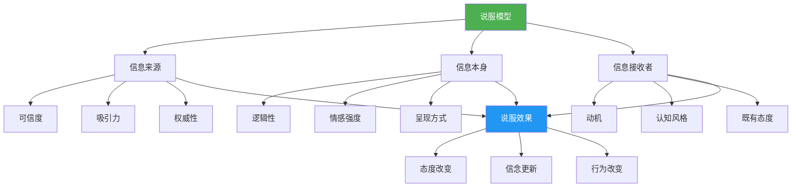
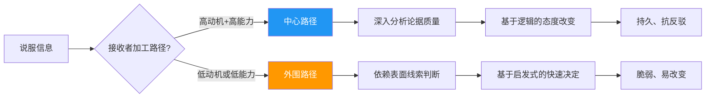
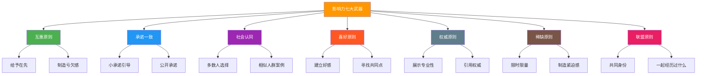
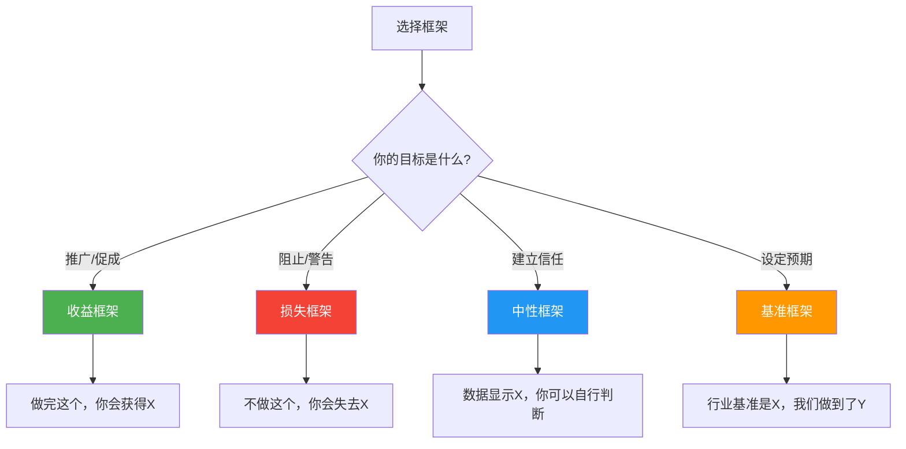
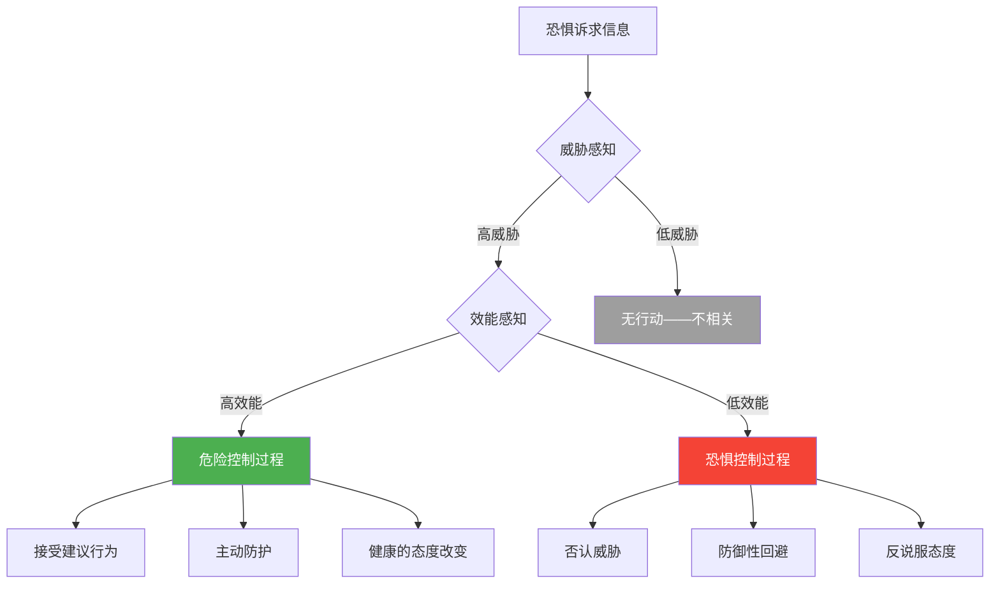
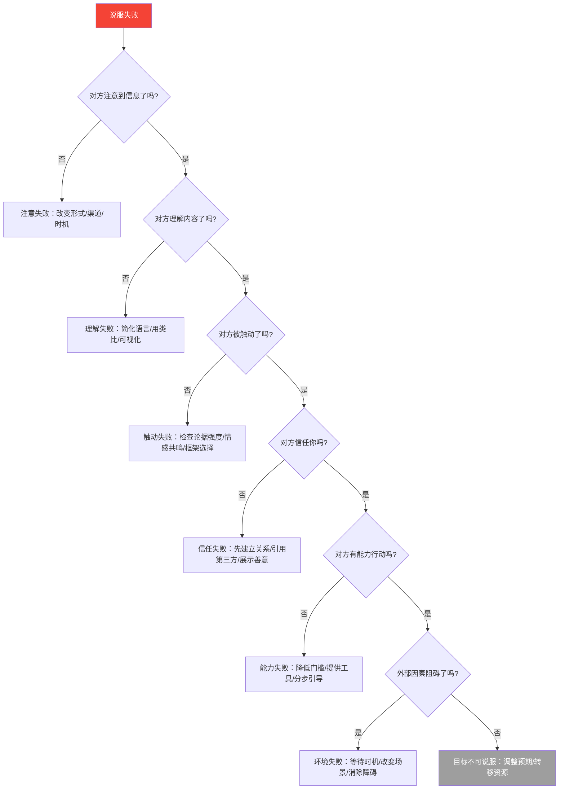

## 一、说服的心理学基础

说服（Persuasion）是人类社会最古老、最普遍的影响力行为。从苏格拉底的街头辩论到现代广告的精准投放，从政治演说到日常谈判，说服无处不在。理解说服的心理学基础，不是为了操纵他人，而是为了更有效地表达观点、更清醒地识别他人的影响企图，以及在关键对话中达成真正有意义的共识。

本章将从认知科学、社会心理学、行为经济学、进化心理学和文化心理学五个维度，系统构建说服的理论框架。

### 1.1 什么是说服

#### 1.1.1 说服的定义与边界

说服是指通过沟通行为，有意图地改变他人的态度、信念或行为的过程。与强制和操纵不同，说服依赖的是对方的自主决策——它不是让别人"不得不"做，而是让别人"想要"做。

理解说服，需要区分三个容易混淆的概念：

| 概念 | 核心特征 | 信息透明度 | 对方自主性 | 典型手段 |
|------|----------|------------|------------|----------|
| **说服（Persuasion）** | 基于理性和情感的自愿改变 | 高——信息可公开讨论 | 完全自主 | 论证、证据、共情 |
| **操纵（Manipulation）** | 利用心理弱点达成对方不利的结果 | 低——隐藏真实意图 | 形式自主但实质受限 | 欺骗、信息不对称利用 |
| **强制（Coercion）** | 通过威胁迫使服从 | 不适用 | 无自主性 | 威胁、惩罚、武力 |

关键判断标准：如果对方知道你所有的论据和意图后仍然会同意，那就是说服；如果不会，那就可能是操纵。这条"阳光测试"（sunlight test）是区分说服与操纵的实用标尺。

说服的另一个边界在于它与"教育"和"告知"的关系。教育强调让对方获得完整信息后自主判断，告知强调中性传递事实，而说服则强调选择性地突出某些信息以引导结论。在实践中，这三者常常交织——一堂好的教育课本质上也是在说服学生某个知识体系有价值，一份好的商业提案同时包含了告知（数据呈现）和说服（框架选择）。

**说服的进化根源**：说服并非现代社会的产物，而是深深植根于人类的进化历程。灵长类动物学家Robin Dunbar提出，人类语言的进化本身就是为了解决社会协调问题——当群体规模超过150人（邓巴数），仅靠 grooming（理毛行为）无法维持社会纽带，语言——尤其是说服性语言——成为维系联盟、协调行动的核心工具。从进化角度看，说服能力直接关联生存和繁殖成功：能够说服他人合作的个体更容易获得资源、建立联盟、传递基因。

这解释了为什么人类对说服如此敏感：我们的大脑经过数百万年的进化，已经发展出一套精密的"说服探测系统"——能够快速识别谁在试图影响我们、评估其动机、决定是否配合。这套系统大部分在无意识层面运行，正是Cialdini的影响力原则能够奏效的深层原因：它们触发的是进化形成的自动化心理捷径。

#### 1.1.2 说服的三大要素：耶鲁模型

从心理学角度看，说服涉及三个核心要素，这个框架来源于Carl Hovland及其耶鲁大学团队在20世纪50年代提出的**耶鲁态度改变模型**（Yale Attitude Change Model），至今仍是理解说服过程的基本范式：

- **信息来源（Who）**：谁在说服？来源的可信度、吸引力和权威性直接决定说服效果。一个诺贝尔奖得主和一个路人推荐同一款产品，效果截然不同。
- **信息本身（What）**：说了什么？论点的逻辑性、情感强度和呈现方式影响接受度。同样的事实，不同的表达顺序和情感色彩会产生完全不同的效果。
- **信息接收者（To Whom）**：被说服的人有何特征？其动机、认知风格、既有态度决定接受的可能性。一个立场坚定的人和一个犹豫不决的人，对同一论据的反应完全不同。

耶鲁模型还揭示了一个重要发现：**说服不是即时事件，而是一个过程**。接收者需要经历注意→理解→接受→保持→行动五个阶段，任何一个阶段中断都会导致说服失败。这意味着仅仅传递信息是不够的——你需要确保对方注意到了、理解了、认同了、记住了，并且在需要时能转化为行动。

#### 1.1.3 来源可信度的深层机制：OCC模型

Hovland团队对"信息来源"的后续研究提炼出了**来源可信度的三维模型**（OCC Model），至今仍是公共关系和媒体研究的基石：

| 维度 | 含义 | 建立方式 | 破坏因素 |
|------|------|----------|----------|
| **专业能力（Expertise）** | 对主题的知识和技能水平 | 学历、从业年限、成功案例、专业认证 | 跨领域发言、被揭穿的错误 |
| **可信赖度（Trustworthiness）** | 信息是否诚实、无偏见 | 承认自身局限、主动披露利益冲突、言行一致 | 前后矛盾、被发现隐藏动机 |
| **善意（Goodwill）** | 是否真正为对方利益着想 | 记住对方需求、牺牲短期利益、长期关系投入 | 过度推销、忽视对方反馈 |

这三个维度相互独立又相互影响。一个销售人员可能有很强的专业能力（知道产品所有参数），但如果被发现隐瞒缺陷（可信赖度低），说服力会急剧下降。反之，一个没有专业头衔但长期为对方着想的人（高善意），其建议往往比专家更有力——因为接收者相信"他不会骗我"。

**来源可信度的"睡眠者效应"**：Hovland团队还发现了一个反直觉的现象——高可信度来源的说服效果会随时间衰减，而低可信度来源的说服效果反而会随时间增强。原因是：人们在接收信息时会将"内容"和"来源"绑定记忆，但随时间推移，来源信息褪色更快，内容本身被保留。这意味着，如果你的论据本身足够有力，即使来源不够权威，长期效果也可能不错——但这不是为低质量来源辩护，而是说明了高质量内容的持久价值。

**实操要点**：在说服前，有意识地在这三个维度上做准备。如果你是领域新人（专业能力不足），可以通过引用权威来源来"借力"；如果对方对你不够信任，先做一件对对方有利的事来建立善意；如果场景需要展示专业性，准备具体数据和案例而非空泛的自我介绍。

#### 1.1.4 McGuire的信息加工模型：说服的五阶段

Hovland之后，William McGuire在1969年将说服过程进一步细化为**信息加工模型**（Information Processing Model），强调说服是一个线性漏斗：

| 阶段 | 含义 | 失败原因示例 | 优化策略 |
|------|------|-------------|----------|
| **注意（Attention）** | 接收者注意到信息 | 信息被淹没在噪音中，根本没人看到 | 用问题、故事或惊人数据开头 |
| **理解（Comprehension）** | 接收者理解信息内容 | 术语太专业，受众听不懂 | 用受众的语言表达，类比解释 |
| **接受（Yielding）** | 接收者被说服，改变态度 | 论据不充分，或者与既有信念冲突 | 多维论证：逻辑+情感+社会证明 |
| **保持（Retention）** | 接收者记住新态度 | 虽然当时同意，但一周后全忘了 | 重复关键信息，提供记忆锚点 |
| **行动（Action）** | 接收者将态度转化为行为 | 同意但没有行动的契机或能力 | 给出明确的下一步和低门槛入口 |

这个模型的实际意义在于：**说服的每一步都可能失败，你需要针对每个阶段设计策略**。比如，在"注意"阶段需要吸引眼球的开头；在"理解"阶段需要用对方能听懂的语言；在"接受"阶段需要有力的论据和情感共鸣；在"保持"阶段需要重复和强化；在"行动"阶段需要明确的行动指引和低门槛的下一步。

**案例**：某SaaS公司的销售团队发现，他们的产品演示（Demo）转化率只有3%。分析发现：Demo技术性太强（"理解"阶段失败），客户看完后记不住核心价值（"保持"阶段失败），没有提供下一步试用入口（"行动"阶段失败）。改进后：用客户业务痛点而非技术功能开场（注意+理解），用一页纸总结核心价值（保持），Demo结束直接创建试用账号（行动），转化率提升到12%。

### 1.2 态度的三维结构

#### 1.2.1 ABC模型

理解说服，首先要理解"态度"。心理学家认为态度由三个维度构成（称为**ABC模型**：Affect-Behavior-Cognition）：

- **认知维度（Cognitive）**：对事物的信念和认知，如"有机食品更健康""这款手机处理器性能最强"
- **情感维度（Affective）**：对事物的情感反应，如"我喜欢有机食品的包装""这个品牌让我感觉很酷"
- **行为维度（Behavioral）**：对事物的行动倾向，如"我愿意购买有机食品""我会向朋友推荐这款手机"

这三个维度并不总是同步的。一个人可以在认知上认可有机食品更健康（认知维度高），但因为口感不喜欢（情感维度低），从而不会购买（行为维度低）。理解这种不一致性，是设计有效说服策略的前提。

**态度强度的调节变量**：态度不仅是方向性的（正面/负面），还有强度差异。心理学家发现，态度的强度受以下因素影响：（1）**直接经验**——亲身经历过的态度比间接获得的更强、更稳定、更能预测行为；（2）**知识量**——对该主题了解越多，态度越不容易被改变；（3）**极端性**——越极端的态度越难改变，但也越能预测行为；（4）**与自我概念的关联**——越是与"我是谁"相关联的态度（如政治立场、宗教信仰），越坚不可摧。说服者需要先评估对方态度的强度和根基，再决定投入多少资源去改变它。

#### 1.2.2 三维度的交互与说服策略

有效的说服往往需要在三个维度上同时发力。仅改变认知但缺乏情感认同，说服效果难以持久；仅情感驱动但缺乏认知支撑，容易在冷静后产生后悔。

不同场景下，最有效的维度组合不同：

| 说服场景 | 主攻维度 | 辅助维度 | 策略示例 |
|----------|----------|----------|----------|
| B2B技术采购 | 认知 | 行为 | 白皮书+POC试用+ROI计算 |
| 消费品营销 | 情感 | 认知 | 品牌故事+用户评价+成分说明 |
| 公益募捐 | 情感 | 行为 | 受助者故事+一键捐款按钮 |
| 政策倡导 | 认知 | 情感 | 数据报告+影响人群案例 |
| 跨部门协作 | 行为 | 认知 | 小规模试点+成果数据 |
| 内部晋升沟通 | 行为 | 认知 | 已有成绩展示+未来计划数据 |
| 医疗健康建议 | 认知 | 情感 | 科学依据+患者故事+行动清单 |

一个关键洞察：**态度的三个维度并不总是一致的**。一个人可能在认知上知道运动有益健康（认知），但就是不喜欢运动（情感），也不会去运动（行为）。当三个维度冲突时，情感维度往往最终胜出——这就是为什么"我知道，但是……"是人类最常见的心理状态。说服的关键突破口，往往不是堆砌更多事实，而是找到情感层面的卡点。

**深度案例**：某健身App的用户流失分析显示，大多数用户在"认知"层面完全认同运动的价值（已下载App），在"行为"层面也有初始行动（前两周活跃），但在第三周急剧流失。根本原因出在"情感"维度——用户没有从运动中获得愉悦感。解决方案：将"运动30分钟"改为"挑战你的最好成绩"，加入社交排行榜和成就徽章，将运动从"应该做的事"变成"想要做的事"。三周留存率从18%提升到47%。

### 1.3 双通道加工：中心路径与外围路径

#### 1.3.1 精细加工可能性模型（ELM）

Richard Petty和John Cacioppo在1986年提出的**精细加工可能性模型**（Elaboration Likelihood Model, ELM）是理解说服路径的核心理论。该模型认为，人类处理说服信息有两条根本不同的路径：

**中心路径（Central Route）**：接收者认真思考论点本身的质量。当接收者有高动机、高能力处理信息时，更可能通过中心路径被说服。此时，论据的逻辑性、证据的充分性至关重要。通过中心路径形成的态度更持久、更能预测行为、更不容易被反向说服。

**外围路径（Peripheral Route）**：接收者依赖表面线索做出判断。当接收者缺乏动机或能力深入思考时，会依赖启发式线索——如发言者的外貌吸引力、专家头衔、他人的选择、信息的长度等。通过外围路径形成的态度较脆弱、容易改变。

决定走哪条路径的关键变量：

| 变量 | 高→中心路径 | 低→外围路径 |
|------|------------|------------|
| **动机**（个人相关性） | 与自己切身利益相关（如选购房产） | 与自己关系不大（如路过的广告牌） |
| **能力**（认知资源） | 安静环境、充足时间、专业知识 | 嘈杂环境、时间紧迫、话题陌生 |
| **认知需求**（个人特质） | 喜欢思考、享受分析 | 不愿费脑、偏好简单答案 |

**ELM的一个关键推论**：同一因素（如来源可信度）在不同路径下的作用机制完全不同。在中心路径下，来源可信度是"加分项"——如果论据本身就好，高可信度来源进一步增强效果。在外围路径下，来源可信度是"替代品"——当接收者不想深究时，"专家说的"本身就足以让人接受。

#### 1.3.2 启发式-系统式模型（HSM）：ELM的重要补充

Shelly Chaiken在1980年提出的**启发式-系统式模型**（Heuristic-Systematic Model, HSM）与ELM高度相关但有独特贡献。HSM有两个关键洞察是ELM没有明确指出的：

**洞察一：两种模式可以同时激活。** ELM倾向于将两条路径看作连续体的两端，而HSM明确指出，人们可以同时使用启发式和系统式处理。例如，你在阅读一篇论文时，既会评估论据质量（系统式），也会注意到期刊的影响因子和作者的机构（启发式）。两者协同或竞争，最终形成态度。

**洞察二：偏见一致性原则（Bias Consistency Principle）。** 当启发式线索指向一个方向，系统式处理会倾向于"朝着"这个方向去解读信息。例如，如果你信任的专家说某产品好（启发式），你在仔细审查产品信息（系统式）时会不自觉地更关注正面证据。这意味着外围线索不仅影响低卷入度场景，还会系统性地扭曲高卷入度场景中的判断。

**洞察三：充分性原则（Sufficiency Principle）。** HSM提出了一个ELM没有明确的机制：人们心中有一个"期望的确定性水平"（desired confidence level）。当前的自信程度低于这个水平时，人们会主动寻求更多信息——可能通过系统式加工（深度分析），也可能通过启发式加工（寻找更多表面线索）。这解释了为什么有些人在不确定时不是更深入思考，而是更疯狂地收集"背书"——他们在用启发式方式弥补信心缺口。

**实践启示**：在向高水平受众做说服时，你不能假设"只要论据好就行"——如果对方对你的来源或立场有先入为主的负面印象，他们会用同样的系统式能力来攻击你的论据。因此，先修复来源形象，再展开论证。

#### 1.3.3 系统1与系统2：来自认知科学的补充

ELM的双通道视角与Daniel Kahneman在《思考，快与慢》中提出的**双系统理论**高度互补：

- **系统1（快思考）**：自动、快速、不费力、情绪化、直觉驱动。对应外围路径。日常90%以上的决策由系统1完成。
- **系统2（慢思考）**：刻意、缓慢、费力、逻辑化、分析驱动。对应中心路径。只在系统1搞不定时才被调用。

这对说服者的启示是：**大多数人大多数时候在用系统1做决定**。这意味着：

1. **外围线索的力量被严重低估**——一个看起来专业的PPT模板、一个自信的语调、一个精心设计的着装，可能比十个数据图表更有效地打开说服的大门。
2. **但仅有外围线索是不够的**——当系统2被激活（对方开始质疑、追问细节），你必须有扎实的论据储备。
3. **最佳策略是"先外围，后中心"**——用外围线索吸引注意力、建立信任，然后在对方愿意倾听时切入中心路径的深度论证。

**系统1与系统2的"协作"而非"对立"**：Kahneman后来澄清，双系统不是两个独立的大脑模块，而是两种处理模式的隐喻。在说服中，关键洞察是：系统1不等于"非理性"——它是一套高效的模式匹配系统，在大多数情况下给出足够好的判断。说服者的任务不是"绕过"系统1，而是**让系统1和系统2朝同一个方向工作**。当外围线索（系统1的输入）和论据质量（系统2的输入）指向同一结论时，说服力最强。

**案例**：一个创业公司CEO向投资人融资。第一次路演，CEO直接进入商业模式和财务预测（纯中心路径），结果投资人兴趣平平。复盘后发现，投资人在前三十秒就已经用系统1做出了"这人不太行"的判断（穿着随意、开场紧张、没有先建立社会证明）。第二次路演，CEO做了三个改变：穿正装（外貌线索）、开场提到两位知名投资人的推荐信（权威线索）、用一个个人故事切入（情感共鸣），然后再进入数据。同一家投资机构，结果从拒绝变成了领投。

#### 1.3.4 实际应用框架

面对不同受众的策略选择：

- **面对专业决策者**（如采购委员会、技术评审）：应走中心路径，提供详实数据和逻辑论证。他们有能力也有动机仔细审查你的论据，任何逻辑漏洞都会被抓住。
- **面对时间紧迫或低卷入度的受众**（如冲动消费场景、会议中的被动听众）：外围路径更有效。简洁的结论、权威背书、社会证明比长篇论证更有效。
- **面对混合受众**（如产品发布会、公开演讲）：最佳策略是先用外围路径吸引注意力和建立好感，再用中心路径提供深度说服。这就是为什么优秀的演讲总是以故事开场（外围），以数据和逻辑收尾（中心）。
- **面对敌意受众**：不能直接走中心路径——对方会自动反驳你的每个论点。应先用外围路径建立好感（寻找共同立场），然后用苏格拉底式提问让对方自己发现矛盾，而非直接指出矛盾。

### 1.4 从态度到行为：理性行为理论与计划行为理论

#### 1.4.1 为什么"被说服"不等于"会行动"

这是说服领域最令人困惑的问题之一：一个人明明态度已经改变，为什么还是不行动？Martin Fishbein和Icek Ajzen在1975年提出的**理性行为理论**（Theory of Reasoned Action, TRA）和1985年的扩展版**计划行为理论**（Theory of Planned Behavior, TPB）给出了系统回答。

TRA/TPB的核心公式：**行为意向 = 态度 + 主观规范 +（感知行为控制）**

| 决定因素 | 含义 | 说服中的干预点 |
|----------|------|---------------|
| **态度** | 对该行为的正面或负面评价 | 通过论据、证据改变态度（前面几节的核心内容） |
| **主观规范** | 重要他人对该行为的期望 | 引用对方尊敬之人的观点，创造社会压力 |
| **感知行为控制** | 对自己能否做到这件事的判断 | 降低行动门槛，提供工具和支持，分步引导 |

**关键洞察**：态度只是行为意向的三个决定因素之一。一个销售人员可能已经让客户相信产品很好（态度改变），但如果客户的配偶反对（主观规范负面），或者客户觉得操作太复杂（感知行为控制低），成交仍然不会发生。

**应用案例**：某企业内部推行新的项目管理工具。IT部门做了充分的功能展示和对比分析（改变态度），但一个月后使用率只有15%。问题分析：（1）部门经理没有公开表态支持（主观规范缺失）——解决方案：让VP在全员会议上宣布全面采用，部门经理带头使用；（2）员工觉得学习成本太高（感知行为控制低）——解决方案：提供5分钟入门视频、每团队指定一个"超级用户"做内部支持。三个月后使用率达到78%。

**TRA/TPB的局限与补充**：TRA和TPB假设人是理性的决策者，但实际上很多行为受习惯、情绪和情境驱动。后续研究者提出的**计划行为理论扩展版**加入了"过去行为"变量——过去的行为是未来行为最强的预测因子之一，因为它反映的是习惯而非决策。这对说服的启示是：要说服一个人做某件新事，不仅要说服他"想做"，还要帮他打破旧习惯（如果有的话）并建立新习惯。

#### 1.4.2 从意向到行为的最后一公里

即使三个因素都到位了，从"意向"到"行为"仍然有差距。以下因素影响意向能否转化为行动：

- **习惯强度**：旧习惯越强，新行为越难取代。改变习惯需要替代方案，而非单纯否定旧习惯。
- **情境因素**：时机、环境、便利性。想让人去健身房，推荐一个公司楼下的健身房比推荐一个需要开车40分钟的健身房有效得多。
- **实施意向（Implementation Intention）**：将"我要做X"转化为"当Y发生时，我就做X"的if-then计划。研究表明，简单的实施意向可以将行为执行率提高2-3倍。

Peter Gollwitzer的研究表明，在说服结束时帮助对方制定一个具体的实施意向——"你下周三几点在哪里做第一步？"——比反复强调"行动很重要"有效得多。

**行为设计的"MATCH"框架**：将说服的最后一公里系统化——**M**otivation（确保动机到位）、**A**bility（确保能力足够）、**T**rigger（设置触发条件）、**C**ommitment（获得明确承诺）、**H**abit（设计习惯闭环）。说服者往往在M（动机/态度）上投入最多精力，但实际上A（降低能力门槛）和T（设计触发点）往往才是真正的瓶颈。

### 1.5 影响力的七大武器

#### 1.5.1 Cialdini的说服原则体系

Robert Cialdini在其经典著作《影响力》（Influence: The Psychology of Persuasion）中，基于大量实验和田野调查，总结出影响力原则。这些原则本质上是外围路径中的核心启发式线索，是人类在信息过载环境中进化出的快速决策捷径。

#### 1.5.2 七大原则详解

**① 互惠原则（Reciprocity）**

人类有一种根深蒂固的心理：收到别人的好处后，会产生回报的义务感。这种义务感之强烈，即使你不喜欢对方，即使你并不需要那个礼物，仍然会感到"欠了人情"。

经典实验：心理学家Dennis Regan在1971年的实验中，安排被试与一名助手（实验同谋）一起评价艺术品。在部分实验中，助手会在休息时出去买两瓶可乐，一瓶给被试。后来，助手请被试购买抽奖券。结果：收到可乐的被试购买数量是没有收到可乐的两倍——即使可乐的价值远低于抽奖券的价格。

更深层的实验来自Kunz和Woolcott在1976年的"圣诞贺卡研究"：Kunz随机向数百名陌生人寄送圣诞贺卡，结果大多数人回寄了贺卡——包括那些在贺卡上写"我们不认识你，但我们……"的人。互惠的义务感是如此自动化，以至于它可以超越理性和常识。

应用策略：在提出请求之前，先给予对方有价值的东西——一份免费报告、一个有用的建议、一个真诚的赞美。关键在于给予的东西必须是**真实的、有价值的、对方能感知到的**。虚假的给予（明知不会兑现的承诺）不仅无效，还会彻底摧毁信任。

**进阶策略——让步式互惠**（Door-in-the-Face）：先提出一个大请求（预期被拒绝），然后退让到一个较小的请求。对方因为你的"让步"而感到需要回报，同意率显著提高。Cialdini的实验中，先请求被试花两小时做少年犯辅导员（被拒绝率99%），再请求花两小时带少年犯去动物园，同意率从17%提升到50%。

**另一面——拒绝-退让的反向策略**（Foot-in-the-Door）：先提一个小请求（几乎不会被拒绝），获得同意后再提大请求。其心理机制是承诺一致原则（见下文），但效果与互惠互补。两种策略的选择取决于场景：当对方对你有戒心时，让步式互惠更有效（你先做出让步，降低戒心）；当对方对你不熟悉时，先从小请求切入更安全。

**② 承诺与一致原则（Commitment and Consistency）**

一旦人们做出了选择或表态，就会面临来自内心和外部的压力，要求自己的行为与之前的承诺保持一致。这种"一致性需求"如此强大，以至于人们会做出明显不合理的决定，只为了避免自相矛盾。

经典实验：Freedman和Fraser在1966年的"门前效应"实验中发现，如果先请求住户在窗户上贴一个小标志（小承诺），三天后再请求在院子里立一个大广告牌，同意率是直接请求立大广告牌的四倍。

应用策略：**登门槛技术**（foot-in-the-door）——先争取一个小的承诺，再逐步升级。让客户先免费试用、让同事先参与一个小决策、让对方先承认一个基本事实——这些小承诺会像滚雪球一样，引导对方走向更大的承诺。

**承诺的三个增强因素**：（1）**公开性**——公开的承诺比私下承诺约束力强得多。在会议上宣布"我下周完成"比在心里想"我应该做"有效得多。（2）**主动性**——自己主动做出的承诺比被动接受的更有约束力。让对方自己填写目标数字，比你替他定数字有效。（3）**付出努力**——付出努力得到的东西更珍惜。这就是为什么入会仪式越难（兄弟会、军训），成员忠诚度越高。

**③ 社会认同原则（Social Proof）**

当人们不确定该怎么做时，会参考别人的行为来决定自己的行动。这就是为什么餐厅门口排队越长越多人想进，为什么产品页面上"已有10000人购买"的标签如此有效。

应用策略：展示"像你这样的人"已经在做某事。具体的数据比模糊的描述更有力——"97%的客户续费了"比"很多客户喜欢我们的产品"更有说服力。注意：社会认同在以下条件下更强：（a）情况不确定；（b）对方与参照群体相似；（c）参照群体规模大。

**社会认同的反面——多元无知（Pluralistic Ignorance）**：有时候社会认同会失效，因为每个人都在私下反对但公开沉默。经典案例：校园饮酒问题——大多数学生私下认为饮酒过度不好，但以为其他人都喜欢痛饮，结果公开场合都喝得很多。打破多元无知的方法是**公开倡导**——只要一个人公开表态，就可能引发连锁反应。

**④ 喜好原则（Liking）**

我们更容易被我们喜欢的人说服。而我们喜欢一个人，通常基于以下因素：外貌吸引力、相似性（态度、背景、兴趣）、赞美、接触与合作、关联性（与积极事物的联系）。

应用策略：在正式说服之前，先建立关系。寻找共同点（同乡、校友、共同爱好），给予真诚的赞美，在合作中展示可靠性。但要注意：虚假的讨好会适得其反——人们能感知到不真诚。

**进阶——相似性陷阱**：过度模仿对方（如NLP中的"镜像技术"）在不熟练时会显得怪异。有效的相似性应该自然地从共同经历中生长出来，而非机械地复制对方的肢体语言。最安全的做法是：在说服前花时间真正了解对方，找到真正的共同点。

**⑤ 权威原则（Authority）**

人类对权威有一种近乎本能的服从倾向。Milgram的电击实验（1963）表明，即使是普通人在权威指令下也会做出违背良心的行为。在说服场景中，权威不需要那么极端——一个专业头衔、一件白大褂、一个知名机构的背书就能显著提高说服力。

应用策略：展示你的专业资质和经验，引用权威来源（学术研究、行业报告、知名专家观点），让权威人士为你背书。如果自己不是权威，就引用权威——"正如德鲁克所说……""根据麦肯锡的报告……"。

**权威的"外表陷阱"**：研究表明，头衔、服装和汽车等表面符号可以产生与实际能力无关的权威效果。一个穿白大褂的人给出的健康建议，即使完全错误，也比穿便装的真医生更容易被接受。认识到这一点，你既可以在合法范围内善用这些符号，也可以在接收信息时有意识地剥离外表，审视实质。

**⑥ 稀缺原则（Scarcity）**

人们对"即将失去"的敏感度远高于"即将获得"。当某样东西变得稀缺或即将消失时，它的感知价值会急剧上升。

经典案例：英国航空公司2003年宣布取消伦敦至纽约的协和航班后，次日机票销售暴涨——尽管价格、服务、速度完全没有变化，仅仅因为"即将消失"就让需求急剧上升。

应用策略：创造真实的紧迫感——限时优惠、限量供应、机会窗口。关键在于紧迫感必须是真实的，虚假的"最后三天"会摧毁信任。

**稀缺的心理机制——心理抗拒理论**（Reactance Theory）：当人们感到自由被限制时，会产生强烈的逆反心理。Jack Brehm在1966年的研究发现，被禁止的东西反而变得更有吸引力。这就是为什么禁书总是畅销、被删的帖子传播更快。在说服中，适度的稀缺激发行动，过度的限制引发反抗——掌握分寸是关键。

**⑦ 联盟原则（Unity）——2021年新增**

Cialdini在2021年的新版中增加了第七个原则：**联盟原则（Unity）**。"我们"和"他们"的区别比"喜欢"更深层——当对方认为你是"自己人"时，说服力会指数级上升。共同的种族、国籍、宗教、政治立场、甚至共同经历过的苦难，都能创造这种"我们是一伙的"感觉。

联盟与喜好的区别：喜欢是"我觉得你这个人不错"，联盟是"我们是一伙的"。你可以喜欢一个外人，但不会因此信任他对"我们"的建议。联盟创造的信任是深层的、本能的——它是部落心理在现代社会的延伸。

**应用**：在团队沟通中强调"我们一起""咱们团队"而非"你们"和"他们"；在客户沟通中用"像您这样的行业专家"而非"像普通客户"；在跨部门协作中先找到"共同的敌人"（竞争公司、共同挑战）来建立联盟感。

#### 1.5.3 原则组合与实战矩阵

在真实场景中，单独使用一个原则效果有限。最有效的说服是多个原则的协同：

| 场景 | 主要原则 | 辅助原则 | 组合逻辑 |
|------|----------|----------|----------|
| B2B销售提案 | 权威+社会认同 | 互惠 | 先给行业报告（互惠），展示客户案例（社会认同），引用行业领袖评价（权威） |
| 内部方案推动 | 承诺一致+社会认同 | 联盟 | 先让决策者认同问题存在（承诺），展示竞对数据（社会认同），强调"我们的机会"（联盟） |
| 公益活动推广 | 情感+社会认同 | 互惠+稀缺 | 受助者故事（情感），参与人数（社会认同），免费体验（互惠），限时报名（稀缺） |
| 谈判中的让步 | 互惠+稀缺 | 承诺一致 | 先做出小让步（互惠），强调"这是唯一机会"（稀缺），让对方口头确认意向（承诺） |

### 1.6 说服的神经科学基础

#### 1.6.1 大脑如何处理说服信息

说服不仅是一个心理学过程，更有着清晰的神经生物学基础。近二十年的神经科学研究揭示了大脑在面对说服信息时的运作机制，这些发现将抽象的心理学理论锚定在了具体的脑区和神经递质上。

**前额叶皮层（Prefrontal Cortex, PFC）——理性评估中枢**：当人们认真评估一个论点时（中心路径/系统2），前额叶皮层——尤其是背外侧前额叶（dlPFC）——高度激活。这个区域负责逻辑推理、工作记忆和执行控制。神经影像研究发现，当被试在评估说服性论据时dlPFC激活越强，最终的态度改变越大。反之，当dlPFC活动降低（如认知负荷、疲劳、酒精影响）时，人们更容易被外围线索说服。

**杏仁核（Amygdala）——情感快速评估**：杏仁核是大脑的"威胁探测器"和"情感标签机"。当说服信息包含情感内容（恐惧诉求、愤怒激发、感动故事）时，杏仁核在意识觉察之前就已激活。杏仁核高度敏感的个体更容易被情感说服策略影响。有趣的是，杏仁核受损的患者对恐惧诉求完全免疫——但也因此无法做出必要的风险防范决策。

**腹侧纹状体（Ventral Striatum）——奖赏预期**：当人们预期获得某种好处时（如"使用这个产品会节省时间"），腹侧纹状体——大脑奖赏系统的核心——会被激活。Paul Zak的团队发现，这个区域的激活程度可以预测购买决策。说服性信息如果能有效激活奖赏预期系统，就能驱动行动。

**前扣带回皮层（Anterior Cingulate Cortex, ACC）——冲突监测**：当新信息与既有信念冲突时，ACC会发出"认知冲突"信号。如果冲突强度大，ACC会启动防御机制——要么拒绝新信息，要么合理化既有信念。这意味着：直接挑战对方的核心信念会在神经层面触发防御反应，而非理性评估。

#### 1.6.2 催产素与信任的神经化学

Paul Zak的开创性研究揭示了**催产素**（Oxytocin）在说服中的核心角色。催产素被称为"信任分子"，它在以下情境中被释放：（1）社会互动中感受到善意；（2）听到情感共鸣的故事；（3）身体接触（握手、拥抱）；（4）共同经历（尤其是共同克服困难）。

催产素水平升高时，人们表现出：更高的信任感、更强的共情能力、更愿意合作、更愿意承担社会风险（如向陌生人分享个人信息或金钱）。

**说服中的催产素杠杆**：

| 触发方式 | 机制 | 应用场景 |
|----------|------|----------|
| 讲述个人故事 | 释放催产素，降低防御 | 销售开场、谈判破冰 |
| 主动分享脆弱面 | 激活对方的共情回路 | 领导力沟通、冲突调解 |
| 共同用餐 | 社交+生理双重触发 | 商务谈判、关系建立 |
| 物理空间设计 | 温暖、舒适降低皮质醇 | 门店体验、会议环境 |
| 建立"我们"认同 | 联盟感激活催产素通路 | 团队沟通、品牌社群 |

**注意边界**：催产素的作用并非无限——它增强的是对"内群体"的信任，同时可能增强对"外群体"的偏见和攻击性。在跨群体说服中，单纯依赖催产素策略（如强调"我们是一伙的"）可能适得其反，需要配合认知层面的桥梁建设。

#### 1.6.3 镜像神经元与说服的"感染"效应

1990年代在恒河猴大脑中发现的**镜像神经元**（Mirror Neurons），后来在人类大脑中也被证实存在。这些神经元在观察他人行为时会"镜像"激活——仿佛观察者自己在执行该行为。

镜像神经元系统对说服的启示：

- **情绪传染**：当你表现出真诚的热情和信念时，对方的大脑会"镜像"你的状态——这不是刻意模仿，而是神经层面的自动同步。这就是为什么"相信自己说的话"是说服的第一法则——你的不真诚同样会被镜像系统捕捉。
- **行为示范**：当人们看到他人执行某个行为时，镜像系统会降低该行为的"行动阈值"。这就是社会认同原则的神经基础——看到别人做，自己的大脑也在"预演"做。
- **具身认知**：身体姿态和面部表情不仅反映情绪，还能反向影响态度。面带微笑地思考一个问题，比面无表情地思考，更容易得出积极的结论（面部反馈假说）。说服者可以有意识地管理自己的身体语言来影响互动氛围。

### 1.7 认知偏差与说服

#### 1.7.1 说服中的常见认知偏差

说服之所以有效，很大程度上是因为人类认知系统存在可预测的偏差。了解这些偏差不是为了利用它们，而是为了在说服中避免被它们误导，同时理解为什么某些策略比其他策略更有效。

| 偏差名称 | 定义 | 在说服中的表现 | 应对策略 |
|----------|------|---------------|---------|
| **锚定效应** | 先接触的信息成为后续判断的参照点 | 先报高价再打折，折扣显得更大 | 主动设定对你有利的锚点 |
| **框架效应** | 同一信息的不同表达导致不同决策 | "90%存活率"比"10%死亡率"更受欢迎 | 精心选择表达框架 |
| **确认偏差** | 倾向于寻找支持已有观点的证据 | 对方只接收符合其立场的信息 | 先承认对方立场的合理性，再引入新信息 |
| **可得性偏差** | 容易想到的事件被高估概率 | 飞机失事新闻让人高估飞行风险 | 用生动案例配合统计数据 |
| **损失厌恶** | 损失带来的痛苦是同等收益快乐的2倍 | "不做会损失100万"比"做能赚100万"更有力 | 适当使用损失框架 |
| **峰终定律** | 体验的记忆由峰值和结尾决定 | 结尾的印象决定整体评价 | 把最强论点放在最后 |
| **光环效应** | 对某一方面的好感泛化到其他方面 | 名人代言让产品质量显得更好 | 先建立一个维度的优势 |
| **禀赋效应** | 拥有某物后对其估价升高 | 免费试用后觉得"这是我的"，不愿放弃 | 提供试用期、体验装、样品 |
| **选择性注意** | 只关注与预期一致的信息 | 发布会观众只记住他们想听的 | 重复关键信息，在不同语境中反复强调 |
| **现状偏差** | 倾向于维持当前状态 | 即使新方案更好，也因为"改变"本身而抵触 | 强调不改变的隐性成本 |
| **过度自信偏差** | 高估自己判断的准确性 | 对方认为自己不会被说服，或不需要改变 | 用对方自己的数据和逻辑推导出矛盾 |

#### 1.7.2 锚定效应的深度应用

锚定效应是说服中最强大、最常用的偏差之一。Tversky和Kahneman在1974年的经典实验中证明，即使锚点是完全随机的（转盘转出的数字），也会影响后续的数量估计。

在说服中的具体应用：

- **价格谈判**：先提出一个高于预期的价格（锚点），后续的让步会让最终价格显得合理。注意：锚点需要在"合理"范围内——如果锚点太高，会被直接否定，失去可信度。经验法则是锚点比目标价格高15%-30%。
- **方案选择**：提供三个方案，其中一个是明显昂贵的"诱饵"，让目标方案显得物超所值（不对称优势效应，也称"诱饵效应"或"吸引效应"）。这是定价策略中最常用的技巧之一。
- **时间估计**：先说一个乐观的时间表，即使后来延期，也比一开始就报长工期更容易被接受。但要注意诚信底线——如果差距太大，会损害长期信任。
- **薪资谈判**：先开口报价的人设定了谈判锚点。研究一致表明，先报价的一方通常获得更有利的结果。但前提是锚点必须在合理范围内——过高会被视为不专业。

**锚定效应的"双重锚定"策略**：在复杂谈判中，可以同时设定两个锚——一个"高锚"（让对方觉得你的底线很高）和一个"合理锚"（你的实际目标）。高锚的作用是拉高对方的参照系，合理锚的作用是提供一个"看起来合理"的落脚点。两个锚的间距越大，合理锚看起来越有吸引力。

#### 1.7.3 框架效应的说服力量

框架效应（Framing Effect）指的是同一客观事实的不同表述方式会导致截然不同的决策。这不是对方"不理性"——这是人类认知的默认模式。

经典实验：Kahneman和Tversky的"亚洲疾病问题"——当600人面临一种致命疾病时：
- 正面框架："方案A将拯救200人"→ 72%的人选择
- 负面框架："方案A将有400人死亡"→ 仅22%的人选择

两个方案完全等价，但框架改变了决策。

实用框架技术：

- **收益框架**用于推广新事物："使用这个工具，效率提升40%"——让人们看到"获得什么"
- **损失框架**用于阻止坏习惯："不使用防晒霜，皮肤老化速度加快3倍"——让人们看到"失去什么"
- **中性框架**用于建立可信度：在数据汇报中保持客观，让对方自己得出结论
- **基准框架**用于设定预期："相比行业平均3%的转化率，我们做到5%已经是领先水平"——先设定合理的基准，再展示超出基准的成绩
- **故事框架**用于复杂议题：将抽象的数据嵌入一个具体人物的经历中，让人们从"看到数字"变成"感受体验"
- **对比框架**用于突出差异："方案A需要6个月见效，方案B只需2周"——通过对比放大优势
- **时间框架**用于改变感知："每天只需3元"比"每年1095元"更易接受——将大数字拆解为小单位

**框架选择的决策树**：

### 1.8 社会判断与认知失调

#### 1.8.1 社会判断理论

Muzafer Sherif的社会判断理论（Social Judgment Theory）解释了一个关键问题：**为什么有些说服完全无效，有些则效果显著？**

该理论认为，每个人对各种议题都有一个"态度锚点"，并围绕这个锚点形成三个区域：

- **接受区域（Latitude of Acceptance）**：与自己立场相近、愿意接受的观点范围
- **拒绝区域（Latitude of Rejection）**：与自己立场相差太远、直接拒绝的观点范围
- **无关区域（Latitude of Noncommitment）**：与自己立场关系不大、无所谓的观点范围

关键洞察：**如果对方的立场与你的观点差距太大，你的说服不但无效，反而会让对方更加坚定原有立场**（称为"对比效应"）。这就是为什么在政治和宗教议题上，极端对立的双方越辩论越分裂。

应用策略：
1. 先了解对方的现有立场，判断你的观点落在对方的哪个区域
2. 如果你的观点在对方的拒绝区域，不要直接挑战——先从接受区域内的共同点开始
3. 逐步、小幅地移动对方的立场，而不是一次性提出终极立场
4. 将你的论点包装成对方现有信念的"自然延伸"，而不是"颠覆"

**判断"区域"的实操方法**：问一个开放性问题（"你怎么看X？"），观察对方的反应——如果对方开始罗列理由说明你的观点不对（强烈反驳），说明你在拒绝区域；如果对方说"有点道理但需要想想"，说明你在无关或接受边缘；如果对方点头或追问细节，说明你在接受区域内。

**涉入度与区域宽度的关系**：社会判断理论还揭示了一个重要变量——**涉入度**（ego-involvement）。涉入度越高的人，其拒绝区域越大、接受区域越窄。这就是为什么政治、宗教和身份认同相关的议题最难被说服——因为涉入度极高，几乎任何不同意见都被自动归入拒绝区域。面对高涉入度受众，策略不是直接说服，而是先降低议题与自我概念的关联度（"这不是关于你的身份，而是关于一个具体的方法选择"），再展开论证。

#### 1.8.2 认知失调理论

Leon Festinger在1957年提出的**认知失调理论**（Cognitive Dissonance Theory）是理解说服的另一个关键工具。当一个人同时持有两个矛盾的认知时（如"我知道吸烟有害"和"我在吸烟"），会产生心理不适，驱动其改变其中一个认知来恢复一致性。

认知失调在说服中的应用：

**策略一：引发失调，提供出路**

- 让对方意识到自己的行为与价值观之间的矛盾
- 提供一个改变行为的具体方案
- 示例：让环保主义者意识到自己的碳排放数据，然后推荐低碳生活方式
- 关键技巧：失调必须被对方自己感知到，而非由你指出。"你有没有注意到你一直在说X，但做的却是Y？"比"你说的和做的不一样"更有效——前者让对方自己发现矛盾，后者让对方感到被指责。

**策略二：承诺升级**

- 当人们为某个立场投入了时间、精力或金钱后，即使遇到不利证据，也倾向于加倍投入而非承认错误
- 这就是为什么公开承诺比私下承诺更有约束力——已经"公开表态"了，反悔的心理成本太高
- 这也是赌徒心理的根源：输了钱之后，不是止损，而是加倍下注。在说服中识别这一点，可以帮助你避免在错误的说服目标上浪费更多资源。

**策略三：决策后失调的管理**

- 人们做出重大决定后，往往会经历"我是不是选错了"的焦虑
- 在说服对方做出决定后，立即提供决策正确的证据，可以减少后悔和反悔
- 这就是为什么买车后4S店会发恭喜短信和车主满意度调查
- **关键实践**：在对方刚同意你的提案后，不要急于推进执行——先花时间强化"这是个好决定"的感受，防止对方在夜间反悔。一封总结邮件，列明决策的三个以上好处，是非常有效的决策后支持。

**策略四：主动制造"小失调"**：不要等失调自然发生——主动设计情境让对方体验到轻微的认知冲突。例如：（1）让对方先公开表态支持某个原则（"你同意效率很重要对吧？"），然后展示对方当前行为与该原则的差距；（2）给对方提供一个"免费试用"，让他在行为上先投入，再引导他为这个行为找到认知上的理由（"既然你已经在用了，说明你其实也觉得它好"）。

### 1.9 恐惧诉求与情绪说服

#### 1.9.1 恐惧诉求的科学：EPPM模型

恐惧诉求（Fear Appeals）是说服中最古老也最具争议的策略之一。Kim Witte在1992年提出的**扩展平行过程模型**（Extended Parallel Process Model, EPPM）系统解释了恐惧诉求何时有效、何时适得其反。

EPPM的核心框架：

恐惧诉求有效的**两个必要条件**：

1. **威胁感知要高**：接收者必须真正认为"这件事可能发生在我身上，而且后果严重"。模糊的警告（"可能有害"）不如具体的场景描述（"如果你不做X，你会经历Y"）。
2. **效能感知要高**：接收者必须相信自己有能力执行建议的行为（自我效能），并且该行为确实能有效解决问题（反应效能）。"不做X会导致Y"同时需要"做了X确实能避免Y"和"我能做到X"。

**恐惧诉求失败的两种模式**：
- 威胁高+效能低→**恐惧控制**：人们否认威胁、回避信息、甚至攻击信使。例如：过度吓人的戒烟广告反而让烟民更排斥。
- 威胁低→**无反应**：人们觉得"跟我没关系"。例如：一条关于远方灾难的新闻，大多数人只是划走。

**实操指南**：

| 步骤 | 内容 | 示例 |
|------|------|------|
| 1. 建立威胁 | 具体描述风险场景，让它"真实" | "根据统计数据，不使用密码管理器的人，在5年内遭遇账户被盗的概率超过30%" |
| 2. 放大情感 | 激活适度恐惧，但不要过度 | "想象你的银行账户、社交账号、工作邮箱同时被锁" |
| 3. 提供反应效能 | 明确"做什么能解决" | "安装密码管理器，30分钟设置，此后所有账号自动生成强密码" |
| 4. 提供自我效能 | 让对方觉得"我能做到" | "即使是不懂技术的人，跟着这个3步指南也能完成" |
| 5. 给出行动路径 | 降低行动门槛 | "点击这里，下载免费版本，现在就试试" |

**恐惧诉求的"剂量效应"**：多项元分析研究（Tannenbaum et al., 2015）表明，恐惧诉求的效果与恐惧强度之间呈倒U型关系——中等强度的恐惧配合高效能信息效果最好。恐惧太低，没有驱动力；恐惧太高，触发防御性回避。此外，恐惧诉求对态度改变的效果通常强于对行为改变的效果——也就是说，人们可能被吓到同意你的观点，但不一定因此采取行动。效能信息（"你能做什么"）才是打通行为的最后一环。

#### 1.9.2 情绪说服的系统框架

恐惧只是情绪说服工具箱中的一种。完整的**情绪说服策略**涵盖以下核心情绪：

| 情绪 | 适用场景 | 机制 | 风险 |
|------|----------|------|------|
| **恐惧** | 安全、健康、风险防范 | 激活自我保护本能 | 过度导致防御性回避 |
| **希望/憧憬** | 产品推广、愿景传达 | 激活奖赏预期系统 | 脱离现实则失去可信度 |
| **愤怒** | 社会议题、公益倡导 | 激活行动能量和正义感 | 可能导致非理性决策 |
| **愧疚** | 慈善募捐、环保行为 | 制造认知失调驱动补偿 | 过度导致反感和逃避 |
| **自豪** | 品牌忠诚、社区建设 | 满足身份认同需求 | 排外性——可能疏远"外人" |
| **共情/同理心** | 服务沟通、冲突调解 | 激活亲社会行为 | 单一故事谬误——情绪代替了数据 |
| **敬畏** | 品牌叙事、愿景传达 | 缩小自我感，增强归属感和开放性 | 不适用于日常消费品 |
| **怀旧** | 品牌复兴、代际沟通 | 激活温暖情感和身份连续感 | 过度则显得落伍 |

**情绪说服的"剂量原则"**：情绪像药一样，剂量决定疗效——太少无感，太多副作用。最佳策略是**情绪开头吸引注意，理性论证建立信任，情绪收尾推动行动**。

**情绪与认知的交互——情感注入模型**（Affect Infusion Model, AIM）：Joseph Forgas提出的AIM模型指出，情绪对判断的影响程度取决于信息加工策略。在"实质性加工"（面对新问题、需要深入思考）时，情绪最容易渗入判断；在"直接提取"（已有现成答案）或"动机驱动"（目标明确）时，情绪影响最小。这意味着：当对方处于信息收集阶段时，情绪策略最有效；当对方已有明确立场时，情绪策略效果有限。

### 1.10 抗说服与心理防御

#### 1.10.1 为什么人们会抵抗说服

了解说服的"反面"——人们如何抵御说服——与掌握说服技巧同样重要。这不仅帮助你说服更有效（避免触发防御机制），也帮助你保护自己不被恶意说服。

人类产生抗说服心理的主要原因：

1. **心理抗拒（Psychological Reactance）**：当人们感到自由受到威胁时，会产生逆反心理。越是"你必须做X"，对方越想做"非X"。Jack Brehm在1966年的研究证实了这一点。
2. **先验立场防御**：当新信息与既有信念冲突时，人们不是更新信念，而是攻击信息来源或信息本身。
3. **说服知识效应（Persuasion Knowledge Model）**：Friestad和Wright在1994年提出，当人们意识到"有人在试图说服我"时，会自动激活防御机制。这就是为什么推销电话让人反感——不是因为产品不好，而是因为"被推销"本身触发了警觉。
4. **认知负荷**：当信息过于复杂或过多时，人们会放弃处理，选择维持现状。
5. **身份保护**：当某个信念与自我身份深度绑定时（如政治立场、宗教信仰、职业认同），挑战该信念等同于挑战"我是谁"，会触发强烈的身份防御反应。Dan Kahan的研究表明，在这种情况下，人们会利用更强的认知能力来更有效地反驳——聪明人不是更容易被说服，而是更善于为自己已有的立场辩护。

#### 1.10.2 接种理论：如何让人"免疫"于反向说服

William McGuire在1961年提出的**接种理论**（Inoculation Theory）是说服心理学中最具实践价值的发现之一。该理论认为，就像疫苗可以预防疾病一样，**预先暴露于弱化的反面论据，可以使人对后续的强力说服产生"免疫力"**。

接种的三步过程：

1. **警告**：告诉对方"有人可能会用X论据说服你改变主意"
2. **弱化暴露**：展示这些反面论据，但同时给出反驳
3. **增强**：让对方自己练习反驳这些反面论据

**案例**：一项针对青少年禁酒教育的研究发现，那些先学习了酒精行业营销策略并学会反驳的学生，对后续酒精广告的抵抗力显著高于仅接受"酒精有害"教育的对照组。因为前者知道"他们会怎么说服我"，后者只知道"喝酒不好"但不知道如何应对诱惑。

**在商业场景中的应用**：在向客户提案前，主动提及竞争方案的优势，然后解释为什么你的方案在这些维度上更好。这比等着客户自己发现竞争方案的优势要有效得多——因为你是"接种"的提供者，而竞争对手的销售是"病毒"。

**接种理论的最新进展——"预反驳"（Prebunking）**：剑桥大学的Sander van der Linden等研究者将接种理论应用于对抗网络虚假信息。他们的研究表明，通过让人们体验到"弱化的虚假信息策略"（如逻辑谬误、情感操控的简化版本），可以提高人们对真实虚假信息的抵抗力。Google的Jigsaw团队基于此开发了"prebunking"视频系列，在YouTube上播放，实验显示观看后用户识别虚假信息的能力提高了5-10%。这种"认知疫苗"方法比事后辟谣更有效，因为它在错误信念形成之前就建立了防御。

#### 1.10.3 说服者的自我保护

在信息过载的时代，每个人都是说服的目标。培养以下"说服免疫力"习惯：

1. **识别意图**：在接收信息时问自己"对方想让我做什么？为什么？"
2. **剥离框架**：同一事实用不同方式表达再做判断。"90%成功率"换成"10%失败率"再感受一下。
3. **延迟决策**：重要的决定不做当场决策。"让我回去想想"是抵御冲动说服的最佳缓冲。
4. **信息多样性**：主动寻找与自己观点不同的信息来源。确认偏差的解药是主动暴露于"不舒服"的信息。
5. **关注利益冲突**：在评估建议时，首先检查建议者的利益所在。卖药的人推荐药，不一定是因为药最好。
6. **建立"预承诺"策略**：在没有被说服压力时，提前为自己的重要决策设定规则。例如："任何超过5000元的购买决策，至少等48小时"——在冷静时制定的规则，在情绪激动时提供保护。

### 1.11 叙事说服：故事的力量

#### 1.11.1 为什么故事比数据更有说服力

Melanie Green和Timothy Brock在2000年提出的**传输理论**（Transportation Theory）解释了为什么故事有如此强大的说服力：当人们沉浸在一个故事中时，他们的"现实世界"的批判性思维会被暂时关闭——他们被"传输"到了故事的世界中。

传输发生时的认知变化：
- **降低反驳**：沉浸在故事中的人不太会主动寻找逻辑漏洞
- **情感卷入**：与角色产生认同，角色的态度会"传染"给接收者
- **记忆增强**：故事比抽象论据更容易被记住
- **态度改变更持久**：通过故事形成的态度比通过论据形成的态度更持久

Paul Zak的神经科学研究进一步证实：有情感共鸣的故事会触发**催产素**（Oxytocin）的释放，增加信任感和合作意愿。在实验中，听到情感故事后的被试，向陌生人转账的金额增加了两倍。

**传输的"副作用"——批判性思维的暂时关闭**：传输理论的一个关键发现是，当人们被故事"传输"后，他们对故事中嵌入的说服性信息的反驳能力显著降低。这意味着故事可以绕过常规的信息防御机制。Green和Brock的研究发现，即使故事中的论据逻辑薄弱，被传输的接收者也不太会注意到——因为他们"在故事里"，而不是"在评估论据"。

#### 1.11.2 说服性故事的结构

不是所有故事都具有说服力。有效的故事需要包含以下要素：

| 要素 | 作用 | 示例 |
|------|------|------|
| **可关联的主角** | 让受众自我代入 | "李明是一个普通的产品经理，每天加班到深夜……" |
| **真实的困境** | 激活情感共鸣 | "他试了所有方法，效率就是上不去……" |
| **转折/发现** | 提供新的可能性 | "直到他发现了这个方法……" |
| **具体的结果** | 证明方案可行 | "三个月后，他准时下班了，还拿到了晋升" |
| **与受众的相关性** | 将故事连接到当下 | "如果你也有同样的困扰……" |

**数据+故事的"三明治"结构**：开场故事（情感钩子）→数据论证（理性支撑）→收尾故事（行动号召）。这种结构同时覆盖了外围路径和中心路径。

**英雄之旅在说服中的应用**：Joseph Campbell的"英雄之旅"（Hero's Journey）结构——平凡世界→冒险召唤→考验与盟友→最大磨难→带着奖赏归来——是最强大的说服叙事模板。在商业沟通中：主角（受众或客户的化身）→遇到挑战（痛点）→尝试各种方法（之前的失败）→发现新方案（你的产品/方法）→获得成功（成果）。这个结构之所以强大，是因为它让受众在故事中"预演"了从困境到成功的整个过程，降低了想象自己成功的难度。

**说服性故事的五个陷阱**：

| 陷阱 | 问题 | 纠正 |
|------|------|------|
| **过于完美** | 主角没有挣扎，故事不可信 | 加入真实的困难和失败 |
| **缺乏相关性** | 故事精彩但与受众无关 | 确保主角与受众有相似的身份/处境 |
| **数据缺失** | 纯故事没有证据支撑 | 在故事中嵌入具体数据 |
| **说教感过强** | 故事的"教育意义"太明显 | 让结论自然浮现，不要直接说出"所以你应该……" |
| **过度煽情** | 情感过载导致反感 | 保持克制，一个故事一个核心情感 |

### 1.12 文化差异与说服

#### 1.12.1 个人主义与集体主义对说服策略的影响

Geert Hofstede的文化维度理论揭示了一个关键事实：**没有放之四海而皆准的说服策略**。不同文化背景下，同一说服策略的效果可能截然相反。

最核心的差异在于**个人主义-集体主义**维度：

| 维度 | 个人主义文化（美、英、澳） | 集体主义文化（中、日、韩） |
|------|--------------------------|--------------------------|
| **核心诉求** | "这对你个人有什么好处" | "这对你的团队/家庭/公司有什么好处" |
| **社会证明** | "独立思考的人选择了它" | "大多数人都在用它" |
| **权威来源** | 个人成就和专业认证 | 组织头衔和社会关系 |
| **决策方式** | 个人快速决策 | 群体协商后决策 |
| **承诺一致** | 个人选择的自由 | 群体期望的约束 |
| **恐惧诉求** | 个人风险："你可能会……" | 关系风险："你的家人/同事可能会……" |

**高语境与低语境的说服差异**（Edward Hall）：

- **低语境文化**（美、德、北欧）：信息主要靠语言本身传递。说服需要**直接、明确、逻辑清晰**。暗示和含蓄的表达容易被忽略。
- **高语境文化**（中、日、阿拉伯）：信息大量依赖语境、关系和非语言线索。说服需要**间接、委婉、注重关系**。过于直接反而被视为粗鲁或不尊重。

在高语境文化中的说服策略：（1）先建立关系再谈事情——"先做人，再做事"；（2）通过中间人传递信息比直接沟通更有效；（3）"面子"比"事实"更重要——在公开场合不要让人下不了台；（4）沉默和停顿是沟通的一部分，不一定要填满。

#### 1.12.2 权力距离与说服

权力距离（Power Distance）——社会对权力不平等分配的接受程度——深刻影响说服的路径选择：

- **高权力距离文化**（中国、印度、马来西亚）：来自上级的意见自然具有更高的说服力，下级向上级"说服"需要更多策略和间接手段。权威原则在这些文化中更强大。
- **低权力距离文化**（北欧、以色列、澳大利亚）：论据质量比发言者地位更重要。来自任何层级的合理意见都可能被接受。

在跨文化商务沟通中，忽视权力距离差异是常见的说服失败原因：一个习惯了平等讨论的西方经理，在面对亚洲团队时可能因为过于直接地挑战上级的意见而破坏关系；反过来，一个习惯了层级沟通的亚洲管理者，在西方团队中可能因为过于依赖权威而被视为"不开放"。

#### 1.12.3 文化适应性说服框架

面对不同文化背景的受众，使用以下自检清单：

| 检查项 | 问题 | 调整方向 |
|--------|------|----------|
| **诉求重心** | 个人获益还是集体获益？ | 个人主义→突出个人优势；集体主义→突出团队/家庭利益 |
| **沟通风格** | 直接还是间接？ | 低语境→数据+逻辑；高语境→关系+暗示 |
| **决策路径** | 个人决策还是群体协商？ | 集体主义文化→预留群体讨论时间，不要催促当场决策 |
| **面子需求** | 公开场合能否指出问题？ | 高面子文化→私下沟通敏感问题，公开场合给予认可 |
| **时间导向** | 短期结果还是长期关系？ | 长期导向文化→投入时间建立关系，不要急于求成 |

### 1.13 群体说服与社会动态

#### 1.13.1 从个体说服到群体说服

以上讨论主要聚焦于个体层面的说服。但人类的许多重要决策——从企业采购到政治投票——都发生在群体环境中。群体中的说服遵循与个体不同的动态规律。

**群体极化（Group Polarization）**：James Stoner在1961年发现，群体讨论后的决策往往比个体成员的平均立场更极端——如果成员初始倾向冒险，讨论后更冒险；如果初始倾向保守，讨论后更保守。对说服者的启示：如果你要说服一个群体，先了解其初始倾向——群体讨论会放大这个倾向，而非走向折中。

**群体思维（Groupthink）**：Irving Janis在1972年研究了多个重大决策失败（如猪湾事件）后提出，高度凝聚的群体有时会为了维持和谐而压制异议，导致灾难性决策。群体思维的信号：（1）"我们都同意"的幻觉；（2）对异见者的压力；（3）自我审查——成员主动隐藏不同意见；（4）"心理卫士"——某些成员自动过滤负面信息。

**对说服者的启示**：在群体决策场景中，单纯的个体说服不够——你需要理解群体动力学。如果你想推动一个新想法进入群体决策，策略包括：（1）在正式会议前做一对一的预沟通，降低公开表态的不确定性；（2）在群体中找到一个有影响力的支持者先表态；（3）如果群体思维已经形成，引入"魔鬼代言人"角色——让质疑变得制度化而非个人化。

#### 1.13.2 社会网络中的说服传播

说服不仅发生在面对面互动中，还通过社会网络传播。社会网络分析揭示了说服传播的关键结构：

**意见领袖（Opinion Leaders）的双重角色**：Lazarsfeld在1940年代就发现，信息从媒体到大众并非直达，而是经过"意见领袖"的过滤和转述。在社交媒体时代，这个机制被放大：关键节点（粉丝量大、网络中心度高的个体）对信息传播的影响力远超普通人。但意见领袖的说服效果取决于两个条件：（1）他们在特定领域的专业性被认可；（2）他们与受众之间的关系足够密切。

**弱关系的力量**（Mark Granovetter）：Granovetter在1973年的研究发现，在信息传播中，"弱关系"（不太密切的熟人）比"强关系"（亲密朋友）更有效——因为弱关系连接了不同的社交圈，能将信息传递到更远的距离。在说服策略中，这意味着：让已有客户推荐你的产品给他们的熟人（弱关系），比你自己直接说服潜在客户更有效——因为弱关系连接了不同的信息圈层。

**网络结构与说服策略**：在紧密连接的群体中（如小公司、紧密社区），社会认同和联盟原则特别有效——因为信息传播快，一个人的态度变化会迅速影响周围人。在松散连接的网络中（如大公司、在线社区），权威原则和互惠原则更有效——因为个体之间缺乏直接的社会压力，需要依赖可信的来源和个人利益来驱动决策。

### 1.14 数字时代的说服

#### 1.14.1 互联网改变了什么

数字时代没有改变说服的基本心理学原理，但改变了说服的环境和方式：

| 维度 | 传统时代 | 数字时代 | 对说服的影响 |
|------|----------|----------|-------------|
| **信息不对称** | 说服者通常掌握更多信息 | 受众可以即时搜索验证 | 虚假声称更容易被揭穿，可信度更重要 |
| **社会证明的可见度** | 口口相传，规模有限 | 评论、评分、购买数据即时可见 | 社会认同原则的作用被放大 |
| **注意力竞争** | 信息渠道少，注意力集中 | 信息过载，注意力极度稀缺 | 前3秒决定生死，外围路径权重更大 |
| **个性化** | 广播式信息 | 算法精准推送 | 可以针对个人的认知风格定制说服策略 |
| **持久性** | 说服是事件 | 说服是持续过程 | 社交媒体的持续曝光强化态度改变 |
| **可验证性** | 口碑靠记忆 | 全部留痕 | 承诺一致原则更强——公开的数字记录更难否认 |

#### 1.14.2 社交媒体时代的说服策略

在社交媒体环境中，说服遵循新的规则：

**规则一：注意力是稀缺资源。** 你的信息必须在3秒内抓住眼球。标题、封面、第一句话比全文内容更重要。这不是"肤浅"——这是信息过载时代的现实。

**规则二：社会证明被放大。** 一个帖子的点赞数、转发数、评论数本身就是强大的说服线索。零互动的内容会被默认为"不值得看"。因此，获得第一批互动比优化内容更重要。

**规则三：微影响者比大V更有效。** 研究表明，在特定垂直领域，粉丝1万-10万的"微影响者"的说服效果通常优于百万粉丝的大V。原因：受众与微影响者的相似性更高（社会认同更强），信任感更强（觉得是"自己人"），推荐更自然（不像广告）。

**规则四：算法是新的"守门人"。** 在传统媒体时代，编辑决定什么信息能被看到；在社交媒体时代，算法决定。理解平台算法（什么内容被推荐、什么被降权）是数字说服的基本功。

#### 1.14.3 AI时代的说服新挑战

人工智能技术正在重塑说服的格局，带来前所未有的挑战：

**深度伪造与信任危机**：Deepfake技术使得伪造逼真的视频和音频变得容易。当人们无法辨别真伪时，"眼见为实"的信任基础被动摇。这对说服的影响是双重的：（1）伪造的"证据"可能误导判断；（2）真实的信息也可能被以"这是假的"为由拒绝——即"骗子红利"（Liar's Dividend）。说服者需要建立更强的证据链——多来源交叉验证、时间戳、区块链存证等。

**算法推荐与回音室效应**：社交媒体算法倾向于推荐用户已有立场的内容，形成"过滤泡沫"（Filter Bubble）和"回音室"（Echo Chamber）。这导致：（1）人们越来越难以接触到不同观点，说服的"接受区域"不断缩小；（2）群体极化加剧，温和立场被边缘化；（3）说服者需要找到突破算法壁垒的方式——如利用用户的社交关系链而非算法推荐。

**AI生成内容的说服力**：大语言模型可以批量生产看起来专业、流畅、有说服力的文本。这使得：（1）说服的"门槛"降低——任何人都可以用AI快速生成定制化的说服性内容；（2）信息量爆炸，注意力更稀缺；（3）"这是AI写的"可能成为新的说服削弱因素——当受众知道内容是AI生成的，其说服力可能下降。

**应对策略**：在AI时代，以下因素对说服变得更加关键：（1）**真实性**——真人背书、真实经历、不可伪造的体验比以往更有价值；（2）**关系深度**——浅层的、可自动化的关系容易被AI替代，深层的信任关系更珍贵；（3）**线下体验**——线下互动、实体产品、身体在场的说服力在数字泛滥中反而上升；（4）**透明度**——主动披露AI的使用情况，比被发现后被动解释更有利于长期信任。

### 1.15 说服的伦理边界

#### 1.15.1 说服光谱：从教育到操纵

说服不是一个"对或错"的行为，而是一个光谱：

教育 ←——————————→ 说服 ←——————————→ 操纵 ←——————————→ 强制
完全信息透明       选择性强调       隐藏关键信息       威胁胁迫
对方利益优先       双方利益平衡       说服者利益优先       对方利益被牺牲

判断你是否在伦理范围内说服的四个标准：
1. **信息真实性**：你提供的事实是否准确？（不造假、不歪曲）
2. **意图透明性**：对方是否知道你想说服他？（不伪装成中立建议）
3. **利益平衡性**：说服的结果是否对双方都有利？（不损人利己）
4. **可撤回性**：对方是否可以自由拒绝而不受惩罚？（不附加隐性代价）

**说服伦理的三种哲学框架**：

| 框架 | 核心原则 | 对说服的判断标准 | 局限 |
|------|----------|-----------------|------|
| **义务论（康德）** | 人是目的，不是手段 | 不应将对方仅仅作为实现你目标的工具 | 过于严格——任何影响他人的行为都可能被视为"利用" |
| **后果论（功利主义）** | 最大多数人的最大利益 | 说服的结果是否净正向 | 难以预测长期后果；可能为"好的目的"辩护不道德手段 |
| **美德伦理（亚里士多德）** | 培养品格 | 一个有美德的人会如何说服 | 标准模糊，文化依赖性强 |

最实用的伦理判断是综合三种框架的"三重检验"：（1）我是否尊重了对方的自主性？（义务论）（2）说服的结果是否对相关方净正向？（后果论）（3）一个我敬佩的人会这样说服吗？（美德伦理）

#### 1.15.2 "善意说服"的实践原则

在日常沟通中应用说服技术时，遵循以下原则可以确保你在正确的伦理边界内：

- **透明你的意图**："我想说服你考虑这个方案"比"我只是随便提个建议"更诚实
- **提供完整信息**：不要只说对你有利的数据，也告诉对方风险和局限
- **尊重拒绝**：对方说不就是不，不要用情感绑架或反复纠缠
- **自我审视**：问自己"如果对方知道我使用的所有技巧，他还会同意吗？"
- **长期视角**：短期的欺骗性说服可能有效一次，但会摧毁长期关系和信誉。信任一旦失去，需要十倍的努力才能重建。

### 1.16 说服失败的系统分析

当说服失败时，不要简单归因为"对方不讲理"或"时机不对"。用以下诊断框架系统分析失败原因：

**每一步的诊断问题**：

| 阶段 | 诊断问题 | 典型失败信号 |
|------|----------|-------------|
| 注意 | 对方真的在听/看吗？ | 走神、看手机、频繁打断 |
| 理解 | 对方能复述你的核心论点吗？ | "所以你的意思是……"（复述错误）、困惑表情 |
| 触动 | 对方有情感反应吗？ | 冷淡、无动于衷、"那是你的看法" |
| 信任 | 对方相信你说的话吗？ | 追问来源、质疑数据、"你怎么知道" |
| 能力 | 对方觉得能做到吗？ | "听起来好但太难了""我没时间" |
| 环境 | 外部条件允许吗？ | "等忙完这阵再说""领导不会同意" |

### 1.17 说服中的时机与顺序效应

#### 1.17.1 首因效应与近因效应

说服信息的呈现顺序对效果有显著影响，这源于两个经典心理学发现：

**首因效应（Primacy Effect）**：先呈现的信息在总体印象中占据更大权重。在说服中，这意味着：（1）第一个发言的人在讨论中设定了参照框架；（2）开场的第一印象会系统性地影响后续信息的接收方式；（3）先报价的一方在谈判中通常更有利。

**近因效应（Recency Effect）**：后呈现的信息在记忆中更鲜活。在说服中，这意味着：（1）最后的论点在短期决策中影响力最大；（2）如果对方需要立即做决定，把最强论点放在最后。

**两个效应何时分别占主导**：

| 条件 | 主导效应 | 说服策略 |
|------|----------|----------|
| 两个信息之间有时间间隔 | 首因效应 | 先设定有利的框架和锚点 |
| 两个信息几乎同时呈现 | 近因效应 | 把最有力的论据放在最后 |
| 对方需要当场做决定 | 近因效应 | 收尾时用最有力的论据和情感 |
| 对方稍后才做决定 | 首因效应 | 开场建立的框架会持续影响后续思考 |
| 信息对对方涉入度高 | 首因效应 | 对方会深度加工第一个信息，形成稳固态度 |
| 信息对对方涉入度低 | 近因效应 | 对方只记得最后听到的内容 |

#### 1.17.2 说服的最佳时机

说服不仅关乎"说什么"，更关乎"什么时候说"。

**生理节律与说服效果**：研究表明，人的认知能力和情绪状态随昼夜节律波动。大多数人在上午的逻辑分析能力最强（适合中心路径说服），下午的创造力和开放性更高（适合外围路径说服），傍晚时意志力最低（适合需要对方做出让步的场景）。在安排重要说服对话时，考虑对方的生理状态比你想象的重要。

**情境催化剂**：某些外部事件会临时打开"说服窗口"——（1）**重大生活变化期**：搬家、换工作、生孩子等过渡期，人们对新信息和新选择更开放；（2）**危机时刻**：问题暴露时（如安全事故、业绩暴跌），对解决方案的接受度急剧上升——这就是为什么危机公关同时也是推动变革的最佳时机；（3）**"新鲜开始"效应**：新的一周、新的月份、生日等时间节点，人们更愿意设定新目标和接受新行为（Hengchen Dai等人的研究）。

**说服的"温度检查"**：在发起说服之前，做一个快速的时机评估——对方当前的压力水平如何？（高压→降低复杂度，使用外围路径）是否有近期的催化事件？（有→利用窗口期）对方最近是否被其他人说服过？（是→可能有防御疲劳，也可能更容易接受新想法，取决于上一次说服的方向）。

### 1.18 常见误区与纠正

| 误区 | 实际情况 | 纠正方法 |
|------|----------|---------|
| "说服就是口才好" | 说服80%靠准备（了解对方、设计策略），20%靠表达 | 把精力放在前期调研和策略设计上 |
| "事实胜于雄辩" | 事实重要，但框架和情感决定了事实如何被接收 | 事实+框架+情感三管齐下 |
| "越有逻辑越能说服人" | 过度逻辑化会让对方感到被说教，激活防御心理 | 逻辑是骨架，故事是血肉，情感是灵魂 |
| "一次说服就够了" | 大多数重要决策需要多次接触和逐步推进 | 设计多轮接触计划，每次推进一小步 |
| "说服是零和游戏" | 最好的说服是双赢——对方觉得做了一个好决定 | 聚焦对方的利益，而不是你的胜利 |
| "所有人都能被说服" | 有些人对某些议题的立场几乎不可改变 | 识别"不可说服"的情况，把精力投在可说服的人身上 |
| "自己不需要被说服" | 每个人都是说服的目标，意识到这一点才能保持清醒 | 培养元认知能力，觉察自己正在被影响 |
| "恐惧越大越有效" | 过度恐惧导致防御性回避，适度恐惧配合高效能才有效 | 遵循EPPM模型：威胁+效能并重 |
| "网络上数据多就更有说服力" | 信息过载导致认知疲劳，精选比堆砌更有效 | 用3个强论据代替10个弱论据 |
| "反驳对方的观点就能说服他" | 直接反驳激活防御心理，先认同再引导更有效 | "你说的有道理，同时我也注意到……" |
| "说服策略在任何文化中通用" | 个人主义/集体主义、高低语境深刻影响策略效果 | 根据受众文化背景调整诉求重心和沟通风格 |
| "被情绪打动就代表被说服了" | 情感共鸣改变的是临时状态，不是稳固态度 | 情感吸引+认知支撑+行为路径三步走 |

### 1.19 综合应用：说服力自评框架

在实际说服之前，用以下框架评估你的准备程度：

| 维度 | 检查项 | 你的准备 |
|------|--------|---------|
| **了解对方** | 对方的立场在哪里？接受区域多大？动机是什么？压力来源？决策风格？文化背景？ | □ 完成调研 |
| **选择路径** | 对方有动机和能力深入思考吗？应该走中心路径还是外围路径？ | □ 路径明确 |
| **设计信息** | 论据充分吗？框架选好了吗？有故事有数据吗？开头和结尾够强吗？ | □ 内容就绪 |
| **建立关系** | 信任建立了吗？共同点找到了吗？权威性展示了吗？催产素激活了吗？ | □ 关系到位 |
| **时机选择** | 对方心情如何？环境合适吗？有没有外部催化事件？生理状态如何？ | □ 时机正确 |
| **行为设计** | 行动门槛够低吗？有实施意向吗？有社会证明吗？习惯回路设计了吗？ | □ 行动路径就绪 |
| **防线准备** | 竞争论据是什么？对方可能的反驳？你的回应策略？接种准备了吗？ | □ 免疫准备完成 |
| **文化适配** | 沟通风格匹配吗？诉求重心合适吗？面子需求考虑了吗？ | □ 文化适配完成 |
| **伦理检查** | 信息真实？意图透明？对方可拒绝？结果对双方有利？ | □ 通过伦理审查 |

### 1.20 本节要点回顾

说服的心理学基础建立在以下核心支柱之上：

1. **说服是科学，不是天赋**——Hovland的耶鲁模型、Petty和Cacioppo的ELM、Cialdini的七大原则，为我们提供了可学习、可练习的框架
2. **进化塑造了我们的说服本能**——说服能力是人类社会性的核心组成部分，影响力原则触发的是进化形成的自动化心理捷径
3. **态度是三维的**——认知、情感、行为三个维度需要协同发力，情感往往是最终的决定因素
4. **双通道加工决定了策略选择**——了解对方走哪条路径，比准备更多论据更重要；HSM补充了ELM，指出启发式线索会系统性地影响系统式加工
5. **态度不等于行为**——TRA/TPB告诉我们，主观规范和感知行为控制同样关键；实施意向是打通最后一公里的利器
6. **大脑是说服的战场**——前额叶皮层负责理性评估，杏仁核负责情感反应，催产素驱动信任，镜像系统实现情绪传染
7. **认知偏差是说服的杠杆**——锚定、框架、损失厌恶等偏差是中性工具，关键在于如何使用
8. **恐惧诉求是双刃剑**——EPPM模型揭示了恐惧何时有效、何时适得其反；威胁和效能必须并重
9. **抗说服同样重要**——接种理论可以帮助你保护重要的态度不被攻击；预反驳比事后辟谣更有效
10. **故事是载体，不是装饰**——传输理论解释了为什么叙事比数据更有穿透力
11. **文化决定策略**——个人主义/集体主义、高低语境、权力距离深刻影响说服的路径选择
12. **群体有群体的规律**——群体极化、群体思维、社会网络传播，都需要不同于个体说服的策略
13. **数字时代没有改变心理学**——但改变了信息环境，社会证明被放大，注意力更稀缺，AI带来新的信任挑战
14. **时机是被忽视的变量**——首因/近因效应、生理节律、情境催化剂，都影响说服的成败
15. **伦理是说服的底线**——真正有力量的说服，是让对方在完全信息下做出对自己最好的选择

下一节将在此理论基础上，探讨说服的具体方法论——如何将这些心理学原理转化为可执行的说服策略。
