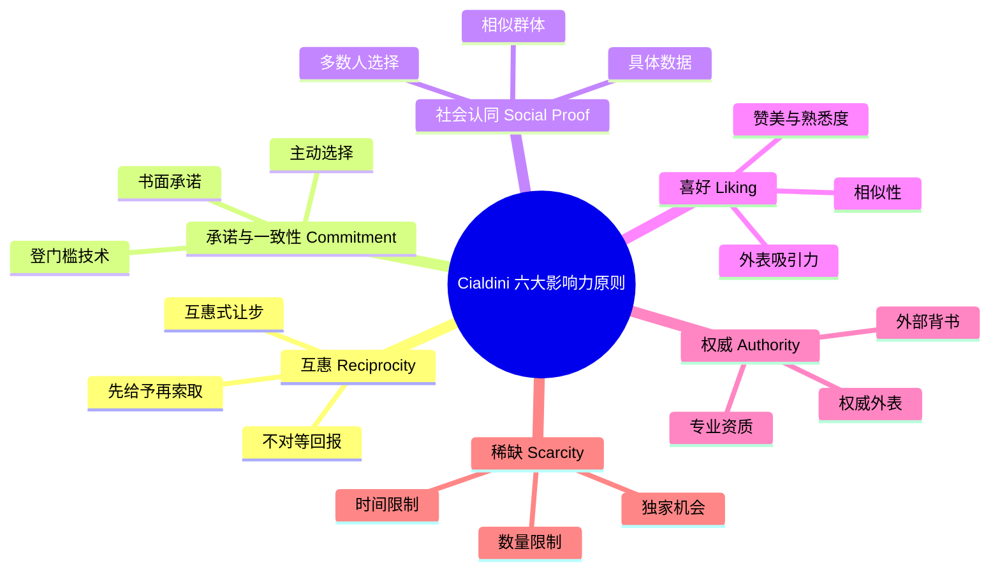
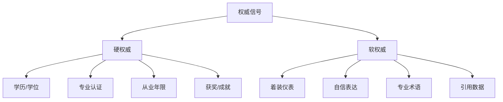
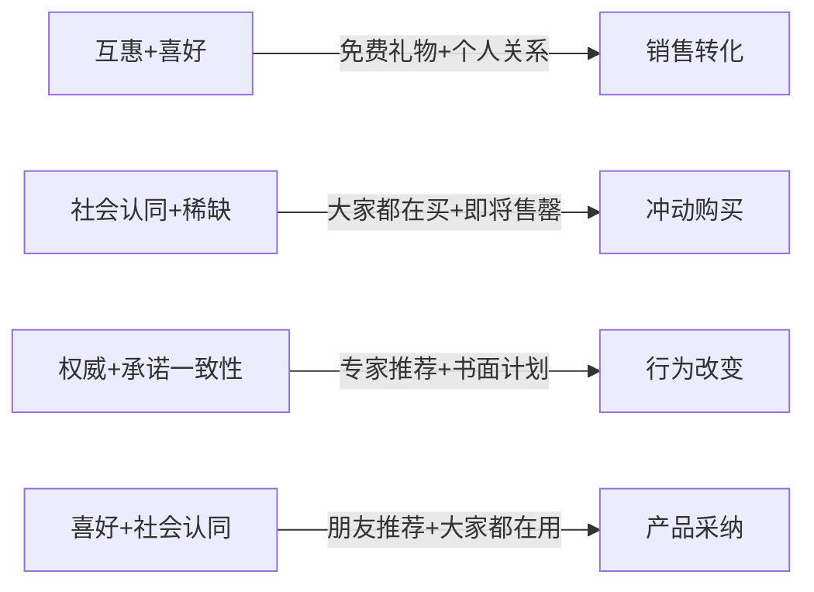
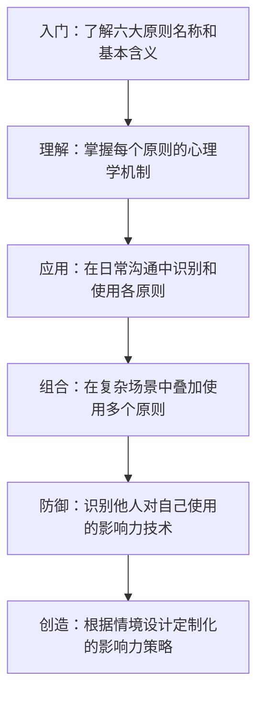

## 二、Cialdini影响力六大原则

Robert B. Cialdini是亚利桑那州立大学心理学与市场营销学终身教授，同时在斯坦福大学、俄亥俄州立大学担任访问学者，被誉为"影响力教父"。他历时三年、以"卧底"方式深入汽车经销商、电话募捐组织、广告公司、房地产机构、慈善组织等说服现场，于1984年出版《影响力：说服的心理学》（*Influence: The Psychology of Persuasion*），至今全球销量超500万册，被翻译成30多种语言，连续多年位列《纽约时报》畅销书榜。2021年他又出版《先发影响力》（*Pre-Suasion*），补充了注意力引导和情境铺垫在说服发生前的关键作用。2024年，他与同事合著出版《影响力与说服的升级版》（*Influence: New and Expanded*），在原有六大原则基础上加入了大量新研究证据和数字化时代的应用案例。

Cialdini的研究方法论本身就是一个值得学习的案例。他没有采用传统实验室研究的路径，而是花了三年时间"潜入"各种实际说服场景——二手车销售员、保险代理人、募捐组织、广告公司——像人类学家一样观察、记录、分析说服者的具体行为。这种"田野调查+实验验证"的双轨方法论，使他的理论既有生态效度（贴近真实世界），又有内部效度（实验证实了因果关系）。

Cialdini提出六大影响力原则（后来在《Pre-Suasion》中补充了第七条"统一性/Unity"），其核心洞察是：**人类决策并非完全理性，而是大量依赖心理捷径（heuristics）**。这些捷径在大多数时候高效且正确——比如"专家说的通常比外行更可靠""大家都在排队的餐厅通常不错"——但也因此可被系统性地触发和利用。

### 为什么影响力原则有效：双系统理论框架

理解Cialdini的六大原则，需要先理解Daniel Kahneman提出的"双系统理论"（Dual Process Theory），这是这些原则生效的认知基础：

| 系统 | 特征 | 决策模式 | 对应启发式 |
|------|------|---------|-----------|
| 系统1（快思考） | 自动化、无意识、快速、低能耗 | 基于线索和模式的直觉判断 | 六大原则主要激活此系统 |
| 系统2（慢思考） | 刻意、有意识、缓慢、高能耗 | 逻辑分析和理性权衡 | 说服防御需要激活此系统 |

六大影响力原则之所以有效，本质上是因为它们**绕过系统2的审查，直接触发系统1的自动化响应**。当一个人看到"仅剩最后3件"时，大脑并不是在理性评估"我是否真的需要这个"，而是在系统1层面直接触发了损失厌恶的情绪反应。理解这一点，既是你使用影响力技术的基础，也是你防御他人影响你的关键。

### 六大原则全景图

| 原则 | 核心驱动力 | 触发条件 | 典型心理机制 | 进化根源 |
|------|-----------|---------|-------------|---------|
| 互惠 | 亏欠感 | 收到他人给予 | 内疚回避、社会规范 | 群体合作生存 |
| 承诺与一致性 | 认知协调需求 | 做出承诺/选择 | 认知失调消除 | 稳定预期降低交易成本 |
| 社会认同 | 不确定性下的安全 | 信息模糊、群体行为 | 从众效应、信息级联 | 群体智慧、危险预警 |
| 喜好 | 情感亲近 | 接触正面刺激 | 光环效应、情感启发 | 亲属偏爱、联盟选择 |
| 权威 | 服从惯性 | 权威信号出现 | 启发式判断、责任转移 | 社会分工、等级服从 |
| 稀缺 | 损失恐惧 | 资源减少/竞争加剧 | 损失厌恶、心理抗拒 | 资源竞争、生存本能 |

---

### 2.1 互惠原则（Reciprocity）

#### 核心机制

当别人给予我们某物时，我们会感到强烈的义务去回报。这种"亏欠感"不是文化教养的产物，而是根植于人类社会合作的进化基础。考古学和人类学的证据表明，互惠规范是人类从小型狩猎采集社会发展到复杂文明的关键基石——没有互惠，就没有分工合作。

互惠原则之所以特别强大，有三个关键原因：

1. **不对等性**：回报的价值不必等于（甚至不必接近）所获。实验表明，免费样品可以撬动数倍于其价值的购买行为。一项针对餐厅服务生的研究发现，在账单上放一颗巧克力可以使小费增加18%；放两颗巧克力（先给一颗，然后说"因为您人很好，再给您一颗"）可以使小费增加21%。
2. **跨领域性**：你在A领域给予我的好处，可以在B领域要求我回报。Hawaii大学的Dennis Regan实验中，参与者因为实验助手"恰巧"买了一瓶可乐，就在后续完全不相关的"艺术品评分"任务中给予更高评价。
3. **强制性**：互惠不是一种"建议"，而是一种深层的社会规范。违反它会带来真实的不适感——不仅是社会评价的降低，更是内在的心理压力。

#### 心理学基础

违反互惠规范会激活大脑中与惩罚相关的区域（前扣带皮层和前脑岛），产生真实的生理不适。神经经济学研究（Tabibnia et al., 2008）显示，收到他人善意时，大脑的奖励中枢（伏隔核）被激活，形成"给予—愉悦"的正向循环。

fMRI研究还发现了一个有趣的不对称性：**给予行为比接受行为激活更强的奖励回路**。这解释了为什么很多人在帮助他人后感到"温暖的光芒"（warm glow）。互惠不仅仅是义务驱动的，也是愉悦驱动的。

互惠规范的强度在不同文化中略有差异，但普遍存在。Marcel Mauss在《礼物》（1925）中最早系统论述了礼物交换的社会约束力——在所有人类社会中，礼物都带有隐性的偿还义务。Gouldner（1960）正式提出"互惠规范"（norm of reciprocity），认为它是所有社会的"基本道德准则"。Alvin Gouldner还区分了两种互惠规范：

- **均衡互惠（Balanced Reciprocity）**：给予和回报大致等价，适用于陌生人和商业关系
- **普遍化互惠（Generalized Reciprocity）**：不期待即时回报，适用于亲密关系和家庭

#### 跨文化视角

不同文化对互惠的理解和实践存在显著差异：

| 文化维度 | 集体主义文化（东亚、拉美） | 个人主义文化（北美、北欧） |
|----------|-------------------------|-------------------------|
| 互惠强度 | 极强——不回报被视为道德缺陷 | 较强——但仍被视为基本礼貌 |
| 回报时间 | 允许较长的延迟回报 | 期望相对快速的回报 |
| 互惠范围 | 广泛——涉及关系网络的方方面面 | 局限——通常限于具体事项 |
| 人情债 | 深刻的社会概念，影响关系动态 | 较轻，不回报的社会代价较小 |
| 礼物文化 | 复杂的礼尚往来规则（如中国的"份子钱"） | 相对简单的礼物交换 |

在中国文化中，互惠原则表现得尤为深刻。"人情"（renqing）不仅是一个词汇，而是一套完整的社会交换体系。欠了人情需要还，而且通常要"加倍奉还"。这使得在中国社会中使用互惠策略需要格外注意——给予太大的好处反而可能让对方感到压力而回避。

#### 应用框架：互惠四步法

**第一步：识别对方需要什么**
- 信息需求（行业洞察、数据、最佳实践）
- 情感需求（认可、理解、关注）
- 资源需求（时间、人脉、工具）
- 技能需求（知识传授、问题解答、经验分享）

**第二步：无条件给予**
- 给予时不要暗示回报要求
- 让给予显得真诚而非策略性
- 个性化比标准化有效10倍（给对方真正需要的，而非你想给的）
- 给予的时机比给予的价值更重要——在对方最需要的时候出现

**第三步：允许自然的回报循环**
- 给对方回报的途径和机会
- 不要急于兑现——互惠的回报往往滞后且放大
- 接受对方的回报（即使很小），这维持了互惠循环

**第四步：在恰当的时机提出请求**
- 给予后立即提出请求会触发警觉（太刻意）
- 最佳窗口：给予带来的感激度最高、但还未消退时（通常1-7天）
- 提出请求时，将它与你之前的给予建立自然连接

#### 经典案例与数据

| 案例 | 机制 | 效果数据 |
|------|------|---------|
| 超市免费试吃 | 产品互惠 | 购买转化率提升33%-67%（Dataessential, 2019） |
| 酒店免费升级 | 服务互惠 | 小费增加23%，回头率提高18% |
| HubSpot免费工具+博客 | 知识互惠 | 入站营销模式带来$10亿+营收 |
| 圣诞卡实验（Kunz, 2000） | 礼物互惠 | 收到陌生人圣诞卡的家庭，回复率高达20% |
| Wikipedia年度募捐 | 价值互惠 | "您已经免费使用了X天"比"请捐款"有效2.3倍 |
| Dropbox免费存储空间 | 功能互惠 | 免费用户转化率39%，估值$100亿 |
| Costco免费试吃站 | 体验互惠 | 试吃产品的即时购买率高达67%，远超非试吃区 |

#### 互惠式让步（拒绝-后退策略）

这是互惠原则的高级变体。Cialdini称之为"door-in-the-face"技术（直译为"门面技术"）：

1. 先提出一个大请求（预期被拒绝）
2. 退让到一个中等请求（真实目标）
3. 对方因为你的"让步"而感到有义务也让步

**实验数据**：请求学生陪少年犯去动物园——
- 直接请求中等规模（2小时陪伴）：同意率17%
- 先请求大任务（每周2小时、持续2年）→ 退让到中等请求：同意率50%

**关键要点**：退让必须让对方感到是你在"妥协"，而非原本就想好的策略。如果对方察觉这是预设的策略，效果会急剧下降甚至逆转。

**互惠式让步 vs 登门槛技术的对比**：

| 维度 | 互惠式让步（door-in-the-face） | 登门槛技术（foot-in-the-door） |
|------|-------------------------------|-------------------------------|
| 方向 | 从大到小 | 从小到大 |
| 机制 | 对方因为你的让步而感到回报义务 | 对方因为先前承诺而保持一致性 |
| 适用场景 | 当你有合理的"大请求"可以提出 | 当你能获得低成本的初始承诺 |
| 风险 | 大请求可能让对方直接拒绝并离开 | 速度慢，需要多次接触 |
| 最佳实践 | 先说一个你确实需要但不太指望实现的请求 | 先获取一个几乎不会被拒绝的小承诺 |

#### 常见误区与纠正

| 误区 | 纠正 |
|------|------|
| 给予越大效果越好 | 给予的价值不在于大小，而在于个性化和真诚度 |
| 给了就必须马上要回报 | 互惠有延迟效应，急于兑现反而破坏信任 |
| 只能在相同领域回报 | 互惠是跨领域的：你帮过他的忙，他更可能买你的产品 |
| 所有人都会遵守互惠规范 | 少数人（约3-5%）对互惠不敏感，不能作为唯一策略 |
| 虚假给予有效 | 被识破的策略性给予会产生反效果（逆火效应） |
| 给予必须是物质性的 | 关注、认可、信息分享同样触发互惠义务 |

---

### 2.2 承诺与一致性原则（Commitment and Consistency）

#### 核心机制

一旦做出承诺（特别是公开的、主动的、付出努力的承诺），人们会强烈倾向于保持言行一致，即使后续行为明显不是最优选择。这不是理性选择的结果，而是一种自动化的行为倾向——大脑为了减少认知负荷，会将"之前的选择"作为"未来选择"的默认值。

Cialdini强调了触发一致性行为的三个关键条件：
1. **公开性**：公开承诺比私下承诺约束力强3-5倍。当你说出"我要减肥"并在朋友圈发了对比照，你的承诺约束力比在心里默念强得多。
2. **主动性**：主动选择比被动接受的承诺更有力。问卷中主动勾选"I will vote"比被告知"You will vote"产生更强的行为改变。
3. **付出性**：付出努力或代价获得的承诺更持久——这解释了为什么入会仪式越严苛的组织，成员忠诚度越高（即"宜家效应"的前身：你投入劳动组装的家具，你对它的评价更高）。

#### 心理学基础

Leon Festinger的认知失调理论（Cognitive Dissonance Theory, 1957）是承诺一致性的理论基础。当行为与态度不一致时，人会产生心理不适（cognitive dissonance），大脑会自动调和这种不一致——通常是改变态度来匹配行为，而非相反。这是因为改变过去的行为是不可能的（时间不可逆），但改变当下的认知是可行的。

**认知失调的经典实验：$1/$20实验（Festinger & Carlsmith, 1959）**

- 被试被要求完成一项极其无聊的任务
- 之后被要求告诉下一位被试"这个任务很有趣"
- 一组获得$1报酬，另一组获得$20报酬
- 结果：获得$1的被试后来真的认为任务比较有趣，获得$20的被试则没有改变看法
- 解释：$20的被试可以用"我撒谎是为了钱"来合理化行为（外部归因），而$1的被试找不到足够的外部理由，只能改变自己的态度来消除失调（内部归因）

这个实验揭示了一个深刻的洞察：**承诺的效果与奖励强度成反比**。过度的外部奖励反而会削弱内在承诺——这对教育、管理和激励设计都有重要启示。

神经科学研究表明，违背承诺激活的脑区（前扣带皮层、背外侧前额叶）与处理错误和冲突的区域高度重叠，说明"违背自我承诺"在大脑中确实被当作一种"错误"来处理。

#### 经典实验详解

**Freedman & Fraser的"门前挂牌"实验（1966）**

这是"登门槛技术"（foot-in-the-door technique）的开创性实验：

- **条件组**：先请求居民在窗户上贴一个3英寸的"安全驾驶"小标志（几乎所有家庭都答应了），两周后再请求在院子里竖一块巨大的、不美观的安全驾驶广告牌
- **对照组**：直接请求竖大广告牌
- **结果**：条件组同意率76%，对照组仅17%

**核心发现**：小承诺像一个"行为锚点"，一旦人们在某个议题上形成了"我是那种会配合的人"的自我认知，后续更大的请求就会被同化到这个自我形象中。

**Deutsch & Gerard的修正研究（1955）**进一步验证了公开性和主动性的作用：
- 私下写下估计：承诺约束力最弱
- 公开口头表达：中等约束力
- 公开书面承诺+签名：最强约束力

**"写下来"效应**（多个研究汇总）：

- 仅口头承诺每周锻炼：实际坚持率约35%
- 写下锻炼计划：坚持率提升至约50%
- 写下计划并每周向朋友汇报：坚持率超过65%
- 写下计划+公开展示+设立违约惩罚：坚持率超过80%

#### 应用实操模板

**登门槛技术的标准流程：**

阶段1：请求一个"不费力的是"
  → "您能花30秒回答一个简单问题吗？"
  → "您愿意订阅我们的免费周报吗？"
  → "您方便先看一页我们的案例介绍吗？"

阶段2：强化承诺（让对方主动表达）
  → "是什么让您决定尝试这个方案？"
  → "您对这个方向的看法是什么？"（让对方用自己的话表达支持）
  → 书面确认：邮件、签字、公开表态

阶段3：提出真实请求
  → 基于之前的承诺提出更大请求
  → 将新请求与已有承诺建立逻辑连接
  → "既然您认同了X原则，那么Y行动正是它的自然延伸"

**低球技术（Low-Ball Technique）：**

1. 先以极具吸引力的条件获得对方承诺
2. 在承诺已做出、对方已开始心理投入后，逐步引入真实条件
3. 由于承诺已形成，对方倾向于接受修改后的条件

**经典案例**：汽车销售员先报一个极具吸引力的价格，让顾客决定购买（做出承诺），然后在签合同过程中"发现"这个价格不包含某些必要的附加费用。由于顾客已经做出了购买承诺（甚至已经在心理上拥有了这辆车），他们倾向于接受调整后的更高价格。

**注意**：低球技术具有伦理争议，适用于合法的商业场景（如起始价格优惠后逐步揭示完整方案），但不应用于欺诈。

**承诺一致性在谈判中的应用**：

在谈判中，一致性原则可以用来锁定对方的立场。具体做法是：
1. 在谈判早期阶段，让对方做出对某个原则或价值的认同性表态
2. 在后续讨论中，将你的提案与该原则联系起来
3. 如果对方拒绝你的提案，就指出他们之前对该原则的认同，制造一致性压力

#### 现代应用

| 场景 | 具体做法 | 原理 |
|------|---------|------|
| SaaS产品引导 | 免费注册→创建第一个项目→邀请团队→升级付费 | 小承诺逐步升级 |
| 社交媒体营销 | 先让用户点赞→评论→分享→购买 | 公开承诺递增 |
| 健身App | 先设定小目标→每周记录→公开分享进度 | 书面+公开承诺 |
| 销售跟进 | "上次您提到X痛点，这是我们针对性的方案" | 将需求转化为承诺 |
| 环保行为 | 先签署小承诺卡→家庭节能竞赛→社区倡导 | 身份认同+公开承诺 |
| 电商购物车 | "加入心愿单"→"加入购物车"→"确认订单" | 渐进式承诺阶梯 |
| 教育目标 | 学期初写下学习目标→张贴在墙上→定期自评 | 书面+公开+周期性强化 |

#### 承诺一致性的防御策略

承诺一致性是六大原则中最难防御的一个，因为它利用了你自己的"一致性需要"。防御方法：

1. **暂停并重启系统2**：当你感觉到"我已经答应了，所以我必须继续"的想法时，停下来问自己："如果我现在第一次面对这个请求，没有任何先前承诺，我还会答应吗？"
2. **区分身份承诺和行为承诺**：说"我是一个注重健康的人"（身份承诺）比说"我这周会去三次健身房"（行为承诺）更灵活——身份承诺允许具体行为的调整。
3. **允许自己改变立场**：最强大的防御是接受"改变主意不是软弱，而是理性"这个认知。真正的理性人不应该被过去的非最优承诺所束缚。

---

### 2.3 社会认同原则（Social Proof）

#### 核心机制

当人们不确定如何行动时，会参考他人的行为来指导决策。"别人都在做"是人类决策中最强大的启发式之一。社会认同的强度取决于三个变量：

1. **不确定程度**：越不确定，越依赖社会认同。当你不知道哪家餐厅好，你会看哪家排队长。
2. **相似程度**：参照对象与自己越相似，影响力越大。"和你一样是大学生的用户都选了这个套餐"比"大多数人都选了这个套餐"有效得多。
3. **数量程度**：采用同一行为的人数越多，信号越强。但存在一个"饱和阈值"——超过某个数量后，边际效果递减。

#### 心理学基础

社会认同源于进化。在远古环境中，"其他人都在跑"意味着危险——不跟着跑的个体被淘汰。这种"从众"本能深深刻在我们的神经系统中。

Solomon Asch的从众实验（1951）是社会心理学最经典的实验之一：

- 7-9名被试围坐在一张桌子旁，判断线段长度（答案显而易见）
- 其中只有一名是真正的被试，其余都是实验助手
- 实验助手故意给出一致的错误答案
- 结果：约37%的被试会因为群体的一致错误答案而放弃自己的正确判断
- 后续研究发现，如果有一名同伴给出正确答案，从众率下降到5%——**打破一致性比增加人数更有效**

信息级联（Information Cascade）理论（Bikhchandani et al., 1992）解释了社会认同如何导致群体行为的链式反应：每个人观察前人的选择后做出相同选择，即使这个选择最初可能只是前两个人的偶然偏好。这解释了为什么市场上某些产品会突然爆红，也会突然消亡——不是产品质量发生了变化，而是信息级联的方向改变了。

#### 社会认同的五大类型

| 类型 | 描述 | 应用场景 | 效果强度 |
|------|------|---------|---------|
| 专家认同 | 行业专家推荐 | 专业产品、B2B决策 | 高 |
| 同行认同 | 同类人群的选择 | 消费决策、生活方式 | 极高 |
| 群众认同 | 大众的普遍行为 | 电商平台、热门排行 | 中等 |
| 朋友认同 | 身边人的使用 | 社交推荐、口碑营销 | 极高 |
| 用户认同 | 真实用户的反馈 | 评价系统、案例展示 | 高 |

**同行认同的特殊力量**：研究表明，"你的同行/同龄人/同行业的人正在使用"这种表述比笼统的"很多人在使用"有效2-3倍。这解释了为什么LinkedIn展示"你的X个联系人也在使用这个工具"比"全球500万用户"更有说服力。

#### 经典实验与数据

**酒店毛巾复用实验（Goldstein, Cialdini & Griskevicius, 2008）**

四种提示语的效果对比：

| 提示语内容 | 毛巾复用率 |
|-----------|-----------|
| "请帮助保护环境"（标准环保提示） | 35.1% |
| "本酒店已经为环保做出了贡献" | 36.4% |
| "本酒店大多数客人选择复用毛巾" | 44.1% |
| "住在您这间客房的客人大多数选择复用" | 49.1% |

关键发现：**越具体、越与自己相似的社会认同，效果越强**。"住在您这间客房的客人"比"本酒店客人"更有说服力，因为相似性更高（他们住过同一间房，暗示相似的消费水平和旅行偏好）。

**纽约地铁犯罪率下降（1990年代）**

新任地铁局长William Bratton采用了"破窗理论"——不是先打击重大犯罪，而是先清除涂鸦、抓逃票者。这个策略的底层逻辑正是社会认同：一个干净有序的环境传达"这里的人都守规矩"的社会认同信号，从而抑制犯罪行为。地铁犯罪率在5年内下降了75%。

**COVID-19疫苗接种行为研究（2021）**

多项研究发现，告知人们"大多数邻居已经接种了疫苗"比提供疫苗安全性的科学证据更能促进接种意愿。社会认同在公共健康领域的应用潜力巨大，但同时需要谨慎——错误的社会认同信息（"大多数人都不接种"）同样具有强大的负面影响力。

#### 数字时代的社会认同

| 平台/场景 | 社会认同信号 | 效果数据 |
|----------|-------------|---------|
| 电商（Amazon） | 评分+评论数量 | 评分每增加1星，收入增加5%-9%（Harvard Business School） |
| SaaS网站 | "X家公司正在使用" | 展示客户logo后注册转化率提升20%-40% |
| 内容平台 | 阅读量/点赞数 | 高互动内容的后续互动率提升2-3倍 |
| 众筹 | 已筹金额+支持者数 | 30%目标达成后，资助速度显著加快 |
| App Store | 下载量+评分 | 4.5星以上App的下载率是3星的3-4倍 |
| 抖音/TikTok | 播放量、评论数 | "100万播放"标签本身即构成社会认同 |
| 知乎/小红书 | 赞同数、收藏数 | 高赞回答获得后续赞的速度呈指数增长 |

**社会认同的数字化陷阱——"假评论生态"**：

据哈佛商学院2020年研究，Amazon上约30%的评论可能是虚假的。这不仅损害消费者利益，也削弱了社会认同信号的可靠性。平台正在通过AI检测、购买验证、评论追溯等手段应对，但这是一个持续的军备竞赛。

#### 反面案例：社会认同的陷阱

**旁观者效应（Bystander Effect）**：在紧急情况中，旁观者越多，每个人采取行动的概率越低。这是因为每个人都看着别人没行动，从而推断"可能不需要行动"——社会认同在错误的方向上发生了作用。

1964年Kitty Genovese案是这个效应的最著名（也最悲剧的）例证：一名年轻女性在纽约街头被袭击长达35分钟，38名邻居目睹了这一事件，但几乎没有人报警（后来的研究对这个案例的事实细节有争议，但它引发了大量关于旁观者效应的严肃研究）。

**对策**：需要帮助时，不要对人群喊"救命"，而是指定具体的人："穿红色外套的先生，请帮我拨打120"——这打破了社会认同的循环，将扩散的责任重新聚焦到个人。

**社会认同导致的泡沫和恐慌**：

社会认同不仅影响个体行为，还可能导致系统性的群体失灵。2008年金融危机中的次贷泡沫、2021年GameStop股票暴涨、加密货币市场的暴涨暴跌，底层都有社会认同的影子：当"所有人都在赚钱"时，更多人加入；当"所有人都在抛售"时，恐慌蔓延。

#### 常见误区

| 误区 | 纠正 |
|------|------|
| 数量越大效果越好 | 质量和相关性比数量更重要。10个详细的真实评价 > 1000个空洞的5星 |
| 可以伪造社会认同 | 虚假评论一旦被识破，信任崩塌不可逆。且违反多国消费者保护法 |
| 负面评价只有害处 | 适度负面评价反而增加可信度（95%纯好评比92%好评更可疑） |
| 社会认同对所有人都有效 | 高自我监控型个体更依赖社会认同；低自我监控型个体更依赖个人判断 |
| 社会认同可以替代产品质量 | 社会认同只是放大器——放大好的，也放大差的 |

---

### 2.4 喜好原则（Liking）

#### 核心机制

我们更容易被自己喜欢的人说服。这不是秘密——但真正深刻的是：喜好不是随机的情感，而是可以通过五个系统性因素来建立和加强的。Cialdini总结了喜好原则的五大来源。

#### 喜好五要素

**1. 外表吸引力（Physical Attractiveness）**

外表吸引力的影响远超人们的预期。Dion等人（1972）的"美即是好"（what is beautiful is good）实验表明，外表有吸引力的人被默认赋予更多正向品质：更聪明、更善良、更成功。

这不是肤浅——这是进化。面部对称性与健康基因高度相关，大脑的审美判断在200毫秒内完成（Willis & Todorov, 2006），远在理性分析介入之前。

但"外表吸引力"不限于天生的面容。研究表明，以下因素显著影响他人对你吸引力的判断：

| 因素 | 影响程度 | 可控性 |
|------|---------|--------|
| 面部对称性 | 高 | 低（先天） |
| 服装整洁度 | 中高 | 高 |
| 体型和姿态 | 中高 | 中高 |
| 微笑和表情 | 高 | 高 |
| 头发和皮肤护理 | 中 | 高 |
| 自信的身体语言 | 高 | 高 |

**关键洞察**：外表吸引力的效应在书面沟通中表现为"信息的视觉包装"——排版精美的文档、设计专业的演示文稿、高质量的配图，都能触发类似的"美即是好"效应。

**2. 相似性（Similarity）**

我们喜欢与自己相似的人——包括外表、兴趣、背景、价值观、甚至名字。Byrne（1971）的研究表明，态度相似性与人际吸引力之间存在近乎线性的正相关关系。

**相似性的层次结构**：

表层相似：穿着风格、语言习惯、使用的技术产品
中层相似：教育背景、职业经历、生活阶段
深层相似：价值观、世界观、人生目标、核心信念

研究表明，表层相似性在初期接触中效果最强（破冰阶段），但深层相似性在长期关系中更为重要。在说服场景中，最佳策略是先用表层相似性建立连接，再发现和强调深层相似性来巩固关系。

**名字效应**：人们会对与自己名字相似的人产生无意识的好感（姓名字母效应，Nuttin, 1985）。精明的销售人员会模仿客户的名字风格（如"叫我小李就好" vs "请叫我李总"）来匹配对方的社交偏好。

**3. 赞美（Compliments）**

真诚的赞美是建立好感最快速的方式。即使是明显带有目的性的赞美，也仍然会产生正面效果——这被称为"奉承者的红利"（Gordon, 1996）。

**但注意区分**：
- 真诚的赞美：具体、有观察基础、针对对方真正在意的事。"你刚才对这个项目风险的分析非常到位，我没想到那个维度"比"你真厉害"有效100倍。
- 虚伪的赞美：笼统、过度夸张、针对显而易见的事。虚伪赞美在短期内仍有效（因为人们倾向于相信赞美），但在长期关系中会严重损害信任。

**赞美的科学配方**：
1. **具体性**：说清楚你赞美的是什么（"你PPT中那个数据可视化的方式"而非"你的PPT很好"）
2. **真诚性**：确保赞美基于真实的观察
3. **意外性**：赞美对方不太被赞美的方面，效果更强
4. **私密性**：私下赞美比公开赞美更显得真诚（但公开赞美有社会认同的叠加效应）

**4. 接触与熟悉度（Contact and Familiarity）**

单纯曝光效应（Mere Exposure Effect）是心理学中最稳健的发现之一（Zajonc, 1968）：仅仅是反复出现就能增加好感度。广告的大部分效果并非来自信息传递，而是来自品牌曝光。

**单纯曝光效应的条件**：

并非所有曝光都产生好感。有效的曝光需要满足以下条件：
- **频率适中**：过度曝光会导致厌倦（倒U型曲线）。最佳曝光次数因情境而异，通常是3-7次。
- **间隔分布**：分散的曝光比集中的曝光更有效。一周一次持续一个月 > 一天七次。
- **环境正面**：接触必须发生在正面或中性的环境中。负面接触反复曝光会强化负面印象。
- **变异适度**：每次接触有适度的变化比完全重复更有效。

**实操应用**：
- 多次轻度接触比一次深度接触更有效
- 社交媒体上的持续互动比偶尔的长文更有效
- 在不同的渠道（邮件、社交、电话、线下）交叉曝光比单一渠道更有效
- 名片交换、行业会议、在线社群参与都是低成本的曝光策略

**5. 关联效应（Association）**

与正面事物关联能转移好感——这是"光环效应"在人际关系中的具体体现。与负面事物关联则相反。

**正面案例**：赞助体育赛事的品牌获得球迷的好感；与知名人士合影可以提升自身形象；将产品与积极情绪场景（家庭团聚、成功时刻）关联。
**反面案例**：传递坏消息的人被称为"斩杀信使"（shoot the messenger）——即使他与坏消息毫无关系。研究表明，宣布裁员的HR经理即使只是执行上级命令，也会被员工在情感上"惩罚"。

**关联效应在营销中的应用**：
- 选择与目标受众认可的形象/人物合作
- 将品牌与受众渴望的生活方式关联
- 避免与争议性话题或负面事件产生关联
- 利用"品牌联合"（co-branding）来借用另一个品牌的正面形象

#### 应用框架：好感建立五步法

1. 研究阶段：了解对方的背景、兴趣、痛点
2. 建立连接：寻找共同点（同校、同城、同好、共同朋友）
3. 真诚给予：给予赞美、帮助、有价值的信息
4. 持续互动：保持适度、正面的接触频率
5. 关联建设：将自己与对方关心的正面事物建立连接

#### 喜好原则的深度应用：镜像技术

心理学中的"镜像效应"（Mirroring）是喜好原则在互动中的具体技术。研究表明，当一个人无意识地模仿对方的身体语言、语速、用词时，对方的好感度会显著提升（Chartrand & Bargh, 1999）。

**有效的镜像技术**：
- **语言镜像**：使用对方的术语、行话、语言风格
- **语速镜像**：匹配对方的说话速度
- **情绪镜像**：与对方的情绪状态保持一致
- **身体语言镜像**：适度模仿对方的姿势和手势（需要非常自然，刻意模仿会适得其反）

**注意**：镜像技术的使用必须极其自然。如果对方察觉你在模仿他，会产生强烈的不适感和不信任感。

#### 喜好原则的防御指南

了解喜好原则不仅是为了应用它，更是为了识别自己何时被它影响：

- **问自己**："如果换一个我不喜欢的人来提出同样的请求，我还会答应吗？"
- **将人与提议分离**：评价方案本身的价值，而非提出方案的人
- **警惕过快建立的好感**：当一个陌生人在30秒内让你感到"这个人真不错"时，停下来想想
- **延迟决策**：在产生强烈好感后做出的重大决定，给自己24小时冷静期
- **引入第三方视角**：请一个不受对方影响的人评估提案

---

### 2.5 权威原则（Authority）

#### 核心机制

人们倾向于服从权威人物的指示和建议，即使这些指示与自己的判断相矛盾。权威的力量来源于两个层面：

1. **认知层面**：听从专家意见通常是最优决策策略（信息不对称下，专家判断优于外行）。在复杂的世界中，我们不可能对所有事情都拥有专业知识，因此"听专家的"是一个高效的决策捷径。
2. **情感层面**：服从权威可以转移责任——"是专家让我这么做的"。这减轻了个人决策的焦虑和责任。

#### Milgram服从实验（1961-1963）

这是心理学史上最著名（也最具争议）的实验之一。

**实验设计**：
- 被试被告知参加"学习与惩罚"实验
- 被试扮演"教师"，在实验员（权威）的指示下，对隔壁房间的"学生"（实为演员）施加电击
- 电击强度从15伏特逐步升级到450伏特（标为"危险：极度电击"）
- 实验过程中，"学生"会发出痛苦的尖叫、恳求停止、最终沉默

**实验结果**：
- 65%的被试一路执行到了450伏特的最大电击
- 所有被试在300伏特之前都继续了实验
- 后续变体实验表明，权威的"物理距离"和"合法性感知"显著影响服从率

**关键启示**：权威效应不依赖于权威的真实能力，而依赖于权威的**感知信号**。大多数人不是因为相信实验员在科学上有权威才服从，而是因为白大褂、"耶鲁大学"的标签和自信的语气构成了权威信号。

**Milgram实验的变体揭示了权威效应的边界条件**：

| 变体条件 | 最高服从率 | 启示 |
|---------|-----------|------|
| 原始实验（权威在场） | 65% | 基准 |
| 权威通过电话指示 | 21% | 物理距离大幅削弱权威效应 |
| 两个权威给出矛盾指示 | 0% | 权威的一致性是效果的前提 |
| 普通人代替实验员 | 20% | 头衔和外表显著影响服从率 |
| 在破旧办公楼进行 | 48% | 环境影响合法性感知 |

#### 权威的四大信号

| 信号 | 具体表现 | 作用机制 |
|------|---------|---------|
| 头衔 | 博士、教授、CEO、总监 | 知识/能力的代理指标 |
| 外表 | 穿着、仪表、配饰 | 200毫秒内的第一印象判断 |
| 身份标志 | 徽章、制服、名车 | 社会地位的视觉符号 |
| 知识展示 | 使用专业术语、引用数据 | 专业能力的即时证明 |

**头衔的"溢出效应"**：研究表明，拥有一个头衔的人不仅在该头衔相关领域被赋予更高权威，在不相关的领域也会被高估。这被称为"光环溢出"——一个"博士"不仅在学术问题上被认为更可靠，甚至在无关的生活建议上也被认为更智慧。

**着装的量化效果**：一项经典研究发现，行人看到穿制服（如保安制服）的人闯红灯时，跟随闯红灯的概率是看到穿便装的人闯红灯时的3.5倍。

#### 应用策略

**如何建立自身权威**：
- 系统性地积累和展示资质（学历、认证、奖项、从业年限）
- 引用权威来源（学术论文、行业报告、政府数据）
- 展示第三方背书（媒体采访、名人推荐、知名客户）
- 展示专业知识深度（发表专业文章、做行业演讲）
- 用数据和案例说话，而非空洞声明
- 主动暴露不完美：承认自己不知道的事，反而增强在你知道的事上的可信度（"坦诚的权威"比"全知的权威"更可信）

**如何借用他人权威**：
- 引用行业专家的观点支持自己的立场
- 展示知名客户的合作案例
- 获得行业协会或权威机构的认证
- 在权威场合发言（行业会议、学术论坛）
- 将你的产品/方案与权威标准关联（"符合ISO 27001认证""基于哈佛商学院案例方法论"）

**权威信号的层次结构**：

#### 权威在数字时代的挑战与机遇

**挑战**：
- 互联网降低了信息门槛，"伪专家"泛滥
- 社交媒体让任何人都可以"表演"权威
- AI生成内容使得伪造专业内容变得容易
- 权威去中心化——传统权威的影响力正在下降

**机遇**：
- 内容营销可以系统性地建立"数字权威"
- 长期持续输出专业内容可以建立真实的专业信誉
- 平台认证（如LinkedIn认证、知乎认证）提供了新的权威信号
- 用户生成的专业内容（技术博客、开源项目）创造了新的权威路径

**如何在数字时代建立权威**：
1. **持续输出**：在特定领域持续发布高质量内容（至少6个月以上）
2. **深度垂直**：专注于一个细分领域比泛泛涉猎更有权威感
3. **数据驱动**：在内容中引用具体数据和案例
4. **可验证性**：提供可验证的证据（代码仓库、项目链接、客户评价）
5. **社区参与**：在专业社区中活跃回答问题、提供建议

#### 权威的防御与辨识

**如何避免盲目服从权威**：

1. **验证权威的真实性**：头衔是否可验证？资质是否在相关领域？
2. **检查利益冲突**：这个"权威"是否从说服你中获利？一个推荐某品牌的"专家"是否收了代言费？
3. **区分领域边界**：一个物理学诺贝尔奖得主在营养学上的发言，并不比普通医生更权威
4. **注意"权威错觉"**：穿白大褂的人在广告中推荐的药物，不代表经过医学验证
5. **寻找反对意见**：在做重大决定前，主动搜索该权威观点的反对声音

**两道防御问题**：
- "这个人真的是这个领域的专家吗？"
- "这个专家在这个特定问题上是否诚实可信？"

**实用的权威验证清单**：

□ 他的头衔/资质是否可在官方渠道验证？
□ 他的专业领域是否与当前议题直接相关？
□ 他是否从说服我中获得利益？
□ 是否有同等级别的专家持相反观点？
□ 他提供的证据是否可独立验证？
□ 他是否承认了自己的局限和不确定性？

---

### 2.6 稀缺原则（Scarcity）

#### 核心机制

当某物变得稀缺或可能失去时，人们会赋予它更高的价值。稀缺原则是六大原则中情绪驱动力最强的一个——它直接触发损失厌恶（Loss Aversion）和心理抗拒（Psychological Reactance）双重机制。

#### 心理学基础

**损失厌恶（Kahneman & Tversky, 1979）**

前景理论（Prospect Theory）的核心发现：失去100元的痛苦约为获得100元快乐的2-2.5倍。这意味着"可能会失去"比"可以获得"具有更强的行动驱动力。

**损失厌恶的神经基础**：fMRI研究（Kuhnen & Knutson, 2005）发现，损失预期激活杏仁核（恐惧和焦虑中心），而收益预期激活伏隔核（奖励中心）。由于杏仁核的反应比伏隔核更快、更强烈，损失信号在神经层面上就优先于收益信号。

**心理抗拒理论（Brehm, 1966）**

当自由受到威胁时，人们会感到不适并试图恢复自由。稀缺本质上是对选择自由的限制——"如果你现在不决定，就再也没有机会了"——这直接触发了心理抗拒，让人反而更想要那个即将失去的选项。

**心理抗拒的年龄差异**：研究表明，青少年（13-18岁）对自由限制的心理抗拒最强，这也是为什么"不许早恋"往往适得其反。在商业场景中，对抗拒心理较强的人群（如高收入、高教育程度），稀缺策略需要更加含蓄和间接。

#### 稀缺的三种类型

| 类型 | 具体形式 | 作用机制 | 案例 |
|------|---------|---------|------|
| 时间稀缺 | 截止日期、限时优惠 | 时间压力下的损失厌恶 | "双十一最后2小时" |
| 数量稀缺 | 限量版、库存不足 | 竞争心理+独特性需求 | "仅剩3件" |
| 机会稀缺 | 独家、封闭、邀请制 | 排他性带来的身份感 | "此名额不对外开放" |

#### 稀缺效应的增强因素

1. **新近性**：曾经拥有后失去 > 从未拥有。Apple每次新品发布前，旧机型的二手价格反而上涨。这与"禀赋效应"（Endowment Effect）相关——人们对已经拥有的东西赋予更高价值。
2. **竞争性**：多人同时争夺 > 独自面对稀缺。拍卖场景中竞拍者越多，出价越高。eBay的竞价机制巧妙地利用了这一点——看到有其他人同时在竞拍，会显著提高出价。
3. **关联性**：稀缺物品必须与已有的需求或欲望相关。没有人会因为"世界上只剩一块普通的石头"而想买它。

#### 稀缺与"反稀缺"策略

在某些情况下，反向使用稀缺原则也能产生强大效果：

- **丰裕即稀缺的反面**：Costco和沃尔玛的成功部分源于"应有尽有"的丰裕感——人们来这里就是因为"什么都有"。在信息过载的时代，"帮用户减少选择"本身就是一种价值。
- **开源和免费的力量**：Linux、Wikipedia、免费课程——这些项目的成功证明，在信息和知识领域，"免费"可以创造比"稀缺"更大的价值。这里的底层逻辑是：互惠（免费使用产生亏欠感）和社会认同（大量用户形成社区力量）可以弥补稀缺效应的缺失。

#### 经典案例深度解析

**Beanie Babies收藏热潮（1990年代）**

Ty公司通过系统性的稀缺策略创造了收藏品热潮：
- 故意限制产量，让零售商供不应求
- 定期"退役"某些款式，使其永久绝版
- 不做广告——稀缺本身就是营销
- 结果：某些原价$5的毛绒玩具被炒至数千美元

**恐惧营销的双刃剑**

2020年疫情初期，口罩和消毒液的稀缺引发了恐慌性囤积。商家标注"库存有限"后，消费者购买量远超实际需求。这展示了稀缺原则的破坏性面：当稀缺是真实且广泛的时候，可能导致社会性资源错配。

**NFT热潮中的稀缺幻觉**

2021-2022年的NFT热潮中，"稀缺性"被推到了极端——每个NFT声称是"独一无二的"。但NFT的稀缺性本质上是人为构造的（任何人都可以复制数字图片），而不是基于物理约束的真实稀缺。当人们意识到这一点后，市场迅速崩塌。这说明**稀缺效应的持久性取决于稀缺是否真实**。

#### 应用实操

**合法且有效的稀缺策略：**

1. 早鸟优惠：提前报名享受折扣（时间稀缺+奖励）
2. 限量名额：小班制、一对一辅导的名额限制（数量稀缺）
3. 阶梯定价：越晚报名价格越高（时间+价格双重稀缺）
4. 独家内容：会员专属、邀请制社区（机会稀缺）
5. 季节性产品：限时供应的季节限定款（时间稀缺+独特性）
6. 实时库存显示：展示真实的剩余库存数量（数量稀缺+透明度）
7. 排队机制：如Clubhouse初期的邀请码机制（机会稀缺+社会认同）

**语言模板：**

| 弱表述（效果差） | 强表述（效果好） |
|----------------|----------------|
| "优惠进行中" | "优惠截止到本周五 23:59" |
| "数量有限" | "仅剩12个名额" |
| "赶紧来抢" | "已有347人报名，剩余53个位置" |
| "不要错过" | "下一期开放要等到明年3月" |
| "限时特价" | "原价¥2999，今日特惠¥1999，明天恢复原价" |

**强表述比弱表述有效的核心原因**：强表述提供了**具体的、可验证的、有时限的**信息，让人无法用"以后再说"来拖延。弱表述之所以弱，是因为它太模糊——"数量有限"可以被合理化为"反正还有很多"。

#### 稀缺原则的伦理边界

稀缺策略是六大原则中最容易被滥用的。关键的伦理检验：

| 情况 | 是否合伦理 | 判断标准 |
|------|-----------|---------|
| 真实限时优惠 | 合伦理 | 稀缺是真实的，到期后确实恢复原价 |
| 虚假限时（永远在打折） | 不合伦理 | 消费者保护法明确禁止 |
| 人为制造恐慌性稀缺 | 不合伦理 | 利用恐惧操纵行为 |
| 限量版产品 | 合伦理 | 稀缺是产品设计的一部分 |
| 闪烁的"仅剩X件"（实际库存充足） | 不合伦理 | 虚假陈述 |
| 制造人为的等待名单 | 有争议 | 如果产品确实高品质，等待名单是合理的；否则是欺骗 |

**永恒的测试**：如果你的稀缺策略被媒体曝光，你会感到尴尬还是自豪？如果你的回答是"尴尬"，那么这个策略可能不道德。

---

### 六大原则的综合运用

#### 原则叠加效应

单个原则有效，但多个原则组合使用时，说服力呈非线性增长。以下是常见的高效组合：

**叠加效应的三个层次**：

| 层次 | 描述 | 示例 |
|------|------|------|
| 双原则叠加 | 两个原则配合使用 | 免费试用（互惠）+ "已有1万人使用"（社会认同） |
| 三原则叠加 | 三个原则形成闭环 | 专家推荐（权威）+ 免费咨询（互惠）+ "名额有限"（稀缺） |
| 全原则协同 | 多个原则融入完整体验 | 品牌故事（喜好）+ 用户评价（社会认同）+ 专家背书（权威）+ 限时优惠（稀缺）+ 免费赠品（互惠）+ 已有消费记录（承诺一致性） |

#### 不同场景的原则优先级

| 场景 | 最有效原则 | 次有效原则 | 不太有效 |
|------|-----------|-----------|---------|
| B2B销售 | 权威、互惠 | 社会认同 | 稀缺 |
| 电商促销 | 稀缺、社会认同 | 互惠 | 权威 |
| 公益募捐 | 互惠、社会认同 | 喜好 | 稀缺 |
| 职场说服 | 权威、承诺一致性 | 社会认同 | 喜好 |
| 亲密关系 | 喜好、互惠 | 承诺一致性 | 权威 |
| 创业融资 | 权威、社会认同 | 稀缺 | 互惠 |
| 教育培训 | 权威、承诺一致性 | 喜好、互惠 | 稀缺 |
| 政治说服 | 社会认同、喜好 | 权威、承诺一致性 | 互惠 |
| 技术社区运营 | 社会认同、互惠 | 权威 | 稀缺 |
| 高端定制服务 | 稀缺、权威 | 喜好 | 社会认同 |

#### 伦理框架

Cialdini本人多次强调，影响力原则应被用来促进双方受益的决策，而非操纵。伦理使用影响力的核心标准：

1. **透明性**：对方是否知道你在使用影响力技术？
2. **受益性**：这个决定是否真的对对方有好处？
3. **可逆性**：对方是否保留了随时退出的自由？
4. **真实性**：你所呈现的信息是否真实准确？

当以上四个条件全部满足时，影响力技术的使用是道德的。当任何一个条件被违反时，说服就变成了操纵。

**说服 vs 操纵的关键区别**：

| 维度 | 说服（Persuasion） | 操纵（Manipulation） |
|------|-------------------|---------------------|
| 信息 | 完整、准确 | 选择性、误导性 |
| 目标 | 双赢 | 单方获利 |
| 自由 | 保留选择权 | 限制或消除选择权 |
| 透明度 | 公开使用的策略 | 隐藏使用的策略 |
| 长期效果 | 建立信任 | 损害信任 |
| 事后感受 | 对方感到明智决策 | 对方感到被利用 |

#### 第七原则：统一性（Unity）——Cialdini 2021年补充

在《Pre-Suasion》中，Cialdini补充了第七个原则：**统一性（Unity）**。它超越了"喜好"中的相似性，指向更深层的**共享身份**——"我们"的认同感。

| 维度 | 喜好（相似性） | 统一性（身份） |
|------|-------------|-------------|
| 层次 | 表层共同点 | 深层身份认同 |
| 例子 | "我们都喜欢篮球" | "我们是湖人队的球迷" |
| 机制 | 认知层面的匹配 | 情感层面的归属 |
| 效果强度 | 中等 | 极强 |
| 持久性 | 可变 | 深层稳定 |
| 神经基础 | 前额叶皮层（认知评估） | 杏仁核和纹状体（情感和奖赏） |

统一性的应用：
- **语言策略**：强调"我们"而非"你和我"。"我们公司"比"我所在的公司"更具归属感。
- **仪式设计**：创建共享身份的仪式和语言——公司入职仪式、团队暗号、内部梗。
- **身份纽带**：利用地域（"我们都是XX人"）、血缘（"我们都是XX家族的"）、信仰（"我们都相信XX"）、经历（"我们都经历过XX"）等深层身份纽带。
- **共同敌人**：没有什么比"共同的敌人"更能建立统一性。品牌经常用"挑战现状""对抗巨头"来激发用户的身份认同（如Apple经典的"Think Different"广告）。
- **共同创造**：让用户参与产品的设计和改进过程，从"消费者"变为"共同创造者"——这种身份转变产生的忠诚度远超单纯的满意度。

---

### 六大原则的防御总框架

学习影响力原则的最终目的不仅是使用它们，更是在被他人使用时能够识别和防御。以下是系统性的防御框架：

#### 通用防御思维

当感到自己即将做出重大决定时，暂停并问自己以下问题：

1. "我是否正在经历某种情绪驱动？"（识别原则的激活）
   → 如果感到亏欠 → 可能是互惠
   → 如果感到"已经答应了" → 可能是承诺一致性
   → 如果感到"大家都在做" → 可能是社会认同
   → 如果感到"这个人真好" → 可能是喜好
   → 如果感到"他肯定懂" → 可能是权威
   → 如果感到"再不买就没了" → 可能是稀缺

2. "如果去掉这个影响因素，我的决定会改变吗？"

3. "24小时后我会怎么看待这个决定？"

4. "我会推荐我最好的朋友在这种情况下做同样的决定吗？"

#### 针对每个原则的具体防御

| 原则 | 识别信号 | 防御策略 |
|------|---------|---------|
| 互惠 | 突然收到意外的好处 | 问自己："如果没有这个好处，我还会同意吗？" |
| 承诺一致性 | "但你之前说过..." | 允许自己改变主意——过去的承诺不应绑架当前的理性判断 |
| 社会认同 | "大家都在做" | 质疑数据的真实性和相关性——"这些'大家'和我的情况一样吗？" |
| 喜好 | 对推销员有强烈好感 | 将人与提议分开评估——"如果是一个我不喜欢的人提出同样建议呢？" |
| 权威 | 对方的头衔/背景让你信服 | 验证权威的真实性、检查利益冲突、区分领域边界 |
| 稀缺 | "最后机会！" | 给自己冷静期——"如果明天还有这个机会，我会怎么决定？" |

---

### 学习路径与自我检验

#### 从入门到精通的学习路径

**每个阶段的学习建议**：

| 阶段 | 学习重点 | 建议时长 | 检验标准 |
|------|---------|---------|---------|
| 入门 | 六大原则名称和基本逻辑 | 1周 | 能向他人解释每个原则的核心机制 |
| 理解 | 背后的心理学和神经科学 | 2-3周 | 能说出每个原则的经典实验和数据 |
| 应用 | 在日常场景中主动使用 | 1-2个月 | 在3次真实场景中成功应用至少1个原则 |
| 组合 | 多原则叠加使用 | 2-3个月 | 能为特定目标设计多原则组合策略 |
| 防御 | 识别他人的影响尝试 | 持续 | 在被影响时能及时识别并做出理性判断 |
| 创造 | 设计定制化影响力策略 | 持续 | 能为全新场景设计有效的影响力方案 |

#### 自我检验清单

在每次重要说服场景前，用以下清单自检：

- [ ] 我能识别出本次沟通中可以用的至少2个原则吗？
- [ ] 我的信息是否真实准确（伦理底线）？
- [ ] 对方做出的决定是否真的对他有好处？
- [ ] 我是否给了对方充分的选择自由？
- [ ] 我是否有备选方案（如果首选原则不起作用）？
- [ ] 我是否考虑了对方可能使用的防御策略？
- [ ] 如果这次沟通被录下来在法庭上播放，我会感到安心吗？
- [ ] 我的策略经得起"24小时冷静期"的检验吗？

#### 常见应用场景速查

| 你需要... | 优先尝试 | 关键动作 |
|-----------|---------|---------|
| 让同事接受你的方案 | 权威 + 承诺一致性 | 先引用行业数据/专家意见，再让对方认同方案背后的某个原则 |
| 促成一次合作 | 互惠 + 喜好 | 先无条件提供价值，建立个人连接 |
| 推动客户下单 | 稀缺 + 社会认同 | 展示其他客户的使用数据 + 限时/限量激励 |
| 让团队执行新流程 | 承诺一致性 + 社会认同 | 让团队参与决策过程 + 展示先行试点团队的成果 |
| 获得导师的帮助 | 喜好 + 互惠 | 展示你对他们工作的了解 + 提供你能提供的价值 |
| 提升个人影响力 | 权威 + 社会认同 | 持续输出专业内容 + 积累口碑和推荐 |

---

### 延伸阅读

| 书籍 | 作者 | 核心贡献 |
|------|------|---------|
| 《影响力》 | Robert Cialdini | 六大原则的原始论述 |
| 《先发影响力》 | Robert Cialdini | 注意力引导和情境铺垫 |
| 《影响力（全新升级版）》 | Robert Cialdini | 新研究证据+数字化应用 |
| 《思考，快与慢》 | Daniel Kahneman | 双系统理论与认知偏差 |
| 《助推》 | Richard Thaler & Cass Sunstein | 选择架构与行为设计 |
| 《说服》 | Noah Goldstein, Steve Martin, Cialdini | 50个基于研究的说服技巧 |
| 《预想》 | Jonah Berger | 口碑传播与社交影响 |
| 《社会心理学》 | David Myers | 社会影响的完整学术框架 |
| 《乌合之众》 | Gustave Le Bon | 群体心理的经典论述 |
| 《自控力》 | Kelly McGonigal | 理解和抵抗诱惑的科学 |
| 《关键对话》 | Kerry Patterson 等 | 高风险沟通中的影响力技术 |
| 《非暴力沟通》 | Marshall Rosenberg | 基于共情的影响力方法论 |
