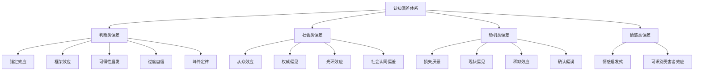
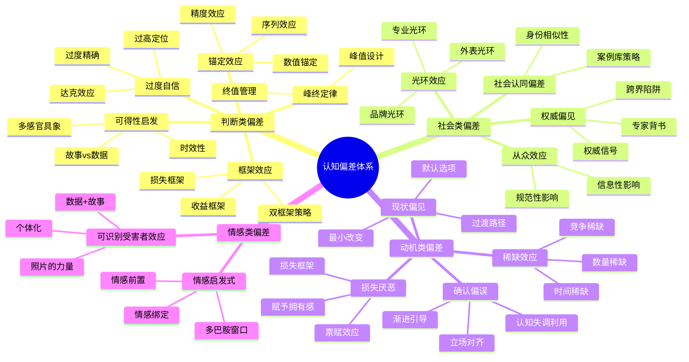

## 三、影响说服的认知偏差

人类大脑每天处理约35,000个决策，其中绝大多数依赖的是心理捷径（mental shortcuts）而非深思熟虑的理性分析。这些捷径在认知科学中被称为**启发式（heuristics）**，它们帮助我们在信息过载的环境中快速做出"足够好"的判断。然而，这些高效的认知机制也产生了系统性的**认知偏差（cognitive biases）**——可预测的、方向一致的思维偏移。

对于说服者而言，认知偏差不是需要克服的障碍，而是可以系统性利用的杠杆。诺贝尔经济学奖得主Daniel Kahneman在《思考，快与慢》中将人类思维分为两个系统：**系统1**（快速、自动、情感驱动）和**系统2**（缓慢、刻意、逻辑推理）。认知偏差主要发生在系统1层面，而高明的说服者正是通过触发系统1的自动化反应来影响决策。

本节将系统梳理影响说服效果的15个核心认知偏差，从底层神经机制到实战应用策略，为说服者提供一套完整的"心理地图"。

### 3.0 认知偏差的分类框架

在逐一分析之前，先建立一个分类框架，帮助理解这些偏差之间的关系：

| 类别 | 核心机制 | 包含偏差 | 说服切入点 |
|------|----------|----------|------------|
| **判断类** | 影响信息加工和数值估计 | 锚定效应、框架效应、可得性启发、过度自信、峰终定律 | 操控信息呈现方式 |
| **社会类** | 利用社会关系和群体动力 | 从众效应、权威偏见、光环效应、社会认同偏差 | 借力社会影响力 |
| **动机类** | 利用情感动机和损失规避 | 损失厌恶、现状偏见、稀缺效应、确认偏误 | 激发行为驱动力 |
| **情感类** | 利用即时情感反应 | 情感启发式、可识别受害者效应 | 建立情感连接 |

---

### 3.1 锚定效应（Anchoring Effect）

#### 3.1.1 机制原理

锚定效应由Tversky和Kahneman于1974年在经典论文《不确定条件下的判断：启发式与偏差》中首次系统描述。其核心发现是：**人们在做出数值估计时，会被最先接收到的信息（"锚"）过度影响，即使这个信息完全随机或不相关。**

在他们的实验中，受试者先转动一个随机转盘（得到10或65），然后估计联合国中非洲国家的百分比。看到数字65的受试者平均估计为45%，而看到10的受试者平均估计仅为25%——一个毫无意义的随机数字，却显著影响了判断。

从神经科学角度看，锚定效应的产生涉及两个过程：

- **锚定与调整（Anchoring and Adjustment）**：大脑以锚为起点进行不充分的调整，调整幅度不足以抵消锚的影响
- **一致性检验（Selective Accessibility）**：大脑会自动搜索与锚一致的信息，使最终判断偏向锚的方向

fMRI研究（Janiszewski & Uy, 2008）发现，即使受试者被明确告知锚是随机生成的，腹内侧前额叶皮层（vmPFC）仍然会自动将锚纳入估值计算——这说明锚定效应发生在意识觉察之前的自动化加工阶段。

#### 3.1.2 说服中的应用策略

**高价锚定法**：在谈判中，先出价的一方往往能设定了整个谈判的参照框架。房产经纪人的经典策略是先带客户看一套远高于预算的房子，再看目标房源——此时目标房源的价格会显得"合理"甚至"划算"。

**价格呈现顺序**：菜单设计中，将最贵的菜品放在最前面，其余菜品的价格就会显得更可接受。奢侈品牌的"入门款"也是同一逻辑——用旗舰产品设定价格锚，让消费者觉得基本款"物有所值"。

**数字锚定**：在提案中先给出一个较大的数字（"行业平均投入是营收的15%"），再提出你的实际需求（"我们只需要8%"），后者会显得克制而合理。

**精度锚定**：Janiszewski和Uy（2008）的研究发现，精确数字（如3,487元）比圆整数字（如3,500元）更能充当有效锚点，因为人们会无意识地推断：给出如此精确数字的人一定做了详尽的调研。

#### 3.1.3 实战案例

**薪资谈判**：求职时，如果你的期望薪资是月薪2万元，不要直接说"我期望2万"。更好的策略是先建立锚点："根据我的经验和行业水平，同等职位的市场薪资在2.2万到2.8万之间。考虑到公司的具体情况，我期望在2.5万左右。"这个2.5万的锚会让2万显得是一个"让步"，而不是你的底线。

**房产销售**：销售人员先展示一套标价350万的优质房源，客户觉得贵；然后带看标价280万的目标房源，280万立刻显得"便宜了70万"。实际上，280万才是正常市场价，但350万的锚改变了客户的参照系。

**公益募捐**：慈善机构在募捐页面设置"建议捐款金额"（如100元、500元、1000元），而不是让用户自由输入。这个建议金额就是锚——研究表明，设置建议金额的募捐页面平均捐款额比无建议金额的高出30-40%。

#### 3.1.4 防御策略

- **主动设锚**：在谈判前先发制人，主动提出第一个数字，抢占锚点
- **多锚校准**：引入3-5个独立参照点，取均值来稀释单一锚的影响
- **反向计算**：问自己"如果我事先不知道对方的报价，我独立评估会给出什么数字？"
- **时间延迟**：锚定效应在即时决策中最强，24小时冷却期后影响显著减弱

---

### 3.2 框架效应（Framing Effect）

#### 3.2.1 机制原理

框架效应由Tversky和Kahneman于1981年通过"亚洲疾病问题"实验经典呈现：面对600人的疾病威胁，当方案被框架为"拯救200人"时，72%的人选择确定方案；当同样的方案被框架为"400人会死亡"时，78%的人选择风险方案——尽管两种描述在数学上完全等价。

框架效应的深层机制是**损失-收益不对称性**。人脑对损失和收益的神经编码存在本质差异：损失激活的杏仁核反应强度是收益的2-2.5倍。这意味着**表述损失比表述等价收益更能驱动行为改变**。

框架效应有三种核心类型：

| 框架类型 | 定义 | 说服应用 | 示例 |
|----------|------|----------|------|
| **目标框架** | 强调行动的收益或不行动的损失 | 选择收益框架还是损失框架取决于受众动机 | "使用防晒霜能保持年轻" vs "不防晒会导致皮肤老化" |
| **风险框架** | 强调确定收益还是风险收益 | 人们在收益框架下厌恶风险，在损失框架下追求风险 | "90%成功率" vs "10%失败率" |
| **属性框架** | 强调事物的正面或负面特征 | 同一产品不同特征的强调 | "95%无脂" vs "含5%脂肪" |

#### 3.2.2 说服中的应用策略

**正向框架（收益型）**：适用于推广新事物、建立品牌认知、吸引新客户。强调"你将获得什么"——"学习这门课程，你将掌握年薪百万的技能。"

**负向框架（损失型）**：适用于催促决策、阻止流失、激活紧迫感。强调"你不行动会失去什么"——"如果不学习这门课程，你可能继续浪费3-5年摸索。"

**对比框架**：将你的方案与更差的替代方案并列呈现，让优势更加突出。"方案A花费10万但无保障；方案B花费12万但包含全程售后——你愿意多花2万获得完全的安心吗？"

**数字框架**：同样的数据可以有不同的呈现方式。"每天仅需9.9元"比"年费3,613元"听起来便宜得多，尽管数学上等价。这被称为"佩内洛普效应"——将大数字拆解成小单位。

#### 3.2.3 数据支撑

McNeil等人（1982）的医学决策研究发现：当告知患者手术"存活率90%"时，同意手术的比例为84%；当告知"死亡率10%"时，同意率降至50%。同一事实，34个百分点的决策差异——这在商业说服中意味着巨大的转化率差距。

Levin等人（1998）的元分析涵盖93项研究，确认了三种框架效应的稳健性。其中属性框架的效应量（d=0.35）略低于目标框架（d=0.46）和风险框架（d=0.41），但在营销场景中属性框架使用最频繁。

#### 3.2.4 进阶技巧：双框架策略

高明的说服者会在对话中交替使用两种框架。先用损失框架制造紧迫感（"如果不行动，你会损失..."），再用收益框架提供行动路径（"现在行动，你将获得..."）。这种"威胁-解决方案"的节奏能同时激活恐惧回路和奖励回路，产生最强的行动驱动力。

使用时机表：

| 说服阶段 | 推荐框架 | 原因 |
|----------|----------|------|
| 开场破冰 | 正向框架 | 建立积极情感氛围 |
| 问题诊断 | 损失框架 | 制造紧迫感和行动动机 |
| 方案呈现 | 正向框架 | 将方案与积极结果关联 |
| 处理异议 | 对比框架 | 突出己方优势 |
| 促成决策 | 损失框架 | 利用损失厌恶推动行动 |

---

### 3.3 确认偏误（Confirmation Bias）

#### 3.3.1 机制原理

确认偏误是人类认知中研究最深入、影响最广泛的偏差之一。它指的是：**人们倾向于寻找、解释、偏好和记住支持自己已有观点的信息，同时忽略、质疑或贬低与之矛盾的信息。**

从进化心理学角度看，确认偏误是一种"认知免疫系统"——维持稳定的信念体系有助于快速决策和社会协调。频繁改变核心信念的人在原始社会中会被视为不可靠。大脑的这种"保守性"在大多数情况下是适应性的，但在信息时代则成为被说服和说服他人的关键变量。

确认偏误有三个层面的运作：

- **选择性搜索**：主动寻找支持性证据，回避反面证据。搜索引擎时代，人们倾向于使用确认自己观点的关键词。
- **选择性解读**：对同一证据做出有利于自己的立场解释。支持己方的研究被接受，矛盾的研究被质疑方法论。
- **选择性记忆**：更容易回忆起支持性信息，遗忘反面信息。

神经科学层面，Drew等（2017）在《Nature Neuroscience》上发表的研究发现，当人们接收到与自己信念一致的信息时，腹侧纹状体（奖励中心）会被激活——确认自己是正确的本身就是一种奖励。

#### 3.3.2 说服中的应用策略

**立场对齐法**：在提出新观点之前，先与对方已有立场建立连接。"我知道你一直以来非常注重产品质量（确认对方价值观），这也是我今天想和你讨论的方向（将新提案包装为对已有价值观的延伸）。"

**证据选择**：收集支持你论点且与对方已有信念一致的证据。如果对方相信"贵的东西好"，就强调你方案的高品质和投资回报率，而非低价优势。

**渐进引导**：不要一开始就挑战对方的核心信念。从对方能接受的小共识开始，逐步扩大共识范围。这就是社会判断理论中"接受区域"策略的实操版本。

**提问引导法**：用苏格拉底式提问引导对方自己得出结论，而不是直接告诉对方"你错了"。"你觉得这个方案最大的优势是什么？"——当对方自己说出优点时，他会更坚定地支持这个方案。

**认知失调利用**：Festinger（1957）的认知失调理论指出，当人们的行为与信念矛盾时，会感到不适并倾向于调整信念。创造让对方行动的微小机会（如试用产品），行为会反过来改变信念。

#### 3.3.3 反面警示

确认偏误是一把双刃剑。当你的论点与对方核心信念冲突时，直接反驳不仅无效，还会触发**逆火效应（Backfire Effect）**——越反驳，对方越坚信原有观点。Nyhan和Reifler（2010）的研究发现，在政治领域，提供反面证据甚至可能强化原有错误信念。正确策略是先建立信任和情感连接，在对方放松心理防御后再逐步引入新信息。

---

### 3.4 光环效应（Halo Effect）

#### 3.4.1 机制原理

光环效应由心理学家Edward Thorndike于1920年首次提出。其核心机制是：**对某人某一正面特征的整体好感，会自动泛化到对该人其他特征的评价上。** 反之亦然——一个负面特征会"污染"对其他所有特征的评价（"角效应/Horn Effect"）。

光环效应的神经基础是**情感启发式（Affect Heuristic）**：大脑倾向于将对某事物的即时情感反应作为判断其他属性的依据。当看到一个外表有吸引力的人时，杏仁核和腹侧纹状体的激活会产生正向情感，这种情感会"溢出"到对其能力、品德、可信度的判断中。

Nisbett和Wilson（1977）的经典研究更进一步揭示：受试者在光环效应的影响下做出判断后，完全意识不到自己受到了光环效应的驱动，反而会编造出"理性"的理由来解释自己的选择——这说明光环效应的运作是无意识的。

#### 3.4.2 说服中的应用策略

**专业光环**：先在对方心中建立一个强项，然后让这个强项的光环辐射到你的其他论点。例如，先展示你深厚的专业知识，再提出你的商业建议——专业形象的光环会让你的商业建议也显得"专业"。

**外表光环**：心理学研究一致表明，外表有吸引力的人被认为更聪明、更值得信赖、更有能力。这不是鼓励虚荣，而是现实——整洁得体的仪表、专业的PPT设计、规范的文档排版，这些"表面功夫"确实在影响对方对你内容质量的预判。

**善举光环**：一个小小的善举能产生巨大的光环效应。在谈判前帮对方一个小忙，或者表现出对对方困境的理解，都会让对方对你产生整体性好感，进而对你的提议更加开放。

**数字光环**：一个令人印象深刻的数字能产生光环。"我们的产品已被500万用户使用"——这个数字的光环会让你接下来的所有陈述都显得更可信。

**品牌光环**：大公司背景自带光环。"我曾在Google/麦肯锡/高盛工作过"——这些品牌名会将光环辐射到你本人身上。反过来，也可以借用客户的品牌光环："我们的客户包括华为、腾讯、字节跳动。"

#### 3.4.3 案例

**乔布斯的发布会**：苹果发布会的精心设计就是光环效应的教科书级应用。极简的舞台设计（专业光环）、乔布斯标志性的黑色高领衫（一致性和真诚光环）、"one more thing"的悬念（稀缺光环）——这些元素的光环共同作用，让每一个产品功能都被观众以更积极的态度评价。

**第一印象的持久影响**：Solomon Asch（1946）的实验中，受试者阅读同一个人的描述，只是形容词的顺序不同——先"聪慧-勤奋-冲动-固执-嫉妒"vs先"嫉妒-固执-冲动-勤奋-聪慧"。结果，先看到正面词的受试者对该人的整体评价显著更积极。**第一印象不只是重要，它会过滤后续所有信息。**

---

### 3.5 可得性启发（Availability Heuristic）

#### 3.5.1 机制原理

可得性启发由Tversky和Kahneman于1973年提出，指的是：**人们根据脑海中能轻松回忆起的案例来判断某事件发生的概率或频率。** 如果某个例子能快速、生动地出现在脑海中，人们就会认为它更常见、更重要。

可得性启发有四个增强因素：

- **情感强度**：情感强烈的事件（灾难、死亡、背叛）比平淡事件更容易被回忆
- **时效性**：近期事件比远期事件更易得（"最近刚看到的新闻"）
- **具体性**：具体生动的案例比抽象统计数据更易得
- **个人关联**：亲身经历比间接信息更易得

#### 3.5.2 说服中的应用策略

**故事胜过数据**：一个具体的人物故事比一堆统计数字更有说服力。"我们的产品帮助张女士在3个月内从负债10万变成存款5万"比"平均提升300%的收入"更打动人心。

**具象化抽象概念**：不要说"我们的方案可以降低成本"，而要说"每省下的1块钱，都是你孩子多一本课外书。一个月省下的成本，够给孩子报一个学期的兴趣班。"

**重复曝光**：通过多次、多渠道提及同一个论点，提高其在对方心中的可得性。广告的重复投放正是利用了这一原理——"今年过节不收礼"虽然让人厌烦，但在做购买决策时这句话会自动浮现。

**反面案例**：同样可以利用可得性启发的反面。在说服对方避免某个行为时，提供生动的反面案例。"我见过一个和你情况很像的人，他选择了另一个方案，结果..."这种"可得性警告"比统计数据更有效。

**多感官具象**：不仅仅用文字，而是调动视觉、听觉、触觉来增强可得性。视频比图片强、图片比文字强、有声音的比无声的强。产品演示中让客户亲手触摸产品，比任何语言描述都更能提高可得性。

#### 3.5.3 数据支撑

Slovic等人（1980）的研究表明，当人们被要求评估各种死亡原因的概率时，他们严重高估了戏剧性死因（飞机失事、鲨鱼袭击、谋杀）的概率，严重低估了常见死因（糖尿病、哮喘、心脏病）的概率——因为前者更容易被媒体和个人记忆提取。这在风险沟通和保险销售中尤为关键。

Combs和Slovic（1979）的进一步研究发现，报纸对谋杀的报道频率是实际发生频率的300倍以上，而对糖尿病的报道频率仅为实际的十分之一。这直接塑造了公众的风险感知。

---

### 3.6 损失厌恶（Loss Aversion）

#### 3.6.1 机制原理

损失厌恶由Kahneman和Tversky于1979年在其**前景理论（Prospect Theory）**中提出，是行为经济学最核心的发现之一。其核心结论是：**损失的心理痛苦是等额收益快乐的2-2.5倍。** 丢掉100元的痛苦，需要捡到200-250元才能弥补。

从神经科学角度看，fMRI研究（Knutson等，2007）发现，预期损失激活的是杏仁核（恐惧和焦虑中心），而预期收益激活的是伏隔核（奖励中心）。杏仁核的激活速度更快、强度更大——这是大脑在进化过程中形成的"危险优先"机制。

损失厌恶在说服中有三个关键表现：

- **默认选项效应**：人们倾向于维持默认选择，因为改变意味着可能的损失
- **禀赋效应（Endowment Effect）**：人们对已经拥有的东西估值更高（Kahneman, Knetschaler & Thaler, 1990的经典杯子实验发现，拥有杯子的人平均要价7.12美元才愿卖出，而没有杯子的人只愿出价2.87美元——同一物品，2.5倍的估值差异）
- **现状偏见（Status Quo Bias）**：维持现状的心理成本低于改变的心理成本

#### 3.6.2 说服中的应用策略

**损失框架优先**："你每天将损失200元"比"你每年可以节省73,000元"更能驱动行动。在说服对方做决策时，强调不行动的损失比强调行动的收益更有效。

**限时损失法**："这个优惠今天结束，明天就恢复原价"——将损失厌恶与时间压力结合，产生最强的行动驱动力。

**机会成本框架**：将不行动描述为"错过机会"而非"保持现状"。"如果你不投资这个项目，你实际上在损失每年15%的潜在回报。"

**保障损失法**：反过来，当你的方案涉及风险时，用保障机制消除损失厌恶。"如果效果不满意，全额退款"——这消除了对方对"可能损失"的恐惧。

**赋予拥有感**：让对方先"拥有"你的产品/方案，利用禀赋效应。免费试用、样品体验、"这是您的专属方案"——一旦对方产生了拥有感，放弃就等于损失。

#### 3.6.3 经典案例

**Amazon Prime的免费试用**：免费试用30天的策略完美利用了损失厌恶。30天后，用户已经"拥有"了Prime会员的权益——取消试用等于"损失"这些权益。这就是禀赋效应+损失厌恶的组合拳，使得Prime的试用转化率远高于直接付费购买。

**SaaS产品的免费增值模式**：Dropbox、Spotify等产品先提供免费版本，用户在使用过程中积累了数据、习惯和偏好。当免费版功能受限时，升级付费的驱动力不是"获得新功能"，而是"不失去已有体验"。

**价格谈判中的"切香肠"策略**：将一个大请求拆成多个小请求。先获得小的承诺（"你同意这个方向对吧？"），再逐步增加（"那具体执行方案我们这样定..."）。每一步的增量很小，不足以触发损失厌恶，但累积起来就获得了远超直接提大要求的成果。

---

### 3.7 现状偏见（Status Quo Bias）

#### 3.7.1 机制原理

现状偏见由Samuelson和Zeckhauser于1988年系统研究，指的是：**人们倾向于维持当前状态，即使改变可能带来客观上更好的结果。** 这种偏好源于多重心理机制的叠加：

- **损失厌恶**：改变涉及放弃现有确定性（已知收益），面对未知（可能损失）
- **选择过载**：选项越多，决策的"交易成本"越高，维持现状成了一种节省认知资源的策略
- **后悔规避**：主动改变后如果结果不好，会产生"要是当时不改就好了"的后悔；维持现状即使结果不好，后悔感也较弱
- **认知惰性**：改变需要重新评估、学习和适应，大脑天然倾向于节省认知能量

#### 3.7.2 说服中的应用策略

**最小化改变**：将你的方案包装为对现状的最小改变，而非颠覆性革命。"你只需要在现有流程中增加一个步骤"比"你需要彻底重组整个流程"更容易被接受。

**过渡路径法**：提供清晰、具体的过渡路径，降低改变的感知复杂度。"第一天你只需要...，第二周...，一个月后..."将恐惧的未知变成清晰的步骤。

**默认选项设计**：将你推荐的选项设为默认选项。行为经济学研究反复证明，默认选项的采纳率比非默认选项高30-50个百分点。器官捐献、退休储蓄计划的参与率都因此大幅提高。

**现状重新定义**：巧妙地重新定义"现状"。"其实现在的做法才是冒险——继续下去，风险只会越来越大。真正的安全选择是现在就做出改变。"

**脚在门槛内（Foot-in-the-Door）**：先提出一个微小的、几乎不会被拒绝的请求（"你只需要花5分钟看一下这份报告"），获得承诺后再逐步升级。一旦对方迈出了改变的第一步，现状偏见就被打破了。

#### 3.7.3 案例

**器官捐献**：在采用"选择退出"（opt-out，默认捐献）制度的国家，器官捐献同意率超过90%；在采用"选择加入"（opt-in，默认不捐献）的国家，同意率仅10-15%。同一结果，同一决定，仅仅是默认选项不同，差距竟达60-80个百分点——这是现状偏见力量的最惊人证据。

**退休储蓄计划（401k）**：Thaler和Benartzi（2004）设计的"为明天储蓄更多"（SMarT）计划，通过将员工自动加入退休储蓄计划（默认选项），使参与率从49%飙升到86%。随后通过默认每年自动增加储蓄率1%，员工的储蓄率在40个月内从3.5%提升到13.6%。

---

### 3.8 从众效应（Bandwagon Effect）

#### 3.8.1 机制原理

从众效应（也称"乐队花车效应"）指的是：**人们倾向于采纳多数人持有的观点或行为，仅仅因为"大多数人都这么做"。** 这一效应在Solomon Asch（1951）的经典线段实验中得到了戏剧性的证明——当房间里的其他"受试者"（实为演员）一致给出明显错误的答案时，75%的真实受试者至少有一次从众。

从众效应的驱动力有两层：

- **信息性影响**：在不确定的情况下，他人的选择被视为有价值的信息。"这么多人选A，说明A确实更好。"
- **规范性影响**：人们希望被群体接纳，害怕因与众不同而被排斥。"我选了不一样的，会不会被认为怪？"

从进化角度看，从众在原始社会中具有生存价值——当部落中的大多数人都在跑时，跟着跑大概率是正确的。

神经科学研究（Klucharev等，2009）发现，当个体的意见与群体不一致时，伏隔核（奖励中心）的活动会降低，同时产生一个负向的反馈信号——**大脑会从神经层面惩罚"不从众"的行为。**

#### 3.8.2 说服中的应用策略

**数量证据**："超过100万用户的选择""90%的客户续费率""连续5年销量第一"——具体的数量证据能直接触发从众效应。

**相似群体参照**：人们最容易被与自己相似的人影响。"和你同一个行业的企业中，80%已经采用了这个方案"比"全球100万用户"更有效。

**社会证据展示**：在产品页面展示实时购买记录、评价数量、使用人数。电商平台的"XXX人正在看""刚刚有人下单"都是从众效应的直接应用。

**趋势营造**："这个趋势正在快速增长"——不仅展示当前的多数人选择，还展示增长的趋势，暗示如果不跟上就会"落后"。

**具象化社会证据**：不要只说"很多人在用"，而是描述具体的场景。"每天早上8点，超过10万名白领打开我们的应用开始一天的工作"——这比"10万用户"更能触发从众，因为它创造了生动的社会场景。

#### 3.8.3 注意事项

从众效应有其局限。如果受众认为自己是独立思考者或专业人士，直接使用"大多数人都这么做"可能适得其反——他们会认为你在"操纵"他们。此时需要将社会证据包装为"行业趋势"或"最佳实践"，避免触发心理抗拒。

Cialdini（2003）的研究进一步指出：描述大多数人**正在做什么**（描述性规范）比告诉人们**应该做什么**（命令性规范）更有效。亚利桑那州国家公园的标牌实验发现，"大多数游客会带走石化木"的告示反而增加了偷窃行为——因为游客从这句话中读到了"很多人在偷"的描述性规范。

---

### 3.9 权威偏见（Authority Bias）

#### 3.9.1 机制原理

权威偏见指的是：**人们倾向于认为权威人物的判断更正确，即使权威的判断超出其专业范围，或者其判断本身存在明显错误。** Stanley Milgram（1963）的电击实验是这一偏差最令人不安的证明——65%的受试者在"权威"（穿白大褂的实验者）的指令下，将电击强度提高到他们认为"危险"的水平。

权威偏见的驱动力：

- **认知节省**：信任权威的判断可以避免自己费力分析，这是一种"认知外包"
- **责任转移**：服从权威意味着"不是我的错"，减轻了决策的心理负担
- **社会等级**：对权威的服从深植于人类的社会等级认知中

#### 3.9.2 说服中的应用策略

**专家背书**：引用领域内权威人物的言论或研究成果。"诺贝尔经济学奖得主Daniel Kahneman认为..."比"有人认为..."有力得多。

**权威信号展示**：学历、头衔、出版物、获奖记录、行业认证——这些都是权威信号。在说服场景中，适当展示这些信号（名片、个人简介、引用列表）能显著提升可信度。

**第三方权威**：借助他人之口传递你的权威性比自吹自擂更有效。"某知名媒体报道过..."或"我们的客户包括..."比"我们是最专业的"更有说服力。

**场景权威**：特定场景中的权威信号。穿正装出席商务会议、在专业期刊发表文章、受邀在行业大会上演讲——这些"场景权威"不需要直接提及，就能提升你的整体说服力。

**权威的"跨界陷阱"**：Cialdini指出，权威在跨界时不应被盲目信任。一个诺贝尔物理学奖得主在经济学问题上的发言并不比普通人更可靠。在说服中，确保你引用的权威确实属于相关领域——否则一旦被识破，信任会崩塌。

#### 3.9.3 Milgram实验的启示

Milgram实验揭示了一个深刻的教训：权威偏见可以让人做出违背自身判断的行为。对于说服者来说，这意味着建立权威性是提升说服力的最有效杠杆之一。但同时，这也是为什么我们需要警惕——当一个"权威"告诉你不需要再思考时，恰恰是你最应该思考的时候。

实验的后续变体显示：当"权威"不在场（通过电话指令）时，服从率从65%下降到21%——**物理在场的权威信号比远程权威强大3倍。** 这解释了为什么面对面会议比邮件说服更有效。

---

### 3.10 稀缺效应（Scarcity Effect）

#### 3.10.1 机制原理

稀缺效应指的是：**当某物变得稀缺或难以获得时，人们对其的渴望和估值会显著上升。** 这不仅适用于实物商品，也适用于信息、机会、时间和体验。

稀缺效应的驱动力有两层：

- **心理捷径**："稀缺=有价值"——这是一种在大多数情况下正确的启发式判断
- **心理抗拒**：根据Jack Brehm（1966）的心理抗拒理论，当自由受到威胁时，人们会产生恢复自由的强烈动机。"你不能拥有它"的信号反而激发了"我一定要拥有它"的渴望

从进化角度看，稀缺资源（食物、领地、配偶）确实更有价值，对稀缺的敏感是生存本能。

#### 3.10.2 说服中的应用策略

**时间稀缺**："限时优惠""仅剩最后3天""名额即将满员"——时间压力直接触发紧迫感。

**数量稀缺**："限量版""仅剩5件""全国仅100个名额"——数量限制暗示高需求和有限供给。

**信息稀缺**："这个信息只有少数人知道""行业内部才知道的秘密"——信息的排他性提升了其价值感。

**独家性**："仅限受邀参加""VIP专属"——稀缺的不是商品本身，而是购买/参与的资格。

**竞争稀缺**："有3个竞争对手也在考虑同一个方案"——稀缺+竞争是B2B销售中的核武器。对方不仅担心"买不到"，还担心"被对手抢先"。

#### 3.10.3 经典实验

Worchel、Lee和Adewole（1975）的"饼干实验"：受试者被给予一罐饼干，其中一组罐中有10块饼干，另一组罐中只有2块。结果，2块饼干组的受试者对饼干的评价显著更高——尽管两组的饼干完全相同。更有趣的是，当饼干从10块减少到2块时（"曾经拥有很多现在变少了"），评价比一开始就只有2块的还要高。**"曾经拥有现在失去"比"从未拥有"更能激发稀缺感。**

这个发现的实操含义是：先展示充裕的选择，再告知稀缺，比一开始就强调稀缺更有效。例如："这个产品线之前一直对所有客户开放，但近期需求暴涨，我们不得不限量供应。"

---

### 3.11 过度自信偏差（Overconfidence Bias）

#### 3.11.1 机制原理

过度自信偏差指的是：**人们系统性地高估自己知识的准确性、判断的正确性和能力的水平。** 研究表明，当人们说"我有90%的把握"时，他们的实际正确率通常只有70-75%。

过度自信有三种表现：

- **过高估计**：高估自己的能力、表现和控制力
- **过高定位**：认为自己比大多数人优秀（"高于平均效应"——90%的司机认为自己的驾驶水平高于平均）
- **过度精确**：对自己的估计过度确定，置信区间过窄

Dunning和Kruger（1999）的研究揭示了过度自信的一个极端形式：能力最差的人往往最过度自信——因为他们缺乏评估自己能力的元认知能力。这个发现被称为**达克效应（Dunning-Kruger Effect）**，它意味着在说服无知者时，他们可能比有知识的人更容易被说服（因为他们的防御机制更弱），但也更难改变立场（因为他们的过度自信更顽固）。

#### 3.11.2 说服中的应用策略

**利用对方的过度自信**：对方如果对自己的判断过度自信，直接反驳会触发防御。更好的策略是让对方自己发现矛盾——"你提到的数据和我看到的有些不同，不如我们一起核实一下？"

**自信表达**：过度自信偏差也意味着——表达自信的人更可信。在说服中，犹豫不决的措辞会严重削弱说服力。"我觉得也许可能..."不如"根据我的分析..."。

**概率锚定**：利用对方对概率的过度自信来设置预期。"90%的客户在使用后一个月内看到了明显效果"——即使对方知道这只是统计数据，"90%"这个数字也会让他觉得自己"一定属于那90%"。

**实力悬殊时的策略**：面对达克效应明显的对手，不需要直接说服他们，而是帮助他们建立元认知——"你是在什么基础上做出这个判断的？"引导他们意识到自己的知识边界。

---

### 3.12 情感启发式（Affect Heuristic）

#### 3.12.1 机制原理

情感启发式由Paul Slovic于2000年系统提出，指的是：**人们在判断事物时，依赖的是对该事物的即时情感反应，而非系统性的理性分析。** 好的感觉=好的判断，坏的感觉=坏的判断。

与其他认知偏差不同，情感启发式不是一个"错误"——它在大多数情况下是高效且合理的。但在说服场景中，这意味着：**如果能让对方对你或你的观点产生积极的情感反应，后续的所有论点都会被自动"加分"。**

情感启发式的运作速度极快。Zajonc（1980）的"纯粹曝光效应"实验表明，人们在仅曝光1毫秒之后就会对刺激产生情感反应——这个反应远在意识之前就已经发生，并会影响后续的判断和偏好。

#### 3.12.2 说服中的应用策略

**情感前置**：在提出理性论据之前，先创造积极的情感氛围。幽默、赞美、共同回忆、正面故事——这些都能在对方心中播下"好感种子"，让后续的论据更容易被接受。

**情感绑定**：将你的观点与对方在乎的事物绑定。"这个方案不仅能提升效率，更重要的是，它能让你的团队不再加班到深夜——想想你终于能准时回家陪孩子吃饭。"

**情感调频**：观察对方的情感状态，将自己的表达调到与之一致的频道。如果对方焦虑，先表达理解；如果对方兴奋，先跟上节奏——情感共鸣是信任建立的最快路径。

**多巴胺窗口**：在对方因好消息或积极体验而产生多巴胺激增时（如刚达成一笔交易、团队取得突破），提出追加请求或新提案——此时对方对新事物的接受度最高。

---

### 3.13 社会认同偏差（Social Proof Bias）

#### 3.13.1 机制原理

社会认同偏差与从众效应相关但有本质区别。从众效应强调"多数人的选择"，社会认同偏差强调的是：**人们通过观察与自己相似的人的行为来决定自己应该怎么做。** 关键词不是"多数"，而是"相似"。

Robert Cialdini将社会认同列为六大影响力原则之一。其进化基础在于：在信息匮乏的环境中，观察同类群体的行为是获取生存信息的最高效策略。当面对不确定性时，大脑会自动搜索"和我类似的人是怎么做的"作为决策参考。

社会认同有两个关键维度：

- **身份相似性**：年龄、职业、社会阶层、兴趣爱好相似的人更具参照价值
- **情境相似性**：面对相同问题、处于相同场景的人更具参照价值

#### 3.13.2 说服中的应用策略

**精准画像匹配**：不要使用泛泛的社会证据（"很多人都在用"），而是精准匹配受众画像。"和你一样是创业者的人中，70%在使用我们的产品"——"和你一样"四个字激活了社会认同的全部力量。

**案例库策略**：建立分类齐全的客户案例库，针对不同行业、不同规模、不同痛点准备对应案例。当说服某一类客户时，精准调出"同类案例"。

**用户证言的力量**：比起企业自夸，用户的真实证言（文字、视频、评分）更能触发社会认同。关键在于证言者的身份要尽可能接近目标受众——一个中小企业主的证言对另一个中小企业主比CEO的证言更有效。

**反向社会认同**：描述不采纳方案的人的后果。"没有使用这个工具的团队，平均每月浪费30小时在重复性工作上"——这暗示"大多数聪明人都已经在用了，你还没用？"

---

### 3.14 峰终定律（Peak-End Rule）

#### 3.14.1 机制原理

峰终定律由Daniel Kahneman提出，指的是：**人们对一段经历的评价主要取决于两个时刻——体验最强烈的瞬间（峰值）和结束的瞬间（终值），而不是体验的总时长或平均值。**

这个发现挑战了"体验效用"等于"时刻效用之和"的传统假设。Kahneman的经典实验中，受试者将手浸入14°C的冷水60秒（痛苦）；另一组将手先浸入14°C冷水60秒，再浸入15°C冷水30秒（更长时间的痛苦，但最后略有缓解）。当被问及"你愿意重复哪种体验"时，69%的受试者选择了更长但终值稍好的那种——尽管总痛苦量更大。

#### 3.14.2 说服中的应用策略

**体验设计**：在整个说服过程中，精心设计至少一个"高峰时刻"和一个完美的"结束时刻"。高峰可以是令人惊叹的数据、感人的故事、出人意料的演示。结束时应该留下最积极的印象。

**会议结尾法**：在会议结束前5分钟，主动总结最大价值点，提出积极展望，安排下一步行动——不要让会议在扯皮或沉默中结束。"终值"决定了对方回去后对你提案的整体印象。

**服务的最后接触**：客户服务中，问题解决后的一句关怀（"还有什么我可以帮您的吗？"）比全程的优质服务更能影响整体满意度。餐厅的账单旁边放一颗巧克力，就是峰终定律的经典应用。

**谈判中的"让步收尾"**：在谈判尾声主动做一个小让步（不需要太大），对方会记住这个"慷慨终值"，对整体谈判结果更满意。

---

### 3.15 可识别受害者效应（Identifiable Victim Effect）

#### 3.15.1 机制原理

可识别受害者效应指的是：**人们对一个可识别的、具体的受害者产生的同情和援助意愿，远超对大量匿名统计数字中的受害者。** 一个名叫Rokia的7岁马里女孩的照片，比"非洲300万饥饿儿童"的统计数字更能激发捐款——尽管帮助后者的影响大得多。

Small和Loewenstein（2003）的实验系统验证了这一效应。其神经基础在于：具体个体的形象激活的是情感脑区（杏仁核、内侧前额叶皮层），而统计数字激活的是分析脑区。情感驱动的行为强度远超分析驱动。

Paul Slovic将这种现象称为"心理麻木"（psychic numbing）——**随着受害人数的增加，每个人的同情心反而减少。** "一个人的死亡是悲剧，一百万人的死亡是统计数字"（常被误归于斯大林）精确描述了这一心理机制。

#### 3.15.2 说服中的应用策略

**一个具体的人**：在公益募捐中，不要说"帮助100万饥饿儿童"，而是说"帮助Rokia，一个7岁的马里女孩，她每天只能吃一顿饭"。具体化、个体化、有名有姓。

**商业中的应用**：用户案例不要用统计数字，而要用具体的人物故事。"李明，一个35岁的IT工程师，每天加班到10点，用了我们的产品后，每天提前2小时完成工作，现在能准时接孩子放学。"

**数据+故事的组合**：先用统计数据建立问题的规模感，再用一个具体故事将冰冷数字转化为可感知的情感。"中国有2000万留守儿童，小雨就是其中之一。她的父母在广东打工，她一年只能见他们一次。"

**照片和视频的力量**：一张具体受害者的照片比任何文字描述都更能激活可识别受害者效应。慈善机构的研究表明，募捐页面加上受益人的真实照片，捐款率提升50-100%。

---

### 3.16 认知偏差的组合运用

#### 3.16.1 偏差叠加效应

在真实的说服场景中，认知偏差很少单独作用。高明的说服者会巧妙地组合多种偏差，产生"1+1>2"的叠加效果。以下是几种经典的偏差组合：

| 组合策略 | 涉及偏差 | 应用场景 | 效果 |
|----------|----------|----------|------|
| **高价锚+稀缺** | 锚定效应+稀缺效应 | 奢侈品销售、高端服务定价 | 高价设锚+限量供应=极高的感知价值 |
| **故事+从众+损失** | 可得性启发+从众效应+损失厌恶 | 保险销售、健康产品推广 | 具体案例+多数人选择+不行动的损失 |
| **权威+光环+框架** | 权威偏见+光环效应+框架效应 | 专家推荐、KOL带货 | 专家背书+整体好感+正向框架 |
| **默认+现状+损失** | 现状偏见+损失厌恶 | 订阅服务、持续购买设计 | 默认续费+改变成本+取消即损失 |
| **确认偏误+渐进引导** | 确认偏误+锚定效应 | 说服立场对立的人 | 从共识出发+逐步移动锚点 |
| **峰终+情感+可识别** | 峰终定律+情感启发式+可识别受害者效应 | 公益演讲、品牌故事 | 高峰情感+完美收尾+具体个体 |
| **社会认同+稀缺+从众** | 社会认同+稀缺效应+从众效应 | 电商限时抢购 | 同类人都在买+限时限量+人山人海 |

#### 3.16.2 说服漏斗中的偏差分布

在一个完整的说服流程中，不同阶段适合使用不同的认知偏差：

---

### 3.17 认知偏差的防御体系

#### 3.17.1 个人防御策略

作为接收者，了解认知偏差本身就是最好的防御。以下是实用的"认知免疫"策略：

**暂停反应**：在做出重要决策前，给自己24小时的"冷却期"。情感启发式的影响会在时间延迟后显著减弱。

**反向思考**：主动寻找反对自己当前倾向的证据。"如果我的判断是错的，证据会是什么？"

**多源验证**：不依赖单一信息来源，主动引入多个参照点来抵消锚定效应。

**决策日志**：记录重要决策的理由和预期。事后回顾可以帮助校准过度自信，提高未来决策的质量。

**偏差检查清单**：在重大决策前，逐项检查以下偏差是否可能在影响你：

| 检查项 | 自问 |
|--------|------|
| 锚定 | 我是否被最先看到的数字过度影响了？ |
| 框架 | 同一件事换个说法，我的判断会不同吗？ |
| 确认 | 我是否只在找支持我已有想法的证据？ |
| 光环 | 我是否因为喜欢这个人而忽略了他在说的内容？ |
| 可得性 | 我想到的案例是否太近期或太生动，扭曲了概率判断？ |
| 损失 | 我是在避免损失，还是在追求收益？ |
| 现状 | 我维持现状是因为它真的最好，还是只是因为怕改变？ |
| 从众 | 我同意是因为真的认同，还是因为"大家都这么说"？ |
| 权威 | 这个人在**这个领域**真的是权威吗？ |
| 稀缺 | 如果不限量、不限时，我还会这么想要吗？ |
| 情感 | 如果我现在心情不同，我会做同样的判断吗？ |

#### 3.17.2 组织防御策略

在组织决策中，认知偏差的风险更大。以下是组织层面的防御措施：

**魔鬼代言人**：在重要决策会议中指定专人扮演反对者角色，系统性地挑战多数意见。但研究表明，外部指定的魔鬼代言人效果有限——因为大家知道他在"演戏"。更好的做法是邀请真正持有不同意见的利益相关方参与讨论。

**匿名投票**：在讨论前先匿名投票，避免权威偏见和从众效应对后续讨论的影响。Jeff Bezos在Amazon推行的"六页备忘录"制度（会议前沉默阅读文档30分钟）也是类似逻辑——让每个人先独立形成判断。

**预验尸法（Pre-mortem）**：在决策执行前假设"这个决策已经失败了"，然后集体讨论可能的失败原因。这能有效克服过度自信和确认偏误。Gary Klein（2007）的研究表明，预验尸法能使团队识别出的潜在问题数量提高30%。

**决策清单**：建立标准化的决策检查清单，确保关键因素不被遗漏，减少对直觉判断的依赖。

**红队审查**：在重大决策中，组建独立的"红队"对方案进行全面攻击。红队不受组织层级约束，可以挑战领导者的判断——这在军事和安全领域已被广泛采用。

---

### 3.18 数字时代的认知偏差

#### 3.18.1 社交媒体放大效应

数字时代不仅没有削弱认知偏差，反而通过社交媒体的机制设计将其放大：

- **信息茧房**（Filter Bubble）：算法推荐系统强化确认偏误，持续推送与用户已有观点一致的内容
- **回音室效应**（Echo Chamber）：社交网络中的同质化群体强化从众效应和社会认同
- **信息瀑布**（Information Cascade）：点赞和转发机制让错误信息也能获得"社会证据"
- **即时性偏见**：社交媒体的实时性增强了可得性启发的影响，近期事件被过度加权

#### 3.18.2 数字说服的特殊策略

**个性化锚定**：基于用户浏览历史和消费数据，动态设置个性化的价格锚。电商的"原价""划线价"就是这一策略的标准化应用。

**社会证据的规模化**：传统说服场景中的社会证据受限于物理空间，数字场景可以无限放大——"1,247人正在浏览""刚刚成交3笔""已售10,000+"。

**稀缺的实时化**：实时库存倒计时、限时秒杀、排队人数——数字平台让稀缺效应的呈现更加动态和紧迫。

**认知偏差的A/B测试**：数字平台可以通过A/B测试精确量化每种认知偏差策略的效果，持续优化说服力。这使得数字说服比线下说服更加精准和有效。

---

### 3.19 偏差运用的伦理边界

认知偏差是工具，工具本身无善恶，但使用有边界。以下是几条伦理红线：

| 原则 | 说明 | 判断标准 |
|------|------|----------|
| **信息真实** | 利用偏差可以改变信息的呈现方式，但不应伪造信息本身 | 如果对方核实后发现信息虚假，你是否愿意承担后果？ |
| **双方受益** | 偏差运用的结果应该对双方都有利，而非单方面剥削 | 对方知情后会觉得"值"还是觉得"被骗了"？ |
| **可逆决策** | 对于重大、不可逆的决策，应减少偏差运用，增加理性分析 | 这个决定能否在30天内反悔？不能反悔则需更谨慎 |
| **阳光测试** | 如果对方知道你在运用这些偏差仍然会同意，那就是正当的说服 | 你的策略公开后是否仍然成立？ |
| **尊重自主** | 最终决定权始终在对方手中，偏差用于辅助而非劫持决策 | 如果对方最终说不，你能否坦然接受？ |

Kahneman本人在晚年反思中指出：了解认知偏差的人有责任不利用他人的弱点。**真正的说服力，是帮助对方做出对他们有利的决策，而不是利用他们的心理盲区来操纵他们。**

---

### 3.20 本节总结

掌握这些认知偏差，不是为了操纵他人——真正的说服力来自于理解决策的真实机制，然后在这个基础上更有效地传递有价值的信息。正如Kahneman所说："我们无法消除偏差，但我们可以识别它、理解它，并在关键决策中创造条件来减少它的影响。"对于说服者而言，目标是让认知偏差为双方的共同利益服务，而不是成为单方面剥削的工具。

当这些认知偏差与前文Cialdini的六大影响力原则结合运用时，就形成了一个从理论到实践的完整说服体系——认知偏差解释了"为什么"人们会被影响，影响力原则提供了"如何"影响的具体路径，而接下来的经典说服模型将给出"何时"使用这些工具的决策框架。
