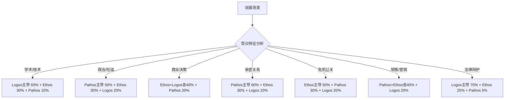
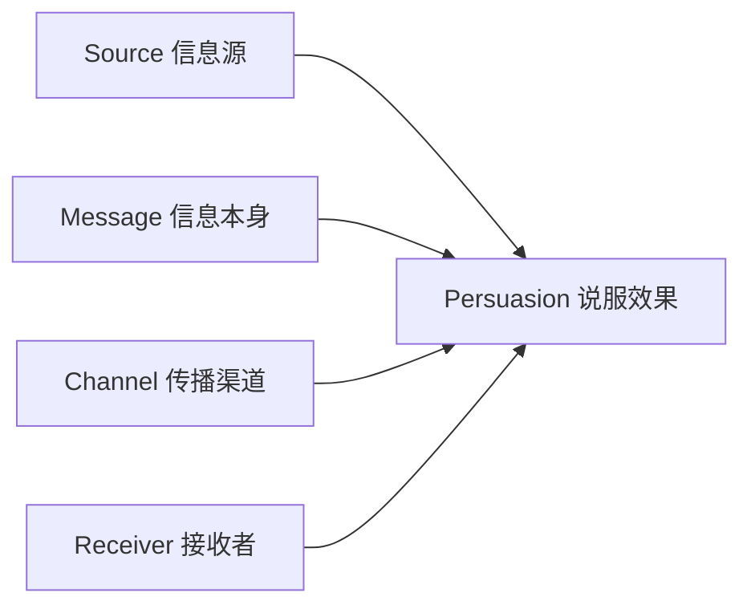
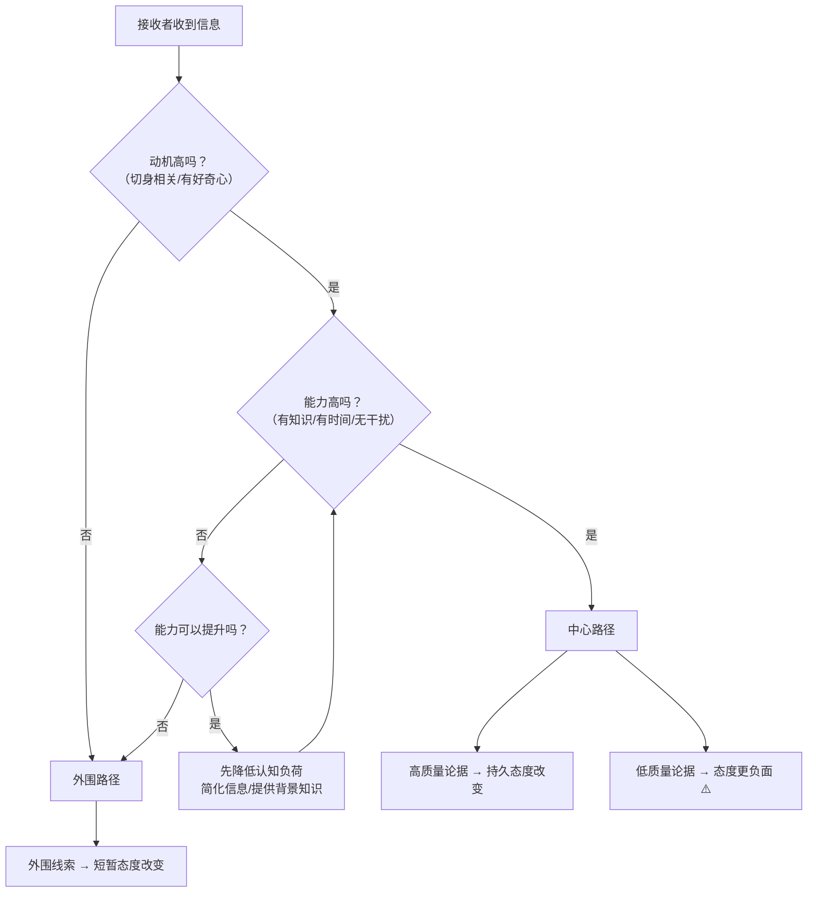
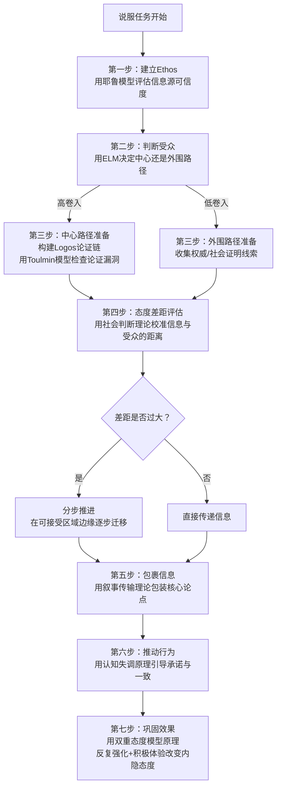

## 四、经典说服模型

说服不是"随机试探"——两千多年来，心理学家和修辞学家已经提炼出了经过严格检验的理论框架。理解这些模型，就像医生理解病理学：你知道"为什么"有效或无效，而不只是"好像这样做过管用"。

在第三章中，我们梳理了影响说服效果的12个认知偏差——它们是说服过程中的"工具零件"。本章则从更高维度回答一个更根本的问题：**这些零件如何组装成一套完整的说服引擎？** 认知偏差解释了"哪里会出错"，说服模型解释了"怎样系统性地做好"。

本节梳理八个最具影响力的经典说服模型，从古希腊修辞学到现代认知心理学，为你构建完整的说服理论地图。每个模型都会给出：理论机制 → 实验支撑 → 适用场景 → 实操要点 → 常见误用。

### 4.1 亚里士多德说服三要素（Rhetorical Triangle）

#### 4.1.1 理论来源与核心含义

亚里士多德在公元前4世纪写就的《修辞学》（*Rhetoric*）中提出：一切成功的说服都依赖三个要素——**Ethos（品格/可信度）、Pathos（情感）、Logos（逻辑）**。这三个要素构成"修辞三角"，缺一不可，但权重因场景而异。

这不是一个"古老的理论"——它是至今所有说服研究的起点。Cialdini的六大原则、ELM模型、叙事传输理论，都可以被映射回这个三角形。2000多年来，没有任何一种现代说服理论超越了这三个维度的基本框架，只是在不同维度上做了更精细的展开。

亚里士多德的洞察在于：说服从来不是"论点好不好"的单维度问题。一个逻辑完美的论点，如果出自一个不被信任的人之口，效果可能为零；一个逻辑有缺陷的论述，如果激发了足够强烈的情感共鸣，可能比任何理性论证都有效。

#### 4.1.2 三要素详解

**Ethos（品格/可信度）——"为什么要听你说"**

Ethos 不是你自封的头衔，而是听众心中对你的综合判断。亚里士多德将其拆为三个子维度：

| 子维度 | 含义 | 建立方式 | 破坏因素 |
|--------|------|----------|----------|
| Arete（美德） | 道德品格和正直 | 展示利他动机、承认自身局限 | 被发现隐瞒利益冲突 |
| Phronesis（实践智慧） | 专业判断力 | 引用经验、展示对领域的深刻理解 | 犯基本事实错误 |
| Eunoia（善意） | 对听众利益的真诚关心 | 先给出对听众有利的建议，再提出自己的需求 | 明显以自我利益为中心 |

实际含义：一个医生说"你需要戒烟"比一个烟草公司说同样的话有说服力100倍，不是因为内容不同，而是Ethos不同。

Ethos的一个关键特性是"**首因效应**"：听众在前30秒内形成的品格判断，会深刻影响他们对后续所有信息的接受程度。这意味着说服的开场阶段比论证阶段更重要——你必须在论证开始之前就赢得"听的资格"。

建立Ethos的三个时间维度：

- **先验Ethos**：你踏进房间之前，听众对你的已有认知。包括名声、头衔、推荐人。面试场景中，简历就是先验Ethos。
- **初现Ethos**：你开口前几分钟建立的印象。着装、肢体语言、开口的方式、第一个故事或数据。研究表明，听众在最初2分钟内就形成了对演讲者可信度的稳定判断（Burgoon & Hale, 1988）。
- **持续Ethos**：论证过程中不断积累的信任。每一个有据可查的论点、每一次承认不确定性、每一次逻辑自洽，都在为你的可信度账户"存款"。

**Pathos（情感）——"让人心动"**

Pathos 操控的不是理性判断，而是情绪状态。亚里士多德明确指出：当人处于愤怒、恐惧、怜悯、羞耻等情绪中时，他的判断会发生系统性偏移。

关键不是"煽情"，而是**匹配正确的情感与正确的场景**：

- **恐惧诉求**：适合安全/健康领域（如反酒驾广告），但恐惧程度过高会触发防御机制，反而降低说服力。Witte(1992)的保护动机理论研究表明，最有效的恐惧诉求是"高威胁+高效能"——告诉受众威胁很大，同时给出具体可行的应对方案。如果只有高威胁没有高效能（"世界末日要来了"），受众反而会选择逃避和否认。
- **同理心诉求**：适合慈善/公益场景。Small等(2007)在《Organizational Behavior and Human Decision Processes》发表的实验显示，描述一个具体个体的困境（"7岁女孩Rokia"）比给出统计数字（"300万非洲儿童面临饥荒"）能多募捐一倍。这就是所谓的"可识别受害者效应"（Identifiable Victim Effect）。Stalin曾说"一个人的死是悲剧，一百万人的死是统计数字"——这恰恰是Pathos的运作机制。
- **愤怒诉求**：适合政治动员和社会运动。愤怒情绪能有效提升行动力和风险偏好，但难以持久，且可能引发对立情绪。研究表明，愤怒情绪下的人更容易做出冲动决策，也更容易低估风险（Lerner & Keltner, 2001）。
- **自豪诉求**：适合激励和品牌忠诚。让受众感受到"我是更好的人"或"我属于一个优秀的群体"。Apple的品牌营销就是典型的自豪诉求——"Think Different"暗示使用者是创新者和颠覆者。
- **怀旧诉求**：适合情感连接和品牌认同。怀旧情绪能增强社会归属感和自尊心（Sedikides et al., 2008），对年轻受众尤其有效。Coca-Cola的"分享一瓶可乐"活动就是怀旧诉求的经典应用。
- **希望诉求**：适合领导力和愿景传达。奥巴马2008年的"Change"和"Yes We Can"就是纯粹的希望诉求，它不解决任何具体问题，但创造了强烈的行动意愿。

**Logos（逻辑）——"说得通"**

Logos 提供理性支撑，让人觉得"被说服是合理的"。亚里士多德区分了两种论证：

- **归纳论证（Example）**：从具体事例推导出一般规律。"我们的A客户用了这个方案，转化率提升40%；B客户用了，提升35%。" 归纳论证的力量来自于数量——案例越多，说服力越强。但要注意选择偏差：只展示成功案例而隐藏失败案例是常见的逻辑谬误。
- **演绎论证（Enthymeme）**：从一般规律推导出具体结论，常省略一个前提（因为听众自己会脑补）。"所有的优秀企业都在做数据驱动决策，我们是优秀企业，所以我们应该做数据驱动决策。" Enthymeme的巧妙之处在于那个被省略的前提往往是最有争议的——听众在脑补时不会去质疑它。

Logos的隐藏力量在于：**它为同意提供了"合理化工具"**。当一个人想要同意但需要理由时（特别是当同意会带来个人风险时），Logos给了他"可以向别人解释为什么"的材料。很多决策是先由Pathos驱动想要做，再由Logos提供理由说服自己和他人"这样做是合理的"。

#### 4.1.3 三要素的配比策略

**核心原则**：最强的说服是三要素的协同——Ethos 让人愿意听，Pathos 让人想要行动，Logos 让人觉得行动是对的。单独使用任何一要素，效果都会大打折扣。

一个判断三要素配比是否合理的方法——"**删减测试**"：想象你的说服论述中分别去掉Ethos、Pathos、Logos，如果去掉任何一个后说服力不下降，说明这个要素要么没起作用，要么过载了。理想状态是：去掉任何一个要素，说服力都会明显下降。

#### 4.1.4 经典案例：马丁·路德·金的《我有一个梦想》

这篇演讲之所以成为说服力的巅峰之作，正是因为它完美融合了三要素：

- **Ethos**：金牧师作为民权运动领袖和牧师的双重身份，赋予了他道德权威。他多次因抗议而入狱的经历强化了Arete（美德），他的神学训练赋予了Phronesis（智慧），他反复强调"不是为了报复，而是为了兄弟情谊"体现了Eunoia（善意）。
- **Pathos**："我有一个梦想"的反复排比，将听众的情绪推向高潮；具体的意象（"在佐治亚的红色山丘上，昔日奴隶的儿子和昔日奴隶主的儿子同桌而坐"）激发了强烈的希望和自豪感。整篇演讲的节奏设计——从沉郁到高昂、从问题到愿景——是情绪曲线设计的教科书。
- **Logos**：开篇引用《独立宣言》和《解放奴隶宣言》作为论证的法律和道德基础，用"支票"的隐喻构建了一个逻辑框架——"美国给了黑人一张空头支票，现在是兑现的时候了"。

#### 4.1.5 常见误用

- **只靠Logos**：技术人员最容易犯的错误。数据堆砌、逻辑严密，但听众觉得冷冰冰、"不关我事"。PPT做了100页数据，听众只记住了第一页的结论。
- **只靠Pathos**：煽情过度，事后被追问"你的证据呢？"，信任崩塌。公益广告催人泪下但不告诉观众具体能做什么，捐款率反而低于明确行动指南的版本。
- **只靠Ethos**："我是专家，听我的"——没有论证支撑的权威是空壳，遇到质疑就会瓦解。在信息透明的时代，"因为我说了所以你该信"的时代已经过去了。
- **要素冲突**：Ethos说"我是一个诚实的顾问"，Pathos却用紧迫感施压"今天不签就没有了"，Logos又给出了明显夸大的数据——三个要素互相矛盾，信任反而比不说服更低。

---

### 4.2 霍夫兰耶鲁态度改变模型（Hovland-Yale Model）

#### 4.2.1 理论来源

卡尔·霍夫兰（Carl Hovland）在二战期间为美国陆军研究宣传效果——当时美军面临一个实际问题：如何通过纪录片有效地向士兵传达参战的意义？战后在耶鲁大学建立了系统的说服实验研究，形成了"耶鲁态度改变模型"。这是第一个用实验方法系统研究"什么因素影响说服效果"的理论框架，它将说服从一门"艺术"转变为一门"科学"。

耶鲁模型的核心贡献不在于某个具体发现，而在于它建立了研究说服的方法论框架——将说服过程拆解为可独立研究的变量，每个变量都可以被操作化、被测量、被验证。

#### 4.2.2 核心框架：四要素模型

Hovland将说服过程拆解为四个关键变量：

**Source（信息源）—— 谁在说**

| 变量 | 影响机制 | 研究发现 | 实操启示 |
|------|----------|----------|----------|
| 可信度 | 高可信度来源更易被接受 | 专家+高可信度来源的说服效果比低可信度来源高约40%（Hovland & Weiss, 1951） | 先建立可信度再做论述，不要一上来就给结论 |
| 吸引力 | 外表吸引力引发正面情感转移（光环效应） | Dion等(1972)"what is beautiful is good"效应：有吸引力的人被认为更聪明、更值得信赖 | 在可能的范围内注意形象管理，使用有吸引力的代言人 |
| 相似性 | 与受众越相似越易被接受（同质性偏好） | 同龄人说服青少年的效果超过权威人物；同行业从业者说服效果超过跨行业专家 | 找受众能认同的人做信息源，而非"最权威"的人 |
| 权力/地位 | 高地位来源引发服从但不一定认同 | Milgram(1963)服从实验：权威地位能驱动行为，但不一定改变态度 | 权力能驱动短期行为，但不能产生持久态度改变 |

**睡眠者效应（Sleeper Effect）** 是Hovland最有趣的发现之一：一个来自低可信度来源的有说服力的信息，最初可能被拒绝，但随着时间推移，人们忘记了信息来源，信息本身的说服力会回升。这意味着：好的论点不会永远被埋没，但也意味着"先入为主"的效果会随时间减弱。

睡眠者效应的实际启示：

- **正面**：即使你不被信任，只要你提供的论据本身过硬，效果可能在日后显现。不必因短期被拒绝而放弃。
- **负面**：高可信度来源带来的优势不是永久的，需要通过持续互动来维护。一次背书不能吃一辈子。
- **警告**：睡眠者效应在以下条件下不出现——信息本身质量低、受众高卷入度（会记住来源）、来源信息极其负面（如骗子）。不要指望"好内容会自动翻盘"。

**Message（信息）—— 说什么**

信息的结构和组织方式直接影响说服效果。耶鲁模型对信息结构的研究产生了几个具有直接操作价值的发现：

- **单面论证 vs 双面论证**：当受众已经同意你的观点时，单面论证就够了；当受众持反对意见或教育水平较高时，双面论证（先承认对方的合理之处，再提出反驳）更有效。Hovland等(1949)的研究发现，对于教育水平较高的受众，双面论证比单面论证有效约15%。原因有二：双面论证提升了Ethos（"这个人比较客观"），同时提前化解了受众脑中的反驳论点（"免疫效应"）。

  操作要点：双面论证中，你的论点必须在**最后**呈现，因为首因效应和近因效应中，听众对最后听到的内容记忆最深。先说对方的合理之处（降低防御），最后给出你的结论（留下最终印象）。

- **结论是否明示**：对于高智商/高卷入度的受众，暗示结论比明示更有效（让他们"自己得出结论"）；对于低卷入度受众，明示结论更有效。暗示结论的优势在于：受众会觉得"这是我自己想到的"，从而产生更强的认同感和行动力。但暗示的风险在于：如果受众太忙或太不感兴趣，他们可能根本不费力去"自己得出结论"。

- **恐惧诉求的强度**：中等恐惧程度+明确行动指南 效果最好。过低没人在意，过高触发防御。Witte(1992)的保护动机理论给出了精确的配方：威胁严重性×威胁可能性×应对效能×自我效能。四个因子中任何一个为零，说服效果就为零。

- **情感先行还是逻辑先行**：先情感后逻辑适合短时间说服（销售、演讲），因为情感能抓住注意力并降低防御；先逻辑后情感适合长期决策（合同、政策），因为情感作为"收尾"能推动最终行动。

**Channel（渠道）—— 通过什么途径**

Hovland对渠道的研究发现了一个直觉上反常识的规律：

- 面对面沟通 > 视频 > 音频 > 文字（说服力递减，按"富媒体"程度排序）
- 但这并非绝对——对于复杂的技术问题，文字允许反复阅读、自行验证，效果反而可能更好
- Hovland将其总结为：**渠道的说服力取决于议题的"情感-理性"属性**。情感导向的议题适合富媒体渠道，理性导向的议题适合可反复研读的渠道

现代扩展：在数字时代，渠道的影响远比Hovland时代复杂。微信消息比邮件更有温度但更碎片化；视频会议比文字沟通更有情感但更容易疲劳；社交媒体能触达海量受众但注意力极短。选择渠道时需要考虑四个维度：即时性、持久性、情感丰富度、可控性。

**Receiver（接收者）—— 谁在听**

接收者的个体差异决定了同一信息的截然不同的效果：

- **自尊心水平**：中等自尊心的人最容易被说服（太低→抗拒一切以保护自我，太高→觉得自己不需要别人指导）。McGuire(1968)的"自尊心倒U型曲线"是说服研究中最稳健的发现之一。
- **认知需求（Need for Cognition）**：高认知需求的人更偏好逻辑论证，他们享受深度思考的过程，外围线索对他们效果差；低认知需求的人更依赖外围线索（谁说的、说得多自信），论据质量对他们的影响小。
- **年龄与可塑性**：青少年态度比成年人更容易改变，但改变后也更容易再变回去。成年人的态度一旦改变，持久性更高，但改变过程本身更困难。
- **情绪状态**：接收信息时的情绪状态会影响接受倾向。心情好的人更容易接受（减少了批判性思维），心情差的人更挑剔（但对与自己情绪一致的信息更敏感）。

#### 4.2.3 实操应用清单

说服前的"四要素检查清单"：

□ 信息源：
  - 我的可信度在哪里？需要先做什么来建立信任？
  - 受众认为我和他们有多相似？
  - 有没有更适合的信息源可以借用或引入？

□ 信息：
  - 该用单面还是双面论证？（受众立场如何？教育水平如何？）
  - 结论要不要明说？（受众认知需求高还是低？）
  - 恐惧诉求强度是否合适？（是否同时提供了高效能的行动方案？）
  - 情感和逻辑的先后顺序对不对？

□ 渠道：
  - 面对面、电话、邮件、PPT、微信？哪种最适合这个议题的复杂度和情感强度？
  - 受众更习惯哪种渠道？哪种渠道能让我保持最大的控制力？

□ 接收者：
  - 受众的自尊心、认知需求、现有立场、教育水平如何？
  - 受众现在的情绪状态如何？我能影响它吗？
  - 有没有"潜在把关人"（意见领袖）需要先说服？

#### 4.2.4 耶鲁模型的局限

耶鲁模型的最大假设是"接收者是理性的"——它假设人们会认真处理信息并做出有意识的判断。但大量后续研究（特别是Kahneman的系统1/系统2理论）表明，很多说服发生在无意识层面。耶鲁模型的四大变量仍然有效，但它忽略了情感、习惯、社会压力等"非理性"因素。这也正是后续的ELM模型、叙事传输理论等试图补足的方向。

---

### 4.3 精细加工可能性模型（ELM, Elaboration Likelihood Model）

#### 4.3.1 理论来源与核心命题

Petty和Cacioppo于1986年提出的ELM模型，是说服研究中被引用次数最多的理论框架之一。它回答了一个根本问题：**人到底是怎么被说服的——是认真思考后被说服，还是被表面线索打动？**

答案是：两条路径都有，取决于接收者的"精细加工"（elaboration）程度——即他们愿意且能够花多少认知资源来处理信息。

ELM模型的核心洞见在于：说服效果不仅取决于信息本身的质量，更取决于接收者对信息的处理深度。同一条信息，通过不同的路径被接受，产生截然不同的效果——不仅是说服力大小的差异，更是持久性、可预测性、抗反驳能力的根本差异。

#### 4.3.2 双路径详解

**中心路径（Central Route）—— 深度加工**

当接收者具备"高动机+高能力"时，他们走中心路径：仔细分析论据的质量、逻辑的严密性、证据的充分性。通过中心路径形成的态度变化有两个显著特征：

- **更持久**：因为是经过深度思考形成的，不会轻易改变
- **更能预测行为**：态度和行为的一致性高
- **更抗反驳**：因为受众已经自己"审查"过论据，后续的反方论据需要更强才能动摇

触发条件：

- 议题与接收者切身相关（高卷入度）——"你的薪资谈判"vs"某个陌生人的薪资谈判"
- 接收者具备相关知识背景（能看懂论据）
- 没有时间压力或认知负荷（能集中注意力）
- 信息呈现有序、清晰（结构化论证）

中心路径的关键要求：**论据质量必须过硬**。如果论据本身有缺陷，走中心路径的受众不仅不会被说服，反而会比不看论据时更反对你——因为他们发现了你的论证漏洞。这就是为什么在高卷入度场景中，差的论据比没有论据更糟糕。

**外围路径（Peripheral Route）—— 浅层加工**

当接收者"低动机或低能力"时，他们不会深入分析论据，而是依赖外围线索做判断。常见的外围线索包括：

- **权威头衔**："哈佛大学教授说……"——头衔本身就是说服力
- **数量效应**："已有10万用户选择我们"——社会证明
- **外表吸引力**：代言人长得好看——光环效应
- **信息长度**：更长的论述被感知为更有说服力（即使内容重复）——"长度即深度"的错觉
- **情绪感染**：演讲者充满激情——情绪的自动传染
- **重复曝光**：看到同一广告多次后产生熟悉感和好感——纯粹曝光效应（Zajonc, 1968）
- **锚定数字**：先看到一个大数字，再看到实际价格会觉得便宜——锚定效应的外围化

外围路径形成的说服有明显的局限：

- **效果短暂**：因为没有深度加工，新信息一出现就可能被覆盖
- **难以预测行为**：态度和行为的一致性低——说了"同意"不代表会做
- **容易被反驳**：没有内在的逻辑支撑，遇到反方论据就会动摇
- **依赖线索持续存在**：如果权威不再背书，说服力立刻消失

#### 4.3.3 中心路径与外围路径的系统对比

| 维度 | 中心路径 | 外围路径 |
|------|----------|----------|
| 加工深度 | 深度分析论据质量 | 依赖表面线索 |
| 适用条件 | 高动机+高能力 | 低动机或低能力 |
| 态度持久性 | 长期稳定（数月至数年） | 短暂（数天至数周） |
| 态度-行为一致性 | 高（说到做到） | 低（说一套做一套） |
| 抗反驳能力 | 强（经过自主审查） | 弱（遇到反方论据即动摇） |
| 所需信息质量 | 高（论据必须过硬） | 低（线索到位即可） |
| 所需时间 | 长（受众需要思考） | 短（即时反应） |
| 典型场景 | 投资决策、技术选型、政策评估 | 日常消费、品牌选择、快餐式信息 |
| 失败后果 | 负面态度更坚定（发现了论据缺陷） | 态度快速回到原点 |

#### 4.3.4 说服决策树

#### 4.3.5 实操：如何根据路径选择策略

**走中心路径的说服要点**：

- 提供扎实的数据和案例，每一个论点都有证据支撑
- 使用结构化的论证方式（问题→原因→方案→效果）
- 预判并主动回应反对意见（"我知道你在想什么……"）
- 给受众时间消化——不要催促决定
- 提供可独立验证的来源（链接、参考文献、联系方式）
- 允许受众提问和质疑——这本身就是深度加工的表现

**走外围路径的说服要点**：

- 引入权威背书（专家推荐、知名客户列表）
- 利用社会证明（"大部分人都在用"）
- 简化信息，用口号和记忆点代替详细论证
- 利用情感氛围和视觉冲击
- 制造适度紧迫感（"限时优惠"）
- 利用重复曝光提升好感度（品牌广告的底层逻辑）
- 优化呈现方式（设计感、排版、配色都影响外围判断）

**进阶策略——先外围后中心**：

在实际场景中，两个路径往往不是二选一，而是先后使用。典型模式：

1. 先用外围路径吸引注意力（一个震撼的数据、一个引人入胜的故事）
2. 激发动机后，引导受众进入中心路径
3. 提供高质量论据完成深度说服

例如，一个保险销售可能先讲一个令人心酸的故事（外围/Pathos），让客户意识到风险的存在（提升卷入度），然后详细讲解保障方案的条款和费率（中心/Logos）。

**另一个进阶策略——外围加固**：

即使走中心路径，外围线索也不应被放弃。在高质量论据之间穿插权威背书、社会证明等外围线索，可以起到"润滑剂"的作用，让受众在深度思考的疲劳间隙获得"信心补给"。这就像一顿精心准备的主菜配上了恰到好处的调味料。

#### 4.3.6 ELM的边界与补充

ELM 并非万能解释：

- 它不太能解释**习惯性行为**的改变（如戒烟），因为习惯不是态度问题，而是自动化的行为模式
- 它假设人们能够区分"高质量"和"低质量"论据，但实际上人们的判断能力本身就受限于已有偏见（参见第三章"认知偏差"）
- 后续研究者提出了"精细化可能性模型"的修正版，加入了元认知维度——人们不仅在加工信息，还在判断自己是否应该加工
- ELM与HSM（Heuristic-Systematic Model, Chaiken, 1980）经常被对比：HSM强调两种加工可以同时发生（而非ELM假设的"此消彼长"），在实际说服设计中，同时激活两种路径往往比只走一种更强

---

### 4.4 社会判断理论（Social Judgment Theory）

#### 4.4.1 理论来源

Muzafer Sherif和Carl Hovland于1961年提出社会判断理论，核心命题：**人们对说服信息的反应，取决于该信息与自己现有态度之间的"差距"**。这个理论回答了一个让很多说服者困惑的问题："为什么我的论据明明很好，对方不仅没被说服，反而更反对了？"

答案是：你越过了对方的"拒绝区域"边界。信息的说服力不是单调递增的——它存在一个"甜蜜区"，信息离受众现有态度越近（在甜蜜区内），说服力越强；一旦超出这个区域，说服力会急剧反转。

#### 4.4.2 三个态度区域

每个人对自己持有的态度都有一个"锚点"，围绕这个锚点，信息被分入三个区域：

| 区域 | 定义 | 对说服信息的反应 | 受众内心独白 |
|------|------|------------------|--------------|
| 接受区域（Latitude of Acceptance） | 与自己态度相近的范围 | 感到认同，认为信息"说得对" | "嗯，这和我想的差不多" |
| 拒绝区域（Latitude of Rejection） | 与自己态度差距太大的范围 | 感到排斥，甚至产生"对比效应"——态度更极端 | "这太极端了，我不认同" |
| 不关心区域（Latitude of Non-commitment） | 不太在乎的范围 | 既不接受也不拒绝，态度不强烈 | "无所谓，随便吧" |

三个区域的大小因议题而异：

- **高卷入度议题**（如政治立场、宗教信仰）：拒绝区域很大，接受区域很小——只有和自己非常接近的信息才会被接受
- **低卷入度议题**（如某品牌衣服好不好看）：接受区域较大，不关心区域也大——大多数人觉得"都行"
- **专业知识相关议题**：专家的接受区域比新手大（因为他们知道多种观点的合理性），但拒绝区域也更精确（他们知道哪些观点在专业上站不住脚）

#### 4.4.3 同化效应与对比效应

这是社会判断理论最具实践价值的两个发现：

- **同化效应（Assimilation Effect）**：当信息落在接受区域内时，人们会把它"拉"到更接近自己的位置——"他说的基本上就是我想的"。这意味着受众会认为你的立场比你实际表达的更接近他们自己。这个效应对说服者有利：你的观点被自动"美化"了。
- **对比效应（Contrast Effect）**：当信息落在拒绝区域内时，人们会把它"推"到比实际更远的位置——"他太极端了"。更危险的是，听完极端信息后，人们反而会把自己的态度向相反方向移动。这个效应对说服者是灾难性的：你不仅没说服对方，反而让对方更反对了。

两个效应的现实后果：

| 场景 | 实际信息位置 | 受众感知 | 后果 |
|------|------------|----------|------|
| 同化效应 | 接受区域内，比受众略进一步 | 受众认为"和我想的一样" | 说服成功，但态度迁移很小 |
| 轻微对比 | 拒绝区域边缘 | 受众认为"有点太极端了" | 说服失败，但不会产生逆反 |
| 强烈对比 | 拒绝区域核心 | 受众认为"完全不可接受" | 态度向反方向移动（逆火效应） |

#### 4.4.4 实操策略：渐进式态度迁移

**核心技巧**：

- **永远不要直接挑战对方的核心信念**——那在拒绝区域内，只会触发对比效应
- **先测量对方的态度区域**——通过试探性提问判断哪些议题是"可以说的"，哪些是"不能碰的"。具体方法：先提出一个比你目标温和得多的观点，看对方反应。如果对方强烈反对，说明你已经接近拒绝区域边缘；如果对方无所谓，说明你还在不关心区域；如果对方积极回应，说明你在接受区域内。
- **在可接受的边缘推动**——每次只推动一点点，等对方态度移动后再推进下一步。这就是为什么政治改革通常比革命更持久——渐进式迁移尊重了社会判断理论的规律。
- **对高卷入度议题要有耐心**——卷入度越高，拒绝区域越大，态度迁移越慢。对于极端对立的议题（如政治立场），一次对话能移动1-2度已经是很大的成就。
- **利用"态度代言人"**——如果一个与受众态度相近的人（在他们的接受区域内）替你表达略进一步的观点，效果比你自己说好得多。这就是为什么"前烟民"的戒烟宣传比"医生的忠告"更有效。

#### 4.4.5 案例：产品升级定价

假设你要把一个SaaS产品从月费99元涨到199元：

- ❌ 直接宣布涨价到199——落入客户的拒绝区域，引发不满和流失
- ✅ 第一步：先推出149元的"高级版"（让99元显得更像选择而非被迫），展示高级版的额外价值。此时客户的态度锚点是"99元"，149元在其接受区域边缘
- ✅ 第二步：三个月后，99元基础版的功能微调（部分功能移入高级版），让149元显得合理。此时客户的态度锚点已经移动到"99-149之间"
- ✅ 第三步：再过三个月，调整定价结构，199元成为"标准版"，99元下架。此时199元在客户的接受区域内

这个过程的本质就是把价格变更始终控制在客户的"可接受区域"内移动。Netflix、Spotify等订阅服务的定价调整都是这个模式。

#### 4.4.6 社会判断理论的局限

- **难以精确测量态度区域的边界**：我们无法事先知道受众的接受/拒绝区域的精确范围，只能通过试探来逼近
- **不解释态度改变的机制**：它告诉你"差距多大会失败"，但不解释"为什么成功了"
- **文化差异**：集体主义文化中个体更容易被社会规范拉入接受区域，个人主义文化中拒绝区域可能更宽（因为个体更坚持己见）
- **在紧急场景中不可用**：渐进式迁移需要时间，但在危机公关中你可能需要"一步到位"的说服

---

### 4.5 认知失调理论（Cognitive Dissonance Theory）

#### 4.5.1 理论来源

Leon Festinger于1957年提出认知失调理论，被誉为"社会心理学中最有影响力和最重要的理论之一"（Aronson, 1997）。它回答了一个关键问题：**当人们的行为和态度不一致时，会发生什么？**

答案是：人们会体验到一种不愉快的心理紧张感（认知失调），然后采取行动来减少这种不适——要么改变态度，要么改变行为，要么增加新的认知来合理化矛盾。

认知失调理论的革命性在于：它揭示了态度和行为之间的因果关系不是"态度→行为"，而是双向的——**行为也可以反向改变态度**。这一发现对说服的启示是颠覆性的：你不一定需要先改变对方的想法再让他行动，你也可以先让他行动，然后态度会自动跟上。

#### 4.5.2 失调产生的三种情境

| 情境 | 示例 | 说服机会 |
|------|------|----------|
| 决策后失调 | 买了A产品后看到B产品的广告 | 强化客户决策的正确性（售后沟通） |
| 行为-态度冲突 | 认为健康重要但天天吃垃圾食品 | 强调行为与价值观的矛盾，激发改变 |
| 遭遇反面信息 | 某品牌忠实用户看到质量问题报道 | 提供合理化信息或主动承认问题并整改 |

#### 4.5.3 经典实验：$1/$20实验

Festinger和Carlsmith(1959)完成的认知失调研究是社会心理学史上最著名的实验之一：

实验流程：
1. 让被试做一项极其无聊的任务（拧螺丝一小时）
2. 随后让被试告诉下一位被试"这个任务很有趣"
3. 一组被试获得$1报酬，另一组获得$20报酬
4. 最后测量被试对任务的真实态度

结果令人震惊：获得$1报酬的被试反而认为任务更有趣！

解释：获得$20的人有充足的外部理由来解释自己为什么撒谎（"我拿了$20当然要说好话"），所以没有失调。但获得$1的人没有足够的外部理由，内心产生了强烈的失调（"我居然为了$1撒谎了"），为了消除这种不适，他们真的改变了自己的态度——"也许这个任务确实没那么无聊"。

这个实验的核心启示：**不充分的外部理由（insufficient justification）反而能产生更强的态度改变**。高额奖励或强烈威胁能驱动行为，但不会改变内心态度；而轻微的激励或没有激励时，人们为了合理化自己的行为，会真正改变态度。

#### 4.5.4 利用失调的说服策略

**"登门槛技术"（Foot-in-the-Door）**

心理学家Freedman和Fraser(1966)的经典实验：先让居民答应一个极小的请求（在窗户上贴个小标志），几天后再提出大请求（在院子里立一个大广告牌）。结果：同意小请求的居民中有76%同意了大请求，而直接提大请求的只有17%同意。

机制：小请求让居民做出了"我是关心社区安全的人"的行为承诺，为了保持自我认知的一致性，面对大请求时更容易答应。

操作要点：
- 小请求必须足够小（几乎没有拒绝的理由）
- 小请求必须与大请求属于同一类别（"关心社区"→"支持社区建设"）
- 小请求和大请求之间需要一个间隔（让自我认知有时间固化）
- 被试必须觉得小请求是"自愿的"（非被迫的承诺才有失调效果）

**"抛低球技术"（Low-Ball Technique）**

先给出一个特别有吸引力的条件让对方答应（"这辆车优惠3万"），等对方做出决定后，再取消优惠（"这个优惠刚结束，不过您的订单价格不变"），但对方已经开始寻找支持自己决定的理由了。

Cialdini等(1978)的实验发现：即使取消了最初的优惠条件，被试仍然比从未获得优惠条件的人更可能维持购买决定。原因是一旦做出决定，大脑就开始构建支持该决定的认知网络，撤销条件时这些认知不会自动消失。

注意：这是具有操纵性质的技术，道德边界需要自行把握。在商业场景中使用时，过度使用会导致严重的信任危机。

**"足在门槛内技术"（Door-in-the-Face）**

先提一个极端请求（"你能借我5000元吗？"），对方拒绝后，再提实际请求（"那借500元可以吗？"）。因为拒绝了大请求产生了些许愧疚（和对自身"慷慨形象"的维护），对方答应小请求的概率显著提高。Cialdini等(1975)的实验表明，这比直接提小请求有效约50%。

操作要点：
- 大请求必须大到足以被拒绝（但不能大到荒谬，否则显得不真诚）
- 小请求必须紧随大请求（在同一个对话中，间隔不能太长）
- 提出者必须让步——"那好吧，至少……"——这个让步触发了"互惠原则"

**"标签技术"（Labeling Technique）**

DeJong(1979)的实验：告诉一组被试"你是那种愿意参加环保活动的人"（基于之前的问卷答案），结果这组人比未被"贴标签"的对照组更可能在两周后真的参与环保活动。

机制：当一个人被赋予某种身份标签后，他会调整行为以符合这个标签——否则就会产生失调（"我被称为环保主义者但自己都不环保？"）。

#### 4.5.5 实操：失调驱动的说服四步法

1. **识别矛盾点**：找到对方的行为、态度或价值观之间已存在的不一致。每个人都有大量自相矛盾的地方——说"重视健康"但不运动、说"追求效率"但刷手机三小时、说"重视家人"但很少打电话。
2. **放大不适感**：温和但明确地让对方意识到这个矛盾（不是攻击，是提问）。"你说你重视健康，那最近有运动吗？"——提问比陈述更有效，因为它让对方自己"发现"矛盾。
3. **提供解决方案**：给出一个能让矛盾消除的行动方向。"要不试试每天走路30分钟？既不耽误工作，又能改善健康。"
4. **强化一致性**：对方做出改变后，及时肯定"这和你的XX价值观是一致的"。"你看，你果然更像一个重视健康的人了。" 这个强化步骤非常关键——它完成了新的"自我认知固化"。

#### 4.5.6 认知失调的伦理边界

认知失调技术是最有效但也最容易被滥用的说服工具。使用时需要考虑三个伦理标准：

- **透明度**：对方是否知道你在做什么？如果被发现使用操纵技术，信任将不可修复
- **受益性**：最终结果对对方是否有利？用登门槛技术让人承诺健身是善意的，用低球技术让人买不需要的东西是恶意的
- **自主性**：对方是否保留了真正的选择权？认知失调的危险在于它绕过了对方的理性判断——在重大决策中，这可能损害对方的利益

---

### 4.6 双重态度模型与叙事传输理论

#### 4.6.1 双重态度模型（Dual Attitude Model）

Wilson和Lodge(2000)提出，人们对同一对象可以同时持有两种态度：

- **外显态度（Explicit Attitude）**：意识层面的、经过深思熟虑的态度，可以通过自我报告测量。这是一个人"告诉自己和别人"的态度。
- **内隐态度（Implicit Attitude）**：自动化的、无意识的态度，通常在早期形成，难以改变。这是一个人"真正驱动行为"的态度。

**核心含义**：说服的真正难度在于内隐态度。一个人可以口头上说"我同意你的看法"，但行为上完全没有改变——因为他的内隐态度没有被触动。这解释了为什么很多"被说服"的人事后又回到老路：他们的外显态度被说服了，但内隐态度纹丝未动。

双重态度模型揭示了说服中一个令人沮丧但必须面对的现实：**语言层面的同意是廉价的，行为层面的改变才是真实的**。

**改变内隐态度的关键**：

- **反复的积极体验**：如果一个人对某品牌有负面内隐态度，让他多次愉快地使用该产品，内隐态度会缓慢改变。这就是为什么免费试用、体验装比广告更有效——它改变的不是认知，而是感受。
- **情感体验**：深层情感冲击（如一次强烈的共情经历）可以重写内隐态度。这就是为什么实地考察、沉浸式体验比PPT汇报更有说服力——它触动的是内隐态度。
- **行为先行**：让对方先做出行为改变，内隐态度会追随行为发生调整（与认知失调理论一致）。先让孩子尝一口蔬菜（行为），比先告诉他"蔬菜有营养"（认知）更有效。
- **时间与重复**：内隐态度的改变不是一次说服能完成的，需要持续、反复的正面刺激。研究表明，内隐态度的改变通常需要数周至数月的持续正向体验（Rudman, 2004）。

#### 4.6.2 叙事传输理论（Narrative Transportation Theory）

Green和Brock(2000)提出的叙事传输理论解释了为什么讲故事如此有效：当人们沉浸在一个故事中时，他们的认知资源被"传输"到了故事世界，用于反驳的批判性思维被暂时搁置，态度改变因此更容易发生。

**故事说服优于直接论述的四个机制**：

| 机制 | 解释 | 研究证据 |
|------|------|----------|
| 降低心理抗拒 | 受众不是在"被推销"，而是在"听故事"，防御机制不启动 | Brock et al.(2002): 故事中的说服性信息比直接论述更少引发反驳 |
| 情感卷入更深 | 故事中角色的遭遇能引发强烈的共情，情感驱动力远超抽象论述 | Oatley(1999): 阅读小说时大脑的情感反应与真实经历高度相似 |
| 记忆更持久 | 故事结构（开头→冲突→解决）符合人类的记忆编码方式，信息被记住的概率比列表式高6-7倍 | Willingham(2004): 故事是最古老、最有效的人类信息组织方式 |
| 模拟学习 | 受众会在心理上模拟故事中角色的行为和决策，相当于一次"虚拟体验" | Mar & Oatley(2008): 小说阅读提升了社交认知能力 |

**构建高说服力故事的STAR结构**：

| 要素 | 含义 | 示例 |
|------|------|------|
| Situation（情境） | 建立共鸣的背景 | "张明是一个普通的程序员，和你一样加班到深夜" |
| Trouble（困境） | 引发紧张感的冲突 | "直到有一天体检报告出来，脂肪肝、高血脂、颈椎病" |
| Action（行动） | 具体的改变行为 | "他开始每天走路30分钟，用番茄钟管理时间" |
| Result（结果） | 具体可量化的成果 | "三个月后，指标全部恢复正常，代码产出反而提升了20%" |

**叙事传输的边界条件**：

- 故事的真实性必须足够高——一个明显的编造故事会适得其反。Green和Brock(2000)的研究发现，当受众被明确告知故事是虚构的，叙事传输效果下降约30%
- 受众必须有"沉浸意愿"——在高度理性的决策场景中（如选购房产），纯故事策略可能不适用。但可以先用故事建立情感连接，再用数据完成理性论证
- 故事中的"教训"必须与说服目标自然关联，强行植入的广告会让受众产生被欺骗的感觉（"原来你在利用这个故事推销"）
- 故事的细节程度影响可信度：Too generic = 不真实，Too detailed = 浪费时间。最佳平衡是提供3-5个具体、可感知的细节（名字、地点、数字）

**叙事传输的反面——数据传输的失败**：

很多说服者犯的错误是"用数据当故事讲"。数据显示"中国每年有100万人死于交通事故"——这个数字大到无法引起共情，它激活的是"统计麻木"（psychic numbing, Slovic, 2007）。换一个方式："李华，35岁，两个孩子的父亲，上周三因为闯红灯——"故事激活了完全不同的认知路径。数据告诉大脑"这件事很重要"，故事让大脑"感受到这件事重要"。

---

### 4.7 图尔敏论证模型（Toulmin Model of Argumentation）

#### 4.7.1 理论来源

Stephen Toulmin于1958年在《论证的使用》（*The Uses of Argument*）中提出了一个更贴近日常推理的论证模型。与亚里士多德追求的三段论式严密逻辑不同，Toulmin认为：**现实世界的论证几乎都不满足形式逻辑的严格要求，但这不意味着它们是无效的**。

Toulmin模型的价值在于：它给了说服者一套"诊断工具"——当一个论证看起来有说服力但实际上站不住脚时，用Toulmin模型可以精确找到漏洞在哪里。

#### 4.7.2 六要素模型

| 要素 | 英文 | 含义 | 示例 |
|------|------|------|------|
| 主张（Claim） | Claim | 你想要别人接受的结论 | "我们应该采用React作为前端框架" |
| 依据（Data/Grounds） | Data | 支撑主张的事实或证据 | "我们的团队有3年React经验，社区活跃度是Vue的2倍" |
| 保证（Warrant） | Warrant | 连接依据和主张的逻辑桥梁 | "团队现有技能应该作为技术选型的首要考虑因素" |
| 支撑（Backing） | Backing | 对保证的进一步支持 | "技术选型的60%成本来自学习曲线，这是行业共识（Gartner, 2024）" |
| 限定（Qualifier） | Qualifier | 主张的适用范围和确信程度 | "在团队规模10人以下的项目中" |
| 反驳（Rebuttal） | Rebuttal | 对可能反对意见的预先回应 | "除非项目需要SSR且团队不熟悉Next.js，否则React仍是最佳选择" |

Toulmin模型的操作价值：当一个说服不成功时，你可以用这六个要素逐一排查问题：

- 主张不清楚？→ 重新定义你想说服的到底是什么
- 依据不够？→ 补充数据和证据
- 保证有问题？→ 你的"为什么这个依据支持这个主张"没有说清楚
- 支撑不足？→ 保证本身需要更多支持（尤其是当保证是一个有争议的假设时）
- 没有限定？→ 你把话说得太绝对了，容易被一个反例推翻
- 缺少反驳？→ 你没有主动处理反对意见，让受众自己去想

#### 4.7.3 与亚里士多德三要素的映射

| Toulmin要素 | 对应亚里士多德要素 | 说明 |
|-------------|-------------------|------|
| 主张+依据+保证 | Logos | 逻辑论证的核心骨架 |
| 支撑 | Ethos | "谁/什么为你的保证背书"本质上是可信度问题 |
| 限定 | Ethos | 承认不确定性的范围体现了诚实和专业性 |
| 反驳 | Logos + Ethos | 逻辑上处理异议，同时展示了"考虑周全"的品格 |

---

### 4.8 六大核心模型的整合框架

单独理解每个模型只是起点，真正的说服力来自于根据场景灵活组合。以下是一个实用的整合决策框架：

#### 各模型的适用场景速查

| 模型 | 最佳应用场景 | 核心工具 | 局限性 |
|------|-------------|----------|--------|
| 亚里士多德三要素 | 任何需要说服的场景 | Ethos/Pathos/Logos配比 | 过于抽象，缺乏具体操作步骤 |
| 耶鲁模型 | 系统规划说服策略 | 四要素检查清单 | 假设信息被理性加工，忽略情绪因素 |
| ELM | 判断说服路径选择 | 中心/外围路径决策 | 高估了人们的自我认知能力 |
| 社会判断理论 | 涉及态度改变的长期关系 | 态度区域测量+渐进迁移 | 难以精确测量态度区域的边界 |
| 认知失调理论 | 行为改变和承诺获取 | 登门槛/失调放大 | 有操纵嫌疑，需把握道德边界 |
| 双重态度模型 | 理解"说而不做"现象 | 内隐态度改变策略 | 改变过程缓慢，效果难以即时测量 |
| 叙事传输理论 | 面向大众的传播和营销 | STAR故事结构 | 故事质量要求高，不适合纯技术场景 |
| 图尔敏论证模型 | 论证诊断和结构设计 | 六要素逐一排查 | 对情感和外围线索无解释力 |

#### 常见的模型误用

1. **把ELM当万能药**：ELM擅长解释"信息加工路径"，但不解释态度形成的情感基础和社会背景，过度依赖会忽视说服的社会维度
2. **忽视社会判断理论的边界**：渐进策略在时间紧迫时不可行，有时你需要"一步到位"的说服（如危机公关），这时候亚里士多德的Pathos比渐进更有效
3. **滥用认知失调技术**：登门槛和低球技术都有操纵嫌疑。在长期关系中使用操纵技术，一旦被识破，信任将不可修复
4. **只讲故事不做论证**：叙事传输降低防御，但不等于免除论证义务。故事之后如果没有实锤，效果会快速衰减
5. **忽视模型之间的冲突**：ELM说外围线索效果短暂，但睡眠者效应显示，即使来源被遗忘，信息本身仍然有效——这些看似矛盾的发现需要在具体场景中权衡，而非教条式套用
6. **在错误的路径上使用正确的工具**：用高质量论据说服低卷入受众（中心路径对低卷入=浪费），或用外围线索说服高卷入受众（外围线索对高卷入=不被信任）

---

### 4.9 数字时代的说服：模型的现代应用

经典说服模型诞生于面对面沟通和大众媒体时代。在数字时代，说服的底层逻辑没有变，但执行层面发生了根本变化。以下是四个关键的数字化转变：

#### 4.9.1 注意力经济下的说服挑战

数字时代的根本约束是注意力稀缺。研究显示，人类的平均注意力持续时间从2000年的12秒下降到2015年的8秒（Microsoft, 2015）。这意味着：

- **亚里士多德三角需要"快速版"**：你有3-5秒的时间建立Ethos（头衔、品牌、视觉印象），然后需要一个Pathos钩子（情感冲击的开头），Logos要等到受众已经被抓住之后才能展开
- **外围路径主导**：在社交媒体中，受众的加工深度天然较低，外围线索（点赞数、粉丝量、视觉美感）的重要性被极度放大
- **社会证明的规模效应**：传统社会判断理论中的"态度区域"在社交媒体上被大幅压缩——人们看到的信息流本身就是一种持续的态度暗示

#### 4.9.2 算法与信息茧房

社交媒体算法创造了"过滤气泡"（Filter Bubble, Pariser, 2011），这对说服有深刻影响：

- **接受区域被强化**：算法持续推送与用户现有态度一致的信息，用户的接受区域不断扩大，拒绝区域也在扩大——"异见"变得越来越不可接受
- **对比效应被放大**：在信息茧房中，任何不同观点都显得"极端"，因为用户失去了中间地带的信息
- **说服策略调整**：在信息茧房中触达目标受众，需要先"通过算法"——使用受众习惯的语言、话题和格式；然后在他们的接受区域内推动微小的态度迁移

#### 4.9.3 多渠道说服的协同

数字时代的说服不再是单一渠道的单次接触，而是跨渠道的持续影响：

多渠道说服的协同模型：

触点1（社交媒体）→ 外围路径：用情感钩子吸引注意力，建立初步印象
触点2（博客/文章）→ 中心路径：提供深度论证，建立专业可信度
触点3（社群互动）→ 社会证明：展示群体认同，利用同化效应
触点4（一对一沟通）→ 社会判断：测量态度区域，定制化说服
触点5（体验/试用）→ 内隐态度：通过实际体验改变底层态度
触点6（售后/跟进）→ 认知失调：强化决策正确性，巩固新态度

每个触点使用不同的说服模型，但服务于同一个说服目标。关键不在于哪个模型最有效，而在于在正确的时机使用正确的模型。

#### 4.9.4 信任危机中的Ethos重建

数字时代最大的说服挑战是信任危机。信息过载和虚假信息泛滥导致受众的普遍怀疑达到了历史新高。在这种环境下：

- **先验Ethos被压缩**：没有人有耐心听你"证明自己"，你必须在最初几秒内建立可信度
- **持续Ethos变得更重要**：一次失言可以在社交媒体上被无限放大，但持续的高质量输出也能积累巨大的信任资本
- **"脆弱性Ethos"成为新策略**：承认错误、展示不确定性、分享失败经历——这些在传统说服中被视为"弱点"的行为，在数字时代反而成为建立真实感和信任的利器

---

### 4.10 从理论到实践：说服模型的组合应用案例

**场景：说服团队接受一个新的工作流程**

| 阶段 | 使用的模型 | 具体行动 |
|------|-----------|----------|
| 准备阶段 | 耶鲁模型 | 评估：我作为提出者的Ethos够不够？如果不够，找一个团队信服的人来背书 |
| 破冰阶段 | 叙事传输 | 讲一个其他团队用旧流程踩坑的真实故事，让团队意识到"这问题和我们有关" |
| 态度评估 | 社会判断 | 试探性问："你们觉得现在的流程有什么可以改进的？"——确定可接受区域 |
| 论证阶段 | ELM + 图尔敏 | 团队是高卷入受众（直接影响日常工作），走中心路径，用Toulmin六要素检查论证结构 |
| 渐进推进 | 社会判断 | 不一次性推翻全部旧流程，先提议"试点一周新流程的某个环节" |
| 承诺获取 | 认知失调 | 试点成功后，让大家在周会上分享改进体验（公开承诺比私下认同更有效） |
| 巩固阶段 | 双重态度模型 | 持续收集正面反馈，让大家反复体验新流程的好处，改变内隐态度 |
| 全程基调 | 亚里士多德三要素 | Ethos：我是这个领域的老手+找外援背书；Logos：对比数据和流程图；Pathos：强调"减少加班""让大家轻松一点" |

**另一个场景：向领导争取项目预算**

| 阶段 | 使用的模型 | 具体行动 |
|------|-----------|----------|
| 准备 | 耶鲁模型 | 确认自己的可信度。如果不够，找一个已经做过类似项目的同行背书 |
| 开场 | 叙事传输 | 讲一个竞对因为没投入这个方向而落后的故事（引发紧迫感） |
| 核心论证 | ELM中心路径 + Toulmin | 领导是高卷入受众（直接决策者），用详细的ROI分析、竞品对比、实施计划来论证 |
| 态度校准 | 社会判断 | 先从领导能接受的预算范围开始讨论，逐步扩展到实际需要的数字 |
| 推动决策 | 认知失调 | 让领导在之前的沟通中已经口头认可了"这个方向值得投入"（小承诺），然后将预算论证与这个承诺挂钩 |
| 后续巩固 | 双重态度模型 | 预算获批后，持续提供正面进展报告，让领导觉得"这个决定是对的" |

这两个案例展示了：**真实世界的说服从来不是单模型作战，而是多模型的交响乐**。理解每个模型的强项和边界，才能在正确的时间用正确的工具。就像一个优秀的厨师不会只用一种烹饪技法——蒸、炒、烤、炖各有适用场景，关键在于识别当下的需求并做出恰当的选择。
