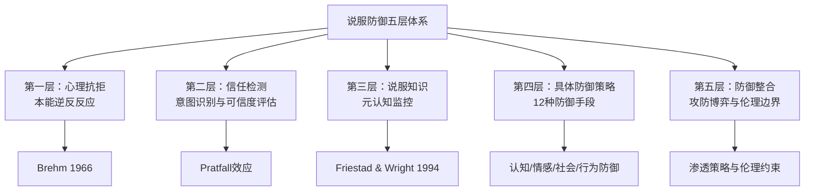
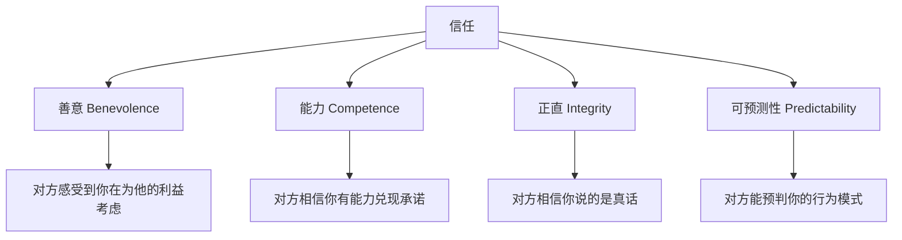
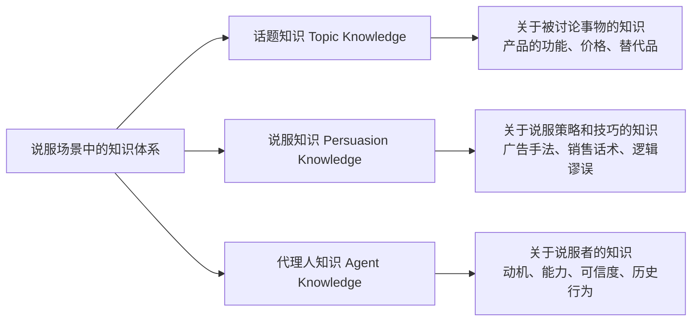
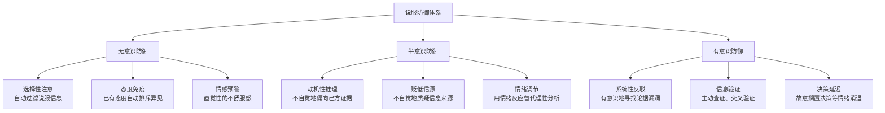
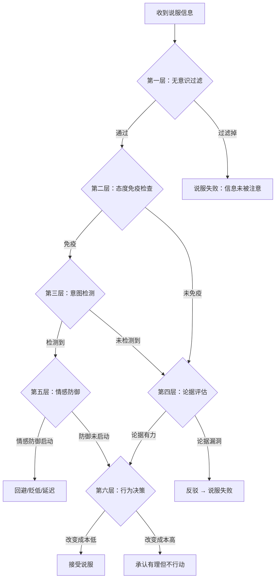
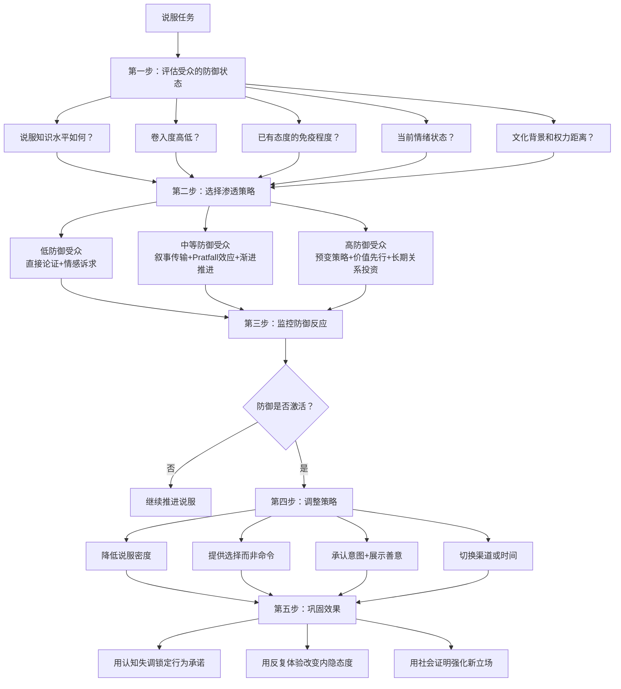

## 五、说服的心理抗拒与防御

说服从来不是单向的信息灌输——每一个接收者都携带着一套进化了数百万年的心理防御系统。当人们感知到自己正在被"推销"或"操控"时，这套系统会自动激活，产生抗拒、怀疑甚至逆反。理解这些防御机制，是说服者从"业余"迈向"专业"的分水岭：你不仅要懂得如何推进，更要懂得对方如何防守。

一个残酷的事实是：**大多数说服尝试不是被"更好的论据"击败的，而是被受众自身的防御系统拦截的。** 你的PPT做得再精美，数据再翔实，如果触发了对方的心理抗拒，一切归零。本节将系统梳理说服过程中的五层防御体系——从心理抗拒的本能反应，到信任检测的认知判断，再到说服知识模型的元认知监控，最后到12种具体防御策略的分类和绕防技巧。每一层都配有理论机制、实验证据、实战案例和攻防策略。

### 5.1 心理抗拒理论（Reactance Theory）

#### 5.1.1 理论来源与核心命题

Jack Brehm于1966年提出心理抗拒理论（Psychological Reactance Theory），是理解说服失败原因的最重要理论之一。其核心命题是：**当人们感知到自己的行为自由受到威胁或被消除时，会产生一种动机性唤醒状态（心理抗拒），驱使他们恢复被威胁的自由。**

这种抗拒不是理性的"不同意"，而是一种本能的、情绪化的逆反反应。它的典型表现是："你越不让我做，我越要做"——即使对方的建议本身是合理的。

心理抗拒理论包含四个关键概念：

| 概念 | 定义 | 说服中的表现 |
|------|------|-------------|
| **自由（Freedom）** | 个体感知到自己拥有的行为选项 | 当被说服时，"不接受你的观点"本身就是一种自由 |
| **威胁（Threat）** | 对自由的限制或消除信号 | 高压销售、强制性语言、限时逼单 |
| **抗拒（Reactance）** | 威胁引发的动机性唤醒 | 反驳、贬低信息源、故意选择相反选项 |
| **恢复（Restoration）** | 试图重新获得被威胁的自由 | "禁果效应"——被禁止的事物反而更有吸引力 |

Brehm的理论有一个常被忽视的重要推论：**心理抗拒的强度与被威胁自由的数量成正比。** 如果你同时威胁了对方的多个自由（比如既限制了选择范围，又压缩了决策时间，还在公开场合施压），抗拒会呈指数级增长而非简单叠加。这就是为什么"逼单三件套"（限时+限量+公开催促）在高压销售中经常适得其反。

#### 5.1.2 心理抗拒的触发条件

并非所有说服都会触发心理抗拒。以下因素会显著放大抗拒反应：

**威胁强度与直接性**

说服的压力越大、越直接，抗拒越强。Brehm和Brehm（1981）的元分析表明，以下因素会放大抗拒：

- **强制性语言**："你必须""你应该""你不得不"——直接否定了对方的选择权
- **时间压力**："现在就决定""过期不候"——剥夺了思考和比较的自由
- **信息垄断**：只提供支持你立场的信息，试图控制对方的信息获取——一旦被察觉，抗拒倍增
- **公开施压**：在众人面前要求对方表态——将私人的决策自由暴露在社会压力下

**真实案例：Netflix 2011年的定价灾难**

2011年，Netflix将原本包含DVD邮寄和流媒体的套餐（$9.99）强制拆分为两个独立服务，月费翻倍至$15.98。CEO Reed Hastings的公告语气强势，几乎没有给用户选择的余地。结果：80万用户在三个月内取消订阅，股价暴跌77%。这不是因为用户不爱Netflix了——而是因为强制性变更触发了大规模心理抗拒。用户感知到的不仅是"涨价"，更是"你没有给我选择权"。如果Netflix提供"保持原价但功能缩减"和"新价格但功能增强"两个选项，结果会截然不同。

**自由的重要性**

被威胁的自由越重要，抗拒越强烈。例如：

- 核心价值观相关的选择（宗教信仰、政治立场）→ 极强抗拒
- 日常偏好（穿什么、吃什么）→ 中等抗拒
- 无所谓的选择（走哪条路去某个地方）→ 弱抗拒或无抗拒

**自由的确定性**

Brehm发现，人们对"已经拥有但可能失去"的自由产生的抗拒，远大于"从未拥有"的自由。这就是为什么改变已有的习惯比建立新习惯更难——已有的习惯是一种"既得自由"，任何改变它的尝试都会触发禀赋效应和心理抗拒的叠加。

**个体差异：谁更容易产生心理抗拒？**

Dowd等人（1991）开发的"心理抗拒倾向量表"（Hong Psychological Reactance Scale）揭示了显著的个体差异：

| 个体特征 | 抗拒倾向 | 说服策略建议 |
|----------|----------|-------------|
| 高自我监控者 | 中等——更关注社会信号 | 使用社会证明和群体规范 |
| 高自尊者 | 极强——自由威胁等于自我威胁 | 给予充分的自主权和尊重 |
| A型人格（竞争性强） | 极强——将说服视为"输赢" | 框架为"合作"而非"被说服" |
| 高宜人性者 | 较弱——更愿意配合 | 可以更直接但仍然需要尊重 |
| 反权威人格 | 极强——对任何"告诉他们该做什么"都反感 | 绝对避免命令式语言 |

#### 5.1.3 心理抗拒的实验验证

**经典实验一：糖果选择实验（Brehm, 1966）**

受试者被展示多件商品并表达偏好，然后实验者告诉他其中一件"已经给了别人"（威胁了选择自由）。结果：被排除的商品，受试者对其评价反而提高了——这就是"得不到的永远在骚动"的心理学验证。

**经典实验二：吸烟警告实验（Dillard & Shen, 2005）**

当反吸烟信息被感知为"强制性"时（"你必须戒烟"），烟民的抗拒反应显著增强，戒烟意愿反而下降。相比之下，当信息被框架为"提供信息"时（"以下是吸烟对健康的影响，决定权在你"），抗拒反应更低，行为改变的意愿更高。

**经典实验三：禁书效应（Worchel & Arnold, 1973）**

当一本书被告知"因为内容敏感被禁止销售"时，受试者对其的渴望和评价显著高于正常销售的同一本书。这就是禁果效应的直接证据——禁止本身创造了稀缺性和反抗动机。

**经典实验四：政治说服中的逆反效应（Quick & Bates, 2010）**

研究者向受试者呈现带有不同强度说服意图的健康信息。结果发现：当信息被感知为"试图操控"时，受试者不仅拒绝信息内容，还会主动采取与建议相反的行为。在吸烟、饮食和运动领域都观察到了这种"反向行为"——你说吸烟不好，我反而抽得更多。这种效应在年轻人群体中尤为显著，因为年轻人正处于"争取自主权"的生命阶段。

#### 5.1.4 减少心理抗拒的六大策略

理解了心理抗拒的触发机制，我们就可以系统性地设计"低抗拒"的说服策略：

**策略一：提供选择而非命令**

将"你应该选A"改为"您可以选择A方案或B方案"。即使你真正想让对方选A，提供两个选项（其中B明显不如A）也会让对方感受到自主权，抗拒大幅降低。

实操模板：
- ❌ "这个方案是最优选择，你应该采用。"
- ✅ "我准备了两个方案。方案A的优势是X，方案B的优势是Y。从你目前的情况来看，方案A可能更适合，但最终决定权在你手上。"

**策略二：强调自主性**

使用尊重对方决策权的语言，关键短语包括："最终决定权在您手上""这只是我的建议""您比我更了解自己的情况"。这些表述在认知层面释放了一个信号：你的自由没有被威胁。

**策略三：使用问题而非陈述**

"您觉得哪种方案更适合？"比"你应该选A"更有效。提问将说服的"推动"转化为对方的"自我说服"——当对方自己说出结论时，抗拒几乎为零，因为没有人会抗拒自己的想法。

苏格拉底式提问的核心技巧：
1. **引导性问题**："如果有一个方案能同时解决X和Y，你会感兴趣吗？"——先锁定需求，再推出方案
2. **假设性问题**："假设时间和预算都不是问题，你最理想的方案是什么样的？"——绕过当前的防御，让对方在想象中降低防御
3. **比较性问题**："你觉得A和B相比，哪个更符合你的需求？"——将注意力从"要不要"转移到"选哪个"

**策略四：适度呈现反面信息**

主动提及方案的局限性或替代方案的优点，然后解释为什么你的方案仍然是最佳选择。这种"双面论证"（two-sided argumentation）不仅降低了心理抗拒，还提升了可信度（Pratfall效应，详见5.2节）。

**策略五：赋予"选择你的立场"的自由**

不要直接告诉对方结论，而是提供足够信息让对方"自己选择"你的立场。苏格拉底式提问、引导式发现、案例对比——这些都是让对方在"自由选择"的过程中走向你预设结论的技术。

**策略六：利用叙事降低抗拒**

讲故事（叙事传输）是一种隐形说服方式——受众沉浸于故事世界时，不会意识到自己正在"被说服"，因此心理抗拒不启动。Green和Brock（2000）的研究证明，故事可以绕过理性防御，直达情感和态度层面。

叙事降抗拒的核心机制：
- **角色认同**：当受众认同故事主角时，会不自觉地接受主角的立场和选择
- **情感卷入**：故事情节引发的情感反应会绕过批判性思维
- **结论隐含**：故事不直接"说教"，而是让受众自己提炼结论——这个"自悟"的过程消除了抗拒
- **时间延迟**：故事的效果往往在听完之后才显现，此时说服知识的监控已经放松

#### 5.1.5 心理抗拒的反面利用：逆反说服

高明的说服者有时会故意触发轻度心理抗拒来强化说服效果。核心技巧是：**暗示对方"不能"拥有某物或做某事，激发其自主追求的动机。**

| 技巧 | 机制 | 示例 |
|------|------|------|
| 有限选择权 | "这个产品不适合所有人，只推荐给真正需要的人" | 暗示"你可能不配拥有"，激发证明自己的动机 |
| 可能被拒 | "我不确定你是否符合条件" | 触发"我要证明我够格"的心理 |
| 稀缺暗示 | "这是最后一批了" | 失去选择自由的威胁 + 稀缺效应叠加 |
| 反向推荐 | "以你的情况，你可能更适合另一个便宜的方案" | 触发"我不需要你告诉我我适合什么"的逆反 |

注意：这些技巧本质上是在操控对方的心理状态，存在伦理边界。在长期关系中使用逆反说服一旦被识破，信任将不可修复。最佳实践是将逆反说服与真实信息结合——你确实是在提供选择，只是表达方式更具说服力。

### 5.2 怀疑、信任与说服意图检测

#### 5.2.1 说服意图检测的本能

人类大脑对"被推销"有一种近乎本能的警觉。这种警觉不是后天学习的——它根植于人类数百万年的社交演化中。在原始部落中，被他人操控可能意味着失去资源、地位甚至生命，因此能够识别"说服意图"的个体拥有生存优势。

心理学家Friestad和Wright（1994）将这种能力称为**"说服知识"（Persuasion Knowledge）**——人们关于说服者如何试图影响自己、以及如何应对这些影响尝试的知识体系。每个人都在成长过程中不断积累说服知识：从小时候被父母"哄着"吃饭，到青春期识别同伴的"套路"，再到成年后对广告的自动免疫。

说服知识的激活有三个关键信号：

1. **意图信号**：对方似乎"有目的"地在引导你——销售人员的微笑、政客的握手、同事的突然殷勤
2. **手法信号**：识别出特定的说服技巧——"他在用稀缺效应""他在打感情牌"
3. **利己信号**：判断对方的动机是否与自己的利益一致——"他这么说是为了我还是为了他自己？"

当这三个信号中的任何一个被激活，受众的"说服防御系统"就会启动，进入一种批判性审视模式。

**真实案例：直销行业的信任危机**

安利（Amway）在中国市场的衰落是一个经典的说服意图检测案例。早期安利通过"朋友推荐"模式扩张——你的朋友邀请你参加一个"家庭聚会"，到了才发现是一场产品推介会。这种模式的致命缺陷在于：它将"朋友关系"和"销售意图"绑定在一起。一旦受众识别出"原来你叫我来是为了卖东西"，不仅说服失败，连朋友关系都会受到损害。安利的品牌信任因此持续下降，最终不得不转向电商渠道。教训是：**当说服意图被检测到时，损失的不仅是这一次说服机会，还有关系本身的信任储备。**

#### 5.2.2 信任的动态建构

说服不是单向的信息灌输，而是一个信任建构的过程。研究表明，当受众感知到说服意图时，会自动启动批判性思维来"防御"。因此，最有效的说服是让对方感觉不到自己正在被说服——不是因为你在隐藏意图（隐藏意图一旦被发现，信任崩塌更快），而是因为你的沟通方式本身就是真诚的。

信任的四个维度：

Mayer等人（1995）的信任整合模型指出，这四个维度虽然相关但独立运作。一个在能力上极强但善意不足的人（如一个才华横溢但自私的同事），信任水平远低于一个能力一般但善意充足的人（如一个愿意帮你的朋友）。**在说服场景中，善意是信任的"门卫"——善意不够，能力和正直都无法进入对方的信任范围。**

#### 5.2.3 Pratfall效应：暴露弱点反而增加信任

1966年，心理学家Elliot Aronson发现了一个反直觉的现象：一个能力很强的人在犯了一个小错误之后，反而显得更有吸引力和可信度。这就是Pratfall效应（"出丑效应"）。

实验设计：受试者听两段答题录音——一段是高能力选手（答对92%），一段是低能力选手（答对30%）。每段录音中，选手都会"打翻一杯咖啡"。结果：高能力选手打翻咖啡后，好感度上升了约15%；低能力选手打翻咖啡后，好感度进一步下降。

Pratfall效应的说服应用：

- **主动承认方案的局限性**："这个方案确实有一个不足——初期投入较高。但从长远来看，它的回报率是替代方案的两倍。"主动暴露弱点，反而让受众觉得你坦诚可信。
- **展示"不完美"**：在简历中适当提及一个不影响核心能力的小缺点，在提案中承认一个可控的风险——这些"弱点"会让其他所有优势显得更真实。
- **适度自嘲**：在演讲中自嘲一个与主题无关的小缺点，能快速拉近与受众的距离，降低他们的防御心理。

Pratfall效应的适用条件：

| 条件 | 说明 |
|------|------|
| 已建立高能力形象 | Pratfall只对已经展现能力的人有效。如果对方还没觉得你"强"，暴露弱点只会确认"你不行" |
| 弱点与核心能力无关 | 打翻咖啡不影响智力评分，但如果答错关键问题则会损害可信度 |
| 弱点是真实的而非刻意 | 受众能分辨自然的小失误和刻意的"示弱表演"，后者会适得其反 |
| 文化背景允许 | 在推崇完美形象的文化中（如日本商务场合），Pratfall效应可能减弱甚至反转 |

**真实案例：苹果公司的"天线门"应对**

2010年，iPhone 4发布后被发现"死亡之握"天线问题。Steve Jobs最初的回应是"你握的方式不对"——这触发了大规模的用户心理抗拒（"你在怪我？"）。随后Jobs召开发布会，承认天线设计存在问题（Pratfall），同时公布了统计数据：iPhone 4的掉线率仅比iPhone 3GS高0.5%，并提供免费保护套。结果：用户不满迅速平息，iPhone 4继续大卖。关键转折在于：**从"否认问题"转为"承认问题+展示能力"，完美触发了Pratfall效应。**

#### 5.2.4 建立信任的实操策略

**展示善意（Benevolence）**

善意是信任中最稀缺的维度——在说服场景中，受众默认怀疑"你这么说是因为对你有利"。建立善意需要持续的行为证明：

1. **先给后取**：在提出请求之前，先为对方提供有价值的信息、帮助或资源。Cialdini的"互惠原则"在这里发挥作用，但更重要的是——先给予的行为本身就是善意的信号。
2. **利益对齐**：将你的说服目标与对方的利益明确关联。"这个方案对你的好处是X，对我来说也有Y收益——所以这是一个双赢的局面。"坦诚自己的利益比假装无私更可信。
3. **退让信号**：在非核心问题上做出真实退让。"你提到的价格问题确实有道理，我可以在交付时间上做一些调整来匹配你的预算。"退让是善意的最强信号——因为它意味着你在为对方的利益牺牲自己的部分利益。

**适度暴露弱点（Pratfall Effect + 透明度）**

如前所述，主动暴露与核心能力无关的弱点能显著提升可信度。但关键在于"适度"——暴露太多弱点会损害能力形象，暴露太少则缺乏真实感。经验法则：每个说服论点中，可以包含一个"但是"来承认局限性，然后用"尽管如此"转折回你的核心论点。

**一致性（Consistency）**

言行一致、前后一致是长期信任的基础。一次言行不一就能摧毁长期积累的信任——因为不一致触发的是"他在欺骗我"的本能警觉。一致性的三个层面：

- **言语一致性**：今天的承诺和昨天的承诺一致
- **言行一致性**：承诺的和实际做的完全一致
- **跨场景一致性**：在不同人面前表达的立场一致

**透明度：承认说服意图**

Friestad和Wright（1994）的研究发现，适度承认自己的说服意图反而能降低对方的防御。"我想说服你考虑这个方案，因为我觉得它对你有价值"——这种坦诚的表述解除了受众"他在暗中操控我"的警觉。当然，透明度需要配合真诚的善意才有用——如果承认了说服意图但继续使用操控技巧，效果会更差。

### 5.3 说服知识模型（Persuasion Knowledge Model）

#### 5.3.1 模型框架

Friestad和Wright（1994）在《Journal of Marketing》上发表的论文提出了说服知识模型（Persuasion Knowledge Model, PKM），这是理解受众如何应对说服尝试的最系统框架。

PKM认为，人们拥有三类知识来应对说服场景：

**三类知识的交互作用**：

当受众接收到说服信息时，他们会同时调动这三类知识进行评估：

- **话题知识**帮助判断"他说的是不是事实"
- **说服知识**帮助判断"他用了什么技巧来影响我"
- **代理人知识**帮助判断"他为什么这么说"

如果三类知识的评估结果一致且正面（事实正确、技巧正当、动机善意），说服效果最大化。如果任何一类知识的评估为负面（事实错误、使用操控技巧、动机可疑），说服效果大打折扣甚至适得其反。

**真实案例：保健品营销的"三重失守"**

某保健品品牌宣称其产品能"延缓衰老30年"（话题知识：虚假夸大→失守），使用"专家推荐+限时抢购"的组合话术（说服知识：明显套路→失守），代言人被曝出收取高额代言费（代理人知识：利益冲突→失守）。三类知识同时亮红灯，产品不仅没卖出去，还引发了大规模的网络嘲讽和监管调查。相反，汤臣倍健等品牌选择"透明工厂"策略——开放生产线参观、公布原料来源、邀请第三方检测——同时在三个知识维度上建立正面评估。

#### 5.3.2 说服知识的触发与应对

当说服知识被激活时，受众会采取以下一种或多种应对策略：

| 应对策略 | 行为表现 | 说服者的应对 |
|----------|----------|-------------|
| **认知防御** | 启动批判性思维，寻找论据中的漏洞 | 提供更高质量的论据，主动回应潜在质疑 |
| **贬低信源** | 贬低说服者的可信度或动机 | 建立更强的Ethos，展示善意和能力 |
| **反向推理** | "他这么说是为了让我买"→"那我偏不买" | 降低说服意图的可见度，使用叙事而非论述 |
| **选择性回避** | 跳过广告、不看推销邮件、回避销售人员 | 改变传播渠道和接触方式，用内容营销替代直接推销 |
| **寻求共识** | 询问朋友、查看评论、寻求第三方意见 | 提供社会证明，主动引导正面口碑 |
| **延迟决策** | "我再想想"——用时间稀释说服效果 | 制造合理而非操控的紧迫感，提供后续跟进 |
| **讽刺性解读** | 将说服信息"解构"为笑料，与朋友分享嘲讽 | 避免任何可能被"玩梗"的夸张表述，保持克制和真实 |
| **反向搜索** | 主动搜索"XX品牌骗局""XX产品差评" | 预先管理在线口碑，主动回应负面评价 |

#### 5.3.3 说服知识的发展阶段

说服知识不是静态的——它随年龄和经验不断进化：

| 阶段 | 年龄范围 | 说服知识水平 | 特征 |
|------|----------|-------------|------|
| **无意识期** | 0-6岁 | 无法区分信息和说服 | 对广告信息全盘接受，"电视上说的就是真的" |
| **萌芽期** | 6-10岁 | 能识别明显的推销意图 | 知道"广告是为了让你买东西"，但不知具体策略 |
| **发展期** | 10-15岁 | 能识别常见说服技巧 | 开始理解"打折""限时"等策略，但仍容易被同龄人影响 |
| **成熟期** | 15-25岁 | 能分析说服者的动机和策略 | 对商业广告产生自动免疫，但对情感操控仍然脆弱 |
| **专家期** | 25岁+ | 能识别复杂的、多层的说服策略 | 对多数说服技巧免疫，但仍受认知偏差影响（因为偏差是无意识的） |

这对说服者的启示是：**面对说服知识成熟的受众，传统的说服技巧会失效。你需要更高层次的策略——真诚、透明、价值驱动——才能穿透他们的防御。**

#### 5.3.4 超越说服知识的策略

当受众的说服知识水平很高时（如资深营销人员、谈判专家、高管），以下策略仍然有效：

1. **价值先行**：提供真正的价值（有洞察力的信息、免费的帮助、独特的机会），让说服知识无用武之地——因为你的行为确实不是纯粹的操控，而是真正的价值交换。
2. **共同敌人**：将说服框架为"我们一起对抗某个问题"而非"我在试图影响你"。当受众将你视为盟友而非对手时，说服防御系统会降低敏感度。
3. **长期关系投资**：在多次互动中持续展示一致性和善意，信任的积累会逐渐降低对方的防御阈值。
4. **元沟通**：直接讨论说服过程本身。"我知道你很了解这些销售技巧，所以我不会用任何套路。我只想和你坦诚地讨论一下……"这种元沟通本身就是一种高级说服——它展示了坦诚和尊重。
5. **认知负荷管理**：高说服知识水平的受众仍然会受认知负荷影响。在他们精力充沛时进行核心论点的讨论，在他们疲劳时提供简明的总结和选项——这不是操控，而是尊重对方的认知资源。

### 5.4 防御机制的分类体系

说服防御不是单一的反应，而是一个多层次、多维度的心理体系。以下分类框架将防御机制按照"意识层面"和"功能类型"两个维度进行系统化。

#### 5.4.1 按意识层面分类

**无意识防御——说服的第一道防线**

无意识防御是最强大也最不可控的防线。它在说服信息到达意识层面之前就已经开始运作：

- **选择性注意**：大脑每秒接收约1100万比特的感官信息，但意识只能处理约50比特。在信息筛选过程中，与已有信念不一致的信息会被自动降级——你可能根本没有"听到"对方的关键论点，因为你的大脑已经把它过滤掉了。
- **态度免疫**：McGuire（1961）的"态度免疫理论"指出，已有态度就像免疫系统——接触过的反面信息越多，态度越"坚固"。这就是为什么长期接触某种观点的人更难被说服——他们的态度已经获得了"免疫力"。
- **情感预警**：Gladwell在《Blink》中描述的"薄片判断"——人们在接触说服信息的最初几秒内就会产生直觉性的好感或反感，这个情感反应会引导后续的所有认知加工。

**半意识防御——说服的第二道防线**

半意识防御处于意识的边缘，人们通常能感知到但不一定会反思：

- **动机性推理**：Kunda（1990）发现，当人们有动机得出某个结论时，会不自觉地调整证据搜索和评估标准。"我希望A方案更好"会导致你更仔细地审视B方案的缺陷，而对A方案的问题视而不见。
- **贬低信源**：当信息与已有信念冲突时，一种常见的防御是否定信息来源的可信度。"这个研究有方法论缺陷""这个人有利益冲突""这只是个案不具代表性"——这些都是贬低信源的表现。

**有意识防御——说服的第三道防线**

有意识防御是人们主动启动的防御策略：

- **系统性反驳**：有意识地寻找论据中的逻辑漏洞、事实错误和数据偏差。这是高卷入度受众最常用的防御方式。
- **信息验证**：主动查证信息来源、交叉比对多个信息源。互联网时代，"搜一下"成了最强大的防御武器。
- **决策延迟**：故意搁置决策，等情绪消退后再做判断。"我睡一觉再决定"——这是一个简单但极其有效的防御策略。

#### 5.4.2 按功能类型分类

| 防御类型 | 功能 | 典型表现 | 应对策略 |
|----------|------|----------|---------|
| **认知防御** | 保护信念体系的一致性 | 确认偏误、动机性推理、选择性解读 | 用对方的框架呈现信息，从共识出发 |
| **情感防御** | 避免负面情绪体验 | 焦虑触发回避、愤怒触发攻击、恐惧触发退缩 | 先处理情绪再处理信息，建立情感共鸣 |
| **社会防御** | 维护社会形象和群体归属 | 从众压力抵抗、权威质疑、群体认同保护 | 利用对方认同的群体的立场，而非直接对抗 |
| **行为防御** | 阻止行为改变的惯性 | 现状偏见、拖延、习惯性拒绝 | 最小化改变，提供清晰的过渡路径 |
| **元认知防御** | 监控自己的思维过程 | 识别说服意图、反思自己的判断过程 | 降低说服意图的可见度，提供真正价值 |

#### 5.4.3 防御强度的影响因素

不同场景下的防御强度差异巨大。以下因素决定防御的敏感度：

**卷入度（Involvement）**

议题与受众的切身相关度越高，防御越强。一个关于你孩子教育的建议，会比关于某个陌生人的教育的建议触发强得多的防御——因为前者涉及你的核心利益和价值观。

Petty和Cacioppo的ELM模型指出，高卷入度会驱动受众走"中心路径"，更加仔细地审视论据质量。这意味着：高卷入度受众更容易发现论据中的漏洞，但也更容易被真正高质量的论证说服。

**先前承诺（Prior Commitment）**

如果受众已经公开表达了某种立场，防御会显著增强——因为改变立场意味着"认错"，这涉及自尊和社会形象。这就是为什么公开承诺（公开演讲、书面声明、社交媒体表态）是锁定态度的最有效手段之一。

**认知负荷（Cognitive Load）**

当受众处于高认知负荷状态（疲劳、压力、信息过载）时，有意识防御的能力会下降——但无意识防御（直觉性的抗拒）可能反而增强。这解释了为什么高压销售（连续轰炸、信息过载）有时有效有时无效：它压制了有意识防御，但如果触发了无意识的"被操控感"，反弹会更强烈。

**关系质量（Relationship Quality）**

信任度高的关系中，防御阈值天然较低。一个你信任的朋友的建议，你不会像对待陌生销售人员的推销那样自动防御。这就是为什么"关系先行"是所有说服策略的基础——关系降低防御，防御降低之后信息才能穿透。

### 5.5 常见说服防御策略详解

以下深入解析受众最常使用的12种具体防御策略，以及说服者的应对方案。

#### 5.5.1 质疑信源（Source Derogation）

**防御机制**：通过攻击信息来源的可信度来拒绝信息。"他说这话是因为他拿了钱""他是利益相关方""他的研究有缺陷"。

**触发条件**：当信息与受众已有信念冲突且受众无法反驳信息内容本身时，攻击信源是阻力最小的防御路径。

**说服者的应对**：

1. **预先建立可信度**：在说服开始之前就建立Ethos，不给对方"质疑信源"的空间
2. **第三方背书**：让可信的第三方传递你的观点——"不是我说的，是哈佛的研究发现的"
3. **承认利益关系**：主动承认自己的利益关联。"是的，如果你们采用这个方案，我确实会获得佣金。但更重要的是，这个方案确实能帮你们解决问题。"坦诚比掩饰更有效
4. **多元化信源**：不依赖单一信源，提供多个独立来源的一致证据

**真实案例：学术论文的同行评审机制**

科学界对抗"质疑信源"的终极方案就是同行评审（Peer Review）——通过匿名专家的独立验证来为研究结论背书。在说服场景中，你可以借鉴这个思路：提供独立第三方的验证、行业权威机构的认证、或多个不相关来源的一致结论。当你能说"不只是我这么说，A机构、B专家、C报告都得出了同样的结论"时，质疑信源的防御路径就被堵死了。

#### 5.5.2 驳斥论据（Counterarguing）

**防御机制**：在心中或口头上找到反驳对方论点的论据。这是最"理性"的防御方式，也是高卷入度受众最常用的策略。

**触发条件**：受众有相关知识背景，且有动机认真审视论据质量。

**说服者的应对**：

1. **预判反驳**：在对方提出反驳之前就主动回应——"你可能觉得X，但实际上Y。"这被称为"预防接种"（inoculation），比事后反驳有效得多
2. **论据密度**：提供比对方能想到的更多的论据——即使其中一两个被反驳，整体论证仍然成立
3. **论证结构化**：使用"金字塔原理"——结论先行，逐层支撑。结构化的论证比散点式的罗列更难反驳
4. **数据武装**：用硬数据替代软性论述。"85%的用户在使用后一个月内看到了效果"比"效果很好"更难反驳

#### 5.5.3 态度免疫（Attitude Inoculation）

**防御机制**：McGuire（1961）提出，预先接触弱化的反面论点，可以像疫苗一样增强态度的"免疫力"。宗教教育、政治宣传、企业文化建设都在系统性地使用这一策略。

**说服者的应对**：

1. **针对"未免疫"的态度**：态度免疫只对已经被预先"接种"的态度有效。如果你要改变的是一个新形成或不太坚定的态度，免疫效应很弱
2. **使用"超强病毒"**：如果受众已经被"接种"了弱版本的反面论点，你需要提供他们从未接触过的、更强有力的新论点——足以突破免疫屏障的新信息
3. **改变攻击面**：如果在态度的核心维度上无法突破，尝试从外围维度切入。"你对这个方案的逻辑没有意见，但你对执行有顾虑？让我来详细说说执行计划。"

**真实案例：政治竞选中的态度免疫**

美国共和党和民主党都在系统性地使用态度免疫策略。竞选团队会提前"接种"支持者——提前告知对方对手可能使用的攻击论点和反驳方式，让支持者在面对对手的攻击时已经有"抗体"。2016年特朗普竞选团队在这方面尤为高效：他们通过社交媒体反复传递"假新闻媒体会攻击我"的叙事，使得支持者在面对任何负面报道时都会自动将其归类为"假新闻"——态度免疫达到了极致。

#### 5.5.4 忽略/回避（Avoidance）

**防御机制**：通过物理或心理上的回避来避免接触说服信息。关掉广告、不看推销邮件、回避某人的目光——这些都是回避策略。

**说服者的应对**：

1. **改变接触方式**：如果对方回避你的直接说服，用间接方式接触——内容营销、行业文章、第三方推荐
2. **制造自然接触**：不要让说服场景看起来像"推销"。咖啡馆闲聊、行业活动偶遇、共同朋友的聚会——在非正式场景中接触，防御系统不会启动
3. **提供真正有价值的内容**：如果每次接触都带来价值（信息、洞察、帮助），对方就不会回避你的出现
4. **尊重回避信号**：如果对方明确表示不想继续，强制说服只会加深抗拒。退一步，留有余地，找更合适的时机

#### 5.5.5 群体认同保护（Group Identity Protection）

**防御机制**：当说服信息挑战了受众所属群体的信念或行为规范时，个体会为了维护群体认同而拒绝信息。"我们这类人不这样做""这不是我们的风格""你说的是他们，不是我们"。

**说服者的应对**：

1. **成为"圈内人"**：在说服之前，先建立群体成员的身份。"我们作为技术人""从工程师的角度来看"——使用"我们"而非"你们"
2. **利用群体内的权威**：找到群体中受尊敬的成员来传递信息——他们比圈外人有效100倍
3. **重塑群体规范**：将你希望推动的行为包装为群体的"新趋势"或"精英做法"。"越来越多的优秀团队已经开始这样做了"
4. **避免标签化**：不要让对方觉得接受你的观点等于"背叛"自己的群体。保持认同的连续性——"这不是改变你是谁，只是让你在XX方面做得更好"

#### 5.5.6 情感隔离（Emotional Insulation）

**防御机制**：当受众预感到说服信息会引发负面情绪（焦虑、愧疚、恐惧）时，会提前启动情感隔离——保持"冷酷""理性""不为所动"的状态。

**说服者的应对**：

1. **不要硬闯**：情感隔离的目的是防止被情绪操控。如果你继续加大情感压力，只会强化隔离
2. **使用间接情感**：不直接诉诸恐惧或愧疚，而是通过故事、类比、场景描述让对方自己产生情感反应——自生的情感比被施加的情感更难防御
3. **尊重对方的"冷"**：有些人在决策时确实偏好极度理性。对这类受众，情感诉求适得其反——给他们数据、逻辑和选项
4. **延迟情感诉求**：先用逻辑和价值打动对方，建立初步认同后再引入情感层面——"你已经看到数据了，现在想想这对你的团队意味着什么"

#### 5.5.7 现状偏见（Status Quo Bias）

**防御机制**：Samuelson和Zeckhauser（1988）发现，人们在面对选择时会系统性地偏向维持现状——即使改变的期望收益明显更高。这种偏见源于三个心理基础：损失厌恶（改变可能带来损失）、选择过载（维持现状不需要决策成本）、和认知懒惰（评估新选项需要消耗认知资源）。

**触发条件**：当受众当前的状态"还过得去"（不是特别糟糕但也不特别好），改变的风险和成本可见，而收益不确定。

**真实案例：企业软件迁移的困境**

很多企业仍然在使用10年前的ERP系统，即使市面上有更高效、更便宜的替代方案。不是因为决策者不知道新方案更好——而是迁移成本（数据迁移、员工培训、过渡期风险）比"继续用旧系统"的心理成本更大。Salesforce的破解策略是提供"免费试用+白手套迁移服务+效果不达标全额退款"——将改变的成本和风险全部由说服者承担，彻底瓦解现状偏见。

**说服者的应对**：

1. **放大现状的成本**：不要只展示"新方案有多好"，更要展示"维持现状的隐性代价"——"你现在用的系统每年的维护成本是X，而且这个成本还在增长"
2. **最小化改变**：将改变拆解为小步骤，降低感知风险。"第一步只是试用两周，不需要任何改变"
3. **提供过渡保障**：降低改变的风险——"如果不满意可以随时退回原来的方案"
4. **利用"新现状"框架**：将改变包装为"建立新的常态"而非"打破旧的"。"这不是改变，而是升级到你应该拥有的状态"

#### 5.5.8 选择性暴露（Selective Exposure）

**防御机制**：Festinger（1957）的认知失调理论预言，人们会主动选择接触与自己已有态度一致的信息，回避不一致的信息。在互联网时代，这种防御被算法推荐系统极大地强化了——你关注的账号、点击的内容、停留的时长，都在训练算法给你推送"你已经相信的东西"。

**触发条件**：信息获取成本低（如互联网），且存在多种信息来源时，选择性暴露最为显著。

**说服者的应对**：

1. **嵌入友好渠道**：将你的信息通过受众已经信任的渠道传递——他们信任的博主、常看的媒体、所在的社群
2. **"特洛伊木马"策略**：将说服信息包裹在受众感兴趣的内容中。一篇关于行业趋势的文章（受众感兴趣）中自然地包含你的方案信息
3. **利用"好奇心缺口"**：标题和开头暗示受众"不知道的重要信息"，激发好奇心突破选择性暴露的壁垒
4. **同伴传播**：让受众的同伴（他们信任且愿意接触的人）传递信息，绕过个体层面的选择性暴露

#### 5.5.9 合理化（Rationalization）

**防御机制**：当受众无法直接反驳说服信息时，会通过构建"合理"的理由来拒绝改变。合理化不同于驳斥论据——驳斥是针对信息本身的逻辑攻击，合理化是构建新的解释框架来维持原有立场。

常见的合理化模式：
- **"不适用"合理化**："你说的对，但不适用于我的情况"
- **"时机不对"合理化**："这个方案可能不错，但现在不是时候"
- **"代价过高"合理化**："我知道应该改变，但成本太高了"
- **"已经在做了"合理化**："我们已经在做类似的事了"（实际上做了很少）

**说服者的应对**：

1. **预判合理化模式**：提前识别受众可能使用的合理化理由，在论证中主动回应
2. **定制化方案**：针对"不适用"的合理化，将方案与受众的具体情况深度关联，证明"确实适用于你"
3. **拆解"时机"借口**：提供明确的时间线和阶段计划，让"不是时候"变成"现在就是最好的时候"
4. **量化不改变的代价**：用具体数据展示"不行动"的真实成本

#### 5.5.10 社会证明反用（Counter Social Proof）

**防御机制**：当受众意识到说服者正在使用社会证明（"大多数人都选择这个""销量第一"）时，会产生逆反——"大多数人也可能是错的""我可不是大多数人"。这种防御在高独立性个体中尤为常见。

**触发条件**：受众的独立思考意识强，或者对"大多数人的选择"持怀疑态度。

**说服者的应对**：

1. **精准社会证明**：不用"大多数人"，而用"与你情况类似的人"——"和你同一行业的XX公司，面临同样的问题，他们选择了这个方案后……"
2. **质量而非数量**：不强调"多少人"，而强调"谁"——"三个行业顶级专家都推荐了这个方案"
3. **反对多数人的勇气**：承认"大多数人可能是错的"，然后用独立的逻辑和证据来支撑你的论点
4. **让受众感觉自己是"先驱"**："这个方案目前只有少数有远见的人在用"——满足独立性个体的自我认同

#### 5.5.11 抗拒升级（Reactance Escalation）

**防御机制**：当初始的温和抗拒未被说服者尊重时，受众会逐步升级抗拒强度——从"我不太同意"到"我坚决反对"再到"你再提我就走人"。这种升级是心理抗拒的动态表现：每一次不被尊重的抗拒都会增加新的"自由威胁"，引发更强的逆反。

**触发条件**：说服者忽视了受众的拒绝信号，继续施压。

**说服者的应对**：

1. **识别抗拒信号并后退**：当对方说"让我再想想"时，这可能是真正的考虑，也可能是温和的拒绝。如果继续追问"你在想什么"，可能触发升级。正确的做法是说"好的，我等你"，给对方空间
2. **软化而非强化**：当感受到抗拒时，降低而非增加说服力度。"我知道这可能不是你当前的优先事项"——后退一步反而可能让对方重新考虑
3. **改变话题**：在抗拒升级之前切换话题，将对话从"对抗模式"恢复到"正常交流模式"
4. **承认对方的立场**："我理解你的顾虑，你的判断可能是对的。"——承认对方有权拒绝，是阻止升级的最有效方式

#### 5.5.12 元认知监控（Metacognitive Monitoring）

**防御机制**：受众有意识地监控自己的思维过程，反思"我现在是被说服了，还是真的被说服了？"。这是最高层级的防御——不是针对说服内容，而是针对自己的认知过程。典型的元认知监控问题是："如果去掉他的情感表达和包装，这个论点的核心逻辑是什么？"

**触发条件**：受众具有较高的元认知能力（通常是受教育程度较高、逻辑思维较强的人），或者被提醒过"注意别被说服"。

**说服者的应对**：

1. **让核心论据经得起元认知审视**：不要依赖"话术"和"包装"，确保你的核心逻辑在冷静审视下仍然成立
2. **提供"审计友好"的信息**：提供详细的数据、可验证的事实、清晰的逻辑链——让元认知监控"审计"后得出"确实有道理"的结论
3. **利用元认知的盲区**：元认知监控主要针对"显性"的说服过程，对隐性的认知偏差（框架效应、锚定效应、首因效应）防御力较弱
4. **延迟效应**：叙事和故事的效果往往在事后才显现——当受众放松元认知监控之后

### 5.6 特殊场景下的心理防御

#### 5.6.1 群体中的防御机制

在群体场景中（会议、演讲、小组讨论），说服防御有其独特特征：

**社会抑制效应**

在公开场合，人们更难改变立场——因为改变等于在众人面前"认错"。Janis（1982）的"群体思维"研究表明，群体中的个体更倾向于维持与多数人一致的立场，即使私下里持有不同看法。

应对策略：
- 在群体讨论前先进行一对一的私下沟通，锁定关键人物的支持
- 为群体中的反对者提供"体面的转弯"——"基于今天讨论的新信息，调整看法是很正常的"
- 使用匿名投票或书面反馈来获取真实意见

**信息瀑布（Information Cascade）**

在群体中，前几个人的意见会影响后续所有人的判断——即使后续的人有自己的独立信息。这种"信息瀑布"可以在几分钟内将群体推向一个可能错误的共识。

说服者的利用：
- 确保你支持的观点在讨论中最先被表达
- 安排"盟友"在讨论早期发言支持你的立场
- 但也需要注意：如果信息瀑布导致了错误决策，最终责任可能在你

#### 5.6.2 数字环境中的防御机制

数字时代的说服防御呈现出新特征：

**广告盲区（Banner Blindness）**

Nielsen（2007）的眼动追踪研究发现，用户在浏览网页时会自动忽略看起来像广告的区域——即使广告内容与他们的需求高度相关。这是一种经过训练的无意识防御。

**信息过载下的极简化决策**

面对海量信息，受众倾向于使用极简化的判断标准——品牌知名度、评价数量、推荐人。说服者需要确保在这些"极简线索"上有优势。

**算法推荐形成的回音室**

社交媒体的算法推荐会强化用户的已有信念，形成"回音室效应"——受众只接触与自己立场一致的信息，说服知识和态度免疫都在不断增强。突破回音室需要找到跨圈层的接触点和共同语言。

**数字信任的新维度**

在线上环境中，信任的建立方式发生了根本变化：

| 线下信任信号 | 线上等价物 | 有效性对比 |
|-------------|-----------|-----------|
| 面对面交流 | 视频通话/直播 | 较低——缺少物理临场感 |
| 肢体语言 | 表情符号/打字语气 | 极低——信息损失严重 |
| 商业场所 | 网站设计/APP体验 | 中等——第一印象效应仍然存在 |
| 个人推荐 | 在线评价/评分 | 中高——但存在刷评风险 |
| 长期交往 | 持续的高质量内容输出 | 中等——需要更长时间积累 |

**社交媒体说服防御的新特征**：

1. **"一眼假"本能**：社交媒体用户被训练出了对营销内容的快速识别能力——看到"亲测有效""绝绝子""家人们"等特定词汇会自动触发防御
2. **截屏文化**：任何不当的说服尝试都可能被截屏传播，导致信任的全局性崩塌。一次"翻车"的影响范围远超线下场景
3. **注意力碎片化**：数字环境中的注意力以秒计算，说服窗口极窄。如果前3秒没有建立价值感知，防御系统会直接过滤
4. **反向验证**：受众可以在几秒钟内搜索到关于你的负面信息。线下的信息不对称优势在数字环境中几乎不存在

#### 5.6.3 高压场景中的防御

当人们处于压力、焦虑或恐惧状态时，防御机制会发生显著变化：

| 状态 | 防御变化 | 说服策略调整 |
|------|----------|-------------|
| 高压/焦虑 | 有意识防御下降（认知资源被情绪占用），但无意识防御增强（对威胁信号更敏感） | 降低压力感，提供安全感，用简单清晰的语言 |
| 恐惧 | 战斗或逃跑反应启动，理性分析能力大幅下降 | 先安抚情绪（"我理解你的担心"），再提供信息 |
| 愤怒 | 批判性思维增强但方向偏移（更倾向于攻击性反驳） | 避免正面对抗，承认对方的愤怒是合理的，等情绪消退 |
| 疲劳 | 所有防御能力下降，更容易被简单的线索左右 | 简化信息，使用外围线索（权威、社会证明），减少认知负荷 |
| 悲伤 | 防御全面下降，决策能力受损，容易冲动决策 | 提供情感支持，避免在对方悲伤时推进重要说服——有乘人之危的伦理风险 |

### 5.7 攻防博弈：说服者与受众的策略互动

说服是一个动态博弈过程——说服者推进，受众防御，说服者调整策略，受众升级防御。理解这个博弈结构，能帮助说服者预判对方的反应并提前准备。

#### 5.7.1 防御升级路径

当基础防御失败时，受众会逐步升级防御强度：

#### 5.7.2 说服者的渗透策略

面对层层防御，高级说服者使用以下"渗透"策略：

**策略一：降低信息的"说服密度"**

如果一段沟通看起来"太像在说服"，所有防御层都会同时启动。降低说服密度的方法：
- 将说服信息嵌入故事、闲聊、案例分享中
- 分散在多次对话中，而非一次集中表达
- 通过提问引导对方自己得出结论

**策略二：利用"未防御"的时间窗口**

防御系统不是24小时在线的。以下时间窗口中防御较弱：
- 刚建立积极情感连接后（情感正在主导认知）
- 对方正在主动寻求信息时（动机高但防御意识低）
- 疲劳或认知负荷较高时（有意识防御能力下降）
- 群体归属感受到威胁时（需要外部支持而非防御）

**策略三：多渠道渗透**

单一渠道的说服容易被识别和防御。多渠道、多形式的信息传递更难防御：
- 面对面沟通 + 邮件跟进 + 第三方推荐 + 行业报告
- 不同渠道传递不同角度的信息，最终汇聚到同一个结论

**策略四：预变（Pre-suasion）**

Robert Cialdini在《Pre-suasion》（2016）中提出：在正式说服开始之前，通过设置"注意力框架"来预先影响受众的态度。例如：
- 在谈判前发送一份行业报告（其中的数据支持你的立场）
- 在会议前安排一次非正式的咖啡聊天（建立好感和信任）
- 在提案前展示一个类似的成功案例（设定正面预期）

**策略五：渐进承诺（Foot-in-the-Door）**

先获得一个小的承诺，再逐步升级到大的请求。Freedman和Fraser（1966）的经典实验显示：先请求住户在窗户上贴一个小标志（同意率76%），一周后再请求在院子里立一块大标志牌（同意率50%）。而直接请求立大牌子的同意率只有17%。

渐进承诺之所以能绕过防御，是因为：
- 小承诺不触发心理抗拒（自由威胁极小）
- 小承诺建立了一致性压力（"我已经同意了小的，拒绝大的会不一致"）
- 小承诺改变了自我认知（"我是支持这件事的人"）

**策略六：注意力引导（Attention Management）**

说服的关键不在于你说了什么，而在于对方注意到了什么。Cialdini在《Pre-suasion》中指出，在说服信息呈现之前引导受众的注意力到特定方面，可以显著影响他们对后续信息的解读。

实操方法：
- 在讨论价格之前先讨论价值（让对方注意"得到了什么"而非"花了多少"）
- 在展示方案之前先描述问题（让对方注意"需要解决什么"而非"方案好不好"）
- 在提出请求之前先提及对方的某个正面特质（让对方注意"我是这样的人"→一致性压力）

### 5.8 跨文化视角下的说服防御

说服防御不是普遍一致的——文化背景显著影响人们的防御模式和敏感度。

#### 5.8.1 个人主义 vs 集体主义文化

| 维度 | 个人主义文化（美/英/澳） | 集体主义文化（中/日/韩） |
|------|------------------------|------------------------|
| 心理抗拒焦点 | 个人选择权被威胁 | 群体和谐被破坏 |
| 最有效的触发方式 | 直接限制个人自由 | 让个体在群体面前丢面子 |
| 最弱的防御状态 | 独处、匿名 | 被群体排斥、需要群体认可 |
| 信任建立路径 | 能力 → 正直 → 善意 | 善意（关系）→ 能力 → 正直 |
| 群体认同保护强度 | 中等——个人选择优先 | 极强——群体归属是核心需求 |

#### 5.8.2 高语境 vs 低语境沟通

Edward Hall的高语境/低语境理论对说服防御有重要启示：

- **低语境文化**（美/德/北欧）：信息主要靠语言本身传递。说服防御主要针对"说了什么"——论据质量、数据准确性、逻辑严密性
- **高语境文化**（中/日/阿拉伯）：信息大量依赖语境、关系、非语言信号。说服防御主要针对"谁在说""在什么场合说""暗示了什么"——而非字面内容

**实操差异**：在中国文化中，直接说"你的方案不行"会触发强烈的社会防御（面子威胁）。更好的方式是："这个方案的方向很好，在某些细节上我们可能需要再讨论一下。"——既表达了反对意见，又保护了对方的社会面子。

#### 5.8.3 权力距离的影响

Hofstede的权力距离维度影响人们对"权威说服"的防御：

- **高权力距离文化**（中国、印度、马来西亚）：对权威来源的说服防御较低——"领导说的/专家说的"本身就有说服力。但如果权威被质疑，防御反弹更强烈
- **低权力距离文化**（北欧、以色列、澳大利亚）：对权威来源保持天然怀疑——"凭什么你的意见比我的重要？"需要通过平等对话和证据来建立说服力

### 5.9 说服防御的伦理维度

#### 5.9.1 防御的正当性

从受众的角度看，说服防御是一种完全正当的自我保护机制。每个人都有权：
- 保护自己的信念体系不被不当操控
- 在重大决策前充分考虑而非被迫行动
- 知道自己正在被说服，并选择接受或拒绝
- 维护自己的价值观和身份认同

说服者尊重这些权利，是建立长期信任的前提。

#### 5.9.2 攻破防御的伦理边界

说服者"穿透"防御是否正当，取决于以下标准：

| 标准 | 正当 | 不正当 |
|------|------|--------|
| **信息真实性** | 提供真实、完整的信息来穿透防御 | 用虚假或选择性信息绕过防御 |
| **对方利益** | 穿透防御后提供对双方都有利的方案 | 穿透防御后单方面获利 |
| **决策自主性** | 穿透防御后让对方自主做出决定 | 穿透防御后代替对方做决定 |
| **可逆性** | 穿透防御后的决策可以撤回 | 穿透防御后的决策不可逆 |
| **意图透明度** | 在必要时能说清楚自己为什么这样做 | 根本无法向对方解释自己的策略 |
| **关系影响** | 穿透防御后关系更加稳固 | 穿透防御后关系受损或依赖 |

#### 5.9.3 "说服免疫"的反面思考

从另一个角度看，完全免疫于说服也是一种危险。如果一个人对所有说服尝试都自动防御，他将：
- 错过真正有价值的信息和机会
- 陷入封闭的信念体系无法成长
- 难以建立深度的人际关系（因为关系本质上涉及相互影响）
- 无法做出需要整合多方观点的复杂决策

最健康的状态不是"刀枪不入"，而是"有选择性地开放"——对可信来源、高质量论据和善意的说服保持开放，对操控性、虚假和利己的说服保持警觉。

**培养"说服素养"而非"说服免疫力"**：

说服素养（Persuasion Literacy）是一种元能力，包含三个层面：
1. **识别层面**：能识别他人使用的说服策略和技巧
2. **评估层面**：能评估说服信息的真实性和对方的意图
3. **决策层面**：在充分评估后做出自主的选择——而不是盲目接受或盲目拒绝

### 5.10 本节综合框架

将本节的五层防御体系与前文的说服理论整合，形成一个完整的攻防决策框架：

#### 各防御类型的应对速查

| 防御类型 | 核心机制 | 最佳应对策略 | 避免的做法 |
|----------|----------|-------------|-----------|
| 心理抗拒 | 自由受威胁的逆反 | 提供选择、强调自主性、使用提问 | 命令式语言、公开施压、时间压力 |
| 说服知识激活 | 识别出说服意图 | 降低说服密度、预变策略、价值先行 | 使用明显的套路、隐藏真实意图 |
| 认知防御 | 批判性审视论据 | 预防接种、论据密度、数据武装 | 提供可被轻易反驳的薄弱论据 |
| 情感防御 | 情感隔离和回避 | 间接情感、延迟情感诉求、尊重"冷" | 硬闯情感防线、加剧焦虑 |
| 社会防御 | 群体认同保护 | 成为圈内人、利用群体权威 | 挑战群体身份、标签化 |
| 行为防御 | 现状偏见和习惯 | 最小化改变、清晰过渡路径 | 颠覆性方案、模糊的执行步骤 |
| 现状偏见 | 损失厌恶+认知懒惰 | 放大现状代价、最小化改变、过渡保障 | 只讲好处不讲风险 |
| 选择性暴露 | 主动回避不一致信息 | 嵌入友好渠道、特洛伊木马、同伴传播 | 通过对抗性渠道强行推送 |
| 合理化 | 构建理由拒绝改变 | 预判理由、定制方案、量化不改变的代价 | 忽视对方的"借口"（它们是真实的防御） |
| 社会证明反用 | 对"大多数人"的逆反 | 精准社会证明、质量而非数量 | 泛泛使用"大家都选这个" |
| 抗拒升级 | 不被尊重的抗拒逐步强化 | 识别信号并后退、承认对方立场 | 忽视拒绝信号继续施压 |
| 元认知监控 | 有意识审视自己的认知过程 | 让论据经得起冷静审视、审计友好信息 | 依赖话术和包装而非实质论据 |

#### 实操自检清单

在进行任何重要的说服任务之前，使用以下清单评估你的准备状态：

说服防御自检清单
━━━━━━━━━━━━━━━━━━━━━━━━━━━━━━

□ 受众评估
  □ 受众的说服知识水平？（新手/中等/专家）
  □ 议题的卷入度？（低/中/高）
  □ 受众已有态度的免疫程度？（新态度/坚定态度/极端态度）
  □ 当前情绪状态？（正常/压力/焦虑/愤怒/疲劳）
  □ 文化背景和个人特征？（个人主义/集体主义/权力距离）

□ 防御预判
  □ 最可能触发哪种防御？（心理抗拒/认知防御/情感防御/社会防御/行为防御）
  □ 防御强度预估？（低/中/高/极高）
  □ 有哪些"未防御"的时间窗口或渠道？

□ 策略准备
  □ 是否准备了低说服密度的表达方式？（故事/案例/问题）
  □ 是否准备了选择而非命令的措辞？
  □ 是否预判并准备了应对常见反驳？
  □ 是否准备了Pratfall效应的"弱点暴露"？
  □ 是否建立了可信度（Ethos）？

□ 伦理检查
  □ 信息是否真实完整？
  □ 方案是否对双方都有利？
  □ 对方是否有自主决策权？
  □ 如果对方了解你的全部策略，你能否坦然面对？

□ 退路准备
  □ 如果触发了强烈抗拒，你的后退策略是什么？
  □ 如果当前时机不对，你的备选时间点是什么？
  □ 如果说服失败，关系是否能保住？

掌握心理抗拒与防御的知识，说服者就拥有了双重能力：既能识别自己的说服尝试何时触发了对方的防御并及时调整，也能理解自己的心理防御机制，在面对他人的说服时做出更明智的判断。这不仅是一种沟通技能，更是一种元认知能力——对自身思维过程的觉察和掌控。最终目标不是成为一个"无法被说服"的人，也不是成为一个"能说服任何人"的人，而是成为一个**能够在充分理解和尊重他人防御的基础上，用真实的价值和真诚的沟通达成共赢的人**。

### 参考文献

- Brehm, J. W. (1966). *A Theory of Psychological Reactance*. Academic Press.
- Brehm, S. S., & Brehm, J. W. (1981). *Psychological Reactance: A Theory of Freedom and Control*. Academic Press.
- Cialdini, R. B. (2016). *Pre-suasion: A Revolutionary Way to Influence and Persuade*. Simon & Schuster.
- Dillard, J. P., & Shen, L. (2005). On the nature of reactance and its role in persuasive health communication. *Communication Monographs*, 72(2), 144-168.
- Dowd, E. T., Milne, C. R., & Wise, S. L. (1991). The Therapeutic Reactance Scale. *Journal of Counseling Psychology*, 38(2), 213-218.
- Festinger, L. (1957). *A Theory of Cognitive Dissonance*. Stanford University Press.
- Freedman, J. L., & Fraser, S. C. (1966). Compliance without pressure: The foot-in-the-door technique. *Journal of Personality and Social Psychology*, 4(2), 195-202.
- Friestad, M., & Wright, P. (1994). The persuasion knowledge model: How people cope with persuasion attempts. *Journal of Consumer Research*, 21(1), 1-31.
- Green, M. C., & Brock, T. C. (2000). The role of transportation in the persuasiveness of public narratives. *Journal of Personality and Social Psychology*, 79(5), 701-721.
- Hall, E. T. (1976). *Beyond Culture*. Anchor Books.
- Hofstede, G. (1980). *Culture's Consequences*. Sage Publications.
- Janis, I. L. (1982). *Groupthink*. Houghton Mifflin.
- Kunda, Z. (1990). The case for motivated reasoning. *Psychological Bulletin*, 108(3), 480-498.
- Mayer, R. C., Davis, J. H., & Schoorman, F. D. (1995). An integrative model of organizational trust. *Academy of Management Review*, 20(3), 709-734.
- McGuire, W. J. (1961). The effectiveness of supportive and refutational defenses in immunizing and restoring beliefs against persuasion. *Sociometry*, 24(2), 184-197.
- Petty, R. E., & Cacioppo, J. T. (1986). *Communication and Persuasion: Central and Peripheral Routes to Attitude Change*. Springer-Verlag.
- Quick, B. L., & Bates, B. R. (2010). The use of health coping narratives to reactance persuasion. *Health Communication*, 25(4), 293-302.
- Samuelson, W., & Zeckhauser, R. (1988). Status quo bias in decision making. *Journal of Risk and Uncertainty*, 1(1), 7-59.
- Worchel, S., & Arnold, S. E. (1973). The effects of censorship and attractiveness of the censor on attitude change. *Journal of Experimental Social Psychology*, 9(4), 365-377.
