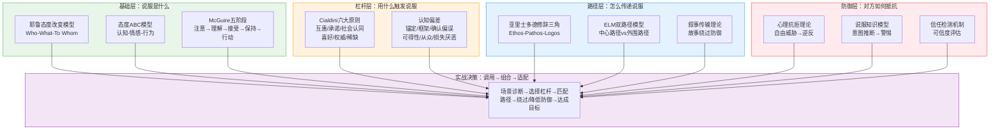
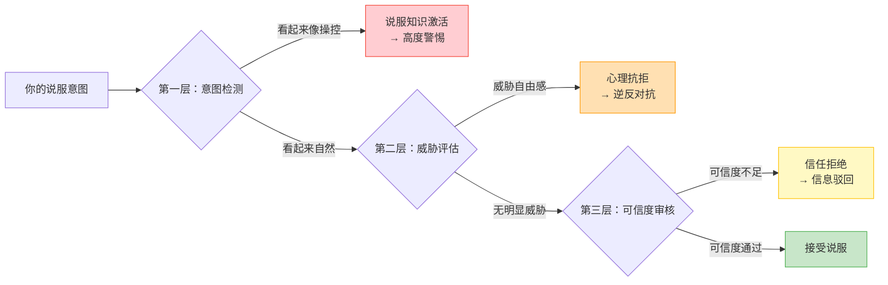

## 六、小结：理论基础全景图与核心洞察

### 6.1 为什么需要这个小结

前面五个部分分别从心理学基础、Cialdini六大原则、认知偏差、经典说服模型、心理抗拒与防御五个维度，系统拆解了说服的理论体系。它们各自独立，却共同指向一个核心命题：**说服是一门可以被理解、被建模、被系统优化的人类行为科学**。

但碎片化的知识不等于能力。如果你只记住了"锚定效应"或"ELM模型"的名词解释，而在实际场景中不知道该调用哪个工具、如何组合使用，那这些理论就只是考试知识点而非实战武器。

本节承担三个具体任务：

1. **整合**——将五个部分的散点知识编织成一张可导航的知识网络，让你看到理论之间的连接关系而非孤立的名词
2. **提炼**——从大量理论中萃取最具实战价值的核心洞察，每个洞察都直接对应一个可操作的行为改变
3. **桥接**——为后续的"核心技巧"部分搭建理论到实践的转换接口，让你带着框架进入实操训练

你可以把这个小结当作整套理论体系的"索引页"——当你在实际说服场景中遇到困惑时，回到这里快速定位需要调用的理论工具。

### 6.2 理论全景图：五条线索如何编织在一起

说服的理论基础可以被理解为五条相互交织的线索。它们不是平行排列的，而是层层递进、相互支撑的关系：

这五层的关系可以这样理解：

- **基础层**回答"说服是什么"——定义了态度的结构（ABC）、说服的过程（McGuire五阶段）、影响效果的变量（耶鲁三要素）
- **杠杆层**回答"用什么触发"——提供了可以直接作用于人类决策系统的心理开关（六大原则）和认知捷径（认知偏差）
- **路径层**回答"怎么传递"——决定了你是用逻辑征服对方（中心路径/Logos），还是用情感打动对方（外围路径/Pathos），还是用故事包裹说服（叙事传输）
- **防御层**回答"对方如何防守"——揭示了你的说服意图会激活哪些心理防御机制，以及如何绕过或降低这些防御
- **整合层**回答"实战中怎么组合"——将前四层的判断汇入一个决策流程：诊断场景→选择杠杆→匹配路径→处理防御→达成目标

**关键理解：这五层不是"选一层用"，而是"每一层都要过一遍"。** 忽略任何一层都会导致说服失败——你可能选对了杠杆（社会认同），但传递路径不对（对方需要逻辑论证而非从众信号），或者没有处理防御（对方已经对营销话术高度警惕）。

#### 理论之间的协同与张力

五条线索之间不仅有协同关系，也存在张力。理解这些张力是高级运用的关键：

| 关系类型 | 具体表现 | 实战含义 |
|---------|---------|---------|
| **协同放大** | Cialdini权威原则 + Ethos建设 + 外围路径 | 三者同时作用时，可信度效果呈指数级放大 |
| **互补覆盖** | ELM中心路径(Logos) + 外围路径(Ethos/Pathos) | 高卷入度用中心路径，低卷入度用外围路径，覆盖全场景 |
| **张力平衡** | 稀缺性原则 vs 心理抗拒理论 | 过度使用稀缺性会触发"你越限制我越反抗"的心理抗拒 |
| **层次嵌套** | 认知偏差(底层自动化) + ELM(中层加工路径) + 修辞三角(上层表达策略) | 底层偏差是"硬件"，中层路径是"操作系统"，上层修辞是"应用软件" |
| **动态转换** | 叙事传输(绕过防御) ↔ 说服知识激活(启动防御) | 故事太明显变成"广告"，会从绕过防御变成激活防御 |

最典型的张力案例：**稀缺性与心理抗拒的博弈**。当你说"仅剩3个名额"时，稀缺性原则会激发紧迫感，但如果对方感觉到你在"逼迫"他做决定，心理抗拒就会启动，反而产生"你越催我越不买"的逆反心理。高手的做法是：用客观事实呈现稀缺性（"这个课程每期只招20人，因为需要保证一对一辅导质量"），而不是用主观施压（"你再不报名就没了"）。前者是信息透明，后者是操控意图——对方的说服知识模型会精准区分这两者。

### 6.3 九个核心洞察

从五个部分的理论中，我们可以提炼出九个最具实战价值的核心洞察。每个洞察都不是抽象的理论陈述，而是直接指向一个可操作的行为改变。

#### 洞察一：说服是双向过程，不是单向输出

说服的起点不是"我要说什么"，而是"对方需要什么"。耶鲁模型的三要素（来源-信息-接收者）中，**接收者是最关键的变量**。同一条信息，对不同的接收者产生的效果可能截然相反——一个高卷入度的专业人士需要中心路径的逻辑论证，一个低卷入度的普通消费者可能只需要外围路径的社会证明。

**实操含义：** 在准备任何说服之前，先花50%的时间分析受众——他们的知识水平、动机强度、既有立场、决策风格。这比准备论据本身更重要。

**案例：** 一位医疗器械销售员向医院推销新型CT机。面对放射科主任（高卷入度专业人士），他准备了详细的技术参数对比、临床试验数据、不同品牌故障率统计——这是中心路径策略。面对分管副院长（低卷入度决策者，依赖下属意见），他准备了"全国Top 50医院中有38家已采用"的社会证明、行业权威专家的推荐视频——这是外围路径策略。同一款产品，两套完全不同的说服方案，因为接收者不同。

#### 洞察二：态度是三维的，说服也必须是三维的

态度ABC模型（认知-情感-行为）揭示了一个关键事实：**仅改变认知不足以改变行为**。一个人可以在认知上同意"运动有益健康"（C），在情感上并不享受运动（A），因此从不运动（B）。最有效的说服是在认知、情感和行为三个维度同时发力：

| 维度 | 策略 | 示例 |
|------|------|------|
| 认知（C） | 提供数据、证据、逻辑论证 | "每周运动150分钟，心血管疾病风险降低40%" |
| 情感（A） | 激发愿景、恐惧、共鸣 | "想象5年后你的孩子追着你跑，你还能轻松跟上" |
| 行为（B） | 降低行动门槛、提供即时反馈 | "从今天开始，每天散步10分钟就够了" |

**案例：** 企业推行新CRM系统。只做认知培训（"新系统功能更强大"）通常失败率很高，因为员工在情感上抗拒改变（A维度未处理），在行为上不知道从哪里开始（B维度未处理）。成功的推行方案是：认知层展示效率提升数据 + 情感层让员工参与设计减少陌生感 + 行为层从一个最简单的功能开始逐步迁移。三个维度缺一不可。

#### 洞察三：六大原则是系统1的开关，不是理性论证

Cialdini的六大原则之所以有效，是因为它们直接作用于Kahneman所说的"系统1"——快速、自动、无意识的决策系统。人们不是在分析了所有证据后才决定"因为有1000人购买所以我应该买"，而是在看到"1000人购买"这个信号的瞬间，大脑就自动启动了"从众"的启发式判断。

这意味着：**六大原则的最佳使用场景是低卷入度、高时间压力、信息不对称的决策情境**。在高卷入度的理性决策中，它们是辅助手段而非主力。

**反面案例：** 一位B2B软件销售在面对企业CTO时，开场就用"已有500家企业使用"（社会认同）和"优惠截止到本周五"（稀缺性）。CTO是技术决策者，他的决策模式是中心路径（评估架构、性能、安全性），这些外围信号不仅无效，还会让他觉得你在"套路"他，降低对你的信任。正确做法是：先用Logos（技术方案深度）建立信任，再用六大原则中的"权威"（行业专家背书）和"社会认同"（同行业标杆客户）作为辅助佐证。

#### 洞察四：认知偏差是双刃剑——既是说服工具，也是说服陷阱

锚定效应、框架效应、确认偏误……这些偏差既是你可以利用的说服杠杆，也是你自己容易掉入的认知陷阱。一个优秀的说服者需要具备"元认知"能力——**既能识别对方的认知偏差并加以利用，也能识别自己的认知偏差并主动校正**。

防御清单（每次重要说服前检查）：

- 我是否被对方的第一个报价锚定了？（锚定效应）
- 我是否只在寻找支持自己立场的证据？（确认偏误）
- 我是否因为损失框架而过度保守？（损失厌恶）
- 我是否因为权威光环而放弃了独立判断？（权威偏差）
- 我是否因为对方的"限时优惠"而仓促决定？（稀缺性陷阱）
- 我是否因为沉没成本而继续投入明知不值得的项目？（沉没成本谬误）

**案例：** 一位创业者在融资谈判中，投资方第一句话是"我们对这类项目的估值通常在2000-3000万"。如果创业者没有意识到这是锚定策略，他的心理预期就会被拉到这个区间。有经验的创业者会先发制人地设定自己的锚点："基于我们的ARR增长率和市场规模，我们认为合理估值在8000万左右"——用更高的锚点来抵消对方的锚定。

#### 洞察五：说服的本质是"三力合一"

亚里士多德两千多年前提出的修辞三角（Ethos-Pathos-Logos）至今仍是说服的终极框架。所有现代理论都可以被映射到这个三角形中：

- Cialdini的"权威"和"喜好"原则→Ethos（品格/可信度）
- Cialdini的"互惠"和"社会认同"原则→Pathos（情感驱动力）
- 认知偏差中的"锚定"和"框架"→Logos（逻辑参照系）
- ELM的"中心路径"→Logos为主
- ELM的"外围路径"→Ethos+Pathos为主
- 叙事传输理论→Pathos为载体，Logos为内核
- 心理抗拒理论→Ethos不足时的防御反应

最强的说服永远是三者的协同：Ethos让人愿意听，Pathos让人想要行动，Logos让人觉得行动是对的。缺任何一角，说服力都会大打折扣。

**三角失衡的典型后果：**

| 缺失维度 | 表现 | 典型场景 |
|---------|------|---------|
| 缺Ethos | 对方根本不愿意听你说 | 陌生人上门推销、缺乏资质的顾问给建议 |
| 缺Pathos | 对方认同但没有行动动力 | 员工知道改革好但觉得"跟我无关"、用户了解产品优势但不着急买 |
| 缺Logos | 对方一时冲动但事后后悔 | 冲动消费后的退货、激情承诺后的违约 |

#### 洞察六：说服是过程，不是事件

McGuire的五阶段模型（注意→理解→接受→保持→行动）告诉我们：**说服不是一个瞬间，而是一条链路**。链路上任何一环断裂，说服都会失败。

| 阶段 | 常见失败原因 | 对应策略 | 检验标准 |
|------|------------|---------|---------|
| 注意 | 信息淹没在噪音中 | 引人注目的开头、视觉冲击、悬念 | 对方是否停下来关注你 |
| 理解 | 术语专业、逻辑跳跃 | 用对方的语言、类比、故事化 | 对方能否用自己的话复述你的核心观点 |
| 接受 | 论据不足、与既有信念冲突 | 充分证据、双面论证、情感共鸣 | 对方是否点头、提问而非反驳 |
| 保持 | 当时同意但事后遗忘 | 重复强化、书面记录、行动承诺 | 一周后对方是否还记得并认同 |
| 行动 | 同意但没有行动契机 | 明确的下一步、低门槛入口、截止日期 | 对方是否在约定时间内采取了行动 |

**案例：** 一位产品经理在季度规划会上提出了一个创新方案，现场反响热烈（注意+理解+接受阶段成功），领导当场拍板"这个方向好"。但一个月后没有任何进展——问题出在"保持"和"行动"阶段：没有书面记录决策结论，没有指定负责人，没有设定里程碑和截止日期。会议上的"同意"如果不转化为书面承诺和具体行动计划，就会像水蒸气一样蒸发。

#### 洞察七：最有效的说服是"自我说服"

心理抗拒理论揭示了一个反直觉的真理：**你越是用力推，对方越是用力抵抗**。真正的说服高手不是更用力地"推"，而是创造条件让对方自己"走过来"。

实现自我说服的五种方式：

**1. 苏格拉底式提问**——用问题引导对方得出你预设的结论

不要说"你应该降价"，而是问："如果价格降低10%，你觉得销量会增加多少？增加的销量能覆盖降价带来的利润损失吗？"当对方自己算出"降价反而能增加总利润"时，这个结论就变成了"他的想法"而非"你的建议"——人们对自己的想法总是更有执行力。

**2. 选择架构**——提供选项而非命令，让对方在你设计的框架内"自由选择"

餐厅不会问"你要不要加甜点？"（是/否选择），而是问"你要巧克力蛋糕还是水果拼盘？"（A/B选择）。两个选项都是你希望的结果，但对方感觉是自己在做决定。这在管理场景中同样有效：不要说"这个项目必须下周完成"，而是说"你觉得周三提交初稿好，还是周四提交更稳妥？"

**3. 案例引导**——用故事和案例代替说教，让对方在别人的故事中看到自己的影子

"我之前有个客户跟你情况很类似，一开始也担心转型风险，后来他先做了一个小范围试点，结果第二个月效率提升了30%"——这个故事比"转型能提升效率30%"的陈述有效得多，因为对方会自动将自己代入故事主角，产生"如果他能做到，我也可以"的心理。

**4. 数据呈现**——把数据放在对方面前，让数据替你说话

数据的说服力在于它的"非人格化"——它不是你在劝他，而是事实自己在说话。但关键在于数据的呈现方式：不是堆砌数字，而是将数据转化为对方能感知的画面。"用户留存率从45%提升到72%"不如"之前每100个用户有55个流失，现在只有28个流失——相当于每个月多留住2700个用户"。

**5. 体验设计**——让对方亲身体验，比任何论证都有效

苹果零售店的设计理念就是"体验说服"——所有产品都开机摆在那里，你可以自由触摸、试用、感受。不需要店员解释iPhone的A17芯片有多快，你打开一个App就能感受到。在商业场景中，"免费试用""试点项目""Demo演示"都是体验设计的变体——让对方在零风险的情况下亲身体验价值。

#### 洞察八：防御机制是说服的"隐藏对手"

很多说服失败，不是因为论据不够强，而是因为触发了对方的防御机制——心理抗拒、说服知识激活、信任检测失败。优秀的说服者不仅要知道"如何进攻"，更要知道"对方如何防守"。

**防御机制的三层结构：**

绕过防御的四大原则：

- **降低威胁感**：用提问代替陈述，用选择代替命令。"你有没有考虑过……"比"你应该……"的威胁感低得多
- **提升透明度**：主动暴露弱点（Pratfall效应），反而增强可信度。"这款产品的续航确实不是最长的，但它的散热设计是行业最好的"——主动承认弱点让对方觉得你诚实，对后续陈述更信任
- **叙事包裹**：把说服意图藏在故事里，受众沉浸时防御不启动。叙事传输理论证明，当人沉浸在故事中时，批判性思维会暂时降低——这不是操控，而是沟通的艺术
- **渐进式推进**：小请求→中请求→大请求（登门槛技术），每一步都在对方的舒适区内。不要第一次见面就提大要求，先让对方在一个小事情上说"好"，然后逐步升级

#### 洞察九：伦理边界是说服的"硬约束"

所有理论都指向同一条伦理底线：**说服必须建立在信息透明和对方利益的基础上**。

**"阳光测试"**是区分说服与操纵的终极标尺——如果你的所有论据和意图都公之于众，对方是否仍然会同意？

| | 说服 | 操纵 |
|--|------|------|
| 意图 | 双方共赢 | 单方获利 |
| 信息 | 透明完整 | 选择性呈现或隐瞒 |
| 选择权 | 尊重对方的否决权 | 剥夺或限制对方的选择 |
| 阳光测试 | 通过——公开后对方仍认同 | 失败——公开后对方会愤怒 |
| 长期效果 | 建立信任和关系 | 摧毁信任和关系 |

**案例：** 一位保险销售在向客户推荐产品时，既说了保障范围，也主动说了免责条款和不适用场景，甚至建议客户对比其他公司的产品。短期内他可能不是成交最快的销售，但他的客户续保率和转介绍率远高于同行——因为客户信任他。这就是"阳光测试"的长期回报：透明度降低短期转化，但大幅提升长期价值。

当说服跨越伦理边界时，它就变成了操纵或欺骗。短期可能有效，但长期必然摧毁信任——而信任是一切持续影响力的基础。

### 6.4 理论框架速查表

面对任何说服场景，你可以通过这张表快速定位需要调用的理论工具。使用方法：先判断场景特征（左列），再调用对应的理论和策略（右两列），大多数场景会同时匹配多行——这时需要组合使用。

| 场景特征 | 优先调用的理论 | 具体策略 | 注意事项 |
|----------|--------------|---------|---------|
| 对方有时间且愿意听 | ELM中心路径 + Logos主导 | 数据论证、逻辑推理、案例分析 | 确保数据来源可靠，逻辑链条完整 |
| 对方时间紧迫或兴趣低 | ELM外围路径 + 六大原则 | 社会证明、权威背书、稀缺性 | 控制信息量，一次只传递一个核心信号 |
| 对方立场对立 | 心理抗拒理论 + 双面论证 | 承认对方观点、提供选择、渐进推进 | 绝不要直接否定对方，先认同再引导 |
| 对方犹豫不决 | 框架效应 + 损失厌恶 | 损失框架（"不行动的代价"）+ 截止日期 | 损失框架要真实，不要制造虚假紧迫感 |
| 对方不信任你 | Ethos建设 + Pratfall效应 | 展示专业性、暴露小弱点、提供第三方背书 | 信任建设需要时间，不要急于推进 |
| 对方随大流 | 社会认同 + 从众偏差 | "大多数人都选择了……"、具体数据 | 引用的群体要与对方身份相关 |
| 你想长期影响 | 承诺一致性 + 登门槛 | 小承诺→书面化→逐步升级 | 保持耐心，每一步都要对方真正认同 |
| 你想快速促成行动 | 稀缺性 + 损失框架 + 行为助推 | 限时限量 + 明确下一步 + 低门槛入口 | 稀缺性必须真实，否则触发信任崩塌 |
| 对方是技术/专业人士 | Logos + 中心路径 + 权威原则 | 技术深度、数据对比、行业标准 | 避免使用明显的"销售话术" |
| 对方是感性决策者 | Pathos + 叙事传输 + 情感共鸣 | 故事、愿景描绘、情感连接 | 故事要真实可信，不要过度煽情 |
| 对方处于负面情绪 | 共情先行 + 降低威胁 | 先处理情绪再处理问题、倾听 | 情绪未平复时任何说服都会被反弹 |
| 群体场景（多人） | 社会认同 + 一致性压力 + 权威 | 寻找意见领袖、利用群体动态 | 注意群体极化风险 |

### 6.5 理论自检：你的说服知识掌握到了什么程度

在进入"核心技巧"部分之前，用下面的自检清单评估你对理论基础的掌握程度。这不是考试，而是帮你识别需要回顾的薄弱环节：

**基础理解层（能说出是什么）：**

- [ ] 能用自己的话解释态度ABC模型，并举出三个维度各自的生活案例
- [ ] 能说出Cialdini六大原则的名称，并各举一个正向运用和反向防御的例子
- [ ] 能解释ELM双路径模型的核心区别，以及各自的适用条件
- [ ] 能列举至少五种常见认知偏差，并说明它们在说服中的作用方式
- [ ] 能解释心理抗拒理论的核心机制，以及触发抗拒的典型场景

**关联理解层（能说出为什么和怎么关联）：**

- [ ] 能解释为什么同一策略对不同人效果不同（接收者变量）
- [ ] 能将Cialdini六大原则映射到修辞三角的三个维度
- [ ] 能解释六大原则与认知偏差之间的重叠和区别
- [ ] 能说明ELM路径选择的决定因素，以及路径切换的触发条件
- [ ] 能解释为什么"最有效的说服是自我说服"

**实战应用层（能说出在具体场景中怎么用）：**

- [ ] 面对一个具体说服场景，能诊断对方的卷入度并选择合适的路径
- [ ] 能识别自己在说服过程中正在使用（或误用）哪些认知偏差
- [ ] 能设计一个绕过对方防御机制的说服策略
- [ ] 能在说服失败后复盘，定位是哪个环节（McGuire五阶段）出了问题
- [ ] 能判断一次说服是否越过了伦理边界

如果你在"基础理解层"有未勾选项，建议回顾对应的理论基础章节；如果"关联理解层"有未勾选项，重点关注本节6.2的理论关联分析；如果"实战应用层"有未勾选项，这正是后续"核心技巧"部分要解决的问题。

### 6.6 从理论到实践：下一步

理论的价值在于指导实践。接下来的"核心技巧"部分，将把本章的理论框架转化为五套可直接使用的话术模板和操作流程：

| 技巧 | 理论根基 | 核心问题 | 对应洞察 |
|------|---------|---------|---------|
| 建立可信度 | Ethos + 权威原则 + 光环效应 | 如何让别人愿意听你说？ | 洞察五（Ethos缺位的后果） |
| 诉诸情感 | Pathos + 框架效应 + 叙事传输 | 如何打动人心、激发行动？ | 洞察二（态度三维）+ 洞察七（自我说服） |
| 逻辑论证 | Logos + 中心路径 + 归纳/演绎 | 如何构建无懈可击的推理链？ | 洞察三（系统1 vs 系统2）+ 洞察六（理解阶段） |
| 社会证明 | 社会认同原则 + 从众偏差 | 如何让群体力量为你所用？ | 洞察三（外围路径场景）+ 洞察八（绕过防御） |
| 稀缺性运用 | 稀缺原则 + 损失厌恶 + 心理抗拒 | 如何激发紧迫感和行动力？ | 洞察八（张力平衡）+ 洞察九（伦理边界） |

**过渡建议：** 在学习每一项核心技巧时，回头对照本节的理论框架，思考三个问题：

1. **这个技巧的理论根基是什么？**——理解"为什么有效"比记住"怎么用"更重要，因为理论能帮你在新场景中灵活变通
2. **这个技巧可能触发哪些防御机制？**——提前预判对方的反应，准备好应对策略
3. **这个技巧的伦理边界在哪里？**——知道"能做"和"该做"的区别，避免短期收益损害长期信任

理论是地图，技巧是工具，实战案例是训练场。带着这五个部分建立的理论框架，你将在后续的学习中做到**知其然更知其所以然**——不仅知道"怎么做"，更理解"为什么这样做有效"以及"什么情况下会失效"。

这种理论自觉，正是从"业余说服者"到"专业说服者"的分水岭。
