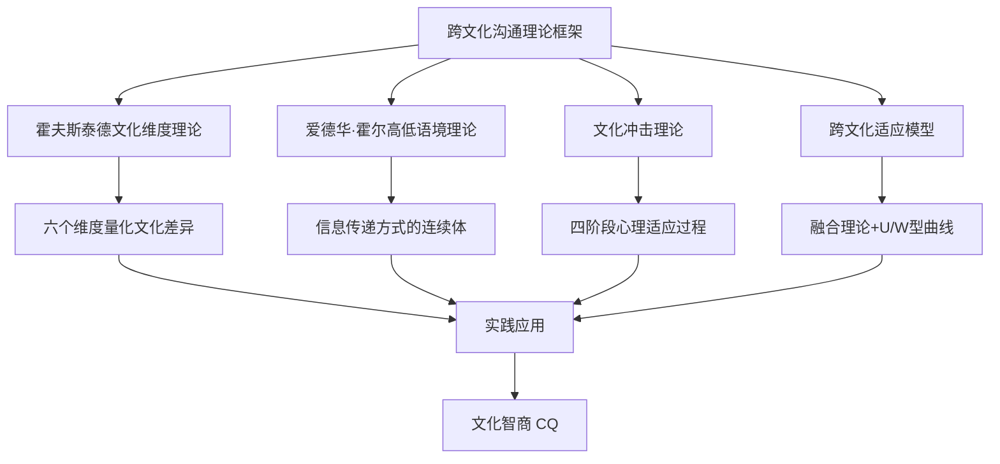
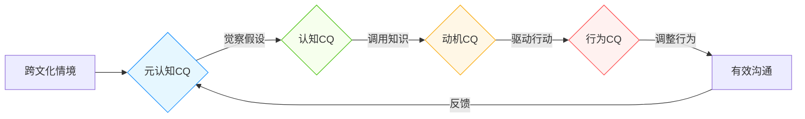
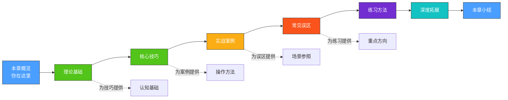

# 第十一章：跨文化沟通

## 一个真实的故事

2018年，某中国科技公司派出一支五人团队赴德国汉堡，与一家汽车零部件企业进行为期三个月的联合研发项目。团队成员英语流利、技术过硬，出发前信心满满。

然而三周后，项目陷入僵局。德方工程师频繁提交书面投诉，认为中方团队"在会议中从不表态，会后却私下找领导改变决定"；中方团队则感到委屈——"我们已经多次暗示了方案的问题，德方就是听不懂"。双方的信任降到了冰点，项目差点被叫停。

问题出在哪里？不是技术能力，不是语言水平，而是**文化差异在沟通中的无声放大**。德方是典型的低语境文化，习惯在会议上直接表达立场；中方是高语境文化，倾向于通过暗示、铺垫和私下沟通来传递敏感信息。双方都在用自己的文化逻辑解读对方的行为，误解由此产生。

后来，公司请来一位跨文化顾问。顾问做了三件事：第一，为双方团队做了一次文化维度工作坊，用霍夫斯泰德的模型让双方看到彼此的文化坐标；第二，建立了"会议前书面提交意见+会中逐一讨论"的新流程，既照顾了中方需要思考准备的习惯，也满足了德方对透明讨论的期望；第三，安排了每周一次的非正式聚餐，让双方在轻松环境中建立个人关系。

一个月后，项目重回正轨。最终不仅按时交付，双方还决定继续合作下一个项目。中方项目经理后来总结说："我们以前觉得沟通就是把话说清楚，现在明白了，沟通是让对方用他能接受的方式听清楚。"

这个故事并不特殊。它每天都在全球各地的跨国公司、海外校园、国际会议中上演。而避免这种困境的能力，就是本章要系统培养的——**跨文化沟通能力**。

## 为什么跨文化沟通如此重要

### 数据说话：跨文化失误的真实代价

跨文化沟通不是"软技能"，而是直接影响成败的硬指标：

- **企业层面**：哈佛商学院研究显示，跨国企业约70%的合作失败源于文化误解，而非技术或商业问题。麦肯锡2020年报告指出，文化整合失败是跨国并购失败的首要原因，每年造成数千亿美元损失。戴姆勒-克莱斯勒合并案被视为史上最失败的并购之一，核心原因之一就是德美两国企业文化的根本性冲突——德国的层级决策与美国的扁平管理、德国的工程师文化与美国的市场导向文化激烈碰撞，最终导致合并仅9年便宣告解体。
- **个人层面**：外派员工的提前回流率（early return）在16%-40%之间，其中大多数不是因为能力不足，而是因为无法适应东道国文化环境（Black & Gregersen, 1999）。更值得关注的是，那些没有提前回流但适应不良的员工，其绩效下降幅度平均达到40%，且伴随显著的心理健康问题。
- **团队层面**：跨文化团队的冲突频率是同质团队的2-3倍，但如果管理得当，其创新产出和问题解决能力也显著高于同质团队（Earley & Mosakowski, 2000）。MIT人类动力学实验室的研究进一步表明，跨文化团队中沟通模式的质量（而非沟通频率）是预测团队绩效的最强指标。
- **经济层面**：欧盟委员会2009年的研究估计，语言障碍和文化误解每年给欧盟企业造成约1000亿欧元的损失。世界银行的报告则指出，发展中国家在国际商务中因文化适应不良导致的交易失败率高达60%。

这些数据揭示了一个悖论：**跨文化沟通既是巨大的风险源，也是巨大的价值来源**。关键在于你是否具备驾驭文化差异的能力。

### 时代背景：每个人都已经是"跨文化沟通者"

跨文化沟通早已不是外交官或跨国企业高管的专属技能。看看你自己的日常：

| 场景 | 涉及的文化差异 | 潜在风险 | 潜在收益 |
|------|----------------|----------|----------|
| 与外国同事远程协作 | 工作节奏、反馈方式、决策风格 | 项目延期、信任危机 | 创新方案、全球视野 |
| 接待海外客户 | 称谓礼仪、宴请习俗、谈判风格 | 订单流失、关系破裂 | 长期合作、市场拓展 |
| 海外留学/工作 | 课堂参与、师生关系、社交规则 | 孤立感、学业困难 | 跨国人脉、思维升级 |
| 网络社群交流 | 幽默风格、争议处理、表达直接度 | 误解冲突、社交排斥 | 多元视角、信息优势 |
| 跨国电商/外贸 | 客户期望、售后沟通、合同理解 | 退货纠纷、法律风险 | 品牌国际化、收入增长 |
| 与不同代际/地域的人交流 | 价值观、沟通偏好、生活方式 | 代沟加深、合作摩擦 | 传承智慧、互补优势 |
| 跨文化婚恋/交友 | 家庭观念、亲密关系表达、冲突处理 | 关系紧张、家庭矛盾 | 文化融合、视野开阔 |

即便你从未踏出国门，只要你在使用互联网、与不同地域的人共事、或是在一个多民族国家生活，你就已经在进行某种形式的跨文化沟通。2023年中国出境游人数超过8700万人次，跨境电商交易额超过15万亿元——跨文化能力已经从"加分项"变成了"生存技能"。

### 跨文化能力的竞争优势

具备跨文化沟通能力的人在以下方面拥有显著优势：

- **职业发展**：跨国企业高管选拔中，跨文化能力是排名前三的考察维度。具备此项能力的人晋升速度快1.5-2倍（Korn Ferry, 2019）。光辉国际对全球15万名高管的跟踪研究发现，那些在海外任职期间展现出高跨文化适应力的管理者，最终进入C-suite（最高管理层）的概率是其他人的3.2倍。
- **收入水平**：在海外派遣岗位中，具备跨文化适应能力的员工平均任期更长（3.2年 vs 1.4年），绩效评分更高（平均高出18%），因此获得的薪酬和奖金也更丰厚。Mercer的全球调查显示，成功的海外派遣可带来25%-50%的薪酬溢价。
- **人际关系**：跨文化能力强的人在多元环境中更容易建立深层信任关系，社交网络的质量和广度都更高。社会学研究表明，拥有多元文化社交网络的人在信息获取、机会发现和危机应对方面都表现更优。
- **创新能力**：能够融合不同文化视角的人，在创意产出和问题解决方面表现更优（Maddux & Galinsky, 2009）。INSEAD商学院的研究进一步证实，具有多元文化经历的人在创造力测试中的得分平均高出20%，且更善于"框架转换"——即用不同的思维方式看待同一个问题。
- **心理韧性**：跨文化适应经历能显著增强个体的心理韧性和认知灵活性。面对不确定性和模糊情境时，有过跨文化磨练的人表现得更加从容和高效。

## 你的起点：跨文化沟通能力自评

在正式开始学习之前，花五分钟做一个快速自评，了解你目前的跨文化沟通能力水平。这个自评不是考试，而是帮你定位学习重点。

### 快速自评量表

请根据你的真实感受，为以下10个陈述打分（1=完全不符合，5=完全符合）：

**知识维度（认知能力）**

1. 我能说出至少三个文化维度理论的核心概念（如权力距离、高低语境等）。  ____
2. 我了解至少两个国家/地区的主要文化特征（不仅仅是风土人情，还包括价值观和沟通风格）。  ____
3. 我知道文化冲击通常分为哪几个阶段，以及每个阶段的典型表现。  ____

**态度维度（情感能力）**

4. 当我遇到与自己习惯不同的行为方式时，我的第一反应是好奇而非排斥。  ____
5. 我能接受"没有绝对正确的沟通方式，只有适合特定文化的沟通方式"这一观点。  ____
6. 我愿意主动走出舒适区，接触不同文化背景的人。  ____

**行为维度（实践能力）**

7. 在与非母语者交流时，我能有意识地调整语速、用词和表达方式。  ____
8. 我能在跨文化情境中识别并应对非语言信号的差异（如眼神、距离、手势）。  ____
9. 当跨文化误解发生时，我知道如何有效地澄清和修复关系。  ____
10. 我能根据对方的文化背景，灵活切换直接/间接的沟通风格。  ____

### 评分解读

| 总分 | 水平 | 特征描述 | 学习建议 |
|------|------|----------|----------|
| 10-20分 | 入门期 | 对跨文化差异认知有限，可能经历过困惑但不知如何系统分析 | 从理论基础开始，重点建立文化意识；每章都建议精读 |
| 21-35分 | 成长期 | 已有基础认知和一些跨文化经历，但缺乏系统框架 | 已有基础认知，重点提升实战技巧；可快速浏览理论，聚焦核心技巧和实战案例 |
| 36-45分 | 进阶期 | 具备一定理论知识和实践经验，但在复杂场景中仍有困难 | 具备一定能力，重点打磨细节和深度场景；聚焦常见误区和深度拓展 |
| 46-50分 | 精通期 | 理论扎实、经验丰富，需要更高层次的策略和领导力内容 | 重点关注高级策略和跨文化领导力；可跳过基础，直接进入深度拓展 |

**重要提示**：自评分数低于30分并不代表你"不行"，而是说明你有巨大的成长空间。跨文化沟通能力是一种可以通过学习和练习显著提升的技能，而非固定不变的天赋。研究表明，经过系统培训，个体的跨文化能力可以在6-12个月内提升30%-50%（Ang et al., 2007）。

无论你的得分如何，本章的内容都会为你提供价值。低分读者可以获得系统化的知识体系，高分读者可以通过实战案例和误区分析查漏补缺。

### 维度细分诊断

除了总分，你还可以看看自己在三个维度上的分布：

- **知识分（题1-3）偏低**：你需要优先补充理论知识。理论不是空中楼阁，而是帮你"看懂"文化差异的透镜。没有理论指导的跨文化经验，往往停留在"知其然不知其所以然"的层面。
- **态度分（题4-6）偏低**：你需要调整心态和价值观。跨文化能力的根基是开放性和好奇心。如果你内心深处认为"我的方式才是对的"，再多的知识和技巧都难以发挥作用。
- **行为分（题7-10）偏低**：你需要更多的实操练习。知道不等于做到，跨文化沟通最终要落实到具体的行为调整上。本章的练习方法部分将为你提供大量可执行的训练方案。

如果你三个维度的分数都不高，不必焦虑——本章的结构就是从理论到态度到行为层层递进的，跟着学习路线图走即可。

## 本章的理论框架

本章的理论和实践建立在以下学术基础之上。了解这些框架，就像获得了一张"文化地图"——你不需要记住每一个细节，但需要知道这张地图的整体结构。

### 四大核心理论

| 理论 | 提出者 | 核心贡献 | 本章用途 | 经典应用场景 |
|------|--------|----------|----------|--------------|
| 文化维度理论 | 霍夫斯泰德 (1980) | 六个维度系统量化国家文化差异 | 理解差异的结构与来源 | 预测某国员工对权威、风险、团队合作的态度 |
| 高低语境理论 | 爱德华·霍尔 (1976) | 沟通风格从隐含到明确的连续体 | 识别和适应不同的表达方式 | 调整邮件、会议、谈判中的表达策略 |
| 文化冲击理论 | 卡利沃·奥伯格 (1960) | 文化适应的四阶段心理模型 | 预期和管理过渡期的情绪波动 | 海外留学/工作的心理准备和自我调适 |
| 跨文化适应模型 | 贝瑞 (1997), 金·金 (2001) | 四种适应策略 + 螺旋上升模型 | 规划长期的跨文化成长路径 | 选择融入/保持/隔离/边缘化的策略 |

#### 理论之间的关系

这四大理论并非孤立存在，而是从不同角度切入同一个问题。打个比方：

- **霍夫斯泰德**告诉你"这条河有多宽、水流多急"——他提供的是文化的宏观测量数据。
- **霍尔**告诉你"过河时该走桥还是坐船"——他关注的是沟通方式的选择。
- **奥伯格**告诉你"过河过程中你会经历哪些心理阶段"——他描述的是适应过程的情感曲线。
- **贝瑞和金·金**告诉你"你可以选择怎样过河、到达对岸后怎样生活"——他们提供的是适应策略的选择。

在实际应用中，你往往需要同时调用多个理论。例如，当你需要给一位日本客户写一封商务邮件时，你需要用霍夫斯泰德的维度理解日本的高权力距离和集体主义倾向，用霍尔的理论判断日本属于高语境文化从而选择更含蓄的表达方式，同时考虑对方可能的文化冲击阶段来调整你的耐心程度。

### 文化智商（CQ）——整合性框架

近年来，跨文化心理学家提出了"文化智商"（Cultural Intelligence, CQ）的概念，它将上述理论整合为一个可操作的能力框架。CQ的概念由伦敦商学院的P. Christopher Earley和新加坡南洋理工大学的Soon Ang于2003年首次系统提出，现已成为跨文化研究领域最具影响力的整合框架之一。

CQ包含四个相互关联的维度：

| 维度 | 英文 | 核心问题 | 具体表现 | 提升方法 |
|------|------|----------|----------|----------|
| 元认知CQ | Metacognitive | 你是否意识到自己的文化假设？ | 互动前反思自己的偏见；互动中观察对方反应并实时调整；互动后复盘得失 | 反思日记、文化觉察练习、正念冥想 |
| 认知CQ | Cognitive | 你对不同文化了解多少？ | 知道不同文化的价值观、规范、习俗；理解文化差异的系统性原因 | 阅读、旅行、跨文化培训、文化档案研究 |
| 动机CQ | Motivational | 你是否愿意主动跨文化互动？ | 对异文化保持好奇心；面对困难不退缩；享受跨文化挑战 | 设定跨文化目标、寻找文化导师、记录成长故事 |
| 行为CQ | Behavioral | 你能否灵活调整行为？ | 调整语速语调；适应不同的身体距离；切换直接/间接表达方式 | 角色扮演、镜像练习、视频回放分析 |

**CQ的运作机制**：当你遇到一个跨文化情境时，首先由元认知CQ启动——你意识到"这是一个跨文化场景，我的默认反应可能不适用"；然后认知CQ提供相关知识——你回忆起对方文化的特点；接着动机CQ驱动你采取行动——你决定主动调整而非坚持自己的习惯；最后行为CQ执行具体的调整——你放慢语速、减少俚语、增加确认性提问。这个过程可能只在几秒内完成，但却是跨文化能力的核心运作方式。

本章的内容将系统覆盖这四个维度：理论部分培养认知CQ，核心技巧部分提升行为CQ，实战案例和练习方法部分激发动机CQ，而整章的反思性设计则锻炼元认知CQ。

## 学习前置条件

开始本章学习前，建议你具备以下基础：

| 条件 | 必要程度 | 说明 | 如何确认 |
|------|----------|------|----------|
| 基本沟通能力 | 必需 | 能清晰表达自己的想法，能倾听和理解他人 | 你能在日常对话中表达复杂观点并理解对方意图 |
| 基础英语阅读能力 | 推荐 | 部分学术概念使用英文术语，但中文解释充分 | 你能阅读简单的英文文章，遇到不认识的词能查字典 |
| 开放心态 | 必需 | 愿意接受"自己的方式不是唯一正确的方式" | 你能回忆起至少一次自己改变看法的经历 |
| 与不同人交往的经历 | 有帮助 | 哪怕是和不同地域/年龄的人交流的经验 | 你有和与自己背景不同的人深入交流的经历 |

你**不需要**：

- **出国经历**——本章的练习方案专门设计为不需要出国就能执行。事实上，在国内的国际化社区、外资企业、甚至网络社群中，你每天都在接触跨文化场景。
- **语言特长**——跨文化沟通的核心不在语言流利度。研究表明，语言能力与跨文化能力的相关性仅为0.3左右（Hajek & Giles, 2003）。很多英语流利的人在跨文化沟通中仍然犯严重错误，而一些语言能力一般的人却能凭借文化敏感度和同理心实现有效沟通。
- **心理学或社会学背景**——所有理论都会用通俗语言解释，并配合大量生活化案例。你只需要一颗愿意学习的心。

## 本章核心概念速览

在正式学习之前，了解以下关键术语将帮助你更快进入状态：

| 术语 | 英文 | 简要定义 | 通俗理解 | 本章重点章节 |
|------|------|----------|----------|--------------|
| 跨文化沟通 | Cross-cultural Communication | 不同文化背景的人之间的信息、思想和情感交流 | 和"不同世界的人"把话说通 | 全章贯穿 |
| 文化维度 | Cultural Dimensions | 量化和比较文化差异的分析框架 | 给文化画"坐标系" | 理论基础 |
| 高/低语境 | High/Low Context | 信息传递依赖隐含语境还是明确语言的程度 | "话里有话"vs"有话直说" | 理论基础、核心技巧 |
| 文化冲击 | Culture Shock | 进入陌生文化环境时产生的心理不适 | 到了新环境的"水土不服" | 理论基础、实战案例 |
| 文化智商 | Cultural Intelligence (CQ) | 有效应对跨文化情境的综合能力 | 跨文化场景中的"聪明程度" | 理论基础、深度拓展 |
| 权力距离 | Power Distance | 社会对权力不平等分配的接受程度 | 对"领导说了算"的接受度 | 理论基础 |
| 文化刻板印象 | Cultural Stereotype | 对某文化群体过度简化且固定的认知 | "XX人都这样"的笼统印象 | 常见误区 |
| 文化适应 | Acculturation | 个体在新文化环境中的调整过程 | 在新环境中"找感觉"的过程 | 理论基础、练习方法 |
| 非语言沟通 | Non-verbal Communication | 通过肢体语言、表情、语调等传递信息 | 不说话也在"说话" | 核心技巧 |
| 文化敏感度 | Cultural Sensitivity | 识别、理解和尊重文化差异的意识与能力 | 对文化差异的"雷达" | 核心技巧 |
| 文化相对主义 | Cultural Relativism | 用该文化自身的标准而非外来标准评判其行为 | "入乡随俗"的学术版 | 常见误区 |
| 文化适应策略 | Acculturation Strategy | 个体应对新文化时选择的整合/同化/分离/边缘化策略 | 到了新环境选择"怎么活" | 理论基础、深度拓展 |

## 学习路线图

下图展示了本章的学习路径，以及各部分之间的逻辑关系：

### 各部分详细说明

#### 第一部分：理论基础

本章的学术根基。系统介绍四大核心理论——霍夫斯泰德文化维度理论、爱德华·霍尔的高低语境文化理论、文化冲击理论、跨文化适应模型——以及文化智商（CQ）整合框架。掌握这些理论，你将从"感性地觉得文化有差异"升级为"理性地知道差异在哪里、为什么"。

**你将学到**：用六个维度快速分析任何国家的文化特征；判断一种文化的沟通风格处于高语境还是低语境；预期自己在异文化环境中的心理变化轨迹。

**预计用时**：精读60-90分钟，配合练习约2-3小时。

**难度**：⭐⭐☆☆☆（概念较多但不难理解）

#### 第二部分：核心技巧

从"知道"到"做到"的桥梁。详细讲解五大核心技能——文化敏感度培养、语言调整策略、非语言行为适应、跨文化信任建立、文化误解处理。每一项技能都配有具体的方法、步骤和操作模板。

**你将学到**：如何培养文化自我觉察和同理心；如何根据对方的文化背景调整语言风格和非语言行为；如何在跨文化环境中高效建立信任；如何在误解发生后快速修复关系。

**预计用时**：精读90-120分钟，配合练习约4-6小时。

**难度**：⭐⭐⭐☆☆（需要结合自身经验反思）

#### 第三部分：实战案例

八个真实场景的深度复盘——跨国视频会议、海外留学适应、国际商务谈判、跨文化团队管理、海外旅行文化尴尬、文化冲突调解、翻译误解处理、文化融合实践。每个案例包含场景描述、文化分析、应对策略和关键启示四个部分。

**你将学到**：如何将理论和技巧应用到具体场景中；不同文化碰撞时双方的真实感受和思考方式；成功和失败案例中的关键决策点。

**预计用时**：精读60-90分钟，深度分析每个案例约15-20分钟。

**难度**：⭐⭐⭐☆☆（场景化内容，易于理解）

#### 第四部分：常见误区

揭示十个跨文化沟通中最常见的认知和行为陷阱——从刻板印象到文化中心主义，从忽视非语言信号到误将语言能力等同于跨文化能力。每个误区配有识别方法和纠正策略。

**你将学到**：识别自己的认知盲区；避免在跨文化互动中"踩雷"；用更精准的方式理解文化差异。

**预计用时**：精读45-60分钟。

**难度**：⭐⭐☆☆☆（以案例和对比为主，不难理解）

#### 第五部分：练习方法

系统化的每日和每周练习计划，从文化观察、语言学习到模拟练习、文化沉浸体验。所有练习都设计为不需要出国或有外国朋友，在日常生活中就能执行。

**你将学到**：一套可持续执行的练习体系；如何在日常生活中创造跨文化学习机会；如何衡量自己的进步。

**预计用时**：阅读30分钟，每日练习15-30分钟。

**难度**：⭐⭐☆☆☆（执行简单，贵在坚持）

#### 第六部分：深度拓展

面向进阶读者的高级内容——跨文化领导力、跨文化谈判策略、全球化时代的文化融合趋势、数字时代的跨文化沟通新挑战等。

**你将学到**：超越基本沟通的高级跨文化策略；如何在跨国团队中发挥领导作用；如何应对全球化和技术变革带来的新挑战。

**预计用时**：精读60-90分钟。

**难度**：⭐⭐⭐⭐☆（需要前置知识储备）

### 不同目标读者的学习路径

不是每个人都有时间或需要通读全章。以下是针对不同目标的推荐路径：

**场景一：下周要接待外国客户（紧急需求）**
- 阅读顺序：本章概览 → 核心技巧（语言调整+非语言适应部分） → 实战案例（国际商务谈判案例） → 常见误区（前3个）
- 预计用时：3-4小时

**场景二：即将出国留学/工作（中期准备）**
- 阅读顺序：完整通读，重点关注理论基础+文化冲击+练习方法
- 预计用时：8-10小时，配合每日练习

**场景三：提升综合跨文化能力（长期目标）**
- 阅读顺序：完整通读，配合所有练习，重点关注深度拓展
- 预计用时：15-20小时，配合持续练习

**场景四：管理跨文化团队（管理者专用）**
- 阅读顺序：本章概览 → 理论基础（文化维度部分） → 核心技巧（信任建立+误解处理） → 实战案例（跨文化团队管理案例） → 深度拓展（跨文化领导力）
- 预计用时：5-6小时

## 本章学习目标

通过本章的系统学习，你将能够：

1. **理解跨文化沟通的理论框架**：掌握霍夫斯泰德文化维度理论、高低语境文化理论、文化冲击理论等核心学术成果，建立系统的跨文化认知体系。这些理论将帮助你从根本上理解"为什么不同文化的人会有不同的沟通方式"，而不是停留在表面的"他们就是这样"的认知层面。

2. **识别文化差异的关键维度**：能够从权力距离、个人主义与集体主义、不确定性规避、男性化与女性化、长期导向与短期导向、放纵与克制等维度分析不同文化的特点。掌握这些维度后，你将能够快速"解码"一种陌生文化的沟通逻辑，预判对方可能的反应模式。

3. **掌握跨文化沟通的核心技巧**：包括培养文化敏感度、进行语言和非语言的适应性调整、在不同文化中建立信任、有效处理跨文化误解等实用技能。这些技巧不是抽象的理论，而是可以立即在日常生活中实践的具体方法。

4. **运用所学知识解决实际问题**：通过丰富的实战案例，学会在跨国会议、海外留学、国际商务、跨文化团队管理等场景中灵活运用跨文化沟通策略。每个案例都配有详细的文化分析和具体的应对建议，你可以直接参考借鉴。

5. **避免常见的跨文化沟通误区**：识别并纠正如刻板印象、文化中心主义、忽视非语言信号等常见错误。了解这些误区，可以让你在跨文化互动中少走弯路，避免不必要的冲突和尴尬。

6. **建立持续提升的练习体系**：通过系统的日常和每周练习计划，持续提升跨文化沟通能力。跨文化沟通能力不是一朝一夕能够培养的，需要长期的刻意练习。本章提供的练习体系经过精心设计，确保在日常生活中就能执行，不需要特殊条件。

7. **发展跨文化领导力（进阶目标）**：理解如何在多元文化团队中发挥领导作用，如何融合不同文化视角推动创新，如何在全球化时代成为"文化桥梁"型人才。

## 核心理念

本章的核心理念可以概括为三句话：

> **理解差异是起点，尊重差异是基础，融合差异是目标。**

跨文化沟通的终极目标不是消除文化差异，而是在理解与尊重的基础上，找到不同文化之间的共同点和互补性，实现真正的跨文化协作与共赢。文化差异不是障碍，而是资源——当你学会了如何有效地跨越这些差异进行沟通，你将拥有一种强大的竞争优势。

具体而言：

- **理解差异**意味着用科学的理论框架去分析文化差异的来源和结构，而不是凭直觉或刻板印象去判断。霍夫斯泰德的六个维度、霍尔的高低语境理论，都是帮你系统化理解差异的工具。理解差异要求你同时看到文化的宏观模式和个体的独特性——文化倾向是概率分布，不是铁律。

- **尊重差异**意味着承认"没有绝对正确的沟通方式"。德国人的直接不是"情商低"，日本人的含蓄不是"不坦诚"，美国人的热情不是"虚伪"——每种沟通方式都有其文化逻辑和历史根源。尊重差异是从评判心态切换到好奇心的第一步，也是建立跨文化信任的前提。

- **融合差异**意味着在理解与尊重的基础上，发展出灵活的跨文化沟通策略。最高境界不是变成对方文化的人，而是成为能够在两种（甚至多种）文化之间自如切换的"文化桥梁"——既能用对方听得懂的方式表达，又不丧失自己的文化根基。这种"第三文化"的能力，正是全球化时代最稀缺的人才素质。

### 一个重要的提醒

在开始学习之前，请记住一个关键原则：**文化是概率分布，不是确定性标签**。

当你看到"中国文化倾向于高语境"时，这不意味着每个中国人都含蓄间接；当你看到"美国文化倾向于个人主义"时，这不意味着每个美国人都自私自利。文化维度描述的是一个群体的中心趋势和默认设置，而个体之间可能存在巨大差异。

本章教你的是"文化地图"，而非"文化标签"。地图告诉你大致的地形，但你仍然需要在每次具体的互动中观察和确认。带着这份谦逊和灵活去学习，你将收获最大的成长。

## 写在最后

在这个"地球村"时代，具备优秀跨文化沟通能力的人，将拥有更广阔的视野、更丰富的人脉、更多的发展机遇。无论你的目标是出国留学、国际商务、跨国工作，还是仅仅想在多元文化的环境中更好地与人相处，本章的内容都将为你提供有力的支持。

跨文化沟通能力的培养是一段旅程，不是一个终点。即使是世界上最顶尖的跨文化专家，也仍然在不断学习和调整。重要的不是你现在站在哪里，而是你是否愿意迈出下一步。

让我们一起开启这段跨文化沟通的学习之旅。
