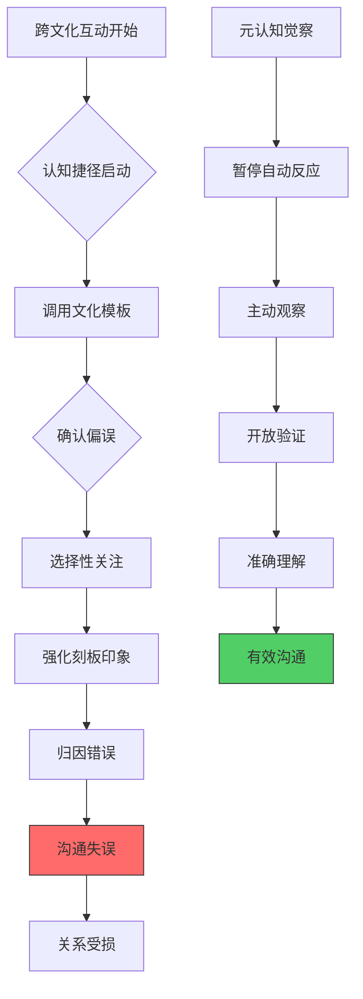
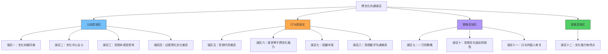
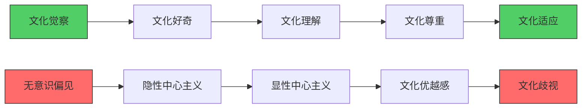
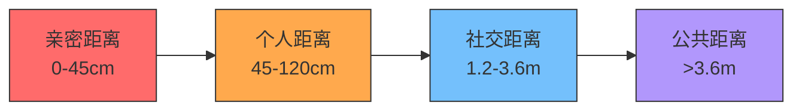
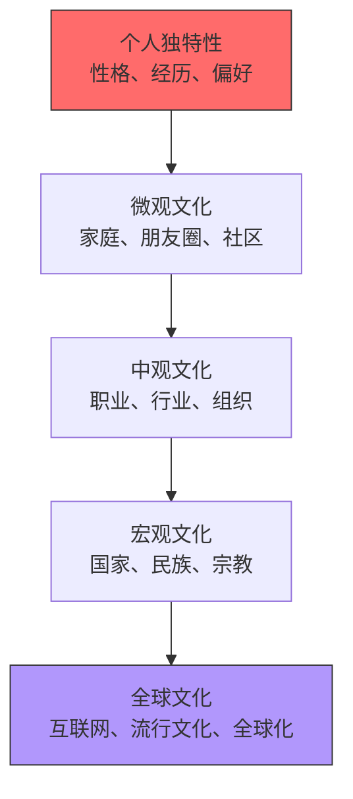
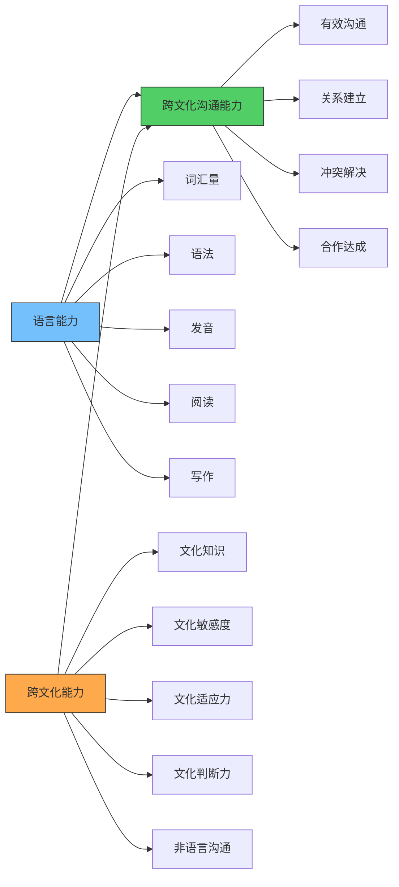
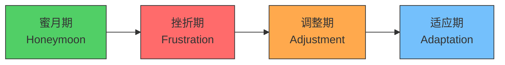
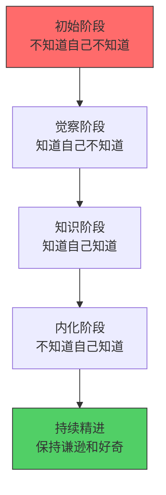

# 跨文化沟通的常见误区：识别、理解与突破

## 引言

跨文化沟通是一门需要终身修炼的艺术。即使是最有经验的跨文化沟通者，也可能陷入某些根深蒂固的认知和行为误区。这些误区之所以危险，是因为它们往往披着"常识"的外衣，让人在不知不觉中犯错——而当你意识到问题时，关系可能已经受损。

本章将系统揭示跨文化沟通中最常见的十二大误区。每个误区不仅告诉你"是什么"和"为什么"，更重要的是提供具体的识别信号、真实案例、纠正方法和预防策略。读完本章后，你将拥有一套完整的"误区雷达"，能够在跨文化互动中保持清醒和敏锐。

### 误区的代价：为什么必须重视

跨文化沟通误区的代价远超一般人的想象。哈佛商学院的研究显示，**约70%的跨国商业合作失败源于文化误解而非商业策略**。在个人层面，文化误判可能导致：

- **关系破裂**：一次不经意的冒犯可能毁掉数月建立的信任
- **职业发展受阻**：外派失败率高达25-40%，其中文化适应失败是首要原因
- **经济损失**：美国企业每年因文化沟通不畅导致的损失估计超过20亿美元
- **心理创伤**：长期的文化摩擦和孤独感可能引发焦虑和抑郁

认识到误区的存在，不是为了制造焦虑，而是为了建立清醒的自我监控——这正是跨文化能力的起点。

### 误区的根源：为什么我们容易犯错

在深入具体误区之前，有必要理解人类为什么容易在跨文化沟通中犯错。认知心理学和社会心理学提供了几个关键解释：

**认知捷径（Heuristics）**：大脑为了节省能量，倾向于使用简化的认知模型来处理复杂信息。面对来自不同文化的人，大脑会自动调用已有的"文化模板"来快速判断，而不是从零开始观察和理解。Daniel Kahneman在《思考，快与慢》中将此称为"系统1"的自动思维——快速、省力，但容易出错。

**确认偏误（Confirmation Bias）**：一旦我们形成了某种预期，就会不自觉地关注那些验证预期的信息，而忽略与预期矛盾的信息。如果你认为"日本人很含蓄"，你就会特别注意日本人的含蓄行为，而忽视他们直接表达的时刻。心理学家Peter Wason的经典实验证实，人类天生倾向于寻找支持自己假设的证据，而非反驳的证据。

**内群体偏好（In-group Favoritism）**：Henri Tajfel的最小群体范式实验表明，即使将人随机分组，他们也会对自己的群体产生偏好。在跨文化互动中，这种倾向表现为"我们的方式更好"的文化中心主义，以及对外群体成员的行为进行更苛刻的评价。

**归因错误（Attribution Error）**：我们倾向于将他人的行为归因于其内在特质（"他这样做是因为他是中国人"），而将自己行为归因于情境因素（"我这样做是因为情况特殊"）。这种"基本归因错误"在跨文化互动中尤为明显，因为我们更容易将对方的行为与文化标签挂钩。

**框架效应（Framing Effect）**：同样的行为，不同的"框架"会导致截然不同的解读。当你说"他在会议上沉默"时，这可以被框架为"在思考"（正面）、"不参与"（负面）或"尊重他人"（文化性），取决于你使用的认知框架。

理解这些心理机制，是避免误区的第一步。



### 十二大误区全景图



---

## 误区一：文化刻板印象——用国家标签定义个人

### 误区描述

文化刻板印象是最普遍、最根深蒂固的跨文化沟通误区。它表现为用国家、民族或地域的文化标签来预判个人的行为、态度和能力。常见的例子包括：

- "日本人一定很含蓄，不会直接说'不'"
- "美国人一定很直接，有什么说什么"
- "德国人一定很严谨，没有幽默感"
- "法国人一定很傲慢，不愿意说英语"
- "中国人一定很注重面子，不会公开批评"

### 心理机制分析

文化刻板印象的形成有其深层的心理机制：

**分类本能**：人类大脑天生倾向于将信息分类存储，以降低认知负荷。将复杂的个体简化为几个文化标签，是一种节省认知资源的策略。Susan Fiske的研究表明，刻板印象的激活速度极快——在接触异文化对象的前100毫秒内就已经开始。

**社会认同理论**：Henri Tajfel的社会认同理论指出，人们通过将自己归类为某个群体的成员来获得自我认同。这种"我们 vs 他们"的思维模式，强化了对"他们"的刻板印象。

**可得性启发**：媒体、影视作品和有限的个人经历，为我们的文化认知提供了最容易获取的信息来源。这些信息往往是片面的、戏剧化的，导致我们形成扭曲的文化认知。例如，好莱坞电影中的亚洲角色长期被脸谱化，影响了西方观众对亚洲人的认知。

**刻板印象的自我实现**：刻板印象不仅影响我们对别人的认知，还会通过"刻板印象威胁"效应影响对方的行为。当一个人意识到自己被某种刻板印象看待时，他的行为可能会不自觉地趋向那个刻板印象。

### 真实案例

**案例一：日本高管的"意外"直接**

一家美国科技公司在与日本合作伙伴谈判时，美方团队预设日方会非常含蓄、不会直接表达不满。然而，当日方首席技术官对某个技术方案有严重异议时，他直接站起身来，用极其明确的语言指出方案的缺陷，甚至当众批评了提出方案的工程师。

美方团队措手不及，因为他们完全没有预料到日本高管会如此直接。实际上，这位技术官曾在硅谷工作多年，深受美国商业文化影响，而且技术问题触及了他的专业底线——在专业领域，许多日本工程师会表现出与"含蓄"刻板印象截然不同的直接性。

**教训**：个人经历、专业领域、国际接触等因素可能使一个人的表现远偏离国家文化的平均值。

**案例二：美国经理的"意外"委婉**

一位中国留学生在美国公司实习时，美国主管对他的工作表现给出了"interesting approach"（有趣的方法）的评价。这位留学生将其理解为正面评价，继续沿用相同的工作方式。直到三个月后的绩效评估，他才得知主管的真实意思是"这个方法有问题，需要改进"。

这个案例打破了"美国人总是很直接"的刻板印象。实际上，在涉及敏感的人事评价时，许多美国人也会使用委婉语和暗示，尤其是面对下属或不熟悉的人。

**教训**：即使在"低语境"文化中，特定情境（如绩效反馈、人事评价）也会激发出"高语境"的沟通方式。

**案例三：法国工程师的"美式"高效**

一家中国公司在巴黎设立研发中心，中方管理者预设法国工程师会"散漫、罢工多、效率低"。结果发现，这些经过精英大学训练的工程师不仅技术过硬，而且工作节奏极快——他们的"散漫"只存在于非工作时间。中方管理者的刻板印象不仅错了，而且差点在招聘阶段就筛掉了优秀人才。

### 识别信号

你可能正在犯这个误区，如果你：

- 在见面前就已经"知道"对方会怎样行事
- 当对方的行为与预期不符时，感到惊讶或困惑
- 用"他们XX人都这样"来解释对方的行为
- 将个体行为上升为群体特征
- 对某个文化群体的了解主要来自媒体或二手信息
- 在评估对方时，将其文化标签的权重放得比实际表现还高

### 纠正策略

**策略一：从"预测"转向"参考"**

将文化知识视为理解对方的起点，而非终点。具体做法：

1. 在与来自某文化背景的人互动前，了解该文化的一般特征
2. 将这些特征标记为"可能性"而非"确定性"
3. 在互动过程中，持续观察和更新你对这个具体个体的理解
4. 当对方行为与文化预期不符时，优先考虑个体因素（性格、经历、教育）

**策略二：多维度身份认知**

每个人都是多个身份维度的交叉点：

| 维度 | 影响因素 | 示例 |
|------|----------|------|
| 国家文化 | 出生国、国籍 | 中国、美国 |
| 区域文化 | 省份、城市、城乡 | 北京 vs 成都 |
| 代际文化 | 出生年代 | 90后 vs 70后 |
| 专业文化 | 行业、职业 | 科技 vs 金融 |
| 组织文化 | 公司、机构 | 创业公司 vs 国企 |
| 教育背景 | 学校、专业 | 理工科 vs 人文 |
| 国际经验 | 留学、外派、旅行 | 海归 vs 本土 |
| 个人特质 | 性格、经历 | 内向、海归 |

理解一个人，需要综合考虑所有这些维度，而不是只看国家文化这一个标签。

**策略三：假设检验**

养成主动检验假设的习惯：

1. 意识到自己的预设（"我认为他会因为是X国人而这样行事"）
2. 有意识地寻找反例（"有没有证据表明他可能不会这样？"）
3. 保持开放的替代解释（"他的行为是否可能有其他原因？"）
4. 允许自己修正预期（"看来他和我预想的不太一样"）

---

## 误区二：文化中心主义——以自己的文化为标准评判一切

### 误区描述

文化中心主义（Ethnocentrism）是指以自己的文化为"正常"和"正确"的标准，来评判其他文化的做法。这种心态通常表现为以下思维模式：

- "我们的方式才是对的，他们的方式是奇怪的"
- "他们的做法太落后了，应该学学我们"
- "他们为什么要这样？这完全不合理"
- "如果他们像我们一样思考，就不会有这些问题了"

文化中心主义不同于文化自豪感。为自己的文化感到自豪是健康的，但当自豪变成优越感，当"不同"变成"错误"时，就跨越了界限。

### 理论框架：文化相对主义 vs 文化中心主义

人类学家Franz Boas在20世纪初提出了文化相对主义的概念，挑战了当时盛行的文化进化论（认为西方文化是"最高级"的）。文化相对主义的核心观点是：每种文化都应该从其自身的逻辑和历史背景来理解，而不应该用另一种文化的标准来评判。

这并不意味着所有文化实践都是"好的"或应该被无条件接受。文化相对主义是一种理解的方法论，而非道德判断的取消。它的价值在于：先理解，再判断；在理解的基础上，评判才更有深度和公正性。

**文化中心主义的进化根源**：从进化心理学角度看，文化中心主义有其适应性价值——对内群体的信任和对外群体的警惕，在远古环境中帮助人类生存。但在全球化时代，这种本能反应变成了沟通障碍。

### 文化中心主义的表现层级

文化中心主义不是非黑即白的，它存在不同的强度层级：



**无意识偏见**：不自觉地用自己的文化框架来理解他人的行为，例如认为"不守时"的人"不专业"，而不考虑不同文化对时间的不同理解。这一层级最难察觉，因为它运作在自动化思维层面。

**隐性中心主义**：虽然口头上尊重文化差异，但在实际决策和判断中，仍然以自己的文化标准为默认标准。例如，声称尊重不同沟通风格，但在评估员工时只奖励那些符合自己文化偏好的表达方式。这在跨国企业的人力资源管理中尤为常见——绩效评估体系往往隐含着总部所在国的文化偏好。

**显性中心主义**：明确表达自己的文化优越性，公开贬低其他文化的做法。例如，"他们的商业道德太差了"或"那种教育方式太落后了"。这一层级在社交媒体上表现尤为明显。

**文化优越感**：系统性地认为自己的文化在所有方面都优于其他文化，拒绝学习或借鉴其他文化的任何做法。

**文化歧视**：基于文化差异对他人进行歧视和排斥，这是文化中心主义最极端的表现，可能涉及制度层面的排斥。

### 真实案例

**案例一：时间观念的冲突**

一家德国公司在中国设立分公司，德方管理者严格要求所有会议必须准时开始，不得有任何延迟。当中国员工因为处理紧急客户问题而迟到5分钟时，德方管理者表现出明显的不满，甚至在全员邮件中强调"准时是专业素养的基本体现"。

问题在于：德方管理者将德国的"单一时间观"（Monochronic Time）——时间是线性的、可分割的、应该严格遵守的——视为唯一"正确"的时间观。而在中国商业文化中，关系维护和即时响应有时比严格守时更重要。这不意味着准时不重要，而是说对"优先级"的排序存在文化差异。

Edward T. Hall区分了两种时间观：单一时间观（M-time）和多元时间观（P-time）。M-time文化（德国、瑞士、北欧）将时间视为可分割的线性资源，强调计划和守时；P-time文化（拉丁美洲、中东、部分亚洲文化）将时间视为更灵活的，允许多件事同时进行，人际互动的优先级高于时间表。

最终的解决方案是：建立一个双方都能接受的时间规范——会议尽量准时开始，但如果有人因为紧急事务迟到，需要提前通知并在进入时简要说明原因。这样既尊重了德国文化中对时间的重视，也考虑了中国文化中对关系的灵活处理。

**案例二：反馈方式的误解**

一位美国经理在管理印度团队时，采用了美式的"三明治反馈法"（正面-负面-正面）。然而，印度员工将开头的正面评价理解为"一切都好"，完全没有接收到中间的改进建议。美国经理因此认为印度员工"不听反馈"，而印度员工则认为"一切都很顺利"。

这个案例中，美国经理犯了文化中心主义的错误——他认为美式反馈法是"通用的"、"显然有效的"，没有考虑到印度文化中对权威的高度尊重（权威者的话会被当作整体接受，而不是逐层解构）以及对正面评价的特别重视。

**案例三：决策方式的碰撞**

一家日本公司收购了一家美国初创企业。日方坚持"根回し"（nemawashi，事前共识构建）的决策方式——在正式会议前与所有利益相关方逐一沟通，达成共识后再在会议上"走过场"。美方团队认为这种方式"低效、不透明"，甚至怀疑日方在"暗箱操作"。

实际上，根回し是日本企业决策体系中经过验证的有效机制，它确保了决策的可执行性和团队的共识。美方的不满源于文化中心主义——他们认为美国式的"会议中直面辩论"才是"正确"的决策方式。解决方案是建立混合决策机制：关键决策走根回し流程，日常决策走美式的快速讨论模式。

### 纠正策略

**策略一：元认知练习**

定期进行以下自我反思：

1. 当我对某种文化做法产生负面评价时，暂停一下
2. 问自己："我的判断标准是什么？这个标准是否具有普遍性？"
3. 尝试从对方文化的角度理解这种做法的逻辑和功能
4. 思考："如果我在那种文化中长大，我会怎么看这件事？"

**策略二：寻找功能等价物**

每种文化的做法都有其功能。当某种做法让你感到"奇怪"时，尝试寻找它在你文化中的功能等价物：

| 你的文化做法 | 功能 | 其他文化的等价做法 |
|--------------|------|-------------------|
| 直接说"不" | 拒绝请求 | 日本：沉默/犹豫/模糊回答 |
| 紧紧握手 | 表示自信和尊重 | 日本：鞠躬；泰国：合十礼 |
| 请客吃饭 | 建立商业关系 | 美国：商务会议+合同 |
| 直接批评 | 指出问题 | 间接暗示/通过第三方传达 |
| 当众表扬 | 激励员工 | 日本：私下的认可更受重视 |
| 电子邮件确认 | 达成协议 | 中东：口头承诺+握手 |

认识到不同做法可能服务于相同的功能，是克服文化中心主义的关键一步。

**策略三：文化好奇心培养**

将每一次"这太奇怪了"的反应，转化为"这很有趣，为什么？"的好奇心。具体做法：

1. 当遇到让你困惑的文化做法时，记录下来
2. 查阅资料或向当地人询问这种做法的历史背景和文化逻辑
3. 思考这种做法解决了什么问题、满足了什么需求
4. 尝试在安全的环境中体验这种做法

---

## 误区三：忽视非语言信号的文化差异

### 误区描述

许多人在跨文化沟通中过于关注语言内容本身，而忽视了非语言信号（肢体语言、面部表情、语调、沉默、空间距离等）在不同文化中的巨大差异。这个误区特别危险，因为非语言信号在沟通中的权重往往超过语言内容本身。

### 非语言沟通的理论基础

Albert Mehrabian的经典研究表明，在表达情感和态度时，语言内容只占7%，语调占38%，肢体语言占55%。虽然这个比例在不同情境下会有所变化（Mehrabyan本人也强调这个比例只适用于态度表达，不适用于所有沟通场景），但它揭示了一个重要事实：我们传递的信息，大部分不是通过语言完成的。

Edward T. Hall在《超越文化》（Beyond Culture）中进一步区分了高语境文化和低语境文化中非语言信号的不同角色：

- **高语境文化**（如中国、日本、阿拉伯国家）：大量信息通过非语言渠道传递，包括语境、关系、沉默、暗示等。沟通者需要"读懂空气"（日语：空気を読む）
- **低语境文化**（如美国、德国、北欧国家）：信息主要通过明确的语言传递，非语言信号的重要性相对较低，但并非不存在

关键的陷阱在于：即使是低语境文化的成员，也会大量使用非语言信号——只是他们自己可能没有意识到。高语境文化的成员则可能对非语言信号更加敏感，因此当低语境文化的成员发出无意识的非语言信号时，高语境文化的成员可能从中解读出"隐藏信息"。

### 关键非语言信号的文化差异对照

#### 眼神接触

| 文化背景 | 眼神接触规范 | 违反后果 |
|----------|-------------|---------|
| 美国/西欧 | 直接眼神接触表示自信和诚实 | 避免眼神接触可能被视为不自信或隐瞒 |
| 日本 | 长时间直视可能被视为挑衅或不敬 | 下属避免直视上级是尊重的表现 |
| 中东 | 同性间强烈眼神接触表示真诚 | 异性间过多眼神接触可能被视为不当 |
| 非洲部分文化 | 直视长辈或权威人物是不敬 | 低头表示尊重 |
| 中国 | 适度眼神接触即可，不宜过久 | 过度直视可能让人感到不适 |
| 韩国 | 与上级交谈时避免持续直视 | 表示尊重和谦逊 |
| 拉丁美洲 | 眼神接触温暖且持久 | 表示真诚和关注 |

**实操提示**：在一个多元文化的团队会议中，没有"正确"的眼神接触方式。建议采用"温和而间断"的策略——适度眼神接触，在对方感到不适的文化中适时移开目光。

#### 沉默的含义

沉默在不同文化中的含义差异极大：

- **日本**：沉默（"間"，ma）是沟通的重要组成部分，表示思考、尊重和共识的形成。打断沉默被视为粗鲁。日本有句谚语："沈黙は金"（沉默是金）
- **美国**：沉默通常令人不适，被视为对话的中断或尴尬，需要尽快填充。美国人在2秒以上的沉默中就会感到焦虑
- **芬兰**：沉默是正常的，不需要填充。芬兰谚语："话说得好的人，话不多"
- **中国**：在谈判中，沉默可能是策略性的，用来施加压力或表示需要时间考虑
- **阿拉伯文化**：沉默可能表示不同意或不悦，需要进一步探询
- **印度**：沉默通常是有意义的，可能表示同意、不同意或尊重，需要结合情境判断

**实操提示**：当跨文化对话中出现沉默时，不要急于填充。观察对方的肢体语言和面部表情，判断沉默的含义。如果你不确定，可以在适当的时间间隔后，温和地问："你在思考什么？"

#### 空间距离（Proxemics）

Edward T. Hall的空间距离理论将人际距离分为四个区域：



不同文化对这些距离的偏好差异显著：

- **拉丁美洲、中东、南欧**：偏好较近的社交距离（约60cm），后退被视为冷漠
- **北欧、北美**：偏好较远的社交距离（约120cm），靠近会让人不安
- **日本**：偏好较远的距离，尤其在商务场合。日本有"八つ当たり"的说法——指距离太近让人感到压迫
- **中国**：在拥挤的公共环境中接受近距离，但在社交场合偏好中等距离

**实操提示**：在第一次跨文化会面中，采用中等社交距离（约90-100cm），观察对方是否主动调整距离，然后做出相应调整。

#### 手势的含义差异

同一个手势在不同文化中可能有截然相反的含义：

| 手势 | 美国 | 日本 | 中东 | 巴西 | 希腊 |
|------|------|------|------|------|------|
| 竖起大拇指 | "好的"/"赞" | 不常用 | 侮辱性手势 | 侮辱性手势 | "够了" |
| OK手势 | "好的" | "钱" | 侮辱性 | 侮辱性 | 无特殊含义 |
| 挥手告别 | 掌心向外 | 掌心向外 | 掌心向外 | 掌心向外 | 掌心向内 |
| 召唤手势 | 掌心向上 | 掌心向下 | 不用食指 | 掌心向上 | — |
| 点头 | 同意 | 听到了（不一定同意） | — | — | 不同意 |
| 翘二郎腿 | 随意 | 正式场合避免 | 鞋底朝人是侮辱 | 随意 | 随意 |

#### 触碰规范（Haptics）

触碰在不同文化中的规范差异巨大：

| 文化 | 同性触碰 | 异性触碰 | 商务场合 |
|------|----------|----------|----------|
| 中国 | 较少触碰 | 较少公开触碰 | 握手即可 |
| 法国 | 贴面礼 | 贴面礼 | 握手，熟悉后贴面 |
| 日本 | 极少触碰 | 极少触碰 | 鞠躬，不握手 |
| 阿拉伯 | 同性间较多 | 异性间绝对避免 | 同性握手 |
| 巴西 | 频繁触碰 | 频繁触碰 | 拥抱+拍背 |

### 纠正策略

**策略一：非语言信号清单**

在重要的跨文化互动前，列出需要关注的非语言信号清单：

1. 眼神接触：对方如何看待直接的眼神接触？
2. 空间距离：对方偏好什么样的人际距离？
3. 肢体接触：握手、拥抱、鞠躬等问候方式的规范是什么？
4. 手势：有哪些手势在对方文化中有特殊含义（尤其是负面含义）？
5. 面部表情：微笑、皱眉等表情的文化含义是否相同？
6. 沉默：沉默在对方文化中意味着什么？
7. 语调：音量、语速、语调的变化有什么文化含义？
8. 时间：守时的文化期望是什么？

**策略二：观察-模仿-确认三步法**

1. **观察**：在互动初期，专注于观察对方的非语言行为模式
2. **模仿**：适度模仿对方的非语言风格（如距离、语调、手势频率）
3. **确认**：当不确定某个非语言信号的含义时，礼貌地询问（"我想确保我理解正确，你刚才的沉默是在思考还是有其他含义？"）

**策略三：录像回顾法**

在条件允许的情况下（如团队会议），录制视频并回顾自己的非语言行为。关注：

- 你的肢体语言是否传达了你想要传达的信息？
- 你是否无意识地做出了在某些文化中有特殊含义的手势？
- 你的空间距离和触碰行为是否得体？

---

## 误区四：过度简化文化差异——忽视文化内部的多样性

### 误区描述

将文化差异简化为几个二元对立的维度（如"东方 vs 西方"、"集体主义 vs 个人主义"、"传统 vs 现代"），忽视了文化内部的复杂性、多样性和动态变化。这种过度简化会导致错误的预判和不恰当的沟通策略。

### 为什么文化内部差异如此重要

**中国的内部多样性示例**

"中国文化"是一个极其复杂的概念，内部差异巨大：

- **地域差异**：北方人的直接 vs 南方人的委婉；上海人的商业意识 vs 成都人的生活态度。语言上，吴语区、粤语区、闽南语区的人即使说普通话，沟通风格也有显著差异
- **城乡差异**：一线城市白领的国际化视野 vs 农村地区的传统价值观。一个在北京互联网公司工作的90后和一个在甘肃农村的同龄人，成长经历可能完全不同
- **代际差异**：经历过文革的一代 vs 成长于互联网时代的一代
- **民族差异**：56个民族各有独特的文化传统和沟通方式
- **阶层差异**：企业家群体、知识分子群体、工人群体的文化特征各不相同

**美国的内部多样性示例**

"美国文化"同样不是铁板一块：

- **地理差异**：东北部的快节奏 vs 南部的慢节奏；加州的开放 vs 中西部的保守
- **种族差异**：非裔美国人、拉丁裔、亚裔、白人各有独特的文化传统和沟通方式
- **城乡差异**：纽约市和密西西比州小镇的生活方式差异巨大
- **政治差异**：红州和蓝州在价值观、沟通方式上有显著差异。近年来的政治极化使得这种差异更加明显

**日本的内部多样性**

"日本人很含蓄"这个刻板印象忽视了日本文化的复杂性：

- **关东 vs 关西**：东京人的含蓄和距离感 vs 大阪人的直率和幽默感
- **世代差异**：经历了泡沫经济破灭的一代和令和一代的差异巨大
- **行业文化**：IT创业公司和传统制造业的沟通风格截然不同

### 跨文化心理学家的研究发现

Geert Hofstede的文化维度理论虽然提供了有价值的宏观框架，但也受到了批评。批评者指出：

1. **国家层面的数据不能推断个体行为**：Hofstede的数据是国家平均值，不代表每个个体都会表现出相同的特征。McSweeney (2002) 的批评尤其尖锐——他指出Hofstede的数据来自IBM一家公司的员工，不能代表整个国家
2. **文化是动态的**：Hofstede的数据收集于1960-70年代，许多国家的文化已经发生了显著变化
3. **文化内部的方差可能大于文化之间的方差**：同一国家内部的个体差异，可能比不同国家之间的平均差异更大
4. **职业文化、组织文化的影响可能大于国家文化**：在跨国公司中，组织文化的影响可能比国家文化更强

### 纠正策略

**策略一：多层次文化分析模型**

在理解一个人时，考虑以下文化层次：



**策略二：个体文化画像**

为重要的跨文化沟通对象建立"个体文化画像"，记录：

1. 人口统计信息（年龄、教育、职业）
2. 国际经验（留学、工作、旅行经历）
3. 语言能力（是否会说你的语言，流利程度如何）
4. 沟通风格偏好（直接/委婉、正式/非正式）
5. 价值观倾向（从互动中观察）
6. 特殊背景（跨文化婚姻、多文化家庭等）
7. 技术使用习惯（这往往反映代际和亚文化归属）

**策略三：避免使用"文化维度"做个体预测**

正确用法："在与中国团队沟通时，我注意到大多数人倾向于避免直接冲突，所以我准备了多种反馈渠道。"
错误用法："他是中国人，所以他一定不喜欢直接反馈。"

文化维度是理解群体趋势的工具，不是预测个体行为的公式。

---

## 误区五：忽视代际和代内文化差异

### 误区描述

将一个国家或民族的文化视为铁板一块，忽视了不同世代之间以及同一代人内部的文化差异。这个误区与误区四相关，但更聚焦于时间维度上的文化变迁。

### 代际文化变迁的动力

文化不是静止的，它在不断演变。推动代际文化变迁的因素包括：

**技术变革**：互联网、智能手机、社交媒体从根本上改变了信息获取和社交方式。在中国，90后是第一代"数字原住民"，他们的信息获取、社交方式和价值观与70后有显著不同。00后则进一步成长在短视频和AI的时代，注意力模式和信息消费方式又有了新的变化。

**经济环境**：不同世代成长于不同的经济环境中。经历过物质匮乏的一代，与成长于相对富裕环境的一代，对消费、储蓄、工作的态度可能完全不同。

**重大事件**：历史事件会深刻影响一代人的价值观。例如，中国的80后经历了改革开放，90后见证了中国加入WTO和经济腾飞，00后则成长于中国成为世界第二大经济体的时代。每一代人的"共同记忆"塑造了他们的集体心理。

**全球化接触**：不同世代与外部世界的接触程度不同。年轻一代通过互联网、留学、旅行等方式，与全球文化有更密切的接触。

### 各世代的典型特征对比

以中国和美国为例：

| 维度 | 中国70后 | 中国90后 | 美国婴儿潮一代 | 美国Z世代 |
|------|----------|----------|---------------|----------|
| 工作态度 | 稳定优先，忠诚于单位 | 成长优先，愿意跳槽 | 努力工作是美德 | 工作生活平衡 |
| 权威观念 | 尊重权威，等级分明 | 平等对话，敢于质疑 | 尊重传统权威 | 挑战权威，扁平化 |
| 技术接受度 | 逐步适应 | 数字原住民 | 技术移民 | 数字原住民 |
| 沟通方式 | 面对面为主 | 线上为主 | 电话、邮件 | 即时消息、短视频 |
| 消费观念 | 节俭实用 | 愿意为体验付费 | 品牌忠诚 | 价值观消费 |
| 职业规划 | 一条路走到头 | 斜杠青年/副业 | 阶梯式上升 | 多元化探索 |
| 信息渠道 | 报纸电视 | 微博微信 | 电视报纸 | 短视频/社交媒体 |

### 同一代内部的文化差异

同一代人内部也存在显著差异，这些差异源于：

- **成长环境**：一线城市的90后和农村的90后，成长经历可能完全不同
- **教育背景**：名校毕业和普通学校毕业的同龄人，价值观可能有显著差异
- **家庭背景**：知识分子家庭和工人家庭的孩子，沟通方式可能截然不同
- **国际经验**：有海外经历和没有海外经历的同龄人，视野可能差异很大

### 纠正策略

**策略一：代际文化意识框架**

在跨文化沟通中，同时考虑三个层面的文化影响：

1. **国家/民族文化**：宏观层面的文化规范和价值观
2. **代际文化**：特定世代的共同经历和特征
3. **个人文化**：个体的独特经历、性格和偏好

**策略二：避免代际刻板印象**

代际标签（如"90后"、"Z世代"）和国家标签一样，都可能成为刻板印象。使用代际信息时，记住：

- 代际特征是统计趋势，不是个体预言
- 同一代内部的差异可能很大
- 代际特征会随着年龄和经历而变化
- 个体的代际认同可能与客观年龄不符

---

## 误区六：认为语言能力等于跨文化能力

### 误区描述

认为只要掌握了对方的语言，就能顺利地进行跨文化沟通。这个误区低估了跨文化沟通的复杂性，高估了语言能力的作用。

### 语言能力 vs 跨文化能力的区分

语言能力和跨文化能力是两个相关但不同的能力维度：



Byram的跨文化能力模型进一步将跨文化能力分解为五个要素：**态度**（好奇心和开放性）、**知识**（对本国和对方文化的知识）、**解释和关联技能**（解释文化现象的能力）、**发现和互动技能**（发现新文化知识并与对方互动的能力）、**批判性文化意识**（批判性地评价文化实践的能力）。语言能力只是这些能力中的基础工具之一。

### 语言流利但文化不通的典型问题

**问题一：字面理解 vs 文化含义**

语言中的许多表达方式有其文化特定的含义，字面翻译往往会导致误解：

| 表达 | 字面意思 | 文化含义 |
|------|----------|----------|
| "We should do lunch sometime"（美国） | 我们应该找个时间吃午饭 | 礼貌性的客套，不是真正的邀请 |
| "That's interesting"（英国） | 那很有趣 | 通常是委婉的否定 |
| "我会考虑一下"（中国） | 我会思考 | 通常是委婉的拒绝 |
| "原则上同意"（中国） | 基本同意 | 可能意味着有保留意见 |
| "没问题"（西班牙） | 没有困难 | 可能意味着"我不知道能不能做到，但我会说没问题" |
| "I'll do my best"（美国） | 我会尽力 | 可能意味着"这几乎不可能做到" |
| "ちょっと..."（日本） | 一点点/稍微 | 委婉的拒绝 |
| "With all due respect"（英国） | 带着应有的尊重 | 即将说出尖锐的反对意见 |

**问题二：幽默和讽刺的文化边界**

幽默是最难跨文化翻译的语言元素之一：

- 美式幽默常用讽刺和自嘲，但在一些亚洲文化中，自嘲可能被视为缺乏自信
- 英式幽默以含蓄和反讽著称，非母语者往往难以识别。英国人说"Brilliant"可能并不真的表示"太棒了"
- 日本幽默有其独特的结构和节奏，"漫才"（双人相声）和"落语"（单口相声）的节奏需要深厚的文化理解
- 中国的谐音梗、网络用语等，需要特定的文化背景才能理解
- 德国幽默强调逻辑和文字游戏，与英美幽默风格差异明显

**问题三：面子和礼貌的文化规范**

不同文化对"面子"的重视程度和维护方式不同：

- **中国文化**：面子是社会关系的核心，维护面子（给面子）和避免丢面子是重要的社交规范。公开表扬可能比私下表扬更有效（给面子）
- **日本文化**：面子与耻感文化紧密相关，"迷惑をかけない"（不给别人添麻烦）是基本行为准则。日本人的"建前"（表面态度）和"本音"（真实想法）之分，是理解日本沟通方式的关键
- **美国文化**：面子的概念相对弱化，更强调个人成就和直接沟通，但在特定情境（如政治、外交）中也会使用面子维护策略
- **中东文化**：面子与家庭荣誉紧密相关，公开批评可能被视为严重的冒犯。"Wasta"（关系和影响力）在中东商务文化中至关重要

**问题四：语用失误（Pragmatic Failure）**

语言学家Jenny Thomas区分了两种语用失误：

- **语用语言失误**：在错误的情境中使用了语言形式上正确但语用上不当的表达。例如，用英语对上司说"Hey, could you maybe finish that report?"——语法正确，但语用不当（过于随意的语气对上级）
- **社交语用失误**：由于不了解对方文化的社交规范而导致的失误。例如，在中国文化中第一次见面就问对方收入，在很多亚洲文化中这是常见的寒暄话题，但在西方文化中被视为粗鲁

### 纠正策略

**策略一：语言-文化同步学习**

在学习语言的同时，系统学习相关的文化知识：

1. 学习语言时，注意每个表达的文化语境和使用场景
2. 观看目标文化的影视作品，注意对话中的文化暗示
3. 阅读目标文化的小说、散文，理解文化价值观如何体现在语言中
4. 与母语者交流时，主动询问表达方式背后的文化含义

**策略二：建立"文化词典"**

为重要的跨文化沟通对象建立一个"文化词典"，记录：

1. 常见委婉语及其真实含义
2. 礼貌用语的使用场景和时机
3. 幽默类型和禁忌话题
4. 面子维护的具体策略
5. 正式和非正式场合的语言差异
6. 常见语用失误和替代方案

**策略三：培养"语用意识"**

- 注意语言的"隐含意义"（implicature），不要只理解字面意思
- 学习对方文化中的"语用规则"——在什么场合、对什么人、用什么方式说话
- 观察母语者之间的互动，而不仅仅是他们对你说的话

---

## 误区七：回避冲突就是尊重文化差异

### 误区描述

当跨文化互动中出现冲突或误解时，选择回避而非面对，认为这样是"尊重文化差异"或"保持和谐"。这种回避看似善意，实际上往往会加剧问题，阻碍真正的跨文化理解。

### 冲突回避的心理根源

**文化因素**：一些文化（如东亚文化）强调和谐，倾向于避免直接冲突。在这种文化中成长的人，可能将回避冲突内化为一种美德。但需要注意的是，"和谐"不是"回避"——真正的和谐是通过理解差异来达成的，而不是通过忽视差异。

**不确定性规避**：面对文化差异带来的不确定性，回避冲突是一种降低风险的策略。"我不知道该怎么处理这种情况，所以还是什么都不做吧。"

**过度政治正确**：在多元文化环境中，过度的"政治正确"可能导致人们害怕犯错，从而选择回避所有可能引发争议的话题。

### 冲突回避的代价

**代价一：问题积累**

回避冲突不会让问题消失，只会让问题积累。小的误解如果得不到及时澄清，可能演变为大的隔阂。研究显示，在跨文化团队中，未解决的沟通问题会导致"信任侵蚀"——信任的丧失是渐进的、累积的，而重建信任则需要付出数倍的努力。

**代价二：关系表面化**

回避冲突会导致关系停留在表面层次，无法建立真正的信任和理解。真正的跨文化友谊和合作，往往需要经历冲突和修复的过程。心理学家称这种经历为"关系深化"——通过共同面对困难，关系进入更深的层次。

**代价三：学习机会丧失**

冲突是了解对方文化价值观和边界的宝贵机会。回避冲突意味着放弃这些学习机会。

**代价四：对方的误读**

对方可能将你的回避解读为：
- 不重视这段关系
- 不信任对方的处理能力
- 对对方的文化不感兴趣
- 缺乏诚意或有所隐瞒
- 高高在上的"施舍"姿态（"我不跟你计较"）

### 建设性冲突处理的跨文化框架

**步骤一：区分冲突类型**

并非所有的跨文化摩擦都是"文化冲突"。首先区分：

| 冲突类型 | 特征 | 处理方式 |
|----------|------|---------|
| 文化价值观冲突 | 根源于不同的文化价值观 | 需要理解和尊重，寻求共存方案 |
| 沟通误解 | 由于语言或非语言沟通差异导致 | 需要澄清和解释 |
| 个人利益冲突 | 与文化无关，是利益分配问题 | 按常规冲突解决方法处理 |
| 系统性冲突 | 源于组织结构或制度设计 | 需要系统层面的调整 |

**步骤二：选择适当的冲突处理方式**

不同文化对冲突处理方式的偏好不同：

- **直接对抗**（美国、德国、以色列）：直接讨论问题，表达不同意见
- **间接暗示**（日本、中国、韩国）：通过暗示、第三方或非正式渠道传达
- **调解仲裁**（许多亚洲和非洲文化）：引入中立的第三方进行调解
- **回避冷却**（一些北欧文化）：暂时回避，等待情绪冷却后再处理

没有哪种方式是"正确的"，关键是根据具体情况选择最合适的方式。

**步骤三：冲突后的修复**

跨文化冲突后的修复过程特别重要：

1. 承认冲突的存在（不回避，不淡化）
2. 表达理解和尊重（"我理解这对你来说很重要"）
3. 解释自己的文化视角（"在我的文化中，这种做法的含义是..."）
4. 寻找共同点（"虽然我们的做法不同，但我们的目标是一样的"）
5. 建立新的共识（"未来遇到类似情况，我们可以..."）
6. 跟进验证（定期检查新共识是否被有效执行）

---

## 误区八：忽视数字跨文化沟通的差异

### 误区描述

在全球化和远程协作日益普及的今天，越来越多的跨文化沟通发生在数字渠道中——邮件、即时消息、视频会议、社交媒体。然而，许多人在数字沟通中忽视了文化差异，认为"屏幕后面大家都一样"。事实上，数字沟通中的文化差异可能比面对面沟通更加微妙和隐蔽。

### 数字沟通中的文化差异维度

#### 邮件风格差异

| 维度 | 德国/北欧风格 | 美国风格 | 中国/日本风格 | 拉美风格 |
|------|--------------|----------|--------------|----------|
| 开头 | 正式称谓，直接进入主题 | 较为随意，简短寒暄 | 正式称谓+关系维护 | 温暖的个人寒暄 |
| 正文 | 条理清晰，要点列明 | 结构化但可对话 | 间接表达，留有余地 | 叙述性，包含情境 |
| 结尾 | 明确的行动项和截止日期 | 呼吁行动 | 委婉的期望表达 | 友好的结束语 |
| 回复速度 | 24-48小时 | 数小时内 | 不确定（取决于关系） | 较慢（关系优先） |
| 抄送规则 | 严格按需抄送 | 适度抄送 | 可能抄送上级以示尊重 | 较少抄送 |

**常见陷阱**：德国人收到一封没有行动项和截止日期的邮件，可能会认为对方"不认真"；而中国人收到一封只有要点列明、没有寒暄的邮件，可能会认为对方"冷淡"。

#### Emoji和表情符号的文化含义

同一个emoji在不同文化中可能有截然不同的含义：

| Emoji | 欧美含义 | 中国含义 | 日本含义 |
|-------|----------|----------|----------|
| 🙂 微笑 | 友好微笑 | 礼貌但保持距离（可能讽刺） | 友好 |
| 👍 竖拇指 | 好的/赞同 | 可以 | 不常用 |
| 🙏 合十 | 感谢/祈祷 | 谢谢/拜托 | 拜托/感谢 |
| 😊 微笑脸 | 温暖/开心 | 真诚的开心 | 安心/开心 |
| 💀 骷髅头 | 搞笑/绝了 | 死亡/恐怖 | 恐怖 |

**实操建议**：在正式的跨文化数字沟通中，慎用emoji，尤其是在与不熟悉的人或上级沟通时。如果不确定对方对emoji的态度，先观察对方的使用方式。

#### 虚拟会议的文化规范

| 维度 | 美式风格 | 日式风格 | 德式风格 | 中式风格 |
|------|----------|----------|----------|----------|
| 准时 | 开会前1-2分钟进入 | 提前5分钟进入 | 准时进入 | 依关系而定 |
| 发言方式 | 随时插话、辩论 | 等待指名或间隙 | 等待主持人 | 等级秩序发言 |
| 摄像头 | 通常开启 | 有时关闭 | 通常开启 | 视情况而定 |
| 静音 | 不发言时静音 | 默认静音 | 不发言时静音 | 默认静音 |
| 共享屏幕 | 随时共享 | 等待许可 | 按议程共享 | 等待指示 |
| 背景 | 随意 | 整洁/虚拟背景 | 整洁 | 视场合 |

#### 异步沟通的时间预期

不同文化对异步消息回复速度的期望差异显著：

- **美国**：工作时间内通常期望数小时内回复
- **日本**：工作时间内快速回复，但下班后不期望回复
- **德国**：工作时间内24小时是可接受的
- **巴西/印度**：关系越近，期望回复越快
- **北欧**：尊重个人时间，下班后不期望回复

**常见陷阱**：一个美国经理在周末给中国团队发消息并期望立即回复，会引发中国员工的不满（尽管他们可能不会直接表达）。

### 纠正策略

**策略一：建立团队数字沟通规范**

在多元文化团队中，制定明确的数字沟通规范：

1. 明确回复时间的期望（工作时间、非工作时间、紧急情况）
2. 约定邮件格式标准（正式程度、结构要求）
3. 确定视频会议的礼仪要求（摄像头、静音、发言规则）
4. 规范emoji和表情符号的使用场景

**策略二：适应性镜像策略**

在数字沟通中，观察并模仿对方的沟通风格：

- 如果对方邮件写得很正式，你也不要过于随意
- 如果对方使用emoji，你也可以适度使用
- 如果对方回复很快，你也尽量保持类似的回复速度

**策略三：数字沟通中的"过度清晰"原则**

在跨文化数字沟通中，由于缺乏非语言线索，信息更易被误解。因此：

- 用更清晰的语言表达意图，减少歧义
- 在可能引起误解的地方，加上说明或背景
- 对于重要事项，确认对方是否理解正确
- 在异步沟通中，提供比面对面沟通更多的上下文信息

---

## 误区九：忽视文化适应的阶段性

### 误区描述

期望自己或他人能够在短时间内完全适应一种新文化，忽视了文化适应是一个渐进的、有阶段性的过程。这个误区在留学、外派、移民等场景中尤为常见。

### 文化冲击的四阶段模型

Kalervo Oberg在1960年提出的文化冲击四阶段模型，至今仍是理解文化适应过程的经典框架：



**蜜月期（Honeymoon Phase）**

特征：
- 对新文化充满好奇和兴奋
- 关注文化的正面和有趣之处
- 愿意尝试新事物
- 对文化差异持开放态度

风险：
- 过度理想化新文化
- 忽视潜在的挑战
- 做出过于乐观的长期决策

**挫折期（Frustration/Crisis Phase）**

特征：
- 新鲜感消退，开始感受到文化差异带来的压力
- 语言障碍、社交困难、生活习惯差异等问题凸显
- 可能出现焦虑、沮丧、孤独、愤怒等负面情绪
- 思念家乡，怀念熟悉的文化环境
- 对新文化产生负面评价

常见表现：
- "这个地方太糟糕了"
- "他们的做法完全不合理"
- "我想回家"
- "为什么没有人理解我"

重要提醒：这是文化适应过程中**最困难但最正常**的阶段。几乎每个经历文化适应的人都会经历这个阶段，它不代表你"失败了"或"不适合"。

**调整期（Adjustment Phase）**

特征：
- 开始找到应对文化差异的方法
- 逐渐理解新文化的逻辑和规则
- 建立起一定的社交网络
- 负面情绪减少，正面体验增加
- 开始在新文化中找到舒适感

**适应期（Adaptation/Mastery Phase）**

特征：
- 能够在新文化中自如地生活和工作
- 理解并接受文化差异，不再感到困扰
- 能够在两种文化之间灵活切换
- 可能形成双重文化身份

### 文化适应的U型曲线与W型曲线

Lysgaard在1955年提出的U型曲线模型描述了文化适应的一般轨迹：满意度从高（蜜月期）到低（挫折期）再到高（适应期）。

然而，后来的研究者（Gullahorn & Gullahorn, 1963）提出了W型曲线模型，认为当一个人回到自己的原生文化时，会经历"逆向文化冲击"（Reverse Culture Shock），再次经历类似的适应过程：


逆向文化冲击往往比正向文化冲击更难应对，因为人们没有预料到回到"家"也会有适应问题。海归人员常常发现：自己已经变了，但"家"没有变，或者"家"也变了但自己没有跟上变化。这种"双重错位"可能导致严重的身份认同困惑。

### DMIS跨文化敏感度发展模型

Milton Bennett提出的跨文化敏感度发展模型（DMIS）将跨文化能力的发展分为六个阶段：

| 阶段 | 特征 | 表现 |
|------|------|------|
| 否认期 | 不意识到文化差异存在 | "全世界的人都差不多" |
| 防御期 | 意识到差异但感到威胁 | "他们的做法是错的" |
| 最小化 | 承认表面差异但淡化深层差异 | "人性都是一样的" |
| 接受期 | 接受文化差异是正常的 | "不同的方式都是合理的" |
| 适应期 | 能够调整自己的行为 | "我会按照他们的方式做" |
| 整合期 | 形成多元文化身份 | "我是世界公民" |

这个模型的价值在于：它让你知道"你现在在哪里"和"下一步应该往哪里走"，为跨文化能力的发展提供了清晰的路线图。

### 各阶段的应对策略

**蜜月期策略**：
1. 充分享受新文化的积极体验
2. 利用这个阶段建立社交网络
3. 开始学习语言和文化知识
4. 为即将到来的挫折期做好心理准备
5. 保持日记，记录自己的体验和观察（这些记录在低谷期会成为宝贵的心理支撑）

**挫折期策略**：
1. 认识到这是正常的、暂时的阶段
2. 允许自己有负面情绪，不要自我批评
3. 寻找支持网络（其他经历文化适应的人、心理咨询师）
4. 保持与家乡的联系，但不要完全退缩回舒适区
5. 记录积极的体验，作为度过低谷期的资源
6. 维持健康的生活方式（运动、睡眠、饮食）
7. 设立小的、可达成的目标，重建自我效能感

**调整期策略**：
1. 主动探索新文化的不同方面
2. 发展应对文化差异的具体策略
3. 深化与当地人的关系
4. 学习新文化中的"潜规则"

**适应期策略**：
1. 保持文化敏感度，不要因为"适应了"就停止学习
2. 帮助新来者适应文化
3. 培养双文化或多文化身份
4. 将跨文化经验转化为个人成长

---

## 误区十：用一种策略应对所有跨文化情境

### 误区描述

认为存在一种"万能"的跨文化沟通策略，可以适用于所有文化和所有情境。这种"一刀切"的方法忽视了跨文化沟通的复杂性和情境依赖性。

### 为什么没有"万能策略"

**文化维度的多样性**：Hofstede、Trompenaars、Hall等学者提出的文化维度理论表明，文化差异是多维的。一个策略可能在"个人主义-集体主义"维度上有效，但在"权力距离"维度上无效。Trompenaars的七维模型（普遍主义vs特殊主义、个人主义vs社群主义、中性vs情感、具体vs扩散、成就vs归属、时间导向、内在vs外在控制）进一步揭示了文化差异的多面性。

**情境因素的影响**：即使是同一文化，在不同情境中的行为规范也可能不同：
- 商务谈判 vs 社交聚会
- 正式会议 vs 非正式聊天
- 一对一交流 vs 群体讨论
- 初次见面 vs 长期合作伙伴
- 涉及金钱的对话 vs 涉及情感的对话

**个人因素的影响**：对方的个人特征（性格、教育背景、国际经验、当前情绪等）都会影响沟通方式的有效性。

### 建立灵活的跨文化沟通工具箱

**工具一：文化情境分析框架**

在每次重要的跨文化互动前，使用以下框架进行分析：

| 分析维度 | 考虑因素 | 对策略的影响 |
|----------|----------|-------------|
| 文化背景 | 对方的国家/民族/地域文化 | 基础沟通风格参考 |
| 个人特征 | 性格、教育、国际经验 | 在文化基础上的个体调整 |
| 关系阶段 | 初次见面/熟悉/深度信任 | 正式程度、直接程度 |
| 情境类型 | 商务/社交/冲突/合作 | 目标和策略选择 |
| 权力关系 | 上级/下属/平级/客户 | 沟通方式的调整 |
| 沟通渠道 | 面对面/电话/邮件/即时消息 | 信息传递方式的选择 |

**工具二：文化代码切换能力**

文化代码切换（Cultural Code-Switching）是指在不同文化情境中灵活调整自己的沟通方式和行为模式的能力。这种能力类似于双语者在不同语言之间切换，但范围更广，包括：

1. **语言风格切换**：在正式和非正式语言之间切换
2. **直接程度切换**：根据情境调整表达的直接程度
3. **情感表达切换**：根据文化规范调整情感表达的程度
4. **时间观念切换**：根据情境调整对时间的灵活度
5. **决策方式切换**：根据文化偏好调整决策的参与程度

文化代码切换的关键不是"伪装"或"讨好"，而是在保持自己核心身份的同时，展现对对方文化的理解和尊重。

**工具三：策略评估循环**

每次跨文化互动后，进行反思和评估：

1. **回顾**：互动过程中发生了什么？哪些策略有效？哪些无效？
2. **分析**：为什么某些策略有效/无效？是文化因素还是个人因素？
3. **学习**：从这次互动中学到了什么？需要调整什么假设？
4. **调整**：下次遇到类似情境，应该采取什么不同的策略？

---

## 误区十一：认为跨文化沟通只与外国人有关

### 误区描述

认为跨文化沟通只在与外国人互动时才需要，忽视了国内不同地区、不同民族、不同社会群体之间的文化差异。这个误区将跨文化沟通狭隘地理解为"国际沟通"。

### 国内跨文化沟通的维度

**地域文化差异**

中国是一个幅员辽阔的国家，地域文化差异显著：

- **南北差异**：北方人普遍被认为更直接、豪爽；南方人被认为更细腻、委婉。这种差异在饮食、社交、商务等各个方面都有体现。一个东北人和一个广东人初次见面，语言习惯和社交节奏可能差异巨大
- **东西差异**：东部沿海地区更国际化、商业化；西部内陆地区更传统、保守
- **省际差异**：每个省份都有独特的文化特征。四川人的乐观、广东人的务实、上海人的精细、东北人的热情——这些地域标签虽然也是刻板印象，但确实反映了一定的文化倾向

**城乡文化差异**

城乡之间的文化差异可能比不同国家之间的差异更显著：

- **节奏感**：城市生活快节奏，农村生活慢节奏
- **社交方式**：城市更匿名化、专业化；农村更熟人化、人情化
- **价值取向**：城市更强调个人成就；农村更重视家庭和社区
- **信息获取**：城市信息渠道多元；农村相对单一

**亚文化圈层差异**

互联网创造了无数"亚文化圈"，不同圈层之间的沟通也需要跨文化意识：

- **技术圈 vs 非技术圈**：程序员的沟通方式与市场人员可能截然不同。"这个需求不make sense"和"这个方案不太合适"可能是同一个意思，但前者对非技术圈的人听起来刺耳
- **二次元文化 vs 主流文化**：动漫爱好者的表达方式和价值观可能与主流不同
- **不同兴趣群体**：游戏圈、饭圈、健身圈、学术圈等各有其独特的"黑话"和行为规范
- **不同职业群体**：医生、律师、教师、艺术家等职业群体有各自的专业文化
- **不同社会经济阶层**：消费习惯、教育观念、社交方式的差异可能比地域差异更大

### 案例：国内跨文化沟通的实际挑战

**案例一：跨地域团队协作**

一家互联网公司的北京总部和深圳分部在项目合作中出现摩擦。北京团队认为深圳团队"太功利，只看数据"；深圳团队认为北京团队"太务虚，不落地"。这种分歧不是能力问题，而是地域文化差异导致的工作风格差异。

解决方案：组织跨地域团队建设活动，让双方理解彼此的工作文化；建立共同的项目规范，在"战略思考"和"执行落地"之间找到平衡。

**案例二：代际沟通障碍**

一位60后企业管理者发现，与新入职的00后员工沟通困难。00后员工不接受"加班是福报"的理念，更重视工作生活平衡，对权威的态度也更加平等。这不是00后"有问题"，而是代际文化差异的正常表现。

解决方案：管理者需要调整沟通方式，用平等对话替代单向命令；理解00后的价值观，用使命感和发展机会而非单纯的物质激励来激发他们的积极性。

**案例三：行业文化差异导致的项目失败**

一家传统制造企业与一家互联网公司合作开发智能制造系统。制造企业的工程师习惯于精确的文档、严格的流程、缓慢但稳定的迭代；互联网公司的产品经理习惯于敏捷开发、快速原型、不断试错。双方都认为对方"不专业"。

实际上，双方都是各自领域的专家，只是工作文化不同。制造业强调可靠性和安全性（一次错误可能造成安全事故），互联网行业强调速度和用户反馈（快速试错是常规做法）。解决方案是建立"文化翻译"机制——指定双方各一名"文化联络人"，帮助双方理解对方的工作逻辑。

### 纠正策略

**策略一：扩展跨文化沟通的定义**

将跨文化沟通定义为"与任何与自己背景不同的人的沟通"，而不仅仅是"与外国人沟通"。这个扩展的定义提醒我们：

1. 跨文化沟通能力是一种通用的沟通能力
2. 在日常生活中就有很多练习跨文化沟通的机会
3. 即使不出国，也需要具备跨文化意识

**策略二：认识国内文化多样性的方法**

1. **旅行**：到国内不同地区旅行，亲身体验地域文化差异
2. **阅读**：阅读关于中国地域文化、亚文化的书籍和文章
3. **交友**：主动与不同背景的人建立友谊
4. **观察**：在日常工作中注意观察不同背景同事的沟通风格
5. **学习**：参加跨文化沟通培训，学习系统的分析框架

---

## 误区十二：认为文化能力有终点

### 误区描述

认为跨文化沟通能力是可以"学会"然后"完成"的技能。这种心态导致两种问题：一是在获得一些经验后就停止学习，二是用"我已经很有经验了"来为自己的失误辩护。

### 文化能力 vs 文化谦逊

传统的"文化能力"（Cultural Competence）概念暗示能力是可以"完成"的——你学够了知识，掌握了技能，就"具备能力"了。近年来，学者们提出了"文化谦逊"（Cultural Humility）的概念，强调：

- **自我反思是持续的**：你永远不可能完全了解自己的文化偏见
- **学习是终身的**：文化在不断变化，你永远不可能"学完"
- **关系是平等的**：文化知识应该在与对方的互动中共同构建，而不是单方面"了解"对方
- **权力关系很重要**：跨文化沟通中常常涉及权力不对等（如发达国家vs发展中国家、多数族裔vs少数族裔），忽视这一点会掩盖真实的权力动态

文化谦逊不是文化无能的借口，而是一种更高层次的跨文化态度——它承认"我不知道"，并把这种无知转化为学习的动力。

### 跨文化能力的终身发展模型



注意：即使到了"内化阶段"，也不意味着"完成了"。文化环境在变化，个人在变化，你需要持续调整自己的认知和行为。

### 避免"经验主义陷阱"

有经验的跨文化沟通者容易陷入以下陷阱：

- **过度自信**："我跟XX国人打过很多交道了，我了解他们"——你了解的是你遇到的那些个体，不是整个文化
- **模式固化**："上次对日本人这样做有效，这次也一定有效"——忽略了情境差异
- **忽视反馈**：当对方发出"你的方式不对"的信号时，用"这是文化差异"来为自己辩护
- **停止学习**：认为自己已经"够好了"，不再主动了解新的文化知识

### 纠正策略

**策略一：拥抱"永久初学者"心态**

将自己始终视为跨文化学习者，而非专家。这种心态会让你：

- 保持好奇心和开放性
- 持续寻找新的学习机会
- 虚心接受反馈和批评
- 不断更新自己的认知模型

**策略二：定期"知识审计"**

每半年或一年，回顾自己的跨文化知识：

1. 哪些认知是基于亲身经历的？哪些是基于间接信息的？
2. 哪些认知可能已经过时了？
3. 有没有遇到过与你的认知矛盾的情况？
4. 你需要在哪些方面更新或扩展自己的知识？

**策略三：多元信息源**

不要只依赖单一信息源：

- 阅读目标文化的原生媒体（而非经过翻译或过滤的二手信息）
- 与目标文化中的不同群体交流（而非只与某一类人交流）
- 参加跨文化培训和研讨会
- 阅读最新的跨文化研究论文

---

## 超越误区：建立跨文化沟通的元认知能力

### 什么是元认知能力

元认知（Metacognition）是指"对认知的认知"——即对自己思维过程的觉察和监控能力。在跨文化沟通中，元认知能力表现为：

1. **觉察自己的文化偏见**：能够识别自己正在使用的文化假设和判断标准
2. **监控自己的沟通策略**：能够评估自己的沟通策略是否有效
3. **调整自己的行为模式**：能够根据反馈及时调整自己的沟通方式
4. **反思自己的学习过程**：能够从每次跨文化互动中提取学习经验

### 元认知能力的培养方法

**方法一：跨文化沟通日志**

每次重要的跨文化互动后，记录以下内容：

```markdown
## 跨文化沟通日志

**日期**：
**对象**：（文化背景、个人特征）
**情境**：（场合、目的、关系阶段）

### 我的预期
- 我预设对方会怎样表现？
- 我使用了什么文化假设？

### 实际发生
- 对方的实际行为与预期有何不同？
- 哪些非语言信号值得注意？
- 数字沟通中有无文化差异体现？

### 我的反应
- 我采取了什么策略？
- 策略是否有效？
- 我的非语言行为是否得当？

### 深层分析
- 这种差异的根本原因是什么？（文化？个人？情境？）
- 我是否犯了某个误区？
- 对方可能如何看待我的表现？

### 学习收获
- 我学到了什么新的文化知识？
- 我需要修正什么假设？
- 下次遇到类似情境，我会怎么做？
```

**方法二：跨文化"假设审计"**

定期审视自己的文化假设：

1. 列出你对不同文化群体的"常识性"认知
2. 检验这些认知的来源（亲身经历？媒体？书本？）
3. 寻找反例（有没有与你的认知矛盾的经历？）
4. 更新你的认知模型
5. 记录认知变化的过程（这本身就是元认知的练习）

**方法三：寻求反馈**

主动向跨文化沟通对象寻求反馈：

- "我的沟通方式是否让你感到舒适？"
- "有没有什么我可以做得更好的地方？"
- "在你的文化中，人们通常怎样处理这种情况？"
- "我刚才的做法有没有让你感到不舒服？"

**方法四：跨文化督导**

如果条件允许，寻找一位跨文化沟通经验丰富的导师或督导：

- 定期讨论你的跨文化互动经历
- 获得第三方视角的观察和建议
- 共同分析困难案例
- 获得情感支持和鼓励

### 跨文化沟通能力的自我评估清单

定期使用以下清单评估自己的跨文化沟通能力：

| 能力维度 | 自评（1-5分） | 具体表现 | 改进计划 |
|----------|--------------|----------|----------|
| 文化觉察 | | 能够识别不同文化的沟通规范和价值观 | |
| 文化知识 | | 对主要文化的特征有系统了解 | |
| 文化敏感度 | | 能够感知文化差异和潜在冲突 | |
| 沟通灵活性 | | 能够根据不同文化调整沟通策略 | |
| 冲突处理 | | 能够建设性地处理跨文化冲突 | |
| 非语言沟通 | | 能够理解和运用非语言信号 | |
| 数字沟通 | | 能够在数字渠道中适应文化差异 | |
| 文化适应 | | 能够在新文化环境中有效适应 | |
| 元认知 | | 能够觉察和调整自己的文化偏见 | |
| 文化谦逊 | | 保持学习心态，不因经验而自满 | |

评分标准：
- 1分：完全不具备，经常因此犯错
- 2分：偶尔能意识到，但难以有效应对
- 3分：基本具备，能在多数情境中应对
- 4分：熟练掌握，能灵活应变
- 5分：内化为本能，能帮助他人提升

---

## 如何系统性地避免这些误区

### 三个核心态度

避免误区的关键在于培养三个核心态度：

**保持谦逊**

承认自己的文化知识是有限的，愿意学习和修正。谦逊不是自卑，而是对自己认知局限性的清醒认识。具体表现：

- 不假设自己已经"完全理解"某种文化
- 愿意承认错误并从中学习
- 尊重文化"局内人"的解释和观点
- 认识到跨文化学习是一个终身过程

**保持好奇**

对文化差异保持真诚的兴趣，而非评判的态度。好奇心是跨文化学习的动力源泉。具体表现：

- 遇到文化差异时，第一反应是"为什么？"而非"太奇怪了"
- 主动了解不同文化的历史、价值观和行为逻辑
- 愿意尝试新的文化体验
- 将文化差异视为学习机会而非障碍

**保持觉察**

持续监控自己的思维和行为模式，及时识别并纠正误区。觉察是避免误区的"雷达系统"。具体表现：

- 定期反思自己的跨文化互动
- 识别自己的文化偏见和假设
- 监控自己的情绪反应，判断是否受文化偏见影响
- 保持对自己非语言行为的觉察

### 从误区中学习：将错误转化为成长

跨文化沟通的道路上没有"完美"，只有"更好"。每一个误区都是一次学习的机会。当你意识到自己犯了某个误区时，不要自责——这本身就是跨文化成长的标志。

处理跨文化失误的步骤：

1. **承认**：坦诚地承认自己的失误，不要找借口或淡化
2. **道歉**：如果失误造成了伤害，真诚地道歉
3. **解释**：在适当的情况下，解释自己的文化视角和意图
4. **学习**：从失误中提取学习经验，更新自己的文化认知
5. **修复**：采取行动修复受损的关系
6. **预防**：建立机制，避免类似失误再次发生

记住：跨文化沟通能力不是天生的，而是通过不断的学习、实践和反思逐步培养的。每一次失误，都是成长的契机。而认识到自己正在犯错——或者说，认识到自己可能犯错——本身就是最重要的跨文化能力。
