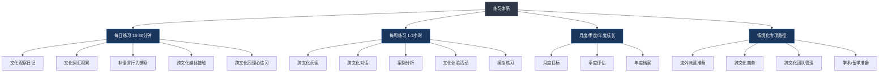
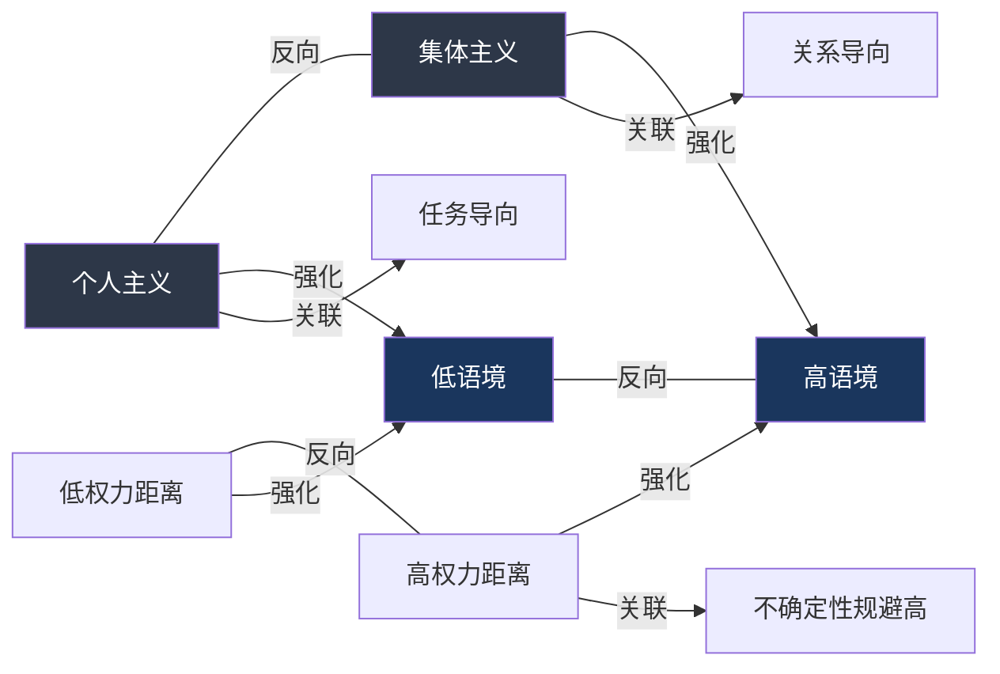

# 跨文化沟通的练习方法

## 为什么需要系统化练习

跨文化沟通能力不是"知道"就能"做到"的。认知心理学家 Kolb 的经验学习理论（Experiential Learning Theory）指出，真正的学习遵循"具体经验→反思观察→抽象概念化→主动实验"的四阶段循环。仅仅阅读跨文化理论停留在第三阶段，必须通过反复的实践-反思循环才能将知识内化为能力。

跨文化沟通领域的权威研究者 Darla Deardorff 在其跨文化能力模型中指出，跨文化能力包含三个层面：

| 层面 | 内容 | 对应练习类型 |
|------|------|-------------|
| **认知层** | 文化知识、文化自我觉察、社会语言学意识 | 阅读、词汇积累、媒体接触 |
| **情感层** | 开放性、好奇心、同理心、容忍歧义 | 视角转换、文化日记、同理心练习 |
| **行为层** | 适应性沟通、非语言觉察、冲突管理 | 对话练习、模拟演练、案例分析 |

三个层面缺一不可。只读理论不练习，你成了"纸上谈兵的专家"；只练习不反思，你可能在重复错误而不自知。本章提供的练习体系覆盖全部三个层面，形成完整的"输入→内化→输出"闭环。

### 神经科学视角：为什么练习才能改变大脑

练习不仅仅是"熟练度"的问题，它涉及大脑结构的实际改变。神经可塑性（neuroplasticity）研究表明，反复的特定类型练习会加强相应的神经通路。具体到跨文化沟通：

- **镜像神经元系统**：当你观察来自不同文化的人的行为并尝试理解其意图时，大脑的镜像神经元会被激活。频繁的跨文化观察练习可以增强这个系统的敏感度，使你更快地"读懂"他人的非语言信号。
- **前额叶皮层**：跨文化互动中的"暂停-反思-调整"过程依赖前额叶皮层的执行控制功能。练习视角转换和文化假设检验，本质上是在锻炼前额叶对自动反应的抑制和调节能力。
- **默认模式网络**：文化观察日记和反思练习激活的是大脑的默认模式网络（DMN），这个网络负责自我参照加工和社会认知。定期的反思练习可以增强DMN的功能，提高你的元认知能力。

理解这些机制的意义在于：你知道练习是有效的，不是在做无用功。大脑会因为你的练习而物理性地改变——但前提是**持续和重复**。偶尔一次的深度体验远不如每天15分钟的持续练习有效。

### 从新手到专家：Dreyfus 技能习得模型

Stuart 和 Hubert Dreyfus 兄弟提出的技能习得五阶段模型，可以帮助你理解自己在跨文化沟通能力谱系中的位置：

| 阶段 | 特征 | 跨文化沟通表现 | 对应练习策略 |
|------|------|---------------|-------------|
| **新手** | 依赖规则，无法处理例外 | 用刻板印象理解所有文化差异 | 文化概念积累、基础阅读 |
| **高级新手** | 开始识别情境因素 | 能区分不同文化维度，但仍需刻意分析 | 文化观察日记、案例分析 |
| **胜任者** | 能设定优先级和目标 | 能主动选择沟通策略，有计划地调整 | 深度对话、情境模拟 |
| **精通者** | 直觉性判断，全局视野 | 能"感觉"到文化差异并自然调整 | 复杂案例分析、跨文化调解 |
| **专家** | 不依赖规则，情境化反应 | 跨文化沟通成为"第二天性" | 导师角色、教学相长 |

大多数人学习跨文化沟通时，会在"高级新手"到"胜任者"之间停留最久。这个阶段的关键瓶颈是：你知道所有理论，但在真实互动中来不及调用。解决方案是**大量重复的情境练习**，直到知识从"显性记忆"转化为"程序性记忆"——就像开车从"想离合、挂挡、松手刹"变成无意识操作。

### 练习体系全景

练习体系的总体结构如下：

---

## 第一部分：每日练习（15-30分钟）

每日练习的核心原则是**低门槛、高频次**。每天投入15-30分钟，坚持21天形成习惯，90天形成稳定的认知模式。以下是五项每日练习，你可以根据当天时间灵活组合。

### 练习一：文化观察日记

**目的**：培养文化敏感度和文化自我觉察能力

文化敏感度是跨文化沟通的基础能力。Bennett 的发展性跨文化敏感度模型（DMIS）将跨文化敏感度分为六个阶段：否认→防御→最小化→接受→适应→整合。文化观察日记的作用是帮助你从"无意识的无能"（不知道自己不知道）推进到"有意识的无能"（知道自己不知道），这是成长的第一步。

**为什么日记有效而不是"想想就好"**：书写的行为本身就是一种认知加工。心理学中的"书写表达"（expressive writing）研究（Pennebaker, 1997）表明，将经历转化为文字的过程会激活大脑的语言中枢和叙事加工区域，强迫你将模糊的感受结构化。"想想"容易滑过，"写下来"才能真正审视。

**具体方法**：

每天花10分钟，记录当天遇到的一个文化相关事件或观察。可以是自己与他人的互动，也可以是观察到的他人的互动。关键是**当天记录**，因为记忆在24小时内会衰退约70%（艾宾浩斯遗忘曲线）。

使用以下模板记录：

日期：____
触发事件：发生了什么？（客观描述，不加判断）
我的第一反应：我本能的感受和想法是什么？
文化假设检验：我的反应中隐含了哪些文化假设？
对方视角推测：如果对方来自不同文化背景，他/她可能如何理解这件事？
替代解读：是否存在至少一种不同于我最初判断的解释？
行动调整：下次遇到类似情况，我可以尝试什么不同的做法？
情绪标签（可选）：这件事让我感到____（困惑/不适/惊喜/好奇/尴尬/愤怒）

这个模板比简单的"发生了什么+我的反应"多出三个关键步骤：**文化假设检验、替代解读、行动调整**。这三个步骤是将"经历"转化为"经验"的核心机制。

**填写示例**（供参考）：

日期：2026年3月15日
触发事件：和德国供应商开视频会议，我提出一个新想法后，
  德国方直接说"这个方案不可行，因为……"列举了三个问题。
  整个回应不到10秒。
我的第一反应：感到被冒犯，觉得对方不尊重我的提案，至少应该说
  "想法不错，但是……"
文化假设检验：我的假设是"批评前应该先肯定"——这反映了中式沟通中
  的面子机制和间接反馈偏好。德国方可能根本不认为直接否定=不尊重。
对方视角推测：在德国文化中，直接指出问题恰恰是尊重的表现——
  说明对方认真对待你的提案，花时间分析了可行性。含糊其辞反而
  被视为不诚实或不重视。
替代解读：对方的"不"不是对我的否定，而是对方案的技术评估。
  这是典型的低语境+任务导向文化中的正常反馈方式。
行动调整：下次和德国方开会前，先自我提醒"直接反馈=认真对待"。
  收到直接批评后，先追问技术细节而非感到受伤。
情绪标签：不适 → 但理解后转为释然

**进阶路径**：

| 阶段 | 时间 | 观察重点 | 记录深度 |
|------|------|----------|----------|
| 入门期 | 第1-2周 | 明显的文化符号（饮食、服饰、节日、问候方式） | 描述性记录，只记录"看到了什么" |
| 成长期 | 第3-6周 | 沟通行为差异（直接/间接、沉默含义、话题偏好） | 分析性记录，开始追问"为什么" |
| 深化期 | 第7-12周 | 深层价值观差异（时间观、面子观、权力距离） | 反思性记录，对比多种文化视角 |
| 内化期 | 第13周以后 | 自身的文化盲点和自动反应模式 | 元认知记录，觉察自己的觉察过程 |

**常见误区**：
- **观察变成评判**：记录"日本人太含蓄了"是评判，记录"日本同事在会议中没有直接反对我的提案，但在会后单独找我提出了修改建议"是观察。始终先描述行为，再分析文化因素。
- **只观察别人不观察自己**：最有价值的观察对象是你自己的自动反应。当你对某人的行为产生强烈情绪（不耐烦、困惑、反感）时，这往往是你自身文化假设被触发的信号。
- **三天打鱼两天晒网**：中断超过3天，习惯回路就会断裂。如果实在太忙，至少写一句话——"今天太忙没观察，但我注意到自己在压力下更倾向于母语沟通"，这本身就是有价值的跨文化觉察。
- **追求"正确答案"**：文化观察日记没有标准答案。不要纠结于"我的分析对不对"，重要的是养成分析的习惯。即使分析错了，思考的过程本身也在锻炼你的文化敏感度。

### 练习二：文化概念与术语积累

**目的**：构建跨文化沟通的知识框架

专业术语不是用来"装门面"的，而是提供**认知工具**。当你知道"高语境/低语境"这个概念后，你观察同一段对话时会看到以前看不到的东西——这就是所谓的"理论负载观察"（theory-laden observation），科学哲学家 Thomas Kuhn 提出的概念。没有理论框架的观察是盲目的，因为你不知道该注意什么。

**方法**：每天花5分钟学习一个文化概念，不只记住定义，更要理解其在实际互动中的表现。

**核心术语清单**（按学习优先级排列）：

| 术语 | 提出者 | 核心含义 | 日常表现举例 | 常见误解 |
|------|--------|----------|-------------|----------|
| 个人主义 vs 集体主义 | Hofstede | 个体与群体关系的优先序 | 西方人说"I think"，东亚人说"We think" | ≠ 自私vs无私；集体主义文化中个人也有强烈的自我意识 |
| 高语境 vs 低语境 | Edward Hall | 信息传递依赖语境的程度 | 日本人说"有点困难"=拒绝；美国人说"不行"=拒绝 | 不是"好vs坏"；高低语境各有沟通效率优势 |
| 权力距离 | Hofstede | 对权力不平等的接受程度 | 韩国下属不会当面反驳上司；荷兰下属可以直接质疑CEO | ≠ 权力集中；低权力距离文化中也有权力结构 |
| 不确定性规避 | Hofstede | 对模糊和未知的容忍度 | 德国人需要详尽的合同；泰国人接受灵活安排 | ≠ 胆小或保守；高不确定性规避文化往往有更强的制度创新 |
| 面子机制 | Goffman/胡先缙 | 社会声望的维护与给予 | 中国公开批评=丢面子；北欧公开批评=正常讨论 | ≠ 虚荣；面子是社会关系的润滑剂 |
| 时间取向 | Hall | 单线程vs多线程时间观 | 德国人迟到5分钟道歉；巴西人迟到30分钟正常 | ≠ 不守时；多线程时间文化有自己的时间管理逻辑 |
| 长期导向 vs 短期导向 | Hofstede | 对未来回报vs即时结果的偏好 | 日本企业重长期关系；美国企业重季度业绩 | ≠ 短视；短期导向文化重视即时的社会责任和传统 |
| 情感表露规范 | Trompenaars | 情绪表达的文化边界 | 意大利人激烈争论=正常讨论；日本人提高音量=极度愤怒 | ≠ 情绪化；情感表露丰富不等于缺乏理性 |
| 关系导向 vs 任务导向 | Meyer | 先建关系还是先谈事情 | 中东先喝茶聊家常再谈生意；德国直接进入议程 | ≠ 拖延；关系导向文化中信任是高效合作的前提 |
| 普遍主义 vs 特殊主义 | Trompenaars | 规则优先还是关系优先 | 美国"规定就是规定"；中国"看情况、看关系" | ≠ 不讲规则；特殊主义文化中关系本身就是一种规则 |

**深度学习方法**：
1. **定义**：用自己的话复述概念，而不是背诵原文
2. **举例**：找到至少两个不同文化的具体表现
3. **反例**：思考这个概念可能过度简化的场景（文化内差异往往大于文化间差异）
4. **应用**：回忆自己生活中的一个情境，用这个概念重新分析
5. **整合**：将新概念与已学概念建立联系（例如：高语境文化往往也是高权力距离文化，这两者如何相互强化？）

**概念之间的关系网络**：

理解单个概念是基础，但真正的高手能在具体情境中**同时调用多个维度**进行分析。以下是核心概念之间的典型关联：

**推荐资源**：
- Hofstede Insights 网站（hofstede-insights.com）：提供60多个国家的文化维度对比工具，输入两个国家即可获得详细的维度对比图
- 《文化地图》（The Culture Map）Erin Meyer：用大量真实商业案例解释8个文化维度，比学术著作易读10倍
- Coursera 课程"Intercultural Management"（ESCP商学院）：系统讲解文化维度理论，有案例作业
- GLOBE 项目数据库（globeproject.com）：62个国家的文化和领导力研究数据，比 Hofstede 的数据更新、更细化

### 练习三：非语言行为觉察

**目的**：提升对非语言信号的读取和解读能力

Albert Mehrabian 的经典研究指出，在情感和态度的传递中，语言内容仅占7%，语调占38%，面部表情和身体语言占55%。虽然这个比例在不同情境中会有变化（在信息密集的技术讨论中语言占比会更高），但核心结论成立：**非语言信号传递的信息量远超语言本身**。

更关键的是，非语言行为的文化差异巨大，而且大多数人对此毫无意识。一个美国人在和日本同事说话时不断点头（表示"I'm listening"），日本同事却理解为"I agree"——这种非语言信号的误读每天都在全球各地造成误解。

**跨文化非语言差异的系统分类**：

Edward T. Hall 在《隐匿的维度》（The Hidden Dimension）中将非语言行为的文化差异归纳为以下几类：

| 类别 | 定义 | 文化差异举例 | 误读后果 |
|------|------|-------------|----------|
| **体距学**（Proxemics） | 人际空间距离的使用 | 拉丁美洲人交谈距离约0.5m，北欧人约1.2m | 拉美人觉得北欧人"冷淡疏远"；北欧人觉得拉美人"侵入私人空间" |
| **时间学**（Chronemics） | 时间的使用和态度 | 日本人提前10分钟到=守时；巴西人迟到15分钟=正常 | 日本人觉得巴西人"不专业"；巴西人觉得日本人"刻板" |
| **触觉学**（Haptics） | 身体接触的规范 | 阿拉伯男性之间握手持续1-2分钟且十指紧扣；美国男性握手3秒松开 | 美国人觉得"太亲密了"；阿拉伯人觉得"太敷衍了" |
| **目光学**（Ocultics） | 眼神接触的规范 | 西方"说话时看对方眼睛"=真诚；东亚文化中持续直视长辈=不敬 | 西方人觉得东亚人"心虚"；东亚人觉得西方人"无礼" |
| **体态学**（Kinesics） | 手势、姿态、面部表情 | 希腊人昂头表示"不"；保加利亚人点头表示"不" | 严重的信息误读，可能导致行为错误 |
| **副语言学**（Paralanguage） | 语调、语速、音量、沉默 | 芬兰人习惯长时间沉默=正常思考；美国人觉得沉默=尴尬 | 芬兰人觉得美国人"话太多"；美国人觉得芬兰人"不合作" |

**方法**：每天选定一个非语言维度进行专注观察，在与他人互动时有意识地留意这一维度，晚间用5分钟记录观察结果。

**一周观察计划**：

| 星期 | 观察维度 | 具体关注点 | 记录问题 |
|------|----------|-----------|----------|
| 周一 | 眼神接触 | 谁看谁？看多久？什么时候移开？ | 不同身份的人（长辈/同辈/陌生人）眼神接触有何不同？ |
| 周二 | 身体距离 | 站/坐时保持多远？靠近时对方是否后退？ | 亲疏关系如何影响身体距离？ |
| 周三 | 手势 | 使用哪些手势？有没有文化特异性手势？ | 哪些手势在不同文化中含义不同？ |
| 周四 | 面部表情 | 微笑的频率和含义？皱眉表示什么？ | 微笑是表示开心、尴尬还是礼貌？ |
| 周五 | 语调和语速 | 音量高低？语速快慢？停顿的频率？ | 沉默出现的时机和含义是什么？ |
| 周六 | 触碰行为 | 谁碰谁？碰哪里？什么场合？ | 握手、拥抱、拍肩的适用场景有何文化差异？ |
| 周日 | 综合观察 | 选一个完整的5分钟互动，同时观察以上所有维度 | 哪个维度的差异最让你意外？ |

**实用技巧**：
- **镜像法**：有意识地模仿对方的非语言行为（语速、身体距离、手势幅度），这是建立跨文化亲和力最快的方法之一。注意是"微调"而非"复制"，过度模仿会被视为嘲弄。具体操作：观察对方的语速后，将自己的语速调整到与对方相近的水平（不需要完全一致，缩小差距即可）。
- **3秒规则**：在对方说完话后，默数3秒再回应。不同文化对"合适的回应间隔"差异极大（美国人约0.5秒，日本人可达3-5秒）。3秒是一个安全的中间值，既不会显得太急，也不会让人觉得你在走神。
- **录像回看**：如果条件允许，录制自己的跨文化对话（征得对方同意），回看时关注自己的非语言行为。你往往会发现自己有很多不自知的习惯（如说话时频繁看手机、交叉双臂等）。
- **"异常值"捕捉法**：当你注意到对方的某个非语言行为"不太对"（比如本来聊得好好的，对方突然收回了笑容或改变了坐姿），立刻在心里标记这个时刻，事后分析是什么触发了变化。这种"异常值"往往是文化规范被触碰的信号。

### 练习四：跨文化媒体沉浸

**目的**：通过媒体内容间接体验不同文化的思维模式和价值取向

深度跨文化理解需要"浸入式"体验，但不是每个人都有条件长期旅居海外。媒体沉浸是成本最低、可及性最高的替代方案。关键在于**主动分析**而非被动消费——看韩剧和分析韩剧中的人际关系模式，学习效果相差10倍。

**方法**：每天花15分钟进行有目的的跨文化媒体接触，配合简单的分析记录。

**媒体选择矩阵**：

| 媒体类型 | 推荐来源 | 分析重点 | 适合人群 |
|----------|----------|----------|----------|
| 国际新闻 | BBC World, NHK World, Al Jazeera, DW | 同一事件的不同报道角度和框架 | 关注时事的人 |
| 纪录片 | Netflix文化类纪录片、NHK纪录片 | 深入展现日常生活和社会规范 | 喜欢深度内容的人 |
| 影视剧 | 韩剧/日剧/美剧/英剧/北欧犯罪小说改编剧 | 社交规范、家庭关系、职场文化 | 喜欢故事的人 |
| 社交媒体 | Reddit各国家板块、Twitter/X不同文化圈的KOL | 当下流行文化的差异和互动方式 | 年轻读者 |
| 播客 | BBC "The Forum"、NPR "Code Switch" | 文化身份、种族话题、移民经历 | 通勤时间多的人 |
| 文学作品 | 诺贝尔文学奖获奖作品、布克奖作品 | 不同文化中的生存困境和人性表达 | 爱好阅读的人 |
| TED 演讲 | 搜索"cross-cultural"标签 | 跨文化研究者的最新发现和见解 | 喜欢短内容的人 |
| YouTube 文化频道 | "Asian Boss"、"Bald and Bankrupt"等 | 真实街头采访、文化碰撞的即时反应 | 视觉学习者 |

**分析框架**（每次花3分钟完成）：

作品/内容：____
文化背景：____
与我的文化的三个最大差异：
  1. ____
  2. ____
  3. ____
最让我意外的一点：____
这反映了什么深层价值观？____
如果有一个人物的反应让我困惑，那可能是哪种文化逻辑在起作用？____

**特别推荐——"同一事件多视角法"**：选择一个国际事件（如奥运会、气候谈判、贸易争端），分别阅读来自至少三个不同国家/文化背景的媒体报道。注意比较：标题的情绪色彩、引用的信息源、强调的因果关系、对"我方"和"对方"的称呼差异。这是理解"框架效应"最直观的方式。

**影视作品的深度分析方法**：

不要只是"看"外国影视剧，而是带着分析框架"研究"它。以下是具体的分析维度：

1. **第一遍：剧情体验**——正常看，感受故事和人物
2. **第二遍：文化扫描**——暂停在以下时刻，记录观察：
   - 人物初次见面时的问候方式和身体距离
   - 表达不满或拒绝的方式（直接说"不"还是用迂回表达？）
   - 家庭聚餐场景中的座位安排、话题选择、谁先动筷
   - 职场场景中上下级的互动模式
   - 角色独处时的行为（这个文化中"私人时间"是什么样的？）
3. **第三遍（可选）：价值层挖掘**——关注角色的内心冲突往往反映了什么文化张力（如个人愿望vs家庭期望、传统vs现代、群体归属vs个体自由）

### 练习五：跨文化视角转换

**目的**：培养从不同文化视角思考问题的能力——即"文化同理心"

同理心不是"觉得对方可怜"，而是"理解对方为什么这样做"。跨文化同理心的难点在于，你必须暂时搁置自己的文化参照系，进入一个完全不同的价值判断体系。

社会心理学中的"观点采择"（perspective-taking）研究表明，有意识的视角转换练习可以显著降低群际偏见（Galinsky & Moskowitz, 2000）。但需要注意：**视角转换不等于认同**。你可以理解日本人的"读空气"（空気を読む）文化而不必完全采纳它。

**视角转换的认知机制**：视角转换之所以困难，是因为它要求你同时持有两套相互矛盾的价值判断。心理学家称之为"认知解耦"（cognitive decoupling）——你需要把自己的默认判断"挂起"，暂时启用另一套判断标准。这非常消耗认知资源，初期会感到别扭和疲惫，但随着练习增多，大脑会发展出更高效的处理路径。

**方法**：每天花5分钟，选择一个你当天遇到的情境或决策，从一个完全不同文化背景的人的角度重新思考。

**视角转换提示卡**（每天抽一张练习）：

如果我是在集体主义文化中长大的人：
→ 我的决策会更多考虑哪些人的感受？
→ "个人选择"和"家庭/群体期望"的优先序会如何排列？

如果我是在高语境文化中长大的人：
→ 我会如何理解对方"没有说出口"的信息？
→ 我会如何表达拒绝而不让对方丢面子？

如果我是在低权力距离文化中长大的人：
→ 我会如何与上级讨论不同意见？
→ 我对"尊重权威"的定义会有什么不同？

如果我是在高不确定性规避文化中长大的人：
→ 面对模糊的工作安排，我会有什么感受？
→ 我会要求什么样的信息才觉得"安心"？

如果我是在情感表达丰富的文化中长大的人：
→ 对方的"面无表情"可能表示什么？
→ 我如何判断对方是在克制情绪还是真的没有情绪？

如果我是在关系导向文化中长大的人：
→ 在谈生意之前，我需要建立什么样的信任基础？
→ "守时"和"维系关系"冲突时，我如何取舍？

如果我是在高语境且高权力距离的亚洲文化中长大的人：
→ 面对西方同事在会议上直接批评我的方案，我会怎么感受？
→ 我期待的"给面子"的具体行为是什么？
→ 如果对方没有这样做，我会如何解读？（不重视？故意侮辱？文化差异？）

如果我是在普遍主义文化中长大的人：
→ 面对中国同事说"这个事情可以商量"，我会怎么理解？
→ "规则"和"关系"的边界在哪里？

**进阶练习——"文化日记互换"**：找一个来自不同文化背景的朋友或同事，各自用日记记录同一个事件，然后交换阅读。你往往会惊讶于同一个场景在不同人眼中的"版本"差异有多大。这种活生生的对比比任何教科书都有效。

**高级练习——"文化角色扮演写作"**：选择一个你最近经历的跨文化情境，用第一人称从对方的文化视角重写整个互动过程。写的时候"进入角色"，用对方文化的价值观来评判和感受。例如：

> 原版（你的视角）："我在会议上提出了一个创新方案，但德国同事直接说'不可行'，让我很受挫。"
>
> 角色扮演版（德国同事视角）："中国同事提出了一个方案，从创新角度看有亮点，但从工程实施角度有三个严重的技术障碍。我的职责是确保项目可行，所以我必须诚实、清晰地指出这些问题。含糊其辞才是对项目和对他的不负责。"

---

## 第二部分：每周练习（1-2小时）

每周练习的核心原则是**深度胜于广度**。不要贪多，每周选择1-2项深入练习，比浅尝辄止地做5项效果好得多。

### 练习六：跨文化主题阅读

**目的**：系统性地构建跨文化知识体系

零散的知识点像散落的珠子，系统性阅读是把它们串成项链的线。跨文化沟通是一门成熟的学科，有大量经过时间检验的经典著作。站在巨人的肩膀上，可以避免重新发明轮子。

**方法**：每周花1-2小时进行主题阅读。建议按照"理论→应用→专题"的顺序递进。

**分层书单（附简要评价）**：

**第一层：建立认知框架（先读这3本）**

| 书名 | 作者 | 核心价值 | 阅读难度 |
|------|------|----------|----------|
| 《文化地图》(The Culture Map) | Erin Meyer | 8个文化维度+大量真实商业案例，是跨文化领域最实用的入门书 | ★★☆☆☆ |
| 《文化的影响力》(Cultures and Organizations) | Geert Hofstede | 文化维度理论的奠基之作，6维度模型的完整论述 | ★★★☆☆ |
| 《超越文化》(Beyond Culture) | Edward T. Hall | 高低语境理论、隐性文化、时间取向的源头 | ★★★☆☆ |

**第二层：深化理解（理论成熟后阅读）**

| 书名 | 作者 | 核心价值 |
|------|------|----------|
| 《当文化碰撞时》(When Cultures Collide) | Richard Lewis | 30+国家的文化特征描述，附有大量商务场景案例 |
| 《地图与领土》(The Geography of Thought) | Richard Nisbett | 东西方思维差异的认知心理学研究，解释"为什么" |
| 《第三文化孩子》(Third Culture Kids) | Pollock & Van Reken | 跨文化成长者的身份认同和适应策略 |
| 《谈判力》(Getting to Yes) | Fisher & Ury | 虽非专门的跨文化书籍，但其原则性谈判框架在跨文化场景中极有价值 |
| 《隐匿的维度》(The Hidden Dimension) | Edward T. Hall | 空间距离、时间取向与文化关系的开创性分析 |

**第三层：专题深入（根据个人需要选择）**

- **跨文化商务**：Kiss, Bow, or Handsake（按国家的商务礼仪百科）
- **跨文化教育**：Learning Teaching by Jim Scrivener（跨文化课堂管理）
- **跨文化心理**：The Geography of Thought（认知差异）
- **跨文化领导力**：Global Leadership by Mark Mendenhall
- **跨文化冲突管理**：The Mediator's Handbook（跨文化调解实务）
- **跨文化身份认同**：The Location of Culture by Homi Bhabha（后殖民文化身份理论）
- **中文读者推荐**：《菊与刀》（鲁思·本尼迪克特）、《中国人》（林语堂）、《丑陋的日本人》（高桥敷）、《中国人的性格》（亚瑟·史密斯）

**高效阅读方法**——SQ3R+文化笔记法：

1. **Survey（浏览）**：先看目录、序言、总结，10分钟了解全书框架
2. **Question（提问）**：针对每章标题，先问"作者会怎么回答这个问题"
3. **Read（阅读）**：带着问题读，标记关键论点和案例
4. **Recite（复述）**：合上书，用自己的话复述核心观点——说不出来说明没读进去
5. **Review（回顾）**：完成阅读笔记模板

**阅读笔记模板**：

书名/文章：____
作者背景：（为什么作者有资格写这个主题？）
核心论点：（用3句话概括作者的主要观点）
三个最有启发的案例/例子：
  1. ____（附简要描述）
  2. ____（附简要描述）
  3. ____（附简要描述）
与我的个人经验的对比：____
对我的跨文化沟通的启发：（具体到"下次遇到X情况，我会Y"）
一个我不太同意或有疑问的点：____
推荐给谁读：____
与之前读过的哪本书可以互补或对照？____

### 练习七：跨文化深度对话

**目的**：在真实互动中练习跨文化沟通技巧

跨文化沟通是"关系中的技能"，不可能仅通过阅读和观察来习得。就像学游泳必须下水，跨文化沟通能力必须在真实的人际互动中磨练。

**方法**：每周找一次机会与来自不同文化背景的人进行20-40分钟的深度对话。

**如何找到对话伙伴**：

| 渠道 | 适合人群 | 注意事项 |
|------|----------|----------|
| 语言交换平台（Tandem、HelloTalk、ConversationExchange） | 所有人 | 主动说明你的目的是"双向文化交流"而非只是"练口语" |
| 国际社区/外国人社群 | 一线大城市居民 | 关注当地的国际社区活动、Meetup小组 |
| 职场中的外籍同事 | 有外籍同事的职场人 | 选择非正式场景（午餐、咖啡）而非工作场合 |
| 线上跨文化交流群组 | 所有人 | Reddit的r/AskACountry、Quora的文化话题 |
| 大学留学生中心 | 大学生/研究者 | 很多大学有"语伴项目"或"国际伙伴计划" |
| 在线课程的国际同学 | 自学人士 | Coursera/edX的课程讨论区是天然的跨文化社交场 |
| 私教/家教场景 | 有外语学习需求的人 | 在语言学习的同时融入文化讨论 |

**深度对话四步框架**：

**对话启动问题库**（选择一个即可）：

- "你在中国/你的国家生活，最让你意外的文化差异是什么？"
- "你们国家的人在表达不满时，通常会怎么做？"
- "你觉得'准时'在你们文化中意味着什么？迟到多少分钟算迟到？"
- "在你们国家，和老板意见不同时，人们通常怎么表达？"
- "你们文化中有没有一些'不成文的规则'是外国人很容易犯的？"
- "你离开自己的国家后，最怀念的文化习惯是什么？"
- "如果要用三个词形容你们文化中'好人'的标准，你会选哪三个？"
- "你们文化中，'朋友'和'同事'的关系边界在哪里？"
- "你们文化中对'沉默'的理解是什么？什么时候的沉默是舒适的？"

**对话中的关键原则**：
1. **多问少判**：用"在你们文化中……是怎么做的？"代替"你们为什么那样做？"（后者隐含"那样做很奇怪"的判断）
2. **追问"为什么"**：当对方说"我们就是这样的"时，温和地追问"你觉得这个习惯可能和什么有关？"——帮助对方也成为自己文化的观察者
3. **分享而非辩护**：当对方指出你所在文化的问题时，不要急于辩护，而是说"你说得对，这确实是一个问题，同时我观察到……"
4. **承认不知道**：对于自己文化的某些习惯，坦率说"我不确定这是不是文化原因，可能只是我个人的习惯"——过度文化化（over-culturalizing）比不文化化更危险
5. **注意权力不对称**：如果对话双方存在语言能力差异（一方使用母语，另一方使用外语），要格外注意——使用外语的一方表达能力受限，可能无法充分表达自己的观点。适当放慢语速，避免使用俚语和复杂句式

**对话复盘清单**（对话后5分钟完成）：

对话对象的文化背景：____
我今天学到的一个新文化知识点：____
对话中让我意外的一个回答：____
我注意到的自己的一个沟通习惯（好的或需要改进的）：____
下次对话我想深入探讨的话题：____

### 练习八：跨文化案例分析

**目的**：通过分析真实案例提升跨文化问题解决能力

案例分析是哈佛商学院的核心教学方法，原因在于：案例提供了**真实情境中的复杂性**——没有标准答案，需要权衡多种因素，这正是跨文化沟通的常态。

**方法**：每周选择一个跨文化冲突或误解案例，用结构化框架分析30分钟。

**案例来源**：
- 新闻中的跨文化争议事件（如外企在中国的营销翻车、国际赛事中的文化冲突）
- 影视作品中的跨文化场景（如《东京奏鸣曲》中的日美职场冲突）
- 个人经历中的跨文化困惑
- 本书各章节中的案例
- Harvard Business Review 的跨文化案例库（hbr.org 搜索"cross-cultural"）
- Reddit 的 r/crosscultural 或 r/InterculturalCommunication 社区的真实分享

**六步分析框架**：

① 案例描述：发生了什么？（客观陈述事实，不加判断）
② 涉及哪些文化维度差异？
   □ 个人主义/集体主义  □ 高低语境  □ 权力距离
   □ 不确定性规避  □ 时间取向  □ 情感表露  □ 其他：____
③ 各方的文化逻辑是什么？
   → 甲方为什么会这样做/说？在他们的文化中这意味着什么？
   → 乙方为什么会这样反应？在他们的文化中这意味着什么？
④ 误解/冲突是如何升级的？
   → 是哪个节点开始出问题的？
   → 有没有"挽回窗口"被错过了？
⑤ 如果是我，会如何处理？
   → 事前预防：怎样做可以避免冲突？
   → 事中调解：冲突发生后如何化解？
   → 事后修复：关系如何重建？
⑥ 这个案例的核心教训是什么？（用一句话概括）
⑦ 这个教训可以推广到哪些类似情境？（举一反三）

**案例分析示例**：

① 案例：一位美国经理在视频会议中直接指出印度团队成员的方案"有三个重大缺陷"。
   该成员随后沉默了，之后几周的工作热情明显下降，最终提交了辞职信。

② 文化维度：高低语境（美国低语境直接反馈 vs 印度较高语境间接沟通）
   权力距离（印度较高权力距离，下属被当众批评="极度丢面子"）
   情感表露（美国"对事不对人" vs 印度"对事也是对人"的文化解读）

③ 文化逻辑：
   美国经理：在美式职场中，直接指出问题是"高效""坦诚"的表现，
   "对事不对人"是基本职业素养。他认为自己在帮助下属改进。
   印度下属：在印度文化中，被上级当众指出错误是极大的羞辱，
   不仅是个人面子问题，还涉及家庭荣誉（izzat）。"三个重大缺陷"
   的措辞让他感到被彻底否定。

④ 升级节点：当众批评是关键失误。如果美国经理在会后私下一对一沟通，
   用"我觉得这个方案可以在以下几点上加强"替代"有三个重大缺陷"，
   结果会完全不同。此外，美国经理之后没有觉察到下属的沉默变化，
   错过了修复关系的窗口。

⑤ 处理方式：
   事前：了解印度同事的文化背景，重要反馈选择一对一场合
   事中：用"sandwich feedback"（肯定→建议→肯定）框架
   事后：在辞职信出现前主动找下属私下谈话，坦诚承认自己沟通方式的问题

⑥ 核心教训：在跨文化团队中，"对事不对人"不是普遍法则——
   你需要根据对方的文化背景选择反馈方式。

⑦ 推广情境：任何涉及跨文化反馈、绩效评估、项目复盘的场景。
   核心原则：先了解对方文化中的"面子边界"在哪里。

### 练习九：文化体验活动

**目的**：通过亲身参与深化对不同文化的感性理解

理性知识和感性体验之间有一道鸿沟。你可以读100页关于日本茶道的描述，但亲自参加一次茶道体验后的感受会深刻得多。感性体验激活的是不同的记忆编码系统，形成的记忆更持久、更有感染力。

**方法**：每月至少参加一次与不同文化相关的活动。

**活动类型与学习目标**：

| 活动类型 | 具体形式 | 核心学习目标 | 观察重点 |
|----------|----------|-------------|----------|
| 节日庆典 | 春节/中秋/圣诞/开斋节/排灯节活动 | 感受文化的仪式感和集体情感 | 人们在仪式中的情绪表达、参与方式 |
| 饮食文化 | 各国餐厅、烹饪课程、美食节 | 了解"吃"背后的文化逻辑 | 座位安排、用餐顺序、餐具使用、餐桌礼仪 |
| 宗教场所 | 寺庙开放日、教堂礼拜、清真寺参观 | 理解宗教对日常行为的影响 | 入场礼仪、着装要求、祈祷方式 |
| 文化工作坊 | 书法/茶道/花艺/冥想体验 | 感受不同文化的"修行"方式 | 对"正确"和"美"的文化定义差异 |
| 艺术展览 | 各国文化展、国际艺术节 | 审美偏好反映文化价值观 | 题材选择、色彩偏好、空间布局 |
| 社区活动 | 国际社区活动、外国人聚会 | 在轻松氛围中进行非正式交流 | 人们自我介绍的方式、话题选择 |
| 体育活动 | 跆拳道/柔道/瑜伽/太极 | 身体实践中的文化哲学 | 对"力量""控制""和谐"的文化理解 |
| 语言课程 | 各国语言入门课 | 语言结构反映思维模式 | 敬语系统、时态表达、礼貌用语 |

**活动前中后的学习流程**：

- **活动前**（5分钟）：快速搜索该文化的3个基本礼仪要点，避免冒犯
- **活动中**（持续观察）：调动所有感官，关注你感到"不习惯"或"意外"的地方——这些正是文化差异的信号
- **活动后**（10分钟记录）：完成文化体验记录表

活动名称：____
文化背景：____
三个让我印象深刻的细节：
  1. ____（附你的感受）
  2. ____（附你的感受）
  3. ____（附你的感受）
与我预期最大的不同：____
这个体验改变了我对这种文化的什么看法？____
我还想进一步了解什么？____

### 练习十：跨文化情境模拟

**目的**：在安全的模拟环境中练习和试错，积累经验

真实跨文化互动中犯错的代价可能很高（丢掉合同、破坏关系），而模拟练习提供了一个零风险的试错空间。飞行员在真飞机上飞行前要在模拟器中练几百小时，跨文化沟通同理。

**方法**：每周进行一次跨文化情境模拟练习（30-60分钟），与朋友、同事或学习小组搭档。

**模拟情境库**（按难度分级）：

**入门级**：
1. 你是中国留学生，第一天到美国大学，和室友（美国人）商量宿舍规则
2. 你接待一位来公司参观的日本客户，需要安排午餐和会议室
3. 你在国际会议上遇到一位巴西与会者，需要在茶歇时进行small talk
4. 你在一个国际志愿者项目中，需要和来自5个国家的队友分配任务

**进阶级**：
5. 你是一位中国项目经理，需要通过视频会议和德国团队讨论延期交付问题
6. 你是一位在美国工作的中国工程师，需要在绩效评估中向上级争取升职
7. 你在中东出差，客户邀请你到家中做客，你需要在尊重当地习俗和保持自我之间找到平衡
8. 你的法国同事在全体会议上公开质疑你的方案，你需要在维护尊严的同时保持合作关系

**高级**：
9. 你是一位跨国公司的HR总监，需要调解一位中国员工和一位美国经理之间的冲突
10. 你需要带领一个由中、日、美、巴西成员组成的虚拟团队完成一个紧急项目
11. 你代表公司与印度合作伙伴谈判一项合资协议，对方的谈判风格与你预期完全不同
12. 你在海外分公司推行一项公司制度，需要平衡总部要求和当地员工的文化习惯

**模拟练习流程**：

准备阶段（10分钟）：
  → 确定场景、各自角色、文化背景
  → 每位参与者花5分钟研究自己角色的文化特点
  → 明确练习目标（如"练习间接反馈"或"练习跨文化small talk"）

执行阶段（15-30分钟）：
  → 按角色进行模拟互动
  → 第三方观察者记录：语言行为、非语言行为、文化冲突点
  → 可以录像（征得同意）以便回顾

复盘阶段（15分钟）：
  → 每人分享自己的"内心独白"——在某个节点，你的真实想法是什么？
  → 观察者反馈：记录了哪些值得注意的行为模式？
  → 讨论：哪些做法有效？哪些造成了误解？如何改进？
  → 提炼一个核心教训

**复盘反思模板**：

模拟场景：____
我的角色：____
我做得好的地方：（至少2个具体行为）
  1. ____
  2. ____
需要改进的地方：（至少2个具体行为）
  1. ____（下次我会改成____）
  2. ____（下次我会改成____）
对方角色的一个反应让我意外的是：____
这个意外反映了什么文化差异？____
对真实跨文化互动的一个具体启发：____

**数字化模拟选项**：如果没有练习伙伴，可以借助 AI 工具进行模拟。在 ChatGPT/Claude 等工具中输入以下提示词：

请扮演一位来自[国家]的[职业]，具有典型的[国家]文化特征。
我需要和你进行[场景]的对话。请根据你的文化背景来回应我，
如果我的沟通方式在你的文化中不够得体，请在对话结束后告诉我。
请严格按照该文化的沟通风格来回应——包括语气、直接程度、
非语言描述（如[叹气/微笑/犹豫/沉默片刻]）。

AI 模拟虽然无法完全替代真人互动，但胜在随时可用、零社交压力，适合作为过渡训练。

---

## 第三部分：小组练习与协作学习

跨文化沟通是双向甚至多向的技能，独自练习有天花板效应。小组练习提供了"镜像反馈"——别人眼中的你，比你以为的自己更真实。

### 建立跨文化学习小组

**最佳规模**：4-6人。太少缺乏多样性，太多难以深入讨论。

**理想的成员构成**：
- 至少2个不同文化背景的成员（不必是外国人，不同地区、不同行业即可）
- 不同的跨文化经验水平（有海外经验的+纯国内背景的混合）
- 不同的学习目标（商务、留学、个人成长的混合）

**小组活动菜单**：

| 活动 | 时长 | 频率 | 说明 |
|------|------|------|------|
| 案例讨论会 | 60分钟 | 每两周 | 一位成员分享亲身跨文化经历，其他人用六步框架分析 |
| 文化辩论赛 | 45分钟 | 每月 | 选一个文化议题（如"直接沟通一定更好吗？"），分正反方辩论 |
| 影片讨论会 | 90分钟 | 每月 | 共同观看一部跨文化主题影片的片段，讨论文化维度 |
| 角色扮演工作坊 | 60分钟 | 每两周 | 练习十的小组升级版，3人一组（A、B、观察者），轮换角色 |
| 跨文化知识竞赛 | 30分钟 | 每月 | 轮流出题考对方的文化知识，寓教于乐 |

**小组讨论的黄金规则**：
1. **"是的，而且……"原则**：对他人观点先接住再延伸，不直接否定
2. **轮流发言制**：避免文化差异导致的发言不均（高权力距离文化中的成员可能习惯性沉默）
3. **"我体验"而非"他们就是"**：分享个人经历而非概括整个文化群体
4. **保密约定**：小组讨论中分享的个人跨文化失误案例，不得在小组外传播

### 互为教练的反馈机制

在小组中建立"互为教练"关系：每两人结成固定搭档，在日常练习中互相观察和反馈。

**反馈框架——SBI 模型**（Situation-Behavior-Impact）：

情境（Situation）：在[具体时间/场景]中
行为（Behavior）：我观察到你[具体行为描述]
影响（Impact）：这个行为在跨文化语境中可能产生[正面/负面]效果，
  因为[文化因素解释]
建议（Suggestion）：你可以尝试[具体替代行为]

**示例**：
> "在昨天和日本客户的会议中（S），你在对方还没说完时就插话提出了反对意见（B）。在日本文化中，这可能被解读为不尊重和不耐心（I）。建议下次等对方完全停下来后，用'您说得很有道理，我补充一个角度……'来引入不同观点（S）。"

---

## 第四部分：自评工具与进度追踪

没有测量就没有改进。跨文化沟通能力的提升往往是"阶梯式"而非"线性式"的——你可能连续数周感觉没有变化，然后突然出现"顿悟式"突破。定期自评的作用不是追求精确分数，而是让你看到长期趋势，在平台期保持信心。

### 跨文化发展量表（IDI）简化自评版

请对以下15个陈述进行1-5分评分（1=完全不符合，5=完全符合）：

认知维度：
___ 我能列出至少5个国家的文化维度特征
___ 我了解高低语境文化在沟通中的具体差异
___ 我能识别不同文化对时间的不同态度
___ 我了解至少3种文化中"面子"的不同表现形式
___ 我能解释个人主义和集体主义如何影响决策方式

情感维度：
___ 当遇到与我文化习惯不同的人时，我的第一反应是好奇而非不适
___ 我能容忍在跨文化互动中的不确定性（不知道对方为什么这样做）
___ 我能在不认同对方文化做法的同时尊重它的合理性
___ 我愿意主动走出自己的文化舒适区
___ 我对"文化冲击"有心理准备，将其视为成长机会

行为维度：
___ 我能根据对方的文化背景调整我的沟通方式
___ 我在跨文化互动中能有效使用非语言沟通
___ 我能识别跨文化误解并及时修复
___ 我能在跨文化团队中有效协作
___ 我能在跨文化冲突中找到双方都能接受的解决方案

评分解读：
- 15-30分：起步阶段——开始建立跨文化意识
- 31-45分：成长阶段——有一定知识和初步实践经验
- 46-60分：熟练阶段——具备较强的跨文化沟通能力
- 61-75分：精通阶段——跨文化沟通已成为你的核心竞争力

每月做一次这个自评，追踪自己的进步轨迹。

### 文化智力（CQ）四维度评估

文化智力（Cultural Intelligence）由 Ang & Van Dyne 提出，包含四个维度：

| 维度 | 含义 | 自评问题 | 低分表现 | 提升方法 |
|------|------|----------|----------|----------|
| CQ 认知 | 文化知识的广度和深度 | 我对不同文化的法律、经济、社会制度了解多少？ | 只了解表面习俗，不了解深层价值观 | 系统阅读、文化概念积累 |
| CQ 元认知 | 跨文化互动中的思维意识 | 我在跨文化互动中是否会暂停、反思自己的假设？ | 用同一套标准评判所有人的行为 | 文化观察日记、即时复盘 |
| CQ 动机 | 跨文化互动的信心和兴趣 | 我主动寻求还是回避跨文化互动的机会？ | 因为怕犯错而回避跨文化场合 | 从小规模、低风险的互动开始建立信心 |
| CQ 行为 | 适应性行为调整能力 | 我能否根据不同文化情境调整语言、语调和肢体语言？ | 在所有文化场景中都用同一套沟通方式 | 情境模拟、镜像法练习 |

找到自己最弱的维度，针对性地安排练习重点。

### 跨文化沟通能力雷达图

建议每季度画一次雷达图，直观展示自己的能力分布：

评分维度（1-10分）：
  文化知识广度：____
  文化自我觉察：____
  非语言沟通能力：____
  语言适应能力：____
  同理心/视角转换：____
  冲突管理能力：____
  容忍歧义能力：____
  跨文化关系建立：____

用线连接各点，形成一个不规则的图形。
每次评估后用不同颜色叠加，观察图形的变化趋势。
最不规则的地方 = 最需要重点练习的维度。

### 能力发展追踪表

| 评估日期 | 认知(CQ) | 元认知(CQ) | 动机(CQ) | 行为(CQ) | IDI总分 | 本阶段重点 | 关键突破 |
|----------|----------|------------|----------|----------|---------|-----------|----------|
| ____/____ | ___/20 | ___/20 | ___/20 | ___/20 | ___/75 | _________ | ________ |
| ____/____ | ___/20 | ___/20 | ___/20 | ___/20 | ___/75 | _________ | ________ |
| ____/____ | ___/20 | ___/20 | ___/20 | ___/20 | ___/75 | _________ | ________ |

每月填写一次，连续追踪6个月以上才能看到稳定趋势。注意：能力提升不是线性的——可能连续2个月没有明显进步，第3个月突然出现"顿悟式"提升。这完全正常。

### 进步自测清单

当你感觉"没有进步"时，问自己以下5个问题。如果至少有3个回答"是"，说明你在进步：

□ 我现在能识别出两周前识别不出的文化差异吗？
□ 我在跨文化互动中的焦虑感是否有所降低？
□ 我是否开始不自觉地在日常生活中运用文化维度分析？
□ 我是否至少有一次成功地调整了自己的沟通方式来适应对方的文化？
□ 我是否至少有一次"恍然大悟"的时刻——突然理解了之前困惑的行为？

---

## 第五部分：练习组合与时间管理

### 每日练习组合方案

不是每个人都有30分钟做全部五项每日练习。以下是四种时间组合方案：

| 方案 | 时间 | 组合内容 | 适合谁 |
|------|------|----------|--------|
| **精简版** | 10分钟 | 文化观察日记（5分钟）+ 视角转换练习（5分钟） | 时间紧张的上班族 |
| **标准版** | 20分钟 | 文化观察日记（5分钟）+ 术语积累（5分钟）+ 非语言觉察或媒体接触（10分钟） | 大多数学习者 |
| **沉浸版** | 30分钟+ | 全部五项练习 | 时间充裕或正在准备海外生活/工作的人 |
| **碎片版** | 5分钟×3次 | 早晨：术语积累（5分钟）+ 午间：视角转换（5分钟）+ 晚间：观察日记（5分钟） | 工作节奏极快但有碎片时间的人 |

**最佳练习时间**：
- 文化观察日记：晚间睡前，回顾当天经历
- 术语积累：早晨，作为"每日一个概念"的晨间仪式
- 非语言觉察：白天互动时实时进行
- 媒体接触：通勤时间
- 视角转换：午餐后或下午茶时间

### AI 辅助练习工具箱

在AI时代，跨文化沟通练习有了新的可能性。以下是经过验证的AI辅助练习方法：

**1. 文化知识问答练习**

向AI提出以下类型的请求，检验和扩展自己的文化知识：

请给我出5道关于[国家/地区]文化差异的选择题，涵盖商务礼仪、
日常社交和非语言沟通。每题4个选项，答完后给出详细解析。
难度级别：[入门/中级/高级]

**2. 跨文化邮件改写练习**

写一封你觉得合适的商务邮件，然后请AI从目标文化的视角评估：

我写了一封给[国家]客户的商务邮件（附邮件内容）。
请从[该国]文化的角度评估这封邮件的适当性，
指出可能需要调整的措辞、语气或结构，并给出改写版本。
评估维度：
1. 称呼和开头的正式程度
2. 正文的直接/间接程度
3. 请求的表达方式
4. 结尾的客套话是否恰当
5. 整体语气是否符合该文化的商务规范

**3. 即时文化顾问**

在真正的跨文化互动之前，快速获得文化建议：

我明天要和[国家]的[身份]见面讨论[话题]。
请告诉我：
1. 3个最重要的文化注意事项
2. 适合的开场话题
3. 需要避免的行为或话题
4. 适合的非语言沟通方式
5. 如果出现分歧，该文化的首选解决方式是什么

**4. 跨文化冲突复盘**

将真实的跨文化冲突经历交给AI分析：

我在以下跨文化情境中遇到了问题：[描述]。
请帮我分析：
1. 可能涉及哪些文化维度差异？
2. 对方的文化逻辑可能是什么？
3. 我的处理方式中有哪些文化盲点？
4. 更好的处理方式是什么？
5. 如何修复这段关系？

**5. 文化概念情景化学习**

请用3个真实的日常场景来解释[文化概念]：
1. 一个该概念体现为正面效果的场景
2. 一个该概念导致误解的场景
3. 一个该概念与其他文化维度交叉影响的场景

每个场景包括：具体人物、对话、文化分析、和如果换一种文化视角会怎样。

**6. 跨文化决策模拟**

我在以下情境中面临一个跨文化决策：[描述]
请帮我从至少3种不同文化视角分析这个决策，
每种视角包括：
- 该文化中"正确"的做法是什么
- 这样做的文化和历史原因
- 潜在的风险和收益
- 具体的执行步骤

---

## 第六部分：常见障碍与应对策略

### 障碍一：练习两周后感觉没有进步

**原因**：跨文化沟通能力的提升是"阶梯式"而非"线性式"的。你会经历一段"平台期"，感觉似乎没有进步，但其实你的潜意识正在整合之前学到的知识。这在技能习得理论中称为"意识性无能"到"意识性有能力"的过渡期。

**应对**：
- 回顾你第一周的记录，和最新记录对比——进步往往在对比中才显现
- 找一个学习伙伴互相反馈，旁观者能看到你看不到的变化
- 将练习难度提升一级——如果一直观察"明显的"文化差异，开始关注"隐性的"
- 设定一个具体的里程碑目标（如"本月完成一次跨文化深度对话"），用可衡量的指标替代模糊的"进步感"

### 障碍二：没有跨文化互动机会

**原因**：生活环境中缺乏外国人或跨文化场景。

**应对**：
- **线上渠道**：HelloTalk、Tandem、Reddit 文化版块、Discord 国际服务器、Coursera 国际课程讨论区
- **媒体替代**：每天15分钟的跨文化媒体沉浸（见练习四），虽然是间接体验，但积累效果不可小觑
- **本地化练习**：中国内部也存在丰富的文化多样性——城乡差异、南北差异、代际差异、职业文化差异。用同样的分析框架去观察这些差异，同样能锻炼跨文化敏感度
- **角色扮演**：自己扮演不同文化背景的人，模拟对话（可配合AI工具）
- **"文化考古"**：研究自己家族或社区中的文化变迁。你的祖父母和你的父母在沟通方式上有什么差异？这些差异反映了什么社会文化变化？
- **开源社区参与**：GitHub、Stack Overflow 等技术社区是天然的跨文化互动场。观察不同国家的开发者在代码审查、issue讨论中的沟通风格差异

### 障碍三：练习变成自我批评

**原因**：过度关注自己的"文化偏见"而产生愧疚感或焦虑。

**应对**：
- 有文化偏见是正常的——每个人都有。关键不是消除偏见，而是觉察偏见
- 将"我又犯了文化偏见"重新定义为"我发现了自己一个新的文化盲点"——觉察本身就是进步
- 记住 Bennett 模型：从"否认"到"最小化"再到"接受"，每一步都需要时间
- 如果某个练习让你持续感到不适，暂停一下，换成更轻松的练习（如看一部外国电影）
- 写下你的"文化优势清单"——你所在的文化给了你哪些独特的沟通优势？这不是自负，而是建立"文化自信"——有了自信才能真正开放地学习其他文化

### 障碍四：理论和实践脱节

**原因**：学了很多概念，但在真实互动中完全想不起来用。

**应对**：
- **卡片提示法**：将关键概念写成小卡片（如"高语境/低语境""面子机制"），放在手机壳里或桌上，每天看一眼强化记忆
- **"一个互动一个概念"法**：每次跨文化互动后，只选择一个概念来分析这次互动，而不是试图同时运用所有知识
- **事后复盘 > 事中提醒**：不要试图在互动过程中实时分析，那会让你分心。互动结束后再用概念框架来复盘
- **从简单概念开始**：先熟练运用"高低语境"一个概念，再逐步扩展到其他维度
- **建立"触发-行动"配对**：为每个概念建立一个简单的触发条件和对应行动。例如："触发：对方说话含糊或多次停顿 → 行动：考虑对方可能在间接拒绝，换一种方式确认真实意图"
- **"标签化"练习**：每天结束时，给当天遇到的每个人贴一个文化维度标签（如"今天遇到的客户：高语境+关系导向+高权力距离"）。这种快速分类练习能加速理论到直觉的转化

### 障碍五：感到文化相对主义的困惑

**原因**：学习了多种文化后，开始质疑"到底哪种文化方式是对的"。

**应对**：
- 文化相对主义是理解的工具，不是道德判断的标准。理解一个文化实践的逻辑≠必须认同它
- 区分"文化偏好"和"基本人权"：尊重文化差异有边界——涉及人的基本尊严和安全时，文化不能成为借口
- 找到"人类共通性"：尽管文化表达方式不同，但对尊重、公平、关爱的需求是共通的
- 实践中采用"第三种方式"：不选A也不选B，而是在理解双方文化逻辑的基础上创造一种双方都能接受的新方式
- 记住一个有用的区分：**描述性相对主义**（不同文化确实有不同的做法）vs **规范性相对主义**（所有文化做法都同样正确）。你可以接受前者而不接受后者

### 障碍六：跨文化疲劳

**原因**：长期处于跨文化环境中的认知消耗。跨文化互动需要持续的"认知监控"——监控自己的假设、调整自己的表达方式、解读对方的隐含信息——这非常消耗心理能量。

**应对**：
- 承认疲劳是正常的：跨文化适应研究中的"U型曲线"理论表明，大多数人在进入新文化3-6个月后会经历"文化冲击低谷"
- 设置"文化休息日"：每周给自己一天完全不分析文化差异，只做自己习惯的事情
- 找到"文化盟友"：在跨文化环境中找到至少一个你可以用母语交流、不需要"跨文化表演"的人
- 身体层面的照顾：跨文化疲劳往往伴随睡眠问题和注意力下降，保证充足的休息比"加倍练习"更重要
- 庆祝小胜利：每成功处理一个跨文化情境，给自己一个正向反馈。大脑需要奖励信号来维持学习动机
- **降低自我监控强度**：你不需要在每次互动中都做到"完美跨文化适应"。设定"最低可行标准"——只要不犯严重文化冒犯就够了，其他的留给时间

### 障碍七：过度依赖刻板印象

**原因**：学了文化维度理论后，不自觉地给每个来自某国的人贴上"典型的X国人"的标签。

**应对**：
- 记住 Hofstede 本人的警告："文化维度描述的是群体统计趋势，不是个体特征"。来自日本的人可能比美国人还直接
- 每次使用文化维度分析时，加一个后缀："这可能与他的文化背景有关，但也可能完全是个人性格"
- 主动寻找反例：如果你认为"德国人都很严谨"，去认识一个随性的德国人；如果你认为"拉美人都不守时"，去认识一个守时的巴西人
- 区分"有用的假设"和"有害的刻板印象"：前者是"对方可能偏好间接沟通，我先试探一下"；后者是"他是中国人，所以一定重视面子"
- 保持"假设-检验"心态：把文化知识当作需要验证的假设，而不是不需要检验的真理

### 障碍八：练习中的社交焦虑

**原因**：害怕在跨文化互动中犯错、被误解或显得无知。

**应对**：
- 记住：大多数人对跨文化错误的容忍度远高于你的想象。真诚的好奇心比完美的表现更能赢得好感
- 准备一个万能"救场句"："如果我刚才的表达在你的文化中有什么不合适的地方，请告诉我，我很想学习"——坦诚本身就是最好的沟通策略
- 从低风险场景开始练习：先和AI模拟，再和线上陌生人交流，最后和真实生活中的同事朋友练习
- 接受"不完美"：跨文化沟通中的完美主义是敌人。犯错→道歉→学习→改进，这个循环本身就是跨文化能力的核心
- 使用"文化自嘲"：适当调侃自己的文化局限性（如"我作为中国人，可能天然觉得所有问题都可以用吃饭来解决"），幽默可以化解紧张

---

## 第七部分：情境化专项练习路径

不同的人学习跨文化沟通有不同的目标场景。以下是四个常见场景的专项练习建议。

### 路径一：海外派遣准备

**适用人群**：即将或计划到海外工作/生活的人

**提前6个月开始准备，按优先级排列**：

| 时间段 | 练习重点 | 具体行动 |
|--------|----------|----------|
| 6-4个月前 | 文化知识储备 | 阅读目标国的2-3本文化书籍；学习基本问候语 |
| 4-2个月前 | 情境模拟练习 | 针对目标国的常见场景（租房、社交、职场）进行模拟 |
| 2-1个月前 | 社交网络建立 | 在线上找到目标国的华人社区或国际社区，了解真实生活经验 |
| 到达后第1月 | 文化观察密集期 | 每天写文化观察日记，重点记录"冲击"和"意外" |
| 到达后2-6月 | 深度融入期 | 参加当地社区活动，建立本地朋友圈 |

**海外派遣准备的详细清单**：

**出发前（6-4个月）**：
- 阅读至少2本关于目标国文化的书（一本写给外国人的，一本该国作者写的）
- 学习目标国语言的100个高频词汇和20个关键句型
- 了解目标国的法律体系中与日常生活相关的基本规定（如租房法、交通规则、签证义务）
- 完成目标国的文化维度对比分析（使用 Hofstede Insights 工具）
- 阅读至少3个海外华人的"经验帖"，特别关注他们提到的"踩坑"经历

**出发前（4-2个月）**：
- 针对目标国的5个高频生活场景进行AI模拟练习（租房、就医、社交聚会、职场第一天、邻里关系）
- 准备一份"文化应急卡片"：写下5个最重要的文化禁忌和5个最有用的社交句型
- 联系目标国的华人群体或国际社区，了解真实生活信息
- 了解目标国的医疗系统、紧急电话、法律援助渠道

**出发前（2-1个月）**：
- 安排至少一次与已经在目标国的人的视频通话
- 准备一份"第一周行动计划"——到了之后第一周要做什么、去哪里、认识谁
- 学习目标国的基本社交礼仪（问候方式、餐桌礼仪、小费规范、着装要求）

**到达后**：
- 第1周：写密集观察日记，记录每一个"不同"的地方
- 第2-4周：开始主动社交——参加一个当地活动、加入一个兴趣小组
- 第2-3个月：建立一个包含本地人和外国人的"核心社交圈"
- 第4-6个月：评估自己的文化适应状态，识别需要进一步调整的领域

### 路径二：跨文化商务沟通

**适用人群**：需要与外国客户、供应商、合作伙伴打交道的商务人士

**练习重点**：
- 商务礼仪的国别差异（名片交换、座位安排、谈判节奏、宴请规范）
- 高低语境在商务沟通中的影响（邮件、电话、面对面的差异）
- 跨文化谈判策略（关系先行vs直接进入主题、合同精神vs人情往来）
- 跨文化商务演示技巧（讲故事vs列数据、PPT风格差异）

**商务场景专项练习方案**：

**邮件沟通**：每周练习写一封跨文化商务邮件
练习框架：
1. 用母语写一封你觉得合适的商务邮件
2. 请AI从目标文化的角度评估并给出改写版本
3. 对比两个版本的差异，记录关键调整点
4. 把调整点记入"跨文化邮件风格速查表"

**谈判模拟**：每两周进行一次30分钟的谈判角色扮演
推荐场景：
- 与德国供应商讨论价格（低语境+任务导向+高不确定性规避）
- 与印度合作伙伴协商交期（高语境+关系导向+高权力距离）
- 与美国客户讨论合同条款（低语境+任务导向+低权力距离）
- 与日本企业建立长期合作关系（高语境+关系导向+长期导向）

**宴请与社交**：每月进行一次商务宴请场景模拟
练习内容：
- 如何选择餐厅和菜品（考虑宗教禁忌、饮食偏好）
- 座位安排的礼仪差异
- 餐桌上的话题选择和禁忌
- 敬酒/祝酒的文化差异
- 账单支付的文化含义

### 路径三：跨文化团队管理

**适用人群**：管理多元文化团队的管理者

**练习重点**：
- 不同文化对"好领导"的定义差异（权威型vs参与型vs服务型）
- 跨文化反馈技术（直接/间接、公开/私下、书面/口头的选择）
- 虚拟团队的跨文化沟通挑战（时区、语言、非语言信号缺失）
- 建立"团队文化协议"——在团队层面创造一种融合多方文化的新规范

**跨文化领导力专项练习**：

**练习A——"领导力画像对比"**：
1. 画出你自己心目中的"理想领导者"画像（5个核心特质）
2. 请来自不同文化的团队成员各自画出他们的画像
3. 对比差异，讨论：哪些特质是共通的？哪些是文化特有的？
4. 制定一份"团队领导力协议"——明确定义团队期望的领导行为

**练习B——"跨文化反馈实验室"**：
准备3个同一主题的反馈场景（如"项目进度延迟"），分别适用于：
- 低语境低权力距离文化（如美国团队成员）：直接、具体、关注行为
- 高语境高权力距离文化（如中国团队成员）：间接、保留面子、私下沟通
- 混合文化场景：团队会议中的反馈，需要兼顾所有人的文化舒适区
每次练习后记录：哪种方式最有效？哪种方式最别扭？如何平衡？

**练习C——"团队文化协议设计"**：
为你的跨文化团队设计一份"文化协议"，包括：
1. 沟通规范：会议中如何发言？冲突如何处理？决策如何做出？
2. 时间规范：准时的定义？回复邮件的时限？加班的预期？
3. 反馈规范：公开还是私下？直接还是间接？书面还是口头？
4. 社交规范：团建活动的类型？工作之外的互动频率？
5. 决策规范：共识制还是多数决？谁有最终决定权？

设计过程本身就是一个跨文化练习——你需要权衡各方文化偏好，
创造一种所有人都能接受的"第三种方式"。

### 路径四：学术/留学准备

**适用人群**：准备出国留学或与国际学术界合作的研究者

**练习重点**：
- 学术文化差异（课堂参与方式、师生关系、学术诚信的不同理解）
- 学术社交技能（conference networking、small talk、邮件礼仪）
- 学术写作中的跨文化因素（论证风格、引用习惯、谦逊程度）
- 小组作业中的跨文化协作技巧

**学术场景专项练习**：

**练习A——"课堂参与模拟"**：
模拟西方课堂讨论场景：
- 你是否习惯在课上举手提问或质疑教授的观点？
- 你能否在小组讨论中主动表达自己的看法而非等待别人先说？
- 你如何在"积极发言"和"尊重他人发言权"之间找到平衡？

常见文化冲突：
- 中国学生习惯"先听后说"，被教授误读为"不感兴趣"
- 日本学生不习惯直接质疑权威，被误读为"缺乏批判性思维"
- 印度学生习惯争论式讨论，被其他文化学生误读为"攻击性"

应对策略：
- 第一周先观察课堂互动模式，了解"正常"是什么样的
- 准备2-3个问题带去课堂，降低"临场发言"的认知负担
- 用"I'd like to add…"或"Building on what X said…"作为发言开头

**练习B——"学术邮件写作"**：
练习写以下5种学术邮件：
1. 给潜在导师的套磁邮件
2. 给课程教授的课程相关提问邮件
3. 会议论文审稿意见的回复邮件
4. 请求推荐信的邮件
5. 与国际合作者讨论研究进展的邮件

每封邮件都请AI从目标文化的视角评估正式程度和语气。

**练习C——"Conference Networking 模拟"**：
模拟以下场景：
- 茶歇时与不认识的学者搭话
- poster session 中介绍自己的研究
- dinner event 中的社交对话
- 如何优雅地交换联系方式

关键技巧：
- 准备一个30秒的"电梯演讲"（elevator pitch）介绍你的研究
- 准备3个通用的small talk问题（"Which session did you find most interesting?"）
- 学会在对话中自然地提到你的研究兴趣，而非突兀地推销自己

---

## 第八部分：长期成长计划

### 月度目标设定

每个月为自己设定一个具体的、可衡量的跨文化沟通能力提升目标。避免"提升跨文化能力"这种模糊目标，要具体到行为。

| 月份 | 目标示例 | 可衡量标准 |
|------|----------|-----------|
| 第1个月 | 建立文化观察日记习惯 | 连续记录21天以上 |
| 第2个月 | 完成一本跨文化书籍的阅读 | 完成阅读笔记模板 |
| 第3个月 | 进行3次跨文化深度对话 | 每次对话完成复盘记录 |
| 第4个月 | 参加一次文化体验活动 | 完成活动前中后的记录 |
| 第5个月 | 完成一次跨文化模拟练习 | 获得搭档的反馈 |
| 第6个月 | 综合运用所学处理一个真实跨文化情境 | 完成案例分析报告 |

**月度目标设定模板**：

本月目标：____
为什么选这个目标？（与上月评估中的薄弱点关联）____
具体行动计划（每周做什么）：
  第1周：____
  第2周：____
  第3周：____
  第4周：____
可能遇到的障碍及应对：____
完成后的验证标准：____

### 季度回顾框架

每三个月进行一次系统的回顾，时间约1小时：

1. **知识盘点**：这个季度学了哪些新的文化概念？能否用自己的话解释给一个不懂的人听？
2. **技能评估**：完成一次跨文化自评量表（见第四部分），与上季度对比
3. **经验复盘**：印象最深刻的3次跨文化互动——哪些做得好？哪些可以改进？
4. **误区检查**：是否陷入了"文化本质主义"（认为每个某国人都一定具有某种特征）？是否过度依赖刻板印象？
5. **下一季度计划**：基于评估结果，确定下季度的练习重点和目标
6. **能力雷达图更新**：画出最新的8维度雷达图，与上季度的图叠加对比

**季度回顾详细模板**：

季度回顾：____年第__季度

一、知识盘点
  本季度新学的文化概念：
  1. ____（能否一句话解释？____）
  2. ____（能否一句话解释？____）
  3. ____（能否一句话解释？____）
  
  本季度阅读的书籍/文章：
  1. ____（核心收获：____）
  2. ____（核心收获：____）

二、技能评估
  IDI自评分数：____/75（上季度：____/75）
  CQ四维度：认知____ 元认知____ 动机____ 行为____
  最大进步维度：____
  最需提升维度：____

三、经验复盘
  最成功的跨文化互动：
  场景：____
  做得好的地方：____
  可以复制到未来的策略：____

  最有挑战的跨文化互动：
  场景：____
  困难在哪里：____
  如果重来，我会怎么做：____

  最意外的文化发现：
  ____

四、误区检查
  □ 我是否过度概括了某个文化群体？
  □ 我是否把个人行为错误地归因于文化因素？
  □ 我是否忽略了文化内差异？
  □ 我是否因为"了解了一点"就停止了学习？

五、下季度计划
  练习重点：____
  具体目标：____
  需要的资源/支持：____

六、能力雷达图变化
  [画出两期雷达图的叠加对比]
  最明显的变化：____
  需要关注的"短板"：____

### 年度成长档案

建立一份跨文化沟通能力的成长档案，记录全年的学习和实践历程。这不是给别人看的"漂亮简历"，而是你自己的成长证据。

档案内容清单：
- **阅读记录**：读过的书籍和文章列表，附核心收获
- **活动记录**：参加的文化活动，附感受和观察
- **对话记录**：进行过的跨文化对话数量和关键发现
- **挑战记录**：遇到的跨文化冲突或困境，以及如何处理的
- **能力变化**：季度自评分数的折线图——看到趋势比看到分数更重要
- **核心洞察**：这一年关于跨文化沟通最重要的3个领悟
- **最佳实践集**：自己总结的、经过验证的跨文化沟通"小技巧"清单

**年度档案模板**：

____年跨文化沟通成长档案

一、年度概览
  阅读量：____本书/文章
  跨文化对话次数：____次
  文化体验活动：____次
  参加的小组练习：____次
  AI模拟练习：____次

二、能力发展轨迹
  Q1 IDI：____  → Q2：____ → Q3：____ → Q4：____
  [附四期雷达图叠加图]

三、年度Top 3核心洞察
  1. ____
  2. ____
  3. ____

四、我的跨文化沟通"工具箱"
  经过验证有效的策略：
  1. ____（适用场景：____）
  2. ____（适用场景：____）
  3. ____（适用场景：____）

  我容易犯的文化错误：
  1. ____（纠正方法：____）
  2. ____（纠正方法：____）

五、下一年的学习计划
  重点领域：____
  具体目标：____
  想要挑战的高级练习：____

### 从学习者到教授者

当你在跨文化沟通方面积累了足够经验后，教授他人是最好的学习方式。教育心理学中的"学习金字塔"理论指出，"教授他人"的知识留存率高达90%，远高于阅读的10%和听讲的20%。

**如何开始教授**：
- 在公司内部做一次跨文化分享会（15分钟就够）
- 写一篇关于自己跨文化经历的博客或公众号文章
- 在学习小组中承担"导师"角色，帮助新成员入门
- 在社交媒体上分享跨文化观察，接受不同视角的评论
- 在大学或社区做一次跨文化沟通工作坊

教授的过程中你会发现自己的知识盲区——学生问出的你回答不了的问题，恰恰是你下一步学习的方向。这就是"教学相长"。

**教学相长的实操建议**：
- 准备分享会的过程本身比分享会更有价值——你需要把零散的知识系统化
- 每次分享后记录3个"听众问到的我没想到的问题"
- 观察听众中来自不同文化背景的人对你分享内容的不同反应——这本身就是跨文化学习
- 从"教10分钟"开始，不要一上来就做2小时的工作坊

---

## 练习总览表

| 练习 | 类型 | 频率 | 时长 | 核心能力 | 难度 |
|------|------|------|------|----------|------|
| 文化观察日记 | 反思 | 每日 | 10分钟 | 文化敏感度、自我觉察 | ★★☆ |
| 文化概念积累 | 输入 | 每日 | 5分钟 | 认知框架、知识储备 | ★★☆ |
| 非语言行为觉察 | 观察 | 每日 | 10分钟 | 非语言读取能力 | ★★★ |
| 跨文化媒体沉浸 | 输入 | 每日 | 15分钟 | 间接文化体验 | ★★☆ |
| 视角转换练习 | 反思 | 每日 | 5分钟 | 文化同理心 | ★★★ |
| 主题阅读 | 输入 | 每周 | 1-2小时 | 系统知识构建 | ★★★ |
| 深度对话 | 实践 | 每周 | 30分钟 | 真实互动能力 | ★★★★ |
| 案例分析 | 分析 | 每周 | 30分钟 | 问题解决能力 | ★★★ |
| 文化体验活动 | 实践 | 每月 | 2-3小时 | 感性文化理解 | ★★☆ |
| 情境模拟 | 实践 | 每周 | 30-60分钟 | 综合应用能力 | ★★★★ |
| 小组讨论 | 协作 | 每两周 | 60分钟 | 多元视角整合 | ★★★ |

**最终建议**：不要试图同时开始所有练习。第一周只做"文化观察日记"，第二周加入"术语积累"，第三周加入"非语言觉察"……逐步叠加。习惯的建立需要时间，而持续的微小进步，三个月后会累积成显著的能力提升。记住：**每一次有意识的跨文化互动，都是一次宝贵的学习机会。关键不是做得完美，而是保持觉察。**
