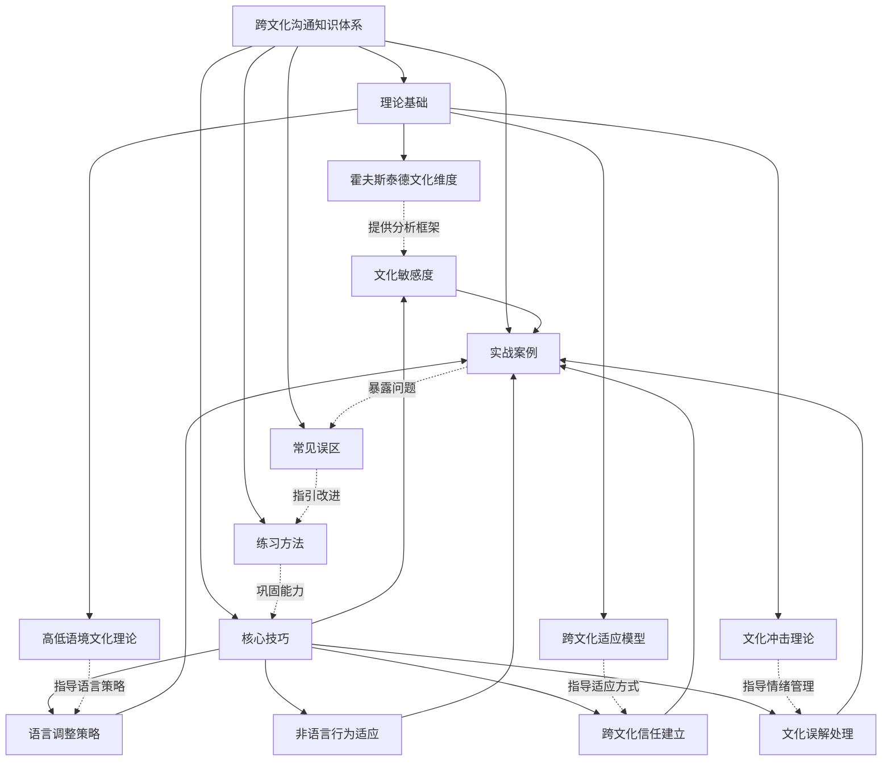
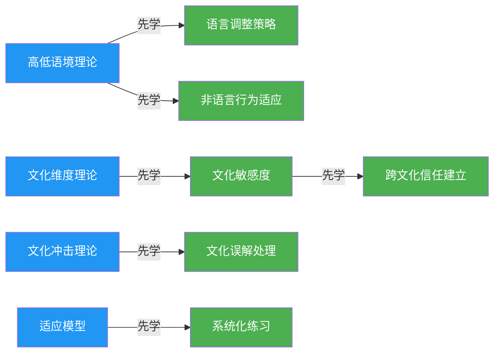
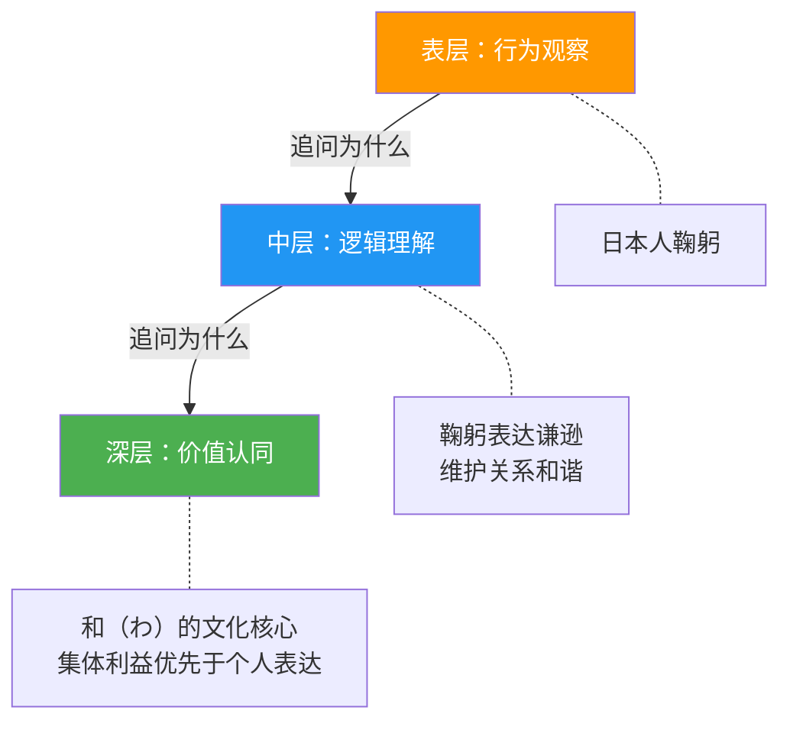

# 本章小结

## 章节知识全景

本章从理论根基到实战应用，构建了一个完整的跨文化沟通知识体系。下图展示了本章知识模块之间的逻辑关系与学习路径：

学习本章的理想路径是：先掌握理论基础建立认知框架，再学习核心技巧获得实操工具，通过实战案例检验理解，借助误区警示避开陷阱，最后通过系统练习将知识内化为能力。

以下知识模块依赖关系图展示了"学什么先于学什么"的最优路径：

蓝色为理论基础，绿色为核心技巧。箭头方向表示"先学理论再学技巧"的学习依赖关系。

***

## 核心要点回顾

### 理论基础：四大基石

跨文化沟通的理论基础为后续所有技巧和实践提供了"为什么"的解释。理解理论不是学术游戏，而是让你在面对未知文化情境时，有能力自行推理和判断，而非只能靠死记硬背。

#### 霍夫斯泰德文化维度理论

六个可量化的分析维度，每个维度都是一个连续光谱，不是非此即彼的二元标签：

| 维度 | 含义 | 高分文化特征 | 低分文化特征 | 沟通影响 |
|------|------|-------------|-------------|---------|
| 权力距离 | 对权力不平等的接受度 | 等级分明，尊重权威（马来西亚、菲律宾） | 平等意识强，挑战权威（丹麦、以色列） | 决策方式、称呼礼仪、会议发言顺序 |
| 个人主义vs集体主义 | 个人利益vs群体利益的优先级 | 强调个人成就（美国、澳大利亚） | 强调群体和谐（中国、日本） | 反馈方式、冲突处理、激励手段 |
| 不确定性规避 | 对模糊和未知的容忍度 | 规则详细，流程严格（日本、希腊） | 灵活变通，容忍模糊（新加坡、牙买加） | 计划制定、风险讨论、合同细节 |
| 男性化vs女性化 | 竞争导向vs关怀导向 | 追求成就和竞争（日本、匈牙利） | 注重生活质量和关系（瑞典、挪威） | 谈判风格、工作生活平衡讨论 |
| 长期导向vs短期导向 | 对未来的重视程度 | 注重长远规划和节俭（中国、日本） | 注重传统和当下（美国、尼日利亚） | 合同期限、投资回报讨论、耐心程度 |
| 放纵vs克制 | 对享乐的态度 | 享受生活，乐观积极（墨西哥、瑞典） | 自律节制，重视规范（俄罗斯、中国） | 社交活动安排、非正式交流方式 |

**使用要点：** 每个国家在每个维度上都有一个得分，形成独特的"文化指纹"。在实际应用中，不要用维度得分去"定义"一个人，而是用它来理解一种文化的整体倾向，再根据个体差异进行调整。六个维度共同作用，一个文化在不同维度上的组合才构成完整的画像。例如日本同时具有高权力距离、高集体主义、高不确定性规避和高男性化，这四个维度的叠加解释了日本商务文化中为何既有严格的等级秩序，又有强烈的团队意识，还有详尽的流程规范，同时追求极致的竞争表现。

#### 爱德华·霍尔的高低语境文化理论

揭示了一个根本性的差异——信息到底"在哪里"：

- **高语境文化**（中国、日本、阿拉伯国家）：大量信息存在于物理环境或内化在个人身上，编码在语言中的信息比例较低。一句话的真实含义可能取决于说话的场合、双方的关系、说话的语气、甚至是没有说出口的部分。在高语境文化中，"读懂空气"（空気を読む）是一种核心社交能力。高语境文化的沟通特征包括：信息冗余度高（同一件事用多种暗示方式表达）、依赖关系网络传递信息、书面文件常被视为"意向"而非"承诺"、拒绝通常以间接方式表达（"我需要再考虑一下"而非"不行"）。
- **低语境文化**（美国、德国、北欧国家）：信息主要通过明确的语言编码传递。说话者负责把意思表达清楚，听话者按字面意思理解。"你说什么就是什么"是低语境沟通的基本假设。低语境文化的沟通特征包括：信息冗余度低（说一次就够）、依赖正式文件和合同、口头承诺具有强约束力、拒绝会直接表达（"这个方案不可行"）。

**实际应用：** 当你从高语境文化与低语境文化的人沟通时，你需要把隐含信息显性化——把"弦外之音"变成"明文条款"。反过来，当你从低语境文化与高语境文化的人沟通时，你需要学会"听弦外之音"——对方说"原则上同意"可能意味着"还有顾虑但不方便直说"。

#### 文化冲击理论

四个阶段是跨文化适应的自然规律，了解它可以帮你管理预期：

| 阶段 | 情绪状态 | 持续时间 | 典型表现 | 应对策略 |
|------|---------|---------|---------|---------|
| 蜜月期 | 兴奋、好奇、积极 | 1-3个月 | 对新文化的一切都感到新鲜有趣，倾向于只看到积极面 | 趁热情高涨多探索、多建立社交关系，为后续挫折期储备社交支持 |
| 挫折期 | 焦虑、沮丧、愤怒 | 3-6个月 | 开始注意到文化差异带来的不便，产生"他们怎么这样"的想法；睡眠和饮食习惯被打乱；对小事过度反应 | 接纳情绪是正常反应，寻找支持社群，保持原有兴趣爱好，维持与家乡朋友的联系 |
| 调整期 | 逐渐平和、开始理解 | 6-12个月 | 开始理解差异背后的文化逻辑，找到应对策略，建立新的日常习惯 | 主动融入当地社交圈，尝试新的行为模式，记录自己的成长轨迹 |
| 适应期 | 自在、双文化视角 | 1年以上 | 能够在两种文化之间自如切换，形成跨文化身份 | 继续深化理解，帮助新来者适应，将跨文化经验转化为个人优势 |

**关键提醒：** 这四个阶段并非严格线性——你可能在不同生活领域（工作、社交、家庭）处于不同阶段，也可能在遇到新的文化挑战时"回退"到挫折期。例如你在工作中已经进入调整期，但搬到新的城市或换了一家公司，可能重新经历蜜月期和挫折期。这种"回退"是正常的，不需要恐慌。

#### 跨文化适应模型（Berry模型）

四种适应策略的效果差异已被大量实证研究验证：

| 策略 | 保持原有文化认同 | 融入新文化 | 效果评估 |
|------|----------------|-----------|---------|
| 整合（Integration） | ✓ | ✓ | **最佳**——心理适应和社会适应都最好 |
| 同化（Assimilation） | ✗ | ✓ | 社会适应较好，但可能产生身份认同危机，长期可能伴随文化失落感 |
| 分离（Separation） | ✓ | ✗ | 社会适应较差，容易产生孤立感，但心理认同尚可 |
| 边缘化（Marginalization） | ✗ | ✗ | **最差**——心理和社会适应都最差，与焦虑和抑郁高度相关 |

**核心洞察：** "整合"策略在几乎所有跨文化情境中都与最佳的心理健康和社会适应相关。这意味着你不需要放弃自己的文化根基来融入新文化——恰恰相反，一个稳固的文化身份反而能帮助你更自信地探索和接纳新文化。整合的关键是建立"双文化框架"——你既了解自己的文化如何影响你的思维和行为，也了解新文化的不同逻辑，并且能够在两种逻辑之间灵活切换。

***

### 核心技巧：五大能力支柱

理论是地图，技巧是交通工具。五大核心技巧各自对应跨文化沟通中一个关键能力领域，且彼此之间存在递进和支撑关系。

#### 文化敏感度

文化敏感度是所有其他技巧的底层能力，没有它，语言调整是表面模仿，非语言适应是机械动作，信任建立是盲目尝试。它包含三个层次：

1. **认知层**：知道文化差异的存在，了解不同文化的基本特征。这是"知道"的层次。例如你知道日本人不喜欢当面直接拒绝。
2. **情感层**：能够对文化差异产生共情，理解异文化行为背后的情感逻辑。这是"理解"的层次。例如你能理解日本人的间接拒绝是出于对关系和谐的维护，而非"不诚实"。
3. **行为层**：能够根据文化差异调整自己的行为，在实际互动中表现出文化适应性。这是"做到"的层次。例如你在与日本同事沟通时，会注意对方的委婉表达，并通过"我理解您的顾虑"来创造安全的沟通空间。

从认知到行为的转化是一个渐进过程。很多人停留在"知道"层面——他们读过霍夫斯泰德，能背出六个维度，但在实际沟通中仍然用自己的文化标准评判他人。真正的文化敏感度体现在行为上：你在给日本同事反馈时会先肯定再提建议，在与德国合作伙伴开会时会准备详细的数据和计划，在与巴西客户社交时会花时间聊家庭和兴趣。

**提升文化敏感度的三步法：**

| 步骤 | 操作 | 频率 | 示例 |
|------|------|------|------|
| 1. 觉察 | 在每次跨文化互动后，问自己"我刚才有没有用自己文化的标准去评判对方？" | 每次互动后 | 开完跨国会议后花2分钟复盘 |
| 2. 暂停 | 当感到困惑或不适时，暂停10秒，问自己"这可能是文化差异吗？" | 实时 | 对方迟到30分钟，先暂停再反应 |
| 3. 探索 | 主动了解对方文化的行为逻辑，而不是急于下结论 | 日常积累 | 读一本关于该文化的书、看一部该文化的电影 |

#### 语言调整策略

语言调整不仅仅是"说慢一点"那么简单。它包含四个维度的调整，每个维度都需要根据对方的文化背景做出判断：

**维度一：词汇选择**

避免俚语、方言、行业黑话，使用国际通用表达。注意同一个词在不同文化中的含义差异：

| 表达 | 美式英语含义 | 英式英语含义 | 可能的误解 |
|------|------------|------------|-----------|
| table a motion | 搁置议题 | 提交讨论 | 方向完全相反 |
| first floor | 一楼 | 二楼 | 楼层差一层 |
| biscuit | 软饼干 | 硬饼干（英式） | 食物预期不同 |
| public school | 公立学校 | 私立学校 | 教育类型相反 |
| pants | 长裤 | 内裤 | 尴尬 |

**维度二：语速和停顿**

与非母语者沟通时，语速降低20-30%，关键信息后增加1-2秒停顿让对方有消化时间。具体做法：每说完一个关键点后，用"So the key point is..."（关键是……）或"Let me repeat that"（我重复一下）来标记，给对方消化和提问的机会。

**维度三：直接程度**

对低语境文化的沟通对象，开头用"我认为方案A更好，因为……"的结构，结论先行，再给理由。对高语境文化的沟通对象，开头用"方案A和方案B各有优势，我们是否可以考虑……"的结构，给对方留出空间来表达意见，而不是直接给出结论让对方"被迫同意"。

**维度四：幽默使用**

跨文化沟通中慎用幽默。文化特异性幽默（基于当地新闻、流行文化、语言游戏）的失败率极高。如果需要用幽默，遵循以下优先级：自嘲式幽默（最安全，因为不涉及第三方）> 情境幽默（基于当下场景的观察）> 通用视觉幽默（图片、动作）>> 文化特异性幽默（应避免）。绝对避免涉及种族、宗教、政治、性别的笑话——即使你听到该文化内部的人这样开玩笑，也不代表外部人可以这样做。

#### 非语言行为适应

非语言信号是一个容易被忽视但影响巨大的领域。Albert Mehrabian的研究表明，在情感态度的传递中，语言内容仅占7%，语调占38%，非语言信号占55%。虽然这个比例在不同情境中有所变化，但核心结论不变：**你不说什么，比你说什么传递了更多信息。**

| 非语言行为 | 文化差异范围 | 示例 | 适应建议 |
|-----------|------------|------|---------|
| 眼神接触 | 直接（西方）vs 间接（东亚、非洲部分文化） | 美国人认为直视表示真诚，日本人可能认为长时间直视是挑衅 | 观察对方的眼神模式，跟随但不过度模仿；与东亚文化沟通时，看对方鼻梁或嘴巴区域代替直视 |
| 身体距离 | 近距离（拉美、中东）vs 远距离（北欧、东亚） | 巴西人社交距离约50cm，芬兰人社交距离超过120cm | 注意对方是否在你靠近时后退——如果是，增加距离；如果对方靠近你，可能是他们的自然距离 |
| 手势 | 文化特异性极高 | 竖大拇指在多数国家表示"好"，但在中东部分地区有侮辱含义；OK手势在美国是"好"，在巴西是侮辱 | 不确定含义的手势避免使用，用语言代替手势表达 |
| 沉默 | 积极（东亚）vs 消极（西方） | 日本文化中沉默是思考和尊重的表现，美国人可能觉得沉默表示不同意或不舒服 | 与东亚文化沟通时，不要急于填补沉默；与西方文化沟通时，可用"Let me think about that"标记思考中的沉默 |
| 时间观念 | 单时制（守时严格）vs 多时制（弹性时间） | 德国人迟到5分钟需要道歉，巴西人迟到30分钟可能被认为正常 | 参加单时制文化会议时提前5分钟到，参加多时制文化社交活动时不必过早到 |
| 身体接触 | 高接触（拉美、南欧）vs 低接触（东亚、北欧） | 意大利人谈话时可能会碰触你的手臂，日本人更倾向保持距离 | 初期互动保持低接触，由对方发起身体接触的升级 |

#### 跨文化信任建立

信任建立的核心在于理解两种截然不同的信任逻辑，以及它们对应的信任建立路径：

**任务导向型信任**（美国、德国、北欧）：

信任建立在能力和可靠性上。你按时交付高质量的工作，我就会信任你。信任的建立速度快，可以在几周的商务合作中完成。建立路径：

1. 展示专业资质和过往成果（简历、案例、推荐信）
2. 按时完成第一个小任务，建立"可靠"的第一印象
3. 主动提供进度更新，让对方看到你的工作过程
4. 遇到问题提前告知并提出解决方案，而不是等到截止日期才说做不了

**关系导向型信任**（中国、日本、中东、拉美）：

信任建立在人际关系上。我需要了解你这个人——你的家庭、你的价值观、你是否值得信赖——才会与你开展深度合作。信任的建立需要更长时间，可能需要数月甚至数年的社交互动。建立路径：

1. 先建立个人关系，再谈业务。不要急于进入正题。
2. 花时间吃饭、喝茶、聊生活，展现你作为"人"的一面
3. 找到共同的人脉或共同话题（校友、同乡、共同兴趣）
4. 遵守小承诺（"下次给你带本书"说到做到），信任是从小事累积的
5. 在对方需要帮助时主动伸手，即使这件事对你没有直接好处

**关键区别：** 任务导向型信任像"一次性买断"——你证明了能力，信任就建立起来。关系导向型信任像"长期投资"——需要持续投入时间和情感，但一旦建立，非常稳固，不容易被单一失误打破。

#### 文化误解处理

文化误解处理的六步法提供了一个结构化的处理框架，在误解发生时让你有章可循：

| 步骤 | 英文缩写 | 操作要点 | 常见错误 |
|------|---------|---------|---------|
| 1. 预防 | Proactive | 提前了解对方文化的基本特征，预判可能的误解点。在重要沟通前列一个"文化差异检查清单" | 过度预判导致刻板印象，把每个个体都当作文化样本 |
| 2. 识别 | Identify | 当沟通出现障碍时，首先判断是否为文化因素导致。问自己："如果对方和我是同一文化，我还会觉得困惑吗？" | 把所有沟通障碍都归咎于文化差异，忽视了可能是个人性格或情境因素 |
| 3. 暂停 | Pause | 不要急于反应，给自己10-30秒时间思考——对方的行为可能有文化层面的解释。深呼吸，降低情绪激活水平 | 暂停时间过长导致对方觉得你在回避，或暂停时脑补负面情节 |
| 4. 沟通 | Communicate | 用非指责的方式表达困惑，如"我想确认一下我的理解是否正确……""在你的文化中，通常怎么理解这个情况？" | 使用"你为什么……"的句式，暗含指责；或过于委婉以至于对方完全不明白你在说什么 |
| 5. 解释 | Explain | 从文化角度解释双方的行为逻辑，帮助彼此理解。"在我的文化中，准时意味着……我理解你可能有不同的时间观念" | 把自己的文化逻辑描述为"正确"的，把对方的描述为"需要改正"的 |
| 6. 学习 | Learn | 将这次经历记录下来，作为未来类似情境的参考。在文化观察日记中增加条目 | 只记录事件不提取规律，或者记住了但下次没有调用 |

**实战提示：** 六步法的关键在第3步"暂停"——绝大多数跨文化误解的恶化都源于没有暂停就做出了反应。当你感觉到不适、困惑或被冒犯时，先给自己10秒钟。在这10秒里问自己："这可能是文化差异吗？"这10秒钟的暂停，可能避免数周的关系修复工作。

***

### 实战案例回顾：从场景中学习

八个实战案例覆盖了跨文化沟通最常见的真实场景。以下表格不仅列出了案例信息，还提取了每个案例中最具启发性的决策点和思维转换：

| 案例场景 | 核心挑战 | 涉及理论/技巧 | 关键决策点 | 最大学点 |
|---------|---------|-------------|-----------|---------|
| 跨国视频会议 | 时区、语言、沟通风格差异 | 高低语境、语言调整、时间观念 | 会前是否发送详细议程？——对低语境团队是标准操作，对高语境团队可能显得"不信任" | 对不同文化团队使用不同的会前准备程度，并在会议开始时用2分钟确认议程共识 |
| 海外留学适应 | 文化冲击、社交融入、学术差异 | 文化冲击四阶段、适应模型 | 蜜月期结束时是否主动寻求帮助？——很多人在挫折期因为"不想示弱"而独自承受 | 蜜月期就要建立支持网络，不要等到挫折期才去找人，那时你的社交意愿最低 |
| 国际商务谈判 | 信任建立、决策风格、时间预期 | 信任建立、权力距离、长期导向 | 在关系导向文化中，第一次见面就带合同是否合适？——不合适，先建立关系 | 第一次见面的目标是"让人记住你这个人"，而不是"达成交易" |
| 跨文化团队管理 | 激励方式、反馈风格、冲突处理 | 个人主义vs集体主义、男性化vs女性化 | 公开表扬对所有文化成员都有效吗？——对集体主义文化成员可能造成尴尬 | 使用差异化的激励策略：对个人主义者公开表彰，对集体主义者私下肯定团队贡献 |
| 海外旅行 | 日常互动中的文化尴尬 | 非语言行为、文化敏感度 | 在不确定该怎么做时是"模仿当地人"还是"保持自己的习惯"？——观察后模仿是更安全的选择 | 到达新环境的第一个小时不急于行动，先观察当地人的行为模式，再决定自己的行为 |
| 文化冲突调解 | 深层价值观冲突 | 文化维度理论、误解处理六步法 | 调解时是"各退一步"还是"找到第三种方案"？——"各退一步"意味着双方都觉得自己在让步 | 寻找双方文化中共同的价值基础（如"尊重""公平"），用共同价值重新定义冲突 |
| 翻译误解危机 | 语言翻译中的文化缺失 | 语言调整、高低语境 | 关键决策是否只依赖机器翻译？——绝不，机器翻译无法捕捉语境和潜台词 | 关键沟通使用双语人员核对，把翻译结果回译一次检查差异，对模糊处直接沟通确认 |
| 文化融合实践 | 在多元文化中找到平衡 | 整合适应策略、全面技巧 | 融合团队应该建立"统一文化"还是"多元并存"？——统一文化会压制少数群体，多元并存可能导致分裂 | 创建"第三种空间"——团队独有的规范和仪式，既不偏向任何一方，又让所有人有归属感 |

这些案例的共同主题是：**跨文化沟通的成功不在于消除差异，而在于理解差异并找到有效的应对策略。** 差异本身不是问题，对差异的无知和忽视才是问题。每一个成功的跨文化沟通者，都经历过误解和尴尬——区别在于他们把每一次失误都变成了学习素材。

***

### 误区警示：十个认知陷阱

误区是跨文化沟通中最有价值的"反面教材"。以下是十个常见误区的深度解析——不仅说明"为什么是错的"，还说明"这种错误思维的来源"和"具体的纠正方法"：

| 序号 | 误区 | 为什么是错的 | 错误思维来源 | 正确认知 | 纠正练习 |
|------|------|------------|------------|---------|---------|
| 1 | "所有某国人都一样" | 文化是群体倾向，不是个体标签。每个国家内部都有巨大的个体差异——城乡差异、代际差异、阶层差异、个体性格差异 | 大脑的认知惰性——分类和标签化节省认知资源 | 文化维度描述的是概率分布，不是确定性规则。用"倾向"代替"一定" | 每次想到"某国人怎样"时，有意识地加入"但是我的朋友/同事XX就是例外" |
| 2 | "我的文化方式是'正常的'" | 这是文化中心主义——用自己的文化标准评判所有文化。"正常"是一个相对概念，没有绝对标准 | 文化浸润——从小到大周围人都这样做，形成了"理所当然"的假设 | 没有"正常"的文化，只有不同的文化。你的"正常"只是你习惯的方式 | 有意识地把自己的文化习惯当作"一种选择"而非"唯一正确方式"来审视 |
| 3 | "只要语言通了就没问题" | 沟通中只有7%通过语言传递，38%通过语调，55%通过非语言信号（Mehrabian法则） | 语言是最显性的沟通障碍，人们倾向于关注最显眼的障碍 | 非语言信号的文化差异可能比语言差异更隐蔽、更容易造成误解 | 学习一门新语言时，同步学习该文化的非语言沟通规范 |
| 4 | "文化差异就是表面的习俗差异" | 饮食、服饰只是冰山一角，水面下是价值观、世界观、思维方式、对时间/空间/关系的根本差异 | 表面差异最容易观察到，深层差异需要长期浸润才能理解 | 关注文化的深层结构——为什么这样，而不仅仅是怎样 | 每次观察到表面文化现象时，追问三层"为什么"来挖掘深层逻辑 |
| 5 | "跨文化能力是天生的" | 跨文化敏感度是可以通过学习和训练系统提升的。研究证明，经过培训的人员在跨文化效能上有显著提升 | 把复杂能力误认为天赋，类似"语言天赋"的误解 | 跨文化能力是技能，不是天赋。系统练习可以显著提升 | 选择一个跨文化技能领域，坚持30天的刻意练习，记录进步 |
| 6 | "适应就是放弃自己的文化" | 整合策略证明，保持原有文化认同+积极融入新文化才是最佳方案。Berry模型的实证数据一致指向这个结论 | 把跨文化适应理解为"替换"而非"增加" | 跨文化适应是加法，不是替换。你增加了新的视角，而不是失去了自己 | 有意识地保留自己的文化实践（如节日庆祝、饮食习惯），同时尝试新的文化实践 |
| 7 | "年轻人不需要学跨文化沟通" | 全球化和互联网使跨文化互动成为日常。社交媒体上的每一次跨国互动、每一个国际化的游戏社群、每一个跨国远程工作机会都是跨文化沟通场景 | 把跨文化沟通等同于"国际商务"，忽视了日常生活中无处不在的跨文化互动 | 每个人在互联网上都在进行跨文化沟通，意识到这一点就是第一步 | 回顾自己过去一周的网络互动，识别哪些带有跨文化成分 |
| 8 | "去过很多国家就有跨文化能力" | 旅行经历不等于文化理解。游客和深度参与者获得的认知完全不同——游客看到的是"展示层"，深度参与者才能触及"运作层" | 把"物理接触"等同于"认知深度" | 跨文化能力来自深度参与和反思，不是走马观花 | 回忆一次海外经历，尝试用本章的理论框架重新分析当时的互动 |
| 9 | "学好英语就够了" | 语言是工具，文化是操作系统。工具相同但系统不同，沟通仍然可能失败。同一个英语句子，美国人的理解、英国人的理解、印度人的理解可能完全不同 | 把语言能力等同于沟通能力 | 语言能力是必要条件，但远非充分条件。文化编码和解码能力同样关键 | 与不同英语国家的人交流同一个话题，比较理解差异 |
| 10 | "跨文化沟通有通用公式" | 每个人、每种文化、每个情境都是独特的。把框架当作公式使用会导致新的刻板印象 | 渴望确定性，希望有简单的"如果A则B"规则 | 框架和工具帮助你思考，但不能替代你对具体情境的判断 | 使用任何框架后，问自己"这个框架在这个特定情境中是否适用？有什么例外？" |

避免这些误区的核心心法是三个"保持"：

- **保持谦逊**：承认自己的文化知识有限，承认自己可能犯错，承认自己的"常识"可能只是"我的文化常识"。谦逊不是自卑，而是承认认知边界的存在。
- **保持好奇**：对文化差异保持真诚的兴趣，不是评判"为什么他们这样"，而是探索"为什么他们会这样"。好奇是消解偏见最有效的武器——你很难同时对一件事保持真正的好奇和强烈的偏见。
- **保持觉察**：持续监控自己的思维和行为模式，尤其是那些"不假思索"的反应——那些往往是最深的文化编程。觉察是一切改变的起点，你无法改变一个你意识不到的模式。

***

### 持续提升：系统化练习框架

跨文化沟通能力不是"学一次就会"的技能，而是需要持续练习和积累的能力。以下练习框架按照投入时间从小到大排列，你可以根据自己的实际情况选择组合。关键原则是：**每天一点小练习，胜过每月一次大突击。**

#### 每日微练习（10分钟）

| 练习 | 操作方法 | 训练能力 | 完成标准 |
|------|---------|---------|---------|
| 文化观察日记 | 记录一个今天观察到的文化现象，分析其背后的文化逻辑。不限于"外国文化"——观察你自己的文化习惯同样有价值 | 文化敏感度 | 每天1条记录，包含"现象-反应-分析-学点"四要素 |
| 新闻文化解读 | 阅读一条国际新闻，尝试从该文化的角度理解事件。例如看一条关于日本职场的新闻，用霍夫斯泰德的维度分析 | 多元视角 | 能从至少两个理论维度解释新闻事件 |
| 非语言信号观察 | 观察一段外语视频（电影片段、纪录片、YouTube），关注肢体语言、面部表情、空间距离、沉默使用 | 非语言适应 | 记录至少2个与自己文化不同的非语言行为 |
| 语言差异笔记 | 记录一个在跨文化交流中学到的新表达或语言习惯。记录"为什么这样说"而不仅仅是"怎么说" | 语言调整 | 理解表达背后的文化逻辑，而非只记住字面意思 |

#### 每周深度练习（1-2小时）

| 练习 | 操作方法 | 训练能力 | 完成标准 |
|------|---------|---------|---------|
| 跨文化阅读 | 阅读一本跨文化相关书籍的一个章节，做笔记提炼3-5个关键洞察 | 理论深化 | 能用书中的概念解释自己的一个跨文化经历 |
| 文化对话 | 与来自不同文化背景的人进行一次30分钟以上的深度对话。对话主题可以是"各自文化中'不言而喻'的规则" | 信任建立、语言调整 | 对话后记录至少3个"原来如此"的文化洞察 |
| 案例分析 | 选择一个真实的跨文化互动案例（自己的或新闻中的），用本章的理论框架进行分析 | 综合应用 | 能用至少两个理论框架分析同一个案例 |
| 自我反思 | 回顾本周的跨文化互动，评估自己的表现：哪里做得好？哪里有文化盲区？ | 自我觉察 | 识别1个具体的改进点，并制定下周的改进策略 |

#### 每月实践项目

| 练习 | 操作方法 | 训练能力 | 完成标准 |
|------|---------|---------|---------|
| 文化体验活动 | 参加异文化节日、烹饪课、电影放映、文化沙龙。带着文化分析框架去观察，而非只是"体验" | 文化敏感度 | 活动后撰写500字以上的文化观察报告 |
| 跨文化模拟 | 参与或组织跨文化沟通模拟练习（角色扮演、案例讨论）。模拟后必须进行复盘 | 全面技能 | 复盘时能识别至少3个"文化适应行为"和1个"文化盲区" |
| 学习新语言基础 | 学习一种新语言的日常问候和基本表达。重点不是学会说，而是理解该语言的结构如何反映文化思维 | 语言和文化理解 | 能说出该语言的至少2个结构特征与文化逻辑的关联 |
| 撰写文化分析文章 | 选择一个文化现象，写一篇1000字以上的深度分析文章 | 深度思考 | 文章包含理论框架应用、具体案例分析和个人反思 |

***

## 三个核心原则

贯穿全章的三个核心原则，是跨文化沟通的"道"——更高层次的认知框架。技巧可以学会，但原则需要内化。内化意味着你不需要刻意"想起来"就能按照原则行动。

### 原则一：理解是起点——从"知其然"到"知其所以然"

理解文化差异不仅是知道"日本人鞠躬""美国人握手"这样的表面知识，更是理解这些行为背后的历史渊源、价值逻辑和社会功能。为什么日本人重视鞠躬？因为鞠躬体现了"和"（わ）的文化核心——通过降低自己的身体高度来表达对对方的尊重和避免冲突。当你理解了这个"为什么"，你就不会只是机械地模仿鞠躬，而是会在各种互动中表现出类似的谦逊和体贴。

**理解的三个层次：**

| 层次 | 认知状态 | 能做什么 | 不能做什么 |
|------|---------|---------|-----------|
| 表层 | 知道行为 | 知道"日本人鞠躬" | 不知道什么时候该鞠躬、鞠多深、对谁鞠 |
| 中层 | 理解逻辑 | 知道"鞠躬是表达尊重"，能根据情境判断 | 在全新的文化情境中可能不知道如何推理 |
| 深层 | 内化价值 | 理解"谦逊和尊重"是核心，能在任何情境中推理出适当行为 | —— |

目标是从表层走向深层——不是记住100个文化行为规则，而是理解20个核心文化价值，然后能够根据这些价值在任何新情境中推理出适当行为。

### 原则二：尊重是基础——从"容忍"到"欣赏"

文化没有优劣之分，只有差异之别。这不是政治正确的套话，而是一个经过实证验证的事实——每一种文化都是其成员在特定历史和地理环境中发展出的适应性方案。北欧的直接沟通风格在北欧的高信任社会中运行良好，东亚的间接沟通风格在东亚的关系型社会中运行良好。没有哪种风格是"更好"的，它们都是有效社会运作的不同解决方案。

**尊重的四个递进层次：**

| 层次 | 内心状态 | 外在表现 | 局限性 |
|------|---------|---------|--------|
| 无视 | 认为其他文化不重要 | 忽视文化差异 | 无法建立任何跨文化关系 |
| 容忍 | 知道差异存在但觉得"麻烦" | 勉强配合但内心不适 | 关系停留在表面，无法深入 |
| 接受 | 承认差异的合理性 | 主动调整自己的行为 | 调整可能带有"表演"成分 |
| 欣赏 | 认为差异让世界更丰富 | 真诚地对差异感到好奇和兴趣 | —— |

尊重的最高层次不是"容忍"（我知道你不同，我接受），而是"欣赏"（你的不同让我看到了新的可能性，这让我的世界更丰富了）。从"容忍"到"欣赏"的转变不是靠意志力，而是靠深度理解——当你真正理解了一种文化为什么是这样，欣赏就自然发生了。

### 原则三：适应是能力——从"反应"到"切换"

跨文化适应不是一个被动的"熬过去"的过程，而是一个主动的能力发展过程。初级阶段的跨文化沟通者面对文化差异时只能做出被动反应——要么困惑，要么不适，要么回避。高级阶段的跨文化沟通者具备"文化切换"能力——他们能够在不同的文化模式之间自如切换，就像双语者在两种语言之间切换一样。

**文化切换能力的发展阶段：**

这种能力不是"失去自我"，而是"扩大自我"。研究表明，具有双文化身份的人在创造力、认知灵活性和问题解决能力上都优于单文化身份者（Tadmor et al., 2012）。原因在于双文化者拥有两套文化框架，能够在面对问题时从不同角度思考，这天然地增加了思维的灵活性和创造的可能性。跨文化沟通的终极目标，是让你成为一个拥有更宽视角、更强适应力的人。

***

## 跨文化沟通能力自评清单

在进入后续章节之前，用以下清单评估自己当前的跨文化沟通能力水平。对每一项诚实评分：1=完全不具备，2=初步了解，3=有一定能力，4=较为熟练，5=精通。

### 理论认知（4项，满分20分）

| 评估项 | 自评分 | 对应章节内容 |
|--------|-------|-------------|
| 能说出霍夫斯泰德六个维度的名称和基本含义 | ___/5 | 理论基础节 |
| 能区分高语境和低语境文化的沟通特征 | ___/5 | 高低语境文化理论 |
| 了解文化冲击的四个阶段及其情绪特征 | ___/5 | 文化冲击理论 |
| 知道四种跨文化适应策略及其效果差异 | ___/5 | Berry模型 |

### 文化敏感度（3项，满分15分）

| 评估项 | 自评分 | 对应章节内容 |
|--------|-------|-------------|
| 能在互动中主动意识到文化差异的存在 | ___/5 | 文化敏感度三层次 |
| 能识别自己的文化偏见和预设 | ___/5 | 常见误区部分 |
| 对异文化行为能先理解再评判 | ___/5 | 三个核心原则 |

### 语言调整（3项，满分15分）

| 评估项 | 自评分 | 对应章节内容 |
|--------|-------|-------------|
| 能根据对方文化背景调整自己的语速和用词 | ___/5 | 语言调整四维度 |
| 能根据文化情境调整直接/间接程度 | ___/5 | 直接程度调整 |
| 能在跨文化情境中有效使用简单清晰的语言 | ___/5 | 词汇选择策略 |

### 非语言适应（3项，满分15分）

| 评估项 | 自评分 | 对应章节内容 |
|--------|-------|-------------|
| 能注意并适应不同文化的眼神接触规范 | ___/5 | 非语言行为适应 |
| 能注意并适应不同文化的身体距离偏好 | ___/5 | 非语言行为适应 |
| 能注意并适应不同文化的时间观念 | ___/5 | 单时制vs多时制 |

### 信任建立（2项，满分10分）

| 评估项 | 自评分 | 对应章节内容 |
|--------|-------|-------------|
| 能根据不同文化调整信任建立的节奏 | ___/5 | 信任建立策略 |
| 能在任务导向和关系导向之间灵活切换 | ___/5 | 两种信任逻辑 |

### 误解处理（2项，满分10分）

| 评估项 | 自评分 | 对应章节内容 |
|--------|-------|-------------|
| 能识别跨文化误解并使用结构化方法处理 | ___/5 | 六步法 |
| 能从误解中提取学习点并积累经验 | ___/5 | 六步法第6步 |

**总分：___/85分**

**评分解读与针对性提升建议：**

| 分数段 | 水平 | 特征描述 | 提升重点 |
|--------|------|---------|---------|
| 70-85分 | 精通 | 理论扎实，实践丰富，能够自然地进行文化切换 | 深化对特定文化的理解，帮助他人提升跨文化能力 |
| 55-69分 | 熟练 | 理论基础较好，有实践经验，但某些领域仍有盲区 | 针对低分项重点突破，增加深度跨文化互动频率 |
| 40-54分 | 进阶 | 了解基本理论，在实际互动中开始有意识地调整 | 加强练习频率，从每日微练习开始建立习惯 |
| 25-39分 | 入门 | 已经意识到跨文化沟通的重要性，开始系统学习 | 建立理论框架，先理解四大理论基础，再学五大技巧 |
| 17-24分 | 起步 | 刚开始关注这个领域 | 本章内容是你的能力基石，从核心要点回顾开始学习 |

**使用建议：** 将总分和各维度分数记录下来，作为基线。三个月后重新评估，比较进步。如果某个维度持续低分，说明这个维度可能是你的"文化盲区"，需要投入额外的关注和练习。

***

## 行动建议：从知识到能力的转化路径

知识只有转化为行动才有价值。以下是一个分阶段的行动路径，从最容易的步骤开始，逐步深入。每个阶段都设定了明确的时间范围、具体的操作步骤和可衡量的完成标准。

### 第一阶段：建立基础（第1-2周）

**目标：建立文化觉察的基础习惯**

**行动1：创建文化观察日记**

每天花10分钟记录一个文化观察，使用以下模板：

日期：YYYY-MM-DD
观察到的现象：（客观描述，不加评判）
我的第一反应：（诚实记录你的本能感受，包括不适或困惑）
文化分析：（尝试用本章理论解释这个现象）
我学到了什么：（提炼一个可复用的洞察）
下次遇到类似情况我会：（制定一个具体行为策略）

工具选择：手机备忘录、Notion、Obsidian、纸质笔记本均可。关键不是工具，而是每天记录的习惯。坚持14天，你就会发现自己的文化觉察力显著提升。

**行动2：完成跨文化能力自评**

用上方的自评清单诚实评分。评分后：
- 将得分最低的2个维度标记为"重点提升领域"
- 针对每个重点提升领域，从本章对应的小节中重新学习
- 在文化观察日记中增加"重点提升领域练习记录"

### 第二阶段：扩展知识（第3-4周）

**目标：扩展文化知识储备，将理论与实践连接**

**行动3：阅读一本跨文化经典书籍（选一本）**

| 书名 | 作者 | 特点 | 适合人群 |
|------|------|------|---------|
| 《文化的冲突与共存》 | Stella Ting-Toomey | 理论体系完整，学术严谨 | 希望系统学习理论的人 |
| 《The Culture Map》（当文化遇上商业） | Erin Meyer | 商务场景导向，案例丰富 | 有国际商务需求的人 |
| 《超越文化》 | Edward T. Hall | 高低语境理论奠基之作 | 对语境理论特别感兴趣的人 |
| 《Kiss, Bow, or Shake Hands》 | Morrison & Conaway | 按国家分类的实操指南 | 需要快速查阅特定国家礼仪的人 |
| 《The Geography of Thought》 | Richard Nisbett | 东西方思维方式差异的实证研究 | 对认知差异感兴趣的人 |

阅读方法：不必通读全书，选择与你当前工作/生活最相关的3-4章精读。每章读完后，在文化观察日记中写下3个关键洞察和1个行动项。

**行动4：进行一次跨文化深度对话**

- 找一位来自不同文化背景的朋友、同事或语言交换伙伴
- 对话主题建议："在你的文化中，哪些规则是'不言而喻'的？" "你觉得最不被外国人理解的一点是什么？" "你在中国/我的文化中最困惑的是什么？"
- 重点不是练习语言，而是练习"文化好奇心"——带着真诚的兴趣去提问，而非评判
- 对话后记录至少3个"原来如此"的发现

**行动5：观看一部跨文化题材作品**

推荐清单：

| 作品 | 类型 | 核心文化主题 | 学习角度 |
|------|------|------------|---------|
| 《Lost in Translation》 | 电影 | 美日文化差异、异国孤独感 | 观察角色如何处理文化冲击 |
| 《The Namesake》 | 电影 | 移民文化身份、代际冲突 | 分析Berry模型的适应策略 |
| 《横道世之介》 | 电影 | 日本人际关系的微妙性 | 分析高语境沟通的细节 |
| 《My Big Fat Greek Wedding》 | 电影 | 希腊裔美国人的文化融合 | 观察文化冲突中的幽默与温情 |
| 《Arrival》 | 电影 | 语言与思维的关系 | 思考语言如何塑造文化认知 |

观看时用文化敏感度的视角分析角色的行为和冲突，看完后在文化观察日记中写一篇500字以上的分析。

### 第三阶段：实践深化（第2-3个月）

**目标：将知识内化为可调用的能力**

**行动6：参加一次文化体验活动**

- 参加异国文化节日庆典、国际美食烹饪课、文化沙龙、外国电影放映会
- 目标不是"了解异国风情"，而是带着文化分析框架去观察和体验
- 活动中至少与3位不同文化背景的人交流
- 活动后撰写一篇文化观察报告

**行动7：完成一次跨文化沟通模拟**

- 方法A：与朋友进行角色扮演，模拟国际商务谈判、跨文化团队会议等场景。一人扮演中国文化背景，另一人扮演其他文化背景。模拟后进行复盘。
- 方法B：使用在线跨文化培训平台的互动案例（如Country Navigator、GlobeSmart等）
- 复盘时分析：哪些行为是文化适应的？哪些是文化盲区？如果重来一次，会怎么做？

**行动8：制定个人跨文化能力提升计划**

基于自评结果，制定一份结构化的提升计划：

个人跨文化能力提升计划

基线评估日期：YYYY-MM-DD
总分：___/85
重点提升领域1：_________（当前得分：___/5）
重点提升领域2：_________（当前得分：___/5）

3个月目标：
- 领域1目标得分：___/5
- 领域2目标得分：___/5
- 具体提升策略：_________

每周行动计划：
- 周一-周五：每日微练习（10分钟）
- 周六：深度练习（1小时）
- 周日：自我反思和下周计划

月度里程碑：
- 第1个月末：_________
- 第2个月末：_________
- 第3个月末：_________

### 常见障碍与应对策略

在执行上述行动计划时，你可能会遇到以下障碍。提前了解应对策略，能大幅降低半途而废的概率：

| 障碍 | 典型表现 | 应对策略 |
|------|---------|---------|
| 没有跨文化互动机会 | "我身边没有外国人" | 网络社交平台（Reddit国际板块、Discord跨文化社群、HelloTalk语言交换）；关注国际新闻并用文化视角分析；观察你身边已经存在的文化多样性（地域文化、代际文化、企业文化） |
| 坚持不下来 | "第一天热情满满，第三天就忘了" | 绑定已有习惯（如早餐时记录文化观察）；设置每日提醒；找一个"文化学习伙伴"互相督促；降低门槛——写一句话也算完成 |
| 学了不会用 | "道理都懂，实际互动时完全想不起来" | 这是正常的——从知识到能力需要反复实践。关键是互动后的复盘：即使当时没用上理论，复盘时用理论分析也有效果。坚持复盘，理论会逐渐内化为直觉 |
| 遇到挫折想放弃 | "上次跨文化互动搞砸了" | 搞砸的经历恰恰是最好的学习素材。用六步法的最后一步"学习"来提取教训。记住：所有跨文化沟通高手都是从无数次失败中走出来的 |
| 理论和现实冲突 | "书上说的跟我遇到的不一样" | 理论描述的是群体倾向，不是个体规则。当理论和现实冲突时，以现实为准，理论作为参考框架。记录这些"例外"，它们是深化理解的最好素材 |

***

## 全章知识速查卡

以下速查卡浓缩了本章最核心的知识点，适合在跨文化互动前快速回顾。建议打印或保存到手机中，在重要跨文化活动前花2分钟浏览。

### 沟通前准备

┌─────────────────────────────────────────────────────┐
│              跨文化沟通前速查                          │
├─────────────────────────────────────────────────────┤
│                                                     │
│  文化画像检查（2分钟）：                               │
│  □ 对方文化是高语境还是低语境？                        │
│  □ 权力距离高还是低？（决定称呼和决策方式）              │
│  □ 个人主义还是集体主义？（决定激励和反馈方式）          │
│  □ 时间观念是单时制还是多时制？（决定守时标准）          │
│  □ 信任建立是任务导向还是关系导向？（决定社交策略）      │
│                                                     │
│  礼仪准备：                                          │
│  □ 称呼方式（姓+头衔？名字？敬语？）                   │
│  □ 问候方式（握手？鞠躬？拥抱？贴面？）                │
│  □ 基本禁忌（话题、手势、数字、颜色）                  │
│  □ 礼物文化（是否需要带礼物？什么合适？）              │
│                                                     │
│  材料准备：                                          │
│  □ 关键信息书面化（低语境文化要求细节，                  │
│    高语境文化要求留有弹性）                            │
│  □ 准备简洁清晰的沟通议程                              │
│  □ 预备多种表达方式（口头、书面、图示）                 │
│                                                     │
└─────────────────────────────────────────────────────┘

### 沟通中要点

┌─────────────────────────────────────────────────────┐
│              跨文化沟通中速查                          │
├─────────────────────────────────────────────────────┤
│                                                     │
│  语言层面：                                          │
│  □ 语速降低20-30%，关键信息后停顿1-2秒                │
│  □ 避免俚语、方言、文化特异性幽默                      │
│  □ 低语境对象：结论先行，直接明确                       │
│  □ 高语境对象：铺垫在先，留有余地                       │
│                                                     │
│  非语言层面：                                        │
│  □ 观察对方的眼神接触模式并跟随                         │
│  □ 注意身体距离——对方后退就增加距离                    │
│  □ 对高语境文化的人，沉默可能是尊重而非尴尬              │
│  □ 不确定含义的手势避免使用                            │
│                                                     │
│  过程管理：                                          │
│  □ 关键信息用多种方式确认（口头+书面）                  │
│  □ 遇到困惑先暂停10秒——假设善意，询问确认              │
│  □ 根据文化类型调整直接程度和沟通节奏                   │
│  □ 注意观察对方的非语言反馈（困惑、不适、兴趣）         │
│                                                     │
└─────────────────────────────────────────────────────┘

### 沟通后复盘

┌─────────────────────────────────────────────────────┐
│              跨文化沟通后速查                          │
├─────────────────────────────────────────────────────┤
│                                                     │
│  立即行动：                                          │
│  □ 发送书面纪要确认共同理解                            │
│  □ 关系导向型文化：24小时内发送感谢或跟进信息           │
│  □ 记录需要后续跟进的事项                              │
│                                                     │
│  反思复盘（10分钟）：                                 │
│  □ 哪些沟通策略是有效的？                             │
│  □ 哪里有文化盲区或误解？                             │
│  □ 对方的非语言信号传递了什么信息？                     │
│  □ 如果重来一次，哪里可以改进？                        │
│  □ 记录到文化观察日记中                               │
│                                                     │
└─────────────────────────────────────────────────────┘

### 紧急应对（当误解发生时）

┌─────────────────────────────────────────────────────┐
│              跨文化误解处理速查                        │
├─────────────────────────────────────────────────────┤
│                                                     │
│  ① 停 —— 不要急于反应，给自己10-30秒                  │
│     深呼吸，降低情绪激活                               │
│                                                     │
│  ② 想 —— 这可能是文化差异导致的吗？                    │
│     如果对方和我是同一文化，我还会觉得困惑吗？          │
│                                                     │
│  ③ 问 —— 用非指责方式确认对方的真实意图                │
│     "我想确认一下我的理解是否正确……"                  │
│     "在你的文化中，这种情况通常怎么处理？"              │
│                                                     │
│  ④ 解 —— 从文化角度解释双方的逻辑                     │
│     "在我的文化中，这通常意味着……"                    │
│     "我理解你可能有不同的看法……"                      │
│                                                     │
│  ⑤ 学 —— 将经验转化为未来的应对策略                    │
│     记录到文化观察日记                                │
│     更新对该文化的理解                                │
│                                                     │
└─────────────────────────────────────────────────────┘

### 主要文化类型速查表

以下表格为快速参考，帮助你在短时间内形成对特定文化沟通风格的整体印象。**注意：这是群体倾向，不是个体标签。** 每个人都是独特的个体，实际沟通中要以具体的人为准。

| 文化类型 | 典型代表 | 语境 | 权力距离 | 信任逻辑 | 时间观念 | 沟通风格 |
|---------|---------|------|---------|---------|---------|---------|
| 北欧型 | 瑞典、丹麦、芬兰、挪威 | 低 | 低 | 任务导向 | 单时制 | 直接、简洁、平等 |
| 日耳曼型 | 德国、奥地利、瑞士 | 低 | 中低 | 任务导向 | 单时制 | 严谨、逻辑、数据驱动 |
| 盎格鲁型 | 美国、英国、澳大利亚 | 低 | 低 | 任务导向 | 单时制 | 直接但注重礼貌包装 |
| 东亚型 | 中国、日本、韩国 | 高 | 中高 | 关系导向 | 混合 | 间接、含蓄、注重面子 |
| 拉丁欧洲型 | 法国、意大利、西班牙 | 中高 | 中 | 混合 | 多时制 | 表达丰富、关系重要 |
| 拉美型 | 巴西、墨西哥、阿根廷 | 高 | 高 | 关系导向 | 多时制 | 热情、个人化、高接触 |
| 中东型 | 沙特、阿联酋、伊朗 | 高 | 高 | 关系导向 | 多时制 | 注重礼节、间接、关系优先 |
| 南亚型 | 印度、巴基斯坦、孟加拉 | 中高 | 高 | 关系导向 | 多时制 | 层级意识、灵活、关系复杂 |

***

## 跨章节知识关联

跨文化沟通不是孤立的技能，它与本书其他章节的内容存在密切的关联。理解这些关联，能帮助你建立更完整的沟通能力体系：

| 关联章节 | 关联点 | 如何串联 |
|---------|--------|---------|
| 倾听技巧 | 跨文化倾听需要更高的觉察力——不仅要听对方说了什么，还要听没说什么 | 在高语境文化沟通中，倾听的"弦外之音"能力至关重要 |
| 非语言沟通 | 跨文化沟通中的非语言信号差异是误解的主要来源之一 | 将非语言沟通的通用原理与文化差异结合，形成跨文化非语言适应能力 |
| 反馈与批评 | 不同文化对直接反馈和间接反馈的接受度差异巨大 | 在给跨文化团队成员反馈时，因人而异地调整直接程度 |
| 冲突处理 | 跨文化冲突往往涉及深层价值观差异，比普通冲突更难调解 | 用六步法处理跨文化冲突，找到共同价值基础 |
| 谈判技巧 | 国际谈判需要同时运用谈判策略和跨文化知识 | 信任建立策略直接影响谈判的起点和节奏 |
| 说服与影响 | 不同文化对权威、数据、情感、逻辑的说服路径偏好不同 | 根据对方文化调整说服策略的侧重点 |

***

## 推荐阅读与资源

### 书籍推荐

| 书名 | 作者 | 推荐理由 | 难度 |
|------|------|---------|------|
| 《The Culture Map》 | Erin Meyer | 最实用的跨文化商务沟通指南，案例丰富 | 入门 |
| 《Beyond Culture》 | Edward T. Hall | 高低语境理论奠基之作，理解语境差异的经典 | 中级 |
| 《Cultures and Organizations》 | Geert Hofstede | 文化维度理论的原著，数据详实 | 中级 |
| 《The Geography of Thought》 | Richard Nisbett | 东西方思维方式差异的实证研究，深入认知层面 | 进阶 |
| 《Intercultural Communication: A Discourse Approach》 | Scollon & Scollon | 从话语分析角度理解跨文化沟通 | 进阶 |
| 《Kiss, Bow, or Shake Hands》 | Morrison & Conaway | 按国家分类的商务礼仪实操手册 | 工具书 |

### 在线资源

| 资源 | 网址 | 用途 |
|------|------|------|
| Hofstede Insights Country Comparison | hofstede-insights.com | 输入两个国家，自动对比六个维度得分 |
| Country Navigator | countrynavigator.com | 在线跨文化培训和评估工具 |
| Erin Meyer 的 Culture Map 互动工具 | culturemap.com | 可视化文化差异的互动工具 |
| Coursera: Intercultural Communication | coursera.org | 多所大学提供的跨文化沟通在线课程 |

***

## 结语

跨文化沟通能力不是一个"学完就结束"的课程，而是一个终身发展的能力。本章为你搭建的知识框架——四大理论给你分析工具，五大技巧给你实操方法，八个案例给你场景参考，十个误区给你警示地图，系统化的练习给你成长路径——这些都是你的起点，不是终点。

有三件事比本章的任何具体内容都重要：

**第一，开始做。** 从今天开始记录你的第一篇文化观察日记，不需要完美，一句话就行。知识和能力之间的桥梁是行动，而行动的第一步是最难的，也是最有价值的。

**第二，允许犯错。** 每一个跨文化沟通高手都是从无数次误解和尴尬中走出来的。你的每一次犯错都是在校准你的"文化直觉"——前提是你从错误中提取了教训，而不是否认或遗忘。

**第三，保持好奇。** 好奇心是跨文化沟通最强大的驱动力。当你对另一种文化感到好奇时，你就不会评判它，不会恐惧它，而是会探索它。探索的过程本身就是学习——而且是最好的学习。

每一次与不同文化背景的人的互动，都是一次微小的实验。带着好奇心出发，带着尊重心前行，带着成长心收获。当你真正掌握了跨文化沟通的能力，你会发现：这个世界比你想象的更加丰富多彩，而你与这个世界之间的连接，也将比你想象的更加深厚和持久。

> *"理解差异是起点，尊重差异是基础，融合差异是目标——而在起点和目标之间，是无数次真诚的对话、耐心的倾听和勇敢的尝试。"*
