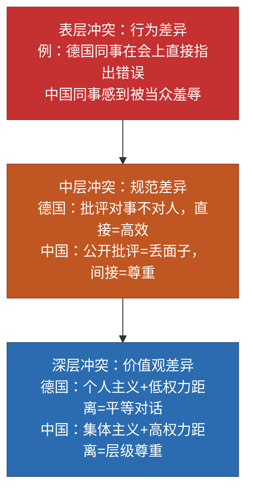
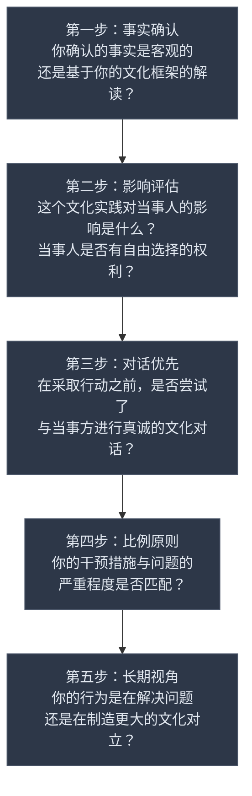
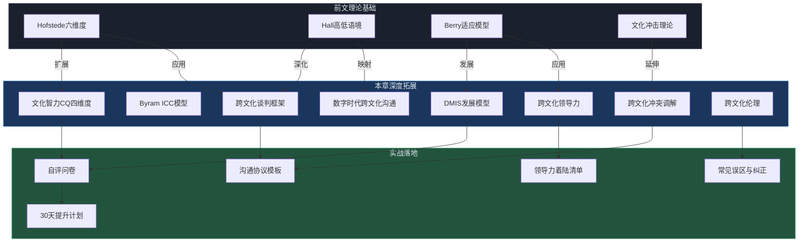

# 跨文化沟通 — 深度拓展

> 前文已建立跨文化沟通的理论基础（Hofstede文化维度、Hall高低语境、Berry适应模型）和核心技巧（文化敏感度培养、语言调整、非语言适应、信任建立、误解处理）。本章在此基础上深入八个方向：**前沿理论模型的交叉应用**、**高阶实战场景的系统拆解**、**数字时代的跨文化新挑战**、**跨文化领导力的系统建设**、**伦理困境的决策框架**、**可落地的自评与训练工具**、**常见误区与纠正**、**延伸阅读与工具推荐**。每一个知识点都指向"能用"，而非"知道"。

---

## 一、超越经典：跨文化能力的多维测量框架

### 1.1 为什么经典理论不够用

Hofstede的六维度模型和Hall的高低语境理论是入门的基石，但在实际应用中存在三个结构性盲区：

**盲区一：国家 ≠ 文化个体。** Hofstede的数据以国家为单位，但同一个国家内部的文化差异可能比国家间差异更大。中国的北京与云南、美国的纽约与阿拉巴马、印度的班加罗尔与比哈尔邦，在权力距离和个人主义维度上差异显著。用国家分数代表个体，是"生态学谬误"（ecological fallacy）。2018年的一项研究对比了中国一线城市和三线城市青年在个人主义维度上的得分，发现差距高达1.2个标准差——这比中国和韩国的国家间差异还大。

**盲区二：静态维度无法捕捉动态适应。** Berry的适应模型描述了四种策略（整合、同化、分离、边缘化），但没有回答"如何从分离走向整合"的过程机制。一个在日本工作三年的美国人，他的文化能力是如何逐月累积的？在哪些关键节点发生了质变？经典理论对此无能为力。

**盲区三：缺少"能力"视角。** 知道文化差异不等于能处理文化差异。你需要从"知识"转向"能力"——不仅要问"中日文化有什么不同"，更要问"我能不能在中日合作项目中有效沟通"。一个研究中国文学的美国学者可能对中国文化知识储备极丰富，但在实际商务沟通中仍然手足无措——因为知识和能力之间存在巨大的转化鸿沟。

### 1.2 Byram的跨文化交际能力模型（ICC Model）

Michael Byram提出的跨文化交际能力模型是目前学术界最完整的能力框架之一，包含五个相互关联的维度：

| 维度 | 英文 | 核心含义 | 典型表现 |
|------|------|---------|---------|
| 知识 | Knowledge | 了解本国和对方国家的社会制度、文化习俗、历史背景 | 知道日本商务名片交换的礼仪规范，知道中东斋月期间的工作节奏变化 |
| 技能 | Skills | 解释和关联不同文化信息的能力（分为"解释技能"和"发现技能"） | 能将日本人的沉默解读为深思而非拒绝；能通过观察当地人的日常行为推断未明说的社会规范 |
| 态度 | Attitudes | 好奇心、开放性、悬置判断的意愿（法语savoir être） | 面对不理解的行为先问"为什么"而非"怎么这样"；对陌生文化习俗保持好奇而非排斥 |
| 批评性文化意识 | Critical Cultural Awareness | 用批判性视角审视本国和对方文化的价值观与实践 | 能反思"效率至上"本身是一种文化偏好而非普世标准；能识别商业实践中的文化霸权 |
| 体认 | Savoir-être | 在真实互动中展现出的文化共情和适应力 | 在中东商务场合自然调整肢体语言和社交节奏；在北欧会议上主动压缩寒暄时间 |

这五个维度不是独立的，而是相互支撑的。一个只有知识但缺乏态度的人，会变成"文化知识的炫耀者"而非"跨文化沟通者"。Byram特别强调**批评性文化意识**——它要求你不只是理解差异，还要能质疑所有文化（包括自己的）中的权力结构和隐含假设。

**实战案例：Byram模型的诊断应用**

某中德合资企业的德方技术总监Hans，中文流利，对中国历史如数家珍（知识维度极高），但在团队管理中频繁引发冲突。用Byram模型分析后发现问题出在"态度"和"批评性文化意识"两个维度：Hans习惯用德国标准评判中国同事的工作方式，认为中国同事的"不直接反馈"是"不专业"的表现。他的知识没有转化为跨文化理解，反而成了"用你的文化来教训你"的武器。

干预方案：安排Hans参加"文化反思工作坊"，让他体验在德国文化规范下被评判的感受（角色互换练习）。三个月后，Hans开始将中国同事的间接反馈风格视为一种"关系维护策略"而非"低效表现"，团队满意度提升了40%。

### 1.3 Deardorff的过程模型

Darla Deardorff在2006年通过对跨文化领域23位专家的德尔菲研究，提出了一个以"过程"为核心的能力模型。她的模型强调跨文化能力是一个**从内到外的渐进过程**：

Deardorff的关键洞见是：**跨文化能力的起点是"态度"而非"知识"**。一个对异文化持开放态度但知识不足的人，比一个知识丰富但态度封闭的人，更容易发展出真正的跨文化能力。这解释了为什么有些"文化专家"在实际跨文化互动中表现糟糕——他们的知识储备无法弥补态度上的封闭。

**Deardorff模型的实际应用价值：** 这个模型告诉你，培训跨文化能力时，不要一上来就灌输知识（"美国人的特点是……"），而是先从态度入手——让学员体验文化多样性带来的丰富感而非威胁感。先建立"差异是资源"的心态，再输入知识和技能，效果会好得多。

### 1.4 文化智力（Cultural Intelligence, CQ）四维度详解

P. Christopher Earley和Soon Ang提出的文化智力（CQ）是目前组织行为学领域应用最广泛的跨文化能力测量框架。CQ的核心假设是：**跨文化能力不是人格特质，而是一种可以测量和提升的智力**。CQ包含四个维度，每个维度都有具体的提升路径：

**元认知CQ（Metacognitive CQ）——"知道自己不知道"**

这是最高阶的维度，指的是在跨文化互动中对自身思维过程的觉察和调控能力。高元认知CQ的人在对话中会持续自问："我现在的假设是什么？这个假设在我的文化中成立，但在对方文化中是否同样成立？"

提升方法：
- 每次跨文化互动后写"文化反思日志"，记录自己的假设、判断和实际结果之间的差距
- 在做跨文化决策前，强制自己列出至少三种可能的文化解读
- 寻找一位跨文化"镜子"——一位能指出你文化盲点的伙伴，定期交流
- 练习"文化暂停"：在跨文化互动中遇到困惑时，先停3秒，问自己"我是不是在用自己的文化框架解读这个行为？"

**认知CQ（Cognitive CQ）——"知道的够多"**

指对不同文化的知识储备，包括价值观体系、社会规范、法律制度、宗教信仰、沟通风格等。与Byram的"知识"维度对应。

提升方法：
- 系统学习目标文化的"文化语法"——不仅知道"做什么"，更知道"为什么这样做"
- 阅读目标文化的文学作品和电影（比教科书更能传达文化"味道"）
- 学习目标文化的历史关键时刻——理解一个文化对"创伤"和"骄傲"的记忆
- 掌握目标文化的基本语言——即使只是100个核心词汇，也能传递尊重和诚意

**动机CQ（Motivational CQ）——"真的想去"**

指投入跨文化互动的内在驱动力和自我效能感。很多人有知识但缺乏行动的勇气——知道日本人重视礼节，但在实际场景中仍然用自己习惯的方式沟通。

提升方法：
- 从低风险场景开始练习（如与外国同事共进午餐），逐步提升难度
- 设定具体的跨文化目标（如"本月主动与三位不同文化背景的同事深入交流"）
- 将跨文化互动与个人成长目标关联（如"这是我领导国际化团队的必经之路"）
- 加入跨文化社群（国际读书会、语言交换小组），创造自然的练习机会

**行为CQ（Behavioral CQ）——"做得出来"**

指在跨文化情境中展现出适当语言和非语言行为的能力。这是"知行合一"的最终体现。

提升方法：
- 观察并模仿跨文化高手的行为模式（语速、措辞、肢体语言的调整）
- 在安全环境中进行角色扮演（如模拟日本商务会议场景、中东社交晚宴）
- 学习目标文化的基本非语言行为规范（目光接触距离、手势含义、身体朝向）
- 录制自己在跨文化场景中的表现，回放分析自己的行为模式和改进空间

**CQ四维度的协同关系：** 四个维度不是独立提升的，而是相互强化的。认知CQ（知识）为元认知CQ（反思）提供素材；动机CQ（驱动力）推动行为CQ（实践）的发生；行为CQ的实践结果又反过来丰富认知CQ的积累。一个完整的CQ发展循环是：学习→反思→尝试→调整→再学习。

### 1.5 四大模型的交叉应用：构建你的跨文化能力画像

这四个模型不是互相替代的，而是互相补充的。它们分别回答了不同的问题：

| 模型 | 回答的问题 | 核心贡献 | 适用场景 |
|------|----------|---------|---------|
| Byram ICC | "我在跨文化交际中的具体能力维度是什么？" | 五维度细分，强调批评性文化意识 | 语言教育、跨文化培训设计 |
| Deardorff过程模型 | "跨文化能力是如何发展的？" | 从态度到行为的渐进路径 | 培训课程设计、能力发展规划 |
| CQ文化智力 | "我的跨文化智力水平有多高？" | 可量化测量，四个维度可分别提升 | 组织招聘、人才评估、个人发展 |
| DMIS发展模型 | "我处在跨文化敏感度的哪个阶段？" | 六阶段发展路径，从民族中心到民族相对 | 心理咨询、长期个人发展 |

**实操建议：** 用CQ问卷做量化自评（了解"在哪"），用DMIS模型定位自己的发展阶段（了解"哪个阶段"），用Byram模型识别具体的能力短板（了解"缺什么"），用Deardorff模型制定发展路径（了解"怎么走"）。

### 1.6 语言与思维：跨文化沟通的认知底层

语言不仅仅是沟通工具，它深刻影响着我们感知和组织世界的方式。理解语言与思维的关系，是跨文化沟通的深层基础。

**Sapir-Whorf假说的现代解读**

语言相对论（linguistic relativity）认为，语言结构影响说话者的思维方式和认知习惯。现代研究已经放弃了"语言决定思维"的强版本，但大量实验证据支持"语言影响思维"的弱版本：

- **时间隐喻：** 英语中时间是水平轴（"look forward to"、"back in the day"），中文中时间也可以是垂直轴（"上个月"、"下星期"）。研究发现，中文母语者在处理时间关系时，垂直空间隐喻的反应速度更快。
- **颜色感知：** 俄语有两个基本词分别表示浅蓝（голубой）和深蓝（синий），实验证明俄语母语者区分这两种蓝色的速度比英语母语者快约100毫秒。
- **因果表达：** 英语倾向于强调施事者（"He broke the vase"），西班牙语和日语更常用非施事结构（"The vase broke itself"）。研究发现，英语母语者更倾向于记住"谁做的"，而日语母语者更关注"发生了什么"。
- **空间参考系：** 英语和中文主要使用"自我中心"参考系（left/right），而澳大利亚原住民Guugu Yimithirr语使用"绝对"参考系（东南西北）。使用绝对参考系的语言使用者拥有异常精确的方向感。

**对跨文化沟通的实战启示：**

| 语言差异维度 | 沟通影响 | 实操建议 |
|-------------|---------|---------|
| 敬语系统复杂度 | 韩语/日语的敬语层级反映并强化了等级关系。简单翻译会丢失层级信息 | 在翻译敬语时添加语用注释（如"此处使用了对上级的正式敬语"） |
| 假设表达方式 | 英语用虚拟语气（"If I were you"），中文用"如果我是你"——前者暗示不可能，后者更接近真实假设 | 在谈判中注意对方条件句的使用——"如果"的确定程度因语言而异 |
| 否定策略 | 日语中否定往往放在句末，整个句子的倾向要到最后才知道 | 与日语母语者沟通时，耐心听完整句再做回应，不要根据前半句预判 |
| 沉默的功能 | 芬兰语文化中沉默是舒适的；日语文化中沉默可以表示深思、拒绝或尊重 | 在会议中为沉默型文化成员提供书面反馈渠道，不要把沉默等同于无意见 |

---

## 二、跨文化谈判：超越"双赢"的文化博弈

### 2.1 谈判风格的文化光谱

谈判是跨文化沟通中最具张力的场景。不同文化在谈判的底层逻辑上存在根本差异，这些差异不是"风格偏好"，而是"世界观差异"。

| 谈判维度 | 关系导向文化（中国、日本、中东、拉美） | 任务导向文化（美国、德国、北欧、澳洲） |
|---------|--------------------------------------|--------------------------------------|
| 谈判起点 | 先建关系，再谈业务。没有信任基础的商务提案几乎没有成功可能 | 先谈业务，关系自然形成。好的产品和价格就是最好的关系基础 |
| 信息交换 | 渐进式，通过多次互动建立信任后才分享核心信息 | 早期就分享关键数据和条件，透明度本身是信任的信号 |
| 决策速度 | 慢——需要内部共识和关系铺垫，"拍板"往往发生在非正式场合 | 快——授权代表可直接拍板，会议本身就是决策场所 |
| 合同观念 | 合同是关系的起点，可随情况变化调整；关系比合同更重要 | 合同是最终承诺，签署后具有法律约束力；合同就是关系 |
| 冲突处理 | 倾向间接——通过中间人、暗示、沉默表达不满 | 倾向直接——明确提出问题并寻求解决方案 |
| 让步模式 | 在最后阶段才做关键让步，让步需要"面子"和"理由" | 早期就亮出底线，让步基于逻辑和利益权衡 |
| 时间观念 | 多线程并行，同时推进多个议题；时间是弹性的 | 单线程推进，按议程逐项讨论；时间是刚性资源 |

### 2.2 跨文化谈判的实战框架

一个经过验证的跨文化谈判框架包含五个阶段，每个阶段都有文化敏感点需要关注：

**阶段一：准备——文化地图绘制**

在谈判开始前，完成一份"文化地图"，涵盖以下维度：

文化地图检查清单
├── 对方的决策机制（个人决策 vs. 集体共识）
│   └── 关键问题：谁是真正的决策者？正式头衔还是实际影响力？
├── 对方的权力距离（谁能拍板？谁是真正的决策者？）
│   └── 关键问题：我方的级别是否需要匹配对方？
├── 对方的时间观念（单线程 vs. 多线程；严格守时 vs. 弹性时间）
│   └── 关键问题：我应该准备多少时间？是否需要预留弹性？
├── 对方的信任建立方式（任务信任 vs. 关系信任）
│   └── 关键问题：首次见面应该侧重谈业务还是建立个人关系？
├── 对方的沟通风格（直接 vs. 间接；数据驱动 vs. 故事驱动）
│   └── 关键问题：对方说"是"是否真的意味着同意？
├── 对方的面子需求（哪些话题/行为可能造成"丢面子"？）
│   └── 关键问题：有哪些场合必须给对方台阶下？
├── 对方的文化禁忌（宗教、政治、历史敏感话题）
│   └── 关键问题：有哪些话题绝对不能碰？
└── 对方的商业礼仪（称呼、名片、着装、宴请规范）
    └── 关键问题：着装风格、称呼方式、座次安排？

**阶段二：开场——建立文化桥梁**

开场的方式需要根据对方文化调整。关键原则：**开场的目的是降低对方的"文化焦虑"**。让对方感到"这个人理解我们的做事方式"，是后续谈判顺利的基础。

不同文化的开场策略对比：

| 文化背景 | 开场策略 | 时长建议 | 关键动作 |
|---------|---------|---------|---------|
| 日本 | 交换名片→公司历史→共同关系网络 | 20-30分钟 | 双手递接名片，认真阅读，放在桌上 |
| 中国 | 茶叙→寒暄→试探性话题→进入正题 | 30-45分钟 | 准备好被邀请吃饭，了解座次文化 |
| 德国 | 简短握手→直接进入议程 | 5分钟以内 | 准时到达，准备好所有资料 |
| 美国 | 简短寒暄→快速进入主题 | 5-10分钟 | 展现自信和专业，但不要过于正式 |
| 中东 | 咖啡/茶→长时间社交→逐渐转入话题 | 30-60分钟 | 不要拒绝咖啡，不要急于谈业务 |
| 北欧 | 简短自我介绍→高效进入议题 | 5分钟以内 | 平等姿态，不要展示等级差异 |

**阶段三：信息交换——读"空气"**

在信息交换阶段，需要区分对方表达的"字面意思"和"真实意图"。高语境文化的谈判者可能说"我们需要进一步研究"来表示拒绝，说"这很困难"来表示"这需要你给出更好的条件"。

实用技巧：
- 注意对方的沉默——在高语境文化中，沉默可能意味着"我在思考"、"我不同意但不便直说"或"我在等你主动让步"
- 观察对方团队成员之间的互动——真正的决策者往往不说话，但说话的人会频繁看他
- 注意对方的时间压力——如果对方反复强调"不急"，可能意味着他们有更多替代选项
- 记录对方的"软性表述"并翻译为"硬性意图"——"我们对此很感兴趣"可能只是礼貌，不代表购买意向

**高语境文化中常见表述的真实含义速查表：**

| 对方的表述 | 字面意思 | 真实含义（可能性从高到低） |
|-----------|---------|------------------------|
| "这很有趣" | 对此有兴趣 | 礼貌回应/需要更多信息/婉拒 |
| "我们需要研究一下" | 在考虑中 | 请给我时间说服内部决策者/我需要找借口拒绝你 |
| "原则上同意" | 同意 | 细节上还有重大分歧需要讨论 |
| "可能有些困难" | 有难度 | 基本不可能，除非你给出非常优厚的条件 |
| "我们再联系" | 之后会沟通 | 大概率不会主动联系你 |
| "这个想法很有创意" | 好的想法 | 这不切实际 |

**阶段四：让步与协商——文化节奏感**

让步的节奏是跨文化谈判中最容易犯错的环节。在美国文化中，"你让一步我让一步"的互惠模式是标准操作。但在中国文化中，关键让步往往发生在关系建立充分之后的"最后一刻"，过早让步可能被解读为"还有空间"。

高阶策略：
- 使用"如果-那么"结构提出让步，避免单方面让步造成误读
- 在关系导向文化中，让步时附带一个"人情"（如"我帮你争取到了这个条件，下次你帮我引荐贵公司总裁"）
- 在任务导向文化中，让步时附带一个"条件"（如"如果付款周期缩短到30天，我们可以接受这个价格"）
- 避免在第一次谈判中就给出最低价——在关系导向文化中，谈判本身就是关系建立的过程

**阶段五：收尾——确认理解的一致性**

跨文化谈判的合同签署不是终点。在关系导向文化中，合同签署后的第一次执行才是真正的"谈判开始"——对方会通过你是否信守承诺来评估你是否值得长期合作。

收尾关键动作：
- 用书面形式确认口头达成的所有共识（避免"记忆差异"）
- 明确约定合同修订的流程（关系导向文化可能期望合同有弹性空间）
- 确定后续沟通的频率和方式（定期沟通本身就是关系维护）
- 签约后立即执行一个小承诺（如在约定时间内发送会议纪要），建立"信守承诺"的第一印象

### 2.3 案例拆解：一次中美并购谈判的文化冲突复盘

**背景：** 2019年，一家中国科技公司计划收购一家硅谷初创企业。中方派出副总裁带队的5人谈判团，美方由CEO和CFO出面。

**冲突节点一：开场阶段。** 中方在首次会议安排了45分钟的公司介绍和历史回顾，美方CEO在第15分钟开始频繁看手表。中方将此解读为"不尊重"，美方将中方的冗长介绍解读为"浪费时间"。

**根本原因：** 中方的开场策略是建立关系信任（"你们应该了解我们是谁，才能信任我们"），美方的策略是效率导向（"我们已经做过尽调，直接谈条件"）。

**冲突节点二：信息交换阶段。** 中方副总裁在会议上多次表示"这个条件我们需要进一步研究"，美方CEO将此理解为"继续推进"，发来了更详细的提案。中方实际意图是"这个条件我们无法接受"。

**根本原因：** 高语境（中方）vs. 低语境（美方）的沟通方式碰撞。中方的"间接拒绝"被美方误读为"还在考虑"。

**冲突节点三：让步阶段。** 美方在第二轮谈判中主动降价8%，并要求中方同步让步。中方没有回应，美方感到"被利用"。中方的逻辑是"你降价说明你有空间，我为什么要马上让步？等关系更深入再谈"。

**调解方案：** 双方引入了一位美籍华人顾问作为"文化翻译官"。顾问帮助美方理解中方的关系建立逻辑，帮助中方理解美方的效率诉求。最终方案：中方在第三次会谈中安排了一次非正式晚宴（满足关系需求），在晚宴后的第二天进入实质条件讨论（满足效率需求）。交易在第4次正式会谈后达成。

**关键教训：** 跨文化谈判中最大的风险不是"对方不理解你的条件"，而是"双方用不同的文化规则玩游戏却不自知"。

### 2.4 行业差异化谈判策略

不同行业有其独特的跨文化谈判特征，一刀切的方法会导致严重误判：

| 行业 | 关键文化变量 | 典型挑战 | 适应策略 |
|------|------------|---------|---------|
| 科技/互联网 | 创新速度vs.决策层级 | 硅谷的"快速迭代"文化 vs. 东亚的"充分论证"文化 | 用MVP（最小可行产品）语言替代"试错"——"先验证核心假设"比"试一下"更易被接受 |
| 金融/投资 | 风险偏好vs.关系信任 | 西方的"数据驱动决策" vs. 中东/亚洲的"关系驱动决策" | 准备双轨材料：一份数据详尽的技术报告 + 一份讲述团队故事的软性材料 |
| 制造业 | 质量标准vs.成本控制 | 德国的"质量至上" vs. 新兴市场的"性价比优先" | 用TCO（总拥有成本）框架替代单纯的价格比较，将质量论证为长期成本节约 |
| 医药/生命科学 | 合规要求vs.审批速度 | 美国FDA的严格流程 vs. 某些市场的"灵活"审批 | 永远以最严格的标准为底线——合规是红线，不能以"当地惯例"为由降低标准 |
| 能源/基建 | 政府关系vs.技术标准 | 中东/非洲项目的政治风险 vs. 欧洲项目的技术合规 | 在高政治风险市场，将"关系建设"视为与"技术方案"同等重要的交付物 |

---

## 三、跨文化冲突调解：从"灭火"到"防火"

### 3.1 文化冲突的三层结构

跨文化冲突不是表面的"误解"，而是深层结构的碰撞。理解冲突的层次有助于选择正确的应对策略：

大多数跨文化冲突调解失败，是因为只在表层处理（"下次请注意方式"），而没有触及中层和深层的规范与价值观差异。

### 3.2 文化冲突调解五步法

**第一步：暂停——识别文化因素**

当冲突发生时，第一个动作不是解决问题，而是暂停并问自己："这到底是个人行为问题，还是文化模式的碰撞？" 这个判断至关重要——如果是文化模式问题，用个人行为问题的方式处理（如"你需要改改你的态度"）不仅无效，还会加剧冲突。

判断方法：问自己"如果对方的整个文化群体在这个场景下都会这样做，这还是个人问题吗？" 如果答案是否定的，就需要用文化视角来处理。

**"文化因素还是个人因素"快速判断清单：**

□ 这个行为是否在对方文化中被视为正常或值得鼓励的？
  → 是：大概率是文化模式
  → 否：可能是个人行为

□ 这个冲突是否在不同文化背景的同事之间反复出现类似的模式？
  → 是：文化模式
  → 否：个人因素

□ 对方是否表现出困惑（"我不明白为什么他们生气了"）？
  → 是：文化盲点（无意识的文化差异）
  → 否：可能是有意为之（个人态度问题）

□ 当你向对方解释对方文化的感受时，对方是否表示愿意调整？
  → 是：文化差异（愿意调整说明不是态度问题）
  → 否：个人态度问题

**第二步：翻译——为双方解释文化逻辑**

调解者的核心角色是"文化翻译官"——不是翻译语言，而是翻译行为背后的文化逻辑。具体操作：

- 对感到被冒犯的一方："他直接指出错误，在他的文化中这被视为对你的尊重——他认为你足够专业，可以接受直接反馈。这在他的工作环境中是正常且受到鼓励的行为。"
- 对不知自己冒犯了谁的一方："在她的文化中，公开指出错误会让人感到'丢面子'，这不是能力问题，而是社交规则。你可以把同样的反馈私下告诉她，她会非常感激你的体贴。"

**翻译时的关键原则：** 不要说"你错了"或"你应该……"。双方都没有错——他们只是在用不同的文化规则玩游戏。调解者的任务是让双方看到"规则的多样性"，而不是评判"谁的规则更好"。

**第三步：协商——建立团队的"第三文化"**

不要试图让一方适应另一方的文化，而是共同创建一套新的团队规范。这个过程的关键是让双方都参与制定规则，而不是由一方（通常是权力更大的一方）单方面决定。

"第三文化"的协商原则：
- 基于"对双方都公平"而非"谁权力大谁说了算"
- 优先选择"可执行"而非"完美"的方案
- 允许"场景化"规则——不同场合可以有不同的规范
- 定期回顾和修订——团队组成变化时规则也需要更新

**第四步：制度化——将共识转化为可执行的流程**

口头共识容易遗忘。将协商结果转化为具体的团队协议：

跨文化团队沟通协议模板
────────────────────────
1. 反馈规范
   - 公开场合：只讨论问题本身，不涉及个人能力判断
   - 私下场合：可以更直接地讨论个人表现
   - 书面反馈：先说做得好的地方，再说需要改进的地方（"三明治"原则）
   - 紧急反馈：若需要立即指出问题，使用"我观察到……"而非"你做错了……"

2. 决策规范
   - 重要决策：提前24小时发送议题，给大家思考时间
   - 会议中：鼓励不同意见的表达，沉默不代表同意
   - 会后确认：书面记录达成的共识和待办事项
   - 分歧处理：若无法达成共识，引入第三方调解或升级至管理层

3. 时间规范
   - 会议准时开始，允许5分钟缓冲
   - 跨时区会议轮换时区，不让同一地区的人永远在深夜参会
   - 异步沟通留足24小时回应窗口

4. 冲突升级路径
   - 第一步：当事人私下沟通（48小时内）
   - 第二步：引入文化调解人（一周内）
   - 第三步：团队公开讨论（有引导者）
   - 第四步：管理层介入

**第五步：复盘——从冲突中提取学习素材**

每次文化冲突都是团队的学习机会。在冲突解决后的一周内，安排一次15分钟的团队复盘，讨论："我们从这次经历中学到了什么？我们的团队协议需要更新吗？"

复盘的关键问题：
- 这次冲突的根本原因是什么？（行为层？规范层？价值观层？）
- 我们的调解流程是否有效？哪些环节可以改进？
- 是否有类似冲突的早期信号被我们忽略了？
- 团队成员从这次经历中学到了什么关于其他文化的认知？

### 3.3 常见文化冲突场景速查表

| 冲突场景 | 文化A的解读 | 文化B的解读 | 调解要点 |
|---------|-----------|-----------|---------|
| 会议上被直接批评 | "他不尊重我"（东亚） | "他在帮我们提高效率"（德国/美国） | 解释"直接≠不尊重"的文化逻辑，建立反馈规范 |
| 会议上长时间沉默 | "他不同意但不直说"（美国） | "我在认真思考"（日本/芬兰） | 在团队协议中明确"沉默≠同意"或"发言邀请"机制 |
| 开会迟到10分钟 | "他不重视这件事"（德国/日本） | "10分钟很正常"（巴西/印度） | 建立"准时文化"的团队共识，但允许合理范围的弹性 |
| 用邮件抄送了上级 | "他在告状/施压"（美国） | "这是正常的汇报流程"（中国/日本） | 明确抄送规则：什么情况需要抄送，抄送的目的是什么 |
| 社交场合拒绝喝酒 | "他不给面子"（中国） | "这是个人选择"（欧美） | 建立"尊重个人边界"的团队文化，提供非酒精替代选项 |
| 下班后不回消息 | "他不负责任"（日本/韩国） | "这是我的私人时间"（北欧/法国） | 明确紧急/非紧急消息的定义和期望回应时间 |

### 3.4 跨文化冲突的预防机制

与其事后调解，不如事前预防。以下是经过验证的冲突预防机制：

**机制一：文化入职培训（Cultural Onboarding）**

新成员加入跨文化团队时，不仅要了解业务流程，还要了解团队已建立的"第三文化"规范。培训内容包括：团队的沟通协议、已发生的典型文化冲突案例及解决方案、团队成员的文化背景简介。时长建议：2-3小时，包含互动环节。

**机制二：文化伙伴制度（Cultural Buddy System）**

为每位新成员分配一位"文化伙伴"——最好是与新成员文化背景不同但沟通能力较强的团队成员。文化伙伴的职责：在前30天内主动帮助新成员理解团队的文化规范，在新成员做出可能引发文化误解的行为时私下提醒，定期与新成员交流文化适应体验。

**机制三：定期文化温度检查（Cultural Temperature Check）**

每月或每季度进行一次10分钟的匿名问卷调查，了解团队成员对跨文化沟通的满意度。关键问题包括："你是否遇到过因文化差异而感到不舒服的情况？""你是否觉得自己的文化背景在团队中得到了尊重？""你对团队的沟通规范有什么改进建议？"结果由团队领导汇总并公开讨论改进措施。

---

## 四、数字时代的跨文化沟通：AI、远程与算法

### 4.1 远程跨文化团队的沟通陷阱

远程工作模式放大了跨文化沟通中的隐性障碍。当团队成员分布在不同国家时，以下陷阱需要特别警惕：

**陷阱一：文字沟通的"语调真空"。** 在面对面沟通中，语调、表情和肢体语言传递了大量情感信息。当这些线索消失后，不同文化背景的人会用自己的文化框架来"脑补"缺失的语调。一个美国同事发的"OK."，在中国同事看来可能是"他不太满意"，而在德国同事看来只是"收到确认"。

应对策略：
- 在文字沟通中明确表达情感状态（如"这个方案很不错，我对结果很满意！"而非仅回复"OK"）
- 重要信息使用视频而非文字传达
- 建立"善意推定"的团队规范——默认对方的意图是积极的
- 使用表情符号辅助传达语调，但要注意emoji的文化差异（详见4.3节）

**陷阱二：时区不平等。** 跨时区团队中，总有人需要在深夜或凌晨参加会议。不同文化对"谁来牺牲"的期望不同。在权力距离大的文化中，通常是下属适应上级的时区；在平等主义文化中，时区轮换是常见做法。

应对策略：
- 记录过去三个月的会议时间分布，检查是否存在系统性的时区不平等
- 对需要在深夜参会的成员提供补偿（如次日弹性工作时间）
- 使用异步工具（Loom录制视频消息、Notion文档协作、Miro在线白板）减少实时会议需求
- 将关键决策会议安排在对所有参与者都合理的"黄金时段"

**陷阱三：数字平台的文化偏见。** 主流协作工具的设计隐含了西方文化假设。Slack的"反应emoji"鼓励即时回应，但这与日本文化中"深思后回应"的习惯冲突。Zoom的"举手"功能假设所有人对打断他人持相同态度。

应对策略：
- 在团队中明确讨论并协商数字工具的使用规范
- 允许成员使用自己习惯的工具（如中国成员可能更习惯企业微信的沟通方式）
- 为异步沟通留出充足的时间窗口（建议至少24小时）
- 在会议中设置"安静思考时间"——给出2-3分钟的沉默时间，让需要思考的成员有机会组织想法

**陷阱四：虚拟办公室的"在场偏见"。** 在混合办公模式下，办公室员工与远程员工之间的信息不对称会被放大。在高语境文化中，大量重要信息通过"走廊对话"和"午餐闲聊"传递，远程员工完全错过这些信息。

应对策略：
- 建立"数字优先"原则：所有重要讨论必须在共享平台上进行
- 安排"虚拟走廊时间"——每天固定的非正式视频聊天窗口
- 指定"信息桥梁人"——负责将办公室讨论同步给远程成员
- 使用共享文档记录所有决策过程，让远程成员可以回溯

### 4.2 AI时代的跨文化沟通：新工具、新陷阱

2023年以来，以ChatGPT为代表的大语言模型（LLM）正在深刻改变跨文化沟通的格局。AI既是赋能工具，也是新的陷阱来源。

**AI赋能跨文化沟通的三个方向：**

**方向一：实时翻译与文化注释。** AI翻译工具（DeepL、Google Translate、ChatGPT翻译）的翻译质量已经达到了"可用"水平。更重要的是，新一代AI不仅能翻译字面意思，还能提供文化注释。你可以让ChatGPT翻译一封日文商务邮件，同时解释"这段话中的'ご検討ください'在这里是委婉拒绝而非真的请你考虑"。

**方向二：跨文化沟通辅助。** 你可以用AI模拟跨文化沟通场景进行练习。例如，让ChatGPT扮演一位日本客户，练习如何在不直接拒绝的情况下表达异议。AI可以即时反馈你的沟通方式是否符合目标文化的规范。

**方向三：文化研究助手。** AI可以快速汇总目标文化的关键信息——商务礼仪、禁忌话题、节日安排、谈判风格等。虽然这些信息需要通过实际经验验证，但作为起点比翻阅教科书高效得多。

**AI翻译工具的三个关键陷阱：**

**陷阱一：语义翻译 vs. 语用翻译。** AI可以准确翻译字面意思，但很难翻译"言外之意"。日语中的"ちょっと…"被翻译为"a little..."，但其真实含义（委婉拒绝）完全丢失。阿拉伯语中的"Inshallah"（如果真主愿意）被翻译为"God willing"，但在商务语境中它常常意味着"这件事大概率不会发生"。

**陷阱二：正式度的失配。** 不同语言有复杂的敬语系统。AI翻译往往无法正确处理韩语的敬语层级（존댓말/반말）或日语的敬语体系（尊敬语/谦让语/丁宁语），导致翻译结果在礼貌程度上严重失配。一封需要使用正式敬语的邮件可能被翻译成过于随意的语气。

**陷阱三：文化隐喻的不可译性。** 中文的"关系"、日语的"空気を読む"（读空气）、德国的"Weltanschauung"（世界观）、丹麦的"hygge"（温馨舒适感）、葡萄牙语的"saudade"（一种混合了怀旧和忧伤的复杂情感），这些词汇承载的文化内涵无法通过简单翻译传达。

**使用AI翻译的最佳实践：**
- 重要商务沟通使用AI翻译作为初稿，再请双文化人士审校
- 对高语境文化的沟通，不要依赖翻译——直接学习对方语言的基本表达
- 在AI翻译中添加文化注释（如"此处'ちょっと'为委婉拒绝的表达"）
- 让AI帮你起草跨文化沟通内容时，明确指定目标文化、正式程度和沟通场景

**AI会议助手的跨文化风险：** 越来越多的企业使用AI工具（Otter.ai、Fireflies、腾讯会议AI助手）自动记录和总结会议。这些工具在跨文化场景中面临特殊挑战：
- 高语境文化中的"弦外之音"不会被AI捕捉——AI记录了日本同事说了"我们需要进一步研究"，但不会记录他说这句话时的表情和语气
- AI总结可能丢失文化敏感信息——一句"这个问题很有趣"在AI的总结中变成了"对方案表示兴趣"，但在实际场景中可能意味着"这个方案有问题"
- 不同文化对"被AI记录"的接受度不同——德国和北欧员工可能对隐私问题更敏感

### 4.3 社交媒体与数字通信的跨文化雷区

社交媒体将跨文化互动的频率提升了几个数量级，但也创造了新的冲突场景：

**雷区一：表情符号的文化差异。** 同一个emoji在不同文化中含义截然不同：

| 表情符号 | 美国/西欧解读 | 东亚解读 | 中东解读 |
|---------|-------------|---------|---------|
| 🙂 | 微笑友好 | 讽刺、冷嘲（中国年轻群体） | 一般正面 |
| 👍 | 赞同、OK | 勉强接受（在正式场合可能被认为不礼貌） | 在某些地区是冒犯性手势 |
| 😊 | 真诚微笑 | "呵呵"（中国微信语境，有嘲讽意味） | 正面 |
| 🙏 | 祈祷 | 感谢/合十（更接近原意） | 正面 |
| 🤘 | 摇滚/酷 | 无特殊含义 | 在某些地区有性暗示 |
| 👌 | OK/没问题 | 金钱/零 | 在某些地区有冒犯含义 |

**雷区二：在线争论的文化模式。** 西方社交媒体上的辩论风格（直接反驳、逻辑论证、引用数据）与东亚文化中"留面子"的沟通习惯严重冲突。一个德国网友在Twitter上直接指出你的逻辑错误，在他看来是正常讨论，在你看来可能是人身攻击。反过来，东亚用户的委婉批评可能被西方用户忽略——因为他们期待的是直接的观点碰撞。

**雷区三：时政话题的雷区。** 不同文化对政治、宗教、历史话题的敏感度差异巨大。在国际社交媒体上讨论台湾问题、南海争端、以色列-巴勒斯坦冲突、印巴关系等话题时，需要意识到你面对的是多元文化受众。一句在你看来无害的评论，可能触及他人的核心身份认同。

**雷区四：职场社交媒体的风格差异。** LinkedIn在不同文化中的使用风格差异显著。美国用户的LinkedIn帖子往往是个人成就展示（"我很高兴宣布……"），这在注重谦逊的东亚文化中可能被视为"炫耀"。日本用户很少在LinkedIn上发帖，更倾向于私信交流。

### 4.4 混合办公时代的跨文化沟通新规则

后疫情时代，混合办公成为常态。以下新规则适用于跨文化混合团队：

跨文化混合办公沟通手册
═══════════════════════

一、沟通渠道选择矩阵
┌──────────────┬───────────────┬───────────────────┐
│ 沟通类型      │ 推荐渠道       │ 文化注意事项       │
├──────────────┼───────────────┼───────────────────┤
│ 日常信息同步   │ 即时消息       │ 尊重对方的工作时间  │
│ 复杂问题讨论   │ 视频会议       │ 预留非正式寒暄时间  │
│ 重要决策       │ 视频+书面确认  │ 给高语境文化留出    │
│              │              │ 内部协商的时间窗口   │
│ 冲突处理       │ 视频一对一     │ 避免用文字处理冲突  │
│ 庆祝/认可     │ 团队视频+群消息│ 了解对方文化中认可   │
│              │              │ 的表达方式          │
└──────────────┴───────────────┴───────────────────┘

二、异步沟通最佳实践
1. 文字消息：写清背景、目的、期望回应时间
2. 视频消息（Loom等）：适合复杂说明，保留语调和表情
3. 文档协作：在文档中预留评论空间，鼓励异步讨论
4. 响应时间承诺：明确"紧急"（2小时内）、"重要"（24小时内）、
   "一般"（48小时内）的定义

三、视频会议中的跨文化礼仪
1. 麦克风礼仪：不说话时静音（所有文化都认同）
2. 摄像头策略：了解对方文化对开摄像头的态度
3. 发言顺序：主动邀请安静的成员发言（照顾高语境文化）
4. 会议时长：跨时区会议不超过90分钟，中间留休息
5. 会议纪要：24小时内发送，标注决策和待办事项

---

## 五、跨文化领导力：管理"看不见的文化层"

### 5.1 GLOBE研究的九维度领导力框架

GLOBE研究项目（Global Leadership and Organizational Behavior Effectiveness）是继Hofstede之后规模最大的跨文化研究，涵盖62个社会的领导力和文化数据。GLOBE将文化扩展为九个维度，并区分了"文化实践"（as is——这个文化实际上怎么做）和"文化价值观"（should be——这个文化认为应该怎么做）。

这个区分的实战意义在于：**两者之间存在"价值观差距"**。例如，中国文化的权力距离"实践"得分高（层级分明），但"价值观"得分并不特别高（很多人并不认为应该如此）。理解这个差距，可以帮你更准确地预测团队成员的行为——他们的行为可能受"实践"驱动而非"价值观"驱动。

GLOBE九维度速览：

| 维度 | 含义 | 高分文化特征 | 低分文化特征 |
|------|------|------------|------------|
| 权力距离 | 社会对权力分配不平等的接受度 | 层级分明，尊重权威 | 扁平化，鼓励质疑权威 |
| 不确定性规避 | 社会对模糊和不确定性的容忍度 | 规则详尽，流程严格 | 灵活应变，容忍模糊 |
| 体制集体主义 | 社会对集体行动和资源分配的重视 | 国家/组织福利优先 | 个人自由和竞争优先 |
| 群内集体主义 | 个人对家庭和亲密群体的忠诚度 | 家族/团队忠诚度高 | 个人独立性更强 |
| 性别平等主义 | 社会对性别角色差异的最小化程度 | 女性领导比例高 | 性别角色分工明确 |
| 决断性 | 社会对强势和竞争行为的鼓励程度 | 竞争激烈，鼓励进取 | 温和协商，避免对抗 |
| 未来导向 | 社会对未来规划和延迟满足的重视 | 长期投资，战略规划 | 活在当下，短期导向 |
| 绩效导向 | 社会对绩效提升和卓越表现的鼓励程度 | 结果导向，奖优罚劣 | 关系导向，注重和谐 |
| 人本导向 | 社会对公平、利他、慷慨行为的鼓励程度 | 重视员工福祉 | 重视效率和产出 |

**GLOBE的实践vs.价值观差距在管理中的应用：**

理解"实践"和"价值观"的差距，可以帮你避免两个极端错误：

第一个错误是**用"价值观"预测行为**。你可能认为"中国人推崇集体主义，所以他们一定喜欢团队决策"。但实际上，中国文化的集体主义更多体现在"群内集体主义"（对家庭和亲密圈子的忠诚），而非"体制集体主义"（对组织的忠诚）。一个中国员工可能在团队中表现得非常独立，但在家庭事务上高度集体主义。

第二个错误是**用"实践"固化刻板印象**。你可能认为"中东文化权力距离高，所以中东员工不需要参与式管理"。但GLOBE数据显示，中东社会的权力距离"价值观"得分并不特别高——很多人并不认为高度集权是理想的，他们只是在现有体制下采取了适应性行为。给这些员工参与决策的机会，他们往往表现出比预期更高的积极性。

**实操工具：GLOBE维度诊断表**

在管理跨文化团队前，针对每个GLOBE维度完成以下诊断：

对你的团队中每个文化群体，标注其在九个维度上的实践水平（高/中/低）：

文化群体A（如：中国）：
  权力距离实践：高    权力距离价值观：中
  不确定性规避实践：中  不确定性规避价值观：中
  ...（填写剩余维度）

文化群体B（如：美国）：
  权力距离实践：低    权力距离价值观：低
  不确定性规避实践：低  不确定性规避价值观：中
  ...（填写剩余维度）

关键差距识别：
- 哪些维度上两个群体差距最大？→ 这些是潜在冲突点
- 哪些维度上存在"实践vs.价值观"的显著差距？→ 这些是管理杠杆点
- 哪些维度上两个群体高度一致？→ 这些是团队共识基础

### 5.2 跨文化领导力的四象限模型

结合GLOBE研究和实际管理经验，跨文化领导力可以分为四个象限：

| | 高文化适应性 | 低文化适应性 |
|---|---|---|
| **高任务导向** | **文化整合型领导者** 能在不同文化中调整领导风格，同时确保任务完成。最理想的跨文化领导者类型。他们知道"什么必须坚持，什么可以调整"。 | **文化强制型领导者** 用自己的方式推进任务，不考虑文化差异。短期可能有效，长期必然引发冲突。"我的方式就是正确的方式"是他们的潜台词。 |
| **低任务导向** | **文化迎合型领导者** 过度适应当地文化，放弃原则和标准。团队感到舒适但缺乏方向。"入乡随俗"被他们理解为"什么都听对方的"。 | **文化隔绝型领导者** 既不适应文化也不推进任务。通常出现在外派失败的案例中。他们既不融入当地文化，也无法推动业务目标。 |

从"文化强制型"到"文化整合型"的转变，关键在于发展元认知CQ——不是放弃自己的领导风格，而是在保持核心原则的同时，调整表达方式和执行路径。

**四象限诊断问题：**
1. 当你的团队成员做了一件你认为"不对"的事情时，你的第一反应是什么？
   - A. "他们为什么这样做？背后有什么文化原因？"→ 文化整合型倾向
   - B. "我需要告诉他们正确的方式" → 文化强制型倾向
   - C. "也许我不应该干涉" → 文化迎合型倾向
   - D. "算了，不想管了" → 文化隔绝型倾向
2. 当你所在的文化中存在一些你不太认同的惯例时，你会怎么做？
   - A. 分析哪些可以接受，哪些需要通过讨论来调整 → 整合型
   - B. 直接推行我认为更好的方式 → 强制型
   - C. 全盘接受，不去思考 → 迎合型
   - D. 保持距离，不参与 → 隔绝型

### 5.3 外派领导者的"文化着陆"清单

外派领导者到达新文化后的前90天是关键窗口期。研究表明，外派失败的主要原因不是"能力不足"，而是"文化适应失败"——占外派失败案例的60%以上。

**第1-30天：观察与学习**
- 不急于改变任何现有流程，先观察团队的沟通模式、决策路径和非正式权力结构
- 找到3-5位"文化向导"——既了解当地文化又愿意诚实告诉你实情的团队成员
- 学习目标语言的20个关键商务用语（问候、感谢、道歉、认可、请求）
- 了解当地的工作节奏（午休习惯、加班文化、节日安排）
- 记录"文化惊讶日志"——每天记录一个让你感到意外的文化观察，并尝试理解其背后的文化逻辑

**第31-60天：建立信任**
- 与每位团队成员进行一对一的非正式交流，了解他们的职业目标和个人关切
- 参与至少两次当地的社交活动（如团队聚餐、社区活动、节日庆祝）
- 主动承认自己在文化方面的不足，展示学习的诚意
- 识别团队中隐藏的文化冲突点，但暂不处理，先收集信息
- 开始用当地语言进行简单的日常交流（即使不流利，努力本身就是尊重的信号）

**第61-90天：定向调整**
- 基于观察和信任基础，开始有选择地调整一两个团队流程
- 与团队共同制定新的沟通和协作规范（而非单方面推行）
- 建立定期的"文化反馈"机制——让团队成员能安全地指出你的文化盲点
- 评估自己在四个CQ维度上的发展需求，制定个人学习计划
- 寻找一位"逆向导师"——一位年轻的当地团队成员，帮助你理解年轻一代的文化视角

**常见外派失败模式及预防：**

| 失败模式 | 表现 | 根因 | 预防措施 |
|---------|------|------|---------|
| "蜜月期后幻灭" | 第1-2个月热情高涨，第3个月开始排斥当地文化 | 文化冲击未被预期和管理 | 提前了解文化冲击的五个阶段，建立支持网络 |
| "回音室效应" | 只与本国同胞社交，不融入当地 | 语言障碍和安全感需求 | 设定"每周至少参加一次本地社交"的硬性规则 |
| "救世主心态" | 认为自己的文化/管理方式更优越，急于"改变"当地团队 | 文化中心主义 | 每周写"文化欣赏日志"——记录三个当地团队做得好的地方 |
| "过度适应" | 完全放弃自己的领导风格，被当地文化同化 | 文化迎合型倾向 | 明确自己的"不可妥协"清单（3-5条核心原则） |

### 5.4 逆向文化冲击：回国后的"二次适应"

绝大多数跨文化文献只讨论"出国"的文化适应，却忽略了一个同样痛苦的过程——**逆向文化冲击（Reverse Culture Shock）**。当外派人员回国后，他们往往发现自己的祖国变得"陌生"了。这不是矫情，而是有充分心理学依据的真实现象。

**逆向文化冲击的五个阶段：**

| 阶段 | 特征 | 持续时间 | 典型内心独白 |
|------|------|---------|------------|
| 期待期 | 期待回国，想象一切都会很顺利 | 回国前1-2个月 | "终于要回家了，一切都会恢复正常的" |
| 蜜月期 | 刚回国时的兴奋感，享受熟悉的食物和环境 | 2周-1个月 | "这才是我熟悉的地方！" |
| 冲击期 | 发现自己与周围环境格格不入，怀念海外的生活方式 | 1-6个月 | "为什么大家不能理解我的想法？""为什么做事效率这么低？""我是不是变了太多？" |
| 调整期 | 逐渐接受变化，重新定位自己在国内的角色 | 3-12个月 | "我不需要完全回到从前，我可以把海外经验融入现在的生活" |
| 适应期 | 整合国内外经验，形成新的自我认同 | 6个月-2年 | "我是两种文化的桥梁，这是我的独特优势" |

**为什么逆向文化冲击比正向文化冲击更难应对：**

- **没有心理准备：** 出国前你会做文化准备，但回国时你以为"回家有什么难的"
- **缺乏支持系统：** 在国外你有外派社区和文化适应培训，回国后没人理解你的"不适应"
- **期望落差：** 你期望回国后一切如故，但你变了，环境也变了
- **身份困惑：** 你不再是"纯正的本国人"，但也不是"外国人"——你处在一种模糊的中间状态

**应对逆向文化冲击的实操建议：**

1. **预期管理：** 在回国前就告诉自己"适应需要时间"，不要期望第一天就感觉"正常"
2. **寻找同类：** 找到有类似海外经历的人交流——他们能理解你说的"我在这里感到格格不入"
3. **保持连接：** 与海外建立的跨文化网络保持联系，不要因为回国就切断这些关系
4. **价值转化：** 将海外经验转化为具体优势——跨文化视角、语言能力、国际视野，让"不同"变成"独特"
5. **给家人做心理建设：** 你的家人也需要适应"变了的你"——提前沟通你的变化，给他们适应的时间

---

## 六、跨文化敏感度自评与发展工具

### 6.1 Bennett的DMIS发展模型：你在哪一阶段？

Milton Bennett的跨文化敏感度发展模型（DMIS）描述了个体从"民族中心主义"到"民族相对主义"的六个阶段。了解自己所处的阶段，是发展的起点。

| 阶段 | 特征 | 典型内心独白 | 外在行为表现 | 发展建议 |
|------|------|------------|------------|---------|
| 否认期 | 不意识到文化差异的存在，或认为差异不重要 | "大家不都差不多吗？" | 用自己文化的逻辑解释所有行为 | 接触真实的多元文化环境，而非旅游式的文化体验 |
| 防御期 | 意识到差异但认为自己的文化更优越 | "他们怎么连这个都做不好？" | 对其他文化的负面刻板印象 | 学习一种其他文化的历史和价值观，理解其内在逻辑 |
| 最小化期 | 承认表面差异但认为深层价值观是相同的 | "其实人都是相通的" | 用"人类共性"掩盖文化差异 | 深入研究一种在价值观上与自己文化差异巨大的文化 |
| 接受期 | 承认并尊重文化差异，开始从对方视角看问题 | "他们这样做有他们的道理" | 主动学习和适应其他文化的行为规范 | 在真实跨文化场景中练习行为适应 |
| 适应期 | 能够在不同文化间灵活切换行为模式 | "在这种场合我应该调整我的方式" | 根据文化情境自然调整沟通方式 | 发展帮助他人进行文化适应的能力 |
| 整合期 | 能在文化交汇处创造新的意义和实践 | "我不属于任何单一文化，我是文化间的桥梁" | 创造融合多种文化元素的新实践 | 引导和培养他人的跨文化能力 |

大多数受过高等教育的人处于"最小化期"——他们认为自己尊重文化差异，但实际上仍然用自己的文化框架来解读一切。真正的突破发生在"接受期"——你开始承认自己的文化框架只是众多可能性中的一种。

**各阶段的"升级信号"：**
- 否认期 → 防御期：第一次感受到强烈的文化冲击或冲突
- 防御期 → 最小化期：开始发现其他文化中有"比自己文化做得更好"的地方
- 最小化期 → 接受期：第一次意识到"人并不都是相通的"——某些价值观差异是根本性的
- 接受期 → 适应期：第一次在跨文化场景中自然地调整了行为，且效果显著
- 适应期 → 整合期：开始在文化交汇处创造新的沟通方式或解决方案

### 6.2 跨文化能力自评问卷

以下20个问题可以帮助你快速评估自己在四个CQ维度上的水平。对每个问题诚实地给出1-5分（1=完全不符合，5=完全符合）。

**元认知CQ（问题1-5）**
1. 在跨文化互动中，我会主动意识到自己可能带有的文化偏见
2. 在做判断之前，我会检查自己是否在用自己的文化标准来衡量对方
3. 在跨文化沟通后，我会反思哪些假设是正确的、哪些是错误的
4. 当跨文化互动不顺利时，我能区分是文化因素还是个人因素导致的
5. 我会在跨文化互动前预判可能的文化差异点

**认知CQ（问题6-10）**
6. 我了解至少三种文化在沟通风格上的核心差异
7. 我知道不同文化在时间观念、权力距离、个人/集体主义上的基本倾向
8. 我了解目标文化的历史上对其国民心理产生重大影响的关键事件
9. 我能解释至少两种跨文化理论框架（如Hofstede、Hall、Berry）
10. 我了解不同文化在商务礼仪、社交规范和禁忌方面的差异

**动机CQ（问题11-15）**
11. 我享受与不同文化背景的人交流的过程
12. 面对跨文化挑战时，我倾向于将其视为学习机会而非障碍
13. 我愿意投入时间和精力来提升自己的跨文化能力
14. 在跨文化互动中遇到挫折时，我不容易放弃
15. 我主动寻找跨文化互动的机会

**行为CQ（问题16-20）**
16. 我能根据不同文化调整自己的肢体语言和表情
17. 在跨文化沟通中，我能调整自己的语速、音量和措辞
18. 当我的沟通方式不适合当前文化情境时，我能及时察觉并调整
19. 我能在跨文化冲突中采取适当的调解行为
20. 我能在不熟悉的跨文化场景中保持镇定和自信

**评分解读：**
- 每个维度5-25分，总分20-100分
- 单项低于15分的维度需要重点提升
- 总分80+：跨文化能力较强，关注高阶发展（领导力、谈判、伦理决策）
- 总分60-79：有基础但存在明显短板，需针对性训练
- 总分40-59：需要系统性的跨文化能力建设计划，建议从认知CQ和动机CQ入手
- 总分40以下：建议从基础理论学习开始，辅以低风险的跨文化实践

**各维度提升优先级建议：**

如果你的元认知CQ最低 → 你的核心问题是"不知道自己不知道"
  → 重点练习：文化反思日志、跨文化"镜子"伙伴、三解读练习

如果你的认知CQ最低 → 你的核心问题是"知识储备不足"
  → 重点练习：系统学习目标文化、看文化电影/纪录片、学基本语言

如果你的动机CQ最低 → 你的核心问题是"缺乏行动意愿"
  → 重点练习：低风险场景实践、设定跨文化目标、加入跨文化社群

如果你的行为CQ最低 → 你的核心问题是"知行不合一"
  → 重点练习：角色扮演、观察模仿、录制回放、安全环境中尝试

### 6.3 30天跨文化能力提升计划

| 周次 | 行动 | 目标维度 | 具体任务 |
|------|------|---------|---------|
| 第1周 | 每天写"文化觉察日记"：记录当天遇到的一个文化差异点，分析自己的反应模式 | 元认知CQ | 每天10分钟，记录5W：What（什么事件）、When（何时）、Who（谁）、Why（文化原因）、How（我如何反应） |
| 第2周 | 选择一个目标文化，系统学习其历史、价值观和沟通规范 | 认知CQ | 看3部该文化的电影、读1本相关书籍、整理一份"文化速查卡" |
| 第3周 | 每天主动发起一次跨文化互动 | 动机CQ | 与外国同事午餐、参加国际学生活动、在Reddit上参与跨文化讨论、加入语言交换群 |
| 第4周 | 在实际跨文化场景中实践行为调整 | 行为CQ | 调整语速、使用对方文化的问候方式、尝试间接表达、练习非语言行为 |

**每周复盘问题：**
1. 这周我最大的文化发现是什么？
2. 我在哪次跨文化互动中表现最好？为什么？
3. 我在哪次互动中表现最差？如果重来我会怎么做？
4. 下周我想重点提升哪个方面？

### 6.4 跨文化沟通实操工具箱

理论和自评之外，你需要一套可以直接拿去用的沟通工具。以下是高频跨文化场景的具体话术和模板。

**场景一：跨文化邮件开场模板**

【写给关系导向文化（中/日/韩/中东）的邮件】
Subject: [公司名] 合作方案 — 期待与您进一步交流

尊敬的[姓氏+头衔]先生/女士：

感谢您在[具体场合]的宝贵交流时间。[提及共同认识的人或共同经历]。

关于[业务主题]，我整理了一份初步方案，附在邮件中供您参考。
期待在您方便的时候，能有机会当面（或视频）进一步讨论细节。

如有任何问题，请随时联系我。

祝商祺，
[你的名字]

【写给任务导向文化（美/德/北欧）的邮件】
Subject: [项目名] — Proposal & Next Steps

Hi [First Name],

Following up on our conversation about [specific topic]. I've attached
the proposal with pricing and timeline.

Key highlights:
- [Bullet point 1]
- [Bullet point 2]
- [Bullet point 3]

Are you available for a 30-minute call this week to discuss? I'm free
[Tuesday 2-5pm / Thursday 10am-12pm EST].

Best,
[Your first name]

**场景二：跨文化会议发言引导话术**

当你想邀请沉默的成员发言时（照顾高语境文化）：
  ✗ "You've been quiet. What do you think?"（太直接，可能让人尴尬）
  ✓ "I'd love to hear perspectives from the [某地区] team on this point.
     [名字], would you like to share your thoughts?"（点名+给予准备时间）

当你想表达不同意见时（照顾面子文化）：
  ✗ "I disagree with this approach."（太直接）
  ✓ "I see the merits of this approach. Could we also explore an
     alternative angle? What if we considered..."（先肯定再建议）

当你需要拒绝一个提案时（高语境文化）：
  ✗ "No, that won't work."（太直接）
  ✓ "This is an interesting direction. There are a few considerations
     we'd need to address before moving forward..."（暗示困难而非直接拒绝）

**场景三：跨文化商务宴请快速指南**

┌────────────┬──────────────────────────────────────────┐
│ 文化        │ 关键要点                                  │
├────────────┼──────────────────────────────────────────┤
│ 中国        │ 主人坐面向门的位置；敬酒时杯沿低于对方；    │
│            │ 不要把鱼头对着客人；最后一道菜（水果）       │
│            │ 上了意味着宴席即将结束                      │
├────────────┼──────────────────────────────────────────┤
│ 日本        │ 不要自己倒酒，要给别人倒；干杯（乾杯）      │
│            │ 时等最年长者先举杯；筷子不要插在饭上         │
│            │ （象征死亡）；不要在公共场合擤鼻涕           │
├────────────┼──────────────────────────────────────────┤
│ 中东        │ 用右手递食物和餐具；不要点猪肉和酒精；       │
│            │ 斋月期间不要在穆斯林面前吃喝；主人可能会      │
│            │ 多次添加食物，第一次可以礼貌拒绝               │
├────────────┼──────────────────────────────────────────┤
│ 印度        │ 许多印度教徒素食；用右手吃饭（左手被认为     │
│            │ 不洁）；不要拒绝主人提供的茶                  │
├────────────┼──────────────────────────────────────────┤
│ 德国        │ 准时到达（迟到5分钟需要道歉）；敬酒时       │
│            │ 眼神接触；不要在吃饭时把手放在口袋里          │
└────────────┴──────────────────────────────────────────┘

---

## 七、跨文化伦理：当文化差异遇上道德底线

### 7.1 文化相对主义的边界

跨文化沟通的基本态度是尊重文化差异。但"尊重差异"是否意味着"接受一切"？答案是否定的。存在一条伦理底线：**当某种文化实践侵犯了个体的基本权利和尊严时，文化差异不能成为辩护理由。**

这个底线包括但不限于：性别歧视的制度化、对少数群体的系统性排斥、童工和强制劳动、贿赂和腐败的常态化。

关键在于区分"文化差异"和"伦理底线"：
- 西方的直接批评风格 vs. 东亚的间接批评风格 → 文化差异，应尊重
- 某些文化中女性被禁止参加会议 → 伦理底线，应抵制
- 不同文化的饮食偏好 → 文化差异，应尊重
- 某些文化中存在系统性的职场霸凌 → 伦理底线，应干预
- 不同文化的节日庆祝方式 → 文化差异，应尊重
- 某些企业以"文化传统"为名要求员工无偿加班 → 伦理底线，应质疑

### 7.2 真实伦理困境场景

**困境一：贿赂还是"关系费"？**

你在东南亚某国开展业务，当地合作伙伴明确表示"不打点关系，审批过不了"。在你的文化中这是贿赂，但在当地文化中这是"润滑剂"。当地员工告诉你"所有人都这样做"。

文化相对主义会说"尊重当地做法"，但你的公司有反腐败合规政策，国际法律（如美国《反海外腐败法》）也明确禁止这类行为。这个困境没有简单的答案，但有一个清晰的判断框架（见7.3节）。

**困境二：性别平等 vs. 文化传统**

你的公司在中东开设分部，当地文化中女性不参与某些商务场合（如晚宴）。你的公司价值观强调性别平等，但强行带女性同事出席可能让她在当地的处境更加尴尬。

这个困境的核心是：你是在为谁"战斗"？如果你的女性同事本人不认为这是问题，你的"替她发声"是否反而是一种新的文化强加？

**困境三：加班文化 vs. 员工权益**

你的日本团队习惯每天加班到晚上10点，这被视为"敬业"的表现。但你认为这违反了工作与生活的平衡原则，可能导致健康问题。你推行"准时下班"政策后，团队成员反而感到不安——因为他们担心被视为"不努力"。

这个困境揭示了：**善意的文化干预可能产生反效果**。你需要理解当地文化中"加班"的社会功能（团队归属感、职业安全感），然后找到在尊重当地文化的前提下改善员工权益的路径。

### 7.3 跨文化伦理决策框架

当面临文化差异与伦理底线的冲突时，使用以下五步决策框架：

**每一步的关键问题详解：**

**第一步：事实确认**
- 我观察到的是客观事实，还是我用自己的文化框架做的解读？
- 我是否了解这个做法在当地文化中的完整背景？
- 是否有当地人士可以帮我验证我的理解是否准确？
- 我是否把"不同的"等同于"错误的"？

**第二步：影响评估**
- 这个做法是否导致了可衡量的伤害（身体、心理、经济）？
- 当事人是否认为自己受到了伤害？他们的声音是否被听到？
- 当事人是否有自由选择退出的权利？如果没有，是什么限制了他们的选择？
- 这个做法是否违反了当事人所在国家的法律？

**第三步：对话优先**
- 我是否尝试了与当事方进行真诚的文化对话？
- 我的对话方式是否尊重了对方文化的沟通规范？
- 我是否倾听了对方的解释，而不只是在传达我的观点？
- 是否存在双方都能接受的"第三条路"？

**第四步：比例原则**
- 我的干预措施是否与问题的严重程度匹配？
- 最小化但有效的干预是什么？（如私下对话 vs. 公开抵制 vs. 法律行动）
- 我的干预是否可能造成更大的伤害？

**第五步：长期视角**
- 我的行为是在解决问题，还是在制造更大的文化对立？
- 是否有更具建设性的方式来推动改变？
- 我是否在以"道德正确"为名行使文化霸权？

### 7.4 跨文化伦理的"红线清单"

以下行为不应以"文化差异"为辩护理由，无论在哪个文化中：

绝对红线（需要立即干预）
├── 任何形式的暴力或身体伤害
├── 童工或强制劳动
├── 性骚扰或性侵犯
├── 系统性的种族或宗教歧视
└── 明确违反国际法的行为

灰色地带（需要对话和协商）
├── 工作时间期望差异（加班文化）
├── 沟通风格差异（直接vs.间接批评）
├── 决策方式差异（集权vs.民主）
├── 礼仪规范差异（称呼、着装、社交）
└── 性别角色期望差异（需结合当地法律判断）

文化差异（应尊重和适应）
├── 饮食偏好和禁忌
├── 宗教信仰和实践
├── 家庭结构和关系模式
├── 时间观念和节奏差异
└── 个人空间和身体接触规范

---

## 八、跨文化沟通中的常见误区与纠正

### 误区一："学了理论就能做好跨文化沟通"

**表现：** 背熟了Hofstede的六维度分数，看完了所有文化纪录片，但在实际互动中仍然手足无措。

**纠正：** 知识≠能力。跨文化能力的核心是"在不确定性中做出得体反应"的能力，这只能通过实践获得。建议从低风险场景开始练习（如与外国同事共进午餐），逐步积累真实经验。理论是地图，实践是走路——有地图不走路，永远到不了目的地。

### 误区二："尊重差异 = 接受一切"

**表现：** 为了避免冲突，对所有文化差异都采取"不评判"的态度，包括那些侵犯个体权利的行为。

**纠正：** 尊重差异有边界。文化相对主义不是道德相对主义。当某种文化实践导致可衡量的伤害且当事人没有自由选择权时，你有责任发声和行动。关键在于区分"不同"和"有害"。

### 误区三："我跟外国人相处得很好，说明我跨文化能力很强"

**表现：** 在跨文化社交场合表现自如，但在真正的跨文化工作场景中频繁产生误解。

**纠正：** 社交中的跨文化能力和工作中的跨文化能力是不同的。社交场景容错率高（说错话可以道歉），工作场景涉及利益分配、权力关系和决策冲突，要求更深层的文化理解和更精准的行为调整。

### 误区四："高语境文化 = 不直接，低语境文化 = 不含蓄"

**表现：** 简单地将所有文化行为归因于"高语境"或"低语境"，忽略了情境和个人差异。

**纠正：** 高低语境是一个光谱，不是二元对立。同一个日本人可能在商务会议上非常直接（低语境），在私人社交中非常含蓄（高语境）。同一个人在不同场景中会切换语境模式。不要用一个标签概括一个文化的所有行为。

### 误区五："跨文化沟通的关键是学会对方的语言"

**表现：** 花大量时间学习外语，认为只要语言过关就能做好跨文化沟通。

**纠正：** 语言是必要条件但不是充分条件。语言能力让你能"说什么"，但跨文化能力还包括"怎么说"、"什么时候说"、"对谁说"以及"不说什么"。一个中文流利的美国人，如果不懂"面子"的社交规则，仍然会在中国的商务场合频频踩雷。

### 误区六："年轻人/新一代都一样，全球化消除了文化差异"

**表现：** 认为年轻一代都在用同样的社交媒体、看同样的内容，所以文化差异正在消失。

**纠正：** 全球化确实创造了共享的文化符号（K-pop、好莱坞、TikTok），但深层的文化价值观（对权力的态度、对个人vs.集体的取向、对时间的感知）变化极其缓慢。一个日本年轻人可能在TikTok上和美国同龄人用同样的滤镜，但在公司会议上仍然表现出典型的日本沟通风格。

### 误区七："我在国内就能发展跨文化能力，不需要出国"

**表现：** 通过网络接触外国文化，认为自己已经具备了跨文化能力。

**纠正：** 网络接触提供的是"文化信息"，而不是"文化体验"。只有当你身处异文化环境中，感受到语言障碍带来的挫败、文化冲击带来的焦虑、误解带来的尴尬时，你才能真正发展出跨文化韧性。建议至少在目标文化中生活3个月以上。

### 误区八："跨文化团队应该消除所有文化差异，形成统一的工作风格"

**表现：** 要求所有团队成员按照同一种方式沟通和工作，认为"统一"就是"高效"。

**纠正：** 文化多样性是团队的资产而非负债。研究表明，管理良好的跨文化团队在创新能力和问题解决能力上优于单一文化团队。关键是建立"第三文化"——一种融合了所有成员文化优势的新规范，而不是用某一种文化替代其他文化。差异化本身就是竞争力。

### 误区九："文化冲突意味着团队合作失败"

**表现：** 将文化冲突视为负面事件，试图完全避免冲突。

**纠正：** 适度的文化冲突是团队成长的催化剂。当冲突被正确引导时，它暴露了团队规范中的盲点，推动了"第三文化"的迭代升级。真正危险的不是冲突本身，而是对冲突的回避——回避会导致问题积累，最终以更大的形式爆发。建立"冲突是学习机会"的团队文化，比"无冲突"的目标更有价值。

---

## 九、延伸阅读与实用工具

### 9.1 推荐书目

**入门级（适合跨文化沟通初学者）：**

| 书名 | 作者 | 推荐理由 |
|------|------|---------|
| 《文化的冲突与共存》 | Geert Hofstede | 文化维度理论的经典之作，数据驱动 |
| 《超越文化》 | Edward T. Hall | 高低语境理论的奠基之作，生动易读 |
| 《跨文化沟通力》 | Erin Meyer | 基于大量商业案例，实操性强 |
| 《文化地图》 | Erin Meyer | The Culture Map的中文版，系统性极佳 |

**进阶级（适合有一定跨文化经验的读者）：**

| 书名 | 作者 | 推荐理由 |
|------|------|---------|
| 《Cultural Intelligence》 | P. Christopher Earley & Soon Ang | CQ理论的学术原著 |
| 《Basic Concepts of Intercultural Communication》 | Milton Bennett | DMIS模型的经典阐述 |
| 《Intercultural Communication: A Discourse Approach》 | Scollon & Scollon | 从话语分析角度理解跨文化沟通 |
| 《The Geography of Thought》 | Richard Nisbett | 东西方思维方式差异的认知科学研究 |

**专业级（适合跨文化培训师和研究者）：**

| 书名 | 作者 | 推荐理由 |
|------|------|---------|
| 《Teaching and Assessing Intercultural Communicative Competence》 | Michael Byram | ICC模型的学术原著 |
| 《The SAGE Handbook of Intercultural Competence》 | Deardorff编 | 跨文化能力研究的综合手册 |
| 《GLOBE研究》系列 | House等 | 62个社会的领导力和文化数据 |

### 9.2 在线工具与资源

| 工具/资源 | 用途 | 链接说明 |
|----------|------|---------|
| Hofstede Insights Country Comparison | 对比任意两个国家的文化维度得分 | hofstede-insights.com |
| Globe Smart | 商务场景下的跨文化建议工具 | globesmart.aperianglobal.com |
| Country Navigator | 互动式跨文化学习平台 | countrynavigator.com |
| Kwintessential Culture Guides | 各国商务文化速查指南 | kwintessential.co.uk |
| Intercultural Communication Institute | 跨文化能力认证培训 | intercultural.org |

### 9.3 跨文化能力认证路径

如果你希望将跨文化能力发展为专业方向，以下认证路径值得关注：

- **跨文化能力评估与发展认证（IDI Qualified Administrator）**：可以使用DMIS模型进行跨文化敏感度评估
- **全球领导力与组织行为效能认证（GLOBE Associate）**：深入理解GLOBE九维度框架
- **跨文化培训师认证（SIETAR系列）**：系统学习跨文化培训设计和实施
- **文化智力CQ认证（CQ Fellow）**：使用CQ评估工具进行团队和个人评估

---

## 十、本章知识图谱

下图展示了本章深度拓展内容与前面各节内容的关系，以及各知识点之间的逻辑连接：

---

## 十一、关键术语表

| 术语 | 英文 | 定义 |
|------|------|------|
| 文化智力 | Cultural Intelligence (CQ) | 在跨文化情境中有效运作的能力，包含元认知、认知、动机、行为四个维度 |
| 跨文化交际能力 | Intercultural Communicative Competence (ICC) | Byram提出的五维度能力框架，强调知识、技能、态度、批评性文化意识和体认 |
| 跨文化敏感度发展模型 | Developmental Model of Intercultural Sensitivity (DMIS) | Bennett提出的六阶段模型，描述个体从民族中心主义到民族相对主义的发展路径 |
| 生态学谬误 | Ecological Fallacy | 用群体层面的数据（如国家文化分数）推断个体行为的逻辑错误 |
| 高语境文化 | High-Context Culture | 沟通中大量信息依赖语境（非语言线索、关系背景、共享知识）传递的文化 |
| 低语境文化 | Low-Context Culture | 沟通中信息主要通过明确的语言文字传递的文化 |
| 第三文化 | Third Culture | 跨文化团队共同创建的、融合了各成员文化优势的新团队规范 |
| 文化翻译官 | Cultural Translator | 在跨文化冲突中，帮助双方理解对方行为背后文化逻辑的调解角色 |
| 逆向文化冲击 | Reverse Culture Shock | 长期在海外生活后回国时经历的不适应和身份困惑 |
| 面子 | Face (Mianzi) | 在东亚文化中，个体在社会关系中维护的尊严和声誉 |
| 文化实践 vs. 文化价值观 | Cultural Practices vs. Cultural Values | GLOBE研究的核心区分：前者是"实际上怎么做"，后者是"认为应该怎么做" |
| 民族中心主义 | Ethnocentrism | 以自己的文化标准为唯一正确标准，评判其他文化的倾向 |
| 民族相对主义 | Ethnorelativism | 承认文化标准是相对于特定文化背景的，不存在绝对优劣之分 |

---

> **本章思考题**
> 1. 用Byram的ICC模型分析你自己在跨文化沟通中的优势和短板，哪个维度你最强？哪个最弱？你计划如何提升最弱的维度？
> 2. 如果你即将与一个日本团队进行为期三个月的合作项目谈判，你会如何运用五阶段谈判框架？在每个阶段你会特别注意哪些文化敏感点？
> 3. 完成本章的20题自评问卷，根据结果制定你个人的30天跨文化能力提升计划，并思考：在你目前的工作或学习环境中，哪些场景可以作为练习的"训练场"？
> 4. 阅读一个真实的跨文化冲突案例（可以来自新闻、文学作品或个人经历），用本章的三层冲突分析框架（行为层→规范层→价值观层）进行拆解，并设计一份调解方案。
> 5. 思考一个你面临的跨文化伦理困境（真实或假设），用7.3节的五步决策框架进行分析，写下你的决策过程和理由。
> 6. 在AI工具快速发展的今天，你认为跨文化能力会变得更重要还是更不重要？为什么？结合本章内容，谈谈AI时代跨文化沟通的独特挑战。
> 7. 如果你有海外生活经历，回忆你回国后的"逆向文化冲击"。你经历了哪些阶段？用了多长时间适应？如果重新来过，你会做哪些不同的准备？
> 8. 用GLOBE九维度框架，分析你所在团队（或你了解的一个团队）的文化构成。哪些维度上存在最大的差距？你会如何利用这些差距来提升团队的创新能力和决策质量？
