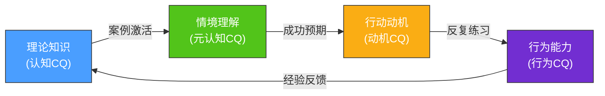
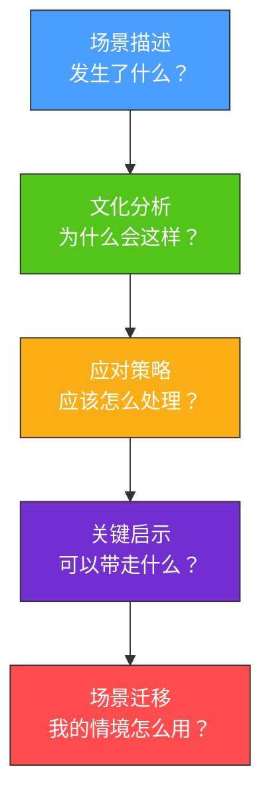
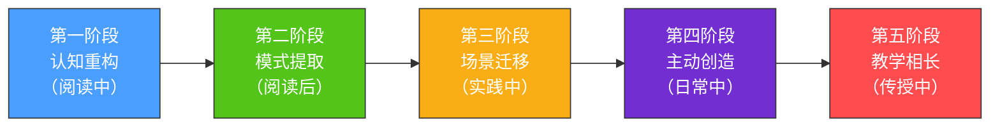

## 引言：从理论到战场的跨越

理论是地图，实战是行军。你在前面的章节中已经掌握了霍夫斯泰德的六个文化维度、霍尔的高低语境理论、文化冲击的四阶段模型，以及跨文化适应的螺旋上升路径。这些理论为你构建了一套分析文化差异的认知框架——但认知框架和实际应对之间，隔着一条名为"经验"的鸿沟。

本节的八个实战案例，就是帮你跨过这条鸿沟的桥梁。

### 为什么需要实战案例

跨文化沟通的学习存在一个独特的困境：**你无法通过抽象练习来训练具体场景中的直觉反应**。数学可以刷题，编程可以写 demo，但跨文化沟通的能力只能在真实的——或至少是高度仿真的——文化碰撞中磨练。

这背后有深刻的认知科学依据。心理学家 Gary Klein 在其"自然决策理论"（Naturalistic Decision Making, 1998）中指出，专家在复杂情境中的决策并不是靠逐一分析选项，而是靠"模式识别"——他们从过去的经验中提取模式，快速匹配当前情境，做出直觉性判断。Klein 在研究消防指挥官、重症监护护士等高压决策者时发现，经验丰富的专家在 80% 的复杂情境中依靠的不是分析推理，而是"识别启动决策"（Recognition-Primed Decision, RPD）——看到情境的某个特征，立即从记忆中调取相似经验，形成行动方案。

跨文化沟通高手也是如此：他们不是在每次互动前都回顾一遍霍夫斯泰德的六个维度，而是在多年的经验积累中形成了对文化信号的敏锐直觉。日本商务场合中一个微妙的"嗯……"停顿、德国同事在邮件中把"建议"换成"要求"时的措辞变化、阿拉伯合作伙伴突然缩短寒暄时间——这些信号在新手眼中是噪音，在专家眼中却是意义明确的文化指示器。

实战案例的价值，就在于**加速这个模式积累的过程**。你不需要亲历每一种文化碰撞才能获得经验——通过深度阅读和分析他人的案例，你可以在短时间内积累大量的"间接经验"，为自己的直觉反应系统填充素材。

教育心理学中的"情境学习理论"（Situated Learning Theory, Lave & Wenger, 1991）进一步支持了这种方法。该理论认为，知识不是脱离情境的抽象符号，而是在具体的社会实践活动中建构的。脱离情境的知识很难迁移——你背熟了"日本人注重面子"这个知识点，但只有在具体的案例场景中，你才能理解"面子"在不同情境中的具体表现形式、触发条件和应对策略。

这就解释了为什么很多人学了大量跨文化理论，实际互动中仍然手足无措——他们拥有"惰性知识"（inert knowledge），知道理论却无法在需要时调用。案例分析就是将惰性知识激活为"情境化知识"的关键训练。

#### 从"知道"到"做到"：跨文化能力的知识转化链

理解案例学习的价值之后，有必要厘清一个更深层的问题：跨文化沟通能力到底由哪些要素构成？仅仅"知道"理论够不够？

Earley 和 Ang 在 2003 年提出的"文化智商"（Cultural Intelligence, CQ）框架给出了系统性回答。CQ 包含四个相互支撑的维度：

| CQ 维度 | 含义 | 对应的学习方式 | 案例的作用 |
|---------|------|---------------|-----------|
| **认知 CQ**（Cognitive） | 对不同文化的知识储备——规范、价值观、法律、经济体系 | 理论学习、阅读 | 案例提供"活的知识"，将抽象概念具象化 |
| **元认知 CQ**（Meta-cognitive） | 在跨文化互动中的自我觉察和策略性思考——能否意识到自己的文化假设、能否在互动中实时调整策略 | 反思练习、案例分析 | 案例训练"思考自己的思考"，暴露认知盲点 |
| **动机 CQ**（Motivational） | 面对跨文化挑战时的自信和兴趣——是否愿意投入精力去适应和学习 | 成功体验、正向激励 | 案例展示"做到了是什么样子"，提供动机锚点 |
| **行为 CQ**（Behavioral） | 在具体场景中调整语言、语调、肢体语言、行为模式的能力 | 角色扮演、实操训练 | 案例提供"行为模板"，展示具体话术和动作 |

这四个维度的递进关系可以用一个知识转化链来描述：



案例分析之所以高效，是因为它同时作用于这个链条的前三个环节：通过具体场景激活理论知识（认知→元认知），通过展示可行的应对策略建立信心（元认知→动机）。行为CQ的训练则需要你在真实互动中实践——但有了前三个环节的铺垫，你的实践效率会显著提高。

#### 案例学习的认知神经科学基础

为什么"读别人的故事"能提升自己的能力？认知神经科学提供了进一步的解释。

镜像神经元（Mirror Neurons）的研究表明，当人类观察他人执行某个动作时，自己大脑中负责该动作的区域也会被激活——仿佛自己正在执行同样的动作。Rizzolatti 和 Craighero 在 2004 年的研究中发现，这种"神经模拟"不仅限于物理动作，也延伸到情感体验和社会认知。

这意味着，当你在案例中"代入"某个跨文化互动场景时，你的大脑正在进行一次低强度的"模拟训练"——虽然你没有真的坐在谈判桌前，但你的神经系统已经在处理类似的认知负荷。这就是为什么"深度阅读"比"浏览概要"有效得多：前者激活了神经模拟，后者只是浅层的文字处理。

结合神经科学的发现，案例学习的最佳实践可以总结为以下公式：

> **案例学习效果 = 情感代入深度 × 分析性思考强度 × 迁移应用频率**

只读不分析，只有情感代入没有理性反思；只分析不迁移，只有理论推演没有实践印证。三个因素缺一不可。

### 八个案例的选择逻辑

本节的八个场景并非随意挑选，而是经过精心设计，覆盖了跨文化沟通中最常见、最具挑战性的八类情境。选择的标准基于三个维度：

**一、场景的普遍性**。每个案例都代表了一大类跨文化互动场景，而非孤例。例如，"跨国视频会议中的文化碰撞"代表的是所有远程跨文化协作场景；"海外留学的文化适应"代表的是所有长期驻外生活场景。掌握了这些原型场景的应对策略，你在同类场景中都能举一反三。

**二、文化维度的多样性**。八个案例覆盖了不同的文化碰撞类型：

| 案例 | 涉及的主要文化维度 | 碰撞类型 | 复杂度 |
|------|---------------------|----------|--------|
| 场景一：跨国视频会议 | 高低语境、个人/集体主义、不确定性规避 | 多方同时碰撞 | ★★★★ |
| 场景二：海外留学 | 文化冲击四阶段、权力距离、个人/集体主义 | 个体对新环境 | ★★★ |
| 场景三：国际商务谈判 | 高低语境、长期/短期导向、信任建立模式 | 双方深度博弈 | ★★★★★ |
| 场景四：跨文化团队管理 | 所有六个维度 | 持续性管理挑战 | ★★★★★ |
| 场景五：海外旅行 | 非语言沟通、不确定性规避、礼仪规范 | 即时性社交摩擦 | ★★ |
| 场景六：文化冲突调解 | 权力距离、个人/集体主义、冲突处理风格 | 第三方介入调停 | ★★★★ |
| 场景七：翻译误解 | 高低语境、语言精确度、商业信任 | 危机场景 | ★★★ |
| 场景八：文化融合 | 文化适应模型、融合策略 | 正向协作典范 | ★★★ |

**三、结果的对照性**。八个案例中既有危机场景（翻译误解导致商务危机），也有正面范例（文化融合的美好实践）；既有个人层面的挑战（留学适应），也有组织层面的难题（团队管理）。这种对照设计让你看到同一组理论在成功和失败情境中的不同表现，从而更深刻地理解"什么有效、什么无效"。

#### 案例选择的"冰山模型"——显性场景与隐性维度

表面上看，八个案例是八个不同的"故事"——视频会议、留学生活、商务谈判等。但如果用文化研究中的"冰山模型"来审视，每个案例都包含三个层次：

```mermaid
graph TD
    subgraph 水面之上 —— 显性行为
        A["可观察的行为、语言、礼仪"]
    end
    subgraph 水面之下 —— 中层规范
        B["价值观、信仰、社交规则<br>冲突处理方式、时间观念"]
    end
    subgraph 深层 —— 核心假设
        C["对人性的基本假设<br>对关系本质的理解<br>对世界运行方式的认知"]
    end
    A --> B --> C
    
    style A fill:#4a9eff,stroke:#333,color:#fff
    style B fill:#52c41a,stroke:#333,color:#fff
    style C fill:#722ed1,stroke:#333,color:#fff
```

- **水面之上**：案例中可以直接观察到的行为和语言——某人说了什么、做了什么、会议怎么进行的。这是大多数读者会关注的层次。
- **水面之下**：驱动这些行为的价值观和社交规范——为什么在这种文化中"直接拒绝"是不可接受的？为什么"准时"的标准因文化而异？案例分析的重点就在这里。
- **深层核心**：最底层的文化假设——对人性善恶的基本判断（影响信任建立方式）、对个体与群体关系的根本理解（影响决策方式）、对世界的掌控感（影响风险态度）。案例中通常不会直接讨论这个层次，但每个应对策略的根基都扎在这里。

阅读案例时，有意识地穿透这三个层次，是提升分析深度的关键。

### 数字时代的跨文化沟通——第九个隐形案例

八个案例覆盖了面对面和远程沟通的传统场景。但当今的跨文化沟通越来越多地发生在**数字化环境**中——社交媒体、即时通讯、异步协作工具、虚拟会议平台。这些场景有其独特的挑战，值得在进入具体案例之前专门讨论。

#### 数字环境对跨文化沟通的三重改变

**第一重改变：非语言信号被大幅削减**。在面对面沟通中，非语言信号（面部表情、肢体语言、声调、空间距离）承载了超过 60% 的沟通信息（Mehrabian, 1971）。数字环境中，这些信号要么消失（纯文字沟通），要么被削弱（视频通话中肢体语言受限）。这对高语境文化的沟通者冲击尤其严重——他们习惯依赖的"弦外之音"在数字环境中更难传递和接收。

**第二重改变：时间结构被重新定义**。面对面沟通是同步的、即时的；而数字沟通混合了同步（视频会议、即时消息）和异步（邮件、协作平台留言）两种模式。不同文化对"及时回复"的定义差异在异步沟通中被放大：在德国商务文化中，24小时内回复邮件是基本礼仪；在中国的微信文化中，超过2小时未回复可能被解读为"不重视"；而在巴西的工作文化中，48小时的回复延迟可能是常态。

**第三重改变：文化信号的"扁平化"**。在数字平台上，人们的表达方式趋向标准化——邮件有通用的格式规范，Slack 消息有约定俗成的缩写，Zoom 会议有默认的交互规则。这种标准化降低了跨文化摩擦，但也掩盖了文化差异——你以为对方"和我一样"，实际上他的"👍"表情可能代表远不同于你的含义。

#### 数字跨文化沟通的常见陷阱

| 陷阱 | 具体表现 | 涉及的文化差异 |
|------|---------|---------------|
| **表情符号的文化歧义** | 在中国友好的"微笑"😊在英语语境中可能被理解为讽刺；日本人常用的鞠躬🙏在西方可能被误读 | 非语言符号系统差异 |
| **邮件语气的误读** | 美国人习惯以"Hope this email finds you well"开头，直接进入正题；日本人需要较长的前言铺垫；德国人可能认为任何寒暄都是浪费时间 | 高低语境、关系导向差异 |
| **虚拟会议的沉默误判** | 芬兰人或日本人在视频会议中的沉默是正常思考时间；美国人可能将其解读为不同意或不参与 | 沉默的文化含义差异 |
| **即时消息的"已读"压力** | 在一些文化中（如韩国），"已读不回"是严重的社交失礼；在北欧文化中，不立即回复是尊重对方独立时间的表现 | 时间观念、社交义务差异 |
| **异步协作中的隐含期望** | 美国管理者在 Slack 上发消息可能期望即时响应；德国管理者可能认为工作时间外的消息可以第二天再回 | 工作-生活边界的文化差异 |

这些数字时代的陷阱不会作为独立案例出现，但在后续八个案例的分析中，许多场景都涉及数字沟通环节——你需要带着这些认知去审视案例中的每一个数字触点。

### 如何阅读这些案例

每个案例都按照统一的五步结构组织，这个结构本身就反映了一套跨文化沟通的问题解决方法论：



**第一步：场景描述——"发生了什么？"**

这一部分呈现一个具体的跨文化互动场景，包括参与者的背景、互动的过程、以及出现的问题或挑战。阅读时，先不要急着分析，而是尝试"代入"场景——想象你就是其中的参与者，感受当时的紧张、困惑或尴尬。这种情感代入是建立跨文化直觉的重要训练。

在阅读场景描述时，可以尝试以下具体操作：

1. **暂停记录**：在读完场景描述后，立即写下你的第一反应——你觉得问题出在哪里？谁的做法有问题？你会怎么处理？
2. **标注文化信号**：用不同颜色的笔（或在脑中标注）标记场景中的文化信号——哪些行为可能是文化驱动的，而非个人性格导致的？
3. **识别冲突层次**：判断这个冲突是表面的语言误解，还是深层的价值观碰撞？
4. **角色扮演代入法**：分别站在场景中每个参与者的立场上重读一遍——如果你是美国工程师、日本经理、印度项目经理，你各自会怎么理解这个场景？这种多视角代入能帮你跳出单一文化立场。

**第二步：文化分析——"为什么会这样？"**

这是每个案例的核心。这一部分运用前面学到的理论框架（文化维度理论、高低语境理论、文化冲击理论等），对场景中各方的行为进行文化解码。你会发现，那些看似"奇怪""不友好"或"不合理"的行为，在文化分析的视角下都有其内在逻辑。

阅读文化分析时，重点关注两个问题：
- 每个参与者的行为背后有哪些文化因素在起作用？
- 如果不用文化分析的视角，你可能会如何误读这些行为？

更深入一步，尝试做以下分析练习：

| 分析维度 | 思考问题 | 具体做法 |
|----------|----------|----------|
| 文化假设解构 | 各方默认"理所当然"的是什么？ | 列出每个参与者不言自明的前提假设 |
| 误读路径还原 | 如果不看文化分析，我会怎么误解？ | 写下你的"第一反应"解读，然后对照文化解读 |
| 维度权重判断 | 哪个文化维度在这个冲突中最关键？ | 用权重排序的方式识别主导因素 |
| 信号识别复盘 | 有哪些微妙信号我之前会忽略？ | 列出被你忽略或误读的具体行为和言辞 |
| 冰山层次穿透 | 冲突的根源在冰山的哪个层次？ | 区分行为层、规范层、核心假设层的差异 |

**第三步：应对策略——"应该怎么处理？"**

这一部分给出具体的、可操作的应对方案，包括措辞建议、行为调整和策略选择。这些策略不是凭空想象的，而是基于前面章节的核心技巧——文化敏感度培养、语言调整策略、非语言行为适应、跨文化信任建立、文化误解处理。

阅读应对策略时，试着思考：
- 有没有更好的处理方式？
- 如果角色互换，你会怎么应对？
- 这个策略在你的实际工作/生活中是否有类似场景可以应用？
- 这个策略的适用边界是什么——在哪些情境下会失效？

**第四步：关键启示——"可以带走什么？"**

每个案例最后提炼出的核心教训，是可以迁移到其他场景的"元规则"。这些启示不是泛泛的"要尊重文化差异"之类的口号，而是从具体场景中萃取出来的、有操作指导意义的原则。

建议你为每个案例建立一个"启示卡片"，记录以下内容：

案例编号：场景X
核心启示：[一句话概括]
适用场景：[什么情况下可以迁移到这个原则]
行动规则：[具体应该怎么做]
禁忌事项：[绝对不要做什么]
理论支撑：[这个启示基于哪个理论]
个人验证：[我在真实互动中可以如何验证这条启示]

**第五步：场景迁移——"我的情境怎么用？"**

这是最新增的一步，也是将案例经验真正转化为个人能力的关键。在阅读完前四步后，你需要主动将案例中的情境与自己的真实生活建立连接。

场景迁移的具体操作：

1. **最近回忆法**：回忆过去 6 个月内你经历的最类似的一次跨文化互动，用案例中的分析框架重新审视它。当时你的处理方式与案例中的建议有何异同？如果有重来的机会，你会怎么调整？
2. **未来预演法**：想象你未来 3 个月内可能遇到的最接近这个案例的场景。提前制定一个简要的应对预案——关键的措辞调整、需要观察的信号、可能的"Plan B"。
3. **差异校准法**：你的场景和案例场景有哪些关键差异？参与者关系不同？权力结构不同？文化组合不同？识别这些差异，判断案例策略需要怎样调整才能适用于你的场景。

### 阅读时的主动思考框架

被动阅读案例只能获得浅层印象。要真正将案例转化为能力，你需要在阅读时进行主动思考。以下是一个"四问框架"，建议你在每个案例中都尝试回答：

**第一问：如果是我，我会怎么做？**

在阅读"文化分析"之前，先基于场景描述做一个快速判断。你打算如何应对这个情境？你的第一反应是什么？然后对照案例中的文化分析和应对策略，看看自己的判断有哪些盲区。这个"先判断、后对照"的过程，能最有效地暴露你的认知盲点。

具体操作方法：

1. 读完场景描述后，合上书（或关闭页面），拿出纸笔
2. 用三分钟时间写下：(a) 你认为问题出在哪里 (b) 你会怎么应对 (c) 你预测的结果是什么
3. 继续阅读文化分析部分，逐条对照你的判断
4. 用不同颜色标注：绿色=判断正确，黄色=部分正确，红色=完全误判
5. 重点分析红色部分——为什么你会误判？是缺乏哪方面的文化知识？

**第二问：我的文化假设是什么？**

每个案例中的冲突，本质上都是不同文化假设的碰撞。在阅读过程中，不断追问自己："我对这个行为的解读，是基于什么假设？这个假设是普世的，还是我的文化特有的？"这个练习是培养元认知 CQ（文化智商中的自我觉察维度）的最有效方式。

一个实用的自检清单——当你的第一反应是以下任何一种时，停下来审视自己的文化假设：

- "这人怎么这么没礼貌？" → 礼貌标准因文化而异
- "他明明不同意为什么不直说？" → 直接表达的偏好是文化性的
- "这种效率怎么做事的？" → 效率至上的假设本身是文化产物
- "为什么不守时？" → 时间观念存在单时制和多时制的根本差异
- "他怎么什么都要请示领导？" → 权力距离的差异
- "太不专业了" → 专业性的标准在不同文化中差异显著
- "这样太冒险了吧？" → 风险偏好与不确定性规避直接相关
- "连合同细节都不看就签？" → 合同文化（规则导向）vs 关系文化（信任导向）

**第三问：这个案例中有哪些信号是我之前会忽略的？**

跨文化沟通的关键能力之一，是识别那些微妙的文化信号——一个犹豫的停顿、一句看似客气的拒绝、一个不经意的肢体语言。每个案例都会揭示一些你可能忽略的信号。把这些信号记录下来，下次遇到类似情境时，你就能更快地识别它们。

建立你自己的"文化信号词典"是一个长期但极有价值的习惯：

| 信号类别 | 示例信号 | 可能的文化含义 | 出现频率 |
|----------|----------|----------------|----------|
| 语言信号 | "That's interesting..." | 在英语中常意味着委婉否定 | 高 |
| 语言信号 | "Let me think about it" | 在东亚文化中常意味着拒绝 | 高 |
| 语言信号 | "原则上同意" | 中国商务语境中可能意味着"有保留地接受" | 高 |
| 语言信号 | "We'll do our best" | 日本商务英语中可能是"不太能做到"的委婉表达 | 中 |
| 时间信号 | 回复邮件的延迟时间 | 不同文化对"及时回复"的定义差异巨大 | 中 |
| 时间信号 | 会议开始的准时程度 | 德国/日本准时期望 vs 巴西/印度弹性时间观 | 高 |
| 非语言信号 | 会议中的沉默 | 在芬兰/日本是正常思考，在美国可能意味着不同意 | 高 |
| 非语言信号 | 微笑 | 在日本/韩国可能是尴尬或不同意的掩饰 | 中 |
| 非语言信号 | 目光接触 | 西方视为自信/真诚，在部分亚洲文化中可能被视为不敬 | 中 |
| 行为信号 | 发送详细的技术文档 | 在德国是正常流程，在其他文化可能意味着不信任 | 低 |
| 行为信号 | 主动提出帮忙 | 在美国是友好，在某些文化中可能暗示对方能力不足 | 低 |
| 数字信号 | 消息中使用"..." | 中国语境中表示"话未尽"，英语语境中可能表示犹豫或不满 | 高 |
| 数字信号 | 回复只用一个"好"字 | 在即时通讯中，可能意味着不耐烦或敷衍 | 中 |

**第四问：如果把这个案例中的文化组合换一下，会怎样？**

这是一个进阶思考练习。例如，如果案例中的美国-日本组合换成美国-巴西、或者中国-德国组合，冲突的性质会变吗？应对策略需要怎样调整？这个问题能帮你检验自己是否真正理解了案例中的文化动态，而只是记住了"日本人会这样做"的表面结论。

如果你能自如地回答第四问，说明你已经从"记忆具体案例"上升到了"掌握分析框架"的层次。

### 案例与理论的映射关系

为了帮助你在阅读案例时随时回顾相关理论，下表展示了每个案例与前面章节理论知识的对应关系：

| 案例 | 主要运用的理论 | 对应的核心技巧 | 建议先复习 |
|------|---------------|---------------|-----------|
| 场景一：跨国视频会议 | 高低语境理论 + 文化维度理论 | 语言调整策略 + 非语言行为适应 | 高低语境理论、个人/集体主义维度 |
| 场景二：海外留学 | 文化冲击理论 + 跨文化适应模型 | 文化敏感度培养 + 文化误解处理 | 文化冲击四阶段、贝瑞融合策略 |
| 场景三：国际商务谈判 | 高低语境理论 + 长期/短期导向 | 跨文化信任建立 + 语言调整策略 | 高低语境连续体、长期导向维度 |
| 场景四：跨文化团队管理 | 文化维度理论全六维 + CQ 框架 | 全部五项核心技巧综合运用 | 文化智商四维度、全部六个文化维度 |
| 场景五：海外旅行 | 非语言沟通理论 + 不确定性规避 | 文化敏感度培养 + 非语言行为适应 | 非语言沟通理论、不确定性规避维度 |
| 场景六：文化冲突调解 | 权力距离 + 个人/集体主义 | 文化误解处理 + 跨文化信任建立 | 权力距离维度、面子与关系理论 |
| 场景七：翻译误解 | 高低语境理论 + 信任修复理论 | 语言调整策略 + 文化误解处理 | 高低语境理论、翻译策略 |
| 场景八：文化融合 | 跨文化适应模型 + 融合策略 | 文化敏感度培养 + 跨文化信任建立 | 金·金适应模型、整合策略 |

### CQ 快速自评——阅读前的能力基线

在正式进入案例之前，花 5 分钟完成以下自评。这不是考试，而是建立你的"能力基线"——读完所有案例后，你可以重新评估，观察自己的成长。

对以下 20 个陈述，用 1-5 分评估自己的实际水平（1=完全不符合，5=完全符合）：

**认知 CQ（知识储备）——第 1-5 题**

| # | 陈述 | 自评 |
|---|------|------|
| 1 | 我能说出至少 4 种文化维度理论的核心含义 | __/5 |
| 2 | 我了解高低语境文化在沟通风格上的具体差异 | __/5 |
| 3 | 我知道至少 3 种不同文化的谈判风格特点 | __/5 |
| 4 | 我能区分文化冲击的四个阶段及其特征 | __/5 |
| 5 | 我了解不同文化中"面子"概念的运作差异 | __/5 |

**元认知 CQ（自我觉察）——第 6-10 题**

| # | 陈述 | 自评 |
|---|------|------|
| 6 | 在跨文化互动中，我能意识到自己正在用本文化的假设解读对方 | __/5 |
| 7 | 当沟通不顺利时，我会先检查是否是文化差异导致的 | __/5 |
| 8 | 我能在互动过程中实时调整自己的沟通策略 | __/5 |
| 9 | 我能区分"对方的文化习惯"和"对方的个人性格" | __/5 |
| 10 | 在新的文化环境中，我会主动观察和学习当地的沟通规范 | __/5 |

**动机 CQ（行动意愿）——第 11-15 题**

| # | 陈述 | 自评 |
|---|------|------|
| 11 | 我对了解不同文化的人如何思考和生活有真诚的兴趣 | __/5 |
| 12 | 面对跨文化沟通的困难，我有信心通过学习和适应来克服 | __/5 |
| 13 | 我愿意在必要时调整自己的习惯来适应对方的文化 | __/5 |
| 14 | 文化差异对我来说是有趣的挑战，而非令人沮丧的障碍 | __/5 |
| 15 | 我会主动寻找跨文化互动的机会来提升自己的能力 | __/5 |

**行为 CQ（行为调整）——第 16-20 题**

| # | 陈述 | 自评 |
|---|------|------|
| 16 | 我能根据对方的文化背景调整自己的语速和用词 | __/5 |
| 17 | 我能在需要时使用更间接或更直接的表达方式 | __/5 |
| 18 | 我能识别并适当回应不同文化中的非语言信号 | __/5 |
| 19 | 在跨文化社交场合中，我能调整自己的肢体语言和空间距离 | __/5 |
| 20 | 我能在不同文化场合中灵活切换沟通风格（如邮件、会议、社交） | __/5 |

**评分解读：**

| 总分区间 | CQ 水平 | 案例阅读建议 |
|----------|---------|-------------|
| 20-40 分 | 初学者 | 重点关注每个案例的"文化分析"部分，建立基础知识与现实场景的连接。建议按顺序阅读。 |
| 41-60 分 | 进阶者 | 重点关注"应对策略"部分，学习具体的操作方法。可以使用情境匹配法选择阅读顺序。 |
| 61-80 分 | 熟练者 | 重点关注"场景迁移"部分，将案例与自己的经验对接。同时关注"第四问"进阶练习。 |
| 81-100 分 | 专家级 | 重点关注案例之间的模式提取和交叉对比，建立自己的跨文化沟通方法论体系。 |

记录你的总分和各维度分数。读完全部案例后重新评估，观察哪些维度成长最快、哪些维度仍需加强。

### 常见的案例分析误区

在学习实战案例的过程中，有几种常见的思维陷阱需要警惕：

**误区一：急于找"标准答案"**

跨文化沟通案例不是数学题，没有唯一的正确解。同一种情境可能有多种合理的应对方式，取决于具体的上下文、关系基础和组织文化。如果你在阅读案例时的第一反应是"正确答案是什么"，说明你在用应试思维处理需要灵活判断的情境。

纠正方法：关注"为什么这个策略在这个情境下有效"，而不是"哪个策略是正确的"。思考策略背后的逻辑，比记住具体策略更重要。

**误区二：过度归因于文化**

并非所有的沟通问题都是文化差异导致的。有时候，一个人迟到仅仅是因为堵车，一个同事说话直接只是因为性格。过度将行为归因于文化，和完全忽视文化因素一样危险。

纠正方法：在做文化分析之前，先排除非文化因素（个人性格、具体情境、偶然因素）。文化分析应该是你的"第二层解读"，而不是"第一反应"。

判断是否涉及文化因素的"三层过滤法"：

1. **第一层：个体因素过滤** —— 这个行为是否可以用个人性格、情绪状态、具体情境来解释？如果是，先排除文化因素。
2. **第二层：模式匹配** —— 这个行为是否与某个文化群体的已知模式一致？是否有其他成员在类似情境中表现出类似行为？
3. **第三层：当事人确认** —— 如果条件允许，通过非对抗性的方式确认对方行为背后的原因。"我注意到你在会议中没有表达反对意见，是有什么顾虑吗？"比直接做出文化假设更可靠。

**误区三：用刻板印象代替分析**

"德国人就是刻板""日本人就是含蓄"——这类简化标签虽然有一定统计基础，但用在具体个案中会造成严重误判。每个个体都是其文化背景与个人特质的独特组合。

纠正方法：在分析案例时，区分"文化的倾向性"和"个体的确定性"。使用"在X文化中，人们倾向于……"而非"X文化的人就是……"的句式。

更精确的表述框架：

| 避免的表述 | 推荐的表述 |
|-----------|-----------|
| "日本人不直接拒绝" | "在日本的高语境文化中，直接拒绝可能被视为失礼，因此人们倾向于使用更委婉的方式表达不同意" |
| "德国人很准时" | "在德国的低不确定性规避文化中，准时被视为专业和可靠的表现，迟到可能被解读为不尊重" |
| "美国人很直接" | "在美国的低语境沟通文化中，明确表达观点通常被视为诚实和高效的表现" |

**误区四：只关注语言，忽视非语言信号**

很多读者在阅读案例时，把注意力全部集中在对话内容上，忽略了场景描述中的非语言细节——停顿的时间、肢体语言、沉默的含义、回避的方式。而这些非语言信号在跨文化沟通中往往比语言本身承载更多信息。

纠正方法：在每次阅读案例时，专门做一次"非语言信号扫描"——把场景中所有的非语言细节（表情、动作、沉默、节奏变化）标注出来，分析它们的文化含义。

**误区五：旁观者偏差**

作为案例的旁观阅读者，你拥有"上帝视角"——你知道所有参与者的背景、意图和最终结果。这种视角会让分析显得比实际操作容易得多。不要因此低估实际跨文化互动的难度。

纠正方法：在阅读每个案例时，有意识地"关闭上帝视角"——只阅读场景描述部分，暂停，设身处地地思考"如果我只知道我自己的视角，我会怎么理解和应对？"然后再继续阅读后续分析。

**误区六：文化本质主义——把文化当作固定不变的实体**

文化是动态的、多样的、不断演变的。同一国家内部存在巨大的地区差异、代际差异、阶层差异和个体差异。将"中国文化"或"美国文化"视为铁板一块的整体，会忽视这些内部多样性。

例如，一个在上海外企工作了十年的中国专业人士，与一个在小城镇传统企业工作的同龄人，在沟通风格上可能有天壤之别。一个在美国东海岸长大的硅谷工程师，和一个在南方小镇长大的销售代表，也有显著差异。

纠正方法：在分析案例时，始终关注参与者的**具体背景**——职业经历、教育背景、国际经验、年龄代际——而不仅仅是他们的国籍标签。文化背景是理解行为的重要维度，但不是唯一维度。

**误区七：幸存者偏差——只看到成功案例的策略**

本节的案例中既有成功也有失败的场景，但读者容易只从成功案例中提取策略，忽视失败案例的警示价值。实际上，**失败案例中的错误模式比成功案例中的正确策略更能提升你的警觉性**——因为犯错的代价远高于策略选择的边际收益差异。

纠正方法：对失败案例投入至少与成功案例同等的分析精力。重点识别：失败的起点是什么信号？哪些时间节点本可以扭转局面？如果在第一步就做了不同选择，结果会怎样？

### 从案例到能力的转化路径

阅读案例本身不是目的，将案例中的经验转化为自己的能力才是。以下是建议的转化路径，分为五个递进阶段：



**第一阶段：认知重构（阅读中）**。在阅读每个案例的过程中，你的首要任务是更新自己的"文化心理模型"——即你对不同文化的人"为什么会这样想、这样做"的理解。每当你在案例中看到一个出乎意料的文化解读，就把它加入你的心理模型库。

具体做法：准备一个"文化洞察笔记本"（可以是纸质的，也可以是电子文档），在每个案例中记录至少三个"原来如此"的时刻——即那些让你对某种文化行为有了全新理解的发现。长期积累，这个笔记本将成为你最宝贵的跨文化参考手册。

**第二阶段：模式提取（阅读后）**。读完全部八个案例后，花时间做一次横向对比。哪些文化因素反复出现？哪些应对策略在多个场景中都有效？哪些误区在多个案例中都有体现？这种模式提取是将"八个具体经验"升级为"一套通用方法"的关键步骤。

建议的横向对比练习：

| 对比维度 | 具体操作 |
|----------|----------|
| 反复出现的文化维度 | 标记每个案例中最关键的1-2个维度，找出出现频率最高的维度 |
| 通用有效的策略 | 找出在3个以上案例中都有效的策略，提炼为"通用原则" |
| 高频误判模式 | 统计你在"第一问"中犯了哪些类型的错误，识别自己的认知盲区 |
| 文化冲突的共同结构 | 抽象出所有案例中文化冲突的共同模式（误读→升级→僵局→突破） |
| 高效破局时刻 | 识别每个案例中从僵局到突破的关键转折点及其触发因素 |

**第三阶段：场景迁移（实践中）**。把案例中学到的原则迁移到你自己的真实场景中。回忆你过去经历的跨文化互动，用案例中的分析框架重新审视它们。你可能会发现，很多当时的困惑或冲突，在文化分析的视角下有了全新的解释。这种"回顾性分析"是跨文化能力成长最迅速的方式之一。

具体的迁移练习：

1. 选择你过去经历的一次跨文化互动（可以是面对面的，也可以是线上的）
2. 用五步结构重新分析这个互动：场景还原→文化分析→复盘应对→提炼启示→迁移检验
3. 对比当时的你和现在的你：现在的你会怎么处理？
4. 如果还有类似的互动机会，提前准备应对策略

**第四阶段：主动创造（日常中）**。不要等到"遇到外国人"时才练习跨文化沟通。在日常生活中就有大量练习机会——和来自不同城市的同事交流、理解不同年龄段朋友的表达方式、阅读其他国家的新闻报道。文化差异无处不在，关键是你是否带着文化分析的意识去观察。

低门槛的日常练习方法：

- **新闻解码**：每天读一条国际新闻，尝试用文化维度理论解释报道中涉及的行为差异。例如，看到"某国工人拒绝加班"的新闻时，用不确定性规避和长期导向的框架来分析。
- **影视分析**：看一部外国电影或电视剧时，暂停在某个冲突场景，用学过的框架分析冲突的文化根源。Netflix 的韩国剧集、日本动画、北欧犯罪片都是极好的分析素材。
- **对话反思**：每次与不同背景的人交流后，花两分钟回顾：这次交流中有没有文化因素在起作用？我做了哪些适应性调整？哪些调整是有效的，哪些是无效的？
- **文化日记**：每周记录一个文化观察，无论大小——同事的沟通风格、外卖小哥的措辞、网上的争论模式，都可能包含文化因素。坚持三个月，你会对自己的文化敏感度提升速度感到惊讶。
- **逆向练习**：有意识地在日常沟通中尝试一种与你习惯不同的沟通风格。如果你习惯直接表达，尝试一次委婉的方式；如果你习惯先寒暄再谈正事，尝试一次直接进入主题。观察对方的反应，感受不同风格的效果。

**第五阶段：教学相长（传授中）**。学习金字塔（Learning Pyramid）理论表明，"教授他人"是知识留存率最高的学习方式，可以达到 90% 的留存率，远超被动听讲的 5% 和阅读的 10%。

当你能把一个案例中的文化动态清楚地解释给一个没有相关知识背景的朋友时，你才真正理解了它。教学的过程会迫使你组织知识结构、填补逻辑漏洞、简化复杂概念——这些正是深度学习的核心活动。

实践方法：
- 找一个朋友，用 5 分钟向他解释一个案例中的文化冲突及其解决方案
- 写一篇短文（300-500字），把一个案例的核心启示讲给一个从未接触过跨文化理论的人
- 在团队内部做一次 15 分钟的"跨文化小课堂"，分享你从案例中学到的一个洞察
- 在社交媒体上分享你的文化观察和分析，接受不同背景读者的反馈

### 案例分析实战工具箱

在阅读案例的过程中，以下工具和模板可以提升你的分析效率和深度：

#### 工具一：文化维度速查表

遇到不确定的维度含义时，快速参考：

| 文化维度 | 低分端特征 | 高分端特征 | 关键行为指标 |
|----------|-----------|-----------|-------------|
| 权力距离 | 扁平组织、直呼其名、质疑权威 | 等级森严、敬语系统、服从上级 | 下属是否主动提出异议 |
| 个人/集体主义 | 个人成就优先、"我"的表达 | 群体和谐优先、"我们"的表达 | 奖励对象是个人还是团队 |
| 男性化/女性化 | 竞争、成就导向、果断 | 关系、生活质量、共识 | 冲突时选择竞争还是妥协 |
| 不确定性规避 | 接受模糊、灵活变通、低焦虑 | 规则明确、流程严格、高焦虑 | 面对新事物时的第一反应 |
| 长期/短期导向 | 注重当下、快速回报、传统 | 延迟满足、长期规划、适应 | 投资决策的时间框架 |
| 放纵/克制 | 表达情感自由、享受生活 | 控制情感、遵守规范 | 社交场合中的情感表达程度 |

#### 工具二：跨文化冲突分析模板

在分析每个案例（或自己的真实经历）时，填写以下模板：

┌─────────────────────────────────────────────────────────┐
│                    跨文化冲突分析表                        │
├─────────────────────────────────────────────────────────┤
│ 1. 基本信息                                               │
│    参与者：____(文化背景) vs ____(文化背景)                   │
│    场景类型：□会议 □谈判 □社交 □管理 □其他____               │
│    沟通方式：□面对面 □视频 □电话 □邮件 □即时通讯              │
│    紧急程度：□高(需立即处理) □中 □低(可慢慢调整)              │
├─────────────────────────────────────────────────────────┤
│ 2. 冰山分析                                               │
│    水面上（可观察行为）：______________________________       │
│    水面下（驱动价值观）：______________________________       │
│    深层（核心假设）：______________________________           │
├─────────────────────────────────────────────────────────┤
│ 3. 文化维度诊断                                            │
│    最相关的维度1：____________ → 差异程度：高/中/低           │
│    最相关的维度2：____________ → 差异程度：高/中/低           │
│    可能被忽略的维度：____________                             │
├─────────────────────────────────────────────────────────┤
│ 4. 误读检查                                               │
│    我的第一反应解读：______________________________           │
│    可能的文化解读：______________________________             │
│    关键差异点：______________________________                │
├─────────────────────────────────────────────────────────┤
│ 5. 应对策略                                               │
│    短期行动（当下）：______________________________           │
│    中期调整（关系建设）：______________________________        │
│    长期方案（系统性改变）：______________________________       │
└─────────────────────────────────────────────────────────┘

#### 工具三：跨文化沟通准备清单

在即将进入跨文化互动之前，用以下清单做快速准备：

□ 我了解对方文化的核心沟通特征吗？（高低语境、直接/间接）
□ 我知道对方文化中"礼貌"和"冒犯"的边界在哪里吗？
□ 我准备了至少两种表达同一件事的方式吗？（直白版 + 委婉版）
□ 我了解对方文化中对时间的基本态度吗？（准时期望、回复速度）
□ 我准备了哪些"文化安全话题"？（对方文化中普遍受欢迎的话题）
□ 我列出了哪些"文化雷区话题"？（应该避免的话题和表达）
□ 如果出现误解，我的第一反应预案是什么？
□ 我有哪些"文化中性"的破冰方式？（不依赖任何特定文化的社交方式）

### 自测：你的案例阅读准备度

在开始阅读案例之前，可以通过以下快速自测了解自己的准备度。这不是考试，而是帮助你识别需要在阅读中重点关注的知识盲区：

| 自测问题 | 如果你的回答是"不确定" | 建议行动 |
|----------|----------------------|----------|
| 高语境和低语境文化的核心区别是什么？ | 案例一和案例三的分析可能缺乏理论支撑 | 先复习高低语境文化理论 |
| 文化冲击的四个阶段分别有什么特征？ | 案例二中的情感变化可能难以理解 | 先复习文化冲击理论 |
| 权力距离如何影响组织中的沟通方式？ | 案例四和案例六的组织动态分析可能不到位 | 先复习权力距离维度 |
| "面子"在不同文化中的运作机制有什么不同？ | 多个案例中的间接沟通行为可能难以解读 | 先复习面子理论和集体主义维度 |
| 信任在不同文化中如何建立？ | 案例三和案例八的信任建立过程可能难以把握 | 先复习跨文化信任建立章节 |
| 非语言沟通在不同文化中有哪些主要差异？ | 案例五中的行为细节可能被忽略 | 先复习非语言沟通理论 |
| 翻译和语言转换中常见的文化陷阱有哪些？ | 案例七中的翻译问题可能难以理解其严重性 | 先复习翻译策略和高低语境理论 |

如果有三个以上"不确定"，建议先回到理论基础和核心技巧章节复习相关内容，再来阅读实战案例。没有理论基础的案例分析，容易停留在"看热闹"的层面，无法真正内化为能力。

如果全部"确定"——恭喜你，理论准备充分。现在需要做的是带着开放的心态进入案例，接受你可能"想错了"的事实。理论知识是必要的，但不是充分的——真正的学习发生在理论与现实碰撞的时刻。

### 中国读者的特殊视角

作为中文读者，你在阅读跨文化案例时有一些独特的优势和需要注意的盲区，值得在开始之前加以说明。

#### 你的优势

**第一，中国文化的"天然多维度感"**。中国是一个幅员辽阔、文化多样的国家——北方与南方的沟通风格差异、沿海与内陆的商业文化差异、不同代际之间的价值观差异——这些日常经验已经为你训练了初步的文化敏感度。你可能没有意识到，但"和东北同事聊天 vs 和广东同事谈生意"的经验，本身就是一种文化维度的训练。

**第二，中文的高语境特性**。作为高语境语言的使用者，你天然擅长理解"话外之音"——"再研究研究""回去考虑考虑""原则上同意"，这些表达在中国文化中都有明确的隐含意义。这种能力可以迁移到其他高语境文化的互动中（如日本、韩国、阿拉伯文化），但在与低语境文化（如美国、德国、北欧）互动时，需要注意自己的"潜台词"可能不被对方识别。

**第三，中华文明的"和合"传统**。中国文化强调"和为贵""求同存异"的哲学，这在跨文化冲突调解和团队管理中是宝贵的文化资源。但需要注意，"和合"思维在面对需要明确表态的情境时，可能被低语境文化的参与者误解为"回避问题"或"缺乏立场"。

#### 你的盲区

**盲区一：中国中心视角**。在阅读涉及中国文化的案例时，你可能会不自觉地为中国参与者"辩护"或将其行为合理化。试着保持分析性距离——中国参与者的行为同样需要文化分析，正如外国参与者的行为需要文化分析一样。"我们的做法"并不天然就是"正确的做法"。

**盲区二：英语霸权的隐形影响**。如果你主要通过英语媒体了解世界文化，你的认知可能已经被英语文化（尤其是美国文化）的叙事框架所塑造。例如，"直接沟通=好的""个人主义=先进的"这些隐含假设可能已经不知不觉地进入了你的思维。在阅读案例时，留意自己的判断标准是否不自觉地偏向了某种特定文化立场。

**盲区三：对"关系"概念的单一理解**。中国文化的"关系"（guanxi）是一个复杂的概念，你在日常生活中已经对其有了深度体验。但其他文化中的"relationship building"与中国式"关系"在运作机制上有显著差异——美国的"networking"强调互惠但保持个人边界，日本的"人脉"（jinmyaku）强调层级和忠诚，中东的"wasta"（关系网）强调家族和部落纽带。不要简单地将所有文化的"关系建设"等同于中国的"搞关系"。

#### 中国读者的增值练习

在阅读每个案例时，增加一个额外的思考维度：

> **"如果这个场景发生在中国的企业环境中，会有什么不同？"**

这个问题能帮你建立"中国经验"与"全球视野"之间的桥梁。你会逐渐发现，中国的企业文化本身就处于传统集体主义、现代市场竞争和全球化的多重张力之中——理解这种内部张力，本身就是一种高级的跨文化能力。

### 案例阅读的预期收获

完成全部八个案例的深度阅读后，你应该能在以下方面看到明显的成长：

| 能力维度 | 阅读前的典型表现 | 阅读后的预期表现 |
|----------|-----------------|-----------------|
| 文化信号识别 | 只关注语言内容，忽略非语言信号 | 能主动识别场景中的文化信号并进行解读 |
| 冲突归因能力 | 将冲突归因于个人性格或态度 | 能区分个人因素和文化因素，进行多层分析 |
| 策略选择能力 | 面对跨文化困难时束手无策或生搬硬套 | 能根据具体情境选择和调整应对策略 |
| 元认知觉察 | 无意识地用本文化假设解读行为 | 能觉察并审视自己的文化假设 |
| 模式迁移能力 | 只能在完全相同的场景中应用经验 | 能将一个场景的经验迁移到不同的文化组合中 |

### 一个提醒：案例不是模板

最后需要强调一点：**案例提供的是分析思路，而非标准答案**。现实中的跨文化互动远比案例复杂——参与者可能来自多个国家、涉及多种文化维度、处于不同的关系阶段和权力结构中。照搬案例中的具体话术和行为，在不同的情境下可能完全失效。

真正有价值的是案例背后的分析方法：识别文化因素 → 理解各方逻辑 → 设计适应性策略 → 执行并观察反馈 → 根据反馈调整。这个方法论是通用的，具体的应用则需要你根据实际情况灵活调整。

跨文化沟通能力的提升没有捷径，但有高效的路径。深度分析实战案例，就是其中最高效的路径之一——它用别人的真实经历，训练你自己的文化直觉。

正如前面章节所强调的，跨文化沟通的最高境界不是变成对方文化的人，而是成为能够在不同文化之间自如切换的"文化桥梁"。这八个案例，就是你建造这座桥梁的第一批砖石。

准备好开始了吗？

***
