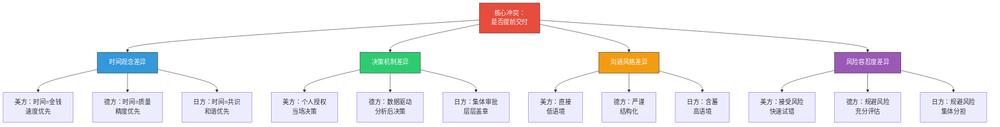
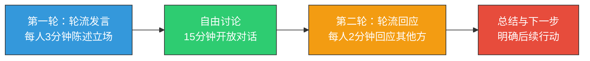

### 一、场景描述

张伟是一家中国科技公司的项目经理，负责一个跨国合作的新产品开发项目。合作方包括美国的市场团队、德国的技术团队和日本的制造团队。项目进入关键阶段，需要召开一次四方视频会议，讨论一个核心问题：是否将原定的交付日期提前一个月。

会议安排在北京时间晚上八点（对应美国东部时间上午八点、德国下午两点、日本晚上九点）。张伟提前五分钟进入Zoom会议室，调试好屏幕共享和演示文稿。各方陆续上线。

**会议进程实录：**

**第一阶段（0-5分钟）：寒暄与开场**

张伟用英语问候各方，简短寒暄。美方代表John立刻切入正题："Let's cut to the chase — our competitor just announced a similar product launch in Q3. We need to move our deadline up by a month."（咱们直说吧——竞争对手刚宣布Q3发布类似产品。我们需要把交付日期提前一个月。）

德方代表Hans皱了皱眉，翻开笔记本："I need to understand the technical implications first. Can you share the competitor's specs?"（我需要先了解技术影响。能分享一下竞争对手的规格吗？）

日方代表Takahashi全程保持微笑，没有说话。

**第二阶段（5-15分钟）：讨论升温**

John展示了市场分析数据，论证提前交付的紧迫性。他语气急切，多次使用"We must"和"We can't afford to wait"。

Hans逐条反驳，列出了一份十二项的技术风险清单，指出仓促推进可能导致质量下降。他的语气平稳但坚定："Rushing this will cost us more in warranty claims than we gain from early market entry."（仓促推进的保修成本会超过提前上市的收益。）

Takahashi在被直接问到意见时，停顿了三秒，然后说："We appreciate the urgency. We would like to discuss this internally and come back with our position."（我们理解紧迫性。我们希望内部讨论后回复我们的立场。）

张伟注意到John明显露出不耐烦的表情，而Hans则在快速记录Takahashi的话。

**第三阶段（15-25分钟）：僵局与收场**

John试图推动一个折中方案："How about we split the difference — two weeks early?"（折中一下——提前两周？）

Hans回应："I can't commit to any timeline without a proper technical review. Give me two weeks to run the numbers."（没有正式的技术评估我无法承诺任何时间表。给我两周时间做数据测算。）

Takahashi再次沉默，然后重复了类似的话："We will do our best to respond promptly."（我们会尽快回复。）

张伟感到会议陷入僵局。他尝试总结各方立场，安排了后续跟进计划，但内心清楚：这次会议没有达成任何实质性结论。

**会后的隐藏冲突：**

会议结束后，John私下给张伟发消息："I feel like we're getting nowhere. The Germans are over-engineering this and the Japanese won't commit to anything."（我觉得毫无进展。德国人在过度工程化，日本人什么都不承诺。）

Hans也发来邮件，附上了详细的评估框架模板，要求各方在两周内填写。

Takahashi没有发任何消息，但他的助理第二天联系张伟，询问能否提供更详细的会议背景资料，以便"更好地理解各方立场"。

### 二、文化深度分析

这个场景表面上是一场关于项目时间表的讨论，实质上是四种文化决策模式、沟通风格和时间观念的深层碰撞。下面逐层解码各方行为背后的文化逻辑。

#### 2.1 四方文化画像

| 维度 | 美方 John | 德方 Hans | 日方 Takahashi | 中方 张伟 |
|------|----------|----------|--------------|---------|
| 高低语境 | 低语境 | 低语境 | 高语境 | 高语境 |
| 个人/集体 | 个人主义 | 个人主义 | 集体主义 | 集体主义 |
| 不确定性规避 | 低 | 高 | 高 | 中等 |
| 权力距离 | 低 | 低 | 高 | 中高 |
| 时间导向 | 短期 | 长期 | 长期 | 长期 |
| 决策风格 | 快速、个人驱动 | 分析、数据驱动 | 共识、层级审批 | 关系协调 |

这张表格基于霍夫斯泰德（Hofstede）文化维度理论，但需要注意：它是对文化倾向的概括，不是对个人性格的标签。同一个国家内部也存在巨大的个体差异——一个在美国硅谷工作过五年的日本人，其行为模式可能更接近John而非Takahashi。文化维度是理解行为的起点，而非终点。

#### 2.2 各方行为的文化解码

**John（美方）的文化逻辑：**

John的行为根植于美国商业文化的三个核心信念。

第一，"时间就是金钱"的时间观。美国商业文化将时间视为最稀缺的资源，延迟等于损失。哈佛商学院教授Clayton Christensen的研究显示，美国企业高管在做决策时，"市场窗口"（market window）是最常被引用的考量因素之一。John的紧迫感不是个人性格，而是文化训练的结果。更深一层，美国的上市公司受季度财报周期驱动，华尔街对"missed expectations"（未达预期）的惩罚极为严厉——这意味着John的上级可能正在承受来自投资者的压力，而这种压力会逐级传导到他身上。

第二，"先开枪再瞄准"的行动偏好。美国商业文化推崇快速迭代——先推出最小可行产品（MVP），再根据市场反馈改进。这与德国"先瞄准再开枪"的理念形成鲜明对比。John提出的"split the difference"（折中方案）正是这种实用主义的体现——他不追求最优解，而是追求"足够好且足够快"的解。硅谷有句行话："Done is better than perfect"（完成好过完美），这句话的文化根源可以追溯到美国的边疆精神——在资源有限、时间紧迫的环境中，快速行动比周密计划更能生存。

第三，"声音最大的人获得最多资源"的议事规则。在美国的会议文化中，主动发言、有力表达是展示领导力的方式。John的"We must"和"We can't afford to wait"不是命令，而是他参与讨论的方式——在美国文化中，沉默往往被解读为"没有意见"或"不关心"。斯坦福商学院的研究表明，在美国企业的会议中，发言时长与被评价为"有领导力"之间存在显著正相关，这在集体主义文化中则不存在甚至呈负相关。

**Hans（德方）的文化逻辑：**

Hans的行为体现了德国工程文化的深层价值观。

第一，"质量是不可谈判的"信念。德国制造业的全球声誉建立在一个核心原则上：质量优先于速度。Hans提到的"warranty claims"（保修成本）不是随口一说，而是德国工程师的本能反应——他们习惯性地从全生命周期成本（Total Cost of Ownership）的角度评估决策。德国工程师协会（VDI）的调查显示，87%的德国技术管理者认为"仓促推进是最大的项目风险"。这个数据背后的深层原因是德国的学徒制传统：德国工程师从入行第一天就被教导，一个技术缺陷造成的损失可能是预防成本的十倍以上。

第二，"数据驱动决策"的方法论。Hans要求"two weeks to run the numbers"（两周做数据测算）不是拖延，而是德国决策流程的标准步骤。在德国商业文化中，没有数据支撑的承诺被视为不负责任。Hans提供的评估框架模板也是典型的德国做法——将复杂问题结构化、标准化。德国人有一个专门的词叫"Gründlichkeit"（彻底性），它不仅是一种工作方法，更是一种道德标准——不够彻底的工作被视为对职业的不尊重。

第三，"直言不讳但就事论事"的沟通风格。德国人区分"做人"（Person）和"做事"（Sache）。Hans的逐条反驳不是针对John个人，而是针对方案本身。在德国文化中，坦率地指出问题是尊重的表现——隐藏问题是不诚实的。这也解释了为什么Hans在会后发送评估框架时没有附带任何客套话——在德国文化中，高效本身就是一种礼貌。

**Takahashi（日方）的文化逻辑：**

Takahashi的沉默和模糊回应是整个场景中最容易被误读的行为。

第一，"稟議制"（Ringi-sei）的决策机制。日本企业的重大决策采用集体审批制度——提案需要逐级传阅，各层级负责人盖章（hanko）表示同意。Takahashi个人无权在会议中做出任何承诺，这不是推诿，而是组织制度的要求。他说"我们需要内部讨论"时，字面意思就是字面意思——他确实需要回去和团队讨论。稟議制的效率看起来很低，但它的优势在于：一旦决策达成，执行阶段几乎不会遇到内部阻力，因为所有相关方都已经在审批过程中表达了同意。

第二，"读空气"（空気を読む）的沟通方式。日本文化强调"以心传心"——不需要把话说透，对方应该能理解。Takahashi的微笑和礼貌措辞是一种缓冲策略，避免在公开场合制造冲突。他的"We will do our best"在日语语境中可能意味着"这件事很困难"，但在英语直译中听起来像是积极的承诺。这种语用差异是跨国会议中最危险的陷阱——双方都以为自己理解了对方，实际上理解的是完全不同的意思。

第三，"面子"（面子・めんつ）的维护机制。日本文化中，当众说"不"是极度失礼的行为。Takahashi不会直接说"我们反对提前交付"，因为这会让提出方案的John"丢面子"。他选择的策略是延迟回应——通过拖延来传达保留态度，同时给对方留出自行撤回建议的空间。在日本的商务沟通中，"让我考虑一下"（検討します）往往就是"不"的意思，但外国人通常将其理解为"有可能"。

第四，"时间观念"的差异。日本人对"尽快"（as soon as possible）的理解与美国人截然不同。在美国，"ASAP"意味着"今天之内"；在日本，"尽快"意味着"在合理的时间框架内完成"，可能是两周到一个月。Takahashi说"尽快回复"时，他预期的时间线可能比John预期的长三到五倍。这种差异源于日本文化对"做好"（丁寧に）的重视——仓促完成一件事被认为比延迟完成更不体面。

**张伟（中方）的困境：**

张伟面临的是典型的"文化中间人"挑战。中国文化的高语境和集体主义特征使他天然倾向于协调而非对抗，但这也导致他在会议中缺乏主导力。他的困境在于：

- 对美方，他需要展示决断力和行动力，但这与中国文化中"三思而后行"的谨慎相矛盾
- 对德方，他需要尊重技术评估的严谨性，但也要推动项目进度
- 对日方，他理解Takahashi的含蓄表达，但无法向John解释这种文化差异

张伟更深层的困境在于"文化翻译者"角色的两难：如果他向John解释"Tahakashi的沉默意味着保留意见"，他可能被视为"替日本人说话"；如果他不解释，John会继续误读，导致后续冲突升级。这是所有跨国项目经理都会面临的角色张力——你需要在各方之间建立理解的桥梁，但桥梁本身可能被任何一方视为偏向另一方。

#### 2.3 冲突的文化根源图



#### 2.4 文化冲突的量化影响

文化差异不仅仅是"感觉不舒服"——它有可量化的商业后果。理解这些数据有助于向组织高层证明跨文化培训的投资回报率（ROI）。

**时间成本：** 根据《哈佛商业评论》2023年的一项研究，跨国团队平均每周花费4.2小时在"澄清误解"上，其中约60%可归因于文化差异而非语言障碍。在本案例中，如果张伟在会前做了充分的文化预沟通，这次25分钟的会议可能只需要15分钟就能达成相同（甚至更好的）结论。

**决策延迟：** 咨询公司McKinsey对全球500个跨国项目的分析显示，因文化冲突导致的决策延迟平均为项目总周期的12-18%。在本场景中，如果没有文化干预，"是否提前交付"这个决策可能需要额外2-4周才能达成共识——John在第一周就会感到沮丧，Hans需要两周做评估，Takahashi的稟議制可能需要三周。

**信任损耗：** 最隐蔽但最严重的成本是信任损耗。John在会后私下抱怨德国人和日本人，这本身就是信任开始下降的信号。如果这种情绪持续积累，John可能在后续会议中变得更加咄咄逼人，Hans可能变得更加防御，Takahashi可能更加回避——形成恶性循环。盖洛普的研究表明，跨国团队中信任度每下降10%，项目交付质量下降23%，人员流失率上升31%。

#### 2.5 视频会议特有的文化放大效应

面对面会议中的文化差异可以通过非语言信号（肢体语言、空间距离、眼神接触）得到一定程度的缓冲。但视频会议剥离了这些缓冲层，使文化差异被放大：

**沉默的歧义化。** 在面对面会议中，沉默可以伴随点头、思考的表情、记录的动作，传递"我在认真考虑"的信号。但在视频会议中，摄像头前的沉默往往被解读为"网络卡了"或"这个人不参与"。Takahashi的沉默在面对面场景中可能被视为深思熟虑，在视频会议中却被John解读为消极抵抗。更糟糕的是，Zoom等平台的"静音"状态会进一步模糊"主动沉默"和"技术问题"的边界。

**发言权的不对等。** 视频会议中"谁在说话"的信号比面对面会议更明确——只有一个人的麦克风活跃，其他人的画面缩小。这种技术机制天然有利于主动发言的文化（美国），不利于等待发言邀请的文化（日本）。John的连续发言在Zoom中占据了主导地位，而Takahashi连找到插话时机都困难。在面对面会议中，Takahashi可以通过清嗓子、身体前倾等信号暗示"我想发言"，但这些信号在视频中完全无效。

**非语言信号的丢失。** 摄像头通常只捕捉头肩部分，大量肢体语言信息丢失。Hans在德国会议中可能通过身体前倾表示关注、通过后仰表示保留，这些信号在视频中完全不可见。同样，日本文化中"微微低头"表示敬意和认真倾听的信号，在视频中可能被误读为"不感兴趣"或"在看别的东西"。

**多任务的诱惑。** 视频会议中，参与者容易分心查看邮件、消息等。研究表明，视频会议中的注意力持续时间比面对面会议短约40%。这加剧了高语境文化参与者的困境——他们的含蓄信号更难被注意到。当Takahashi用一个微妙的表情传达保留意见时，John可能正在查看邮箱。

**时区疲劳的累积效应。** 本案例中，张伟在北京时间晚上八点参会——这已经是工作日的"加班时间"。如果类似会议每周两次，持续数月，张伟的精力和判断力会逐渐下降。时区疲劳不仅影响个人表现，还会加剧文化冲突：疲惫的人更容易退回到自己文化中最本能的行为模式，减少跨文化适应的意愿和能力。《自然》杂志2022年的一项研究发现，长期跨时区协作的团队成员，其认知灵活性在6个月后平均下降15%。

#### 2.6 语言能力梯度的影响

在跨国会议中，所有参与者都在使用非母语（英语），但各人的英语水平存在差异。这种差异本身也是一个文化变量。

**流利度与话语权的关系。** John作为母语者，可以自如地使用修辞手法、语气强调和快速发言来增强说服力。Hans的英语虽然准确，但语速较慢，且缺乏情感色彩——这使得他即使提出了更有力的论据，在"听感上"也不如John有说服力。Takahashi的英语可能足够应付日常交流，但在表达微妙的保留意见时，词汇量的限制迫使他使用更简单、更模糊的表达——这反过来强化了他"含蓄"的文化印象，但实际上部分含蓄是语言能力的限制而非文化选择。

**文化语用迁移。** 当非母语者用英语交流时，他们不自觉地将母语的语用规则迁移到英语中。德语中"This is not possible"是一种客观陈述，没有情感色彩；但英语中同样的表达听起来像是坚决的拒绝。日语中"We will consider it"（検討します）是一种礼貌的否定；但英语中"We will consider it"听起来像是积极的回应。这种语用迁移是跨国会议中最隐蔽的误解来源——双方都在说英语，但用的是各自母语的"语用操作系统"。

**应对策略。** 作为会议协调者，张伟可以在开场时加入这样一句话："Please remember that English is not everyone's first language. If something sounds blunt, it probably isn't meant that way. If something sounds vague, please ask for clarification."（请记住英语不是所有人的母语。如果某句话听起来太直接，可能并非本意。如果听起来模糊，请直接追问。）这句话不针对任何特定文化，但能降低所有参与者的防御心理。

### 三、全周期应对策略

跨国视频会议的文化应对不是在会议中才开始的，而是一个涵盖"会前—会中—会后"的完整周期。

#### 3.1 会前准备：文化情报收集与议程设计

**第一步：绘制文化地图**

在会议前，用以下模板整理各方的文化特征：

┌─────────────────────────────────────────────────────┐
│                 文化情报卡模板                         │
├─────────────┬───────────────────────────────────────┤
│ 参与者       │ [姓名] / [国家] / [公司]               │
│ 文化类型     │ 高/低语境 | 个人/集体 | UAI高/低        │
│ 决策权限     │ 个人可决定 / 需要团队批准 / 需要上级审批   │
│ 沟通偏好     │ 直接/含蓄 | 正式/非正式 | 书面/口头       │
│ 时间观念     │ 严格/灵活 | 短期/长期                   │
│ 语言能力     │ 母语/流利/基本 | 语速偏好 | 是否需要翻译   │
│ 禁忌事项     │ [文化禁忌和敏感话题]                     │
│ 建立关系方式 │ [如何建立信任]                           │
│ 历史互动记录 │ [之前合作中的摩擦点和成功经验]             │
└─────────────┴───────────────────────────────────────┘

相比基础版本，这里新增了"语言能力"和"历史互动记录"两个维度。语言能力影响你选择会议的正式程度和语速；历史互动记录帮助你预判哪些议题可能触发旧矛盾。

**第二步：设计文化包容性议程**

一份好的跨国会议议程需要满足不同文化的需求：

| 议程要素 | 文化考量 | 具体做法 |
|---------|---------|---------|
| 时间安排 | 考虑时区公平性 | 轮换会议时间，不要总让同一方在深夜参会；建立时区轮换表，记录每方"不方便"的次数 |
| 议程结构 | 满足高低语境需求 | 既有明确的议题列表（满足低语境），也有非正式交流时间（满足高语境） |
| 决策预期 | 明确决策方式 | 提前说明"本次会议需要达成共识"还是"收集各方意见后由X决定" |
| 材料分发 | 满足分析型文化 | 至少提前48小时发送背景材料，给分析型参与者准备时间；材料应包含原始数据而非只有结论 |
| 发言规则 | 平衡不同发言风格 | 设定轮流发言环节，避免只有主动型文化的人发言 |
| 会议时长 | 避免疲劳放大偏见 | 跨国会议建议控制在60分钟以内，复杂议题拆分为多次短会议 |
| 记录方式 | 满足不同信息需求 | 安排专人做会议记录，会后发送结构化纪要 |

**第三步：预沟通**

在正式会议前，分别与各方进行一对一沟通：

- **对美方**：了解他们的底线和优先级，提前通报其他方可能的顾虑。具体话术："John, before the meeting, I want to make sure I understand your priorities. If we can't move the full month, what's the minimum advance that would still be meaningful for the market positioning?"
- **对德方**：提供技术背景资料，让他们有时间做初步评估。具体话术："Hans, I'm sharing the competitor specs John mentioned. No need for a full analysis yet — just your initial technical reaction would be very helpful for the meeting."
- **对日方**：非正式地探询他们的立场，让他们有机会在会议前完成内部讨论。具体话术（通过助理或非正式渠道）："Takahashi-san, the topic of the upcoming meeting is quite sensitive. I wanted to give you a heads-up so your team has time to discuss internally before the formal meeting."

预沟通的核心目的不是"提前说服"各方，而是消除信息不对称——让每一方在进入正式会议时都了解其他方的基本立场，避免在会议中因为"意外信息"而产生防御反应。

#### 3.2 会中管理：文化翻译与节奏控制

**策略一：开场设定文化基调**

会议的前两分钟决定了整个会议的文化氛围。建议使用以下开场模板：

"Thank you all for joining. Before we dive into the agenda,
I'd like to set a few expectations for today's discussion:

1. We have participants from four different countries and
   time zones — I appreciate everyone's flexibility.
2. This is a DISCOVERY meeting, not a DECISION meeting.
   Today's goal is to understand each perspective, not to
   force a conclusion.
3. I'll make sure everyone has a chance to speak. If you
   prefer to share thoughts after the meeting, that's
   equally welcome.
4. Please feel free to use the chat function if you'd like
   to add comments without interrupting."

这个开场的每个要点都针对特定的文化需求：
- 第1条：承认时区牺牲，对所有参与者表达尊重
- 第2条：降低John的紧迫感，给Hans和Takahashi空间
- 第3条：明确保障沉默者的发言权，降低日本参与者的焦虑
- 第4条：提供异步参与渠道，照顾不同沟通风格

**策略二：实时文化翻译**

作为会议协调者，张伟需要在各方之间进行"文化翻译"——不是语言翻译，而是将一方的表达方式转化为另一方能理解的方式。

| 原始表达 | 文化含义 | 翻译后的表达 |
|---------|---------|------------|
| John: "We need to move fast" | 美式紧迫感，非命令 | "John is highlighting a market timing concern. Let's make sure we address it." |
| Hans: "This is not feasible" | 德式直率，就事论事 | "Hans has identified specific technical risks we need to evaluate." |
| Takahashi: "We need to discuss internally" | 日式保留态度 | "Takahashi's team needs time for internal alignment. This is a sign of thoroughness, not resistance." |
| Hans: "I need two weeks" | 德式严谨，非拖延 | "Hans is proposing a structured evaluation timeline. This protects all of us from unforeseen technical issues." |
| John: "Can we just try?" | 美式实验精神 | "John is suggesting an iterative approach. Hans, what would a minimal-risk pilot look like?" |

文化翻译的关键原则是：不评判任何一方，而是为每一方的行为提供一个善意的、可理解的解释。翻译者不站队，只搭桥。

**策略三：结构化发言流程**

采用"轮流发言+自由讨论"的混合模式：



轮流发言确保：
- 日本参与者不会因为等待插话机会而全程沉默
- 德国参与者有结构化的表达框架
- 美国参与者知道自己的发言时间是受保障的，不必抢话

在轮流发言环节，协调者应该明确说："Let's go around the virtual table. Each person has three minutes. I'll keep time."（让我们轮流发言，每人三分钟，我来计时。）这为所有人——尤其是来自高权力距离文化的参与者——提供了发言的"合法性"：不是我个人想打断，而是规则允许我发言。

**策略四：处理僵局的文化技巧**

当会议出现僵局时，不同文化背景的人需要不同的破局方式：

**对美方（John）的破局话术：**

"John, I hear your urgency and it's valid. Let me reframe this:
instead of asking 'can we deliver early?', let's ask 'what would
need to be true for us to deliver early?' This way, we can
identify the specific blockers and address them one by one."

这个话术将John的"要求"转化为"条件分析"，既尊重了他的紧迫感，又给了Hans分析的空间。它利用了美国文化中"problem-solving orientation"（问题解决导向）的偏好——John不是在被拒绝，而是在被邀请参与一个更有建设性的分析过程。

**对德方（Hans）的破局话术：**

"Hans, your risk assessment is exactly what we need. Here's what
I propose: can you give us a 'quick and dirty' preliminary
assessment by Friday — not the full analysis, just the top 3
risks and whether they're showstoppers? That way John gets a
faster answer, and you get the time for a proper review."

这个话术满足了德国文化对"分析先行"的需求，同时通过"preliminary"（初步）降低质量标准，找到一个双方都能接受的中间地带。关键在于"top 3 risks"——这个数字给了Hans一个明确的交付物框架，避免他因为追求完整性而无限扩展范围。

**对日方（Takahashi）的破局话术：**

"Takahashi-san, thank you for your patience. I understand your
team needs time for internal discussion. To help with that
process, I'll send a summary email tonight with: (1) today's
discussion points, (2) each party's position, (3) specific
questions where we need your input. Would it be helpful if I
schedule a brief follow-up call with just your team before the
next full meeting?"

这个话术为日本的"稟議制"提供了所需的输入材料，并提出了一对一的跟进方式，避免Takahashi在公开场合被逼表态。"Would it be helpful if I..."这个措辞很重要——它不是"我要求你怎么做"，而是"我是否可以为你提供帮助"，这符合日本文化中"以对方为中心"的沟通礼仪。

**策略五：巧用技术功能补偿文化差异**

视频会议平台的技术功能可以主动弥补文化放大效应：

- **投票功能用于匿名表态。** 当需要各方对敏感议题表态时，先用匿名投票收集初始意见，再进行讨论。这避免了"第一个发言者设定基调"的从众效应，尤其保护了来自高权力距离文化的参与者。
- **聊天窗口用于异步补充。** 明确告知参与者："如果有想法但不方便打断，可以在聊天窗口中随时输入。我会在讨论间隙读出聊天中的重要观点。"这为高语境文化的参与者提供了一个低压力的表达渠道。
- **分组讨论室用于文化同质小组预热。** 对于特别敏感的议题，可以先让各方在各自的分组讨论室中内部对齐5分钟，再回到主会场分享结论。这让日本参与者有机会先完成"内部讨论"，而不必在公开场合现场思考。

#### 3.3 会后跟进：差异化沟通

会议结束后的跟进工作同样需要文化定制：

**对美方的跟进（24小时内）：**

发送简洁的行动清单（Action Items），明确每项的负责人和截止日期。美国文化中，"谁在什么时间之前做什么"是最重要的跟进信息。

Subject: [Action Items] Product Timeline Meeting - June 24

Hi John,

Key takeaways:
- Market urgency acknowledged by all parties
- Hans to deliver preliminary tech assessment by July 1
- Takahashi's team to confirm manufacturing feasibility by July 5
- Next full meeting: July 8, 8PM Beijing / 8AM EST

Your action: Prepare updated market analysis with competitor
timeline details for July 8 meeting.

Best,
Wei

**对德方的跟进（24小时内）：**

发送详细的会议记录和评估框架。德国文化重视书面记录和结构化信息。

Subject: Meeting Minutes + Assessment Framework - Product Timeline

Dear Hans,

Attached please find:
1. Detailed meeting minutes (in English and German)
2. Technical assessment template for your evaluation
3. Competitor specifications shared by John
4. Timeline comparison chart (current vs. proposed)

Please let me know if you need additional data for your
two-week assessment.

Mit freundlichen Grüßen,
Wei

**对日方的跟进（12小时内）：**

发送详尽的背景资料和非正式的沟通渠道。日本文化需要充分的背景信息来完成内部讨论，并偏好通过助理或非正式渠道进行敏感沟通。12小时内发送（而非24小时）是因为日本商业文化重视"迅速回应"（即使只是发送资料），延迟发送可能被理解为不重视。

Subject: 会議資料のご送付 (Meeting Materials)

Dear Takahashi-san,

Thank you for your valuable time today. I have attached:
1. Complete meeting recording (with timestamps for key moments)
2. Summary of each party's position in bullet points
3. Specific questions where we would appreciate your team's input
4. Background materials on the competitor's announcement

Please feel free to have your assistant contact me directly
if any clarification is needed. I am happy to arrange a
preparatory call at your convenience.

よろしくお願いいたします (Best regards),
Wei

#### 3.4 异步协作中的文化适应

跨国团队的协作不仅发生在视频会议中，更大比例的工作发生在异步场景——邮件、项目管理工具、文档协作。异步沟通的文化差异同样需要注意。

**邮件风格的文化光谱：**

| 维度 | 美式风格 | 德式风格 | 日式风格 |
|------|---------|---------|---------|
| 开头 | 快速切入正题，简短问候 | 正式问候，标注完整称谓 | 长篇寒暄，季节性问候 |
| 正文 | 要点列表，行动导向 | 详细论述，逻辑严密 | 委婉铺垫，结论放最后 |
| 语气 | 积极、鼓励性 | 客观、技术性 | 礼貌、谦逊 |
| 结尾 | "Let me know if you have questions" | 明确的下一步和时间线 | "ご検討のほどよろしくお願いいたします" |
| 附件 | 尽量精简 | 完整的支撑数据 | 所有相关背景资料 |

**项目管理工具中的文化冲突：**

使用Jira、Trello等项目管理工具时，也会出现文化冲突。美国团队倾向于频繁更新任务状态（即使只是"进行中"的微小进展），而日本团队可能倾向于等到任务完全完成后才更新。德国团队则会严格按照定义的流程状态逐步推进。建议在项目初期就明确"更新频率"的预期——例如"每个任务状态每天至少更新一次，即使只是添加一句进展说明"。

**文档协作中的权限与礼仪：**

在Google Docs等协作编辑平台上，不同文化对"直接编辑他人文档"的接受度不同。美国文化中，直接在同事的文档中添加评论或修改是常见的协作方式；但在日本文化中，未经允许修改他人作品可能被视为不尊重。建议建立明确的文档协作规范：谁是文档"所有者"（只有所有者可以做最终修改），其他人以"建议模式"或"评论"的方式参与。

#### 3.5 长期文化策略：从单次会议到持续协作

单次会议的文化适应只是起点。要建立高效的跨国协作，需要系统性的文化策略：

**建立团队沟通协议（Team Communication Charter）：**

┌────────────────────────────────────────────────────────┐
│              跨国团队沟通协议模板                         │
├──────────────┬─────────────────────────────────────────┤
│ 会议频率     │ 每两周一次全体会议，每周一次子团队同步     │
│ 时区轮换     │ 每次会议轮换时间，确保各方轮流承受不便     │
│ 发言规则     │ 轮流发言制，每人至少2分钟，可使用文字补充   │
│ 决策方式     │ 明确标注"需要当场决定"vs"收集意见后决定"   │
│ 异步沟通     │ 重要决策用邮件确认，不只依赖会议口头讨论   │
│ 反馈方式     │ 美方可直接反馈，日方可通过助理私下反馈     │
│ 文件语言     │ 英语为主，关键文件提供德语/日语摘要        │
│ 冲突处理     │ 先私下沟通，再公开讨论，避免当众对峙       │
│ 工具使用     │ 统一指定主协作平台，避免信息分散           │
│ 响应时效     │ 紧急24h/常规48h/讨论性话题一周             │
└──────────────┴─────────────────────────────────────────┘

这份协议应该由全体成员共同讨论制定，而非由项目经理单方面发布。共同制定的过程本身就是建立"第三文化"的第一步——各方在讨论"我们应该如何沟通"时，已经在实践跨文化协作。

**定期文化复盘：**

每月进行一次15分钟的文化复盘，回答以下问题：
1. 过去一个月中，有哪些沟通误解是由文化差异导致的？
2. 当前的沟通协议是否需要调整？
3. 各方是否感到自己的沟通风格被尊重？
4. 是否有新的团队成员需要纳入文化背景考量？

复盘可以用匿名问卷的形式收集反馈，再在团队会议上公开讨论。匿名机制特别重要——它让来自高权力距离文化的成员敢于指出问题，而不必担心"冒犯"上级或同事。

**构建"第三文化"：**

"第三文化"不是任何一方的文化被其他方同化，而是团队共同创造的一种新的协作规范。构建过程分为三个阶段：

**阶段一：意识觉醒（第1-2个月）。** 团队成员开始意识到文化差异的存在，并学会不将差异归因为"这个人不好合作"。这个阶段的核心活动是文化分享——每次团队会议开始时，由一位成员分享自己文化中的一个商业习惯。例如，日本成员解释"为什么我们会后需要时间内部讨论"，德国成员解释"为什么我们需要详细的数据支撑"。

**阶段二：规则共创（第3-4个月）。** 团队开始讨论并制定自己的沟通协议。这个阶段可能充满摩擦——美国成员可能觉得"轮流发言"限制了效率，日本成员可能觉得"匿名投票"让人不安。项目经理的角色是引导讨论，确保各方的核心需求被听到。

**阶段三：习惯养成（第5-6个月及以后）。** 新的沟通规范开始成为团队的"默认行为"。美国成员开始习惯在发言前留出停顿，日本成员开始习惯在会议中表达初步想法，德国成员开始习惯在数据不完整时给出有条件的意见。这个阶段不是终点——随着团队成员变动和项目阶段变化，文化规范需要持续调整。

### 四、常见误区与纠正

跨国视频会议中，即使是经验丰富的跨文化沟通者也容易犯以下错误：

#### 误区一："文化差异只是风格问题，不影响结果"

**错误表现：** 认为John的急切、Hans的严谨、Takahashi的沉默只是"风格不同"，只要目标一致就不会有问题。

**为什么错误：** 文化差异不仅影响沟通方式，更影响决策逻辑、风险评估和时间预期。如果忽视这些差异，各方会对同一份"项目计划"产生完全不同的理解。John认为"提前两周"是妥协方案，Hans认为这是"未经评估的冒险"，Takahashi可能认为"没有人在认真对待这个问题"。最终的结果可能是三方都认为"达成了共识"，但各自执行的是三个不同的方案。

**纠正方法：** 在会议中定期做"理解确认"——让各方用自己的话复述对共识的理解。不要假设"大家都同意了"意味着"大家都理解了同一件事"。具体话术："Before we wrap up, let's do a quick alignment check. John, in your own words, what did we agree on? Hans, anything you'd add or interpret differently?"

#### 误区二："用英语开会就够了"

**错误表现：** 认为语言统一（英语）就等于沟通无障碍。

**为什么错误：** 英语作为会议语言解决了语法层面的问题，但没有解决语用层面的问题。Takahashi的英语可能很流利，但他用英语表达的"We will do our best"承载的是日语语境下的含蓄含义，而不是英语字面的积极承诺。同样，Hans用英语说的"This is not feasible"在德语语境中是客观评估，在英语语境中可能被理解为消极抵抗。语言统一只是跨文化沟通的起点，不是终点。

**纠正方法：** 培养"语境敏感的听力"——不仅听对方说了什么，还要思考"在我的文化中，这句话意味着什么，在对方的文化中又意味着什么"。具体的练习方法是"三重翻译"：第一层翻译对方的字面意思，第二层翻译对方的文化含义，第三层翻译成自己团队能理解的表述。

#### 误区三："沉默等于同意"

**错误表现：** 在视频会议中，将不发言的参与者视为"默认同意多数意见"。

**为什么错误：** 在日本、中国等高权力距离文化中，下属不会在上级在场时主动表达反对意见。沉默可能意味着"我有保留意见但不方便说"，而不是"我同意"。在视频会议中，这种误判的风险更高，因为缺乏非语言信号来区分"深思的沉默"和"消极的沉默"。

**纠正方法：** 主动邀请沉默者发言，但要使用低压力的方式。例如："Takahashi, I'd value your perspective on this. No need for a final position — just your initial thoughts would be helpful."（Takahashi，我很想听听你的看法。不需要最终立场——只是初步想法就好。）另一个技巧是"反向轮流"——从最沉默的参与者开始发言，而非从最活跃的开始，这样可以避免沉默者被前面的发言"绑架"。

#### 误区四："折中方案总能解决问题"

**错误表现：** 遇到分歧时，本能地提出"折中方案"（如John的"提前两周"）。

**为什么错误：** 折中是美国文化中常见的冲突解决方式，但不是所有文化都接受。对德国人来说，如果数据不支持提前，"提前两周"和"提前一个月"同样是不可接受的——因为问题不在于"提前多少"，而在于"有没有依据"。对日本人来说，在没有完成内部讨论的情况下被迫接受折中方案，会产生深层的不安全感——他们需要的不是数字上的折中，而是流程上的完整。

**纠正方法：** 在提出折中方案前，先确认各方的核心诉求是什么。有时候，真正的分歧不是"提前多久"，而是"用什么标准来做这个决定"。找到决策标准的共识，比找到结果的折中更重要。具体技巧是"需求挖掘"："John, what's driving the urgency — is it the launch date or the announcement date? Hans, if we could mitigate your top concern, would two weeks be more feasible? Takahashi, what information would help your team reach a position faster?"

#### 误区五："会后跟进可有可无"

**错误表现：** 会议结束后发一封群发邮件了事，不做差异化的跟进。

**为什么错误：** 不同文化对"会议结束"的定义不同。在美国文化中，会议的结论在会议中形成；在日本文化中，会议的结论在会后的私下沟通中才真正成型。如果会后不做差异化跟进，日方可能在下次会议中提出全新的立场，让其他方感到"出尔反尔"——但实际上他们只是在会后完成了"真正的"决策过程。

**纠正方法：** 按照3.3节的差异化跟进模板，针对不同文化采用不同的跟进策略和时间节奏。最关键的原则是：会后跟进不是"发送会议记录"，而是"推动决策继续前进"。对美方，跟进意味着确认行动项；对德方，跟进意味着提供评估所需的数据；对日方，跟进意味着提供内部讨论所需的背景材料和私密沟通渠道。

#### 误区六："文化刻板印象 = 文化理解"

**错误表现：** 学了一些文化维度理论后，就给每个国家的人贴标签——"美国人就是急躁的""日本人就是不表态的""德国人就是死板的"。

**为什么错误：** 文化维度描述的是统计平均值和倾向性，不是个人行为的决定因素。一个在美国中部传统企业工作的高管可能比一个在硅谷创业的日本人更保守。年龄、教育背景、海外经历、公司文化、个人性格都会影响一个人的行为模式。过度依赖文化刻板印象不仅可能误判对方，还可能成为一种自我实现的预言——你用刻板印象对待对方，对方感受到被简化，反而降低了合作意愿。

**纠正方法：** 将文化维度作为"假设生成器"而非"行为预测器"。具体做法是：基于文化维度形成初始假设（"Takahashi可能不会当场表态"），然后通过观察和互动来验证或推翻这个假设（"实际上Takahashi在这次的议题上比较积极地表达了看法，可能是因为他的技术背景让他在这个领域有自信"）。文化理解是一个持续修正的过程，不是一次性的知识获取。

### 五、实战工具箱

#### 5.1 视频会议平台的文化功能设置

| 平台功能 | 文化用途 | 设置建议 |
|---------|---------|---------|
| 聊天窗口 | 为高语境文化提供文字补充渠道 | 开启，鼓励使用，会议协调者定期朗读聊天内容 |
| 举手功能 | 为高权力距离文化提供结构化发言请求 | 开启并主动引导使用，避免"谁嗓门大谁说话" |
| 投票功能 | 匿名收集真实意见，避免从众压力 | 用于需要表态的决策点，先投票再讨论 |
| 分组讨论室 | 让同文化背景的人先内部对齐 | 用于复杂议题的预讨论，尤其保护集体主义文化 |
| 录制功能 | 为高语境文化提供回看和深度理解的机会 | 提前征得同意后录制，会后分享给需要反复理解的参与者 |
| 字幕功能 | 降低非母语者的理解负担 | 开启自动字幕，对关键术语提前提供词汇表 |
| 反应表情 | 提供低压力的参与方式 | 教会所有参与者使用"thumbs up""clap"等反应 |
| 白板/注释 | 为视觉型思考者提供表达工具 | 用于头脑风暴和方案讨论环节 |

#### 5.2 跨国会议准备清单

```markdown
□ 文化情报卡已填写（所有参与方）
□ 议程已发送（至少提前48小时）
□ 背景材料已分发（英文版+各方语言摘要）
□ 时区确认已发出（包含各地方时间，附世界时钟链接）
□ 预沟通已完成（至少与关键方一对一沟通）
□ 会议平台设置已检查（聊天、举手、录制等功能）
□ 发言流程已设计（轮流发言+自由讨论）
□ 僵局预案已准备（针对各方的破局话术）
□ 会后跟进模板已准备好（差异化版本）
□ 文化翻译笔记模板已就绪
□ 敏感词汇清单已准备（避免触发文化禁忌的表达）
□ 会议时间不超过60分钟（复杂议题拆分多次）
```

#### 5.3 实时文化笔记模板

在会议过程中，使用以下模板记录文化信号：

时间：_______
发言人：_______
表面意思：_______________________________
文化解码：_______________________________
我的应对：_______________________________
效果评估：_______________________________
后续行动：_______________________________

使用建议：会议中不需要逐字记录，重点捕捉"文化信号时刻"——当某一方的反应明显偏离你预期的时候，快速记录下来。会后回顾这些时刻，可以帮你发现文化冲突的模式。

#### 5.4 常用文化翻译短语库

| 场景 | 直接表达 | 文化缓冲版 |
|------|---------|-----------|
| 催促决策 | "We need a decision now" | "When would be a realistic timeline for your team to reach a decision?" |
| 表达反对 | "I disagree with this plan" | "I see some areas where we might want to explore alternatives. May I share my concerns?" |
| 要求解释 | "Why can't you commit?" | "Help me understand what factors your team needs to consider before confirming." |
| 推动进度 | "This is taking too long" | "I want to make sure we're aligned on priorities. What's the most important blocker right now?" |
| 化解僵局 | "Let's just compromise" | "It seems we have different criteria for success. Can we take a step back and agree on what 'good' looks like?" |
| 邀请发言 | "What do you think?" | "I'd really value your perspective on this. Even initial thoughts would be helpful." |
| 确认理解 | "Do you all agree?" | "Let me summarize what I heard. Please correct me if I'm wrong." |
| 处理沉默 | "Anyone else have input?" | "I know some of us prefer to reflect before speaking. Feel free to share thoughts via chat or email after the meeting." |

#### 5.5 跨文化会议后复盘模板

每次重要的跨国会议结束后，花10分钟填写以下复盘表：

会议日期：_______
参会方：_______

1. 本次会议中最大的文化摩擦点是什么？
   _______________________________________________

2. 我是否有未被正确解读的表达？（可能被误读的话）
   _______________________________________________

3. 是否有参与方全程沉默或参与度低？原因是什么？
   _______________________________________________

4. 是否有僵局？是用什么方式化解的？是否有效？
   _______________________________________________

5. 会后跟进中，各方的反应是否符合预期？
   _______________________________________________

6. 下次会议需要调整什么？
   _______________________________________________

持续填写这份复盘表，三个月后你将积累一份宝贵的"文化互动模式"数据库——它比任何教科书都更能反映你特定团队的文化动态。

### 六、关键启示

**启示一：项目经理是文化翻译者，不是任务分配者。** 在跨国会议中，PM的核心价值不在于分配任务和追踪进度，而在于理解各方的文化逻辑，将一方的"要求"转化为另一方能接受的"建议"，将一方的"沉默"解码为另一方能理解的"信号"。文化翻译能力是跨国PM的核心竞争力，也是最容易被低估的能力——因为它看起来像是"什么都没做"，但实际上它决定了团队能否真正协作。

**启示二：视频会议需要"过度沟通"。** 面对面会议中，70%的信息通过非语言渠道传递。视频会议中，这个比例降至30%以下。缺失的40%需要通过更频繁的确认、更明确的表述、更多的书面补充来弥补。在跨国视频会议中，"说多了"永远比"说少了"安全。具体操作是：每个关键结论在会议中口头确认一次，会后文字记录一次，跟进邮件中重复一次——三重确认看似冗余，但在跨文化语境中是必要的。

**启示三：沉默不是空白，是信号。** 在跨文化会议中，沉默承载的信息量可能比发言更大。学会解读沉默——区分"思考的沉默"（可能伴随点头、记录）、"不满的沉默"（可能伴随皱眉、身体后仰）和"制度性的沉默"（等待上级或团队授权）——是跨文化沟通高手的核心能力。视频会议中的沉默尤其需要警惕，因为你缺少解读的非语言线索，误判的风险更高。

**启示四：会前预沟通比会议本身更重要。** 真正的跨国决策往往在正式会议之前就已经通过私下沟通基本成型。正式会议的作用是确认和记录，而非从零开始讨论。投资于会前的一对一沟通，可以大幅减少会议中的文化冲突。预沟通的时间投入通常是正式会议时长的1-2倍，但它节省的时间和避免的误解远超这个投入。

**启示五：文化适应是双向的，不要只让一方改变。** 有效的跨文化协作不是让所有人都变成美国式的直接沟通者，也不是让所有人都适应日本式的含蓄表达。理想状态是建立一个"第三文化"（Third Culture）——一种融合了各方文化优势的团队沟通规范，让直接的人学会缓冲，让含蓄的人学会表达，让分析型的人接受不完美，让行动型的人接受等待。第三文化的建立需要时间（通常3-6个月），需要所有成员的主动参与，需要项目经理持续的引导和维护——但它一旦建立，就是团队最强大的竞争优势。

***

> **自检清单：** 读完本案例后，问自己三个问题——(1) 如果我是张伟，在会前我会做哪些不同的准备？(2) 如果我是John，我如何在不放弃紧迫感的前提下更好地与Hans和Takahashi协作？(3) 如果我是Takahashi，我如何在保持文化真实性的前提下更有效地表达保留意见？能从多个文化视角思考同一个问题，才是跨文化沟通能力的真正标志。
