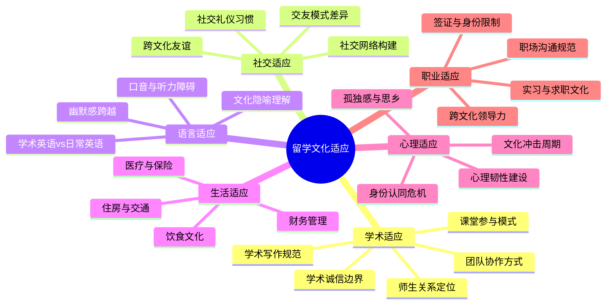

## 场景二：海外留学的文化适应

海外留学是跨文化沟通最密集、最持久的实战场景。与商务出差或短期旅行不同，留学意味着在异文化中**长期生活**——从课堂学习到日常起居，从社交圈建立到身份认同，每一个维度都面临文化适应的挑战。本节以多个真实案例为线索，系统拆解留学场景下的跨文化沟通难题，提供从理论到实操的完整应对框架。

### 一、核心案例：课堂上的沉默

#### 1.1 场景还原

李明，28岁，国内某985高校本科毕业后工作三年，赴美攻读MBA。第一堂《商业策略》课，教授Michael抛出一个案例：「一家中国电动车企业计划进入美国市场，你们认为最大的障碍是什么？」李明心中已有完整分析——他曾在一家新能源企业工作，对中美市场差异有第一手经验。但他习惯性地等待教授点名。

课堂上，一个美国同学立刻举手：「Tariffs and brand perception. Chinese EVs face a 27.5% tariff, and American consumers still associate Chinese cars with low quality.」另一个同学补充：「Data privacy concerns — Chinese automakers collect enormous amounts of driving data.」

讨论持续了15分钟，至少有8位同学发言。李明始终没有找到「合适的插话时机」——他习惯的模式是等别人说完、等教授提问、等一个完美的开口节点。但美国课堂的讨论节奏是**连续抢答式**的，根本没有这样的间隙。

课后，教授走到他身边说：「Lee, I noticed you didn't participate. In our program, class participation counts for 30% of your grade. I really hope to hear your thoughts next time.」

#### 1.2 文化维度分析

这个场景背后涉及多个文化维度的碰撞：

| 文化维度 | 中国课堂模式 | 美国课堂模式 | 李明的冲突点 |
|---------|------------|------------|------------|
| 权力距离（霍夫斯泰德） | 高权力距离：教授是权威，学生尊重其主导权 | 低权力距离：教授是引导者，学生是平等参与者 | 李明将「发言」视为需要教授授权的行为 |
| 个人主义vs集体主义 | 集体主义：避免突出个人，不「出风头」 | 个人主义：展示个人观点是能力的体现 | 李明担心被看作「爱表现」 |
| 不确定性规避 | 高规避：等观点「成熟」再表达 | 低规避：观点在讨论中逐步完善 | 李明追求「完美发言」，错过了所有窗口 |
| 高低语境（霍尔） | 高语境：沉默本身传递「我在思考」 | 低语境：沉默被解读为「没有想法」 | 教授和同学将李明的沉默误读为不参与 |

#### 1.3 深层机制：不仅仅是「敢不敢说话」

表面上看，李明的问题是「不敢举手」，但深层原因是多重文化脚本的冲突：

**脚本一：什么是「好学生」**。中国教育体系中，好学生是认真听讲、准确回答问题、不在课堂上「添乱」的人。美国MBA教育中，好学生是积极贡献观点、挑战他人假设、推动讨论深入的人。李明带着「好学生」的旧脚本进入了一个需要完全不同行为模式的环境。

**脚本二：什么是「尊重」**。在中国课堂，打断别人说话是不礼貌的，即使那个人已经说了很长时间。在美国课堂，适时插话表示你在积极思考，长时间不发言反而被视为对讨论的不尊重——因为你不贡献内容，只是「白听」。

**脚本三：什么是「有价值的发言」**。李明在等一个「完美」的时机和「完美」的表述。但美国课堂的讨论哲学是：观点在碰撞中完善，不需要等到完美才开口。一个不成熟但有洞察力的观点，比一个完美的沉默更有价值。

### 二、留学文化适应的全景模型

课堂适应只是留学生活的一个切面。完整的留学文化适应涉及六大维度：



#### 2.1 文化适应的U型曲线与W型曲线

留学适应并非线性过程。Lysgaard（1955）提出的U型曲线模型和Gullahorn & Gullahorn（1963）提出的W型曲线模型，为理解留学适应的心理历程提供了经典框架：

```mermaid
graph LR
    subgraph U型曲线
        A[蜜月期] --> B[挫折期]
        B --> C[调整期]
        C --> D[适应期]
    end
    subgraph W型曲线（含回国）
        D --> E[回国蜜月]
        E --> F[逆向文化冲击]
        F --> G[重新适应]
    end
```

**阶段一：蜜月期（Honeymoon）**——通常为前1-3个月。一切新鲜有趣，对文化差异持宽容态度。李明刚到美国时，觉得校园很美、同学很友善、课堂很开放。

**阶段二：挫折期（Frustration/Crisis）**——通常为3-6个月。新鲜感消退，实际困难浮现。语言跟不上、社交融不进、作业写不好、食物吃不惯。这是最容易出现心理问题的阶段。

**阶段三：调整期（Adjustment）**——通常为6-12个月。开始找到应对策略，建立日常节奏，发展出跨文化的行为灵活性。

**阶段四：适应期（Adaptation/Mastery）**——通常为一年以上。能够在两种文化间自如切换，形成双文化身份（Bicultural Identity）。

关键认知：**挫折期不是失败，而是适应的必经之路。** 了解这个模型的留学生，在遭遇挫折期时不会过度恐慌，因为他们知道这是正常过程。

#### 2.2 Berry的跨文化适应策略模型

心理学家John Berry（1997）提出了四种跨文化适应策略，留学生可以据此定位自己的当前状态并有意识地调整：

| 策略类型 | 是否保持原文化 | 是否融入新文化 | 典型表现 | 长期效果 |
|---------|-------------|-------------|---------|---------|
| **整合（Integration）** | ✓ | ✓ | 既参与中国文化圈，也融入美国社交圈；课堂上既能表达观点，也能尊重他人 | 最佳：心理适应最好，学业表现最好 |
| **同化（Assimilation）** | ✗ | ✓ | 刻意回避中国同学，只和美国同学交往；完全模仿美国行为模式 | 次优：容易产生身份认同危机 |
| **分离（Separation）** | ✓ | ✗ | 只在中国人圈子活动，课堂不参与讨论，生活完全按中国习惯 | 较差：学业和社交都会受限 |
| **边缘化（Marginalization）** | ✗ | ✗ | 既不认同中国文化，也无法融入美国文化；孤独、迷失 | 最差：心理压力最大 |

**研究表明**，选择「整合」策略的留学生在学业成绩、心理健康和社交满意度方面都表现最好。整合不等于「两边都完美」，而是在两种文化中都找到舒适的位置，允许自己「有时偏中国，有时偏美国」。

### 三、主要留学目的地的课堂文化对比

李明的案例以美国为背景，但不同留学目的地的课堂文化差异巨大。以下对比帮助即将赴不同国家留学的学生提前建立预期：

| 维度 | 美国 | 英国 | 澳大利亚 | 德国/北欧 |
|------|------|------|----------|----------|
| 课堂参与期待 | 高：发言占成绩30%+，教授期待持续互动 | 中：Tutorial讨论活跃，Lecture相对被动 | 中高：鼓励讨论，氛围比美国随意 | 中低：重视独立研究，Seminar中发言质量比数量重要 |
| 教授称呼 | "Professor + 姓" | "Dr. + 姓" 或名字（因人而异） | 名字为主，氛围平等 | "Professor + 姓"（德国头衔文化严格） |
| 提问文化 | 随时可举手，打断被视为积极参与 | 通常在Lecture结束后或Tutorial中提问 | 随意，鼓励"有话就说" | 提问受鼓励但倾向于在指定时间进行 |
| 批判性思维 | 重视挑战假设和提出不同观点 | 极度重视——"critical analysis"是评分核心 | 重视，但表达方式更直接随和 | 高度重视，但需有严密的逻辑和证据支撑 |
| 小组作业权重 | 30-50%，跨文化团队常见 | 20-40%，经常有Group Presentation | 20-40%，团队项目常见 | 较少，更侧重个人论文和考试 |
| 学术写作偏好 | APA/Chicago，结构清晰，立场明确 | Harvard/Oxford引用，语言更正式，修辞更讲究 | 类似美国但语言稍宽松 | 严谨到极致，德语学术写作尤其注重逻辑链条 |

**英国课堂的特别提醒**：

英国大学的Tutorial制度是中国学生容易忽视的关键环节。Tutorial通常由1位导师带3-8名学生，围绕阅读材料展开深度讨论。与美国大课的"抢答式"不同，英国Tutorial更像"圆桌对话"——导师会逐一邀请每个人发言，你几乎不可能"隐身"。准备策略：每次Tutorial前完成所有阅读，写下2-3个观点和1个问题，即使紧张也有话可说。

**德国课堂的特别提醒**：

德国大学的Schein（学分证明）制度要求学生在Seminar中展示充分的参与和独立研究能力。德国教授对"引用的严谨性"要求极高——不是"改几个词就不用标注"，而是每个非原创论点都必须有明确的文献支撑。此外，德国学生习惯在课后直接找教授讨论，但通常需要先邮件预约（"Sprechstunde"即Office Hour，但需提前约定）。

**澳大利亚课堂的特别提醒**：

澳洲课堂氛围是英语国家中最轻松的。教授和学生之间直呼其名很常见，讨论中"调侃"（banter）是社交润滑剂而非冒犯。但"轻松"不等于"随便"——学术标准与英美持平，只是包装方式更亲和。中国学生在澳洲最容易犯的错是"误把随意当不认真"。

### 四、学术适应：六个关键战场

#### 3.1 课堂参与：从沉默到贡献

回到李明的案例，以下是经过验证的渐进式参与策略：

**第一周：观察与模仿**

不要急于发言，先做「文化人类学家」。记录以下观察：
- 同学们通常在什么时机举手？（教授说完一句话后？提问后？有人发言结束后？）
- 发言的典型长度是多少？（通常30秒到1分钟，不是长篇大论）
- 发言的开头语有哪些？（"I think..." / "To build on that..." / "I'd push back on that..."）
- 教授如何回应不同类型的发言？（提问会被鼓励，分享经验会被赞赏）

**第二周：低风险参与**

从最低风险的方式开始：
- **提问**：「Could you clarify what you mean by...?」（提问不暴露你的观点，但展示了你在思考）
- **赞同并补充**：「I agree with Sarah's point, and I'd add that...」（借助他人观点降低风险）
- **分享经历**：「In my experience working in China, I've seen...」（用亲身经历替代观点判断）

**第三周：主动贡献**

逐步提升参与的主动性：
- **提出不同视角**：「From a different angle, what if we consider...」
- **挑战假设**：「I'm not sure I agree with the assumption that...」
- **连接理论与实践**：「This connects to what we read last week about...」

**实用话术模板**：

开场白：
- "I'd like to add a perspective from the Chinese market..."
- "Building on what [name] said, I think the key insight is..."
- "I have a slightly different take on this..."
- "One thing I want to push back on is..."

表达不同意见：
- "I see it differently — here's why..."
- "That's an interesting point, but have you considered..."
- "I'm not entirely convinced that... because..."

承认不确定：
- "I'm not sure about this, but my initial thought is..."
- "I might be wrong, but I'd argue that..."
- "This is just my take, but..."

#### 3.2 学术写作：思维模式的转换

中国学生的学术写作面临的不是语言问题，而是**思维模式**问题。核心差异如下：

| 维度 | 中文学术写作习惯 | 英文学术写作要求 | 转换策略 |
|-----|---------------|---------------|---------|
| 论证结构 | 起承转合，先铺垫再亮观点 | 开门见山，首句即论点 | 每段第一句写成thesis statement |
| 引用方式 | 大量引用权威，少有批判 | 引用后必须评价、比较、批判 | 每次引用后加"I agree/disagree because..." |
| 作者立场 | 客观中立，避免「我认为」 | 明确表达立场，用"I argue that..." | 允许自己用第一人称表达观点 |
| 段落结构 | 长段落，信息密集 | 每段一个论点，3-5句话 | 用TEEL结构：Topic-Evidence-Explain-Link |

**TEEL段落结构实操**：

Topic Sentence（主题句）: 
  "Classroom participation norms vary significantly across cultures."

Evidence（证据）: 
  "According to Hofstede's cultural dimensions theory, countries with 
  high power distance scores, such as China (score: 80) and Japan (score: 54), 
  tend to have more hierarchical classroom dynamics where students defer 
  to the instructor's authority."

Explain（解释）: 
  "This means that Chinese students' silence in American classrooms is 
  not a sign of disengagement but rather a culturally ingrained behavior 
  pattern that reflects respect for the instructor's role as the primary 
  knowledge source."

Link（链接）: 
  "Understanding this cultural dimension is essential for designing 
  inclusive classroom environments that do not penalize students for 
  culturally normative behavior."

#### 3.3 学术诚信：最容易踩的红线

学术诚信（Academic Integrity）是中国留学生最容易犯错的领域之一，因为中美对「抄袭」「合作」的定义存在显著差异。

**高频踩雷场景**：

| 场景 | 中国学生常见做法 | 美国学术规范 | 后果 |
|-----|---------------|------------|-----|
| 作业讨论 | 和同学对答案、分享解题过程 | 大部分作业要求独立完成，除非明确标注「group work」 | 作业被判零分，记入学术档案 |
| 引用他人观点 | 改几个词就不标注来源 | 任何非原创想法都必须标注来源，即使换了措辞 | 构成plagiarism，可能被开除 |
| 使用AI工具 | 用ChatGPT写论文或翻译 | 大部分学校将未声明的AI使用视为学术不端 | 严重者直接开除 |
| 重复提交 | 把一门课的论文改改交另一门 | 自我抄袭（self-plagiarism）也是违规 | 记入学术档案 |
| 考试协作 | 考前一起复习、分享真题 | 分享往年试题可能构成违规 | 取消成绩 |

**实操建议**：
- 开学前仔细阅读每门课的syllabus，重点关注Academic Integrity Policy部分
- 学会使用引用工具：Zotero（免费）、EndNote（学校通常提供）
- 当不确定是否构成抄袭时，宁可多引用，不要少引用
- 使用学校的Writing Center服务，让native speaker帮你检查是否无意中抄袭
- 任何涉及AI辅助的工作，先询问教授的政策

#### 3.4 师生关系：从「师道尊严」到「专业合作」

中国学生与教授的关系模式是「尊重权威、保持距离」，美国教授期待的是「专业合作、主动沟通」。

**Office Hour的正确打开方式**：

Office Hour是美国教育体系中最有价值但最被中国学生忽视的资源。大多数中国学生从不去Office Hour，因为觉得「没事不应该打扰教授」。但美国教授认为：不来Office Hour的学生要么不感兴趣，要么不需要帮助。

去Office Hour可以做的事：
- 讨论课堂内容中不理解的部分
- 讨论作业的思路（不是让教授帮你做）
- 咨询职业发展方向
- 请求推荐信
- 讨论你对某个话题的深入兴趣

**邮件沟通模板**：

Subject: Question about [具体话题] — [你的名字], [课程名]

Dear Professor [姓],

I'm [你的名字] from your [课程名] class on [星期几/时间]. 
I really enjoyed our discussion about [具体话题] in class today.

I had a question about [具体问题]. From the readings, I understood 
that [你的理解], but I'm not sure how this applies to [具体场景]. 
Would you be able to clarify this?

I plan to come to your office hours on [日期], but wanted to give 
you a heads-up about my question. If that time doesn't work, I'm 
happy to schedule an alternative.

Thank you for your time,
[你的名字]
[学号]

#### 3.5 团队项目：跨文化小组的协作之道

MBA和研究生项目中，团队项目（Group Project）占总成绩的比重通常在30-50%。跨文化团队的协作是一个独立的挑战。

**常见冲突模式**：

| 冲突类型 | 典型表现 | 根因 | 解决策略 |
|---------|---------|-----|---------|
| 工作节奏冲突 | 亚洲学生想提前完成，西方学生喜欢deadline前冲刺 | 时间观念差异 | 建立中间检查点（milestone），明确每次会议前需要完成的任务 |
| 决策方式冲突 | 有人想投票决定，有人想充分讨论达成共识 | 决策文化差异 | 明确团队的决策规则：共识制、投票制、还是组长决定制 |
| 责任分配冲突 | 有人包揽大部分工作，有人只做分配的部分 | 角色期待差异 | 用RACI矩阵明确每项任务的负责人和参与者 |
| 沟通方式冲突 | 有人喜欢即时消息，有人喜欢邮件 | 沟通渠道偏好 | 统一一个主要沟通渠道（如Slack），设定响应时间期望 |
| 质量标准冲突 | 有人追求完美，有人追求「够用就好」 | 质量观差异 | 在项目开始时明确交付标准和评审流程 |

**团队启动会议议程模板**：

```markdown
## Team Charter — [项目名]

### 1. 团队目标
- 项目交付日期：
- 期望成绩：
- 核心成功标准：

### 2. 角色分工
- 项目经理（协调、进度追踪）：
- 研究负责人（资料收集、文献综述）：
- 写作负责人（初稿撰写）：
- 编辑负责人（格式、语言、一致性）：
- 演示负责人（PPT、演讲排练）：

### 3. 沟通规范
- 主要沟通渠道：[Slack/WhatsApp/Teams]
- 会议频率：[每周X次]
- 响应时间：工作日消息[X小时]内回复
- 问题升级：如对某决定有分歧，先讨论15分钟，无法达成一致则投票

### 4. 工作规范
- 使用Google Docs协作编辑
- 每次修改留下comment说明改了什么
- 中间检查点：[列出日期和交付物]
- 最终提交前[X天]完成全员审阅
```

#### 3.6 学术表达的勇气：从「不确定」到「有立场」

中国学生在学术讨论中常见的一个模式是：「我不确定，但我觉得...」或者「这只是我的个人看法...」。这种表达方式在高语境文化中是谦虚的表现，但在低语境文化中会被理解为：**你对自己的观点没有信心，那我为什么要认真对待它？**

**从弱表达到强表达的转换**：

| 弱表达（回避风险） | 强表达（展现立场） | 转换逻辑 |
|-----------------|-----------------|---------|
| "Maybe we could consider..." | "I believe the strongest approach is..." | 把「也许」换成「我认为」 |
| "I'm not sure, but..." | "Based on [evidence], I'd argue that..." | 用证据支撑，去掉自我否定 |
| "This is just my opinion..." | "The evidence points to..." | 从主观转向客观支撑 |
| "Sorry, I might be wrong..." | "Let me offer a different perspective..." | 用「不同视角」替代「对不起」 |

### 五、社交适应：建立跨文化友谊

#### 4.1 中美社交模式的根本差异

| 维度 | 中国社交模式 | 美国社交模式 | 适应建议 |
|-----|------------|------------|---------|
| 友谊建立 | 慢热型，友谊需要时间沉淀 | 快热型，初次见面可以聊得很深 | 不要因为美国人很快对你友善就认为他们把你当好朋友 |
| 社交深度 | 朋友之间分享私事是信任的表现 | 话题层次分明，不同关系对应不同深度 | 不要第一次见面就问收入、年龄、婚恋 |
| 社交边界 | 「帮你忙」是建立关系的方式 | 提供帮助前会先问"Would you like help?" | 主动提供帮助前先征得同意 |
| 聚会文化 | 饭局是主要社交场景 | House party、tailgate、brunch形式多样 | 参与各种形式的社交活动，不只约饭 |
| 礼物文化 | 送礼是表达心意的常见方式 | 送礼可能造成压力，「AA制」是常态 | 小礼物可以，但不要送贵重物品 |

#### 4.2 破冰对话的实操技巧

**Small Talk的结构**：

美国社交的起点是Small Talk——看似无意义的闲聊实际上是社交关系的「入口」。很多中国学生觉得Small Talk很「假」，但实际上它是建立信任的必要步骤。

场景：课前等待时

你："Hey, did you finish the reading for today? I found the 
    Porter's Five Forces part pretty dense."
对方："Yeah, I had to read it twice. The examples were helpful though."
你："True. Are you in Professor Smith's other class too? I think 
    I saw you there on Monday."
对方："Oh yeah, the Marketing one! Are you liking it so far?"
[对话自然展开...]

**Small Talk的SAFE话题**：
- **S**chool/Sports：课程、运动赛事
- **A**rt/Activities：最近看的电影、参加的活动
- **F**ood/Family：推荐餐厅（注意不要过度探问家庭隐私）
- **E**ntertainment/Events：校园活动、节日计划

**避免的话题**：
- 收入和财务状况
- 政治立场（除非你们已经很熟）
- 宗教信仰（除非对方主动提及）
- 体重、年龄等个人敏感话题

#### 4.3 从熟人到朋友的进阶路径

美国人的社交圈层非常清晰：陌生人→熟人→朋友→亲密朋友。每个层级有不同的行为规范和话题深度。

**进阶策略**：

1. **从群组活动开始**：加入一个Student Club或Sport Club，每周固定见面，自然从陌生人升级为熟人
2. **创造一对一机会**：「Want to grab coffee after class?」是最自然的从群组到一对一的过渡
3. **分享脆弱性**：适当分享你的困难和感受（「I'm really struggling with the econ assignment」），这是从熟人到朋友的关键跨越
4. **参与节日和家庭活动**：如果被邀请参加感恩节晚餐或生日聚会，这通常意味着对方把你视为朋友
5. **保持联系的节奏**：美国友谊不需要每天聊天，但定期check-in（每1-2周一次）是维持友谊的必要投入

#### 5.4 数字时代的跨文化沟通：消息文化的碰撞

在智能手机时代，留学生面临的沟通挑战不仅发生在面对面的交流中，更深刻地体现在日常的数字通信习惯上。中国和西方国家在消息使用、社交平台和响应期待方面存在显著差异，这些差异如果处理不当，会引发不必要的误解和关系摩擦。

**即时通讯工具的差异**：

| 工具/平台 | 在中国的角色 | 在西方的角色 | 留学生常见冲突 |
|-----------|------------|------------|--------------|
| 微信 | 全能平台：社交+支付+工作+生活 | 几乎不用，只有华人圈使用 | 习惯用微信找外国同学，对方不回复觉得被忽视 |
| WhatsApp | 几乎不用 | 欧洲、拉美、亚洲部分地区的主要社交工具 | 不知道要装WhatsApp，错过同学群组消息 |
| iMessage | iOS用户偶尔用 | 英语国家iOS用户的核心通讯工具 | 不知道蓝色气泡和绿色气泡的区别（美国iMessage文化） |
| Slack | 科技圈用 | 美国大学和职场的标配沟通工具 | 不熟悉Slack的通知逻辑，漏掉重要课程通知 |
| Instagram | 有人用但不是核心 | 西方年轻人的主要社交平台，"社交名片" | 没有Instagram，被视为"不想社交" |
| TikTok | 抖音 | 内容不同，文化圈不同 | 不了解TikTok上的流行梗（meme），社交对话缺共同话题 |

**响应时间期待的差异**：

这是最容易引发跨文化误解的数字沟通问题。在中国，微信消息通常期待在几小时内回复，不回复被视为"冷暴力"。但在西方文化中：

- **短信/iMessage**：朋友之间可以在几小时甚至一两天内回复，没有即时回复压力
- **邮件**：24-48小时内回复是正常节奏，紧急事项会在Subject中注明"Urgent"
- **Slack/Teams**：工作日消息通常在当天内回复，但下班后不回复是正常且健康的
- **社交媒体私信**：回复节奏完全取决于个人习惯，不回复不代表任何态度

**实操建议**：不要因为外国同学没有秒回消息就焦虑。同样，如果你不习惯频繁查看消息，提前告知朋友你的沟通节奏："I'm not always on my phone, but I'll get back to you within a day."

**社交媒体作为社交入口**：

在西方大学文化中，社交媒体是社交关系的重要组成部分。没有Instagram或不活跃在社交平台上，虽然不是"错误"，但会减少一些社交机会：

- 同学会通过Instagram Story了解彼此的生活动态
- 活动信息经常通过Instagram或Snapchat传播
- "互关"（follow each other）是社交关系的一种确认
- 给对方的帖子点赞和评论是低成本的"社交维护"

如果你不习惯公开分享生活，可以设置"Close Friends"列表只分享给信任的人，或者用Instagram关注别人而不频繁发帖——这同样是有效的参与方式。

### 六、语言适应：超越语法的沟通障碍

#### 5.1 口音不是问题，自信才是

很多留学生因为口音问题不敢开口。但数据显示，美国是一个高度多元口音的国家——西班牙语口音、印度口音、中东口音、非洲口音无处不在。中国口音并不是障碍，**不自信才是**。

**口音管理策略**：

- **专注清晰度而非口音消除**：把精力放在发音清晰、语速适中上，而不是试图完全消除口音
- **练习关键术语的发音**：每个学科都有高频术语，提前查好发音（用Forvo.com或Google Dictionary的发音功能）
- **学会「慢下来」**：当对方没听清时，放慢语速重复，而不是更快速地重复同样的话
- **请求反馈**：「Please stop me if I'm not making sense」——主动邀请对方打断你，比被误解后纠正要高效得多

#### 5.2 听力障碍的系统性应对

课堂听力是最大的挑战。教授可能语速快、用俚语、带口音，而且讨论内容涉及专业术语。

**三层应对策略**：

**课前预习层**：
- 提前阅读教材对应章节，建立词汇库
- 查阅课程PPT（如果教授提前发布）
- 预习时不认识的术语记下来，查好发音

**课中应对层**：
- 坐在教室前排，减少环境噪音干扰
- 使用录音笔或Otter.ai（实时转录工具）
- 记关键词笔记，不要试图逐字记录
- 标记听不懂的部分，课后查证

**课后巩固层**：
- 回听录音，补全笔记
- 参加TA的Review Session
- 和同学对比笔记，填补盲区

#### 5.3 文化隐喻：语言背后的文化密码

语言中大量的隐喻、俚语和文化引用是跨文化沟通的隐形障碍。这些不是词汇量的问题，而是文化知识的问题。

**高频文化隐喻解码**：

| 表达 | 字面意思 | 实际含义 | 使用场景 |
|-----|---------|---------|---------|
| "Let's table this" | 把它放桌上 | 暂时搁置这个话题（美国英语）；立刻讨论（英国英语） | 会议中，美式=推迟，英式=开始 |
| "That's a stretch" | 那是伸展 | 有点牵强/不太可信 | 讨论中表达怀疑 |
| "I'll take a rain check" | 我拿一张雨票 | 改天再约 | 婉拒邀请 |
| "It's not rocket science" | 这不是火箭科学 | 这并不难 | 表达某事很简单 |
| "Let's circle back" | 让我们绕回来 | 稍后再讨论 | 会议中推迟话题 |
| "Bottom line" | 底线 | 最重要的/最终结果 | 强调核心观点 |
| "Touch base" | 触碰基地 | 简短沟通/同步进度 | 请求快速交流 |
| "Elephant in the room" | 房间里的大象 | 大家都看到但不愿提的问题 | 指出回避的话题 |

### 七、生活适应：日常中的文化冲击

#### 7.1 饮食文化

饮食是最容易引发文化冲击的日常领域。中国学生面临的典型挑战：

| 挑战 | 具体表现 | 应对策略 |
|-----|---------|---------|
| 食物不适应 | 美式中餐不正宗，超市食材种类有限 | 找到亚洲超市（H Mart、99 Ranch），学会用美国食材做中餐 |
| 餐桌礼仪 | 不知道小费该给多少、分餐制如何运作 | 美国小费标准：餐厅15-20%，外卖$2-5，咖啡$1 |
| 社交饭局 | 不知道AA制怎么操作、被请客后如何回请 | 美国「split the bill」是常态，手机计算器算好各自份额 |
| 食物过敏沟通 | 不确定如何准确表达饮食限制 | 学会说「I'm allergic to...」和「Does this contain...?」 |

#### 6.2 住房沟通

租房是留学生活中最早遇到的跨文化沟通场景：

**与房东/管理公司沟通**：
- 租房合同（Lease Agreement）中的法律术语需要逐条理解
- 押金（Security Deposit）的退还条件和流程
- 维修请求（Maintenance Request）的正确渠道和表达方式
- 噪音投诉和邻里关系的处理方式

**与室友沟通**：
- 入住前签署Roommate Agreement，明确清洁分工、客人政策、安静时间
- 中国文化中的「互相体谅」在美国需要转化为「明确规则」
- 冲突时直接沟通而非通过第三方向对方传话

**Roommate Agreement核心条款示例**：

```markdown
## Roommate Agreement

### 清洁安排
- 公共区域轮流打扫，每周日轮换
- 厨房用完后当天清理
- 垃圾满后当天倒掉（满的定义：超过3/4）

### 客人政策
- 过夜客人需提前[X天]通知室友
- 客人可以使用公共区域，但不使用室友的私人物品
- 安静时间：周日-周四晚上11点后，周五-周六凌晨1点后

### 费用分摊
- 水电网费按[均摊/按房间大小比例]分摊
- 公共物品（如卫生纸、洗洁精）轮流购买或均摊
- 每月[日期]前结清上月费用
```

#### 7.4 高频生活场景的跨文化沟通脚本

以下脚本覆盖留学生最常遇到的沟通场景，可以直接套用：

**场景一：开银行账户**

Banker: "Hi, how can I help you today?"
You: "Hi, I'd like to open a checking account. I'm an 
international student from China."
Banker: "Sure! Do you have your passport and I-20 with you?"
You: "Yes, here they are. Also, I have my school ID and a 
proof of address — is this letter from my housing office enough?"
Banker: "That should work. Let me get you set up."
You: "Great. Could you also help me understand the fee structure? 
I want to avoid any monthly maintenance fees."

关键点：主动说明自己是国际学生，银行会给你更适合的产品建议。直接询问费用结构是美国银行开户的正常做法，不需要"不好意思问"。

**场景二：看医生（非紧急）**

Receptionist: "Do you have an appointment?"
You: "Yes, I have one at 2pm under [你的名字]."
[就诊时]
Doctor: "What brings you in today?"
You: "I've been having headaches for the past two weeks. They 
usually start in the afternoon and get worse by evening. I've 
been taking ibuprofen but it's not helping much."
Doctor: "How would you rate the pain on a scale of 1 to 10?"
You: "About a 6. It's a dull ache, mostly around my forehead."
Doctor: "Any changes in your sleep or stress levels?"
You: "Yes, I've been sleeping less than usual — maybe 5 hours 
a night. I have exams coming up."

关键点：美国医生期待你用1-10的疼痛量表描述症状，用"dull/sharp/throbbing"等形容词描述疼痛类型。如果你不确定某个医学术语，直接说："Sorry, I'm not familiar with that term — could you explain?" 美国医生习惯面对非英语母语患者，不会觉得被打扰。

**场景三：向教授请求延期**

Subject: Extension Request — [课程名] Assignment 3 — [你的名字]

Dear Professor [姓],

I'm writing to respectfully request a [X-day] extension on 
Assignment 3, which is due on [日期].

[原因——用具体事实，不要过度解释情绪]
I've been dealing with a health issue this week that required 
two doctor visits, which set back my progress on the research 
portion of the assignment. I've completed the outline and 
preliminary analysis, but I need additional time to finish 
the full write-up to the standard this course expects.

I understand if extensions are not possible, and I'm prepared 
to submit what I have by the original deadline if needed. 
However, I wanted to ask before the deadline rather than 
submitting subpar work.

Thank you for your understanding,
[你的名字]

关键点：提前请求（不要等到deadline当天）、说明具体原因（不要只说"我很忙"）、展示已有进度、表达对课程标准的尊重、给教授一个"拒绝也不尴尬"的台阶。

**场景四：租房维修请求**

Subject: Maintenance Request — [公寓号] — [问题简述]

Hi [管理公司/房东名],

I'm writing to report a maintenance issue in my unit ([公寓号]).

Issue: [具体描述，如 "The kitchen faucet has been leaking 
constantly since yesterday. The drip rate is about one drop 
per second, and I've placed a bowl underneath to catch the 
water."]
Urgency: [紧急程度，如 "This is not an emergency, but I'd 
appreciate it being addressed within the next few days."]
Access: [何时可以进入，如 "I'm available for maintenance 
access any time between 10am and 5pm this week. Please let 
me know the scheduled time so I can be present."]

Thank you,
[你的名字]
[公寓号]
[联系电话]

关键点：美国租房维修的标准流程是书面请求（邮件或物业管理平台），不要只打电话口头描述。描述要具体（"一秒钟一滴水"比"一直在漏水"更有效）。明确说明你的时间安排以便维修人员进入。

**场景五：就医时描述过敏和用药史**

Nurse: "Do you have any allergies?"
You: "Yes, I'm allergic to penicillin. It causes a rash and 
swelling. I also have a mild allergy to shellfish — it makes 
my lips tingle but I've never had a severe reaction."

Nurse: "Are you currently taking any medications?"
You: "Yes, I take [药名], [剂量], once daily for [用途]. 
I also take an over-the-counter antihistamine occasionally 
for seasonal allergies."

关键点：在美国看病时，一定要主动报告所有过敏史和用药史（包括中药和保健品），因为有些成分可能与处方药产生相互作用。如果你不确定某种中药的英文名称，可以说："I take a traditional Chinese herbal remedy for [用途]. I don't know the English name, but I can bring the bottle next time."

### 八、心理适应：文化冲击的深层应对

#### 7.1 识别文化冲击的信号

文化冲击不仅是「不开心」，它有具体的生理和心理信号。识别这些信号是应对的第一步：

**身体信号**：
- 睡眠模式紊乱（失眠或嗜睡）
- 食欲变化（暴食或厌食）
- 频繁生病（免疫系统因压力下降）
- 头痛、胃痛等躯体化症状

**情绪信号**：
- 持续的焦虑或烦躁
- 对小事过度反应（如因一句话感到被冒犯）
- 对新事物失去兴趣
- 频繁的情绪波动

**行为信号**：
- 社交回避（只想待在宿舍）
- 过度依赖社交媒体联系国内朋友
- 拖延学业任务
- 对当地文化产生敌意（「美国人就是...」）

#### 7.2 心理韧性建设工具箱

**工具一：文化日记（Cultural Journal）**

每天花10分钟记录：
日期：
今天经历的文化冲突/不适：
当时的情绪反应（1-10分）：
换个视角看这件事：
我从中学到了什么：
明天可以尝试的一个小行动：

这个练习的核心价值是将「情绪反应」转化为「学习经验」。当你把每次不适都记录下来并尝试重新解读时，文化冲击就从「被动承受」变成了「主动学习」。

**工具二：支持网络分层模型**

核心层（2-3人）：可以倾诉脆弱的亲密朋友（可以是中国或外国朋友）
中间层（5-8人）：定期社交的朋友和同学
外层（20-30人）：认识的人，可以进行small talk
专业层：学校心理咨询中心、国际学生办公室、学术顾问

中国学生最常犯的错误是只依赖核心层（通常是远在国内的家人和朋友），而忽视了在留学当地建立支持网络。国内的支持很重要，但他们无法理解你在当地的具体处境。

**工具三：「最小可行行动」框架**

当文化冲击让你感到「什么都做不了」时，不要设定大目标，而是设定一个「最小可行行动」：

| 感受 | 大目标（容易放弃） | 最小可行行动（容易执行） |
|-----|-----------------|---------------------|
| 孤独 | "我要交10个美国朋友" | "今天和旁边的同学说一句话" |
| 焦虑 | "我要把英语练到流利" | "今天用英语点一次餐" |
| 迷茫 | "我要完全融入美国文化" | "今天参加一个校园活动" |
| 思乡 | "我要坚强不想家" | "今天和家人视频30分钟" |

#### 7.3 何时寻求专业帮助

以下情况应该立即寻求专业心理支持：

- 持续两周以上的情绪低落或焦虑，无法自行缓解
- 出现自我伤害的想法
- 无法正常上课或完成作业
- 严重的睡眠障碍（连续一周以上）
- 过度饮酒或使用药物来应对压力

**美国高校的心理咨询资源**：
- **Counseling Center**：大部分学校提供免费心理咨询（通常每学期6-12次）
- **国际学生办公室（ISO/ISSS）**：了解签证相关的特殊情况
- **Peer Support Groups**：同龄人支持小组，压力更低
- **Crisis Hotline**：紧急情况拨打988（Suicide & Crisis Lifeline）

### 九、职业适应：从课堂到职场的跨文化跳跃

#### 8.1 美国求职文化的关键差异

| 维度 | 中国求职模式 | 美国求职模式 | 适应建议 |
|-----|------------|------------|---------|
| 简历 | 详细个人信息（照片、年龄、籍贯） | 只写与工作相关的内容，不放照片 | 用美国模板重写简历 |
| 推荐信 | 有分量的推荐人更重要 | 推荐信的内容和具体性更重要 | 提前和教授建立关系 |
| 网络社交 | 关系主要通过熟人介绍 | LinkedIn是核心平台 | 建立并维护LinkedIn |
| 面试风格 | 相对含蓄，自我吹嘘不被鼓励 | 需要自信地展示成就（STAR方法） | 练习用STAR讲述你的故事 |
| 跟进感谢 | 不太常见 | 面试后24小时内发感谢邮件 | 准备感谢邮件模板 |

#### 8.2 Networking的跨文化实操

美国求职中，40-60%的工作机会来自网络关系（Networking），而不是直接投递简历。对于中国学生来说，Networking是最不熟悉但最重要的技能。

**Informational Chat的正确姿势**：

LinkedIn消息模板：

Hi [名字],

I'm [你的名字], a [专业] student at [学校]. I noticed your 
impressive work at [公司/领域] and would love to learn more 
about your career path.

Would you be open to a 15-minute chat? I'm particularly 
interested in understanding [具体问题]. I'm flexible on 
timing and happy to work around your schedule.

Thank you for considering!
[你的名字]

**Chat时的注意事项**：
- 控制在15-20分钟内（除非对方主动延长）
- 准备5-8个具体问题，不要问「您能给我一些建议吗？」这种太宽泛的问题
- 结束时问「Is there anyone else you'd recommend I speak with?」来拓展网络
- 24小时内发感谢邮件，提到你们讨论的具体内容
- 之后定期更新进展（如「I applied to that role you mentioned」）

### 十、进阶：双文化身份的建立

#### 9.1 从「二选一」到「兼而有之」

文化适应的最高境界不是「变成美国人」，也不是「保持中国人」，而是发展出**双文化身份（Bicultural Identity）**——你可以在不同情境下灵活切换行为模式，同时对两种文化都有归属感。

**双文化身份的标志**：
- 能够根据场景选择用中国方式还是美国方式应对
- 不再觉得「必须在两种文化中选一种」
- 对两种文化的优势和局限都有清醒认知
- 能够充当两种文化之间的「桥梁」角色

#### 9.2 逆向文化冲击：回国后的再适应

大多数留学生没有预料到的是：回国后也会经历文化冲击。这被称为「逆向文化冲击（Reverse Culture Shock）」。

**典型表现**：
- 习惯了直来直去的沟通，回国后觉得「话里有话」很累
- 习惯了排队和规则，对「灵活处理」感到不适
- 朋友觉得你「变了」，但你说不清到底哪里变了
- 对国内的加班文化和职场关系感到不适应

**应对建议**：
- 提前给自己心理预期：回国适应也需要时间
- 保留留学期间建立的好习惯（如直接沟通、尊重边界）
- 同时理解国内环境的逻辑和合理性
- 找到同样有海外经历的朋友交流

### 十一、工具与资源清单

#### 10.1 学术工具

| 工具 | 用途 | 推荐理由 |
|-----|------|---------|
| Zotero | 文献管理和引用 | 免费，浏览器插件一键保存，自动生成引用格式 |
| Grammarly | 英文写作检查 | 免费版够用，付费版提供风格建议 |
| Otter.ai | 课堂录音转录 | 实时转录，支持回放和搜索 |
| Notion | 笔记和项目管理 | 模板丰富，适合管理多门课程 |
| Quizlet | 术语记忆 | 制作学科术语卡片，利用碎片时间复习 |

#### 10.2 社交工具

| 工具 | 用途 | 推荐理由 |
|-----|------|---------|
| Meetup | 参加本地活动 | 按兴趣搜索活动，是认识当地人的最佳方式 |
| Bumble BFF | 找朋友版 | 友谊版约会应用，适合找同性朋友 |
| Eventbrite | 校园和社区活动 | 免费活动很多，扩大社交圈 |
| LinkedIn | 职业社交 | 求职必备，也是Informational Chat的入口 |

#### 10.3 生活工具

| 工具 | 用途 | 推荐理由 |
|-----|------|---------|
| Venmo/Zelle | 转账分账 | 美国人之间AA制的标准工具 |
| Yelp | 找餐厅和服务 | 相当于大众点评，看评分和评论 |
| Google Voice | 美国电话号码 | 免费，用于填写各种表格和接收验证码 |
| Cash App | 小额支付 | 部分场景比Venmo更方便 |

### 十二、案例延伸：从课堂到身份——两个维度的转变

#### 案例一：李明的转变（美国MBA）

回到开头的李明。在经历了第一个月的沉默后，他采取了以下行动：

**第一阶段（第1-2周）：观察与准备**。他连续两周坐在教室前排，认真观察美国同学的发言模式。他发现：发言不需要等「完美时机」，教授提问后3-5秒就可以举手；发言不需要长篇大论，30秒的有效观点就够了；发言可以不完美，教授更看重参与度。

**第二阶段（第3-4周）：低风险参与**。他开始从提问和赞同开始：「I have a question about the case — can you clarify whether the company is targeting the B2B or B2C market?」和「I agree with David's point about tariffs, and I'd add that the 27.5% tariff actually applies to all Chinese-made vehicles, not just EVs.」

**第三阶段（第5-8周）：主动贡献**。他开始利用自己的中国市场经验作为独特优势：「As someone who worked in the Chinese EV industry for three years, I can tell you that the data privacy concern is actually the bigger barrier than tariffs. Here's why...」。他的发言从「可有可无」变成了「不可替代」。

**第四阶段（学期末）：角色逆转**。到了学期末，李明成了课堂讨论中「中国市场」话题的非正式专家。美国同学开始主动在课后找他讨论中国商业案例。教授在期末评语中写道：「Lee's contributions consistently brought a unique and valuable perspective that enriched our discussions.」

**关键转折点**不是李明「变美国了」，而是他找到了自己的独特价值——中国市场的一手经验——然后用美国课堂能接受的方式表达出来。这就是「整合」策略的典型成功案例。

#### 案例二：王丽的跨维度适应（英国传媒硕士）

王丽，24岁，国内211英语专业毕业后赴伦敦攻读传媒硕士。她的挑战不是课堂沉默（英语专业背景让她在语言表达上有信心），而是更微妙的社交和生活适应问题。

**社交维度：从"客气"到"融入"**

到达伦敦的第一周，同班的英国同学James在课后说："Fancy a pint after the seminar?"（课后去喝一杯？）王丽不喝酒，也不习惯这种"临时邀约"的社交方式，婉拒了。此后三周，类似的邀约又出现了两三次，她都以"I'm not much of a drinker"为由拒绝。渐渐地，邀约停止了。

王丽意识到问题：她把"不喝酒"等同于"不能参加社交活动"，但在英国文化中，pub不仅仅是一个喝酒的地方——它是社交的场所，你完全可以点一杯软饮或果汁。她开始主动参与："I don't drink alcohol, but I'd love to join — do they have good non-alcoholic options?" 结果她发现，英国同学对此毫不在意，重要的是她出现在了那个社交空间里。

**生活维度：从"忍让"到"明确规则"**

王丽和一个英国室友及一个印度室友合租公寓。入住头两个月，英国室友经常在深夜（11点后）在客厅打电话或和朋友聚会。王丽"不好意思说"，只是默默戴上耳塞。印度室友则因为冰箱空间分配不均，食物经常被挪动而心生不满，但同样没有开口。

直到一次三方都在线上，王丽鼓起勇气用室友之间的沟通群发了一条消息：

Hey both, quick house chat — I wanted to bring up a couple 
of things before they become annoying:
1. Quiet hours — could we agree on no loud calls/music in 
   the living room after 11pm on weeknights? Happy to discuss 
   the exact times.
2. Fridge space — can we label our stuff and assign shelves 
   so we each have equal space?

Nothing personal at all, just want to make sure we're all 
comfortable. Open to other suggestions too!

出乎她意料的是，两位室友都很欢迎这种直接沟通。James回复说："Totally fair, I didn't realize it was bothering you. Let's do 10:30pm quiet hours Mon-Thu?" 这次经历让王丽理解了一个核心道理：**在低语境文化中，明确沟通不是"不给面子"，而是"让每个人都舒服"的唯一方式。**

**学术维度：从"描述"到"批判"**

王丽在第一篇论文中得了62分（英国评分体系中，70分以上为Distinction）。教授的评语是："Good description, but I'm looking for critical analysis. Don't just tell me what the theorists say — tell me what's wrong with what they say."

这对英语专业出身的王丽是一个反直觉的要求——在中国学术训练中，引用权威并准确描述理论就是好文章。但在英国传媒学科中，**批判性分析（Critical Analysis）是论文评分的核心**。每引用一个理论，教授期待你回答三个问题：

1. 这个理论的优势和局限是什么？
2. 它在哪些情境下适用，哪些情境下失效？
3. 与其他理论相比，它的解释力如何？

王丽的第二篇论文调整了策略：每个论点都用"While [理论A] provides a useful framework for understanding [现象], it fails to account for [局限]。[理论B] addresses this gap by [补充]，but introduces its own limitation of [新局限]。"这种"理论对话"式的写法让她的第二篇论文拿到了72分。

### 十三、本节要点总结

| 维度 | 核心认知 | 关键行动 |
|-----|---------|---------|
| 学术适应 | 沉默不是谦虚，是信息损失 | 渐进式参与：观察→低风险→主动贡献 |
| 社交适应 | Small Talk是友谊的入口而非浪费时间 | 从群组活动到一对一到深度友谊的进阶路径 |
| 语言适应 | 口音不丢人，不自信才丢人 | 专注清晰度，善用技术工具辅助 |
| 生活适应 | 「明确规则」优于「互相体谅」 | 主动沟通期望，书面化关键约定 |
| 心理适应 | 文化冲击是成长的必经之路 | 文化日记+分层支持网络+最小可行行动 |
| 职业适应 | Networking不是「走后门」，是专业社交 | LinkedIn+Informational Chat+STAR面试法 |
| 身份适应 | 目标是「整合」而非「二选一」 | 发展双文化能力，成为两种文化的桥梁 |

### 十四、留学文化适应自评清单

在留学的不同阶段，用以下清单评估自己的适应进度。每项1-5分（1=完全没做到，5=完全做到），定期打分追踪变化：

**学术适应（每学期初和期中评估）**

- [ ] 我能在每堂课上至少发言一次（提问或发表观点）
- [ ] 我知道每门课教授对课堂参与的具体期待和评分标准
- [ ] 我每周至少使用一次Office Hour
- [ ] 我能用TEEL结构写出符合英文学术规范的段落
- [ ] 我了解学术诚信的边界，知道哪些行为构成plagiarism
- [ ] 我在小组项目中能主动承担角色，而不仅仅是被分配任务

**社交适应（每月评估）**

- [ ] 我有至少3个可以约出来单独见面的本地/国际朋友
- [ ] 我至少参加了一个Student Club或定期活动
- [ ] 我能自如地进行5分钟以上的Small Talk
- [ ] 我知道美国/英国/澳洲社交中的SAFE话题和禁区
- [ ] 我有Instagram或当地同学使用的社交平台账号

**语言适应（每月评估）**

- [ ] 我能在课堂上听懂教授80%以上的内容
- [ ] 我知道自己学科的20个核心术语的标准发音
- [ ] 我至少使用一种辅助工具（Otter.ai、录音笔、字幕）帮助课堂听力
- [ ] 我能识别并理解至少10个英语文化隐喻或俚语
- [ ] 口音不再是我拒绝发言的主要理由

**生活适应（到达后第一个月评估）**

- [ ] 我已经开通了当地银行账户并了解费用结构
- [ ] 我知道如何预约医生和使用医疗保险
- [ ] 我的住房有明确的室友协议或规则
- [ ] 我能找到3家以上满意的餐厅/超市（包括亚洲超市）
- [ ] 我知道紧急情况的求助电话和流程（911/999/000）

**心理适应（每两周评估）**

- [ ] 我能识别文化冲击的身体/情绪/行为信号
- [ ] 我在当地有至少一个可以倾诉的亲密朋友
- [ ] 我知道学校心理咨询中心的位置和预约方式
- [ ] 我有至少一种减压方式（运动、写日记、冥想等）
- [ ] 我能区分"正常的适应困难"和"需要专业帮助的信号"

**评分解读**：
- **总分 80-100**：适应良好，继续保持
- **总分 60-79**：中等适应，找到最弱的2-3项集中突破
- **总分 40-59**：适应困难，建议主动寻求学校国际学生办公室的支持
- **总分 40以下**：高度预警，请立即联系学校心理咨询中心

***

*更新日期：2025年6月*
