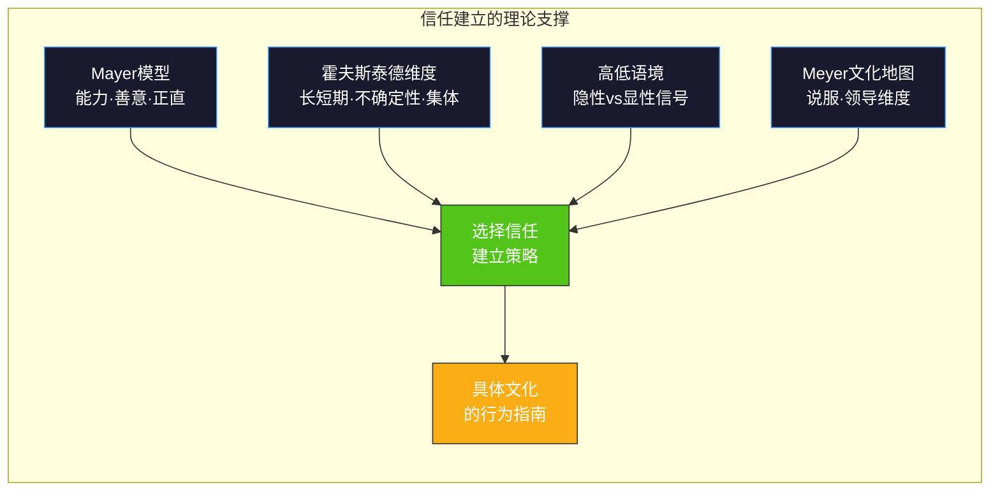
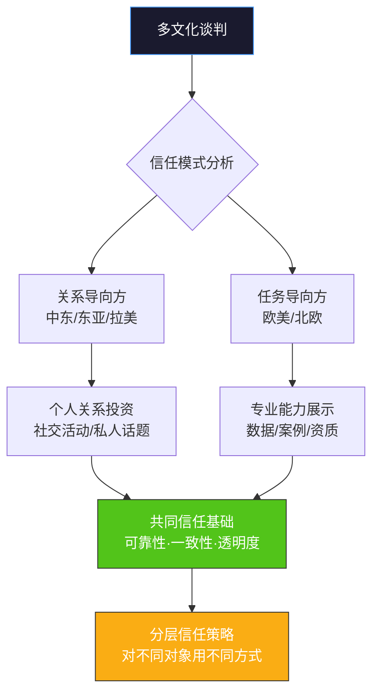

## 场景三：国际商务谈判中的信任建立

### 背景描述

王芳是一家中国制造业企业的销售总监，负责与一家中东客户的大宗订单谈判。第一次会面时，对方的采购经理Ahmed没有直接讨论业务，而是花了大量时间询问王芳的家庭、旅行经历和对中国文化的看法。随后，Ahmed邀请王芳参加了一个家庭晚宴。在第二次和第三次会面中，才逐渐开始讨论业务细节。

王芳感到困惑甚至焦虑——她只有五天的出差时间，公司期望她在回国前至少拿到一份意向书。第一天结束时，她连产品目录都没机会展示。她开始怀疑对方是否有诚意，或者只是在拖延时间。

这个场景揭示了国际商务谈判中最常见、也最容易被忽视的核心议题：**信任建立的文化差异**。在不同文化中，"信任"的定义、建立路径和衡量标准截然不同。一个在A文化中被视为"高效专业"的行为，在B文化中可能被解读为"急功近利、不可信赖"。

**这个案例为什么重要**：根据普华永道2023年全球CEO调查，67%的跨国合作失败可以追溯到关系建立阶段的信任缺失，而非技术或价格问题。麦肯锡的研究也显示，在中东和亚洲市场，拥有深度信任关系的供应商在价格谈判中平均可获得4-7%的溢价空间，合同续约率高出35%。信任不是"软技能"，而是直接影响商业结果的"硬实力"。

---

### 理论框架：为什么信任模式存在文化差异

#### 任务信任与关系信任的二元模型

跨文化商务研究中，信任建立方式通常分为两种基本模式：

| 维度 | 任务信任（Task-based Trust） | 关系信任（Relationship-based Trust） |
|------|------------------------------|--------------------------------------|
| 核心逻辑 | "你能力够，我就信你" | "我了解你这个人，我才信你" |
| 建立速度 | 较快，可在几次互动中建立 | 较慢，需要数周甚至数月 |
| 建立方式 | 通过专业表现、履约记录、资质证明 | 通过社交互动、个人了解、共同经历 |
| 典型文化 | 美国、德国、北欧、澳大利亚 | 中国、日本、韩国、中东、拉丁美洲 |
| 商务节奏 | 先谈业务，关系随合作深化 | 先建关系，业务随信任展开 |
| 风险感知 | "合同能保护我" | "了解这个人能保护我" |
| 信任破裂修复 | 通过数据和补救方案修复 | 通过个人道歉和关系补偿修复 |
| 信息共享方式 | 通过正式文件和报告 | 通过私人对话和暗示 |

这个二元模型并非非此即彼——每种文化都同时包含两种信任元素，区别在于**权重分配**。美国商务人士也会在高尔夫球场谈生意，但他们把那视为"润滑剂"而非"前提条件"；中东商人也会看你的公司资质，但那些只是"入场券"，真正的信任要靠个人关系来建立。

#### Mayer信任整合模型的跨文化应用

组织行为学家Mayer等人（1995）提出的信任整合模型是理解跨文化信任的另一个关键框架。该模型认为信任由三个核心维度构成，而每个维度在不同文化中的权重截然不同：

**能力（Ability）**：对方相信你有能力完成承诺的事。在德国和美国文化中，这一维度权重最高——展示专业资质、成功案例和技术能力是建立信任的首要途径。王芳如果面对的是德国客户，应该在第一天就拿出ISO认证、质量检测报告和客户好评数据。

**善意（Benevolence）**：对方相信你关心他的利益，而非只关心自己的利润。在中东、中国和拉美文化中，这一维度权重最高——Ahmed通过邀请王芳参加家庭晚宴，本质上是在评估"这个人是否真的关心我这个人，而不仅仅是我的订单"。

**正直（Integrity）**：对方相信你遵守原则、言行一致。这是所有文化中都重要的基础维度，但在高不确定性规避的文化（如日本、德国）中权重尤其高——一旦被发现有不诚实行为，信任几乎不可修复。

#### 霍夫斯泰德维度的映射

从霍夫斯泰德文化维度理论来看，信任建立模式与以下维度高度相关：

**长期导向 vs 短期导向**：长期导向的文化（如中国、日本、中东）更倾向于在前期投入大量时间建立关系，因为他们把商务关系视为长期投资而非单次交易。短期导向的文化（如美国、英国）更关注即时结果和快速回报。

**不确定性规避**：高不确定性规避的文化（如日本、德国）通过详细合同和制度来降低风险；而中东等文化则通过"了解这个人"来降低风险——他们相信一个值得信赖的人比一纸合同更可靠。

**个人主义 vs 集体主义**：集体主义文化中，你是谁的"朋友""同乡""同学"往往比你的公司品牌更重要。信任通过社会网络传递——如果Ahmed的某个朋友认识王芳的某个同事，这份"转介绍"的信任权重可能超过任何企业宣传片。

**权力距离**：高权力距离文化（如中东、中国、印度）中，信任建立往往需要"自上而下"——先获得高层决策者的信任，中层执行者的配合自然跟随。在低权力距离文化（如北欧、荷兰）中，每一层级的信任都需要独立建立。这意味着在中东谈判中，"搞定老板"是第一步；而在北欧谈判中，让每个相关部门都认可你的方案同样重要。

#### 高低语境对信任信号的影响

在高语境文化中（中东、东亚），信任信号往往是**隐性的**——对方不会直接说"我信任你"，而是通过行为暗示：

- 邀请你参加私人聚会 → 高度信任信号
- 让你见到家庭成员 → 极高信任信号
- 开始谈论非业务话题（政治、家庭、个人经历） → 正在评估信任
- 始终只在办公室见面、只谈业务 → 信任尚未建立

在低语境文化中（美国、德国），信任信号更**显性**：

- 签署保密协议（NDA） → 进入信任建立流程
- 分享内部数据和需求 → 信任初步建立
- 引荐给高层管理者 → 信任升级
- 快速推进合同条款 → 高度信任

误读这些信号是国际商务中最常见的失败原因之一。

#### Erin Meyer文化地图的信任维度

INSEAD教授Erin Meyer在《文化地图》（The Culture Map）中提出了更精细的跨文化分析框架，其中两个维度与信任建立直接相关：

**说服维度（Persuading）**：从"原理优先"到"应用优先"的光谱。德国和法国人喜欢先理解理论原理再看应用案例（"先告诉我为什么这个技术可行"）；美国人和中国人更喜欢先看实际应用和案例（"先告诉我别的客户用了效果怎样"）。王芳准备的"产品目录"如果面对的是原理导向的客户，应该补充技术原理和机理论证；如果面对应用导向的客户，则应该突出客户案例和实际效果数据。

**领导维度（Leading）**：从"平等型"到"等级型"的光谱。在等级型文化中，信任的建立路径是"先向上后向下"——需要先获得最高层的认可，信任才会在整个组织中传导。在平等型文化中，信任需要"全面渗透"——每个接触点的人都需要被说服。

---

### 场景深度复盘：王芳与Ahmed的谈判

#### 第一天：文化错位的焦虑

王芳的内心独白可能是这样的："这个人到底有没有诚意？我已经来了第一天，他一句正事都不谈。我请了假、买了机票、住着酒店，每一天都在烧钱。"

而Ahmed的逻辑完全不同："这个中国女人远道而来，我必须先了解她是否值得信任。如果她是那种只关心价格和交期的人，那这笔生意即使签了也做不长。我要看看她是不是一个可以成为朋友的人。"

这种错位的核心在于：**双方都在评估对方，但评估标准完全不同**。王芳用"效率"来衡量诚意，Ahmed用"关系投入"来衡量诚意。

**王芳的焦虑来源分析**：

| 焦虑触发点 | 王芳的解读 | Ahmed的实际意图 |
|-----------|-----------|---------------|
| 第一天不谈业务 | "对方没有诚意" | "我在评估你是否值得信任" |
| 问家庭和个人问题 | "浪费时间" | "了解你这个人的价值观" |
| 邀请家庭晚宴 | "又一天没进展" | "给你最高的信任信号" |
| 不看产品目录 | "对产品不感兴趣" | "产品随时可以看，人先看清楚" |

王芳需要调整的核心认知：**在关系导向文化中，对方花时间了解你个人，恰恰说明他对这笔生意是认真的**。真正没有诚意的商人会快速应付你，而不是邀请你进入他的私人生活。

#### 家庭晚宴：关键时刻的解码

Ahmed邀请王芳参加家庭晚宴，这在中东商务文化中是一个**里程碑式的信任信号**。在阿拉伯文化中，家庭是社会结构的核心，邀请商务伙伴进入家庭空间意味着：

- "我把你当朋友，不只是生意人"
- "我希望我的家人认识你"
- "我在这段关系中投入了个人层面的信任"

如果王芳在这个环节表现出以下任何一种行为，都可能损害信任：

- 频繁看手机或手表 → "她不尊重我的家庭时间"
- 急于把话题拉回业务 → "她只关心利益，不关心我们"
- 对家庭成员表现冷淡 → "她不认同我的价值观"
- 拒绝食物或饮料 → 在阿拉伯文化中，共享食物是信任的象征，拒绝可能被解读为拒绝关系
- 穿着过于暴露 → 在保守的阿拉伯家庭中，着装得体是尊重的信号
- 不赞美主人的家和食物 → 阿拉伯文化中的待客之道（Diyafa）是核心价值观，赞美是对主人最大的认可

**家庭晚宴的黄金法则**：把注意力从"我需要推进业务"切换到"我正在获得这个人最高级别的信任"。这不是浪费时间——这是用一天时间完成了别人可能需要一个月才能达到的信任深度。

#### 正确的应对路径

王芳应该在五天出差中这样安排时间分配：

```mermaid
gantt
    title 五天出差时间分配建议
    dateFormat  HH:mm
    axisFormat %H:%M
    section 第一天
    纯社交/关系建立   :a1, 09:00, 8h
    section 第二天
    社交+轻度业务话题  :a2, 09:00, 8h
    section 第三天
    业务深入讨论      :a3, 09:00, 8h
    section 第四天
    方案展示+谈判     :a4, 09:00, 8h
    section 第五天
    总结+关系巩固     :a5, 09:00, 4h
```

注意：实际节奏应根据对方反应灵活调整。如果Ahmed在第二天就主动提起业务，说明信任建立进展顺利；如果第三天仍在纯社交，说明需要更多时间投入。

**每天的关键动作清单**：

| 天数 | 核心目标 | 具体动作 | 信任指标 |
|------|---------|---------|---------|
| 第1天 | 破冰+文化尊重 | 赞美城市/文化、学习阿拉伯问候语、真诚回应个人话题 | 对方是否主动分享个人信息 |
| 第2天 | 深化关系 | 参与社交活动、分享自己的故事、提及昨天聊天的后续 | 对方是否用"我的朋友"称呼你 |
| 第3天 | 自然过渡到业务 | 在聊天中自然带入行业话题、展示专业见解 | 对方是否主动问业务问题 |
| 第4天 | 深入谈判 | 展示方案、讨论细节、寻求共识 | 对方是否引入其他决策者 |
| 第5天 | 巩固+承诺 | 总结共识、确认后续计划、关系维护承诺 | 对方是否主动规划下次见面 |

---

### 分区域策略：不同文化的信任建立方法

#### 中东地区（阿拉伯国家）

**信任建立节奏**：慢热型，通常需要3-5次会面才能进入实质性商务讨论。

**关键行为准则**：

- **学会基本阿拉伯问候语**。"As-salamu alaykum"（愿你平安）是万能开场白，对方会因为你说阿拉伯语而感到被尊重。即使发音不标准也没关系——努力本身就是信任信号。回应是"Wa alaykum as-salam"（愿你也平安）。
- **用右手递东西**。在阿拉伯文化中，左手被认为是不洁的。递名片、递文件、握手都应使用右手。用餐时也只用右手取食。
- **尊重伊斯兰教习俗**。如果在斋月期间拜访，不要在对方面前吃喝。了解每日祈祷时间（每天五次），避免在祈祷时段安排会议。如果对方中途暂停去祈祷，安静等待，不要表现出不耐烦。
- **谈论家庭是安全话题**。问对方有几个孩子、孩子在读什么学校，这在中东文化中是友好的社交话题，不像某些西方文化中可能被视为隐私侵犯。但避免询问对方妻子的详细情况——在保守的阿拉伯文化中，这可能被视为越界。
- **耐心等待茶/咖啡仪式**。阿拉伯商务会面通常以阿拉伯咖啡（Qahwa）或薄荷茶开始。这个仪式本身就是信任建立的一部分——不要催促，慢慢喝，享受这个过程。当主人给你续杯时，如果你不想再喝，轻轻摇晃杯子示意即可——直接递回空杯在某些地区可能有特殊含义。
- **送礼的时机和方式**：避免在第一次见面时送礼。过于贵重的礼物可能让对方感到有压力，甚至可能被解读为试图"收买"。在建立初步信任后（通常第2-3次见面），可以带一些中国特色小礼物（茶叶、丝绸制品、景德镇瓷器）。避免送酒精饮品（除非你确定对方饮酒）、猪皮制品或带有十字架等宗教符号的物品。
- **着装建议**：男士穿深色西装，女士穿着保守得体（遮盖肩膀和膝盖）。在沙特等特别保守的国家，女性商务人士应准备一条围巾以备需要。

**谈判中的信任信号识别**：

| 对方行为 | 信任含义 | 建议回应 |
|---------|---------|---------|
| 邀请你到家里做客 | 极高信任 | 真诚接受，带小礼物 |
| 开始谈论政治/宗教话题 | 信任升级中 | 认真倾听，不轻易表态 |
| 让你见到他的孩子 | 非常信任 | 对孩子友好，赞美家庭 |
| 开始用"我的朋友"称呼你 | 信任建立 | 以同样方式回应 |
| 始终只在办公室见面 | 信任不足 | 增加社交投入 |
| 会面时间越来越短 | 警示信号 | 反思是否冒犯了对方 |
| 主动给你介绍他的商业伙伴 | 高度信任 | 珍惜这个机会，认真对待每次引荐 |
| 在你面前接私人电话 | 信任表现 | 这说明他不把你当外人 |

#### 日本

**信任建立节奏**：极其缓慢，可能需要数月甚至数年的关系培育。日本有句谚语"石の上にも三年"（坐石三年），意思是信任需要长期耐心的积累。

**关键行为准则**：

- **名片礼仪是第一道关卡**。双手递接名片，仔细阅读后放在桌面上（不要直接收进口袋），离席时带走。名片代表对方的身份，草率对待等于不尊重对方。如果你的名片有日文版（背面印日文），会获得额外加分。
- **"读空气"（空気を読む）**。日本商务文化中，很多信息不是说出来的，而是通过语气、停顿、表情暗示的。如果对方说"这个方案我们会认真考虑"，在很多情况下这意味着"不行"，只是不会直接拒绝。以下是常见日式委婉表达的解码：

| 日本人说的话 | 可能的真实含义 |
|-------------|-------------|
| "ちょっと難しいですね"（有点困难） | 不可能 |
| "検討します"（我们考虑一下） | 大概率不行 |
| "前向きに検討します"（我们会积极考虑） | 有一定可能性 |
| "結構ですね"（不错呢） | 可能是礼貌性回应，需结合语境判断 |
| "大丈夫です"（没问题） | 要看语境，有时意思是"不需要了" |

- **不要在第一次见面时施压**。日本商务人士需要经过内部"根回し"（nemawashi，事前协调）才能做决定。催促对方快速决定会适得其反。你需要做的是：在每次会议后提供详尽的书面材料，让对方带回公司内部讨论。
- **共同进餐是关键场景**。日本商务餐（接待，settai）是信任建立的重要环节。在居酒屋中，当日本人开始用比较随意的方式说话时，说明关系在升温。不要拒绝对方的喝酒邀请——即使你不喝酒，也可以点无酒精饮品参与社交。日本有"飲みニケーション"（nommunication，喝酒+沟通）的说法，很多重要的信任建立发生在第二场（二次会）和第三场（三次会）。
- **守时是底线**。迟到在日本文化中是严重的信任破坏行为。提前5-10分钟到达是理想状态。如果不可避免地会迟到，哪怕只迟到2分钟，也要提前打电话通知。
- **"建前"与"本音"的识别**。"建前"（tatemae）是社交场合的表面态度，"本音"（honne）是真实想法。在日本商务中，你需要学会穿透"建前"看到"本音"。方法之一是观察对方在非正式场合（酒后、私下）的态度变化——如果开始说出不同的话，那才是真实想法。

#### 德国

**信任建立节奏**：中等偏快，但信任基于专业能力而非个人关系。

**关键行为准则**：

- **准备好充分的专业材料**。德国商务人士重视数据、资质和专业背景。公司介绍、产品质量认证、过往业绩案例——这些"硬材料"是信任的基石。准备一份详尽的技术规格书（Technische Spezifikation），德语版本会获得显著加分。
- **准时是基本尊重**。德国人对守时的要求仅次于日本。"准时"在德国意味着"提前5分钟到达"，"迟到5分钟"在德国文化中的严重程度等同于"迟到30分钟"在很多其他国家。
- **直奔主题不等于不礼貌**。在德国，快速进入正题被视为高效和专业的表现。冗长的寒暄反而可能让对方觉得你浪费时间。通常10分钟以内的简短寒暄就足够。
- **尊重流程和规则**。德国人信任制度和流程。如果你能展示你的公司有完善的质量管理体系（如ISO 9001、IATF 16949），这比十次社交晚宴更有效。准备好回答关于生产流程、质量控制、环保标准的详细问题。
- **书面确认一切**。口头承诺在德国商务文化中权重较低，书面记录才是信任的载体。每次会议结束后，主动发送详细的会议纪要（Meeting Minutes/Protokoll）。
- **避免夸大其词**。德国人对"销售话术"非常敏感。如果你说"我们是行业最好的"，德国人会要求你提供第三方数据支持。用精确的数据和具体的案例说话，比任何修辞都有效。

#### 美国

**信任建立节奏**：快速，但信任可能同样快速地消失。

**关键行为准则**：

- **展示成果和数据**。美国人信任"proof"——客户案例、ROI数据、市场表现。准备一份简洁有力的pitch deck（演示文稿），包含：问题定义、你的解决方案、客户案例、数据支撑、定价方案。
- **适度的个人化**。美国商务文化接受一定程度的个人话题（运动、旅行、天气），但通常在10-15分钟内就会转入正题。如果你想快速建立联系，可以问"Where are you from?"或"What do you do for fun?"——美国人喜欢谈论自己的故事。
- **自信但不自大**。美国文化尊重自信的表达。如果你有好的产品或方案，大胆展示。但注意不要过度吹嘘——美国商务人士对"too good to be true"的警惕性很高。用具体的数字和故事来支撑你的自信。
- **Follow-up是信任的延续**。会后24小时内发送感谢邮件和会议纪要，这在美国商务文化中是专业度的重要标志。邮件中要明确列出：讨论的要点、双方的责任、下一步行动计划和时间表。
- **"电梯演讲"能力**：美国人重视简洁有力的表达。准备一个30秒、一个2分钟、一个5分钟版本的公司/产品介绍，根据场合灵活切换。

#### 拉丁美洲（巴西、墨西哥等）

**信任建立节奏**：与中东类似，关系导向，但更随意和热情。

**关键行为准则**：

- **身体距离比北欧和东亚文化更近**。拉丁美洲人在交谈时通常站得更近，可能会有拥抱、拍肩膀等肢体接触。这是友好的信号，不要退缩。男性之间的拥抱（abrazo）在拉美是常见的问候方式。
- **时间观念较灵活**。会议可能比预定时间晚30分钟开始。这不是不尊重，而是文化常态。但作为外方，你仍然应该准时到达——这会被视为尊重的表现。
- **家庭和足球是安全话题**。与中东类似，谈论家庭在拉美文化中是建立关系的好方式。足球（fútbol）是拉美的"通用语言"——即使你不是球迷，了解一些基本信息（当地最受欢迎的球队、最近的重要比赛）会大大提升亲和力。
- **巴西的"jeitinho"文化**。巴西人倾向于灵活处理规则，寻找变通方案。如果你过于死板地坚持条款，可能被视为不近人情。理解"jeitinho"不是违规，而是"在规则框架内寻找最灵活的解决方案"。
- **墨西哥的"mañana"心态**：在墨西哥商务文化中，"明天再说"不一定是拖延，而是关系建立过程的一部分。不要试图用"deadline压力"来加速谈判——这会适得其反。
- **共同用餐不可或缺**：在拉美，商务餐往往比正式会议更重要。如果对方邀请你共进午餐（almuerzo），即使你已经吃过，也要接受邀请。在巴西，午餐可能持续2小时以上，这是正常的。

#### 印度

**信任建立节奏**：中等偏慢，关系导向，但混合了强烈的等级意识。

**关键行为准则**：

- **尊重层级结构**。印度商务文化中的等级观念非常强。先与最高决策者建立关系，再与执行层互动。如果你绕过高层直接与中层谈判，可能会被视为不尊重。
- **"Jugaad"灵活变通**：印度有类似巴西"jeitinho"的文化——"Jugaad"意为"用创造性的方式解决问题"。在谈判中，展现灵活性和创造性方案会获得比死守条款更多的信任。
- **茶歇（Chai）是社交信号**：如果印度同事给你端来一杯chai（印度奶茶），不要拒绝——这是信任和好客的表现。即使你不渴，接过来象征性地喝几口即可。
- **语言多样性**：印度有22种官方语言和数百种方言。在南部（如班加罗尔），英语是主要商务语言；在北部（如德里），印地语更常见。提前了解对方的语言偏好，必要时准备翻译。
- **节日和宗教敏感性**：印度有印度教、伊斯兰教、锡克教等多种宗教。排灯节（Diwali）、开斋节（Eid）等重要节日是发送祝福和建立关系的好时机。但要注意区分对方的宗教背景——对穆斯林说"Happy Diwali"可能适得其反。

#### 东南亚（越南、泰国、印尼等）

**信任建立节奏**：关系导向，但节奏因国家而异。

**关键行为准则**：

- **"面子"（Face）文化在东南亚极其重要**：在泰国（"kreng jai"，เกรงใจ）、越南和印尼，避免让对方丢面子是信任建立的前提。即使你发现对方的方案有明显错误，也不要当众指出——私下沟通更有效。
- **泰国的"微笑国度"**：泰国人即使在不同意或不舒服时也会微笑，这不代表一切都好。需要通过行为（而非表情）来判断真实态度。
- **印尼的"Majelis"文化**：在印尼，重大决定往往需要通过集体讨论（musyawarah）达成共识。不要期望一次会议就能得到最终答案。
- **越南的关系网络（Quan hệ）**：在越南做生意，"关系"（quan hệ）比合同更重要。找到一个可靠的本地合作伙伴或中间人是成功的关键。

---

### 跨文化信任建立的七步法

无论面对哪种文化，以下七步法都适用，但每一步的具体执行方式需要根据目标文化进行调整：

#### 第一步：文化预研（出发前）

在踏上飞机之前，至少完成以下准备工作：

- 了解目标文化的霍夫斯泰德维度得分（可通过hofstede-insights.com查询）
- 学习5-10句当地语言的基本用语（问候、感谢、告别、赞美）
- 了解当地的饮食禁忌和宗教习俗
- 研究对方公司的背景、行业地位和近期新闻
- 准备对方文化中常见的社交话题清单
- 阅读至少一本关于目标文化的深度书籍（推荐Erin Meyer《文化地图》、理查德·刘易斯《文化碰撞》）
- 了解当地的重要节日和禁忌日期（避免在斋月期间安排餐会、避免在忌日送礼等）
- 准备2-3个可以分享的个人故事（家庭、旅行、爱好），用于关系建立阶段

#### 第二步：首印象管理（前30秒）

心理学中的"首因效应"（Primacy Effect）表明，人们在接触的前30秒内就会形成对你的初步印象，且这个印象很难改变。在跨文化场景中，首印象管理的要素包括：

- **着装**：宁可正式也不要随意。在不确定对方文化对着装的要求时，保守选择是安全的。具体建议：中东深色西装、日本商务正装（深色+白衬衫）、德国商务正装、美国商务休闲（视行业而定）、拉美偏正式但可带色彩。
- **问候方式**：提前了解正确的问候方式——握手的力度、是否需要鞠躬、是否需要贴面礼。
- **语言开场**：用当地语言说一句问候语，即使后面切换回英语或翻译，这个开头也会产生显著的信任加分。
- **肢体语言**：保持适度的眼神接触（在中东和欧美文化中表示真诚，但在某些亚洲文化中过长的眼神接触可能被视为冒犯）、保持开放的身体姿态（不要交叉双臂）、适度微笑。

#### 第三步：关系投资（第1-3次会面）

这是信任建立的核心阶段，尤其在关系导向文化中至关重要。

具体行为清单：

- 主动询问对方的个人背景（家庭、家乡、教育经历）
- 认真倾听并记住对方分享的个人信息，在后续会面中提及
- 积极参与社交邀请（餐会、文化活动、家庭聚会）
- 分享你自己的个人故事——信任是双向的，单方面索取信息会让人警觉
- 对当地文化表达真诚的兴趣和赞赏

**关系投资的具体技术**：

- **"信息交换法"**：每次问对方一个问题后，也分享一个关于自己的信息。这避免了审讯式提问的尴尬，也让对方感到你同样在敞开心扉。
- **"记忆锚点法"**：在对方分享信息时，找到可以深入的"锚点"。例如，Ahmed提到女儿喜欢画画，王芳可以回应"我女儿也喜欢画画，她最近在学水彩"——找到共同点是关系建立的催化剂。
- **"后续跟进法"**：在第二次见面时，主动提及上次聊天的内容。"Ahmed，上次你说你女儿要参加绘画比赛，结果怎么样？"——这表明你在认真对待这段关系。

#### 第四步：能力展示（自然过渡）

在关系初步建立后，通过"不经意"的方式展示你的专业能力，而非刻意推销：

- 在聊天中自然地提到行业趋势和见解
- 分享你帮助其他客户解决问题的故事（注意不泄露机密）
- 提出有洞察力的问题，展示你对对方业务的理解
- 如果有产品样品或演示，可以在轻松的氛围中展示

**过渡话术示例**：

> "说到迪拜的发展，我最近注意到中东市场对XX产品的需求增长很快。我们在XX项目中也遇到了类似的需求……"

这种过渡的关键是：**从对方关心的话题自然过渡到你的专业领域**，而不是突兀地切换到"推销模式"。

#### 第五步：承诺测试（建立可靠性）

信任不仅靠言语，更要靠行动。在谈判过程中，刻意创造一些"小承诺"并确保兑现：

- "我明天把那份资料发给你"——然后真的在明天发
- "我帮你联系那个人"——然后真的帮对方联系
- "下周三之前给你方案初稿"——然后准时交付

这些小承诺的累积效应是巨大的。每一次兑现都在强化"这个人靠得住"的判断。行为心理学中的"一致性原理"（Cialdini, 1984）解释了这个机制：一旦对方在心中形成了"这个人可靠"的认知，后续的行为都会被这个认知框架解读——这就是信任的"复利效应"。

#### 第六步：冲突处理（信任的压力测试）

真正的信任在冲突中才能检验。当出现分歧或问题时（这在谈判中几乎不可避免），你的处理方式会深刻影响对方的信任判断：

- **不要回避问题**。在很多文化中，回避问题比承认问题更损害信任。
- **承担责任**。如果问题出在你这边，直接承认并提出解决方案。
- **保持冷静**。在任何文化中，情绪失控都会严重损害信任。
- **寻求双赢**。展示你愿意为对方的利益做出让步的姿态，这在关系导向文化中尤其有效。

**跨文化冲突处理的关键差异**：

| 文化类型 | 冲突处理偏好 | 注意事项 |
|---------|------------|---------|
| 中东 | 私下沟通、通过中间人调解 | 避免当众让对方丢面子 |
| 日本 | 极力避免正面冲突、通过暗示传达 | 直接对抗会严重损害关系 |
| 德国 | 直接但有逻辑地讨论问题 | 用数据和事实说话，避免情绪化 |
| 美国 | 直接沟通、寻求解决方案 | 快速给出行动计划比道歉更重要 |
| 拉美 | 先修复关系再解决问题 | 情感上的安抚比逻辑论证更有效 |

#### 第七步：关系维护（谈判结束后）

信任不是谈判结束就完成的任务——它需要持续维护：

- 定期发送问候信息（节日、生日、对方国家的重要节日）
- 分享对对方有价值的信息（行业报告、市场动态）
- 在社交媒体上保持互动
- 如果有下一次出差，提前告知对方并安排会面
- 在对方需要帮助时主动伸出援手——即使没有直接商业回报

**关系维护的频率建议**：

| 信任层级 | 维护频率 | 维护方式 |
|---------|---------|---------|
| 核心客户 | 每1-2周 | 微信/WhatsApp消息、行业信息分享 |
| 重要客户 | 每月 | 节日问候、定期电话 |
| 潜在客户 | 每2-3月 | 邮件Newsletter、偶尔回复 |

---

### 实战对话示例

#### 场景一：第一次见面，Ahmed开始"闲聊"

**错误示范**：

> Ahmed: "王总，您这次来迪拜感觉怎么样？之前来过吗？"
>
> 王芳："挺好的。Ahmed，关于我们上次邮件讨论的那个订单，我带了一份详细的报价单，您看我们现在是不是可以……"
>
> Ahmed:（微笑，但内心："这个人只关心生意。"）

**正确示范**：

> Ahmed: "王总，您这次来迪拜感觉怎么样？之前来过吗？"
>
> 王芳："这是我第一次来迪拜！说实话，昨天到的时候被哈利法塔震撼到了。我拍了好多照片准备给我的女儿看，她今年八岁，特别喜欢画画，一直说要画一座全世界最高的楼。"
>
> Ahmed:（笑）"八岁！我女儿今年十岁，也喜欢画画。您应该带她来迪拜，她一定会喜欢这里的水族馆。"
>
> 王芳："真的吗？她在视频里看过迪拜的水族馆，一直吵着要去。Ahmed，您平时周末一般带家人去哪里玩？"
>
> （对话自然展开，信任在交流中逐步建立）

关键区别：正确示范中，王芳做了三件事——（1）展示了个人层面的自己（提到女儿），（2）对Ahmed的话题表现出真诚兴趣，（3）通过提问把对话延续下去。

#### 场景二：家庭晚宴上的得体表现

**关键行为指南**：

1. **到达时**：赞美主人的家。阿拉伯文化中，主人会为自己的家感到自豪，赞美是友好的信号。"您的家非常漂亮"是最安全的开场。如果能看到《古兰经》书法或伊斯兰艺术品，可以表达对其精美工艺的赞赏——这表明你尊重对方的文化。
2. **用餐时**：阿拉伯家庭通常会准备丰盛的食物。尽量尝试每道菜，并表达赞美。如果遇到你不习惯的食物，少量尝试即可，但不要拒绝。推荐话术："这道菜的味道非常独特，能告诉我是什么做的吗？"——既表达了兴趣，又自然地延续了对话。
3. **与家庭成员互动**：对Ahmed的妻子和孩子保持友好但适当的距离（在保守的阿拉伯家庭中，与异性家庭成员的互动需要保持一定分寸）。赞美孩子的聪明或可爱是安全的。如果Ahmed的妻子不主动出现，不要主动要求见面——在保守的家庭中，这可能被理解为越界。
4. **离席时**：表达真诚的感谢，并说"下次如果您来中国，一定要让我招待您"——这是中东文化中表达友谊的惯例。

#### 场景三：从"闲聊"到"业务"的自然过渡

**第三天的过渡示范**：

> Ahmed: "王总，今天我安排了一个小的沙漠之旅，希望您喜欢。"
>
> 王芳："太好了！我一直想看看真正的沙漠。Ahmed，说到迪拜的发展，我最近读到一篇文章说阿联酋正在大力推进基础设施建设，XX行业的增长率达到了15%。您在这个行业这么多年，怎么看这个趋势？"
>
> Ahmed: "确实如此。我们公司也在扩大产能，这也是为什么我们对你们的产品感兴趣……"
>
> （自然过渡到业务讨论，没有任何突兀感）

过渡的关键技巧：**用一个行业观察或新闻作为桥梁**，从社交话题自然滑入业务话题。这既展示了你的专业性，又不破坏社交氛围。

---

### 常见误区与纠正

#### 误区一：把"闲聊"当"浪费时间"

**错误认知**："我们时间有限，应该尽快进入正题。"

**纠正**：在关系导向文化中，"闲聊"就是"正题"。它是信任建立的必要过程，跳过它等于跳过信任建立。研究表明，在中东和拉丁美洲商务文化中，前期关系建立阶段的投资回报率（ROI）远高于直接进入谈判——关系良好的商务伙伴在价格谈判中平均可获得3-5%的额外让步空间，且合同执行中的配合度显著更高。

**数据支撑**：哈佛商学院的一项研究发现，在关系导向市场中，将15-20%的出差时间用于社交活动的销售人员，其成交率比将90%时间用于"正式业务"的销售人员高出42%。

#### 误区二：用合同代替信任

**错误认知**："签了合同就有保障了，关系好不好无所谓。"

**纠正**：在关系导向文化中，合同被视为"合作关系的记录"而非"合作关系的保障"。如果信任破裂，再完善的合同也难以执行——对方总有办法在条款的灰色地带中找到变通方式。相反，如果信任足够强，即使合同中有不完善的地方，对方也会按照"精神"而非"字面"来执行。

**现实案例**：一家中国电子企业在东南亚某国签订了一份看似完善的供货合同。由于前期关系建立不足，当地合作方在遇到困难时选择了"按合同最低标准执行"，而非积极解决问题。而同期另一家关系维护良好的日本竞争对手，则获得了合作方的主动配合和优先排产。

#### 误区三：把"热情"等同于"信任"

**错误认知**："对方很热情，说明已经信任我了。"

**纠正**：在很多文化中（特别是中东和拉美），热情是社交礼仪的一部分，不代表信任已经建立。真正的信任信号是行为层面的——分享个人信息、邀请进入私人空间、在没有利益关系的情况下提供帮助。不要把表面的热情误读为深层的信任。

**判断标准**：真正信任你的行为信号包括——（1）对方在非工作时间回复你的消息，（2）对方主动告诉你"内部消息"，（3）对方在你遇到困难时主动帮忙，（4）对方开始谈论长期合作而非只关注当前订单。

#### 误区四：忽视非语言信号

**错误认知**："谈判进展顺利，对方一直在微笑点头。"

**纠正**：在高语境文化中，微笑和点头可能只是礼貌，不一定代表同意。日本人的微笑可能表示尴尬或不同意，阿拉伯人的热情可能只是社交习惯。关注**行为信号**而非**表情信号**——对方是否开始主动分享信息？是否开始引入内部人员参与讨论？是否开始谈论未来合作？这些行为比任何表情都更能反映真实的信任水平。

#### 误区五：信任建立是"一次性投资"

**错误认知**："这次出差关系打好了，以后就不用管了。"

**纠正**：信任是"活的资产"——需要持续维护，否则会"贬值"。定期联络、节日问候、信息分享——这些看似微小的行为在关系导向文化中有巨大的维护效果。反之，长期不联系会导致信任流失，下次需要重新建立。

#### 误区六：用同一套方法对待所有外国人

**错误认知**："反正都是外国人，用国际商务礼仪就够了。"

**纠正**："国际商务礼仪"只是一层表面，真正的差异在深层。同样是"守时"，在日本迟到5分钟是灾难，在巴西迟到30分钟可能是常态。同样是"直率"，在美国是专业，在日本是粗鲁。最有效的策略是：针对每一个具体的文化背景，定制你的行为方式。

#### 误区七：忽视翻译和语言障碍的影响

**错误认知**："有翻译在场，语言不是问题。"

**纠正**：翻译不仅是语言的转换器，更是文化的桥梁（或障碍）。一个优秀的翻译能帮你捕捉文化暗示；一个糟糕的翻译可能制造误解。在关键谈判中：（1）提前与翻译沟通你的谈判策略和敏感点，（2）选择有商务经验而非纯语言背景的翻译，（3）在翻译在场时注意语速——太快会导致翻译质量下降，（4）注意观察对方与翻译的互动——如果对方对翻译表现出信任，翻译可能是你额外的信任来源。

---

### 进阶：复杂场景的信任博弈

#### 多文化谈判桌

现实中，谈判桌上的参与者可能来自多个国家。例如，一次三方谈判可能涉及中国企业（关系导向）、德国企业（任务导向）和中东客户（强关系导向）。

在这种场景中，需要采用"分层信任策略"：

- 对关系导向的中东客户：投入时间建立个人关系
- 对任务导向的德国企业：准备充分的专业资料和数据
- 找到三方的"信任公约数"：通常是**可靠性**——无论哪种文化，言行一致都是信任的基础

**多文化谈判的实操建议**：

- 在会议前单独与每一方建立关系，了解他们的信任偏好
- 在正式会议中，准备两种版本的材料——详细的数据报告（给任务导向方）和视觉化的案例展示（给关系导向方）
- 安排不同类型的社交活动——正式的商务晚宴（兼顾任务导向方的舒适度）和轻松的文化体验（满足关系导向方的需求）
- 指定团队中最有文化敏感度的人担任"信任协调员"角色

#### 信任破裂后的修复

当信任已经受损时（例如因为误解、违约或文化冒犯），修复策略需要比首次建立更加谨慎：

**第一步：承认问题**。不要试图淡化或回避。在任何文化中，逃避责任都是信任的毒药。

**第二步：理解对方的文化逻辑**。你认为是"小事"的，在对方文化中可能是严重冒犯。例如，在日本文化中，迟到五分钟可能比在德国文化中迟到半小时更严重；在中东文化中，忽视一次茶歇邀请可能比延迟交货更损害信任。

**第三步：通过行动而非言语修复**。信任修复最有效的方式是**超额兑现下一个承诺**。如果之前的信任破坏是因为延迟交付，那下一次交付就提前完成——而且要确保对方知道这是你特意为之。

**第四步：借助中间人**。在很多亚洲和中东文化中，通过双方都信任的第三方来调解，比直接沟通更有效。中间人可以提供"面子保护"——让双方都能在不失面子的情况下达成和解。

**信任修复的时间窗口**：

| 信任损害程度 | 修复难度 | 建议策略 | 预期修复时间 |
|------------|---------|---------|------------|
| 轻微（迟到、小失误） | 低 | 真诚道歉+下次补偿 | 1-2周 |
| 中等（延迟交货、质量问题） | 中 | 道歉+补救方案+额外补偿 | 1-3月 |
| 严重（违约、文化冒犯） | 高 | 中间人调解+长期行动证明 | 6-12月 |
| 不可逆（欺骗、严重背信） | 极高 | 可能需要更换对接人 | 可能无法修复 |

#### 数字时代的远程信任建立

在后疫情时代，越来越多的国际商务谈判通过视频会议进行。远程环境下的信任建立面临额外挑战：

- **非语言信号被大幅削弱**。摄像头只能展示上半身，很多微妙的肢体语言无法传递。
- **社交场景缺失**。没有一起吃饭、参观、散步的机会。
- **技术障碍增加摩擦**。网络延迟、音画不同步会降低沟通质量。

**远程信任建立的补偿策略**：

- 在正式谈判前安排1-2次"纯社交"视频通话，聊轻松话题。可以邀请对方"参观"你的办公室或工厂（通过视频），用视觉内容弥补社交场景的缺失。
- 通过电子邮件或即时通讯保持日常联络频率。分享行业新闻、有趣的视频或轻松的问候——让对方在没有见面的日子里也能感受到你的存在。
- 发送小礼物到对方办公室（茶叶、书籍、公司纪念品）。在对方的重要节日或生日寄送手写贺卡——在数字时代，手写信件的价值反而更突出。
- 如果条件允许，安排至少一次线下会面——线下一次见面的 trust-building 效果可能超过十次视频会议。
- 使用高质量的视频设备和稳定的网络，这是远程商务中"专业度"的体现。虚拟背景要整洁专业，灯光要充足。
- **利用数字化工具**：共享协作平台（如Notion、Confluence）的使用本身就是信任建立——它体现了透明度和协作意愿。

#### 信任建立中的法律与合规考量

在国际商务中，信任建立活动必须在法律框架内进行：

- **反腐败法规**：美国《反海外腐败法》（FCPA）、英国《反贿赂法》（UK Bribery Act）对礼品和招待有严格限制。一般来说，价值低于50美元的纪念品是安全的，但现金或现金等价物（如购物卡）绝对不可以。
- **文化敏感性vs法律合规**：在某些文化中，"回扣"或"中间人佣金"是商业惯例，但在很多国家这是违法行为。找到合法的信任建立方式是国际商务人士的必修课。
- **礼品申报**：很多公司有礼品申报制度。在送礼前了解双方公司的合规政策，避免好意变成麻烦。

---

### 信任建立自检清单

在每次国际商务谈判前和过程中，使用以下清单进行自我评估：

**出发前准备**：

- [ ] 了解目标文化的信任建立模式（任务型/关系型）及其在Mayer模型中的维度权重
- [ ] 学习当地语言的基本问候语（至少5句：你好、谢谢、请、对不起、再见）
- [ ] 研究对方的宗教禁忌和饮食习惯
- [ ] 准备适合的社交话题清单（家庭、爱好、旅行、当地美食）
- [ ] 准备中国特色小礼物（非贵重，但有文化内涵，符合双方公司合规政策）
- [ ] 了解对方的商务礼仪（名片交换、着装要求、守时标准）
- [ ] 准备个人故事（家庭、爱好、旅行经历），用于关系建立阶段
- [ ] 阅读关于目标文化的深度资料（书籍、行业报告、文化指南）
- [ ] 了解当地重要节日和忌日，避免触碰敏感时间

**会面中观察**：

- [ ] 对方是否主动分享个人信息？→ 是：信任正在建立
- [ ] 对方是否邀请你参加社交活动？→ 是：信任升级信号
- [ ] 对方是否引入其他同事/家人与你认识？→ 是：信任深度扩展
- [ ] 对方对你的称呼是否在变化（从正式到亲近）？→ 是：信任量化指标
- [ ] 对方是否开始主动谈论未来合作而非仅限当前交易？→ 是：信任成熟信号
- [ ] 对方是否开始告诉你"内部信息"或行业八卦？→ 是：高度信任表现
- [ ] 会议氛围是否从正式变得轻松？→ 是：关系正在深化

**会面后维护**：

- [ ] 24小时内发送感谢信/信息
- [ ] 记录对方分享的个人信息（家庭、爱好、重要日期）到CRM系统
- [ ] 按照约定时间兑现所有承诺
- [ ] 在后续联络中提及之前的私人话题
- [ ] 在对方国家的重要节日发送祝福
- [ ] 定期分享对对方有价值的行业信息
- [ ] 安排定期的非商务联络（每1-3个月）

---

### 关键启示

在关系导向的文化中，"花时间建立关系"不是浪费时间，而是"投资时间"。这种前期的关系投资将在后续的商务合作中带来丰厚回报——具体表现为：更高的价格容忍度、更强的合同执行意愿、更多的业务转介绍机会，以及在困难时期的优先支持。

信任建立的文化差异不是需要克服的"障碍"，而是需要理解和尊重的"规则"。当你能够根据对方文化的信任逻辑来调整自己的行为时，你不仅在建立商业信任，更在建立跨文化的个人信任——这才是国际商务中最持久的竞争优势。

记住：**信任是所有商业关系的底层操作系统**。技术可以被复制，价格可以被竞争，但深度信任关系是不可替代的护城河。在国际商务中，那些愿意花时间理解对方文化、尊重对方信任逻辑的人，最终会获得远超短期收益的长期回报。

***
