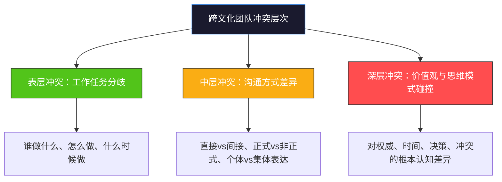
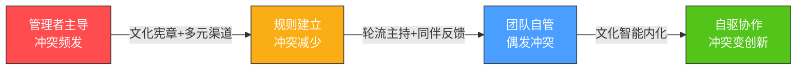

## 场景四：跨文化团队管理的挑战

跨文化团队是全球化时代最普遍、也最考验管理者能力的组织形态。McKinsey 2020年的研究显示，文化多样性排名前四分之一的企业，盈利能力高于行业中位数36%——但这份"多样性红利"并非自动兑现，它需要管理者具备超越单一文化框架的系统性能力。本章以一个真实度极高的五国团队为样本，从理论框架、个体画像、管理策略、实战对话四个层面，完整拆解跨文化团队管理的"道法术器"。

---

### 背景描述

刘洋是一家跨国科技公司的研发部门经理，刚被总部任命为一个全新项目的技术负责人。他的团队成员来自五个不同的国家：中国、美国、印度、德国和巴西。项目启动后的第三周，他组织了一次项目复盘会议，希望通过坦诚的讨论找出前期工作中存在的问题，为下一阶段制定改进方案。

会议开始后的十五分钟内，五种截然不同的沟通风格在同一个会议室里激烈碰撞：

- **美国成员Jake**在刘洋刚做完开场白后就直接发言："我觉得我们前三周的时间分配有问题。后端架构的评审花了太多时间，我们应该采用更敏捷的方式来推进。"他的语气坦率而自信，甚至带着一点挑战性——但对Jake来说，这完全是正常的"建设性讨论"。
- **德国成员Klaus**随即翻开笔记本电脑上的数据表格："Jake，你的判断可能需要更多数据支撑。根据我的统计，后端架构评审期间发现了17个潜在的性能瓶颈，如果没有这个评审阶段，这些问题会在集成测试阶段爆发，修复成本会增加至少三倍。"Klaus的语气冷静而精确，他不是在反驳Jake，而是在用数据说话。
- **印度成员Priya**全程微笑着点头，在刘洋问她意见时说："我觉得刘经理的安排很好，整体方向是对的。"但她的目光闪烁，手不自觉地转动着笔——这些细微的非语言信号暗示她其实有不同想法。
- **巴西成员Lucas**感受到会议室里微妙的紧张气氛，开玩笑说："嘿，我们才刚开始呢，别像准备打世界大战一样！等我们做完第一个里程碑，大家就放松了。"他试图用幽默化解僵局。
- **中国成员陈明**全程保持沉默，认真做着笔记。直到会议结束后，他才在走廊里单独找到刘洋："刘总，关于Jake说的敏捷方法，我觉得直接套用不太合适，我们团队的协作模式和基础设施还不具备条件。但这个话在会上说不太方便……"

刘洋回到办公室后，面对白板上五个人的名字陷入了沉思。他意识到，这不是一个简单的"沟通风格差异"问题——五个人代表着五种不同的工作逻辑、决策模式和信任建立方式。如果不能有效整合这些差异，这个多元化团队的优势反而会变成内耗的根源。

这个场景揭示了跨文化团队管理中最核心的悖论：**文化多样性既是创新的催化剂，也是冲突的火药桶**。管理者面对的不是"消除差异"，而是"驾驭差异"——让每种文化特质在正确的位置发挥正确的价值。

---

### 理论框架：为什么跨文化团队管理如此困难

跨文化团队的困难并非源于"人与人之间的不理解"这种表面原因，而是有深层的认知结构差异。以下四个理论框架从不同维度解释了这种困难的根源。

#### 塔克曼模型与文化冲突的分层结构

心理学家布鲁斯·塔克曼（Bruce Tuckman）提出的团队发展阶段模型指出，任何团队都要经历五个阶段：组建期（Forming）、风暴期（Storming）、规范期（Norming）、执行期（Performing）和解散期（Adjourning）。在跨文化团队中，**风暴期**的到来更早、烈度更大、持续时间更长。

原因在于：同文化团队的成员在风暴期只需要解决工作方式和角色分配的冲突；而跨文化团队的成员还要额外应对以下隐性冲突层：

大多数管理者只关注表层冲突（任务分歧），而忽略了中层和深层冲突——这就像只治疗发烧症状而忽视感染源一样。刘洋团队中Jake和Klaus的争论看似是"敏捷方法vs传统流程"的技术分歧，实质上是**美国文化的快速迭代偏好**与**德国文化的质量前置偏好**之间的深层碰撞。

更关键的是，三个冲突层之间存在"传导效应"：表层的任务分歧如果处理不当，会激活中层的沟通方式差异（"你为什么用这种方式说话？"），进而引爆深层的价值观冲突（"你根本不尊重专业性"）。管理者的核心任务之一，就是**阻断这种传导链**——在表层冲突阶段就用文化翻译的方式化解，不让它渗透到深层。

#### 霍夫斯泰德文化维度在团队管理中的映射

Geert Hofstede通过对IBM全球11.6万名员工的实证研究，提出了六个文化维度。将这六个维度应用到团队管理场景中，可以清晰地看到每个维度如何影响日常工作行为：

| 文化维度 | 低分端行为表现 | 高分端行为表现 | 刘洋团队中的体现 |
|----------|--------------|--------------|----------------|
| 权力距离（PDI） | 下属主动挑战上级决策，扁平化沟通 | 下属尊重上级权威，等级分明 | Jake直接挑战vs陈明/Priya私下沟通 |
| 个人主义vs集体主义（IDV） | 个人贡献优先，鼓励个体竞争 | 团队和谐优先，强调集体决策 | Jake个人主张vs陈明顾虑团队和谐 |
| 男性化vs女性化（MAS） | 追求卓越、竞争、快速成果 | 注重合作、生活质量、共识 | Jake追求速度vsLucas注重团队氛围 |
| 不确定性规避（UAI） | 接受模糊性，灵活应变 | 需要明确规则，规避风险 | 美国成员接受试错vs德国成员要求充分验证 |
| 长期导向vs短期导向（LRA） | 关注当期成果和快速反馈 | 长期规划，耐心积累 | Jake要快速迭代vsKlaus关注长期架构质量 |
| 放纵vs克制（IVR） | 表达自由，乐观积极 | 自律控制，情绪内敛 | Lucas情感外放vs陈明/Klaus情绪内敛 |

这张表的价值在于：它不是在说哪种文化"更好"或"更差"，而是揭示了**行为差异背后的逻辑一致性**。Jake的直接不是"无礼"，Klaus的质疑不是"找茬"，Priya的微笑不是"没想法"，陈明的沉默不是"不参与"——每种行为都是其文化逻辑的合理产物。

理解这种逻辑一致性的管理意义在于：当你需要调整某个成员的行为时，你不是在否定他的文化，而是在帮他**扩展行为弹性的边界**。比如告诉Jake"在发言前先肯定对方的贡献"，不是要他放弃直接性，而是在直接性的基础上增加一个"文化缓冲层"。

#### 冯·特姆佩纳斯的文化维度补充

荷兰学者冯·特姆佩纳斯（Fons Trompenaars）在霍夫斯泰德的基础上，补充了三个对团队管理尤为重要的维度：

**具体性vs扩散性（Specific vs Diffuse）**：在具体性文化（美国、德国）中，工作关系和私人关系是分开的——你可以激烈争论一个技术方案，然后一起喝咖啡聊天，两者互不影响。在扩散性文化（中国、印度、日本）中，工作中的批评可能被解读为对个人的否定——"你质疑我的方案，就是质疑我的能力"。这个维度直接决定了"对事不对人"这句话在不同文化中的可执行性：对Jake来说，这是字面意思；对陈明来说，这更像是一种美好的愿望。

**成就导向vs归属导向（Achievement vs Ascription）**：在成就导向文化（美国、德国）中，你的地位取决于"你做了什么"；在归属导向文化（中国、印度、日本）中，地位还取决于"你是谁"——年龄、资历、教育背景、家族关系。刘洋作为年轻经理，在面对年龄更大的中国或印度团队成员时，可能需要额外的权威建立策略——不是靠职位赋予的权力，而是靠展示技术实力和决策质量来赢得尊重。

**顺序时间观vs同步时间观（Sequential vs Synchronic）**：在顺序时间文化（美国、德国）中，任务按照计划依次完成，时间线是线性的——"先做A，再做B，最后做C"；在同步时间文化（巴西、印度）中，多个任务可以同时推进，时间是弹性的，关系比时间表更重要。这解释了为什么Klaus做的甘特图精确到小时，而Lucas的进度报告总是"差不多了"——两种回答背后是两种完全不同的时间哲学。

#### 心理安全感：跨文化团队的隐藏基础

哈佛商学院艾米·埃德蒙森（Amy Edmondson）的研究表明，**心理安全感**是高绩效团队的核心特征——它指的是团队成员相信自己可以承担人际风险而不会受到惩罚。在跨文化团队中，心理安全感面临额外的挑战：不同文化对"安全"的定义本身就不同。

对Jake来说，心理安全感意味着"我可以自由表达任何观点"；对陈明来说，心理安全感意味着"我不会因为说了不同意见而丢面子"；对Priya来说，心理安全感意味着"即使我犯了错误，团队也会支持我"；对Klaus来说，心理安全感意味着"我的专业判断会被认真对待"；对Lucas来说，心理安全感意味着"我可以做真实的自己，不需要伪装"。

管理者需要建立的不是一种统一的"安全感标准"，而是**多元化的安全感通道**——让每种文化背景的成员都能找到属于自己的"安全表达方式"。这就是为什么单一的"鼓励大家畅所欲言"往往无效——它只覆盖了低语境文化成员的安全感需求。

---

### 五种文化风格的深度解析

#### 美国成员Jake：直接驱动型

**文化基因**：低语境（Edward T. Hall理论）、低权力距离、高度个人主义、短期导向。

**工作逻辑**：

Jake的工作逻辑根植于美国文化中根深蒂固的"行动偏好"（action bias）。在他的文化框架中，效率等于产出除以时间，任何不能直接贡献于产出的活动——冗长的讨论、反复的确认、过度的文档——都被归类为"浪费"。这不是他个人的偏好，而是整个美国商业文化的默认设置。硅谷的"Move fast and break things"就是这种文化基因的极端表达。

具体来说，Jake的工作逻辑遵循以下优先级排序：

1. **速度优先**：快速试错优于完美计划——"先做出来再调整"。在他的认知中，一个60分的可用方案比一个90分的未完成方案更有价值，因为前者可以在使用中迭代到90分，而后者永远停留在纸面上。
2. **挑战权威是积极行为**：在低权力距离文化中，"如果你有更好的想法，就应该说出来"不是冒犯，而是尽职。Jake挑战刘洋的方案，在他自己看来恰恰是在为团队负责。
3. **个人绩效是衡量标准**：Jake习惯于用"我的代码质量"、"我的方案创新性"来衡量自己的价值。在个人主义文化中，这不叫"自吹自擂"，叫"展示贡献"。
4. **反馈应该是直接的**："你哪里做得不好，我直接告诉你，这是尊重你。"在Jake的认知中，拐弯抹角地暗示问题才是不尊重——因为你默认对方承受不了真相。

**管理要点**：

1. **充分利用其主动性**。Jake是团队中天然的"发动机"——让他负责需要快速推进的任务、头脑风暴会议的主持、创新方案的初步设计。不要试图压制他的主动性，而要为它找到正确的出口。
2. **给他明确的目标和度量标准**。Jake需要知道自己做得"好不好"的明确衡量方式。模糊的评价（"还不错"）会让他焦虑；具体的反馈（"你这次的方案在性能指标上提升了15%，但在可维护性上还有改进空间"）会让他兴奋。
3. **引导他的直接性变成建设性**。Jake不是有意冒犯，但他需要学会在不同文化面前调整"直率"的程度。可以私下跟他说："你的想法很好，但在团队讨论中，可以先说你欣赏了对方的哪个观点，再提出不同看法。这不是虚伪，而是让好想法被更多人接受的技巧。"
4. **给他展示空间**。Jake需要被看见——让他在团队会议上做技术分享、在给高层的汇报中担任部分主讲。这满足了他的"贡献可见性"需求，同时也是激励他的有效方式。

**典型触发场景**：

| 场景 | Jake的期望 | 可能的文化冲突 | 管理者的缓冲策略 |
|------|----------|-------------|-------------|
| 会议发言 | 随时插话，即兴表达 | 亚洲成员觉得被打断不尊重 | 设立"自由讨论"时段，保护"轮流发言"时段 |
| 给反馈 | 直接说"这个方案有问题" | 印度/中国成员觉得被当众否定 | 培养Jake使用"三明治反馈法"的习惯 |
| 决策方式 | 快速拍板，边做边改 | 德国成员觉得不够严谨 | 区分"可逆决策"和"不可逆决策"，前者快速拍板，后者充分讨论 |
| 工作边界 | 下班后不回消息 | 印度成员可能24小时在线期待 | 明确约定响应时间SLA，统一标准 |

#### 德国成员Klaus：质量守护型

**文化基因**：高不确定性规避（UAI=65）、任务导向、长期思维、顺序时间观。

**工作逻辑**：

Klaus的工作逻辑根植于德国工程文化中"Gründlichkeit"（彻底性）的传统。在他的文化框架中，质量不是一个可选的附加项，而是产品存在的前提条件。"如果一个东西不能做好，那还不如不做"——这句话在德国文化中不是完美主义者的偏执，而是工程师的职业信条。

具体来说，Klaus的工作逻辑遵循以下原则：

1. **规划先行**："在写第一行代码之前，我们应该先完成技术设计文档。"对Klaus来说，没有设计的编码就像没有图纸的建筑——你可以开始砌砖，但不知道最终会盖出什么。
2. **数据说话**："你的结论有什么数据支撑？"在德国文化中，直觉和经验可以作为假设的来源，但不能作为决策的依据。每一个技术判断都需要经过验证。
3. **流程即安全**："为什么我们要跳过代码审查？"流程不是官僚主义的产物，而是集体智慧的结晶——每一条流程规定的背后，都有一个曾经发生过的惨痛教训。
4. **质量是底线**："晚一天交付比交付一个有缺陷的版本好。"对Klaus来说，交付有缺陷的产品是一种职业道德的违背。
5. **承诺必须兑现**："如果我说周三给你，那就是周三。"在德国文化中，时间承诺几乎等于契约——违反承诺会严重损害信誉。

**管理要点**：

1. **让Klaus负责质量关口**。他是团队天然的"守门员"——代码审查、架构评审、测试标准制定、技术文档规范。给他这个角色，他会有强烈的使命感和满足感。
2. **给决策留足分析时间**。不要要求Klaus当场拍板。给他数据和时间，他会给出经过深思熟虑的高质量决策。在紧急情况下，也要向他解释"我们为什么需要现在就做决定"。
3. **尊重他的专业权威**。Klaus对数据和技术细节有极强的掌控欲。如果你在技术问题上质疑他的判断却拿不出对等的数据，会严重损害他的工作动力。反过来，如果你用数据说服他，他会比任何人都更愿意接受。
4. **帮助他理解"足够好"的含义**。Klaus追求的完美主义有时会拖慢进度。可以跟他讨论"最小可行产品"（MVP）的概念——不是降低标准，而是分阶段达到标准。用他能理解的语言说："MVP不是质量妥协，而是第一阶段的质量目标。"

**典型触发场景**：

| 场景 | Klaus的期望 | 可能的文化冲突 | 管理者的缓冲策略 |
|------|----------|-------------|-------------|
| 方案评审 | 详细文档+数据对比+风险分析 | 美国成员觉得过度文档化 | 区分"快速验证"和"正式评审"两种场景 |
| 进度安排 | 充裕的缓冲时间 | 巴西成员觉得太死板 | 用"里程碑"而非"每日进度"来管理节奏 |
| 会议形式 | 结构化议程，有结论有记录 | 拉美成员觉得太僵硬 | 会议前半段结构化，后半段自由讨论 |
| 变更管理 | 正式的变更流程 | 印度/中国成员可能口头沟通变更 | 建立轻量级变更记录机制（非重流程） |

#### 印度成员Priya：共识导向型

**文化基因**：高权力距离（PDI=77）、集体主义（IDV=48）、高不确定性规避（UAI=40）、关系导向。

**工作逻辑**：

Priya的工作逻辑根植于印度社会中"Jugaad"（灵活变通）与"尊重秩序"并存的文化传统。一方面，她有极强的适应能力和解决问题的灵活性；另一方面，她对等级秩序和关系和谐有深刻的敬畏。这两种特质的组合使得她在团队中呈现出"表面顺从、内心有主见"的特征——这不是软弱，而是一种复杂的社会生存策略。

具体来说，Priya的工作逻辑包含以下层面：

1. **等级秩序**："我应该先跟刘洋私下确认，再在会议上表态。"在高权力距离文化中，下属对上级的尊重不仅体现在语言上，还体现在"不越级表态"的行为上。
2. **避免公开冲突**："公开反对领导会让大家都尴尬。"在印度文化中，"面子"不仅是东亚的概念，它与"Dharma"（责任/义务）紧密相关——维护他人的面子是一种道德义务。
3. **关系维护**："即使我不同意，也要让对方有面子。"Priya的"委婉"不是缺乏主见，而是在执行一种深层的关系管理策略。
4. **团队共识**："如果多数人同意，我也同意。"在集体主义文化中，个人意见服从集体意见不是"没主见"，而是"顾全大局"。
5. **渐进表达**：先接受大方向，再逐步提出修改建议——这是印度文化中"向上管理"的经典策略。

**管理要点**：

1. **创造安全的表达空间**。一对一沟通、匿名反馈渠道、会前收集意见——这些方式能让Priya的真实想法浮出水面。不要在会议上直接点名问"你同意吗"，这会让她陷入两难：说"同意"可能违背真实想法，说"不同意"可能破坏关系。
2. **主动邀请而非等待**。Priya不会主动找你说出不同意见。你需要定期安排一对一对话，用开放式问题引导："你觉得这个方案有没有什么需要改进的地方？我想听听你的看法。"关键是要让她感觉到"提出不同意见是安全的"。
3. **肯定她的贡献**。在集体主义文化中，被团队认可和被领导认可同样重要。当Priya提出好的建议时，在团队场合公开表扬她——这不仅激励她本人，也向整个团队传递"不同意见是受欢迎的"的信号。
4. **理解她的"同意"可能不是真的同意**。在高权力距离文化中，下属对上级说"好的"往往意味着"我听到了"而不是"我完全认同"。需要通过后续追问来确认真实态度："你觉得执行中可能会遇到什么困难？"——这个问题比"你同意吗"更能获得真实信息。

**典型触发场景**：

| 场景 | Priya的期望 | 可能的文化冲突 | 管理者的缓冲策略 |
|------|----------|-------------|-------------|
| 会议发言 | 先听领导意见再表态 | 美国成员觉得她没有主见 | 采用匿名投票+轮流发言机制 |
| 接受任务 | 说"好的"但可能觉得不合理 | 管理者误以为任务已清晰传达 | 用"复述确认"法验证理解 |
| 反馈风格 | 委婉暗示、三明治法 | 德国成员觉得她不直率 | 建立书面反馈渠道，降低直接沟通的心理门槛 |
| 决策参与 | 希望领导先表明立场 | 民主决策风格让她不安 | 提供"方案评估表"让她书面打分 |

#### 巴西成员Lucas：氛围润滑型

**文化基因**：关系导向、同步时间观、低不确定性规避（UAI=76）、高情感表达。

**工作逻辑**：

Lucas的工作逻辑根植于巴西文化中"Jeitinho Brasileiro"（巴西式灵活解决）的传统。在他的文化框架中，人际关系不是完成工作的"手段"，而是工作的"目的"之一——如果一个项目在技术上成功了，但团队关系破裂了，那这个项目就是失败的。

具体来说，Lucas的工作逻辑包含以下要素：

1. **人比流程重要**："如果团队氛围好，什么问题都能解决。"在巴西文化中，"氛围"（clima）是生产力的核心变量，而不是可有可无的附加品。
2. **灵活变通**："计划可以随时调整，重要的是我们最终达到目标。"Lucas不反对计划本身，但他反对"为了计划而牺牲灵活性"。
3. **情感连接**："我需要感觉到团队里的人都在乎彼此。"在巴西文化中，工作场所不是情感的禁区——恰恰相反，情感连接是信任和合作的基础。
4. **幽默解压**："紧张的时候开个玩笑，大家就能冷静下来。"这是Lucas天然的冲突调解策略。
5. **关系优先**："先做朋友，再做同事。"在巴西文化中，没有人际关系基础的纯粹工作关系是脆弱的。

**管理要点**：

1. **让他担任团队的"情感雷达"**。Lucas天然能感知团队气氛的变化——当他开始活跃气氛时，往往意味着有人紧张了。管理者可以把这个能力正式化：让他负责团队建设活动的策划、新人融入的帮助。
2. **接受他的时间弹性**。Lucas可能不会严格遵守每一个截止日期，但这不代表他不努力——他可能在截止日前夜集中爆发式产出。管理者需要设定明确的底线日期（hard deadline），但可以给中间过程一定的灵活性。
3. **不要把他的轻松误读为不认真**。Lucas在讨论严肃问题时可能夹杂玩笑，这是他的减压方式，不是轻视问题。反过来，如果Lucas突然变得严肃，那可能意味着问题比表面上看起来更严重。
4. **利用他的社交能力连接不同文化**。Lucas能够自然地跟各种文化背景的人打交道——让他参与跨团队协调、客户关系维护。

**典型触发场景**：

| 场景 | Lucas的期望 | 可能的文化冲突 | 管理者的缓冲策略 |
|------|----------|-------------|-------------|
| 时间管理 | 灵活安排，有弹性 | 德国/美国成员觉得他不靠谱 | 设"硬截止日+弹性中间过程" |
| 会议风格 | 轻松随意，边聊边讨论 | 德国成员觉得缺乏效率 | 会议前半段结构化，后半段社交化 |
| 工作关系 | 跟同事交朋友 | 东亚成员觉得公私不分 | 尊重不同成员的关系距离偏好 |
| 冲突处理 | 用幽默缓和 | 印度/中国成员觉得不严肃 | 教他识别"不适合开玩笑"的文化信号 |

#### 中国成员陈明：内敛务实型

**文化基因**：高语境（Edward T. Hall理论）、集体主义、高权力距离（PDI=80）、长期导向（LRA=87）。

**工作逻辑**：

陈明的工作逻辑根植于中国文化中"中庸之道"和"务实主义"的传统。在他的文化框架中，"做"比"说"重要，"稳"比"快"重要，"集体"比"个人"重要。他的沉默不是缺乏想法，而是选择了一种在特定文化语境中更"安全"、更"有效"的表达方式。

具体来说，陈明的工作逻辑包含以下层面：

1. **服从大局**："个人意见不应该影响团队决策。"在集体主义文化中，这是美德而不是软弱。
2. **面子管理**："在公开场合反对领导会让领导丢面子。"陈明的"维护"不仅是保护自己的面子，也是保护他人的面子——这是一种双向的关系管理。
3. **后台沟通**："重要的话私下说比公开说效果好。"在高语境文化中，很多关键信息通过非正式渠道传递——走廊里的低声对话、饭桌上的暗示、私下微信的一句"有空聊一下"。
4. **稳健推进**："先观察再行动，不要冒进。"长期导向文化的特点之一就是"以时间换确定性"——宁愿慢一点，也要走对方向。
5. **结果导向**："少说多做，用成果说话。"在陈明看来，过度表达是一种不自信的表现——真正有实力的人不需要到处宣扬自己的观点。

**管理要点**：

1. **建立"会后沟通"机制**。陈明在会议上保持沉默不代表没有想法——他的思考往往更深入，但需要更安全的环境来表达。可以建立"会后24小时内可以补充书面意见"的机制，这既尊重了他的沟通习惯，也让团队获得他的深度思考。
2. **尊重他的含蓄表达**。当陈明说"可能有一点点小问题"时，这个问题可能一点都不小。高语境文化中的减量化表达需要管理者主动放大解读——"一点点"可能意味着"相当大"，"可能"可能意味着"一定"。
3. **给他独处思考的空间**。陈明可能不擅长即兴讨论，但在独立思考后会给出高质量的方案。给他充分的准备时间，让他在会前就知道讨论议题——这对他是公平的，对团队是有益的。
4. **用"请教"代替"命令"**。在高权力距离文化中，"陈明，你怎么看？"比"陈明，你去做这个"更能激发他的主动思考。这不是讨好，而是理解了"尊重"在不同文化中的表达方式。
5. **关注他的"非语言信号"**。陈明可能不会直接说出不满，但他的行为会"说话"——突然减少发言、推迟提交、在群聊中消失——这些都是需要管理者主动关注的信号。

**典型触发场景**：

| 场景 | 陈明的期望 | 可能的文化冲突 | 管理者的缓冲策略 |
|------|----------|-------------|-------------|
| 会议参与 | 先观察再发言 | 美国成员觉得他没贡献 | 会前发送议题，让他提前准备 |
| 反馈接收 | 私下一对一反馈 | 公开批评让他极度不适 | 建立"私下反馈"的固定机制 |
| 决策方式 | 领导拍板执行 | 民主投票让他不确定方向 | 决策后单独确认执行细节 |
| 工作汇报 | 先说进展再说问题 | 直接报告坏消息需要勇气 | 用结构化模板降低报告难度 |

---

### 跨文化团队管理的系统性策略

#### 策略一：建立团队文化宪章（Team Culture Charter）

跨文化团队不能假设大家"自然而然"会达成共识——需要**刻意设计**团队的协作规则。团队文化宪章不是一份HR文件，而是团队成员共同讨论、共同签署的"游戏规则"。它的本质是一份"社会契约"——我们在彼此的文化差异之间，找到了一个共同认可的协作方式。

**宪章制定流程**：

**第一步：个人文化画像**

组织每个成员完成一份简短的文化偏好自评。内容包括：

| 维度 | 问题示例 | 引导讨论方向 |
|------|---------|------------|
| 沟通偏好 | "当我不同意一个观点时，我倾向于……" | 直接表达/私下沟通/书面反馈 |
| 时间观念 | "如果会议迟到5分钟，我会觉得……" | 不可接受/可以理解/很常见 |
| 决策偏好 | "做重要决定时，我更希望……" | 快速拍板/充分讨论/领导决定 |
| 冲突风格 | "当我跟同事有分歧时，我会……" | 直接讨论/回避/找中间人 |
| 反馈期望 | "我希望得到的反馈方式是……" | 直接具体/委婉暗示/公开表扬 |
| 权威认知 | "领导在场时，我的表达会……" | 不受影响/更加谨慎/完全等领导先说 |
| 工作边界 | "下班后收到工作消息，我会……" | 立即回复/看紧急程度/明天再说 |

关键点：这不是测试题，没有"正确答案"。目的是让每个人了解自己和他人的偏好差异。最好采用匿名方式收集，避免成员为了"政治正确"而修改答案。

**第二步：差异识别工作坊**

将所有人的自评结果匿名汇总后展示在白板上，让团队看到差异的全貌。例如："在'沟通偏好'维度，我们的回答分布在'直接表达'到'书面反馈'的各个位置——这意味着我们需要为不同偏好的人创造不同的表达渠道。"

工作坊的核心活动是"文化换位练习"：每个成员被随机分配到另一个成员的文化视角，用该视角来分析一个虚拟的工作场景。比如Jake被要求"用陈明的方式"来评价一个有问题的方案——这个练习能让直接型成员体验到间接沟通的复杂性，反之亦然。

**第三步：共同制定规则**

通过讨论，就以下关键议题达成共识：

**会议规则**（这个团队最常遇到冲突的场景）：

- **发言顺序**：采用"轮流发言+自由讨论"的混合模式。先按顺序给每人2分钟的发言时间（保证安静的成员有发言机会），再进入自由讨论。
- **异议表达**：明确约定"在本团队中，提出不同意见是受欢迎的，也是每个人的责任"。同时提供匿名投票工具（如Mentimeter、Slack poll）作为补充。
- **会议语言**：统一为英语，但允许使用翻译工具辅助。规定语速控制、避免俚语、关键内容书面确认。对于非母语成员，允许他们在发言前用30秒整理思路。
- **沉默不是同意**：明确约定"沉默不代表同意，只代表你还没有表达"。会议主持人有责任在每个议题结束前邀请未发言的成员表态。

**沟通规则**：

- 重要决策必须书面确认（邮件/文档），不能只口头沟通
- 紧急事务电话/即时消息，非紧急事务邮件（48小时内回复）
- 一对一沟通的频率和时间由双方协商确定
- 跨时区沟通的"安静时段"（如北京时间22:00-8:00不发工作消息）
- 消息回复的合理预期：工作时间内4小时，非工作时间不要求即时回复

**反馈规则**：

- 正式反馈采用"情境-行为-影响"（SBI）框架，避免评价性语言
- 公开场合只给正向反馈，批评和改进建议在一对一场合给出
- 鼓励书面反馈（给不善口头表达的成员更多表达空间）
- 每两周一次"retrospective"（回顾会），专注于流程改进而非个人评价

**第四步：签署与践行**

宪章制定后，每位成员签署（可以是物理签名也可以是电子确认），将其挂在团队共享空间的显著位置。每当发生争议时，回到宪章——"我们的团队约定是什么？"

**第五步：定期回顾修订**

每季度进行一次宪章回顾。随着团队磨合加深，某些规则可能需要调整。这是一个持续进化的过程。回顾时可以问三个问题："哪些规则运转良好？""哪些规则需要调整？""有哪些新问题需要规则覆盖？"

#### 策略二：多元沟通渠道矩阵

单一的沟通渠道必然让某些文化背景的成员感到不适。管理者需要建立**多元化的沟通渠道矩阵**，让每种文化风格的成员都有适合自己的表达方式：

| 沟通场景 | 主渠道 | 补充渠道 | 设计意图 |
|----------|--------|---------|---------|
| 日常工作协调 | Slack/Teams即时通讯 | 每日站会（15分钟） | 适应美国/巴西的快速沟通偏好 |
| 技术方案评审 | 文档先行+会议讨论 | 会前书面意见收集 | 给德国成员充足分析时间，给中国/印度成员私下表达机会 |
| 项目决策 | 团队会议+投票 | 会后24小时补充意见期 | 兼顾即时讨论和深思熟虑 |
| 一对一对话 | 视频会议 | 文字消息跟进确认 | 给不同文化成员适合的表达节奏 |
| 团队建设 | 线上/线下社交活动 | 虚拟咖啡时间（15分钟随机配对） | 满足巴西成员的关系需求，创造非正式连接 |
| 冲突调解 | 管理者一对一 | 匿名反馈渠道 | 给高权力距离成员安全的表达空间 |
| 绩效反馈 | 正式一对一会谈 | 日常口头肯定 | 给印度/中国成员"面子保护"的反馈环境 |

**关键设计原则**：

1. **"明面"与"暗面"并存**。明面渠道（会议、群组讨论）适合低语境文化成员；暗面渠道（私聊、匿名反馈）适合高语境文化成员。两者缺一不可——只有明面渠道，高语境成员会沉默；只有暗面渠道，低语境成员会觉得"为什么不能公开讨论"。
2. **书面与口头并存**。有些成员在书面表达中更清晰（如德国、中国成员），有些在口头表达中更自如（如美国、巴西成员）。重要信息应该两种渠道都覆盖——口头讨论后发书面纪要，书面方案后做口头解读。
3. **同步与异步并存**。同步沟通（会议、电话）适合快速讨论和关系建立；异步沟通（邮件、文档评论）适合深度思考和跨时区协作。跨文化团队尤其需要异步沟通——它给不同时间偏好的成员创造了公平的参与机会。

**推荐的工具组合**：

| 工具类型 | 推荐工具 | 文化适配说明 |
|----------|---------|------------|
| 即时通讯 | Slack/Teams/Lark | 支持线程对话，减少信息混乱 |
| 文档协作 | Notion/Confluence/飞书文档 | 支持评论和协作编辑，适合异步讨论 |
| 项目管理 | Jira/Linear/Asana | 任务可视化，减少"谁做什么"的歧义 |
| 匿名反馈 | Mentimeter/Google Forms | 给高语境成员安全的表达渠道 |
| 视频会议 | Zoom/Google Meet | 支持字幕和录制，帮助非母语成员回顾 |
| 虚拟白板 | Miro/FigJam | 可视化讨论，降低语言障碍 |
| 翻译辅助 | DeepL/Google Translate | 实时翻译辅助，降低非母语成员的表达负担 |

#### 策略三：文化差异驱动的任务分配

跨文化团队管理的一个核心技巧是**将文化差异转化为团队优势**。这不是刻板地认为"所有美国人都擅长创新"或"所有德国人都擅长质量"，而是基于每个成员的**个人能力+文化偏好**的组合来进行最优配置。

回到刘洋的团队，以下是基于文化特质和个人优势的优化配置建议：

| 角色 | 推荐人选 | 文化匹配理由 | 具体职责 |
|------|---------|------------|---------|
| 创新探索者 | Jake | 低不确定性规避，乐于尝试新方案 | 技术方案的前期调研、原型开发、新工具引入 |
| 质量守门人 | Klaus | 高不确定性规避，注重细节和标准 | 代码审查、架构评审、技术文档规范化 |
| 默默执行者 | 陈明 | 长期导向，踏实稳健，耐得住寂寞 | 核心模块的长期开发、技术债务清理 |
| 团队润滑剂 | Lucas | 关系导向，善于感知和调和情绪 | 团队建设、跨团队协调、新人融入 |
| 黏合剂 | Priya | 集体主义，善于共识建设和协调 | 需求沟通、跨文化翻译（帮助不同成员理解彼此的意图） |

**重要提醒**：这个配置是"起点"而非"终点"。管理者需要持续观察每个成员在新角色中的表现，并根据实际情况调整。避免让文化刻板印象变成牢笼——Jake也可能是一个细致的质量守护者，Klaus也可能是一个出色的创新者。文化偏好描述的是"舒适区"，不是"能力边界"——优秀的管理者应该帮助成员在保持舒适区的同时，逐步扩展能力边界。

#### 策略四：跨文化会议设计

会议是跨文化团队冲突的高发场景，也是管理者最需要精心设计的环节。一次设计不良的会议不仅浪费时间，还会加深文化偏见——"你看，他们在会议上又吵起来了"。

**会前准备**：

1. 提前48小时发送会议议程和讨论材料（给Klaus充足准备时间，让陈明可以提前思考）
2. 明确每个议题的目标：是"信息同步"、"方案讨论"还是"决策投票"？
3. 指定会议角色：主持人（刘洋）、记录员（轮流）、时间控制员
4. 对于需要决策的议题，提前收集各方的初步意见（匿名表格）

**会议结构设计**：

会议流程模板（90分钟）

[0-5min] 开场暖场
  - 非工作话题（给Lucas关系建立的空间）
  - "今天状态怎么样？周末有什么好玩的事？"
  - 这5分钟不是浪费——它为后面的"硬核讨论"建立了情感安全垫

[5-10min] 议程确认
  - 确认讨论议题、目标、时间分配
  - 询问是否有临时议题需要添加
  - 明确本次会议的决策方式（领导决定/共识/投票）

[10-50min] 议题讨论（结构化轮流发言）
  - 每个议题：先轮流发言（每人2分钟），再自由讨论
  - 主持人主动邀请安静的成员："陈明/Priya，你对这个怎么看？"
  - 使用匿名投票工具做实时意见收集
  - 注意观察非语言信号（皱眉、转笔、沉默）

[50-60min] 决策确认
  - 用"确认-反对-待议"三色标记法确认每个决策
  - 确认=绿色（我同意），反对=红色（我有不同意见，需要讨论），待议=黄色（我需要更多时间思考/信息）
  - "待议"不等于"弃权"——它是给深思熟虑型成员的合法选项

[60-75min] 问题解决
  - 收集当前遇到的阻碍和问题
  - 逐个讨论解决方案
  - 对于跨文化摩擦问题，当场做"文化翻译"

[75-85min] 总结与行动项
  - 明确每个行动项的负责人和截止日期
  - 书面确认（会后邮件发送会议纪要）
  - 行动项格式：谁 + 做什么 + 什么时候完成 + 交付物是什么

[85-90min] 收尾
  - "大家还有什么想说但没来得及说的？"
  - 给24小时补充意见的窗口
  - 这个"最后机会"机制对高语境成员尤其重要

**会后跟进**：

- 24小时内发送书面会议纪要（给陈明和Priya再次确认的机会）
- 明确记录每个决策的讨论过程和反对意见（让被否决的方案不被遗忘）
- 跟踪行动项完成情况
- 对于会中未充分发言的成员，会后单独跟进

#### 策略五：跨文化冲突处理框架

在跨文化团队中，冲突是不可避免的——但冲突本身不是问题，**处理冲突的方式不当**才是问题。管理者需要一套系统性的冲突处理框架。

**冲突识别阶段**：

跨文化团队中的冲突往往不像同文化团队那样明显。以下是一些"隐性冲突信号"：

| 信号类型 | 具体表现 | 可能的文化根源 | 干预建议 |
|---------|---------|-------------|---------|
| 沉默退出 | 某成员越来越少发言，越来越被动 | 高权力距离文化的"退出抗议" | 一对一私聊，了解真实想法 |
| 过度活跃 | 某成员不断提出反对意见 | 低语境文化的"积极讨论" | 引导其理解其他成员的感受 |
| 幽默增多 | 用玩笑掩饰不满 | 关系导向文化的冲突回避 | 关注玩笑背后的真实诉求 |
| 私下抱怨 | 在群里不说话，私聊里吐槽 | 高语境文化的"曲线表达" | 建立正式的反馈渠道 |
| 效率下降 | 任务延期、质量下降 | 深层不满导致的动力丧失 | 审视是否有未被处理的文化冲突 |
| 过度配合 | 所有事都答应，从不拒绝 | 集体主义文化的"面子保护" | 关注其实际完成质量和心理状态 |
| 频繁请假 | 突然增加病假或事假 | 文化压力导致的身体化反应 | 关心其身心健康，降低工作压力 |

**冲突调解五步法**：

**第一步：分别了解（不急于判断）**

当冲突发生时，管理者第一步不是"裁判"，而是"翻译"——分别与冲突双方一对一沟通，了解各自的文化逻辑和真实诉求。

与Jake沟通："你提出直接用敏捷方法，背后的考虑是什么？"
与Klaus沟通："你对数据质量的要求，背后的担心是什么？"

关键技巧：在这一步，管理者需要**文化换位思考**——理解每个人的行为在其文化语境中的合理性。Jake不是"攻击"Klaus，Klaus不是"阻挠"Jake。他们的行为在各自的文化框架中都是"正确"的。

**第二步：文化翻译（搭建理解桥梁）**

在了解双方立场后，管理者需要担任"文化翻译"的角色——帮助每个人理解对方行为背后的文化逻辑。

对Jake说："Klaus的数据质疑不是在否定你的方案，而是德国文化中'用数据说话'的默认方式。如果他不这样做，在他的文化认知里反而是不负责任的。"

对Klaus说："Jake的快速推进不是不尊重质量，而是美国文化中'快速验证、持续改进'的工作方式。他相信在实战中发现问题比在纸面上预防问题更高效。"

**第三步：寻找共识框架**

在双方理解了彼此的文化逻辑后，寻找一个"超越文化差异"的共识框架。通常，这个共识可以在"共同目标"中找到：

"我们所有人都希望这个项目成功。Jake想要快速推进，Klaus想要确保质量——这两个目标不矛盾。我们需要的是一种既能保证质量又能保持推进速度的工作方式。"

**第四步：制定具体方案**

将共识框架转化为具体的协作方案。例如：

- 第一周用Klaus的"充分评审"方式确保架构质量
- 评审通过后用Jake的"快速迭代"方式推进开发
- 每次迭代的末尾安排一个"质量检查点"由Klaus把关
- 用数据跟踪两种方式的效果，用结果说话

**第五步：事后复盘与规则优化**

冲突解决后，将经验教训纳入团队文化宪章——"下次遇到类似情况，我们的处理方式是……"。这样，每一次冲突都是团队成长的催化剂。

#### 策略六：跨文化绩效管理

在跨文化团队中，绩效管理是最容易踩雷的领域之一。不同文化对"好表现"的定义、对"反馈"的接受方式、对"公平"的理解都有本质差异。一个在单一文化中运转良好的绩效体系，在跨文化环境中可能系统性地偏向某些文化背景的成员。

**绩效评估的文化陷阱**：

| 陷阱 | 具体表现 | 文化根源 | 解决方案 |
|------|---------|---------|---------|
| 沉默=无贡献 | 评估时忽略了安静成员的幕后贡献 | 偏向"可见性"的评估标准 | 增加对书面产出、代码质量、支持他人的评估权重 |
| 直接=高能力 | 把"善于表达"等同于"能力强" | 低语境文化的表达偏好 | 分开评估"技术能力"和"沟通能力" |
| 速度=效率 | 用"完成速度"作为主要指标 | 短期导向文化的时间偏好 | 增加"质量指标"和"长期影响"的评估维度 |
| 独立=自驱 | 把"独立完成任务"视为高标准 | 个人主义文化的评估偏好 | 同时评估"协作能力"和"团队贡献" |
| 服从=低价值 | 把"服从领导安排"视为缺乏主动性 | 低权力距离文化的价值偏好 | 评估"执行质量"和"可靠性"，而非仅看"主动性" |
| 加班=敬业 | 把工作时长等同于工作投入 | 特定文化的"在场即努力"偏见 | 以产出和结果为核心指标，不考核工时 |

**跨文化绩效反馈的SBI+框架**：

在标准的SBI（Situation-Behavior-Impact，情境-行为-影响）框架基础上，增加文化适配层：

标准SBI：
  情境：在周三的技术评审会上
  行为：你直接指出张工的方案有三个严重问题
  影响：张工之后在会议中基本不发言了

文化适配SBI（对Jake）：
  保持直接，但加入文化觉察：
  "你的技术判断是对的。不过我注意到陈明在你直接否定那个方案后
  就不再发言了——在我们的多元团队中，有些成员对公开否定的反应
  比你预期的更强烈。下次可以试试先说'这个方案的思路很好，我有
  一些补充建议'，然后再提你的反对意见。这不是压制你的观点，
  而是让你的观点被更多人接受。"

文化适配SBI（对Priya）：
  用更温和的措辞，一对一场合：
  "Priya，我注意到你在上次评审中主要同意了大家的意见。我想知道
  你的真实想法——你觉得那个方案真的没问题吗？你私下有没有一些
  不同的考虑？这对我做决策很重要。"

---

### 实战对话示例

#### 场景一：Jake在会议上直接挑战刘洋的方案

**会议实录**：

> 刘洋："下一阶段我计划先完成基础架构的搭建，用三周时间……"
>
> Jake（打断）："三周？这也太慢了。我们可以先用一个轻量级方案快速上线，后面再迭代。我在上一个项目就是这么做的，效果很好。"
>
> （会议室里一片沉默。陈明低下了头，Priya看了看刘洋的脸色，Klaus皱着眉在翻笔记本，Lucas吹了声口哨。）

**错误应对**：

> 刘洋："Jake，我说了三周就是三周，你先听我把方案说完。"
> （效果：Jake感到被压制，后续可能消极抵抗；其他成员更加不敢发言。）

> 刘洋："好吧，那你说说你的想法？"
> （效果：Jake主导了讨论方向，其他成员被边缘化；刘洋的权威被削弱。）

**正确应对**：

> 刘洋："Jake，你的经验分享很有价值。我之所以计划三周，有两个考虑：第一，我们团队的基础设施还没有达到快速迭代的条件（看了陈明一眼）；第二，这个模块的技术债务如果不先清理，后续迭代的成本会越来越高（看了Klaus一眼）。Jake，你觉得有没有一种方式，既能保留你提到的快速验证的优势，又能兼顾架构质量？"
>
> Jake："嗯……也许我们可以分两步？先用两周搭核心架构，第三周做一个最小可用版本出来测试。"
>
> 刘洋："好方向。Klaus，你觉得两周搭核心架构在时间上够不够？"
>
> Klaus："如果明确核心架构的边界和评审标准，两周是可行的。我可以在明天之前提供一个架构评审的checklist。"
>
> 刘洋："太好了。陈明、Priya，你们对这个调整有什么补充吗？"
>
> 陈明："我觉得可以。不过我建议在第一周结束时安排一次架构预评审，避免方向跑偏后返工。"
>
> Priya："我同意陈明的建议。另外，测试用例的设计可以在架构搭建的同时并行推进，这样不会浪费时间。"

**复盘分析**：刘洋在这个场景中做了四件关键的事——（1）没有否定Jake，而是肯定了他的价值；（2）解释了自己决策背后的逻辑（给Klaus和陈明的文化偏好一个合理化解释）；（3）将Jake的挑战转化为共同讨论；（4）主动邀请安静的成员发言，确保所有人参与。这四步的核心是**将个人冲突转化为集体决策**——Jake的挑战不再是"Jake vs 刘洋"，而是"整个团队如何优化方案"。

#### 场景二：Priya的"好"不是真的"好"

**一对一对话实录**：

> 刘洋："Priya，上周分配给你的那个模块，你说'好的，没问题'。现在进度怎么样？"
>
> Priya："嗯……还在进行中，有一些小的地方需要确认。"
>
> 刘洋："什么方面需要确认？"
>
> Priya："就是一些技术细节，可能需要跟Jake讨论一下接口的问题。不过没关系，我可以自己解决。"
>
> （在高语境文化中，"有一些小的地方"和"没关系，我可以自己解决"往往是问题已经不小的信号。）

**错误应对**：

> 刘洋："好的，有问题就跟我说。"
> （效果：Priya会继续独自承受压力，直到问题爆发。）

**正确应对**：

> 刘洋："Priya，我特别感谢你能提到接口的问题。实际上，这种跨模块的接口是我们整个项目最容易出问题的地方。你能具体跟我说说是哪些接口有疑问吗？我来帮你协调。"
>
> Priya："……其实主要是Jake定义的接口规范跟我的模块的输入格式不太一致。我之前跟Jake提过一次，他说让我适配他的格式。但我觉得如果我来适配，后续维护的成本会很高。"
>
> 刘洋："明白了。这不是小事，你的考虑是对的。我会安排一次你和Jake和Klaus三个人的技术讨论，找到一个对双方都合理的接口方案。你不需要自己承担这个协调成本。"

**复盘分析**：刘洋在这里做了"高语境文化信号放大"——Priya说"小的地方"，刘洋理解为"可能不小"；Priya说"没关系"，刘洋理解为"有关系"。通过主动追问和降低表达门槛，让Priya的真实想法浮出水面。同时，刘洋主动承担了协调成本——这在集体主义文化中是极大的支持信号。

#### 场景三：团队决定投票引发的文化震荡

**事件描述**：

刘洋在一次方案选择会议上采用了"民主投票"的方式决定技术方案。Jake投了A方案，Klaus和陈明投了B方案，Lucas和Priya弃权。B方案胜出。

会议结束后：
- Jake私下抱怨："为什么用投票？应该谁的方案好就用谁的。"
- Priya找到刘洋："我弃权是因为我不知道哪个方案更好，但投票结果出来后，我感觉Jake不太高兴……"
- 陈明在走廊遇到刘洋时低声说："刘总，我投B方案不是因为我完全认同B，是因为Klaus分析得比较详细，我被说服了。但其实A方案的思路也可以借鉴。"

**复盘与改进**：

这个场景暴露了"民主投票"在跨文化团队中的局限性——它看似公平，但忽略了不同文化对"公平"的理解：

- 对Jake（低权力距离）来说，公平意味着"一人一票"
- 对陈明（高权力距离）来说，公平意味着"领导综合考量后做出最佳决策"
- 对Priya（集体主义）来说，公平意味着"大家达成共识，而不是多数压少数"
- 对Klaus（任务导向）来说，公平意味着"最专业的方案胜出"

**改进方案——共识决策四步法**：

1. **方案呈现**：每个方案由提案人详细阐述（5分钟），其他人提问（不评判）
2. **数据评估**：用评分矩阵从多个维度（性能、开发成本、维护性、学习曲线）给每个方案打分，让Klaus的数据驱动偏好有发挥空间
3. **安全表达**：匿名投票+匿名文字说明理由（给Priya和陈明安全的表达空间）
4. **领导综合**：刘洋根据评分结果、匿名理由、团队整体利益做出最终决定，并公开说明决策逻辑

这种方法既保留了民主元素（匿名投票和评分），又尊重了权威决策的文化偏好（领导拍板），还保护了高语境成员的面子（匿名表达）。

#### 场景四：Klaus的文档要求引发的"效率之争"

**事件描述**：

Klaus提交了一份长达20页的技术设计文档模板，要求所有模块负责人在开发前完成填写。Jake看到后在Slack群里发了一句："20页？我们是在写代码还是在写论文？"

Lucas回了一个笑哭的表情。陈明和Priya没有回复。

**错误应对**：

> 刘洋在群里回复："Jake说得有道理，文档不用那么详细。Klaus精简一下吧。"
> （效果：Klaus感到自己的专业判断被否定，后续可能消极执行质量把关工作。）

> 刘洋不回应，让两个人自己解决。
> （效果：冲突在暗处发酵，Klaus和Jake的关系进一步恶化。）

**正确应对**：

> 刘洋私下分别联系两人，然后安排一次三个人的讨论：
>
> 刘洋："Klaus，你设计这个文档模板的初衷是什么？"
>
> Klaus："我之前的项目经验是，如果前期设计不充分，后期返工的成本是前期设计成本的10倍。这个模板覆盖的是最容易遗漏的关键点。"
>
> 刘洋："Jake，你觉得哪些部分是真正需要的，哪些可以简化？"
>
> Jake："架构图、接口定义、风险评估这三个我同意。但什么'用户体验流程图'和'竞品对比分析'——这不是我们研发团队的职责范围。"
>
> 刘洋："Klaus，Jake的反馈有道理。你看这样行不行——文档分为'必填'和'选填'两部分。必填部分是你说的关键点，选填部分根据模块复杂度自行判断。这样既保证了质量底线，又不会给简单模块增加不必要的负担。"
>
> Klaus："可以。但我会根据第一次迭代的结果来判断——如果因为省略选填部分导致了返工，下次就必须补上。"
>
> Jake："Fair enough。"

**复盘分析**：这个场景的关键在于，刘洋没有在"文档化"和"轻量化"之间做二选一，而是找到了一个"分层"的方案——既尊重了Klaus的质量需求，也照顾了Jake的效率偏好。更关键的是，Klaus提出的"根据结果调整"是一个双方都能接受的评估机制。

---

### 进阶：远程跨文化团队管理

在全球化和后疫情时代，越来越多的跨文化团队以远程方式协作。远程环境放大了文化差异带来的挑战，因为很多隐性的文化信号（肢体语言、语气、眼神接触）在屏幕传递中被大幅削弱。

#### 时区管理

当团队分布在中国（UTC+8）、德国（UTC+1）、美国东海岸（UTC-5）、印度（UTC+5:30）、巴西（UTC-3）时，找到一个所有人都舒适的工作时间几乎是不可能的。

**时区分布图**：

| 成员 | 时区 | 当地工作时间 | 北京时间对应 |
|------|------|------------|------------|
| 刘洋/陈明 | UTC+8 | 9:00-18:00 | 9:00-18:00 |
| Klaus | UTC+1 | 9:00-18:00 | 16:00-次日1:00 |
| Priya | UTC+5:30 | 9:00-18:00 | 11:30-20:30 |
| Jake | UTC-5 | 9:00-18:00 | 22:00-次日7:00 |
| Lucas | UTC-3 | 9:00-18:00 | 20:00-次日5:00 |

**可行的重叠时段**：

- **最佳会议窗口**：北京时间20:00-21:00（对应德国13:00-14:00，印度17:30-18:30，美国东海岸8:00-9:00，巴西9:00-10:00）
- **备选会议窗口**：北京时间11:00-12:00（对应德国4:00-5:00——不可行）

这意味着核心同步时间每天只有约1-2小时。管理者需要：
- 将核心讨论集中在重叠时段
- 其余时间用异步沟通（文档、录屏、留言）覆盖
- 轮流牺牲——不要让同一个时区的成员总是开深夜会议
- 使用"时区轮转制"——每月调整一次会议时间，让不同地区的成员轮流承受不便

#### 远程信任建立

远程环境下，Lucas和Priya的关系建立需求更难被满足。解决方案：

- **虚拟咖啡时间**：每周随机配对两位成员进行15分钟的非工作视频聊天。使用Donut（Slack插件）自动配对。
- **文化分享日**：每月一次，由一位成员分享自己国家的文化、美食、节日。这不是"浪费时间"，而是建立跨文化理解的最高效方式之一。
- **游戏时间**：每月一次30分钟的在线团队游戏（Jackbox、Codenames等）。游戏的价值在于它创造了一个"文化中性"的互动空间——在游戏规则面前，所有文化背景都是平等的。
- **项目里程碑庆祝**：每个里程碑完成后，组织一次虚拟庆祝活动。可以是线上聚餐（各自点外卖，一起视频吃饭），也可以是虚拟KTV。

#### 远程沟通中的文化陷阱

| 陷阱 | 具体表现 | 受影响文化 | 解决方案 |
|------|---------|----------|---------|
| 文字冰冷 | Slack/邮件消息缺乏语气，容易被误解 | 高语境文化（中、印、巴） | 在文字消息中加入表情符号、问候语 |
| 摄像头焦虑 | 部分成员不愿开摄像头 | 内敛文化（中、德） | 允许选择性开摄像头，不强制 |
| 会议疲劳 | 长时间视频会议导致注意力下降 | 所有文化 | 单次会议不超过60分钟，中间休息 |
| 异步误解 | 异步消息的回复时间被过度解读 | 高语境文化 | 明确约定回复时间预期，不要求即时回复 |
| 数字鸿沟 | 部分地区网络不稳定影响参与度 | 发展中地区成员 | 提供录制回放和文字纪要作为补充 |
| 平台偏好 | 不同文化对工具平台有不同偏好 | 所有文化 | 统一工具平台，减少切换成本 |

---

### 常见误区与纠正

#### 误区一：用一种管理风格管理所有人

**错误认知**："我是领导，我用自己的方式管理团队，大家应该适应。"

**纠正**：跨文化管理不是"一种风格适配所有人"，而是"每个人面前都有一个适配的你"。对Jake展示你的决断力，对Klaus展示你的严谨，对Priya展示你的关怀，对Lucas展示你的亲和力，对陈明展示你的耐心——这不是"两面三刀"，而是"文化智能"的体现。就像一个好的老师会根据不同学生的特点调整教学方式一样。

#### 误区二：忽视"安静的人"

**错误认知**："会议上不发言的人就是没有想法或者想法不重要。"

**纠正**：在刘洋的团队中，陈明和Priya可能是最有深度思考的成员——只是他们的文化不鼓励在公开场合"抢话"。管理者需要主动挖掘他们的想法，而不是等他们自己开口。一对一沟通、书面反馈渠道、会前意见征集——这些机制是让安静的人"发声"的关键。

#### 误区三：追求"一团和气"

**错误认知**："团队气氛很好，没有冲突，说明管理成功。"

**纠正**：表面上的"一团和气"可能意味着某些成员的真实想法被压制了。Lucas的幽默可能是冲突的缓冲剂，但缓冲不等于解决——被缓冲的冲突会以更隐蔽的方式爆发（消极怠工、效率下降、离职）。健康的跨文化团队不是"没有冲突"，而是"能够安全地表达和处理冲突"。

#### 误区四：把文化刻板印象当作个人标签

**错误认知**："他是中国人，所以他一定不善于直接表达。"

**纠正**：文化维度描述的是"群体平均倾向"，不是"个人固定特征"。陈明可能因为留学经历而比某些美国同事更善于直接表达；Jake可能因为个人性格而比某些中国同事更内向。管理者需要观察每个成员的**个人偏好**，而不是假设他们一定符合文化的"平均值"。文化知识是"起点假设"，不是"最终判断"——你仍然需要通过观察和对话来了解每一个具体的人。

#### 误区五：把"文化差异"当作所有问题的解释

**错误认知**："这个冲突是因为文化差异，没办法的。"

**纠正**：有些冲突确实源于文化差异，但也有些冲突源于工作流程不清晰、角色定义不明确、资源不足、管理不善——这些跟文化无关。把所有问题都归因于"文化差异"是一种偷懒的管理方式，它会掩盖真正需要解决的管理问题。正确的方法是：先排除流程和管理层面的问题，再分析是否有文化因素的叠加影响。

#### 误区六：只培训"弱势文化"成员

**错误认知**："Priya和陈明需要学会更直接地表达，我来培训他们。"

**纠正**：跨文化培训应该是双向的。不能只让高语境文化的成员"学习低语境的表达方式"，同时也要让Jake学习如何在高语境环境中更委婉地表达，让Klaus学习如何更灵活地应对不确定性。真正的跨文化能力是**所有人**的必修课，不是某些人的补习课。

#### 误区七：忽视文化冲突的情绪成本

**错误认知**："他们都是成年人，应该能处理文化差异带来的情绪。"

**纠正**：长期处于跨文化冲突中的成员会经历"文化疲劳"（cultural fatigue）——一种持续消耗心理能量的状态。症状包括：对工作失去热情、社交回避、易怒、失眠。管理者需要意识到，跨文化适应是有成本的——这个成本应该被分担，而不是由少数成员独自承受。定期的心理健康check-in、合理的休假安排、减压活动，都是管理者应该提供的支持。

---

### 进阶：从管理到赋能——打造自驱动的跨文化团队

#### 阶段一：管理者主导（第1-3个月）

在团队组建初期，管理者需要深度介入，亲自担任"文化翻译"和"冲突调解者"的角色。这个阶段的工作重点：

- 建立团队文化宪章
- 配置多元沟通渠道
- 安排一对一谈话了解每位成员的文化偏好和工作期望
- 主持每一次团队会议，确保所有声音被听到
- 及时调解文化差异引发的摩擦
- 建立"文化知识库"——将每次冲突的解决方案记录下来，形成团队的"文化操作手册"

这个阶段的关键指标：
- 所有成员都完成了文化画像自评
- 团队文化宪章已签署并张贴
- 每位成员都至少完成了一次一对一沟通
- 会议纪要覆盖率达到100%

#### 阶段二：团队自建规则（第3-6个月）

随着团队成员开始理解彼此的文化特点，管理者逐步退后：

- 让团队成员自己维护和更新文化宪章
- 轮流主持会议（让不同文化风格的成员体验主持人的视角）
- 建立peer-to-peer（同伴对同伴）的反馈机制
- 团队自己处理小的冲突，管理者只介入升级的情况
- 成员之间开始自发进行"文化翻译"——Jake主动向陈明解释自己的直接不是针对个人

这个阶段的关键指标：
- 会议中所有成员的发言时间分布趋于均衡（不再是1-2人主导）
- 冲突调解中同伴调解的比例超过50%
- 文化宪章已至少更新过一次

#### 阶段三：文化智能成为团队基因（第6个月以后）

当团队进入执行期（Performing）时，文化差异不再是"需要管理的问题"，而是"自然运用的优势"：

- Jake的快速行动力与Klaus的质量意识形成互补
- Priya的共识能力帮助团队在困难决策中找到最大公约数
- 陈明的深度思考为团队提供被忽略的视角
- Lucas的关系能力在团队压力时期起到关键的减压作用
- 团队成员自发担任"文化翻译"——Jake主动向陈明解释自己的直接不是针对个人
- 团队开始将文化多样性作为"卖点"向外部展示——"我们的方案之所以好，就是因为有五种不同视角"

这个阶段的关键指标：
- 团队创新产出（新方案、新流程、新工具）有明显增长
- 成员满意度调查显示"文化包容性"评分高于4.0/5.0
- 管理者用于冲突调解的时间占比降至10%以下
- 团队成员在跨文化协作能力上有显著的个人成长

---

### 跨文化团队管理自检清单

#### 团队组建阶段

- [ ] 了解每位成员的文化背景和工作偏好
- [ ] 建立团队文化宪章并全员签署
- [ ] 配置多元化的沟通渠道（明面+暗面，同步+异步，口头+书面）
- [ ] 设计结构化的会议流程（轮流发言+自由讨论+匿名投票）
- [ ] 制定跨文化冲突处理流程
- [ ] 安排第一次"文化分享"活动，让每个人介绍自己的工作文化
- [ ] 确认所有成员对"共同语言"和"安静时段"达成一致

#### 日常运营阶段

- [ ] 每周一对一对话（覆盖每位成员，至少每两周一次）
- [ ] 每次会议确保所有成员发言（主动邀请安静的成员）
- [ ] 重要决策书面确认，不依赖纯口头沟通
- [ ] 观察"隐性冲突信号"（沉默退出、过度活跃、幽默增多、效率下降）
- [ ] 每两周一次团队回顾会（retrospective），讨论协作改进
- [ ] 正式反馈用SBI框架，一对一场合给出
- [ ] 定期检查绩效评估是否存在文化偏见

#### 季度回顾阶段

- [ ] 回顾并更新团队文化宪章
- [ ] 评估任务分配是否充分利用了文化多样性优势
- [ ] 收集团队成员对管理方式的匿名反馈
- [ ] 检查是否存在"文化刻板印象"导致的不公平评估
- [ ] 安排跨文化培训或工作坊（全员参与，不仅仅是某些成员）
- [ ] 评估团队在文化智能发展三阶段中所处的位置

#### 自我反思（管理者的文化智能检查）

- [ ] 我是否对不同文化背景的成员有不同的管理方式？
- [ ] 我是否主动倾听了安静成员的想法？
- [ ] 我是否在冲突中扮演了"文化翻译"的角色？
- [ ] 我是否避免了用"文化差异"解释所有问题？
- [ ] 我是否给所有成员提供了公平的发展机会？
- [ ] 我是否为团队建立了多元化的"安全感通道"？
- [ ] 我是否在帮助成员扩展"文化弹性"的同时尊重其文化舒适区？

---

### 关键启示

跨文化团队的管理不是让所有人都变成同一种风格，而是**创造一个让不同风格都能有效贡献的环境**。刘洋需要做的不是把Jake变得含蓄、把陈明变得外向、把Klaus变得灵活、把Priya变得直接、把Lucas变得严肃——他需要做的是搭建一个足够宽广的舞台，让五种文化在其中既保持各自的独特性，又能协同共舞。

文化多样性不是需要克服的"障碍"，而是需要驾驭的"力量"。当五种文化视角在同一个项目中碰撞时，产生的不是五个方向的拉扯，而是五维立体的创新——这是同质化团队永远无法达到的高度。

管理者的终极目标是让自己变得"不再被需要"——当团队成员能够自发地进行跨文化理解、跨文化协调和跨文化创新时，管理者的价值就从"灭火队长"升级为"赋能教练"。这才是跨文化团队管理的最高境界。

***
