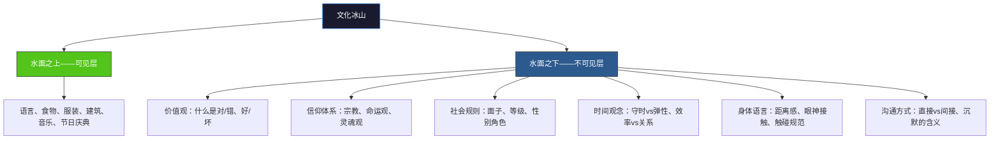
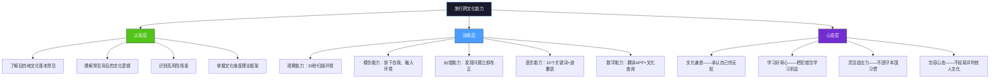

## 场景五：海外旅行中的文化尴尬

### 背景描述

陈先生是一位中国游客，第一次去泰国自由行。到达曼谷的第二天，他计划参观大皇宫和卧佛寺。出门时他穿了短裤和无袖背心——曼谷三十多度的高温让他觉得这是最合理的选择。

到了大皇宫门口，工作人员礼貌地拦住他，用英语示意他的着装不符合要求。他看到旁边有租借围裙和长裤的摊位，花了50泰铢租了一条围裙裹上，才得以进入。

参观寺庙时，陈先生觉得佛像很壮观，随手用手机自拍时背对了佛像——这在泰国是对佛教的不敬。路过的小沙弥看了他一眼，他没意识到问题。

中午在路边餐厅吃饭，他和朋友聊得兴起，用筷子指着朋友说话。下午在夜市逛时，他坐在椅子上翘着二郎腿，鞋底无意中指向了旁边的摊主——在泰国文化中，脚被视为身体最低等、最不洁净的部位，用脚指向他人是极大的冒犯。

摊主脸色变了，但什么也没说。陈先生完全没意识到发生了什么。直到晚上回酒店，同行的一位有经验的旅伴才告诉他白天犯了哪些错误。陈先生既尴尬又懊恼："我根本不知道这些规矩，要是出发前花十分钟查一下就好了。"

这个场景反映了一个极其普遍的现象：旅行者在异国文化中因为"不知道"而频繁触犯禁忌，自己浑然不觉，当地人却已经产生了不满甚至愤怒。问题的根源不是态度——陈先生没有任何不尊重的主观意图——而是信息缺失和文化意识的空白。

据中国文化和旅游部数据，2019年中国出境游人次达1.55亿，其中自由行比例首次超过跟团游。自由行意味着没有导游提前讲解文化注意事项，旅行者必须自己承担文化适应的责任。与此同时，TripAdvisor在2018年的一项调查显示，超过60%的出境游客承认在旅途中至少犯过一次"文化错误"，其中近半数是在事后才意识到的。

---

### 文化分析

#### 文化冰山模型：为什么旅行者总是在水面下触礁

美国人类学家爱德华·霍尔（Edward T. Hall）提出的文化冰山模型指出，任何文化都像一座冰山：水面上的可见部分（语言、食物、服装、建筑）只占整体的10%左右，而水面下的不可见部分（价值观、信仰体系、时间观念、面子逻辑、身体边界感、对权威的态度）占了90%。

旅行者通常只能看到水面部分。你知道泰国菜好吃、寺庙金碧辉煌、人很友善——这些都是可见层。但你不知道脚为什么是脏的、为什么不能摸小孩的头、为什么摊主受了委屈却不说话——这些隐藏在水面下的规则，恰恰是决定你是否会被当地人接纳的关键。

陈先生的四个错误全部来自冰山水面之下：着装问题涉及佛教对"神圣空间"的定义，背对佛像涉及对"神圣形象"的尊重规范，筷子指人涉及"物品指向"的身体语言禁忌，鞋底指向涉及"高低贵贱"的身体象征体系。这些规则没有一本旅行手册会写在最前面，但它们构成当地人判断你是否"懂事"的核心标准。

#### 东南亚文化禁忌的深层逻辑

泰国（以及整个东南亚文化圈）的许多行为禁忌并非随意制定的规矩，而是根植于佛教信仰、王室传统和社会等级观念的文化体系。理解这个体系，比死记硬背"不能做什么"要有效得多。

**佛教信仰层面：** 泰国是上座部佛教国家，约95%的人口信仰佛教。佛像不是装饰品，而是神圣的崇拜对象。头部被认为是身体最高贵、最神圣的部分（与灵魂相关），而脚部则被视为最低贱、最不洁净的部分（因为接触地面和污物）。这种"高=神圣、低=世俗"的观念直接影响了行为规范：不能用脚指人、不能把脚对着佛像或僧侣、不能踩门槛（门槛被认为是神灵的居所）。

上座部佛教与汉传佛教有一个重要区别：上座部佛教更强调"戒律"的严格执行。泰国僧侣每天清晨赤脚化缘，信众跪在路边将食物放入僧侣的钵中——整个过程中，信众的头不能高于僧侣的头，女性不能直接触碰僧侣。这些不是"风俗"，而是被严格遵守的宗教律法。

**王室尊重层面：** 泰国有严格的冒犯王室罪（lèse-majesté），最高可判15年监禁。不要踩泰国纸币（上面有国王头像）、不要对王室发表负面评论、听到王室相关仪式时应肃立。电影院放映前会播放国王颂歌，全场起立——如果你这时候坐着不动或者玩手机，周围的人不会说什么，但你在他们眼里已经是一个"不懂事"的外国人。

**社会和谐层面：** 泰国人极其重视"面子"（类似中国的面子文化但更含蓄）。当众发怒、大声争吵、让别人难堪都是严重失礼。这也是为什么摊主在陈先生犯错时选择沉默——当面指出别人的错误在泰国文化中本身就是不礼貌的。泰国人有一个概念叫"jai yen"（凉心），意思是保持冷静、不冲动。与之对应的是"jai rorn"（热心），指情绪激动——后者在公共场合被视为修养不够的标志。

#### 霍夫斯泰德文化维度在旅行场景中的映射

荷兰社会心理学家吉尔特·霍夫斯泰德（Geert Hofstede）的文化维度理论原本用于分析组织文化差异，但其框架同样适用于理解旅行中的文化冲突。以下是中国与几个热门旅行目的地在关键维度上的对比：

| 文化维度 | 中国 | 泰国 | 日本 | 阿联酋 | 美国 | 旅行中的典型冲突 |
|---------|------|------|------|--------|------|----------------|
| 权力距离 | 80 | 64 | 54 | 90 | 40 | 在高权力距离国家，对服务员过度随意可能被视为不尊重 |
| 个人主义 | 20 | 20 | 46 | 25 | 91 | 在集体主义国家，过度强调个人需求会被视为自私 |
| 不确定性规避 | 30 | 64 | 92 | 68 | 46 | 在高规避国家（日本），不守规矩的反应比低规避国家强烈得多 |
| 长期导向 | 87 | 32 | 88 | 23 | 26 | 长期导向文化更看重"入乡随俗"的诚意而非即时表现 |
| 放纵度 | 24 | 98 | 42 | 52 | 68 | 泰国放纵度全球最高——表面宽容，但底线（宗教/王室）极其刚性 |

这张表能解释很多旅行者的困惑。比如：为什么日本人的规矩比泰国多得多（不确定性规避92 vs 64），为什么美国人可以跟任何陌生人称兄道弟（个人主义91），为什么在阿联酋你必须特别注意等级和身份（权力距离90）。泰国的数据尤其有趣——放纵度全球最高，意味着泰国人总体上很宽容、爱玩、不较真；但不确定性规避64又说明在宗教和王室这两条红线上，他们绝不会含糊。

#### 陈先生的具体行为错误分析

| 行为 | 触犯的禁忌 | 深层文化逻辑 | 严重程度 | 当地人可能的反应 |
|------|-----------|------------|---------|----------------|
| 穿短裤背心进寺庙 | 对佛教圣地不敬 | 寺庙是"神圣空间"，暴露身体是对神圣的亵渎 | 中等 | 被阻止进入（有明确规则）；已进入则被视为无知 |
| 背对佛像自拍 | 对佛像不敬 | 佛像是崇拜对象，背对等于"转身离去"，暗示轻蔑 | 严重 | 被视为无知的冒犯；僧侣可能默念经文为你"消业" |
| 用筷子指人 | 用物品指向他人不礼貌 | 任何尖锐物品指向人都带有攻击暗示 | 轻微 | 产生不适但通常不会说什么 |
| 鞋底指向摊主 | 脚部指向他人是极大侮辱 | 脚是身体最低贱部位，指向人等于将"最低"施加于对方 | 严重 | 强烈不满，可能影响后续交易；摊主可能选择不再搭理你 |

#### 为什么"不知道"不是有效的跨文化借口

在跨文化场景中，意图和影响之间存在巨大鸿沟。陈先生主观上没有任何恶意，但客观上他的行为确实造成了冒犯。这引出一个重要的跨文化沟通原则：在异文化环境中，你的行为由当地人解读，不由你的意图决定。

跨文化沟通学者米尔顿·本内特（Milton Bennett）提出了"跨文化敏感度发展模型"（DMIS），将人们应对文化差异的能力分为六个阶段：

1. **否认期**（Denial）：意识不到文化差异的存在。"全世界都差不多吧。"
2. **防御期**（Defense）：意识到差异但认为自己的文化更好。"他们怎么这么奇怪。"
3. **最小化期**（Minimization）：承认差异但认为人性相通，差异不重要。"人嘛，到哪儿都一样。"
4. **接受期**（Acceptance）：承认差异是中性的，开始好奇地探索。"他们的做法有他们的道理。"
5. **适应期**（Adaptation）：能站在对方文化立场思考，调整自己的行为。"在泰国，我应该这样做。"
6. **整合期**（Integration）：能在多种文化身份之间自然切换，形成多元文化自我。

大多数第一次出境自由行的旅行者处于"最小化期"——他们知道不同国家有不同文化，但低估了差异的深度和影响。陈先生出发前大概也觉得"泰国跟中国差不多，都是亚洲国家"，这种最小化思维让他放松了文化准备的警惕。

这不是说旅行者必须完美无缺——大多数泰国人对外国游客的无心之失相当宽容，尤其是当他们看到你努力适应的时候。但"无心之失"和"毫无准备"之间有本质区别。前者是旅途中难免的，后者是可以避免的。

---

### 超越"禁忌清单"：旅行中容易忽略的文化维度

大多数旅行文化指南只列出"不能做什么"，但旅行中的文化尴尬远不止触犯禁忌。以下六个维度是旅行者经常忽略、却频繁踩雷的领域。

#### 非语言沟通的隐藏雷区

语言不通时，人们倾向于用肢体语言"弥补"——但肢体语言的文化差异比语言本身更大、更隐蔽。

**手势的含义天差地别：**
- 竖起大拇指：在中国和美国表示"好"，在中东部分地区（伊朗、伊拉克）是侮辱性手势，相当于竖中指。
- "OK"手势（拇指和食指成圈）：在美国表示"好的"，在巴西是侮辱性手势，在法国可以表示"零"或"没价值"。
- 召唤手势（手掌朝上、手指向内弯曲）：在中国很正常，在菲律宾和日本这是召唤动物的手势，对人做这个动作极其失礼。在新加坡，这个手势表示"死亡"。
- 用食指指人：在中国和美国虽然不太礼貌但可以接受，在马来西亚和印度尼西亚，指人要用拇指，食指指人是极度无礼的。

**眼神接触的文化密码：**
- 在美国和西欧，直视对方眼睛表示自信和诚实，回避眼神被视为心虚或不尊重。
- 在日本和韩国，过度的眼神接触被视为挑衅或不敬，尤其是对长辈和上级。
- 在部分非洲和加勒比文化中，直视长辈的眼睛是不敬的表现，低头表示尊重。
- 在中东文化中，同性之间的眼神接触可以很强烈且持久，但异性之间的直接对视可能被视为暧昧。

**身体距离感：**
人类学家爱德华·霍尔将人际距离分为四层：亲密距离（0-45cm）、个人距离（45-120cm）、社交距离（120-360cm）、公共距离（360cm以上）。不同文化对这四层的使用截然不同：
- 拉丁美洲、中东、南欧人习惯近距离交谈，你后退他们会追上来——这不是"侵犯"，而是他们表达亲近的方式。
- 北欧人、日本人、澳大利亚人习惯更大的个人空间，靠太近会让对方不适。
- 在拥挤的亚洲城市（东京地铁、曼谷夜市），人们对"被迫的近距离"有很高的容忍度，但一旦有空间选择，距离感立刻恢复。

**实用建议：** 到达一个新国家后，先在公共场所观察当地人之间的站距、眼神交流方式和手势使用习惯。花5分钟观察比花50分钟看攻略更有效。

#### 餐桌文化的深层差异

"吃什么"是旅行中最开心的事，"怎么吃"却可能是最踩雷的事。

**用餐工具的文化逻辑：**
- 用手吃饭（印度、中东、东南亚部分地区）：在印度文化中，右手直接接触食物被认为是与食物建立最自然的连接。注意必须用右手，左手在这些文化中与如厕相关，是"不洁"的。如果你是左撇子，也需要练习用右手吃饭。
- 筷子文化圈（中国、日本、韩国、越南）：看似相同，规矩差异不小。日本忌讳把筷子竖插在饭碗中（这是葬礼上供奉死者的做法），也不要用筷子传递食物给另一双筷子（同样是丧葬仪式）。韩国吃饭时碗不能端起来（这跟中国和日本相反），长辈先动筷后晚辈才能开始。
- 刀叉文化圈（欧洲、美洲）：欧洲人（尤其法国、德国）切完食物后不换手，叉子始终在左手；美国人切完后把叉子换到右手。面包直接放桌面上不放盘子里（法国规矩）。在英国，吃完后刀叉平行放在盘子右侧表示"吃完了"；叉齿朝下放。

**小费文化的全球差异：**

小费是旅行中最容易犯错的领域之一。给多了浪费钱，给少了失礼，不该给的时候给了更尴尬。

| 地区/国家 | 小费规则 | 具体操作 | 特别注意 |
|----------|---------|---------|---------|
| 美国 | 必须给，是服务员的主要收入来源 | 餐厅15-20%，酒吧$1-2/杯，酒店行李$2-3/件 | 不给小费=严重失礼，服务员可能追出来问"有什么问题吗" |
| 日本 | 绝对不能给 | 给小费被视为侮辱 | 机场、酒店有人帮你搬行李也不要给 |
| 泰国 | 不强制但受欢迎 | 餐厅可留零钱，按摩50-100泰铢 | 不要给硬币（硬币是给乞丐的） |
| 欧洲（法德意） | 包含在账单中，额外给是"奖励" | 账单金额四舍五入，或留1-2欧元 | 不像美国那么强制，但好服务值得额外感谢 |
| 中东 | 文化上鼓励慷慨 | 餐厅10-15%，各种服务场景都要给 | 慷慨是伊斯兰文化的重要美德 |
| 中国 | 不需要 | 高端餐厅可能会收服务费 | 给小费可能让对方困惑 |

**吃饭时的"噪音"文化：**

在日本吃拉面时发出"吸溜"声是正常的，甚至表示"好吃"。但同样的声音在英国或美国的高级餐厅里会让所有人转头看你。在中国和韩国，吃饭时发出适度的声音可以接受；在东南亚，公共场合吃东西的声音普遍比欧美大。反过来，在穆斯林文化中，吃饭时保持安静、不发出声响是修养的体现。

#### 购物和讨价还价的文化逻辑

旅行中的购物不只是消费行为，更是一种社交互动。讨价还价在不同文化中有完全不同的"游戏规则"。

**可以砍价的文化：**
- 中国：小商品市场、旅游景点周边
- 东南亚（泰国、越南、柬埔寨、印尼）：夜市、集市、独立店铺
- 中东（土耳其、摩洛哥、埃及）：巴扎/集市，砍价是购物体验的核心组成部分
- 印度：几乎所有非连锁店
- 墨西哥和中美洲：集市和手工艺品店

在这些文化中，讨价还价不是"抠门"，而是一种社交游戏。卖家报出的价格本身就留了砍价空间——你直接按开价买反而会让卖家觉得你"不懂行"。在土耳其的巴扎里，一杯茶被端上来意味着"坐下来聊聊"，这是建立关系的仪式，拒绝反而失礼。

砍价的基本流程：先随便逛逛、问几家价格→表示兴趣但不急于购买→给出卖家报价的50-60%→逐步让步到双方都能接受的价位→成交后不要再砍。在东南亚，砍价时保持微笑和幽默感很重要——板着脸砍价会让交易变得不愉快。

**不能砍价的文化：**
- 日本、韩国：标价即最终价，砍价被视为不尊重
- 欧美大部分地区：超市、商场、连锁店价格固定
- 澳大利亚、新西兰：砍价文化极弱

**砍了价就必须买的规则：**
在中东和部分东南亚市场，如果你砍好了价又不买，这比不砍价更糟糕。在摩洛哥的巴扎里，经过漫长的讨价还价后不买，卖家可能会大声表达不满，甚至引来周围人的围观。砍价前先确定你真的想要这件东西。

#### 宗教场所的进阶礼仪

宗教场所是旅行中文化错误的高发区，不只是因为规则多，更因为这些规则承载着当地人最深层的信仰和情感。

**进入清真寺的全球通用规则：**
- 脱鞋（几乎所有清真寺都要求）
- 女性覆盖头发、手臂和腿部（大多数清真寺门口提供免费长袍和头巾）
- 男性不能穿短裤（膝盖以上）
- 避开祈祷时间参观（除非被邀请）
- 不要从正在祈祷的人面前走过
- 不要用闪光灯拍照
- 保持安静，不要大声交谈

**进入印度教寺庙：**
- 脱鞋，有些寺庙要求脱袜子
- 有些寺庙禁止非印度教徒进入（如瓦拉纳西的某些寺庙）——门口会有标牌
- 不要触碰神像
- 用右手递东西、吃东西
- 皮革制品（皮带、皮包）在某些寺庙中不被允许带入

**进入犹太教堂：**
- 男性需要戴小圆帽（kippah），大多数教堂门口免费提供
- 安息日（周五日落到周六日落）期间不要拍照、不要使用电子设备
- 不要在教堂内吃东西

**跨宗教场所的通用建议：** 当你不确定规矩时，站在门口观察30秒——看别人怎么做、有没有特定的排队路线、是否需要脱鞋。如果实在不确定，礼貌地问门口的工作人员："Is there anything I should know before entering?" 这个问句在全世界所有宗教场所都适用。

#### 拍照伦理：不只是"能不能拍"

手机摄影的普及让旅行中的拍照变得理所当然，但"能不能拍"这个问题比大多数旅行者以为的复杂得多。

**绝对不能随便拍的场景：**
- 宗教仪式和宗教人物（僧侣、牧师、拉比、伊玛目）——除非得到明确许可
- 军事设施、政府建筑、边境地区——很多国家禁止拍摄，违法后果严重
- 儿童——在欧美国家，对着陌生儿童拍照可能引来家长的激烈反应甚至报警
- 原住民和少数民族——在澳大利亚、新西兰、美洲原住民保留地，未经许可拍照被视为将人"景观化"和"物化"
- 丧葬仪式——几乎在所有文化中都是禁忌
- 墓地——部分文化视之为神圣空间，拍照被视为不敬

**拍照前的礼貌方式：**
1. 指着你的相机，用眼神和手势询问"可以吗？"
2. 学会用当地语言说"可以拍照吗？"
3. 如果对方摇头或犹豫，立即放下相机微笑——不要试图说服
4. 拍完后给对方看看照片，这在全世界都是很好的"感谢"方式
5. 如果对方要求删掉，立刻删掉，不要争辩

#### 数字时代的旅行文化差异

智能手机让旅行方便了很多，但也制造了新的文化冲突场景。

**手机使用规范的地域差异：**
- 日本：电车内打电话是严重的公德违反（会收到"请将手机调至静音"的广播提醒）。日本人把手机调振动模式叫"マナーモード"（manner mode，礼貌模式）。
- 韩国：在餐厅里手机放在桌上很正常，但长辈在场时不要一直看手机。
- 德国：数据隐私极度敏感。不要在公共场所使用人脸识别APP拍路人，不要随意拍摄别人的照片发到社交媒体。
- 东南亚：使用手机导航时不要站在路中间挡住行人——曼谷和河内的街道上人流量极大，你停下来查地图会堵住一整条人行道。

**WiFi和社交媒体的文化差异：**
- 在中国、日本、韩国，公共WiFi覆盖率极高；在东南亚和南亚，很多地方没有免费WiFi，提前买当地SIM卡是必须的。
- 在中国可以正常使用微信支付和支付宝；在其他东南亚国家，Grab Pay、GoPay或现金才是主流。
- 在某些国家（中国、伊朗、古巴），部分国际社交平台受限，需要提前了解并准备VPN。

---

### 应对策略

#### 第一层：出行前的文化准备（预防层）

预防永远优于补救。出行前的文化准备不需要很长时间，但需要有针对性。以下按照投入时间分为三个等级，每个等级都给出具体操作步骤。

**最低标准：出发前30分钟文化速查**

1. 搜索"目的地国家 + 文化禁忌"，阅读前5篇结果文章。不需要深入研究，只需要知道"红线"在哪里。
2. 确认行程中是否有宗教场所，如果有，提前查着装要求和行为规范。
3. 了解基本问候方式和肢体语言禁忌——手势在不同文化中的含义差异极大（例如竖起大拇指在中东部分地区是冒犯性手势）。
4. 查看目的地是否有近期的宗教节日或政治敏感期（如泰国的国王诞辰、伊斯兰国家的斋月），这些时期的行为红线会更严格。

**推荐标准：出行前一周的文化学习**

1. 阅读一本旅行指南的文化章节（Lonely Planet、Rough Guide 等都有专门的文化礼仪章节）。
2. 看1-2部目的地国家的纪录片或旅行Vlog，观察当地人的日常行为模式。YouTube上搜索"[国家名] travel tips"或"[国家名] culture shock"能找到大量亲身经历分享。
3. 学习10个基础当地语言词汇：你好、谢谢、对不起、请、多少钱。这不需要语言天赋，只需要提前花20分钟背诵。
4. 加入目的地旅行论坛或微信群，搜索"文化注意事项"或"踩坑"帖子，看前人的经验教训。
5. 准备一份打印版或手机截图的"文化急救卡"：列出你行程中每个城市/景点的着装要求、禁忌事项和紧急联系方式。

**高级标准：深度文化适应准备**

1. 阅读目的地国家的历史概况，理解文化形成的背景。推荐《Culture Shock!》系列丛书，针对不同国家有专门分册。
2. 了解目的地国家的社交礼仪体系：见面礼节、餐桌礼仪、送礼习俗、小费文化、讨价还价规范。
3. 提前练习关键场景的应对：如何在市场讨价还价、如何礼貌拒绝、如何表达感谢。
4. 准备一个"文化急救包"：包含适配宗教场所的长裤/围巾、当地人常用的翻译APP、离线地图、紧急联系方式。
5. 了解目的地国家的基本法律红线：拍照限制、酒精管制、药品管制（某些在OTC药物在其他国家属于违禁品）、签证规定（如落地签的停留期限）。

#### 第二层：旅途中的文化适应（实时层）

即使做了充分准备，旅途中仍然会遇到意料之外的文化情境。关键是保持敏锐的观察力和灵活的适应能力。

**观察-模仿-确认三步法**

1. **观察**：进入任何新场景时，先花30秒观察当地人在做什么。在餐厅坐下后看看周围人怎么点餐、怎么吃、怎么付钱。进入寺庙前看看其他人怎么走、怎么站、怎么拜。
2. **模仿**：当你不确定正确做法时，模仿当地人的行为是最安全的策略。这不是丢面子，而是文化学习的基本方式。
3. **确认**：如果不确定某个行为是否合适，直接问。"Is this okay?" 或 "Am I supposed to..." 这样的问题在全世界都是可以接受的，而且大多数人会因为你的主动询问而对你产生好感。

**语言不通时的沟通策略**

旅行中最实际的困境是"我想问规矩但语言不通"。以下策略按优先级排列：

1. **翻译APP**：Google Translate支持离线翻译包（提前下载目标语言），相机实时翻译功能在看菜单和告示牌时极其有用。百度翻译在中文-东南亚语言对上表现不错。DeepL在欧洲语言上质量更高。
2. **肢体语言+关键词**：指着你的相机问"Photo OK?"；指着你的鞋子再指指门口，意思是"需要脱鞋吗？"。简单的英语关键词在旅游业发达的地区基本能通。
3. **找"文化中间人"**：酒店前台、旅游信息中心的工作人员、会说英语的当地年轻人，都是很好的文化顾问。不要不好意思问"我待会儿要去XX寺庙，有什么需要注意的吗？"
4. **提前写好关键短语**：把"请问可以拍照吗""这个需要脱鞋吗""在哪里可以换衣服"等常用问句翻译成当地语言存在手机里，需要时直接出示给对方看。

**实时纠错的黄金法则**

- 发现错误立即停止：不要因为"已经做了"就继续。停下来本身就是一种尊重的信号。
- 用微笑和肢体语言表达歉意：在全球大多数文化中，真诚的微笑加上一个轻微的鞠躬或双手合十（在东南亚）都能有效化解尴尬。
- 不要过度道歉：长篇大论的道歉反而会让双方都尴尬。简短地表达歉意，然后用行动改正，比反复道歉更有效。
- 不要试图解释你的文化："在中国我们是这样做的"这种解释在犯错的当下毫无帮助，甚至可能被理解为"我觉得我的文化比你的好"。事后的文化对比可以作为朋友间的谈资，但在犯错的即时场景中，闭嘴道歉、行动改正才是最优解。

**日常场景的行为清单**

| 场景 | 通用安全做法 | 常见雷区 | 被忽略的细节 |
|------|------------|---------|------------|
| 宗教场所 | 长裤/长裙、遮盖肩膀、脱鞋、低声说话 | 背对宗教雕像拍照、触摸佛像、穿着暴露 | 月经期间部分宗教场所禁止女性进入（如巴厘岛某些寺庙） |
| 餐桌 | 观察当地人用餐工具和方式 | 用手抓食物（非手食文化中）、大声咀嚼 | 吃完后餐具的摆放方式在不同文化中有不同含义 |
| 市场购物 | 先问价再拿、礼貌讨价还价 | 不问价就拿、讨价还价后不买（部分地区严重失礼） | 在某些文化中，卖家给你倒茶是"开始谈"的信号 |
| 打招呼 | 观察对方是握手、鞠躬、合十还是其他 | 主动拥抱或亲吻脸颊（非亲吻文化中）、用左手握手（穆斯林文化） | 握手力度在不同文化中含义不同：美国偏好有力，东亚偏好轻柔 |
| 乘坐交通 | 排队、让座给老人孕妇 | 抢座、大声讲电话、吃气味重的食物 | 在日本不要在出租车里自己开门关门（司机控制车门） |
| 拍照 | 征得同意后再拍人像 | 对着僧侣、原住民、儿童随意拍照 | 在部分国家，拍摄政府建筑和军事设施是违法的 |
| 住宿 | 了解酒店的垃圾分类规则 | 在非吸烟房吸烟、把鞋子带进房间（日本旅馆） | 日本旅馆（ryokan）的拖鞋和浴室拖鞋不能混穿 |

#### 第三层：错误发生后的补救（修复层）

当错误已经发生，关键是如何将负面影响降到最低。

**即时补救流程**

**语言补救模板**

以下提供七种常用语言的道歉表达。提前在手机里存好目的地语言的道歉语，犯错时能立刻说出来——当地人听到你用他们的语言道歉，态度会立刻软化。

| 语言 | 道歉表达 | 发音提示 | 适用场景 |
|------|---------|---------|---------|
| 泰语 | ขอโทษ | khor thot（科托特） | 所有冒犯场景 |
| 日语 | すみません | sumimasen（斯米马森） | 通用歉意；比"ごめんなさい"更正式、更安全 |
| 韩语 | 죄송합니다 | jwe-song-ham-ni-da（最松哈密达） | 对长辈/正式场合；对朋友可以用"미안해" |
| 阿拉伯语 | آسف / آسفة | asif（男）/ asifa（女） | 中东通用 |
| 西班牙语 | Lo siento mucho | 洛·西恩托·穆乔 | 拉丁美洲和西班牙 |
| 法语 | Je suis désolé(e) | 热·随·德佐雷 | 法国及法语区 |
| 英语 | I'm so sorry, I didn't know | — | 全球旅游业通用 |

**非语言补救策略**

- 微笑：全球最通用的善意信号。在东南亚文化中尤其有效——泰国被称为"微笑之国"，一个真诚的微笑可以化解大部分尴尬。
- 双手合十礼：在泰国、柬埔寨、老挝、缅甸等东南亚国家，双手合十微微鞠躬是表达敬意和歉意的标准动作。合十的位置越高越表示尊重（胸口=一般问候，鼻尖=对僧侣和长辈）。
- 适度的小礼物或消费：如果在购物或服务场景中冒犯了对方，适当多消费一点或购买一些商品，是用行动表达善意的方式。
- 后续行为的改变：最好的道歉不是语言，而是行为。如果你在同一地点停留多天，用实际行动展示你学到了教训，比反复口头道歉更有力。

---

### 六大洲典型文化雷区速查

旅行中的文化尴尬是全球性的。以下是主要旅行目的地的关键文化禁忌和安全行为指南，按区域整理。

#### 东亚

| 国家/地区 | 核心禁忌 | 安全行为 | 容易忽略的细节 |
|----------|---------|---------|-------------|
| 日本 | 不要给小费（会被视为侮辱）；不要在公共场合擤鼻涕；不要边走边吃；不要在电车内打电话 | 鞠躬问候；进门脱鞋；安静乘坐公共交通；吃完拉面可以发出声音 | 浴室拖鞋和室内拖鞋不能混穿；温泉入浴前必须先冲洗；自动扶梯关东站左关西站右 |
| 韩国 | 不要用一只手接长辈递来的东西（用双手）；不要在长辈面前倒自己的酒；不要用红色笔写人名 | 用双手接递物品；背对长辈饮酒；饭后主动帮忙收拾 | 筷子不能插在饭里（与日本相同禁忌）；倒酒时瓶口不能对着对方 |
| 中国台湾 | 送礼避免送钟（谐音"送终"）、伞（谐音"散"）、梨（谐音"离"） | 双手递名片；用双手接长辈递来的东西 | 夜市砍价空间不大（与东南亚不同）；小费不需要 |

#### 东南亚

| 国家/地区 | 核心禁忌 | 安全行为 | 容易忽略的细节 |
|----------|---------|---------|-------------|
| 泰国 | 不要触摸他人头部；不要用脚指人或佛像；不要对王室不敬；不要踩门槛 | 参观寺庙穿长裤；脱鞋进入室内；双手合十问候 | 不要购买佛像头部工艺品（被认为是亵渎）；不要在社交媒体上发布对王室的负面评论（即使你已经回国） |
| 印度尼西亚 | 不要用左手递东西或吃饭；不要在穆斯林区域穿暴露服装 | 用右手吃饭和握手；进入清真寺脱鞋盖头 | 巴厘岛虽然是印度教区域，但也有自己的禁忌（如月经期间不能进入寺庙） |
| 越南 | 不要摸小孩的头；不要用手指指人 | 用整个手掌示意方向；脱鞋进入私人住宅和部分商店 | 越南的咖啡文化有自己的规矩，不要催促 |
| 柬埔寨 | 不要触摸僧侣（尤其女性）；不要用脚指向任何神圣物品 | 穿着保守参观吴哥窟；对僧侣保持距离和尊重 | 吴哥窟某些区域禁止攀爬（之前因游客行为已关闭部分区域） |

#### 南亚

| 国家/地区 | 核心禁忌 | 安全行为 | 容易忽略的细节 |
|----------|---------|---------|-------------|
| 印度 | 不要用左手吃饭或递东西；不要用脚碰书（书被视为知识的化身）；不要对牛不敬 | 用右手吃饭和握手；在寺庙脱鞋；尊重素食文化 | 在某些地区，异性之间不要在公共场合有亲密接触；进入锡克教寺庙需要包头 |
| 斯里兰卡 | 不要背对佛像拍照；不要穿鞋进入寺庙 | 用双手递名片或礼物；学习基本僧伽罗语问候 | 与印度不同，斯里兰卡的佛教徒对佛像拍照态度更严格 |
| 尼泊尔 | 不要用脚触碰食物或人；不要用同一只手吃饭和递东西 | 进入寺庙脱鞋；用右手递东西；尊重牛的神圣地位 | 尼瓦尔族社区有自己的独特礼仪规范 |

#### 中东与北非

| 国家/地区 | 核心禁忌 | 安全行为 | 容易忽略的细节 |
|----------|---------|---------|-------------|
| 阿联酋/沙特 | 穆斯林斋月期间不要在公共场合吃喝（白天）；不要拍摄当地女性；不要公开饮酒（沙特）；不要展示鞋底 | 尊重祈祷时间；女性穿着保守；学习阿拉伯语问候 | 斋月期间餐厅白天不营业（外卖APP也不送餐）；迪拜相对宽容但底线依然存在 |
| 伊朗 | 女性必须戴头巾；不要公开批评政府或宗教；不要公开饮酒 | 了解波斯礼仪；用右手递物；尊重主人的待客之道 | 伊朗人极其好客，被邀请到家里做客时拒绝反而失礼 |
| 土耳其 | 不要在清真寺里背对朝拜方向拍照；不要在公共场合醉酒 | 进清真寺脱鞋盖头；讨价还价时保持友好 | 土耳其人的"是"是微微摇头（不是点头），容易误读 |

#### 欧洲

| 国家/地区 | 核心禁忌 | 安全行为 | 容易忽略的细节 |
|----------|---------|---------|-------------|
| 英国 | 不要插队（英国人对排队的执着是出了名的）；不要在酒吧里大声喧哗 | 学会说"sorry"和"please"（英国人平均每句话用4次sorry）；尊重个人空间 | 酒吧里不排号，酒保按看到的顺序服务——站在吧台前等就行 |
| 法国 | 不要在餐厅大声招呼服务员；不要只说英语不尝试法语 | 用"Bonjour"开头开启每一次交流；了解基本餐桌礼仪（面包放桌上不放盘子里） | 进入任何商店都要先说"Bonjour"，离开说"Au revoir"——不说就走会让店员觉得你无礼 |
| 德国 | 不要做纳粹相关手势或符号（违法）；不要迟到（德国人极度重视守时） | 准时到达；正式场合用"Herr/Frau"称呼；垃圾分类严格执行 | 过马路闯红灯在德国会被路人投以不满目光（即使没有车）；在巴伐利亚，传统问候是"Grüß Gott"而非"Hello" |
| 意大利 | 不要在教堂里穿短裤/无袖上衣；不要在咖啡吧站着喝cappuccino（意大利人只在早上喝，餐后只喝espresso） | 学会区分"bar"（咖啡吧）和"pub"的不同；午餐时间（12:30-14:30）不要打电话谈生意 | 意大利南部和北部文化差异很大——米兰和那不勒斯几乎是两个"国家" |

#### 美洲

| 国家/地区 | 核心禁忌 | 安全行为 | 容易忽略的细节 |
|----------|---------|---------|-------------|
| 美国 | 不要询问收入/年龄/体重（隐私敏感话题）；不要在敏感场合讨论政治和枪支管制 | 学会small talk（天气、运动、旅行）；给小费（餐厅15-20%）；排队保持距离 | 美国各州文化差异巨大——纽约的直接和南方的客套完全不同 |
| 墨西哥 | 不要表现出对当地食物的嫌弃；不要在社交场合过于直率 | 尝试当地食物并给予正面评价；了解"mañana"文化（不急不躁） | 墨西哥人的时间观念很弹性——约了下午3点可能4点才来，这不是不尊重 |
| 巴西 | 不要竖"OK"手势（侮辱性）；不要在贫民窟（favela）随意拍照或进入 | 尝试学几句葡萄牙语（巴西人对说葡萄牙语的外国人特别友好）；享受音乐和舞蹈文化 | 巴西人的身体接触比其他文化多得多——拍肩、拥抱是正常社交 |

#### 非洲

| 国家/地区 | 核心禁忌 | 安全行为 | 容易忽略的细节 |
|----------|---------|---------|-------------|
| 肯尼亚/坦桑尼亚 | 不要用左手递东西；不要对马赛人的生活方式表示怜悯 | 了解基本斯瓦希里语问候；尊重部落文化；在国家公园遵守规定 | 拍摄马赛人需要付费（这是他们的正当收入来源） |
| 摩洛哥 | 斋月期间不要在公共场合吃喝；不要用左手递东西 | 在巴扎享受讨价还价的文化；进入清真寺注意着装 | 非穆斯林不能进入大多数清真寺（哈桑二世清真寺除外） |
| 南非 | 不要在敏感种族话题上随意发表意见 | 了解种族隔离历史；尊重多元文化；在开普敦和约翰内斯堡注意安全 | 南非有11种官方语言，不同地区的文化差异极大 |

---

### 特殊旅行群体的文化考量

#### 女性旅行者的额外注意事项

女性在部分国家旅行面临着额外的文化规则和安全考量。这不是"不公平"，而是当地文化的现实——了解这些规则不是在"认同"它们，而是在保护自己的旅行体验。

**高关注度目的地：**
- 中东（沙特、伊朗、阿联酋）：着装要求更严格，部分地区女性需要男性陪同出行。沙特在2019年才开始允许女性独自入住酒店。
- 印度：女性安全问题在国际新闻中时有报道。建议：避免深夜独自出行，穿着保守，选择评价高的酒店和交通方式，提前了解当地的安全区域。
- 东南亚：总体对女性旅行者友好，但要注意：在部分保守的穆斯林区域（如马来西亚的吉兰丹州、印尼的亚齐省），着装需要更加保守。

**实用建议：**
1. 提前搜索"[国家名] + 女性旅行者 + 安全"，了解目的地的具体情况。
2. 携带一条大围巾——在紧急情况下可以当头巾、围裙、遮阳布，是女性旅行者的万能装备。
3. 在保守国家，观察当地女性的着装风格并适度靠拢——不是说你要穿得一模一样，而是不要成为人群中"穿得最少"的那个人。
4. 了解目的地的报警方式和女性求助热线（很多旅游城市有专门的旅游警察）。

#### LGBTQ+旅行者的现实考量

全球对LGBTQ+群体的接受度差异巨大。根据ILGA（国际LGBTQ+协会）2020年报告，全球仍有69个国家将同性关系列为违法，其中部分国家最高可判死刑。

**需要特别谨慎的目的地：**
- 东南亚大部分国家：法律上不禁止但社会接受度低——在泰国（相对宽容）之外，不要公开表达亲密关系。
- 中东和北非：部分国家（如沙特、伊朗、也门）对同性行为处以极刑。
- 东非和西非：乌干达、尼日利亚等国法律极其严厉。
- 俄罗斯：2013年通过"同性恋宣传"禁令，公开表达LGBTQ+身份可能面临法律风险。

**对LGBTQ+旅行者的建议：**
1. 出行前查看Equaldex网站（equaldex.com），了解目的地国家的LGBTQ+法律和社会态度评分。
2. 在不友好国家，避免在公共场合表达亲密关系——这不是在"隐藏自己"，而是在保护自身安全。
3. 选择LGBTQ+友好的住宿和旅游服务机构——部分国际连锁酒店有明确的多元化政策。
4. 了解目的地的紧急求助渠道——部分国家有LGBTQ+社区组织提供旅行安全信息。

---

### 旅行跨文化能力提升模型

这个模型从三个层面描述了旅行者的跨文化能力：认知层解决"知不知道"的问题，技能层解决"会不会做"的问题，心态层解决"愿不愿意"的问题。三个层面缺一不可——知道规矩但不会执行是纸上谈兵，会执行但心态抵触是"被迫服从"，心态好但信息空白就是陈先生的困境。

---

### 实用工具箱

#### 出行前文化准备清单

□ 搜索目的地国家 top 10 文化禁忌
□ 确认行程中所有宗教场所的着装要求
□ 学习10个基础当地语言词汇 + 7种道歉表达
□ 下载离线翻译APP（推荐 Google Translate、有道翻译官）
□ 下载目的地语言的离线翻译包
□ 准备适配宗教场所的服装（长裤/围巾/长裙）
□ 了解当地小费文化（给不给、给多少、怎么给）
□ 了解当地交通礼仪（出租车/公交/地铁）
□ 查看目的地近期是否有重要宗教节日或政治事件
□ 阅读旅行论坛上的"文化踩坑"帖子
□ 保存当地紧急联系方式（大使馆、报警、急救）
□ 了解目的地的手机使用和拍照法律限制
□ 准备当地SIM卡或eSIM方案
□ 了解当地的支付方式（现金/移动支付/信用卡）
□ 如果是LGBTQ+旅行者，查询目的地的法律和社会态度
□ 如果是女性独行，查询目的地的安全建议和女性友好区域

#### 推荐文化学习资源

| 资源类型 | 名称 | 特点 | 适用场景 |
|---------|------|------|---------|
| 旅行指南 | Lonely Planet系列 | 每个国家都有"文化礼仪"章节 | 出行前一周深度阅读 |
| 文化读物 | 《Culture Shock!》系列 | 针对不同国家的文化适应指南，案例丰富 | 想要深度理解目的地文化 |
| 视频 | YouTube搜索"[国家名] culture tips" | 真人实拍，直观易懂 | 出行前快速了解 |
| 社区 | 小红书/马蜂窝/穷游网 | 中国旅行者的亲身踩坑经历 | 了解同胞常见的犯错模式 |
| 法律信息 | Equaldex.com | 全球LGBTQ+法律和社会态度评分 | LGBTQ+旅行者安全评估 |
| 翻译工具 | Google Translate | 支持130+语言，有离线包和相机翻译 | 旅途中实时使用 |
| 地图 | Maps.me | 完全离线地图，覆盖全球 | 没有网络时的导航 |

#### 文化犯错后的心理调适

旅行中的文化尴尬不可避免。即使是经验丰富的旅行者也会犯错。关键在于如何处理犯错后的情绪：

1. **接受不完美**：你不可能在出发前了解所有文化禁忌。偶尔犯错是跨文化体验的一部分，不是你个人能力的失败。旅行作家皮科·耶尔（Pico Iyer）说得好："旅行的意义不在于到达目的地，而在于学会用新的眼光看待世界。"
2. **区分无知和无礼**：因为不知道而犯错和明知故犯是完全不同的。前者可以原谅，后者不行。只要你在努力学习和适应，大多数人会理解。
3. **把尴尬转化为故事**：旅行中的文化尴尬，事后回忆起来往往是最有趣的故事。它不是耻辱，而是成长的标记。
4. **积累经验，传播知识**：每一次犯错都是一次学习机会。把你的经验分享给其他旅行者，既帮助了别人，也强化了自己的记忆。
5. **关注进步而非完美**：从第一次出境到第十次出境，你会发现自己犯错的频率越来越低、恢复的速度越来越快。这个过程本身就是跨文化能力的成长。

---

### 关键启示

陈先生的故事是一个缩影。每年有数以百万计的旅行者在异国他乡犯着相似的错误——不是因为他们不尊重，而是因为他们不知道。

解决方案并不复杂：出发前花30分钟做文化速查，旅途中保持观察和谦逊，犯错后真诚道歉并立即改正。这三个简单的步骤——准备、观察、补救——可以避免80%以上的旅行文化尴尬。剩下的20%，靠的是旅行者的心态：把每一次文化碰撞都当作学习的机会，而不是尴尬的负担。

更深一层看，旅行中的文化尴尬本质上反映的是文化冰山模型的规律——你看到的只是水面之上的表象，水面之下的规则需要主动探索和学习。霍夫斯泰德的文化维度、本内特的跨文化敏感度模型、霍尔的冰山理论，这些学术框架不是象牙塔里的理论，而是实实在在能帮你在异国少犯错、多交朋友的工具。

每一次文化尴尬都是冰山浮出水面的一角——它提醒你，水下还有更多值得探索的东西。能意识到这一点的旅行者，已经从"最小化期"进入了"接受期"，而这正是跨文化能力成长中最重要的一步。
