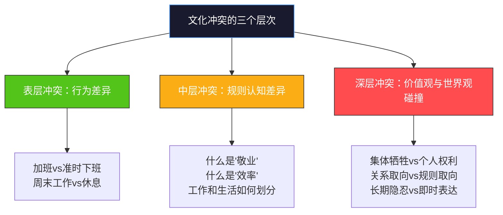
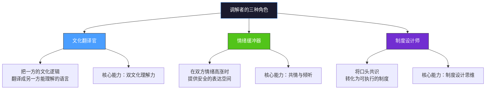
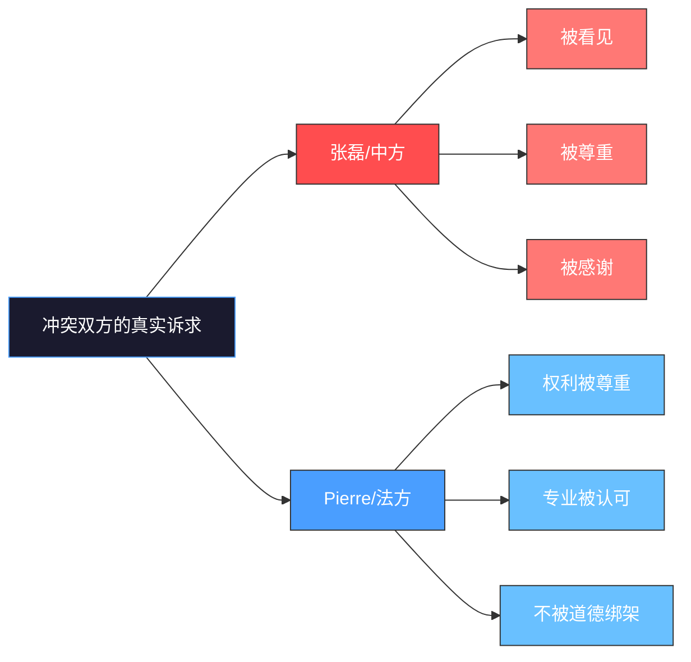
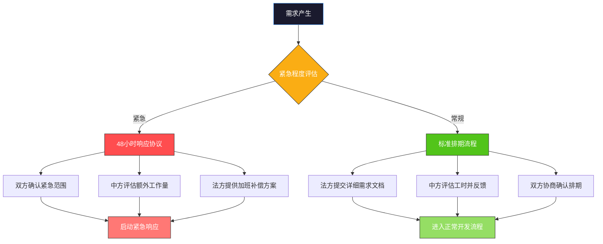
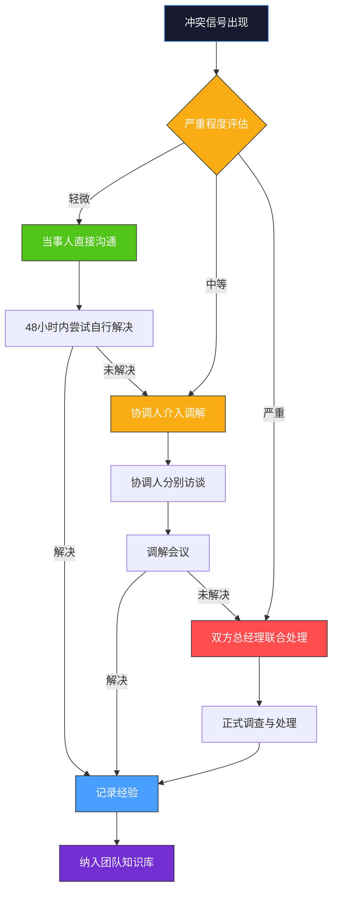

## 场景六：文化冲突的调解

文化冲突是跨文化合作中最棘手的问题——它不像语言障碍那样可以通过翻译工具解决，也不像时差问题那样可以通过调整作息来应对。文化冲突触及价值观、身份认同和行为准则的深层差异，处理不当会导致团队分裂、项目失败甚至法律纠纷。本案例通过一个中法合资公司的真实冲突，展示文化冲突调解的完整方法论——从冲突诊断、情绪疏导到制度建设，提供一套可复制的调解框架。

### 背景描述

#### 企业背景

2019年，一家中国新能源科技公司与法国老牌工业集团在苏州成立了合资公司「中法绿能科技」，主攻光伏逆变器的欧洲市场。合资比例中方55%、法方45%，管理层由双方共同派出：中方负责生产和供应链，法方负责产品设计和欧洲市场销售。

公司成立后的前六个月，业务推进顺利。然而进入第七个月后，两个团队之间的关系急剧恶化。导火索是一次紧急的产品迭代——法方市场团队收到欧洲客户反馈后，要求在两周内完成三个功能的修改。中方技术团队全员取消休假、连续加班十天完成了交付，但法方在验收时提出了二十余项修改意见，其中大部分是设计细节和用户界面调整。中方团队彻底爆发了。

#### 冲突的爆发

中方技术总监张磊在项目复盘会上情绪激动地发言：「我们整个团队连续十天每天工作到凌晨，周末都没有休息。你们倒好，验收的时候挑了一堆鸡毛蒜皮的问题。你们每天五点半准时下班，周末从来不看工作消息，出了事就甩给我们加班解决。到底谁在认真做这个项目？」

法方设计总监Pierre没有直接回应张磊的情绪，而是冷静地翻开笔记本说：「我不认为按时下班和工作认真是矛盾的。我们在工作时间内完成了所有的设计验证和文档工作。如果你们需要加班才能完成任务，也许应该反思一下工作流程和时间管理，而不是把加班当作敬业的标签。」

会议室里的气氛降到了冰点。中方团队认为法方「站着说话不腰疼」，法方团队认为中方「把低效当勤劳」。这次会议之后，双方的沟通频率大幅下降，项目进展陷入停滞。

#### 关键人物

| 角色 | 姓名 | 文化背景 | 核心立场 | 情绪状态 |
|------|------|---------|---------|---------|
| 中方技术总监 | 张磊 | 中国，40岁，15年行业经验 | 加班是敬业的体现，法方不理解中国工程师的付出 | 愤怒、委屈 |
| 法方设计总监 | Pierre Martin | 法国，45岁，巴黎综合理工毕业 | 工作效率比工作时长重要，加班说明管理有问题 | 困惑、被冒犯 |
| 中方总经理 | 王建国 | 中国，50岁，合资前在国企工作 | 维护中方团队的士气和立场 | 焦虑 |
| 法方总经理 | Marie Dupont | 法国，48岁，多次跨国项目经验 | 希望解决冲突，但不愿在原则上妥协 | 担忧 |
| 项目协调人 | 林小溪 | 中国，32岁，留法MBA | 双方都有道理，需要找到平衡点 | 两难 |

#### 冲突升级的时间线

冲突从爆发到停滞只用了两周时间。这说明文化冲突一旦表面化，恶化速度极快——因为双方都会用最负面的动机去解读对方的行为（基本归因错误），形成恶性循环。

---

### 文化冲突的深层分析

#### 第一层：表面冲突——工作时间与效率之争

从表面上看，这场冲突的核心是「要不要加班」。但如果只在这个层面解决问题，注定治标不治本。真正的调解者需要穿透表层，看到中层和深层的文化逻辑。

调解者如果只停留在表层，试图通过「大家少加点班」「验收标准宽松一些」来解决问题，冲突必然在下一次紧急需求时重新爆发。只有深入到中层和深层，找到双方的文化逻辑并建立共识框架，才能实现持久的调解。

#### 第二层：规则认知——什么才算「好员工」

张磊和Pierre对「敬业」这个概念有着根本不同的定义。这种差异不是个人偏好，而是深植于各自社会制度和文化传统中的集体共识。

| 认知维度 | 中方（张磊）的内在逻辑 | 法方（Pierre）的内在逻辑 |
|----------|---------------------|------------------------|
| 敬业的定义 | 愿意为工作牺牲个人时间 | 在规定时间内高质量完成工作 |
| 加班的含义 | 付出多、贡献大、值得尊重 | 计划不当或人手不足的信号 |
| 工作时间 | 弹性越大越好，以任务完成为目标 | 法定权利不可侵犯，是基本保障 |
| 休息的价值 | 休息是为了更好地工作（工具性） | 休息是生活的目的本身（本体性） |
| 团队义务 | 关键时刻应该为团队牺牲个人 | 团队不应要求成员牺牲法定权利 |
| 领导角色 | 领导带头加班，下属跟着拼命 | 领导应该优化流程减少无效加班 |
| 时间观 | 事件驱动——做完为止 | 时钟驱动——到点就走 |

这六对认知差异在日常工作中会不断制造摩擦。比如，中方团队周六发了一封工作邮件，法方周一才回复——中方觉得「法方不重视」，法方觉得「周末回邮件不可思议」。又比如，法方要求中方提交详细的工时报告，中方觉得「不信任我们」，法方觉得「这是基本的项目管理」。

#### 第三层：价值观冲突——集体主义与个人主义的深层碰撞

从霍夫斯泰德文化维度理论来看，中法之间最显著的差异体现在以下几个维度：

**个人主义vs集体主义（IDV）**

中国在这一维度得分约20（高度集体主义），法国得分约71（偏个人主义）。这意味着：

- 张磊的团队默认「项目有需要，个人就应该顶上」——这是集体主义文化的义务感。在中国企业中，加班不被视为对个人权利的侵犯，而被视为对集体责任的履行。不加班的人反而会被视为「不顾大局」。
- Pierre的团队默认「每个人有权利安排自己的私人时间」——这是个人主义文化的边界感。在法国，员工的时间权受《劳动法》（Code du travail）严格保护，每周35小时工作制是法定标准，超时工作必须支付加班费且有上限。这不是「偷懒」，而是法律和文化的共识。

**不确定性规避（UAI）**

法国在这一维度得分约86（高度规避不确定性），中国得分约30（低度规避）。

- 法方验收时提出二十余项修改意见，这恰恰是高不确定性规避的表现：他们需要确保每一个细节都符合标准后才敢推向市场。Pierre坚持的不是「刁难」，而是「对风险的谨慎」。
- 中方认为这些细节「鸡毛蒜皮」，反映了低不确定性规避的态度：「差不多就先上线，后续再迭代」。

**放纵vs克制（IVR）**

法国在这一维度得分约48（中等偏放纵），中国得分约24（高度克制）。

- 法国文化鼓励享受生活、表达情感、维护个人自由。「为工作牺牲生活」在法国文化中不仅不被推崇，反而被视为「不懂生活」。
- 中国文化强调自律、克制、延迟满足。「先苦后甜」「吃得苦中苦，方为人上人」是深入人心的价值观。

#### 补充分析框架：Meyer文化地图

除了霍夫斯泰德模型，琳内·梅尔（Erin Meyer）的「文化地图」（The Culture Map）框架为本案例提供了更细致的分析维度：

| 维度 | 中国的位置 | 法国的位置 | 在本案例中的体现 |
|------|----------|----------|----------------|
| 沟通（低语境↔高语境） | 高语境——含义在言外 | 中等偏高语境——比德国直接但比美国含蓄 | 张磊说「鸡毛蒜皮」其实是在表达「不被尊重」，Pierre没有读出这层含义 |
| 评估（直接负评↔间接负评） | 间接负评——先肯定再批评 | 直接负评——就事论事直说问题 | Pierre验收时直接列出20+问题，在中方看来是「当众打脸」 |
| 信任（任务信任↔关系信任） | 关系信任——先做朋友再做生意 | 任务信任——通过专业能力建立信任 | 中方觉得「连句辛苦都不说还谈什么合作」，法方觉得「把活干好就是最好的合作」 |
| 决策（共识驱动↔层级驱动） | 层级驱动——领导拍板 | 共识驱动——团队讨论 | 张磊认为Pierre应该「先跟自己打招呼再提修改」，Pierre认为「这是正常流程不需要额外沟通」 |
| 时间安排（线性↔弹性） | 弹性——以任务完成为准 | 线性——以时间表为准 | 中方「做完为止」的弹性时间观与法方「到点下班」的线性时间观冲突 |
| 矛盾处理（对抗↔回避） | 回避——先忍着，忍不了再爆发 | 对抗——有问题当面提 | 中方忍了6个月才爆发，法方觉得「有什么问题应该早说」 |

梅尔框架揭示了一个关键盲点：**中方的「忍耐」在法方看来是「没问题」，法方的「直说」在中方看来是「攻击」**。这种沟通风格的错位是冲突积累到爆发的重要原因。

#### 法国劳动制度的文化背景

理解法方的行为，不能不了解法国的劳动制度——这不是Pierre个人的「毛病」，而是整个法国社会运行的基础架构：

- **35小时工作制**：2000年法国政府立法将法定工作时间从39小时缩短到35小时。这不是「建议」，而是强制性法律。
- **RTT（Réduction du Temps de Travail）**：实际工作中超出35小时的部分以RTT假期形式补偿。法国员工平均每年享有10-20天RTT假期。
- **下班断联权（Droit à la Déconnexion）**：2017年法国立法规定，员工有权在非工作时间不回复工作邮件和电话。违反这一权利的公司可以被起诉。
- **工会力量**：法国工会覆盖率虽不如北欧，但工会在企业中的影响力远超中国。违反劳动法的行为会引发工会介入。
- **文化认同**：在法国，维护工作与生活平衡不仅是个人选择，更是一种社会身份认同。说一个法国人「不懂享受生活」，相当于说一个中国人「不孝顺」——触碰的是核心价值观。

#### 中国加班文化的制度背景

同样，理解中方的行为也需要了解中国职场的制度语境：

- **劳动法的弹性执行**：中国《劳动法》规定每周工作不超过44小时，但在实际执行中，「996」「007」等超长工时在科技行业普遍存在，劳动监察力度有限。
- **绩效考核导向**：许多中国企业的绩效考核以「产出」而非「效率」为核心指标，加班被视为「态度好」的间接信号。
- **集体主义义务感**：在项目紧急时刻不加班，可能被同事视为「不合群」，在晋升评估中处于劣势。
- **行业文化惯性**：新能源和制造业领域，「赶工期」是常态，加班文化根深蒂固。
- **情感劳动**：在中国文化中，加班不仅是时间投入，更是一种「情感表态」——「我愿意为你（团队/公司）牺牲」。

---

### 冲突调解的系统性策略

#### 调解者的角色定位

在正式进入调解流程前，需要明确调解者的角色。文化冲突调解者不是法官（不需要判定谁对谁错），不是和事佬（不需要各打五十大板），而是**文化翻译官**——把一方的文化逻辑翻译成另一方能理解、能接受的语言。

一个优秀的文化冲突调解者需要同时具备这三个角色的能力。缺少任何一个，调解都难以成功：只有翻译能力没有情绪管理能力，调解会议会变成吵架；只有情绪管理能力没有制度设计能力，调解结果会流于「互相体谅」的空话。

#### 调解前的准备工作

在正式调解之前，协调人林小溪（留法MBA，双方都信任的中间人）需要完成以下准备工作：

**信息收集：分别深度访谈**

林小溪分别与张磊和Pierre进行了90分钟的一对一深度访谈。访谈不是「问情况」，而是运用文化分析框架挖掘双方的深层诉求。

对张磊的访谈核心问题：

1. 「你说加班是敬业——能不能具体说说，在你看来，一个敬业的工程师应该是什么样的？」（挖掘敬业的定义）
2. 「你提到法方不理解你们的付出——你希望法方做什么来表达他们的理解和认可？」（挖掘认可需求）
3. 「如果你的团队不需要加班也能按时交付，你会怎么看待这件事？」（测试对效率的真实态度）
4. 「你觉得法方提出20多项修改意见的真正目的是什么？」（挖掘对法方动机的理解）
5. 「在你过去的工作经历中，有没有遇到过类似的情况？当时是怎么处理的？」（挖掘历史经验和创伤）

访谈发现：张磊的核心不满不是「加班」本身，而是「不被认可」。他的团队付出了额外的努力，但法方不仅没有表示感谢，反而提出了一堆批评——这让他觉得「不被尊重」。在中国文化中，「苦劳」和「功劳」同样重要，而法方只看「功劳」。更深层地，张磊在国企工作时养成的习惯是「领导看到了你的付出，就会在关键时刻提拔你」，所以他下意识地期待法方也能「看到」团队的额外付出。

对Pierre的访谈核心问题：

1. 「你提到工作流程需要反思——能具体说说你觉得哪些环节可以优化吗？」（挖掘对流程优化的具体想法）
2. 「你理解中方团队为什么需要加班吗？在你看来，根本原因是什么？」（挖掘对中方处境的理解程度）
3. 「如果中方团队提前告诉你他们需要加班，你会怎么回应？」（测试灵活性底线）
4. 「你提出20多项修改意见时，有没有考虑过中方的感受？」（挖掘文化觉察程度）
5. 「在你的职业生涯中，有没有和不同文化背景的团队合作过？当时的工作方式有什么不同？」（挖掘跨文化经验）

访谈发现：Pierre的核心不满不是「中方加班」，而是「被指责」。他认为按时下班是自己的合法权利，被中方在公开场合攻击这一点让他感到被冒犯。同时，他也承认自己在提出修改意见时没有充分考虑中方的付出——「我习惯了就事论事，没有意识到他们需要情感上的认可」。

**利益分析：将立场转化为需求**

调解的核心技巧是将「立场」（Position）转化为「利益」（Interest）。立场是对立的，利益是可以兼容的。

| 冲突方 | 立场（说了什么） | 利益（真正想要什么） | 利益兼容性 |
|--------|---------------|-------------------|-----------|
| 中方 | 法方应该加班 | 努力被看见和认可 | 可以通过认可机制实现 |
| 中方 | 法方不尊重中方付出 | 付出得到感谢和回报 | 可以通过感谢文化实现 |
| 中方 | 20多项修改太苛刻 | 合理的验收标准 | 可以通过前置沟通实现 |
| 法方 | 中方应该提高效率 | 优化工作流程减少浪费 | 可以通过流程改进实现 |
| 法方 | 加班不是敬业 | 不被道德绑架 | 可以通过共识建立实现 |
| 法方 | 质量标准不能降低 | 产品达到欧洲市场要求 | 可以通过标准前置实现 |

**利益兼容性分析的关键洞察**：当我们将双方的「立场」转化为「利益」后，会发现所有利益都是可以兼容的——「被认可」和「不被道德绑架」并不矛盾，「合理验收标准」和「质量不降低」本质上是同一件事。调解的突破口就在这里。

#### 第一步：建立安全空间

**调解会议的环境设计**

林小溪精心设计了调解会议的环境：

- **地点**：选择了一家安静的茶馆会议室，而非公司会议室。离开办公环境有助于双方跳出日常角色。
- **座位安排**：采用圆桌形式，没有「主位」。林小溪坐在张磊和Pierre之间，而非对面——物理上的居中暗示心理上的中立。
- **时间**：选择了周五下午三点——既不是紧张的工作日上午，也不是容易急躁的下班前。法方可以在会后正常下班（降低法方的时间焦虑），中方也已经完成了当周的主要任务（降低中方的工作压力）。
- **物资准备**：准备了双方都喜欢的饮品（中方的龙井茶和法方的咖啡），以及纸笔——手写笔记比打字更有温度，也避免了电子设备的干扰。
- **规则前置**：在会议开始前，林小溪通过邮件向双方发送了「调解公约」：

调解公约

1. 本次会议的目标不是分出对错，而是找到解决方案
2. 每个人都有权表达自己的感受，且不会因此被评判
3. 轮流发言时，另一方只听不打断
4. 可以随时要求暂停（5分钟冷静时间）
5. 会议内容不对外公开
6. 任何方案都需要双方同意才能生效
7. 调解人保持中立，不代表任何一方立场

**安全空间设计的心理学原理**：环境会直接影响人的心理状态。在公司会议室中，双方会不自觉地进入「角色模式」——张磊是「中方技术总监」，Pierre是「法方设计总监」，权力关系和部门立场会被激活。换到中性的茶馆环境，双方更容易以「个人」身份交流，降低角色防御。

#### 第二步：文化教育——让双方看到「另一种合理性」

**双视角叙事法**

这是调解中最关键的一步。林小溪没有直接让双方「互相理解」——在情绪高涨时要求对方共情是无效的。她采用了「双视角叙事法」：由她来分别用双方的视角重新叙述同一个事件，让每一方听到「从对方眼里看这件事是什么样的」。

**林小溪对张磊说的话（代表法方视角）：**

「张总，我想先替Pierre说说他那边的情况。你知道法国有一部法律叫《下班断联权》吗？它规定员工在非工作时间有权不回复工作消息。法国人从小在这种制度下长大，对他们来说，按时下班不是偷懒，而是像我们每天要吃饭一样自然的事情。

Pierre从小接受的教育是：真正的专业能力体现在工作时间内的产出质量，而不是加班时长。一个法国工程师如果需要经常加班，他的同事会关心他是不是工作方法出了问题，而不是夸他敬业。

当你说'你们从来不加班'的时候，Pierre听到的是对他专业能力的否定——因为在法国文化中，暗示一个人'需要加班才能完成工作'等于暗示他'能力不足'。这不是他矫情，就像如果Pierre说'中国工程师只会靠加班弥补效率'，你也会觉得被冒犯一样。

另外，Pierre提出20多项修改意见，在他看来不是'挑刺'，而是'尽职'。法国的高不确定性规避文化要求他们在产品推向市场前把所有细节都确认清楚。如果Pierre草草验收了事，他的法国同事和客户会质疑他的专业水准。」

**林小溪对Pierre说的话（代表中方视角）：**

「Pierre，我想先替张磊说说他那边的情况。在中国的职场文化中，'关键时刻冲上去'是一种深层的集体责任感。当你的团队收到紧急需求时，张磊的团队本能反应是'我们必须全力以赴完成它'——这种全力以赴不仅包括工作时间内的高效率，还包括在必要时牺牲个人时间。

在他们的文化逻辑中，这不是'管理问题'，而是'态度问题'。一个不愿意为团队加班的人，在中国职场中可能会被认为'不够担当'。这不是说中国的方式更好或更差，而是说这是他们从小被教育的价值观——就像你们被教育'个人时间不可侵犯'一样。

当张磊听到你说'应该反思工作流程'时，他感受到的是：他的团队用血汗换来的成果被否定了，而且他还被暗示为一个'管理无能'的领导。这在中国文化中是非常大的否定——因为领导能力在高权力距离文化中直接关联个人尊严。

另外，张磊提到'鸡毛蒜皮的修改'，不是说质量不重要，而是他觉得你们在验收时没有对他们的加班付出表示任何感谢——他们需要的可能只是一句'辛苦了，你们的付出我们都看到了，接下来我们一起来把这些细节完善好'。」

**教育效果的关键**

这种双视角叙述的效果在于：

1. **降低防御心理**：当听到第三方替自己解释时，双方的防御机制不会像直接面对对方时那样强烈。
2. **增加认知复杂度**：从「他是错的，我是对的」升级为「他的行为在他的文化中是合理的，我的行为在我的文化中也是合理的」。
3. **创造共情空间**：当双方都感到自己的文化被尊重和理解时，才有心理余量去理解对方。
4. **重新定义问题**：从「这个人有问题」转变为「我们的文化框架不同」——问题从人身上转移到了文化差异上，降低了人身攻击的感觉。

**双视角叙事法的操作要点**：

- 叙述时使用「在他的文化中」「在他的价值观里」等限定语，避免绝对化判断。
- 每段叙述结束时，用反问确认对方是否认同这个解读：「Pierre，我说的这些符合你的感受吗？」
- 如果对方纠正你的叙述，立刻接受并调整——这本身就是在建立信任。
- 不要试图「和稀泥」——如果某一方的行为在其文化中确实合理，就明确说合理；如果某一方的做法有改进空间，也要坦诚指出。

#### 第三步：共同目标锚定

在双方情绪有所缓和后，林小溪引导对话转向共同目标：

「我们暂时把'谁对谁错'放一放。我想问两位一个简单的问题：你们共同的目标是什么？」

张磊：「把产品做好，打开欧洲市场。」
Pierre：「完全同意。推出一个客户满意的产品。」

林小溪：「好，这是我们的共识。那我们来看：如果中方团队持续加班导致质量下降、人才流失，产品能不能做好？不能。如果法方团队的验收标准得不到尊重，产品在欧洲市场的口碑会怎样？会很差。所以——我们需要一种既能保证质量，又不依赖透支健康的工作方式。这个方向，两位能接受吗？」

张磊和Pierre都点头同意。

**共同目标的锚定作用**：当双方重新聚焦于共同目标时，冲突从「你vs我」变成了「我们vs问题」。这是调解中最重要的认知转变。

**共同目标锚定的技巧**：

- 用提问引导而非直接陈述——让双方自己说出目标，比调解者替他们总结更有认同感。
- 用「如果不…就会…」的假设句式，让双方看到冲突持续的代价。
- 在双方点头同意后，立刻记录下来——口头共识如果不落实为文字，很容易在后续讨论中被遗忘。

#### 第四步：结构性解决方案

在达成共识框架后，林小溪引导双方制定具体的制度性解决方案，而非依赖「下次互相体谅」这种空话。

**方案一：需求评估与排期协商机制**

具体规则：

| 场景 | 响应时间 | 工作方式 | 补偿机制 |
|------|---------|---------|---------|
| P0紧急（客户系统崩溃） | 4小时内响应 | 双方团队即时介入 | 事后调休+紧急津贴 |
| P1紧急（重要客户反馈） | 24小时内响应 | 中方加班处理，法方持续跟踪 | 加班费或1.5倍调休 |
| P2常规（功能迭代） | 1周内评估 | 按标准流程排期 | 无额外补偿 |
| P3优化（体验提升） | 2周内评估 | 纳入下个迭代计划 | 无额外补偿 |

关键原则：任何需求进入紧急通道前，必须由双方经理联合确认。法方不能单方面定义「紧急」，中方也不能单方面拒绝紧急需求。

**方案二：验收标准前置化**

法方提出的20多项修改意见之所以引发冲突，一个核心原因是这些标准在项目开始时没有被明确。双方同意建立「验收标准前置」机制：

1. **需求阶段**：法方在提交需求时必须附带详细的验收标准文档，包括UI截图、功能描述、性能指标。
2. **开发阶段**：中方在开发过程中每周与法方进行一次中期验收（15分钟的快速check），而非等到最后一次性验收。
3. **验收阶段**：验收意见分为「必须修改」（影响产品发布）和「建议优化」（下个迭代处理）。前者控制在5项以内，后者不受限制但不影响当期交付。

**方案三：双向认可与感谢机制**

这是解决张磊核心需求（被认可）的关键方案。

| 机制 | 具体做法 | 频率 |
|------|---------|------|
| 项目里程碑庆祝 | 每个里程碑完成后，双方共同举办小型庆祝活动 | 每月1次 |
| 双向感谢邮件 | 每个项目阶段结束后，双方各写一封感谢邮件，列出对方团队的具体贡献 | 每阶段结束 |
| 「辛苦了」文化 | 法方学习在加班后对中方团队说一句「辛苦了」，中方学习在质量提升后对法方说「谢谢你们的严格要求」 | 日常 |
| 季度贡献评选 | 双方各评选1名「最佳合作伙伴」，由对方团队颁发 | 每季度 |

Pierre在了解了中方文化后表示：「我以前觉得说辛苦了是一种虚伪的客套，但现在我理解了，它在中国文化中的功能相当于我们法国人说'Je vous remercie de votre engagement'——是一种对付出的正式认可。」

**方案四：工作节奏的融合与优化**

这不是要求法方加班或中方不加班，而是找到一种双方都舒服的中间节奏。

| 时间段 | 中方团队 | 法方团队 | 协作机制 |
|--------|---------|---------|---------|
| 周一-周四 9:00-18:00 | 正常工作 | 正常工作（9:30-18:30含午休1.5小时） | 核心协作时间10:00-17:00（时差重叠） |
| 周五 | 正常工作 | 正常工作（部分法方人员下午较早离开） | 周五不安排重要评审和紧急需求 |
| 周末 | 原则上不加班 | 原则上不工作 | 双方约定周末联络通道仅用于P0级紧急事件 |
| 项目关键节点 | 根据需要加班（提前通知法方） | 根据需要延长工时（给予RTT补偿） | 双方提前2周协商关键节点的额外投入计划 |

**方案五：冲突预警与升级机制**

冲突信号的识别清单：

| 信号 | 表现 | 等级 | 干预方式 |
|------|------|------|---------|
| 沟通频率下降 | 邮件回复变慢，会议中话变少 | 轻微 | 协调人主动联络，了解是否有未表达的不满 |
| 情绪性语言出现 | 使用「从来」「总是」「从不」等绝对化用语 | 中等 | 及时介入，分别沟通 |
| 公开指责 | 在会议或邮件中直接攻击对方 | 严重 | 立即暂停沟通，启动调解流程 |
| 工作被动抵制 | 拖延、不配合、设置隐性障碍 | 严重 | 总经理层面介入 |
| 人员流失意向 | 关键人员表达离职意向 | 紧急 | 最高管理层直接处理 |

#### 第五步：书面调解协议

口头共识如果不落实为书面文件，很容易在后续执行中产生分歧。林小溪起草了正式的调解协议，双方签字确认：

中法绿能科技合资公司
跨文化协作调解协议

签署日期：2019年X月X日
签署人：张磊（中方技术总监）、Pierre Martin（法方设计总监）
见证人：林小溪（项目协调人）

一、共识基础
双方确认：本次冲突源于文化差异而非恶意行为。中方的加班付出和
法方的质量标准都是对项目有价值的贡献。双方同意以制度化方式解
决分歧，而非依赖个人态度。

二、需求管理
1. 所有需求分为P0-P3四个等级，紧急需求需双方经理联合确认
2. 中方有权在需求评估后提出排期调整建议，法方有权要求说明原因
3. 紧急需求的加班补偿方案在启动前即明确

三、验收管理
1. 验收标准在需求阶段即明确，附带UI截图和性能指标
2. 每周一次中期验收（15分钟），避免最终一次性验收
3. 验收意见分为「必须修改」（≤5项）和「建议优化」

四、认可文化
1. 每个项目阶段结束后，双方互写感谢邮件
2. 法方在中方加班后表达认可，中方在质量提升后感谢法方
3. 每季度评选「最佳合作伙伴」

五、冲突处理
1. 轻微冲突：当事人48小时内直接沟通
2. 中等冲突：协调人介入调解
3. 严重冲突：双方总经理联合处理

六、定期回顾
每季度召开文化回顾会议，评估本协议执行情况并做必要调整。

本协议自签署之日起生效，有效期一年，到期后双方协商续签。

---

### 调解过程中的关键对话

#### 对话一：张磊的破防时刻

在一对一访谈中，林小溪问了一个触及深层的问题：

> 林小溪：「张总，您说Pierre不理解中国工程师的付出。我想问一个可能有点冒昧的问题——您希望他怎么理解？具体来说，如果Pierre做了一件事能让您觉得'他真的理解我们了'，那件事会是什么？」

张磊沉默了很长时间，然后说：

> 「……我不需要他加班。我只是希望，当我们团队连续加班十天把东西交出来的时候，他能先说一句'辛苦了，你们很给力'，然后再提修改意见。先认可再提要求，就这么简单。」

> 林小溪：「所以您需要的是'先认可付出，再讨论改进'这个顺序？」

> 张磊：「对！就是这个顺序。他一上来就挑毛病，我们团队觉得自己的付出白费了。」

这个发现非常关键——张磊的需求不是「法方必须加班」，而是「付出被看到和认可」。这是一个可以满足的需求。

#### 对话二：Pierre的认知转变

在另一场一对一访谈中，林小溪帮助Pierre理解了一个文化盲点：

> 林小溪：「Pierre，我理解你认为效率比时长重要。但我想告诉你一件事——在中国文化中，'苦劳'是一个独立的价值维度。一个人可以效率不高，但如果他愿意为团队拼命付出，他依然会得到尊重。这不是因为中国人不懂效率，而是因为在集体主义文化中，'态度'本身就是一种贡献。」

> Pierre：「这跟我的价值观确实很不一样。在法国，如果一个人经常加班，我们会关心他——'你还好吗？是不是任务分配有问题？'我们不会把这当成美德。」

> 林小溪：「完全理解。这就是文化差异所在。但我想请你做一个思维实验：假设你在中国的医院做手术，你的外科医生在手术前一天连续工作了12个小时，手术当天又站了6个小时完成了你的手术。手术很成功。事后你想感谢他，你会说什么？」

> Pierre：「我会说……谢谢您的付出，我知道您很辛苦。」

> 林小溪：「你看，即使在你自己的价值观体系中，当别人的付出直接惠及了你，你也会自然地表达感谢和认可。中方团队为你赶出来的那三个功能，直接关系到你在欧洲市场的业绩——他们就是你的'外科医生'。」

Pierre恍然大悟。

**这个对话的教学价值**：林小溪使用的「思维实验」技巧非常有效——它不是要求Pierre改变自己的价值观，而是用他自己的价值观体系来理解中方的行为。这是文化教育中最有力的方法：不是让对方「接受你的逻辑」，而是让对方「用自己的逻辑看到你行为的合理性」。

#### 对话三：调解会议中的和解

在正式调解会议上，林小溪引导了一段关键对话：

> 林小溪：「今天我不打算让大家互相道歉。我想做一件事——请每个人用对方的视角，说一说对方团队做对了什么。张总先来？」

> 张磊（停顿后）：「……我承认，Pierre提出那些修改意见不是为了刁难我们。他的严格标准确实让我们的产品品质上了一个台阶。上个月德国客户的反馈说我们的产品界面比竞品好很多——这些细节确实是他坚持的结果。」

> Pierre（接话）：「我也要说……张磊的团队完成的那三个功能，从技术角度来说质量非常高。我后来才了解到他们在那么短的时间内完成了如此大的工作量——如果换作法国团队，我们大概需要三周。他们的执行力让我印象深刻。」

> 林小溪：「好。你们看到了吗？对方身上都有你们需要的东西。张磊团队的执行力+Pierre团队的质量标准=一个在欧洲市场有竞争力的产品。你们不是对手，是互补的合作伙伴。」

---

### 调解后的长效机制

调解不是终点，而是起点。如果没有制度性的跟进，三个月后冲突会以新的形式重新爆发。

#### 月度文化融合活动

| 月份 | 活动 | 形式 | 目标 |
|------|------|------|------|
| 第1个月 | 文化分享午餐 | 中方请法方吃苏帮菜，法方请中方吃法餐 | 在非工作环境中建立个人连接 |
| 第2个月 | 工作方法互换日 | 中方体验法方的「35小时高效工作法」，法方体验中方的「冲刺式开发」 | 体验对方的工作逻辑 |
| 第3个月 | 联合客户拜访 | 双方团队共同拜访欧洲客户 | 建立共同使命感 |
| 持续 | 双语周报 | 每周由协调人整理双语项目周报 | 减少信息不对称 |

#### 季度文化回顾会议

每季度召开一次专门的「文化回顾」会议，讨论以下议题：

1. 上季度有哪些文化误解？如何处理的？效果如何？
2. 哪些新的工作规范需要调整？
3. 双方团队的关系趋势——在改善还是恶化？
4. 是否有新加入的成员需要文化培训？
5. 本季度的协作满意度评分（1-10分），及改进建议

#### 新人文化入职培训

所有新加入的成员（无论是中方还是法方）都需要接受「合资公司文化入门」培训，内容包括：

- 对方文化的基本特征和沟通风格
- 合资公司特有的协作规范
- 冲突预警信号和上报渠道
- 历史冲突案例（脱敏后）和处理经验

培训时长：半天（3小时），由林小溪或经过培训的内部讲师主持。

---

### 调解成果与后续发展

调解完成后六个月，中法绿能科技的协作状况发生了显著变化：

**量化指标改善**：

| 指标 | 调解前 | 调解后6个月 | 变化 |
|------|--------|------------|------|
| 跨团队会议出席率 | 62% | 94% | +32% |
| 需求变更率（开发中修改） | 35% | 12% | -23% |
| 紧急加班频次 | 每月3-4次 | 每月0-1次 | -75% |
| 双向感谢邮件 | 0 | 平均每月8封 | 从无到有 |
| 员工满意度（跨团队协作维度） | 3.2/10 | 7.8/10 | +4.6 |

**质性变化**：

- Pierre开始在验收时先花5分钟肯定中方团队的工作，再逐条讨论修改意见。
- 张磊的团队在紧急加班时会提前通知法方，法方也会在能力范围内派人协助（比如提前准备好验收文档，减少后期返工）。
- 双方建立了「联合技术评审」的惯例——每周一次30分钟的线上会议，中方讲解技术实现，法方讲解设计意图，互相学习。
- 三个月后，一位法方工程师主动在周末回复了一封紧急邮件——不是因为被要求，而是因为他觉得「这是我的项目，我愿意多关注一下」。张磊在团队群里发了一条消息：「今天要特别感谢Thomas，他周末主动帮我们确认了一个技术问题。这就是合作伙伴的样子。」

**未解决的挑战**：

调解并非万能。六个月后仍存在一些需要持续管理的张力：

- 在招聘新成员时，双方对「理想候选人」的画像仍有分歧——中方倾向选「能吃苦」的人，法方倾向选「效率高」的人。
- 在绩效评估中，「加班时长」是否应该作为正面指标，双方至今未达成完全共识，只是在实际操作中采取了「中方内部评估看态度、法方内部评估看效率、联合项目看结果」的折中方案。
- 法方母公司偶尔会对中国市场的竞争节奏感到不适应，认为「中方市场团队太激进」——这说明文化差异不会消失，只能被持续管理。

---

### 常见调解误区

#### 误区一：「各打五十大板」式调解

**错误做法**：「张磊你说话太冲了，Pierre你也太固执了，各退一步吧。」

**问题所在**：这种表面上的「公平」实际上是在否定双方的合理诉求。张磊的情绪反应有文化合理性，Pierre的坚持也有制度支撑。简单的「各打五十大板」会让双方都感到不被理解，冲突只是被压制而非化解。

**正确做法**：分别肯定双方的合理性，然后引导到「如何融合」的讨论上。

#### 误区二：要求一方「入乡随俗」

**错误做法**：「Pierre，你在中国工作就要适应中国的加班文化。」或者「张磊，你跟法国人合作就要学习他们的工作方式。」

**问题所在**：单方面的文化适应要求等于文化霸权。它暗示一种文化比另一种文化更「正确」，这不仅不公平，而且会激化矛盾。

**正确做法**：寻找双方都能接受的「第三条路」——不是中方的方式，也不是法方的方式，而是合资公司的独特方式。

#### 误区三：用「国际惯例」掩盖文化偏见

**错误做法**：「在国际公司里就应该用国际标准来工作。」

**问题所在**：所谓「国际惯例」往往是西方文化标准的代名词。当说「国际惯例」时，实际上可能是在说「按西方的方式来」——这对非西方文化的一方是不公平的。

**正确做法**：明确承认双方的文化标准都有其合理性，然后共同定义这家合资公司的「公司标准」。

#### 误区四：只关注理性方案忽视情感修复

**错误做法**：制定了一堆制度和流程，但没有处理双方的情感创伤。

**问题所在**：冲突造成的不仅是工作流程上的问题，还有情感上的裂痕——被指责的愤怒、不被认可的委屈、被误解的孤独。如果不处理这些情感，再好的制度也会因为执行时的消极抵抗而失效。

**正确做法**：制度方案和情感修复并行。先创造情感表达和被接纳的空间，再讨论制度方案。

#### 误区五：调解一次就认为问题解决了

**错误做法**：「好了，大家都说开了，以后好好合作。」

**问题所在**：文化冲突是深层次的价值观碰撞，不会因为一次调解就彻底消失。它需要持续的制度维护和文化教育。如果没有长效机制，冲突会在新的场景中以新的形式重现。

**正确做法**：建立定期回顾机制，将文化融合纳入公司管理的常态化议程。

#### 误区六：忽视权力不平等

**错误做法**：假设双方在调解中处于平等地位，给予相同的发言权和决策权。

**问题所在**：在合资公司中，股权比例、管理级别、话语权等因素会制造隐性的权力不平等。本案例中，中方持股55%且掌握生产和供应链，法方持股45%但掌控欧洲市场渠道。如果调解者不意识到这种权力结构，调解方案可能被强势一方利用。

**正确做法**：在制定方案时，确保每一方的核心利益都有制度性保障，而非依赖善意。例如，验收标准前置化机制保护了法方的质量要求不被忽视，需求评估机制保护了中方不被单方面施压加班。

#### 误区七：把文化差异当作所有问题的挡箭牌

**错误做法**：「这是文化差异，没办法。」

**问题所在**：并非所有冲突都是文化冲突。有时候，一方确实存在管理问题、沟通能力不足或工作态度消极。如果把所有问题都归结为「文化差异」，就会为真正的问题提供避风港。

**正确做法**：在文化分析之前，先排除个人因素和管理因素。如果一个中方经理在纯中方团队中也会引发同样的冲突，那问题就不在文化差异，而在个人管理风格。

---

### 没有双文化调解者时的替代方案

现实中，像林小溪这样精通双方文化的调解者可遇不可求。如果没有，可以采取以下替代方案：

**方案一：双调解者模式**

分别邀请一位中方和一位法方信任的人组成调解小组。两人共同主持调解，各自从本方文化的角度向对方解释。缺点是协调难度更大，优点是文化解释更准确。

**方案二：外部专业调解机构**

聘请专业的跨文化调解机构（如Cultural Intelligence Center、Berlitz跨文化咨询等）。这些机构的调解者受过系统训练，能够在不了解具体行业的情况下运用跨文化调解框架。成本较高，但专业性强。

**方案三：结构化自学+调解工具包**

如果预算有限，可以使用以下自学资源配合结构化调解工具包：

| 资源 | 类型 | 适用场景 |
|------|------|---------|
| Erin Meyer《The Culture Map》 | 书籍 | 理解8个文化维度的差异 |
| Hofstede Insights网站 | 在线工具 | 查询任意两个国家的文化维度对比 |
| 跨文化冲突调解工具包（见下方模板） | 内部文档 | 提供结构化的调解流程和话术模板 |

**方案四：AI辅助调解**

利用AI工具（如本案例所示的分析框架）辅助准备调解方案。AI可以帮助分析文化维度差异、生成双视角叙述脚本、设计制度方案。但AI不能替代真人调解中的情感共鸣和即时应变——它最适合作为调解者的「参谋」而非「替代品」。

---

### 关键启示

#### 启示一：文化冲突的根源是「合理性盲区」

每一种文化行为在其自身的文化逻辑中都是合理的。张磊要求加班不是「不懂管理」，Pierre拒绝加班不是「不负责任」。冲突的根源不在于谁的行为有问题，而在于双方都存在「合理性盲区」——看不到对方行为背后的文化合理性。

调解者的核心工作是「扩大双方的合理性视野」——让每一方看到对方的行为在对方的文化中是完全合理的，甚至是最优的选择。

#### 启示二：调解的目标不是消除差异，而是管理差异

文化差异不可能也不应该被消除。中方团队的执行力和奉献精神、法方团队的质量意识和生活哲学，都是宝贵的组织资产。调解的目标是建立一种机制，让这些差异在正确的场景中发挥正向价值，而不是互相消耗。

#### 启示三：制度比态度更可靠

「以后互相体谅」是最低效的调解结论。人的情绪会波动，态度会变化，但制度可以持续运行。本案例中的五个制度方案（需求评估机制、验收标准前置、双向认可机制、工作节奏融合、冲突预警机制）才是调解的真正成果。

#### 启示四：第三方调解者是文化冲突中的关键角色

在本案例中，林小溪的留法背景和对双方文化的理解是调解成功的关键。一个有效的文化冲突调解者需要：

1. **双方文化的深度理解**——不是表面的风土人情知识，而是对价值观和行为逻辑的深层理解
2. **双方的信任**——任何一方如果认为调解者偏心，调解就会失败
3. **翻译能力**——不仅是语言翻译，更是「文化翻译」——把一方的文化逻辑用另一方能理解的方式表达出来
4. **耐心和中立**——文化调解不能急于求成，也不能预设立场
5. **制度设计能力**——能够将口头共识转化为可执行、可追踪、可调整的制度方案

#### 启示五：冲突是组织进化的催化剂

讽刺的是，这场冲突最终让合资公司建立了比大多数跨国合资公司更好的协作机制。如果没有这次激烈的碰撞，双方可能会在「表面客气、内心不满」的状态下合作多年，直到某一天以更大的爆发收场。

正如管理学家彼得·德鲁克所说：「最好的团队不是没有冲突的团队，而是能够将冲突转化为建设性成果的团队。」文化冲突，用好了，就是组织进化最强的催化剂。

---

### 调解者快速参考清单

以下是文化冲突调解的核心步骤和要点，供调解者在实际操作中快速查阅：

**调解前（准备阶段）**

- 分别与冲突双方进行一对一深度访谈（各60-90分钟）
- 使用文化分析框架（霍夫斯泰德、Meyer文化地图）诊断冲突的深层原因
- 将双方的「立场」转化为「利益」，确认利益兼容性
- 确认调解者角色：文化翻译官+情绪缓冲器+制度设计师
- 设计安全空间：中性地点、圆桌座位、调解公约
- 准备双视角叙述脚本（用对方的文化逻辑解释对方的行为）

**调解中（执行阶段）**

- 先处理情绪，再讨论方案——情绪未疏导时不要急于谈解决方案
- 使用「双视角叙事法」让双方听到「从对方眼里看这件事是什么样的」
- 锚定共同目标：将「你vs我」转变为「我们vs问题」
- 引导双方制定结构性制度方案，而非依赖「互相体谅」
- 当场记录共识要点，避免事后遗忘或否认

**调解后（跟进阶段）**

- 48小时内将调解结果整理为书面协议，双方签字
- 建立月度文化融合活动和季度回顾机制
- 为新成员提供文化入职培训
- 3个月和6个月后分别进行效果评估
- 根据评估结果调整制度方案

---

### 自测与反思

在阅读完本案例后，回答以下问题来检验你的理解深度：

1. 如果你是张磊，在调解会议中你会最希望Pierre说什么？这句话背后反映了你对哪种文化价值的需要？

   **参考思路**：张磊最希望听到的是「辛苦了，你们的付出我们都看到了」。这反映的是集体主义文化中对「苦劳」的独立价值认可以及对「先认可再提要求」这一沟通顺序的需求。核心文化价值是「关系信任」——通过情感认可建立信任，再讨论工作改进。

2. 如果你是Pierre，当你了解到「苦劳」在中国文化中的独立价值后，你会如何调整你对中方团队的反馈方式？

   **参考思路**：在提出修改意见前，先用1-2分钟具体肯定对方的付出（不是泛泛的「干得好」，而是具体到「你们在10天内完成了3个功能，这个执行力让我印象深刻」），然后再进入具体修改讨论。这是「三明治反馈法」的文化适配版本。

3. 如果你是林小溪，在双视角叙述中，你如何在不偏袒任何一方的前提下，让每一方都感到被理解？

   **参考思路**：关键技巧是「用对方能理解的类比」而非「要求对方改变价值观」。比如用「外科医生」的类比让Pierre理解中方的付出价值，用「下班断联权」让张磊理解法方的行为逻辑。每一方的叙述都要以「在他的文化中这是完全合理的」作为框架。

4. 本案例中的五个制度方案，你认为哪一个最容易执行？哪一个最难？为什么？

   **参考思路**：最容易执行的是「验收标准前置」——因为它有明确的文档产出和流程节点，不依赖情感投入。最难执行的是「双向认可与感谢机制」——因为它要求双方改变根深蒂固的沟通习惯，而且「真诚的认可」无法通过制度强制产生，需要时间和文化浸润。

5. 如果这家合资公司没有一个像林小溪这样的双文化人才，调解方案应该如何调整？

   **参考思路**：可以采用「双调解者模式」（各请一位本方信任的人组成调解小组），或聘请外部跨文化调解机构，或使用AI工具辅助准备调解方案。核心原则不变：调解者必须能够让每一方听到「从对方视角看这件事是什么样的」——即使这个翻译过程需要借助外部资源。

6. 本案例中，如果冲突发生在中国与日本（而非中国与法国）的合资公司中，调解策略会有什么不同？

   **参考思路**：日本文化同样是高集体主义、高不确定性规避，但在「对抗vs回避」维度上更偏向回避，且「面子」文化比中国更强。调解策略的差异在于：日本方可能不会在会议上公开爆发（而是通过沉默和消极抵抗表达不满），因此冲突信号更隐蔽，需要调解者更主动地挖掘。同时，日方对「道歉仪式」的重视程度远高于法方，调解中可能需要增加正式的道歉环节。

***
