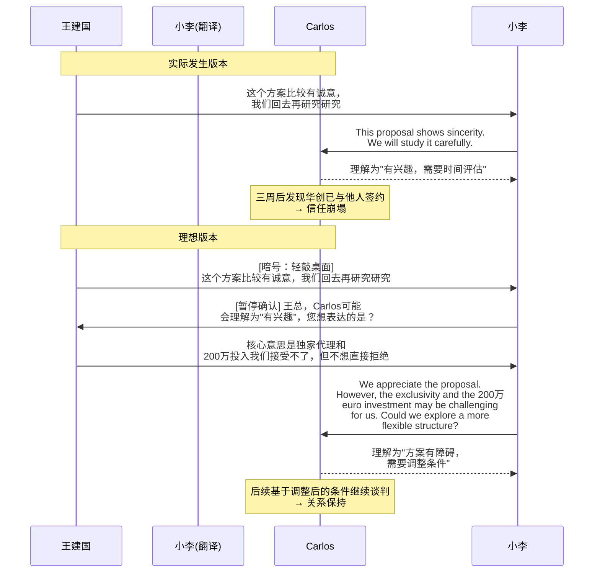
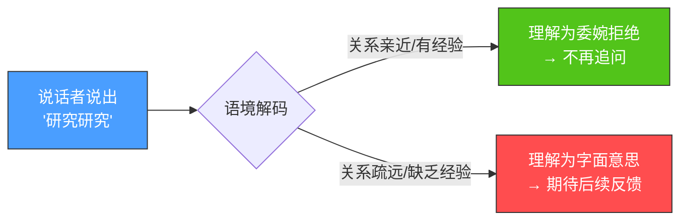
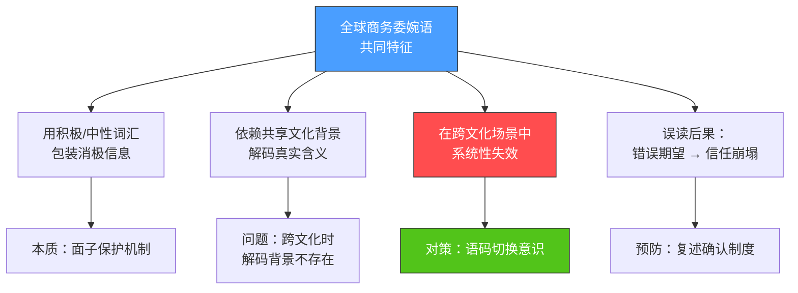
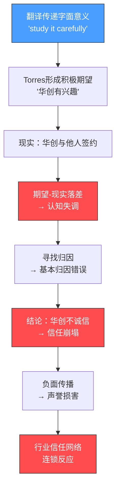
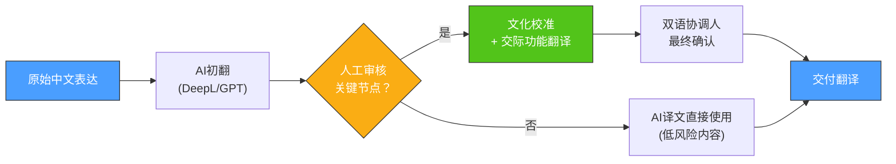

## 场景七：翻译误解导致的商务危机

翻译是跨文化沟通的桥梁，但桥梁本身也可能成为陷阱。当语言的字面意义与文化隐含意义发生分离时，翻译不仅无法弥合差异，反而会制造一种危险的"虚假共识"——双方都以为自己理解了对方，实际上却生活在完全不同的语义世界中。

本案例以一场真实的商务危机为切入点，系统剖析翻译误解的形成机制、信任崩塌的心理过程、72小时黄金补救流程、长期预防体系，以及AI翻译时代的新挑战。无论你是企业管理者、翻译从业者、还是经常参与跨文化沟通的普通职场人，这里的每一个知识点都可能在关键时刻帮你避免百万级的损失。

### 一、场景还原：一场由四个字引发的百万级损失

#### 1.1 背景铺垫

深圳华创科技有限公司（以下简称"华创"）是一家专注于工业自动化设备的中型企业，年营收约3亿元人民币，正积极拓展欧洲市场。2023年初，华创通过行业协会结识了西班牙巴塞罗那的Industrias Torres S.L.（以下简称"Torres"），一家拥有40年历史的工业设备分销商，在伊比利亚半岛和拉丁美洲拥有广泛的销售网络。

双方经过初步接触，决定就华创的智能分拣系统进入西班牙市场一事展开合作谈判。Torres方面派出了商务总监Carlos Martínez和技术顾问Ana García，华创方面则由副总经理王建国带队，随行的翻译是公司行政部的小李——一位英语专业八级、西班牙语B2水平的年轻员工。

谈判持续了三天。前两天进展顺利，双方就技术参数、价格区间和物流方案达成了初步共识。第三天下午，讨论进入关键阶段——Torres提出希望获得华创智能分拣系统在西班牙的独家代理权，期限五年，同时要求华创在第一年投入200万欧元用于市场推广。

#### 1.2 危机发生的那一刻

王建国听完Torres的提案后，内心认为这个条件过于苛刻——独家代理意味着放弃西班牙市场的其他渠道，而200万欧元的前期投入对于年营收3亿元的华创来说是一笔不小的开支。但在谈判桌上，王建国没有直接拒绝，而是用了一句中国商务场合极为常见的表达：

**"这个方案比较有诚意，我们回去再研究研究。"**

小李将这句话翻译为：*"This proposal shows sincerity. We will go back and study/research it carefully."*

Carlos和Ana听到翻译后，交换了一个满意的眼神。在他们的理解中，"study/research it carefully"意味着华创对这个方案非常感兴趣，需要时间进行内部评估和决策。Carlos当场表示："Take your time. We are confident this will be a great partnership."（请慢慢来，我们对这次合作充满信心。）

#### 1.3 误解的发酵

谈判结束后一周，Torres方面没有收到华创的任何回复。Carlos发了一封邮件询问进展，王建国回复说"内部还在讨论"。又过了一周，Torres再次跟进，这次王建国没有回复邮件。

三周后，Torres通过行业渠道得知，华创已经与另一家西班牙分销商——马德里的Distribuciones Ibéricas——签署了合作协议，条件远比Torres提出的更为灵活。

Carlos感到被严重欺骗。他在给华创的邮件中写道：

> *"We trusted your words. You told us you would study the proposal carefully, which we understood as genuine interest. Instead, you were negotiating with a competitor behind our backs. This is not how honest business is conducted."*
>（我们信任了你们的话。你们说会认真研究这个方案，我们理解为真诚的兴趣。但你们却在背后与我们的竞争对手谈判。这不是诚实的商业行为。）

华创方面则感到困惑——在他们看来，"研究研究"本就是一种委婉的拒绝，Torres不应该如此"当真"。王建国事后对同事说："我已经说了'研究研究'，这不就是'没戏'的意思吗？他们怎么还追着问？"

#### 1.4 后果评估

这场误解的代价是多层面的：

| 维度 | 具体损失 |
|------|---------|
| 直接商业损失 | 华创失去了Torres在伊比利亚半岛和拉美的分销网络，新合作伙伴的渠道覆盖范围仅为Torres的60% |
| 品牌声誉损害 | Torres在行业内散布了华创"不诚信"的评价，影响了华创在西班牙市场的后续拓展 |
| 关系成本 | 华创在西班牙行业协会中的信誉评分下降，后续接触的三家潜在合作伙伴均要求先签署保密协议才愿谈判 |
| 内部管理成本 | 华创不得不重新审视其国际化流程，聘请外部顾问进行跨文化培训，额外支出约15万元人民币 |
| 时间成本 | 整个危机处理和关系重建耗时8个月，期间华创在西班牙市场的拓展进度滞后了一个财年 |

据华创内部估算，这场由四个字引发的误解，在未来三年内造成的综合商业损失超过500万元人民币。

#### 1.5 如果重来一次：理想版本

假设时间可以倒流，这个场景应该如何处理？以下是理想版本的对比：



这个对比揭示了一个核心真理：**翻译误解的代价远远高于翻译改进的成本**。

---

### 二、文化解码：为什么"研究研究"会变成定时炸弹

#### 2.1 高语境与低语境的碰撞

这个案例是爱德华·霍尔（Edward T. Hall）高低语境文化理论的经典注脚。Hall在其1976年出版的《超越文化》（*Beyond Culture*）一书中首次提出这一理论框架，将不同文化的沟通方式按照信息编码的依赖程度进行分类。

中国属于典型的高语境文化——大量信息不通过语言的字面意义传递，而是依赖语境、关系、非语言线索和共享的文化背景来编码。西班牙虽然比德国、美国等低语境文化更偏向高语境，但在商务场合中仍然期待相对明确的表态。

"研究研究"在中国商务语境中的运作机制如下：



在中国文化内部，"研究研究"的含义取决于一系列隐性信号：

- **语气**：如果语速放慢、语调下降，通常暗示拒绝
- **后续动作**：如果说话者主动转移话题或结束会议，几乎可以确定是拒绝
- **关系亲疏**：在关系较近的合作伙伴之间，"研究研究"有时确实意味着需要时间评估
- **叠加词汇**："我们回去再研究研究"比"我们需要研究一下"更接近拒绝；"再"字暗示了"之前已经考虑过但没有通过"
- **场合**：在双方高层都在场的正式谈判中，"研究研究"比私下交流中的同样表达更倾向于委婉拒绝，因为正式场合中直接拒绝被认为是失礼的
- **历史模式**：如果说话者在之前的议题上已经多次使用类似委婉表达，那么"研究研究"几乎可以确定是拒绝的信号

但这些隐性信号在翻译过程中全部丢失了。小李作为翻译，只传达了语言的字面意义，而那些承载真实意图的语气、停顿、眼神交流等非语言信息，在跨语言传递中被彻底过滤掉了。

#### 2.2 中文商务委婉语的语义光谱

"研究研究"并非孤例。中文商务场景中存在一个庞大的委婉表达体系，每一个表达都有字面意义和隐含意义的双重编码。理解这个体系，不仅对翻译有用，对任何需要与中国商务人士打交道的人都至关重要。

以下是一份经过系统整理的中文商务委婉语速查表，按"误读风险"从高到低排列：

| 中文表达 | 字面翻译 | 实际含义（高语境解码） | 误读风险 | 安全的跨文化替代表达 |
|---------|---------|---------------------|---------|-------------------|
| 研究研究 | Study/research it | 委婉拒绝或拖延 | 极高 | "The current structure may not work for us. Could we explore alternatives?" |
| 回去考虑考虑 | Go back and think about it | 委婉拒绝 | 高 | "We have some concerns about this approach and may not be able to proceed as proposed." |
| 这个方案挺有意思 | This proposal is quite interesting | 不太认可，但不想直接否定 | 高 | "We see some interesting elements, but we have concerns about [specific aspect]." |
| 你看着办吧 | You decide | 不满意，甩手不管 | 高 | "I trust your judgment on this, but I want to flag that I have reservations." |
| 我们再沟通沟通 | Let's communicate more | 目前无法达成共识 | 中 | "We're not aligned on this yet. Let's identify the specific gaps." |
| 差不多吧 | More or less / almost | 不满意但不想争论 | 中 | "I can accept this with some adjustments, specifically..." |
| 这个事情比较复杂 | This matter is quite complex | 目前不想做/不想参与 | 中 | "This project has challenges we need to address before committing." |
| 我尽量 | I'll try my best | 大概率做不到 | 中 | "I'll do my best, but I want to be upfront that this is at the edge of our capacity." |
| 有机会合作 | Hope to cooperate in the future | 礼貌拒绝 | 中 | "This particular opportunity isn't the right fit, but I value the relationship." |
| 下次再说 | Let's talk next time | 委婉结束当前话题 | 中 | "Let's pause this discussion and revisit when conditions are different." |
| 这个价格还可以 | This price is okay | 觉得贵，但在可接受范围 | 低 | "The price is acceptable, though we'd appreciate some flexibility on volume discounts." |
| 基本同意 | Basically agree | 有保留地同意，还有细节要谈 | 低 | "We agree in principle, with the following specific reservations..." |

这个表格揭示了一个关键事实：中文商务委婉语系统性地将拒绝、否定和不满意的信号编码为看似中性甚至积极的表达。如果不了解这套编码系统，低语境文化的人几乎必然会误读。

#### 2.3 不只中文：全球商务委婉语对照

中文并非唯一使用委婉语的商务文化。事实上，几乎每种文化都有自己的"潜台词系统"，只是程度和方式不同。了解这些系统，有助于建立更全面的跨文化敏感度：

| 文化/语言 | 典型委婉表达 | 字面意思 | 真实意图 | 解码难度 |
|-----------|------------|---------|---------|---------|
| 中文 | "研究研究" | Let me study it | 委婉拒绝 | ★★★★★ |
| 日语 | "検討します" (kentō shimasu) | I will consider it | 拒绝/不感兴趣 | ★★★★★ |
| 韩语 | "알겠습니다" (algesseumnida) | I understand | 不一定同意，仅表示收到信息 | ★★★★ |
| 英式英语 | "That's a very brave proposal" | 那是个勇敢的方案 | 那是个愚蠢的方案 | ★★★★ |
| 英式英语 | "With the greatest respect..." | 带着最大的敬意… | 你完全错了 | ★★★ |
| 德语 | "Das ist nicht ganz einfach" | 这不那么简单 | 这非常困难/几乎不可能 | ★★★ |
| 法语 | "C'est intéressant" | 这很有趣 | 我不太同意 | ★★★ |
| 俄语 | "Надо подумать" (nado podumat') | 需要想想 | 拒绝 | ★★★ |
| 印地语 | "Dekhte hain" (देखते हैं) | 我们看看 | 不太可能发生 | ★★★★ |
| 阿拉伯语 | "Inshallah" (إن شاء الله) | 如真主所愿 | 不确定/不太可能 | ★★★★ |



#### 2.4 翻译学视角：语义翻译 vs 交际翻译

翻译学中有一个经典区分：**语义翻译**（semantic translation）和**交际翻译**（communicative translation）。这一区分由英国翻译理论家彼得·纽马克（Peter Newmark）在其1988年著作《翻译教程》（*A Textbook of Translation*）中系统阐述。

- **语义翻译**：追求原文的字面准确性，保留原文的句法结构和词汇选择，让译文读者尽可能接近原文的语言形式
- **交际翻译**：追求在目标语言中产生与原文相同的效果，让译文读者获得与原文读者相同的理解和感受

小李采用的是纯粹的语义翻译——"研究研究"被准确地翻译为"study/research it carefully"。但交际翻译应该传达的是这句话在特定商务语境中的**交际功能**，即"礼貌地表示不接受当前方案"。

这里存在一个翻译学中的经典困境：**译者的忠诚应该给谁？** 如果忠于原文的字面意义，就会丢失文化意图；如果忠于说话者的真实意图，就需要"擅自"解读，这可能超出翻译的职责范围。

语言学家尤金·奈达（Eugene Nida）提出的"动态对等"（dynamic equivalence）理论为这个问题提供了答案：翻译的目标不是让译文在形式上与原文对等，而是让译文在读者身上产生的效果与原文在原读者身上产生的效果对等。按照这个标准，"研究研究"在商务谈判场景中的动态对等翻译应该是：

> *"We appreciate the proposal and will need to discuss it internally. However, I should be honest that this particular structure may be challenging for us to move forward with."*

这个翻译虽然"偏离"了原文的字面意义，但准确传达了说话者的交际意图：婉拒但不伤面子。

**纽马克的翻译策略选择矩阵**可以帮助翻译在不同场景中做出正确的策略选择：

| 场景类型 | 推荐策略 | 原因 | 示例 |
|---------|---------|------|------|
| 商务谈判中的立场表态 | 交际翻译 | 准确传达意图比保留字面意义更重要 | "研究研究" → 表达困难/保留意见 |
| 合同/法律文件 | 语义翻译 | 法律效力依赖精确措辞 | 条款逐字翻译+法律术语对照 |
| 技术规格说明 | 语义翻译 | 技术参数必须精确 | 尺寸、重量、性能指标 |
| 宴会/社交寒暄 | 交际翻译 | 传达情感和态度更重要 | "招待不周" → 不用直译 |
| 营销材料 | 创意翻译/本地化 | 效果和吸引力优先 | 广告语需要文化适配 |
| 文学/诗歌 | 语义翻译+注释 | 保留原文风格和文化特色 | 引用的典故需解释 |

#### 2.5 信任破裂的心理机制

从社会心理学的角度看，这场误解之所以造成如此严重的后果，不仅是因为信息不对称，更是因为它触发了一种被称为**"归因偏差"**（attribution bias）的认知机制。

当Torres发现华创已经与其他合作伙伴签约时，Carlos的内心推理过程是：

1. **事实**：华创说会"研究"我们的方案，但实际上已经与竞争对手签约
2. **归因**：华创从一开始就在欺骗我们，"研究"只是一个借口
3. **情绪**：感到被背叛、被轻视、不被尊重
4. **行为**：在行业内传播华创"不诚信"的评价

这个归因过程忽略了两个关键事实：

**第一**，在华创的文化框架中，"研究研究"本身就是一种诚实的表态——它传递的信息是"我们不太可能接受这个方案"，只是用了更委婉的方式。华创方面并没有"欺骗"的意图，只是使用了自己文化中的沟通规范。

**第二**，Carlos的归因过程中存在"基本归因错误"（fundamental attribution error）——他倾向于将华创的行为归因于其"品性"（不诚信），而忽略了"情境"因素（文化差异导致的表达方式不同）。心理学研究显示，人们在解释他人行为时，系统性地高估品性因素、低估情境因素。

但问题在于：**意图不能为后果免责**。无论华创是否有欺骗的意图，Torres方面实际接收到的信号是"有兴趣"，最终得到的结果是"被抛弃"。这种"期望-现实"的巨大落差，才是信任破裂的根本原因。

信任崩塌的心理过程可以用以下模型来理解：



心理学家约翰·戈特曼（John Gottman）在研究亲密关系时发现，修复信任需要的正面互动数量是破坏信任的负面互动数量的五倍（"5:1比率"）。在商务关系中，这个比率可能更高，因为商业信任的基础本就比个人关系更脆弱——商业信任建立在可预测的、一致的行为之上，而一次"欺骗"（无论是否有意）直接摧毁了可预测性假设。一场翻译误解造成的信任损失，可能需要数月甚至数年的正面互动才能修复——如果还有机会修复的话。

#### 2.6 翻译的心理负担：被忽视的"夹心人"

在这类危机中，最容易被忽略的角色是翻译本身。小李在这场事件中承受着双重压力：

**角色冲突**：翻译被期望同时忠于两个主人——己方领导（传达真实意图）和对方听众（准确理解信息）。当这两个目标冲突时，翻译陷入无解的困境。选择忠于字面意义，可能误导对方；选择传达真实意图，可能"越权"或"自作主张"。

**责任归属困境**：危机发生后，华创内部倾向于将责任推给翻译——"小李翻译得不好"。但问题的根源不在翻译能力，而在于企业没有建立清晰的翻译授权机制：翻译是否有权在必要时进行文化解释？翻译是否有权在关键时刻暂停确认？这些问题从未被明确回答。

**心理创伤**：对于年轻的翻译来说，一场百万级的商务危机直接归因于自己的翻译工作，这种经历可能造成严重的自我怀疑和职业创伤。企业有责任在事后为翻译提供心理支持和专业督导，而不是将其当作替罪羊。

---

### 三、应对策略：从危机处理到体系重建

#### 3.1 危机发生后的72小时黄金补救

当翻译误解已经发生并造成信任损伤时，前72小时的应对至关重要。以下是一个经过验证的分阶段补救流程：

**第一阶段：0-24小时——快速响应**

1. **确认误解的具体内容**。回溯沟通记录，明确是哪个表达、在什么语境下被误读。不要猜测，要通过具体对话还原来定位问题。具体操作：调取会议录音（如有）、回忆对话细节、与翻译核对原文和译文。

2. **内部对齐**。华创方面需要在内部统一认识——这不是对方的"理解力问题"，而是己方的表达方式在跨文化传递中失效了。推卸责任只会让情况更糟。内部对齐会议应达成三个共识：误解的原因是什么、己方应承担什么责任、补救的目标是什么。

3. **发出第一封修复邮件**。邮件的核心结构如下：

> 主题：关于[日期]会议沟通的澄清
>
> Dear Carlos,
>
> Following our recent discussions, I realize there may have been a misunderstanding in how our response was communicated. The Chinese expression I used, "研究研究" (yanjiu yanjiu), while literally meaning "to study/research," carries a different connotation in Chinese business culture — it often signals that a proposal needs significant reconsideration rather than expressing active interest.
>
> I sincerely apologize for any confusion this may have caused. I should have been more direct in expressing our concerns about the exclusivity terms and the proposed market investment. I take full responsibility for not ensuring our position was clearly understood.
>
> I would welcome the opportunity to discuss this matter in person, with a professional interpreter present, to ensure we can communicate with full clarity going forward.
>
> Sincerely,
> Jianguo Wang

这封邮件做了三件关键的事情：
- 承认误解的存在，不回避
- 解释文化差异，提供上下文
- 承担责任，不归咎于翻译或对方

**修复邮件的关键原则**：

| 原则 | 正确做法 | 错误做法 |
|------|---------|---------|
| 责任归属 | "I take full responsibility" | "There was a translation issue" |
| 原因解释 | 提供文化背景，帮助对方理解 | 用文化差异当借口 |
| 行动导向 | 提出具体的后续步骤 | 只道歉不给方案 |
| 语气把控 | 真诚、尊重、不卑不亢 | 过度卑微或防御性措辞 |
| 时效性 | 24小时内发出 | 拖延数天，让对方先"冷静" |

**第二阶段：24-48小时——高层介入**

4. **安排高层级的沟通**。如果王建国是副总经理，那么华创的总经理或CEO应该亲自出面，通过视频电话或当面拜访的方式与Torres高层会面。高层的介入传递的信号是"我们非常重视这段关系"。

5. **携带具体方案**。不是空手道歉，而是带着一个经过调整的合作方案——即使华创最终不接受Torres的独家代理条件，也应该提供一个替代方案，例如非独家代理、更低的市场投入要求、分阶段合作等。空洞的道歉无法重建信任，只有具体的行动才能证明诚意。

**第三阶段：48-72小时——制度承诺**

6. **提出制度性改进措施**。向Torres展示华创正在采取的具体行动，例如聘请专业跨文化顾问、建立翻译审核流程等。这不仅是为了修复当前关系，也是向整个行业传递华创对跨文化沟通的重视。

7. **书面确认未来沟通规范**。与Torres共同制定一份"沟通备忘录"，明确双方在未来沟通中将遵循的原则：重要表态用书面形式确认、使用专业翻译而非内部人员、关键决策点要求"复述确认"。

**72小时补救时间线总览**：

```mermaid
gantt
    title 72小时黄金补救时间线
    dateFormat HH:mm
    axisFormat %H:%M
    
    section 第一阶段 0-24h
    确认误解内容           :a1, 00:00, 2h
    内部对齐会议           :a2, after a1, 2h
    起草修复邮件           :a3, after a2, 1h
    发送修复邮件           :a4, after a3, 1h
    等待对方回应           :a5, after a4, 6h
    
    section 第二阶段 24-48h
    联系己方高层           :b1, 24:00, 2h
    准备替代方案           :b2, after b1, 4h
    安排高层视频/面谈      :b3, after b2, 2h
    高层沟通               :b4, after b3, 2h
    
    section 第三阶段 48-72h
    拟定制度改进方案       :c1, 48:00, 4h
    起草沟通备忘录         :c2, after c1, 4h
    双方签署备忘录         :c3, after c2, 2h
```

#### 3.2 翻译管理的系统化方案

这场危机暴露的核心问题是华创缺乏系统化的翻译管理流程。以下是企业级翻译管理的完整方案：

**译前准备——Briefing Protocol**

在任何重要的跨文化会议之前，翻译（或口译员）必须接受系统化的准备。以下是一份可直接使用的会议前翻译简报表模板：

```markdown
# 会议翻译简报表

## 基本信息
- 会议日期：
- 参与方：[己方人员] vs [对方人员]
- 会议目标：
- 预计时长：
- 会议类型：初次接触 / 实质谈判 / 合同签署 / 争议处理

## 关键议题
1. [议题1]：我方立场是______，可能的底线是______
2. [议题2]：我方立场是______，可能的底线是______

## 需要特别注意的表达
| 我方可能的表达 | 字面含义 | 真实意图 | 建议翻译方式 |
|--------------|---------|---------|------------|
| "研究研究" | study it | 不太接受 | 提醒对方需要进一步讨论，当前方案可能有困难 |
| "回去商量商量" | discuss it back | 内部有分歧 | 需要内部讨论后回复 |
| [其他表达] | | | |

## 己方人员的沟通风格
- [姓名]：风格偏直接/委婉，说话时注意的隐含信号包括______

## 对方文化的已知特点
- 对方文化在高低语境光谱上的位置：______
- 对方商务场合中对直接表态的接受度：______
- 已知的对方文化禁忌或敏感点：______

## 翻译的权限与边界
- 是否允许翻译在必要时进行文化解释：是/否
- 是否允许翻译在关键节点确认双方理解一致：是/否
- 遇到模糊表达时的处理方式：当场询问说话者真实意图 / 按字面翻译
- 翻译是否可以主动要求暂停：是/否（建议：是）
```

**译中管理——实时校准机制**

会议进行中，翻译不仅需要传递语言，还需要充当文化信号的"实时解码器"。具体操作方式：

1. **预设暗号系统**。己方代表与翻译之间建立一套非语言暗号系统：
   - 手指轻敲桌面 = "这句话需要你做文化解释"
   - 微微点头 = "按字面翻译即可"
   - 看手表 = "这句话是委婉拒绝，请用合适的方式传达"
   - 轻微皱眉 = "我说的和我想的不一样，暂停确认"

   暗号系统的关键要求：必须在会议前演练过，确保双方都熟悉；暗号必须隐蔽，不能让对方察觉；暗号含义必须明确，不能有歧义。

2. **"暂停-确认"机制**。在关键节点（如涉及金额、期限、条件的表态），翻译有权要求暂停，向说话者确认真实意图后再翻译。这个机制看似拖慢节奏，实则避免了代价高昂的误解。具体话术："Excuse me, may I take a moment to ensure I convey this accurately?"（请允许我稍停一下，确保我准确传达这一点。）——这个请求在国际商务场合中是完全专业且被接受的。

3. **翻译笔记**。翻译在会议中记录关键表态的原文和译文，会议结束后立即与双方核对，确保双方的理解一致。翻译笔记的格式建议：

时间 | 原文（己方） | 译文（对方） | 可能的歧义 | 备注
-----|------------|------------|-----------|-----
14:30 | "研究研究"  | "study it carefully" | ⚠️ 高风险 | 对方可能理解为有兴趣
15:15 | "差不多吧"  | "more or less"       | ⚠️ 中风险 | 己方意为"基本同意但有保留"

**译后复盘——Post-Mortem Protocol**

每次重要会议后，翻译团队应进行30分钟的复盘，回答以下问题：

- 哪些表达在翻译过程中可能丢失了文化含义？
- 对方的哪些反应可能暗示了误解？
- 是否有任何时刻需要翻译做文化解释但没有做？
- 会议中是否有"暂停确认"的机会被错过了？
- 下次会议需要注意哪些改进点？
- 翻译笔记中标记的风险点需要跟进吗？

#### 3.3 双语协调人制度

对于持续性的跨文化合作（如长期供应商关系、合资企业），仅靠临时翻译是不够的。企业需要建立**双语项目协调人**（Bilingual Project Coordinator）制度。

双语项目协调人与传统翻译的核心区别在于：

| 维度 | 传统翻译 | 双语项目协调人 |
|------|---------|-------------|
| 职责范围 | 语言转换 | 语言转换 + 文化桥接 + 关系维护 |
| 参与程度 | 仅在会议时参与 | 全程参与项目 |
| 信息权限 | 限于会议内容 | 了解项目全貌和双方立场 |
| 主动性 | 被动等指令 | 主动识别潜在误解并预警 |
| 介入时机 | 事后翻译 | 事前预防 + 事中校准 + 事后复盘 |
| 价值衡量 | 准确率 | 合作满意度 + 误解发生率 |
| 薪酬模式 | 按时/按次计费 | 月薪制+项目奖金 |
| 职业发展 | 技术路径 | 管理路径（可晋升为国际业务经理） |

双语项目协调人的核心职责包括：

1. **日常沟通的"文化校准"**。在双方日常邮件、微信/WhatsApp交流中，协调人有权对可能产生误解的表达进行预审。例如，当华创方面写出"我们觉得这个方案还可以"时，协调人会提醒："这句话在中文里的意思是'不太满意'，你确定要用这个表达吗？要不要换个更明确的说法？"

2. **定期文化简报**。每两周向双方提供一份简短的"文化健康报告"，总结近期沟通中出现的潜在误解信号，以及建议的调整方向。

3. **冲突预警**。当协调人识别到双方正在因为文化差异而产生不满时（即使双方还没有明确表达），协调人应主动介入，在冲突升级之前进行调解。

4. **知识沉淀**。将每次出现的误解和解决方案整理成"跨文化沟通知识库"，为未来的合作提供参考。这些知识库随时间积累，会成为企业国际化的宝贵资产。

#### 3.4 数字化时代的翻译管理工具

现代跨文化沟通越来越多地发生在数字渠道中。以下是推荐的工具体系：

| 工具类型 | 推荐工具 | 适用场景 | 注意事项 |
|---------|---------|---------|---------|
| 专业CAT工具 | SDL Trados, MemoQ | 合同/技术文档翻译 | 确保术语一致性 |
| 实时协作翻译 | DeepL Pro, Google Workspace | 日常邮件/文档 | 仅作初稿，需人工审核 |
| 术语管理系统 | TermBase, 企业自建术语库 | 统一关键术语的翻译 | 核心：维护双语术语对照表 |
| 会议录音转写 | Otter.ai, 讯飞听见 | 会议记录和事后复盘 | 需确认录音合法性 |
| 翻译记忆库 | TM-Town, 企业自建TM | 重复性内容的一致翻译 | 积累越久价值越高 |
| 沟通确认工具 | 邮件确认模板, Slack/Teams专用频道 | 重要表态的书面确认 | 形成制度而非依赖个人习惯 |

---

### 四、AI翻译时代的新挑战

#### 4.1 机器翻译的"流利陷阱"

随着DeepL、GPT-4、Google Translate等AI翻译工具的普及，一个新的风险正在浮现：**AI翻译的流利度会制造虚假的准确性**。

传统的人工翻译如果水平不够，往往会留下明显的"翻译腔"，这反而是一种警告信号——读者会意识到这是翻译，可能不完全准确。但AI翻译产出的文本往往非常流利自然，这让读者更容易全盘接受其内容，包括那些文化层面上的误译。

以"研究研究"为例，让我们看看不同AI工具的翻译结果：

| AI工具 | 翻译结果 | 交际功能传达 | 风险评估 |
|--------|---------|------------|---------|
| Google Translate | "Let's study it" | ❌ 传达了字面意思 | 高风险——对方可能理解为有兴趣 |
| DeepL | "We'll look into it" | ⚠️ 略微偏中性 | 中风险——仍可能被理解为积极信号 |
| ChatGPT（无上下文） | "We'll study/research it further" | ❌ 字面翻译 | 高风险——同Google Translate |
| ChatGPT（有文化上下文提示） | "We appreciate the proposal but have reservations that require internal discussion" | ✅ 传达了真实意图 | 低风险——准确表达了保留意见 |

这个对比揭示了一个关键事实：**AI翻译的质量高度依赖于提示词的质量**。没有文化上下文的AI翻译，本质上就是一台更快速的"语义翻译机器"，它无法自动完成从语义翻译到交际翻译的跨越。

#### 4.2 AI翻译的使用准则

基于以上分析，以下是企业在跨文化沟通中使用AI翻译工具的具体准则：

**可以用AI翻译的场景**：
- 内部参考文档的初步翻译（需人工审核）
- 信息性内容的快速理解（了解大意即可）
- 术语查询和对照
- 已有翻译记忆库支持的重复性内容

**必须用人工翻译的场景**：
- 谈判中的立场表态（如本案例中的"研究研究"）
- 合同和法律文件
- 涉及金额、期限、条件的关键表态
- 争议处理和危机沟通
- 任何可能影响商业决策的内容

**AI+人工协作的最佳实践**：



#### 4.3 构建企业专属的"文化翻译提示词库"

对于经常使用AI辅助翻译的企业，建议构建一套专属的"文化翻译提示词"（Cultural Translation Prompts），将企业文化、常用委婉语和跨文化沟通规范编码进提示词中，让AI在翻译时自动进行文化校准。

提示词模板示例：

你是一位专业的中英商务翻译，同时精通中国和[目标国]的商务文化。
在翻译时请遵循以下规则：

1. 当遇到以下中文商务委婉表达时，不要字面翻译，请传达其交际功能：
   - "研究研究" → 传达：方案有重大障碍，不太可能接受
   - "回去考虑考虑" → 传达：当前方案不被接受
   - "这个方案挺有意思" → 传达：有保留意见
   - "我尽量" → 传达：可能无法做到

2. 翻译风格偏好：[直接/委婉/根据对方文化调整]

3. 行业术语参照：[术语表链接或内容]

4. 当遇到模糊表达时，标注[⚠️ 可能存在文化含义差异]并提供两种翻译选项

这种做法将隐性的文化知识转化为显性的系统规则，即使更换翻译人员或AI工具，也能保持翻译质量的一致性。

---

### 五、延伸案例：翻译误解的更多面孔

#### 5.1 案例A：日式"はい"的陷阱

一家美国IT公司与日本合作伙伴进行视频会议。美方项目经理问："Can your team deliver the prototype by March 15?"（你们团队能在3月15日前交付原型吗？）日方代表回答："はい"（Hai），翻译为"Yes"。

美方理解为"可以按时交付"。但日方的"はい"在很多语境中只是表示"我在听"或"我收到了这个信息"，而非"我同意/我能做到"。3月15日，原型没有交付，美方大怒，日方困惑——"我们从来没有承诺过那个日期"。

这个案例揭示了一个更深层的问题：即使是最简单的日常用语（"是"/"はい"/"Yes"），在不同文化中也有不同的语用功能。翻译如果只传递词汇意义而不传递语用功能，就等于在传递错误信息。

**日语"はい"的语用功能光谱**：

| 语境 | "はい"的实际含义 | 正确的英文对应 |
|------|---------------|-------------|
| 回答"是/否"问题时表示肯定 | Yes, I agree | Yes |
| 表示"我在听，请继续" | I'm listening | Uh-huh / I see |
| 表示"我收到了信息" | Understood / Noted | Understood (但不一定同意) |
| 礼貌性回应，不表达立场 | （无实质含义） | （不应翻译为肯定） |
| 面对上级时表示恭顺 | I hear you | I will take that into consideration |

#### 5.2 案例B：法律翻译中的致命歧义

2001年，日本三井住友银行（Sumitomo Mitsui Banking Corporation）在一笔复杂的金融衍生品交易中，因英文合同中"shall"和"may"的翻译歧义，与交易对手产生了重大争议。日语中缺乏与英语法律用语"shall"（必须）完全对应的强制性表达，翻译将"shall"译为日语中语气较弱的"ものとする"，导致日方对合同条款的约束力产生了低估。

最终这个翻译问题在仲裁中被认定为合同解释的关键争议点之一，涉及金额达数亿美元。

这个案例说明：在法律、金融、医疗等高风险领域，翻译误解的代价不仅是信任损失，还可能是巨额经济损失甚至法律责任。

**法律翻译中常见的高危术语对照**：

| 英文术语 | 常见错误翻译 | 正确翻译思路 | 风险等级 |
|---------|------------|------------|---------|
| shall | 应该 / するものとする | 必须（表示强制义务） | 🔴 极高 |
| may | 可以 / してもよい | 有权（表示许可，非义务） | 🔴 极高 |
| will | 将 / する | 将来时态 vs 承诺义务？需看上下文 | 🟡 中 |
| should | 应该 / すべき | 建议（非强制），但中文"应该"也可表强制 | 🟡 中 |
| including but not limited to | 包括但不限于 | 必须完整保留，不能简化为"包括" | 🔴 极高 |
| material adverse change | 重大不利变化 | 需要有法律定义的精确对应 | 🟡 中 |
| indemnify | 赔偿 / 弁償する | 保障+赔偿（范围通常大于普通赔偿） | 🟡 中 |

#### 5.3 案例C：医学翻译的生命代价

世界卫生组织（WHO）2019年的一份报告指出，全球每年因医疗翻译不准确导致的误诊和用药错误数以万计。一个经典案例是：一位波多黎各患者在美国就医时，医生问她是否感到"intoxicada"（英语中intoxicated意为醉酒/中毒），但"intoxicada"在西班牙语中也可以指"感到恶心/不舒服"。患者回答"yes"，医生据此判断她可能是药物过量，延误了对脑部疾病的诊断。

这个案例将翻译误解的后果从商业层面提升到了生命安全层面，深刻说明了"文化翻译"能力的重要性。

**医学翻译中的高危同形异义词**：

| 词汇 | 英语含义 | 西班牙语含义 | 后果 |
|------|---------|------------|------|
| intoxicado/a | 醉酒/中毒 | 恶心/不舒服 | 误诊 |
| constipado/a | 便秘 | 感冒/鼻塞 | 治疗方向完全错误 |
| embarazada | 尴尬的 | 怀孕的 | 沟通混乱 |
| sensible | 明智的 | 敏感的 | 用药剂量可能出错 |
| exitoso | 退出的 | 成功的 | 信息完全相反 |

#### 5.4 案例D：远程会议中翻译的双重困境

2021年，一家中国科技公司与德国汽车零部件供应商通过Zoom进行远程技术谈判。中方技术总监用中文说："这个技术方案**理论上可行**，但实际操作中可能会有一些挑战。"翻译将其译为："This technical solution is theoretically feasible, but there might be some challenges in practice."

德方工程师将这句话记录为"方案可行，有挑战需解决"——这是一个积极信号。但中方技术总监的真实意思是"这个方案我不看好，实施起来问题很多"。

远程会议放大了翻译误解的风险，原因有三：

- **非语言信号丢失**：视频会议中，中方人员的犹豫表情、皱眉等细微非语言信号难以被德方捕捉
- **音频质量**：网络延迟和音频压缩可能导致语气信息丢失
- **多任务干扰**：远程参会者更容易分心，错过翻译后对方的即时反应

**远程会议的翻译风险缓解措施**：

| 措施 | 具体操作 | 效果 |
|------|---------|------|
| 双屏策略 | 翻译用一个屏幕看发言人表情，另一个屏幕做记录 | 捕捉非语言信号 |
| 文字确认 | 每个关键表态后，翻译在聊天框发送双语文字确认 | 留下书面记录 |
| 录制+回看 | 会后24小时内回看录制，标注可能的误解点 | 事后补救 |
| 会前预沟通 | 会前将己方可能的委婉表达提前告知翻译 | 预防为主 |
| 分段确认 | 每15-20分钟暂停，双方确认理解一致 | 降低累积误差 |

---

### 六、工具箱：翻译误解的预防与处理清单

#### 6.1 会议前检查清单

在重要的跨文化会议之前，逐项检查以下内容：

- [ ] 是否已选定具有目标文化商务经验的翻译（不仅仅是语言能力）？
- [ ] 是否已完成翻译简报表的填写？
- [ ] 是否已将己方可能使用的委婉表达列出来，并与翻译沟通了真实意图？
- [ ] 是否已确认翻译了解对方文化的沟通特点（直接/间接、高/低语境）？
- [ ] 是否已建立翻译在会议中的暂停确认权限？
- [ ] 是否已准备关键文件的双语版本，以便书面确认？
- [ ] 是否已确认翻译了解本次会议的核心目标和底线？
- [ ] 是否已建立暗号系统并进行了演练？
- [ ] 如果是远程会议，是否已确认翻译的设备和技术条件？
- [ ] 是否已准备翻译笔记模板？

#### 6.2 会议中实时监控清单

会议进行中，持续关注以下信号：

- [ ] 对方在翻译完成后是否有短暂的困惑表情或停顿？（可能表示翻译不够清晰）
- [ ] 对方是否频繁要求重复或澄清？（可能表示翻译质量或文化适配有问题）
- [ ] 己方是否使用了任何可能被字面理解的委婉表达？（需要翻译做文化解释）
- [ ] 对方的回应是否与己方的预期不一致？（可能是翻译导致的理解偏差）
- [ ] 是否在关键决策点安排了复述确认环节？
- [ ] 翻译是否在做实时笔记？
- [ ] 是否有任何时刻气氛发生了微妙变化？（可能是未被识别的误解）

#### 6.3 会议后复盘清单

会议结束后24小时内完成：

- [ ] 与翻译核对关键表态的原文和译文，确认无遗漏
- [ ] 整理会议纪要，双语版本发送给双方确认
- [ ] 标注任何可能产生误解的表述，准备补充说明
- [ ] 与翻译讨论改进点，为下次会议做准备
- [ ] 将翻译笔记归档到跨文化沟通知识库
- [ ] 如发现潜在误解，在48小时内发出澄清邮件

#### 6.4 翻译选择的评估框架

选择跨文化商务翻译时，不应仅看语言证书，而应综合评估以下维度：

| 评估维度 | 权重 | 评估标准 | 测试方法 |
|---------|------|---------|---------|
| 目标语能力 | 20% | 能够流利、准确地进行语言转换 | 标准化语言测试+现场口译测试 |
| 文化知识 | 25% | 了解双方文化中的沟通特点、商务礼仪和委婉表达系统 | 提供文化场景题，要求解释隐含意义 |
| 领域知识 | 20% | 了解会议涉及的专业领域（技术、法律、金融等） | 行业术语测试+案例分析 |
| 临场应变 | 15% | 能够在会议中灵活处理突发的语言和文化问题 | 模拟突发场景测试 |
| 职业伦理 | 10% | 保密意识、中立立场、愿意在必要时进行文化解释 | 情景测试+背景调查 |
| 沟通风格 | 10% | 能够匹配双方的正式/非正式沟通风格 | 观察实际翻译过程中的风格适应能力 |

一个实用的测试方法：给翻译候选人提供一段中文商务场景对话（包含委婉表达），要求其不仅翻译语言，还解释每句话背后的真实意图和文化含义。能够准确解码隐含意义的翻译，才是真正合格的跨文化商务翻译。

#### 6.5 企业跨文化沟通成熟度自评

企业在跨文化沟通方面处于什么水平？以下是一份简易自评量表：

| 成熟度等级 | 特征描述 | 典型企业状态 |
|-----------|---------|------------|
| L1 无意识 | 没有意识到翻译是风险点，随便找个会外语的人翻译 | "找个英语好的同事帮忙翻一下" |
| L2 反应式 | 出过问题后才开始重视，但没有系统化流程 | "上次吃了亏，这次注意点" |
| L3 流程化 | 建立了翻译简报、确认、复盘的标准化流程 | 有翻译管理SOP，新项目必须执行 |
| L4 制度化 | 设立了双语协调人岗位，有术语库和翻译记忆库 | 跨文化沟通是国际业务的标配能力 |
| L5 文化驱动 | 跨文化能力内化为企业DNA，全员具备基本跨文化意识 | "我们的员工天然具备跨文化沟通敏感度" |

大多数中国出海企业处于L1-L2之间。华创的案例正是L1状态的典型后果。从L1到L3的跃迁，通常需要一次"教训"来驱动——但聪明的企业会从别人的教训中学习，而不是等到自己踩坑。

---

### 七、关键启示

#### 启示一：文化翻译比语言翻译更重要

翻译的核心使命不是在两种语言之间搬运词汇，而是在两种文化之间传递意义。一个只会做语言翻译的翻译，就像一个只会搬运砖块却不理解建筑结构的搬运工——砖块搬到了，但建筑没有建成。

#### 启示二：模糊是高语境文化的武器，但也是跨文化的地雷

中文商务委婉语在文化内部运作良好，因为双方共享同一套解码系统。但当这个系统被带入跨文化场景时，它不再是润滑剂，而变成了定时炸弹。跨文化沟通者需要建立一个"语码切换"意识：在跨文化场景中，适度放弃母语中的委婉表达，用更明确的方式传递真实意图。

#### 启示三：翻译误解的代价远超想象

一场翻译误解不仅可能损失一个合同、一段关系，还可能损害企业在一个市场的整体声誉。在全球化时代，企业的跨文化沟通能力已经成为核心竞争力的一部分。投资于专业的翻译管理和跨文化培训，不是成本，而是回报率极高的战略投资。

#### 启示四：信任的建立是缓慢的，信任的崩塌是瞬间的

心理学研究表明，人类对负面信息的记忆强度是正面信息的3-5倍（"负面偏差"效应）。一次翻译误解造成的信任损伤，可能需要数十次正面互动才能修复。这提醒我们：在跨文化沟通中，预防误解的成本远远低于修复误解的成本。

#### 启示五：制度化是最好的预防

依赖个人的跨文化意识和翻译能力是不可靠的。企业需要将翻译管理、文化桥接和沟通确认机制制度化——从翻译选择标准、会议前简报流程、会议中确认机制到会议后复盘制度，形成一套完整的、可复制的跨文化沟通管理体系。只有制度化，才能在人员变动、场景变化中保持沟通质量的稳定性。

#### 启示六：AI不能替代文化判断

AI翻译工具可以提高效率，但不能替代文化判断。在高风险的跨文化场景中，AI应该作为辅助工具而非决策者。企业需要明确界定AI翻译的适用边界，并为关键场景保留人工文化审核环节。

***

> **本场景的核心公式**：翻译误解 = 字面翻译（语义翻译）× 文化差异（高低语境落差）× 信任脆弱性（首次合作）× 缺乏确认机制（制度空白）。四个因素中消除任何一个，危机就不会发生。而成本最低的消除方式，是在"缺乏确认机制"这个环节建立制度——因为它不依赖于改变文化、不依赖于提升翻译水平、只需要在流程中增加几个确认步骤。
