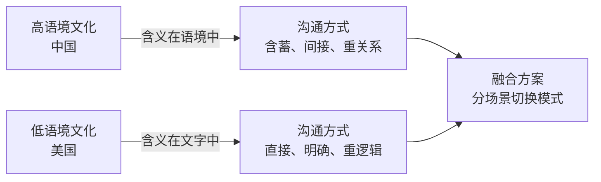
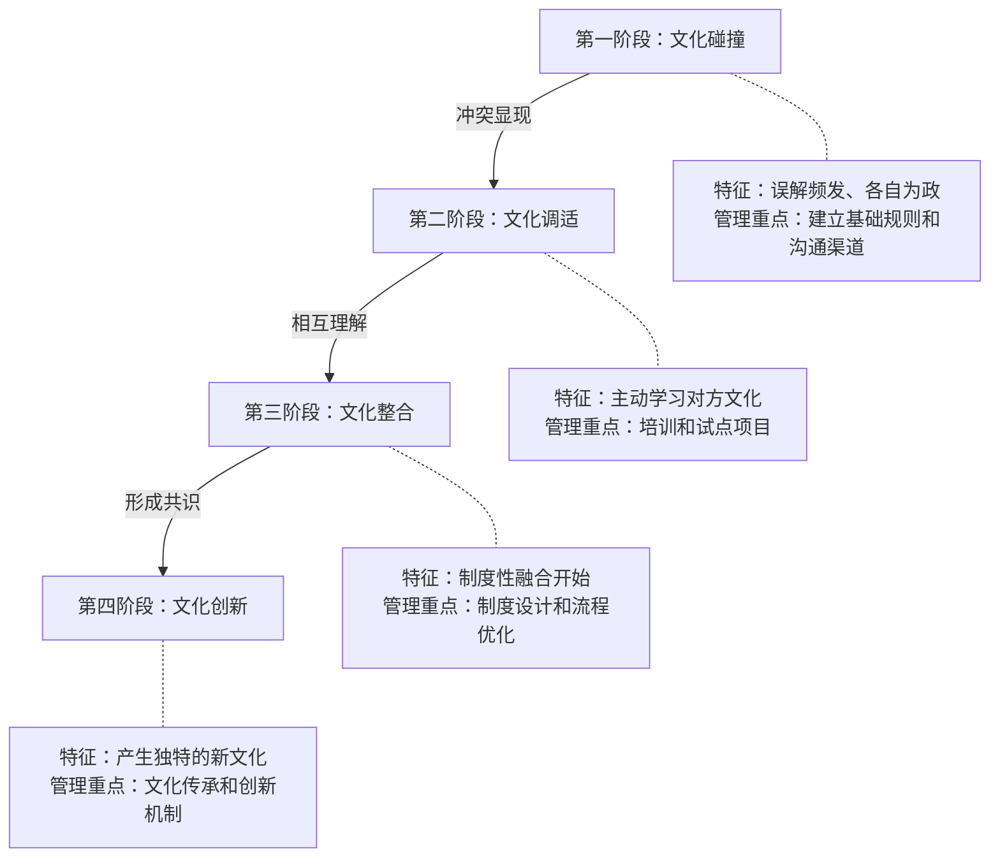
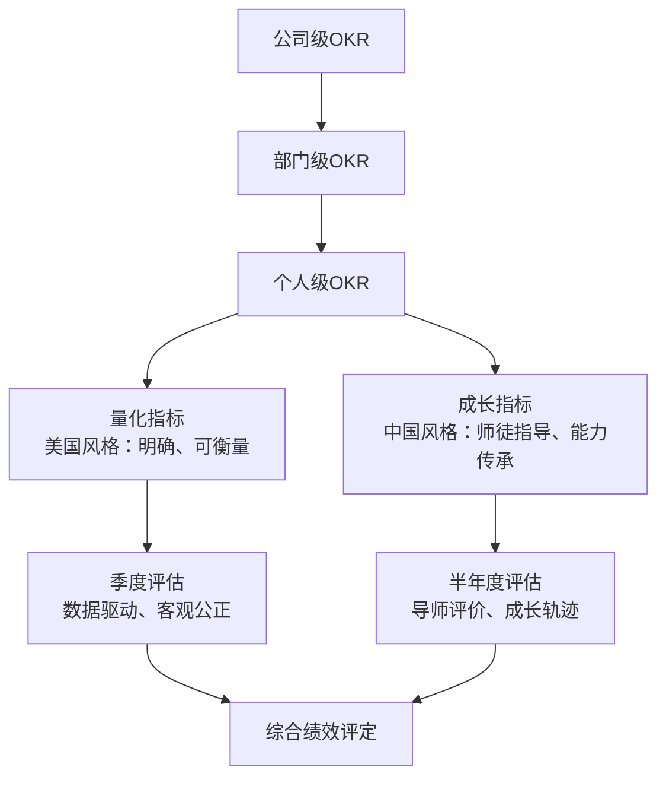
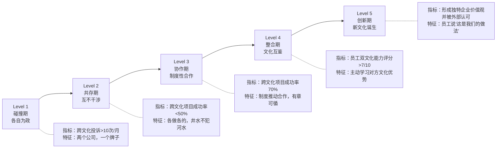

## 场景八：文化融合的美好实践

### 一、引言：跨文化融合的本质

跨文化沟通的终极目标不是让一方适应另一方，而是从多种文化中萃取精华，锻造出一种全新的、更强大的组织运作方式。这就像冶金——单一金属有各自的特性，但合金往往比任何一种纯金属都更坚韧。钢不是铁和碳的简单混合，而是铁原子与碳原子在高温高压下形成的新晶体结构，其强度远超两者之和。文化融合的最高形态也是如此：不是"美国做法+中国做法"的拼凑，而是一种组织从未有过的新文化基因。

文化融合之所以难，在于它同时涉及三个层面的变革：

- **认知层面**：改变人们对"正确做事方式"的固有假设。当一位中国工程师说"我觉得这样不太合适"时，他真正的意思是"我强烈反对这个方案"，但美国同事听到的只是"有一点小疑虑"。这种认知偏差不会因为一次培训就消失，它根植于几十年的文化习得中。
- **行为层面**：调整长期养成的工作习惯和沟通模式。中国管理者习惯在会前私下达成共识再开会表决，美国管理者习惯在会上公开辩论后投票决定——这两种行为模式都有其合理性，但在同一个团队中碰撞时就会产生摩擦。
- **制度层面**：重新设计组织架构、流程和激励机制。制度是文化的骨架，没有制度支撑的文化融合只是空中楼阁。

许多跨国合资企业的失败，并非因为商业模式有问题，而是因为文化冲突导致组织内耗。麦肯锡2023年的研究显示，约70%的跨国并购未能实现预期价值，其中文化整合失败是首要原因之一。波士顿咨询集团（BCG）的另一项研究指出，文化整合做得好的跨国并购，其股东回报率比行业平均高出14个百分点——文化融合不仅是"软实力"，更是实实在在的财务回报。

---

### 二、理论基础：为什么文化融合需要系统方法

#### 2.1 Hofstede文化维度理论的应用

荷兰学者吉尔特·霍夫斯泰德（Geert Hofstede）基于对IBM全球11.6万名员工的大规模调查，提出了文化维度理论。这一理论经过数十年的验证和扩展，为理解中美文化差异提供了科学框架：

| 文化维度 | 美国倾向 | 中国倾向 | 融合策略 | 典型冲突场景 |
|---------|---------|---------|---------|------------|
| 权力距离（PDI） | 低（29分）：扁平化，鼓励挑战权威 | 高（80分）：尊重层级，服从上级 | 保持层级框架，但开放匿名建言渠道 | 美方实习生当众质疑VP的方案，中方团队震惊 |
| 个人/集体主义（IDV） | 个人主义（91分）：强调个人成就 | 集体主义（20分）：强调团队和谐 | 个人考核+团队奖励双轨制 | 中方团队不愿在周报中突出个人贡献 |
| 不确定性规避（UAI） | 低（46分）：接受风险，鼓励创新 | 中等（30分）：偏好稳定，渐进变革 | 设立创新沙盒，降低试错成本 | 中方要求详细方案才能立项，美方倾向"先做了再说" |
| 长期/短期导向（LTO） | 短期导向（26分）：关注季度业绩 | 长期导向（87分）：关注五年规划 | OKR结合战略路线图 | 中方提议投入3年研发基础技术，美方要求季度见效 |
| 男性化/女性化（MAS） | 偏男性化（62分）：竞争、成就导向 | 偏女性化（66分）：关系、和谐导向 | 竞争机制+关怀文化并行 | 美方公开表扬"本月最佳员工"，中方觉得在"树靶子" |
| 放纵/克制（IVR） | 放纵（68分）：鼓励享受生活 | 克制（24分）：强调自律和义务 | 尊重个人时间，同时建立使命感 | 中方员工加班被视为"敬业"，美方视为"低效" |

**使用方法**：不要把这张表当作刻板印象的依据，而是当作"差异探测器"。具体到某个团队，管理者应做一次团队文化画像（Team Cultural Profile），了解实际团队成员的文化倾向分布。工具推荐使用Hofstede Insights官网的免费问卷（hofstede-insights.com），可以生成个人和团队的文化维度雷达图。

#### 2.2 Edward T. Hall的高/低语境理论

霍尔将文化分为高语境和低语境两种沟通模式，这一理论对日常沟通的指导意义甚至比Hofstede的理论更直接：

**高语境文化（中国）的沟通特征**：
- 沟通依赖关系、场合和非语言信号，"话里有话"是常态
- 拒绝时常用"我再考虑考虑""这个方案很有意思，不过……"
- 反对上级意见时通过沉默、转移话题、或私下找中间人传话来表达
- 信息传递需要"看场合""看关系""看语气"，同样的字面意思在不同场合含义完全不同

**低语境文化（美国）的沟通特征**：
- 沟通依赖明确的词汇和逻辑表达，"说到做到"是标准
- 拒绝时直接说"No"或"That won't work because..."
- 反对意见在会议上公开表达，被视为"建设性反馈"
- 信息传递主要靠字面意思，同一句话在不同场合含义基本一致

**融合的关键**不是选择其中一种，而是建立"双语沟通能力"——在正式商务谈判中采用低语境的清晰表达，在关系建设和非正式场合中运用高语境的情感智慧。具体训练方法见后文"沟通双轨制"一节。

#### 2.3 整合式文化融合理论

文化融合通常经历四个阶段，每个阶段有明确的特征和管理重点：

大多数企业卡在第一和第二阶段之间——员工意识到了差异，但缺乏系统的融合机制。只有少数企业能进入第三和第四阶段，实现真正的文化创新。卡住的原因通常不是缺乏意愿，而是缺乏方法——下面的案例将展示如何系统性地突破每个阶段的瓶颈。

#### 2.4 Berry的跨文化适应模型

心理学家John Berry提出的四种跨文化适应策略，为理解个体层面的文化融合提供了补充视角：

| 策略 | 保留自身文化 | 采纳新文化 | 结果 | 组织中的表现 |
|------|------------|-----------|------|------------|
| 整合 | 是 | 是 | 最佳适应 | 积极参与融合，同时保持文化特色 |
| 同化 | 否 | 是 | 中等适应 | 完全迎合另一方文化，压抑自身 |
| 分离 | 是 | 否 | 低适应 | 坚持原有方式，拒绝改变 |
| 边缘化 | 否 | 否 | 最差适应 | 既不认同原有文化也不融入新文化 |

**管理目标**：推动尽可能多的员工进入"整合"象限。这需要组织同时提供两个条件：（1）支持员工保留自身文化特色（多元包容政策），（2）提供学习新文化的机会和激励（跨文化培训、轮岗机制）。

---

### 三、实战案例：中美合资企业华创科技的融合之路

#### 3.1 公司背景

华创科技（化名）是一家中美合资的智能制造企业，成立于2019年。中方母公司是拥有30年历史的传统制造龙头，美方合作伙伴是硅谷的工业物联网技术公司。合资比例为中方51%、美方49%，管理团队由双方各派核心成员组成。

**人员构成**：员工总数约400人，其中中方员工320人（来自母公司调派+社会招聘），美方派遣员工30人，其余为第三方国家招聘的技术人员。公司官方语言为英语，但日常工作中中英文混用比例约为6:4。

**合资初期的文化冲突数据**：

| 指标 | 合资第一年 | 行业平均 | 差距分析 |
|------|----------|---------|---------|
| 员工离职率 | 34% | 18% | 离职面谈中73%提到"文化不适应" |
| 项目延期率 | 62% | 25% | 延期项目中81%存在跨文化协作问题 |
| 跨部门协作满意度 | 3.2/10 | 6.8/10 | 最低分出现在中美混合团队 |
| 员工文化归属感 | 2.8/10 | 6.5/10 | 中方员工归属感更低（2.1/10） |
| 跨文化会议效率 | 2.5/10 | 6.0/10 | 平均每次会议因误解需额外澄清3.2次 |

CEO张华（拥有中美双重教育背景，MIT MBA，曾在华为和谷歌分别工作5年以上）意识到，简单移植任何一方的文化模式都不行，必须系统性地进行文化融合。

#### 3.2 融合策略一：沟通方式的"双轨制"

**问题诊断**：

中方员工习惯间接表达，会议中沉默不代表同意，只是不便当面反对。美方员工则认为沉默就是默认，事后发现执行走样时感到被"背叛"。以下是三个典型冲突场景：

| 场景 | 中方理解 | 美方理解 | 结果 |
|------|---------|---------|------|
| 会议上说"这个方案还需要再研究" | 我反对这个方案 | 他们需要更多时间思考 | 美方按原计划推进，中方被动执行 |
| 邮件回复"收到，谢谢" | 我知道了（不一定会做） | 确认同意并会执行 | 后续无行动，美方认为不守承诺 |
| 说"领导可能不太方便" | 领导不同意 | 领导时间安排有困难 | 美方反复协调时间，中方觉得纠缠不休 |

**解决方案——三轨沟通体系**：

**第一轨：正式会议（低语境模式）**

这套会议规则的核心是"让隐含信息显性化"：

- **会前48小时**发送议程和资料，附带"预讨论问题"——要求每位参会者提前书面回复对每个议题的初步立场（赞成/反对/有条件赞成/需要更多信息）。这给了中方员工一个不需要当面表态的缓冲空间。
- **会议中使用"轮流发言"机制**——由主持人按顺序邀请每人表态，消除"沉默的同意"。主持人技巧：先邀请最junior的成员发言（避免被上级意见左右），对中方员工可用中文提问再翻译。
- **会议纪要24小时内发出**，格式为"决议+行动项+责任人+截止时间+需要确认的假设"。最后一栏"需要确认的假设"专门用来捕捉那些没有被明确表达但可能存在的分歧。
- **会议语言为英文**，配备同声传译（前6个月）。6个月后改为关键讨论时提供翻译，日常交流自便。
- **设立"会议后澄清窗口"**——会议结束后24小时内，任何人可以通过匿名渠道补充在会上没说出口的意见。

**第二轨：非正式交流（高语境模式）**

正式会议解决"事"的问题，非正式交流解决"人"的问题：

- **每周五下午Tea Time**——中西式茶点+自由交流，不设议程，不记录。这一条看似简单，但华创的经验表明，Tea Time上产生的跨文化理解，比任何培训课程都有效。关键是"不设议程"——有议程就变成了另一种会议。
- **每月一次家庭日活动**（烧烤、亲子运动、烹饪课程），让关系从工作延伸到生活。华创特别设计了"中美混搭菜谱挑战"——中美员工各教对方做一道家乡菜，这个活动后来成为公司最受欢迎的传统。
- **设立"文化大使"角色**——由10名双语双文化员工担任（中美各5人），职责是主动发现和化解误解。文化大使不是翻译，而是"文化解码器"——当一方觉得另一方"说了什么不对劲"时，文化大使进行语义澄清和背景解释。

**第三轨：书面反馈（安全通道）**

为不善当面表达的员工提供安全出口：

- **匿名建言系统**——基于简单的在线表单，消除"当面批评上级"的心理障碍。华创发现，匿名渠道收到的有效建议数量是面对面渠道的4倍。
- **每季度"文化温度调查"**——5分钟问卷，追踪文化融合进展。问题示例："过去三个月，你是否因为文化差异而感到工作受阻？""你是否愿意和不同文化背景的同事合作下一个项目？"
- **设立"翻译官"机制**——当一方觉得另一方"说了什么不对劲"时，由文化大使进行语义澄清。这个机制的关键是"不评判对错"——翻译官只解释"他为什么会这样说"，而不是"谁对谁错"。

**实施效果**：

沟通相关的内部投诉从第一年的每月12起，下降到第六个月的每月2起。会议决策执行率从38%提升到82%。跨文化协作满意度从3.2/10提升到7.1/10。

#### 3.3 融合策略二：决策机制的"分层授权"

**问题诊断**：

中方团队习惯"大事小事都请示领导"，决策链条长但风险低。美方团队倾向于"各自拍板快速推进"，效率高但经常偏离公司方向。具体表现为：中方产品经理拿到一个客户需求，会先写一份详细的可行性报告，逐级审批后才开始开发；美方工程师拿到同样的需求，可能当天就开始写代码，两周后才告知中方团队。两种方式各有优劣，但在同一个公司里就会产生混乱。

**解决方案——三级决策框架**：

| 决策层级 | 定义 | 决策方式 | 审批要求 | 举例 | 响应时间 |
|---------|------|---------|---------|------|---------|
| L1 战略决策 | 影响公司方向的重大事项 | 中美双方高层共识制 | 双方CEO联签 | 市场进入策略、重大投资、高管任免 | ≤30天 |
| L2 战术决策 | 影响部门的中等事项 | 部门负责人+相关方协商 | 部门VP审批 | 产品功能优先级、供应商选择、预算分配 | ≤7天 |
| L3 执行决策 | 日常工作中的具体事项 | 执行者自主决定 | 事后报备即可 | 工具选型、会议安排、小额度采购（＜5万元） | 即时 |

**关键设计细节**：

- **L1决策用"共识制"而非"投票制"**——投票制会产生赢家和输家，共识制要求双方找到都能接受的方案。具体流程是：双方各自提出方案→联合工作坊讨论→修改合并→双方签字确认。华创的经验是，共识制的决策周期虽然比投票制长40%，但执行速度反而快了60%，因为不需要在执行阶段反复解释和说服反对者。
- **L2决策设"反对权"而非"同意权"**——任何相关方有72小时窗口期提出书面反对理由，过期视为默认同意。这既尊重了集体主义文化的谨慎（给你时间私下思考和咨询），又保证了个人主义文化的效率（设了截止时间就不会无限期等待）。
- **L3决策全面授权**——这是中方管理者最不习惯的部分。华创通过6个月的"授权训练营"逐步放权：第1-2个月，L3决策仍需邮件报备；第3-4个月，改为周报汇总；第5-6个月，完全自主，事后月报即可。关键技巧是"从小额开始"——先授权5000元以下的采购决策，建立信任后逐步扩大到5万元。
- **设立"决策日志"制度**——所有L2及以上决策，记录决策背景、考虑的选项、最终选择及理由。这不仅是合规需要，更是文化学习的素材——新员工可以通过决策日志理解"我们公司是怎么做决定的"。

**实施效果**：

战略决策的平均周期从45天缩短到18天。执行层决策的等待时间从平均5天缩短到0.5天。决策质量（以目标达成率衡量）从72%提升到89%。

#### 3.4 融合策略三：绩效管理的"OKR+师徒制"

**问题诊断**：

美方引入的OKR体系强调个人目标和量化指标，但中方员工觉得这太"冷冰冰"，缺乏人情味，也忽略了经验传承的价值。中方传统的师徒制被美方视为"效率低下的旧习惯"。更深层的矛盾在于：美方认为绩效应该完全客观量化，中方认为绩效评估需要"看态度、看潜力、看关系"——这两种观点都有其道理。

**解决方案——OKR与师徒制的有机融合**：

**OKR设计融合点**：

- **个人OKR中30%的权重是"成长目标"**——由师徒双方共同制定，包括技能提升、知识分享、带教成果。这30%不是"软指标"，而是有明确衡量标准的：比如"掌握XX技术栈""完成XX认证""带教新人独立完成项目"。
- **导师不是上级，而是平行的资深员工**——避免权力关系干扰指导效果。华创规定，导师和徒弟不能有直接汇报关系，导师的职责是"传帮带"而非"考核评价"。
- **师徒关系双向选择**——徒弟可以选导师，导师也可以选徒弟，匹配度比强制指派高3倍。华创每年举办一次"师徒见面会"，类似大学的社团招新，导师展示自己的专长和带教风格，徒弟自由选择。
- **师徒制有正式的制度支撑**——每月一次结构化复盘（使用统一的复盘模板），每季度一次成果展示（面向全公司的"师徒成果发布会"），导师的带教成果纳入其绩效考核（占导师绩效的15%）。

**具体实施模板——师徒计划书**：

【师徒关系基本信息】
导师：________ 部门：________ 工龄：____年
徒弟：________ 部门：________ 入职：____月
匹配日期：________ 师徒协议编号：________

【第一阶段（第1-3个月）：基础融入】
□ 了解公司文化、制度和流程
□ 掌握岗位核心技能（具体列出3-5项）
□ 建立3个以上跨部门联系人
□ 完成1个小型独立任务（由导师评估质量）
□ 参加新员工文化融合工作坊

【第二阶段（第4-6个月）：能力提升】
□ 独立承担一个完整项目模块
□ 参与一次跨部门协作并提交协作报告
□ 向团队做一次知识分享（不少于30分钟）
□ 与导师共同完成一份行业分析报告
□ 完成一次跨文化沟通场景模拟训练

【第三阶段（第7-12个月）：价值贡献】
□ 独立负责一个项目（导师仅提供咨询）
□ 指导一位新员工（反向带教，验证知识内化）
□ 提出一个流程改进建议并落地
□ 完成职业发展规划的制定
□ 参与公司文化活动的组织（至少一次）

【评估机制】
月度复盘：每月最后一周，30分钟1对1复盘
季度评估：向师徒委员会展示进展，获得反馈
终期评估：12个月后综合评估，颁发结业证书

**实施效果**：

新员工的胜任周期从平均6个月缩短到3.5个月。员工敬业度（Gallup Q12）从52分提升到78分。关键岗位继任准备度从35%提升到71%。师徒制的ROI测算：每投入1元师徒项目经费，产出约3.2元的绩效提升价值。

#### 3.5 融合策略四：团队建设的"中西合璧"

**问题诊断**：

中方的"团建"文化（聚餐、KTV、户外拓展）被美方员工视为"强制社交"和"占用私人时间"。美方的"Town Hall Meeting"被中方员工视为"形式主义"和"浪费时间"。更微妙的是，中方员工在团建中建立的关系会带到工作中，形成"小圈子"，让没有参加团建的美方员工感到被排斥。

**解决方案——保留形式、改造内容**：

**Town Hall Meeting的中国化改造**：

| 改造前 | 改造后 | 背后的文化逻辑 |
|-------|-------|--------------|
| 每月一次，全员参加 | 每两月一次，自愿参加 | 中方员工不喜欢过于频繁的大型集会 |
| 只有CEO讲话 | 增加"成就展示"环节 | 满足中方的集体荣誉感需求 |
| 纯英文 | 中英双语，配同声传译 | 消除语言障碍 |
| Q&A环节无人提问 | 增加匿名提问箱 | 中方员工不方便当面问敏感问题 |
| 结束后立即散会 | 安排30分钟自由交流 | 让非正式关系自然发生 |

**团建活动的国际化升级**：

- **从纯吃喝转变为"体验式团建"**——烹饪课程（中美菜式）、文化体验日、公益项目。华创最受欢迎的活动是"社区公益日"——中美员工一起为当地小学组装电脑教室。这个活动之所以成功，是因为它有一个共同的目标（组装电脑），而不是空洞的"增进感情"。
- **时间从工作日晚上调整到工作日下午**，不占用私人时间。这一改变让美方员工的参与意愿提升了40%。
- **参与自愿但有激励机制**——参加可获得半天调休，这比"强制参加"更符合美方文化，又给了中方员工一个"合理理由"参加（"不是为了社交，是为了调休"）。
- **增加"文化交流"元素**——每月一次"文化分享午餐"，轮流由不同文化背景的员工分享家乡故事。华创发现，当美国工程师讲述他小时候在德州农场的故事时，中国工程师对他的亲近感显著提升——个人故事比任何团建游戏都更能建立跨文化连接。

**实施效果**：

团建参与率从强制时的85%（但满意度低）提升到自愿时的72%（但满意度高）。跨文化友谊（自报"有不同国籍的好朋友"）的比例从23%提升到61%。

---

### 四、文化融合的数字化支撑体系

文化融合不能只靠"人治"，需要数字化工具提供系统性支撑。以下是华创科技使用的工具矩阵：

#### 4.1 沟通协作平台

| 工具类别 | 推荐工具 | 用途 | 文化融合价值 |
|---------|---------|------|------------|
| 即时通讯 | Slack / 企业微信 | 日常沟通 | 创建#culture-bridge频道，分享文化小贴士 |
| 视频会议 | Zoom / 腾讯会议 | 远程协作 | 支持实时翻译字幕，降低语言障碍 |
| 项目管理 | Jira / 飞书 | 任务追踪 | 统一任务描述语言，减少"各说各话" |
| 知识库 | Confluence / 语雀 | 文档共享 | 建立双语知识库，术语对照表 |
| 匿名反馈 | Officevibe / 问卷星 | 情绪监测 | 定期采集文化温度数据 |
| 翻译辅助 | DeepL / 百度翻译 | 语言支持 | 会议纪要自动生成双语版本 |

#### 4.2 文化培训平台

- **在线学习**：利用LinkedIn Learning或得到企业版，提供跨文化沟通课程。华创开发了内部"文化融合微课"系列，每课10分钟，覆盖一个具体的跨文化场景（如"如何给美国同事写邮件""如何在中国会议上发言"）。
- **情景模拟**：使用VR或在线角色扮演工具，模拟跨文化冲突场景。华创的"文化冲突模拟器"让员工在安全环境中练习处理典型跨文化误解。
- **文化日历**：建立共享的文化日历，标注中美两国的重要节日、禁忌日和文化事件，帮助团队避免在敏感时间安排重要会议或活动。

#### 4.3 数据分析仪表盘

华创开发了一个"文化融合仪表盘"，实时追踪以下数据：

- **沟通密度图**：展示中美员工之间的消息频率和响应时间，识别沟通孤岛
- **会议参与度**：按文化背景统计会议发言频率和时长，发现沉默的一方
- **协作网络图**：可视化跨文化协作关系，识别"文化边界"——哪些团队内部文化多元，哪些团队形成了文化隔离
- **离职预警**：结合文化温度调查和绩效数据，提前识别可能因文化不适应而离职的员工

---

### 五、文化融合的实施路线图

#### 5.1 12个月融合计划

| 阶段 | 时间 | 重点任务 | 关键里程碑 | 负责人 | 预算占比 |
|------|------|---------|----------|-------|---------|
| 诊断期 | 第1-2月 | 文化差距评估、员工访谈、制度审查 | 完成《文化融合白皮书》 | CEO+外部顾问 | 15% |
| 设计期 | 第3-4月 | 制定融合策略、设计制度框架 | 融合方案获双方高层批准 | VP团队 | 10% |
| 试点期 | 第5-7月 | 选1-2个部门试点、收集反馈、迭代优化 | 试点部门满意度提升20% | 试点部门负责人 | 25% |
| 推广期 | 第8-10月 | 全公司推广、培训、制度落地 | 全员完成文化融合培训 | HR+各部门 | 35% |
| 巩固期 | 第11-12月 | 效果评估、制度固化、长期规划 | 完成年度文化融合评估报告 | CEO+HR | 15% |

**关键成功因素**：试点期是最危险的阶段——如果试点效果不好，推广期就会遇到巨大阻力。华创的做法是选择"最有可能成功"的部门（而不是"最需要改变"的部门）作为试点，用成功案例说服其他部门。

#### 5.2 变革管理中的常见阻力及应对

文化融合本质上是一场组织变革，必然会遇到阻力。以下是阻力类型和应对策略：

| 阻力类型 | 表现形式 | 根本原因 | 应对策略 | 转化话术示例 |
|---------|---------|--------|---------|------------|
| 习惯性阻力 | "我们一直都是这样做的" | 对未知的恐惧 | 小步快跑，用试点成果说服 | "我们试试看，3个月后如果没有改善，我们再调整" |
| 利益性阻力 | "这样改对我没好处" | 担心权力或地位受损 | 重新设计激励机制，让融合对个人有利 | "融合后你的职业发展路径会更宽，不只是在中国区，还可以去美国总部" |
| 认知性阻力 | "两种文化根本不兼容" | 缺乏跨文化理解 | 文化意识培训+成功案例分享 | "很多公司做到了，这是具体的方法和数据" |
| 情感性阻力 | "我不想变成他们那样" | 文化身份认同焦虑 | 强调"融合"而非"同化"，保留各自文化优势 | "不是让你变成美国人，是让你多一种能力" |
| 惯性阻力 | "太麻烦了，没时间做这些" | 优先级排序问题 | 将文化融合纳入KPI考核 | "文化融合能力是晋升的必要条件之一" |

**关键原则：不消除阻力，而是转化阻力。** 阻力往往来自合理的担忧，倾听阻力背后的诉求，比强行推进更有效。华创的经验是，每遇到一个阻力，先问三个问题：（1）这个阻力背后的担忧是什么？（2）这个担忧是否合理？（3）如何在满足这个担忧的前提下推进融合？

---

### 六、文化融合效果的量化评估

#### 6.1 文化融合成熟度模型（CFMM）

文化融合不是"感觉好就行"，需要可量化的评估体系。以下是五级成熟度模型：

**评估方法**：每季度进行一次CFMM评估，由外部顾问主持，采用360度评估法（上级评价40%+同事评价30%+下级评价20%+自评10%）。评估结果与部门负责人的绩效挂钩。

#### 6.2 关键追踪指标

**月度追踪指标**：

| 指标 | 计算方法 | 目标值 | 数据来源 |
|------|---------|-------|---------|
| 文化冲突事件数 | 每月因文化误解产生的正式投诉 | ＜5次/月 | HR系统 |
| 跨文化协作满意度 | 1-10分自评，针对跨文化项目经历 | ＞7/10 | 季度调查 |
| 会议决策执行率 | 会议决议中被按时执行的比例 | ＞80% | 项目管理系统 |
| 跨文化项目延期率 | 跨文化团队项目的延期比例 | ＜15% | 项目管理系统 |
| 员工留存率 | 特别关注跨文化团队的留存差异 | ＞90%/年 | HR系统 |

**季度追踪指标**：

| 指标 | 计算方法 | 目标值 | 数据来源 |
|------|---------|-------|---------|
| 文化融合成熟度评分 | 基于CFMM模型的360度评估 | Level 3+ | 外部评估 |
| 双文化人才占比 | 能在两种文化中自如切换的员工比例 | ＞30% | 能力评估 |
| 创新产出指标 | 跨文化团队产生的专利/提案数量 | ＞5个/季度 | 知识产权系统 |
| 外部雇主品牌指标 | Glassdoor/脉脉评分中文化相关评价 | ＞4.0/5.0 | 第三方平台 |
| 师徒项目完成率 | 师徒计划按期完成的比例 | ＞75% | 师徒管理系统 |

---

### 七、常见误区与纠正方法

#### 误区一：文化融合就是"中西混合菜"

**错误做法**：把中美文化的元素简单混搭——既有OKR又有KPI，既有Town Hall又有团建，结果制度叠加、流程冗长。华创在初期就犯过这个错误：同时保留了中方的月报制度和美方的周报制度，结果经理们每周要写两份报告，苦不堪言。

**正确做法**：文化融合是"合金"而非"沙拉"。合金的特性不是两种金属的简单平均，而是产生了全新的分子结构。同样，融合后的企业文化应该是一种新的整体，而不是两套制度的机械叠加。

**检验标准**：如果员工在执行时还在想"这是美国做法还是中国做法"，说明融合还没到位。融合到位时，员工只会想"这是我们公司的做法"。华创的做法是，在推出每一项新制度时都问一个问题："如果这是一家纯中国公司或纯美国公司，会采用这个制度吗？"如果答案是"会"，说明这个制度只是在复制某一方的做法，而不是真正的融合。

#### 误区二：文化融合是HR的事

**错误做法**：把文化融合完全交给人力资源部门，高层只做口头支持。

**正确做法**：文化融合是一把手工程。CEO和高管团队必须亲自参与，以身作则。如果CEO在Town Hall上用英文但私下只和中方管理层用中文开会，员工立刻会感受到"伪融合"。

**具体行动**：
- CEO每月至少参加一次跨文化团队的工作会议（不是视察，是真正参与讨论）
- 每季度亲自主持一次文化融合复盘会，公开分享自己在跨文化沟通中犯的错误
- 高管团队中必须有跨文化背景的成员（不一定是外国人，但必须有跨文化工作经历）
- 将"文化融合领导力"纳入高管晋升的必要条件

#### 误区三：追求快速统一

**错误做法**：设定"6个月内完成文化融合"的目标，强制推行统一标准。

**正确做法**：文化融合是一个3-5年的过程。前两年建立制度和信任，第三年开始看到真正的融合效果，第四到五年形成独特的新文化。急于求成往往适得其反——华创的教训是，在第一年就强制推行全英文办公，结果大量中方员工因为语言障碍而离职，反而拖慢了融合进程。

**合理的时间预期**：
- 6个月：建立基础沟通规则，减少明显的文化冲突
- 12个月：制度框架初步成型，员工开始适应
- 24个月：跨文化协作成为常态，不再是"额外负担"
- 36个月：出现真正的文化融合迹象，员工开始创造新的工作方式
- 60个月：新文化基本成型，成为公司的核心竞争力

#### 误区四：忽视非正式文化

**错误做法**：只关注制度层面的融合（流程、组织架构、KPI），忽视员工自发形成的文化习惯。

**正确做法**：非正式文化（午餐习惯、闲聊话题、社交圈子）往往比正式制度更能反映文化融合的真实状态。管理者需要观察和引导非正式文化，而非只看制度文本。

**观察清单**：
- 午餐时中美员工是否混坐，还是各坐各的？
- 茶水间的闲聊话题是否跨越文化边界？
- 社交媒体上的互动是否跨文化？
- 下班后的社交活动是否包含双方员工？
- 遇到困难时，员工是先找"自己人"还是先找最合适的人？

#### 误区五：只关注"融合"而忽视"包容"

**错误做法**：过度强调"统一文化"，压制文化多样性。

**正确做法**：融合不等于同化。好的文化融合应该让每种文化都感到被尊重和包容。华创的做法是，保留双方文化的"特色日"——每年庆祝中美两国的主要节日，让员工在这些日子里感受到自己的文化被组织重视。

---

### 八、高级议题：文化融合的深度挑战

#### 8.1 价值观冲突的处理

并非所有文化差异都能调和。当涉及核心价值观冲突时（如对诚信标准的差异理解、对商业伦理的不同定义），需要明确底线。华创制定了一份"文化红线清单"：

| 类别 | 具体内容 | 处理原则 |
|------|---------|---------|
| 不可妥协的底线 | 法律法规、商业伦理、职业操守、反腐败 | 以更严格的标准为准，不论哪一方的文化允许更宽松的做法 |
| 可以协商的空间 | 工作方式、沟通风格、决策流程、会议形式 | 创造性融合，找到双方都能接受的"第三种方式" |
| 需要尊重的差异 | 宗教信仰、个人习惯、节日安排、饮食禁忌 | 互相尊重而非统一，提供灵活安排 |

**处理价值观冲突的四步法**：
1. **识别**：明确冲突的本质是价值观差异，而非对错之争
2. **分类**：判断属于"不可妥协""可以协商"还是"需要尊重"
3. **对话**：安排私下的一对一沟通，而非公开讨论（避免面子问题）
4. **决策**：由双方高层共同做出最终决定，并向全员解释理由

#### 8.2 远程/混合办公下的文化融合

疫情后，远程办公成为常态，文化融合面临新挑战。华创在2020-2022年的远程办公期间，文化融合进度倒退了约6个月。以下是教训和对策：

**远程办公的文化融合挑战与对策**：

| 挑战 | 原因分析 | 解决方案 | 实施工具 |
|------|---------|---------|---------|
| 虚拟环境中的高语境沟通更难 | 缺少面对面的非语言信号 | 重要沟通使用视频而非文字；默认开启摄像头 | Zoom/腾讯会议 |
| 跨时区协作困难 | 中美时差12-15小时 | 建立"重叠工作时间"——每天保证2-3小时双方同时在线 | World Time Buddy |
| 新员工融入困难 | 缺少"旁边坐着的同事" | 为远程新员工配对"Buddy"，每天15分钟视频check-in | 飞书/Slack |
| 非正式交流消失 | 没有茶水间和电梯偶遇 | 设立虚拟咖啡角——随机配对两位员工进行15分钟闲聊 | Donut（Slack插件） |
| 信任建立缓慢 | 看不到同事的工作状态 | 每周分享"工作周记"——不只是工作进展，也包括个人近况 | Notion/语雀 |

**混合办公的文化融合最佳实践**：

- **同步日**：每周至少安排1-2天全员到岗，专门用于跨文化协作和关系建设
- **异步沟通规范**：制定异步沟通指南——什么情况用即时消息，什么情况用邮件，什么情况必须视频会议
- **虚拟团建**：每月一次在线团建活动——在线游戏、虚拟烹饪、在线博物馆导览
- **线下重聚**：每季度一次全员线下聚会，弥补远程办公中缺失的面对面交流

#### 8.3 第三方文化的纳入

随着企业规模扩大，员工可能来自更多文化背景（如东南亚、欧洲）。文化融合不能永远只考虑"中美两方"，需要发展为多文化融合框架。华创在第三年开始招聘印度和德国工程师，面临新的挑战：

**从双文化到多文化的演进策略**：

- **建立"文化包容指数"**——衡量组织对多元文化的接纳程度。指数包括：员工对多元文化的认知度、制度对多元文化的包容度、组织对文化冲突的处理能力。
- **设立"多元文化委员会"**——由不同文化背景的员工代表组成（至少覆盖5种文化），负责制定文化包容政策、组织跨文化活动、处理文化冲突。
- **开发"文化智能（CQ）培训"**——从双文化能力升级为多文化能力。CQ包括四个维度：CQ驱动（学习动力）、CQ知识（文化知识）、CQ策略（计划和调整能力）、CQ行动（行为灵活性）。
- **建立"文化地图"**——用可视化方式展示公司内所有文化群体的分布、特征和互动关系，帮助管理者识别文化孤岛和融合机会。

#### 8.4 文化融合中的领导力发展

文化融合不仅是员工的事，更是领导者的修炼。华创为中高层管理者设计了"跨文化领导力发展项目"：

**跨文化领导力五级模型**：

| 级别 | 能力特征 | 发展方法 | 评估标准 |
|------|---------|---------|---------|
| L1 文化意识 | 了解文化差异的存在 | 基础培训+阅读 | 通过文化意识测试 |
| L2 文化知识 | 掌握主要文化维度和理论 | 深度培训+案例研究 | 能分析具体文化冲突 |
| L3 文化技能 | 能在跨文化场景中有效沟通 | 实战训练+反馈 | 跨文化协作满意度＞7/10 |
| L4 文化适应 | 能根据不同文化场景灵活调整 | 海外交换+轮岗 | 能在多种文化中有效领导 |
| L5 文化整合 | 能创造新的文化融合方式 | 战略项目+导师制 | 能设计和推动文化融合项目 |

---

### 九、更多融合场景的实用策略

#### 9.1 跨文化谈判技巧

中美商务谈判中的文化差异是融合的重要场景：

| 谈判环节 | 中方风格 | 美方风格 | 融合策略 |
|---------|---------|---------|---------|
| 开场 | 寒暄、喝茶、建立关系 | 直接进入主题 | 前10分钟用于寒暄，然后明确切换到正题 |
| 报价 | 留出讨价还价空间，"漫天要价" | 报出"最合理"价格，期待快速成交 | 中方适当缩小虚价空间，美方准备接受1-2轮还价 |
| 决策 | 团队内部协商后统一回复 | 授权代表当场决定 | 提前明确谈判代表的授权范围 |
| 签约 | 重视关系，合同是"参考" | 重视合同，合同是"约束" | 合同条款逐条确认，同时建立定期沟通机制维护关系 |
| 争议 | 倾向私下调解 | 倾向正式仲裁 | 合同中约定"先调解后仲裁"的争议解决机制 |

#### 9.2 跨文化项目管理

管理中美混合项目团队的核心挑战是"节奏不同"：

- **项目规划**：中方习惯详细的前期规划（"谋定而后动"），美方习惯敏捷迭代（"先做起来再说"）。融合方案：用2周做详细规划（满足中方需求），然后按2周sprint迭代执行（满足美方需求）。
- **进度汇报**：中方习惯向上级汇报"好消息"，隐藏坏消息直到无法隐瞒。美方习惯"早暴露问题早解决"。融合方案：建立"无惩罚问题报告机制"，鼓励主动暴露风险。
- **质量管理**：中方习惯"差不多就行"，美方追求"完美交付"。融合方案：明确"定义完成"（Definition of Done）标准，消除"质量认知差异"。

---

### 十、总结：文化融合的核心心法

文化融合不是一道选择题（选A还是选B），而是一道创造题（如何从A和B中创造出C）。

成功的文化融合需要做到：

1. **有理论框架**——用Hofstede和霍尔的理论定位差异热点，而非凭感觉
2. **有系统设计**——沟通、决策、绩效、团队建设四个维度同步推进
3. **有数字支撑**——用工具平台和数据仪表盘提供客观依据
4. **有量化评估**——用CFMM模型和关键指标追踪进展，而非"感觉还行"
5. **有耐心**——接受3-5年的融合周期，阶段性推进而非一步到位
6. **有底线**——在核心价值观上不妥协，在工作方式上灵活创新
7. **有领导力**——一把手工程，高管以身作则

最终，文化融合的最高境界是：员工不再说"这是美国做法"或"这是中国做法"，而是说"这是我们的做法"。这种新文化的诞生，才是跨文化沟通的真正成功。正如华创科技CEO张华在公司三周年庆典上所说："我们不是一家中国公司，也不是一家美国公司，我们是一家正在创造新文化的公司。"
