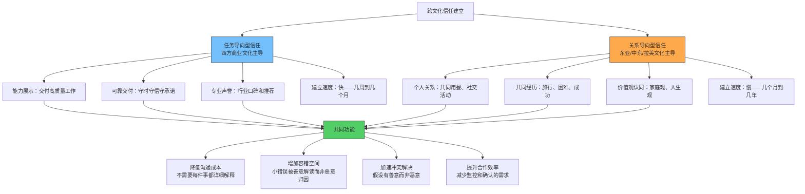
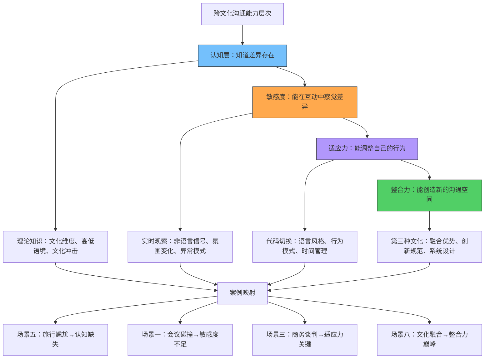

# 案例总结：从八个场景提炼跨文化沟通的完整方法论

## 引言：为什么需要系统性总结

前面八个实战案例覆盖了跨文化沟通最典型的真实场景——从跨国视频会议的即时摩擦，到国际商务谈判的信任博弈，从海外留学的文化冲击，到多元团队的管理难题，从旅行中的日常尴尬，到翻译失误引发的商务危机，从冲突调解的深层智慧，到文化融合的理想实践。这些案例不是孤立的故事，而是一套完整的"跨文化沟通实验数据"——每一个场景都验证了本章理论基础和核心技巧的某些方面，同时也暴露了常见的认知误区。

本节的目标不是简单复述这些案例，而是**从中提炼出可迁移的模式、可操作的框架和可检验的原则**，让你在面对任何跨文化场景时，都能有一套清晰的思考路径和行动方案。

**本节的阅读方式建议**：如果你已经通读了八个案例，可以直接从"横向提炼"开始；如果你只读了部分案例，建议先浏览"全景图谱"建立整体框架，再按需深入各个部分。

---

## 八个案例的全景图谱

### 按场景类型的分类矩阵

八个案例可以按场景类型分为三大类，每一类有其独特的挑战模式和应对逻辑：

| 分类维度 | 案例 | 核心特征 | 典型挑战 | 成功关键 |
|---------|------|---------|---------|---------|
| **职业场景** | 场景一（视频会议）、场景三（商务谈判）、场景四（团队管理）、场景七（翻译危机） | 有明确的商业目标，时间压力大，关系后果严重 | 效率与关系的平衡、决策速度差异、专业术语的文化歧义 | 建立结构化的沟通流程，明确角色和期望 |
| **生活场景** | 场景二（海外留学）、场景五（海外旅行） | 个人体验驱动，情绪因素强，适应周期长 | 文化冲击的情绪波动、社交规则的隐性学习、身份认同的重建 | 保持开放心态，建立本地支持网络 |
| **深层互动** | 场景六（冲突调解）、场景八（文化融合） | 涉及价值观碰撞，需要高度的文化智慧和创造力 | 深层价值观冲突、面子与真相的张力、长期关系的维护 | 找到共同价值基础，创造第三种文化 |

### 按文化维度的映射关系

每个案例都涉及多个文化维度的交叉作用，但各有侧重。理解这种映射关系，有助于在遇到类似场景时快速定位核心矛盾：

| 案例 | 霍夫斯泰德维度 | 高低语境 | 文化冲击阶段 | 适应策略 |
|------|--------------|---------|------------|---------|
| 场景一：视频会议 | 个人主义vs集体主义、不确定性规避 | 高vs低语境冲突 | — | 语言调整、非语言适应 |
| 场景二：留学适应 | 权力距离、个人主义vs集体主义 | 高→低语境迁移 | 蜜月→挫折→调整 | 整合策略 |
| 场景三：商务谈判 | 长期导向、权力距离 | 高vs低语境 | — | 信任建立 |
| 场景四：团队管理 | 男性化vs女性化、个人主义vs集体主义 | 混合语境 | — | 差异化管理 |
| 场景五：海外旅行 | 不确定性规避、放纵vs克制 | 跨越多种语境 | 蜜月→挫折 | 文化敏感度 |
| 场景六：冲突调解 | 所有维度的综合 | 深层价值观 | 调整期 | 误解处理六步法 |
| 场景七：翻译危机 | 高低语境 | 极端的高vs低 | — | 语言策略、双重确认 |
| 场景八：文化融合 | 长期导向、放纵vs克制 | 创造新语境 | 适应期 | 整合策略 |

**如何使用这张表**：当你面对一个新的跨文化场景时，先判断它最接近哪个案例类型，然后查看对应的文化维度和适应策略。这不是说所有同类场景都完全一样，而是给你一个起点，让你知道应该重点关注哪些文化因素。

### 案例间的因果链条

八个案例之间并非完全独立，它们之间存在递进关系和因果链条：


这个链条展示了跨文化能力的成长路径：从**认知层面**（知道差异存在）到**行为层面**（调整自己的沟通方式）到**关系层面**（建立信任和管理团队）到**系统层面**（调解冲突、创造融合文化）。每一个阶段都建立在前一个阶段的基础之上。

---

## 横向提炼：六个跨场景的共性模式

### 模式一：信息不对称是误解的根源

八个案例中，几乎每一个误解都可以追溯到"双方拥有的信息不同"。这种信息不对称有三种表现形式，每一种都有其独特的产生机制和应对策略：

**认知不对称——双方对文化规则的了解程度不同**

场景一中，中方团队知道"暗示"是表达异议的方式，但德方团队不知道；德方知道"会议上表态"是表达立场的方式，但中方团队没有意识到应该这样做。双方都在按照自己文化的游戏规则出牌，却没有意识到对方在玩另一套规则。

认知不对称的隐蔽性在于：双方都认为自己的行为是"正常的"，因此很难意识到问题出在规则差异上，而不是对方的能力或态度上。

**期望不对称——双方对同一件事的预期不同**

场景三中，中方谈判者期望先花时间建立个人关系再谈业务，而美方谈判者期望尽快进入正题。场景四中，某些团队成员期望管理者给出明确指令，而管理者期望团队成员主动提出方案。双方都没有"错误"，只是对"正确流程"的定义不同。

期望不对称的危害在于：当期望未被满足时，人们倾向于做负面归因（"对方不尊重我"、"对方不专业"），而不是中性归因（"对方的期望可能和我不同"）。

**解码不对称——同一个信号被不同文化编码和解码**

场景七中，"我们会认真考虑这个方案"在中方语境中是礼貌的拒绝，在美方语境中是积极的信号。场景六中，沉默在某些文化中表示深思熟虑，在另一些文化中表示强烈反对。同一个句子、同一个行为，两种解码结果，直接导致了决策失误。

解码不对称是最危险的不对称形式，因为双方都认为自己已经"正确理解"了对方的意思，不会主动去确认。

**应对框架：信息不对称的三层防御体系**

┌──────────────────────────────────────────────────────────────┐
│              信息不对称的三层应对策略                          │
├──────────────────────────────────────────────────────────────┤
│                                                              │
│  第一层：预防（沟通前）——减少不对称的发生                     │
│  ┄┄┄┄┄┄┄┄┄┄┄┄┄┄┄┄┄┄┄┄┄┄┄┄┄┄┄┄┄┄┄┄┄┄┄┄┄┄┄┄┄┄┄┄┄┄┄┄┄┄┄┄┄┄┄│
│  · 主动分享自己的沟通偏好和文化背景                           │
│    示例："在中国文化中，我们通常不会在会议上直接反对对方，     │
│     但这不代表我们同意。如果我没有表态，请理解为我在思考。"   │
│  · 询问对方的沟通期望和决策流程                               │
│    示例："在你们的文化中，达成共识的典型流程是什么？"         │
│  · 建立共同的沟通规则                                         │
│    示例：会议纪要制度、确认机制、"红旗"信号约定               │
│                                                              │
│  第二层：检测（沟通中）——及时发现不对称                       │
│  ┄┄┄┄┄┄┄┄┄┄┄┄┄┄┄┄┄┄┄┄┄┄┄┄┄┄┄┄┄┄┄┄┄┄┄┄┄┄┄┄┄┄┄┄┄┄┄┄┄┄┄┄┄┄┄│
│  · 监测对方的非语言反馈                                       │
│    关注：困惑表情、长时间沉默、回避眼神、身体后仰             │
│  · 定期确认理解                                               │
│    示例："让我确认一下我是否理解正确——你的意思是……对吗？"   │
│  · 警惕"异常顺利"                                             │
│    警示：如果跨文化沟通"没有任何摩擦"，很可能对方根本没有     │
│     理解或者理解错误，只是不愿意暴露困惑                       │
│                                                              │
│  第三层：修复（沟通后）——弥补不对称造成的损害                 │
│  ┄┄┄┄┄┄┄┄┄┄┄┄┄┄┄┄┄┄┄┄┄┄┄┄┄┄┄┄┄┄┄┄┄┄┄┄┄┄┄┄┄┄┄┄┄┄┄┄┄┄┄┄┄┄┄│
│  · 书面确认关键决策和行动项                                   │
│    示例：会后邮件总结"本次会议达成的共识和待办事项"           │
│  · 留出"二次澄清"的窗口期                                     │
│    示例："如果在接下来的两天内你有任何疑问或补充，请随时联系" │
│  · 复盘沟通中可能的文化盲区                                   │
│    示例：记录"这次沟通中有哪些地方可能产生了文化误解"         │
│                                                              │
└──────────────────────────────────────────────────────────────┘

### 模式二：时间压力放大文化差异

文化差异在日常互动中可能只是"不太舒服"，但在时间压力下会变成致命的冲突。八个案例中有六个涉及某种形式的时间压力：

| 场景 | 时间压力类型 | 压力强度 | 后果 |
|------|------------|---------|------|
| 场景一：视频会议 | 固定时间限制，没有缓冲空间 | 高 | 沟通效率低下，误解未被发现 |
| 场景三：商务谈判 | 截止日期压力，急于达成协议 | 高 | 可能做出不利让步或破坏关系 |
| 场景四：团队管理 | 项目交付deadline，协作节奏不同 | 中高 | 团队冲突，进度延误 |
| 场景六：冲突调解 | 冲突升级前必须介入 | 中 | 处理不当可能加剧矛盾 |
| 场景七：翻译危机 | 危机需要快速应对 | 极高 | 商业损失，关系破裂 |
| 场景八：文化融合 | 项目周期内完成 | 中 | 融合不充分，退回各自文化圈 |

当时间充裕时，人们有空间去观察、反思和调整；当时间紧迫时，人们会本能地回到自己最熟悉的文化模式，用自己文化的标准来评判他人，用自己文化的策略来应对问题。心理学中将这种现象称为**"认知回归"（Cognitive Regression）**——压力越大，越依赖自动化的、根深蒂固的行为模式。

这就是为什么跨文化团队在日常协作中可能相处融洽，但在危机时刻却爆发激烈冲突——不是因为危机"制造"了矛盾，而是因为危机"暴露"了平时被有意识的适应行为所掩盖的文化差异。

**关键洞察**：跨文化沟通的准备工作，本质上是在"时间充裕时"为"时间紧迫时"储备应对策略。你在平静时期建立的信任、了解的文化知识、约定的沟通规则，都是在为高压时刻买保险。

**高压时刻的应急预案模板**：

1. **暂停反应**——在做出本能反应前，给自己3秒钟的思考时间
2. **调用预设**——回忆事先约定的沟通规则和信号系统
3. **简化表达**——使用最简单、最明确的语言，避免歧义
4. **书面辅助**——用文字（邮件、即时消息）补充口头沟通
5. **事后修复**——压力缓解后，主动确认高压期间的沟通是否准确

### 模式三：关系信任是跨文化沟通的基础设施

场景三（商务谈判）和场景四（团队管理）最清楚地展示了信任的决定性作用。但事实上，信任的影响贯穿所有八个案例：

- 场景一中，如果中德双方事先建立了信任，中方团队会更愿意在会议上直接表态，德方团队也会更有耐心理解中方的暗示方式
- 场景二中，留学生如果与当地同学建立了信任关系，文化适应的速度会显著加快
- 场景五中，旅行者如果与当地人建立了信任关系，即使犯了文化错误也更容易获得谅解
- 场景六中，冲突调解的成功取决于双方是否信任调解人
- 场景七中，翻译危机的根源之一是双方缺乏足够的信任来质疑"异常顺利"的结果
- 场景八中，文化融合的前提是参与者之间的相互信任

信任在跨文化语境中的特殊性在于：**不同文化建立信任的方式不同，但信任一旦建立，其功能是相同的——降低沟通成本，增加容错空间。**



**跨文化信任建立的实操建议**：

面对**任务导向型文化**（美国、德国、北欧）的合作伙伴时：
- 第一次互动就展示专业能力和可靠性
- 准时交付承诺的成果，哪怕是很小的承诺
- 用数据和案例支撑自己的观点
- 避免过度的社交寒暄，直奔主题

面对**关系导向型文化**（中国、日本、中东、拉美）的合作伙伴时：
- 投入时间进行非商业社交（用餐、茶叙、闲聊）
- 表达对对方家庭和生活的关心
- 避免在关系未建立前就谈商业条件
- 通过共同认识的人引荐，利用"关系网络"

面对**混合型文化**时：
- 先建立基础关系（1-2次社交互动），再展示专业能力
- 同时准备社交话题和业务资料
- 观察对方的偏好，灵活调整比例

### 模式四：误解不是失败，处理不当才是

八个案例中，每一个都涉及某种形式的误解。但案例之间的关键区别不在于"是否产生了误解"，而在于"误解产生后如何处理"。

**失败的误解处理模式**（场景一、场景四、场景七的初期）：

```mermaid
graph LR
    A[误解产生] --> B[归因于对方<br/>"他们不专业/不真诚/不合作"]
    B --> C[信任受损]
    C --> D[沟通更加困难<br/>防御心理增加]
    D --> E[误解加深<br/>形成恶性循环]
    
    style B fill:#ff6b6b,stroke:#333,color:#fff
    style E fill:#ff6b6b,stroke:#333,color:#fff
```

**成功的误解处理模式**（场景六、场景八）：

```mermaid
graph LR
    A[误解产生] --> B[暂停判断<br/>"这可能是文化差异？"]
    B --> C[主动沟通确认<br/>非指责性提问]
    C --> D[理解对方的文化逻辑]
    D --> E[共同调整<br/>建立新的沟通规则]
    E --> F[关系加深<br/>形成良性循环]
    
    style B fill:#51cf66,stroke:#333
    style F fill:#51cf66,stroke:#333
```

两种模式的关键转折点在于第二步：**是选择归咎于人，还是选择假设文化差异。** 这个选择决定了后续所有步骤的方向。

**"文化假设优先"的操作方法**：

当你感到被冒犯或困惑时，在做出反应前问自己三个问题：

1. **这个行为在对方的文化中是否有合理的解释？** 例如，对方没有回邮件可能不是"不重视你"，而是在某些文化中，不紧急的事情不需要立即回复。
2. **如果把"文化差异"作为第一假设，我会如何回应？** 你会更倾向于好奇和询问，而不是愤怒和指责。
3. **我是否有足够的证据排除文化差异的可能性？** 如果没有，先假设文化差异是更安全的选择。

这不是要求你在所有情况下都原谅对方——有些行为确实是不专业的，无论文化背景如何。而是要求你在判断之前先收集更多信息，避免在信息不足的情况下做出损害关系的归因。

### 模式五：文化适应是双向的

场景二（留学适应）和场景八（文化融合）最清楚地展示了这一点，但这个原则适用于所有案例。跨文化沟通不是"一方适应另一方"的单向过程，而是双方共同创造新的沟通空间的过程。

在场景八中，成功的文化融合不是"中方完全按德方方式行事"或"德方完全迁就中方"，而是双方共同建立了一套新的沟通规范——会议上既允许直接表态，也允许会后私下补充；决策既考虑数据和逻辑，也考虑关系和面子；既有时限的压力感，也有弹性调整的空间。

Berry的整合理应策略在这里得到了最生动的验证：**最好的跨文化结果不是同化（一方放弃自己的文化），而是整合（双方保留各自的优势，创造新的协作方式）。**

Berry的四种跨文化适应策略在案例中的体现：

| 策略 | 描述 | 在案例中的体现 | 效果评估 |
|------|------|-------------|---------|
| **整合** | 保留自己的文化，同时参与东道国文化 | 场景八：中德团队创造第三种文化 | 最优——双方都获益 |
| **同化** | 放弃自己的文化，完全融入东道国文化 | 场景二的某些留学生：完全模仿本地行为 | 短期有效，长期导致身份迷失 |
| **分离** | 保留自己的文化，不参与东道国文化 | 场景五的某些旅行者：只在华人区活动 | 安全但错失成长机会 |
| **边缘化** | 既不保留自己的文化，也不融入东道国文化 | 场景四的某些团队成员：既不融入团队也不保持自己的风格 | 最差——双重损失 |

**双向适应的实操原则**：

- **主动示弱**：率先承认自己的文化局限，邀请对方帮助你理解。例如："我知道我的沟通方式可能不够直接，如果我说得不清楚，请直接问我。"
- **创造共同空间**：建立双方都不完全属于"我的方式"或"你的方式"的中间地带。例如：团队既不采用纯德式会议制度也不采用纯中式会议制度，而是创造一套混合制度。
- **轮流让步**：这次按你的文化习惯来，下次按我的来。例如：这次商务宴请按中方礼仪，下次按美方习惯。
- **保持好奇**：把差异当作学习机会而非障碍。例如："你习惯在开会前先花时间闲聊，这在你们文化中有什么特别的意义吗？"

### 模式六：反思是能力增长的引擎

八个案例中，那些最终成功应对跨文化挑战的人，都有一个共同特点：**他们会在事后进行反思。** 场景二的留学生在经历初期挫折后开始写文化观察日记；场景三的谈判者在每次谈判后复盘文化因素；场景六的调解人在每次调解后总结经验教训。

没有反思的经验不会自动转化为能力。一个在海外生活十年但从未反思过文化差异的人，其跨文化能力可能不如一个在异国生活一年但坚持反思的人。心理学家David Kolb的经验学习理论（Experiential Learning Theory）指出：经验本身不产生学习，对经验的反思性观察和抽象概念化才产生学习。

**深度反思的五层问题清单**：

**第一层：事实层——发生了什么？**
1. 这次互动中，具体发生了哪些与我预期不同的事情？
2. 双方分别说了什么、做了什么？（尽量客观记录）

**第二层：感知层——我的反应是什么？**
3. 我的第一反应是什么？这个反应是基于我的文化标准还是客观事实？
4. 我当时的情绪状态是什么？这种情绪是否影响了我的判断？

**第三层：理解层——对方的逻辑是什么？**
5. 对方的行为在其文化语境中可能有什么合理的解释？
6. 对方可能如何解读我的行为？

**第四层：学习层——我学到了什么？**
7. 如果重来一次，我会做出哪些不同的选择？
8. 这次经历教给我的最重要的一课是什么？

**第五层：行动层——我下次怎么做？**
9. 我需要调整哪些沟通策略？
10. 我需要补充哪些文化知识？
11. 我是否需要向对方做后续跟进？

**反思工具推荐**：

- **文化观察日记**：每天花10分钟记录一个跨文化互动中的观察，持续3个月后回看，你会惊讶于自己认知的变化
- **3-2-1反思法**：每次跨文化互动后，写下3个观察、2个困惑、1个行动计划
- **同行讨论**：与有跨文化经验的同事定期交流，分享各自的观察和困惑
- **录音回听**：在征得同意的前提下，回听跨文化会议录音，注意自己可能忽略的非语言信号

---

## 纵向提炼：从案例到能力的转化路径

### 能力层次模型概述

跨文化沟通能力不是一种单一的技能，而是一个由四个递进层次构成的能力体系。每个层次都有其独特的学习路径和评估标准：



### 第一层：认知能力——"我知道有差异"

这是最基础的层次，也是所有后续能力的前提。没有认知基础，敏感度、适应力和整合力都无从谈起。

场景五（海外旅行）中的许多尴尬，根源在于缺乏基本的文化知识——不知道某些手势在其他文化中有侮辱含义，不知道身体距离的文化规范，不知道餐桌礼仪的文化差异。

**从案例中提取的完整认知清单**：

| 知识领域 | 必须知道的内容 | 对应案例 | 典型误区 |
|---------|-------------|---------|---------|
| 非语言信号 | 眼神接触的文化含义、身体距离的规范、手势在不同文化中的含义、沉默的多重解读 | 场景五、场景六 | 认为非语言信号是"本能的"，忽视其文化编码性 |
| 决策风格 | 直接决策vs共识决策、个体决策vs集体决策、决策速度的文化差异 | 场景一、场景三、场景四 | 认为"快速决策"是普遍的效率标准 |
| 信任逻辑 | 任务导向vs关系导向、信任建立的时间预期、信任破裂的修复方式 | 场景三、场景四、场景八 | 用自己的信任逻辑评判对方是否"可信" |
| 时间观念 | 单时制vs多时制、截止日期的文化弹性、"准时"的文化定义 | 场景一、场景三、场景四 | 认为自己的时间观念是"正确的" |
| 反馈方式 | 直接批评vs间接暗示、三明治法vs开门见山、正面/负面反馈的文化偏好 | 场景一、场景四 | 误解对方的反馈方式为"不坦诚"或"粗鲁" |
| 冲突处理 | 直面对抗vs回避调解、面子vs真相、公开vs私下处理 | 场景六、场景七 | 认为回避冲突是"懦弱"或直面冲突是"粗暴" |
| 翻译陷阱 | 字面翻译vs文化翻译、机器翻译的局限性、语境依赖的表达 | 场景七 | 过度信任机器翻译，忽视语境和文化内涵 |
| 层级关系 | 权力距离、上下级互动规范、决策权的分配方式 | 场景四、场景三 | 用自己的层级观念理解对方的组织结构 |

**认知获取的有效途径**：

1. **系统学习**：阅读Hofstede的文化维度理论、Edward T. Hall的高低语境理论、Berry的跨文化适应理论等经典框架
2. **目标文化沉浸**：阅读目标文化的小说、电影、新闻，了解其叙事方式和价值取向
3. **文化指南**：参考专门的国家/地区文化指南（如Kiss, Bow, or Shake Hands）
4. **个人对话**：与来自目标文化的人进行深度对话，询问他们的文化体验
5. **在线资源**：利用Hofstede Insights网站查询各国家/地区的文化维度数据

### 第二层：敏感度——"我能察觉差异"

知道差异存在和能在互动中实时察觉差异，是两个完全不同的能力层次。

场景一中的问题不是中方团队"不知道"德国人直接，而是在会议现场没有实时意识到"对方的困惑"；场景四中的问题不是管理者"不知道"不同文化有不同激励方式，而是在日常管理中没有敏锐捕捉到团队成员的情绪信号。

敏感度的核心是**注意力的重新分配**——从关注"我要说什么"转向关注"对方在经历什么"。

**敏感度训练的三个层次**：

**观察层——学会注意那些"不正常"的信号**

在跨文化互动中，以下信号可能暗示着文化冲突或误解正在发生：

| 信号类型 | 具体表现 | 可能含义 | 应对方式 |
|---------|---------|---------|---------|
| 沉默 | 对方突然停止发言，或回答变得极短 | 可能表示困惑、反对、不满或只是在思考 | 用开放性问题邀请对方发言 |
| 表情变化 | 笑容变得勉强、皱眉、嘴角下垂 | 可能表示不同意、不适或文化冲突 | 暂停当前话题，确认对方感受 |
| 话题回避 | 对方总是转换话题或给出模糊回答 | 可能表示该话题涉及文化禁忌或利益冲突 | 用间接方式试探，或私下沟通 |
| 身体语言 | 身体后仰、手臂交叉、后退 | 可能表示防御心理或不适 | 给对方更多空间，降低压力 |
| 互动频率 | 回复变慢、参与度下降 | 可能表示失去了兴趣或感到被排斥 | 主动邀请参与，调整沟通方式 |
| 群体动态 | 小团体私下交流、用非共同语言讨论 | 可能表示存在"圈内/圈外"意识 | 创建包容的互动空间 |

**解读层——学会将信号与文化因素关联**

当你观察到上述信号时，不要立即做出判断，而是进行"文化归因检验"：

1. 这种反应在对方文化中通常意味着什么？
2. 是否可能是文化差异导致的，而不是个人情绪？
3. 我刚才的言行是否可能触犯了对方的文化禁忌？
4. 在我的文化中，什么情况下我也会有类似反应？
5. 对方之前是否在类似情境中有过类似反应？

**校准层——学会验证自己的解读**

不要假设你的解读一定正确。用以下方式验证：

- 用非指责的方式确认："我想确认一下我是否理解正确……"
- 观察后续行为是否支持自己的判断
- 准备修正自己的初始解读
- 如果可能，通过第三方确认（如文化顾问或有经验的同事）

### 第三层：适应力——"我能调整自己的行为"

场景三的谈判者和场景八的融合实践者展示了高级的适应力——他们不仅知道差异、察觉差异，还能主动调整自己的行为来适应对方的文化。

适应力不是"表演"或"伪装"，而是一种**有意识的代码切换（Code-Switching）**。就像双语者在两种语言之间切换一样，跨文化沟通高手能在不同的文化模式之间灵活切换——与德国同事开会时准备详细的数据和时间表，与中国合作伙伴聚餐时先聊家庭和兴趣再谈正事。

**适应力的核心要素**：

| 适应维度 | 可调整的行为 | 调整幅度 | 具体示例 |
|---------|------------|---------|---------|
| 语言风格 | 语速、用词复杂度、直接程度、幽默使用 | 中等 | 与非母语者沟通时放慢语速，避免俚语和文化典故 |
| 非语言行为 | 眼神接触频率、身体距离、手势幅度 | 较大 | 与低权力距离文化互动时增加眼神接触，与高权力距离文化互动时适当减少 |
| 时间管理 | 守时严格度、会议节奏、决策速度 | 中等 | 与单时制文化互动时严格遵守时间表，与多时制文化互动时保持弹性 |
| 关系投入 | 社交时间比例、私人话题深度、礼尚往来 | 较大 | 与关系导向型文化互动时增加非商业社交时间 |
| 冲突处理 | 直接vs间接、公开vs私下、个体vs第三方 | 大 | 与面子文化互动时避免公开批评，选择私下沟通 |
| 反馈方式 | 频率、方式、内容比例（正面vs改进） | 中等 | 与间接反馈文化互动时使用"三明治法"，先肯定再建议 |

**适应力的边界**：

适应不意味着没有底线。以下情况不应"适应"：

- 违反法律或道德标准的行为
- 严重损害自己或他人利益的行为
- 让你感到被侮辱或被歧视的行为
- 违反组织明确政策的行为

关键在于区分**文化差异**和**不当行为**。对方迟到可能是文化差异（多时制文化），但对方对你进行人身攻击就不是文化差异。适应力是一种有选择的策略性行为，不是无条件的顺从。

### 第四层：整合力——"我能创造新的沟通空间"

这是跨文化沟通的最高境界，场景八（文化融合）是唯一完整展示这一层次的案例。整合力不仅仅是"适应对方的文化"，而是**融合多种文化的优势，创造出新的、更优的沟通和协作方式**。

具备整合力的人能够：
- 识别不同文化做法各自的独特优势
- 找到不同文化价值观的共同基础
- 设计兼顾多方文化需求的流程和规则
- 在团队中建立"第三种文化"——既不是A文化也不是B文化，而是融合了两者优点的新规范
- 帮助其他团队成员完成从冲突到融合的过程

**"第三种文化"的构建方法**：

1. **识别各方优势**：列出每种文化在沟通、决策、冲突处理等方面的优势做法
2. **寻找共同基础**：找到各方价值观中的交集（如都重视"尊重"，只是表达方式不同）
3. **设计混合规则**：从各方文化中选取最优元素，组合成新的规范
4. **试行和调整**：在小范围内试行新规则，收集反馈，迭代优化
5. **固化和传承**：将成熟的新规范写入团队章程，培训新成员

**整合力的示例**——中德团队的"第三种文化"：

| 维度 | 中方文化优势 | 德方文化优势 | 第三种文化 |
|------|------------|------------|----------|
| 决策 | 考虑关系和长远影响 | 基于数据和逻辑分析 | 重要决策必须同时包含数据分析和关系影响评估 |
| 沟通 | 间接表达保护面子 | 直接表达提高效率 | 重要议题先私下沟通达成基本共识，再在会议上确认 |
| 冲突 | 先维护关系再解决问题 | 先解决问题再修复关系 | 问题描述用直接方式，解决方案讨论用间接方式 |
| 时间 | 弹性调整适应变化 | 严格遵守计划 | 核心里程碑不可更改，实现路径保持弹性 |
| 反馈 | 三明治法维护关系 | 开门见山指出问题 | 对事直接、对人温和；先确认事实再讨论改进 |

---

## 从案例中提炼的核心原则体系

八个案例共同验证了一套跨文化沟通的核心原则。这些原则不是空洞的理论，而是经过实践检验的行动指南。

### 原则一：预习原则——"做功课永远不嫌多"

**从案例中验证的证据**：
- 场景五中，不做文化功课的旅行者频繁触犯当地禁忌，做了功课的旅行者则能享受更深度的文化体验
- 场景三中，提前研究对方文化谈判风格的团队，谈判成功率显著高于不做准备的团队
- 场景七中，不了解翻译文化内涵的一方直接导致了商务危机

**预习的三个层次和具体内容**：

| 预习层次 | 内容 | 时间投入 | 工具 | 最低要求 |
|---------|------|---------|------|---------|
| 基础层 | 国家/地区的基本文化特征、禁忌、礼仪 | 1-2小时 | 书籍、文化指南网站 | 必须完成——不做基础功课就进入跨文化互动是不专业的 |
| 进阶层 | 对方文化在六大维度上的特征、高低语境倾向、沟通风格 | 2-4小时 | Hofstede Insights网站、专业书籍 | 强烈推荐——对重要互动（谈判、演讲、长期驻外）必须完成 |
| 深度层 | 对方组织的文化、个体的背景和偏好、历史互动记录 | 持续 | 社交媒体、共同联系人、直接询问 | 针对关键关系——长期合作伙伴、直接上级、核心客户 |

**预习的核心不是记住所有细节，而是建立一个"文化假设框架"——知道自己不知道什么，知道在互动中应该关注什么。**

### 原则二：观察原则——"用眼睛多于用嘴巴"

**从案例中验证的证据**：
- 场景一中，善于观察非语言信号的团队成员能更早察觉到误解的产生
- 场景二中，主动观察当地社交规则的留学生适应速度更快
- 场景六中，调解人通过观察双方的非语言互动来判断真实的情绪状态

**观察的五个焦点**：

1. **面部表情的变化**——微笑是否到达眼睛（Duchenne微笑）？皱眉的频率和时机？表情是否与语言内容一致？
2. **身体语言的信号**——身体前倾（感兴趣）还是后仰（防御）？手臂交叉（封闭）还是开放？双脚朝向（朝向你表示投入，朝向门口表示想离开）？
3. **声音特征的变化**——语速加快（紧张）还是放慢（强调）？音量升高（激动）还是降低（不确定）？停顿变长（思考）还是变短（不耐烦）？
4. **互动模式的异常**——突然沉默、回避眼神、话题转换、回答变短、参与度下降
5. **群体动力的变化**——谁在说话？谁在倾听？谁在看谁？决策是在哪里做出的？小团体的形成和互动

### 原则三：适应原则——"灵活比正确更重要"

**从案例中验证的证据**：
- 场景三中，能够根据对方文化调整谈判节奏的一方获得了更好的结果
- 场景四中，采用差异化管理策略的团队比"一刀切"管理的团队效率更高
- 场景八中，文化融合的成功关键在于双方都愿意调整自己的习惯

**适应的误区与正确理解**：

| 误区 | 正确理解 | 案例验证 |
|------|---------|---------|
| 适应 = 放弃自己的文化 | 适应 = 增加新的行为选项，不减少已有的 | 场景八：融合不是同化 |
| 适应 = 完全按对方的方式做 | 适应 = 找到双方都能接受的中间地带 | 场景三：谈判是双向调整 |
| 适应 = 一次性完成 | 适应 = 持续的、渐进的过程 | 场景二：留学适应需要数月 |
| 适应 = 被动妥协 | 适应 = 主动选择的策略性行为 | 场景四：差异化管理是主动策略 |

### 原则四：尊重原则——"从容忍到欣赏的阶梯"

**从案例中验证的证据**：
- 场景六中，成功的调解人不是压制差异，而是帮助双方理解差异背后的文化逻辑
- 场景八中，文化融合的参与者不是"忍受"彼此的不同，而是从不同中发现了新的可能性
- 场景四中，管理者对团队成员文化背景的真诚尊重，直接转化为团队的凝聚力

**尊重的三个层次**：

1. **容忍**——"我知道你不同，我不会因此评判你。" 这是底线，但不是目标。容忍是消极的——你在"忍耐"差异，但并没有从中获益。
2. **理解**——"我理解你的不同背后有其文化和历史原因。" 这需要知识和共情。理解是中性的——你明白了差异的原因，但还没有主动拥抱差异。
3. **欣赏**——"你的不同让我看到了新的可能性，这让我的世界更丰富了。" 这是最高层次，也是跨文化沟通最美好的成果。欣赏是积极的——你主动从差异中汲取价值，把差异当作学习和成长的机会。

### 原则五：学习原则——"每次互动都是一堂课"

**从案例中验证的证据**：
- 场景二中，坚持写文化观察日记的留学生在半年内完成了从挫折期到适应期的跨越
- 场景三中，每次谈判后进行文化复盘的团队，在后续谈判中的表现持续提升
- 场景七中，从翻译危机中提取教训的团队建立了系统的翻译审查流程，避免了类似危机再次发生

**学习的闭环模型**：

经历 → 记录 → 分析 → 提炼 → 应用 → 新经历
  ↑                                      |
  └──────────────────────────────────────┘

每一个跨文化互动都是这个闭环中的一次迭代。关键在于"记录"和"分析"这两个容易被跳过的步骤。没有记录，经验会随时间褪色；没有分析，经验不会转化为洞察。

**落地工具**：建议建立一个"跨文化学习档案"，包含以下内容：

- **互动日志**：每次重要跨文化互动后，用3-2-1格式记录（3个观察、2个困惑、1个行动）
- **文化洞察库**：把从各种渠道获得的文化知识按国家/维度分类整理
- **个人成长记录**：定期（每月/每季度）回顾自己的跨文化能力变化
- **案例收集**：把自己经历或听说的跨文化故事整理成案例，用于未来的反思和分享

---

## 案例的深层启示：三个认知升级

### 升级一：从"文化差异是障碍"到"文化差异是资源"

这是贯穿八个案例的最根本的认知转变。在场景一到场景七中，文化差异最初都被当作"问题"来处理；但在场景八中，文化差异被转化成了创新的源泉。

这个认知升级不是乐观的口号，而是有实证支持的事实。McKinsey 2020年的多元化研究报告显示，文化多元的管理团队比文化单一的团队盈利能力高出36%。但这种优势不是自动产生的——它需要满足以下条件：

| 条件 | 缺乏时的后果 | 对应案例 |
|------|------------|---------|
| 团队成员具备基本的跨文化能力 | 文化差异导致冲突而非创新 | 场景一、场景四（初期） |
| 团队有明确的共同目标 | 各方按自己的文化标准行事，无法形成合力 | 场景四 |
| 团队建立了有效的沟通规范 | 误解不断积累，信任逐渐流失 | 场景一、场景七 |
| 团队文化鼓励差异的表达而非压制 | 多样性变成了表面文章，真正的不同声音被消音 | 场景四 |

**差异带来价值的四种机制**：

| 差异类型 | 带来的价值 | 对应案例 | 如何激活 |
|---------|----------|---------|---------|
| 思维方式差异 | 更全面的问题分析，避免群体思维 | 场景四、场景八 | 在决策前刻意征求不同文化背景成员的意见 |
| 决策风格差异 | 更审慎的风险评估和更创新的方案 | 场景三、场景四 | 建立"魔鬼代言人"角色，由不同文化背景的成员轮流担任 |
| 沟通风格差异 | 更丰富的表达方式，更灵活的策略 | 场景一、场景六 | 在团队中明确讨论并接纳不同的沟通风格 |
| 价值观差异 | 更深层的反思，更包容的文化 | 场景六、场景八 | 创造安全空间，让成员分享自己的文化价值观和信念 |

### 升级二：从"学一套规则应对所有文化"到"建立元认知能力"

很多跨文化培训的失败在于试图教给学员"如何与日本人沟通""如何与美国人谈判"这样的具体规则。八个案例共同证明了这种方法的局限性——即使你知道"日本人通常比较含蓄"，你遇到的这个日本人可能完全不适用这条规则。

文化刻板印象的问题不在于它是"错误的"——很多刻板印象确实反映了统计平均值。问题在于：当你把统计平均值当作个体预期时，你会忽略个体差异，从而错失真正理解对方的机会。

真正有用的能力不是记住一套文化规则，而是建立**元认知能力**——能够在互动过程中持续监控自己的思维和行为，识别哪些反应是基于文化假设的，哪些是基于客观事实的，然后有意识地选择更有效的应对方式。

**元认知能力的五步操作**：

1. **觉察**——"我现在的反应是什么？这个反应的来源是什么？" 例如：我感到不舒服，因为对方打断了我。这个不舒服来自我的文化中"打断是不礼貌的"这个假设。

2. **暂停**——"在做出反应之前，我是否需要更多信息？" 例如：在对方的文化中，打断是否可能表示"我很感兴趣，想参与讨论"？

3. **假设检验**——"我的判断是基于这个具体的人，还是基于我对这个文化的刻板印象？" 例如：这个人的行为是否代表了所有来自这个文化的人？还是这可能只是他个人的风格？

4. **选择**——"基于当前的信息，最有效的应对方式是什么？" 例如：我可以选择直接表达被打断后的感受，也可以选择适应对方的互动节奏，也可以选择在会后私下沟通。

5. **反馈**——"对方的反应是否验证了我的判断？我需要调整吗？" 例如：我选择了适应对方的节奏，结果发现互动变得更加流畅，这说明我的调整是有效的。

### 升级三：从"跨文化能力是一种技能"到"跨文化能力是一种身份"

技能是你"会做的事情"，身份是你"是什么样的人"。八个案例中最成功的跨文化沟通者，不仅仅是"掌握了跨文化技巧的人"，而是"真正以好奇心和尊重心对待文化差异的人"。

**技能与身份的区别**：

| 维度 | 技能模式 | 身份模式 |
|------|---------|---------|
| 动机 | "我需要适应因为这对工作有利" | "我享受探索不同的世界观" |
| 持久性 | 在压力下容易放弃适应行为 | 即使在压力下也自然保持开放 |
| 深度 | 关注行为层面的调整 | 关注思维方式的拓展 |
| 范围 | 针对特定文化的特定场景 | 面对任何文化都保持好奇和尊重 |
| 成长 | 有明确的上限 | 没有上限，持续深化 |

这种身份层面的转变不会在一夜之间发生，它需要：
- 多次真实的跨文化互动经验（不只是旅游，而是深度的生活和工作体验）
- 持续的反思和自我觉察（前面讨论的"反思五层问题"）
- 从失败中学习的韧性（把文化失误当作学习机会而非耻辱）
- 对不同文化真诚的好奇和欣赏（不是表面的"政治正确"）
- 一个支持性的多元环境（周围有来自不同文化的朋友和同事）

当你完成了从"技能"到"身份"的转变，跨文化沟通就不再是需要"努力做"的事情，而变成了你自然而然的行为方式。你会发现自己在遇到文化差异时的第一反应不再是"这很奇怪"，而是"这很有趣"。

---

## 实战工具箱：从理论到行动

### 自评工具：你的跨文化沟通能力处于哪个层次？

用以下自评量表评估你当前的跨文化沟通能力水平。对每个陈述，用1-5分评估（1=完全不符合，5=完全符合）：

**认知层（知识储备）**
- 我能说出至少三个主流的文化维度理论 □1 □2 □3 □4 □5
- 我了解高低语境文化的核心区别 □1 □2 □3 □4 □5
- 我知道至少5个不同国家/地区的基本文化特征 □1 □2 □3 □4 □5
- 我了解文化冲击的典型阶段和应对方法 □1 □2 □3 □4 □5

**敏感度（觉察能力）**
- 我能在跨文化互动中识别非语言信号的变化 □1 □2 □3 □4 □5
- 当对方表现出困惑或不适时，我能及时察觉 □1 □2 □3 □4 □5
- 我能区分文化差异和个人态度导致的行为差异 □1 □2 □3 □4 □5
- 我在互动中会主动观察群体动力的变化 □1 □2 □3 □4 □5

**适应力（行为调整）**
- 我能根据不同文化背景调整自己的沟通风格 □1 □2 □3 □4 □5
- 我能在直接和间接沟通之间灵活切换 □1 □2 □3 □4 □5
- 我能在高压情境下保持文化敏感度 □1 □2 □3 □4 □5
- 我能根据不同文化调整自己的时间管理和决策方式 □1 □2 □3 □4 □5

**整合力（创造新空间）**
- 我能帮助不同文化背景的人找到共同点 □1 □2 □3 □4 □5
- 我能在团队中建立兼顾多方文化需求的沟通规范 □1 □2 □3 □4 □5
- 我能把文化差异转化为创新的源泉 □1 □2 □3 □4 □5
- 我能帮助他人提升跨文化沟通能力 □1 □2 □3 □4 □5

**评分解读**：
- **16-28分**：入门阶段——重点补充认知层知识，多阅读、多观察
- **29-44分**：成长阶段——重点提升敏感度，开始有意识地观察和记录
- **45-56分**：熟练阶段——重点精炼适应力，练习代码切换
- **57-64分**：精通阶段——重点发展整合力，创造新的沟通空间

### 即时可用的"跨文化沟通检查清单"

将八个案例的教训浓缩为一份可在实际互动前后使用的检查清单：

**互动前（5分钟快速检查）**：

□ 我是否了解对方文化的基本沟通特征？
□ 我是否知道这次互动中可能的文化敏感点？
□ 我是否准备了清晰、简单的沟通材料（避免俚语、文化典故）？
□ 我是否预留了确认理解的时间？
□ 我是否带着好奇心而非假设进入这次互动？
□ 我是否准备了应对可能误解的预案？
□ 我是否了解对方的决策流程和时间预期？

**互动中（实时监控）**：

□ 我是否在观察对方的非语言信号？
□ 我是否给对方足够的思考和回应时间？
□ 我是否在用对方能理解的方式表达？
□ 我是否注意到任何可能表示困惑或不适的信号？
□ 我是否需要停下来确认理解？
□ 我是否在关注群体动力的变化（谁在发言、谁在沉默）？
□ 我是否有意识地调整了自己的沟通风格？

**互动后（5分钟快速复盘）**：

□ 这次互动中有哪些文化因素起了作用？
□ 有哪些时刻我可以做得更好？
□ 我学到了什么新的文化洞察？
□ 我需要在下次互动前做哪些额外准备？
□ 我是否需要跟进确认某些理解？
□ 我是否要把这次的经验记录到学习档案中？

### 按场景类型的速查指南

| 场景类型 | 核心策略 | 从案例中学到的关键教训 | 常见陷阱 |
|---------|---------|-------------------|---------|
| **远程会议** | 会前发送议程和材料，会中确认理解，会后书面纪要 | 沉默不等于同意，点头不等于理解（场景一） | 以为"没有反对"就是"同意" |
| **商务谈判** | 先研究对方文化的信任逻辑，再决定谈判策略 | 关系型文化需要先建立信任，任务型文化需要先展示能力（场景三） | 用自己的信任逻辑评判对方 |
| **团队管理** | 差异化管理，建立团队级沟通规范 | 一刀切的管理方式在跨文化团队中必然失败（场景四） | 忽视团队中的文化多样性 |
| **日常社交** | 做基础文化功课，保持谦逊和好奇 | 一个文化禁忌可能毁掉整个关系（场景五） | 过度依赖刻板印象 |
| **冲突处理** | 暂停判断，假设文化差异，结构化沟通 | 找到共同价值基础比分辨谁对谁错更重要（场景六） | 在情绪高涨时做出文化归因 |
| **翻译相关** | 关键沟通使用双语核对，避免过度依赖机器翻译 | 一个翻译错误可能导致百万级的商务损失（场景七） | 以为"翻译=直译" |

### 困境处理：当跨文化沟通出错时

即使你做了所有准备，跨文化沟通仍然可能出错。以下是一套"急救指南"：

**场景A：你发现自己冒犯了对方**
1. 立即停止可能造成冒犯的行为或话题
2. 诚恳道歉："如果我刚才的行为让你感到不适，我非常抱歉。这不是我的本意。"
3. 不要急于解释你的文化意图（这可能听起来像在推卸责任）
4. 事后向了解对方文化的人请教，理解自己具体错在哪里
5. 在下次互动中，用行动证明你学到了教训

**场景B：你被对方冒犯了**
1. 给自己一个冷静的时间（至少30秒）
2. 问自己："这可能是文化差异吗？"
3. 如果可能是文化差异，用好奇而非指责的方式提问："我想了解一下，在你的文化中，这样做通常意味着什么？"
4. 如果确定是不当行为（而非文化差异），明确但礼貌地表达你的感受
5. 评估是否需要第三方介入（如调解人或HR）

**场景C：陷入僵局，双方都不愿意让步**
1. 暂停当前讨论，提议休息或改期
2. 各自反思：僵局是因为利益冲突还是文化冲突？
3. 引入"文化翻译"——一位了解双方文化的人帮助解读各自的立场
4. 重新定义问题：从"谁对谁错"转向"我们如何共同解决这个问题"
5. 寻找双方文化中共同认可的价值观作为突破口

**场景D：你不确定当前情况是否涉及文化因素**
1. 默认假设它涉及文化因素（宁可过度谨慎也不可掉以轻心）
2. 用开放性问题收集信息："我注意到我们在这个问题上有不同的看法，你愿意分享一下你的考虑吗？"
3. 观察后续行为和第三方反馈
4. 保持灵活性——你可能需要多次互动才能确定真正的根源

---

## 结语：从案例到旅程

八个案例，八段旅程，八个关于人类如何跨越文化边界建立连接的故事。它们共同指向一个简单而深刻的真理：**跨文化沟通的本质不是掌握一套技巧，而是培养一种看待世界的方式。**

当你用这套方式看待世界时，你会发现：
- 差异不是需要克服的障碍，而是值得探索的风景
- 误解不是需要避免的失败，而是值得珍惜的学习机会
- 不适不是需要逃离的痛苦，而是能力成长的信号
- 融合不是失去自我的过程，而是扩大自我的旅程

每一次跨文化互动，无论结果如何，都在丰富你对人类多样性的理解。而这种理解，终将成为你最宝贵的智慧资产。

**你的下一步行动**：

1. 用本节的自评工具评估你当前的跨文化沟通能力层次
2. 根据评估结果，选择最需要提升的层次，制定30天学习计划
3. 在下一次跨文化互动中，尝试使用"互动前-中-后检查清单"
4. 开始你的"跨文化学习档案"，记录每一次有意义的跨文化互动
5. 每月回顾一次学习档案，观察自己的认知和能力变化

> *跨文化沟通不是一门精确的科学，而是一门需要不断实践和反思的艺术。每一次跨文化互动都是一次独特的旅程，让我们带着好奇心和尊重心，踏上这段旅程。*
