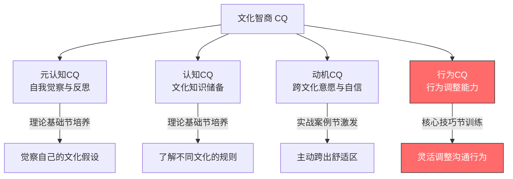
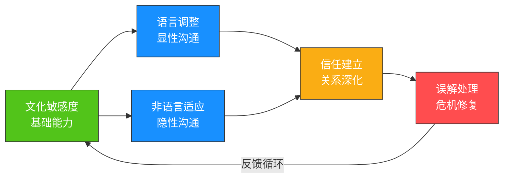
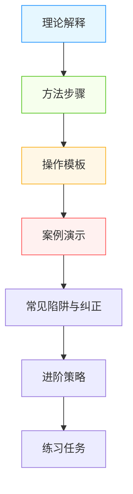
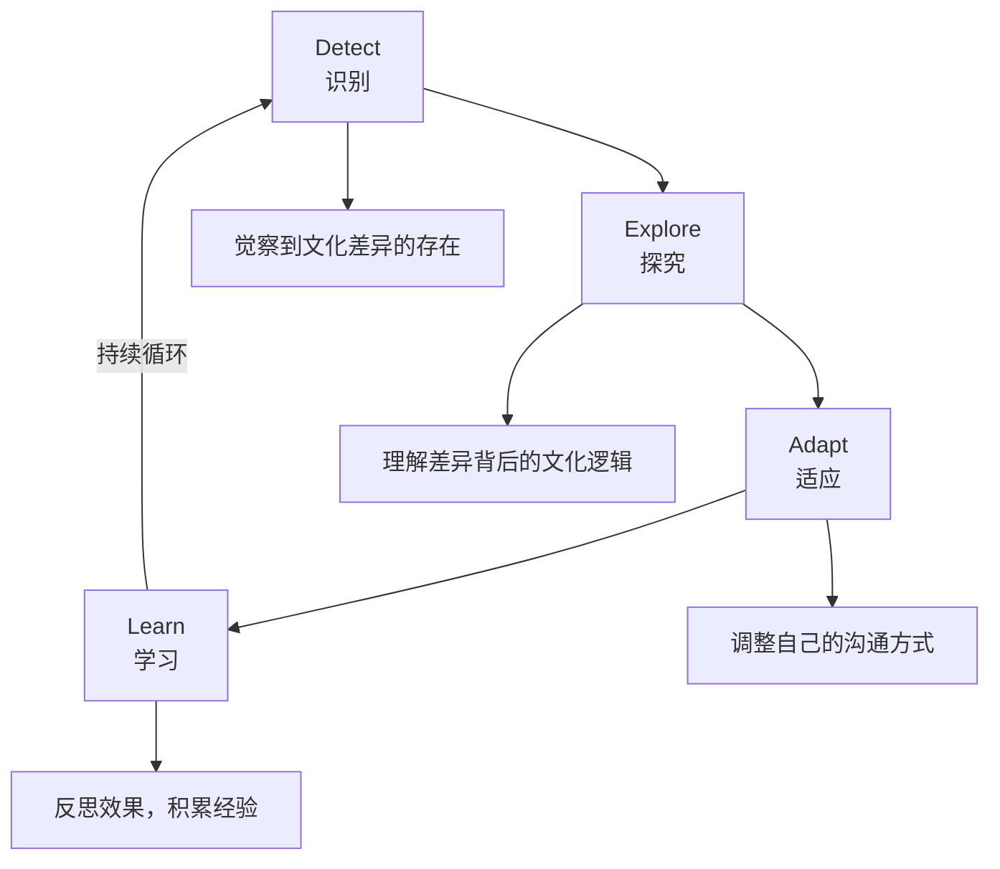

## 引言：从"知道"到"做到"的跨越

在前一节中，我们系统学习了跨文化沟通的四大理论基石——霍夫斯泰德的文化维度理论帮助我们量化文化差异的六个维度，霍尔的高低语境理论揭示了信息传递方式的连续体，文化冲击理论让我们预见到适应过程中的心理波动，跨文化适应模型则为长期成长提供了路线图。

然而，理论掌握得再扎实，如果无法转化为实际行为，就只是一堆"正确的废话"。本节的核心使命，就是将这些理论框架转化为你在真实场景中可以调用、可以执行、可以复盘的具体行为模式。

### 为什么跨文化沟通技巧在今天比以往任何时候都重要

在进入技巧学习之前，我们需要先理解一个宏观背景：跨文化沟通已经从"少数外交官和跨国企业高管的专属技能"变成了"几乎每个职场人的基本素养"。

**三个结构性变化推动了这一转变：**

**第一，远程协作的全球化普及。** 2020年之后，分布式团队成为常态。GitLab的《2024全球远程工作报告》显示，其团队成员分布在67个国家，使用超过50种语言。这意味着一个普通的软件工程师，日常工作中就可能需要与印度的后端开发、巴西的设计师、德国的QA工程师协作。跨文化沟通不再是"出国出差时才需要"的技能，而是每天打开Slack就要面对的现实。

**第二，供应链和市场的深度全球化。** 即使是一家不直接做海外业务的中国公司，其供应商、客户、竞争对手也可能来自不同文化背景。麦肯锡全球研究院的数据显示，全球跨境数据流量在2015年至2025年间增长了约150倍，这意味着信息、资本和人才的跨国流动达到了前所未有的密度。

**第三，AI工具降低了语言障碍但放大了文化鸿沟。** 机器翻译让语言不再是绝对的壁垒，但这也带来了一个反直觉的后果——当语言障碍降低后，人们更容易产生"沟通已经无障碍"的错觉，反而更难意识到文化差异的存在。你可能用完美的英语语法写出一封邮件，但邮件中的逻辑结构、语气分寸、诉求方式仍然深深打上了你母语文化的烙印。AI帮你翻译了语言，但翻译不了文化。

这三重变化叠加在一起，意味着：**跨文化沟通技巧不再是锦上添花的软技能，而是决定职业发展天花板的核心能力。**

### 知道与做到之间的鸿沟

心理学研究揭示了一个令人不安的事实：**知识与行为之间存在巨大的鸿沟**。

Dunning-Kruger效应在跨文化领域尤为明显——读了几本跨文化沟通的书，很容易产生"我已经理解了文化差异"的错觉，但真正坐到谈判桌前、走进异国会议室、面对一个与自己完全不同沟通风格的人时，理论知识往往在情绪和本能面前瞬间瓦解。

一个典型的例子：一位熟读霍夫斯泰德理论的中国经理，理论上完全理解德国文化属于低语境、低权力距离。但当德国同事在会议上当众质疑他的方案时，他的第一反应仍然是感到"被冒犯"——因为在他的文化本能中，公开质疑等于不给面子。理论上他"知道"这是德国人的正常沟通方式，情感上他仍然"做不到"不受影响。

**这个鸿沟的根源在于三个层面的脱节：**

| 层面 | 描述 | 典型表现 |
|------|------|----------|
| 认知-情感脱节 | 理性上理解，但情绪上无法接受 | 知道对方不是故意冒犯，但仍然感到不舒服 |
| 知识-行为脱节 | 知道该怎么做，但实际行为仍然沿用旧习惯 | 知道应该直接表达，但开口时还是绕了三个弯子 |
| 个体-情境脱节 | 在练习环境中能做到，但在真实压力下退化 | 模拟谈判中表现良好，真实谈判中被打回原形 |

神经科学为这个现象提供了解释：文化规范在我们成长过程中被反复强化，已经编码为大脑中的**默认神经通路**。当面临压力、疲劳或时间紧迫时，大脑会自动切换到这条默认通路，而新学的跨文化行为模式需要有意识地调用，消耗更多认知资源。这就是为什么你在精力充沛时能很好地适应文化差异，但在加班到凌晨两点的视频会议中，你的文化本能就会接管一切。

**破局的关键不是"知道更多"，而是"练到本能"。** 这就是为什么本节的核心方法论是"刻意练习"而非"知识补充"。

### 为什么需要专门的"技巧"训练

跨文化沟通能力的培养，不能停留在认知层面。文化智商（Cultural Intelligence，简称CQ）框架由伦敦商学院的P. Christopher Earley和新加坡南洋理工大学的Soon Ang于2003年提出，至今仍是跨文化能力研究中被引用最多的理论模型之一。该框架告诉我们，完整的跨文化能力包含四个维度：

四个维度的具体含义如下：

- **元认知CQ（Metacognitive CQ）**：你能否觉察到自己正在用文化滤镜看世界？能否在互动过程中实时监控自己的假设是否正确？这是最高阶的能力，决定了你是否能在全新的文化环境中快速形成有效的认知策略。
- **认知CQ（Cognitive CQ）**：你对不同文化的规范、价值观、习俗、法律、经济体系了解多少？这是知识储备层面的能力，理论基础节主要培养的就是这个维度。
- **动机CQ（Motivational CQ）**：你是否愿意投入精力去适应文化差异？面对挫折时能否保持信心？这个维度与个人特质和过往经验密切相关。
- **行为CQ（Behavioral CQ）**：你能否根据情境灵活调整自己的语言、语调、肢体动作和行为模式？这是最终"落地"的维度，也是本节聚焦的核心。

理论基础节主要培养的是**认知CQ**——让你"知道"文化差异在哪里、为什么存在。而本节聚焦的是**行为CQ**——让你在真实的跨文化场景中"做到"有效的沟通。同时，本节的技巧训练也会反向强化元认知CQ（通过不断反思自己的行为模式）和动机CQ（通过积累成功经验增强自信）。

**一个重要的研究发现：** Ang等人（2007）在对960名跨国企业员工的研究中发现，行为CQ是预测跨文化工作绩效的最强因子，其预测力超过了认知CQ和动机CQ。换言之，"知道多少"和"想不想做"都不如"能不能做到"重要。这正是本节存在的核心理由。

### 跨文化沟通能力自评：你现在在哪里？

在正式学习技巧之前，建议你先做一个快速的自我评估，明确自己的起点。以下是一个简化的自评量表，基于BASIC跨文化能力评估模型改编：

**请对以下10个陈述进行评分（1=完全不符合，5=完全符合）：**

| 编号 | 陈述 | 评分 |
|------|------|------|
| 1 | 我能意识到自己在与不同文化背景的人交流时，会不自觉地套用自己的文化假设 | __/5 |
| 2 | 我至少了解3种以上文化在沟通风格、时间观念、决策方式上的具体差异 | __/5 |
| 3 | 我愿意主动与不同文化背景的人建立关系，而不是只在不得不交流时才互动 | __/5 |
| 4 | 我能根据对方的文化背景调整自己的语速、用词和表达方式 | __/5 |
| 5 | 我能识别对方的非语言信号（眼神、距离、手势）背后的文化含义 | __/5 |
| 6 | 当跨文化误解发生时，我有系统的方法来识别、澄清和修复 | __/5 |
| 7 | 我能在不认同对方文化习惯的前提下，仍然保持尊重和开放 | __/5 |
| 8 | 我有过在异文化环境中长期生活或工作的经历 | __/5 |
| 9 | 我能区分"个体差异"和"文化差异"，不会因为一个人的表现就下结论 | __/5 |
| 10 | 每次跨文化互动后，我会反思哪些做得好、哪些需要改进 | __/5 |

**评分解读：**

- **10-20分**：起步阶段——你可能刚刚开始接触跨文化沟通，理论知识和实践经验都比较有限。本节的内容将为你建立系统的技巧框架。
- **21-35分**：成长阶段——你已经有一定的跨文化意识和经验，但在实际行为调整上可能还不够灵活。本节将帮助你将零散的经验系统化。
- **36-45分**：进阶阶段——你已经具备较强的跨文化能力，但可能在某些特定场景（如高冲突、高压力）下仍有提升空间。本节的高级技巧和综合应用部分将对你最有价值。
- **46-50分**：精通阶段——你的跨文化能力已经相当成熟。建议你重点关注本节中的"进阶策略"和"综合应用"内容，并考虑将你的经验总结为可传授的方法论。

**注意：** 这个自评只是起点，不是标签。跨文化能力是动态发展的，而且具有场景特异性——你在中美沟通中可能得分很高，但在中日沟通中可能完全是新手。保持谦逊和好奇心，比得分本身更重要。

### 五大核心技巧的逻辑关系

本节将详细讲解五大核心技巧，它们之间存在递进和支撑关系：

**文化敏感度**是所有技巧的根基——没有对文化差异的觉察和尊重，后续的调整和适应都无从谈起。它就像操作系统，其他技巧都是运行在它上面的应用程序。

**语言调整**和**非语言适应**是跨文化沟通的两条并行通道，分别处理显性信息和隐性信息的传递。Albert Mehrabian的经典研究（虽然常被误读）指出了一个关键事实：在情感态度的传递中，语言内容只占7%，语调占38%，肢体语言占55%。这意味着，如果你只关注"说什么"而忽略"怎么说"和"怎么表现"，你可能只掌控了不到10%的沟通效果。

这两者共同支撑**信任建立**——跨文化关系的核心目标。没有信任，再精妙的技巧也只是表演；有了信任，即使偶尔犯错也会被善意解读。

当误解不可避免地发生时，**误解处理**技巧负责修复关系，而修复的经验又会反馈到文化敏感度的提升中，形成持续改进的循环。

下面逐一展开每项技巧的核心内容：

| 技巧 | 核心问题 | 关键能力 | 典型应用场景 |
|------|----------|----------|--------------|
| 文化敏感度培养 | 我是否意识到了文化差异？ | 自我觉察、同理心、文化知识 | 初次接触异文化、日常跨文化互动 |
| 语言调整策略 | 我说的方式对方能理解吗？ | 语速控制、词汇选择、直接/间接切换 | 跨国会议、商务谈判、日常交流 |
| 非语言行为适应 | 我的肢体语言传递了正确的信号吗？ | 眼神、距离、手势、表情管理 | 面对面交流、商务社交、公开演讲 |
| 跨文化信任建立 | 对方愿意与我深入合作吗？ | 关系投资、承诺兑现、冲突管理 | 团队协作、商务合作、长期关系维护 |
| 文化误解处理 | 误解发生后如何修复？ | 识别误解、澄清技巧、关系修复 | 冲突场景、谈判僵局、关系危机 |

### 学习本节的正确姿势

在正式进入每项技巧的学习之前，有几个关键的学习原则需要明确：

**第一，技巧需要刻意练习，不是"看了就会"。** 每一项技巧都配有具体的练习方法和操作模板，但仅仅阅读是不够的。跨文化沟通能力就像游泳——你可以把所有动作要领背得滚瓜烂熟，但只有跳进水里才能真正学会。心理学家Anders Ericsson的研究表明，专业水平的获得需要"刻意练习"——即有明确目标、即时反馈、专注投入的重复练习。建议你在学习每项技巧后，立即在日常生活中寻找实践机会。哪怕只是一个小小的调整（比如在下一封英文邮件中尝试更直接的表达），都是有价值的开始。

**第二，技巧的运用需要灵活，而非机械套用。** 文化差异是一个连续体，而非非此即彼的二元分类。德国人"通常"直接，但不代表每个德国人都直接；日本人"通常"含蓄，但在亲密朋友之间也可能非常坦率。技巧给你的是"默认设置"和"调整方向"，而不是固定公式。你需要做的是：先根据文化背景设定一个初始假设，然后通过观察对方的实际行为不断修正这个假设。这就是为什么文化敏感度排在第一位——它训练的正是这种"观察-假设-修正"的能力。

**第三，犯错是学习的一部分，不要因为害怕犯错而回避跨文化互动。** 研究表明，跨文化能力最强的人，往往不是那些从未犯过错的人，而是那些犯过错、从错误中学习、并持续调整的人。Bennett的跨文化敏感度发展模型（DMIS）指出，从"否认差异"到"适应差异"的进阶过程中，"挫折"和"冲突"是不可避免的催化剂。本节专门设置了"文化误解处理"技巧，就是为了让你在犯错后有能力快速修复。把每次犯错都当作一次学习机会，而不是一场灾难。

**第四，文化敏感度不等于文化刻板印象。** 了解一个文化的"平均特征"是有用的起点，但永远不要把群体特征直接套用到个体身上。文化敏感度的核心是"觉察差异、保持好奇、随时调整"，而不是"我知道你是哪里人，所以你一定是这样"。一个有用的思维模型是：**文化知识是你的"假设"，个体行为是你的"数据"，当假设与数据矛盾时，以数据为准。** 每个人都是文化影响和个人特质的独特组合，尊重这种复杂性，才是真正的文化敏感度。

**第五，做好"不舒服"的准备，这是成长的信号。** 如果你在跨文化互动中一直感到轻松自在，说明你可能一直在和与自己相似的人打交道，或者一直在用自己的文化方式行事。真正的跨文化学习必然伴随着不适感——当你需要改变自己习惯的沟通方式时，会感到别扭和不自然。这种不适感恰恰说明你正在突破自己的文化舒适区。拥抱它，而不是逃避它。

### 本节的内容结构

本节按照以下结构组织内容，每一部分都遵循"理论解释→方法步骤→操作模板→案例演示→常见陷阱"的完整链条：

| 部分 | 主题 | 核心交付物 |
|------|------|-----------|
| 一 | 文化敏感度的培养 | 文化自我觉察清单、同理心训练方法、敏感度层次模型 |
| 二 | 语言调整策略 | 语速/用词调整清单、直接-间接切换框架、翻译策略指南 |
| 三 | 非语言行为适应 | 各文化非语言行为对照表、距离/眼神/手势适应指南 |
| 四 | 跨文化信任建立 | 信任建立四阶段模型、关系投资策略、承诺管理方法 |
| 五 | 文化误解的处理 | 误解识别信号清单、澄清五步法、关系修复框架 |
| 六 | 综合应用：SMART原则 | 跨文化沟通目标设定模板、综合实践方案 |

每个部分的内部结构如下：

### 一个贯穿始终的案例

为了帮助你将五大技巧串联起来理解，我们将在整个核心技巧节中使用一个贯穿案例：

> **场景**：张伟是一家中国科技公司的产品经理，即将加入一个由中、美、德、日四国成员组成的跨国产品团队。团队通过视频会议协作，每季度有一次面对面的全体会议。张伟需要在语言、非语言、信任建立和冲突处理等多个维度上进行跨文化适应。
>
> **团队成员画像**：
> - **Mike（美国）**：技术负责人，风格直接，喜欢用数据说话，会议中习惯快速推进议程
> - **Klaus（德国）**：质量工程师，严谨细致，对流程和规范有很高要求，不善寒暄
> - **Yuki（日本）**：UI设计师，温和内敛，很少当面反对意见，但会通过沉默表达保留
> - **张伟（中国）**：产品经理，擅长关系维护，习惯先建立信任再谈工作，沟通风格偏含蓄

每一项技巧的讲解都会回到这个场景，展示张伟如何运用该技巧解决实际问题。这种设计让你能够看到五大技巧如何在同一个真实场景中协同工作，而不是孤立地学习每项技巧。

### 从理论到实践的转化框架——DEAL框架

最后，介绍一个帮助你将理论知识转化为实际技巧的框架——**DEAL框架**。这个框架基于Kolb的体验学习理论（Experiential Learning Theory）改编，专门为跨文化沟通场景设计：

**DEAL框架的四个步骤：**

**Detect（识别）**——在跨文化互动中，首先觉察到"这里存在文化差异"。这依赖于文化敏感度。你需要训练自己对"不协调信号"的敏感度：对方的反应是否出乎你的预期？对话中的节奏是否和你预想的不同？是否出现了让你感到困惑或不舒服的瞬间？这些都是"文化差异可能在这里"的信号。

**Explore（探究）**——不急于评判，而是深入了解差异背后的文化逻辑。"他为什么这样做？在他的文化中这意味着什么？"这个步骤要求你暂时悬置自己的文化判断标准，尝试用对方的文化逻辑来理解对方的行为。注意，"理解"不等于"认同"，你可以理解日本人避免直接拒绝的文化逻辑，但不必放弃自己对明确答复的需求。

**Adapt（适应）**——根据理解调整自己的沟通方式——语言的、非语言的、信任建立的策略。这个步骤是行为CQ的核心。调整不是"变成对方"，而是在保持自己文化身份的同时，找到一个双方都能接受的中间地带。

**Learn（学习）**——事后反思效果如何，哪些调整有效，哪些需要改进，积累个人的跨文化经验库。建议用一个简单的日志记录每次跨文化互动中的关键事件、你的应对方式和效果评估。长期积累下来，这个日志会成为你最宝贵的跨文化资产。

**一个具体的DEAL应用示例——回到张伟的案例：**

张伟第一次和团队开视频会议时，发现Mike在讨论中直接说"I disagree with this approach"，而Yuki对设计方案有意见时只是说"This is interesting, maybe we can explore other options too"。

- **Detect**：张伟意识到，同样是对方案有异议，Mike和Yuki的表达方式完全不同。这不是个人性格差异，而是文化差异在发挥作用。
- **Explore**：美国文化属于低语境、低权力距离，"直接表达不同意见"被视为高效和诚实的表现。日本文化属于高语境、高不确定性回避，"直接否定他人"可能破坏团队和谐，因此用含蓄的方式表达保留意见。
- **Adapt**：张伟决定调整自己的反馈方式——对Mike保持直接，用数据和逻辑回应；对Yuki则需要主动创造安全的表达空间，比如会后私下询问"There was something you seemed uncertain about in the meeting. I'd love to hear your thoughts in detail."
- **Learn**：会后张伟记录了这次互动，发现主动询问Yuki获得了非常有价值的反馈（Yuki对设计可用性有深入的顾虑但在会上没有表达）。张伟将"会后单独询问含蓄成员"加入自己的跨文化行为库。

当你掌握了DEAL框架，面对任何跨文化场景，你都有了一个清晰的行动路径。这个框架将贯穿本节所有技巧的学习。

### 常见误区：在开始之前就要避免的五个陷阱

在正式学习五大技巧之前，列出五个最常见的误区，帮助你从一开始就走在正确的方向上：

**误区一："学好英语就够了。"**
语言能力是跨文化沟通的必要条件，但远非充分条件。你可以英语流利但完全不了解美国人的会议文化（比如"any other business"意味着会议即将结束），也可以语法一般但因为懂得文化规则而建立深厚的信任关系。语言是载体，文化是内容。

**误区二："文化差异主要是饮食、节日和礼节。"**
这些是文化的表层（所谓"文化冰山"的水面以上部分）。真正影响沟通效果的是深层文化——价值观、时间观念、权力认知、个人主义vs集体主义倾向、对不确定性的态度。这些看不见的部分才是跨文化沟通的核心挑战。

**误区三："我跟外国人打过交道，所以我有跨文化能力。"**
经验不等于能力。如果你跟外国人打了十年交道，但每次都是用自己的方式、按照自己的文化逻辑行事，那你的跨文化能力可能并没有提升——你只是习惯了而已。能力的提升需要有意识的反思和调整。

**误区四："尊重文化差异意味着接受一切。"**
文化相对主义有其边界。尊重差异不等于放弃自己的核心价值观，也不等于对违反普世伦理的行为视而不见。跨文化沟通的目标是"在差异中寻找共识"，而不是"无条件顺从"。

**误区五："有一个万能的跨文化沟通公式。"**
不存在。文化差异是一个多维连续体，每个人都是文化影响和个人特质的独特组合。任何试图用"对A国人做X，对B国人做Y"的公式化思维都会在现实中碰壁。你需要的是一套灵活的方法论（即本节提供的五大技巧），而不是一张固定的对照表。

现在，让我们进入第一项核心技巧——文化敏感度的培养。

***
