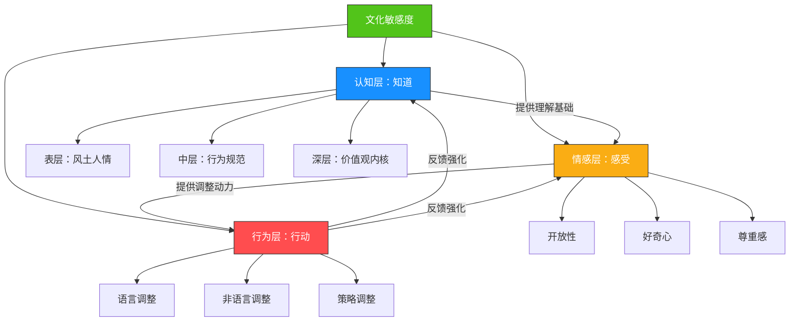
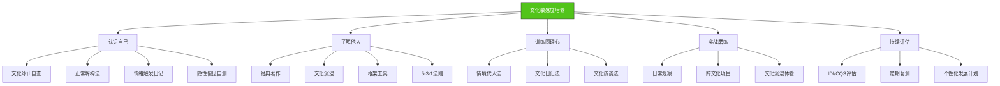

## 一、文化敏感度的培养

文化敏感度是跨文化沟通五大核心技巧中的根基能力。正如前文的逻辑关系图所示，语言调整、非语言适应、信任建立和误解处理，都建立在文化敏感度之上——如果连差异的存在都无法觉察，后续的一切调整都无从谈起。

本节将从「是什么」「为什么」「怎么做」「如何评估」四个层面系统展开：先厘清文化敏感度的本质和层次结构，再解释它为什么能决定跨文化沟通的成败，然后提供一套可操作的培养路径——从自我觉察开始，经过知识积累和同理心训练，最终达到直觉性文化适应，最后介绍如何评估自己的文化敏感度水平以及组织如何系统性地建设文化敏感度。

### 1.1 什么是文化敏感度

#### 1.1.1 定义与本质

文化敏感度（Cultural Sensitivity）是指在跨文化互动中，能够识别、理解并尊重文化差异的意识、态度和能力的综合体。它不是一种单一的技能，而是一套相互关联的心理能力——包括对差异的觉察力、对差异的理解力、以及基于理解进行行为调整的适应力。

这个定义包含三个关键词，缺一不可：

- **识别**（觉察力）：能注意到「这里有差异」。很多人在跨文化互动中犯错，不是因为故意不尊重，而是根本没有意识到对方的行为方式与自己不同。觉察力是一切的起点。
- **理解**（认知力）：能解释「为什么会有这个差异」。仅仅注意到差异不够——如果你不理解差异背后的文化逻辑，你可能会做出错误的归因（比如把文化差异解读为个人品质问题）。
- **尊重并适应**（行动力）：能基于理解调整自己的行为。文化敏感度不是学术研究——它的最终目的是让你在实际互动中更有效地与不同文化背景的人协作。

需要区分几个容易混淆的概念：

| 概念 | 英文 | 核心含义 | 与文化敏感度的关系 |
|------|------|----------|-------------------|
| 文化意识 | Cultural Awareness | 知道文化差异存在 | 敏感度的认知前提 |
| 文化敏感度 | Cultural Sensitivity | 觉察、理解、尊重差异 | 本文核心主题 |
| 文化能力 | Cultural Competence | 能在跨文化情境中有效行动 | 敏感度的行为延伸 |
| 文化智商 | Cultural Intelligence (CQ) | 跨文化适应的综合能力框架 | 敏感度是CQ的核心组件 |
| 文化谦逊 | Cultural Humidity | 承认自己永远无法完全理解他者文化 | 敏感度的态度基石 |

前四者的关系是一个递进链条：**文化意识 → 文化敏感度 → 文化能力 → 文化智商**。文化意识是起点——你至少要知道「文化之间存在差异」；文化敏感度在此基础上增加了情感维度（尊重）和认知深度（理解差异的内在逻辑）；文化能力将敏感度转化为实际行为；文化智商则是一个整合框架，涵盖了元认知、认知、动机和行为四个维度（Earley & Ang, 2003）。

「文化谦逊」独立于这条递进链之外，但与每一层都相关。它强调的是：无论你的文化敏感度多高，你都不可能完全理解另一种文化的全部——保持谦逊和持续学习的心态，比任何具体的技能都更重要。

一个形象的比喻：文化意识相当于知道「水温有冷有热」，文化敏感度相当于「手伸进水里能分辨冷热并做出反应」，文化能力相当于「能在不同水温中自如游泳」，文化智商则相当于「理解水的物理特性，能在任何水域中生存」，而文化谦逊相当于「永远承认还有你没去过的水域」。

#### 1.1.2 文化敏感度的三个层次

文化敏感度不是单一维度的能力，而是由三个相互交织的层次构成：

**认知层：知道（Know）**

认知层是文化敏感度的知识基础，指的是你对不同文化的具体了解——节日、习俗、禁忌、价值观、沟通风格、社会规范等。这一层回答的问题是「不同文化的人有什么不同？」

认知层的知识可以进一步细分为三个深度：

- **表层知识**：风土人情、节日庆典、饮食习惯等可见的文化现象。例如知道日本人在商务场合交换名片有特定礼仪。
- **中层知识**：社会规范、沟通风格、时间观念等行为模式。例如理解日本的「建前」（表面立场）和「本音」（真实想法）的区别。
- **深层知识**：核心价值观、世界观、思维范式等文化内核。例如理解日本文化中「和」（和谐）的价值观如何塑造了从家庭到职场的一切人际互动模式。

大多数人停留在表层知识上。他们知道「日本人交换名片时双手递接」，但不理解名片在日本文化中代表的不仅是联系方式，更是个人身份和社会地位的象征——单手接过名片随意塞进口袋，在日本人看来等于对个人尊严的轻视。表层知识让你「做对动作」，中层知识让你「理解含义」，深层知识让你「感知分寸」。

**情感层：感受（Feel）**

情感层是文化敏感度的态度基础，指的是你面对文化差异时的内在反应模式。这一层回答的问题是「面对差异时，我的第一感受是什么？」

情感层包含三个关键态度：

- **开放性**：对不熟悉的文化现象不急于否定，而是保持接纳的心态。开放性不是「什么都接受」，而是「先理解再判断」。
- **好奇心**：将文化差异视为学习机会而非麻烦，主动探索「为什么会这样」。好奇心是文化敏感度最强大的驱动力——当你的第一反应是「这很有意思」而非「这很奇怪」时，你就已经迈出了关键一步。
- **尊重感**：承认不同文化的方式有其合理性和价值，而非将自身文化当作评判标准。尊重不是礼貌性地「容忍」，而是真诚地认识到「对方的方式在这个语境下是合理的」。

情感层为什么重要？因为情感反应往往先于理性思考。当一个德国同事在会议上直接指出你方案中的问题时，你的理性可能知道「这是德国人的沟通方式」，但如果你的情感层没有被训练过，你的第一反应仍然可能是「他在针对我」。认知神经科学的研究表明，情绪反应的启动速度比理性分析快约200毫秒（LeDoux, 1996）——这意味着在你还没来得及调用文化知识之前，情绪已经做出了反应。文化敏感度的培养，很大程度上就是训练情感层的反应模式——把本能的「防御/排斥」替换为「好奇/理解」。

**行为层：行动（Do）**

行为层是文化敏感度的实践表现，指的是你根据文化差异实际调整自身行为的能力。这一层回答的问题是「我能在行动上做出什么改变？」

行为层的调整涵盖三个通道：

- **语言调整**：语速、用词、直接/间接程度、反馈方式等。例如面对高语境文化的沟通对象时，学会「听话听音」，注意对方没有说出来的部分。
- **非语言调整**：眼神接触、身体距离、手势含义、表情管理等。例如在中东文化中，同性之间的身体接触（如握手时间较长、走路时挽手臂）是友谊的表达，而在北欧文化中同样的行为可能让人不适。
- **策略调整**：谈判风格、决策方式、冲突处理、时间管理等。例如在关系导向的文化中，正式谈判前的社交环节不是「浪费时间」，而是信任建立的必要步骤。

三个层次之间的关系是递进但非线性的。认知为情感提供理解基础（你了解得越多，越不容易产生偏见），情感为行为提供动力（你尊重差异，才会愿意调整自己），行为的反馈又会强化认知和情感（成功的跨文化互动会增强你的信心和好奇心）。但这种递进不是单向的——有时行为先行（被逼着调整），事后反思才获得认知和情感的成长。

#### 1.1.3 文化敏感度 ≠ 文化刻板印象

在深入学习之前，必须划清一条重要界限：**文化敏感度与文化刻板印象是两种完全不同的东西。**

文化刻板印象是将某一群体的特征固定化、简化化，并直接套用到该群体中的每一个个体身上。例如：「德国人都很直接」「日本人都很含蓄」「美国人都很自信」。刻板印象的问题在于三点：

1. **过度简化**：忽略了群体内部的巨大差异。德国有含蓄的人，日本有直接的人，美国有内向的人。任何一个国家内部的文化差异，可能不亚于国家之间的差异——城市与农村、年长与年轻、沿海与内陆，都是重要的文化变量。
2. **固化认知**：让人丧失对个体真实特征的觉察。一旦你带着「日本人很含蓄」的预期去互动，你可能会忽略一个日本同事明确表达的反对意见——因为你的认知框架已经预设了「他们不会直接说」。
3. **自我验证**（Confirmation Bias）：一旦你带着刻板印象去观察，就会不自觉地寻找支持性证据，忽略反例。你记住了那个含蓄的日本人，忘记了那个直接的日本人。

文化敏感度则完全不同。它提供的是「概率性的认知地图」——告诉你「在某种文化中，这类行为比较常见」，但同时强调以下三点：

1. **群体特征不等于个体特征**。你知道「中国文化倾向于高语境沟通」，但不代表你遇到的每个中国人都是高语境沟通者。城市中的年轻专业人士可能比你想象的更直接。
2. **文化特征是起点，不是终点**。它给你一个初始的「默认设置」，但你需要在互动中不断修正对这个具体个体的理解。真正的文化敏感度是一个动态调整的过程，而不是一套固定的分类标签。
3. **觉察差异的目的是适应，不是评判**。文化敏感度的最终目标是调整自己的行为以实现有效沟通，而不是给对方贴标签。

一个实用的检验标准：如果你对某种文化的理解在遇到该文化的个体后没有被修正或丰富，说明你可能是在用刻板印象而非文化敏感度在观察。

#### 1.1.4 文化敏感度与代码转换（Code-Switching）

代码转换是一个在文化敏感度讨论中经常被忽略但极其重要的概念。代码转换最初是语言学概念，指双语者在对话中切换语言的行为。在文化语境下，它扩展为：**在不同的文化规范之间切换自己的行为模式**。

例如：一个在美国工作的中国工程师，在与美国同事开会时会主动发言、直接表达观点，但回到与中国团队的视频会议中，会自动切换到更含蓄、更注重群体和谐的沟通方式。这不是「虚伪」或「两面派」——这是一种高度发展的文化适应能力。

代码转换的三个层次：

| 层次 | 内容 | 示例 |
|------|------|------|
| 语言代码转换 | 切换语言、方言、语域 | 在正式场合用普通话，私下用方言 |
| 行为代码转换 | 切换社交规范和行为模式 | 在美式会议中直接表达，在日式会议中等待合适的发言时机 |
| 身份代码转换 | 切换自我呈现方式 | 在不同文化群体中强调自己身份的不同方面 |

代码转换是有代价的。研究发现（Molinsky, 2007），频繁的代码转换会导致「文化切换疲劳」——一种类似决策疲劳的心理状态。因此，培养文化敏感度不仅要学会切换，还要学会管理切换带来的心理消耗。

### 1.2 为什么文化敏感度如此重要

#### 1.2.1 它是跨文化沟通的底层操作系统

在章节概览中我们已经看到数据：约70%的跨国合作失败源于文化误解。但如果进一步追问「这些文化误解的根源是什么」，答案几乎总是指向文化敏感度的缺失——要么是没觉察到差异的存在，要么是觉察到了但不理解差异的逻辑，要么是理解了但不愿意调整。

文化敏感度之所以被称为「底层操作系统」，是因为它决定了其他所有跨文化技能能否被正确调用。一个缺乏文化敏感度的人，即使背熟了「与日本人沟通要间接一些」这句话，在实际场景中也很难做到——因为他不理解为什么日本人偏好间接沟通（这涉及到「和」文化、面子机制、集体和谐的价值观），所以他的「间接」可能只是把直接的话拐了个弯，仍然让对方感到突兀。

类比来说：文化知识是「地图」，文化敏感度是「导航能力」。有地图没有导航能力，你到了路口还是不知道该往哪走；有导航能力没有具体地图，你可以边走边探索；但两者兼备才是最高效的。

#### 1.2.2 缺失文化敏感度的真实代价

以下三个真实场景展示了文化敏感度缺失导致的具体后果：

**场景一：商务邮件的「礼貌灾难」**

一位中国外贸经理给美国客户写邮件，按照中国商务习惯，在正文之前用了大段寒暄——询问对方家庭情况、季节天气、表达对长期友谊的珍视——然后才切入正题。美国客户的回复非常简短，直接跳过了所有寒暄，只回答了业务问题。中国经理感到对方「不礼貌、不重视关系」；美国客户则觉得对方「不专业、浪费时间」。

双方都没有恶意。中国商务文化中，关系维护是信任建立的核心环节，邮件中的寒暄是表达重视的方式；美国商务文化中，效率和直接是专业精神的体现，过多寒暄反而显得不聚焦。如果任何一方具备足够的文化敏感度，都能识别到这种差异并做出调整——中方可以精简寒暄，美方可以理解对方的善意。

**场景二：跨国团队的「沉默误解」**

一家欧洲企业在印度设立了研发中心。在项目评审会上，印度工程师对上级提出的方案很少提出反对意见，欧洲管理者将此解读为「团队认同方案」。但项目执行过程中频繁出现问题，管理者追问之下才发现，许多工程师在会前就已经发现了方案的缺陷，但在会议中不敢直接反对上级——因为在印度的高权力距离文化中，公开质疑上级是不被鼓励的行为。

这个误解的代价是：项目延期三个月，额外耗费数十万欧元。如果欧洲管理者具备文化敏感度，他会在会后通过一对一面谈、匿名反馈渠道等方式主动收集不同意见，而不是简单地将「沉默」等同于「同意」。

**场景三：海外留学生的「社交孤岛」**

一位中国留学生到美国读研，课堂上从不主动发言。美国教授和同学将此解读为「不参与、不感兴趣」，逐渐不再邀请她参与讨论。中国留学生则感到困惑——在中国的课堂文化中，认真听讲、不在老师讲课时打断是尊重的表现，主动发言可能被视为「出风头」。双方的文化敏感度缺失导致了一个恶性循环：沉默 → 被忽视 → 更加沉默 → 彻底被边缘化。

**场景四：数字沟通中的「表情符号灾难」**

一位巴西员工在团队Slack频道中频繁使用表情符号和GIF动图来表达热情和友好。日本团队成员将此解读为「不专业、不严肃」。而当日本成员用极其简短、正式的文字回复时，巴西团队成员觉得对方「冷淡、不友善」。数字沟通放大了文化差异——缺少面部表情和语调这些非语言线索，文化差异的冲击被进一步放大。

这四个场景的共同点是：**双方都没有恶意，但文化敏感度的缺失让善意被误读为恶意，正常行为被解读为异常行为。** 文化敏感度的价值就在于，它能帮你穿透行为的表面，看到背后的文化逻辑。

#### 1.2.3 文化敏感度的竞争优势

除了避免负面后果，文化敏感度还能带来积极的竞争优势：

- **决策质量提升**：在跨文化团队中，具备文化敏感度的领导者能识别哪些沉默是同意、哪些是保留意见，从而做出更准确的判断。研究表明（Stahl et al., 2010），文化多样性的团队在具备高水平文化敏感度领导者的带领下，决策质量比同质化团队高出35%。
- **关系建立加速**：当对方感受到你对其文化的理解和尊重时，信任建立的速度会显著加快。在商业谈判中，这种信任可以缩短谈判周期20-30%。
- **冲突化解能力**：大多数跨文化冲突的本质不是利益冲突，而是文化逻辑的碰撞。具备文化敏感度的人能快速识别冲突的文化根源，从根源上化解而非就事论事地调解。
- **创新潜力释放**：研究表明（Maddux & Galinsky, 2009），深度的跨文化经历能提升创造性思维能力——前提是这种经历伴随着文化敏感度的提升，而非仅仅是在异国他乡「待过」。关键不在于「去过多少个国家」，而在于「在那些国家里，你有多深入地理解了当地文化」。
- **人才吸引与保留**：在多元文化组织中，文化敏感度高的管理者所带领的团队，员工离职率平均低22%（Hewlett, 2012）。人们愿意留在自己感到被理解和尊重的环境中。

#### 1.2.4 数字时代的新挑战

在远程办公和全球化协作成为常态的今天，文化敏感度面临着新的挑战：

**异步沟通的文化差异**：不同文化对「及时回复」的期望差异巨大。在一些文化中，24小时内回复邮件是正常的；在另一些文化中，超过4小时不回复就可能被视为不重视。如果没有文化敏感度，你可能会错误地将延迟回复解读为不尊重或不专业。

**视频会议的文化碰撞**：在Zoom/Teams会议中，不同文化对「什么时候该说话」有不同的默认规则。在一些文化中，等对方完全说完再发言是礼貌的；在另一些文化中，积极插话表示参与和热情。视频会议的微小延迟（200-300ms）进一步加剧了这种碰撞——来自「重叠发言」文化的人会不断被打断，来自「等待发言」文化的人会永远找不到开口的时机。

**文字沟通的情感缺失**：电子邮件和即时消息缺少语调、面部表情和肢体语言。在高语境文化中，人们习惯从非语言线索中获取大量信息——当这些线索被剥离后，他们可能会过度解读文字本身，或者因为无法获取足够的上下文而感到不安。

### 1.3 培养文化敏感度的系统路径

文化敏感度不是天赋，而是一套可以系统训练的能力。以下路径按照从内到外、从知到行的逻辑展开：先认识自己（文化自我觉察），再了解他人（文化知识积累），然后训练换位能力（文化同理心），最后在实践中磨练（跨文化体验）。

#### 1.3.1 第一步：文化自我觉察——认识自己的文化镜片

跨文化沟通的第一步不是了解别人的文化，而是认识自己的文化。这听起来矛盾，但道理很简单：**你无法识别差异，除非你知道自己是什么样的。**

每个人从出生起就被浸泡在特定的文化环境中。你的语言、思维模式、情绪反应、社交习惯、价值判断——这些你以为是「自然的」「正常的」「人之常情」的东西，其实都是文化塑造的产物。文化就像一副有色镜片：你透过它看世界，但你意识不到它的存在，因为它是透明的——你以为你看到的就是世界的本来面目。

文化自我觉察的目的，就是让你意识到这副镜片的存在，看到它的颜色和形状。

**实操练习一：文化冰山自查清单**

文化经常被比喻为冰山——水面上是可见的行为（语言、食物、服饰、节日），水面下是不可见的价值观、信念、思维方式。以下清单帮你发掘自己的「水下部分」：

| 维度 | 自问 | 你的回答 | 文化假设分析 |
|------|------|----------|-------------|
| 时间观 | 迟到15分钟会让你觉得怎样？ | \_\_\_\_\_ | 你的时间观是单线程（严格守时）还是多线程（弹性时间）？ |
| 空间观 | 与同事交谈时你习惯保持多远的距离？ | \_\_\_\_\_ | 你的空间偏好是亲密型（近）还是正式型（远）？ |
| 面子观 | 当众被批评时你的第一反应是什么？ | \_\_\_\_\_ | 你对面子的敏感度有多高？ |
| 关系观 | 你倾向于先建立关系再谈生意，还是直接谈生意？ | \_\_\_\_\_ | 你所在文化的关系优先度有多高？ |
| 等级观 | 你会当众指出上级的错误吗？ | \_\_\_\_\_ | 你对权力距离的默认态度是什么？ |
| 冲突观 | 遇到分歧时你倾向于正面讨论还是回避？ | \_\_\_\_\_ | 你的冲突风格是直接面对还是维护和谐？ |
| 个人/集体观 | 做重要决定时你更多考虑自己的意愿还是家人的期望？ | \_\_\_\_\_ | 你偏向个人主义还是集体主义？ |
| 表达观 | 说「不」对你来说容易吗？ | \_\_\_\_\_ | 你的表达风格偏直接还是含蓄？ |
| 情感观 | 在工作场合表达强烈情绪（如愤怒、兴奋）合适吗？ | \_\_\_\_\_ | 你对情感表达的边界在哪里？ |
| 成就观 | 你更看重个人成就还是团队荣誉？ | \_\_\_\_\_ | 你的成就导向是个人英雄还是集体协作？ |
| 信任观 | 你更信任「白纸黑字」的合同，还是「一诺千金」的口头承诺？ | \_\_\_\_\_ | 你所在文化是制度信任还是关系信任？ |
| 对待不确定性的态度 | 面对模糊的指示，你会觉得不安还是觉得正常？ | \_\_\_\_\_ | 你对模糊性的容忍度有多高？ |

完成这份清单后，回顾你的答案，问自己：「这些反应是「人类本能」还是「我所在文化的典型反应」？」如果你发现来自同一文化的大多数人会有类似的回答，那说明你的反应是文化塑造的，而非天然的。

**实操练习二：「正常」解构法**

连续三天，每天记录三件你觉得「正常」或「理所当然」的事情。然后对每件事追问三个层次：

1. **行为层**：我做了什么？（例：和朋友吃饭时抢着买单）
2. **规范层**：这在我的文化中意味着什么？（例：表示慷慨、重视友情、有面子）
3. **价值层**：背后反映了什么深层价值？（例：关系优先于个人利益、互惠义务感、社会认同的需要）

这个练习的价值在于：当你能把「正常」解构为「文化特定」时，你就为理解「别人的正常」打开了空间。

**检查标准**：三天共记录9件事，如果至少有6件你能清晰地追溯到文化根源（而非个人偏好），说明你的文化自我觉察已经开始运作。

**实操练习三：情绪触发日记**

在接下来两周的跨文化互动中（如果没有国际交流的机会，与不同地域、年龄、职业背景的人互动也算），记录以下内容：

| 日期 | 事件 | 对方行为 | 我的情绪反应 | 我的自动判断 | 文化假设 |
|------|------|----------|-------------|-------------|---------|
| | | | | | |

重点分析第三列和第四列的关联：对方的哪些行为触发了你的负面情绪？你是否不自觉地用自己的文化标准做出了评判？例如，对方没有回复你的消息，你是否立刻觉得「对方不尊重我」？在你的文化中，及时回复消息是尊重的表现，但在对方的文化中，可能有完全不同的解读。

**检查标准**：两周后回顾日记，如果发现至少3个「情绪触发→文化归因」的模式识别，说明你的情绪觉察能力在提升。

**实操练习四：隐性偏见自测**

哈佛大学的内隐联想测试（IAT，可在 implicit.harvard.edu 免费使用）可以帮助你发现无意识层面的文化偏见。IAT通过测量你对不同群体概念的反应速度，揭示你意识层面可能不承认的联想模式。

建议至少完成以下两个测试：
- **种族IAT**：测量你对不同种族的无意识联想
- **民族国家IAT**：测量你对不同国家/民族的无意识联想

结果的正确使用方式：不是用来自责或给自己贴标签，而是用来提醒自己——每个人都有隐性偏见，觉察是减少其影响的第一步。

#### 1.3.2 第二步：文化知识积累——构建你的文化地图

文化自我觉察帮你认识了自己的「文化镜片」，文化知识积累则帮你拓展视野——了解其他文化的不同「镜片」。

**知识积累的三个层次**

如前所述，文化知识分为表层、中层和深层。一个实用的积累策略是：先表层建立接触点，再中层理解行为逻辑，最后深入到价值观内核。

**推荐知识积累路径：**

**路径一：经典著作阅读（理论框架）**

以下著作按从入门到进阶排列：

| 书名 | 作者 | 核心内容 | 适合阶段 |
|------|------|----------|----------|
| 《文化的影响力》 | 吉尔特·霍夫斯泰德 | 六个文化维度的系统框架 | 入门必读 |
| 《超越文化》 | 爱德华·T·霍尔 | 高低语境文化理论 | 入门必读 |
| 《当文化碰撞时》 | 理查德·刘易斯 | 三种文化类型模型（线性、多元、反应） | 入门进阶 |
| 《文化地图》 | 艾琳·迈耶 | 八个维度的实用跨文化沟通指南 | 实战导向 |
| 《文化智商》 | 克里斯托弗·厄利等 | CQ理论与测量框架 | 进阶研究 |
| 《第三文化小孩》 | 大卫·波拉克 | 跨文化成长经历对身份认同的影响 | 深度理解 |
| 《微冒犯》 | Derald Wing Sue | 跨文化互动中的隐性偏见与微冒犯 | 进阶必读 |

**路径二：目标文化沉浸（感性认知）**

- **影视作品**：选择反映目标文化日常生活的影视作品（而非动作片或奇幻片），观察剧中人物的互动方式、冲突处理、家庭关系、职场文化。推荐方法：看第一遍理解剧情，看第二遍专门观察文化细节——谁在说话时看对方的眼睛？谁在回避？冲突是如何升级的？又是如何化解的？
- **新闻与社交媒体**：定期阅读目标文化的主流新闻媒体和社交平台。关注的不是新闻事件本身，而是社会对事件的反应——哪些事情引发愤怒？哪些事情引发幽默？评论区的讨论风格是怎样的？
- **文学作品**：小说是进入一种文化内心世界的最佳通道。它展示了人们如何思考、感受、做决定，比任何教科书都更直观。
- **播客与访谈节目**：听目标文化的播客和访谈节目，是训练「文化耳朵」的有效方式——你能听到人们的语速、语调、用词习惯、幽默方式，这些在书面材料中很难感受到。

**路径三：框架工具速查（实用参考）**

对于需要快速了解一种新文化的人，以下工具提供了结构化的参考：

- **Hofstede Insights 网站**（hofstede-insights.com）：输入任何国家名称，可以查看该国在六个文化维度上的得分和与另一国家的对比。
- **CultureWizard 互动工具**：提供100多个国家的文化概况，涵盖商务礼仪、沟通风格、时间观念等实用维度。
- **GlobeSmart（Aperian Global）**：基于GLOBE研究项目的文化数据库，提供详细的文化对比分析。
- **The World Factbook（CIA）**：提供各国的社会、经济、人口统计数据，帮助你理解文化现象背后的社会背景。

这些工具的价值在于提供了一个「文化速查手册」——当你即将与某一文化背景的人进行重要互动时，可以快速浏览关键维度，做到心中有数。但必须强调：这些工具提供的是群体层面的统计趋势，不是对个体的预测。永远以实际互动中的观察为准。

**知识积累的「5-3-1法则」**

为了防止浅尝辄止，给自己设定一个最低标准：

- 对你最常接触的**5种文化**，至少达到中层知识水平（理解行为规范和沟通风格）
- 对你偶尔接触的**3种文化**，至少达到表层知识水平（知道基本禁忌和礼仪）
- 对你从未接触过的**1种文化**，每年选择一个进行深度学习（作为持续成长的练习）

#### 1.3.3 第三步：文化同理心训练——从「换位思考」到「换文化思考」

文化知识告诉你「他们为什么会这样」，文化同理心让你能够「站在他们的位置上感受」。两者的关键区别在于：知识是认知性的（我知道），同理心是体验性的（我能感受到）。

文化同理心不同于简单的「换位思考」。换位思考假设的是同一个文化框架内的视角切换——「如果我是他，我会怎么想？」文化同理心则要求你暂时搁置自己的文化框架，尝试用对方的文化逻辑来理解事物——「如果我是他，在他的文化中长大，我会怎么想？」

这个区别至关重要。普通的换位思考可能产生「文化投射」——你以为你在理解对方，其实你只是把自己的想法放到对方的位置上。文化同理心则要求你先了解对方的文化框架，再在这个框架内进行思考。

**训练方法一：情境代入法**

选择一个跨文化冲突的案例，分三步进行分析：

1. **文化A视角**：站在文化A的立场上，理解这种行为在这个文化中的含义和合理性。
2. **文化B视角**：站在文化B的立场上，理解为什么同样的行为会被不同解读。
3. **桥梁视角**：找到一个双方都能接受的中间方案。

**示例练习：**

> 一位美国经理给日本团队成员发了一封邮件，要求「请坦诚告诉我你对这个方案的真实看法」。日本成员回复「这个方案很好，我没有意见」。但一周后项目执行时出现了明显问题。

**文化A视角（美国）**：直接询问是为了获取真实信息、做出正确决策。坦诚反馈是专业精神的体现，隐瞒问题是不负责任的。
**文化B视角（日本）**：在书面形式（留下记录）中直接反对上级或团队的方案，可能被视为破坏和谐、不给面子。用「我没有意见」表达的可能是「我有保留意见，但不适合在这个场合说」。
**桥梁方案**：美国经理可以在非正式场合（如午餐或散步时）私下询问，或使用匿名反馈工具，或通过日本团队中比较信任的中间人了解真实想法。

**训练方法二：文化日记法**

每天记录一个你观察到的（或经历的）文化差异事件，然后从两个文化角度进行分析。日记模板如下：

日期：____
事件描述：____
我最初的文化解读：____
对方可能的文化解读：____
我遗漏了什么文化因素：____
下次遇到类似情况我可以怎么做：____

这个练习的关键不在于记录多少，而在于培养一种习惯性的思维模式——遇到任何跨文化互动时，自动地、快速地进行「文化双镜头」分析。

**训练方法三：文化访谈法**

与来自不同文化背景的人进行深度对话。这不是泛泛的闲聊，而是有结构的探索性对话。可以围绕以下问题展开：

1. 「在你的成长环境中，人们是如何表达不同意见的？」
2. 「在你的文化中，什么样的行为会被认为是「不礼貌」的？」
3. 「如果你要做一个重要的个人决定（比如换工作），你会先和谁商量？为什么？」
4. 「在你的文化中，「尊重」是如何体现的？举一个具体的例子。」
5. 「你在与中国/其他国家的人交流时，遇到过最大的文化差异是什么？」
6. 「在你的文化中，人们如何处理尴尬或丢脸的情况？」

进行文化访谈时的注意事项：
- 带着真诚的好奇心，而非「验证我的理论」的目的。
- 不要急于给建议或评价，重点是倾听和理解。
- 注意对方的非语言信号——有些文化差异是当事人自己也难以言说的。
- 记录下来并事后反思——口头交流中的洞察往往稍纵即逝。
- 避免让对方成为「整个文化的代言人」——明确你是在了解「他的个人经历和观察」，而不是在让他代表整个国家发言。

#### 1.3.4 第四步：跨文化实践体验——从模拟到实战

前三步（觉察、知识、同理心）本质上都是在「岸上学游泳」。第四步是真正「下水」——在实际的跨文化互动中检验和磨练你的文化敏感度。

**入门级实践：日常跨文化观察**

你不需要出国就能开始实践。在日常生活中寻找文化差异的「微场景」：

- 与来自不同省份的同事交流时，观察南北方在表达方式、时间观念、社交距离上的差异。
- 观看国际体育赛事，观察不同国家运动员和观众的行为差异。
- 在国际化的工作环境中，观察外企文化与本土文化在会议风格、决策方式上的碰撞。
- 在社交媒体上观察不同文化背景的人对同一事件的不同反应。

**进阶级实践：跨文化项目参与**

- 主动参加公司的国际化项目或跨文化团队。
- 参加国际志愿者项目或跨文化交流活动。
- 加入国际化的线上社群（如Reddit的r/culturalstudies、Quora的跨文化讨论板块）。
- 与语言交换伙伴建立长期关系——语言交换本身就是一种深度跨文化互动。
- 参加跨文化读书会——与来自不同文化背景的人一起讨论同一本书，观察不同文化视角下的解读差异。

**高级实践：文化沉浸体验**

- 海外工作或留学（如果条件允许）。
- 在异文化社区做长期志愿者。
- 参加跨文化培训师认证课程（如IDI认证、CQ认证），从学习者转变为教授者。

每个阶段的关键原则是：**实践 + 反思 = 成长**。单纯的跨文化经历不会自动提升文化敏感度——很多人在国外生活多年，文化敏感度并没有显著提升，因为他们只是「经历」了文化差异，而没有「反思」文化差异。每一次跨文化互动之后，花几分钟回顾：发生了什么？我的反应是什么？对方可能的感受是什么？我的文化镜片如何影响了我的判断？

### 1.4 文化敏感度的发展阶段模型

文化敏感度的培养是一个渐进过程。以下四阶段模型（参考Bennett的跨文化敏感度发展模型DMIS）可以帮助你定位自己当前所处的阶段，并明确下一步的发展方向。

#### 1.4.1 四阶段详解

| 阶段 | 名称 | 核心特征 | 典型表现 | 内心独白 | 发展重点 |
|------|------|---------|---------|----------|---------|
| 第一阶段 | 无意识无能力 | 不知道自己缺乏文化敏感度 | 以自己的文化为唯一标准评判一切，将差异视为「错误」或「奇怪」 | 「他们怎么这么不正常？」 | 接触文化差异的存在 |
| 第二阶段 | 有意识无能力 | 知道文化差异存在，但不知如何应对 | 感到困惑、焦虑，可能产生文化冲击或回避行为 | 「我知道有差异，但我不知道该怎么办」 | 学习文化知识和基本应对方法 |
| 第三阶段 | 有意识有能力 | 能识别差异并有意识地调整 | 需要刻意努力才能适应，会主动思考「对方的文化逻辑是什么」 | 「让我想想，在他的文化中，这样做意味着什么？」 | 积累实战经验，内化技能 |
| 第四阶段 | 无意识有能力 | 文化适应成为自然而然的能力 | 灵活自如地在不同文化间切换，不再需要刻意分析 | 「这种感觉自然就对了」 | 持续精进，培养跨文化领导力 |

**第一阶段：无意识无能力——「文化中心主义」**

这是文化敏感度发展的起点，也是最常见的状态。处在这个阶段的人不知道自己缺乏文化敏感度。他们把自己的文化当作「正常」的标准，把所有偏离这个标准的行为视为「不正常」或「需要纠正的」。这不是恶意——他们甚至没有意识到自己在用单一标准评判世界。

典型表现：
- 「为什么他们不能像我们一样直接说？」
- 「他们的时间观念太差了，总是迟到。」
- 「如果他们按照我们的方法做，就不会有这些问题了。」

从第一阶段到第二阶段的关键转折：**第一次被文化差异「撞了一下」**。可能是第一次出国旅行的震撼，可能是与外国同事合作时的困惑，可能是读了一本关于文化差异的书后的顿悟。不管是什么触发的，关键是意识到「我的方式不是唯一的方式」。

**第二阶段：有意识无能力——「文化冲击期」**

这是最不舒服但最有学习潜力的阶段。你知道文化差异存在了，也知道自己不擅长应对，但你还没有足够的知识和技能来有效处理。这个阶段容易出现两种反应：

- **焦虑型**：害怕犯错，过度谨慎，反而显得不自然。
- **回避型**：退回到自己的文化舒适区，减少跨文化互动。

这两种反应都是正常的，但都需要有意识地克服。从第二阶段到第三阶段的关键：**系统学习 + 有指导的实践**。这就是本章存在的意义——为你提供系统的知识框架和可操作的实践方法。

**第三阶段：有意识有能力——「刻意适应期」**

这个阶段你已经具备了文化敏感度的基本能力，但需要刻意努力才能调用。你能在跨文化互动前主动思考「对方的文化背景可能是什么」，在互动中监控自己的反应并做出调整，互动后能进行有效的反思。

典型表现：
- 在会议前预习与会者的文化背景。
- 当感到不舒服时，会暂停一下问自己「这是文化差异还是对方真的在针对我？」
- 会主动寻求反馈，了解自己的跨文化行为是否有效。

从第三阶段到第四阶段的关键：**大量高质量的跨文化实践 + 持续反思**。量的积累让你不再需要每次都从头分析，模式识别能力自然形成。研究估计，从第三阶段到第四阶段通常需要5-10年的深度跨文化经验（Bennett, 1993）。

**第四阶段：无意识有能力——「文化融合期」**

这是文化敏感度发展的高级阶段。你能够在不同文化间自如切换，不再需要刻意分析每一步该怎么做——文化适应已经成为你的「第二本能」。你不仅能适应不同文化，还能在文化差异中创造新的沟通方式——成为不同文化之间的「桥梁」。

需要注意的是：即使达到了第四阶段，也不意味着你「学会了所有文化」。文化是无限丰富的，总有新的文化差异等待你去发现和理解。第四阶段代表的是你的**元能力**——快速识别差异、理解逻辑、调整行为的通用能力——已经内化为本能。

#### 1.4.2 如何判断自己处于哪个阶段

以下是一个快速自测。请根据真实感受回答：

**测试一：当你的习惯被挑战时**

> 你与一位外国同事共进午餐，对方直接用手抓食物吃（在对方的文化中这是正常行为）。你的第一反应是？

- A. 觉得对方「不文明」「没教养」 → 可能处于第一阶段
- B. 知道这是文化差异但感到不舒服，不知道该怎么表现 → 可能处于第二阶段
- C. 理解这是文化习惯，能自然地继续用餐，可能还会好奇地询问对方的文化背景 → 可能处于第三阶段
- D. 完全不觉得有什么特别，甚至会主动尝试对方的方式 → 可能处于第四阶段

**测试二：当沟通风格冲突时**

> 在一次跨国视频会议中，一位外国同事非常直接地指出了你方案中的问题，语气强硬。你的第一反应是？

- A. 觉得对方「不尊重人」「故意找茬」 → 可能处于第一阶段
- B. 理解可能是文化差异，但仍然感到被冒犯，不知道如何回应 → 可能处于第二阶段
- C. 意识到这是对方的沟通风格，调整心态后理性回应 → 可能处于第三阶段
- D. 自动切换到对方的沟通频率，以同样直接的方式讨论问题 → 可能处于第四阶段

**测试三：当价值观冲突时**

> 你的一位外国同事在社交媒体上发表了你强烈反对的政治观点。你的反应是？

- A. 觉得对方「三观有问题」，考虑减少交往 → 可能处于第一阶段
- B. 试图理解对方的文化背景，但内心仍然不舒服 → 可能处于第二阶段
- C. 能区分「文化差异」和「个人选择」，保持尊重但不强求认同 → 可能处于第三阶段
- D. 能将政治观点与工作关系分开，甚至能从中学习不同视角 → 可能处于第四阶段

这个自测只是一个粗略的参考。真实的跨文化敏感度需要在实际互动中才能准确评估。

### 1.5 文化敏感度培养的常见陷阱

在培养文化敏感度的过程中，有一些常见的认知和行为陷阱需要警惕。识别这些陷阱，可以让你少走弯路。

#### 陷阱一：「过度敏感」——矫枉过正

有些人培养文化敏感度后，变得过度小心翼翼——每说一句话都要考虑是否「冒犯」了对方的文化，每个行为都要反复权衡是否「合适」。这种过度敏感会导致两个问题：一是沟通变得不自然，对方能感受到你的紧张和刻意；二是你把注意力放在了「避免犯错」上，而非「建立连接」上。

**纠正方法**：文化敏感度的目标不是「不犯错」，而是「犯错后能修复」。放松心态，把跨文化互动当作一种有趣的探索而非需要完美表演的考试。一个实用的标准：如果你的「文化考量」占用了超过30%的注意力，你可能过度敏感了。

#### 陷阱二：「文化旅游心态」——浅尝辄止

有些人把文化敏感度的培养当作一种「文化观光」——去了一趟日本就觉得自己「了解日本文化」，吃了几顿印度菜就觉得「理解印度」。这种表面化的接触不仅不能提升文化敏感度，反而可能强化刻板印象。

**纠正方法**：真正提升文化敏感度需要深度而非广度。与其浅浅地了解20个国家，不如深入地了解2-3个国家的文化——从历史到当代，从表层到内核。

#### 陷阱三：「文化归因万能论」——过度使用文化解释

有些人学会了文化分析的框架后，会把所有跨文化互动中的问题都归因于「文化差异」。同事开会迟到，「哦，这是他的文化」；合作伙伴不守承诺，「这是文化原因」。这种过度归因的问题在于：它可能忽略个人因素（这个人本身就不靠谱）、情境因素（今天交通确实出了问题）和系统因素（公司管理有问题）。

**纠正方法**：在做出「这是文化差异」的判断之前，先排除其他可能的解释。文化因素是多种可能因素之一，不是唯一的解释。一个实用的检验：如果同一个文化背景的另一个人在同一情境下不会这样做，那很可能不是文化因素。

#### 陷阱四：「我理解了所以我不需要改变」

有些人积累了丰富的文化知识后，产生了「我已经理解了文化差异，所以问题不在我」的心态。他们能准确地分析文化差异的来源和逻辑，但拒绝在自己的行为上做出任何调整。

**纠正方法**：文化敏感度的最终检验标准不是「你知道多少」，而是「你做了什么改变」。知识如果不转化为行为调整，就只是智力游戏。

#### 陷阱五：「文化敏感度可以速成」

市场上有很多「两小时跨文化培训」「一天文化敏感度工作坊」。这些课程可以提供有用的入门知识，但文化敏感度的培养是一个长期过程——就像学习一门语言，你不可能在一天内精通。期待速成会导致两个问题：一是学了几个框架就觉得「够了」，停止继续学习；二是在实战中发现框架不管用时，怀疑整个文化敏感度的价值。

**纠正方法**：把文化敏感度的培养当作一种终身修炼。每天进步一点点，持续反思，持续实践。没有「学完了」的那一天——因为文化本身就是不断变化的。

#### 陷阱六：「文化敏感度等于文化相对主义」

这是一个微妙但重要的陷阱。有些人将文化敏感度理解为「所有文化实践都应该被尊重和接受，不应该做任何评判」。这种绝对的文化相对主义是有问题的——它可能导致对人权侵犯、性别歧视或其他有害文化实践的默许。

**纠正方法**：文化敏感度不等于无条件接受一切。它要求你先理解一种文化实践在其自身语境中的逻辑和意义，然后再做出判断。理解不等于认同，尊重不等于默许。你可以在理解的基础上保持批判性思考，同时以尊重的方式表达不同意见。

### 1.6 微冒犯：文化敏感度的「隐形杀手」

微冒犯（Microaggressions）是跨文化互动中最常见但最容易被忽视的文化敏感度挑战。这个概念由心理学家Derald Wing Sue系统化，指的是在日常互动中，有意或无意地对他人传达的轻视、贬低或侮辱性信息——通常针对的是对方的种族、民族、文化背景或其他社会身份。

#### 1.6.1 什么是微冒犯

微冒犯不同于明显的歧视或偏见行为。它的特点是：

- **微小**：单独看每一次都很小，甚至可以被解释为「无心之失」
- **累积**：但长期、反复的微冒犯会对被冒犯者造成显著的心理伤害
- **模糊**：很难判断对方是否有意，让被冒犯者陷入「是我在多想吗？」的困惑
- **系统性**：往往反映了更深层的文化偏见和社会结构性不平等

#### 1.6.2 跨文化语境中的常见微冒犯

| 微冒犯类型 | 具体表现 | 隐含信息 | 为什么有害 |
|-----------|---------|---------|-----------|
| 外貌归类 | 「你英语说得真好！」（对一个在美国出生长大的华裔） | 「你的外貌让你看起来不像本国人」 | 否定了对方的文化归属感 |
| 文化假设 | 「你是中国人，那你一定很擅长数学吧？」 | 「你的种族决定了你的能力」 | 用群体特征抹杀个体独特性 |
| 语言优越性 | 「你的中文有口音」或「你为什么不学英语？」 | 「我的语言是标准的，你的是偏差的」 | 暗示对方的母语或语言能力不够好 |
| 异化对待 | 「在你们国家是不是……？」（把对方当外国人对待） | 「你不属于这里」 | 剥夺了对方的归属感 |
| 文化简化 | 「中国文化就是集体主义嘛」 | 「你的文化可以被一句话概括」 | 忽略了文化的复杂性和内部多样性 |

#### 1.6.3 如何应对微冒犯

**如果你是被冒犯者：**

1. **区分意图与影响**：对方可能确实没有恶意，但你的感受是真实的。你不需要证明对方「故意」才能表达你的不适。
2. **选择回应方式**：根据情境和关系，你可以选择直接回应（「我注意到你刚才说了……，这让我不太舒服，因为……」）、间接回应（通过提问让对方反思）或者暂不回应（保护自己的心理能量）。
3. **寻找支持**：与理解你处境的人交流，确认你的感受是正常的。

**如果你意识到自己可能冒犯了别人：**

1. **不要防御**：「我没有那个意思」不是有效的回应——影响和意图是两回事。
2. **真诚道歉**：一个简洁的道歉比长篇解释更有效——「抱歉，我那样说不合适。」
3. **反思和学习**：思考为什么你会有那样的反应或想法，这可能是你隐性偏见的信号。
4. **改变行为**：道歉之后更重要的是改变——下次遇到类似情境时，选择不同的方式。

### 1.7 贯穿案例：张伟的文化敏感度培养之旅

回到本节引言中介绍的贯穿案例：张伟即将加入一个由中、美、德、日四国成员组成的跨国产品团队。在正式加入团队之前，他系统地培养了自己的文化敏感度。

**第一步：自我觉察**

张伟用文化冰山清单审视了自己。他发现自己有几个强烈的文化假设：

- 「开会时不应该当面反对领导的方案」（高权力距离）
- 「先建立关系再谈工作」（关系导向）
- 「沉默代表同意」（高语境沟通）
- 「给对方留面子比说出真相更重要」（和谐优先）
- 「邮件开头应该先寒暄再谈正事」（关系优先于效率）

他意识到，这些「正常」的做法在其他文化中可能被完全不同的方式解读。

**第二步：知识积累**

张伟查阅了团队成员所在国家的文化维度数据：

| 维度 | 中国 | 美国 | 德国 | 日本 |
|------|------|------|------|------|
| 权力距离 | 高 (80) | 低 (40) | 低 (35) | 中高 (54) |
| 个人主义 | 低 (20) | 高 (91) | 高 (67) | 低 (46) |
| 不确定性规避 | 中 (30) | 低 (46) | 高 (65) | 高 (92) |
| 语境类型 | 高语境 | 低语境 | 低语境 | 高语境 |

这些数据帮助他预判了可能的文化碰撞点：美国同事可能非常直接地表达意见（低权力距离 + 低语境），德国同事可能注重流程和细节（高不确定性规避），日本同事可能避免直接反对（高权力距离 + 高语境 + 高不确定性规避）。

**第三步：同理心训练**

张伟通过情境代入法，分别站在四国成员的角度思考「在第一次团队会议中，怎样的行为让我感到舒适和被尊重」：

- 美国同事可能期望：每个人都能坦诚表达自己的观点，会议效率高。
- 德国同事可能期望：议程清晰，讨论有逻辑，决定有记录。
- 日本同事可能期望：不被强迫当场表态，有私下沟通的渠道。
- 他自己（中国视角）可能期望：先了解团队氛围再发言，不在公开场合被质疑。

**第四步：制定适应策略**

基于以上分析，张伟制定了自己的跨文化适应策略：

- 在会议中主动发言（适应美、德文化的直接性），但语气温和（照顾日、中的含蓄性）。
- 会前准备书面材料（满足德国文化对细节的要求），会后主动寻求一对一反馈（满足日本文化的私下沟通偏好）。
- 当遇到文化碰撞时，暂停判断，用好奇心代替防御心。
- 在数字沟通中，根据对方文化调整邮件风格——给美国同事的邮件先说要点再展开，给日本同事的邮件可以先建立氛围再切入正题。

**第五步：持续反思**

张伟在加入团队后的第一个月，每天花10分钟记录文化互动日记。他发现了几个重要的模式：

- 他在与美国同事交流时，不自觉地使用了过多的间接表达，导致对方经常误解他的真实意图。
- 他在与德国同事讨论时，因为害怕冲突而没有充分表达不同意见，事后发现对方其实很欢迎直接的反馈。
- 他在与日本同事合作时，学会了使用即时消息而非邮件来收集非正式意见——日本同事在这种非正式渠道中明显更放松。

这个案例展示了一个完整的文化敏感度培养过程：从认识自己的文化镜片开始，到理解他人文化的逻辑，再到训练换位思考的能力，最后转化为具体的行动计划，并在实践中持续优化。

### 1.8 组织层面的文化敏感度建设

文化敏感度不仅是个人能力，也是组织能力。一个组织如果缺乏文化敏感度，即使个别员工具备这种能力，也难以在组织层面实现有效的跨文化协作。

#### 1.8.1 组织文化敏感度的三个层次

| 层次 | 内容 | 典型表现 |
|------|------|---------|
| 个人层 | 员工具备文化敏感度 | 员工能在日常互动中识别和适应文化差异 |
| 团队层 | 团队建立跨文化协作规范 | 团队有明确的沟通协议，尊重不同的工作风格 |
| 组织层 | 组织制度和政策体现文化敏感度 | 招聘、晋升、评估制度考虑文化多样性 |

#### 1.8.2 组织如何系统性建设文化敏感度

**制度层面**：
- 将跨文化能力纳入招聘评估标准——不是只看技术能力，还要看文化适应潜力。
- 在绩效评估中加入跨文化协作维度——不仅是「做了什么」，还有「如何与不同文化背景的人合作」。
- 建立多元文化节日日历——尊重不同文化的重要节日和习俗。
- 提供跨文化培训预算——不是一次性的工作坊，而是持续的学习资源。

**团队层面**：
- 在新团队组建时进行「文化启动会」——让每个成员分享自己的工作风格和文化偏好。
- 建立团队沟通协议——明确会议中的发言规则、反馈方式、决策流程。
- 定期进行跨文化回顾——在项目复盘中加入「文化因素分析」维度。

**领导层面**：
- 领导者率先进行文化自我觉察——了解自己的文化偏见如何影响管理决策。
- 根据团队成员的文化背景调整管理风格——对高权力距离文化的成员提供更明确的指导，对低权力距离文化的成员给予更多自主权。
- 在冲突调解中考虑文化因素——不急于判定「谁对谁错」，先分析是否存在文化误解。

### 1.9 文化敏感度的正式评估工具

除了自我评估，还有一些经过科学验证的正式评估工具可以帮助你更客观地了解自己的文化敏感度水平。

#### 1.9.1 主要评估工具

| 工具名称 | 英文名 | 测量内容 | 适用场景 |
|---------|--------|---------|---------|
| 跨文化发展量表 | IDI (Intercultural Development Inventory) | 基于DMIS模型的跨文化敏感度发展阶段 | 个人发展评估、培训效果测量 |
| 文化智力量表 | CQS (Cultural Intelligence Scale) | CQ的四个维度：元认知、认知、动机、行为 | 学术研究、企业人才评估 |
| 跨文化敏感度量表 | ISS (Intercultural Sensitivity Scale) | 互动参与、尊重文化差异、互动自信、互动享受、互动专注 | 快速自评、研究用途 |
| 文化适应量表 | BAS (Berry's Acculturation Scale) | 文化适应策略：融合、同化、分离、边缘化 | 移民和留学生研究 |

**IDI（跨文化发展量表）** 是目前最被广泛认可的评估工具。它基于Bennett的DMIS模型，将跨文化敏感度分为五个阶段：否认（Denial）、防御（Defense）、最小化（Minimization）、接受（Acceptance）、适应（Adaptation）。IDI通过42个问卷项目，给出一个量化的跨文化敏感度分数和所处阶段的定位。

**CQS（文化智力量表）** 测量的是文化智商（CQ）的四个维度：

| 维度 | 测量内容 | 示例问题 |
|------|---------|---------|
| 元认知CQ | 跨文化互动中的意识和策略性思考 | 「我在与不同文化的人互动前会检查自己的假设」 |
| 认知CQ | 关于不同文化的知识 | 「我了解不同文化的法律和经济体系」 |
| 动机CQ | 对跨文化互动的兴趣和信心 | 「我享受与不同文化背景的人在一起」 |
| 行为CQ | 在跨文化情境中调整行为的能力 | 「我能根据文化情境调整我的语速和语调」 |

#### 1.9.2 如何使用评估结果

评估工具的价值不在于分数本身，而在于它为你提供了发展路径的指引：

- **识别盲区**：评估能帮你发现自己没意识到的弱点——你可能在认知层面得分很高（知识丰富），但在行为层面得分较低（实际调整能力不足）。
- **追踪进步**：定期复测（建议每6-12个月）可以量化你的成长，增强学习动力。
- **个性化发展计划**：根据评估结果，有针对性地强化薄弱环节——如果动机CQ低，重点增加跨文化接触的愉悦体验；如果认知CQ低，重点补充文化知识。

### 1.10 进阶内容：文化敏感度的神经科学基础

对于希望深入理解文化敏感度本质的读者，以下内容从认知神经科学的角度解释了为什么文化差异如此根深蒂固，以及为什么培养文化敏感度需要长期的刻意练习。

#### 1.10.1 文化如何塑造大脑

神经科学研究发现，文化不仅影响我们的思想和行为，还实际塑造了大脑的神经回路。一项由北卡罗来纳大学Chapel Hill分校进行的研究（Chiao & Ambady, 2007）发现，来自集体主义文化和个人主义文化的人在面对同一社交场景时，大脑中被激活的区域存在显著差异。

具体而言：

- **自我表征的神经基础**：西方人想到「自己」时，大脑中与自我参照加工相关的内侧前额叶皮层（mPFC）活动更强烈；东亚人想到「自己」时，与社会认知相关的颞顶联合区（TPJ）也有显著激活——这暗示东亚文化中「自我」的概念本身就包含了社会关系。
- **情绪加工的文化差异**：面对负面情绪刺激，集体主义文化背景的人更多激活与社会评价相关的脑区（「别人会怎么看我」），个人主义文化背景的人更多激活与个人感受相关的脑区（「我的感受是什么」）。
- **注意分配的文化差异**：眼动追踪研究发现（Nisbett & Masuda, 2003），东亚人观看场景时更关注背景和关系（整体性思维），西方人更关注前景中的焦点对象（分析性思维）。这种差异在大脑的视觉加工区域就能观察到。

这些发现意味着文化差异不仅仅是「想法不同」，而是「大脑处理信息的方式不同」。这就是为什么文化敏感度的培养不能仅靠「知道」——你需要通过反复练习来重塑神经回路，让新的反应模式逐渐替代旧的默认模式。

#### 1.10.2 隐性偏见的神经机制

每个人都有隐性偏见（Implicit Bias）——这是大脑为了高效处理信息而采用的分类策略。隐性偏见不等于歧视，但它们会影响我们的感知和判断。哈佛大学的内隐联想测试（IAT）已经证明，即使是有意识地反对偏见的人，也可能在无意识层面持有偏见。

隐性偏见的神经基础在于杏仁核（amygdala）的快速反应。杏仁核是大脑中负责威胁检测的结构，它会在你有意识地做出判断之前就对「陌生」的刺激做出反应——包括对陌生文化群体成员的面孔。这种反应是进化遗留的生存机制——在远古环境中，「陌生」确实意味着潜在威胁。但在现代多元文化社会中，这种自动反应可能产生不准确和不公正的判断。

文化敏感度的培养，本质上是与隐性偏见进行长期博弈的过程。你无法完全消除隐性偏见（这是大脑的基本运作方式），但你可以通过以下方式减弱其影响：

1. **觉察**：意识到隐性偏见的存在（这本身就是文化敏感度的第一步）。
2. **放慢**：在重要的跨文化互动中，有意识地放慢判断速度，给理性思考（前额叶皮层的加工）留出空间来覆盖杏仁核的自动反应。
3. **接触**：增加与不同文化群体的正面接触——研究表明（Pettigrew & Tropp, 2006），高质量的跨群体接触能显著减少偏见，甚至改变杏仁核的反应模式。
4. **纠正**：当发现自己产生了基于偏见的判断时，主动进行认知纠正——用具体信息替代群体标签。
5. **结构化决策**：在重要的决策场景中（如招聘、评估），使用结构化的评分标准来减少隐性偏见对判断的影响。

#### 1.10.3 神经可塑性与文化敏感度

神经可塑性（neuroplasticity）是文化敏感度培养的科学基础。大脑不是固定不变的——它可以通过反复练习来建立新的神经通路。这意味着：

- **新反应模式可以被训练**：当你反复练习「遇到文化差异时先好奇而非排斥」的反应模式时，大脑会逐渐建立新的神经通路，使这种反应变得更自动化。
- **旧模式可以被弱化**：虽然你无法「删除」旧的默认反应，但新的通路越强，旧通路被激活的概率就越低。
- **需要重复和时间**：神经通路的建立需要大量的重复——这就是为什么文化敏感度不能速成。每次跨文化互动中的有意识练习，都在强化你的新神经通路。

这些发现解释了一个重要现象：文化敏感度不是「学了就会」的技能，而是需要长期、反复、有意识的练习才能真正内化的能力。你不是在学习一套知识，而是在重塑大脑处理跨文化信息的方式。

### 1.11 AI时代的文化敏感度：新工具与新挑战

随着人工智能在跨文化沟通中的应用日益广泛，文化敏感度的培养也面临着新的机遇和挑战。

#### 1.11.1 AI翻译工具的文化盲区

机器翻译（如Google Translate、DeepL）在语言翻译上已经非常强大，但在文化翻译上仍然存在显著盲区：

- **语用失误**：AI可以准确翻译字面意思，但可能忽略语用层面的含义。例如，日语中的「ちょっと…」（chotto...）字面意思是「稍微」，但在实际使用中常常是委婉拒绝的表达——AI可能会翻译为「稍等一下」而非「恐怕不行」。
- **文化隐喻缺失**：很多表达是文化特定的。「打太极」在中国文化中不只是运动，还是一种处理问题的策略——AI可能只会字面翻译，丢失文化内涵。
- **语气和礼貌等级**：很多语言有复杂的敬语系统（如日语、韩语），AI在选择合适的礼貌等级时仍然不够精确。

**正确使用方式**：将AI翻译作为起点而非终点。对于重要的跨文化沟通，AI翻译后最好请一位熟悉目标文化的人审查——不仅是语言准确性，还有文化适当性。

#### 1.11.2 AI辅助文化学习

AI也可以成为文化敏感度培养的有力工具：

- **文化情境模拟**：AI聊天机器人可以模拟不同文化背景的沟通对象，让你在安全的环境中练习跨文化沟通。
- **即时文化解释**：在跨文化互动中遇到不理解的行为时，可以快速询问AI获取可能的文化解释。
- **个性化学习路径**：AI可以根据你的文化背景和目标文化，定制个性化的学习计划。

但要记住：AI提供的是基于数据的统计性解释，不是对个体的准确描述。永远以实际互动中的观察为最终判断依据。

### 1.12 本节核心要点回顾

**一句话总结**：文化敏感度 = 觉察差异的能力 + 理解差异的逻辑 + 基于理解调整行为的意愿和技巧。它不是天赋，不是知识，而是一套可以通过系统训练获得的能力——从认识自己的文化镜片开始，经过知识积累和同理心训练，最终在实战中内化为「第二本能」。

**关键行动项**：
1. 今天就开始做「文化冰山自查清单」——认识自己是第一步
2. 本周完成一次隐性偏见自测——觉察你的无意识偏见
3. 本月建立「情绪触发日记」的习惯——在日常互动中练习文化觉察
4. 本季度选择一个目标文化进行深度学习——用「5-3-1法则」推进
5. 半年后进行一次IDI或CQS正式评估——量化你的成长

**下一步**：文化敏感度解决了「觉察差异、理解差异」的问题。但在真实的跨文化沟通中，你还需要具体的语言工具来「跨越差异」。下一节将系统讲解语言调整策略——如何根据对方的文化背景，灵活调整你的语速、用词、直接/间接程度和反馈方式。

***
