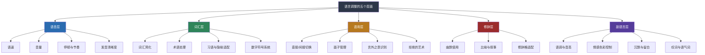

语言是跨文化沟通中最直接的载体，也是误解产生的第一现场。同一个意思，用不同的词汇、语速、句式、修辞去表达，可能在不同文化背景的听众心中引发截然不同的理解。语言调整策略的核心目标不是让你变成另一个人，而是让你的信息以对方最容易接受和正确理解的方式传递出去。

语言调整涵盖五个层面：



每个层面都需要根据沟通对象的文化背景进行针对性调整。下面按照从物理层到抽象层的顺序逐一展开。

## 一、语音与节奏调整

语音是语言的物理载体。在跨文化场景中，语音层面的调整是降低理解门槛的第一步，也是最容易立即见效的一步。

### 1.1 语速控制的分层模型

语速是语言可理解性的第一道门槛。研究表明，英语母语者的日常语速约为每分钟130-150个单词，而商务演讲通常在100-120个单词/分钟。中文普通话的正常语速约为每分钟200-250个字，日语约为每分钟200-280个音节。当沟通对象是非母语者时，需要根据对方的语言水平做分层调整。

**语速调整的三层模型：**

| 对象语言水平 | 语速建议 | 适用场景 | 配套策略 |
|:---|:---|:---|:---|
| 初级（A1-A2） | 比正常慢40-50% | 简单事务沟通、日常指令 | 配合手势、图片、实物指认 |
| 中级（B1-B2） | 比正常慢20-30% | 商务会议、项目讨论 | 关键信息处放慢并停顿，使用短句 |
| 高级（C1-C2） | 接近正常语速 | 专业交流、高层对话 | 避免极快的口语连读和方言俚语 |

**具体操作技巧：**

- **关键词加重法**：在表达核心信息时，将关键词的语速放慢并略微加重语气。例如"This is the **dead**line"比快速滑过"deadline"更容易被非母语者捕捉到。中文中同样适用——"这个**截**止日期是周五"比快速带过更有效。
- **句间停顿法**：每说完一个完整意思后停顿1-2秒，给对方处理语言的时间。这比整段放慢语速更自然，也不会让对方感到你在"居高临下"。停顿的位置应该在语义边界处——主语和谓语之间、从句之间、列举项之间。
- **避免连读吞音**：英语中的连读（如"want to"→"wanna"、"going to"→"gonna"、"kind of"→"kinda"）对非母语者极不友好。在正式跨文化场合，尽量使用完整发音。中文的语流音变（如"一"的变调、儿化音）在对外沟通中也应适当减少。
- **信息重复策略**：重要数字、日期、名称等信息，至少重复一次，第二次可以用不同句式表达同一意思。例如："The deadline is March 20th — that's three weeks from today."

**常见误区：**

- ❌ 把语速放得极慢，逐字蹦出——会让对方感觉被当作小孩对待，也破坏了语言的自然韵律
- ❌ 音量同步放大——慢不等于大声，大声说话在许多文化中具有攻击性含义
- ❌ 全程保持同一慢速——对方可能因此低估自己的语言能力，从而降低信任度
- ✅ 保持自然音量，适当放慢节奏，在关键节点用停顿制造"理解缓冲区"
- ✅ 观察对方反应实时调整——如果对方频繁点头但眼神空洞，说明语速可能仍然过快

### 1.2 音量与空间距离的文化规范

音量不仅是物理现象，更是文化信号。不同文化对"合适的音量"有截然不同的标准。

**音量文化光谱：**

| 文化区域 | 典型音量偏好 | 背后逻辑 | 调整建议 |
|:---|:---|:---|:---|
| 地中海文化（意大利、西班牙、阿拉伯） | 较大 | 热情、投入、重视的表现 | 对方可接受较大音量，但注意不要被误读为愤怒 |
| 东亚文化（日本、韩国、中国部分地区） | 较小 | 含蓄、尊重、不打扰他人 | 控制音量，尤其在公共场合 |
| 北欧文化（芬兰、瑞典、挪威） | 较小 | 私人空间的延伸，安静是美德 | 说话声音过大会被视为粗鲁 |
| 美国 | 中等偏大 | 开放、自信、友好 | 适度即可，但注意不要压过对方 |
| 印度 | 中等偏大 | 充满活力的沟通风格 | 在正式场合适当收敛 |

**空间距离与音量的联动：**

人类学家Edward T. Hall提出的proxemics（空间距离学）理论指出，不同文化对人际距离有不同规范。音量需要与距离匹配：

- **亲密距离（0-45cm）**：低音量、耳语级别——仅限亲密关系
- **个人距离（45-120cm）**：正常音量——日常社交
- **社交距离（1.2-3.6m）**：适当提高音量——商务场合
- **公共距离（3.6m以上）**：需要投射声音——演讲、会议

在跨文化商务场合中，观察对方自然保持的距离并相应调整，比坚持自己的习惯更重要。

### 1.3 语音清晰度系统训练

跨文化场景中，发音的清晰度比口音更重要。对方不需要你说"标准"的某种语言，但需要每个词都能被清楚地区分出来。研究显示，语音清晰度对理解度的影响是口音的3-5倍。

**提升语音清晰度的四维训练法：**

1. **元音饱满化**：很多语言使用者习惯弱化非重读音节的元音（如英语中的schwa音/ə/），跨文化沟通时应有意识地将每个音节的元音发清楚。练习方法：朗读时夸张地发出每个元音，然后逐步回归自然。
2. **辅音归位**：词尾辅音（如/t/、/d/、/k/、/p/）要发完整，不要吞掉。中文母语者说英语时特别容易吞掉词尾辅音（如把"world"说成"worl"），这会严重影响可理解性。
3. **节奏感训练**：每种语言都有自己的节奏模式（stress-timed如英语，syllable-timed如法语，mora-timed如日语）。保持稳定的节奏比模仿地道口音更有效。可以用拍手打节拍的方式练习。
4. **语调轮廓训练**：不同语言使用语调的方式不同。英语用语调传递态度和信息结构（升调表疑问、降调表肯定），中文用声调区分字义。跨文化沟通中，语调的过度平坦会让听者觉得你在"念稿"，而语调过于夸张可能传递错误的情感信号。

**语音清晰度自检清单：**

- [ ] 录音回听：能否听清自己说的每一个词？
- [ ] 非母语者测试：请一位语言水平B1的朋友听你的发言，确认理解率
- [ ] 关键词可辨识度：数字、日期、专有名词是否能被准确复述？
- [ ] 语速一致性：是否越说越快？是否在紧张时语速失控？

### 1.4 停顿的艺术：沉默不是空白

停顿在跨文化沟通中是一个被严重低估的工具。它不只是"不说话"，而是一种有信息含量的沟通行为。

**停顿的四种功能：**

| 功能 | 使用方法 | 适用场景 |
|:---|:---|:---|
| 理解缓冲 | 在重要信息后停顿2-3秒 | 向非母语者传达复杂信息 |
| 强调效果 | 在关键词前短暂停顿0.5-1秒 | 演讲、汇报、说服性沟通 |
| 礼貌等待 | 给对方留出思考和回应的时间 | 与高语境文化沟通时 |
| 情绪管理 | 在情绪激动时主动停顿 | 冲突场景、敏感话题 |

**不同文化对沉默的态度差异：**

| 文化 | 沉默含义 | 持续时间容忍度 | 应对建议 |
|:---|:---|:---|:---|
| 日本 | 思考、尊重、不同意 | 高（可超过30秒） | 不要急于填补沉默，给对方空间 |
| 芬兰 | 正常、舒适 | 高 | 沉默不代表对话结束 |
| 美国 | 不适、尴尬 | 低（超过5秒即感不适） | 可以用过渡句连接 |
| 巴西 | 异常、不满 | 低 | 注意观察是否需要化解 |
| 中国 | 思考、委婉拒绝 | 中等 | 结合上下文判断沉默含义 |

## 二、词汇选择与表达优化

### 2.1 词汇金字塔原则

跨文化沟通中的词汇选择遵循"金字塔原则"：底层是所有人都能理解的基础词汇，顶层是只有专业人士才懂的术语。你的目标是尽量站在金字塔的下层说话。


**词汇替换对照表：**

| 复杂/文化特定表达 | 简化/通用表达 | 替换理由 |
|:---|:---|:---|
| "我们需要把球踢给他们" | "我们需要等对方回复" | 体育隐喻文化依赖性高 |
| "这个方案可行" | "这个方案可以成功实施" | "可行"在某些语境下含义模糊 |
| "让我们开诚布公地谈谈" | "让我们直接说真实的想法" | 成语对非母语者是理解障碍 |
| "像关公一样忠诚" | "非常忠诚、值得信赖" | 文化典故无法跨文化传递 |
| "这个KPI需要ASAP完成" | "这个指标需要尽快完成" | 避免不必要的英文缩写 |
| "我们来brainstorm一下" | "我们一起自由讨论想法" | 混用语言增加理解负担 |
| "这个项目是我们的旗舰" | "这个项目是我们的核心/最重要项目" | "旗舰"隐喻需要海军文化背景 |
| "他们给我们设了一个很高的bar" | "他们设定了很高的标准" | 中英混杂阻碍理解 |

**专业术语的处理三步法：**

当必须使用专业术语时，遵循"定义-举例-确认"三步法：

1. **定义**：用简单语言解释术语的含义——不超过一句话
2. **举例**：用具体场景说明术语在实际中指什么——越贴近对方经验越好
3. **确认**：询问对方是否理解，或者请对方用自己的话复述

例如，在向非IT背景的跨文化团队解释"API"时：

> "API是一种让不同软件系统互相交流的接口（定义）。就像餐厅的菜单——你不需要知道厨房怎么做菜，只需要通过菜单点菜，厨房就会做好送来（举例）。这样说清楚了吗？（确认）"

**术语管理的进阶做法——建立团队术语库：**

在长期跨文化协作中，建立一个共享的多语言术语库是提升效率的关键投资：

| 字段 | 说明 | 示例 |
|:---|:---|:---|
| 英文术语 | 标准英文表述 | API (Application Programming Interface) |
| 中文对应 | 标准中文翻译 | 应用程序接口 |
| 日文对应 | 标准日文翻译 | アプリケーション・プログラミング・インタフェース |
| 简单定义 | 一句话解释 | 让不同软件系统互相交流的接口 |
| 使用场景 | 在什么语境下使用 | 技术方案讨论、接口设计文档 |
| 避免的表达 | 常见误译或不推荐的用法 | 不要说"API接口"（重复） |

### 2.2 习语与隐喻的跨文化适配

习语和隐喻是语言中最富文化色彩的部分，也是跨文化误解的重灾区。一个在源文化中生动形象的比喻，在目标文化中可能完全无法引发联想，甚至引发负面联想。

**高风险隐喻类型及处理方式：**

| 隐喻类型 | 示例 | 风险等级 | 处理方式 |
|:---|:---|:---|:---|
| 体育隐喻 | "打出全垒打"、"越位"、"临门一脚" | ★★★★ 高 | 改用通用表达"取得重大成功"、"违反规则"、"最后的关键步骤" |
| 军事隐喻 | "攻坚战"、"打游击"、"背水一战" | ★★★★ 高 | 可能在有战争创伤的文化中引起不适，改用"解决困难问题"、"灵活应对"、"全力以赴" |
| 宗教隐喻 | "功德圆满"、"十字架"、"因果报应" | ★★★★★ 极高 | 不同宗教背景理解差异大，改用世俗化表达 |
| 饮食隐喻 | "小菜一碟"、"半斤八两"、"吃老本" | ★★★ 中等 | 度量衡和饮食习惯差异，改用"非常容易"、"不相上下" |
| 历史典故 | "三个臭皮匠"、"卧薪尝胆"、"破釜沉舟" | ★★★★ 高 | 非本国文化背景无法理解，直接表达核心含义 |
| 动物隐喻 | "对牛弹琴"、"亡羊补牢" | ★★★ 中等 | 动物在不同文化中的象征意义差异大 |

**安全隐喻的三个特征：**

1. **基于普遍人类经验**：天气、自然、身体感受——"暴风雨般的掌声"、"站在十字路口"
2. **在多种文化中有类似对应**：如"上"代表积极、"下"代表消极——"提升质量"、"降低成本"在全球多数文化中都能理解
3. **不涉及特定文化符号或价值观判断**：避免需要特定历史、宗教或社会知识才能理解的比喻

**隐喻安全检测流程：**

在使用一个隐喻之前，问自己三个问题：
1. 这个隐喻是否依赖特定文化背景知识？（如果是→替换）
2. 这个隐喻在目标文化中是否有负面联想？（如果有→替换）
3. 把这个隐喻翻译成目标语言后，是否还能保留原意？（如果不能→替换）

### 2.3 数字与符号系统的跨文化处理

数字和符号表达看似客观，但在跨文化场景中暗藏陷阱。这些差异看起来微小，但错误可能造成严重的合同纠纷或技术事故。

**需要注意的核心差异：**

| 维度 | 体系A | 体系B | 安全做法 |
|:---|:---|:---|:---|
| 小数点 | 英语用"."（1,234.56） | 德语/法语用","（1.234,56） | 使用空格分隔千分位（1 234.56）或文字说明 |
| 日期格式 | 美国：月/日/年（12/31/2025） | 欧洲：日/月/年（31/12/2025） | 使用ISO格式（2025-12-31）或文字月份 |
| 度量单位 | 美国：英里、华氏度、磅 | 其他国家：公里、摄氏度、千克 | 同时标注两种单位 |
| 大数单位 | 中文"万"和"亿" | 英语无对应词 | 明确写为"10,000"或"one billion" |
| 货币符号 | ¥ 可能指人民币或日元 | €/$/£ 等有明确归属 | 始终注明货币代码（CNY/JPY/USD） |
| 百分比表达 | "增长了30%" | 可能指百分点或百分比 | 明确写"从20%增长到50%"或"增长了30个百分点" |
| 电话号码格式 | 中国：1XX-XXXX-XXXX | 国际：+86 1XX XXXX XXXX | 使用国际格式并标注国家代码 |

**跨文化数字表达的黄金规则：**

1. 在任何正式文件中，数字首次出现时同时使用阿拉伯数字和文字（如"5（五）个工作日"）
2. 日期始终使用ISO 8601格式（YYYY-MM-DD）或写出月份全称
3. 涉及度量单位时，括号内标注对方使用的单位体系
4. 货币始终标注ISO代码（CNY、USD、EUR、JPY）
5. 大数使用阿拉伯数字而非文化特定单位（写"10,000"而非"1万"）

### 2.4 多语言混用与语码切换

在全球化团队中，语码切换（code-switching）——在同一对话中混合使用两种或多种语言——是一种常见现象。它既可以是效率工具，也可能是排除异己的手段。

**语码切换的三种类型：**

| 类型 | 描述 | 示例 | 风险 |
|:---|:---|:---|:---|
| 句间切换 | 在不同句子间切换语言 | "这个方案不行。Let's try another approach." | 语言能力不均的团队成员可能被排除 |
| 句内切换 | 在同一句子内嵌入另一种语言的词 | "这个feature的priority需要调整" | 增加理解负担，尤其对非双语者 |
| 话题切换 | 讨论不同话题时切换语言 | 技术用英语，闲聊用母语 | 可能在"英语"话题中遗漏重要信息 |

**语码切换的最佳实践：**

1. **先确认共识**：在混用语言之前，确认所有参与者都具备足够的双语能力
2. **术语可以混用，句子不要**：使用对方语言中的通用术语（如"deadline"在很多语言中通用）是可接受的，但完整句子切换应谨慎
3. **为不在场的人翻译**：如果有人可能听不懂某一语码，主动提供翻译或总结
4. **书面沟通保持单一语言**：邮件、文档、报告应使用所有读者都能理解的单一语言，术语可在括号内注明其他语言的对应

## 三、直接与间接表达的语用切换

### 3.1 高语境与低语境文化的表达差异

Edward T. Hall提出的高语境/低语境理论是理解跨文化表达风格差异的核心框架。这一理论不是非此即彼的分类，而是一个连续光谱——大多数文化处于中间偏某一方的位置。

**低语境文化（Low-Context）的沟通特征：**

- 信息主要通过语言本身传递，而非依赖语境
- 说话者负责确保信息被清楚传达——"如果我没说清楚，那是我的问题"
- 重视明确、直接、不含糊的表达
- 合同和书面文件具有核心地位
- 代表国家：德国、荷兰、美国（北方）、以色列、北欧国家、澳大利亚

**高语境文化（High-Context）的沟通特征：**

- 大量信息通过语境、关系、非语言信号传递
- 听话者负责"读懂"言外之意——"你应该能听出来"
- 重视含蓄、委婉、维护和谐
- 口头承诺和关系比书面合同更重要
- 代表国家：日本、中国、韩国、泰国、阿拉伯国家、拉丁美洲

**表达风格切换对照：**

| 沟通场景 | 低语境表达 | 高语境表达 |
|:---|:---|:---|
| 拒绝请求 | "不，我们无法在那个日期前完成" | "那个日期可能有些困难，我们再看看其他安排" |
| 提出异议 | "我不同意这个方案，因为成本太高" | "这个方案很有创意，关于成本方面也许可以再优化一下" |
| 给出负面反馈 | "这份报告有三处数据错误，需要修改" | "报告整体框架很好，如果数据部分能再核实一下就更完善了" |
| 表达紧迫性 | "这个必须今天完成" | "如果今天能完成的话就太好了" |
| 请求帮助 | "我需要你帮我做这个" | "不知道你最近方不方便，有个事情想请教一下" |
| 表达不满 | "这个交付质量不达标" | "我们在质量方面还有提升空间" |
| 讨价还价 | "你的价格太高了，我们最多出50万" | "50万是一个我们可以认真考虑的数字" |

**如何判断当前对方的文化位置：**

在实际沟通中，不能仅凭国籍判断——同一个人在不同场合、不同关系中可能表现出不同的语境偏好。以下是实用的判断线索：

1. **观察对方的邮件风格**：短句、要点罗列→低语境；长段落、铺垫多→高语境
2. **注意对方如何表达不同意见**：直接说"我不同意"→低语境；先肯定再转折→高语境
3. **关注书面vs口头的权重**：强调"写下来"→低语境；重视"我们说好的"→高语境
4. **留意对方对沉默的反应**：急于填补沉默→可能偏低语境；从容等待→可能偏高语境

### 3.2 三明治表达法的进阶应用

三明治表达法（肯定-建议-鼓励）在跨文化场景中需要根据文化背景做深度调整，而不仅仅是翻译内容。

**基础版（适用于大多数文化）：**

1. **肯定层**：真诚地指出对方做得好的地方——不是泛泛的"很好"，而是具体的"你在数据分析部分的处理非常扎实"
2. **建议层**：用"如果……可能会更好"的句式提出改进点——聚焦于事情本身，而非人的能力
3. **鼓励层**：表达对改进的信心或对未来的积极期待

**进阶应用——根据文化背景调整"厚度"和"质地"：**

**对低语境文化（德国、荷兰、北欧）：**

肯定层和鼓励层可以薄一些，建议层要具体、直接、有数据支撑。过多的铺垫会让对方觉得你在浪费时间，甚至认为你不真诚。

> "The analysis is thorough. However, the cost projection in section 3 uses outdated rates — please update with 2025 figures. The rest is solid."
>
> （分析很扎实。但第三部分的成本预测用的是旧费率，请更新为2025年数据。其余部分没问题。）

特点：肯定只用一句话，建议直指问题，鼓励只用一句收尾。对方会觉得你尊重他的时间和智力。

**对高语境文化（日本、中国、韩国）：**

肯定层要厚一些且具体，建议层要委婉，给对方留足"面子"。可以用疑问句代替陈述句来提建议，用"我们"代替"你"来降低指向性。

> "这次的分析非常全面，投入了很多心血，特别是市场趋势的把握非常准确。第三部分的成本预测如果能用最新的数据再验证一下，我相信整个方案会更加有说服力。整体方向是非常好的，我对这个项目充满信心。"

特点：肯定占据更多篇幅，建议用假设句式（"如果能……"），鼓励层延伸到对人和项目的信任。

**对阿拉伯文化/拉丁文化：**

肯定层要真诚且有温度，建议层最好在私下场合提出，避免在公开场合让人感到难堪。关系的维护优先于问题的解决。

> "兄弟，你的分析真的让我印象深刻，特别是你对市场的理解。有个小建议，我们私下聊聊——成本那块用最新的数据可能会更有说服力。你做出来的东西我一直都很放心。"

特点：称呼亲近化，建议私密化，信任感贯穿始终。

### 3.3 "不"的跨文化表达艺术

"拒绝"是跨文化沟通中最敏感的行为之一。不同文化对"不"的表达和接受方式差异巨大。理解这些差异不仅帮助你正确地说"不"，也帮助你正确地听懂别人的"不"。

**"不"的文化光谱：**

| 文化 | 直接说"不"的接受度 | 典型拒绝方式 | 背后逻辑 |
|:---|:---|:---|:---|
| 荷兰/德国 | 非常高 | "Das geht nicht"（这不行） | 效率优先，直接节省双方时间 |
| 以色列 | 非常高 | " אי אפשר"（不可能） | 直率被视为真诚和信任 |
| 美国 | 中等偏高 | "I don't think that works for us" | 直接但带缓冲词 |
| 中国 | 低 | "我们再研究研究"、"可能有些困难" | 维护关系和面子是核心 |
| 韩国 | 低 | "어렵다"（困难）、长时间不回复 | 避免让对方丢面子 |
| 日本 | 很低 | 沉默、"ちょっと..."、转移话题 | 避免正面冲突是美德 |
| 泰国 | 极低 | 微笑、"可能"、不断拖延 | 和谐高于一切 |
| 巴西 | 低 | "Vamos ver"（我们看看）、"É complicado"（这很复杂） | 保持关系的开放性 |

**读懂高语境文化中的"不"——信号识别清单：**

| 你听到的话 | 可能的真实含义 | 建议应对 |
|:---|:---|:---|
| "我们再研究研究" | 大概率是不行 | 不要追问结果，换个方案再提 |
| "这个很有意思" | 可能是婉拒 | 追问"您觉得在哪些方面可以落地？" |
| "可能有些困难" | 基本就是不行 | 理解为拒绝，提出替代方案 |
| "原则上同意" | 但细节上有很多问题 | 立即跟进细节讨论 |
| 长时间不回复 | 消极拒绝 | 一次温和跟进后不再追问 |
| "这个需要领导批准" | 转移决策责任 | 了解真正的决策链 |
| 微笑+沉默 | 不同意但不想说出来 | 主动给对方台阶，换个话题 |

**跨文化拒绝的实用模板：**

**当你需要拒绝来自高语境文化的人时：**

- ✅ "这个想法很有价值，我们可以看看在什么条件下能够实现"（留有余地）
- ✅ "目前的资源/时间框架下可能有些挑战"（归因于客观条件）
- ✅ "我个人非常认同，但团队目前的优先级可能需要调整"（转移决策主体）
- ❌ "不行，我们做不了"（过于直接，可能被理解为不尊重）
- ❌ "这个太离谱了"（否定对方的想法等于否定对方）

**当你需要拒绝来自低语境文化的人时：**

- ✅ "经过评估，我们决定不推进这个方案，原因是A、B、C……"（直接且给出理由）
- ✅ "这个不在我们的计划范围内"（清晰划定边界）
- ❌ "嗯，这个嘛，我们再看看……"（对方会认为你已经同意了）
- ❌ "原则上同意"（对方会理解为完全同意并立即推进）

### 3.4 面子管理的语用策略

"面子"（face）是跨文化语用学的核心概念。Erving Goffman提出的面子理论在不同文化中有不同的表现形式，但其核心是相通的：每个人都希望被正面看待（positive face）和不被侵犯自主权（negative face）。

**面子威胁行为（Face-Threatening Acts, FTAs）的跨文化处理：**

| 面子威胁行为 | 低语境文化的缓解策略 | 高语境文化的缓解策略 |
|:---|:---|:---|
| 批评 | 对事不对人，提供改进建议 | 私下沟通，先肯定再暗示，用"我们"代替"你" |
| 拒绝 | 直接但给出理由 | 委婉归因于客观条件，给出台阶 |
| 要求 | 清晰说明需求和原因 | 先铺垫背景，再暗示需求，留出拒绝空间 |
| 纠正错误 | "Actually, the correct figure is..." | "关于这个数据，我看到另一个版本，可能是我的信息有误……" |
| 追问进度 | "What's the status?" | "最近工作辛苦了，项目方面有什么我能帮忙的吗？" |

## 四、副语言通道：语调、情感与沉默

语言沟通不仅包括"说了什么"（内容），还包括"怎么说的"（副语言）。在跨文化场景中，副语言信号的误读往往比内容本身的误读更危险——因为它直接影响信任和情感关系。

### 4.1 语调与音高的文化编码

语调（intonation）和音高（pitch）在不同文化中承载着不同的信息。

**语调模式的文化差异：**

| 语言/文化 | 语调特征 | 常见误读 |
|:---|:---|:---|
| 英语（美式） | 句末上升（uptalk）在年轻人中常见 | 被误读为不自信或在寻求确认 |
| 英语（英式） | 高低起伏大，讽刺时语调反转 | 非英国人难以区分讽刺和真诚 |
| 中文（普通话） | 声调区分字义，语调传递态度 | 外国人可能只听到"声调"而忽略"态度" |
| 日语 | 敬语体系影响语调，礼貌程度与音高相关 | 音高变化可能被误读为情绪波动 |
| 法语 | 语调优雅、节奏分明 | 可能被误读为傲慢或冷淡 |
| 葡萄牙语（巴西） | 语调热情、音高范围大 | 可能被误读为过于激动或不专业 |
| 韩语 | 尊敬语影响语调，句末语气词丰富 | 不同语气词传递不同态度，非母语者难以把握 |

**跨文化语调调整原则：**

1. **降低语调的戏剧性**：在不确定对方文化规范时，保持中等范围的语调变化
2. **避免模仿对方口音**：这可能被视为嘲笑，除非你的模仿非常准确且对方理解你的善意
3. **用语调标记信息结构**：在重要信息前降低语调（引起注意），在次要信息上加快语调（传递"这部分不重要"）
4. **注意语调与内容的一致性**：友好的内容配上平淡的语调可能被理解为不真诚，严肃的内容配上轻松的语调可能被理解为不重视

### 4.2 情感表达的语言编码

不同文化对情感表达有截然不同的规范，这直接影响语言的选择。

**情感表达的文化光谱：**

| 情感 | 高表达文化 | 低表达文化 | 跨文化安全策略 |
|:---|:---|:---|:---|
| 兴奋 | 拉丁美洲、南欧："¡Increíble!" | 北欧、日本：微微点头 | 中等程度的正面表达 |
| 不满 | 法国、以色列：直接表达 | 日本、泰国：沉默或微笑 | 使用"我注意到……"而非"你总是……" |
| 同情 | 阿拉伯文化：高度共情 | 北欧文化：理性分析 | 先共情后分析的混合策略 |
| 感谢 | 美国：频繁、夸张（"Thank you so much!"） | 日本：含蓄、适度（"すみません"反而更常用） | 适度、真诚、具体 |

**情感词汇的翻译陷阱：**

同一个情感词在不同语言中的强度可能完全不同：

| 中文词 | 英文直译 | 实际强度差异 | 安全表达 |
|:---|:---|:---|:---|
| "生气" | angry | 中文"生气"的强度范围比英文angry宽得多 | 根据实际程度选择annoyed/frustrated/angry/furious |
| "不好意思" | sorry | 英文sorry暗示责任，中文"不好意思"只是礼貌 | 轻微场景用"excuse me"，真正道歉用"sorry" |
| "还可以" | OK | 中文"还可以"可能是相当好的意思 | 如果真觉得好，明确说"很好"而非"还可以" |

### 4.3 叹词与填充词的文化差异

叹词和填充词（如"嗯"、"uh"、"えーと"）在不同文化中有不同的功能和接受度。

| 语言 | 常见填充词 | 功能 | 跨文化注意事项 |
|:---|:---|:---|:---|
| 英语 | "well"、"you know"、"I mean" | 思考缓冲、语气缓和 | 过多使用会让非母语者困惑 |
| 中文 | "嗯"、"那个"、"就是说" | 思考、连接、确认 | 对外国人，"嗯"可能被理解为同意 |
| 日语 | "えーと"、"あの"、"まあ" | 思考、犹豫、铺垫 | "まあ"可能被理解为敷衍 |
| 韩语 | "음"、"그"、"뭐" | 思考、连接 | "뭐"有时被理解为不在乎 |
| 德语 | "also"、"ja"、"ähm" | 连接、确认、思考 | "ja"不一定是同意，可能只是填充 |

## 五、翻译与口译的实战策略

### 5.1 何时需要专业翻译/口译

**必须使用专业翻译/口译的场景：**

- 法律文件、合同、合规文件——一个词的误译可能导致数百万的损失
- 医疗诊断、治疗方案的沟通——涉及生命安全
- 政府/外交场合的正式会谈——涉及国家利益
- 涉及知识产权或专利的技术交流——法律效力依赖准确翻译
- 财务报告、审计结果的跨语言传达——监管合规要求
- 劳动合同、员工手册——涉及劳动者权益

**可以使用非专业辅助的场景：**

- 日常工作沟通、邮件往来
- 非正式的社交场合
- 简单的信息确认、日程安排
- 技术团队内部的日常交流（前提是有共同的技术词汇基础）

**绝对不要使用机器翻译的场景：**

- 任何涉及法律责任的文件
- 包含文化敏感内容的材料
- 需要精确传达情感和语气的信息
- 涉及谈判策略和底线的沟通
- 包含双关语、讽刺或隐喻的内容
- 需要维护机密性的商业文件（许多免费翻译工具会将输入数据用于训练）

### 5.2 口译模式的选择与配合

不同的口译模式适用于不同场景，配合方式也完全不同。

| 口译模式 | 工作方式 | 适用场景 | 配合要点 |
|:---|:---|:---|:---|
| 交替传译 | 说话者说完一段→口译员翻译 | 小型会议、商务谈判 | 每段控制在2-3分钟，停顿等翻译 |
| 同声传译 | 说话者边说→口译员同步翻译 | 大型会议、国际峰会 | 正常语速即可，提前提供讲稿 |
| 耳语传译 | 口译员在耳边低声翻译 | 只有1-2人需要翻译的混合会议 | 需要与口译员保持近距离 |
| 视译 | 口译员看着文件口译 | 文件审阅、合同讲解 | 提前发送文件，给口译员准备时间 |

**与口译人员协作的最佳实践：**

**会前准备（会前24-48小时）：**

1. 向翻译人员提供完整的背景资料：会议目的、参与人员名单和角色、关键议题、预期结果
2. 提供专业术语表和公司内部用语对照表——不要假设口译员知道你们的行话
3. 告知翻译人员哪些内容是敏感的，需要特别注意措辞
4. 如果有书面材料（PPT、报告），至少提前24小时发给翻译人员
5. 分享参会者的文化背景——好的口译员会据此调整翻译策略

**会中配合：**

- 说一段停一段，给口译人员留出翻译时间（同声传译除外）
- 语速保持稳定，不要越说越快——口译员的处理速度有上限
- 避免一次说太长的内容（建议每段不超过2-3分钟的讲话量）
- 注意观察口译人员的状态，如果对方示意需要暂停，配合等待
- 不要跳过口译人员直接与对方用非共同语言交流——这会让口译人员和对方都感到被边缘化
- 如果你在讲笑话，停顿等口译——否则笑点会丢失

**会后跟进：**

- 请翻译人员确认关键决策的翻译是否准确
- 对于重要决策，提供双语书面确认——口头翻译可能有细微偏差
- 给翻译人员反馈，帮助他们了解哪些地方的翻译效果好、哪些需要改进

### 5.3 语言桥接的实用技巧

当没有专业翻译人员可用时，以下技巧可以帮助你实现有效的语言桥接：

**复述确认法：**

当不确定对方是否理解时，请对方用自己的话复述关键信息。这不是质疑对方的理解能力，而是确认信息在跨语言传递过程中没有失真。

> "Just to make sure we're aligned, could you briefly summarize what we've agreed on?"
>
> "为了确认我们理解一致，能否请您简单总结一下我们达成的共识？"

**视觉辅助法：**

图表、流程图、演示文稿、白板草图可以弥补语言的不足。研究表明，视觉信息的跨文化可理解度比纯语言信息高60%以上。在跨文化会议中，始终准备视觉材料：

- 用流程图说明步骤和顺序——箭头和方框比文字更直观
- 用表格对比不同方案——减少语言描述的歧义
- 用图片和示意图代替文字描述——一图胜千言
- 用颜色编码区分重要程度——红色=紧急，绿色=安全，全球通用
- 用数据可视化代替数字罗列——柱状图比"增长了37%"更易理解

**关键词双语对照表：**

对于专业领域的跨文化沟通，提前准备关键词汇的双语对照表，并在会议开始前分享给所有参与者。这比在会议中不断停下来解释术语高效得多。

**分层表达法：**

同一信息用三种方式表达——先说结论，再说理由，最后举例。对方如果听懂了第一层就够了，需要更多理解时可以听第二层和第三层。


例如，传达项目延期消息：
- **第一层（结论）**："项目将延期5天，从3月15日推迟到3月20日。"
- **第二层（理由）**："测试阶段发现3个关键缺陷，修复需要5天。"
- **第三层（案例）**："具体来说，模块B的认证流程在边界条件下失败，需要重新设计验证逻辑……"

## 六、数字时代的语言调整

### 6.1 即时通讯的语言规则

在Teams、Slack、微信等即时通讯平台上，语言调整面临独特的挑战：缺乏语调和面部表情，信息密度高，响应期望因文化而异。

**IM沟通的文化差异：**

| 维度 | 低语境文化偏好 | 高语境文化偏好 |
|:---|:---|:---|
| 消息长度 | 短、要点式 | 较长、有铺垫和背景 |
| 响应时间期望 | 较快（几小时内） | 较灵活（关系好的可以隔天） |
| 表情符号使用 | 适度、功能性强（👍=确认） | 频率更高、情感功能更强 |
| 称呼方式 | 名字即可 | 职位+姓氏，尤其初始阶段 |
| 结束语 | 简洁（"Thanks"、"Best"） | 较长、有客套（"辛苦了，期待合作"） |
| 群聊中的发言 | 主动发言是积极参与 | 沉默可能是尊重或不同意 |

**跨文化IM沟通模板：**

发送消息前，用以下清单自检：

- [ ] 消息开头是否有适当的称呼或问候？
- [ ] 核心信息是否放在第一句？
- [ ] 是否避免了可能被误解为冷淡或愤怒的短句？
- [ ] 是否避免了可能被误解的缩写和俚语？
- [ ] 是否在需要对方行动时明确了截止时间？
- [ ] 是否避免了在对方的工作时间之外发送紧急消息？

### 6.2 邮件的跨文化规范

邮件是跨文化商务沟通的核心工具，不同文化对邮件的格式、语气、长度有截然不同的期望。

**邮件风格的文化对比：**

| 元素 | 德国/北欧风格 | 美国风格 | 中国/日本风格 | 阿拉伯风格 |
|:---|:---|:---|:---|:---|
| 开头 | 简洁正式 | 友好但直接 | 长段问候+铺垫 | 热情、个人化问候 |
| 正文 | 结构化、要点式 | 对话式、友好 | 委婉、层层递进 | 重视关系建立 |
| 结尾 | 简洁署名 | 温暖署名 | 谦逊、期待合作 | 祝福语+署名 |
| 长度 | 精简 | 适中 | 较长 | 视关系而定 |
| 跟进频率 | 按计划 | 适度主动 | 耐心等待 | 先建立关系再谈事 |

**跨文化邮件万能结构：**

主题行：[明确且信息完整的主题]

称呼：[根据对方文化选择正式/非正式]

第一段：问候 + 邮件目的（一句话）
  - 低语境文化：直接说目的
  - 高语境文化：先问候、感谢或提及上次交流

第二段：核心内容
  - 使用要点列表提高可读性
  - 重要信息用粗体标记
  - 数字和日期使用ISO格式

第三段：行动项
  - 明确谁需要做什么、截止时间
  - 提供对方需要的所有背景信息

结尾：
  - 低语境文化：简洁（Best regards）
  - 高语境文化：表达感谢和期待（感谢您的时间，期待继续合作）

署名：
  - 包含完整的联系方式
  - 如需跨文化，提供多语言版本的名字拼写

### 6.3 视频会议的语言调整

视频会议叠加了语言和视觉通道，为跨文化沟通增加了新的维度。

**视频会议中的语言调整清单：**

| 环节 | 调整要点 |
|:---|:---|
| 开场 | 等主持人开始，不要抢先发言——在许多文化中这是不礼貌的 |
| 自我介绍 | 简短清晰，说明你的角色和参会目的 |
| 发言 | 麦克风打开后先停顿0.5秒再说话，避免切入他人音频 |
| 语速 | 视频会议的音频质量通常不如面对面，应比正常再慢10% |
| 互动 | 直接点名邀请发言（"Hiroshi, what do you think?"）——在高语境文化中，不点名可能意味着永远等不到发言 |
| 沉默 | 不要急于填补沉默——给非母语者组织语言的时间 |
| 屏幕共享 | 用鼠标指针指示关键内容，减少纯语言描述 |
| 总结 | 每个议题结束后用一句话总结决定和行动项 |

## 七、认知负荷管理

### 7.1 理解跨文化沟通中的认知负荷

跨文化沟通对大脑的负荷远高于同文化沟通。听者需要同时处理：语言解码（听懂词汇和语法）→文化解码（理解言外之意）→情感监控（感知语气和态度）→回应构建（用对方能理解的方式表达）。这四层处理同时进行，消耗大量认知资源。

**认知负荷的来源：**

| 负荷类型 | 来源 | 表现 | 缓解策略 |
|:---|:---|:---|:---|
| 内在负荷 | 语言本身的难度 | 听不懂词汇、跟不上语速 | 降低语速、简化词汇、视觉辅助 |
| 外在负荷 | 沟通环境的复杂度 | 会议人数多、噪音、网络延迟 | 控制会议人数、使用好的设备 |
| 相关负荷 | 建立文化理解和连接 | 理解对方为什么这么说 | 提供文化背景、建立关系 |

### 7.2 降低认知负荷的实操策略

**信息结构化：**

- 在复杂讨论前先给出议程框架——让对方知道"现在在说什么，接下来要说什么"
- 使用数字标记要点（"有三个原因：第一……第二……第三……"）
- 每个话题结束后用一句话总结，然后过渡到下一个话题
- 在白板或共享文档上实时记录要点——视觉锚点减轻记忆负担

**节奏管理：**

- 每15-20分钟安排一个短暂休息或轻松环节——跨文化沟通比同文化沟通消耗更多能量
- 在关键信息后主动停顿——"这是最重要的一点" + 停顿 + 说出要点
- 不要在一个会议中覆盖太多议题——跨文化会议的有效议程容量比同文化会议少30-40%

**语言简化而不简化内容：**

| 复杂表达 | 简化表达 | 信息量是否变化 |
|:---|:---|:---|
| "鉴于当前的市场环境和内部资源约束" | "因为市场不好、资源有限" | 不变 |
| "我们有必要对现有方案进行系统性评估" | "我们需要重新评估方案" | 不变 |
| "从战略层面来看，这个举措具有里程碑意义" | "这对我们的战略很重要" | 不变 |

简化语言不是降低智商——它是在帮助对方把认知资源集中在你的思想上，而非浪费在解码你的措辞上。

## 八、幽默的跨文化使用策略

### 8.1 幽默在跨文化中的风险等级

幽默是沟通的润滑剂，但也是跨文化场景中最容易"翻车"的元素。不同文化对幽默的定义、边界和使用时机有根本性差异。

**幽默风险矩阵：**

| 幽默类型 | 风险等级 | 适用范围 | 说明 |
|:---|:---|:---|:---|
| 自嘲式幽默 | ★☆☆☆☆ 低 | 大多数文化 | 最安全的幽默类型，展示谦逊 |
| 情境幽默 | ★★☆☆☆ 较低 | 大多数文化 | 基于当下场景的轻松评论，不依赖文化知识 |
| 观察式幽默 | ★★☆☆☆ 较低 | 大多数文化 | 对共同经历的轻松评论（"今天的网络又在考验我们的耐心"） |
| 双关语/文字游戏 | ★★★☆☆ 中等 | 仅限同一语言高度熟练者 | 依赖语言能力，翻译后完全失效 |
| 讽刺/反语 | ★★★★☆ 高 | 仅限熟悉该文化的人 | 很多文化将讽刺理解为字面意思，造成严重误解 |
| 涉及宗教/政治/种族 | ★★★★★ 极高 | 绝对避免 | 跨文化场景中的雷区，一次失误可能永久破坏关系 |

**不同文化对幽默的态度差异：**

| 文化 | 幽默在商务中的角色 | 幽默风格 | 需要注意的底线 |
|:---|:---|:---|:---|
| 英国 | 核心社交元素 | 自嘲、讽刺、冷幽默 | 对非英国人来说难以区分讽刺和真诚 |
| 美国 | 破冰和关系建立工具 | 轻松、正面、夸张 | 避免涉及种族、性别、政治 |
| 德国 | 与工作明确分开 | 工作中很少使用幽默 | 过度使用幽默可能被视为不专业 |
| 日本 | 含蓄、存在但不主导 | 场合化的、不太个人化 | 避免让人感到被嘲笑 |
| 巴西 | 非常重要 | 热情、自嘲、社交性强 | 避免涉及政治分裂话题 |
| 中东 | 私人社交场合常见 | 热情好客、故事性强 | 宗教和政治话题绝对避免 |
| 北欧 | 适度使用 | 简洁、冷峻、低调 | 不喜欢"过度解释"的笑话 |
| 印度 | 社交润滑剂 | 故事性、情境性、语言游戏 | 避免涉及种姓、宗教冲突话题 |

### 8.2 安全使用幽默的五条黄金规则

1. **先建立关系，再使用幽默**：在你和对方建立起基本的信任和了解之前，保持正式和专业的态度。关系是幽默的前提。
2. **笑自己，不要笑别人**：自嘲是万能的安全牌——"我的中文还不够好，刚才那句话可能说了个笑话自己都不知道。"但拿别人开玩笑（即使是善意的）在跨文化场景中风险很高。
3. **观察和模仿，不要假设**：先观察对方文化中如何使用幽默，然后适度模仿，而不是假设"全世界都这样"。
4. **宁可不用，不要用错**：在不确定的情况下，不使用幽默永远不会出错，但用错了可能毁掉整个关系。
5. **及时止损**：如果一个幽默尝试没有引发预期的反应，不要解释或重复——自然地转移话题。

**幽默的时机选择矩阵：**

| 场合 | 是否适合使用幽默 | 建议 |
|:---|:---|:---|
| 初次见面/破冰 | 谨慎 | 可以用轻松的自我介绍，避免笑话 |
| 商务谈判 | 非常谨慎 | 仅在非正式间歇使用，谈判核心环节保持严肃 |
| 团队建设活动 | 适合 | 这是跨文化幽默的理想场合 |
| 正式演讲/报告 | 谨慎 | 开场可以用轻度幽默，主体部分保持专业 |
| 私人社交/餐叙 | 适合 | 但仍需注意话题边界 |
| 冲突/争议场合 | 绝对避免 | 幽默可能被解读为不重视对方的关切 |
| 文化交流活动 | 适合 | 自嘲式的文化差异观察是理想话题 |

### 8.3 当幽默失败时的补救策略

在跨文化场景中，幽默失败是常见且可以挽回的事情。关键是反应速度和态度。

**补救四步法：**

1. **承认尴尬，不要假装没发生**：一个简短的"That didn't land well, did it?"或"我刚才那个玩笑可能不太合适"比沉默或继续讲更好
2. **解释意图，不解释笑话**：说明你是想让气氛轻松一些，而不是试图重新解释那个笑话为什么"好笑"——解释笑话会把尴尬放大三倍
3. **迅速回到正题**：不要在失败的幽默上纠缠，自然地过渡回讨论内容——"Anyway, going back to the timeline..."
4. **事后反思**：分析为什么这个幽默在对方的文化中不奏效，记录到你的"文化语言档案"中，为下一次沟通积累经验

## 九、语言调整的自我训练体系

### 9.1 建立跨文化语言档案

为每种你经常沟通的文化建立一个"语言档案"，这是你跨文化沟通能力的基础设施。档案不是一次建成的，而是每次沟通后持续更新的。

```markdown
## 文化语言档案：[国家/文化]

### 基本沟通风格
- 直接/间接程度：[1-10分，10=最直接]
- 正式/非正式偏好：[1-10分，10=最正式]
- 情感表达丰富度：[1-10分，10=最外露]
- 沉默的含义：[舒适/不适/尊重/拒绝/思考]
- 时间观念：[严格守时/弹性时间/关系优先]

### 词汇与表达
- 常用敬语/称谓：
- 需要避免的话题/词汇：
- 安全的闲聊话题：
- 时间相关的表达习惯：
- 常见的委婉表达及真实含义：

### 幽默与修辞
- 幽默接受度：[高/中/低]
- 常见幽默类型：
- 禁忌话题：
- 是否接受自嘲：

### 数字与格式
- 日期格式：
- 数字分隔方式：
- 度量单位体系：
- 货币及书写格式：

### 实战经验记录
- [日期] 成功的沟通策略：
- [日期] 失败的教训及原因：
- [日期] 对方教我的文化知识：
```

### 9.2 系统化练习计划

| 练习项目 | 频率 | 具体方法 | 预期目标 |
|:---|:---|:---|:---|
| 录音回听 | 每周2次 | 录下自己的英语/外语发言，从语速、清晰度、填充词三个维度分析 | 提升语音可理解性 |
| 词汇简化练习 | 每天 | 选择一个复杂表达，尝试用三种不同方式表达同一意思，标注适用的文化场景 | 扩展表达多样性 |
| 文化观察 | 每天 | 观看目标文化的会议/演讲/访谈视频，记录一个沟通模式的新发现 | 积累文化敏感度 |
| 角色模拟 | 每周1次 | 模拟特定跨文化场景（如拒绝请求、给出负面反馈），练习语言调整 | 提升实战反应速度 |
| 反馈收集 | 每次沟通后 | 主动向跨文化沟通对象询问"我的表达方式清楚吗？有什么可以改进的？" | 获取真实改进方向 |
| 隐喻审计 | 每月 | 回顾过去一个月的沟通记录，标记可能有文化风险的隐喻和习语 | 降低无意中的文化冒犯 |

### 9.3 技术工具辅助

**语言调整工具矩阵：**

| 工具类别 | 推荐工具 | 用途 | 局限性 |
|:---|:---|:---|:---|
| 语气检查 | Grammarly、LanguageTool | 在书面沟通中检查语气是否适合目标文化 | 对非英语支持有限 |
| 机器翻译 | DeepL、Google Translate | 快速理解对方语言的大意 | 不能用于正式翻译，无法处理文化隐喻 |
| 语音转写 | Otter.ai、讯飞听见、飞书妙记 | 录音转文字，方便事后回听分析自己的表达方式 | 专业术语识别率不完美 |
| 语料查询 | COCA（英语）、BCCWJ（日语）、BCC（中文） | 查询某个表达在目标语言中的使用频率和搭配 | 需要一定的语言学基础 |
| AI写作辅助 | ChatGPT、Claude | 请AI帮忙调整语气和表达方式，使之适合特定文化 | 需要验证AI的建议是否准确 |
| 文化知识 | Hofstede Insights、Culture Map | 系统了解不同文化在各维度上的差异 | 模型是概括性的，个体差异大 |

**AI辅助语言调整的使用方法：**

AI工具在语言调整中可以发挥重要作用，但需要正确使用：

1. **邮件润色**：将草稿发给AI，说明目标文化，请求语气调整
2. **拒绝模板**：请AI生成适合特定文化的拒绝表达
3. **文化检查**：请AI审查你的表达中是否有文化敏感内容
4. **术语翻译**：请AI提供专业术语在不同语言中的准确对应
5. **模拟对话**：与AI模拟跨文化场景，练习应对策略

注意：AI的建议需要结合你对具体人和关系的了解来判断，不能盲目采纳。

## 十、综合案例：完整的跨文化语言调整过程

### 10.1 案例一：三方会议的语言调整

**场景**：你是一家中国公司的项目经理，需要与德国工程师团队和日本客户同时沟通一个技术方案的延期问题。

**第一步：受众分析**

| 受众 | 文化类型 | 沟通期望 | 风险点 |
|:---|:---|:---|:---|
| 德国工程师团队 | 低语境 | 直接、有数据、有方案 | 过于委婉会被认为不专业、浪费时间 |
| 日本客户 | 高语境 | 委婉、维护关系、重视质量 | 过于直接会被认为不尊重、破坏关系 |

**第二步：为德国团队调整语言**

> "We have a technical issue. The testing phase revealed three critical bugs in module B. Fixing them requires 5 additional days. I propose we extend the deadline from March 15 to March 20. Here's the detailed bug report and the revised timeline."
>
> （我们有一个技术问题。测试阶段发现模块B有三个关键缺陷。修复需要额外5天。我建议将截止日期从3月15日延长到3月20日。详细的缺陷报告和修订时间表在这里。）

分析：直接、有数据、有方案，不绕弯子。德国工程师会认为这是高效的沟通。

**第三步：为日本客户调整语言**

> "关于项目进度，我想要向您汇报一下最新的情况。在测试阶段，我们发现了一些技术上需要优化的地方，为了确保最终交付的质量能够达到贵公司的标准，我们团队希望在时间安排上做一些调整。具体来说，我们建议将交付日期调整到3月20日，以便有充分的时间进行质量把控。非常理解这对贵公司的计划可能带来的不便，我们愿意就任何影响提供全力的支持和配合。"

分析：先建立质量优先的共识，再引出延期，提供补救方案，表达歉意和配合意愿。日本客户会感受到被尊重和重视。

**第四步：三方同时在场的分层策略**

1. **第一层（所有人听）**："关于项目进度，有一个更新需要和大家同步。"——建立共同起点
2. **第二层（给德国团队）**：提供技术细节和数据，展示缺陷报告
3. **第三层（给日本客户）**：会后单独沟通延期的影响和补救方案，表达重视和歉意

### 10.2 案例二：跨文化邮件的改写

**原始邮件（中文思维直译英文）：**

> Subject: 关于项目
>
> Hi,
>
> 我们上次讨论的问题，领导觉得需要再考虑一下。可能有些困难，但我们再看看。希望你能理解。
>
> Best

**问题分析：**
- "领导觉得"——低语境文化不关心谁觉得，关心的是为什么
- "可能有些困难"——对美国人来说，这可能被理解为"可以做到但有点难"
- "再看看"——模糊，没有明确的下一步
- 整体过于委婉，低语境文化的读者会感到困惑

**改写后（针对美国受众）：**

> Subject: Project Update: Decision on Phase 2 Approach
>
> Hi [Name],
>
> Thank you for the proposal we discussed last week. After careful review, our team has decided to pause Phase 2 for now. Here's why:
>
> 1. Budget allocation for Q3 needs to be finalized first
> 2. We want to incorporate the learnings from Phase 1 before expanding
>
> Proposed next steps:
> - I'll share the Phase 1 analysis by Friday
> - Let's schedule a follow-up in 3 weeks to revisit the timeline
>
> Please let me know if you have questions in the meantime.
>
> Best regards

**改写后（针对日本受众）：**

> Subject: プロジェクトのご相談（关于项目的商量）
>
> [Name] 様
>
> 先週は貴重なお時間をいただき、ありがとうございました。ご提案について社内で慎重に検討いたしました。
>
> （上周感谢您抽出宝贵时间。关于您的提案，我们在公司内部进行了慎重的讨论。）
>
> 現在のタイミングでは、Phase 2の開始時期について、もう少し準備を進めさせていただくのが良いかと考えております。具体的には、Phase 1の成果を十分に分析した上で、より充実した計画を提案できればと考えています。
>
> （在目前这个时间点上，我们认为关于Phase 2的开始时间，最好再做一些准备。具体来说，我们希望在充分分析Phase 1的成果后，提出更加完善的计划。）
>
> 来月中に改めてご相談させていただければ幸いです。ご不明な点がございましたら、お気軽にお申し付けください。
>
> （如果能在下个月重新向您商量，我们将非常荣幸。如有任何疑问，请随时告知。）
>
> 何卒よろしくお願いいたします。

## 十一、常见误区与纠正

| 误区 | 为什么是错的 | 正确做法 |
|:---|:---|:---|
| "只要英语好就能跨文化沟通" | 语言能力≠文化能力，语法正确但语用错误同样造成严重误解 | 同时提升语言能力和文化敏感度 |
| "对所有人都用同一种表达方式" | 忽略文化差异等于把沟通效果交给运气 | 根据受众调整表达风格 |
| "放慢语速 = 大声说话" | 慢和大声是两个维度，大声可能造成压迫感和攻击性 | 控制语速的同时保持自然音量 |
| "幽默能拉近所有人的距离" | 不当幽默可能彻底破坏信任，尤其在高权力距离文化中 | 在了解对方文化之前保持正式 |
| "翻译软件已经够用了" | 机器翻译无法处理语气、文化隐喻和专业语境 | 重要场合使用专业翻译人员 |
| "对方没说'不'就是同意了" | 在高语境文化中，"可能"、"再看看"、沉默往往就是拒绝 | 学会识别高语境文化中的间接拒绝信号 |
| "我只需要学对方的语言就够了" | 学语言不等于学文化，语言能力可能掩盖文化盲点 | 语言学习与文化学习同步进行 |
| "语码切换显得很国际化" | 不恰当的语码切换可能排除团队成员，制造信息不对称 | 确认所有参与者都有能力理解后再切换 |
| "文字沟通不需要考虑语调" | 邮件和消息中缺乏语调信号，更容易引发误解 | 用措辞和格式弥补语调的缺失 |
| "越正式越安全" | 过度正式可能被理解为冷淡、不信任或距离感 | 根据关系阶段和文化规范选择适当的正式程度 |

## 十二、进阶：语言调整的元能力

### 12.1 元语言意识

元语言意识（metalinguistic awareness）是指对自己和他人语言使用方式的觉察能力。它是语言调整能力的底层基础。

**培养元语言意识的三个维度：**

1. **自我监控**：在沟通中保持一个"旁观者视角"，实时观察自己的用词、语速、语调
2. **对方感知**：敏锐捕捉对方的微反应——眉头微皱（可能没听懂）、身体前倾（感兴趣）、频繁看手机（失去注意力）
3. **模式识别**：在多次跨文化沟通后，识别自己的语言习惯和常见问题

### 12.2 从刻意调整到自然切换

语言调整能力的成长路径：


从阶段三到阶段四的跨越需要大量的实践积累。没有捷径，但有方法：每次跨文化沟通后花5分钟复盘——哪些表达有效、哪些需要改进、对方的真实反应是什么。

### 12.3 语言调整的伦理边界

语言调整不是操控或欺骗。以下边界不可逾越：

- **不歪曲事实**：调整表达方式不等于改变信息内容
- **不利用文化差异**：不利用对方对高语境/低语境的不熟悉来模糊承诺
- **不永久扮演**：语言调整是工具，不是面具——长期保持与真实自我不符的表达方式会造成心理疲劳
- **尊重对方的自主性**：调整是为了帮助理解，不是为了控制对方的判断

---

语言调整是一项需要长期积累的核心能力。它不是要你放弃自己的表达习惯，而是在保持真实的同时，增加一套"可切换"的表达模式。当你能够在不同文化背景的沟通对象之间自如切换表达风格时，你就掌握了跨文化沟通最有力的工具之一。记住，语言调整的最高境界不是让对方觉得你"很懂他们的文化"，而是让对方觉得"和你沟通很舒服"——这才是真正有效的跨文化语言能力。
