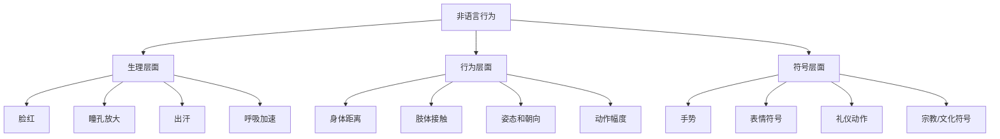
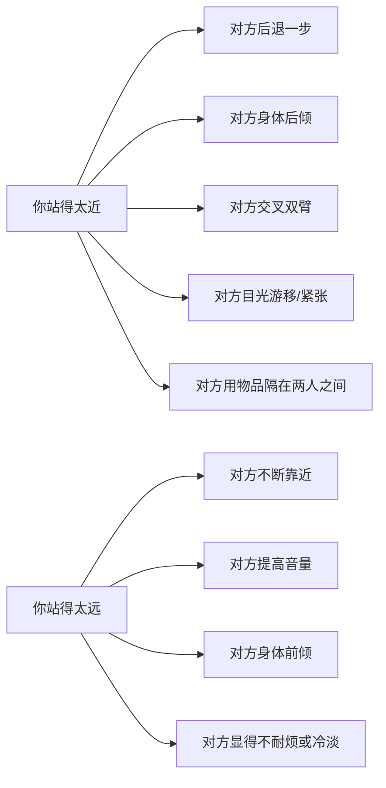
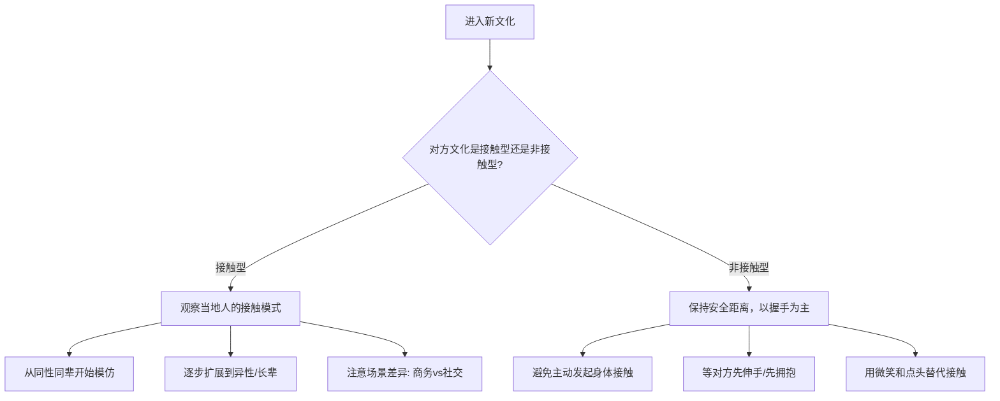
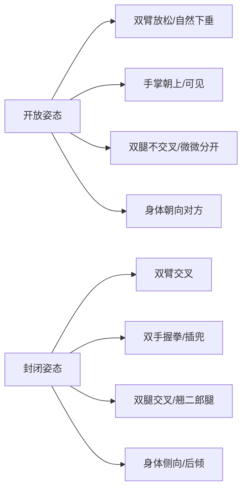
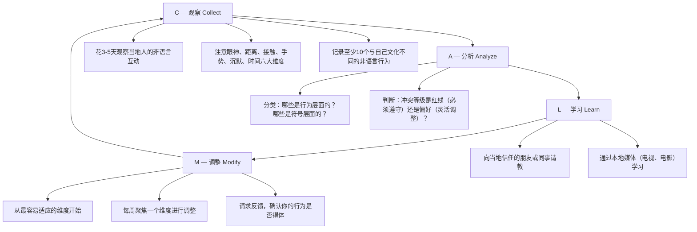
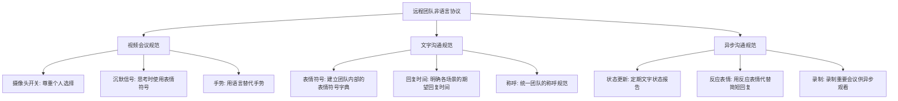
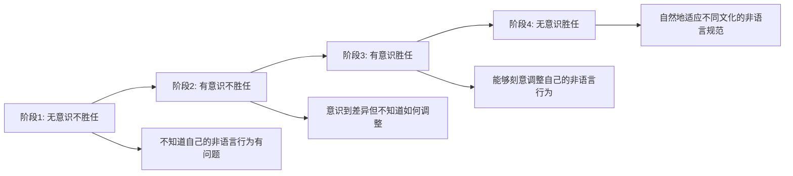

# 三、非语言行为适应

在跨文化沟通中，语言障碍通常是最先被注意到的，但实际上**非语言信号的文化差异**往往比语言差异更加隐蔽、更加危险——因为你甚至不知道自己正在犯错。一个在你的文化中表示友好的手势，可能在另一个文化中构成严重的侮辱；你习惯的交谈距离，可能让对方感到窒息或疏远。

本章将系统讲解八大非语言行为维度的文化差异、底层原理和实用适应策略，帮助你在任何文化环境中都能准确地发出和接收非语言信号。

---

## 3.1 非语言沟通的重要性与理论基础

### 3.1.1 为什么非语言信号比语言更重要

心理学家阿尔伯特·梅拉比安（Albert Mehrabian）在1967年的经典研究中发现，在情感和态度的传达中，信息的影响力分布如下：

| 信息类型 | 影响占比 | 对应英文术语 | 具体表现 |
|---------|---------|------------|---------|
| 语言内容 | 7% | Verbal | 你说的具体词语 |
| 语调语气 | 38% | Vocal | 音量、语速、语调、停顿 |
| 非语言信号 | 55% | Visual | 面部表情、肢体动作、身体距离、眼神 |

虽然这个7-38-55比例在不同情境下会有所变化（例如传递纯事实信息时语言内容的权重会升高），但它揭示了一个被多数人低估的事实：**当你说话时，对方真正在"听"的不只是你的词语，而是你的整个身体在"说什么"**。

更值得注意的是，2017年伊利诺伊大学的一项元分析研究（涵盖88项独立研究）进一步证实，当语言信息与非语言信息发生冲突时，接收者倾向于相信非语言信号。这意味着：**你说什么不重要，你的身体怎么说才重要**。

### 3.1.2 非语言信号的六大功能

非语言行为在沟通中并非随机出现，它承担着六种明确的功能：

1. **补充功能（Complementing）**：语言说"我很高兴"，同时微笑，两者互相强化。例如美国人在说"How are you?"时配合上扬的语调和微笑，三者共同传递友善意图。
2. **矛盾功能（Contradicting）**：语言说"我没事"，但双臂交叉、避开眼神——对方会相信非语言信号而非语言。在跨文化场景中，这种矛盾尤为致命，因为你可能不知道自己正在发送矛盾信号。
3. **替代功能（Substituting）**：不说话，只用点头或摇头来回应。在嘈杂环境中，手势和表情成为主要沟通渠道。在保加利亚，点头和摇头的含义与全球大多数文化恰好相反——点头表示"不"，摇头表示"是"。
4. **调节功能（Regulating）**：用眼神、停顿来控制对话节奏，决定谁该说话。美国人用降调和停顿表示"轮到你说了"，而日本人可能用更长的沉默来表达同样的意思。
5. **强调功能（Accenting）**：拍桌子强调重要性，用手指比划来标注"第一、第二、第三"。中东人在说话时手势幅度通常比北欧人大得多。
6. **泄露功能（Leaking）**：无意识地流露出真实情绪——紧张时搓手、说谎时摸鼻子、不适时调整坐姿。在跨文化场景中，你可能正在"泄露"你对自己文化之外环境的不安。

在跨文化场景中，**矛盾功能和泄露功能最容易出问题**。你用自己文化的非语言系统发出的信号，可能被对方用另一套系统解读，造成严重的误判。

### 3.1.3 非语言行为的三层结构

- **生理层面**：跨文化差异最小，因为它们是人类共有的生理反应。恐惧时瞳孔放大、紧张时出汗，这些反应全球一致。但**文化对生理反应的"表演规则"不同**——日本人在疼痛时可能表现得更加克制，而拉丁美洲人可能更外放地表达。
- **行为层面**：差异中等，受社会化过程影响，但可以通过意识调整。身体距离、肢体接触频率、动作幅度都属于这个层面。
- **符号层面**：差异最大，因为它们是文化约定俗成的，同一动作在不同文化中可能含义完全相反。手势、礼仪动作、宗教符号是典型代表。

理解这个三层结构有助于判断：哪些非语言差异是可以快速适应的（行为层面），哪些需要系统学习（符号层面），哪些是人之共性无需过度担忧（生理层面）。

### 3.1.4 非语言行为的文化维度模型

非语言行为的文化差异并非随机分布，它们与霍夫斯泰德（Hofstede）的文化维度理论高度关联：

| 文化维度 | 对非语言行为的影响 | 高分文化特征 | 低分文化特征 |
|---------|-----------------|------------|------------|
| 个人主义 vs. 集体主义 | 影响自我表达的方式 | 个人表情外放，眼神直视 | 情绪内敛，眼神回避权威 |
| 权力距离 | 影响对权威的非语言尊重 | 向上级鞠躬、避免直视 | 平等姿态，直视所有人 |
| 不确定性规避 | 影响对模糊非语言信号的容忍度 | 偏好明确、规范化的非语言规则 | 对非语言差异更宽容 |
| 男性化 vs. 女性化 | 影响情绪表达的强度 | 情绪表达内敛、含蓄 | 情绪表达丰富、外放 |
| 长期导向 | 影响时间观念 | 严格守时，长期规划 | 时间弹性，重视当下关系 |

理解这个模型可以帮助你**预测**一个你不熟悉的文化可能具有的非语言倾向，而不是死记每个国家的具体规则。

---

## 3.2 眼神接触：最微妙的权力与尊重信号

眼神接触是跨文化非语言差异中最常被提及、也最容易出错的维度。它直接关联着**权力关系、尊重表达和诚实判断**这三个核心社会议题。

### 3.2.1 文化光谱：从"凝视"到"回避"

| 文化区域 | 典型眼神规范 | 背后逻辑 | 代表国家/地区 |
|---------|------------|---------|-------------|
| 北美/西欧 | 持续直视 = 诚实、自信 | 眼神是"心灵的窗户"，直视表示坦诚 | 美国、英国、德国、法国 |
| 东亚 | 适度接触 + 适时移开 = 尊重 | 过度直视是挑战权威或侵犯隐私 | 中国、日本、韩国 |
| 南亚 | 依关系和地位而变化 | 低种姓/晚辈不直视高种姓/长辈是尊重 | 印度、斯里兰卡 |
| 中东 | 同性间直视强烈，异性间需谨慎 | 同性直视是信任，异性直视可能被视为调情 | 沙特、伊朗、阿联酋 |
| 非洲部分部落 | 避免直视长辈/权威 | 眼神服从 = 社会秩序的体现 | 尼日利亚、肯尼亚部分社区 |
| 拉丁美洲 | 直视较多，但含义因国而异 | 温暖的直视是热情的表达 | 巴西、墨西哥、阿根廷 |

### 3.2.2 眼神接触的三个关键变量

不仅是"看不看"的问题，还有三个变量决定着眼神信号的含义：

**（1）持续时间**
- 美国：3-5秒的直接眼神接触是"正常"的，之后自然移开再回来
- 日本：超过1-2秒可能被视为"盯着看"，令人不适。日本人在交谈时通常看对方的颈部、嘴巴或手中的物品
- 中东阿拉伯文化：同性之间可能持续10秒以上的直视，表示真诚和信任。在阿拉伯文化中，回避眼神反而会被视为不诚实
- 北欧（芬兰、瑞典）：眼神接触频率介于美国和日本之间，但持续时间更短

**（2）眼神方向**
- 在日本，看对方的**颈部**而非眼睛，被认为是得体的。许多日本人在交谈时会微微低头，视线落在对方下巴到胸部的区域
- 在英国，看对方的**嘴巴周围**区域也被视为正常的眼神接触，尤其是在仔细倾听时
- 在印度南部，看对方的**额头**区域可以表示尊重，尤其是在面对长辈或宗教领袖时
- 在韩国，下级看上级时视线应落在对方的**胸部区域**，而不是直接对视

**（3）谁看谁（权力维度）**
- 在几乎所有亚洲文化中，下级不直视上级是普遍规范。这种规范在韩国、泰国和印度尤为严格
- 在美国军队中，士兵需要直视长官的眼睛，表示坦诚和服从——与亚洲文化恰好相反
- 在许多非洲文化中，年轻人在与长辈交谈时应目光下垂，抬头直视被视为挑战权威
- 在拉丁美洲文化中，权力维度对眼神的影响相对较小，更看重人际亲密度

### 3.2.3 眼神接触的性别与年龄变量

除了文化区域差异，性别和年龄也是影响眼神规范的重要变量：

**性别维度：**
- 在沙特阿拉伯和伊朗等保守伊斯兰文化中，异性之间的直接眼神接触被视为不当甚至调情。男性应该在与不熟悉的女性交谈时略微移开视线
- 在日本，女性比男性更倾向于回避直接眼神接触，这被认为是女性气质的体现
- 在美国和北欧，性别对眼神接触的影响正在减小，但职场中年长男性对年轻女性的持续凝视在所有文化中都不被接受

**年龄维度：**
- 在中国和韩国，与年长者交谈时眼神应适度柔和，避免持续直视。这与"长幼有序"的儒家文化一致
- 在美国文化中，与长辈交谈时的直视规范与同龄人没有显著差异
- 在非洲多数文化中，年龄是决定眼神规范的最强变量——年轻人看长辈时必须表现出眼神上的谦逊

### 3.2.4 实用适应策略

**短期策略（即学即用）：**
1. 观察对方的眼神模式——他们是直视你还是偶尔移开？模仿对方的频率
2. 使用"三角区法则"：看对方双眼和鼻尖形成的三角区，比直视瞳孔更温和
3. 每10-15秒自然地将目光移到手中的文件、桌面或远处，再自然地回到对方
4. 当对方移开目光时，不要跟着追视——那会显得有攻击性
5. 在与多人交谈时，眼神应均匀分配给所有参与者，而不是只盯着说话者

**长期策略（深度适应）：**
1. 在进入新文化前，花30分钟坐在咖啡馆观察当地人之间的眼神互动
2. 注意两个维度：直视的持续时间和直视的对象（同辈 vs. 长辈 vs. 异性）
3. 从"模仿"到"内化"——初期刻意模仿当地规范，直到变成自然反应
4. 建立"眼神日记"——每天记录自己在跨文化互动中的眼神行为和对方的反应

**常见错误：**

| 错误行为 | 在自己的文化中 | 在对方的文化中可能被解读为 |
|---------|-------------|-------------------|
| 持续直视对方眼睛 | 自信、专注 | 挑衅、侵犯、不尊重（东亚/非洲） |
| 频繁回避眼神 | 谦虚、思考 | 不诚实、心虚、缺乏自信（北美/西欧） |
| 与异性长时间对视 | 无所谓 | 性暗示、不尊重（中东/南亚保守社区） |
| 与长辈直视 | 正常 | 傲慢、不守规矩（东亚/非洲） |
| 在视频会议中看屏幕而非摄像头 | 自然的观看习惯 | 不专注、不尊重对方 |

---

## 3.3 身体距离：人际空间学（Proxemics）

### 3.3.1 霍尔的四个人际距离带

人类学家爱德华·霍尔（Edward T. Hall）在1966年出版的《隐藏的维度》（The Hidden Dimension）中提出了人际空间学理论，将人与人之间的距离划分为四个区域：

| 距离带 | 距离范围 | 适用场景 | 非语言行为特征 |
|-------|---------|---------|-------------|
| 亲密距离（Intimate） | 0-45cm | 恋人、家人、密友 | 可以感受到对方的体温和呼吸，音量很低 |
| 个人距离（Personal） | 45-120cm | 朋友、熟人日常交谈 | 可以握手、拍肩，正常音量交谈 |
| 社交距离（Social） | 1.2-3.6米 | 商务会面、正式社交 | 需要提高音量，肢体接触受限 |
| 公共距离（Public） | 3.6米以上 | 演讲、授课、仪式 | 需要刻意放大动作和音量 |

**关键洞察**：霍尔的理论最初基于美国中产阶级的观察，但后续研究发现，不同文化对这四个距离带的划分**尺度完全不同**。一个阿拉伯人认为的"个人距离"可能只相当于美国人认为的"亲密距离"。

### 3.3.2 文化分类：接触型 vs. 非接触型

荷兰心理学家吉尔特·霍夫斯泰德（Geert Hofstede）和后续研究者发现，文化的个人空间偏好与该文化的**个人主义-集体主义维度**和**权力距离维度**高度相关：

**近距离文化（Contact Cultures）：**
- 阿拉伯文化：交谈距离可能只有20-30cm，说话时身体前倾，频繁有肢体接触。阿拉伯人在交谈时甚至会感受对方的呼吸，这在他们的文化中是信任的表达
- 拉丁美洲（巴西、阿根廷等）：朋友间交谈距离约30-50cm，拥抱和贴面是基本礼仪。拒绝身体接触被视为拒绝关系本身
- 南欧（意大利、西班牙、希腊）：交谈时会自然地靠近，手势幅度大。意大利人在激动时会自然地触碰对方的手臂或肩膀
- 南亚（印度、巴基斯坦）：同性朋友间可能手拉手走路，这在西方会被误解为恋爱关系

**远距离文化（Non-Contact Cultures）：**
- 北欧（芬兰、瑞典、挪威）：公共场合保持至少1米距离，排队时也保持间距。芬兰人甚至在公交车上会刻意选择与陌生人隔开的座位
- 日本：商务社交距离约1.2米，鞠躬代替握手，极少有身体接触。日本人在拥挤的地铁中会通过避免眼神接触来维护心理距离
- 北美：个人距离约60-120cm，商务场合约1.2米。美国人对"私人空间"的概念非常敏感
- 中国：城市商务场合趋近于北美标准，但亲友间距离较近。一线城市年轻一代的空间观念正在全球化影响下发生变化

### 3.3.3 距离失当的后果与信号识别

当你站得太近或太远时，对方会通过以下信号做出反应——学会读取这些信号至关重要：

**"用物品隔在两人之间"**是一个特别微妙的信号：对方可能将公文包、杯子、文件夹放在两人之间，这是一种不自觉的空间防御行为。如果你观察到这个信号，说明你已经站得太近了。

**适应法则：**
1. **"镜子法则"**：保持与对方相同的距离。如果对方靠近，你也可以靠近；如果对方后退，你也后退
2. **"试探法则"**：不确定时，从社交距离（1.2米）开始，根据对方反应逐步调整
3. **"场景法则"**：正式场合偏远，非正式场合可近；公共空间偏远，私密空间可近
4. **"性别法则"**：异性之间的距离通常比同性之间要大（尤其在保守文化中）

### 3.3.4 特殊场景的距离管理

**电梯困境：**
- 在近距离文化中，电梯里的人会自然交谈
- 在远距离文化中（如芬兰），电梯里的沉默和回避眼神是正常的，不要误解为不友好
- 在日本，电梯里的人会尽量面向门，避免与陌生人面对面——这是通过朝向来补偿物理距离不足的策略

**商务会议座次：**
- 中东和拉丁文化：面对面近距离就座，有助于建立信任
- 北欧和东亚文化：对角线或侧面就座更舒适，保持适当距离
- 日本会议：主位在离门最远的位置（上座/かみざ），地位最高者坐主位。这个座位安排反映了权力距离的文化逻辑
- 美国会议：通常以会议桌的中间位置为主位，或者以白板/屏幕的面向位置为上位

**餐桌社交：**
- 中国圆桌：距离由座位决定，大家距离中心菜盘等距，不存在"谁离谁更近"的问题
- 西方长桌：需要与左右邻座分别交谈，面对面的距离差异可能影响交流质量
- 日本矮桌：席地而坐时，距离由坐垫的位置决定，保持适当间距是礼貌的体现
- 阿拉伯传统宴会：可能围坐在地毯上共食，物理距离极近，这是亲密和信任的象征

### 3.3.5 空间适应的渐进策略

进入一个新的文化环境时，不要试图一次性改变自己的空间习惯。使用以下渐进策略：

1. **第1周**：保持社交距离（1.2米），观察当地人的空间模式
2. **第2-3周**：根据观察结果，每次互动时向当地标准靠近10-15cm
3. **第4周起**：基本适应当地空间规范，但仍然注意观察对方的微调信号
4. **持续校准**：注意城乡差异、代际差异和场景差异——同一种文化中，不同场景的空间规范可能不同

---

## 3.4 肢体接触：触觉的文化语法

### 3.4.1 接触频率的文化排序

心理学家西德尼·贾尔德（Sidney Jourard）在1966年的经典研究中，通过观察不同国家咖啡馆中的对话，统计了一小时内朋友间交谈的身体接触次数：

| 国家 | 每小时接触次数 | 接触特征 |
|-----|-------------|---------|
| 波多黎各 | 180+ | 频繁的拥抱、触碰手臂和肩膀 |
| 巴黎（法国） | 110+ | 面颊贴面、手臂触碰 |
| 佛罗里达（美国） | 2 | 偶尔的拍肩或手臂触碰 |
| 伦敦（英国） | 0 | 几乎无肢体接触 |

**注意**：这项研究年代较早，但其文化差异的排序至今基本成立。现代大城市的全球化趋势使得年轻一代的接触行为有所变化，但核心文化倾向仍然稳定。2015年海牙应用科技大学的复现研究发现，虽然绝对数字有所变化，但拉丁文化与盎格鲁-撒克逊文化之间的相对差距仍然显著。

### 3.4.2 常见接触行为的文化解读

**（1）握手**

| 文化区域 | 握手特征 | 注意事项 |
|---------|---------|---------|
| 北美 | 坚定有力，持续2-3秒 | 软弱无力的握手被视为缺乏自信 |
| 日本 | 轻柔短暂，常伴随鞠躬 | 用力握手被视为粗鲁 |
| 中东 | 同性间握手较长，可能不松手 | 异性间可能不握手——等对方先伸手 |
| 中国 | 力度适中，持续2-3秒 | 年轻人等长者先伸手 |
| 印度 | 同性间轻柔，异性间可能不握手 | 合十礼（Namaste）更常见 |
| 非洲部分国家 | 同性间可能持续握着不松开 | 这是信任和友好的表达，不要急于抽手 |

**握手的文化陷阱**：在国际商务场合，握手是最常见的问候方式，但力度、时长和附加动作的文化差异极大。一个美国人的"有力握手"可能让日本合作伙伴感到疼痛；一个日本人的"轻柔握手"可能被美国人解读为缺乏自信。

**（2）拥抱**
- **拉丁美洲**：男性朋友间的拥抱（abrazo）是标准问候方式，拒绝拥抱是拒绝友谊
- **美国**：朋友间拥抱逐渐普遍，但在商务场合仍以握手为主
- **东亚**：拥抱基本仅限于亲密关系或久别重逢，同事间的拥抱极不寻常
- **中东**：同性朋友间的拥抱很常见，但异性间严格禁止（在保守地区）
- **俄罗斯**：男性朋友间的拥抱（obnimashki）在亲密朋友圈中常见，但在商务场合不适用

**（3）亲吻（面颊礼）**
- **法国**：贴面礼（la bise）是标准问候，次数因地区不同（巴黎2次，马赛可能3-4次，科西嘉可能5次）。法国人自己都经常搞不清楚该贴几次
- **荷兰**：亲友间贴面礼3次（右-左-右），商务场合不适用
- **阿拉伯国家**：同性间可能有鼻碰鼻礼或面颊亲吻，但异性间可能完全不接触
- **东亚**：面颊礼几乎不存在，可能会让对方非常吃惊
- **阿根廷/智利**：贴面礼1次是标准问候，即使是初次见面的异性之间也是如此

### 3.4.3 肢体接触的红线

无论在哪个文化中，以下原则普遍适用：

1. **商务场合**：初次见面以对方文化中最保守的接触方式开始
2. **异性互动**：在保守文化中，等对方先发起接触，特别是男性对女性
3. **头部触碰**：在南亚和东南亚文化中，头部被视为身体最神圣的部位，绝对不要触碰他人的头部（包括小孩）。在泰国，即使是对可爱的小孩摸头也是严重的冒犯
4. **左手禁忌**：在许多穆斯林文化和印度文化中，左手被视为不洁，用左手递物或触碰是不礼貌的。在印度尼西亚、马来西亚和中东地区同样适用
5. **鞋/脚的禁忌**：在中东和东南亚，鞋底和脚底被认为是最脏的部位，不要用脚指人或指向物品。在泰国，用脚指向佛像是极其严重的冒犯
6. **背部触碰**：在美国，拍背表示鼓励；在东亚文化中，未经允许触碰他人背部可能被视为越界

### 3.4.4 接触适应的实用框架

---

## 3.5 手势：同一动作，千种含义

手势是非语言行为中**文化差异最大**的类别，因为它本质上是文化约定俗成的符号系统。同一个手势在不同文化中可能有完全相反的含义，而且这些差异往往是大多数人不知道的"知识盲区"。

### 3.5.1 高危手势对照表

| 手势 | 描述 | 在A文化的含义 | 在B文化的含义 | 冲突等级 |
|-----|------|-------------|-------------|---------|
| 竖大拇指 | 拇指朝上 | 美国/欧洲：好、赞 | 中东/西非：侮辱性手势（相当于竖中指） | 🔴 严重 |
| OK手势 | 拇指食指成圆 | 美国：好的/没问题 | 巴西：侮辱性手势；法国：零/没价值；土耳其：同性恋的暗示 | 🔴 严重 |
| 食指和中指V字（手背朝外） | V字但掌心朝向自己 | 美国：无所谓 | 英国/澳大利亚：极度侮辱（相当于竖中指） | 🔴 严重 |
| 召唤手势 | 手掌朝上，手指弯曲 | 西方：过来 | 菲律宾/日本：只用于召唤动物，对人使用极其不敬 | 🟠 高 |
| 左手递物 | 用左手递东西 | 西方：无所谓 | 印度/印尼/中东：不洁、不尊重 | 🟠 高 |
| 点头 | 上下点头 | 大多数文化：是/同意 | 保加利亚/希腊部分地区：不/不同意 | 🟡 中 |
| 摇头 | 左右摇头 | 大多数文化：不/拒绝 | 印度：表示理解/同意（头部摆动） | 🟡 中 |
| 触摸头顶 | 摸对方的头 | 西方：表示亲昵（对小孩） | 泰国/柬埔寨：严重的冒犯（头是神圣的） | 🔴 严重 |
| 用手指指人 | 食指指向他人 | 西方：强调或指引 | 东南亚/非洲：非常不礼貌，应用整只手掌指引 | 🟠 高 |
| 双臂交叉站立 | 双臂交叉于胸前 | 西方：放松或思考 | 芬兰/日本：不耐烦或对抗 | 🟡 中 |

### 3.5.2 手势误用的真实案例

- **案例1**：一位美国商人在巴西的会议上对合作伙伴的提案表示满意，竖起了大拇指。会议气氛瞬间冷却，后来他才了解到这个手势在巴西的含义——这次合作最终没有达成。事后分析显示，这个非语言信号被巴西合作伙伴解读为对提案的蔑视，而非赞同。
- **案例2**：一位英国游客在希腊村庄向当地人问路，用手指做了一个OK的手势表示感谢。当地人表情变得很不友好，因为这个手势在希腊的某些地区有侮辱含义。
- **案例3**：一位中国经理在印度出差时，习惯性地用左手递名片给印度同事。对方虽然接了名片，但明显感到不快——在印度文化中，左手与排泄相关，被视为不洁。
- **案例4**：一位德国项目经理在泰国团队会议上用食指指人来强调责任归属。泰国团队成员感到被当众羞辱，因为在东南亚文化中，用手指指人是非常粗鲁的行为。这个事件导致了团队信任的严重裂痕。
- **案例5**：一位美国游客在保加利亚点头表示"是"，结果被告知方向完全相反——在保加利亚部分地区，点头表示"不"，摇头表示"是"。

### 3.5.3 数字手势的文化差异

在国际商务中，用手指表示数字是最常见的手势陷阱之一：

| 数字 | 美国/欧洲 | 中国 | 日本 | 德国 |
|-----|---------|-----|-----|-----|
| 1 | 食指 | 大拇指 | 食指 | 大拇指 |
| 2 | 食指+中指 | 食指+中指 | 食指+中指 | 食指+中指 |
| 3 | 食指+中指+无名指 | 食指+中指+无名指 | 大拇指+食指+中指 | 大拇指+食指+中指 |
| 4 | 四指 | 食指+中指+无名指+小指 | 四指 | 四指 |
| 5 | 五指 | 五指 | 五指 | 五指 |
| 6 | 五指+食指 | 大拇指+小指 | 五指+食指 | 大拇指+小指 |
| 7 | 五指+食指+中指 | 大拇指+食指+中指 | 五指+食指+中指 | 大拇指+食指+中指 |
| 8 | 五指+三指 | 大拇指+食指 | 五指+三指 | 大拇指+食指+中指 |
| 9 | 五指+四指 | 食指弯曲如钩 | 五指+四指 | 食指弯曲如钩 |
| 10 | 两手各五指 | 双手交叉或握拳 | 两手各五指 | 两手各五指 |

在跨文化商务中，如果需要用手势表示数字，最好先了解对方文化的数字手势习惯，或者直接用文字写出来。

### 3.5.4 手势安全策略

**"手势禁区"法则**：在不确定的文化环境中，以下手势被广泛理解且极少有歧义：

1. **微笑** — 全球通用的正面信号（但在日本，微笑也可能表示尴尬或掩饰情绪，需要结合语境判断）
2. **轻柔的挥手（告别）** — 大多数文化中含义一致
3. **竖起食指表示"一"** — 数字手势中歧义较小（但注意：在中东用手指表示数字时，从食指开始；在中国从大拇指开始）
4. **双手合十** — 在南亚和东南亚是通用的尊重手势，也被其他文化普遍接受
5. **轻拍胸口** — 表示"我"或"真诚"，在大多数文化中含义一致

**"观察-模仿-验证"三步法**：
1. **观察**：在当地环境观察3-5天，看当地人如何使用手势
2. **模仿**：从模仿当地最常见的中性手势开始
3. **验证**：在信任的本地朋友面前使用新手势，确认含义无误

**"手势脱敏"训练**：如果你即将进入一个手势文化差异巨大的环境，可以通过以下方式提前准备：
- 观看当地电视节目和电影，注意角色的手势使用
- 查阅目标国家的"文化禁忌指南"（很多大使馆网站提供）
- 与来自目标文化的朋友进行角色扮演练习
- 准备一个"手势速查卡"，列出最常见的高危手势和安全替代方案

---

## 3.6 沉默的含义：最被误解的非语言信号

### 3.6.1 沉默文化的光谱

在跨文化沟通中，沉默可能是最被误解的非语言信号。在一个文化中表示尊重和深思的沉默，在另一个文化中可能被解读为不参与、不理解甚至敌意。

| 文化类型 | 对沉默的态度 | 沉默的常见含义 | 代表文化 |
|---------|------------|-------------|---------|
| 高语境沉默文化 | 沉默是沟通的一部分 | 尊重、思考、谦逊、不同意、不舒适 | 日本、芬兰、韩国、中国 |
| 低语境非沉默文化 | 沉默是沟通的中断 | 尴尬、不理解、不友好、缺乏参与 | 美国、巴西、意大利、以色列 |
| 混合型文化 | 视具体场景而定 | 因关系和场合而异 | 英国、德国、法国 |

**为什么文化对沉默的态度差异如此之大？**

这与高语境（High-Context）和低语境（Low-Context）文化的差异直接相关。爱德华·霍尔在《超越文化》中指出：
- **高语境文化**（日本、中国、韩国、芬兰）：大量信息通过环境、关系和非语言信号传递，语言只是冰山一角。沉默本身就是一种有意义的"语言"
- **低语境文化**（美国、德国、北欧部分地区）：信息主要通过明确的语言传递。沉默意味着信息传递的中断

### 3.6.2 沉默在不同场景中的含义

**商务谈判中的沉默：**
- **日本**：谈判对手沉默可能意味着他们正在内部讨论或认真考虑你的提案，这是正面信号。日本人有一句话叫"沈黙は金"（沉默是金），沉默被视为智慧的表现
- **美国**：谈判中的沉默通常被解读为对方在犹豫或不同意，美国人会倾向于用更多言语来填补。美国销售人员被训练要"打破沉默"
- **中国**：老练的中国谈判者会利用沉默作为策略工具，保持沉默以等待对方先让步。这与《孙子兵法》中"以静制动"的思想一脉相承
- **北欧**：沉默被视为理性的表现，不会因沉默而感到焦虑。芬兰人可以在朋友聚会上长时间沉默，这在他们看来是享受彼此陪伴的方式

**社交场合的沉默：**
- **芬兰**：芬兰人以"沉默文化"著称，朋友间一起坐着不说话是完全正常的，这是享受彼此陪伴的方式。芬兰有句谚语："如果你没有什么有意义的话要说，就不要说"
- **巴西**：社交场合的沉默通常意味着不舒适，主人会立刻想办法活跃气氛
- **日本**：茶道等传统仪式中，沉默是仪式本身的重要组成部分。茶道大师千利休提出"一期一会"的概念，沉默中的共同存在被视为珍贵的体验

**会议中的沉默：**
- **东亚文化**：会议中沉默通常不代表没有意见，而是需要时间消化信息或等待合适的时机表达。直接要求即时回答可能让人感到被强迫
- **西方文化**：会议中的沉默通常被解读为"没有异议"或"缺乏准备"，主持人会主动点名提问

### 3.6.3 沉默适应策略

**当你来自"非沉默文化"，面对沉默文化时：**
1. 不要急于用言语填补沉默——给对方思考的空间
2. 将沉默解读为"正在思考"而非"不同意"或"不感兴趣"
3. 如果你需要确认理解，可以用间接方式："您觉得这个方案如何？"而不是"您同意吗？"
4. 学会享受沉默——沉默中的共同存在本身就是一种连接
5. 在数字沟通中，不要因为对方回复慢就认为对方不感兴趣

**当你来自"沉默文化"，面对非沉默文化时：**
1. 如果需要时间思考，用语言标注："Let me think about this for a moment"（让我想一下）或"Give me a second to process this"
2. 不要将对方的快速回应理解为"没有认真思考"
3. 在会议中主动发言——沉默在这些文化中不会被解读为深思熟虑，而是缺乏参与
4. 使用"嗯哼""我明白了"等填充词（fillers）来表示你在倾听，而不是真的沉默
5. 准备一些过渡性话语，如"That's an interesting point"（这是个有趣的观点）来填补你思考时的空白

### 3.6.4 "建设性沉默"的跨文化运用

沉默不仅是一种需要适应的文化规范，也是一种可以主动运用的沟通工具：

- **谈判中的战略性沉默**：在提出关键条件后保持沉默，给对方压力。这在美国谈判中是经典技巧，但在日本文化中可能被解读为"还在思考"而非施压
- **倾听中的沉默**：在咨询和辅导场景中，长时间的沉默可以鼓励对方深入思考。这在大多数文化中都有效，但持续时间因文化而异
- **尊重性的沉默**：在对方分享困难经历或坏消息后，短暂的沉默表示共情。这比立即给出建议更被多数文化接受

---

## 3.7 时间观念：隐形的文化操作系统

### 3.7.1 单一时间观 vs. 多元时间观

人类学家爱德华·霍尔（Edward T. Hall）在《超越文化》（Beyond Culture, 1976）中区分了两种根本性的时间观念：

| 维度 | 单一时间观（Monochronic, M-time） | 多元时间观（Polychronic, P-time） |
|-----|------|------|
| 核心理念 | 时间是线性的、可分割的资源 | 时间是流动的、情境化的 |
| 行为模式 | 一次做一件事，按计划进行 | 同时处理多件事，灵活切换 |
| 时间表 | 严格遵守，迟到是严重失礼 | 时间表是参考，迟到可以接受 |
| 人际关系 | 不让关系干扰计划 | 关系优先于计划 |
| 代表文化 | 德国、瑞士、美国、北欧、日本 | 拉丁美洲、中东、非洲、南亚、东南亚 |
| 商务特征 | 会议准时开始和结束，议程固定 | 会议可能推迟开始，中途被打断是常态 |

**注意**：日本虽然在"守时"方面严格，但其时间观并非纯粹的M-time。日本人在关系维护上投入大量时间，且会议中经常出现"读空气"（空気を読む）的沉默时刻，这与纯粹的M-time文化有所不同。因此，日本文化更准确地说是"M-time行为 + 高语境关系"的混合体。

### 3.7.2 时间观念的实际影响

**会议迟到：**
- **德国/瑞士**：迟到5分钟就需要道歉，迟到15分钟以上可能被视为严重的不尊重。德国人有句话："准时就是迟到5分钟"
- **美国**：迟到5-10分钟可以接受（但最好提前通知），超过15分钟需要道歉
- **巴西**：迟到30分钟甚至1小时在社交场合可以接受，商务场合稍好但也不如欧美严格
- **印度**：所谓"IST"（Indian Stretchable Time）是一种自嘲——迟到30分钟是常见的
- **日本**：极度守时。电车迟到1分钟就会广播道歉，商务会议提前5-10分钟到达是标准

**项目时间线：**
- 在M-time文化中，项目计划是承诺。延期需要提前通知并给出合理解释
- 在P-time文化中，项目计划更像是一种意向。过程中因关系变化、新机会出现而调整是正常的
- 在跨国项目中，时间观念差异是造成摩擦的主要来源之一。一个德国项目经理和一个巴西供应商之间的摩擦，往往不是能力问题，而是时间观念的根本差异

**截止日期（Deadline）：**
- 美国/德国/日本：deadline是刚性的，错过是专业能力问题
- 中东/拉丁美洲/东南亚：deadline更弹性，最终结果比按时交付更重要
- 中国：视行业而定——互联网行业的"996"文化说明deadline刚性极强，但政府项目的deadline可能相当灵活

### 3.7.3 时间适应策略

**当你需要在多元时间观文化中工作：**
1. 接受"关系优先于计划"的事实，不要把每次计划变更都视为失败
2. 预留缓冲时间——约定时间前30分钟再确认一次
3. 用"时间段"而非"时间点"来约定——例如"明天上午"而不是"明天上午10:00"
4. 建立多条沟通渠道——电话确认比邮件更有效
5. 调整自己的心理预期——将"等待"视为建立关系的机会，而非浪费时间

**当你需要在单一时间观文化中工作：**
1. 将每个会议都视为"不能迟到的约会"
2. 使用日历工具精确管理时间——Google Calendar、Outlook等
3. 提前5-10分钟到达是最佳策略
4. 如果不可避免地要迟到，提前通知并说明原因——"我在路上了，预计X分钟后到"
5. 为每个任务设置时间边界，避免会议超时

### 3.7.4 时间观念与商务礼仪对照

| 场景 | M-time文化中的期望 | P-time文化中的期望 |
|-----|------------------|------------------|
| 会议开始时间 | 准时或提前 | 晚10-30分钟可接受 |
| 商务宴请 | 按计划进行，时长可控 | 可能持续数小时，取决于关系建立程度 |
| 合同签订 | 尽快签订，时间是金钱 | 不急于签订，先建立信任关系 |
| 邮件回复 | 24-48小时内回复 | 一周内回复即可 |
| 项目里程碑 | 严格按照时间节点 | 允许弹性调整 |
| 节假日工作 | 非紧急不工作，但邮件可能回复 | 完全不工作，关系比任务重要 |

---

## 3.8 面部表情与微笑的文化密码

### 3.8.1 微笑的多元含义

在大多数文化中，微笑被认为是正面信号，但它的具体含义和使用规则存在显著差异：

- **美国**：微笑是社交润滑剂，对陌生人微笑是常见的，服务行业的微笑是标准要求。美国文化中，"不微笑"可能被视为不友好或心情不好
- **俄罗斯**：对陌生人微笑会被视为"有目的"或"精神不太正常"，微笑留给真正的快乐时刻和亲近的人。俄罗斯有句谚语："无缘无故的微笑是愚蠢的标志"
- **日本**：微笑可以表示快乐、尴尬、歉意、甚至不同意——需要结合上下文和眼神来判断。日本人的微笑可能是一种"面具"（建前/たてまえ），用来维护和谐的表面
- **泰国**："微笑之国"有超过13种不同类型的微笑，每种含义不同。微笑可以表示问候、尴尬、道歉、不悦甚至警告
- **中国**：微笑可以表示同意，也可以只是"我在听"，不能仅凭微笑判断对方的态度。在紧张的谈判中，中国对手的微笑可能意味着他们正在争取时间思考
- **德国**：微笑通常有明确的正面含义，不会对陌生人无故微笑。在德国，过于频繁的微笑可能被视为不真诚

### 3.8.2 负面情绪的表达规则

不同文化对于在公共场合表达愤怒、悲伤、厌恶等负面情绪有不同的规范：

- **日本/韩国**：在公共场合表现出强烈负面情绪被视为失态，"面子"文化要求控制情绪表达。日本人用"我慢"（がまん，忍耐）来描述这种情绪控制
- **意大利/西班牙**：强烈的情绪表达是正常的，甚至是沟通的一部分。意大利人吵架可能是表达关切，而非真正的敌意
- **北欧**：公共场合的情绪表达受到抑制，但不像东亚那样与"面子"直接关联，更多是个人空间和隐私的体现
- **美国**：视场合而定——职场中控制情绪，但社交场合的情绪表达更被接受。美国人对"authentic"（真实）的追求使得适度的情绪表达被视为正面的
- **中东**：强烈的情绪表达在男性之间是被接受的，甚至是热情和真诚的体现。但女性的情绪表达规范因国家和宗教派别而异

### 3.8.3 微笑适应策略

1. **不要假设微笑的含义**：在日本和中国，微笑可能有多种含义。观察眼神和整体姿态来综合判断
2. **不要强迫微笑**：在俄罗斯和北欧文化中，无故微笑会被视为不真诚
3. **学会"文化微笑"**：在需要微笑的场合（如美国的服务行业），即使不自然也要练习得体的微笑
4. **注意微笑的频率和强度**：在高语境文化中，微笑的频率和强度本身就是一种信号
5. **在视频会议中**：适当微笑表示参与和友善，但过度微笑可能被视为不专业

---

## 3.9 姿态与身体朝向：隐藏的权力与态度信号

### 3.9.1 坐姿的文化规范

坐姿是被多数人忽略的非语言维度，但它传递着权力、尊重和态度的重要信号：

| 文化区域 | 正式场合坐姿 | 非正式场合坐姿 | 禁忌 |
|---------|------------|-------------|------|
| 日本 | 正坐（seiza），跪坐在脚后跟上 | 盘腿坐或伸腿坐 | 翘二郎腿在正式场合被视为不敬 |
| 中东 | 盘腿坐（男性），双脚不要指向他人 | 盘腿或伸腿坐 | 绝对不能展示鞋底/脚底 |
| 美国 | 身体坐直，翘二郎腿或双脚平放 | 放松坐姿 | 脚踝放在膝盖上在亚洲和中东可能被视为粗鲁 |
| 德国 | 身体坐直，双手放在桌上 | 正式坐姿 | 过于放松的坐姿被视为不专业 |
| 中国 | 身体坐直，双手放在桌上或膝上 | 视场合而定 | 翘二郎腿抖动被视为不稳重 |
| 印度 | 盘腿坐（传统场合），西式坐姿（商务场合） | 盘腿坐 | 用脚指向他人或神圣物品 |

### 3.9.2 身体朝向的含义

身体朝向是一个高度微妙的非语言信号，它传递着关注、尊重和态度的信息：

- **正面对着对方**：在西方文化中表示关注和参与；但在东亚文化中可能显得对抗性。面对面的姿态在东亚文化中更适合短时间的交流，长时间的面对面可能造成压迫感
- **微微侧身**：在东亚文化中更舒适，减少了面对面的对抗感。日本人在商务会议中通常采用微微侧身的姿态，这被认为是有礼貌的
- **背对对方**：在几乎所有文化中都是不礼貌的——除非在某些非洲文化中，对权威的背对表示顺从
- **身体前倾**：在大多数文化中表示兴趣和参与，但在程度上有差异。美国人的前倾幅度通常大于日本人
- **身体后倾**：可能表示放松、不感兴趣或需要空间。在谈判中，身体后倾可能是"我在重新考虑"的信号

### 3.9.3 手臂和腿部的"封闭"与"开放"

**跨文化注意**：
- 在美国，双臂交叉可能只是习惯性放松姿态，不一定表示防御
- 在芬兰和日本，双臂交叉在正式会议中被视为不耐烦或对抗
- 在中东，交叉双腿时展示鞋底是严重的冒犯
- 在德国，双手插兜与人交谈被视为不尊重

### 3.9.4 空间中的姿态管理

**会议中的姿态策略**：
1. 进入会议室时，采用开放姿态（双臂放松、手掌可见）
2. 在倾听时微微前倾，表示关注
3. 在对方发言时保持稳定姿态，避免频繁变换坐姿
4. 在需要强调观点时，适当使用手势，但幅度根据文化调整
5. 避免在会议中靠在椅背上——这在多数商务文化中被视为不专业

---

## 3.10 着装、色彩与外观：无声的文化宣言

### 3.10.1 着装规范的文化光谱

着装是非语言沟通中最容易被忽视但影响最深远的维度之一。你穿什么、怎么穿，直接传递着你的社会地位、文化认同和对他人的尊重程度：

| 文化区域 | 商务着装规范 | 休闲着装规范 | 关键注意点 |
|---------|------------|------------|----------|
| 日本 | 深色西装、白衬衫是标准，女性穿套装 | 休闲时可能非常个性化 | 商务场合的着装保守程度是全球最高的之一 |
| 美国 | 因行业而异：金融=西装，科技=商务休闲 | 非常随意 | 着装与行业文化高度相关 |
| 德国 | 整洁、正式、注重品质 | 整洁但不一定正式 | 德国人非常注重"得体"（Angemessenheit） |
| 中东 | 男性：传统长袍（thobe）或西装；女性：保守着装 | 因国家而异 | 女性在保守地区需要注意遮盖程度 |
| 印度 | 传统服饰（纱丽/库尔塔）或西装 | 传统服饰为主 | 在正式场合穿传统服饰是文化自豪的表达 |
| 巴西 | 比美国更注重时尚和外观 | 色彩鲜艳，注重个人风格 | 外观和第一印象非常重要 |

### 3.10.2 色彩的文化含义

色彩在不同文化中的象征意义差异巨大，直接影响商务决策（如品牌颜色、演示文稿配色、礼品包装）：

| 颜色 | 西方文化含义 | 东亚文化含义 | 中东文化含义 | 拉丁美洲文化含义 |
|-----|------------|------------|------------|--------------|
| 红色 | 危险、热情、停止 | 喜庆、好运、财富 | 危险、谨慎 | 激情、爱情 |
| 白色 | 纯洁、婚礼 | 死亡、丧葬 | 纯洁、和平 | 和平、纯洁 |
| 黄色 | 快乐、警告 | 皇室、尊贵 | 快乐、繁荣 | 温暖、快乐 |
| 绿色 | 环保、金钱 | 健康、繁荣 | 神圣（伊斯兰教） | 自然、希望 |
| 蓝色 | 信任、专业 | 不朽、永恒 | 保护、灵性 | 信任、稳定 |
| 黑色 | 正式、哀悼 | 权力、正式 | 死亡、哀悼 | 正式、哀悼 |
| 紫色 | 皇室、奢华 | 贵族、灵性 | 灵性、财富 | 哀悼（巴西） |

**商务应用**：
- 在中国做演示时，使用红色作为强调色是正面的
- 在日本送礼时，避免使用白色包装（暗示丧事）
- 在中东地区，绿色是伊斯兰教的神圣颜色，使用时要尊重其宗教含义
- 在巴西，紫色与哀悼相关，避免在喜庆场合使用

### 3.10.3 外观适应策略

1. **提前研究**：在前往新文化环境前，研究当地的着装规范和色彩含义
2. **宁可正式也不要随意**：在不确定时，选择更正式的着装
3. **观察当地人**：到达后观察同级别的人如何穿着
4. **尊重传统服饰**：如果有机会穿当地传统服饰，这是表达尊重和兴趣的好方式
5. **注意细节**：配饰、鞋子、发型在某些文化中比服装本身更重要

---

## 3.11 跨文化非语言适应的系统方法论

### 3.11.1 CALM框架：四步非语言适应法

进入一个新的文化环境时，使用CALM框架来系统地适应非语言行为：

**CALM框架的实际运用示例**：

假设你是一个即将到日本工作的美国经理人：

| 阶段 | 具体行动 | 时间投入 |
|-----|---------|---------|
| Collect（观察） | 在东京街头观察30分钟，记录眼神和距离模式；看一部日本职场剧 | 2-3天 |
| Analyze（分析） | 识别"眼神回避是尊重"（符号层面），"身体距离较远"（行为层面） | 1天 |
| Learn（学习） | 请日本同事解释正坐的标准和适用场景；学习基本鞠躬礼仪 | 2-3天 |
| Modify（调整） | 第一周练习适度减少眼神接触；第二周练习在不同场合使用不同程度的鞠躬 | 持续进行 |

### 3.11.2 非语言行为自检清单

在跨文化互动后，用以下清单进行自我检查：

□ 眼神接触：我的直视频率是否合适？对方的反应是否自然？
□ 身体距离：我们之间的距离是否舒适？对方有没有后退或靠近的调整？
□ 肢体接触：我是否发起了不恰当的接触？我是否错过了当地应有的接触礼仪？
□ 手势：我是否使用了可能有歧义的手势？
□ 沉默：我是否过度填补了沉默？还是沉默太久让人不安？
□ 时间：我是否准时？我是否给予了足够的时间弹性？
□ 面部表情：我的表情是否与语境匹配？微笑是否恰当？
□ 整体姿态：我的身体朝向、坐姿是否得体？
□ 着装外观：我的着装是否符合当地场合的期望？
□ 色彩选择：我使用的颜色是否在目标文化中有不当含义？

### 3.11.3 常见误区与纠正

| 误区 | 问题所在 | 正确做法 |
|-----|---------|---------|
| "他们应该理解我来自不同文化" | 虽然对方可能理解，但你仍然在传递无意识的信号 | 主动调整是尊重的表现，而不是"讨好" |
| "所有亚洲/欧洲/拉丁文化都一样" | 每个国家甚至每个地区都有独特的非语言规范 | 深入了解目标文化的具体规范，避免笼统归类 |
| "非语言行为是小事，语言沟通才是重点" | 非语言信号传递的信息量远大于语言 | 将非语言适应视为与语言学习同等重要的任务 |
| "我只需要学习一些手势和禁忌" | 非语言行为是一个完整的系统 | 系统地学习八个维度，理解底层文化逻辑 |
| "对方没有抱怨说明我做得还行" | 在许多文化中，人们不会直接指出非语言失礼 | 主动观察和询问，不要依赖对方的反馈 |
| "我只要模仿就能适应" | 模仿只是第一步，理解文化逻辑才能灵活应对 | 先理解"为什么"，再学习"怎么做" |
| "非语言规则是固定的" | 同一文化中的城乡差异、代际差异、场景差异都很大 | 注意具体场景中的具体规范，不要一刀切 |

---

## 3.12 数字化时代的非语言沟通新维度

### 3.12.1 视频会议中的跨文化非语言

远程工作和视频会议让跨文化非语言沟通面临新的挑战：

**眼神接触的困境：**
- 看摄像头 = 在对方看来是直视；看屏幕 = 在对方看来是回避。不同文化对这个差异的容忍度不同
- 美国文化中，适当看摄像头表示参与和专注
- 日本文化中，看屏幕（而非摄像头）可能更自然，因为他们本身就不习惯持续直视
- **实用解决方案**：将视频窗口移到屏幕顶部靠近摄像头的位置，这样看屏幕时接近看摄像头的效果

**手势的缩小效应：**
- 视频中的手势需要比面对面更大才能被识别，但文化禁忌不变
- 在视频中展示"OK"手势仍然可能在某些文化中引起误解
- **实用建议**：在视频会议中，用语言而非手势来强调观点，减少跨文化手势误用的风险

**沉默的放大效应：**
- 视频会议中的沉默比面对面更令人不安，因为无法确认对方是否在思考还是断线了
- 在高语境文化中，视频沉默是正常的；在低语境文化中，可能会频繁检查连接
- **实用策略**：在需要思考时，用语言标注（"让我想想"）或用表情符号表示正在思考

**背景信息的文化解读：**
- 对方可以看到你的工作环境——整洁度、装饰风格传递文化信号
- 日本人倾向于使用虚拟背景或整洁的实物背景
- 美国人对背景的要求相对宽松，但书籍和证书的展示可以传递专业信号
- **实用建议**：在跨文化视频会议中，选择中性、整洁的背景，避免可能有文化敏感性的装饰

**摄像头开关的文化差异：**
- 美国文化中开摄像头被视为参与和尊重
- 日本文化中对方可能习惯关闭摄像头，这不表示不参与
- 在一些亚洲文化中，关闭摄像头可以减轻"被注视"的压力
- **实用策略**：不要强迫对方开启摄像头，尊重不同的视频会议习惯

### 3.12.2 文字消息中的非语言替代

在跨文化文字沟通（邮件、Slack、微信等）中，非语言信号需要通过其他方式传递：

**表情符号（Emoji）的文化差异：**
- 🙂在美国表示友好，在日本可能表示"微笑但内心不满"
- 😅在西方表示紧张尴尬，在中国常表示"无语"
- 👍在大多数西方文化中表示"好的/赞同"，但在中东和西非可能被视为侮辱
- 🙏在西方表示"祈祷"或"请求"，在亚洲表示"感谢"或"合十礼"
- 💀在美国年轻人中表示"笑死了"，但在其他文化中可能直接联想到死亡

**标点符号的文化密码：**
- 美国年轻人在消息中用句号（.）表示严肃或不满——"OK."与"OK"含义完全不同
- 中国人用句号是正常的，不代表负面情绪
- 日本人在消息中使用"。"和"、"的比例比英语使用者高
- 德国人在正式邮件中非常注重标点和语法的正确性

**回复速度的文化期望：**
- 在美国，快速回复表示重视；在日本，过于快速的回复可能被视为没有认真思考
- 在中东文化中，回复速度与关系亲密度相关——越亲近的人，回复越快
- 在中国，微信的即时性改变了传统的回复期望，但正式商务邮件仍然期望24小时内回复

**称呼方式的文化规范：**
- 德国人习惯在邮件中使用"Herr/Frau + 姓"，直呼其名是不礼貌的
- 美国人直呼其名是常见的，即使在初次沟通时
- 中国商务场合需要对方同意后才能直呼其名
- 日本人在邮件中使用"様"（さま）作为尊称，关系亲密后才改为"さん"

### 3.12.3 远程团队的非语言沟通协议

在跨文化远程团队中，建议建立明确的非语言沟通协议：

---

## 3.13 核心要点总结与实践行动框架

### 3.13.1 六大核心原则

1. **非语言信号 > 语言内容**：在情感和态度传达中，非语言信号的影响远超语言本身。在跨文化场景中，非语言误读的风险比语言误译更高。

2. **八大维度需要系统适应**：眼神、距离、接触、手势、沉默、时间、表情、着装——每个维度都有独立的文化规则，不能用一维的"热情-冷淡"来概括。

3. **观察先于行动**：进入新文化环境后，花时间观察当地人的非语言互动模式，比匆忙调整更重要。

4. **红线和偏好要分清**：有些非语言禁忌是必须遵守的红线（如在中东展示鞋底），有些只是偏好的差异（如交谈距离远近），区分两者可以避免过度焦虑。

5. **适应是双向的**：不仅要调整自己的非语言行为，也要学会用对方的文化框架去解读他们的非语言信号，避免用自己的标准来评判对方。

6. **从行为层面到符号层面**：身体距离（行为层面）比手势（符号层面）更容易适应，因为你只需要调整物理行为；而手势需要记忆特定的文化含义。

### 3.13.2 跨文化非语言能力的四个发展阶段

大多数跨文化沟通者停留在阶段1或阶段2。本章的目标是帮助你从阶段2推进到阶段3。阶段4需要长时间的文化浸润才能达到。

### 3.13.3 30天非语言适应行动计划

| 时间 | 聚焦维度 | 具体行动 |
|-----|---------|---------|
| 第1-3天 | 观察期 | 观察目标文化中的非语言行为，记录10个与自己文化不同的点 |
| 第4-7天 | 眼神与表情 | 调整直视频率，学习当地的微笑规范 |
| 第8-12天 | 身体距离 | 观察并模仿当地人的空间习惯，练习"镜子法则" |
| 第13-17天 | 肢体接触 | 学习当地的接触礼仪，从握手开始 |
| 第18-22天 | 手势与姿态 | 避免高危手势，调整坐姿和身体朝向 |
| 第23-27天 | 沉默与时间 | 学习当地的沉默规范和时间观念 |
| 第28-30天 | 着装与综合 | 调整着装规范，进行综合自检 |

每天晚上花10分钟回顾当天的跨文化互动，用自检清单评估自己的非语言行为。每周与信任的当地朋友确认你的进步。

### 3.13.4 终极建议

跨文化非语言适应不是一个"学完就完成"的任务，而是一个持续进化的过程。文化的非语言规范本身也在变化——全球化、数字化和代际更替都在重塑传统的非语言规则。

最重要的不是记住每个文化的具体规则，而是培养**非语言敏感性**——即能够敏锐地察觉非语言信号的差异，并灵活调整自己的行为。这种能力一旦形成，将伴随你一生，无论你走到世界的哪个角落。
