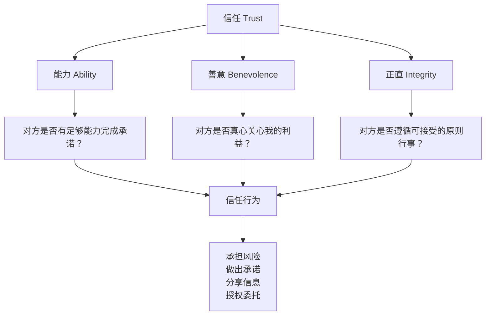
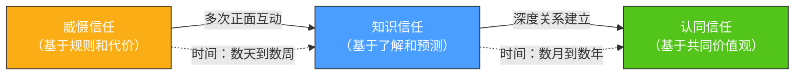
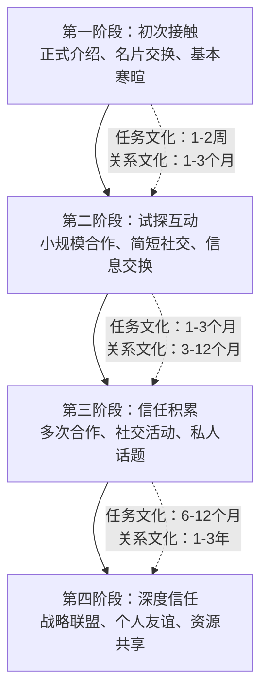
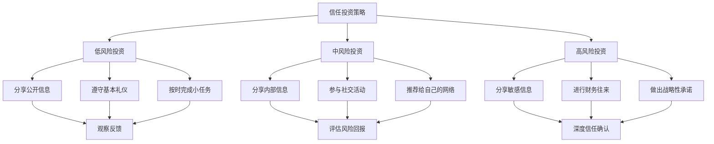
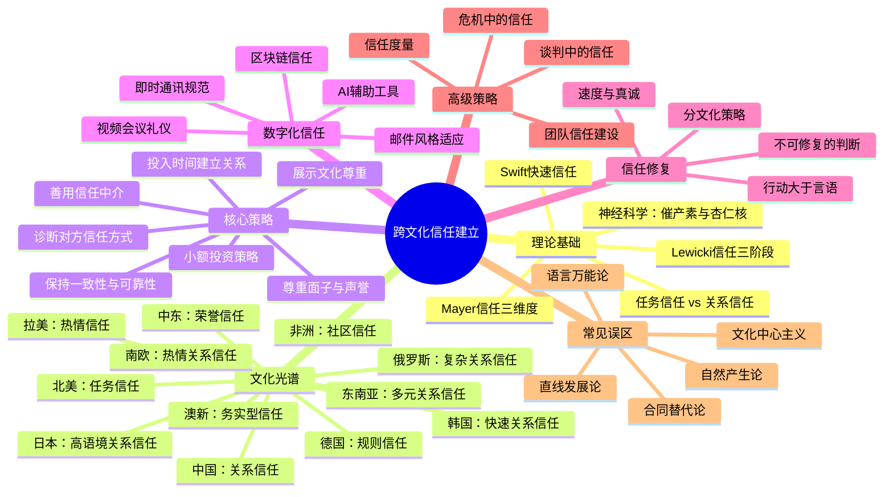

# 四、跨文化信任建立

信任是一切有效沟通的基石。在国内环境中，你可能已经不自觉地使用了一套熟练的信任建立方式——但在跨文化场景中，这套方式可能完全失效。你以为的"真诚"在对方眼中可能是"冒失"，你以为的"专业"在对方眼中可能是"冷漠"。本节将系统讲解跨文化信任建立的底层逻辑、核心策略和实操工具，帮助你在任何文化环境中都能高效建立深度信任。

---

## 4.1 为什么跨文化信任建立如此困难

### 4.1.1 信任的"文化操作系统"隐喻

每个人的信任建立机制都像一套预装的"操作系统"——它在你成长的文化环境中被深度定制，运行流畅且无意识。当你与同文化的人互动时，双方的操作系统兼容，信任建立过程顺畅自然。

但在跨文化场景中，两套不同的"操作系统"需要对接。信号的编码方式不同（你说的"是"可能意味着"我听到了"而非"我同意"），解码规则不同（沉默可能是尊重也可能是拒绝），甚至连"信任"本身的定义都不同。

**真实案例**：2016年，一家中国新能源企业与丹麦风电公司洽谈合作。中方团队按照惯例，在正式谈判前安排了三天的宴请、参观和社交活动，试图先建立"关系"再谈生意。丹麦方面却感到困惑和不耐烦——他们认为这些活动浪费时间，真正建立信任的方式是展示技术方案和合同条款的可靠性。最终中方调整策略，在第二天就安排了详细的技术演示，合作才得以推进。

这个案例揭示了跨文化信任建立的核心难题：**双方都在用自己文化的标准评判对方的信任诚意，而这些标准往往截然不同**。

### 4.1.2 信任的神经科学基础

理解信任为什么在跨文化场景中特别困难，需要从大脑的运作机制入手。神经科学家Paul Zak的研究发现，信任与大脑中的催产素（Oxytocin）水平密切相关。催产素被称为"信任分子"，它在以下情境中会自然分泌：

- 与熟悉的人互动时（同文化伙伴）
- 经历积极社交信号时（微笑、善意的肢体语言）
- 感受到安全感时（可预测的环境和行为）

**跨文化信任的神经障碍**：在跨文化互动中，大脑面对不熟悉的语言、行为模式和社交规则时，会激活杏仁核（Amygdala）的威胁检测系统。这导致两个直接后果：

| 神经反应 | 表现 | 对信任的影响 |
|---------|------|-------------|
| 催产素分泌受抑 | 难以产生亲近感和信任感 | 信任建立速度大幅降低 |
| 皮质醇升高 | 紧张、警觉、防御性增强 | 更容易将对方的中性行为解读为威胁 |
| 前额叶皮层负荷增加 | 需要额外的认知资源来处理陌生信号 | 疲劳感增加，判断力下降 |
| 镜像神经元激活不足 | 难以准确共情对方的情绪状态 | 误解对方的意图和感受 |

**实操启示**：这意味着跨文化信任建立的第一步，是创造让大脑"安全"的环境——减少不确定性、提供可预测性、使用熟悉的信号。这就是为什么"引荐人"、"正式场合"、"共同利益"在跨文化场景中如此有效——它们都在降低大脑的威胁感知。

### 4.1.3 信任的学术定义与核心维度

学术界对信任的研究已有数十年积累。理解这些理论框架，能帮助你从"凭感觉"升级为"有章法"地建立信任。

**Mayer等人（1995）的信任整合模型**是组织行为学中被引用最多的信任理论之一。该模型指出，信任由三个核心维度构成：

| 维度 | 定义 | 在不同文化中的权重差异 |
|------|------|----------------------|
| 能力（Ability） | 对方在特定领域拥有的技能、知识和资质 | 低语境文化中权重更高——美国商务信任首先看"你能做什么" |
| 善意（Benevolence） | 对方对你的关心程度，超越纯粹的自利动机 | 高语境文化中权重更高——中国商务信任首先看"你是否真心对我好" |
| 正直（Integrity） | 对方遵循的原则和价值观是否与你一致 | 在所有文化中都重要，但"正直"的具体标准因文化而异 |

**关键洞察**：这三个维度在不同文化中的权重分配截然不同。在美国，能力信任可能是第一步——"你有哈佛MBA学位，你的产品通过了ISO认证，所以我信任你"。在中国，善意信任可能是第一步——"你请我吃了三次饭，你帮我解决了一个私人问题，所以我信任你"。在日本，正直信任可能是第一步——"你遵守了每一个承诺，你从不迟到，你的行为始终如一，所以我信任你"。

**补充理论——Swift Trust（快速信任）**：Meyerson等人（1996）在研究临时团队时发现了一种特殊的信任形式——Swift Trust。它指的是在缺乏长期互动历史的情况下，人们基于角色、制度和外部信号快速建立的信任。Swift Trust在以下跨文化场景中尤为重要：

- 国际会议和短期项目合作
- 跨国并购后的过渡期
- 跨文化危机应对团队
- 全球供应链的初始对接

Swift Trust的建立依赖于：清晰的角色定义、专业的外在表现、共同的目标感、以及制度化的保障机制（合同、流程、第三方认证）。它是跨文化信任的"启动引擎"——虽然不如深层信任牢固，但能为后续关系发展提供必要的基础。

### 4.1.4 信任发展的阶段模型

Lewicki和Bunker（1996）提出了信任发展的三阶段模型，这个模型在跨文化场景中尤其有解释力：

| 阶段 | 特征 | 建立方式 | 跨文化挑战 |
|------|------|----------|-----------|
| **基于威慑的信任**（Deterrence-based） | "我不骗你，因为骗你的代价太高" | 合同、法律约束、声誉机制 | 不同文化对"违约代价"的理解不同——在法治强的国家靠法律，在关系型社会靠声誉 |
| **基于知识的信任**（Knowledge-based） | "我信任你，因为我了解你的行为模式" | 频繁互动、信息交换、行为预测 | 需要足够多的互动才能积累——在任务导向文化中互动快，在关系导向文化中互动慢 |
| **基于认同的信任**（Identification-based） | "我信任你，因为我们有共同的价值观和目标" | 深度关系、共同经历、价值观共鸣 | 最高级别的信任，跨文化中最难达到——需要真正理解对方的文化价值观 |

**跨文化信任发展的特殊路径**：在同文化互动中，信任通常沿着"威慑→知识→认同"的自然路径发展。但在跨文化场景中，这个路径会被打乱：

- **文化冲击导致的倒退**：当你遇到文化误解时，信任可能从"知识"阶段倒退回"威慑"阶段——"我不确定你的行为了，我需要重新用规则来约束"
- **引荐人带来的跳跃**：一个强信任中介可以让你跳过"威慑"阶段，直接进入"知识"甚至"认同"阶段
- **共同危机带来的加速**：一起经历并克服困难（项目危机、市场变动）可以大幅加速信任发展——这被称为"战友情谊效应"（Foxhole Effect）

---

## 4.2 信任建立的文化光谱：任务信任 vs. 关系信任

### 4.2.1 两种信任范式的深度对比

全球文化的信任建立方式可以大致归入两个范式。这不是非此即彼的二分法，而是一个连续体的两端——大多数文化位于中间某个位置。

| 对比维度 | 任务信任（Task-based Trust） | 关系信任（Relationship-based Trust） |
|---------|----------------------------|-------------------------------------|
| **核心逻辑** | "你有能力完成任务，所以我信任你" | "你是我了解和喜欢的人，所以我信任你" |
| **主要文化区域** | 北美、北欧、德国、澳大利亚、新西兰 | 东亚、中东、拉丁美洲、南亚、非洲 |
| **信任建立速度** | 较快——可以通过资质、合同、试用期建立 | 较慢——需要数月甚至数年的社交互动 |
| **信任建立方式** | 专业演示、业绩记录、推荐信、合同保障 | 共进晚餐、社交活动、私人帮忙、家庭互访 |
| **信任考验场景** | 你是否按时交付？你的产品质量如何？ | 你在我困难时是否伸出援手？你是否记得我的生日？ |
| **信任修复方式** | 纠正错误、赔偿损失、改进流程 | 当面道歉、通过中间人调解、用行动证明忠诚 |
| **商务合同角色** | 合同是信任的基础——"先小人后君子" | 合同是信任的产物——关系到了，合同自然水到渠成 |
| **"不信任"的信号** | 你不按时交付、你数据造假 | 你拒绝社交邀请、你总是公事公办、你从不分享私人信息 |
| **信任的"货币"** | 数据、案例、证书、合同条款 | 时间、注意力、个人关怀、社交参与 |
| **信任的"语言"** | "Let me show you the numbers" | "Let me get to know you first" |

### 4.2.2 各文化区域的信任特征详解

**北美（美国、加拿大）——典型的任务信任文化**

美国的信任建立遵循"能力→可靠→善意→认同"的递进路径。美国人倾向于：
- 在初次见面时就快速评估你的专业能力
- 通过简历、推荐信、过往业绩来判断是否值得信任
- 商务关系可以在数周内建立，但真正的深度信任需要更长时间
- 合同和法律框架被视为信任的保障，而非对信任的否定
- "时间就是金钱"——冗长的社交活动被视为低效

**关键细节**：美国人的"友好"容易被误解为"信任"。美国文化鼓励社交性的热情（微笑、寒暄、"How are you?"），但这不代表他们已经信任你。真正的信任标志是他们开始与你分享信息、邀请你参与决策、或在非工作场合与你见面。

**加拿大特殊性**：加拿大与美国虽同属北美，但信任建立风格有细微差异。加拿大文化更强调"礼让"（politeness）和"共识"（consensus），在信任建立中表现为：
- 更注重长期关系的可持续性，而非短期效率
- 对"推销式"的信任建立方式（过度展示成就）更为反感
- 多元文化政策使得加拿大人对文化差异有更高的接受度
- 信任建立的节奏可能比美国稍慢，但一旦建立更为稳固

**德国——规则信任文化**

德国的信任建立有其独特逻辑——对规则和系统的信任高于对个人的信任：
- 严格遵守承诺和时间表是信任的基础
- 详细的计划和流程本身就是信任的表达——"我们把每一步都写清楚，这说明我们是认真的"
- 信任一旦建立非常稳固，但破坏后极难修复
- 德国人不会因为社交性的友好而信任你，他们信任的是你的专业性和可靠性
- "Ordnung muss sein"（秩序必须存在）——对混乱和无序的容忍度极低

**德国信任建立的细节补充**：
- 初次见面时，使用正式称谓"Herr/Frau + 姓氏"，直到对方主动邀请使用名字
- 商务会议准时到达是底线——迟到1分钟就可能影响你的可信度
- 德国人重视"Qualität"（质量）——产品、方案、甚至邮件的质量都是信任信号
- 不要过度承诺——德国人更信任说"这个需要3个月"的人，而非说"2周搞定"的人
- 私人生活和工作有明确界限——不要在商务场合过度询问私人问题

**日本——高语境关系信任文化**

日本的信任建立是一个漫长的、高度仪式化的过程：
- "内圈"（うち）和"外圈"（そと）的区分极为严格——外人需要极长时间才能进入内圈
- 引荐人（紹介者）至关重要——一个被信任的第三方的推荐，可以大幅缩短信任建立时间
- "本音"（真实想法）和"建前"（表面立场）的区分——信任越深，对方越愿意展示本音
- 忍耐和一致性是关键——一次失信可能导致永久性的信任损失
- 赠礼文化：精心选择的礼物是信任和尊重的象征

**日本信任建立的进阶理解**：
- "空気を読む"（读懂空气）：在日本文化中，能不言而喻地理解对方的需求是信任的高级表现
- "義理"（义务感）：接受帮助会产生回报的义务——这不是负担，而是信任关系的黏合剂
- "根回し"（事前沟通）：重要决策前的非正式协商——参与根回し说明你被信任
- 名片交换是严肃的仪式——双手接递、认真阅读、妥善放置，任何草率都是不尊重
- 送礼禁忌：不送4件套、不送白色花卉（丧事关联）、礼物用双手递送

**中国——关系信任文化**

中国商务环境中的信任建立与"关系"（Guanxi）概念深度绑定：
- 关系网（人脉）是信任的基础设施——通过共同的朋友、同学、老乡来建立连接
- "面子"（Face）是信任的润滑剂——给对方面子就是建立信任
- 饮酒文化在某些行业中仍然是信任建立的重要仪式
- 信任的递进路径：先社交→再试探→然后小规模合作→最后深度绑定
- "自己人"和"外人"的边界清晰——进入"自己人"圈子后，信任几乎是无条件的

**中国信任建立的深层逻辑**：
- "关系"不是一次性建立的，而是通过持续的"人情往来"积累的——每次帮助都是一笔"人情债"，而"人情债"是中国式信任的核心货币
- "介绍人"的角色极其关键——没有中间人的贸然接触可能被视为不怀好意
- "吃饭"的学问：座位安排（主位/客位/陪位）、点菜权（通常由东道主掌握）、敬酒顺序（先敬最重要的客人）都暗含信任信号
- 节假日送礼是维护关系的重要手段——春节、中秋是关键节点
- 微信朋友圈的互动（点赞、评论）在当代中国已成为低成本的关系维护方式

**韩国——快速关系信任文化**

韩国的信任建立兼具东亚关系信任的深度和快速推进的特点：
- "빨리빨리"（快快快）文化影响下，韩国人希望关系快速升温
- "정"（Jeong，情）是韩国式信任的核心——一种超越理性计算的深厚情感连接
- 饮酒文化（特别是"회식"团队聚餐）是信任建立的重要场景——在酒桌上展示真实自我
- "눈치"（眼力见）——能敏锐察觉对方需求并主动满足，是信任的加速器
- 年龄和层级极为重要——对年长者的尊重是信任的基础
- 韩国人对"忠"（loyalty）极为看重——一旦建立信任关系，期望长期的忠诚

**韩国信任建立实操要点**：
- 双手递接名片和物品
- 敬酒时侧身面对长辈或上级，不正面举杯
- 不要在第一次见面就谈商务——至少安排一次非正式聚餐
- 了解韩国的"빨간 날"（红色日子/公休日），在这些日子发送祝福
- 韩国人对速度的期待很高——邮件和消息的回复要快

**中东——荣誉信任文化**

中东地区的信任建立与荣誉、家族和宗教紧密相关：
- 家族背景和部落关联是信任的重要来源
- "Wasta"（阿拉伯语，意为"关系"或"影响力"）在商务和社会生活中至关重要
- 待客之道（Hospitality）是信任的表达——拒绝主人的款待是严重的冒犯
- 宗教纽带（如共同的伊斯兰信仰）可以快速建立信任
- 信任建立需要耐心——急于签约可能被视为不真诚

**中东信任建立的关键细节**：
- 咖啡礼仪：在海湾国家，主人为你倒咖啡是尊重的表示——用右手接，喝完摇晃杯子表示够了
- 不要用左手递东西或吃饭——左手在伊斯兰文化中被视为不洁
- 斋月期间避免在公共场合饮食——尊重斋戒是信任的基础
- 避免讨论政治敏感话题（以色列、宗教派别冲突等）
- 信任建立的速度取决于是否有共同的宗教纽带或部落关联——没有这些纽带时，需要更长时间和更多耐心

**拉丁美洲——热情信任文化**

拉丁美洲的信任建立融合了任务和关系两种元素，但关系维度更为突出：
- 个人魅力和社交能力是信任的敲门砖
- 家庭和朋友网络是信任的核心——"你是我朋友的朋友，所以我信任你"
- 时间观念灵活——社交活动的优先级高于工作日程
- 身体接触（拥抱、拍肩）是信任的自然表达
- 商务关系往往从社交关系演化而来

**拉丁美洲各国差异**：
- **巴西**：关系信任最强的拉美国家之一。"Jeitinho brasileiro"（巴西式变通）强调灵活和人情。社交活动（BBQ、足球、嘉年华）是信任建立的核心场景
- **墨西哥**：家族企业文化浓厚，信任建立与家族网络紧密相关。"Mi casa es su casa"（我的家就是你的家）体现了拉美式的开放和热情
- **阿根廷**：欧洲影响较深，商务信任可能比其他拉美国家更偏任务型。但社交晚餐（通常在晚上9-10点开始）仍然是重要的关系建立方式
- **哥伦比亚**：信任建立与个人关系紧密相关。"Paisa"文化（安蒂奥基亚地区）以好客和社交闻名

**南欧——热情关系信任文化（意大利、西班牙、葡萄牙、希腊）**

南欧的信任建立兼具地中海的热情和关系导向的特点：

**意大利**：
- 关系网络（"Conoscenze"）是信任的基础——你认识谁比你能做什么更重要
- "Bella figura"（美好形象）——外在形象和社交表现是信任的重要信号
- 餐桌文化是信任建立的核心场景——商务午餐可能持续2-3小时
- 家族企业的信任逻辑：家族成员之间的信任高于一切，外人需要很长时间才能进入
- 意大利人对"热情"和"诚意"非常敏感——冷淡和公式化是信任杀手

**西班牙**：
- "Sobremesa"（餐后聊天）——吃完饭后继续聊天的习俗，是关系建立的重要时间
- 时间观念灵活——会议迟到15-30分钟是可接受的
- 信任建立比北欧快，但比拉美慢——处于中间位置
- 西班牙人重视个人魅力和社交能力——能聊天、会幽默是加分项
- 不同地区差异大——加泰罗尼亚（巴塞罗那）比安达卢西亚（塞维利亚）更偏任务型

**俄罗斯——复杂的关系信任文化**

俄罗斯的信任建立有其独特的复杂性——融合了斯拉夫文化、东正教传统和苏联时期的社会习惯：
- 信任建立极慢，但一旦建立，关系极为坚固——"一旦是朋友，终身是朋友"
- "Блат"（人脉关系）在俄罗斯社会中根深蒂固——通过可信赖的中间人引荐是进入圈子的唯一途径
- 饮酒文化（特别是伏特加）在传统商务场景中是信任建立的重要仪式——拒绝喝酒可能被视为拒绝信任
- 俄罗斯人对"表面友好"极为警惕——他们会测试你的诚意和耐心
- "Душа"（灵魂）的概念——俄罗斯人期望深层的、情感化的连接，而非肤浅的社交
- 法律和合同在俄罗斯的信任体系中权重较低——关系和个人承诺更为重要

**俄罗斯信任建立实操要点**：
- 准备好经历长时间的"考验期"——俄罗斯人不会轻易信任外人
- 通过共同信任的中间人引荐——自荐上门几乎不可能成功
- 在非正式场合（桑拿、餐桌、钓鱼）建立关系——这些场景比会议室更有效
- 赠礼要精心选择——鲜花只送单数（双数是丧葬用），不送空钱包
- 了解俄罗斯的历史和文化——表现出对俄罗斯的尊重和兴趣

**东南亚——多元关系信任文化**

东南亚是一个文化多元的地区，不同国家的信任建立方式差异显著：

**泰国**：
- "เกรงใจ"（Kreng jai，怕给别人添麻烦）文化——善解人意、不给对方压力是信任的基础
- 佛教文化的影响——尊重僧侣、了解佛教节日是文化尊重的表现
- "หน้า"（面子）在泰国文化中同样重要——避免让对方丢面子
- 不要触摸他人的头部——头部在泰国文化中是最神圣的部位
- "สนุก"（Sanuk，享受乐趣）——如果互动过程不愉快，信任建立会受阻

**印度尼西亚**：
- "Gotong royong"（互助合作）文化——愿意帮助他人是信任的基础
- 伊斯兰文化的影响——了解穆斯林的饮食和礼仪禁忌
- "Rukun"（和谐）——避免冲突、维护和谐是信任的要素
- 群体决策文化——个体的信任决定往往受群体影响
- 时间观念灵活——"橡皮时间"（Jam karet）是常见的

**印度**：
- 种姓制度虽然法律上已废除，但在社会心理中仍有影响——了解对方的社会背景有助于信任建立
- 家族企业文化浓厚——信任往往以家族为单位建立
- "Jugaad"（变通解决问题）文化——灵活性和创造力是信任的加分项
- 等级意识强烈——对年长者和上级的尊重是信任的基础
- 多语言环境——英语在商务场景中通用，但学习几句印地语或当地方言能显著拉近距离

**澳大利亚/新西兰——务实型信任文化**

澳洲和新西兰的信任建立方式介于任务信任和关系信任之间，有其独特风格：
- "Fair go"（公平机会）文化——给每个人平等的机会是信任的基础
- 反对"tall poppy syndrome"（高罂粟综合征）——过度自我炫耀会被反感
- 户外社交活动（BBQ、冲浪、运动）是关系建立的重要场景
- 直接但友好的沟通风格——不需要过于正式或迂回
- "Mateship"（伙伴情谊）——愿意帮助朋友、共度难关是信任的高级表现
- 新西兰的毛利文化（Haka战舞、Hongi碰鼻礼）在正式场合中是文化尊重的重要表达

**撒哈拉以南非洲——社区信任文化**

非洲的信任建立与社区、部落和家族紧密相关：
- "Ubuntu"（我存在，因为我们存在）——个体信任根植于社区关系
- 部落和家族背景是信任的重要来源——了解对方的部落归属有助于建立连接
- 口头传统强于书面传统——口头承诺在许多非洲文化中具有强大的道德约束力
- 长者的智慧和权威受到高度尊重——获得长者的认可是信任的关键
- "非洲时间"（African time）——时间观念灵活，关系比日程更重要
- 礼物和分享是信任的表达——慷慨的人更受信任

### 4.2.3 信任类型的混合与演化

需要注意的是，没有任何一种文化是纯粹的"任务信任"或"关系信任"。以下因素会导致信任类型的混合和偏移：

| 影响因素 | 使信任偏向任务型 | 使信任偏向关系型 |
|---------|----------------|----------------|
| 行业特征 | 科技、金融、法律等规范化行业 | 创意、农业、家族企业等关系密集型行业 |
| 代际差异 | 年轻一代（全球化影响） | 年长一代（传统影响更深） |
| 城乡差异 | 国际化大都市 | 中小城市和农村地区 |
| 交易规模 | 小额一次性交易 | 大额长期合作关系 |
| 个人性格 | 内向、分析型人格 | 外向、社交型人格 |
| 教育背景 | 国际化教育（MBA、留学经历） | 本地教育体系 |
| 公司文化 | 跨国公司、科技创业公司 | 家族企业、传统行业 |
| 数字化程度 | 重度数字化（电商、SaaS） | 传统面对面业务 |

**实用建议**：不要假设"所有美国人都只看任务"或"所有中国人都只看关系"。在实际互动中，观察具体的人和场景，而不是依赖文化标签。文化知识是你的"导航地图"，但每个具体的人都是一个独特的"目的地"——用地图规划路线，但用眼睛看路。

---

## 4.3 建立跨文化信任的七大核心策略

### 策略一：诊断对方的信任建立方式

在开始任何跨文化互动之前，先花时间了解对方文化的信任建立方式。这一步的投入产出比最高——因为用错误的方式建立信任，不仅无效，还可能产生反效果。

**信任诊断清单**：

□ 对方文化的主要信任建立方式是什么？（任务型/关系型/混合型）
□ 在对方文化中，信任的三个维度（能力/善意/正直）的权重如何分配？
□ 对方文化中，信任的"加速器"是什么？（引荐人？资质证明？社交活动？）
□ 对方文化中，信任的"杀手"是什么？（迟到？过于直接？拒绝社交？）
□ 有没有特定的信任仪式或礼节需要了解？（赠礼？宴请？合十礼？）
□ 在对方文化中，"不信任"的信号有哪些？
□ 对方的个人特征是否偏离文化"典型"？（年轻？国际化背景？行业特征？）

**信息来源**：
1. **学术资料**：霍夫斯泰德的文化维度数据（hofstede-insights.com）可以提供宏观参考
2. **行业报告**：各国商会和贸易机构通常有商务礼仪指南
3. **个人网络**：向有目标文化经验的朋友、同事请教
4. **本地顾问**：在重要商务场景中，聘请当地的文化顾问
5. **文学与影视**：阅读该文化的文学作品或观看影视作品，了解人际关系的运作方式
6. **在地体验**：如果条件允许，亲自去目标文化所在地生活一段时间——没有比亲身体验更好的学习方式

**诊断结果的应用**：将诊断结果转化为具体的行为调整清单。例如，如果诊断结果显示对方是关系信任文化，你的清单可能包括：
- 安排至少3次非正式社交活动再谈正事
- 准备分享个人故事（家庭、爱好、成长经历）
- 找到共同联系人进行引荐
- 了解对方文化的赠礼规范
- 预留充足的时间，不要急于推进

### 策略二：投入时间建立关系——但要遵循对方的节奏

关系建立在所有文化中都有价值，但投入的方式和节奏需要匹配对方的文化期待。

**在任务信任文化中的关系建立**：
- 不要一开始就安排大量社交活动——这可能让对方感到不耐烦
- 通过共同项目和专业协作来建立关系——"一起解决问题"是最好的关系催化剂
- 在会议前后安排简短的社交寒暄（5-10分钟），但不要喧宾夺主
- 午餐会议是理想的平衡点——既专业又有社交元素
- 用专业能力赢得尊重，然后自然过渡到个人关系

**在关系信任文化中的关系建立**：
- 毫不犹豫地接受所有社交邀请——拒绝是信任杀手
- 主动邀请对方共进晚餐或参加文化活动
- 分享适度的个人故事（家庭、爱好、旅行经历）
- 记住对方的个人信息（孩子的名字、最近的旅行）并在后续交流中提及
- 准备好在"非工作"话题上花大量时间——这不是浪费时间，而是投资
- 节假日送上有心意的礼物（了解当地禁忌——例如在中国不送钟、不送伞）

**关系建立的递进路径**：

### 策略三：保持一致性与可靠性——信任的通用货币

无论在什么文化中，言行一致和守时守约都是建立信任的基础。这是跨文化信任建立中最"安全"的策略——因为它在所有文化中都有效。

**一致性（Consistency）的具体表现**：

| 维度 | 具体行为 | 信任信号 |
|------|----------|---------|
| 承诺管理 | 承诺的事情一定要做到；做不到的绝不轻易承诺 | "这个人说到做到" |
| 行为可预测 | 保持相对稳定的沟通风格和决策方式 | "这个人靠得住" |
| 信息透明 | 主动分享进展、问题和变化 | "这个人不藏着掖着" |
| 标准一致 | 对所有人使用相同的标准，不因关系远近而区别对待 | "这个人公平公正" |

**可靠性（Reliability）的操作指南**：
1. **守时**：提前5-10分钟到达。如果迟到，提前通知并说明原因。如果在多元时间观文化中，了解当地的迟到容忍度，但仍然以守时为目标
2. **跟进**：承诺的事情要有闭环——"我会在周五前给你反馈"，然后真的在周五前给反馈。如果需要延期，提前告知
3. **文档化**：重要承诺以书面形式确认。在任务信任文化中，这是专业性的体现；在关系信任文化中，这可以是会议纪要而非正式合同
4. **一致性检查**：定期反思——"我最近有没有说到没做到的事情？"如果有，立即补救
5. **预期管理**：宁可承诺不足、交付有余，也不要过度承诺。在所有文化中，超出预期都比达到预期更能建立信任

**可靠性在不同文化中的权重**：

在跨文化研究中，可靠性被发现是信任建立中"最低门槛"——即无论在哪个文化中，缺乏可靠性都会导致信任崩塌。但不同文化对"可靠性"的具体定义有所不同：

| 文化 | 可靠性的具体定义 | 核心表现 |
|------|----------------|---------|
| 德国/瑞士 | 严格遵守时间和计划 | 迟到5分钟就是不可靠 |
| 美国 | 按时交付结果 | 过程中可以灵活调整，但最终结果必须达到 |
| 日本 | 每一个细节都完美 | 微小的失误可能被放大为不可靠的信号 |
| 中国 | 在关键时刻靠得住 | 日常的小失误可以被原谅，但关键时刻掉链子不行 |
| 中东 | 对承诺的忠诚 | 口头承诺与书面合同具有同等的道德约束力 |
| 巴西 | 在关系中保持一致 | 对朋友和合作伙伴始终如一地忠诚 |

### 策略四：尊重面子与声誉——信任的情感维度

在许多文化中，"面子"（Face）的概念至关重要。维护对方的面子不仅是一种礼貌，更是建立深度信任的基础。面子文化在东亚（中国、日本、韩国）、中东和南亚尤为突出，但在所有文化中都以不同形式存在。

**面子的两种类型**：

| 类型 | 定义 | 文化分布 | 维护方式 |
|------|------|---------|---------|
| **获得性面子**（Acquired Face） | 通过成就、地位和社会认可获得的面子 | 全球通用 | 认可对方的成就和贡献 |
| **义务性面子**（Obligatory Face） | 基于社会角色和关系而应得的面子 | 高语境文化尤为突出 | 使用恰当的称谓、给予应有的尊重 |

**维护面子的实操技巧**：

1. **私下纠错，公开表扬**：当对方犯错或有不同意见时，私下而非公开地沟通。一封私下的邮件远比一次公开的质疑更有效
2. **给对方"台阶"**：当对方需要改变立场时，提供一个不丢面子的理由。例如："由于市场情况的变化，我们可能需要调整方案"而非"你之前的方案有问题"
3. **在第三方面前给予正面评价**：在对方的同事、上级或下属面前赞扬对方的能力和贡献
4. **使用间接表达方式**：在高面子文化中，"这个方案有一些可以优化的地方"比"这个方案有严重问题"更容易被接受
5. **避免"你错了"式表达**：改为"我可能理解有误，您能再帮我确认一下……"
6. **学会"给面子"的具体话术**：
   - "您在这个领域的经验比我丰富得多……"
   - "这个想法是受到您的启发……"
   - "如果不是您的推动，这个项目不可能成功……"

**面子失误的严重后果**：

一次严重的面子失误可能导致信任的永久性破坏。在日本文化中，这被称为"面目をつぶす"（丢面子），其后果可能包括：永久性的关系疏远、对方在背后传递负面信息、商务合作的终止。在中国文化中，"不给面子"可能比直接的商业损失更严重——因为面子损失是社会性的，会影响对方在整个关系网络中的地位。

**面子的双刃剑效应**：在高面子文化中，维护面子可以快速建立信任，但过度维护面子（为了保全面子而隐瞒问题、回避冲突）可能导致信息不透明和决策失误。高级的信任关系需要在面子维护和坦诚沟通之间找到平衡——在私下场合，深度信任的伙伴之间可以更加直接。

### 策略五：展示文化尊重——信任的快速通道

主动展示对对方文化的尊重和兴趣，是快速建立信任的有效方式。这不需要你成为该文化的专家——真诚的兴趣和基本的尊重就足够了。

**语言层面的文化尊重**：

| 技巧 | 具体做法 | 效果 |
|------|---------|------|
| 学习基本用语 | 用当地语言说"你好""谢谢""再见" | 打破距离感，展示尊重 |
| 学习称谓系统 | 了解对方文化中如何正确称呼不同身份的人 | 避免失礼，展示文化敏感度 |
| 学习关键商务术语 | 了解对方行业中的本地术语 | 展示专业性和投入度 |
| 使用对方语言的感谢表达 | 在邮件或会议结尾使用当地语言的感谢 | 小举动，大效果 |

**行为层面的文化尊重**：

1. **饮食适应**：了解并尊重当地的饮食禁忌和习惯。穆斯林文化中不提供猪肉和酒精，印度教文化中不提供牛肉，犹太教文化中注意Kosher规范
2. **着装适应**：了解当地商务着装的规范。在日本穿深色西装，在中东女性注意保守着装，在硅谷可以穿得休闲
3. **礼仪学习**：了解基本的问候礼仪——鞠躬（日本）、合十礼（泰国/印度）、贴面礼（法国）、握手的力度和时长
4. **节日意识**：了解对方文化的重要节日，在节日时发送祝福。中国的春节、印度的排灯节、伊斯兰的开斋节、犹太的光明节、韩国的中秋（추석）和春节（설날）
5. **禁忌了解**：提前了解对方文化的数字禁忌（中国避4，日本避9，韩国避4）、颜色禁忌（白色在东亚与丧事相关）、礼物禁忌（不送刀具给拉美人，暗示"切断关系"）

**文化尊重的注意事项**：

- **真诚 > 精通**：你的努力不需要完美——真诚的尝试比流利的日语更让人感动
- **避免过度表演**：过度展示对对方文化的了解可能被视为讨好或不真诚
- **承认无知**："我对您的文化了解不多，如果有什么不当之处请告诉我"比假装了解更受尊重
- **学习是双向的**：分享你自己的文化，邀请对方了解你的世界——这是尊重的对等表达
- **不要刻板化**：了解文化常识是好的，但不要把每个人都当作文化的"标准样本"——"你们中国人都喜欢喝茶对吧？"这种话本身就是不尊重

### 策略六：善用信任中介——跨文化的"关系加速器"

在跨文化场景中，信任中介（Trust Intermediary）可以大幅缩短信任建立的时间。信任中介是双方都信任的第三方，他们为你的可信度提供"担保"。

**信任中介的类型**：

| 类型 | 描述 | 效果 | 适用文化 |
|------|------|------|---------|
| **共同联系人** | 双方都认识的朋友、同事或合作伙伴 | ⭐⭐⭐⭐⭐ | 所有文化，关系信任文化尤为有效 |
| **行业协会/商会** | 双方都是成员的行业组织 | ⭐⭐⭐⭐ | 商务场景普遍适用 |
| **知名机构** | 你所属的知名公司、大学或研究机构 | ⭐⭐⭐ | 任务信任文化中效果好 |
| **文化桥梁人物** | 对两种文化都有深入了解的人 | ⭐⭐⭐⭐⭐ | 跨文化场景中的黄金资源 |
| **政府/外交渠道** | 官方机构的引荐 | ⭐⭐⭐ | 在高权力距离文化中有效 |
| **专业认证机构** | ISO、行业协会认证等 | ⭐⭐⭐⭐ | 任务信任文化中特别有效 |

**如何利用信任中介**：

1. **提前建立中介网络**：在你需要与某个文化互动之前，先结识该文化背景的朋友或同事
2. **请求正式引荐**：让中介以邮件、电话或面对面的方式将你介绍给对方
3. **在初次互动中提及共同联系人**："张教授推荐我联系您，他对您的研究非常推崇"——这句话可以立即提升你的可信度
4. **维护中介关系**：信任中介的价值在于其长期信用——不要过度消耗中介的信任资本
5. **成为别人的信任中介**：当你为别人牵线搭桥时，你同时在两个方向上积累信任——被引荐者和引荐目标都会因此更信任你

**在中国文化中的"关系"运作**：

中国的"关系"（Guanxi）系统是信任中介的典型体现。关系的建立遵循"六度分隔"的变体——你通常只需要2-3个中间人就能找到与任何目标人物的连接。关键要素包括：
- **同乡关系**（老乡）：来自同一个省份或城市
- **同学关系**（校友）：同一所大学毕业
- **同事关系**：曾经在同一家公司工作
- **战友关系**：一起经历过困难或挑战
- **亲友关系**：通过家庭成员或亲属的连接
- **同好关系**：共同的爱好或兴趣圈子（高尔夫、登山、读书会等）

### 策略七：信任的"小额投资"策略

当你无法确定对方的信任建立方式时，采用"小额投资"策略——通过一系列小的、低风险的信任行为来逐步建立信任，而非一开始就进行大规模的信任投资。

**"小额投资"的具体做法**：

1. **信息分享的递进**：先分享公开信息（行业报告、公开数据），再分享内部信息（公司策略、市场洞察），最后分享敏感信息（个人观点、私下建议）
2. **合作规模的递进**：先进行小规模的试点合作（一个子项目、一份咨询），再扩展到中等规模的项目合作，最后建立长期战略伙伴关系
3. **承诺等级的递进**：先做出容易兑现的小承诺（"我明天给你发那份资料"），再做出需要更多努力的承诺（"我帮你联系那个人"），最后做出战略性承诺（"我推荐你加入我们的联盟"）
4. **社交深度的递进**：从公开的商务社交（会议室、商务午餐），到半私人的社交（餐厅、文化活动），再到私人的社交（家庭聚会、周末活动）

**信任投资的风险管理**：

**"小额投资"的观察指标**：在每次"投资"后，观察对方的反应来判断是否继续加大投入：

| 对方反应 | 信号解读 | 下一步行动 |
|---------|---------|-----------|
| 积极回应并回以同等或更大的信任行为 | 信任正在建立 | 可以适度加大投入 |
| 中性回应，不拒绝但也不主动 | 信任尚未建立，但没有障碍 | 继续当前水平的投入，保持耐心 |
| 消极回应，回避或拒绝 | 信任建立受阻 | 退一步，重新评估策略，可能需要调整方式 |
| 回以过度的热情和承诺 | 警惕信号——可能是真诚的，也可能是策略性的 | 保持谨慎，继续观察，不要被一时的热情冲昏判断 |

---

## 4.4 数字化时代的跨文化信任建立

### 4.4.1 远程互动中的信任挑战

数字化沟通（邮件、视频会议、即时通讯）为跨文化信任建立带来了新的挑战：

| 挑战 | 原因 | 影响 |
|------|------|------|
| 非语言信号缺失 | 视频会议中难以观察完整的肢体语言 | 误解对方的态度和情绪 |
| 社交互动机会减少 | 缺少非正式的"走廊聊天"和共进午餐的机会 | 关系信任文化中尤为严重 |
| 异步沟通的延迟 | 邮件和即时通讯的回复时间差异 | 可能被解读为不重视或不信任 |
| 技术障碍 | 网络延迟、画质不佳、语言障碍叠加技术障碍 | 沟通效率降低，挫折感增加 |
| 文化信号弱化 | 数字沟通中，文化差异的表现形式更隐蔽 | 更容易无意识地冒犯对方 |
| 信息过载 | 多渠道沟通（邮件+消息+视频+协作平台） | 关键信息被淹没，跟进困难 |

### 4.4.2 远程跨文化信任建立的实操指南

**视频会议中的信任建立**：

1. **开摄像头**：在关系信任文化中，不开摄像头可能被视为不真诚或不重视
2. **提前5分钟上线**：守时在数字环境中同样重要，甚至更重要——因为对方在等待时无法做其他事情
3. **预留社交时间**：会议开始前5分钟用于非正式寒暄，会议结束后5分钟用于总结和社交
4. **注意文化差异的视频礼仪**：日本文化中，背景整洁很重要；美国文化中，适度的个人化背景（书架、艺术品）可以增加亲和力
5. **使用对方的语言**：即使只是一句"谢谢"或"再见"，在视频会议中使用当地语言的效果更加显著
6. **录制并分享会议纪要**：在任务信任文化中，这是专业性的体现；在关系信任文化中，确保纪要中包含社交互动的部分

**邮件沟通中的信任建立**：

| 文化类型 | 邮件风格建议 |
|---------|------------|
| 德国/北欧 | 开门见山，内容结构化，附件齐全，避免过多寒暄 |
| 美国 | 简洁友好，先简短寒暄再进入正题，使用积极的语气 |
| 日本 | 正式称谓，详细内容，避免直接拒绝，使用委婉表达 |
| 中国 | 先问候再谈事，适当使用"感谢您的支持""期待合作"等社交性表达 |
| 中东 | 先问候并询问对方的健康和家庭，展示真诚的关心，再进入商务话题 |
| 拉丁美洲 | 友好热情的语气，适当使用感叹号，表达个人化的关心 |
| 韩国 | 正式称谓，内容简洁但有礼貌，在邮件开头使用"안녕하세요"（您好） |
| 俄罗斯 | 正式称谓，内容详细，展示诚意，避免过于公式化 |

**即时通讯（WhatsApp/WeChat/Telegram）中的信任建立**：

- 在关系信任文化中，使用即时通讯本身就是信任的信号——它意味着你愿意用私人渠道沟通
- 注意回复时间的文化期望：在某些文化中，即时通讯要求快速回复；在其他文化中，可以像邮件一样延迟
- 适当使用表情符号和GIF——这在年轻一代中是全球通用的社交润滑剂，但在正式商务场景中需要谨慎
- 尊重对方的工作时间——不要在深夜或周末发送工作信息（除非当地文化中这是正常的）
- 在群组聊天中注意文化差异——某些文化中群组发言很随意，某些文化中群组发言需要谨慎

### 4.4.3 AI与区块链时代的信任新范式

数字化时代不仅是挑战，也为跨文化信任建立了新的工具和机制：

**AI驱动的信任辅助工具**：
- **实时翻译和文化提示**：AI翻译工具（DeepL、Google Translate）已经能在一定程度上消除语言障碍。下一代AI工具将提供实时的文化提示——在你写邮件或进行视频会议时，提醒你注意可能的文化冲突点
- **情感分析**：AI可以通过分析文字、语音和面部表情来判断对方的情绪状态——这在跨文化场景中特别有价值，因为你可能不熟悉对方文化的情绪表达方式
- **文化匹配度评估**：AI工具可以基于霍夫斯泰德文化维度等数据，评估两个文化之间的信任建立差异，并给出具体的行为建议

**区块链与去中心化信任**：
- 智能合约可以在一定程度上替代传统的"威慑信任"——代码的自动执行消除了对对方诚信的依赖
- 去中心化身份验证可以快速建立"能力信任"——通过不可篡改的记录证明资质和业绩
- 但区块链信任是"技术信任"而非"人际信任"——它可以作为底层保障，但不能替代人际互动中的情感连接

**数字化信任的平衡法则**：技术工具可以降低信任建立的门槛，但不能替代真正的跨文化理解。最好的策略是：用技术解决"效率"问题（翻译、文档、流程），用人际互动解决"深度"问题（情感连接、价值观共鸣、长期关系）。

---

## 4.5 信任修复：当信任破裂时

### 4.5.1 信任破裂的常见场景

在跨文化互动中，以下场景最容易导致信任破裂：

| 场景 | 原因 | 在不同文化中的严重程度 |
|------|------|---------------------|
| 未兑现承诺 | 能力不足或沟通不畅 | 所有文化中都严重，但在日本可能致命 |
| 公开失面子 | 在他人面前批评或贬低对方 | 东亚和中东文化中极为严重 |
| 迟到/爽约 | 时间观念差异 | 德国/日本中严重，拉美/中东中较轻 |
| 礼仪失误 | 不了解当地禁忌 | 严重程度取决于失误的性质 |
| 信息泄露 | 对方的隐私信息被公开 | 所有文化中都严重 |
| 利益冲突 | 利益分配不均或被利用的感觉 | 关系信任文化中尤为严重 |
| 文化误解 | 对对方文化行为的错误解读 | 所有跨文化场景中都可能发生 |
| 沟通风格冲突 | 直接vs间接、高语境vs低语境的碰撞 | 持续的风格冲突会逐渐侵蚀信任 |

**跨文化信任破裂的特殊性**：在同文化中，信任破裂通常有明确的原因——你知道自己做错了什么。但在跨文化场景中，你可能完全不知道自己已经破坏了信任——因为导致信任破裂的行为在你的文化中是完全正常的。这就是为什么跨文化信任修复特别困难：你不知道要修复什么。

**识别跨文化信任破裂的信号**：
- 对方的沟通突然变得正式和公式化
- 回复时间明显变长
- 社交邀请减少或消失
- 决策过程中你被排除在外
- 对方开始"留证据"（过多的书面记录和确认邮件）
- 中间人开始变得重要——对方不再直接与你沟通

### 4.5.2 信任修复的通用原则

1. **速度**：信任破裂后，拖延修复只会让情况恶化。第一时间承认问题，表达歉意
2. **真诚**：道歉必须真诚——在任何文化中，虚假的道歉比不道歉更糟糕
3. **行动 > 言语**：用实际行动弥补，而非只用语言道歉。德国人看重"你修好了什么"，中国人看重"你为此付出了什么代价"
4. **接受后果**：信任修复可能需要很长时间，尤其是严重破裂的情况下。不要期望一次道歉就能恢复一切
5. **预防复发**：建立机制确保同类问题不再发生——这是修复信任最有力的信号
6. **文化适配**：修复方式必须符合对方文化的期望，而非你自己的文化习惯

### 4.5.3 分文化的信任修复策略

**任务信任文化中的信任修复**：
- 明确承认错误，不找借口
- 提供具体的补救方案和时间表
- 展示问题已经得到系统性解决（流程改进、质量控制升级）
- 用后续的可靠表现来重建信任
- 如果涉及财务损失，主动提出赔偿方案
- 书面的"事后复盘报告"（Post-mortem Report）是有效的修复工具

**关系信任文化中的信任修复**：
- 通过受信任的中间人来传达歉意和调解意愿
- 面对面道歉——在关系信任文化中，书面道歉可能被视为不够重视
- 表达对关系的重视——"我们的关系比这次失误更重要"
- 用长期的忠诚行为来证明诚意
- 在适当的时机，用礼物或宴请来表达歉意和重建关系的诚意
- 给对方足够的空间和时间——不要急于要求对方"原谅"

**日本文化中的信任修复**：
- "土下座"（dogeza）——正式的跪地道歉，仅在极其严重的情况下使用
- 通过书面的"反省文"表达深刻的反省
- 让公司高层亲自道歉——职位越高，表示越重视
- 提供具体的改善措施，包括责任人处罚和流程改进
- 道歉要多次进行——一次道歉通常不够，需要持续表达悔意
- "お詫び"（道歉）文化中，道歉本身就是一种修复行为——不要期望道歉后立即得到原谅

**中国文化中的信任修复**：
- 通过双方共同信任的"中间人"来斡旋
- 安排一次正式的宴请，在酒桌上表达歉意
- 给对方足够的"面子"——在公开场合表达对对方的尊重
- 用后续的实际行动来证明诚意——"路遥知马力，日久见人心"
- 在重要节假日（春节、中秋）亲自登门拜访或送上礼物
- 如果涉及"人情债"，用更大的"人情"来偿还

**韩国文化中的信任修复**：
- 面对面道歉是必须的——书面道歉被认为不够有诚意
- 展示深刻的反省——韩国人对道歉的"深度"有很高的期待
- 通过共同信任的人传达歉意和修复意愿
- "한"（恨）的概念——如果伤害很深，修复需要很长时间
- 饮酒道歉在某些场景中仍然有效——在酒桌上表达歉意是传统的修复方式
- 用持续的行动证明改变——韩国人重视"言行合一"

**中东文化中的信任修复**：
- 通过有影响力的中间人调解
- 在公开场合表达尊重和歉意
- 耐心——中东文化的信任修复可能需要很长时间
- 用慷慨的行为证明诚意（慷慨的待客、有价值的礼物）
- 如果涉及宗教禁忌，可能需要宗教领袖的介入
- 家族和部落的面子有时比个人面子更重要——可能需要向整个家族表达歉意

### 4.5.4 不可修复的信任——何时应该放弃

并不是所有信任破裂都能修复。以下情况可能意味着信任已经无法修复：

- **反复的失信**：不是一次失误，而是模式性的不可靠
- **根本性的价值观冲突**：不是文化差异，而是道德底线的不同
- **公开的、大范围的面子损失**：在高面子文化中，这可能造成不可逆的社会性伤害
- **利益的根本性背叛**：不是误解，而是蓄意的欺骗或利用
- **对方明确表示终止关系**：尊重对方的决定，体面地退出

当你判断信任无法修复时，体面地结束关系比勉强维持更明智。保持基本的礼貌和尊重，不要在背后诋毁对方——因为你可能在未来的某个场景中再次与对方或对方的关系网络打交道。

---

## 4.6 信任建立的常见误区与纠正

### 误区一："信任是自然产生的，不需要刻意建立"

**问题**：在同文化中，信任确实可以在日常互动中自然产生。但在跨文化场景中，由于双方的信任"操作系统"不同，信任不会自然产生——需要有意识地、系统地建立。

**纠正**：将跨文化信任建立视为一项需要策略和投入的工作，与业务开发、项目管理同等重要。

### 误区二："用我的方式建立信任就好了，对方应该理解我的文化"

**问题**：这是文化中心主义（Ethnocentrism）的典型表现。你的信任建立方式在对方的文化中可能完全无效，甚至产生反效果。

**纠正**：以对方的信任建立方式为基准，同时保持自己的文化身份。最好的策略是"双向适应"——了解对方的方式，适当调整自己的方式，同时分享你自己的文化逻辑。

### 误区三："社交活动是浪费时间，我们应该只谈正事"

**问题**：在关系信任文化中，社交活动就是"正事"的一部分。拒绝社交就是拒绝建立信任。

**纠正**：将社交活动视为信任投资。在关系信任文化中，一顿两小时的晚餐可能比两小时的PPT演示更有价值。

### 误区四："一次性的大手笔可以快速建立信任"

**问题**：信任不是一次性购买的，而是逐步积累的。过度的"投入"（过于昂贵的礼物、过于热情的社交）可能让对方感到不自在甚至怀疑你的动机。

**纠正**：采用"小额投资"策略，通过一系列小的、一致的信任行为来逐步建立信任。质量比数量重要，一致性比幅度重要。

### 误区五："合同可以替代信任"

**问题**：合同是信任的补充，而非替代。在关系信任文化中，过度依赖合同可能被视为不信任的表现。

**纠正**：根据对方文化的期望来决定合同的角色。在任务信任文化中，详细的合同是专业的体现；在关系信任文化中，先建立信任，再用合同来确认。

### 误区六："信任一旦建立就永久存在"

**问题**：信任是动态的，需要持续维护。一次严重的失信可能摧毁多年积累的信任。

**纠正**：将信任维护视为持续性工作。定期"存款"（可靠行为、社交互动、信息分享），避免"取款"（失信、忽视、利用）。

### 误区七："同一种文化内部的信任方式完全一致"

**问题**：文化内部存在巨大的个体差异。年龄、教育背景、国际化经历、个人性格都会影响一个人的信任建立方式。

**纠正**：将文化知识作为起点而非终点。在实际互动中，观察具体的人和场景，灵活调整你的策略。

### 误区八："语言流利就能建立信任"

**问题**：语言能力是沟通的工具，但不是信任的保证。一个语言流利但行为不当的人，比一个语言笨拙但行为真诚的人更难获得信任。

**纠正**：语言能力是加分项，但信任的核心是行为——你的行动、态度和一致性。不要因为语言不够流利就放弃跨文化互动，真诚的努力比流利的表达更有价值。

### 误区九："信任建立是一条直线"

**问题**：很多人认为信任一旦开始建立就会一直向好的方向发展。实际上，信任是波动的——误解、冲突、外部因素都可能导致信任的暂时倒退。

**纠正**：接受信任发展的非线性特征。当信任出现波动时，不要恐慌，也不要放弃。分析原因，调整策略，保持耐心。信任的"倒退"有时反而是深化信任的机会——如果你们能一起克服困难，信任会比之前更深。

---

## 4.7 进阶：信任建立的高级策略

### 4.7.1 跨文化谈判中的信任策略

在跨文化谈判中，信任建立和谈判推进需要同步进行。以下是关键原则：

| 阶段 | 任务文化中的策略 | 关系文化中的策略 |
|------|----------------|----------------|
| 准备阶段 | 收集数据、制定方案、准备合同草案 | 了解对方背景、准备社交话题、安排中间人引荐 |
| 开局阶段 | 快速进入正题、展示专业能力 | 长时间寒暄、建立个人连接、避免急于谈正事 |
| 中间阶段 | 用数据和逻辑说服、提供多个方案 | 用关系和诚意推动、给予对方足够的思考时间 |
| 收尾阶段 | 明确合同条款、确定时间表 | 确认关系已经建立、用非正式方式确认关键条款 |
| 后续阶段 | 按合同执行、定期汇报进展 | 持续维护关系、社交活动、节假日问候 |

**跨文化谈判中的信任陷阱**：

1. **"信任但验证"的文化冲突**：在任务信任文化中，"Trust but Verify"是正常的做法——信任对方的同时进行必要的验证。但在关系信任文化中，验证行为本身可能被视为不信任——"既然你信我，为什么还要检查？"。解决方案：在关系信任文化中，将验证包装成"流程需要"或"合规要求"，而非"我不信你"
2. **时间压力的信任代价**：在任务信任文化中，用时间压力来推动谈判是常见策略。但在关系信任文化中，时间压力可能被视为不尊重——"你没有给我足够的时间来建立信任"。解决方案：在关系信任文化中，预留充足的时间，不要设定过于紧迫的截止日期
3. **多方谈判的信任复杂性**：当谈判涉及多个文化背景的参与者时，信任建立的复杂性成倍增加。解决方案：找到各方的"最大公约数"——在所有文化中都有效的信任策略（如一致性、可靠性、专业性）

### 4.7.2 跨文化团队中的信任建设

在跨文化团队中，信任建设需要团队层面的系统性策略：

**启动阶段**：
1. **团队规范的共同制定**：在项目开始时，让所有成员共同讨论并确定沟通规范（会议语言、决策方式、冲突处理流程），这本身就是信任建立的过程
2. **"文化分享会"**：定期安排团队成员分享自己文化的沟通习惯和偏好——这既增进了解，又创造共同语言
3. **跨文化伙伴制**：将不同文化背景的成员配对，让他们在小规模互动中建立信任，再扩展到整个团队
4. **面对面启动**：如果条件允许，项目启动阶段安排一次面对面的会议——面对面建立的信任基础可以支撑后续的远程协作
5. **庆祝多元**：将文化差异视为团队的资产而非负担——在多元文化团队中，信任的基础不是"我们都一样"，而是"我们尊重彼此的不同"

**维护阶段**：
1. **定期的"信任检查"**：每隔1-2个月，进行一次团队信任健康检查——匿名调查或一对一谈话，了解信任是否出现了问题
2. **冲突处理机制**：建立明确的冲突处理流程，确保文化差异导致的冲突能得到及时、公正的处理
3. **共同的里程碑庆祝**：在重要节点（项目完成、季度回顾）安排团队庆祝活动——共同的成功体验是信任的强力黏合剂
4. **跨文化导师制**：为团队中的"文化少数派"配备导师——帮助他们融入团队，减少孤立感
5. **轮岗和互访**：如果条件允许，安排团队成员到其他文化的工作地点短期互访——亲身体验是最好的文化理解方式

**跨文化团队信任的度量指标**：

| 指标 | 测量方法 | 健康值 |
|------|---------|-------|
| 信息分享意愿 | 团队成员主动分享非必要信息的频率 | 高频率 |
| 冲突解决速度 | 从冲突发生到解决的平均时间 | < 48小时 |
| 会议参与均衡度 | 不同文化背景成员的发言时间分布 | 相对均衡 |
| 非正式沟通频率 | 跨文化成员之间的非工作交流 | 存在且稳定 |
| 求助行为 | 成员遇到问题时主动向跨文化伙伴求助 | 频繁 |
| 包容性感知 | 匿名调查中"我感到被尊重和包容"的评分 | > 4/5 |

### 4.7.3 信任衡量——你的信任"账户"余额

你可以用以下指标来评估你在跨文化关系中的信任水平：

**信任水平评估量表**：

低信任水平（基础层）：
□ 对方与你进行正式的商务沟通
□ 对方按时回复你的邮件和信息
□ 对方遵守合同和协议

中等信任水平（发展层）：
□ 对方主动与你分享非公开信息
□ 对方邀请你参加非正式社交活动
□ 对方在决策时征询你的意见
□ 对方将你介绍给他的关系网络

高信任水平（深度层）：
□ 对方在你面前展示真实想法（非表面立场）
□ 对方在困难时刻向你求助
□ 对方与你分享个人生活的话题
□ 对方为你承担风险或做出牺牲
□ 对方主动为你引荐重要资源

危机信号（信任下降）：
△ 回复时间变长
△ 沟通变得正式和公式化
△ 社交邀请减少
△ 信息分享减少
△ 对方开始"留证据"（过多的书面记录）
△ 决策时你被排除在外
△ 中间人开始变得重要

**信任"银行账户"隐喻**：把信任想象成一个银行账户——每次可靠的行为、社交互动、信息分享都是一笔"存款"；每次失信、忽视、利用都是一笔"取款"。账户余额越高，关系越稳固；余额越低，关系越脆弱。在跨文化场景中，由于双方的"存款"和"取款"标准不同，你需要特别注意：用对方认为有价值的方式"存款"，而不是只用你自己认为有价值的方式。

### 4.7.4 跨文化信任在危机管理中的应用

当跨文化合作面临危机时，信任的价值被极度放大。有信任基础的关系可以经受住危机的考验；没有信任基础的关系在危机中会迅速崩塌。

**危机中的信任保护策略**：

1. **第一时间沟通**：不要等危机解决了再通知对方——在所有文化中，被蒙在鼓里都是信任杀手
2. **坦诚但有策略**：在任务信任文化中，直接说明问题和解决方案；在关系信任文化中，先安抚情绪，再说明事实
3. **共同面对**：将危机定位为"我们的共同挑战"，而非"我的问题"或"你的问题"
4. **过度沟通**：在危机期间，沟通频率应该比正常时期更高——每日更新、即时通报
5. **承担额外责任**：在危机中主动承担更多的责任和工作量——这是信任的"大额存款"
6. **危机后的复盘**：危机解决后，进行一次正式的复盘——讨论什么做得好、什么可以改进、如何预防类似危机。这不仅是流程改进，更是信任深化的机会

---

## 4.8 信任建立的工具箱

### 工具一：跨文化信任诊断表

在开始与新文化伙伴互动前，填写以下诊断表：

目标文化：____________________
互动目的：____________________
预计互动频率：____________________
预计互动时长：____________________

一、信任类型判断
□ 主要任务信任型（权重 70%+）
□ 主要关系信任型（权重 70%+）
□ 混合型（各占 40%-60%）

二、信任维度权重
能力信任：高 / 中 / 低
善意信任：高 / 中 / 低
正直信任：高 / 中 / 低

三、信任加速器（可多选）
□ 共同联系人引荐
□ 专业资质展示
□ 社交活动参与
□ 文化尊重展示
□ 小规模试点合作
□ 其他：________________

四、信任杀手（可多选）
□ 迟到/爽约
□ 公开批评/失面子
□ 过于直接/急躁
□ 拒绝社交邀请
□ 过度依赖合同
□ 不了解基本禁忌
□ 其他：________________

五、信任建立计划
第一步（第1-2周）：________________
第二步（第3-4周）：________________
第三步（第2-3月）：________________
第四步（第3-6月）：________________

六、风险评估
最大风险点：____________________
应对预案：____________________
信任中介人选：____________________

### 工具二：信任维护日历

将信任维护活动纳入你的常规日程：

| 频率 | 活动 | 适用对象 |
|------|------|---------|
| 每周 | 进展更新（邮件/消息） | 所有合作方 |
| 每两周 | 非正式沟通（电话/视频寒暄） | 关键合作方 |
| 每月 | 职业相关分享（行业报告、市场洞察） | 所有合作方 |
| 每季度 | 非正式社交（线上或线下聚会） | 关键合作方 |
| 每半年 | 战略回顾与展望 | 核心合作伙伴 |
| 重要节日 | 节日祝福（使用对方文化的节日） | 所有合作方 |
| 对方重要事件 | 祝贺或慰问（晋升、生日、困难） | 关键合作方 |

### 工具三：信任危机应对模板

当信任出现裂痕时，使用以下模板进行应对：

**第一步：内部评估（24小时内完成）**
问题描述：________________________
问题原因：________________________
影响范围：________________________
严重程度：轻微 / 中等 / 严重 / 致命
对方可能的感受：________________________
对方文化中的修复期望：________________________
是否有可用的信任中介：________________________

**第二步：修复方案制定（48小时内完成）**
道歉方式：书面 / 面对面 / 通过中间人
道歉内容要点：________________________
补救措施：________________________
预防机制：________________________
时间表：________________________
对方文化的道歉礼仪注意事项：________________________

**第三步：执行与跟进**
执行日期：________________________
执行情况记录：________________________
对方反馈：________________________
后续维护计划：________________________
信任修复效果评估时间点：________________________

### 工具四：跨文化信任建立自评问卷

定期使用以下问卷评估你的跨文化信任建立能力：

评分标准：1=完全不符合，5=完全符合

诊断能力：
___ 我在与新文化伙伴互动前，会主动了解对方的信任建立方式
___ 我能识别不同文化中"信任"和"不信任"的信号
___ 我能区分文化层面的差异和个人层面的差异

适应能力：
___ 我能根据不同文化调整自己的信任建立策略
___ 我能在保持自己文化身份的同时适应对方的文化
___ 我能灵活应对信任建立中的意外情况

关系能力：
___ 我能与不同文化背景的人建立深度信任关系
___ 我在跨文化冲突中能有效地修复信任
___ 我能善用信任中介来加速信任建立

自我认知：
___ 我了解自己文化的信任建立偏见
___ 我能识别自己在跨文化互动中的不适感并有效管理
___ 我会主动寻求反馈来改进自己的跨文化信任建立能力

总分：___/60
45-60：高级——你具备出色的跨文化信任建立能力
30-44：中级——你有基础能力，但需要在某些方面提升
15-29：初级——你需要系统地学习和练习跨文化信任建立

---

## 4.9 真实案例库：跨文化信任的成败分析

### 案例一：华为在欧洲的信任建立之路

**背景**：华为在进入欧洲市场初期，面临严重的信任障碍——欧洲客户对中国科技公司的技术能力和数据安全性存在疑虑。

**信任策略**：
- **能力信任**：在欧洲设立研发中心，雇佣大量本地工程师，展示技术实力
- **制度信任**：主动接受欧洲各国的安全审查，公开源代码
- **关系信任**：赞助欧洲足球俱乐部（多特蒙德、巴黎圣日耳曼），融入当地文化
- **长期投入**：在英国设立联合创新中心，与本地运营商建立深度合作

**结果**：华为在欧洲电信设备市场取得了显著的市场份额。虽然近年来因地缘政治因素面临挑战，但其信任建立策略本身是成功的——它展示了在任务信任文化中，能力证明和制度合规是信任的基础。

**启示**：在任务信任文化中，"用事实说话"比"用关系说话"更有效。但同时，本地化（雇佣本地人、融入本地文化）也是建立信任的重要策略。

### 案例二：Uber在中国的信任失败

**背景**：Uber在2014年进入中国市场时，采用了与其全球市场相同的策略——技术驱动、快速扩张、价格补贴。

**信任失败的原因**：
- **忽视关系信任**：中国政府关系和本地合作伙伴关系处理不当
- **文化适配不足**：支付方式（早期不支持支付宝/微信支付）、用户界面等本地化不够
- **监管信任缺失**：与监管部门的沟通不够充分，导致政策风险
- **本地竞争者的信任优势**：滴滴作为本土企业，在关系信任方面有天然优势

**结果**：Uber在2016年将其中国业务出售给滴滴，退出中国市场。

**启示**：在关系信任文化中，仅靠技术和资本优势不足以建立信任。需要深入了解当地的关系网络、监管环境和用户习惯，并投入足够的时间和资源来建立本地信任。

### 案例三：一个跨文化婚姻中的信任故事

**背景**：一位美国男性和一位日本女性在日本结婚后，面临信任建立的文化差异。

**信任冲突**：
- 美方认为"直接表达感受"是信任的表现，但日方认为这是"给对方添麻烦"
- 日方期望美方能"读懂空气"（空気を読む），但美方需要明确的沟通
- 美方将"坦率的批评"视为关心，但日方将其视为"不给面子"

**信任修复过程**：
- 双方学习对方文化的信任"语言"——美方学习间接表达，日方学习直接沟通
- 建立"安全词"机制——当一方感到不舒服时，用安全词表达
- 定期进行"信任检查"——坦诚讨论彼此的信任感受
- 找到共同的文化空间——双方都接受的第三种"混合文化"

**启示**：跨文化信任不是要求一方完全适应另一方，而是创造一个双方都能接受的"中间地带"。这需要持续的沟通、耐心和创造力。

---

## 4.10 本节要点回顾

---

## 4.11 练习与行动指南

### 练习一：跨文化信任诊断（30分钟）

选择你正在或即将合作的一个跨文化伙伴：
1. 使用工具一（跨文化信任诊断表）完成诊断
2. 列出你认为对方最看重的3个信任信号
3. 列出你认为可能破坏信任的3个风险点
4. 制定一个为期3个月的信任建立计划

### 练习二：信任"存款"记录（持续1个月）

1. 准备一个记录本或电子表格
2. 每天记录你在跨文化关系中的"信任存款"和"信任取款"
3. 月末分析：你的"存款"是否使用了对方文化看重的方式？
4. 调整下个月的信任策略

### 练习三：跨文化信任角色扮演（60分钟，2-3人参与）

1. 选择两个不同的文化背景（如中国和德国）
2. 分别扮演两个文化的商务人士
3. 模拟一次商务合作的信任建立过程
4. 讨论：哪些行为在一种文化中是"存款"，在另一种文化中是"取款"？

### 练习四：文化深度调研（1周）

1. 选择一个你不熟悉的文化
2. 通过阅读、观影、访谈等方式进行深度调研
3. 使用工具四（自评问卷）评估你对该文化信任建立方式的理解
4. 撰写一份500字的"文化信任笔记"

---

信任是跨文化沟通中最深层的挑战，也是最有价值的回报。当你掌握了在不同文化中建立信任的能力，你将拥有真正的"全球化通行证"——无论走到哪里，都能找到值得信赖的合作伙伴和朋友。

记住：**跨文化信任建立的核心不是技巧，而是态度——真诚的好奇心、持久的耐心、和对差异的深切尊重**。

信任不是一个终点，而是一段持续的旅程。每一段跨文化关系都是一个新的学习机会，每一次信任的建立或修复都让你成为更好的跨文化沟通者。开始行动吧——选择一个跨文化伙伴，使用本节的工具和策略，迈出你建立跨文化信任的第一步。

***
