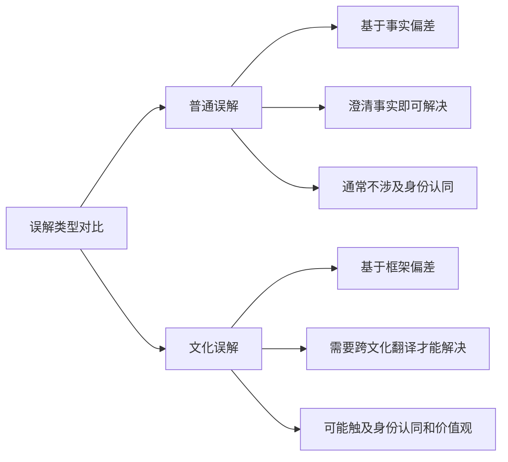
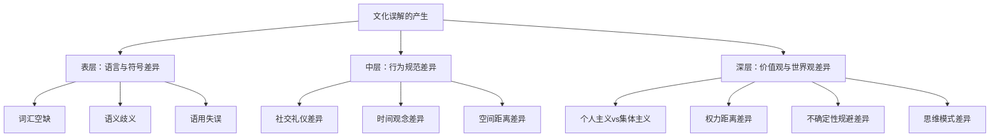
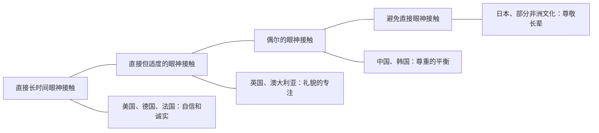
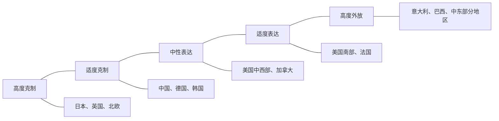
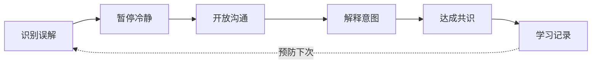
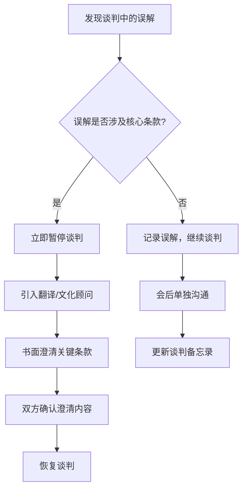
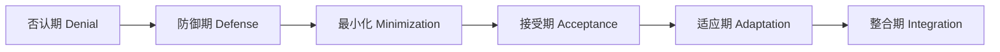
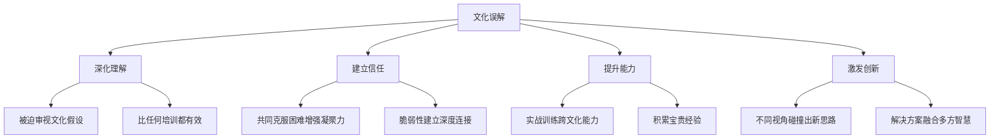

## 五、文化误解的处理

跨文化误解不是"会不会发生"的问题，而是"何时发生"的问题。即使是最有经验的跨文化沟通者，也无法完全避免误解。关键在于：你能否快速识别误解、有效化解误解、甚至将误解转化为深化关系的契机。本章将系统讲解文化误解的类型、成因、预防、处理和转化，帮助你建立一套完整的误解管理体系。

> **本章定位**：在跨文化沟通的知识体系中，本章是"防御篇"的核心。前三章分别讲解了跨文化沟通的基础认知、核心技巧和高阶能力，本章则聚焦于一个不可回避的现实——误解一定会发生。掌握误解处理能力，是从"跨文化沟通学习者"走向"跨文化沟通实践者"的关键分水岭。

### 5.1 文化误解的本质与成因

#### 5.1.1 什么是文化误解

文化误解是指由于文化背景差异，导致信息发送者的意图与信息接收者的理解之间出现偏差的现象。这种偏差可能是轻微的困惑，也可能是严重的冲突。

文化误解与普通沟通误解的核心区别在于三个维度：



**第一，成因不同。** 普通误解源于信息传递过程中的噪音——口齿不清、信息缺失、注意力分散。文化误解源于双方使用了不同的"解码器"——同一组符号（语言、行为、表情），在不同文化框架下被解码为完全不同的含义。

**第二，解决路径不同。** 普通误解可以通过"再说一遍"来解决。文化误解即使"再说十遍"也没用，因为问题不在信息本身，而在解读框架。你必须帮助对方理解你的文化框架，或者调整自己的表达方式来适配对方的框架。

**第三，情感影响不同。** 普通误解通常只造成短暂的困惑。文化误解可能触发身份认同危机——"他是不是因为我是X国人所以这样对我？"——一旦误解被感知为文化歧视或偏见，情感伤害将远超事件本身。

#### 5.1.2 文化误解的三层成因模型

文化误解的产生可以从三个层面来理解，每一层的隐蔽性和解决难度递增：



**表层成因：语言与符号差异**

语言是文化最直接的载体。不同语言之间的词汇、语法、语用规则差异，是文化误解最常见的来源。

- **词汇空缺**：某些概念在一种语言中存在，在另一种语言中没有对应词汇。例如，中文的"关系"在英文中没有精确对应词，"relationship"、"connection"、"network"都无法完全捕捉其含义。日语的"わびさび"（侘寂）描述的是一种审美意识——对不完美和短暂之美的欣赏，英语世界虽借用了这个词，但大多数英语母语者并不能真正理解其内涵。德语的"Schadenfreude"（幸灾乐祸）在英语中直到近年才有对应词。这些词汇空缺意味着：当你要表达某个文化特有的概念时，目标语言中根本没有精确的载体，你只能用近似词来"凑合"，而这种凑合本身就是误解的温床。

- **语义歧义**：同一个词在不同文化中可能有完全不同的含义。例如，"propaganda"在英文中带有强烈的负面含义（欺骗性宣传），而在中文中"宣传"是中性词。英文的"ambitious"是褒义词（有抱负），但在某些欧洲文化中可能带有负面暗示（不择手段）。中文的"老"在"老师"中是尊称，但直译成英文"old teacher"则可能冒犯对方。

- **语用失误**：即使语言正确，使用场合不当也会导致误解。例如，在日本文化中直接说"不"被认为是不礼貌的，日本人常用"ちょっと..."（有点...）来委婉拒绝，而西方人可能将其理解为"有点困难但可以克服"。英国人说"Interesting"往往意味着"我不认同但不想直接反驳"，而非母语者常将其理解为字面意思"有趣"。

**中层成因：行为规范差异**

不同文化对"正常行为"的定义不同。一种文化中礼貌的行为，在另一种文化中可能被视为无礼或奇怪。

- **问候方式**：法国人贴面礼（la bise）的次数因地区而异——巴黎通常两次，马赛可能三次或四次，搞错次数会让人困惑。日本人鞠躬的角度传递不同的敬意程度——15度是日常问候，30度是正式场合，45度是最高敬意。美国人握手时喜欢有力的握感，而在某些亚洲文化中过于用力的握手被视为攻击性。

- **时间观念**：德国人视迟到为不尊重，"准时"意味着提前5分钟到达。拉丁美洲文化对时间的弹性更大，迟到15-30分钟在社交场合是可接受的。印度的"IST"被戏称为"Indian Stretchable Time"，会议延迟开始是常态。中东文化中，当前对话比下一个预约更重要，因此会议超时是尊重对方的表现。

- **空间距离**：北欧人习惯较大的个人空间（约1.2米），拉丁美洲人和中东人在交谈时距离较近（约0.5米），这可能导致北欧人觉得对方"太近了"，而拉丁美洲人觉得对方"太冷淡了"。

**深层成因：价值观与世界观差异**

这是最隐蔽也最难解决的误解来源。价值观差异往往根植于文化传统，当事人可能完全没有意识到自己持有某种特定的价值观假设。

- **个人主义vs集体主义**：美国文化强调个人成就，东亚文化强调群体和谐。当美国经理公开表扬某位东亚员工时，该员工可能感到尴尬而非自豪——因为被单独拎出来意味着脱离了群体。

- **权力距离**：高权力距离文化（如马来西亚、菲律宾）接受等级差异，低权力距离文化（如丹麦、瑞典）追求平等。丹麦经理让实习生直呼其名，可能让来自高权力距离文化的实习生感到不安——在他们的文化框架中，对上级不使用尊称是严重的失礼。

- **不确定性规避**：德国文化偏好详细计划和规则，一份合同可能长达50页；而印度文化更能容忍模糊性和即兴发挥，合同可能只有5页框架性条款，细节在执行中逐步明确。

- **思维模式差异**：Edward T. Hall提出的线性思维（linear thinking）与环形思维（circular thinking）差异，影响着沟通的组织方式。线性思维文化（美国、德国）偏好按时间顺序、因果逻辑组织信息；环形思维文化（中国、日本）习惯先铺垫背景、建立语境，最后才给出结论。当美国同事期待你"先说结论"时，你的"先讲故事"可能被视为效率低下或缺乏重点。

#### 5.1.3 误解产生的心理学机制

从认知心理学角度，文化误解的产生涉及以下心理机制：

- **确认偏误（Confirmation Bias）**：人们倾向于寻找和记住支持自己已有观点的信息。一旦你对某文化形成了先入为主的印象，你会不自觉地关注证实这一印象的行为，而忽略反驳它的证据。

- **归因错误（Fundamental Attribution Error）**：人们倾向于将他人的行为归因于其性格或意图（内因），而将自己的行为归因于情境（外因）。当你看到日本同事在会议上沉默，你可能归因于"他不关心这个项目"（性格归因），而实际原因可能是"在日本文化中，公开表态需要慎重"（情境归因）。

- **透明度错觉（Illusion of Transparency）**：人们高估他人理解自己意图的程度。你以为你的善意"显而易见"，但跨文化背景下，你的善意信号可能被完全误读。

- **群体归因误差（Ultimate Attribution Error）**：将正面行为归因于个体特质，将负面行为归因于群体特征。"他做得好是因为他个人能力强"，"他做得不好是因为X国人都这样"。

### 5.2 误解的常见类型

跨文化误解可以按照其表现形式和影响程度，分为以下六种主要类型：

| 类型 | 表现 | 典型场景 | 严重程度 | 解决难度 |
|------|------|----------|----------|----------|
| **语言误解** | 词汇、语法、语用层面的错误理解 | 翻译错误、俚语误用、口音导致的误听 | ★★☆☆☆ | ★★☆☆☆ |
| **非语言误解** | 对肢体语言、表情、语调的错误解读 | 手势含义差异、眼神接触规范、微笑含义 | ★★★☆☆ | ★★★☆☆ |
| **规范误解** | 对社交规则、商务礼仪的不同期待 | 送礼规范、餐桌礼仪、着装要求 | ★★★☆☆ | ★★☆☆☆ |
| **价值观误解** | 对效率、公平、尊重等核心价值的不同理解 | 决策方式冲突、优先级排序分歧 | ★★★★☆ | ★★★★☆ |
| **情感表达误解** | 对情绪表达方式和强度的不同期待 | 愤怒表达方式、悲伤表达程度、幽默理解 | ★★★★☆ | ★★★☆☆ |
| **认知框架误解** | 对问题分类、因果关系的不同思维方式 | 归因方式差异、风险评估差异、逻辑推理方式 | ★★★★★ | ★★★★★ |

#### 5.2.1 语言误解详解

语言误解是最常见但通常最容易解决的类型。它包括：

**直译陷阱**：将母语的表达方式直接翻译到目标语言。

| 中文原意 | 直译成英文 | 英文实际含义 | 正确表达 |
|----------|-----------|-------------|---------|
| "我很忙"（工作充实） | "I'm very busy" | "我不想见你/我没空理你" | "My schedule is quite full these days" |
| "随便"（都行，你来定） | "Whatever" | "我不在乎/我不尊重你" | "I'm flexible, what do you prefer?" |
| "辛苦了" | "You've worked hard" | 暗示对方做得很吃力 | "Thank you for your effort" / "Great work" |
| "下次请你吃饭"（客套话） | "I'll treat you to dinner next time" | 真实的晚餐邀请 | 不翻译，或理解为寒暄 |
| "你看着办吧" | "You decide" | 可能是授权，也可能是不满 | 需要根据语气和上下文判断 |

**语气词误用**：英语中的"actually"、"well"、"I mean"等语气词有微妙的含义，非母语者常误用。

- "Actually"在句首通常暗示对方之前的认知是错的——"Actually, the meeting is at 3pm"意味着"你以为是其他时间，但你错了"。频繁使用"actually"会让对方觉得你在不断纠正他。
- "Well"作为回答的开头，通常暗示接下来的话不是对方想听的——"Well, about that project..."往往意味着有问题。
- "I mean"用于自我修正或软化语气，但如果频繁使用，会显得犹豫不决或缺乏自信。

**敬语系统混淆**：日语、韩语的敬语系统极其复杂，误用敬语层级可能导致严重失礼。

日语有至少五个敬语层级：
1. **タメ口**（亲昵体）：用于亲密朋友、家人、后辈
2. **です・ます体**（礼貌体）：用于日常社交、同事
3. **尊敬语**（尊他语）：抬高对方的行为
4. **谦让语**（自谦语）：降低自己的行为
5. **丁寧語**（美化语）：通用的礼貌表达

用错层级的后果：对上司使用タメ口（亲昵体）会被认为极度无礼；对亲密朋友使用过高的敬语层级则会产生距离感，暗示"我们没那么熟"。

#### 5.2.2 非语言误解详解

研究表明，人际沟通中高达93%的信息通过非语言渠道传递（Albert Mehrabian, 1971）。需要指出的是，这个数字来自特定实验室条件下的研究，实际比例因情境而异，但非语言信号的重要性毋庸置疑。不同文化对非语言信号的解读差异巨大：

**手势含义地图**：

| 手势 | 美国 | 日本 | 中东 | 巴西 | 希腊 |
|------|------|------|------|------|------|
| 竖大拇指 | 好/赞 | 数字1 | 侮辱性手势 | OK | "够了" |
| OK手势（拇指食指成圈） | OK/没问题 | 金钱 | 侮辱性手势 | 侮辱性手势 | 零/无价值 |
| 摇头 | 不同意 | 不同意 | 不同意 | 不同意 | 同意（部分地区的偏头） |
| 召唤手势（掌心向上，手指弯曲） | 过来 | 仅用于小孩或宠物 | 侮辱性手势 | 正常 | 正常 |
| V字手势（手背朝外） | 数字2 | 胜利 | 可能冒犯 | 正常 | 侮辱性手势 |

**眼神接触的文化光谱**：



- **眼神接触与权力**：在许多西方文化中，向上级汇报时保持眼神接触是自信的表现。但在日本文化中，下属避免直视上级是尊重的表现。一个美国经理可能误解日本员工的"回避目光"为"缺乏自信"或"有所隐瞒"。
- **眼神接触与性别**：在某些中东和南亚文化中，异性之间避免直接的眼神接触是社会规范，而非个人态度的反映。

**沉默的文化含义**：

- **芬兰**：沉默是舒适和信任的表现。芬兰人可以在桑拿房里与朋友安静地坐半小时，而不会觉得尴尬。
- **日本**：沉默（"間" / ma）是有意义的沟通组成部分，代表思考、尊重和含蓄的表达。
- **美国**：沉默通常被视为尴尬，人们会急于填补沉默。美国人在电话中如果沉默超过2-3秒，就会觉得"掉线了"。
- **中国**：沉默可能表示"让我想想"、"我不同意但不想当面说"或"我尊重你的权威，等你继续"——具体含义取决于上下文。
- **巴西**：沉默在社交场合是异常的，可能暗示不满或受伤。

**微笑的多重含义**：

微笑在不同文化中的含义差异极大，这是最容易被误解的非语言信号之一：

- **美国**：微笑通常表示友好和开放，服务行业的"职业微笑"是标准配置。
- **日本**：微笑可能表示尴尬、礼貌、或隐藏真实情绪。日本人在感到悲伤或愤怒时也可能微笑。
- **俄罗斯**：对陌生人微笑被认为是可疑的——"你为什么笑？你有什么企图？"俄罗斯有谚语："无故微笑是愚蠢的标志。"
- **泰国**：微笑（"微笑之国"）有至少13种不同类型，分别表达快乐、尴尬、道歉、尴尬、不满等不同情感。

#### 5.2.3 价值观误解详解

价值观误解是最深层、最难察觉的误解类型。它往往在长期合作中逐渐显现：

**效率vs关系的文化光谱**：

| 维度 | 效率优先文化 | 关系优先文化 |
|------|-------------|-------------|
| 代表国家 | 美国、德国、北欧 | 中国、日本、中东、拉美 |
| 会议风格 | 直奔主题，议程明确 | 先闲聊，自然过渡到正题 |
| 合同态度 | 详细条款，法律约束 | 框架协议，关系保障 |
| 时间观 | 时间是有限资源 | 时间是无限的，关系是有限的 |
| 信任建立 | 通过专业能力建立信任 | 通过个人关系建立信任 |
| 决策依据 | 数据和逻辑 | 关系和共识 |

**真实场景还原**：

> **场景**：美国项目经理Sarah与中国供应商的第一次会议。
>
> Sarah准备了一份详细的议程，期望在1小时内讨论完5个技术问题。会议开始后，中国供应商的李总花了20分钟询问Sarah的旅途、家庭和对中国菜的看法。Sarah越来越焦虑，觉得"在浪费时间"。
>
> **Sarah的内心独白**："我们只有1小时，他还在聊家常。这人不专业。"
> **李总的内心独白**："我花时间了解她，表达我的诚意和重视。她一直看手表，是不是不尊重我？"
>
> **根因分析**：Sarah使用效率优先文化的解码器解读了关系优先文化的行为。李总的行为在中国商务文化中是标准的"暖场"环节，是建立信任的必要投资。

**直接vs间接的文化冲突**：

荷兰人以直言不讳（bespreekbaarheid，"一切都可以公开讨论"）著称，而泰国文化强调"面子"（การรักษาหน้า），批评通常非常委婉。当荷兰经理直接说"This report is poorly written, you need to redo it"，泰国员工可能听到的是"You are incompetent and I don't respect you"，而荷兰经理的本意只是"This specific document needs revision"。

#### 5.2.4 规范误解详解

规范误解涉及社交礼仪、商务惯例等行为层面的差异：

**送礼规范对比**：

| 文化 | 推荐做法 | 绝对禁忌 |
|------|---------|----------|
| 中国 | 双手递送，不当面拆开；红色包装 | 钟表（送终）、白色包装（丧事）、4的数字 |
| 日本 | 包装精美，双手递送；谦虚地说"小小心意" | 当面拆开（让对方稍后再拆）、偶数金额 |
| 德国 | 适度的礼物，鲜花（奇数支）| 红玫瑰（爱情暗示）、过于昂贵（贿赂嫌疑） |
| 中东 | 高品质的礼物，表示尊重 | 酒精饮品（伊斯兰文化）、猪皮制品 |
| 巴西 | 咖啡、巧克力、鲜花 | 紫色和黑色包装（哀悼色彩） |

**餐桌礼仪中的误解陷阱**：

- **吃光盘中食物**：在中国表示"食物很好吃，主人招待周到"；在日本表示同样的意思；但在某些中东文化中，吃光所有食物暗示主人准备不足，应留一点。
- **喝酒文化**：在韩国商务晚餐中，拒绝同僚或上级的敬酒可能被视为不给面子；在伊斯兰文化中，任何酒精都是禁忌。
- **付账**：在中国，朋友聚餐抢着付账是文化规范；在荷兰，AA制（Going Dutch）是默认规则；在美国，通常由邀请方付账。

#### 5.2.5 情感表达误解详解

不同文化对情绪表达的期待差异巨大：

**情绪表达的压抑与释放光谱**：



- **愤怒表达**：在德国和荷兰，直接表达愤怒和不满（"I'm not happy with this"）被视为诚实和坦率。在日本，公开表达愤怒是严重的失态，不满通常通过沉默、第三方转达或极度委婉的方式表达。
- **悲伤表达**：地中海文化（意大利、希腊）鼓励公开表达悲伤和哀痛；英国文化强调"Keep calm and carry on"，在公共场合过度表达悲伤被视为失控。
- **幽默理解**：英国的自嘲式幽默（self-deprecating humour）在很多文化中被误解为缺乏自信。美国的夸张幽默（"That was the WORST presentation ever!"）在低语境文化中可能被当真。日本的"空気を読む"（读空气）幽默要求听众主动理解言外之意。

#### 5.2.6 认知框架误解详解

这是最隐蔽、最高级的误解类型，涉及思维方式本身的不同：

**归因方式差异**：

当一个项目失败时：
- **美国团队**倾向于归因于个人——"John的管理能力不足"（个人归因）
- **日本团队**倾向于归因于系统——"我们的流程没有及时发现问题"（系统归因）
- **中国团队**可能归因于外部——"市场环境变化太快"（环境归因）

**逻辑推理方式**：

- **演绎式**（西方主流）：从一般原则到具体结论。"公司规定所有超过10万的采购需要审批，这个采购是15万，所以需要审批。"
- **归纳式**（部分亚洲文化）：从具体案例到一般原则。"上次12万的采购出了问题，所以我们应该对大额采购进行审批。"
- **类比式**（中国传统思维）：通过类比来论证。"隔壁公司就是因为采购不规范出了问题，我们不能重蹈覆辙。"

### 5.3 误解的预防策略

**预防胜于治疗**。在跨文化沟通中，预防误解比事后纠正更有效，成本也更低。以下是系统化的预防策略：

#### 5.3.1 文化情报收集（Cultural Intelligence Preparation）

Cultural Intelligence（CQ，文化智商）由伦敦商学院P. Christopher Earley和新加坡南洋理工大学Soon Ang提出，包含四个维度：CQ驱动（动机）、CQ知识（认知）、CQ策略（元认知）、CQ行动（行为）。在重要的跨文化互动之前，进行有针对性的文化情报收集：

**系统化情报收集框架**：

| 维度 | 具体内容 | 信息来源 |
|------|---------|---------|
| Hofstede六大文化维度 | 权力距离、个人/集体主义、男性化/女性化、不确定性规避、长期/短期导向、放纵/克制 | hofstede-insights.com |
| 高语境vs低语境 | 信息多少在字面上，多少在上下文中 | Edward T. Hall的研究 |
| 商务礼仪 | 着装、名片交换、称呼方式、送礼规范 | 专业跨文化指南、当地同事 |
| 禁忌清单 | 敏感话题、禁忌手势、颜色含义、数字禁忌 | 当地文化专家 |
| 沟通风格 | 直接/间接、正式/非正式、线性/环形 | 文化桥梁人 |
| 决策风格 | 自上而下/共识驱动、快/慢 | 商务文化指南 |
| 冲突处理 | 直接对抗/第三方调解/回避 | 案例研究 |

**实用情报收集的五个渠道**：

1. **学术框架**：Hofstede的文化维度理论、Erin Meyer的"The Culture Map"、Richard Lewis的"when cultures collide"提供了系统化的文化比较框架。
2. **当地同事或朋友**：他们能提供教科书上没有的"潜规则"和真实案例。
3. **跨文化培训**：专业的跨文化培训机构（如Berlitz、Farnham Castle）提供针对特定文化的深度培训。
4. **在线社区**：Reddit的r/crosscountry、Expat Forum等社区有大量第一手经验分享。
5. **文化智能评估工具**：CQ Assessment（culturalq.com）可以量化你的文化智商水平，识别需要提升的维度。

#### 5.3.2 建立"文化确认"习惯

在重要沟通中，养成定期确认理解的习惯。这不仅适用于跨文化场景，但在跨文化场景中尤为重要：

**三级确认体系**：

- **一级确认：即时复述**——在对话过程中，用自己的话复述对方的关键观点并请求确认。

推荐表达方式（按正式程度排列）：
- 正式场合："If I understand correctly, you're suggesting that... Is that right?"
- 中等场合："So just to make sure we're on the same page, you mean..."
- 非正式场合："So basically you're saying...?"

- **二级确认：书面确认**——重要决策和协议，通过邮件或备忘录进行书面确认。书面确认的关键不是"记下来"，而是"让对方有机会纠正你的理解"。

邮件模板：
Subject: Meeting Summary & Alignment Check

Hi [Name],

Thank you for the productive discussion today. I want to make 
sure I've captured our alignment correctly:

1. [Key decision/conclusion #1]
2. [Key decision/conclusion #2]  
3. [Action items and owners]

Please let me know if any of the above doesn't match your 
understanding. I'm happy to schedule a follow-up to clarify.

Best regards,
[Your name]

- **三级确认：多渠道验证**——重要信息不仅通过口头传达，还通过书面、图示、原型等多种方式确认。尤其在技术讨论中，画一张流程图往往比用文字描述更不容易产生误解。

#### 5.3.3 培养"文化谦逊"心态

文化谦逊（Cultural Humility）由Melanie Tervalon和Jann Murray-García于1998年在医疗领域提出，后被广泛应用于跨文化沟通。与"文化能力"（Cultural Competence）不同，文化谦逊强调：你永远不可能"完全掌握"另一种文化，学习是一个持续的过程。

**文化谦逊的三个核心实践**：

1. **承认无知**：坦然承认自己对对方文化的了解有限，保持学习心态。这不是示弱，而是建立信任的起点。表达方式："I realize I may not fully understand the cultural context here. Could you help me understand how this works in your experience?"

2. **延迟判断**：遇到不理解的行为时，启动"文化解码器"而非"评判器"：
   - ❌ "他怎么这么不守时？" → ✅ "他的文化对时间有不同的理解，让我了解一下背景。"
   - ❌ "她为什么不直接回答我的问题？" → ✅ "她可能在用间接方式表达某种信息。"
   - ❌ "他们做事怎么这么慢？" → ✅ "他们的决策流程可能更注重共识建设。"

3. **主动询问**：不确定时直接询问，而不是猜测。但注意询问的方式：
   - ✅ "In your experience, what's the typical approach to [situation] in [country/culture]?"
   - ✅ "I want to make sure I'm being respectful — is there anything I should know about [topic]?"
   - ❌ "你们X国人是不是都这样？"（将个体代表整个文化）

#### 5.3.4 建立"文化桥梁人"网络

在跨文化团队中，识别并依靠"文化桥梁人"——那些精通双方文化、能够在不同文化框架之间进行翻译的人。他们不仅翻译语言，更翻译文化：

**三类文化桥梁人**：

| 类型 | 优势 | 局限 | 适用场景 |
|------|------|------|---------|
| **内部双文化成员** | 了解组织内部语境，长期可用 | 可能有立场偏向 | 日常跨文化协调 |
| **外部跨文化顾问** | 专业性强，视角中立 | 成本较高，不了解内部语境 | 重大文化冲突、战略级跨文化项目 |
| **信任的本地朋友** | 真实、接地气，可以私下咨询 | 不了解商务语境 | 社交场合、个人文化困惑 |

**如何识别潜在的文化桥梁人**：
- 他们在两种文化中都有长期生活或工作经历
- 他们能在两种文化框架之间自如切换
- 他们被双方文化的人所信任
- 他们对文化差异有敏锐的观察力和准确的描述能力

#### 5.3.5 数字沟通中的文化预防

在远程工作和数字沟通日益普遍的今天，数字环境中的跨文化误解预防尤为关键：

**邮件沟通**：
- **开头寒暄**：与关系优先文化的伙伴通信时，务必在开头加上适当的寒暄（询问近况、表达问候），不要直奔主题。
- **语气校准**：文字邮件无法传递语调，同一句话在不同文化中可能被解读为"冷淡"或"过于随意"。建议在重要邮件中使用更明确的礼貌表达。
- **回复时效**：德国、美国通常期望24小时内回复；日本、中国可能接受稍长的回复周期，但如果是上级发来的邮件，延迟回复可能被理解为不尊重。

**即时通讯（WhatsApp、Slack、Teams）**：
- **表情符号**：😂（笑哭）在年轻人中是常用的表情，但在正式商务沟通中可能被视为不专业。👍在某些文化中是友好的，但在中东可能有冒犯性。
- **语音消息**：在拉丁美洲和中东，语音消息很受欢迎；在美国和北欧的商务场合，语音消息可能被视为不正式。
- **在线会议**：摄像头开关的文化期待——在美国，开摄像头是"presence"的表现；在日本，有些人认为关摄像头是为了不给对方造成"必须看你"的负担。

### 5.4 误解发生后的处理步骤

当误解确实发生时，可以遵循以下六步处理流程：



#### 第一步：识别误解

识别误解是处理误解的前提。常见的误解信号包括：

**误解信号的四级分类**：

| 信号级别 | 具体表现 | 应对策略 |
|---------|---------|---------|
| **一级：语言信号** | 频繁询问"您是什么意思？"、"能再解释一下吗？"、复述你的话时出现偏差 | 立即澄清，换一种方式表达 |
| **二级：非语言信号** | 困惑的表情、皱眉、迟疑的沉默、不自然的笑容、身体后倾 | 暂停当前话题，主动确认理解 |
| **三级：行为信号** | 没有按照预期行动、出乎意料的反应、后续行动不一致 | 安排一对一沟通，深入了解对方的理解 |
| **四级：情绪信号** | 突然冷淡、防御性语气、激动或愤怒、回避沟通 | 立即暂停，安排冷却期后再处理 |

**关键原则**：不要假设一切都进行顺利。在跨文化沟通中，"没有反应"不等于"理解正确"。很多高语境文化的人即使感到困惑或不同意，也不会直接表达出来。

#### 第二步：暂停并冷静

发现误解后，不要急于解释或辩护。先暂停，给自己和对方一些空间：

- **暂停发言**：停止当前的话题，给双方思考的时间
- **管理情绪**：如果误解引发了负面情绪，先处理情绪再处理问题。认知行为疗法（CBT）中的"STOP技术"在此非常有效：
  - **S**top：停下来，不要立即反应
  - **T**ake a breath：深呼吸，给大脑一个缓冲
  - **O**bserve：观察自己的情绪和身体反应
  - **P**roceed：在冷静的状态下决定下一步行动
- **换个环境**：如果气氛紧张，可以建议稍作休息。"Shall we take a 10-minute break? I think it would help us both gather our thoughts."

**关键原则**：不要在情绪激动时试图解决误解。神经科学研究表明，当杏仁核被激活（情绪激动状态），前额叶皮层（理性思考区域）的功能会受到抑制，此时的判断和决策质量会大幅下降。

**冷却期的时间指南**：
- 轻微误解：5-10分钟的短暂休息即可
- 中度误解：可能需要几个小时甚至一天的冷却时间
- 严重误解（涉及价值观冲突）：可能需要2-3天的冷却期，甚至需要第三方介入

#### 第三步：开放沟通

用开放性、非指责性的方式开启对话。这一步的核心是"将人与问题分开"（Getting to Yes, Fisher & Ury）：

**推荐表达方式（按场景分类）**：

确认理解：
- "我想确认一下，您是怎么理解刚才那句话的？"
- "我感觉我们可能有些地方没有对齐，能分享一下您的想法吗？"
- "I'd like to make sure we're on the same page. Could you walk me through how you understood our last discussion?"

表达不确定性：
- "I realize I might have expressed that poorly. Could you tell me what you heard?"
- "我担心我可能没有表达清楚，能告诉我您是怎么理解的吗？"

邀请对方分享：
- "I sense something might be off. I'd really value hearing your perspective."
- "我想更好地理解您的看法，能否分享一下您的思考？"

**绝对避免的表达方式**：

| 错误表达 | 为什么有害 | 替代表达 |
|---------|-----------|---------|
| "你误会了" | 指责对方理解能力差 | "可能我没有表达清楚" |
| "你怎么会这么想？" | 质疑对方的智力 | "我很好奇你是怎么看的" |
| "我说的明明是..." | 否定对方的感受 | "我原本想表达的是..." |
| "这不是我的问题" | 推卸责任 | "让我们一起看看问题出在哪里" |
| "你们X国人就是..." | 文化定性，极度冒犯 | 避免任何以文化群体为主语的判断 |

**关键原则**：将误解归因于沟通方式，而非对方的理解能力。"可能我没有表达清楚"比"你听错了"更有利于解决问题。在心理学中，这被称为"非暴力沟通"（Nonviolent Communication, NVC）的实践——观察而非评判，表达需要而非指责。

#### 第四步：解释意图

清楚地解释你的真实意图，而非为对方的理解辩护。这一步的核心是"文化自我披露"——向对方展示你的文化框架：

**文化自我披露的模板**：

[观察] 我注意到 [具体行为/反应]
[假设] 我的理解是 [你的解读]
[意图] 我想让你知道，我当时的真实意图是 [你的真实意图]
[文化背景] 在我的文化/经验中，[解释你的文化框架]
[邀请] 我很好奇，在你的文化/经验中，这种情况通常是怎么理解的？

**实际对话脚本**：

> **场景**：德国工程师Hans的直接反馈让中国同事Wei感到被冒犯。
>
> Hans："Wei, I noticed you seemed upset after I reviewed your report yesterday. I want to clarify something. When I said 'This section needs to be completely rewritten,' I was focusing entirely on the work product, not on you as a person. In my culture, direct feedback is actually a sign of respect — it means I trust you enough to be honest with you. I realize this might have come across differently in your experience. Could you help me understand how you felt about it?"

> Wei："Thank you for bringing this up, Hans. When I heard 'completely rewritten,' I felt like my effort wasn't valued. In my experience, feedback is usually given more indirectly, with positive points first. I understand now that you were trying to be efficient and honest. I appreciate you explaining your intention."

**关键原则**：解释意图不是为了证明自己是对的，而是为了让对方理解你的文化框架。同时，也要展现出你愿意理解对方文化框架的诚意。

#### 第五步：达成共识

确认双方现在有了一致的理解，并就后续行动达成一致。共识不是"谁说服了谁"，而是"找到了双方都能接受的新框架"：

**共识达成的四步法**：

1. **复述理解**：双方分别用自己的话复述对问题的理解，确认一致。
2. **寻找共同点**：识别双方的共同目标和价值观。"我们都希望项目成功，都重视团队合作。"
3. **创造新框架**：基于共同点，创造一个融合双方文化智慧的新方案。
4. **书面确认**：重要共识以书面形式确认（邮件、备忘录），并明确下一步行动和检查点。

**实际对话脚本**：

> **场景**：美国经理和日本团队就"问题上报"达成共识。
>
> American manager: "So let me summarize what we've agreed on: when a problem arises, you'll have 24 hours for internal team discussion. After that, you'll bring it to the team meeting with both the problem analysis and 2-3 proposed solutions. Does this match your understanding?"
>
> Japanese team lead: "Yes, and if I may add — during those 24 hours, we'll also prepare a brief written summary so the information is complete when we present. We want to make sure the team meeting is efficient."
>
> American manager: "That's a great addition. Let me send a quick email summarizing this agreement so we have it documented."

#### 第六步：学习与记录

每一次误解都是一次学习机会。系统性地记录和反思，是将"偶然事件"转化为"组织能力"的关键：

**误解反思的"五问框架"**：

1. **发生了什么？**（客观事实，不含判断）
2. **为什么会发生？**（分析根本原因：语言、规范还是价值观？）
3. **我的文化假设是什么？**（我默认了什么"正常"标准？）
4. **对方的文化逻辑是什么？**（对方的行为背后有什么文化合理性？）
5. **下次我能做什么不同？**（具体的行动改进）

**知识转化的三个层次**：

| 层次 | 内容 | 存储位置 |
|------|------|---------|
| 个人学习 | 我从这次经历中学到了什么 | 个人文化笔记 |
| 团队学习 | 团队其他人也能从中学到什么 | 团队Wiki、文化分享会 |
| 组织学习 | 这是否反映了一个系统性问题 | 跨文化培训材料、流程改进 |

### 5.5 特殊场景下的误解处理

#### 5.5.1 国际商务谈判中的误解

国际商务谈判中的误解往往涉及利益，处理不当可能导致谈判破裂甚至法律纠纷。谈判中的文化误解比日常社交误解更危险，因为它直接影响经济利益和商业关系。

**谈判中的六大文化误解陷阱**：

| 陷阱 | 表现 | 典型文化组合 | 后果 |
|------|------|-------------|------|
| 节奏误解 | 一方认为"进展太慢"，另一方认为"太快了" | 美国vs中国/中东 | 被误解为缺乏诚意或过于急躁 |
| "不"的表达 | 一方直接拒绝，另一方用委婉方式拒绝 | 荷兰vs日本 | 将委婉的"不"理解为"也许" |
| 合同理解 | 一方视合同为最终协议，另一方视为关系框架 | 德国vs印度 | 执行中产生大量分歧 |
| 决策权 | 一方以为对方有决策权，实际需要上级批准 | 美国vs中国 | 等待决策时产生不信任 |
| 情绪表达 | 一方的正常情绪表达被另一方视为失控 | 意大利vs日本 | 关系紧张，信任受损 |
| 让步信号 | 一方的礼貌性让步被理解为真实承诺 | 英国vs巴西 | 后续被指责"出尔反尔" |

**谈判误解的应急处理流程**：



**实战建议**：
- 重要谈判前，务必安排一次非正式的社交活动（晚餐、茶歇），为双方建立个人层面的信任。这种信任在误解发生时可以充当"缓冲垫"。
- 准备一个"谈判日记"，记录每次会议中观察到的文化信号和可能的误解苗头。
- 涉及金额超过一定阈值的谈判，强烈建议聘用双语双文化的翻译，而非仅语言层面的翻译。

#### 5.5.2 跨文化团队协作中的误解

跨文化团队中的误解具有一个独特特征：它往往不是一次性事件，而是反复出现的模式。同一个文化差异可能以不同形式反复制造误解，直到团队找到有效的应对机制。

**跨文化团队的四大系统性误解模式**：

**模式一：决策方式冲突**
- 低权力距离文化成员期望参与讨论和决策
- 高权力距离文化成员习惯等上级决定后执行
- **解决方案**：明确每个决策的决策方式——"这是一个民主讨论型决策"还是"这是一个管理层决策"

**模式二：反馈风格冲突**
- 直接反馈文化（荷兰、德国、以色列）：有问题直接说
- 间接反馈文化（日本、泰国、中国）：先肯定再建议
- **解决方案**：建立团队的"反馈协议"——约定反馈的格式和场合

**模式三：会议参与度差异**
- 主动发言文化（美国、巴西）：积极参与，打断被视为热情
- 被动发言文化（日本、芬兰）：等别人说完再发言，打断被视为无礼
- **解决方案**：使用"发言权令牌"制度，或在会议中安排"静默思考"时间

**模式四：截止日期理解差异**
- 严格截止日期文化（德国、美国）：deadline是刚性的
- 弹性截止日期文化（印度、中东）：deadline是目标，可以协商
- **解决方案**：明确区分"硬截止日期"（不可协商）和"软截止日期"（可以讨论调整）

**团队文化协议模板**：

```markdown
# 我们的团队文化协议

## 沟通
- 工作语言：English
- 默认语境：Low-context (be explicit)
- 反馈风格：Direct but respectful (no personal attacks)

## 决策
- 小决策：Team lead decides after 24h input period
- 大决策：Team discussion → consensus → lead has final say
- 紧急决策：Lead decides, informs team ASAP

## 时间
- 截止日期默认为刚性，如需调整请提前48小时通知
- 会议准时开始，迟到者请道歉并说明原因

## 冲突
- 第一选择：当事人直接沟通
- 第二选择：邀请文化桥梁人协助
- 第三选择：升级到团队负责人

## 学习
- 每月一次"文化分享"环节
- 误解发生后，记录到团队文化学习文档
```

#### 5.5.3 外派工作者（Expat）的误解处理

外派工作者面临独特的误解挑战——他们需要在日常工作和生活中持续进行跨文化沟通，误解的频率和压力远高于偶尔的跨文化互动。

**外派工作者常见的"文化疲劳"信号**：
- 对当地文化习惯从"新鲜好奇"转变为"烦躁不耐"
- 开始过度泛化："他们总是..."、"他们从不..."
- 社交圈缩回到本国人圈子
- 对文化差异的敏感度下降，更容易"忘记"文化差异

**外派误解的三层处理策略**：

1. **即时处理**：按5.4节的六步法处理当前误解
2. **模式识别**：每2-4周回顾一次，识别反复出现的误解模式。"我又因为在会议上太直接而让对方不高兴了"——这说明需要调整的是行为模式，而不仅仅是单次应对。
3. **文化整合**：长期目标不是"避免所有误解"，而是达到Bennett的跨文化敏感度发展模型（DMIS）中的"适应"阶段——能够根据情境灵活切换文化行为。

**Bennett的DMIS发展模型**：



| 阶段 | 对文化差异的态度 | 误解处理能力 |
|------|-----------------|-------------|
| 否认期 | "他们和我们没什么不同" 或刻意回避 | 几乎没有，频繁犯同样的错误 |
| 防御期 | "他们的方式不如我们的好" | 低，倾向于归咎对方 |
| 最小化期 | "文化差异不重要，人性都一样" | 中等，但会忽略重要差异 |
| 接受期 | "文化差异是真实存在的，需要尊重" | 较高，能主动预防和识别误解 |
| 适应期 | "我能灵活调整自己的行为来适应不同文化" | 高，能有效处理复杂误解 |
| 整合期 | "文化差异是我的一部分，我可以在不同文化间自如切换" | 很高，能将误解转化为学习机会 |

#### 5.5.4 跨文化客户服务中的误解

面对跨文化客户时，误解不仅影响客户满意度，还可能影响品牌声誉和市场份额。在社交媒体时代，一次文化误解可能迅速被放大为公关危机。

**客户服务中的高频文化误解**：

| 场景 | 客户期望 | 服务方行为 | 误解结果 |
|------|---------|-----------|---------|
| 问题反馈 | 德国客户期望详细的技术原因 | 模糊的道歉和承诺改进 | "他们不专业" |
| 服务态度 | 日本客户期望谦恭和耐心 | 美国式快速、高效服务 | "他们态度冷漠" |
| 投诉处理 | 中国客户期望关系维护和面子保全 | 标准化的SOP回复 | "他们不重视我" |
| 承诺理解 | 中东客户将口头承诺视为约定 | 将口头讨论视为"初步想法" | "他们不守信用" |

**预防与处理策略**：
- **客户画像**：在CRM系统中记录客户的文化背景和沟通偏好
- **服务话术库**：针对不同文化客户准备不同的话术模板
- **投诉升级路径**：设置文化敏感的投诉升级路径——某些文化中，客户宁可绕过一线客服直接找"有分量的人"
- **事后复盘**：每季度回顾跨文化客户投诉，识别系统性问题

### 5.6 化误解为机遇

高明的跨文化沟通者不仅能够处理误解，还能将误解转化为深化关系的契机。这是一种能力，更是一种心态。

#### 5.6.1 误解的积极价值



**深化理解**：误解的发生往往是深入了解对方文化的最佳切入点。当误解发生时，双方被迫审视各自的文化假设，这比任何文化培训都更有效。理论学习告诉你"日本人重视面子"，但一次因为没有给面子而导致的误解，才让你真正理解"面子"意味着什么。

**建立信任**：共同经历并成功解决误解的关系，往往比从未经历过考验的关系更牢固。心理学中的"脆弱性连接"（vulnerability bond）理论指出：当你在对方面前展示了不完美（犯了错、产生了误解），并得到了理解和支持，你们之间的信任反而会加深。这类似于Brené Brown所说的"脆弱的力量"（The Power of Vulnerability）。

**提升能力**：每一次误解都是一次跨文化能力的实战训练。就像运动员通过比赛中的失误来提升技能，跨文化沟通者通过误解来磨练文化敏感度。

**创新启发**：不同文化的碰撞有时会产生意想不到的创新火花。哈佛商学院的研究表明，文化多样性团队如果能有效管理文化冲突，其创新产出比同质化团队高出20%以上。

#### 5.6.2 将误解转化为机遇的策略

**策略一：主动分享学习心得**

误解解决后，不要假装什么都没发生。主动分享你的学习心得，让对方感受到你的诚意和成长：

> "I want to thank you for that conversation we had last week about the project timeline. I learned something important about how different cultures approach planning. I realized that I was imposing my own cultural framework without even being aware of it. This experience has made me a better communicator, and I'm grateful for your patience."

**策略二：建立"文化学习伙伴关系"**

将误解的解决过程转化为长期的文化学习伙伴关系。约定：每次发现新的文化差异时，双方都分享自己的视角。

> "Since we've already had one of 'those' conversations, would you be open to making it a regular thing? I'd love to learn more about how things work in your culture, and I'm happy to share mine."

**策略三：故事化传播**

将误解经历故事化，在团队中分享（经当事人同意），帮助他人避免类似误解。好的故事比干巴巴的规则更容易被记住和传播。

**策略四：制度化改进**

将误解中发现的系统性问题，转化为团队或组织的制度改进。一次个人误解是个案，但如果是多次类似误解，就需要制度层面的解决方案。

#### 5.6.3 案例：从误解到深度合作

**案例一：中美合资企业的"汇报时间"冲突**

某中美合资企业的中方团队和美方团队在项目管理上产生了严重误解。中方团队习惯在问题出现后先内部讨论、形成共识，再向上汇报；美方团队习惯在问题出现后立即公开讨论、快速决策。美方经理认为中方团队"隐瞒问题"，中方团队认为美方经理"不顾及面子、过于激进"。

经过一次深入的文化对话，双方理解了彼此的逻辑：中方的"先内部讨论"是为了确保汇报时信息完整、方案成熟——这是一个"负责任"的表现，而非"隐瞒"。美方的"立即讨论"是为了快速响应、避免问题扩大——这是一个"高效"的表现，而非"激进"。

双方最终建立了"24小时规则"：问题出现后，中方团队有24小时内部讨论时间，然后必须在团队会议上公开讨论。这个规则融合了双方文化的智慧：既给了中方团队准备的时间，又保证了美方团队的响应速度。

**结果**：项目管理效率提升了35%（以问题平均解决时间衡量），团队满意度调查中"跨文化协作"评分从2.8提升到4.2（满分5分）。

**案例二：德国-巴西团队的"截止日期"冲突**

德国工程师和巴西设计师在产品开发中频繁因截止日期产生冲突。德国团队将截止日期视为"刚性承诺"，巴西团队将其视为"弹性目标"。德国人觉得巴西人"不守承诺"，巴西人觉得德国人"死板不灵活"。

团队负责人引入了一个新制度：将所有截止日期分为"铁定日期"（Immutable Deadline）和"目标日期"（Target Date）两类。铁定日期用于法律要求、客户交付等不可协商的时间点；目标日期用于内部里程碑，可以协商调整。

**结果**：截止日期相关的冲突减少了70%，巴西团队在"铁定日期"上的准时率从60%提升到95%，德国团队也学会了在"目标日期"上给予更多弹性。

**案例三：日英联合研发团队的"反馈"冲突**

日本工程师和英国项目经理在代码审查中产生了严重的误解。英国经理在审查会上直接指出："This code has three major issues that need to be fixed."日本工程师感到被当众羞辱，在后续两周中消极怠工。

第三方文化顾问介入后，为团队设计了一套"反馈协议"：
1. **书面初审**：反馈首先以书面形式提交，给对方消化的时间
2. **三明治结构**：正面评价→改进建议→总体肯定
3. **私下改进**：具体的一对一改进讨论，不在团队面前
4. **公开认可**：在团队会议上公开认可改进成果

**结果**：代码质量提升了25%（以bug数量衡量），日本工程师的参与度显著提高，英国经理也学会了在直接和尊重之间找到平衡。

### 5.7 常见误区与纠正

#### 误区一：认为"文化误解只发生在语言不通时"

**纠正**：即使使用同一种语言，文化误解仍然可能发生。美国、英国、澳大利亚都说英语，但在幽默方式、礼貌规范、商务礼仪上存在显著差异。英式幽默的讽刺和含蓄让很多美国人"get不到"；美国人的热情和夸张让很多英国人觉得"太过了"。同一种语言内部的文化误解，有时比不同语言之间的误解更隐蔽，因为双方会误以为"我们说的是同一种语言，应该不会有沟通障碍"。

#### 误区二：认为"文化误解是对方的问题"

**纠正**：文化误解是双方文化框架碰撞的结果，不存在"谁对谁错"。将责任归咎于对方，只会阻碍问题的解决。在沟通中，发送者和接收者都有责任确保信息被正确理解。如果对方没有理解你的意思，可能是你的表达方式不适合对方的文化框架，而不是对方"理解能力差"。

#### 误区三：认为"了解文化刻板印象就能避免误解"

**纠正**：文化刻板印象（如"日本人很含蓄"、"德国人很严谨"）只能提供粗略的参考，不能替代真实的个体了解。过度依赖刻板印象可能导致两种新问题：（1）忽视个体差异——不是所有日本人都含蓄，不是所有德国人都严谨；（2）产生自我实现的预言——你预期对方会"含蓄"，于是用一种暗示对方含蓄的方式沟通，反而限制了对方的表达空间。

#### 误区四：认为"误解解决后就万事大吉"

**纠正**：误解的解决只是第一步。如果没有反思和学习，同样的误解可能反复发生。将误解转化为系统性的学习和改进，才是真正的解决。一个组织如果只是在每次误解后道歉和解释，却从不更新自己的跨文化知识库和流程，那么它将永远停留在"救火"阶段。

#### 误区五：认为"避免敏感话题就能避免误解"

**纠正**：文化误解往往发生在日常互动中，而非敏感话题上。问候方式、时间观念、决策风格等日常细节，才是误解的高发区。事实上，刻意回避敏感话题本身也可能成为误解的来源——对方可能解读为"你不愿意深入了解我的文化"。

#### 误区六：认为"文化适应就是放弃自己的文化身份"

**纠正**：跨文化适应不是"变成另一个人"，而是"扩展你的行为库"。你可以保持自己的核心文化身份，同时学习新的行为方式来适应不同情境。这就像学习一门新语言——掌握英语不意味着放弃中文，而是多了一种表达工具。

#### 误区七：认为"跨文化培训一次就够了"

**纠正**：跨文化能力是需要持续练习和更新的技能，不是一次性学习就能掌握的知识。文化本身也在变化——日本年轻一代的沟通风格比老一代更直接，中国Z世代的工作态度与70后有显著差异。持续学习和适应是跨文化能力的核心特征。

### 5.8 误解处理的进阶工具

#### 5.8.1 文化误解日志模板

建立系统化的误解记录习惯，可以帮助你积累跨文化经验。建议每周回顾一次，每月做一次模式分析：

| 日期 | 场景 | 对方文化 | 误解内容 | 根本原因（语言/规范/价值观） | 我的文化假设 | 对方的文化逻辑 | 处理方式 | 处理效果 | 学到的教训 | 行动改进 |
|------|------|----------|----------|---------------------------|-------------|---------------|---------|---------|-----------|---------|
| 示例1 | 商务会议 | 日本 | 我的直接反馈让对方沉默 | 规范差异（面子文化） | 直接=高效+尊重 | 直接=当众羞辱 | 改用三明治反馈法 | 对方恢复积极 | 高语境文化中委婉更有效 | 准备反馈前先写下来，调整措辞 |
| 示例2 | 团队邮件 | 巴西 | 回复邮件时没有寒暄被误解为冷淡 | 规范差异（关系优先） | 直奔主题=高效 | 直奔主题=不重视关系 | 补发一封带寒暄的邮件 | 关系修复 | 不同文化对"效率"的定义不同 | 邮件模板加入文化适配层 |

#### 5.8.2 跨文化沟通预检查清单

在重要跨文化互动前，使用以下检查清单进行系统化准备：

**基础准备**：
- [ ] 了解对方文化的基本沟通风格（直接/间接、高语境/低语境）
- [ ] 了解对方文化在Hofstede六大维度上的大致位置
- [ ] 了解对方文化的禁忌和敏感话题
- [ ] 了解对方文化对时间和日程的态度

**策略准备**：
- [ ] 准备好用多种方式表达关键信息（直接版和委婉版）
- [ ] 安排文化桥梁人或翻译（如有需要）
- [ ] 预留比平常更多的时间（跨文化沟通通常需要更多时间）
- [ ] 准备好开放性问题用于确认理解
- [ ] 制定误解发生时的应急方案

**心态准备**：
- [ ] 提醒自己：对方的行为背后有合理的文化逻辑
- [ ] 提醒自己：我的"正常"标准不是唯一的"正常"标准
- [ ] 提醒自己：误解是学习的机会，不是失败的标志

**数字沟通专项准备**：
- [ ] 确认对方对即时通讯/邮件/视频通话的偏好
- [ ] 准备好书面版本的关键信息（跨语言沟通时尤为重要）
- [ ] 测试视频会议工具，确保技术不会成为额外的沟通障碍
- [ ] 考虑时区差异，选择双方都方便的时间

#### 5.8.3 误解处理能力自评量表

定期（建议每季度）评估自己的误解处理能力，持续提升。使用1-5分评分：

| 能力维度 | 1分（初级） | 3分（中级） | 5分（高级） | 我的评分 |
|---------|-----------|-----------|-----------|---------|
| **识别能力** | 只在误解爆发后才意识到 | 能在误解升级前识别信号 | 能在误解萌芽阶段就察觉并预防 | ___ |
| **情绪管理** | 误解引发强烈情绪反应，难以自控 | 能意识到情绪但需要时间平复 | 能快速管理情绪，保持理性沟通 | ___ |
| **沟通技巧** | 倾向于指责对方或自我辩护 | 能使用开放性问题但不够自然 | 能自然运用非暴力沟通技巧 | ___ |
| **文化敏感度** | 用自己的文化标准评判对方 | 知道文化差异但经常忘记应用 | 能从对方的文化框架理解行为 | ___ |
| **学习转化** | 同样的误解反复发生 | 能从误解中学习但知识未系统化 | 建立了个人跨文化知识库并持续更新 | ___ |
| **预防能力** | 被动应对，很少提前准备 | 重要场合会做文化功课 | 将文化意识融入日常沟通习惯 | ___ |
| **桥梁能力** | 只处理自己的误解 | 能帮助团队成员化解误解 | 能设计团队和组织层面的跨文化机制 | ___ |

**评分解读**：
- 7-14分：跨文化沟通新手，建议系统学习跨文化理论并增加实践
- 15-24分：跨文化沟通实践者，有基础能力但需要更多实战经验
- 25-30分：跨文化沟通高手，可以担任文化桥梁人角色
- 31-35分：跨文化沟通专家，可以指导和培训他人

#### 5.8.4 误解化解对话脚本库

以下是常见误解场景的对话脚本，供实际使用时参考和调整：

**场景一：被误解为不尊重**

> 对方："When I was presenting, you were looking at your phone. That was disrespectful."
>
> 你："I owe you an apology, and I also want to explain the context. In my work setting, taking notes on a phone is common and shows engagement. However, I completely understand how it looked from your perspective. I should have been more aware of the cultural context. Going forward, I'll use a notebook instead. And please — if anything I do seems disrespectful again, I'd appreciate you telling me directly so I can address it immediately."

**场景二：决策方式冲突**

> 对方（直接文化代表）："We discussed this three times already. Why can't you just make a decision?"
>
> 你："I understand your frustration, and I appreciate your directness. In my experience, building consensus before deciding leads to better implementation. But I hear you — we need to move forward. How about this: I'll take the input from our discussions, make a recommendation by tomorrow, and share it with everyone for final input before we lock it in. This way we get both the speed you're looking for and the alignment I value."

**场景三：误解升级为冲突**

> 对方（情绪激动）："I feel like you're not taking our culture seriously!"
>
> 你："I hear you, and I take that very seriously. I clearly made a mistake, and I want to understand exactly what I did wrong so I can make it right. This isn't about who's right or who's wrong — it's about making sure we can work together effectively. Could you help me understand what specifically made you feel that way? I promise to listen without defending myself."

#### 5.8.5 文化学习资源整合

**必读书目**：

| 书名 | 作者 | 核心内容 | 适用读者 |
|------|------|---------|---------|
| *The Culture Map* | Erin Meyer | 8个文化维度的实用框架 | 所有跨文化工作者 |
| *Kiss, Bow, or Shake Hands* | Morrison, Conaway, Borden | 各国商务礼仪百科全书 | 商务人士 |
| *When Cultures Collide* | Richard Lewis | 文化分类模型和实战案例 | 管理者和顾问 |
| *The Geography of Thought* | Richard Nisbett | 东西方思维方式的认知科学差异 | 对理论感兴趣的读者 |
| *Intercultural Competence* | Lustig & Koester | 跨文化能力的学术框架 | 学生和研究者 |
| *Riding the Waves of Culture* | Fons Trompenaars | 文化困境模型 | 高级管理者 |

**在线工具**：
- **Hofstede Insights**（hofstede-insights.com）：查询各国文化维度评分
- **CQ Assessment**（culturalq.com）：在线文化智商评估
- **Country Comparison Tool**（globaledge.msu.edu）：多维度国家对比

---

**本节要点回顾**：

1. 文化误解有三层成因：语言与符号差异（表层）、行为规范差异（中层）、价值观与世界观差异（深层），还有四种心理学机制（确认偏误、归因错误、透明度错觉、群体归因误差）在背后推动
2. 六种误解类型按严重程度排列：语言<非语言<规范<情感表达<价值观<认知框架，越深层越难察觉和解决
3. 误解预防的核心是文化情报收集（CQ Preparation）、文化确认习惯、文化谦逊心态和文化桥梁人网络，数字沟通场景需要专项预防
4. 误解处理遵循六步流程：识别→暂停→开放沟通→解释意图→达成共识→学习记录，每一步都有具体的话术和技巧
5. 特殊场景（谈判、团队、外派、客户服务）需要针对性的误解处理策略
6. 高明的沟通者能将误解转化为深化关系、提升能力、激发创新的契机
7. 避免七大常见误区，建立系统化的误解管理能力
8. 跨文化能力可以通过DMIS模型追踪发展轨迹，从否认期逐步走向整合期
