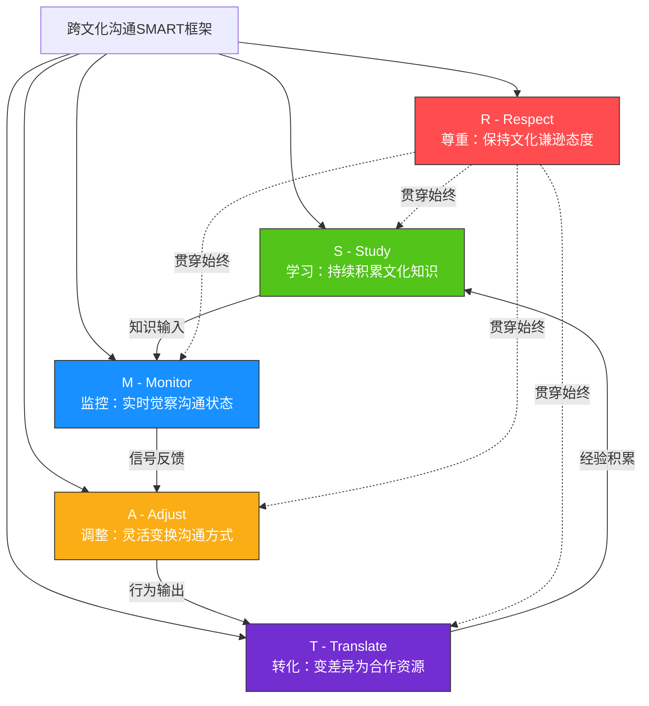
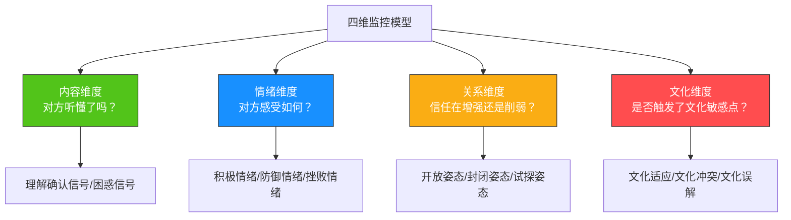
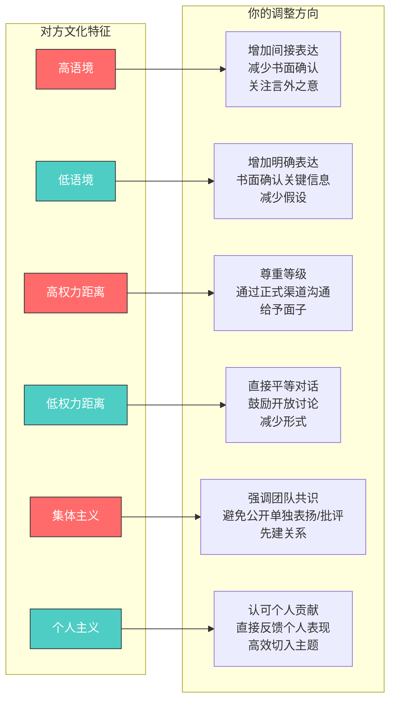
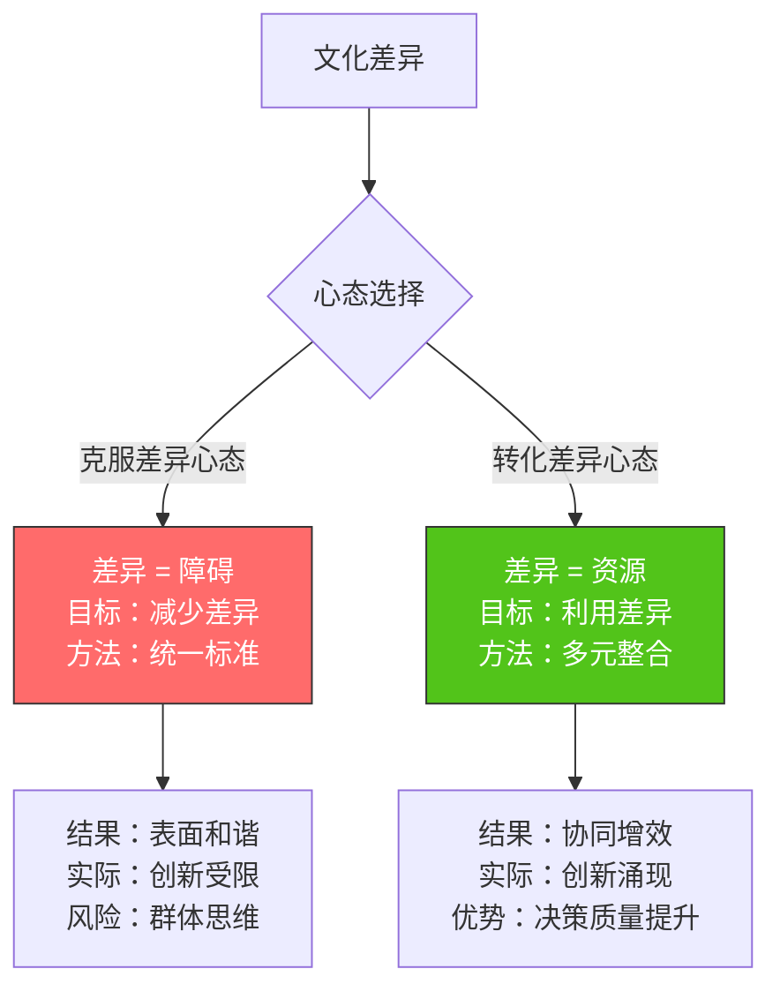
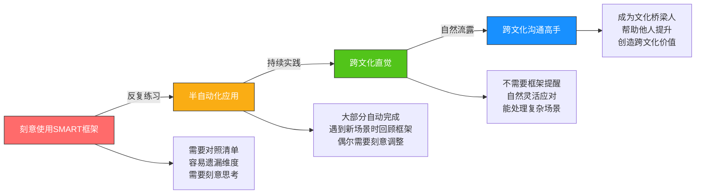

## 六、综合应用：跨文化沟通的SMART原则

前五节分别讲解了跨文化沟通的五大核心技巧——文化敏感度培养（第6节）、语言调整策略（第7节）、非语言行为适应（第8节）、跨文化信任建立（第9节）、文化误解处理（第10节）。每一项技巧都有其独立的价值和操作方法，但在真实的跨文化场景中，这些技巧从来不是孤立使用的。一个成功的跨文化沟通者，需要将五项技巧整合为一个流畅的、可操作的系统。

本节提出一个综合性的实践框架——**跨文化沟通的SMART原则**，将五大技巧嵌入五个可执行的行动维度中，帮助你在任何跨文化场景中都能快速制定沟通策略、持续优化沟通效果。

### 6.1 为什么需要SMART框架

#### 6.1.1 碎片化技巧的困境

学习了五大核心技巧后，很多人面临的典型困境是：理论全懂，但到了具体场景中不知道该优先用哪个、怎么组合。

举一个具体的例子。张伟在与日本团队的视频会议中，注意到对方在听到他的提案后沉默了五秒钟。这五秒钟里，他面对一个决策分支：

- 用文化敏感度去解读沉默的含义（日本人沉默可能表示认真思考，而非反对）？
- 用语言调整策略去切换到更委婉的表达方式？
- 用非语言适应去调整自己的面部表情和身体姿态？
- 还是用信任建立技巧去主动询问对方的真实想法？

答案是：**以上全部，而且是同时进行的**。这就是碎片化技巧与系统化应用之间的差距。

心理学中的"注意力瓶颈"理论（Kahneman, 1973）解释了这种困境的原因：人的认知资源有限，当需要同时运用多种技巧时，如果没有一个统一的心智模型来整合这些技巧，大脑会在不同技巧之间反复切换，导致每个技巧都执行得不够好。SMART框架的价值就在于提供这样一个统一的心智模型——将五项技巧映射为五个直观的行动维度，降低认知负荷，让跨文化沟通者能够在高压场景下依然保持系统性的应对能力。

#### 6.1.2 SMART框架的设计逻辑

SMART框架不是对五大技巧的替代，而是一个**操作界面**——它将五大技巧的精髓提炼为五个行动动词，形成一个完整的行动闭环：

五个元素的逻辑关系如下：

1. **Study（学习）** 是基础——没有知识储备，监控就没有参照系。你不知道日本人沉默的文化含义，就无法在Monitor阶段正确解读信号
2. **Monitor（监控）** 是感知——在沟通中持续收集信号，判断是否需要调整。这是连接知识与行动的桥梁
3. **Adjust（调整）** 是行动——根据监控结果灵活变换沟通方式。这是唯一产生外部可见行为变化的维度
4. **Respect（尊重）** 是态度——贯穿全过程的心理基础，确保调整是真诚的而非操控性的。没有Respect的Adjust是"文化伪装"
5. **Translate（转化）** 是升华——将文化差异从需要克服的障碍，转化为可以利用的资源。这是跨文化沟通的最高境界

与通用的SMART目标设定原则（Specific、Measurable、Achievable、Relevant、Time-bound）不同，跨文化沟通的SMART是一套**行为框架**，每个字母对应一个具体的行动维度。两者虽然缩写相同，但本质完全不同：前者是目标管理工具，后者是行为指导框架。

#### 6.1.3 SMART框架与五大核心技巧的映射关系

为了帮助你建立新旧知识之间的连接，以下是SMART五维度与前五节核心技巧的映射：

| SMART维度 | 对应的核心技巧 | 核心关键词 | 能力类型 |
|-----------|--------------|-----------|---------|
| **Study** | 文化敏感度培养（第6节） | 知识积累、文化认知 | 认知能力 |
| **Monitor** | 非语言行为适应（第8节）+ 文化误解处理（第10节） | 信号识别、实时觉察 | 感知能力 |
| **Adjust** | 语言调整策略（第7节）+ 非语言行为适应（第8节） | 灵活变换、风格切换 | 行为能力 |
| **Respect** | 跨文化信任建立（第9节） | 文化谦逊、真诚尊重 | 情感能力 |
| **Translate** | 全部五项技巧的整合应用 | 差异转化、协同增效 | 整合能力 |

注意Monitor和Adjust分别整合了两项核心技巧，这正体现了SMART框架的整合价值——它不是简单的一对一映射，而是将相关技巧合并为更高层次的操作维度。

### 6.2 S - Study（学习）：持续积累文化知识

#### 6.2.1 学习的三个层次

文化学习不是一次性的情报收集，而是一个持续深化的过程。Earley和Ang（2003）在其文化智力（Cultural Intelligence, CQ）理论中提出，有效的文化学习分为三个层次，每个层次对应不同的认知深度和能力产出：

| 层次 | 内容 | 方法 | 对应能力 | 时间投入 |
|------|------|------|----------|---------|
| **表层知识** | 文化事实、礼仪规范、禁忌清单 | 书籍、课程、网站、纪录片 | 认知CQ | 数天到数周 |
| **中层理解** | 文化行为背后的逻辑和价值观 | 深度阅读、文化浸泡、跨文化对话 | 元认知CQ | 数月到数年 |
| **深层洞察** | 文化内部的多样性和动态变化 | 长期交往、本地生活、学术研究 | 行为CQ | 持续终身 |

大多数人停留在表层知识——知道日本人鞠躬、德国人守时、美国人直接。但真正有效的跨文化沟通需要中层理解和深层洞察：**为什么**日本文化重视鞠躬？这背后反映了什么样的等级观念和尊重逻辑？日本年轻一代是否也在改变这个习惯？

表层知识告诉你"做什么"，中层理解告诉你"为什么"，深层洞察告诉你"何时例外"。只有三层知识贯通，你才能在真实场景中灵活应变，而不是机械地照搬文化指南。

#### 6.2.2 跨文化知识体系构建清单

针对目标文化，系统性地收集和整理以下维度的知识。这不是一次性的任务清单，而是你持续维护的"文化知识库"的基础框架：

**基础维度（必须掌握）**：

- 语言基础：问候语、感谢语、道歉语、基本商务用语、常用俚语和口头禅
- 时间规范：守时期望（迟到多少分钟算迟到？）、会议节奏、回复邮件/消息的时效期望、假期安排
- 空间规范：身体距离（亲密距离、社交距离、公共距离的尺度差异）、座位安排（主位在哪里？）、办公室布局偏好、视频会议中背景的文化含义
- 礼仪规范：名片交换（单手还是双手？是否需要阅读？）、着装要求（商务正装的定义差异）、餐饮礼仪（谁付账？如何敬酒？）、送礼规范（什么场合送？什么不能送？）
- 禁忌清单：颜色禁忌（白色在东亚文化中的丧葬含义）、数字禁忌（4在中日韩、13在西方）、话题禁忌（年龄、收入、宗教在不同文化中的敏感度差异）、手势禁忌（竖大拇指、OK手势在不同文化中的含义差异）

**进阶维度（深度合作必备）**：

- 决策方式：自上而下还是共识驱动？决策速度期望？决策者与执行者的关系模式？个体是否有权推翻集体决策？
- 反馈风格：直接批评还是间接暗示？公开还是私下？正面反馈的频率和方式？建设性批评的包装方式？
- 冲突处理：正面面对还是回避？个人冲突还是集体调解？冲突后的修复机制？"面子"在冲突中的角色？
- 权力结构：等级观念强弱？上下级互动规范？年龄与资历的权重？女性在权力结构中的位置？
- 关系建立：先做事还是先建关系？信任建立周期？社交场合的正式程度？个人生活与职业关系的边界？
- 合同观念：合同是最终协议还是合作起点？违约的文化后果？口头承诺的约束力？

**高级维度（战略层面）**：

- 历史背景：影响当代商业文化的重大历史事件（如日本的终身雇佣制与战后重建的关系、德国的工匠传统与宗教改革的关联）
- 宗教与伊斯兰教在中东商业文化中的具体影响、佛教对东南亚商业伦理的塑造、儒家思想对东亚商业关系的深层影响
- 教育体系：塑造思维方式的教育传统（如法国的哲学思辨传统、中国的应试教育对创新思维的影响、芬兰的现象教学对协作能力的培养）
- 媒体环境：影响公众认知和舆论的信息生态（社交媒体普及度、新闻自由度、信息获取渠道偏好）
- 经济格局：影响商业心态的经济结构（GDP增速预期、贫富差距、创业文化成熟度、对外资的态度）

#### 6.2.3 高效学习的方法与工具

知道了学什么，还需要知道怎么学。以下是经过验证的高效文化学习方法：

**方法一：结构化阅读法**

不要泛泛地读"跨文化沟通"的书，而是针对目标文化进行深度阅读：

- 选择3本关于目标文化的经典著作（如了解日本文化推荐《菊与刀》《日本文化中的时间与空间》《日本人的心》）
- 阅读目标文化的商业案例（哈佛商学院案例库中有大量跨文化商业案例）
- 订阅目标文化的英文媒体（如了解德国商业文化可订阅Handelsblatt Global）

**方法二：文化浸泡法**

在无法亲身前往目标文化所在地时，创造"虚拟文化浸泡"环境：

- 观看目标文化的电影和电视剧（注意观察日常互动场景，而非剧情）
- 收听目标文化的播客（推荐：了解美国商业文化听"How I Built This"，了解日本商业文化听"日経カレンダー"）
- 在社交媒体上关注目标文化的KOL，观察他们的表达方式和互动模式

**方法三：文化访谈法**

直接与目标文化的人交流，是最高效的学习方式。但要避免"审问式"提问：

- 低效提问："日本人怎么开会？"（过于笼统，对方只能给出笼统回答）
- 高效提问："你上次和日本团队开会时，有没有遇到过让你意外的情况？"（具体场景引发具体回答）
- 进阶提问："如果我明天要和你们的日本合作伙伴开第一次会议，你会建议我特别注意什么？"（实践导向）

**推荐工具与资源**：

| 工具/资源 | 类型 | 适用场景 | 费用 |
|----------|------|---------|------|
| Hofstede Insights (hofstede-insights.com) | 在线工具 | 快速了解目标文化的六维文化特征 | 免费基础版 |
| GlobeSmart (globe-smart.com) | 在线平台 | 详细的国家文化对比和行为建议 | 付费 |
| CultureWizard (culturewizard.com) | 在线平台 | 跨文化沟通培训和自评工具 | 付费 |
| 《文化地图》(The Culture Map, Erin Meyer) | 书籍 | 系统理解八维文化差异框架 | 购买 |
| Coursera "Intercultural Management" | 课程 | 系统学习跨文化管理理论和方法 | 免费旁听 |
| ChatGPT/Claude 等AI助手 | AI工具 | 快速获取特定文化场景的沟通建议 | 免费/付费 |

#### 6.2.4 张伟的Study实践

回到贯穿案例。张伟在加入中美德日跨国团队前，用了三周时间进行了系统的文化学习。他没有泛泛地阅读，而是按照上面的清单逐项填写：

| 维度 | 美国同事Mike | 德国同事Klaus | 日本同事Tanaka |
|------|------------|-------------|---------------|
| 决策方式 | 快速决策，重效率，愿意承担风险 | 详细分析，重数据，需要充分论证 | 共识驱动，重和谐，需要内部对齐 |
| 反馈风格 | 直接、正面+建设性、喜欢"Sandwich" | 直接、聚焦问题、不加修饰 | 间接、私下反馈、大量使用沉默 |
| 时间观念 | 严格守时，议程紧凑，会议准时结束 | 极其严格，精确到分钟，迟到=不尊重 | 严格守时，但会议可能超时，因为要达成共识 |
| 沟通风格 | 低语境，明确表达，口头确认 | 低语境，逻辑严密，书面确认 | 高语境，重视言外之意，避免直接说"不" |
| 关系建立 | 先做事，关系自然发展，社交轻松 | 先做事，专业信任优先，私交较少 | 先建关系，信任后再深入，需要多次互动 |
| 冲突处理 | 直面冲突，认为冲突是健康的 | 直面冲突，但基于事实和逻辑 | 回避正面冲突，通过中间人调解 |

张伟把这些信息整理成一张速查卡，打印出来贴在办公桌旁边。每次与不同文化背景的同事互动前，他都会快速浏览一遍。但他也给自己定了一条规矩：**速查卡是起点，不是终点**——每次互动后都要更新观察，逐步用个性化理解替代文化刻板印象。

#### 6.2.5 Study的常见陷阱

**陷阱一：学习表面化**

只记住了"日本人含蓄"这样的标签，却不了解含蓄背后的文化逻辑（面子文化、群体和谐、间接沟通偏好），更不了解日本年轻一代正在变得更加直接。标签是认知的起点，不是终点。

**陷阱二：学习后不更新**

三年前读的跨文化书籍，可能已经不反映目标文化的最新变化。全球化正在加速文化融合，特别是年轻一代的沟通方式正在快速演变。中国90后、00后在职场中的沟通风格，与70后、80后有显著差异，这种代际差异在很多文化中都存在。

**陷阱三：把群体特征等同于个体特征**

了解"德国人通常直接"是有用的默认设置，但遇到一个含蓄的德国人时，要能灵活调整，而不是固执地按照刻板印象行事。Hofstede的文化维度描述的是群体趋势（均值和分布），不是个体预言。

**陷阱四：只学"目标文化"，忽略自己的文化**

跨文化沟通是双向的。如果你不了解自己的文化特征（比如中国文化的高语境特征、集体主义倾向、面子文化），你就无法理解对方在适应你的文化时面临的挑战，也无法有意识地调整自己的默认行为。

**纠正方法**：建立"文化动态档案"——不是一次性学习后就束之高阁，而是持续更新。每完成一次跨文化互动，都花5分钟记录新的观察和发现，逐步积累对目标文化的个性化理解。推荐使用Notion或Obsidian等笔记工具建立结构化的文化档案，按国家/地区分类，按维度组织，定期回顾和更新。

### 6.3 M - Monitor（监控）：实时觉察沟通状态

#### 6.3.1 监控的本质

Monitor是在跨文化沟通过程中持续进行的**元认知活动**——你不仅在参与沟通，同时在观察和评估沟通本身的状态。心理学中称之为"元沟通意识"（metacommunication awareness）。这就像一个驾驶员，不仅在操控方向盘，同时还在观察路况、仪表盘和后视镜。

监控的核心问题是：**当前的沟通方式有效吗？对方的反应是否符合预期？是否需要调整？**

在同文化沟通中，监控大多是自动完成的——你天然理解对方的非语言信号、语调变化、沉默含义。但在跨文化沟通中，监控需要从"自动模式"切换到"手动模式"——你必须有意识地观察、刻意地解读、主动地验证。

#### 6.3.2 四维监控模型

有效的跨文化沟通监控需要同时关注四个维度：

**内容维度监控**：对方是否准确理解了你传达的信息？

- 正面信号：点头、复述你的要点、提出相关问题、用自己的话重新表述你的观点
- 负面信号：频繁皱眉、要求重复、提出与话题无关的问题、长时间沉默后给出模糊回应
- 验证技巧：在关键信息点后主动插入确认问题，如"So the key point is... Does that match your understanding?"

**情绪维度监控**：对方的情绪状态如何？

- 积极信号：微笑、身体前倾、主动分享想法、语调上扬、使用积极词汇
- 防御信号：双臂交叉、后靠、表情僵硬、语调变平、回答变短
- 挫败信号：叹气、频繁看时间、语速加快、语气变得尖锐、开始整理物品暗示想结束

**关系维度监控**：你与对方的信任关系处于什么状态？

- 信任增强信号：主动分享个人信息、邀请后续交流、提出合作建议、语气变得更加随意
- 信任受损信号：沟通趋于形式化、回避私人话题、推迟决策、只通过邮件而非直接对话
- 关系僵化信号：回复越来越短、抄送越来越多上级、措辞越来越"公事公办"

**文化维度监控**：你的沟通方式是否与对方的文化框架匹配？

- 文化冲突信号：对方表现出困惑、不适、或者与你的预期完全不同的反应
- 文化适配信号：对方放松、自然、主动用你的方式回应、开始使用非正式语气
- 文化越界信号：对方突然变得非常正式、提出"按照我们的文化..."、明确划定边界

#### 6.3.3 跨文化监控的关键信号词典

不同文化的沟通者，在表达困惑、不满、同意时，使用的信号截然不同。以下是几个常见文化的关键信号对照。这张表不是刻板印象，而是概率性的参考——任何个体都可能偏离文化平均值：

| 信号类型 | 美国文化 | 德国文化 | 日本文化 | 中东文化 |
|----------|----------|----------|----------|---------|
| **表示同意** | "Sounds good" / 点头 / 竖大拇指 | "Ja, genau" / 简洁确认 / 记录笔记 | 沉默点头 / "はい" / 轻声应答 | "Inshallah" / 热情握手 / 身体前倾 |
| **表示困惑** | "Can you clarify?" / 歪头 | "Das verstehe ich nicht" / 皱眉 | 沉默 / 微微歪头 / "ちょっと..." | 重复你的问题 / 寻求在场第三方确认 |
| **表示反对** | "I disagree because..." / 直视 | "Nein, das stimmt nicht" / 逻辑论证 | 沉默 / "それはちょっと..." / 微妙停顿 | 绕开话题 / 引用权威/传统 / 私下表达 |
| **表示不耐烦** | 看手机 / 打断 / 敲桌子 | 明确指出时间限制 / 看表 | 微妙的表情变化 / 咳嗽 / 频繁看笔记本 | 开始谈论其他话题 / 接电话 |
| **表示赞赏** | "Great job!" / 鼓掌 / 击掌 | 简洁肯定 / 稀少但真诚 / "Das ist gut" | 含蓄认可 / "よくできました" / 鞠躬 | 热情赞美 / 称呼你为"朋友" / 邀请共餐 |

#### 6.3.4 虚拟环境下的监控挑战与对策

在远程工作和视频会议成为常态的今天，跨文化监控面临新的挑战：

| 挑战 | 原因 | 对策 |
|------|------|------|
| 非语言信号缺失 | 视频中只能看到肩膀以上 | 主动请求打开摄像头；关注面部微表情；留意语音语调变化 |
| 信号延迟干扰 | 网络延迟导致重叠发言 | 建立发言信号机制（如举手功能）；留出更长的回应等待时间 |
| 背景噪音掩盖信号 | 家庭环境嘈杂 | 使用文字聊天作为辅助信号通道；会议后单独确认关键信息 |
| 屏幕疲劳降低信号质量 | 长时间视频会议导致注意力下降 | 将会议控制在45分钟以内；每20分钟设置互动环节；重要讨论安排在会议前半段 |
| 文化信号被技术信号干扰 | 沉默可能是网络问题而非文化信号 | 区分"技术沉默"和"文化沉默"——技术沉默伴随画面卡顿，文化沉默伴随正常画面和表情变化 |

#### 6.3.5 张伟的Monitor实践

在一次产品评审视频会议中，张伟向团队展示了一个新功能的设计方案。他的监控过程如下：

- **观察美国同事Mike**：Mike在张伟讲到第三页时开始在笔记本上快速记录——这是积极信号，说明他在思考如何回应，而不是被动接收。当张伟展示市场数据时，Mike前倾身体并说"This is interesting"——明确的兴趣信号。
- **观察德国同事Klaus**：Klaus在张伟展示数据图表时微微前倾——这是兴趣信号。但在张伟说"大概两个月能完成"时，Klaus的眉头微皱，随后开始在笔记本上写字——这是一个监控警报：德国文化对模糊时间表述的容忍度很低，Klaus在记录需要追问的具体问题。
- **观察日本同事Tanaka**：Tanaka全程保持礼貌的微笑和点头。但当张伟直接问"你觉得这个方案怎么样？"时，Tanaka停顿了两秒才回答"很有意思"——在日本文化中，被直接点名要求评价可能造成"面を潰される"（丢面子）的压力，而"很有意思"这种模糊回应往往是有保留意见的委婉表达。

张伟基于这些监控信号，在会议后做了三件事：给Klaus发了一份详细的时间表和里程碑计划（精确到周），给Tanaka发了一封邮件请他以书面形式提供详细反馈（给予思考时间和匿名空间），同时与Mike安排了一次一对一的深入讨论（满足他对快速互动的偏好）。这种**差异化跟进**正是Monitor到Adjust的直接转化。

#### 6.3.6 提升监控能力的训练方法

监控能力不是天赋，是可以训练的技能。以下是三种经过验证的训练方法：

**训练一：视频回放分析**

录制自己的跨文化会议（需征得对方同意），回放时将声音关闭，只观察非语言信号。然后打开声音，只听语调和节奏变化。最后结合两者，分析你的判断是否准确。

**训练二：文化信号日记**

每天记录一次跨文化互动中的关键信号：你观察到了什么？你如何解读？事后验证你的解读是否正确？坚持3个月，你的监控准确率会显著提升。

**训练三：搭档练习**

找一位来自不同文化背景的同事或朋友，在日常互动中互相提供信号反馈："刚才你皱眉的时候，我以为你不同意，但实际上你在想什么？"这种即时反馈是提升监控能力最快的方式。

### 6.4 A - Adjust（调整）：灵活变换沟通方式

#### 6.4.1 调整的三个层级

监控发现问题后，需要快速、精准地进行调整。调整可以在三个层级上进行，每个层级的时间尺度和影响范围不同：

**即时调整（实时）**：在当次沟通中立即改变沟通方式。

- 语速过快 → 放慢语速，增加停顿
- 过于直接 → 切换到更委婉的表达（"I wonder if we might consider..." 代替 "This won't work"）
- 身体距离过近 → 后退半步，调整站位角度
- 发现对方困惑 → 用不同方式重新表达（换词汇、换例子、换媒介）
- 注意到对方文化中的禁忌 → 立即转换话题并自然过渡

**策略调整（短期）**：为下一次沟通改变策略。

- 上次会议直接提问让日本同事不适 → 下次会议改用会前书面征求意见
- 德国同事对模糊表述不满 → 下次提交更详细的书面方案，附带数据来源
- 美国同事喜欢快速决策 → 准备精简版方案（1页摘要+详细附录的"金字塔结构"）
- 中东合作伙伴重视关系 → 在下次会议前安排一次非正式的咖啡聊天

**结构调整（长期）**：改变自己的沟通体系和习惯。

- 建立针对不同文化对象的沟通模板（邮件模板、会议议程模板、报告模板）
- 培养多种沟通风格的灵活切换能力（直接/间接、详细/精简、正式/非正式）
- 构建个人的跨文化沟通工具箱（速查卡、信号词典、应急话术库）
- 发展"文化代码切换"能力——像双语者在两种语言之间切换一样，在两种沟通风格之间自然切换

#### 6.4.2 七大可调维度与调整方向

跨文化沟通中，以下七个维度是可以灵活调整的。理解这些维度有助于你在监控到问题后，快速定位需要调整的具体方向：

| 维度 | 调整方向（低语境→高语境） | 具体操作 | 反向调整（高→低语境） |
|------|---------------------------|----------|----------------------|
| **信息密度** | 从详细到精简 | 高语境文化中减少显性信息，留出解读空间 | 增加显性信息，减少假设 |
| **表达直接性** | 从直接到间接 | 用暗示、提问、故事代替直述 | 明确表达立场，减少暗示 |
| **语速与节奏** | 从快到慢 | 增加停顿，留出翻译和理解的时间 | 提高信息密度，匹配对方节奏 |
| **情感表达** | 从外放到内敛 | 减少手势幅度，降低语调起伏 | 增加表情和语调变化，表达热情 |
| **身体语言** | 从开放到克制 | 减少手势、收敛表情、保持距离 | 增加手势、表情丰富、适当靠近 |
| **决策推进** | 从快速到渐进 | 给予更多共识建立时间，不催促 | 设定明确时间节点，推动决策 |
| **反馈方式** | 从直接到包装 | 使用"三明治反馈法"或间接反馈 | 直接指出问题，附加解决方案 |

#### 6.4.3 调整策略矩阵

根据对方的文化特征，选择最合适的调整方向。以下矩阵覆盖了六种主要的文化维度特征：

#### 6.4.4 实战调整话术库

以下是一些具体的调整话术示例，展示了同一个意思在不同文化语境下的表达方式：

**场景一：表达反对意见**

| 文化语境 | 话术示例 | 效果 |
|---------|---------|------|
| 美国（低语境、直接） | "I see your point, but I have a different perspective. Here's why..." | 清晰、专业、不冒犯 |
| 德国（低语境、逻辑） | "Die Daten zeigen ein anderes Bild. Lassen Sie mich die Analyse erläutern." (数据呈现了不同的画面，让我解释分析) | 基于事实、逻辑严密 |
| 日本（高语境、间接） | "ご提案はとても興味深いですね。ただ、いくつか懸念点もありまして..." (您的提案非常有意思。不过也有一些担忧点...) | 委婉、留面子、不直接否定 |
| 中东（关系导向） | "Brother, I respect your experience very much. May I share a different view for us to consider together?" | 尊重先行、共同探讨 |

**场景二：请求反馈**

| 文化语境 | 话术示例 | 为什么有效 |
|---------|---------|-----------|
| 美国 | "What do you think? I'm open to any feedback." | 直接、开放、鼓励坦率 |
| 德国 | "Bitte prüfen Sie den Plan sorgfältig und teilen Sie mir alle Bedenken mit." (请仔细审查计划，告诉我所有顾虑) | 明确要求、强调完整性 |
| 日本 | "お時間があるときに、ご意見をいただければ幸いです。メールでも結構です。" (如果方便的话，希望能在您有时间时收到您的意见。邮件也可以。) | 给时间、给渠道、降低压力 |

**场景三：道歉与修复**

| 文化语境 | 要点 | 话术示例 |
|---------|------|---------|
| 美国 | 承认错误+提供解决方案+时间线 | "I made a mistake on X. Here's my plan to fix it by Friday." |
| 德国 | 详细说明原因+具体补救措施+预防机制 | "Der Fehler liegt an X. Die Korrektur umfasst Y. Die Prävention ist Z." |
| 日本 | 深度反省+谦卑姿态+不急于找借口 | "深くお詫び申し上げます。私の不注意が原因です。再発防止に全力を尽くします。" |

#### 6.4.5 张伟的Adjust实践

基于监控中发现的问题，张伟进行了系统性调整：

**对德国同事Klaus的调整**：

- 每次提交方案时附带详细的甘特图，精确到周（而非"大概两个月"）
- 用具体数据替代"大概"、"差不多"等模糊表述（"大约60%完成"改为"已完成62%，剩余38%预计需要4.2周"）
- 准备技术细节的附录，满足Klaus对深度分析的需求
- 在邮件中使用编号列表和层级结构，符合德式文档习惯

**对日本同事Tanaka的调整**：

- 不再在公开会议上直接要求评价（避免让Tanaka在众人面前表达反对意见）
- 会前通过邮件发送方案，请Tanaka提前准备书面意见（给予思考时间）
- 在面对面会议中采用"茶歇时间"非正式交流（降低Tanaka的心理压力）
- 使用"Nemawashi"（根回し）策略——在正式决策前私下与Tanaka沟通，提前达成共识

**对美国同事Mike的调整**：

- 准备"电梯演讲"版方案摘要（30秒版本+2分钟版本+详细版本的"金字塔结构"）
- 在讨论中使用"Decision needed by March 15"的明确时间节点
- 允许Mike的快速、直接反馈风格，不将其解读为不尊重
- 在会议中预留"快速决策窗口"，满足Mike对效率的偏好

#### 6.4.6 调整的边界与真诚性

**重要提醒：调整不等于放弃自我。**

跨文化调整的核心原则是：

1. **调整行为，不扭曲价值观**：你可以改变表达方式（从直接变为委婉），但不需要改变核心立场（对产品质量的坚持）。表达方式是工具，价值观是内核
2. **调整风格，不丧失真诚**：用更委婉的方式表达批评，不等于虚伪——只是换了一种文化框架下的"礼貌方式"。真诚不等于直接，委婉不等于虚伪
3. **调整幅度在舒适区内**：过度调整会导致"文化模仿"（cultural mimicry）——对方会觉得你在演戏，反而降低信任。找到你既能适应又不失自我的"调整舒适区"
4. **明确标注文化切换**：有时可以坦率地说"在我的文化中，我们通常直接说，如果我的表达方式让你不舒服，请告诉我"——这种"元沟通"（metacommunication）本身就是建立信任的方式。它向对方表明：你意识到了文化差异，并且愿意为对方调整

### 6.5 R - Respect（尊重）：保持文化谦逊态度

#### 6.5.1 尊重的多层含义

在SMART框架中，Respect不仅仅是"态度好"那么简单。它包含四个递进的层次，从表面的礼貌到深层的文化融合：

| 层次 | 内涵 | 表现 | 反面表现 |
|------|------|------|----------|
| **容忍** | 承认差异存在 | "他们做事方式不同，我接受" | "他们怎么这样做？太奇怪了" |
| **理解** | 理解差异的合理性 | "在他们的文化语境中，这样做是有道理的" | "虽然我理解，但还是觉得我们的方法更好" |
| **欣赏** | 看到差异的价值 | "他们的方法有独特的优势，我可以学习" | "这只是文化差异，没有好坏之分"（敷衍） |
| **整合** | 将差异融入自己的行为 | "我现在能自然地在两种风格之间切换" | "我只在必须时才调整" |

大多数跨文化沟通培训止步于"容忍"或"理解"，但真正有效的跨文化沟通者达到"欣赏"和"整合"的层次。Bennett（1993）的"跨文化敏感度发展模型"（DMIS）描述了从"否认"到"整合"的六个阶段，与这里的四层次模型高度吻合。

关键区别在于："容忍"是被动接受差异的存在，"理解"是主动认知差异的逻辑，"欣赏"是积极发现差异的价值，"整合"是将差异内化为自身能力的一部分。每提升一个层次，跨文化沟通的质量都会出现质的飞跃。

#### 6.5.2 尊重的实操行为

尊重不是抽象的态度，而是具体的行为。以下是尊重在不同场景中的具体表现：

**在倾听中表达尊重**：

- 不打断对方的发言，即使你已经理解了他要说什么（不同文化对"打断"的定义不同——在美国文化中，适度重叠发言是参与的信号；在日本文化中，打断是不尊重的表现）
- 不急于纠正对方的英语/中文表达错误（除非对方主动请求帮助，否则纠正语言错误会打断思路、损害自信）
- 用"请继续"、"我正在听"、"这很有意思"等信号鼓励对方充分表达
- 对方沉默时保持耐心，不急于填补沉默（在高语境文化中，沉默是思考的一部分，不是沟通的中断）
- 做笔记——这向对方表明你重视他们的发言

**在决策中表达尊重**：

- 在做影响多方的决策前，主动征求所有文化背景成员的意见
- 不假设"我的方式就是最好的方式"——即使你的方法在你的文化中是最优解，在跨文化场景中可能不是
- 给予不同决策风格足够的时间和空间（特别是对共识驱动的文化，如日本、韩国、北欧）
- 在会议中主动邀请安静的成员发言："Tanaka-san, I'd really value your perspective on this"

**在冲突中表达尊重**：

- 即使你不同意对方的观点，也承认对方观点的合理性："I can see why you'd think that given your experience"
- 不使用文化优越性语言："在我们国家，这种事不会发生"、"你们的方式太落后了"
- 寻求双方都能接受的解决方案，而非一方压倒另一方
- 如果冲突升级，引入中立的第三方调解人（特别是当冲突双方的文化冲突处理方式差异很大时）

**在日常中表达尊重**：

- 学习对方语言中的基本问候和感谢（哪怕只是"こんにちは"、"Guten Tag"、"Shukran"，对方也会感受到你的诚意）
- 了解并遵守对方文化的基本礼仪（递名片的方式、用餐礼仪、着装要求）
- 记住对方文化的重要节日并送上祝福（斋月、排灯节、感恩节、新年）
- 尊重对方的饮食禁忌和宗教习惯（安排聚餐时提前询问）

#### 6.5.3 尊重的"微时刻"

尊重不仅仅体现在重大场景中，更体现在日常的"微时刻"（micro-moments）中。这些看似不起眼的小事，往往决定了跨文化关系的质量：

| 微时刻 | 尊重的做法 | 不尊重的做法 |
|--------|-----------|-------------|
| 介绍自己时 | 询问对方名字的正确发音，并努力记住 | 随意简化对方的名字，或说"我记不住，叫你XX吧" |
| 视频会议开始时 | 用对方语言说"早上好" | 跳过寒寒暄直接进入议程 |
| 对方发言时 | 保持眼神接触，身体前倾表示关注 | 看手机、敲键盘、看其他屏幕 |
| 对方犯错时 | 私下善意提醒 | 公开指出，让对方难堪 |
| 庆祝成功时 | 用对方文化的方式表达祝贺 | 只用自己文化的方式庆祝 |
| 发送邮件时 | 考虑对方的时区，避免在深夜发送需要立即回复的邮件 | 不考虑时区，要求"ASAP"回复 |

#### 6.5.4 尊重与自我保护的平衡

尊重不等于无条件顺从。在某些情况下，你需要在尊重对方文化和保护自己的核心利益之间找到平衡：

| 场景 | 尊重的做法 | 自我保护的做法 | 平衡策略 |
|------|-----------|---------------|----------|
| 对方文化要求送高额礼物 | 理解这是关系建立的方式 | 公司有反腐败合规要求 | 选择有文化意义但价格适中的礼物，并提前解释公司政策；用"我们的制度要求"而非"我不信任你"来解释限制 |
| 对方文化习惯加班到很晚 | 理解这是工作投入的表现 | 你需要工作生活平衡 | 在关键节点投入额外时间，但建立明确的边界；用"我会在明天早上第一件事处理"替代"现在不行" |
| 对方用文化理由回避直接反馈 | 理解间接沟通的文化逻辑 | 你需要清晰的反馈来做决策 | 提供多种反馈渠道（匿名问卷、一对一、书面），让对方选择舒适的方式 |
| 对方文化中存在性别歧视现象 | 理解这是历史和文化传统的一部分 | 你的价值观不允许配合 | 坚守底线但不公开对抗；寻找替代方案（如通过第三方沟通）；记录并向组织汇报 |

#### 6.5.5 自我文化反思：尊重的起点

真正的尊重始于自我反思。在要求别人尊重你的文化之前，你需要先审视自己的文化偏见：

**自我检测清单**：

- [ ] 我是否不自觉地用自己文化的"正常标准"来评判其他文化？
- [ ] 我是否在心里给不同文化排了"优劣等级"？
- [ ] 我是否只在对方的文化与我的利益一致时才表达"尊重"？
- [ ] 我是否把"我不同意"和"我不尊重"混为一谈？
- [ ] 我是否在跨文化互动中始终处于"教育者"而非"学习者"的位置？

如果以上任何一项的回答是"是"，说明你的尊重还需要从"容忍"向"理解"提升。这是正常的——文化偏见是人类认知的自然产物，意识到它的存在就是进步的开始。

### 6.6 T - Translate（转化）：变差异为合作资源

#### 6.6.1 转化的思维模式

SMART框架的最后一个维度——Translate——是最高层次的应用。它的核心思想是：**文化差异不是需要克服的障碍，而是可以利用的资源。**

大多数人在跨文化沟通中持有一种"克服差异"的心态：文化差异造成了沟通成本，我们的目标是尽量减少这种成本。但Translate维度要求你换一种思维方式：**文化差异带来了认知多样性，而认知多样性是创新和问题解决的宝贵资源。**

Scott Page（2007）在《差异的力量》（The Difference）中用数学模型证明：在复杂问题解决场景中，认知多样性高的团队（即使个体能力略低）往往优于认知同质性高的团队（即使个体能力更高）。文化差异是认知多样性的重要来源之一——不同文化的人使用不同的思维框架、不同的问题分解方式、不同的类比模型，这些差异在碰撞中产生创新火花。

#### 6.6.2 五种转化策略

**策略一：多元视角互补**

不同文化背景的人，看问题的角度天然不同。将这些不同角度整合起来，可以获得更全面的视野。

实践方法：

- 在讨论重要议题时，刻意邀请不同文化背景的成员发言（不是"有没有其他意见"，而是"Klaus, from your engineering perspective..."、"Tanaka, how does this look from the user experience angle?"）
- 使用"文化视角轮换"技巧：要求每个成员从其他文化成员的角度思考问题（"If you were Tanaka, what concerns would you have about this timeline?"）
- 记录不同文化的分析角度，形成"多元视角矩阵"，确保没有重要角度被遗漏

**策略二：文化特长分工**

不同文化在不同领域积累了不同的方法论优势。将合适的任务分配给拥有文化优势的成员，可以事半功倍。

**重要说明**：以下表格描述的是文化传统中形成的方法论倾向，不是对个体能力的限制。任何个体都可能超越其文化平均值。这种分工的前提是成员本人认同并擅长这些方法，而非被强行贴标签：

| 文化方法论传统 | 典型来源 | 适合的任务 | 核心优势 |
|--------------|---------|-----------|---------|
| 详细规划与系统执行 | 德国工程传统、日本精益生产 | 项目计划、流程设计、质量控制 | 可预测性、一致性、细节把控 |
| 快速决策与创新试错 | 硅谷创业文化、以色列"Chutzpah"精神 | 头脑风暴、原型设计、市场策略 | 速度、灵活性、风险承受 |
| 关系网络与长期协调 | 中国商业文化、中东部落传统 | 客户关系、合作伙伴谈判、团队建设 | 信任深度、网络效应、长期视角 |
| 分析与批判性思维 | 英国经验主义、北欧务实传统 | 风险评估、方案审核、问题诊断 | 逻辑严谨、客观中立、系统思维 |
| 灵活适应与即兴创造 | 印度"Jugaad"创新、巴西"Gambiarra"传统 | 危机处理、资源受限下的创新、变化管理 | 资源效率、适应性、创造性 |

**策略三：文化融合创新**

不同文化的碰撞可以产生全新的解决方案——这是单文化团队永远无法实现的。文化融合创新不是简单的"A+B"，而是在差异碰撞中找到全新的"第三种方案"。

**案例一：制药研发中的方法论融合**

某跨国制药公司的中美研发团队在药物临床试验方案设计上产生了分歧。中方团队倾向于"先小规模试点，快速迭代"的思路（源自中国文化中"摸着石头过河"的务实哲学）；美方团队倾向于"大规模随机对照试验"的思路（源自美国文化中对科学严谨性和可推广性的重视）。最终，团队融合了两种思路：先进行小规模"适应性试验"（Adaptive Trial Design）获取初步数据，再基于这些数据设计大规模验证试验。这种混合方案既降低了风险，又保证了科学性，在行业内被视为创新方法论，后来被写入了FDA的指南文件。

**案例二：产品设计中的文化融合**

一家日本-德国合资汽车公司的设计团队，在仪表盘设计上产生了分歧。日方设计师强调"以人为本的直觉交互"（源自日本"おもてなし"服务哲学），德方工程师强调"功能优先的逻辑布局"（源自德国包豪斯设计传统）。最终的解决方案融合了两者：底层架构采用德式的逻辑分区，交互层采用日式的直觉设计，用户可以按照自己的偏好在两种模式之间切换。这款车获得了当年的红点设计奖。

**策略四：文化视角的风险预判**

每种文化都有自己的认知盲区。利用多元文化团队的优势，让不同文化成员扮演"魔鬼代言人"，可以提前发现单文化团队容易忽视的风险。

实践方法：

- 在方案评审中，安排不同文化背景的成员分别从"乐观视角"和"悲观视角"分析方案
- 利用德国文化的严谨性检查执行细节——"Where are the failure points?"
- 利用美国文化的创新性挑战固有假设——"What if we're solving the wrong problem?"
- 利用日本文化的系统性审视全局风险——"How does this affect the entire ecosystem?"
- 利用中国文化的务实性检验可行性——"在现有资源下，这真的能做到吗？"

**策略五：文化智慧的制度化**

将跨文化合作中积累的经验和最佳实践，转化为组织制度和流程，确保文化智慧不随人员流动而流失：

- 建立"跨文化沟通指南"：将团队积累的跨文化沟通经验文档化，包括常见场景的最佳实践、信号词典、话术模板
- 设计"文化兼容"的会议流程：兼顾不同文化对时间、发言顺序、决策方式的偏好（如"先书面收集意见→再小组讨论→最后全员确认"的流程兼顾了日本的Nemawashi和美国的公开讨论）
- 创建"文化导师"制度：每位新成员都配有一位来自不同文化背景的导师，在入职前三个月提供跨文化适应支持
- 建立"文化分享会"制度：每月安排一位团队成员分享自己文化的独特视角（可以是节日、商业惯例、沟通风格等），增进团队的文化认知深度

#### 6.6.3 张伟的Translate实践

在团队运作六个月后，张伟开始将文化差异转化为团队的竞争优势：

- **产品设计**：利用日本同事对用户体验细节的极致关注来打磨产品交互（Tanaka发现了37个其他成员未注意到的微交互细节），利用美国同事对市场规模和商业模式的敏锐嗅觉来定义产品定位（Mike提出的定价策略使收入预期提升了40%），利用德国同事对技术架构的严谨思维来确保系统稳定性（Klaus设计的架构在压力测试中比初始方案性能高出3倍）。
- **团队流程**：融合了德国的"详细计划"文化、美国的"快速迭代"文化和日本的"持续改进"（改善）文化，创建了"计划-迭代-改善"三位一体的项目管理方法——每个迭代周期以德式的详细计划开始，以美式的快速执行推进，以日式的回顾改善收尾。
- **客户沟通**：面对不同文化的客户，团队中总有最合适的成员能够用对方熟悉的沟通方式进行有效交流。面对日本客户时Tanaka主导，面对欧洲客户时Klaus主导，面对美国客户时Mike主导——张伟负责协调和整合。

最终，这个四国团队的产品交付质量比单一文化团队高出30%（缺陷率从每千行代码3.2个降至2.2个），客户满意度评分达到了4.7/5.0，团队创新提案数量是同类团队的2.1倍。

### 6.7 SMART原则的综合应用模板

#### 6.7.1 跨文化沟通策略规划表

在重要的跨文化沟通场景之前（如跨文化谈判、国际合作启动、多文化团队组建），使用以下模板系统性地规划你的沟通策略：

| SMART维度 | 规划问题 | 你的回答 |
|-----------|---------|----------|
| **Study** | 我对对方文化了解多少？还需要补充哪些知识？有哪些"已知的未知"需要提前调研？ | （填写） |
| **Monitor** | 我计划观察哪些信号？用什么标准判断沟通是否有效？谁是需要重点观察的对象？ | （填写） |
| **Adjust** | 根据对方文化特征，我需要在哪些维度上调整自己的沟通方式？有哪些话术需要提前准备？ | （填写） |
| **Respect** | 我需要特别注意哪些文化敏感点？有哪些禁忌绝对不能触碰？如何表达真诚的尊重？ | （填写） |
| **Translate** | 这次沟通中，文化差异可能带来哪些独特的机会？如何利用多元视角提升决策质量？ | （填写） |

**使用建议**：在重要沟通前花15-30分钟填写此表。不需要写长文，每个维度3-5个要点即可。重点是强迫自己系统性地思考，而不是凭直觉应对。

#### 6.7.2 跨文化沟通复盘清单

每次重要的跨文化沟通结束后，使用以下清单进行复盘。复盘是Study的核心来源——每次互动都是一次文化学习机会：

**Study维度复盘**：

- [ ] 我事前的文化知识准备是否充分？有哪些知识盲区被暴露了？
- [ ] 沟通中是否出现了我未预料到的文化现象？我如何解读的？解读是否正确？
- [ ] 我从这次沟通中学到了哪些新的文化知识？需要更新到文化档案中的有哪些？

**Monitor维度复盘**：

- [ ] 我是否有效监控了对方的反应？是否在正确的时间点注意到了关键信号？
- [ ] 我是否错过了哪些重要的信号？事后回顾，哪些信号我当时没有注意到？
- [ ] 我的监控准确度如何？有没有误判（把正面信号误读为负面，或反之）？

**Adjust维度复盘**：

- [ ] 我的调整是否及时、有效？有没有"该调没调"或"调过头"的情况？
- [ ] 有哪些调整效果良好？哪些调整不到位？原因是什么？
- [ ] 下次遇到类似场景，我会怎么调整？需要准备哪些新的话术或策略？

**Respect维度复盘**：

- [ ] 我是否充分表达了对对方文化的尊重？有没有无意识的不尊重行为？
- [ ] 是否有任何言行可能被对方解读为不尊重？即使本意并非如此？
- [ ] 我在哪些方面还可以做得更好？需要学习哪些新的礼仪或表达方式？

**Translate维度复盘**：

- [ ] 我是否利用了文化差异带来的机会？还是只在"克服差异"？
- [ ] 我是否将多元视角整合到了决策中？有没有忽略某个文化背景成员的独特贡献？
- [ ] 有哪些跨文化经验值得记录和分享？哪些最佳实践可以固化为团队流程？

#### 6.7.3 跨文化沟通能力自评量表

定期评估自己在SMART五个维度上的能力水平（建议每季度评估一次，追踪成长趋势）：

| 维度 | 初级（1-2分） | 中级（3-4分） | 高级（5分） |
|------|--------------|--------------|------------|
| **Study** | 只知道基本文化事实（节日、礼仪、禁忌） | 理解文化行为背后的逻辑和价值观，能解释"为什么" | 能预判文化演变趋势，理解文化内部的多样性和代际差异 |
| **Monitor** | 需要事后才能意识到文化信号（"啊，原来他当时是这个意思"） | 能在沟通中识别大部分文化信号，偶尔有遗漏 | 实时捕捉微妙的文化信号并即时响应，能在多种文化信号之间快速切换注意力 |
| **Adjust** | 只能在事后反思中发现需要调整，下次才能应用 | 能在沟通中进行适度调整，但有时不够自然 | 自然流畅地在多种沟通风格间切换，调整幅度恰到好处 |
| **Respect** | 能做到基本的礼貌和容忍，但偶尔有无意识的不尊重 | 能真诚理解和欣赏文化差异，主动表达尊重 | 将尊重内化为本能，自然流露，能在尊重与自我保护之间找到平衡 |
| **Translate** | 能看到文化差异的正面价值，但不知道如何利用 | 能主动利用文化差异改善沟通和决策质量 | 能将文化差异系统性地转化为创新和竞争优势，帮助团队建立文化融合机制 |

**评分标准**：

- 20-25分：跨文化沟通高手——你已经具备在复杂跨文化环境中领导团队的能力
- 15-19分：中级水平——你有扎实的基础，需要更多高难度场景的实践来提升
- 10-14分：有基础但仍需大量实践——建议系统性地练习每个SMART维度
- 5-9分：初级阶段——需要从Study开始，系统性学习和积累跨文化知识

### 6.8 SMART原则的进阶应用

#### 6.8.1 在虚拟团队中的应用

远程工作和虚拟团队为跨文化沟通增加了新的挑战。SMART原则在虚拟环境中的特殊调整：

| SMART维度 | 虚拟环境的特殊挑战 | 具体调整策略 |
|-----------|-------------------|-------------|
| **Study** | 无法通过日常观察积累文化知识 | 主动创造"虚拟文化浸泡"机会——线上咖啡聊天、跨文化午餐会（每人展示自己的午餐）、虚拟办公室参观 |
| **Monitor** | 非语言信号大幅减少 | 依赖语言信号、回复速度、表情符号使用、邮件语气等间接指标；在视频会议中更积极地使用"check-in"问题 |
| **Adjust** | 书面沟通占比增加，误读风险上升 | 信息密度降低（避免长篇邮件轰炸）；确认频率增加（"Does this make sense?"）；善用视频补充书面沟通的情感缺失 |
| **Respect** | 时区差异是最大的尊重考验 | 轮换会议时间，不让同一方总在深夜参会；录制重要会议供无法参加的人回看；尊重对方的假期和工作节奏 |
| **Translate** | 异步沟通可以产生更高质量的决策 | 不同文化的成员可以在各自最舒适的时间进行深度思考后再回复；利用文档协作工具实现"异步头脑风暴" |

**虚拟团队的SMART检查清单**：

- [ ] 是否为不同文化的成员提供了多种沟通渠道（视频、语音、文字、异步文档）？
- [ ] 会议时间是否考虑了所有时区的合理性（轮换制度）？
- [ ] 是否有异步沟通的机制，让不善于实时表达的成员也能充分贡献？
- [ ] 是否定期安排非工作性质的线上社交活动，帮助建立跨文化信任？
- [ ] 重要决策是否通过书面形式确认，避免口头沟通的歧义？

#### 6.8.2 在危机场景中的应用

跨文化冲突或危机发生时，SMART框架提供了一个快速响应框架。在压力下，人的认知资源急剧缩减，容易退回到自己文化默认的行为模式。SMART框架提供了一个"认知脚手架"，帮助你在危机中依然保持跨文化意识：

**危机响应的SMART快速检查**（在30秒内完成）：

1. **S**（Study→快速回忆）：迅速回忆对方文化在冲突场景下的行为模式。例如：日本人在冲突中倾向于沉默和退让，这不代表他们同意，而是代表他们在避免直接对抗
2. **M**（Monitor→紧急监控）：高度关注对方的情绪信号和行为变化。注意：在危机中，文化信号的强度会放大——平时微妙的表情变化在危机中可能变成明显的肢体语言
3. **A**（Adjust→即时调整）：立即切换到最安全、最保守的沟通方式——降低语速、减少信息量、增加确认频率、避免任何可能被误解的幽默或比喻
4. **R**（Respect→加倍尊重）：在危机中加倍表达尊重和诚意。危机时刻的尊重比平时更有分量——一句"我理解这对你来说也很困难"可能比任何解决方案都有效
5. **T**（Translate→化危为机）：将危机转化为深化理解和信任的契机。如果处理得当，跨文化冲突的解决过程反而能加深双方的理解和信任——因为你展示了在压力下依然尊重对方文化的态度

**危机后的SMART复盘要点**：

- 冲突的根源是文化误解、利益冲突、还是两者兼有？
- 在危机中，我是否退回到了文化默认模式？哪些行为是有效的，哪些加剧了冲突？
- 对方在危机中的反应模式是否符合其文化特征？有没有让我意外的地方？
- 从这次危机中，我学到了哪些关于对方文化的新知识？
- 如何将这次危机的经验转化为未来预防类似冲突的机制？

#### 6.8.3 在领导跨文化团队中的应用

作为跨文化团队的领导者，SMART原则有更高层次的应用——你不仅要管理自己的跨文化行为，还要管理整个团队的文化生态：

| SMART维度 | 个人层面 | 团队领导层面 |
|-----------|---------|-------------|
| **Study** | 自己学习目标文化 | 推动团队建立"文化知识共享"机制；在招聘时考虑文化多样性；为团队提供跨文化培训资源 |
| **Monitor** | 监控单次沟通 | 监控团队整体的文化融合状态；识别潜在的文化冲突点；追踪团队成员的跨文化适应进程 |
| **Adjust** | 调整个人行为 | 设计"文化兼容"的团队流程和制度；制定包容性的会议规范；建立灵活的工作安排 |
| **Respect** | 个人表达尊重 | 在团队中建立"尊重多元"的文化规范；对不尊重行为零容忍；在团队庆祝中体现文化多样性 |
| **Translate** | 个人利用差异 | 建立将文化多样性转化为团队创新力的机制；设计文化融合的团队活动；将跨文化合作经验制度化 |

**领导者的额外责任**：

- **文化公平性**：确保团队中不会因为主流文化的强势而压制少数文化成员的声音。例如，如果团队中有5个美国人、2个中国人和1个日本人，需要刻意确保日本成员的发言不被忽视
- **文化冲突调解**：当团队成员之间发生文化冲突时，领导者需要充当"文化翻译"——帮助双方理解对方行为背后的文化逻辑，而非简单地判定谁对谁错
- **文化融合度评估**：定期评估团队的文化融合状态——是"表面服从"（不同文化成员只是配合主流文化）、"文化隔离"（不同文化成员各自为政）、还是真正的"文化融合"（不同文化的优势被整合利用）

### 6.9 常见误区与纠正

#### 误区一：把SMART当成检查清单机械执行

**现象**：有些人把SMART当作五步流程——先Study，再Monitor，再Adjust，再Respect，最后Translate——依次执行。

**纠正**：SMART是一个思维框架，不是五步流程。在实际沟通中，五个维度是同时运转、相互交织的，不是依次执行的线性步骤。你需要培养的是在沟通中同时进行学习、监控、调整、尊重和转化的综合能力。就像开车——你不是先看路、再踩油门、再打方向盘，而是同时做所有这些事。

#### 误区二：过度强调Adjust，忽视Respect

**现象**：有些人学会了各种调整技巧后，变成了"文化变色龙"——在不同文化对象面前展现完全不同的面孔。

**纠正**：没有尊重为基础的调整，容易变成"文化操控"——你只是在模仿对方的沟通风格来获取利益，而非真诚地进行跨文化交流。对方能够感知到这种不真诚，长期来看反而会损害信任。调整的前提是真诚的尊重——你调整是因为你尊重对方的文化，而不是因为你想要什么。

#### 误区三：Study只在事前进行

**现象**：有些人把Study理解为"准备阶段的任务"——在与对方见面前学习文化知识，见面后就不再学习了。

**纠正**：Study是持续的过程。事前学习是必要的准备，但真正的文化洞察来自每次互动中的观察和反思。将每次跨文化沟通都视为一次学习机会，持续更新你的文化知识库。最佳的学习发生在Monitor之后——当你观察到一个出乎意料的文化信号并试图理解它时，你就正在进行最高效的文化学习。

#### 误区四：认为Translate是"高级技巧"，初学者不需要

**现象**：有些人觉得Translate太高级了，自己还在学习基本的Monitor和Adjust，不需要考虑Translate。

**纠正**：从一开始就应该培养"差异是资源"的思维方式。即使你的Monitor和Adjust能力还在初级阶段，只要心态正确，就能在跨文化互动中看到差异的积极面，而非只感受到沟通成本。Translate首先是一种心态，其次才是技巧。

#### 误区五：SMART只适用于"国际"跨文化场景

**现象**：有些人认为SMART只在国际交流中有用，国内沟通不需要。

**纠正**：SMART框架适用于所有涉及文化差异的沟通场景，包括日常社交、邻里互动、在线讨论等。文化差异无处不在——即使在国内，不同地域（北京人vs广东人）、不同行业（互联网人vs金融人）、不同年龄层（70后vs00后）、不同组织文化（创业公司vs国企）之间也存在显著的文化差异。SMART框架帮助你应对的不仅是"国际文化差异"，而是所有"文化距离"带来的沟通挑战。

#### 误区六：追求"完美调整"而丧失行动力

**现象**：有些人学习了SMART框架后，在每次跨文化互动前花大量时间研究和规划，反而变得犹豫不决，错过了沟通的最佳时机。

**纠正**：不完美的行动胜过完美的等待。SMART框架是指导原则，不是行动前的审批流程。在大多数场景中，你只需要30秒的快速心理检查（S→M→A→R→T各一句话）就可以开始行动。事后复盘比事前规划更重要——因为真正的文化学习发生在实践之后。

### 6.10 从SMART到跨文化直觉

SMART框架的最终目标，不是让你永远需要一个框架来指导沟通，而是通过持续的刻意练习，将五个维度内化为**跨文化直觉**。

就像一个学开车的新手，最初需要有意识地检查后视镜、控制油门、观察路况。但经过足够的练习后，这些行为变成了自动化反应——你不再需要"想"该做什么，身体自然就知道了。

跨文化沟通也是如此。通过SMART框架的反复实践：

- **Study** 会变成你面对新文化时的本能好奇心——你不再需要提醒自己"先学习"，而是自然而然地想要了解
- **Monitor** 会变成你在沟通中自动运转的"背景雷达"——你不再需要刻意观察，而是自然感知
- **Adjust** 会变成你根据场景自然切换的沟通风格——你不再需要想"该用哪种方式"，而是自动适配
- **Respect** 会变成你无需提醒就能做到的文化谦逊——你不再需要检查自己是否尊重，因为尊重已经是你的默认状态
- **Translate** 会变成你看待差异时的默认视角——你不再需要提醒自己"差异是资源"，因为这已经成为你的思维方式

这个成长过程不是线性的，而是螺旋上升的。你可能在某些文化场景中已经达到"跨文化直觉"的水平（比如与你合作多年的日本同事），但在面对新的文化场景时又回到"刻意使用框架"的阶段（比如第一次与中东客户合作）。这是正常的——跨文化能力是场景依赖的，每一次新场景都是新的学习和成长机会。

跨文化沟通的SMART原则，本质上是一个**从刻意到自然的成长路径**。它不会让你一夜之间成为跨文化沟通高手，但它为你提供了一条清晰的、可操作的成长路径。只要你坚持实践，终有一天，跨文化沟通会成为你的第二天性。

***

**本节要点回顾**：

1. SMART框架是五大核心技巧的整合操作界面：Study（学习）、Monitor（监控）、Adjust（调整）、Respect（尊重）、Translate（转化）
2. Study不是一次性的情报收集，而是持续深化的三层学习过程（表层知识→中层理解→深层洞察），推荐使用结构化阅读法、文化浸泡法、文化访谈法
3. Monitor需要同时关注四个维度（内容、情绪、关系、文化），在虚拟环境中需要特别关注技术信号与文化信号的区分
4. Adjust在即时、策略、结构三个层级上进行，涵盖七大可调维度，核心原则是调整行为而不扭曲价值观
5. Respect包含容忍、理解、欣赏、整合四个递进层次，体现在倾听、决策、冲突、日常的每一个"微时刻"中
6. Translate是最高层次应用——通过多元视角互补、文化特长分工、文化融合创新、风险预判、制度化五种策略，将文化差异转化为创新和竞争优势
7. SMART的最终目标是将五个维度内化为跨文化直觉，实现从"刻意使用"到"自然流露"的蜕变
8. 避免六大误区：机械执行、重Adjust轻Respect、Study一次性、Translate高不可攀、只限国际场景、追求完美调整

**进阶阅读推荐**：

- Erin Meyer《文化地图》（The Culture Map）——系统化的八维文化差异框架，是SMART框架的重要理论基础
- Earley & Ang《文化智力》（Cultural Intelligence）——CQ理论的奠基之作，深入理解跨文化能力的构成
- Fons Trompenaars《驾驭文化浪潮》（Riding the Waves of Culture）——七维文化模型和跨文化管理实践
- Scott Page《差异的力量》（The Difference）——用数学和逻辑论证多样性如何提升团队绩效
- Edward Hall《超越文化》（Beyond Culture）——高语境/低语境理论的经典来源
