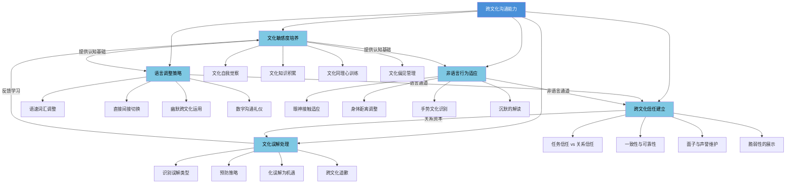
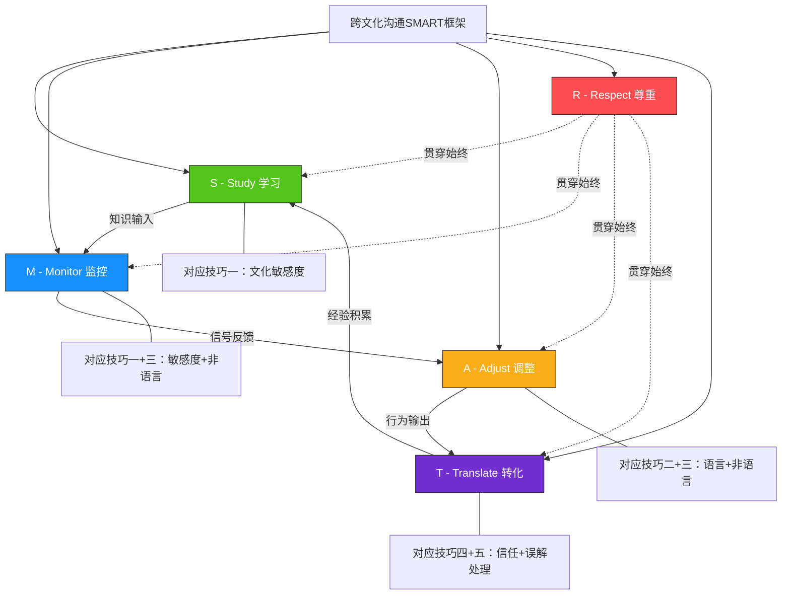
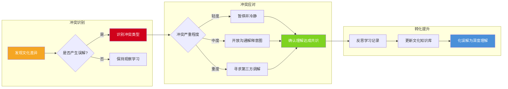
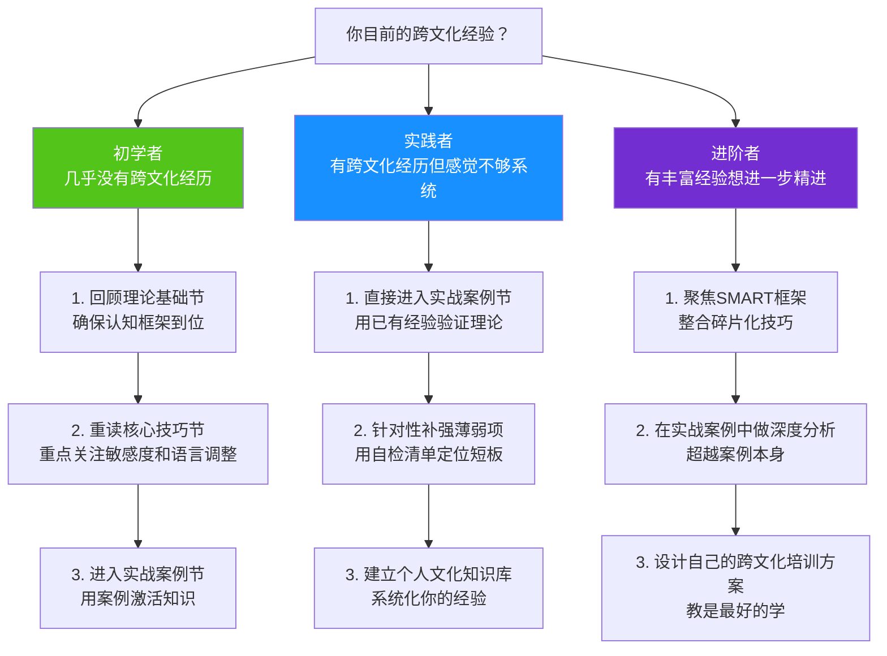

## 本节小结：从碎片化技巧到系统化能力

前面六节分别讲解了跨文化沟通的五大核心技巧和一个综合实践框架。如果你一路读到这里，脑海中可能同时存在着大量的概念、模型和操作方法——从文化敏感度的四个训练维度，到语言调整的三种策略，再到SMART框架的五个行动步骤。本节的核心任务，是帮你把这些碎片化的知识点**编织成一张可操作的知识网络**，并提供一套自检工具，确保你不仅"读完了"，而且真正"学会了"。

### 核心技巧总览：五大技巧的关系地图

五大核心技巧不是并列关系，而是层层递进、相互支撑的有机整体。下图展示了它们的逻辑关系：

五项技巧的逻辑关系可以用一个**建筑隐喻**来理解：

| 技巧 | 建筑隐喻 | 功能定位 | 前置依赖 |
|------|----------|----------|----------|
| 文化敏感度 | 地基 | 为其他所有技巧提供认知基础 | 无（起点） |
| 语言调整 | 框架 | 构建跨文化信息传递的主通道 | 敏感度 |
| 非语言适应 | 装修 | 传递语言无法覆盖的信号和情感 | 敏感度 |
| 信任建立 | 门窗 | 打开合作的入口，流通关系的空气 | 语言+非语言 |
| 误解处理 | 维修系统 | 修复裂痕，让建筑持续运转 | 信任基础 |

没有地基（敏感度），其他技巧都是空中楼阁；没有框架（语言）和装修（非语言），门窗（信任）无法嵌入；没有维修系统（误解处理），建筑会在一次地震后坍塌。这就是为什么前面各节的排列顺序是固定的——它不仅是知识的递进，更是能力的递进。

### 各技巧核心要点快速回顾

以下表格浓缩了前六节的精华。每一条都不是孤立的知识点，而是一把可以立即使用的工具。

#### 一、文化敏感度：跨文化沟通的"操作系统"

| 要素 | 核心内容 | 常见误区 | 实操方法 |
|------|----------|----------|----------|
| 文化自我觉察 | 觉察自身文化假设和偏见 | "我没有文化偏见"——每个人都有的无意识偏见 | 撰写个人文化自传；记录"文化惊讶日记" |
| 文化知识积累 | 系统了解目标文化的规范和价值观 | 只看表层礼仪而忽略深层逻辑 | 三层知识模型（表层→中层→深层）持续学习 |
| 文化同理心 | 用对方的文化逻辑理解其行为 | 把自己的文化标准当作普世标准 | 每次观察到"奇怪行为"时，先问"在他的文化里这意味着什么" |
| 文化偏见管理 | 识别并管理刻板印象 | 把文化概括当作绝对真理 | 区分"文化倾向"与"个人特质"，保持开放性 |

**关键提醒**：文化敏感度不是一次性"学到"就结束的技能，而是需要终身维护的"操作系统"。每接触一种新文化，你的敏感度系统都需要一次升级。

#### 二、语言调整策略：跨越语言障碍的四种武器

| 策略 | 适用场景 | 操作要点 | 典型陷阱 |
|------|----------|----------|----------|
| 语速与词汇调整 | 对方非母语或语境不同时 | 简化句式、避免俚语、控制语速在正常速度的70%-80% | 过度简化导致显得居高临下 |
| 直接与间接切换 | 不同语境文化的互动中 | 低语境对低语境直接表达；高语境对低语境需要适度"翻译"暗含信息 | 误以为"对方应该理解我的暗示" |
| 幽默的跨文化运用 | 建立关系、缓解紧张时 | 先观察再尝试，自嘲最安全，避免涉及身份、宗教、政治的笑话 | 用母语文化中的幽默标准衡量跨文化场合 |
| 数字沟通礼仪 | 邮件、消息、视频会议 | 了解对方文化对回复时效、表情符号、称呼的期望 | 用即时通讯工具的即时性要求高语境文化的同事 |

**关键提醒**：语言调整不是"说对方的语言"，而是"用对方能接受的方式组织信息"。即使你们使用同一种语言，文化差异仍然会体现在信息结构、语气分寸和逻辑推演方式中。

#### 三、非语言行为适应：语言之外的93%

根据Mehrabian的沟通研究，在情感和态度传递中，语言内容仅占7%，语调占38%，面部表情和肢体语言占55%。虽然这个比例在不同情境下有所变化，但核心结论不变：**你"怎么说"比"说什么"重要得多**。

| 非语言维度 | 文化差异光谱 | 适应策略 |
|------------|-------------|----------|
| 眼神接触 | 北欧/北美（直接=自信）←→ 东亚/非洲（直接=无礼） | 观察对方的默认模式，渐进调整而非骤然改变 |
| 身体距离 | 拉丁/中东（近距离=亲密）←→ 北欧/东亚（远距离=尊重） | 在不确定时保持中等距离（约1米），观察对方是趋近还是后退 |
| 手势表达 | 地中海文化（手势丰富）←→ 东亚文化（手势克制） | 学习目标文化的"手势白名单"和"手势黑名单" |
| 沉默解读 | 日本（沉默=思考/尊重）←→ 美国（沉默=尴尬/反对） | 不急于填补沉默，先判断沉默的文化含义再决定是否发言 |
| 触碰规范 | 拉丁/阿拉伯（拥抱/握手久）←→ 东亚/北欧（最小触碰） | 以对方为参照，让对方主导触碰的距离和频率 |

**关键提醒**：非语言适应最大的难点在于——你很难观察到自己的非语言行为。录像回放、同伴反馈、文化导师是三种最有效的自我监控方法。

#### 四、跨文化信任建立：两种信任模式的融合

跨文化信任的核心挑战在于：不同文化对"什么构成信任"有根本不同的理解。

| 信任类型 | 文化分布 | 建立路径 | 建立周期 | 核心信号 |
|----------|----------|----------|----------|----------|
| **任务信任** | 北美、北欧、德国等低语境文化 | 通过能力展示和可靠性 | 较短（数周至数月） | 准时交付、专业表现、透明沟通 |
| **关系信任** | 东亚、中东、拉美等高语境文化 | 通过个人关系和情感连接 | 较长（数月至数年） | 共餐、私人话题交流、家庭互访 |

**四种信任建立策略**：

1. **双轨并行法**：同时投资任务信任（交出高质量成果）和关系信任（参与非正式社交），两条轨道同步推进
2. **文化桥梁法**：寻找既了解你文化又了解对方文化的中间人，通过第三方建立初始信任
3. **一致性展示法**：在不同场合保持一致的行为模式——你"人前人后一个样"比任何承诺都更有说服力
4. **脆弱性适度展示法**：适度暴露自己的不确定性和学习意愿，比假装"无所不知"更能赢得信任——这在东西方文化中都适用，尽管具体表现形式不同

**关键提醒**：信任的建立遵循"缓慢积累、快速摧毁"的规律。一次失信行为可能抵消数月的信任积累。在跨文化场景中，你需要意识到**你的行为可能以你意想不到的方式被对方解读**——这是信任被误伤的最常见原因。

#### 五、文化误解处理：化摩擦为深度理解

文化误解不是沟通的"事故"，而是沟通的"常态"。关键不在于避免所有误解（这是不可能的），而在于建立一套**误解发生后的快速修复机制**。

| 误解类型 | 典型场景 | 识别信号 | 修复策略 |
|----------|----------|----------|----------|
| 语义误解 | 同一个词在不同文化中的含义不同 | 对方表情困惑、反复确认 | 用具体例子替代抽象词汇，确认对方理解 |
| 语用误解 | 言外之意被误读 | 气氛突然变冷、对话中断 | 主动说明"我的意思是……"，而非等待对方追问 |
| 规范误解 | 不同文化的行为规范冲突 | 对方表现出不悦或回避 | 承认差异："我意识到我的做法可能不符合你的习惯" |
| 情感误解 | 情绪表达方式的差异 | 误判对方的情绪状态 | 区分"文化风格"与"个人意图"，不急于下结论 |

**误解修复四步法**：

**关键提醒**：跨文化道歉本身也是一门学问。美国式道歉强调"承认错误+承诺改进"，日本式道歉强调"表达歉意+承担责任"，中东式道歉可能需要通过第三方传达。用错道歉方式，道歉本身可能造成二次伤害。

### SMART框架：五技巧的集成操作系统

前面五大技巧是"零件"，SMART框架是"组装说明书"。它将五项技巧整合为一个可循环执行的行动闭环：

| SMART步骤 | 行动内容 | 对应核心技巧 | 执行频率 |
|-----------|----------|-------------|----------|
| **Study** 学习 | 持续积累目标文化的知识，构建三层知识体系 | 文化敏感度 | 持续进行，每次新文化接触前集中学习 |
| **Monitor** 监控 | 在沟通过程中实时觉察信号，识别差异和误解 | 文化敏感度+非语言适应 | 每次跨文化互动全程 |
| **Adjust** 调整 | 根据监控到的信号灵活变换语言和行为 | 语言调整+非语言适应 | 实时调整，事后复盘 |
| **Respect** 尊重 | 保持文化谦逊，不以己度人，真诚而非操控 | 贯穿全部技巧 | 内化为态度，时刻保持 |
| **Translate** 转化 | 将文化差异从障碍转化为创新资源 | 信任建立+误解处理 | 每次误解后，转化为系统经验 |

SMART框架的精髓在于**循环性**：Study提供知识基础，Monitor在互动中收集信号，Adjust做出行为响应，Translate将经验转化为新的知识，然后回到Study开始下一轮循环。Respect作为态度底色贯穿始终。每经历一轮循环，你的跨文化能力就完成一次升级。

### 文化冲突应对策略：从识别到转化的完整路径

当文化差异演变为实际冲突时，你需要一套系统化的应对流程。以下是冲突应对的三阶段模型：

**三个阶段的操作细节**：

**第一阶段：冲突识别（冷静期）**

冲突发生时，人的第一反应往往是情绪化的。文化冲突的特殊性在于——你可能根本意识不到这是一场"文化冲突"，而误以为是对方"人品有问题"或"故意找茬"。识别文化冲突的关键信号：

- 对方的行为与你的预期严重不符
- 双方都在用自己文化的标准评判对方
- 问题不是关于"事情本身"，而是关于"做事的方式"
- 你感到的不快程度与事件的客观严重程度不成比例

当你观察到这些信号时，按下"暂停键"。不要在情绪高峰期做出反应。

**第二阶段：冲突应对（修复期）**

根据冲突严重程度选择对应策略：

| 严重程度 | 判断标准 | 应对策略 | 具体操作 |
|----------|----------|----------|----------|
| 轻度 | 尴尬但无实质影响 | 暂停+自嘲+回归正题 | "哈哈，看来我们对这件事的看法很不同，让我换个角度说" |
| 中度 | 影响合作或关系 | 开启元对话 | "我觉得我们之间可能存在文化差异导致的误解，我们能聊聊各自的期望吗？" |
| 重度 | 严重损害信任或项目 | 引入调解人 | 寻找双方信任的、具备跨文化能力的第三方主持沟通 |

**第三阶段：转化提升（学习期）**

每一次冲突都是一次深度学习的机会。冲突后请完成以下记录：

【冲突复盘模板】

事件描述：发生了什么？（客观事实，不加解读）
我的反应：我做了什么？为什么？
对方反应：对方做了什么？我当时的解读是什么？
文化分析：这背后可能的文化逻辑差异是什么？
替代解读：如果从对方的文化角度出发，有没有其他合理的解读？
新规则：下次遇到类似情况，我可以怎么做？
知识更新：这次经历对我的文化知识库有什么补充？

### 能力自检：你真的掌握了吗？

读完六节内容后，用以下自检清单评估自己的掌握程度。诚实面对每一项——"大概知道"和"能在压力下做到"之间有巨大的鸿沟。

#### 文化敏感度自检

| 检查项 | 能做到（✓） | 勉强做到（△） | 做不到（✗） |
|--------|------------|--------------|------------|
| 我能说出至少3种自身文化的默认假设 | | | |
| 当我观察到"不寻常"的行为时，我会先考虑文化因素再下判断 | | | |
| 我能区分"文化概括"和"刻板印象"的区别 | | | |
| 我至少能说出目标文化在霍夫斯泰德6个维度上的大致位置 | | | |
| 我有意识地监控自己的无意识文化偏见 | | | |

#### 语言调整自检

| 检查项 | 能做到（✓） | 勉强做到（△） | 做不到（✗） |
|--------|------------|--------------|------------|
| 我能根据对方的语言能力调整自己的语速和词汇 | | | |
| 我知道如何在直接与间接之间切换 | | | |
| 我了解目标文化中数字沟通的基本礼仪 | | | |
| 我使用过"确认理解"的话术（如"让我确认一下我的理解……"） | | | |

#### 非语言适应自检

| 检查项 | 能做到（✓） | 勉强做到（△） | 做不到（✗） |
|--------|------------|--------------|------------|
| 我了解目标文化中眼神接触的规范 | | | |
| 我能调整自己的身体距离以适应对方文化 | | | |
| 我知道哪些手势在目标文化中是禁忌 | | | |
| 我能正确解读对方沉默的含义 | | | |

#### 信任建立自检

| 检查项 | 能做到（✓） | 勉强做到（△） | 做不到（✗） |
|--------|------------|--------------|------------|
| 我知道目标文化更侧重任务信任还是关系信任 | | | |
| 我有具体的信任建立行动计划 | | | |
| 我理解"面子"在对方文化中的具体表现形式 | | | |
| 我能在不同文化中展示一致性和可靠性 | | | |

#### 误解处理自检

| 检查项 | 能做到（✓） | 勉强做到（△） | 做不到（✗） |
|--------|------------|--------------|------------|
| 我能识别语义、语用、规范和情感四种误解类型 | | | |
| 我掌握了误解修复四步法（暂停→好奇→共情→重建） | | | |
| 我知道如何在对方文化中进行有效的道歉 | | | |
| 我有将误解转化为深度理解的意识和习惯 | | | |

**评分标准**：
- **全部✓**：你已经具备了扎实的跨文化沟通核心技巧基础，可以进入实战案例阶段
- **存在△**：你理解了理论，但实践还不够充分——这完全正常，接下来的实战案例将帮助你巩固
- **存在✗**：建议回到对应小节重新学习，重点关注标注✗的项目

### 学习路径建议：不同起点的进阶方案

根据你当前的跨文化经验水平，选择最适合自己的学习路径：

### 本节核心公式

如果把整个核心技巧节浓缩为一个公式，它是这样的：

**跨文化沟通效能 = 文化敏感度 × (语言调整 + 非语言适应) × 信任深度 ÷ 误解频率**

- **文化敏感度**是乘数——它放大或缩小你所有其他技巧的效果
- **语言调整**和**非语言适应**是两条并行的信息通道，两者缺一不可
- **信任深度**是乘数——信任越深，沟通的容错空间越大
- **误解频率**是分母——误解越少，整体效能越高

这个公式揭示了一个关键洞察：**文化敏感度是所有技巧的杠杆**。提升敏感度，其他技巧的效果会成倍放大；没有敏感度，其他技巧即使练得再纯熟也会在关键时刻失灵。

### 下一步：从技巧到战场

你已经掌握了跨文化沟通的理论武器（理论基础节）和实操工具（本节）。但知识和能力之间仍然隔着一道"经验"的鸿沟。

在下一节——实战案例中，我们将通过八个真实场景，展示这些技巧在战场上的实际运用：

- 跨国视频会议中的文化碰撞——当美国人的直接遇上日本人的沉默
- 海外留学的文化适应——从孤独到融入的120天
- 国际商务谈判中的信任建立——中东市场的真实教训
- 跨文化团队管理——从内耗到高产的转变
- 海外旅行中的文化尴尬——以及如何优雅地化解
- 文化冲突的调解——当东西方激烈碰撞
- 翻译误解导致的商务危机——一个字引发的百万损失
- 文化融合的美好实践——差异如何成为创新的源泉

每个案例都将展示：理论在前、技巧在中、实战在后。带着你从本节学到的框架去阅读这些案例，你将获得的不仅是"别人的故事"，而是"可以迁移到自己场景中的模式识别能力"。

**记住：跨文化沟通能力不是天赋，而是刻意练习的产物。你已经完成了从"知道"到"理解"的跨越，下一步是"做到"。**
