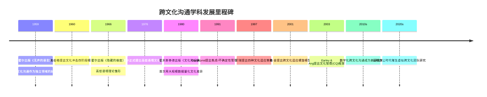
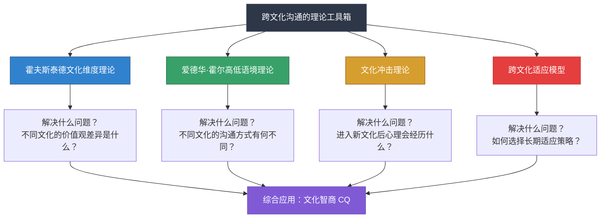
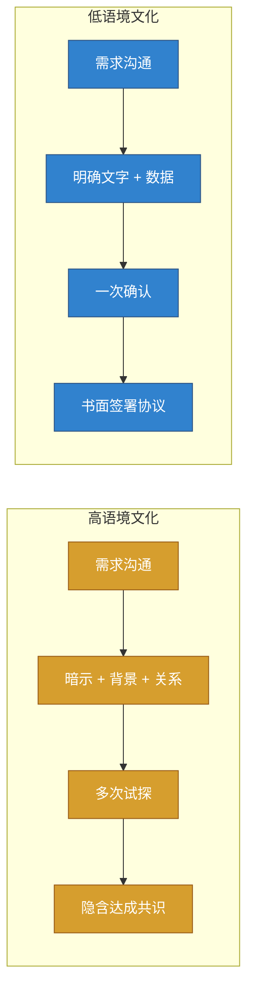
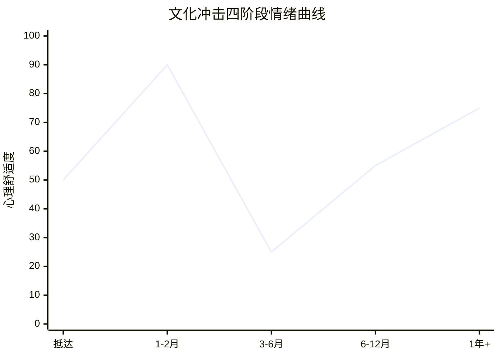
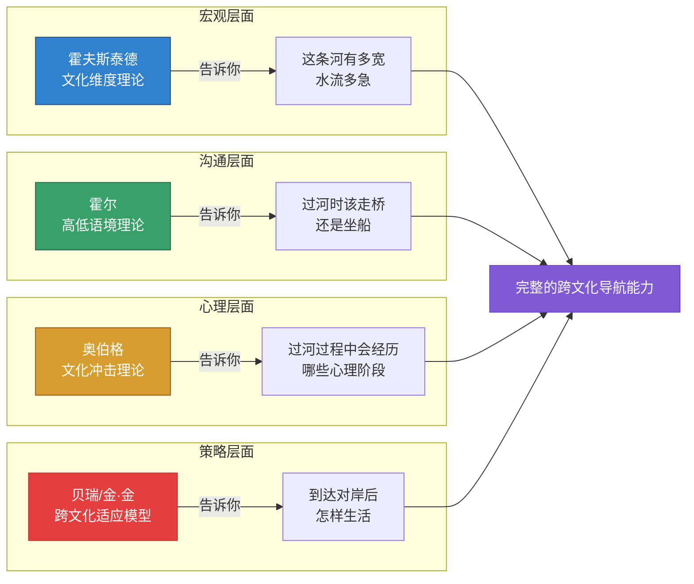

## 引言：为什么跨文化沟通需要理论

### 从一个常见困境说起

你可能有过这样的经历：和一位外国同事共事了几个月，关系表面上不错，但总感觉哪里"不太对"。你说了一句委婉的拒绝，对方却当成了同意；你精心准备的长邮件表达了三层意思，对方只回了一句"OK"；你觉得已经暗示得很明显了，对方却完全没有接收到你的信号。

让我把这个场景展开——

> 你是某跨国公司的项目经理，负责一个中德联合开发项目。第一次视频会议上，你按照中国商务习惯先寒暄了五分钟，聊了聊天气、旅途和对方公司的近况。德方负责人礼貌地回应了几句，然后直接说："Let's get to the agenda."你感觉对方有点不近人情，但也没多想。
>
> 项目进入执行阶段后，你给德方发了一封邮件，用了一段很长的铺垫来表达"目前进度有些滞后，可能需要调整一下时间表"。你的措辞是："考虑到目前的实际情况，或许我们可以讨论一下是否有必要对原定计划做一些适当的微调。"德方回复："OK, so you're saying we're behind schedule. By how many weeks?"你愣住了——你花了三段话来包装的信息，对方一句话就拆穿了。
>
> 到了项目中期评审，你在会上提出了一个方案，德方工程师直接说"This approach won't work because..."列了三个技术理由。你感到被当众否定，面子挂不住。但会议结束后，那位德国工程师像没事一样过来和你喝咖啡，讨论下一个技术问题。你困惑了：他是故意不给我面子，还是根本没意识到这是一个"面子问题"？

这种"不太对"的感觉，往往不是语言问题，也不是个人问题，而是**文化逻辑的隐形碰撞**。每个人在成长过程中都被自己的文化"编程"了一套默认的沟通操作系统——什么该直说、什么该暗示、如何表达异议、怎样才算礼貌——而这套操作系统在另一个文化环境中可能完全失效。

问题在于：文化操作系统是隐形的。你不会意识到自己正在"运行"某套规则，直到你遇到一个运行不同规则的人。这就是为什么单纯的"经验"和"直觉"在跨文化场景中常常失灵——你需要一面镜子来照见自己的文化假设，而**理论就是那面镜子**。

### 理论的价值：从"感觉有差异"到"知道差异在哪里"

很多人对跨文化沟通的理解停留在直觉层面："日本人比较含蓄""美国人比较直接""德国人比较严谨"。这些观察不能说错，但它们有几个致命的局限：

| 直觉认知的局限 | 具体表现 | 理论认知的优势 |
|---------------|---------|---------------|
| **碎片化** | 只知道个别现象，不知道背后的系统性规律 | 提供多维度分析框架，看到差异的全貌 |
| **表面化** | 停留在行为层面，不理解深层价值观驱动 | 深入价值观和信念层面，理解"为什么" |
| **刻板化** | 容易把个别特征放大为对整个文化的标签 | 强调概率分布和个体差异，避免一刀切 |
| **不可迁移** | 对一个文化的经验无法应用到另一个文化 | 提供通用分析工具，可应用于任何文化 |
| **无法预测** | 只能事后解释，不能事前预判 | 能够预测潜在冲突点，提前做好准备 |
| **无法干预** | 知道"有差异"但不知道如何调整 | 提供具体的调整策略和行动指南 |

打一个比方：没有理论指导的跨文化经验，就像一个没有地图的旅行者。你可能走过了很多地方，但每次到了新地方仍然要从头摸索。而理论给你一张地图——它不能代替你走路，但能让你在出发前就看到地形全貌，知道哪里有河流、哪里有山脉、哪里是捷径。

更深层地说，理论的价值在于**让你获得元认知能力**——也就是"对自己认知过程的认知"。当你掌握了高低语境理论，你在和日本人对话时不再只是"感觉对方话里有话"，而是能够清晰地意识到"这是高语境沟通模式，我需要关注语境线索"。这种觉察本身就是一种能力的提升。

### 跨文化沟通学科的发展脉络

在深入具体理论之前，有必要了解跨文化沟通作为一个学科领域是如何发展到今天的。理解学科脉络能帮你看到每个理论是在什么背景下诞生的、它们各自回答了当时的什么问题。

这个时间线揭示了一个重要规律：跨文化沟通理论的发展，始终是对现实世界变化的回应。霍尔的理论诞生于冷战时期美国需要理解不同文化的背景下；霍夫斯泰德的研究源于跨国公司管理全球员工的实际需求；文化智商的提出则是全球化深化后对"如何培养跨文化能力"这个问题的系统回答。

### 四大理论：你的跨文化"工具箱"

本节将系统介绍四个相互补充的理论框架。它们从不同角度切入跨文化沟通这个复杂问题，组合在一起构成一个完整的分析体系。

#### 为什么是这四个理论？

跨文化沟通领域的理论框架远不止四个。学术文献中常见的还有：Gudykunst的焦虑/不确定性管理理论（AUM）、Ting-Toomey的面子协商理论、Deardorff的跨文化能力模型等。我们选择这四个作为核心框架，基于三个标准：

1. **互补性**：四个理论分别覆盖价值观层面、沟通层面、心理层面和策略层面，彼此不重叠，组合起来形成完整的分析体系
2. **实操性**：每个理论都能直接指导具体的沟通行为，而非停留在纯学术讨论
3. **验证度**：四个理论都经过数十年的实证研究检验，在全球范围内被广泛引用和应用

下表展示了这四个理论与其他常见理论的对比，帮你理解为什么它们构成了最佳的"基础工具箱"：

| 理论框架 | 核心贡献 | 分析层面 | 实操指导性 | 覆盖范围 |
|---------|---------|---------|-----------|---------|
| **霍夫斯泰德文化维度** | 量化文化差异的六个维度 | 价值观 | ★★★★ | 国家层面 |
| **霍尔高低语境** | 信息编码解码方式的差异 | 沟通方式 | ★★★★★ | 沟通场景 |
| **奥伯格文化冲击** | 跨文化适应的心理阶段 | 心理过程 | ★★★★ | 个体层面 |
| **贝瑞适应策略** | 四种文化适应策略选择 | 长期策略 | ★★★★ | 个体层面 |
| Gudykunst AUM理论 | 焦虑与不确定性的管理 | 心理机制 | ★★★ | 沟通过程 |
| Ting-Toomey面子理论 | 面子协商与冲突风格 | 冲突管理 | ★★★ | 冲突场景 |
| Deardorff能力模型 | 跨文化能力的构成要素 | 能力评估 | ★★ | 教育培训 |

前四个理论之所以成为核心，是因为它们覆盖了跨文化沟通最根本的四个问题：**文化差异是什么（霍夫斯泰德）、信息如何传递（霍尔）、心理如何变化（奥伯格）、策略如何选择（贝瑞）**。掌握了这四个，你就有了分析任何跨文化场景的基本工具。其他理论可以在此基础上按需补充。

#### 理论一：霍夫斯泰德文化维度理论——给文化画"坐标系"

**核心问题**：不同国家的文化在价值观层面有哪些可测量的差异？

荷兰社会心理学家吉尔特·霍夫斯泰德（Geert Hofstede）在20世纪60-70年代对IBM全球70多个国家的11.6万名员工进行了大规模调查，提炼出六个量化文化差异的维度：权力距离、个人主义与集体主义、不确定性规避、男性化与女性化、长期导向与短期导向、放纵与克制。

这个理论的价值在于它把模糊的"文化差异"变成了可测量、可比较的数据。你可以用这六个维度快速定位任何一种文化在关键价值观上的"坐标"，从而预判对方的行为倾向。例如，当你知道一个国家的权力距离指数很高时，你就可以预判其组织中的层级沟通模式，而不需要通过反复试错来摸索。

**快速示例**：仅用"个人主义vs集体主义"这一个维度，就能解释大量跨文化沟通中的误解——

| 行为场景 | 个人主义文化（如美国） | 集体主义文化（如中国） |
|---------|---------------------|---------------------|
| 开会发言 | 主动表达个人观点是自信的表现 | 先沉默观察，等领导或资深者发言后才表态 |
| 提出异议 | 直接说"I disagree"是正常讨论 | 私下沟通比当众反驳更被接受 |
| 表扬方式 | 个人表彰激励效果好 | 过度个人表扬可能让人不安（怕脱离群体） |
| 决策方式 | 个人拍板效率高 | 需要共识，决策慢但执行阻力小 |

**你会在下一节学到**：每个维度的精确定义、典型国家的得分对比、以及如何用维度分析来指导具体的沟通策略。

#### 理论二：高低语境文化理论——解码信息传递方式

**核心问题**：不同文化的人传递和接收信息的方式有何根本差异？

美国人类学家爱德华·T·霍尔（Edward T. Hall）在1976年提出了高语境文化与低语境文化的区分。这个理论关注的不是价值观本身，而是**信息如何被编码和解码**。在高语境文化（如中国、日本、阿拉伯国家）中，大量信息存在于语境、关系和非语言线索中，语言本身只是冰山一角；在低语境文化（如美国、德国、北欧国家）中，信息主要通过明确的语言文字传递，说话者的责任是把意思表达清楚。

这个理论的实用价值极高——它直接解释了为什么你会觉得"话里有话"而对方却"听不出来"，或者为什么你觉得对方"太直接、不懂含蓄"。理解高低语境的差异，你就能有意识地调整自己的表达方式，在高语境环境中学会"听话听音"，在低语境环境中学会"把话说透"。

**一个直观的对比**：同样的商业场景，在高低语境文化中的表现完全不同——

**你会在下一节学到**：高低语境的连续体模型、12个具体国家的语境定位、以及在不同语境环境中的沟通调整策略。

#### 理论三：文化冲击理论——预知你的心理旅程

**核心问题**：进入一个全新的文化环境后，你的心理会经历怎样的变化？

加拿大人类学家卡利沃·奥伯格（Kalervo Oberg）在1960年首次系统描述了"文化冲击"（Culture Shock）现象，并将其划分为四个阶段：蜜月期、挫折期、调整期和适应期。这个理论回答的是一个非常实际的问题——当你身处异文化环境中，为什么有时候感觉兴奋好奇，有时候又感到焦虑沮丧？这些情绪波动是正常的吗？会持续多久？

文化冲击理论最大的实用价值是**让你对未来有预期**。当你知道"挫折期"是几乎所有跨文化适应者都会经历的正常阶段，当你知道这个阶段通常在3-6个月后会自然过渡到调整期，你就不会在低谷时做出冲动的决定（比如放弃留学、辞职回国）。它给了你一张"情感路线图"，让你在最困难的时刻知道曙光在哪里。

**四个阶段的情绪曲线**：

**你会在下一节学到**：四个阶段的详细特征和持续时间、每个阶段的典型心理和行为表现、以及各阶段的自我调适策略。

#### 理论四：跨文化适应模型——选择你的长期策略

**核心问题**：面对新文化，我应该选择怎样的适应策略？长期的跨文化成长路径是什么？

如果说文化冲击理论描述的是短期的心理波动，那么跨文化适应模型关注的是长期的策略选择。加拿大心理学家约翰·贝瑞（John Berry）在1997年提出了四种文化适应策略：整合（既保持自己的文化又融入新文化）、同化（放弃自己的文化完全融入新文化）、分离（保持自己的文化拒绝新文化）、边缘化（既不保持自己的文化也不融入新文化）。后来，韩裔学者金·金（Young Yun Kim）在2001年进一步提出了跨文化适应的螺旋上升模型，描述了个体在跨文化经历中不断解构和重建自我的成长过程。

这个理论帮助你做出战略性选择：在保持文化根基和拥抱新文化之间，你想站在哪个位置？不同的选择会带来不同的生活体验和成长路径。更重要的是，它告诉你跨文化适应不是一个被动的"熬过去"的过程，而是一个可以主动规划和管理的成长旅程。

**贝瑞四种策略的直觉理解**：

| 策略 | 保持原文化？ | 融入新文化？ | 一句话概括 | 典型人群画像 |
|------|------------|------------|-----------|------------|
| **整合** | ✓ | ✓ | "两种文化我都要" | 跨国企业高管、长期海外移民中的成功者 |
| **同化** | ✗ | ✓ | "入乡随俗，全盘接受" | 主动融入当地社会的留学生 |
| **分离** | ✓ | ✗ | "我就保持自己的圈子" | 唐人街/中国城的早期移民群体 |
| **边缘化** | ✗ | ✗ | "哪里都不属于" | 被迫迁移、缺乏社会支持的难民 |

研究表明，**整合策略**在大多数情境下与最佳的心理健康和社会适应相关联，但这需要东道主社会具有包容性，且个体具备足够的跨文化能力。

**你会在下一节学到**：四种适应策略的详细对比和适用情境、U型曲线和W型曲线模型、以及如何评估和调整自己的适应策略。

### 四大理论的关系：一张完整的"文化地图"

这四个理论并非各自独立，而是从不同维度共同构建了一张理解跨文化沟通的完整地图：

| 理论 | 分析层面 | 回答的核心问题 | 类比 |
|------|---------|--------------|------|
| 霍夫斯泰德文化维度理论 | 宏观价值观 | 不同文化的人在深层信念上有何差异？ | 地形图——告诉你地势高低 |
| 高低语境文化理论 | 沟通方式 | 不同文化的人如何编码和解码信息？ | 交通规则——告诉你如何通行 |
| 文化冲击理论 | 心理过程 | 进入新文化后心理会经历什么变化？ | 天气预报——告诉你未来的情绪气候 |
| 跨文化适应模型 | 长期策略 | 如何选择和规划长期的文化适应路径？ | 导航系统——告诉你到达目的地的路线 |

在实际应用中，你往往需要同时调用多个理论。举一个具体例子：假设你即将被公司外派到日本工作一年。

- **用霍夫斯泰德的理论**，你会了解到日本是高权力距离、集体主义、高不确定性规避、男性化文化，这意味着你需要重视层级关系、关注团队和谐、提供详尽的计划、注重专业表现。
- **用霍尔的理论**，你会了解到日本是典型的高语境文化，这意味着很多信息不会被直接说出来，你需要学会"听话听音"，注意非语言信号和言外之意。
- **用文化冲击理论**，你会预期到自己在头两个月可能处于蜜月期（对一切都感到新奇），在第3-6个月可能进入挫折期（开始感到孤独和挫败），在第6-9个月逐渐进入调整期。有了这个预期，你就不会在挫折期做出冲动决定。
- **用跨文化适应模型**，你可以提前思考自己的适应策略——是选择整合（学习日本文化的同时保持自己的文化根基），还是同化（尽可能融入日本社会）？不同的选择会影响你的社交圈子、生活方式和心理状态。

四个理论叠加在一起，你获得的不是四个孤立的知识点，而是一个立体的分析框架。

### 数字化时代的新挑战

上述经典理论诞生于面对面交流为主的时代。但在2020年代，跨文化沟通的场景已经发生了根本性变化——远程办公、虚拟团队、异步协作成为常态。这带来了一些经典理论没有直接覆盖的新挑战：

**挑战一：非语言线索的大幅衰减**

高语境文化严重依赖非语言线索（面部表情、肢体语言、空间距离、沉默的含义），但视频会议只能传递有限的非语言信息，文字沟通（邮件、即时消息）则几乎完全丧失了这些线索。这意味着：

- 高语境文化的人在虚拟环境中更容易感到"信息不足"，因为大量本应通过语境传递的信息丢失了
- 低语境文化的人相对适应，因为他们本来就依赖明确的文字表达
- 跨文化团队的虚拟沟通中，高语境成员可能需要有意识地"降低语境"，把更多信息明确说出来

**挑战二：异步沟通中的文化假设冲突**

当团队成员分布在不同时区，异步沟通（邮件、文档、项目管理工具）成为主要协作方式。但不同文化对异步沟通的期待差异巨大：

| 维度 | 偏好 | 典型文化背景 |
|------|------|------------|
| 回复速度期待 | 期望即时回复 | 高权力距离文化（下属应及时响应上级） |
| 回复速度期待 | 接受合理延迟 | 低权力距离文化（尊重个人工作节奏） |
| 邮件风格 | 简短直接 | 美国、北欧 |
| 邮件风格 | 先寒暄再谈正事 | 中国、日本、韩国、阿拉伯国家 |
| 决策方式 | 线上完成全部决策 | 美国、以色列 |
| 决策方式 | 线上讨论，线下（或视频）才做最终决策 | 日本（根回し/nemawashi文化） |

**挑战三：文化融合与文化冲突的加速**

数字化原住民（90后、00后）在全球互联网文化的影响下，其沟通风格可能已经偏离了霍夫斯泰德数据中的"国家平均值"。一个在日本互联网公司工作的90后程序员，其直接程度可能远超传统日本文化规范。这意味着在应用经典理论时，需要考虑**代际因素**和**行业因素**的调节作用。

这些新挑战并不意味着经典理论过时了，而是说你需要在经典框架的基础上，增加对数字化沟通媒介本身的分析维度。

### 理论之外：文化智商（CQ）的整合视角

近年来，跨文化心理学领域出现了一个整合性概念——**文化智商**（Cultural Intelligence, CQ）。它由伦敦商学院的P. Christopher Earley和新加坡南洋理工大学的Soon Ang于2003年首次系统提出，现已成为跨文化研究领域最具影响力的整合框架之一。

文化智商不是第五个独立理论，而是将前述理论整合为一个可操作的能力体系。它包含四个维度：

| 维度 | 核心问题 | 与四大理论的关系 | 具体表现 |
|------|---------|----------------|---------|
| **元认知CQ** | 你是否意识到自己的文化假设？ | 所有理论的基础——没有觉察，理论无法发挥作用 | 互动前反思偏见；互动中观察对方反应并实时调整；互动后复盘得失 |
| **认知CQ** | 你对不同文化了解多少？ | 直接运用霍夫斯泰德和霍尔的理论知识 | 知道不同文化的价值观、规范、习俗；理解文化差异的系统性原因 |
| **动机CQ** | 你是否愿意主动跨文化互动？ | 文化冲击理论告诉你为什么需要动机支撑 | 对异文化保持好奇心；面对困难不退缩；享受跨文化挑战 |
| **行为CQ** | 你能否灵活调整行为？ | 跨文化适应模型的具体行为落地 | 调整语速语调；适应不同的身体距离；切换直接/间接表达方式 |

CQ的价值在于它把"知道"和"做到"连接了起来。很多人读了很多跨文化理论，知识测验能得高分，但在实际跨文化互动中仍然表现糟糕——因为他们缺乏元认知觉察、缺乏行动动机、或缺乏行为灵活性。本节的理论学习培养的是你的认知CQ，但请记住，认知只是起点，真正的跨文化能力需要四个维度的协同发展。

#### 快速自评：你的CQ水平

在深入学习之前，花两分钟做一个简单的自我评估。对以下12个陈述，用1-5分给自己打分（1=完全不符合，5=完全符合）：

**元认知CQ（觉察力）**
1. 在与不同文化背景的人交流前，我会反思自己可能带有的文化偏见
2. 在跨文化互动中，我能察觉到自己的理解可能不准确并及时调整
3. 与不同文化的人交流后，我会复盘哪些地方做得好、哪些需要改进

**认知CQ（知识储备）**
4. 我能说出至少三种文化在沟通风格上的具体差异
5. 我了解不同文化在时间观念、层级关系、个人空间等方面的规范差异
6. 我理解文化差异背后的深层历史和价值观原因

**动机CQ（意愿驱动）**
7. 我真心喜欢与不同文化背景的人打交道
8. 面对跨文化沟通中的挫折，我不会轻易放弃
9. 我主动寻找跨文化互动的机会，而非被动应付

**行为CQ（行为弹性）**
10. 我能根据对方的文化背景调整自己的语速和表达方式
11. 我能在正式与非正式、直接与间接的沟通风格之间灵活切换
12. 当我的原有沟通方式不起作用时，我能快速尝试不同的方式

**评分解读**：
- **48-60分**：你的CQ基础扎实，本节内容可以帮你系统化已有经验
- **36-47分**：你有一定的跨文化意识，但某些维度需要加强
- **24-35分**：你处于跨文化能力的早期阶段，本节的理论学习将为你打下重要基础
- **12-23分**：这恰好说明你最需要这些内容——觉察是成长的第一步

无论你的得分如何，重要的是带着觉察进入学习。这个自评不是考试，而是帮你建立学习的起点坐标。

### 如何学习本节内容

#### 学习策略建议

本节包含五个部分，建议按顺序学习：

1. **引言**（本节）——建立整体框架，理解为什么需要理论
2. **霍夫斯泰德文化维度理论**——掌握量化分析文化差异的核心工具
3. **高低语境文化理论**——理解沟通方式差异的关键模型
4. **文化冲击理论**——获得心理适应过程的预见能力
5. **跨文化适应模型**——建立长期策略规划的思维框架
6. **理论整合与实践意义**——将四个理论串联为完整的分析体系

#### 阅读时的思考框架

在学习每个理论时，建议你带着以下四个问题去阅读：

1. **这个理论解释了什么现象？** ——理解理论的适用范围
2. **这个理论的核心概念是什么？** ——掌握关键术语和定义
3. **这个理论对我的实际沟通有什么指导？** ——连接理论与实践
4. **这个理论有什么局限性？** ——避免把理论当作绝对真理

特别提醒第三点：每个理论都不是用来"背"的，而是用来"用"的。每读完一个理论的讲解，试着想一想自己过去的跨文化经历，看看这个理论是否能解释你曾经困惑的现象。如果你能说出"原来当时是因为……"，说明理论已经开始内化为你的分析工具了。

#### 建立个人"跨文化案例库"

学习理论最有效的方法之一，是建立自己的跨文化案例库。建议你在学习过程中准备一个笔记本（纸质或电子），记录以下内容：

| 记录项 | 说明 | 示例 |
|--------|------|------|
| **场景描述** | 什么时候、什么人、什么事 | 2024年3月，与美国同事讨论项目方案 |
| **当时的困惑** | 你当时感觉哪里不对 | 对方直接否定了我的方案，我觉得没面子 |
| **理论分析** | 用哪个理论可以解释 | 霍夫斯泰德：个人主义文化中对事不对人是常态 |
| **行为调整** | 下次可以怎么做 | 区分"对方案的批评"和"对人的否定" |
| **实际效果** | 尝试调整后的结果 | （学习后续章节后填写） |

这个案例库将成为你最宝贵的个人学习资产。理论会遗忘，但你自己的真实经历和从中提取的洞察，会内化为你的跨文化直觉。

### 理论学习的常见陷阱

在开始之前，有几个常见的认知陷阱值得警惕：

**陷阱一：把理论当作刻板印象的"学术背书"**

"霍夫斯泰德说中国文化是集体主义的，所以所有中国人都不重视个人利益。"——这是对理论最常见的误用。文化维度描述的是一个群体的中心趋势和概率分布，而非每个个体的确定性特征。同一个国家内部，不同地区、不同年龄、不同职业群体之间可能存在巨大差异。理论是帮你理解"平均而言更可能是什么"，而不是"一定是什么"。

一个更准确的思维方式是：当我遇到一位来自高权力距离文化的合作伙伴时，我会**先假设**对方可能更重视层级关系，然后通过实际互动来**验证或修正**这个假设。理论提供的是初始假设，而非最终结论。

**陷阱二：只学理论不实践**

读完四个理论，你能说出每个维度的定义、能画出高低语境的示意图、能背出文化冲击的四个阶段——但在实际跨文化互动中，你仍然按自己的默认习惯行事。理论知识如果不转化为行为调整，就只是一堆漂亮的名词。本节之后的核心技巧和实战案例部分，就是为了帮你完成这个转化。

一个简单的检验方法：学完理论后的下一次跨文化互动中，你是否能在脑中闪过"这个行为可能和X理论有关"的念头？如果能，说明理论已经开始影响你的认知加工过程。

**陷阱三：忽视理论的时代和文化局限**

霍夫斯泰德的数据采集于20世纪60-70年代的IBM员工，霍尔的理论主要基于美国与其他文化的对比。这些理论在诞生的时代背景下是开创性的，但直接套用到今天的全球化世界需要谨慎。例如，互联网时代成长起来的年轻一代，其文化特征可能与几十年前的调查数据有显著差异。把理论作为分析的起点，而非终点。

具体来说，需要注意以下几点局限：

- **样本偏差**：霍夫斯泰德的研究对象是IBM员工，这是一群受过高等教育、在跨国公司工作的人，不能完全代表其所在国家的整体文化
- **国家≠文化**：一个国家内部可能包含多个文化区域（如中国南方与北方、美国东海岸与中西部）
- **时间漂移**：几十年前的数据可能无法准确反映当下的文化状态，尤其是快速变化的社会
- **二元对立**：高低语境、个人主义vs集体主义等维度容易被简化为非此即彼的二元对立，实际上它们是连续的光谱

**陷阱四：过度简化复杂现实**

现实中的跨文化沟通远比任何理论模型都复杂。一个人可能同时受到民族文化、职业文化、代际文化、地域文化的多重影响。一位在硅谷工作的中国工程师，其沟通风格可能既不是"典型的中国式"，也不是"典型的美国式"，而是一种混合体。理论给你的是分析的框架，而不是现成的答案。

**陷阱五：用理论回避个人责任**

"他是美国人所以太直接了"——这种归因方式看似在运用理论，实际上是在用文化差异作为借口来回避真正的沟通问题。文化差异是真实存在的，但不是所有沟通失败都可以归因于文化。有时候，问题就是出在准备不足、信息不清、或者态度不当上。理论应该帮你更好地归因，而不是帮你推卸责任。

正确的态度是：先排除个人因素（表达是否清晰、信息是否完整、态度是否尊重），再考虑文化因素。文化差异是最后一层归因，而非第一层。

### 本节学习目标

通过本节的系统学习，你将能够：

1. **理解四大理论的核心思想和相互关系**——不是死记硬背定义，而是理解每个理论解决了什么问题、彼此如何互补
2. **掌握关键概念和术语**——权力距离、高低语境、文化冲击四阶段、四种适应策略等，能够用这些概念分析真实的跨文化场景
3. **建立理论指导实践的思维习惯**——在遇到跨文化沟通问题时，能够主动调用理论框架来分析原因、预测走势、选择策略
4. **识别理论的局限性**——知道什么时候理论适用、什么时候需要结合具体情境灵活判断
5. **了解自己的CQ起点**——通过自评明确优势和待提升维度，让后续学习更有针对性
6. **为后续的核心技巧和实战案例打下认知基础**——理论是"知"的层面，后续章节将帮你从"知"走向"行"

准备好了吗？让我们从第一个理论开始——霍夫斯泰德的文化维度理论，看看这位荷兰学者是如何用六个数字给全世界的文化画了一张"坐标系"的。

***
