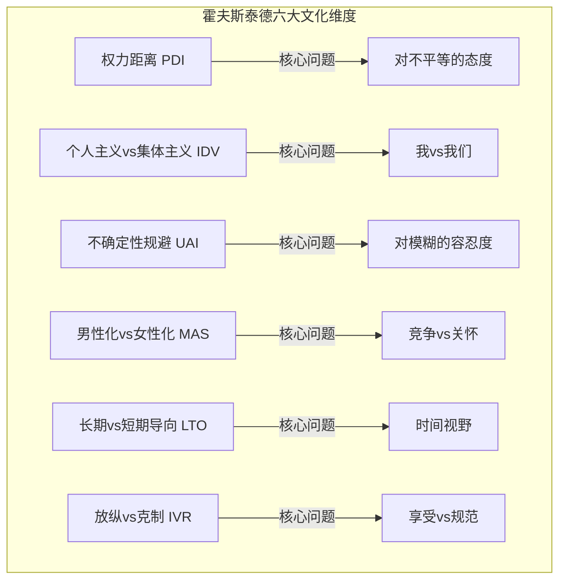
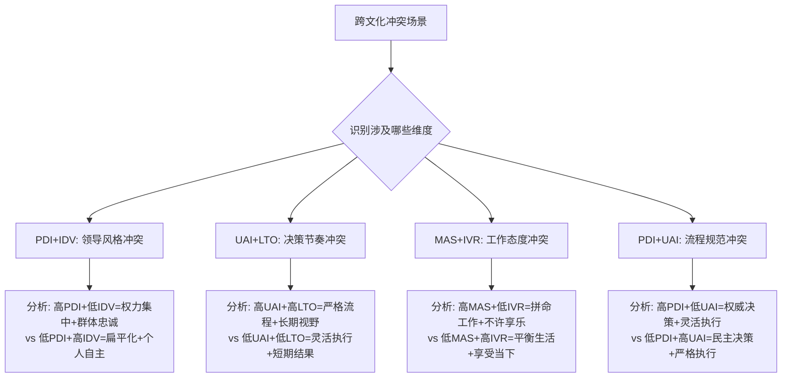
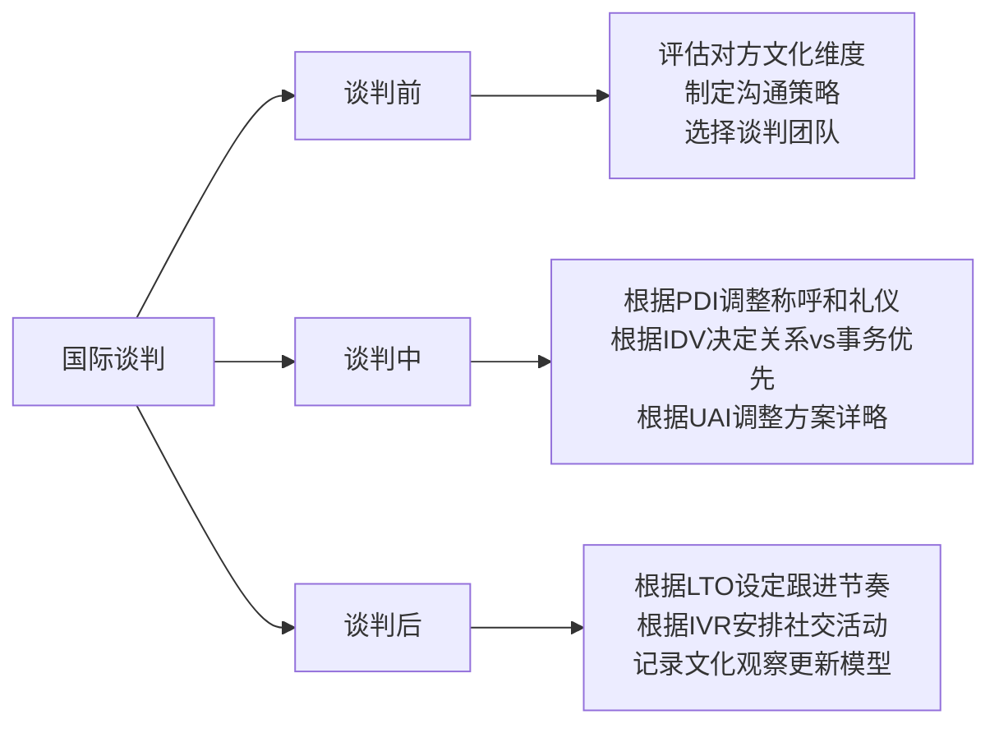
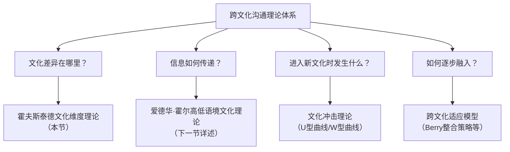
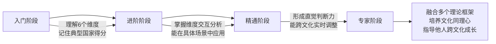

## 一、霍夫斯泰德文化维度理论

跨文化沟通的起点是理解"文化差异到底在哪里"。如果无法将模糊的"文化不同"转化为可分析、可比较的维度，跨文化沟通就只能停留在直觉层面。荷兰社会心理学家吉尔特·霍夫斯泰德（Geert Hofstede）用一套量化框架解决了这个问题——文化维度理论（Cultural Dimensions Theory）。它至今仍是跨文化研究领域引用次数最高的理论框架之一，被广泛应用于国际商务、跨文化培训、外交谈判和学术研究。

理解这套理论的价值在于：它把"我觉得他们做事方式很奇怪"变成了"他们在权力距离和不确定性规避两个维度上的得分与我们有显著差异，因此在决策方式上存在结构性不同"。前者导致误解和挫败，后者导向理解和策略。

### 1.1 理论起源与发展

#### 1.1.1 IBM 数据库：史上最大规模的文化调查

20世纪60年代，霍夫斯泰德在IBM公司担任人事研究主管。他注意到同一个跨国公司在不同国家的分支机构存在显著的管理差异——同样一份岗位说明书，在荷兰和在日本的解读完全不同。这激发了一个关键假设：这些差异的根源不在公司制度，而在国家文化。

于是他发起了一项前所未有的调查：在1967年至1973年间，对IBM遍布全球72个国家的员工发放了超过11.6万份问卷，覆盖员工的价值观、信念和态度。问卷涉及的问题包括"你认为上级做决策时应该多大程度上征求下属意见？""你最看重工作中的什么因素？"等。

这个数据库的独特价值在于**控制变量**：调查对象都是同一家公司的员工，工作内容高度相似，受过相似的教育背景，身处相似的企业环境，唯一的系统性变量就是国籍。这使得文化差异的信号从职业、行业、教育等"噪声"中被清晰地分离出来。霍夫斯泰德使用因子分析法（Factor Analysis），从大量问卷数据中提炼出了四个独立的文化维度。

1980年，他出版了《文化的后果》（*Culture's Consequences*），正式提出四维度模型。这本书迅速成为跨文化研究的里程碑，至今仍是该领域引用最多的著作之一。

#### 1.1.2 从四维度到六维度的演进

理论并非一蹴而就，而是经历了三十余年的持续扩展：

| 时间 | 事件 | 维度数量 | 数据来源 |
|------|------|----------|----------|
| 1980年 | 《文化的后果》出版，提出四维度模型 | 4个维度 | IBM员工调查（11.6万份问卷，72个国家） |
| 1988年 | 邦德（Michael Bond）基于"中国价值观调查"（CVS）的数据，发现了第5个维度 | 5个维度 | 23个国家的大学生问卷 |
| 2010年 | 霍夫斯泰德与明科夫（Minkov）合作，基于世界价值观调查新增第6个维度 | 6个维度 | 世界价值观调查（WVS），覆盖93个国家 |

值得注意的是，第5个维度"长期导向"最初是从东方文化视角发现的。邦德的调查问卷由中国学者设计，包含了儒家价值观的元素，这使得该维度最初被称为"儒家动力"（Confucian Dynamism）。这个细节说明了一个重要的认识论问题：任何文化理论都无法完全摆脱研究者自身文化立场的影响。西方学者设计的问卷可能捕捉不到东方文化中某些微妙但重要的价值观维度，反之亦然。

#### 1.1.3 VSM 与持续迭代

霍夫斯泰德开发了"价值观调查模块"（Values Survey Module, VSM），供研究者在不同群体中复制和验证他的理论。VSM 经历了多个版本（VSM82、VSM94、VSM2013），不断纳入新的国家数据。截至2023年，该理论已覆盖超过100个国家和地区的文化得分。

VSM的实用意义在于：它不仅是一个研究工具，也是一个自测工具。企业可以用VSM来评估自己的组织文化，然后与目标市场国家的文化维度进行对比，找到潜在的摩擦点。霍夫斯泰德的官方网站（hofstede-insights.com）提供了在线版本的国家比较工具，任何人都可以免费查询任意两个国家在六个维度上的差异。

### 1.2 六大文化维度详解

每个维度用一个0-100的指数来量化。分值不是绝对的好坏判断，而是文化倾向的定位工具。以下逐一展开。



#### 维度一：权力距离（Power Distance Index, PDI）

**定义**：一个社会中权力较少的成员对权力分配不平等的接受程度和预期。

这个维度回答的核心问题是：当面对不平等时，人们是认为"这是正常的"还是"这是不合理的"？注意，这里衡量的不是权力不平等的客观程度，而是人们对这种不平等的主观接受度。

**高权力距离文化的特征**（PDI > 70）：

- 组织结构层级分明，决策权集中在上层。下属的自主权有限，需要获得明确授权才能行动
- 下属期望被告知该做什么，主动请示上级被视为"懂事"和"有纪律"的表现
- 沟通中使用敬语和正式称谓是基本礼节，省略称谓会被视为无礼
- 社会流动性的信念较低——"出身决定命运"的说法容易被接受，阶层固化被视为自然秩序
- 权力的合法性往往来自继承、资历或关系网络，而非纯粹的能力

典型案例：在中国企业中，部门经理向副总裁汇报时通常会使用"X总"的称呼，会议中下属不会主动打断上级发言。即使上级的决策存在明显问题，下属也倾向于私下委婉提出，而非当面质疑。马来西亚的PDI指数高达104（VSM修订后的分值可超过100），是全球权力距离最高的国家之一，社会中"谁是老大"是所有互动的前提。

**低权力距离文化的特征**（PDI < 40）：

- 组织结构趋向扁平化，管理者更像协调者和教练，而非命令者
- 下属被期望主动参与决策，质疑上级是能力的体现，沉默反而被理解为不关心或不称职
- 沟通中使用名字而非头衔，称谓的等级含义较弱
- 权力的合法性来源于能力、专业知识和制度授权，而非地位本身
- 社会流动性信念较高——"努力就能成功"的说法被广泛接受

典型案例：在丹麦（PDI=18），CEO和实习生在午餐桌上平等地讨论公司战略不是作秀，而是日常。瑞典的企业文化中有一句格言叫"du-reformen"（你改革），即所有人都用"你"而非"您"来称呼，消除了语言层面的等级标记。在荷兰（PDI=38），员工可以直接在全员邮件中质疑CEO的决策，而不会被视为冒犯。

**跨文化沟通实操指南**：

| 场景 | 高PDI文化的正确做法 | 低PDI文化的正确做法 |
|------|---------------------|---------------------|
| 初次见面 | 使用正式称谓和头衔，等对方邀请再用名字 | 主动自我介绍并邀请对方称呼自己的名字 |
| 提出不同意见 | 私下沟通，使用"请教"而非"质疑"的措辞 | 在会议上直接提出，用数据支撑观点 |
| 邮件开头 | "尊敬的X总/教授/先生" | "Hi John / Dear Sarah" |
| 请求决策 | 准备多个方案让上级选择，体现对权威的尊重 | 准备一个推荐方案并说明理由，体现独立思考 |
| 分配任务 | 上级明确指派，下属确认接受 | 协商分配，每个人表达偏好和能力匹配度 |
| 反馈批评 | 在私下、一对一的场合中提出，维护对方面子 | 在团队场合直接提出，视为帮助改进 |

#### 维度二：个人主义与集体主义（Individualism vs. Collectivism, IDV）

**定义**：社会中个人与群体之间关系的紧密程度——个人是首先作为独立个体存在，还是首先作为群体成员存在？

**个人主义文化的特征**（IDV > 70）：

- 个人身份由"我是谁"定义，强调独特性和自主性。"做你自己"是最高的赞美
- "我"（I）的使用频率高于"我们"（We）
- 个人成就可独立于群体获得认可，简历中列举个人贡献是正常的
- 社会关系基于自愿选择和共同兴趣，"人情债"概念较弱。不喜欢的关系可以退出
- 沟通风格直接、明确——"是"就是"是"，"不"就是"不"
- 合同和法律条文是约束关系的主要工具

美国（IDV=91）是典型的个人主义文化。美国人在简历中习惯列出个人成就："I led the project, I increased revenue by 30%"。在面试中被问到"团队合作"时，即使是描述团队经历，也必须突出个人贡献，否则会被认为缺乏领导力。美国的法律文化也是个人主义的体现——"先小人后君子"，合同条款越详细越好，因为关系的存续不能依赖感情。

**集体主义文化的特征**（IDV < 40）：

- 个人身份由"我属于哪个群体"定义，强调归属和忠诚。"你是谁家的人？"是重要的社交问题
- 个人的行为需要考虑群体的面子、关系和利益。一个人的失误可能让整个群体蒙羞
- "我们"的决策优先于"我"的偏好。个人需要为群体利益做出牺牲
- 社会关系基于长期互惠，"人情"是重要的社会资本。积累的人情需要在适当的时候偿还
- 沟通风格间接、含蓄——"不方便"可能意味着"不行"，"我考虑一下"可能意味着"拒绝"
- 信任和关系是约束合作的主要工具，合同更多是形式

中国（IDV=20）的集体主义体现在日常语言中：说"我们公司"而非"我的公司"，说"我家孩子"而非"我孩子"（在某些语境下）。日本人用"空気を読む"（读空气/察言观色）来描述一种核心社交能力——不说话也能理解群体的意思。韩国的"우리"（uri，我们的）概念更为广泛：韩国人会说"우리 나라"（我们的国家）、"우리 집"（我们的家），甚至"우리 남편"（我们的丈夫），用"我们"替代"我的"来表达归属感。

**跨文化沟通实操指南**：

- **与个人主义者沟通**：直接说清你的观点和需求；用"我认为"开头是可以的；尊重个人时间和私人空间；表扬个人贡献时具体到人；用合同保障双方权益；尊重对方的独立决策权
- **与集体主义者沟通**：先建立关系再谈业务——一顿饭比一份PPT更重要；用"我们"而非"我"来表述合作；避免在公开场合让个人出丑；给予群体认可而非仅突出个人；理解"面子"的概念——让人下不来台是一次性的破坏行为；关系建立需要多次互动，不能急于求成

**深层思考**：个人主义和集体主义不是二元对立的。中国年轻一代在职场中表现出越来越多的个人主义倾向（尤其在互联网行业），但家庭决策仍然高度集体化。同一个人在不同场景中可能表现出不同倾向——在工作团队中可能高度个人主义，在家庭事务中可能高度集体主义。不要把维度得分当作刻板印象的依据。

#### 维度三：不确定性规避（Uncertainty Avoidance Index, UAI）

**定义**：社会成员对不确定和模糊情境的不安程度，以及社会为此建立规则、制度和信念来降低不确定性的倾向。

这个维度的核心不是"是否害怕风险"，而是"对模糊性的容忍度"。高UAI社会倾向于在事前就规定好"应该怎么做"，低UAI社会倾向于在事中根据情况灵活调整。

**高不确定性规避文化的特征**（UAI > 80）：

- 规章制度详尽，流程标准化程度高。"按规矩来"是默认原则
- 对风险持谨慎态度，决策前需要充分的信息和论证。"可行性报告"是决策的前提
- "安全第一"是本能反应，"创新"需要更多说服力。失败的成本不仅在经济层面，还在社会声誉层面
- 对异常和偏离规范的行为容忍度较低。"特例"需要特殊理由
- 宗教或意识形态信仰较强，对"绝对真理"有较高需求

日本（UAI=92）的"稟議制"（ringi-sei）是经典案例：一项决策需要在多个层级的文件上逐一圈阅、盖章（hanko），确保所有相关方都知情并同意。虽然这个过程缓慢，但它分散了决策风险——没有任何一个人需要独自承担决策失误的责任。日本航空公司的飞行员在发现异常时，即使是副驾驶也会用极其委婉的措辞提醒机长，这是高不确定性规避文化中"不能犯错"的压力体现。

德国（UAI=65）虽然不是最高，但其"德国标准"（DIN Standards）覆盖了从纸张尺寸（DIN A4）到工程制造的方方面面。"德国制造"（Made in Germany）的声誉本质上是不确定性规避的产物：用标准消除质量的不确定性。德国企业开会前需要准备详尽的议程（Tagesordnung），偏离议程会被视为效率的损失。

**低不确定性规避文化的特征**（UAI < 50）：

- 规则被视为指导原则，可以根据实际情况灵活调整。"通权达变"是智慧的体现
- 对模糊性有较高容忍度——"我们先试试看"是合理的行动策略
- 创业和冒险精神较强，"快速失败"（fail fast）被接受。失败不等于耻辱，而是学习的一部分
- 对不同观点和行为方式更加包容。"有道理"比"有规矩"更有说服力
- 宗教和意识形态信仰相对弱化，实用主义倾向明显

新加坡（UAI=8）是全球不确定性规避最低的国家之一。这个国家在独立之初几乎没有自然资源，生存本身就要求不断适应不确定的环境。新加坡人有一句口头禅："Can lah"（可以的），表达了一种"试试看，能行"的务实态度。英国（UAI=35）的"muddling through"（摸着石头过河）策略也是低UAI的典型表现——不追求完美方案，先推进再调整。

**跨文化沟通实操指南**：

| 场景 | 高UAI文化的正确做法 | 低UAI文化的正确做法 |
|------|---------------------|---------------------|
| 提案/报告 | 提供详细的数据、时间线、风险分析和应急预案 | 提供核心逻辑和关键数据，保持简洁灵活 |
| 面对变化 | 提前沟通，给出过渡计划和缓冲期，展示风险可控 | 快速传达，强调机遇而非风险，鼓励快速行动 |
| 纠正错误 | 指出具体违反了哪条规范/流程，给出标准答案 | 聚焦问题本身，共同寻找解决方案，鼓励创新 |
| 谈判 | 准备详尽的合同条款，减少模糊空间，覆盖各种可能情况 | 聚焦关键条款，留出灵活执行空间，信任关系来补充 |
| 项目管理 | 制定详细的WBS、里程碑和风险登记册 | 确定方向和关键节点，过程中保持灵活调整 |

#### 维度四：男性化与女性化（Masculinity vs. Femininity, MAS）

**定义**：社会对竞争、成就和物质成功的重视程度（"男性化"），与对合作、关怀和生活质量的重视程度（"女性化"）之间的平衡。

需要强调的是：这个维度的命名源于统计发现——在得分高的国家中，性别角色差异更明显。但维度本身衡量的不是性别问题，而是社会价值取向。为避免误导，一些学者建议用"成就导向vs关系导向"来替代这一命名。

**男性化文化的特征**（MAS > 60）：

- "赢"很重要——无论是市场竞争、学业成绩还是体育竞技。排名和奖励制度是强大的激励工具
- 工作是为了赚取收入和获得社会地位。职业成功是个人价值的核心衡量标准
- 冲突通过对抗解决，"强者生存"被认可。竞争被视为推动进步的动力
- 工作与生活的天平倾向工作。加班是敬业的标志
- 性别角色分工较为明显，男性被期望承担"养家"的角色

日本（MAS=95）是全球男性化程度最高的国家。日本职场的"过劳死"（karoshi）现象是极端表现——日本甚至创造了"过劳死"这个专门词汇来描述这种文化现象。日本学生面临的高考竞争也极为激烈——考上东京大学被视为人生最重要的成就之一。在匈牙利（MAS=88），社会对"成功"的定义高度物质化，竞争意识渗透到日常生活的方方面面。

**女性化文化的特征**（MAS < 40）：

- "共识"和"平衡"比"赢"更重要。过度竞争被视为有害的
- 工作是为了生活，而非生活为了工作。准时下班是正常且被尊重的
- 冲突通过对话和妥协解决。"双赢"比"一方获胜"更理想
- 强调同理心和弱势群体的关怀。社会福利制度较为慷慨
- 性别角色分工较为模糊，男女在家庭和职场中的角色可以互换

瑞典（MAS=5）的"拉戈姆"（Lagom）哲学——"不多不少，刚刚好"——完美体现了女性化文化的价值观。瑞典企业的共识决策文化意味着即使CEO也不太可能强行推动一个团队不同意的决定。挪威（MAS=8）有全球最慷慨的育儿假制度，父亲必须休至少15周的陪产假，这在男性化文化中几乎不可想象。荷兰（MAS=14）的"poldermodel"（圩田模式）强调所有利益相关方都必须参与决策过程，直到达成共识。

**跨文化沟通实操指南**：

- **与男性化文化沟通**：展示成果和数据，用数字说话；尊重竞争精神，承认对手的实力；在谈判中可以适度强硬，展示专业实力；在销售场景中强调产品/方案的卓越性能和领先地位；个人的头衔和成就证书是建立可信度的有效工具
- **与女性化文化沟通**：强调合作和双赢，避免"零和博弈"的措辞；关注人的因素和感受，询问"这对团队有什么影响"；避免过度自我推销，保持谦虚；在销售场景中强调社会责任和可持续性；给决策留出共识形成的时间，不催促

#### 维度五：长期导向与短期导向（Long-term vs. Short-term Orientation, LTO）

**定义**：社会成员在多大程度上优先考虑未来的长期回报（节俭、坚持、适应），而非维护传统、维护社会义务和追求即时成果。

这个维度最初来源于对中国价值观的深入研究，反映了儒家文化中"延迟满足""持之以恒"的核心理念。

**长期导向文化的特征**（LTO > 60）：

- 愿意为远期目标牺牲眼前利益。"十年磨一剑"是被认可的人生策略
- 节俭和储蓄被视为美德。超前消费在道德上存在争议
- 适应变化的能力强——"以变应变"。历史是流动的，不是固定的
- 对"真理"的理解是相对的、情境化的——"具体问题具体分析"
- 尊重传统，但允许对传统进行重新诠释

中国（LTO=87）长期导向得分全球最高。"深谋远虑""未雨绸缪""吃得苦中苦，方为人上人"都是长期导向的文化表达。中国的高储蓄率（家庭储蓄率长期超过30%）直接反映了这一文化倾向。中国家长在子女教育上的巨大投入——从学区房到课外辅导——本质上是一种长期投资行为。日本企业的终身雇佣制（虽然正在弱化）也是一种长期导向的制度安排——企业和员工之间形成了一种长期互惠关系。

**短期导向文化的特征**（LTO < 40）：

- 强调维护传统和履行社会义务。"祖宗之法不可变"
- "绝对真理"的概念比较强。是非分明，立场清晰
- 期望快速看到成果和回报。投资回报期越短越好
- 花钱享受当下被视为正常的，储蓄率相对较低
- 尊重传统，但不允许对传统进行修改

美国（LTO=26）的商业文化中，季度财报导向是短期导向的典型表现。上市公司管理层的压力来自每90天一次的业绩报告——长期投资如果在短期内不能转化为利润，就很难获得支持。美国的消费文化（信用卡债务、分期付款）也是短期导向的表现。英国（LTO=51，中等）在历史传统与务实创新之间保持了一种平衡——既珍惜传统（王室、下午茶），又拥抱变化（金融科技、创意产业）。

**跨文化沟通实操指南**：

- **与长期导向文化沟通**：展示长期愿景和路线图；强调耐心和积累的价值；愿意接受"先投入后回报"的模式；关系的建立需要时间和多次互动；证明你是一个值得长期信赖的合作伙伴；展示对对方文化和历史的尊重
- **与短期导向文化沟通**：提供明确的短期里程碑和KPI；用数据证明快速回报的可行性；尊重传统和既有制度；决策周期要短，反馈要快；避免过度强调"未来"而忽视"当下"的价值

#### 维度六：放纵与克制（Indulgence vs. Restraint, IVR）

**定义**：社会对享受生活、满足人类基本欲望（社交、娱乐、追求快乐）的允许程度，以及对此施加严格社会规范的程度。

这是2010年新增的维度，基于世界价值观调查中关于幸福感、休闲态度和自由感知的数据。它的加入弥补了前五个维度未能覆盖的社会生活维度——前五个维度主要关注工作和制度层面，IVR关注的是"生活本身"。

**放纵型文化的特征**（IVR > 60）：

- 鼓励享受生活、追求快乐和满足个人需求。"活在当下"是被接受的生活哲学
- 情感表达自由——快乐就笑，难过就哭。情感外露不被视为不专业
- 休闲活动和社交生活被视为重要的人生组成部分，而非"浪费时间"
- 对体育、娱乐和节日有高度热情。周末和假期是神圣不可侵犯的
- 社交媒体使用活跃，乐于分享个人生活

墨西哥（IVR=97）是全球放纵程度最高的国家之一。墨西哥人对节日的热爱（如亡灵节Día de los Muertos）、对社交聚会的重视和对生活的乐观态度，都是放纵型文化的典型表现。澳大利亚（IVR=71）的"she'll be right"（一切都会好的）态度反映了对生活的轻松看法。巴西（IVR=59）的嘉年华文化、对足球的狂热和"jeitinho brasileiro"（巴西式变通）都是放纵倾向的体现。

**克制型文化的特征**（IVR < 40）：

- 社会对"适当的"行为有严格规范。越界行为会受到社会制裁
- 情感表达受控制，"含蓄"是美德。公开的情绪表达被视为不成熟
- 满足欲望被视为需要克制的，甚至不健康的。"延迟满足"和"自我控制"是核心美德
- 幸福感和生活满意度的自我报告偏低，但不意味着实际生活质量低
- 休闲活动受到时间和道德观念的约束

中国（IVR=24）的克制性体现在多个层面：情感表达的内敛（"男儿有泪不轻弹"）、消费观念的保守（"勤俭持家"）、对"玩物丧志"的文化警惕、以及"吃苦耐劳"作为核心美德的地位。俄罗斯（IVR=20）的克制性与历史上严酷的生存环境和东正教的禁欲传统有关。埃及（IVR=4）是全球最克制的文化之一，宗教规范对日常生活的约束极为全面。

**跨文化沟通实操指南**：

- **与放纵型文化沟通**：适当的幽默和社交闲聊是建立关系的有效方式；在商务场合中可以谈论生活和兴趣爱好；保持乐观积极的语调，避免过度严肃；社交活动（晚餐、运动、派对）是谈生意的前奏，不是浪费时间；尊重对方的休假时间，不要在假期发工作邮件
- **与克制型文化沟通**：保持专业和克制，避免过度的个人化话题；不要把"沉默"理解为"不满"——沉默可能只是表达方式；社交活动中的饮酒等文化习惯需了解当地规范；尊重对方的节制，不要强迫社交；避免展示过度的物质享受

### 1.3 六维度综合分析模型

单独看任何一个维度都是不够的。真实的跨文化沟通场景需要同时考虑多个维度的交互影响。以下是几个典型国家的综合画像：

| 国家 | PDI | IDV | UAI | MAS | LTO | IVR | 沟通风格总结 |
|------|-----|-----|-----|-----|-----|-----|------------|
| 美国 | 40 | 91 | 46 | 62 | 26 | 68 | 直接、平等、个人化、竞争性强、注重短期结果、乐于社交 |
| 中国 | 80 | 20 | 30 | 66 | 87 | 24 | 等级分明、间接含蓄、重关系、长期导向、克制内敛 |
| 日本 | 54 | 46 | 92 | 95 | 88 | 42 | 规则详尽、注重共识、极致追求、长期规划、中等克制 |
| 德国 | 35 | 67 | 65 | 66 | 83 | 40 | 较平等、直接但有条理、重标准、长期思维、适度克制 |
| 巴西 | 69 | 38 | 76 | 49 | 44 | 59 | 等级明显、关系导向、规则较多、灵活变通、乐于享受 |
| 瑞典 | 31 | 71 | 29 | 5 | 53 | 78 | 非常平等、共识决策、低竞争、注重生活质量、乐于休闲 |
| 印度 | 77 | 48 | 40 | 56 | 51 | 26 | 等级明显、混合取向、灵活务实、重关系、克制内敛 |
| 沙特 | 95 | 25 | 80 | 60 | 36 | 52 | 高度等级、强集体性、规则严格、重视传统、社交丰富 |

#### 维度交互分析框架

理解单个维度是基础，但真正的跨文化能力体现在多维度的综合分析上。不同维度之间会产生叠加效应、抵消效应和复杂效应。



以下是关键维度组合的交互分析：

**组合一：PDI × IDV（领导与关系模式）**

| 组合 | 特征 | 典型国家 | 沟通重点 |
|------|------|----------|----------|
| 高PDI + 低IDV | 权威决策 + 群体忠诚 | 中国、韩国、马来西亚 | 尊重等级，建立关系，避免公开质疑 |
| 高PDI + 高IDV | 罕见组合，通常过渡性 | — | 观察具体场景中的实际倾向 |
| 低PDI + 低IDV | 平等但重群体 | 以色列（kibbutz文化） | 尊重集体讨论，但每个人都有发言权 |
| 低PDI + 高IDV | 扁平化 + 个人自主 | 美国、英国、澳大利亚 | 直接沟通，突出个人贡献，尊重个人空间 |

**组合二：UAI × LTO（决策节奏与时间视野）**

| 组合 | 特征 | 典型国家 | 沟通重点 |
|------|------|----------|----------|
| 高UAI + 高LTO | 严格流程 + 长期投资 | 日本、德国 | 提供详尽计划和长期路线图，耐心等待决策 |
| 高UAI + 低LTO | 严格流程 + 短期结果 | 希腊、葡萄牙 | 遵循规范，但要展示近期可见的回报 |
| 低UAI + 高LTO | 灵活执行 + 长期视野 | 中国、新加坡 | 快速行动，但战略目标指向长期 |
| 低UAI + 低LTO | 灵活执行 + 短期结果 | 美国、英国 | 快速决策，快速执行，快速看到结果 |

**组合三：MAS × IVR（工作态度与生活方式）**

| 组合 | 特征 | 典型国家 | 沟通重点 |
|------|------|----------|----------|
| 高MAS + 低IVR | 拼命工作 + 不许享乐 | 日本 | 用敬业和专业赢得尊重，避免过于轻松随意 |
| 高MAS + 高IVR | 拼命工作 + 拼命玩 | 美国部分行业 | 展示竞争力，但社交也是建立关系的战场 |
| 低MAS + 低IVR | 平衡工作 + 克制生活 | 部分东欧国家 | 保持专业，不要过度热情 |
| 低MAS + 高IVR | 平衡工作 + 享受生活 | 瑞典、丹麦、荷兰 | 注重work-life balance，社交活动是工作的一部分 |

#### 实战案例：中德合资企业的沟通挑战（深度版）

一家中国国企与德国企业成立合资公司后，面临了多维度的文化碰撞。以下分析每个冲突点背后涉及的维度组合：

**冲突一：决策方式——谁有发言权？（PDI × IDV）**

德方项目经理习惯直接向中方工程师征询技术意见——在德国文化中，技术专家基于专业能力发言是天经地义的（低PDI + 高IDV）。但中方工程师在中方领导面前不敢发表个人看法——他们的行为受到两个维度的双重约束：高PDI（不越级发言）和低IDV（个人意见不应与领导意见相左）。

解决方法：德方在讨论前先私下了解中方团队的意见，会上再正式讨论。引入匿名意见收集工具（如在线问卷），让中方工程师可以在不暴露身份的情况下表达看法。

**冲突二：流程管理——规矩是死的还是活的？（UAI × LTO）**

德方要求每个流程都有详细的SOP（标准操作流程），这是高UAI的典型表现——用规则消除不确定性。中方认为部分流程可以在执行中灵活调整，这反映了低UAI + 高LTO的组合——长期导向意味着相信团队会在实践中找到最优路径，不需要事事规定。

解决方法：建立分级SOP——核心流程（安全、质量、财务）严格执行德国标准，辅助流程（日常管理、沟通方式）留有弹性空间，允许中方团队根据实际情况调整。定期review辅助流程的执行效果，好的创新点可以升级为核心流程。

**冲突三：时间视野——多快能看到结果？（LTO × UAI × MAS）**

中方提出一个需要3年才能见效的战略投资方案（高LTO），德方管理层因短期财报压力要求压缩到18个月（德国虽LTO=83不算低，但上市公司受资本市场短期预期约束）。同时德方要求每个阶段都有详细的可衡量指标（高UAI + 高MAS——用数字证明进展）。

解决方法：将3年方案拆分为3个阶段，每个阶段设置可衡量的短期成果指标。第一个6个月设定"快速见效"的小目标，满足短期导向的期望。后续阶段逐步展示长期投入的累积回报。用德方熟悉的KPI语言来呈现中方的长期愿景。

**冲突四：沟通语境——说出来的vs没说出来的（IDV × PDI × UAI）**

德方习惯将所有决策理由明确写入会议纪要（低语境 + 高UAI + 高IDV——信息要明确、完整、有据可查）。中方的一些意图通过非正式渠道（饭局、私下聊天）传达（高语境 + 高PDI + 低IDV——重要信息在关系中流动，而非在文件中）。

解决方法：建立双轨沟通机制。正式决策通过书面纪要确认，但同时保留非正式的沟通渠道。安排固定的跨文化协调员，帮助双方理解"说了什么"和"没说什么"之间的差异。

### 1.4 理论的优势与局限性

#### 核心优势

- **实证基础扎实**：基于超过11.6万份问卷的大规模调查，而非纯粹的理论推导。后续的扩展研究进一步扩大了数据来源和覆盖范围
- **量化可比较**：每个维度都有具体的数值，允许跨国家的精确比较。你可以直接说"中国和美国在IDV维度上的差距是71分"，而不是泛泛地说"两国文化很不同"
- **实用性强**：维度设计直接关联沟通行为，不是抽象的哲学概念。每个维度都能直接转化为具体的沟通策略调整
- **持续更新**：从1980年的4维度到2010年的6维度，理论在不断进化。VSM数据也在持续补充
- **广泛的学术影响力**：Google Scholar引用超过10万次，是跨文化研究领域引用最多的理论框架。这一影响力本身就证明了理论的解释力
- **操作门槛低**：维度直观易懂，非学术背景的人也可以快速理解并应用于实际场景

#### 主要批评与局限

**1. 数据来源单一性问题**

原始数据全部来自IBM一家公司。IBM的员工画像（高学历、技术/管理岗位、跨国企业环境、男性为主）不能代表每个国家的全部人口。一个中国的IBM工程师和一个中国农村的农民，文化价值观可能差异巨大。

**应对方法**：将维度得分理解为"国家文化倾向的中位参考值"，而非"每个国民的性格描述"。在实际应用中，先考虑对方的社会经济背景、教育水平和职业环境，再参考国家维度得分。

**2. 国家作为文化分析单位的局限**

每个国家内部都存在显著的亚文化差异。中国南方与北方、城市与农村、90后与50后的文化价值观差异可能不亚于某些国家间的差异。美国的硅谷文化和美国中西部农业区的文化也截然不同。印度的语言、宗教和种姓差异更是使得"印度文化"本身就是一个高度简化的概念。

**应对方法**：在具体场景中，结合亚文化变量（地域、行业、代际、教育水平、城市/农村）来修正维度得分的适用范围。把国家维度得分作为"默认值"，根据对方的具体背景进行上下调整。

**3. 文化变化的时滞问题**

维度得分基于几十年前的数据采集，可能无法反映全球化和互联网时代带来的文化变迁。韩国的IDV得分在过去30年中显著上升（从18到18可能需要重新评估），日本的MAS得分也在年轻一代中有所下降。中国的年轻一代在IVR维度上的表现与父辈截然不同。

**应对方法**：将理论作为起点而非终点，持续用实际观察来更新对目标文化的理解。特别关注全球化程度高的城市地区和年轻人群，他们的文化特征可能与国家得分存在显著偏差。

**4. 维度间的独立性问题**

一些学者质疑六个维度是否真正独立。例如，PDI和IDV之间存在较强的相关性——高权力距离的国家往往也是集体主义的。维度之间是否存在更深层的文化因素？这一问题尚无定论。

**应对方法**：在分析时注意维度之间的相关性，避免将六个维度视为完全独立的变量。使用维度组合分析（如1.3节所示）来获得更准确的文化画像。

**5. 其他学者的替代框架**

| 理论框架 | 提出者 | 核心特点 | 与霍夫斯泰德的关系 |
|----------|--------|----------|-------------------|
| GLOBE研究 | House等（2004） | 9个维度，区分"文化实践"和"文化价值观"，数据来自62个国家的中层管理者 | 扩展和细化 |
| 世界价值观调查（WVS） | Inglehart等 | "传统vs世俗-理性"和"生存vs自我表达"两个维度，动态追踪文化变迁 | 互补视角 |
| 施瓦茨文化价值观 | Schwartz | 7个文化层面，更关注价值观的内在动机和冲突 | 理论深化 |
| 文化地图 | Erin Meyer | 8个商务沟通维度，更关注实际行为而非抽象价值观 | 实务导向 |

这些理论与霍夫斯泰德模型不是替代关系，而是互补关系。在实际应用中，将多个框架结合使用，可以获得更全面的文化分析。例如，用霍夫斯泰德框架做宏观定位，用Erin Meyer的"文化地图"做具体的商务沟通场景分析。

### 1.5 实战应用框架

#### 1.5.1 快速文化评估清单

在进入一个新的跨文化场景之前，可以用以下清单快速定位关键差异点：

```markdown
## 跨文化沟通准备清单

### 第一步：对方文化的基本定位（基于霍夫斯泰德维度）
- [ ] PDI：对方文化是高还是低权力距离？
      → 决定：如何称呼？如何提出异议？谁做决定？
- [ ] IDV：对方文化是个人主义还是集体主义？
      → 决定：如何表达意见？如何给予认可？先谈关系还是先谈事？
- [ ] UAI：对方文化对不确定性的容忍度如何？
      → 决定：方案应多详细？对变化的预期如何？需要多少流程？
- [ ] MAS：对方文化偏向竞争还是合作？
      → 决定：沟通的力度和策略如何？如何展示实力？
- [ ] LTO：对方文化看重长期还是短期？
      → 决定：如何设置预期和时间框架？关系建设的速度？
- [ ] IVR：对方文化是放纵还是克制？
      → 决定：社交和情感表达的边界在哪里？

### 第二步：修正和补充
- [ ] 考虑对方的行业背景（科技行业通常比传统行业更个人主义）
- [ ] 考虑对方的城市/农村背景（城市通常比农村更全球化）
- [ ] 考虑对方的代际差异（年轻一代通常与国家得分存在偏差）
- [ ] 考虑对方的国际经验（长期海外生活的人可能内化了其他文化倾向）
- [ ] 考虑具体的沟通场景（同一个人在不同场景中表现可能不同）

### 第三步：互动记录
- 观察到的实际行为与理论预期的偏差
- 需要调整的沟通策略
- 值得学习的文化亮点
- 下次需要改进的地方
```

#### 1.5.2 四大常见误区

**误区一：把维度得分当作个人性格标签**

维度描述的是文化层面的统计趋势，不是个人特征。一个来自高PDI文化的个体可能非常开放平等，一个来自低PDI文化的个体可能非常注重等级。在沟通中，要观察个体的实际行为，而非仅凭国籍预判。

正确做法：用维度得分作为"默认假设"，然后根据个体的实际表现快速调整。如果一个中国人表现出非常直接的沟通风格（低PDI），不要惊讶——接受并适应这个个体的独特性。

**误区二：只看一个维度而忽略交互效应**

一个"高权力距离"的国家如果同时是"低不确定性规避"的（如中国），其沟通风格与同样是"高权力距离"但"高不确定性规避"的国家（如韩国）截然不同。中国的老板可能说"你看着办"（高PDI + 低UAI），韩国的老板可能说"你先做个详细计划给我看"（高PDI + 高UAI）。必须做多维度的综合分析。

**误区三：把"不同"理解为"不对"**

文化维度没有优劣之分。高权力距离不等于"落后"，个人主义不等于"自私"，低不确定性规避不等于"不负责任"。每种文化倾向都是在特定历史和环境条件下形成的适应策略。中国高储蓄率（高LTO）帮助家庭度过了无数经济波动，美国的消费驱动（低LTO）推动了全球最大的内需市场。没有哪个策略天然优于另一个。

**误区四：以为了解理论就够了**

理论是地图，不是领土。真正有效的跨文化沟通能力只能通过实践来培养。读完理论之后，最有价值的下一步是找一个来自不同文化背景的人进行一次真实的对话。在对话中有意识地观察理论预测与实际行为之间的匹配程度——匹配时加深理解，偏差时修正模型。

#### 1.5.3 商务场景专项应用

**国际谈判中的文化维度应用**



| 谈判要素 | 高PDI+低IDV（如中国） | 低PDI+高IDV（如美国） | 高UAI（如德国） | 低UAI（如英国） |
|----------|---------------------|---------------------|-----------------|-----------------|
| 开场方式 | 寒暄、递名片、敬茶，建立关系 | 直入主题，简短自我介绍 | 严谨的议程介绍，明确目标 | 轻松开场，快速进入正题 |
| 议价方式 | 试探性报价，留足还价空间 | 基于数据的理性报价 | 详尽的成本分析支撑报价 | 灵活报价，聚焦关键差异 |
| 决策机制 | 需要请示上级，时间较长 | 现场可做有限承诺 | 需要内部审批流程 | 现场决策权限较大 |
| 合同态度 | 关系比合同更重要 | 合同是核心保障 | 合同必须详尽无漏洞 | 合同覆盖要点即可 |
| 后续跟进 | 保持关系维护，节日问候 | 聚焦合同执行进度 | 严格按时间表推进 | 灵活调整，保持沟通 |

**跨文化团队管理的文化维度应用**

在管理多元文化团队时，文化维度可以帮助领导者预判冲突点并提前设计机制：

- **决策机制设计**：团队中既有高PDI又有低PDI文化的成员时，可以采用"提案-反馈"机制：先由提案者完整陈述，然后逐个邀请每位成员发表意见（而不是开放自由讨论），这样高PDI成员不会因为等级顾虑而沉默，低PDI成员也不会因为"没人点名"而被忽略
- **冲突处理机制**：高IDV成员习惯当面辩论，低IDV成员倾向私下沟通。可以设置"书面意见提交"环节，让低IDV成员在不受社交压力的情况下表达看法
- **时间管理机制**：高UAI成员需要明确的截止日期和检查点，低UAI成员需要灵活的空间。可以将项目拆分为"硬节点"（不可推迟的交付物）和"软节点"（可调整的里程碑）

### 1.6 与其他跨文化理论的关系

霍夫斯泰德理论解决的是"文化差异在哪里"的问题，本书后续章节中的其他理论从不同角度补充了跨文化沟通的完整图景：



- **爱德华·霍尔的高低语境文化理论**（下一节详述）：解决的是"信息如何传递"的问题——高语境文化中，大量信息存在于背景、关系和非语言线索中；低语境文化中，信息主要存在于明确的文字和语言中
- **文化冲击理论**：解决的是"进入新文化时会发生什么"的问题——描述了从蜜月期到危机期再到适应期的心理过程
- **跨文化适应模型**：解决的是"如何逐步融入新文化"的问题——提供了整合、同化、分离、边缘化等不同适应策略的分析框架

这些理论各有侧重，结合起来才能构成完整的跨文化沟通能力框架。霍夫斯泰德提供的是分析工具——你首先需要知道差异的"坐标"在哪里，才能选择正确的策略来应对。正如一张地图不能告诉你如何到达目的地，但没有地图你连方向都无法确定。

### 1.7 从理论到能力：学习路径建议



**入门阶段**（1-2周）：理解六个维度的含义，记住5-10个关键国家的维度得分，能判断基本的高低倾向。

**进阶阶段**（1-3个月）：掌握维度交互分析方法，能在具体商务场景中应用理论进行策略规划，开始在实际跨文化互动中有意识地观察和验证。

**精通阶段**（6-12个月）：形成对文化差异的直觉判断力，能够在实时沟通中快速调整策略，开始主动识别和避免文化盲区。

**专家阶段**（持续修炼）：融合多个跨文化理论框架，培养深层的文化同理心——不仅理解对方的行为模式，还能理解行为背后的价值观和情感逻辑，并能够指导他人的跨文化成长。
