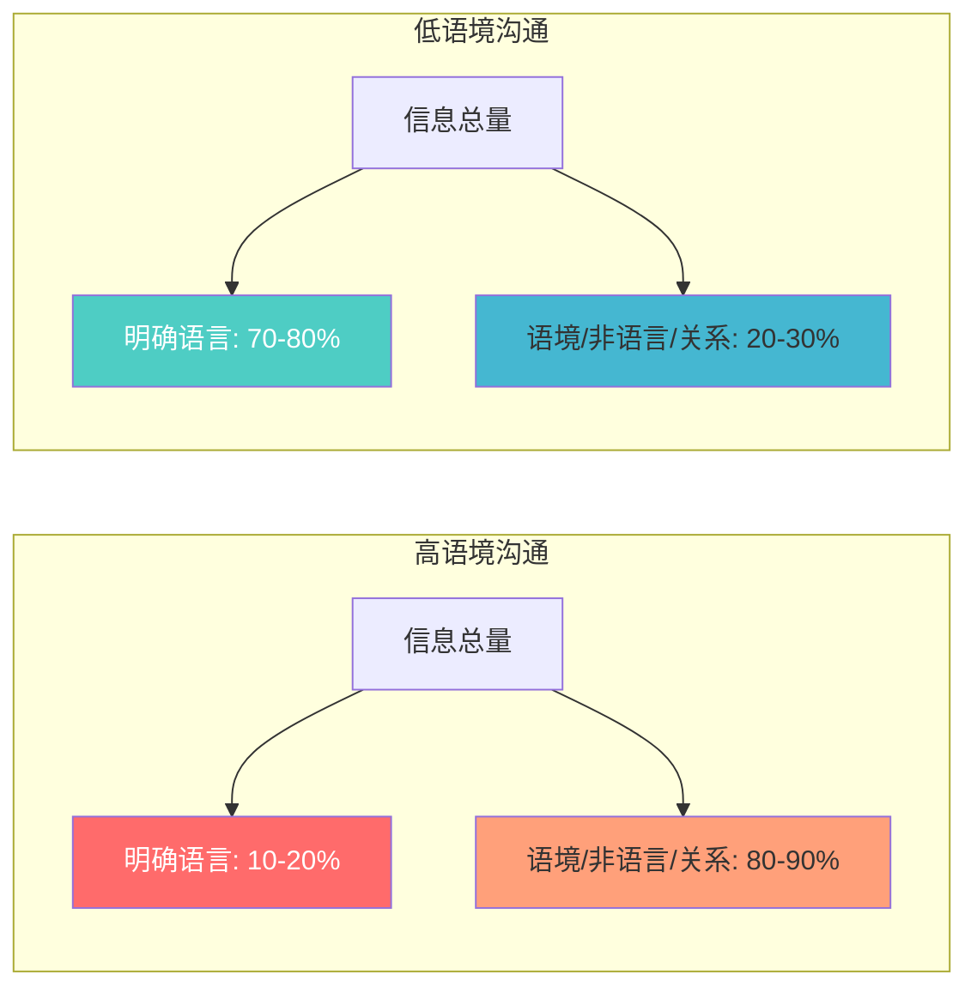
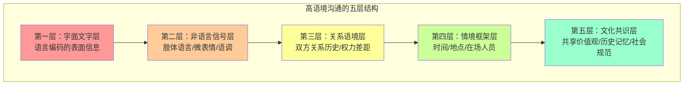
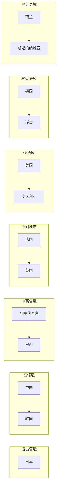

## 二、高低语境文化理论

### 2.1 理论起源与学术背景

#### 2.1.1 爱德华·T·霍尔其人

爱德华·T·霍尔（Edward Twitchell Hall Jr.，1914—2009）是美国人类学家、跨文化交际学的奠基人之一，被学术界尊称为"跨文化交际之父"。他的学术生涯始于对美国西南部纳瓦霍族和霍皮族印第安人的田野调查——这段经历让他意识到，即使同处一个国家，不同族群之间的沟通方式也存在天壤之别。在纳瓦霍保留地工作期间，霍尔发现白人社会工作者与纳瓦霍人之间的沟通失败并非源于语言障碍，而是双方对"什么时候该说话、什么时候该沉默、什么话该怎么说"这些隐性规则的理解完全不同。

二战期间，霍尔在欧洲和菲律宾的美军中服务，负责训练士兵适应当地文化。他观察到一个反复出现的现象：那些严格按照手册执行"正确行为"的士兵反而比那些凭直觉融入环境的士兵更容易犯文化错误。这段经历让他确信，文化沟通存在一套不可见的深层结构，无法通过简单的知识传授来掌握，而必须通过沉浸式的体验来习得。这段军旅经历成为他后来理论研究的实践基础。

战后，霍尔在伊利诺伊理工大学、丹佛大学等机构任教，并在美国国务院外事服务研究所（Foreign Service Institute，FSI）担任跨文化培训顾问。正是在FSI的工作中，他开始系统地思考：为什么有些文化的人说话喜欢"把所有事情摊开说"，而另一些文化的人则认为"好话说三分"才是真正的沟通艺术？

霍尔在1959年出版了《无声的语言》（The Silent Language），首次系统地将文化分析从宏观的人类学叙事引入微观的人际沟通领域，提出了文化作为"隐藏的信息系统"这一开创性观点。1966年出版的《隐藏的维度》（The Hidden Dimension）进一步探讨了空间在文化沟通中的作用，提出了"近体学"（Proxemics）的概念——不同文化对人际距离的偏好直接影响沟通效果。1976年出版的《超越文化》（Beyond Culture）则正式提出了高低语境文化理论，成为他学术生涯中影响力最大的理论贡献。这本书的核心洞察是：文化差异不仅仅体现在人们"说什么"，更体现在信息"放在哪里"——是放在明确的语言中，还是放在共享的语境里。

#### 2.1.2 理论产生的时代背景

20世纪70年代，全球化进程加速，跨国企业和国际组织大量涌现。美国企业在外派管理中频繁遭遇"文化休克"——技术上完美无缺的商业沟通却因为文化差异而失败。霍尔在为多家跨国企业提供文化咨询的过程中发现了一个反复出现的模式：沟通失败的核心原因不是语言障碍，而是双方对"信息应该放在哪里"的假设完全不同——一方认为信息应该明确说出口，另一方认为信息应该存在于情境中。

这一发现的契机来自一次具体的咨询案例。霍尔为一家美国电子公司在日本的合资项目提供顾问服务时，美方经理反复抱怨日方合作伙伴"不给明确答复"、"总是含糊其辞"。而日方人员则困惑于美方"为什么什么事都要写下来"、"难道口头承诺不算数吗"。霍尔意识到，这不是个别人员的沟通习惯问题，而是两种截然不同的信息处理系统在碰撞。

与此同时，人类学界正在经历从"文化相对主义"到"跨文化比较"的方法论转向。霍尔的理论恰好提供了这样一个可操作的比较框架：不是去评判哪种文化"更好"，而是识别不同文化在信息编码和解码机制上的系统性差异。这使得高低语境理论一提出就受到了商界和学界的双重关注。

#### 2.1.3 核心概念定义

**高语境文化（High-Context Culture，简称HC）**：在这种文化中，大部分信息或存在于物理环境中，或内化在沟通参与者的个人经验里，只有少量信息通过明确编码的语言传递。理解信息的含义需要依赖语境、关系历史、非语言线索和共享的文化知识。霍尔在《超越文化》中的原话是："在高语境交流中，大部分信息要么存在于物质环境中，要么内化在个人身上；只有极少数信息以编码、外显、可传递的方式呈现。"

**低语境文化（Low-Context Culture，简称LC）**：在这种文化中，大部分信息通过明确的语言编码传递，信息的意义主要取决于文字本身，而非语境。沟通者被期望把意思完整、清晰地表达出来，听者不需要做过多的背景推测。

这两个概念的关键区分点在于**信息的承载位置**：高语境文化中，信息承载在"谁说的、在哪说的、怎么说的、之前发生过什么"这些语境要素上；低语境文化中，信息承载在"说了什么"这个语言要素上。



> **重要说明**：上述百分比是霍尔用于说明概念的比例性描述，并非严格的实证测量数据。后续学术研究对这些具体数字存在争议，但"高语境文化中明确语言承载的信息比例显著低于低语境文化"这一核心判断得到了广泛认可。

### 2.2 高语境文化的深度解析

#### 2.2.1 典型代表与文化谱系

高语境文化多见于亚洲、中东、拉丁美洲和非洲文化圈，这些文化的共同特征是拥有悠久的历史传统和相对稳定的社群结构，长期的共处形成了大量的共享知识和默契。历史越长、社群越稳定的文化，积累的"不必说出口"的共识就越多，语境水平就越高。

| 文化圈 | 代表国家/地区 | 语境等级 | 典型特征 | 形成原因 |
|--------|-------------|---------|---------|---------|
| 东亚 | 中国、日本、韩国 | 极高 | 儒家传统，面子文化，关系社会 | 两千年儒学传统塑造了"以和为贵"的沟通伦理，农业社会的稳定聚居积累了深厚的共同知识 |
| 东南亚 | 泰国、越南、印尼 | 很高 | 等级意识强，避免冲突，和谐优先 | 佛教/伊斯兰教传统强调克制与和谐，殖民历史强化了"不可对外人直说"的防御意识 |
| 中东 | 阿拉伯国家、伊朗 | 很高 | 部落传统，荣誉文化，好客之道 | 部落社会的长期共处形成了以血缘和地缘为纽带的信任网络，口头承诺具有准法律效力 |
| 拉丁美洲 | 巴西、墨西哥、阿根廷 | 高 | 人际关系导向，时间灵活，情感表达丰富 | 天主教传统强调社群联结，西班牙殖民文化遗留了"个人关系高于制度规则"的沟通模式 |
| 南欧 | 意大利、西班牙、希腊 | 中高 | 家庭纽带，社交网络密集，非语言丰富 | 地中海文化圈的长期交流形成了丰富的非语言表达传统，家族企业模式强化了关系导向 |

**需要特别注意的变体**：同一文化圈内部存在显著差异。例如，日本的关西地区（尤其大阪）的沟通风格比关东地区（东京）直接得多；中国的东北地区比江浙沪地区更倾向于直接表达；阿拉伯文化中的贝都因部落传统比城市文化更具高语境特征。这些差异将在2.5节详细讨论。

#### 2.2.2 沟通机制的五层结构

高语境文化的沟通不是简单的"说话含蓄"，而是一套由表及里的多层信息传递系统。理解这五层结构，是掌握高语境沟通的关键：

**第一层：字面文字层**——这是最表层的信息，往往只占总信息量的一小部分。在高语境沟通中，字面意思可能与真实意图存在差距。例如，中国商务场合中"我们研究研究"的字面意思是"我们需要讨论一下"，但在特定语境下（尤其是涉及合作请求时），这句话的实际含义往往是"我们不打算做这件事，但不想直接拒绝你"。

**第二层：非语言信号层**——包括肢体语言、面部微表情、眼神接触模式、手势、身体姿态和空间距离。这一层在高语境文化中承载着极为丰富的信息量。例如，在中国商务场合中，对方微微皱眉但口头说"可以考虑"，真实的信号藏在那个皱眉里。日本文化中的"相槌"（あいづち，即"嗯嗯"的回应）频率和语调变化，能传递出听者的态度——频率下降可能意味着兴趣减退或不同意，但不会直接说出来。

**第三层：关系语境层**——双方的关系历史、权力差距、亲疏程度直接决定了同一句话的不同含义。领导对下属说"你看着办吧"可能是授权，也可能是不满，取决于当时的关系状态和之前发生过什么。在中国文化中，一个简单的"你看着办"可以有截然不同的解码结果：如果之前汇报得到积极回应，这是授权；如果之前犯过错误或领导正在气头上，这是警告。低语境文化的人很难捕捉到这种关系层面的信息调制。

**第四层：情境框架层**——沟通发生的时间、地点、在场人员、正式程度等外部因素。同一件事在私下聊天和正式会议上说出来，含义完全不同。在中国文化中，很多重要的决定恰恰是在饭局上而非会议室里达成的。日本企业的"根回し"（ねまわし，事前沟通/铺垫）制度就是情境框架的制度化体现——正式会议上的决定其实早在之前的非正式沟通中就已经确定，会议只是走流程。

**第五层：文化共识层**——这是最深层的共享知识，包括共同的价值观、历史记忆、道德标准和社会规范。文化内成员往往意识不到自己在依赖这一层，因为它就像空气一样自然。比如中国文化中"枪打出头鸟"这一隐含共识，会让人在公开场合有意收敛自己的观点。日本文化中的"空気を読む"（读空气）要求，让每个成员在开口之前先感知当前场合的整体氛围。韩国文化中的"눈치"（眼色/察言观色）能力被视为社交成熟度的核心标志。



#### 2.2.3 高语境文化的沟通特点详解

**间接表达与否定策略**：高语境文化的人很少直接说"不"，而是发展出了一套精细的间接否定策略。这套策略不是随意的含糊，而是遵循明确的文化编码规则——参与者双方都"听得懂"，只有局外人才会困惑。

日本文化中的间接否定尤为精密。"ちょっと…"（有点……）配合吞吞吐吐的语调、"検討します"（我会考虑的）配合轻轻的吸气声、"ちょっと難しいですね"（这有点难呢）配合为难的表情——这些在日语语境中是清晰的拒绝信号。日本商务沟通研究者长谷川�的研究表明，日本商务人士对这些间接拒绝的识别准确率高达90%以上，而西方商务人士的识别准确率不到40%。

中国文化中的间接否定同样有丰富的变体："我再想想"、"回去研究研究"、"原则上同意但细节再讨论"、"这个事情比较复杂"、"我们内部还需要协调"。对于熟悉这套系统的人来说，含义清晰明确；但对于低语境文化的人来说，可能真的以为还有商量的余地。一项针对在华外企高管的调查发现，68%的受访者表示曾在最初的1-2年中误解了中国合作伙伴的"软拒绝"，将"考虑考虑"理解为积极信号。

这种间接性不是虚伪或不诚实，而是一种社会润滑机制——它既传达了否定信息，又避免了正面冲突，保护了双方的面子和关系。从博弈论的角度看，这是一种"渐进式拒绝"策略：给对方足够的信号来调整预期，避免了突然的、不可挽回的关系破裂。

**关系先于任务**：在高语境文化中，沟通的有效性高度依赖于双方的关系质量。中国文化中的"关系"（Guanxi）不仅是社交网络，更是一套社会运作机制。关系的质量决定了信息共享的深度、信任的水平和合作的可能性。在中国做生意，先建立关系再谈业务是基本节奏，第一次见面就直奔主题的外国商人往往会碰壁。

关系建设的过程遵循一套隐性的时间表：第一次见面是认识（交换名片、寒暄、了解背景）；第二次见面是熟悉（共进晚餐、聊家庭和兴趣）；第三次见面才可能涉及试探性的业务讨论。跳过任何一步都会被视为"不懂规矩"或"不值得信任"。

阿拉伯文化中的"Wasta"（中间人/推荐人）制度同理——通过可信赖的第三方引荐，沟通双方才能建立初始信任，后续的商务对话才有可能展开。在沙特阿拉伯，没有Wasta的外国企业几乎无法进入核心商业圈子，因为信任不是通过合同和制度建立的，而是通过可信赖的人际网络传递的。

**沉默的丰富含义**：在低语境文化中，沉默通常意味着"没什么好说的"或"尴尬"。但在高语境文化中，沉默是一个具有多重含义的沟通工具。

日本文化中的沉默尤其复杂。"黙考"（认真思考时的沉默）是对发言者的尊重，表明你在认真对待他们的话。在谈判中，长时间的沉默可能是一种策略——日方谈判代表常用沉默来表达"你的提议不够好"，同时给对方压力促使其主动让步。日本茶道中"一期一会"的哲学更是将沉默提升到了美学高度——在恰当的时刻保持沉默，比任何言语都更有力量。

中国文化里也有"此时无声胜有声"的说法。在商务场合，如果一方提出了一个方案，另一方长时间不回应，这通常意味着方案存在重大问题但不便直说。韩国文化中"침묵은 금이다"（沉默是金）的谚语同样反映了对沉默价值的深层认可。

**面子机制**：高语境文化中的沟通受到"面子"机制的强烈约束。面子不是简单的虚荣心，而是一种深层的社会信用系统——你的面子代表了你在社群中的可信度、尊严和社会地位。

面子分为两种：**面子（Face）**——由社会给予的公开认可和尊重，可以通过社会地位、成就和他人的公开赞美获得；**脸（Liǎn）**——代表社会群体对一个人道德品格的信心，与个人的基本诚信和遵守社会规范相关。失去"面子"意味着社会地位的暂时受损，可以通过时间和努力恢复；失去"脸"则意味着道德信用的破产，恢复极其困难。

沟通者必须时刻关注自己的言行是否会让对方"丢面子"（丧失社会尊严），或者是否在维护对方的"给面子"（给予尊重和认可）。这直接影响了批评、反对、纠错等场景的沟通方式——通常需要经过精心的包装才能传达负面信息。在中国和日本的商务文化中，公开批评下属不仅是管理风格问题，更是对下属面子的严重损害，可能导致下属的忠诚度和工作积极性急剧下降。

#### 2.2.4 高语境文化的组织沟通特征

在企业层面，高语境文化表现出以下系统性特征：

**决策过程隐性化**：真正的决策讨论发生在非正式场合（饭局、私下会面、高尔夫球场），正式会议更多是确认而非讨论。日本企业的"稟議制"（りんぎせい，ringi-sei）是一个制度化的例子——文件自下而上传阅，各级管理者在正式会议前就已经了解并表达了意见，会议上的表决只是形式。这种制度的表面目的是民主决策，实际功能是在正式场合避免冲突。

**组织层级敏感**：对上司不能直说"你错了"，而是通过汇报"其他因素"来引导上司改变看法。韩国有一个专门的概念"눈치"（nunchi，眼色/察言观色），指的就是这种对等级关系和情境信号的敏锐感知能力。一个"눈치"好的员工能够在不冒犯上司的前提下，巧妙地引导决策方向。

**邮件风格**：邮件开头通常有较长的寒暄（询问健康、家庭、季节等），正文中负面信息往往放在中间或末尾，用词委婉。对比中美商务邮件的研究发现，中国商务邮件的寒暄部分平均占全文的20-30%，而美国商务邮件仅占5-10%。

**会议风格**：沉默的参与者可能并不代表同意，公开表达反对意见被视为冒犯。在日本企业中，"腹芸"（はらげい，内心戏/心照不宣的博弈）是会议沟通的重要组成部分——与会者通过微妙的表情变化、语调调整和肢体语言来传递真实态度，而这一切都不能被直接说出来。

### 2.3 低语境文化的深度解析

#### 2.3.1 典型代表与文化谱系

低语境文化主要分布在北欧、日耳曼语系国家和北美。这些文化的共同特征是相对年轻的历史（与亚洲文明相比）、高度的社会流动性、个人主义传统和法治体系——这些因素共同导致人们不能假设对方拥有与自己相同的文化知识，因此必须把信息"说出来"。

| 文化圈 | 代表国家/地区 | 语境等级 | 典型特征 | 形成原因 |
|--------|-------------|---------|---------|---------|
| 北欧 | 瑞典、丹麦、挪威、芬兰 | 极低 | 平等主义，直接反馈，沉默即同意 | 路德宗传统强调个人良知和直接沟通，小国寡民的社会结构需要高效的信息传递 |
| 日耳曼 | 德国、奥地利、瑞士（德语区） | 极低 | 逻辑严谨，书面至上，规则明确 | 罗马法传统和新教伦理塑造了"规则高于关系"的沟通文化，工业化进程要求精确的信息传递 |
| 盎格鲁-撒克逊 | 美国、加拿大、澳大利亚 | 低 | 任务导向，明确表达，契约精神 | 移民社会的文化多元性要求"把话说清楚"，清教传统强调言语的诚实和直接 |
| 荷兰 | 荷兰 | 极低 | "荷兰式直接"闻名于世，坦率到让其他欧洲人都不适应 | 加尔文宗传统强调坦诚和无伪善，商业文化需要高效的谈判风格 |
| 犹太-新教传统 | 部分美国中北部、以色列 | 低 | 注重言语辩论，口头讨论即决策 | 犹太教的塔木德辩论传统和美国新英格兰地区的民主辩论文化 |

#### 2.3.2 沟通机制的直接性

低语境文化的沟通以"信息发送者负责制"为基本原则——信息的发送者有责任把意思完整、清晰地表达出来，而不是期望接收者自己去"悟"。这一原则渗透在沟通的各个层面：

**字面即意图**：德国人在商务场合说"这个方案不行"，就是字面意思——这个方案有问题需要修改。他们不需要先夸奖一番再委婉地提出问题，因为那样反而会被认为浪费时间、不尊重对方的判断力。德国商业文化中有一个专门的概念叫"Sachlichkeit"（客观性/就事论事），要求沟通严格围绕事实和逻辑，排除情感和关系因素的干扰。

**书面优先**：低语境文化高度依赖书面记录。口头承诺需要通过书面合同确认，会议讨论需要形成会议纪要（Meeting Minutes），邮件往来需要抄送相关人等（CC/BCC）。德国企业的"一切都要写下来"不仅是一种管理习惯，更是法律文化的要求——在发生争议时，书面记录是最可靠的证据。德国商业法中有"举证责任"的严格规定，口头承诺在法庭上的证明力远低于书面记录。

**线性逻辑结构**：沟通遵循"论点→论据→结论"的直线逻辑。美国的商务演示文稿通常以"Executive Summary"（执行摘要）开头，先告诉你结论是什么，然后逐一给出支撑论据。这与中国文化中"先铺垫后结论"的模式恰好相反。德国学术界和商界推崇的"金字塔原理"（Pyramid Principle）更是将这种线性逻辑发展到了极致——任何沟通都必须以结论开头，然后逐层展开论据支撑。

**反馈的即时性与直接性**：在低语境文化中，直接给出反馈被视为专业的表现，而非不礼貌。荷兰有句谚语叫做"doe normaal"（正常点），意思是你应该直说，不需要拐弯抹角。荷兰文化中的"bespreekbaarheid"（可讨论性）原则认为，任何事情都应该可以被公开讨论，没有什么话题是禁忌。美国企业的"360度反馈"制度也是直接文化的产品——下属可以直接批评上司的工作表现，而且这被认为是建设性的。一项跨文化管理研究发现，在荷兰工作的中国员工平均需要6-12个月才能适应"当面被直接批评"的文化，而适应后普遍表示"这种直接方式其实效率更高"。

#### 2.3.3 低语境文化的组织沟通特征

**决策过程显性化**：所有相关方在会议中公开讨论、辩论甚至争论，会后的决定即为最终决定。德国企业的决策过程尤为典型——会议中激烈的辩论被视为健康的参与，而不是不和谐的表现。一旦做出决定，所有人统一执行，不会出现"会上不说、会后抱怨"的情况。

**角色而非关系**：沟通基于角色和职能，你是什么职位决定了你能做什么决策，而非你和谁关系好。美国企业的组织架构中，职责边界清晰，跨部门沟通需要遵循正式的流程和授权链。这与高语境文化中"找对人比走对流程更重要"的模式形成鲜明对比。

**邮件风格**：开门见山，第一句即表明目的，负面信息直接陈述，结尾明确下一步行动（Call to Action）。典型的美国商务邮件结构是：目的→背景→请求→截止日期→签名。德国商务邮件更简洁，有时甚至省略寒暄直接进入主题。

**会议风格**：沉默被默认为同意，有不同意见必须当场表达，否则事后追责时"你当时为什么不说"是合理的质疑。在北欧国家的会议文化中，"共识决策"是通过充分讨论达成的，不是通过会前私下协商达成的。

### 2.4 高低语境沟通冲突的系统分析

#### 2.4.1 典型冲突场景

当高语境与低语境文化的人沟通时，双方都在用自己文化的解码系统去理解对方的信息，系统性的误解由此产生。以下四个场景展示了最常见的冲突模式：

**场景一：商务反馈中的信息膨胀**

一位美国经理在与中国团队的会议上说："This proposal needs some improvement"（这个方案需要一些改进）。在美国经理看来，这是一个温和的反馈——做些小调整就行。但中国下属听到后的理解是"这个方案根本不行，需要大幅重做"。因为在中国高语境文化中，批评通常以非常委婉的方式表达，一旦说出来就意味着问题比较严重。结果中国团队花了两周时间彻底重做方案，美国经理看到新版本后困惑不解——"我只是说需要小改，为什么完全重做了？"

这种"信息膨胀"现象的根源在于：高语境文化中负面信息的表达存在一个"缓冲层"，批评的真实严重程度需要通过解码委婉程度来判断。当低语境文化的人直接给出批评时，高语境文化的人会自动启动自己的解码系统，将"轻微批评"理解为"严重批评"。

**场景二：会议沉默的双重误读**

一位德国项目经理主持跨国团队会议，询问大家对新方案的意见。中国和日本成员全程沉默，德国经理将沉默理解为"没有异议"，于是推进方案执行。但实际上，中国成员对方案有多处保留意见，只是在会议这种正式场合不便当众质疑。两周后方案执行出了问题，德国经理愤怒地说："你们当时为什么不说？"中国成员也很委屈——"我已经暗示过了啊。"

这场冲突中双方都没有错——德国经理按照低语境规则理解沉默（沉默=同意），中国成员按照高语境规则表达异议（不公开反对=间接表达保留意见）。问题在于双方使用了不同的解码系统。

**场景三：邮件的过度解读**

美国同事发邮件给中国合作伙伴："I'd like to discuss the timeline."（我想讨论一下时间表。）在美国文化中，这是一句中性的陈述，就是字面意思。但中国合作伙伴收到后紧张不已——"他是不是觉得我们进度太慢了？这是不是变相批评？"于是回了一封充满歉意和解释的长邮件，美国同事看完更加困惑——"我只是想确认一下时间安排，为什么他这么紧张？"

这种"过度解读"源于高语境文化的沟通习惯：在高语境环境中，任何看似中性的沟通都可能包含言外之意，必须通过解读上下文来理解真实意图。当这种解码习惯被应用于低语境文化的信息时，就会产生误读。

**场景四：餐厅社交的节奏冲突**

中国商人请美国客户吃饭，席间聊家庭、旅行、美食，始终不提业务。美国客户感到不耐烦——"我飞了16个小时来这里不是为了聊天的，我们什么时候开始谈正事？"而在中国商人的节奏里，这顿饭本身就是"正事"的一部分——建立关系和信任，为后续谈判奠定基础。

在中国商务文化中，"先做人后做事"是基本逻辑。一顿饭局的目的不是吃饭，而是通过观察对方在非正式场合的言行举止来评估其可信赖度。美国客户将这顿饭视为"浪费时间"，中国商人则将美国客户的急切视为"不尊重关系"。

#### 2.4.2 冲突的深层原因

```mermaid
graph TD
    A[沟通冲突] --> B[信息解码系统不同]
    A --> C[对"清晰"的定义不同]
    A --> D[对"礼貌"的定义不同]
    A --> E[对"效率"的定义不同]
    A --> F[对"信任基础"的定义不同]
    
    B --> B1["HC: 信息在语境中<br/>需要'读空气'来理解"]
    B --> B2["LC: 信息在语言中<br/>需要'听清楚'来理解"]
    
    C --> C1["HC: 留出解读空间是清晰<br/>给对方留面子和余地"]
    C --> C2["LC: 不留歧义才是清晰<br/>确保对方100%理解"]
    
    D --> D1["HC: 不让对方难堪是礼貌<br/>保护关系和面子"]
    D --> D2["LC: 不浪费对方时间是礼貌<br/>尊重对方效率"]
    
    E --> E1["HC: 一次把关系理顺是效率<br/>信任到位了事情自然成"]
    E --> E2["LC: 一次把事情说清是效率<br/>事情做成了关系自然好"]
    
    F --> F1["HC: 信任来自关系和面子<br/>人格背书+长期互惠"]
    F --> F2["LC: 信任来自合同和制度<br/>法律约束+制度保障"]
```

#### 2.4.3 冲突的代价

文化沟通冲突的代价不仅仅是尴尬。根据《哈佛商业评论》、麦肯锡全球研究院和INSEAD商学院的多项研究数据：

- 70%的跨国企业合作失败与文化误解直接相关（Harvard Business Review, 2014）
- 在跨文化团队中，因沟通风格差异导致的项目延期率比单一文化团队高出40%（McKinsey Global Institute, 2016）
- 外派管理人员因文化适应失败提前回国的比例高达25-40%，每次失败的外派成本估计在25万至100万美元之间（INSEAD, 2017）
- 全球企业因文化误解导致的沟通成本每年估计超过2万亿美元（跨文化管理研究期刊, 2019）
- 在跨文化并购中，文化整合失败是仅次于战略不匹配的第二大失败原因，占比约30%

### 2.5 语境连续体与文化内部差异

#### 2.5.1 文化连续体模型

高低语境并非二元对立的分类，而是一个连续的光谱。没有任何一个文化是纯粹的高语境或低语境，每个文化都处于这个连续体的某个位置，而且位置会随情境变化而移动。霍尔本人也强调，这个分类是"相对的"而非"绝对的"——日本相对于中国是更高语境的，但日本的科技行业相对于传统手工业又是更低语境的。



**关于中间地带的文化**特别值得注意：法国和英国处于连续体的中间位置。法国文化在某些方面表现出高语境特征（重视修辞、暗示、言外之意），在另一些方面又表现出低语境特征（书面法典的精确性、逻辑论证的传统）。英国文化同样混合——英式幽默的讽刺和自嘲本质上是高语境的（需要理解文化背景才能"听懂"），但其法律和商业传统又是极端低语境的。这种混合性解释了为什么法国人和英国人在国际商务中的沟通风格常常让合作伙伴"摸不透"。

#### 2.5.2 文化内部的变量差异

即使在同一文化内部，语境水平也会因以下四大因素而显著变化：

**地域差异**：中国北方人的沟通风格通常比南方人更加直接。东北人以"有话直说"著称，而江浙沪地区的沟通则更加含蓄。这种差异可能与历史上的社会结构有关——北方的游牧和农业传统需要直接的协作沟通，南方的商业传统则发展出了更精细的社交策略。日本的东京人与大阪人在直接程度上也有显著差异——大阪商人以直率闻名，甚至有"大阪商人不会说不"的反讽（因为他们太直接了，反而被东京人觉得"不会做生意"）。关西方言中的"ほんま"（真的）和"なんでやねん"（为什么啊）反映了大阪文化中坦率直言的传统。

**代际差异**：年轻一代由于接触全球化信息（英语教育、社交媒体、海外留学）更多，沟通风格往往比老一代更加直接。中国的90后、00后在职场中的沟通方式已经与50后、60后有很大不同。不过需要注意的是，这种"西化"的直接性通常是情境性的——年轻人在国际团队中会切换到低语境模式，但回到家庭场景中仍然使用高语境模式。一项针对中国Z世代职场沟通的调查显示，72%的年轻受访者表示自己在"国际化场合"和"传统场合"之间有意识地切换沟通风格。

**行业差异**：法律、金融、科技等国际化程度高的行业，即使是高语境文化背景的从业者也会发展出更多的低语境沟通习惯。律师在起草合同时追求的精确性与低语境文化的要求一致。互联网创业圈的沟通风格也普遍比传统制造业更加直接。相反，外交、宫廷礼仪、宗教仪式等行业即使在低语境文化中也表现出高语境特征——外交辞令的含蓄性和模糊性是跨文化的。

**关系差异**：同一个高语境文化的人，在面对亲密关系（家人、挚友）时可以非常直接，甚至比低语境文化的人更加坦率；但在面对陌生或权威关系时则高度依赖语境。这说明高低语境不完全是文化属性，也是关系属性。中国文化中"熟人面前无话不说、生人面前字斟句酌"的对比，就是关系变量的典型表现。

#### 2.5.3 个体差异：语境适应度

除了文化层面的差异，个体在高低语境适应度上也存在显著差异。这种差异可以用"语境适应力"（Context Adaptability）的概念来理解——指个体在高语境和低语境之间灵活切换的能力。

语境适应力高的人具备以下特征：能够在不同的文化情境中快速调整自己的沟通风格；能够准确解读不同语境水平下的言外之意；能够在保持自己文化身份的同时适应对方的沟通预期。

有些人天生倾向于直接表达（低语境个体），有些人天生倾向于含蓄表达（高语境个体），这种个体差异在跨文化沟通中会产生有趣的交互效应——一个高语境文化中的低语境个体，可能在自己文化中被认为"不会说话"或"太直"，反而在低语境文化中如鱼得水。同样，一个低语境文化中的高语境个体，可能在自己文化中被认为"拐弯抹角"，但在高语境文化中却展现出卓越的跨文化适应能力。

心理学研究表明，语境适应力与以下个体特质正相关：共情能力（Empathy）、认知复杂度（Cognitive Complexity）、开放性人格（Openness to Experience）和社交智商（Social Intelligence）。

### 2.6 数字时代的高低语境演变

#### 2.6.1 数字沟通对语境的压缩

社交媒体、即时通讯和远程办公的普及正在对高低语境产生双向影响：

一方面，数字沟通天然地压缩了语境信息。文字消息剥离了语调、面部表情和肢体语言，使得原本依赖这些非语言线索的高语境沟通变得更加困难。一条微信消息"好的"到底表示真心同意还是敷衍了事？在面对面沟通中，你可以从对方的语气和表情判断，但在纯文字场景中，这个信息丢失了。这种"语境流失"迫使高语境文化的人发展出新的补偿机制。

另一方面，高语境文化的人们正在发展出数字时代的替代方案——表情包（emoji/sticker）的大量使用就是高语境适应数字环境的典型例子。中国用户的表情包文化尤为发达：微信表情包已经发展出了一套完整的"数字隐语"系统，不同表情在不同语境下有截然不同的含义。一个"微笑"表情在不同文化中的含义截然不同：在西方文化中表示友好愉快，在中国年轻一代的语境中则可能表示"无语"、"呵呵"甚至"不满"。一个"抱拳"表情可以表示感谢，也可以表示拒绝，取决于上下文。

研究者将这种现象称为"数字高语境化"（Digital High-Contexting）——高语境文化的人在网络环境中重新创造了语境依赖的信息编码系统，只是载体从面对面互动变成了数字符号。表情包的选发时间、撤回消息的行为、已读不回的沉默，都成为新的语境信号。

#### 2.6.2 远程工作的语境挑战

疫情后远程工作成为常态，高低语境的冲突从线下转移到了线上，而且因为语境线索的进一步减少，冲突变得更加频繁和隐蔽：

**Zoom疲劳**：视频会议虽然比纯文字多了视觉信息，但仍然缺少很多面对面沟通中的微妙线索。摄像头的固定角度限制了肢体语言的表达，网络延迟打断了自然的对话节奏，画面压缩损失了面部微表情。高语境文化的人在视频会议中的信息损耗比面对面会议大得多——研究表明，高语境文化工作者在纯音频会议中的信息丢失率可达40-60%，在视频会议中仍有20-30%的丢失。

**异步沟通的歧义**：Slack/Teams等异步通讯工具中，高语境文化成员发出的含蓄信息经常被低语境文化成员忽略，因为他们不知道沉默或简短回复本身就是一种信号。一个日本同事在Slack上发了一个"..."（省略号），在美国同事看来可能只是打字中断，但在日本语境中这是表达困惑或不同意的信号。

**时区问题**：跨时区团队中，正式的书面沟通占比上升，这对低语境文化成员有利，但对高语境文化成员造成了表达障碍。当日本团队在美国团队睡觉时发了一条看似平淡的消息，其中可能包含重要的暗示信息，但美国团队醒来后只看到了字面意思。

**数字沟通的"永久记录效应"**：在面对面沟通中，高语境文化的人可以依赖"说了就过了"的即时性来传达敏感信息。但在数字沟通中，所有信息都被永久记录，这让高语境文化的人更加谨慎和含蓄——间接地进一步降低了数字环境中的信息透明度。

#### 2.6.3 语境的全球化融合趋势

值得注意的是，全球化正在推动一种"混合语境"（Hybrid Context）的出现。越来越多的跨国企业制定了内部沟通规范，要求员工使用相对直接、清晰的沟通风格（偏低语境），同时保留对关系建设的重视（偏高语境）。这是一种有意识的语境中和策略。

具体表现为：

- **国际商务英语的语境中性化**：作为全球商务通用语言，英语正在发展出一种"简化直接"的沟通模式，避免过于委婉也避免过于生硬
- **跨国企业的文化混合**：在日美合资企业中，日方员工学习更直接的表达方式，美方员工学习更多的关系建设技巧
- **数字原住民的全球同质化**：全球的年轻互联网用户在数字沟通中表现出趋同的特征——比他们父辈更直接，但仍然保留文化差异的痕迹
- **远程工作的新规范**：越来越多的分布式团队制定了"显性沟通"（Explicit Communication）规范，要求所有信息都要明确表达，不依赖隐含假设

### 2.7 跨语境沟通的实用适应框架

#### 2.7.1 语境识别：判断对方的沟通风格

在实际沟通中，第一步是识别对方的语境偏好。以下是几个实用的观察指标：

| 观察维度 | 高语境信号 | 低语境信号 |
|---------|----------|----------|
| 邮件开头 | 长段寒暄和关系维护 | 开门见山，直接说目的 |
| 会议中沉默 | 可能在思考，不宜催促 | 默认为同意或无意见 |
| 负面反馈 | 先肯定再暗示问题 | 直接指出问题所在 |
| 时间观念 | 先建立信任再谈正事 | 会议开始即进入议程 |
| 决策方式 | 非正式场合确认意向，正式场合走流程 | 正式场合讨论并决策 |
| 合同态度 | 合同是关系的确认书，事后可协商调整 | 合同是法律约束，条款即最终决定 |
| 争论风格 | 避免正面冲突，迂回表达 | 直接辩论，就事论事 |
| 称呼方式 | 姓氏+职务，体现等级意识 | 名字直接称呼，体现平等 |
| 信息反馈 | 通过第三方传达或暗示 | 直接告知当事人 |

#### 2.7.2 适应策略：高语境→低语境的调整

如果你习惯于高语境沟通，面对低语境文化时需要做以下系统性调整：

**信息显性化**：把你的核心观点明确说出来，不要假设对方能理解你的暗示。与其说"这个方案有它的价值"（暗示方案有问题），不如说"这个方案的核心框架很好，但第3节的数据分析需要加强"。具体的做法是：在每次表达意见时，先说结论，再说原因，最后说建议。避免"先说好的再说不好的"这种高语境的"三明治"结构，因为它会让低语境文化的人误以为你在表扬他们。

**主动表态**：在会议中，如果你有不同意见，必须当面说出来。沉默不会被解读为"含蓄的反对"，而会被解读为"同意"。你可以用礼貌但明确的方式表达："I have a different perspective on this point..."（在这一点上我有不同的看法……）一个实用的练习是：在每次会议中至少发言一次，即使只是确认或提问。

**书面确认**：重要的口头沟通之后，用书面形式（邮件、纪要）确认关键决定和行动项（Action Items）。不要依赖对方的记忆或默契。邮件结构建议：目的→关键决定→行动项→责任人→截止日期。

**时间意识**：尊重议程和时间表，准时开始、准时结束。不要在会议前花大量时间寒暄，除非对方主动开启社交话题。德国人对准时的要求近乎严格——迟到5分钟在德国商务文化中已经是需要道歉的事情。

**练习直接说"不"**：如果你习惯用"我再想想"来拒绝，练习用"不，这个方案不可行，因为……"来替代。对方不会觉得你无礼——相反，他们会感谢你的坦率，因为这节省了他们猜测你真实意图的时间。

#### 2.7.3 适应策略：低语境→高语境的调整

如果你习惯于低语境沟通，面对高语境文化时需要做以下系统性调整：

**关系先行**：在正式商务沟通之前，投入时间建立个人关系。在中国和日本，一顿饭局可能比十次正式会议更有价值。不要催促这个过程——它不是浪费时间，而是必要的信任建设。具体来说，第一次见面不要急着谈业务，花时间了解对方的个人背景、兴趣爱好和家庭情况。

**学习沉默**：沉默在高语境文化中是正常且有意义的。提出问题后给对方充足的思考时间，不要急于用追问来填补沉默。在日本的商务会议中，等待30秒甚至1分钟再回应是完全正常的。打断对方的沉默会被视为不礼貌和急躁。

**解读间接信号**：当对方说"我回去考虑一下"、"原则上同意"、"这个比较困难"时，学会判断这些表达的真实含义。一个实用的方法是：观察对方的非语言信号（表情、语调、肢体语言），而不是仅仅依赖字面意思。另一个技巧是：注意对方回应的速度——如果对方很快就说"我考虑一下"，这通常是拒绝的信号；如果对方真的在思考，通常会有明显的思考过程。

**维护面子**：避免在公开场合直接批评、纠正或拒绝。如果需要传达负面信息，选择私下一对一的方式，并且先给予肯定再提出建议。使用"三明治反馈法"（肯定→建议→鼓励）是一个实用的起步技巧。更进阶的做法是：用提问代替批评——"你觉得第3节的数据是否还有补充的空间？"比"第3节的数据不够"效果好得多。

**读取言外之意**：学会关注对方没有说什么。在高语境文化中，"没说的"往往比"说了的"更重要。如果一个通常健谈的人突然变得沉默，这本身就是一个信号。如果对方在某个话题上特别简短或突然转移话题，这可能意味着该话题涉及敏感问题。

#### 2.7.4 通用适应策略

无论你是高语境还是低语境背景，以下策略都适用：

**文化元沟通**：在跨文化团队建立之初，直接讨论彼此的沟通偏好。比如："我们的团队来自不同文化背景，有些人习惯直接反馈，有些人习惯间接表达。让我们约定一个规则——如果有人觉得自己的意见没有被听到，请直接说出来。"这种"关于沟通的沟通"能有效降低后续的误解成本。

**双语沟通模式**：在正式的工作内容中使用低语境风格（清晰、直接、书面确认），在关系维护中使用高语境风格（关注情感、尊重面子、投入社交时间）。这不是精神分裂，而是有意识的语境切换——就像双语者在不同场合切换语言一样。

**文化翻译者**：在关键的跨文化沟通中，安排一位熟悉双方文化的"文化翻译者"。这个人不是做语言翻译，而是做语境翻译——帮助双方理解对方的真实意图。例如，当中方说"这个事情比较复杂"时，文化翻译者可以私下告诉美方："他的意思是这个方案目前不可行，但不想直接拒绝。"

**确认理解**：重要的信息传达后，请对方复述他们的理解。这不是不信任，而是对语境差异的尊重。一个实用的措辞是："为了确保我们理解一致，能否帮我确认一下你对这个问题的理解？"

### 2.8 商业应用：高低语境在实务中的体现

#### 2.8.1 跨国谈判

在国际商务谈判中，高低语境差异直接影响谈判策略和节奏。掌握这些差异，是国际商务成功的关键因素之一。

**高语境谈判风格**（如中国、日本）：谈判被视为关系建设的一部分。第一次谈判可能完全不涉及具体条款，而是双方互相了解。让步通常以暗示的方式进行，不会在价格上直接"砍"。谈判代表需要有决策权，因为最终决定可能需要回公司请示。中国谈判中的"磨"（耐心消耗对方）和日本谈判中的"根回し"（事前铺垫）都是高语境谈判的典型策略。

**低语境谈判风格**（如美国、德国）：谈判以议题清单为框架，逐项讨论并达成协议。让步以明确的方式进行（"如果你们能接受30天付款期，我们可以降价5%"）。合同条款力求精确，覆盖所有可能的情况。德国谈判风格尤为结构化——通常会有详细的议程、明确的时间框架和书面的谈判记录。

**实用建议**：与高语境文化谈判时，不要急于推进议程，留出足够的社交时间。与低语境文化谈判时，准备好详细的数据和方案，避免空泛的表述。

**混合谈判的策略**：当谈判桌上有高语境和低语境文化的参与者时（如中美合资谈判），需要采用"双轨制"——正式会议中使用低语境风格（清晰的议题、明确的讨论），非正式场合中使用高语境风格（饭局、社交活动、一对一沟通）。

#### 2.8.2 营销传播

高低语境理论对广告和营销有直接指导意义。了解目标市场的语境水平，是制定有效营销策略的基础：

**高语境广告**：依赖隐喻、情感、联想和文化符号。日本的广告常常不直接展示产品功能，而是营造一种氛围或讲述一个故事，让消费者自己体会产品与生活方式的关联。中国白酒广告往往强调历史传承、兄弟情义和家国情怀，而非酒精含量和口感指标。泰国保险公司的广告更是以催泪故事著称——用3分钟的情感叙事来传达"保险保护你的家人"这一主题。

**低语境广告**：强调产品特性、数据对比和明确的利益承诺。美国广告喜欢用数字说话——"比竞品快30%"、"97%的用户推荐"。德国广告则突出技术参数和工程品质。美国的药品广告是一个极端例子——必须在广告中完整列出药物的副作用和禁忌，这是法律要求的信息透明。

**跨文化营销陷阱**：一个经典的失败案例是某西方品牌在中国市场投放了大量理性诉求的广告（强调产品参数和性价比），但忽略了中国消费者购买决策中情感因素和社会认同因素（面子、从众、送礼需求）的重要作用，导致营销效果远低于预期。相反，宝洁在中国市场的成功部分归功于其"中国式情感营销"策略——用家庭团聚、母亲的爱等高语境主题来建立品牌情感连接。

**数字营销的语境适配**：在社交媒体营销中，高语境文化市场的KOL（关键意见领袖）营销比低语境文化市场更有效，因为KOL本身就是一种"信任关系"的载体。中国市场的小红书、抖音KOL带货模式，本质上是高语境关系营销的数字化延伸。

#### 2.8.3 跨文化团队管理

在管理多元文化团队时，高低语境理论提供了以下系统性的管理指导：

**会议管理**：在低语境团队中，鼓励公开讨论和辩论；在高语境团队中，提供匿名反馈渠道或会前一对一沟通的机会，让不便公开表达意见的成员有发声途径。混合团队的最佳实践是：在正式会议前设置"意见收集"环节（匿名问卷或一对一会前沟通），让高语境文化成员有安全的表达渠道。

**绩效反馈**：面向高语境背景的员工，反馈应当私下进行，注意措辞的委婉程度；面向低语境背景的员工，可以直接、具体地说明问题。混合团队的做法是：使用书面的结构化反馈工具，让所有人按照统一的格式接收和提供反馈，减少文化差异的影响。

**冲突处理**：高语境文化成员之间的冲突往往不会公开爆发，而是以"冷战"或"消极配合"的形式存在，管理者需要敏锐地察觉这种隐性冲突。低语境文化成员之间的冲突虽然直接，但如果不及时处理，可能会升级为对抗性争论。管理者需要根据冲突双方的文化背景选择不同的调解策略。

**团队规范制定**：在跨文化团队组建之初，就应制定明确的沟通规范。例如："会议中如果有不同意见，请当场表达，沉默将被理解为同意"（偏向低语境）或"重要决定会在会前一对一沟通确认，正式会议只做最终确认"（偏向高语境）。关键是让所有人知道规则是什么，而不是默认某种文化风格。

### 2.9 与其他跨文化理论的关系

#### 2.9.1 与霍夫斯泰德文化维度的对应

霍尔的高低语境理论与霍夫斯泰德（Geert Hofstede）的六个文化维度存在显著的相关性，理解这种对应关系有助于构建更完整的跨文化分析框架：

| 霍夫斯泰德维度 | 与高低语境的关系 | 具体表现 |
|-------------|-------------|---------|
| 个人主义 vs 集体主义 | 集体主义→高语境，个人主义→低语境 | 集体主义文化中成员共享更多的文化知识，因此可以用更少的明确信息进行沟通 |
| 权力距离 | 高权力距离→高语境 | 层级关系本身就是一种语境——下属需要通过间接方式表达对上级的异议 |
| 不确定性规避 | 高不确定性规避→两种表现 | 德国通过低语境的书面规则来降低不确定性，日本则通过高语境的社会默契来降低不确定性 |
| 男性化 vs 女性化 | 女性化倾向→高语境 | 女性化文化更注重关系和谐和情感表达，沟通更含蓄 |
| 长期导向 | 长期导向→高语境 | 长期关系需要信任积累，高语境沟通是信任建设的手段 |
| 放纵 vs 克制 | 克制→高语境 | 克制文化中情感表达受到约束，信息更多依赖语境传递 |

#### 2.9.2 与其他理论的互补关系

**Erin Meyer的文化地图模型**：Meyer在《文化地图》（The Culture Map）中将高低语境理论发展为"沟通"维度，同时增加了"评估"、"说服"、"领导"、"决策"、"信任"、"不同意"和"时间安排"七个维度，形成了更细致的跨文化分析框架。Meyer的贡献在于将霍尔的二元分类扩展为连续光谱，并提供了更具体的商务场景应用指导。

**Richard Lewis的文化分类模型**：Lewis在《当文化碰撞时》（When Cultures Collide）中将世界文化分为线性主动型（Linear-Active，如德国、瑞士）、多线性主动型（Multi-Active，如巴西、意大利）和反应型（Reactive，如日本、中国）。这个分类与高低语境有显著重叠——线性主动型大体对应低语境，反应型大体对应高语境，多线性主动型则处于中间。

**Edward Stewart的文化对比取向**：Stewart提出的"文化对比取向"（Cultural Contrast Approach）强调通过对比两种文化的特定维度来理解差异，这种方法比霍尔的分类更加灵活，允许针对具体的文化对进行精细化分析。

#### 2.9.3 理论的优势与局限

**优势**：
- 直观易懂，提供了理解文化沟通差异的简洁框架，非学术人士也能快速掌握
- 在商务沟通、营销传播、外交谈判等应用领域有很强的解释力和实践指导价值
- 强调了语境在沟通中的作用，弥补了语言中心主义的不足
- 引入了"信息承载位置"的概念，为理解跨文化沟通失败提供了全新的分析视角
- 与多种跨文化理论（霍夫斯泰德、Meyer等）形成了良好的互补关系

**局限**：
- 分类过于简化——文化内部的差异可能比文化间的差异更大，日本东京人和大阪人之间的差异就是一个例子
- 理论基于20世纪70年代的观察，对数字时代的沟通模式缺乏解释力，尽管"数字高语境化"等概念正在填补这一空白
- 存在文化本质主义的风险——将沟通风格完全归因于文化背景，忽略了个体性格、教育背景和职业经历的影响
- 缺乏严格的实证验证——高低语境的分类更多基于定性观察而非量化研究，后续的实证研究结果参差不齐
- 文化分类的标准不够统一——不同研究者对同一个国家的语境水平评级存在分歧
- 忽略了权力关系对语境水平的影响——某些场合的高语境特征可能不是文化属性，而是权力不对等的结果

### 2.10 常见误区与纠正

**误区一："高语境文化更高级，因为它更含蓄、更注重关系"**

纠正：高低语境没有优劣之分，只是不同的沟通策略。在不同的情境中各有优势——高语境在维护长期关系和处理敏感话题方面更有效，低语境在处理复杂信息、跨文化合作和法律事务方面更有效。认为高语境"更高级"是一种文化浪漫主义的偏见，认为低语境"更先进"则是一种西方中心主义的偏见。

**误区二："我跟某个国家的人打过交道，他们就是那样的"**

纠正：以偏概全。个体差异可能远大于文化差异。你遇到的那个直接的日本人不能代表整个日本文化，你遇到的那个含蓄的美国人也不能代表整个美国文化。文化理论提供的是概率分布，不是确定标签。正确的做法是：用文化理论作为初始假设，然后通过实际互动来修正对具体个人的理解。

**误区三："只要学会一套固定的套路就能应对所有跨文化沟通"**

纠正：文化适应不是背公式。有效的跨文化沟通需要持续的观察、调整和反思。同一个文化内部也有巨大的个体差异，最好的策略是观察具体沟通对象的风格并做出适应，而不是假设对方一定符合某个文化模板。真正的跨文化能力是"观察—假设—验证—调整"的动态循环，而不是"学习—记忆—应用"的静态过程。

**误区四："在数字时代，所有人都变得更直接了，高低语境的区分已经过时"**

纠正：数字沟通确实在推动沟通风格的某些变化，但文化深层的沟通偏好并不会因为换了媒介而消失。中国年轻人在微信群里仍然使用大量的表情包、潜台词和暗示性表达，这些本质上是高语境沟通的数字化延续。数字时代改变的是高语境沟通的载体和形式，而非其本质逻辑。

**误区五："低语境文化的人不会读空气/不懂人情世故"**

纠正：低语境文化的人同样具备解读非语言信号的能力，他们只是不依赖这些信号来传递核心信息。美国人能读懂肢体语言，德国人也理解情感暗示——只是在正式沟通中，他们选择把信息放在语言中，因为他们认为这样更可靠、更高效。把"不依赖"等同于"不具备"是一种错误推论。

**误区六："高语境文化中没有直接表达"**

纠正：高语境文化的人在特定场景中也可以非常直接——紧急情况下、亲密关系中、涉及原则性问题时。高低语境描述的是默认的沟通偏好，而非绝对的行为约束。中国文化中"急了也骂人"就是高语境文化中直接表达的例外情况。

### 2.11 自我评估：你处于语境连续体的哪个位置？

以下问题可以帮助你了解自己在高低语境连续体上的位置。回答时选择更符合你习惯的选项：

1. 当你不同意领导的意见时，你更倾向于（A）在会议上直接表达 / （B）会后私下沟通
2. 写邮件时，你更倾向于（A）直接说明来意 / （B）先问候再慢慢引入正题
3. 同事的工作有明显问题，你更倾向于（A）当面指出具体问题 / （B）委婉地暗示
4. 谈判中，你更倾向于（A）明确列出你的条件 / （B）先了解对方的想法再逐步试探
5. 你觉得沉默在对话中是（A）一种需要填补的空白 / （B）一种正常的沟通状态
6. 对于口头承诺，你觉得（A）不如书面确认可靠 / （B）和书面确认一样有效
7. 你更擅长从（A）语言内容中获取信息 / （B）语调、表情和情境中获取信息
8. 初次见面的商务伙伴，你更倾向于（A）先谈业务再建立关系 / （B）先建立关系再谈业务
9. 收到一条措辞中性的消息时，你通常会（A）按字面意思理解 / （B）分析是否有言外之意
10. 你觉得"把话说明白"是（A）沟通的基本责任 / （B）对语境能力不足的补偿

**评分与解读**：

- **8-10个A**：你倾向于强低语境沟通风格。你重视效率、直接和清晰，认为信息传递的责任在发送者。在跨文化场景中，面对高语境文化伙伴时，需要有意识地放慢节奏、关注非语言信号、投入关系建设。你的优势是在国际化和多元文化团队中的沟通效率。

- **5-7个A**：你倾向于中等偏低语境风格。你能够在直接和委婉之间灵活切换，这使你在混合文化环境中具有较好的适应力。建议进一步提升在高语境环境中的解读能力。

- **3-4个A**：你倾向于中等偏高语境风格。你善于捕捉言外之意和非语言信号，在关系型沟通中表现出色。面对低语境文化伙伴时，需要有意识地明确表达、书面确认重要决定。

- **0-2个A**：你倾向于强高语境沟通风格。你擅长关系建设、非语言沟通和间接表达，在高语境文化环境中如鱼得水。在跨文化场景中，面对低语境文化伙伴时，需要有意识地明确表达、主动表态、书面确认重要决定。你的优势是在亚洲、中东和拉丁美洲文化中的深度关系建设能力。

> **重要提示**：这个评估反映的是你的沟通偏好，而非能力。最理想的跨文化沟通者不是处于光谱某一端的人，而是能够在光谱上自由移动的人。语境适应力才是真正的跨文化核心能力。

### 2.12 进阶阅读与延伸

霍尔的理论为后来的跨文化研究奠定了基础，以下是几个值得深入探索的延伸方向：

**学术经典**：
- **Erin Meyer《文化地图》（The Culture Map, 2014）**：将高低语境理论发展为更细致的八个维度模型，更加适合现代商务场景，是当前跨文化商务培训领域最受欢迎的参考书
- **Richard Lewis《当文化碰撞时》（When Cultures Collide, 1996/2006修订版）**：将世界文化分为线性主动型、线性被动型和多线性主动型三类，提供了另一个理解沟通风格差异的视角，内含大量具体国家的文化行为描述
- **Geert Hofstede《文化的后果》（Culture's Consequences, 1980/2001修订版）**：与高低语境理论互补，提供了更系统的量化框架，六个文化维度的量化数据覆盖了70多个国家
- **Stella Ting-Toomey《跨文化人际沟通》（Communicating Across Cultures, 1999）**：从面子管理的角度深化了对高语境沟通机制的理解，提出了"面子协商理论"（Face-Negotiation Theory）

**延伸研究方向**：
- **数字高语境化**：研究社交媒体如何重塑高低语境沟通模式，特别是表情包、已读不回、消息撤回等数字行为的语境含义
- **AI与跨文化沟通**：机器翻译和AI助手如何影响高低语境沟通——它们能够准确翻译语言，但能否准确传递语境？
- **第三文化儿童（Third Culture Kids, TCKs）**：在多种文化中成长的人如何发展出独特的语境适应模式
- **跨文化谈判的神经科学研究**：脑成像技术揭示了高语境和低语境文化的人在处理信息时的大脑活动差异

***

> **本节核心要点回顾**：高低语境文化理论揭示了不同文化对"信息放在哪里"的根本分歧。高语境文化将信息放在关系、情境和共享知识中，低语境文化将信息放在明确的语言中。有效的跨文化沟通不是改变自己的文化本性，而是发展"语境适应力"——能够识别对方的语境偏好，并相应调整自己的沟通策略。在数字时代，高低语境的界限正在变得模糊，但文化深层的沟通偏好依然深刻影响着全球70亿人的日常互动。
