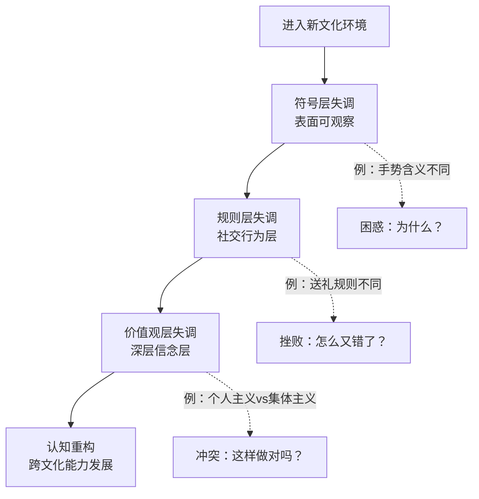
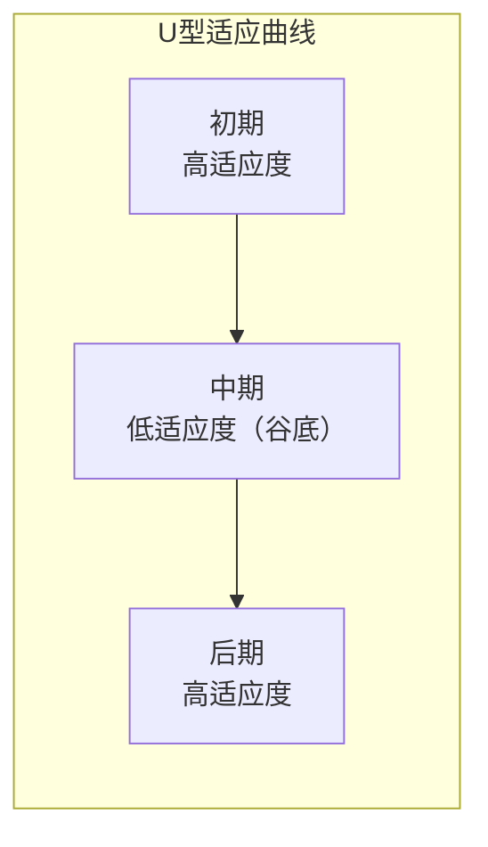
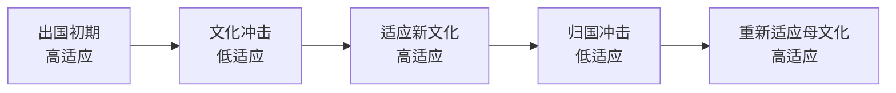
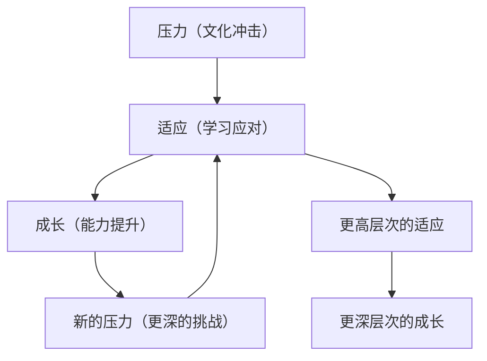
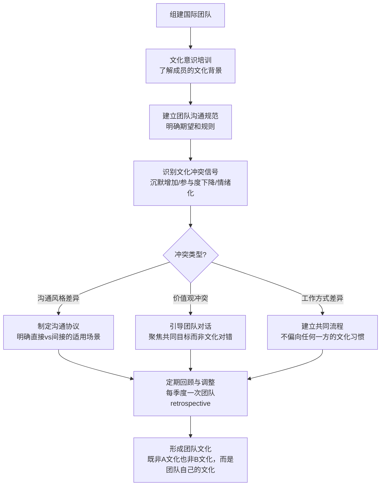
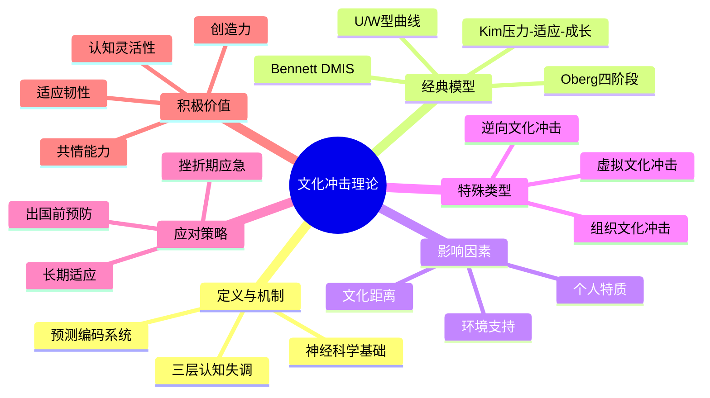

## 三、文化冲击理论

文化冲击是跨文化沟通研究中最核心的概念之一。它不仅描述了一种心理现象，更揭示了人类认知系统在面对文化差异时的深层运作机制。理解文化冲击理论，能帮助我们把跨文化适应从"被动承受"变为"主动管理"——知道自己处于哪个阶段、为什么会这样、下一步该怎么走。

### 3.1 什么是文化冲击

#### 3.1.1 核心定义

文化冲击（Culture Shock）是指个体从熟悉的文化环境进入陌生文化环境时，由于价值观、行为规范、社会习惯等方面的差异，所产生的心理困惑、情感波动和行为失调的综合体验。

这个定义包含三个关键要素：

| 要素 | 说明 | 示例 |
|------|------|------|
| **环境转换** | 从熟悉文化到陌生文化的空间/情境位移 | 出国留学、外派工作、加入跨国团队 |
| **认知失调** | 旧有认知框架无法解释新环境信息 | "为什么他们开会不直说反对意见？" |
| **情感反应** | 伴随焦虑、困惑、挫败等负面情绪 | 持续的疲惫感、莫名的烦躁、想家 |

文化冲击不是一种疾病，而是人类面对文化差异时的正常心理反应——本质上是大脑的"预测编码系统"在遇到不匹配数据时发出的报警信号。你的大脑一直在用过去的经验预测接下来会发生什么，当预测反复失败时，就会产生压力反应。

#### 3.1.2 学术定义的演变

文化冲击的概念经历了从"病理化"到"正常化"再到"工具化"的演变：

| 学者 | 年份 | 核心观点 | 历史意义 |
|------|------|----------|----------|
| Kalervo Oberg | 1960 | 首次系统描述文化冲击，将其定义为"因失去熟悉的社会交往标志和符号而产生的焦虑" | 开创性定义，但带有病理化倾向 |
| Sverre Lysgaard | 1955 | 提出U型曲线模型，描述适应过程的非线性特征 | 量化了适应的时间维度 |
| John & Jeanne Gullahorn | 1963 | 将U型曲线扩展为W型曲线，纳入归国适应 | 揭示了逆向文化冲击的存在 |
| Peter Adler | 1975 | 将文化冲击重新定义为"过渡期的身份认同危机"，强调其积极转化潜力 | 从病理视角转向成长视角 |
| Young Yun Kim | 2001 | 提出跨文化适应的"压力-适应-成长"动态模型，认为文化冲击是个人成长的催化剂 | 建立了文化冲击与个人发展的系统关联 |
| Milton Bennett | 1986 | 提出DMIS模型，将文化冲击置于跨文化敏感性发展的框架中 | 将冲击体验与认知发展阶段对应 |

这个演变趋势反映了学界对文化冲击理解的深化：它不是需要"治愈"的病症，而是跨文化能力发展的必经阶段。

#### 3.1.3 文化冲击的三层认知失调

文化冲击的产生涉及三个层面的认知失调，由浅入深：

**符号层失调**——日常交往中的非语言信号在新文化中被重新编码。眼神接触的距离、手势的含义、沉默的意义、微笑的功能，这些在母文化中自动化处理的信息，在新文化中需要有意识地解码。例如，在日本频繁点头不代表同意，而是表示"我在听"；在保加利亚，左右摇头的意思和中国恰好相反。

**规则层失调**——社交规则的隐性知识失效。什么是准时？（德国的"准时"和巴西的"准时"差30分钟）送礼该送什么？（在中国送钟是禁忌，在日本送礼金额讲究偶数）如何拒绝而不失礼？（英国人的"Interesting"通常意味着"我不喜欢"）这些在母文化中不言明的规则，在新文化中需要重新学习，而且学习过程中不断犯错会带来持续的挫败感。

**价值观层失调**——深层价值观冲突导致行为动机无法被理解。一个习惯直言不讳的德国工程师，在日本可能会被误解为粗鲁；一个重视个人边界的北欧人，在拉美的热情社交中可能感到被侵犯。价值观层的失调最为深刻，因为它涉及"什么是对的、什么是好的"这类根本性判断。调整价值观不意味着放弃自己的价值观，而是承认其他价值观同样有其合理性。

#### 3.1.4 文化冲击的神经科学基础

近年来的神经科学研究揭示了文化冲击在大脑层面的运作机制：

**杏仁核激活**：当大脑接收到无法用现有文化框架解释的信息时，杏仁核（负责威胁检测的脑区）会被激活，触发应激反应。这就是为什么文化冲击初期会伴随焦虑、烦躁等情绪——大脑在生理层面上把"文化差异"当作"潜在威胁"处理。

**前额叶皮层负担**：在母文化中，大量社交判断是自动化的（无需思考就能做出适当反应）。进入新文化后，这些自动化流程失效，前额叶皮层需要介入进行有意识的分析和决策。这导致"认知过载"——你感觉自己做什么都要"想一想"，一天下来极度疲惫，即使你什么体力活都没干。

**神经可塑性与适应**：好消息是，大脑具有神经可塑性。持续暴露在新文化环境中，大脑会逐渐建立新的神经通路，将新的文化规则自动化。这个过程就是"适应"的神经基础——当新文化的行为模式不再需要前额叶的刻意参与时，你就真正适应了。

**镜像神经元与共情**：理解他人的文化行为需要镜像神经元系统的参与。跨文化经历丰富的人，镜像神经元系统对不同文化背景的人的反应更加灵敏，这可能是"跨文化共情能力"增强的神经基础。

### 3.2 经典理论模型

#### 3.2.1 Oberg的四阶段模型（1960）

这是文化冲击研究的奠基性模型，将适应过程划分为四个阶段：

**第一阶段：蜜月期（Honeymoon Stage）**

刚进入新文化时的兴奋和新奇感。大脑处于"探索模式"，多巴胺分泌增加，对新刺激产生积极反应。此时个体倾向于将文化差异浪漫化，忽略潜在的适应困难。

- 典型表现：对新环境中的一切充满兴趣；积极尝试当地食物、参与当地活动；对文化差异持宽容和欣赏态度；频繁与家乡朋友分享新奇体验
- 心理机制：选择性注意——大脑自动过滤负面信息，聚焦正面刺激。这是进化赋予的"探索奖励"机制，鼓励生物体积极探索新环境
- 持续时间：通常为2周到3个月，因人而异
- 关键风险：蜜月期的过度乐观可能导致个体低估适应难度，不做必要的准备

**第二阶段：挫折期（Frustration/Crisis Stage）**

蜜月期过后，文化差异带来的实际困难开始累积。语言障碍、社交挫败、日常生活的不便逐渐消磨最初的热情。这一阶段的核心特征是"归因失败"——个体无法理解他人行为的原因，倾向于做出负面归因。

- 典型表现：对当地人的行为感到困惑和不满；语言沟通障碍带来的挫败感和羞耻感；强烈的思乡情绪；对新文化产生负面评价和刻板印象；身体症状（失眠、头痛、肠胃不适、免疫力下降）；倾向于与其他外国人抱团，形成"文化堡垒"
- 心理机制：认知过载——大脑无法持续处理大量陌生信息，导致疲劳和防御性退缩。长期的皮质醇（压力荷尔蒙）升高会抑制免疫系统，解释了为什么文化冲击期容易生病
- 持续时间：通常为3-6个月，是最困难的阶段，也是放弃率最高的阶段
- 关键转折：这个阶段的应对方式决定了适应的成败。积极应对者开始走向调整期，消极应对者可能陷入长期的挫败感

**第三阶段：调整期（Adjustment Stage）**

个体开始发展出应对策略，逐渐理解新文化的运作逻辑。不是"喜欢上了"新文化，而是"理解了"新文化。认知框架开始重构。

- 典型表现：开始理解当地人的行为逻辑和文化动因；语言能力提升，能够进行日常沟通甚至理解幽默；发展出跨文化的社交网络；能够以更客观的态度看待文化差异；逐渐建立新的生活规律和习惯
- 心理机制：认知重构——旧有框架被修正，新的解释模型逐渐建立。大脑开始将新文化规则纳入自动化处理，前额叶的认知负担逐步减轻
- 持续时间：通常为6-12个月
- 关键特征：这一阶段的核心标志是"能笑出来"——当你能对跨文化误会报以幽默而非愤怒时，说明你已经在心理上站到了两种文化之上

**第四阶段：适应期（Adaptation/Acceptance Stage）**

个体已经基本适应新文化，能够在两种文化之间灵活切换。发展出一种"双文化"或"跨文化"的身份认同——既不完全认同新文化，也不完全固守旧文化。

- 典型表现：在新文化环境中感到自在和自信；能够欣赏两种文化各自的优点和局限；具备在不同文化间"代码切换"（code-switching）的能力；发展出独特的跨文化视角和跨文化幽默感
- 心理机制：认知整合——两种文化框架被整合为更高层次的跨文化认知系统。个体不再是"在A文化中用A框架，在B文化中用B框架"的简单切换，而是发展出能够同时容纳两种视角的"元认知"能力
- 持续时间：通常需要1-2年甚至更长。而且"适应"不是一个终点，而是一个持续深化的过程

> **重要提醒**：四阶段模型是一个理想化的线性描述。现实中，个体可能跳过某个阶段、在两个阶段之间反复、或同时处于不同阶段（如工作中已进入调整期，社交中仍在挫折期）。

#### 3.2.2 Lysgaard的U型曲线模型（1955）

挪威学者Lysgaard在研究美国的挪威留学生时，发现适应程度与时间呈现U型曲线关系：

- 初期（高→低）：蜜月期的兴奋逐渐消退，挫折感上升
- 中期（谷底）：适应程度最低，心理压力最大
- 后期（低→高）：逐渐适应，恢复甚至超越初始适应水平

**模型的实证支持与争议**：

U型曲线模型在后续研究中获得了部分支持，但也面临挑战。支持方面：多项大规模纵向研究证实了"蜜月期→挫折期→恢复期"的基本趋势确实存在。争议方面：2001年Church的元分析指出，许多研究未能复制U型曲线的确切形状，个体差异巨大——有些人可能跳过蜜月期直接进入挫折期，有些人可能经历多次波动而非单调曲线。

**模型的实际应用价值**在于：它帮助外派人员和国际学生建立"预期管理"——知道自己可能在某个时间段感到特别困难是正常的，而不是"我做错了什么"。

#### 3.2.3 Gullahorn & Gullahorn的W型曲线模型（1963）

在U型曲线的基础上，Gullahorn夫妇增加了归国后的适应阶段，形成W型曲线：

W型曲线揭示了一个被忽视的现象：**回国同样会经历文化冲击**（逆向文化冲击），而且往往比出国时更难应对，因为个体没有心理准备——"回到自己的国家怎么还会不适应？"

关于逆向文化冲击的详细讨论，参见3.4节。

#### 3.2.4 Kim的压力-适应-成长动态模型（2001）

Young Yun Kim的模型超越了静态的阶段描述，提出了一个动态循环的过程：

**核心思想**：

1. **压力是起点，不是终点**：文化冲击带来的压力是个人成长的必要条件，就像肌肉需要承受负荷才能增长一样
2. **适应是螺旋上升的**：每次成功应对一个文化挑战，个体的跨文化能力就上一个台阶，但随之而来的可能是更深层次的挑战
3. **成长是不可逆的**：即使个体回到母文化，通过文化冲击获得的认知灵活性、共情能力和适应韧性也不会消失

**与其他模型的区别**：Oberg和Lysgaard的模型描述的是"发生了什么"，Kim的模型解释的是"为什么会发生"以及"这对你有什么好处"。

#### 3.2.5 Bennett的跨文化敏感性发展模型（DMIS, 1986）

Milton Bennett提出的六阶段模型，描述了个体从"民族中心主义"到"民族相对主义"的认知发展路径：

| 阶段 | 名称 | 认知结构 | 典型内心独白 | 文化冲击对应 |
|------|------|----------|--------------|--------------|
| 1 | 否认 | 认为自己的文化是唯一"正常"的，其他文化的存在被忽视或边缘化 | "他们怎么这样做？太奇怪了" | 蜜月期（差异被当作奇观） |
| 2 | 防御 | 通过贬低其他文化来保护自我认同，产生"我们vs他们"的对立心态 | "我们的方法才是正确的" | 挫折期早期 |
| 3 | 最小化 | 承认表面差异，但认为深层价值观相同，用"人都是一样的"回避深层差异 | "人都是一样的嘛" | 挫折期向调整期过渡 |
| 4 | 接受 | 承认文化差异的合理性和价值，能将行为放在文化语境中理解 | "他们的做法有他们的道理" | 调整期 |
| 5 | 适应 | 能够暂时采用其他文化的认知框架，进行"文化视角切换" | "从他们的角度看，这样做很合理" | 适应期 |
| 6 | 整合 | 将跨文化视角融入自我身份，成为"文化边际人" | "我是一个跨文化的人" | 超越适应期 |

**DMIS模型的实践意义**：它提供了一个"诊断工具"——当你感到文化冲击时，可以自问："我现在处于哪个阶段？我是否在用'防御'心态贬低其他文化？我能否向前推进到'接受'阶段？"

### 3.3 文化冲击的影响因素

文化冲击的强度和持续时间并非因人而异那么简单，它受到一系列可量化因素的影响。

#### 3.3.1 文化距离

文化距离（Cultural Distance）是指母文化与目标文化之间的差异程度。研究发现，文化距离越大，文化冲击通常越强烈、持续时间越长。

| 文化距离维度 | 低冲击组合示例 | 高冲击组合示例 |
|-------------|---------------|---------------|
| 语言差异 | 葡萄牙人去西班牙 | 中国人去芬兰 |
| 宗教背景 | 德国人去荷兰 | 美国人去沙特阿拉伯 |
| 社会制度 | 加拿大人去澳大利亚 | 俄罗斯人去美国 |
| 生活方式 | 北欧人去北欧 | 东亚人去南美 |

但文化距离不是决定性因素。一个性格开放、有跨文化经验的中国人在芬兰可能适应良好，而一个性格封闭、没有准备的德国人在文化相近的奥地利也可能困难重重。

#### 3.3.2 个人因素

**人格特质**：大五人格中，"开放性"（Openness）与跨文化适应能力的相关性最高。高开放性的人更能容忍模糊性、接受不同观点、享受新奇体验。"神经质"（Neuroticism）则与更严重的文化冲击症状相关——高神经质的人更容易感到焦虑和压力。

**跨文化经历**：此前的跨文化经历是文化冲击强度的最强预测因子之一。有过海外生活经验、多文化家庭背景、或长期与不同文化群体接触的人，适应速度显著更快。

**语言能力**：语言是文化的载体。掌握目标文化的语言（哪怕只是基础水平）能显著降低文化冲击的强度。语言不仅仅是沟通工具，它承载着思维方式和文化逻辑——学习语言的过程本身就是学习文化的过程。

**年龄**：总体而言，年轻人比年长者适应更快，但这种差异更多来自心态而非生理因素。保持学习心态的年长者同样能快速适应。

**动机与预期**：自愿选择移居的人比被迫移居的人适应更好。有合理预期（"这会很难，但我能应对"）的人比有不切实际预期（"一切都应该很快适应"）的人受到的冲击更小。

#### 3.3.3 环境因素

**社会支持**：在目标文化中有亲友、同事、社区支持的人适应更快。相反，孤立无援会大幅加剧文化冲击。

**文化包容度**：目标文化对外来者的开放程度影响适应难度。在文化多元、对外来者友好的城市（如多伦多、阿姆斯特丹），适应难度低于文化同质性高、排外情绪强的地区。

**工作/学习环境**：支持性的职场或学校环境能提供结构化的社交网络和日常互动机会，加速适应过程。

### 3.4 逆向文化冲击

#### 3.4.1 什么是逆向文化冲击

逆向文化冲击（Reverse Culture Shock）是指长期在异国生活后回到母国时所经历的文化适应困难。它之所以比正向文化冲击更具破坏性，核心原因在于**预期落差**：你预期回到家乡会"如鱼得水"，结果发现自己已经不适应了。

一个形象的比喻：你在国外时，自己是"鱼离开了水"，你知道自己不适应，会主动寻找水源；回国后，你以为自己"回到了水里"，结果发现水温变了、含氧量变了，你游不动了，而且没有人理解你为什么在"自己的水里"还会不舒服。

#### 3.4.2 逆向文化冲击的独特挑战

**身份错位**：你在国外发展出了新的自我认同，但家乡的人仍然用旧的眼光看你。你既不是"外国人"，也不再是原来的"本地人"。一位在英国生活5年后回国的中国留学生描述这种感受："我的中国朋友觉得我变'洋'了，我的英国朋友觉得我变'中'了，我自己不知道我是谁。"

**沟通落差**：你习惯了跨文化沟通的模式，但家乡的人没有这个意识。你讲的笑话没人懂，你的表达方式被认为"装腔作势"。你在国外养成的直接沟通方式可能被家乡朋友视为"不给人面子"。

**价值观冲突**：你接受了某些新的价值观（如时间观念、个人空间、直接沟通），但这些在家乡可能被视为"不近人情"或"忘本"。比如你习惯了提前预约，但家乡朋友觉得"约个饭还要预约？太见外了"。

**失去特殊性**：在国外，你的外国人身份让你拥有某种"特殊性"和"新鲜感"；回国后，你变成了普通人，这种"身份贬值"可能带来失落感。

**系统性脱节**：你离开期间，家乡的社会系统可能发生了变化——新的App、新的社交习惯、新的流行文化梗。你发现自己需要重新学习"怎么在这个国家生活"。

#### 3.4.3 逆向文化冲击的应对

逆向文化冲击的应对需要分阶段进行：

**出国前——建立归国预期**：
- 知道自己回来会不适应，这不是失败，而是成长的标志
- 记录出国前的生活细节（物价、社交习惯、常用App），作为回国后的参照基准

**在国外时——维持连接**：
- 定期与家乡朋友交流，保持对家乡变化的感知
- 记录自己的变化和成长，为回国后的"自我介绍"做准备

**回国初期（1-3个月）——缓冲期**：
- 给自己2-3个月的调整期，不要急于"恢复正常"
- 找到有类似经历的人交流——经历过逆向文化冲击的人是最有效的支持系统
- 重新探索家乡——以"新来者"的眼光重新发现这座城市

**回国后期（3个月以后）——整合期**：
- 将跨文化经历视为优势而非负担，主动在工作中发挥跨文化能力
- 发展一种"整合性身份"——既不是"海归精英"，也不是"假装没出过国"，而是一个有跨文化视野的本地人

### 3.5 现代视角：数字时代的文化冲击

#### 3.5.1 虚拟文化冲击

远程工作和全球化团队带来了新形式的文化冲击——**虚拟文化冲击（Virtual Culture Shock）**。个体不需要物理迁移，仅通过视频会议、即时通讯、协作平台就能经历文化冲突。

**典型场景**：

| 场景 | 文化A的解读 | 文化B的解读 | 冲突点 |
|------|------------|------------|--------|
| 德国工程师直接指出方案缺陷 | 专业、高效、对事不对人 | 当众羞辱、不给面子 | 沟通直接性差异 |
| 日本团队会议中的沉默 | 正在思考、需要时间 | 不参与、不同意 | 沉默的功能差异 |
| 印度同事说"I will try" | 在表达意愿 | 基本不会做（委婉拒绝） | 承诺的隐含程度差异 |
| Slack上的😊表情 | 友好、积极 | 讽刺、被动攻击 | 表情符号的文化语义差异 |
| 巴西同事迟到15分钟 | 不尊重时间 | 完全正常，"弹性时间" | 时间观念差异 |

#### 3.5.2 数字文化冲击的独特特征

**高频低强度**：不像传统文化冲击那样集中爆发，而是以微冲突的形式持续存在。每一条消息、每一个表情符号、每一次会议都可能产生小小的误解，累积起来形成持续的压力。

**非语言线索缺失**：文字沟通丢失了90%以上的非语言信息（语调、表情、肢体语言），放大了误解的可能性。在面对面沟通中可以通过微笑化解的尖锐评论，在文字中只剩下"刺"。

**时区叠加效应**：文化差异+时区差异+沟通工具差异，形成"三重适应负担"。你不仅要理解对方为什么这样说，还要协调对方凌晨3点的时间，还要适应不熟悉的协作平台。

**无蜜月期**：传统文化冲击中，蜜月期的缓冲让个体有时间建立心理准备。虚拟文化冲击往往直接进入挫折期，因为文化冲突从第一条消息就开始了——没有"初到异地的兴奋"来缓冲。

**表情符号与文化语义**：数字沟通中大量使用的表情符号、GIF、缩写词，在不同文化中有截然不同的语义。一个"竖起大拇指"👍在多数西方文化中是正面的，在中东某些地区可能具有冒犯含义。

#### 3.5.3 AI时代的新型文化冲击

随着AI工具在全球化团队中的普及，出现了一种新形式的文化冲击：

**AI翻译的"伪沟通"**：机器翻译消除了语言障碍，但可能扭曲文化含义。一个日本同事用日语写的委婉拒绝，经AI翻译成英语后可能变成直白的"不行"，丢失了原文的礼貌缓冲层。

**全球化的"AI英语"**：当团队成员都用AI辅助写邮件时，所有人的沟通风格趋于同质化（标准、正式、无个人特色），这减少了文化误解，但也抹去了文化差异中的创造力和多样性。

### 3.6 文化冲击的评估与测量

#### 3.6.1 学术量表

在正式研究和组织评估中，以下量表被广泛使用：

| 量表名称 | 开发者 | 测量维度 | 适用场景 | 使用方式 |
|----------|--------|----------|----------|----------|
| 文化冲击量表（CSIS） | Oberg & Furham | 语言适应、社交适应、生活适应、工作适应 | 通用跨文化适应评估 | 自评问卷，约30题 |
| 跨文化适应能力量表（ICAS-R） | Matsumoto et al. | 情绪韧性、开放性、灵活性、批判思维 | 出国前预测适应潜力 | 行前评估工具 |
| 社会文化适应量表（SCAS） | Ward & Kennedy | 日常生活技能、社交互动、工作/学习适应 | 具体适应领域的评估 | 细分维度评估 |
| 心理适应量表（PAS） | Ward et al. | 生活满意度、抑郁倾向、焦虑水平 | 心理健康维度评估 | 临床/咨询辅助 |
| 跨文化敏感度量表（ISS） | Hammer & Bennett | 互动享受、互动专注、互动信心、互动态度 | DMIS模型阶段判定 | 教育培训评估 |

#### 3.6.2 实用自我评估框架

以下框架帮助你在进入新文化环境前和过程中进行系统性的自我评估。每个维度按1-5分打分（1=非常困难，5=完全适应），定期记录以追踪变化趋势。

**日常生活适应（权重20%）**

| 评估项 | 评分标准 |
|--------|----------|
| 我能独立完成日常购物、出行、就医 | 1=完全依赖他人，5=完全独立 |
| 我理解当地的饮食文化和习惯 | 1=完全不懂，5=理解并能自如应对 |
| 我能处理银行、租房、政府事务等行政手续 | 1=完全不懂，5=能独立处理 |
| 我了解当地的安全环境和风险 | 1=不清楚，5=有全面了解 |

**社交适应（权重30%）**

| 评估项 | 评分标准 |
|--------|----------|
| 我能与当地人建立实质性友谊（非点头之交） | 1=没有当地朋友，5=有深度友谊 |
| 我理解当地的社交礼仪和禁忌 | 1=经常犯错，5=基本不犯错 |
| 我能在社交场合感到自在而非紧张 | 1=非常紧张，5=完全自在 |
| 我能理解当地的幽默并做出适当回应 | 1=听不懂，5=能参与其中 |

**工作/学习适应（权重25%）**

| 评估项 | 评分标准 |
|--------|----------|
| 我理解当地的职场/学术文化规范 | 1=完全不懂，5=深刻理解 |
| 我能有效与同事/同学合作 | 1=合作困难，5=合作顺畅 |
| 我理解当地的沟通风格（直接/间接、正式/非正式） | 1=经常误解，5=能准确把握 |
| 我能在会议/讨论中有效表达自己的观点 | 1=无法表达，5=表达自如 |

**心理适应（权重25%）**

| 评估项 | 评分标准 |
|--------|----------|
| 我对目前的生活感到总体满意 | 1=非常不满意，5=非常满意 |
| 我能有效管理文化差异带来的压力 | 1=压力巨大，5=管理良好 |
| 我对自己的跨文化身份感到舒适 | 1=身份困惑，5=身份整合 |
| 我对未来在这个文化中的生活有信心 | 1=非常焦虑，5=充满信心 |

**评估使用建议**：
- 进入新文化前做一次基线评估
- 每个月做一次追踪评估
- 关注分数变化趋势而非绝对值
- 分数低于2的维度需要重点关注和干预
- 连续两次评估分数下降时，考虑寻求专业支持

### 3.7 文化冲击的应对策略

#### 3.7.1 出国前的预防措施

**认知准备**

- 学习目标文化的基本价值观维度（参考Hofstede文化维度理论、Trompenaars文化模型），建立基本的文化理解框架
- 了解当地的社交禁忌和礼仪规范——不是旅游指南上的表面信息，而是在当地生活过的人的第一手经历
- 学习目标语言的基础会话能力——研究表明，掌握200个高频词汇和20个关键场景对话（问路、就医、购物、道歉）能显著降低初期的生活压力
- 阅读或观看当地人的日常生活的纪录片、博客、vlog，建立真实预期

**心理准备**

- 接受"不适应是正常的"这一前提——这能显著降低挫折期的心理冲击。研究表明，拥有"文化冲击预期"的人在实际经历文化冲击时，心理恢复速度快40%
- 建立"文化学习者"而非"文化评判者"的心态。一个实用的思维转换：每当你想说"他们怎么这样做？"的时候，替换成"他们为什么这样做？"
- 设定合理的适应预期：通常需要6-12个月才能感到基本舒适，2年以上才能真正深度适应
- 预先了解文化冲击的阶段模型，知道自己可能在什么时候遇到困难

**社交准备**

- 提前联系在当地的朋友、校友或社区。LinkedIn、校友会、expat论坛都是有效的渠道
- 加入目标城市的外国人社群（Facebook群组、Meetup、InterNations等）
- 找到一个"文化导师"（cultural mentor）——一个了解两种文化的人，能在你困惑时提供解释和支持
- 如果是工作外派，提前与未来同事建立联系

#### 3.7.2 在挫折期的应对方法

**短期策略（应急，缓解当下的痛苦）**

- 保持身体活动：运动是最有效的情绪调节方式，不需要语言和文化能力。研究表明，每周3次30分钟的有氧运动能将文化冲击期的焦虑水平降低35%
- 建立"安全空间"：一个让你感到舒适的小环境（布置熟悉的物品、播放家乡音乐、烹饪家乡食物）。这不是"逃避"，而是"充电"——你需要一个安全基地来恢复能量
- 适度与家乡联系：与家乡朋友保持联系能提供情感支持，但过度联系会强化"对比效应"，加剧乡愁。建议设定固定的联系时间（如每周一次视频通话），而非随时在线
- 记录"文化发现日记"：将困惑转化为观察和学习。每当你遇到一个文化差异，记录下来：发生了什么？我有什么感受？可能的文化解释是什么？这个习惯能将被动的"受害者心态"转化为主动的"研究者心态"

**中期策略（调整，重建日常秩序）**

- 主动学习当地语言：语言能力是突破文化壁垒最有效的工具。不需要达到流利水平，但日常对话能力能打开很多社交大门
- 建立"文化对比框架"：用Hofstede、Trompenaars等模型理解差异的根源。当你说出"啊，这是因为他们的权力距离指数高"时，你就在将情绪化的困惑转化为理性的理解
- 寻找当地的文化活动和社区：从旁观者变为参与者。参加当地的节庆、烹饪课、志愿者活动——这些不需要语言完美，但能建立归属感
- 发展"文化幽默感"：学会自嘲跨文化尴尬，将失误转化为社交资本。"我上周又犯了一个文化错误"是最好的社交开场白之一

**长期策略（适应，构建跨文化身份）**

- 建立跨文化的"第三文化"身份：不抛弃原有文化，也不完全接受新文化，而是整合两者，发展出独特的跨文化视角
- 培养跨文化的社交网络：朋友来自多个国家和文化背景，这能提供多元视角和持续的跨文化练习机会
- 定期反思和评估自己的跨文化能力发展：使用3.6.2的自我评估框架进行追踪
- 将跨文化经验转化为职业优势：跨文化能力在当今全球化职场中是稀缺且有价值的技能

#### 3.7.3 文化冲击应对的"三不原则"

**不急于评判**：当你看到不理解的行为时，第一反应不应该是"这不对"，而是"这背后有什么逻辑？"。文化冲击期最常见的错误是将"不同"等同于"错误"。一个实用技巧：在做出评判之前，强迫自己想出至少两个可能的文化解释。

**不孤立自己**：挫折期的自然反应是退缩到同胞群体中。这能提供情感支持，但会减缓适应进程。刻意保持与当地文化的接触，哪怕每天只有30分钟——去一家当地咖啡馆、看一集当地电视节目、和邻居打个招呼。

**不放弃语言学习**：语言是文化的载体。很多人在挫折期因为挫败感而放弃学习语言，这是最致命的错误。语言能力的突破往往是走出挫折期的关键转折点——当你第一次听懂一个当地笑话时，你会感到巨大的成就感和归属感。

#### 3.7.4 特殊群体的应对策略

**国际学生**

国际学生面临独特的挑战：学业压力+文化冲击的叠加效应。建议：
- 充分利用学校的国际学生服务办公室（International Student Services）
- 选择至少一门以讨论为主的课程（seminar），强迫自己进行跨文化互动
- 加入至少一个非国际学生的社团（运动队、兴趣小组），避免只在留学生圈子里社交
- 第一个学期降低学业预期——你的认知资源有一部分被文化适应占用了，这是正常的

**外派人员的配偶和家庭**

研究表明，外派失败的最大预测因子之一是配偶的适应困难。配偶往往比外派人员本人更难适应——外派人员至少有工作的结构化社交网络和日常任务，而配偶（尤其是不工作的配偶）可能面临完全的社会孤立。建议：
- 配偶也需要参加跨文化培训，而非只有外派人员
- 提前为配偶寻找社交网络和兴趣活动
- 如果有学龄子女，关注子女的适应情况——子女的适应困难会通过家庭系统传导给父母

**儿童和青少年**

儿童的文化冲击表现与成人不同。年幼儿童（学龄前）适应最快，因为他们的文化框架还未固化。青少年（12-18岁）适应最困难，因为他们正处于身份认同形成的关键期，文化冲击直接威胁到他们的自我认同。建议：
- 允许青少年保持与家乡朋友的联系，不要强迫他们"融入"
- 了解目标学校是否有针对国际学生的支持项目
- 关注青少年的行为变化（退缩、愤怒、学业下降），这些可能是文化冲击的信号

### 3.8 组织层面的文化冲击管理

#### 3.8.1 企业外派管理中的文化冲击干预

跨国企业的外派失败率高达25-40%（Harvard Business Review, 2017），其中文化适应困难是仅次于家庭因素的第二大原因。一次失败的外派成本约为外派人员年薪的2-5倍（包括招聘、培训、搬迁、补偿金等）。有效的组织干预能在每个阶段降低失败风险：

**行前阶段**

| 干预措施 | 投入 | 预期效果 | ROI |
|----------|------|----------|-----|
| 深度跨文化培训（≥40小时） | 中 | 显著降低挫折期强度 | 高 |
| 目标国家短期体验访问（look-see visit） | 中 | 建立真实预期 | 中 |
| 配偶和家庭支持计划 | 中 | 降低家庭因素导致的失败 | 高 |
| 语言培训（基础会话能力） | 低 | 提升初期生活自理能力 | 高 |
| 行前心理评估和辅导 | 低 | 识别高风险人员 | 中 |

**在外阶段**

- 配备当地的文化导师（cultural mentor）或伙伴（buddy），而非仅靠HR远程支持
- 前6个月定期（每月一次）进行心理支持和文化适应评估
- 建立外派人员互助社区——同病相怜的人是最有效的支持系统
- 在挫折期（通常第3-6个月）增加沟通频率和支持力度，这是干预的关键窗口期
- 允许合理的灵活工作安排（如弹性工作时间、远程工作选项），减轻生活适应压力

**归国阶段**

- 提前6个月开始归国准备，而非临走前两周才通知
- 为归国人员安排新的职业发展路径——利用其跨文化经验而非将其"塞回原位"
- 组织归国分享会，将跨文化经验转化为组织知识
- 提供逆向文化冲击的心理支持——很多企业忽略了这个阶段

#### 3.8.2 国际团队的文化冲击管理

国际团队中的文化冲突不同于个体的文化冲击——它是一个群体动力学问题。

**关键实践**：

1. **文化映射工作坊**：在团队成立初期，让每个成员分享自己的文化偏好（沟通风格、决策方式、反馈习惯、时间观念），建立团队的"文化地图"
2. **沟通协议**：基于文化地图制定团队的沟通协议——例如，"在会议中，如果不同意某人的观点，请直接说出来，我们会将其视为专业讨论而非人身攻击"
3. **文化冲突调解机制**：当文化冲突发生时，不评判谁对谁错，而是引导双方理解对方行为的文化逻辑
4. **定期回顾**：每季度进行一次团队回顾，讨论文化互动中的成功经验和待改进点

### 3.9 文化冲击的积极价值

文化冲击不仅是需要克服的障碍，更是个人成长的强大催化剂。越来越多的研究证实了Kim的"压力-适应-成长"模型中的核心观点：文化冲击能带来持久的积极变化。

**认知灵活性提升**

经历文化冲击的人在认知灵活性测试中表现更好，能够更快速地在不同思维模式之间切换。这是因为文化适应过程本身就是对认知灵活性的持续训练——你不断地在两种（或多种）文化框架之间切换，大脑的相关神经通路被反复强化。

一项发表在《人格与社会心理学杂志》（JPSP）的研究发现，在国外生活超过一年的人，在"框架切换任务"（frame-switching task）中的反应速度比没有海外经历的人快23%。

**创造力增强**

多元文化经历与创造力之间存在正相关。Maddux和Galinsky（2009）的研究表明，在国外生活超过6个月的人在创造性问题解决任务中得分更高，尤其是那些深度融入当地文化（而非仅仅旅居）的人。

机制解释：创造力的核心是"远距离联想"——将看似无关的概念联系起来。文化冲击迫使你将不同的文化概念进行对比和关联，这直接训练了远距离联想的能力。

**自我认知深化**

文化冲击迫使你审视自己的文化假设和价值观。很多经历过文化冲击的人表示，他们是在国外才真正理解了自己是谁——"我以前以为我的思维方式就是'正常的'，出国后才发现那只是'中国文化塑造的'"。

这种"去自然化"（denaturalization）过程——意识到你的行为、观念、偏好在多大程度上是文化塑造的——是自我认知深化的重要途径。

**共情能力发展**

理解不同文化视角的能力，本质上是一种高级共情能力。你不仅理解了"对方在想什么"，还理解了"对方为什么会这样想"——因为你知道了塑造他们思维方式的文化背景。这种能力在多元化的现代社会中越来越重要，无论是在工作还是生活中。

**适应韧性增强**

成功度过文化冲击的人，在面对其他生活变化（职业转换、搬迁、关系变化）时也表现出更强的适应能力。这是因为文化冲击提供了一种"元学习"——你学会了"如何适应不适应的状态"。这种能力可以迁移到任何需要适应新环境的场景。

### 3.10 常见误区与纠正

| 误区 | 事实 | 实际影响 |
|------|------|----------|
| "文化冲击只发生在出国时" | 跨省、跨城市、进入新的组织文化、加入新团队都可能产生文化冲击。从互联网公司跳槽到传统国企，你可能经历的"组织文化冲击"强度不亚于出国 | 低估冲击，缺乏准备 |
| "适应能力强的人不会经历文化冲击" | 适应能力影响的是冲击的深度和持续时间，但几乎所有人都会经历某种程度的文化冲击。完全没有不适感可能说明你没有真正接触到当地文化 | 对自己的不适感到羞耻，不敢寻求帮助 |
| "文化冲击会自动消失" | 时间本身不能治愈文化冲击。不主动应对，文化冲击可能固化为长期的挫败感、文化偏见、甚至心理障碍 | 被动等待，错过最佳干预窗口 |
| "只要语言好就不会有文化冲击" | 语言是必要条件但非充分条件。价值观和社交规则的差异独立于语言能力。一个英语流利的中国人在美国仍然会遇到文化冲击 | 过度依赖语言学习，忽视其他维度的适应 |
| "文化冲击是线性过程" | 实际上是非线性的，可能反复波动，也可能跳过某个阶段。同一个人在不同的生活领域（工作vs社交）可能处于不同阶段 | 在"倒退"时感到绝望，不了解波动是正常的 |
| "完全适应意味着完全融入" | 健康的适应是发展出跨文化身份，而非放弃原有文化身份。强迫自己"完全变成当地人"反而会导致身份认同危机 | 过度压抑原有文化认同，导致长期身份困惑 |
| "文化冲击只会带来痛苦" | 文化冲击是跨文化能力发展的必经之路，能带来认知灵活性、创造力、共情能力等长期收益 | 错过将冲击转化为成长的机会 |
| "年轻人比年长者适应更好是因为脑力更强" | 年龄带来的差异更多来自心态而非生理。保持好奇心和学习心态的年长者适应能力不逊于年轻人 | 年长者自我设限，年轻人盲目自信 |

### 3.11 本节核心要点回顾

文化冲击理论的核心信息可以归纳为三句话：

1. **文化冲击是正常的**——几乎所有跨文化经历者都会经历，它不是你的缺陷，而是人类认知系统的正常反应
2. **文化冲击是有阶段的**——了解阶段模型能帮你建立预期，知道自己在哪里、将要去哪里
3. **文化冲击是有价值的**——如果你积极应对而非被动承受，它将成为你个人成长最强大的催化剂之一
