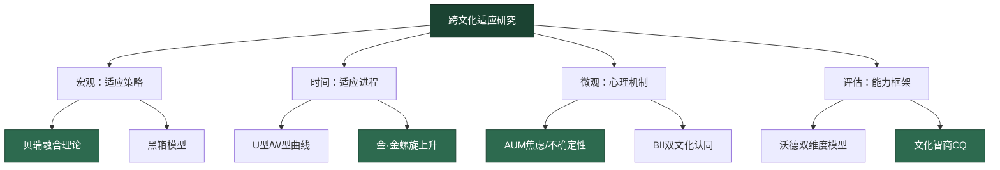
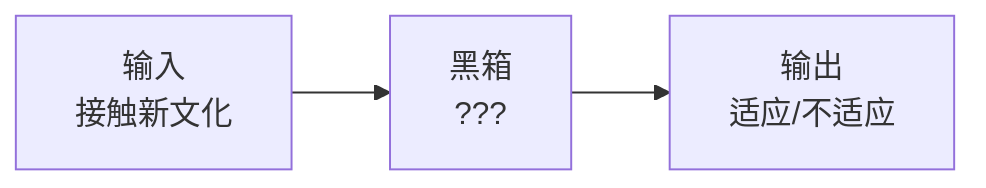
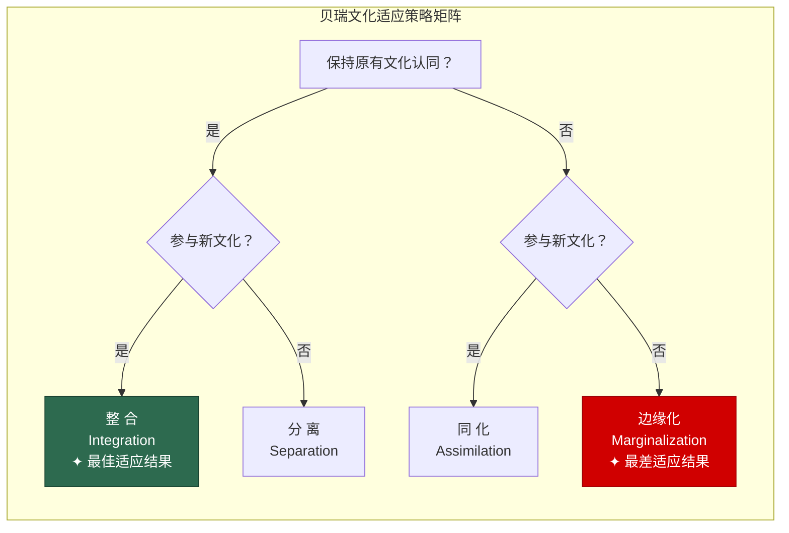
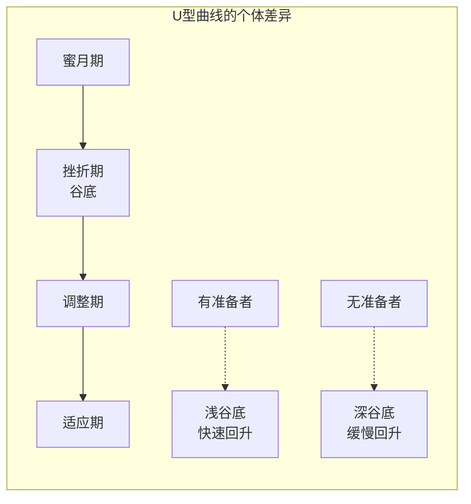
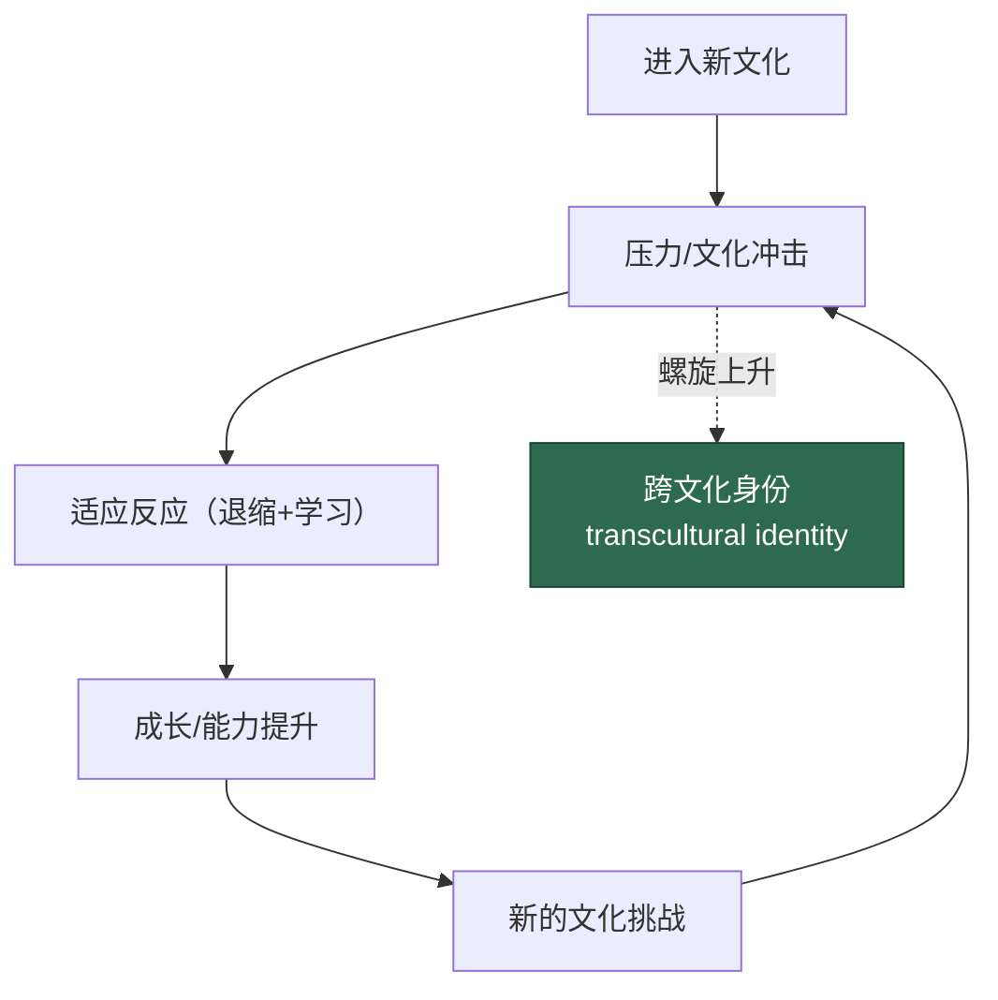
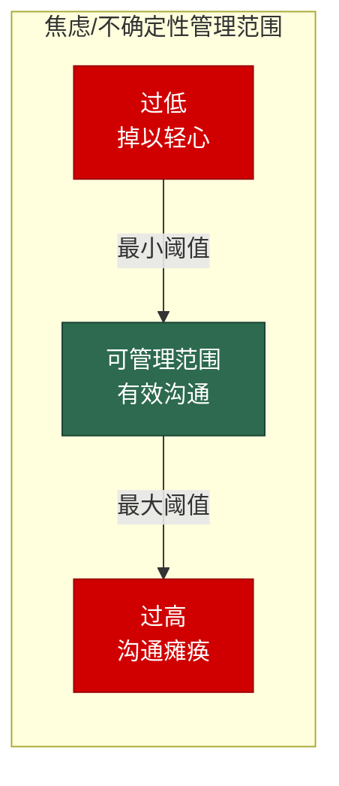

## 四、跨文化适应模型

在上一节中，我们学习了文化冲击理论——它描述的是跨文化适应过程中**短期的心理波动**：蜜月期、挫折期、调整期、适应期。但文化冲击理论回答的是"你会经历什么情绪"，而非"你应该采取什么策略"。跨文化适应模型要回答的问题更深层：**面对新文化，你应该如何定位自己？如何规划长期的适应路径？如何评估自己的适应状态？**

本节将系统梳理从最早期到最前沿的八大跨文化适应模型，帮助你建立一个完整的理论工具箱。这八个模型不是互相替代的关系，而是从不同维度、不同层面、不同时尺度解释跨文化适应这一复杂现象——就像医学中解剖学、生理学、病理学从不同角度解释人体一样。

### 4.1 黑箱模型（Black Box Model）

#### 4.1.1 模型概述

最早期的跨文化适应研究采用的是一种"黑箱"范式：研究者关注的只是输入端（个体接触新文化）和输出端（适应结果），而对中间发生了什么、为什么发生、如何发生，不做深入探究。

黑箱模型的逻辑极其简单：

在这一范式下，研究者只关心变量之间的相关性——比如"语言能力越高，适应越好"——但无法解释语言能力通过什么机制影响适应，也无法回答"为什么语言能力相同的人，适应结果差异巨大"。

#### 4.1.2 历史贡献与局限

黑箱模型虽然简陋，但在跨文化适应研究的早期阶段发挥了奠基作用。它确立了几个基本前提：

- 跨文化适应是一个**可研究的**心理过程，而非纯粹的运气或性格问题
- 适应结果存在**系统性差异**，这些差异可以通过实证方法识别和测量
- 存在一些**可预测的**影响因素（如语言能力、文化距离、接触时长）

**经典研究案例**：1950年代，研究者对驻扎在不同国家的美军士兵进行调查发现，驻扎在日本的士兵适应满意度显著低于驻扎在英国的士兵，即使语言障碍相似。这说明"文化距离"独立于语言能力影响适应结果——但黑箱模型无法解释这种影响是如何发生的。

但黑箱模型的根本缺陷在于：它无法为实践者提供任何可操作的指导。如果你不知道适应过程内部的机制，你就无法设计干预方案——就像医生只知道"吃药会好"，但不知道药是怎么起作用的，就无法对症下药。正是对这一局限的不满，推动了后续一系列"过程模型"的诞生。

### 4.2 贝瑞的融合理论（Berry's Acculturation Theory）

#### 4.2.1 理论背景

加拿大心理学家约翰·贝瑞（John W. Berry）是跨文化心理学领域最具影响力的学者之一。他在1970年代开始研究文化适应问题，并于1997年发表了里程碑式的论文《Immigration, Acculturation, and Adaptation》，系统提出了融合理论（Acculturation Theory）。这一理论至今仍是跨文化适应研究中引用最广泛、实证支持最充分的框架，被引用超过15000次。

贝瑞的核心洞见在于：文化适应不是一个单维的"从A到B"的线性过程，而是同时涉及两个独立维度——**对原有文化的保持**和**对新文化的参与**。这两个维度是独立的，一个人可以同时在两个维度上得分高，也可以同时得分低。

**为什么这两个维度是独立的？** 这是贝瑞理论最精妙的地方。直觉上，我们可能认为"越融入新文化就越远离原有文化"——即两个维度是负相关的。但贝瑞通过大量实证研究证明，这两个维度在统计上几乎不相关（相关系数接近零）。这意味着一个人完全可以在保持原有文化的同时积极参与新文化——这为"整合策略"提供了理论基础。

#### 4.2.2 四种文化适应策略

基于"是否保持原有文化"和"是否参与新文化"这两个维度的组合，贝瑞识别出四种文化适应策略：

| 策略 | 保持原有文化认同 | 积极融入新文化 | 核心特征 |
|------|:---:|:---:|------|
| **整合（Integration）** | ✓ | ✓ | 既保持原有文化认同，又积极融入新文化，形成双文化或多文化身份 |
| **同化（Assimilation）** | ✗ | ✓ | 放弃原有文化认同，完全采纳新文化的行为模式和价值观 |
| **分离（Separation）** | ✓ | ✗ | 保持原有文化认同，拒绝参与新文化，倾向于在同胞群体中生活 |
| **边缘化（Marginalization）** | ✗ | ✗ | 既不保持原有文化，也不融入新文化，处于文化认同的真空状态 |

**需要注意的是**：在贝瑞的原始理论中，还有第五种情境——当个体没有选择权时（如被强制同化或被隔离），策略的选择取决于主文化的政策而非个人意愿。后来贝瑞又增加了**去文化化（Deculturation）**的概念来描述这种情况。

#### 4.2.3 四种策略的深层解析

**整合策略（Integration）——双向桥梁**

采取整合策略的个体就像一座桥，一端连接着原有文化，另一端连接着新文化。他们能够在不同情境下灵活切换文化模式：在家中庆祝春节，在公司参加圣诞派对；用母语和同胞讨论情感话题，用当地语言处理工作事务。

整合策略之所以被大量研究证实为最优策略，有三个关键机制：

1. **认知资源最大化**：双文化个体拥有两套文化框架，能够从更多角度理解问题。新加坡国立大学的研究发现，双文化个体在创新思维测试中的得分比单文化个体高出23%，因为他们能够将一种文化的隐喻和概念创造性地应用到另一种文化语境中。
2. **社会支持网络最广**：整合策略使个体同时拥有同胞社区和本地社区两个支持网络。研究显示，拥有跨文化友谊（而非仅限于同胞友谊）的个体，在遭遇生活事件压力时的心理恢复速度快40%。
3. **心理安全感最强**：保持原有文化认同提供了"心理锚点"，使个体在面对文化冲突时不会产生存在性焦虑（"我到底是谁？"）。这种安全感不是逃避新文化的借口，而是大胆探索新文化的安全基地。

**同化策略（Assimilation）——单向融入**

采取同化策略的个体主动放弃原有文化，全面拥抱新文化。在短期内，这可能加速表面适应——语言进步快、社交融入快。但长期来看，同化策略存在显著风险：

- **身份空洞化**：当新文化无法完全接纳个体（这种情况非常普遍——亚裔美国人即使英语完美、行为完全美国化，仍可能被问"你从哪里来"），而原有文化又被放弃时，个体可能陷入"哪里都不属于"的困境。
- **代际冲突**：同化策略在第一代移民中可能"看起来"有效，但在家庭内部会造成代际价值观断裂——父母同化了，但子女可能对父母放弃的文化遗产产生强烈认同。这种"代际文化回摆"在美国第二代亚裔移民中非常普遍。
- **心理代价**：多项纵向研究表明，刻意压抑原有文化认同与更高的焦虑和抑郁水平显著相关。一项针对200名在美国的东亚移民的追踪研究发现，采取同化策略的个体，五年后的抑郁量表得分比采取整合策略的个体高出35%。

**分离策略（Separation）——文化堡垒**

采取分离策略的个体保持原有文化认同，拒绝参与新文化。这在有大规模族裔社区的城市中很常见——唐人街、韩国城、小意大利等都是分离策略的群体体现。

分离策略的短期优势是心理压力最小——你不需要改变任何东西。但长期代价是严重的：

- **社会流动性受限**：不学习当地语言和文化规则，限制了教育和职业机会。研究显示，在英国的孟加拉裔移民中，采取分离策略的个体的平均收入比采取整合策略的个体低45%。
- **信息茧房效应**：只在同胞群体中获取信息，容易形成对新文化的偏见和刻板印象。更危险的是，这种信息茧房会被代际传递——在分离策略家庭中长大的子女，对主流社会的了解往往比同龄人落后数年。
- **脆弱性**：一旦族裔社区面临外部压力（政策变化、经济危机），分离策略的个体缺乏应对资源。2020年新冠疫情初期，一些高度依赖族裔经济网络的社区遭受了不成比例的经济打击。

**边缘化策略（Marginalization）——最危险的境地**

边缘化是四种策略中最不利的状态。个体既不保持原有文化（可能因为被迫离开或文化断裂），也不融入新文化（可能因为被排斥或缺乏能力）。边缘化与最低的生活满意度、最高的心理压力、最强的社会疏离感相关联。

在现实中，边缘化往往不是个体的主动选择，而是被迫的状态——难民、非法移民、社会底层的外来人口更容易陷入边缘化。这提醒我们：**文化适应策略的选择不仅取决于个人意愿，还取决于社会结构和权力关系**。

#### 4.2.4 策略选择的影响因素

个体采取哪种策略，受到多重因素的交互影响：

| 因素类别 | 具体因素 | 影响机制 |
|----------|----------|----------|
| **个体因素** | 语言能力 | 语言是参与新文化的前提条件，语言能力越强，越可能采取整合或同化策略 |
| | 人格特质 | 开放性高的个体更倾向于整合或同化；神经质高的个体更容易分离或边缘化 |
| | 教育水平 | 受教育程度越高，认知灵活性越强，越可能采取整合策略 |
| | 跨文化经历 | 有过跨文化经历的个体更擅长处理双文化身份 |
| | 年龄 | 年龄越大，文化模式越固化，越难改变策略；但也更清楚自己想要什么 |
| **社会因素** | 主文化接纳度 | 如果主流社会对外来文化持排斥态度，整合策略的实施将非常困难 |
| | 族裔社区规模 | 大规模族裔社区为分离策略提供了社会基础，也为整合策略提供了心理安全基地 |
| | 政策环境 | 多元文化主义政策有利于整合，同化主义政策强制同化，排外政策导致边缘化 |
| | 社会经济地位 | 经济资源越多，策略选择的自由度越大 |
| | 社会网络 | 拥有主文化朋友越多，越倾向于整合；仅有同胞朋友则倾向分离 |
| **情境因素** | 文化距离 | 原有文化与新文化差异越大，适应难度越高 |
| | 接触时长 | 长期接触有利于从分离/边缘化向整合过渡 |
| | 移动目的 | 留学、工作、移民、难民——不同目的影响策略偏好 |
| | 移动自愿性 | 自愿移居者比被迫移居者有更高的整合意愿和能力 |

#### 4.2.5 实证研究的关键发现

贝瑞的理论在过去二十多年中积累了大量实证支持，以下是最重要的发现：

**发现一：整合策略与最优适应结果显著相关。** 2006年贝瑞等人对来自17个国家的超过5000名移民进行的元分析表明，整合策略与最高的生活满意度、最低的抑郁水平、最强的社会适应能力显著相关。这一结论在不同文化背景、不同年龄群体、不同移民类型中均得到了重复验证。具体数据：采取整合策略的移民，生活满意度平均比采取边缘化策略的移民高出1.2个标准差，抑郁量表得分低0.8个标准差。

**发现二：策略选择不是固定不变的。** 纵向研究表明，个体的适应策略会随时间变化。许多初到新文化时采取分离策略的人，在语言能力提升和社会网络扩展后，逐渐转向整合策略。反过来，遭遇歧视或社会排斥后，有些人会从整合转向分离。一项对在德土耳其移民的十年追踪研究发现，约35%的个体在十年内至少改变了一次策略。

**发现三：策略的效果受社会环境调节。** 整合策略的优越性不是绝对的——在主文化对外来文化持强烈排斥态度的环境中，整合策略可能比分离策略带来更多的心理冲突，因为你试图融入一个拒绝你的社会。在这种情况下，分离策略（在同胞群体中获得支持和认同）反而可能是更理性的选择。贝瑞本人在2006年的论文中明确承认了这一点，这体现了该理论的学术诚实性。

**发现四：双文化身份可以和谐共存。** 早期观点认为双文化身份会导致内心冲突，但现代研究表明，大多数双文化个体能够发展出"整合性双文化身份"——两种文化认同不是相互竞争的，而是相互补充的。fMRI研究证实，双文化个体在不同文化线索激活下，大脑激活模式会灵活切换，但这种切换不会造成神经层面的冲突。

#### 4.2.6 模型的局限与批评

尽管贝瑞的融合理论影响深远，但也面临一些批评：

1. **二维假设过于简化**：文化适应可能涉及更多维度（如行为适应、认知适应、情感适应），仅用"保持原有文化"和"参与新文化"两个维度可能遗漏重要信息。一些研究者提出了三维甚至四维模型来补充。
2. **个体主义偏向**：该模型假设个体有自由选择策略的能力，忽视了结构性因素（如制度歧视、经济不平等）对策略选择的强制性约束。批判学者指出，对于难民和无证移民，"选择"策略本身就是一种特权。
3. **静态截面局限**：模型在描述"四种策略"时容易给人静态印象，但实际上适应策略是动态变化的。
4. **测量工具争议**：不同研究者对"整合""同化"等概念的操作化定义不一致，导致研究结果难以直接比较。有的研究用量表，有的用行为指标，有的用自我认同。
5. **文化本质主义风险**：模型中的"原有文化"和"新文化"暗示文化是边界清晰的实体，但实际上在全球化时代，文化边界越来越模糊——一个在跨国企业工作的人，"原有文化"是什么可能本身就很难定义。

### 4.3 跨文化适应的U型曲线与W型曲线

#### 4.3.1 U型曲线模型（Lysgaard, 1955）

U型曲线是跨文化适应研究中最广为人知的模型。挪威学者斯维雷·吕斯加德（Sverre Lysgaard）在研究美国的挪威留学生时发现，留学生的适应程度与在美时间呈现出一条U型曲线：初到时适应水平较高，中期降至谷底，后期再次回升。

在上一节"文化冲击理论"中，我们已经详细讨论了U型曲线的四个阶段（蜜月期、挫折期、调整期、适应期）的心理机制和应对策略。这里我们从**适应模型**的角度补充两个关键视角：

**视角一：U型曲线的"适应水平"到底指什么？**

Lysgaard原始研究中的"适应"是一个笼统的概念。后来的研究者将其分解为多个子维度，发现不同维度的U型曲线形状不同：

| 适应维度 | 蜜月期表现 | 谷底深度 | 回升速度 | 说明 |
|----------|:---:|:---:|:---:|------|
| 生活技能适应 | 较高 | 中等 | 快 | 交通、购物、就医等实用技能较快掌握 |
| 语言适应 | 低 | 深 | 慢 | 语言是最后突破的壁垒之一 |
| 社交适应 | 中等 | 深 | 中等 | 建立深度友谊需要时间和文化理解 |
| 心理适应 | 高 | 中等 | 中等 | 蜜月期的高预期导致后续落差更大 |
| 工作/学业适应 | 低-中 | 中等 | 中等 | 取决于工作环境的文化多样性程度 |

这种维度差异的实际意义在于：**你可能在某些维度上已经"走出谷底"了，但在另一些维度上仍然在挣扎。** 不要因为"社交还是很难"就否定自己在"生活技能"上已经取得的进步。

**视角二：U型曲线的个体差异**

U型曲线是一个**统计趋势**，不代表每个人都遵循同一轨迹。研究表明，以下因素会影响个体U型曲线的形状：

- **预期管理**：出国前接受过跨文化培训的人，蜜月期较短但谷底较浅，因为他们的预期更现实
- **文化距离**：文化距离越大（如中国到美国 vs 中国到新加坡），谷底越深，回升越慢
- **人格特质**：开放性和情绪稳定性高的人，U型曲线更平缓
- **社会支持**：在当地有可靠社会支持网络的人，谷底持续时间更短
- **主动应对**：采取主动学习和适应策略的人，回升速度更快
- **语言准备**：出国前语言准备越充分，谷底越浅

#### 4.3.2 W型曲线模型（Gullahorn & Gullahorn, 1963）

约翰·古拉霍恩和珍妮·古拉霍恩（John & Jeanne Gullahorn）在U型曲线的基础上增加了归国后的适应阶段。他们发现，留学生回国后同样会经历一个U型过程——兴奋、挫败、适应——使得整个跨文化经历呈现出W型。

关于逆向文化冲击的详细机制和应对策略，我们在上一节"文化冲击理论"的3.4节已经深入讨论。这里从**适应模型**的角度强调一个关键洞察：

**W型曲线揭示了"跨文化适应"不是一个有终点的事件，而是一个持续一生的过程。** 每一次文化转换（出国、归国、再次出国）都会重新触发适应循环。但好消息是，每一次经历都会提升你的跨文化适应能力——第二个W的谷底通常比第一个W的浅，回升也更快。这就是金·金（Young Yun Kim）在她的螺旋上升模型中所描述的"压力-适应-成长"动态。

#### 4.3.3 U/W曲线的现代修正

传统U/W曲线假设个体只经历一次文化转换。但全球化时代的现实是：许多人经历的是**多次文化转换**——先留学，再外派，再回国，再外派到另一个国家。这种"连续跨文化经历"会形成什么样的曲线？

研究表明，对于"连续文化旅行者"（serial sojourners），适应曲线呈现出以下特征：

1. **蜜月期缩短**：每次新的文化转换，蜜月期都比上一次更短——因为你已经习惯了"一切都是新的"这种感觉
2. **谷底变浅**：你积累了更多的应对策略，心理韧性更强
3. **回升更快**：你知道"低谷会过去的"，这种元认知本身就是一种保护因素
4. **可能出现"适应疲劳"**：多次转换后，有些人会对"从头开始"感到厌倦和疲惫
5. **也可能出现"适应自信"**：成功的跨文化经历积累使你对新的文化转换更有信心

**实际案例**：一位在跨国公司工作的中国籍高管，先后被外派到日本（3年）、德国（4年）、巴西（2年）。到第三个国家时，他的蜜月期只有两周（vs 第一次外派日本时的两个月），三个月内就建立了基本的社交网络（vs 日本时的八个月）。但他也承认，"我开始对每一个新城市都感到差不多了——不再有那种'哇，全新的世界'的感觉。"

### 4.4 金·金的跨文化适应综合理论（Kim's Integrative Theory）

#### 4.4.1 理论背景与核心观点

韩裔美国学者金·金（Young Yun Kim）在2001年出版的著作《Becoming Intercultural: An Integrative Theory of Communication and Cross-Cultural Adaptation》中，提出了跨文化适应领域最全面的综合理论。

金·金的理论核心可以用一句话概括：**跨文化适应是一个"压力-适应-成长"的螺旋式上升过程（Stress-Adaptation-Growth Dynamic）。**

这个模型与文化冲击理论（Oberg的四阶段模型）的区别在于：

| 对比维度 | 文化冲击理论 | 金·金的综合理论 |
|----------|------------|----------------|
| 关注焦点 | 短期情绪波动 | 长期身份转型 |
| 过程观 | 线性阶段（有终点） | 螺旋上升（无终点） |
| 压力的定位 | 需要克服的障碍 | 成长的催化剂 |
| 适应的含义 | 恢复到"正常"状态 | 发展出更高层次的能力 |
| 身份观 | 从A文化变为B文化 | 发展出新的跨文化身份 |
| 时间尺度 | 数月到一两年 | 终身过程 |

#### 4.4.2 "解构-重构"的动态过程

金·金认为，跨文化适应的本质是**解构（Deculturation）与重构（Acculturation）的辩证统一**：

**解构**：个体在新文化环境中，旧有的文化模式——行为习惯、思维框架、社交规则——不再完全适用。这种"不再适用"迫使个体对旧有模式进行审视和修正。解构不是"失去"文化，而是"松动"那些不再适应新环境的文化固着。

**具体例子**：一个中国学生在美国课堂上发现，不举手发言会被教授认为"不参与"。这迫使他审视自己"安静是美德"的文化假设——他不需要放弃这个价值观（在某些场合安静仍然是美德），但需要松动"所有场合都适用"的固着。

**重构**：在旧有模式被松动的同时，个体开始学习和吸收新文化的元素——新的语言表达、新的社交规则、新的价值视角。这些新元素与保留的旧有元素融合，形成一种**新的、更加复杂的跨文化认知系统**。

这个过程可以用"文化拼图"来比喻：你原有文化的拼图被部分拆解，新文化的碎片被纳入，最终形成一幅新的拼图——这幅新拼图既不是原来的，也不是新文化的，而是一个独特的、属于你自己的跨文化身份。

#### 4.4.3 影响适应的七大因素

金·金识别出影响跨文化适应过程的七大类因素，形成了一个完整的生态系统模型：

**（1）主文化的社会环境**

- **主文化（Host Culture）的接纳程度**：新文化环境对外来者的开放和包容程度，是影响适应速度和深度的最关键外部因素。一个对外来文化持开放态度的社会（如加拿大的多元文化主义政策），能够显著加速适应过程；而一个排斥外来者的社会环境，则可能使适应过程陷入停滞甚至倒退。
- **族裔社区（Ethnic Community）的支持**：来自同一文化背景的社区提供的信息支持、情感支持和实际帮助。族裔社区既是安全港湾（在挫折期提供庇护），也可能是适应的障碍（过度依赖同胞群体可能减缓与主文化的接触）。关键在于"适度使用"——将族裔社区作为心理安全基地，而非逃避主文化的避风港。

**（2）个人传播能力**

- **人际传播（Interpersonal Communication）**：与主文化成员的日常互动——从邻居闲聊到同事合作，每一次成功的跨文化互动都是一个微小的学习机会。研究表明，拥有主文化朋友（而非仅仅是熟人）的数量，是预测跨文化适应成功最稳定的指标之一。一个被反复验证的发现是：拥有至少3个主文化"密友"（可以讨论私人话题的朋友）的个体，其适应满意度比没有密友的个体高出60%。
- **大众传播（Mass Communication）**：通过电视、报纸、互联网、社交媒体等渠道了解新文化。在数字时代，大众传播的角色发生了根本变化——你可以通过YouTube了解美国流行文化，通过微博了解中国社会热点，通过播客学习任何国家的语言。这种"虚拟文化接触"虽然不能替代面对面互动，但为适应提供了前所未有的准备工具。

**（3）个人倾向因素**

- **开放性（Openness）**：对新体验、新观念、新行为方式的接纳程度。这是五大人格特质中与跨文化适应关系最密切的一个。高开放性的个体倾向于将文化差异视为"有趣"而非"威胁"。
- **韧性（Resilience）**：面对挫折和压力时的心理恢复能力。韧性不是"不怕挫折"，而是"在挫折后能恢复"。研究表明，心理韧性可以通过认知行为训练和正念冥想得到提升。
- **主动性（Initiative）**：主动寻求跨文化接触和学习的意愿。被动等待"被适应"几乎注定会失败——适应需要个体主动出击。

**（4）族裔文化与主文化的距离**

文化距离越大，解构-重构的过程越激烈，适应所需的时间越长。一个从韩国到日本的移民，与一个从中国到巴西的移民，面临的适应挑战截然不同。文化距离可以沿多个维度测量：语言差异、宗教差异、价值观差异（Hofstede维度）、社会制度差异、气候差异等。

**（5）个人与主文化成员的互动程度**

金·金特别强调，适应不是在文化接触中自动发生的，而是通过与主文化成员的**有意义的互动**发生的。所谓"有意义的互动"，不仅仅是点头问好，而是涉及信息交换、情感分享、问题解决的深度互动。

**（6）个人与族裔文化成员的互动程度**

与同胞的互动提供心理支持，但过度依赖同胞群体可能减缓与主文化的接触。金·金提出一个"互动平衡"概念——最理想的适应状态是在同胞互动和主文化互动之间找到动态平衡。

**（7）个人的适应能力倾向**

包括认知灵活性、情感调节能力、行为适应能力等先天和后天的因素。这些能力越高，"压力-适应-成长"循环运转得越顺畅。

#### 4.4.4 螺旋上升的具体机制

金·金的"螺旋上升"不是一个抽象的隐喻，而是有具体机制支撑的：

**压力（Stress）→ 适应（Adaptation）→ 成长（Growth）**

每一次文化冲突都会产生心理压力（如被误解、犯社交错误、感到孤独）。面对压力，个体有两种基本反应——**退缩**（回避冲突情境）和**学习**（尝试理解冲突的原因并调整行为）。这两种反应不是非此即彼的，而是同时存在的，形成一个"推-拉"动态：

- 退缩提供了心理喘息空间，防止过度消耗
- 学习带来了新的认知和技能

在退缩和学习的交替作用下，个体逐渐发展出应对能力。而**每一次成功应对都提升了个体的适应基线**——下一次遇到类似的文化冲突时，压力感会更小，应对会更快。这就是"成长"的含义：不是压力消失了，而是你应对压力的能力增强了。

**具体案例**：一位在纽约工作的日本程序员，第一次在会议上被同事直接反驳时（日本文化中极少当面反驳），感到极度不适，会后甚至想辞职。但经过反思，他理解了美国文化的"对事不对人"逻辑。到第三次被反驳时，他已经能够就事论事地回应。到第六次时，他甚至开始享受这种直接的思维碰撞。这就是螺旋上升——不是"习惯了"，而是"能力提升了"。

经过多次"压力-适应-成长"的循环，个体最终可能发展出金·金所称的**"跨文化身份"（Intercultural Identity）**——一种超越单一文化归属的、开放的、灵活的自我认同。金·金认为，这种跨文化身份不是"没有文化身份"，而是一种更高层次的、整合了多种文化经验的身份形态。

#### 4.4.5 理论的实践价值

金·金的理论对实践者最大的启示是：**文化冲突不是需要消除的问题，而是成长的机会。** 这不是一句鸡汤，而有实证支持——研究表明，经历过更多文化冲突并成功应对的个体，其跨文化能力显著高于那些文化冲突经历较少的个体。

这一观点改变了我们对"适应困难"的认知框架：挫折期不是"还没适应"，而是"正在成长"。理解这一点，对于在文化冲击中挣扎的人来说，本身就是一种强大的心理支持。

**金·金理论的局限性**：该理论虽然全面，但也因过于宏大而难以被实证检验——它的变量太多，难以设计精确的实验来验证。此外，"跨文化身份"这一概念比较模糊，不同的研究者有不同的操作化定义。

### 4.5 古迪昆斯特的焦虑/不确定性管理理论（AUM Theory）

#### 4.5.1 理论起源

威廉·古迪昆斯特（William B. Gudykunst）是跨文化沟通研究的先驱之一。他在1980年代提出了**焦虑/不确定性管理理论（Anxiety/Uncertainty Management Theory, AUM）**，从社会心理学的角度解释跨文化互动中的核心心理障碍。

AUM理论的核心命题极其简洁：**有效的跨文化沟通，取决于你能否将焦虑和不确定性降低到可管理的水平。**

古迪昆斯特最初从Berger和Calabrese的"不确定性削减理论"（Uncertainty Reduction Theory）出发——该理论认为，人们在初次与他人互动时的首要目标是减少对对方行为的不确定性。古迪昆斯特将这一理论扩展到跨文化情境，并增加了焦虑这一维度。

#### 4.5.2 两个核心变量

**焦虑（Anxiety）**：在跨文化互动中感受到的紧张、不安和忧虑。这是一种情绪性反应——"我担心自己会犯错""我害怕被拒绝""我感到不自在"。焦虑的核心是对**负面结果**的担忧。

**不确定性（Uncertainty）**：在跨文化互动中无法预测对方行为的认知状态。这是一种认知性反应——"我不知道他为什么那样做""我不确定我的话有没有被理解""我猜不到他下一步会怎样"。不确定性的核心是**信息缺乏**。

**这两个变量为什么需要分开管理？** 因为它们影响沟通的方式不同，也需要不同的干预策略。你可以降低焦虑但保持高度不确定性（"我不理解他，但我不担心"），也可以降低不确定性但保持高度焦虑（"我理解他为什么那样做，但我还是紧张"）。只有两者同时被管理到适当水平，有效沟通才可能发生。

这两个变量的组合形成了四种状态：

| 状态 | 焦虑水平 | 不确定性水平 | 沟通效果 | 典型表现 |
|------|:---:|:---:|------|------|
| **有效沟通** | 适中 | 适中 | 能够自信、准确地进行跨文化互动 | "我知道可能发生什么，即使出错我也能应对" |
| **过度警惕** | 高 | 低 | 虽然理解对方，但过度紧张导致行为僵硬 | "我太紧张了，即使知道该怎么做也做不到" |
| **过度自信** | 低 | 高 | 不够了解对方，但自我感觉良好——容易犯错而不自知 | "我完全不知道我在犯文化禁忌" |
| **沟通瘫痪** | 高 | 高 | 既不理解对方，又极度紧张——回避互动或频繁出错 | "我干脆不说了" |

注意：这里使用"适中"而非"低"——古迪昆斯特特别指出，焦虑和不确定性不是越低越好。零焦虑意味着对跨文化互动完全无感（可能导致粗心大意），零不确定性意味着过度简化对对方的认知（忽略个体差异）。最佳状态是一个"可管理的范围"（manageable range）。

#### 4.5.3 管理焦虑与不确定性的策略

AUM理论不仅描述问题，还提供了系统的管理策略：

**降低焦虑的策略：**

- **渐进式暴露**：焦虑来自未知，每一次成功的跨文化互动都会降低对下一次互动的焦虑。从低风险情境开始（超市购物、问路），逐步升级到高风险情境（工作汇报、社交聚会、文化冲突谈判）。
- **正念练习**：觉察自己的焦虑情绪，而不是被它控制。"我注意到我现在很紧张"比"我好紧张啊"更有力量——前者是观察者视角，后者是被情绪淹没的体验者视角。每天10分钟的正念冥想，持续8周后，跨文化焦虑水平可降低约30%（基于正念减压疗法MBSR的研究数据）。
- **认知重评**：将"我可能会犯错"重新定义为"我可能会学到东西"。将"他们可能会觉得我奇怪"重新定义为"他们可能会觉得我有趣"。
- **身体调节**：深呼吸（4-7-8呼吸法：吸气4秒，屏息7秒，呼气8秒）、有氧运动、充足睡眠——生理状态直接影响焦虑水平。
- **设定合理预期**：不要期望自己在第一次跨文化互动中就表现完美。研究表明，设定"学习导向"而非"表现导向"的目标，可以显著降低焦虑。

**降低不确定性的策略：**

- **主动获取信息**：在互动前了解对方的文化背景、沟通偏好、社交规则。信息获取的渠道包括：文化手册、在线资源、有经验的人的建议、对方文化的影视作品。
- **提问而非假设**：当你不确定时，直接询问——"你们通常怎样处理这种情况？""我注意到你做了X，在你们文化中这代表什么？"大多数人喜欢被真诚地询问，而不是被错误地假设。
- **观察学习**：注意当地人在类似情境中的行为模式。注意的焦点包括：说话的音量和距离、眼神接触的程度、话题的选择和回避、时间和约会的灵活性。
- **寻找文化桥梁人**：了解两种文化的人（"文化经纪人"或"双文化者"）可以帮你解读你无法理解的行为，也可以帮你在犯错之前预判潜在的误解。
- **建立反馈机制**：请信任的朋友或同事告诉你，在互动中你的哪些行为可能被误解。这种反馈是最直接的不确定性降低工具——但要注意，反馈者需要是既了解你的文化又了解对方文化的人。

#### 4.5.4 AUM理论的扩展：最小阈值与最大阈值

古迪昆斯特在理论发展的后期增加了两个重要概念：

**最小阈值（Minimum Threshold）**：焦虑和不确定性不能过低。如果焦虑太低，个体可能对跨文化互动掉以轻心，忽略重要的文化信号。如果不确定性太低，个体可能产生"我已经完全理解了"的错觉，停止学习。

**最大阈值（Maximum Threshold）**：焦虑和不确定性也不能过高。超过阈值，个体的认知资源被消耗殆尽，无法进行有效的信息处理，只能选择回避或刻板化反应。

有效的跨文化沟通发生在最小阈值和最大阈值之间的"可管理范围"内。

#### 4.5.5 AUM理论与贝瑞理论的互补

AUM理论解决的是贝瑞理论中未充分解释的微观机制：**为什么有些人能采取整合策略，而有些人只能退缩到分离策略？** AUM理论的答案是：当焦虑和不确定性过高时，个体的认知资源被消耗殆尽，无法进行有效的跨文化互动，只能选择回避（分离或边缘化）。反之，当焦虑和不确定性被有效管理时，个体才有余力去主动接触和学习新文化（整合）。

这意味着，**降低焦虑和不确定性是实现整合策略的前提条件**。在实际的跨文化培训中，AUM理论的应用非常广泛——很多培训项目的核心目标就是帮助参与者管理跨文化焦虑，而不是仅仅传授文化知识。

**AUM理论的局限**：该理论主要关注微观的互动层面，对宏观的社会结构因素（如制度歧视、权力不平等）关注不足。此外，"可管理范围"的最佳值因人而异，缺乏统一的标准。

### 4.6 沃德的社会文化适应与心理适应双维度模型

#### 4.6.1 理论概述

新西兰心理学家科琳·沃德（Colleen Ward）与其合作者肯尼迪（Kennedy）在1990年代提出了一个重要的分析框架：跨文化适应包含两个相对独立但又相互关联的维度——**社会文化适应（Sociocultural Adaptation）**和**心理适应（Psychological Adaptation）**。

| 维度 | 定义 | 典型指标 | 学术来源 |
|------|------|----------|----------|
| 社会文化适应 | 在新文化中有效运作的能力——理解和执行日常社交规则的能力 | 生活自理、社交互动、工作/学习表现、对当地习俗的理解 | 社会学习理论 |
| 心理适应 | 主观幸福感和情绪健康——对跨文化生活的满意度和情绪状态 | 生活满意度、自尊、焦虑和抑郁水平、情绪稳定性 | 压力-应对理论 |

#### 4.6.2 两个维度的关键差异

**社会文化适应**和**心理适应**虽然相关，但它们的时间轨迹不同、影响因素不同、预测指标不同：

**差异一：时间轨迹不同。** 社会文化适应通常遵循一条渐进的学习曲线——随着时间推移，你对当地文化规则的理解逐渐加深，犯错逐渐减少。而心理适应则呈现出波动性更强的U型曲线——初期可能因为新奇感而高，中期因为挫败感而低，后期因为适应而回升。

**差异二：预测因素不同。** 社会文化适应的最佳预测指标是**文化距离**和**跨文化接触量**——你与当地文化差异越小、接触越多，社会文化适应越好。心理适应的最佳预测指标是**人格特质**（特别是神经质的反面——情绪稳定性）和社会支持——你越能管理情绪、越有可靠的社会支持，心理适应越好。

**差异三：改善策略不同。** 社会文化适应的提升主要靠**学习**——学习语言、学习社交规则、学习文化知识。心理适应的提升主要靠**管理**——管理期望、管理情绪、管理压力。

#### 4.6.3 两个维度的不一致性

沃德模型最有实践价值的发现是：**两个维度可以不一致。** 这种不一致有四种组合：

| 组合 | 社会文化适应 | 心理适应 | 典型人群 | 隐患 |
|------|:---:|:---:|------|------|
| **理想状态** | 高 | 高 | 成功适应的长期移民 | — |
| **表面成功** | 高 | 低 | 高功能但内心孤独的外派精英 | 长期可能引发倦怠或心理崩溃 |
| **自在但受限** | 低 | 高 | 退休后在异国养老的老人 | 社会参与不足，生活半径受限 |
| **双重困难** | 低 | 低 | 刚到不久、缺乏支持的新移民 | 需要紧急干预 |

**"表面成功"是沃德模型最深刻的发现。** 在实践中，这类人群最危险——因为从外部看，他们完全适应了（语言流利、工作出色、社交广泛），但他们内心深处可能感到深深的孤独和身份困惑。由于"看起来没问题"，他们很少寻求帮助，也很难被识别出需要支持。

这对实践者的启示是：不能只关注一个维度。**真正健康的跨文化适应，是社会文化适应和心理适应的均衡发展。**

#### 4.6.4 社会文化适应的子维度

沃德和肯尼迪开发的"社会文化适应量表"（Sociocultural Adaptation Scale, SCAS）将社会文化适应分解为多个可测量的子维度，包括：

- **日常生活能力**：购物、做饭、交通、就医、处理行政手续
- **人际交往能力**：与邻居互动、交朋友、处理社交场合
- **工作/学业能力**：理解工作/学业要求、与同事/同学合作
- **文化理解能力**：理解当地的幽默、习俗、价值观
- **语言沟通能力**：日常对话、专业讨论、理解俚语和典故

每个子维度都有独立的适应曲线和干预策略，这使得该模型在实际的跨文化辅导中具有很高的诊断价值。

### 4.7 文化智商（Cultural Intelligence, CQ）框架

#### 4.7.1 从理论到能力工具

前面讨论的模型大多聚焦于"描述适应过程"或"解释适应机制"。而文化智商（Cultural Intelligence, CQ）则是一个**能力评估和发展框架**——它不描述你经历了什么，而是评估你"有多大的能力去应对跨文化情境"。

文化智商的概念由克里斯托弗·厄利（Christopher Earley）和安格（Soon Ang）在2003年系统提出，随后被大量实证研究验证和发展。CQ框架的核心贡献在于：它将跨文化能力从一个模糊的概念转化为可测量、可训练的四个具体维度。

#### 4.7.2 CQ的四个维度

| 维度 | 英文 | 核心问题 | 具体能力 | 与适应模型的关系 |
|------|------|----------|----------|-----------------|
| **元认知CQ** | Metacognitive CQ | "你在跨文化互动前、中、后能否有意识地思考和调整？" | 文化意识、策略规划、实时监控认知过程 | 对应AUM理论中的"不确定性管理" |
| **认知CQ** | Cognitive CQ | "你对不同文化的知识储备有多丰富？" | 文化价值观知识、社会制度知识、语言知识 | 对应贝瑞理论中的"了解新文化" |
| **动机CQ** | Motivational CQ | "你有多大兴趣和信心去应对跨文化挑战？" | 内在兴趣、自我效能感、坚持意愿 | 对应贝瑞理论中选择整合vs分离的动机 |
| **行为CQ** | Behavioral CQ | "你能否灵活调整语言行为和非语言行为？" | 语速语调调整、身体语言调整、表达风格切换 | 对应金·金理论中的"行为重构" |

四个维度之间存在层级关系：**元认知CQ是最高层**——它监控和调节其他三个维度。一个拥有高元认知CQ的人，即使当前的认知CQ不高（对目标文化了解不多），也能通过有意识的学习快速弥补；即使行为CQ不高（还没有掌握目标文化的行为模式），也能通过实时监控和调整来避免重大失误。

#### 4.7.3 CQ的自我评估清单

以下是基于CQ四个维度的简化自测工具，帮助你快速评估自己的跨文化能力现状：

**元认知CQ（评估你的文化觉察力）：**

- [ ] 在与不同文化背景的人互动前，我会思考自己的文化假设可能如何影响互动
- [ ] 互动中我会检查自己是否在用刻板印象来理解对方
- [ ] 互动后我会反思哪些做法有效、哪些需要调整
- [ ] 我能意识到自己对某种文化的偏见，并有意识地修正

**认知CQ（评估你的文化知识储备）：**

- [ ] 我了解目标文化的核心价值观维度（如个人主义vs集体主义）
- [ ] 我了解目标文化的基本社交规则和禁忌
- [ ] 我了解目标文化的经济、政治、教育制度
- [ ] 我能说出目标文化的历史上3个以上重大事件及其文化影响

**动机CQ（评估你的跨文化动力）：**

- [ ] 我对了解不同文化有真正的兴趣，而不仅仅是"不得不"
- [ ] 我有信心应对跨文化互动中的不确定性和挑战
- [ ] 遇到文化冲突时，我的第一反应是好奇而非回避
- [ ] 我愿意在不舒服的情境中坚持，直到找到解决方案

**行为CQ（评估你的行为灵活性）：**

- [ ] 我能根据不同文化场合调整自己的肢体语言（如问候方式、眼神接触、身体距离）
- [ ] 我能调整自己的说话方式（如直接vs间接、正式vs非正式）
- [ ] 在不确定该怎么做时，我能观察当地人的行为并模仿
- [ ] 我能用非母语表达情感和幽默（不仅仅是事实信息）

**评分**：每项1分。12分以上 = 高CQ，8-11分 = 中等CQ，7分以下 = 需要重点提升。

#### 4.7.4 CQ的实践应用

文化智商最大的优势是**可训练、可测量、可发展**。与相对稳定的"人格特质"不同，CQ的四个维度都可以通过有针对性的训练提升：

**提升元认知CQ：** 每次跨文化互动后进行5分钟的反思——"这次互动中，我做了哪些假设？哪些假设被验证了，哪些被推翻了？下次我可以怎么调整？"使用"文化发现日记"系统化这一过程。工具推荐：DEAL反思框架——Describe（描述发生了什么）、Examine（检查自己的反应）、Articulate Learning（明确学到了什么）。

**提升认知CQ：** 系统学习目标文化的Hofstede维度分数、高低语境特征、核心价值观和社会规范。阅读该文化的小说和观看该文化的电影，比纯粹的理论学习更有效——因为小说和电影展示的是文化的"活体"而非"骨架"。推荐一个实用方法：选择目标文化的一部热门电视剧，看三遍——第一遍看剧情，第二遍注意社交行为和非语言信号，第三遍分析剧情中的文化假设。

**提升动机CQ：** 从小的成功体验开始建立信心。先在安全的环境中练习（如与友好的外国同事共进午餐），再逐步挑战更复杂的场景（如跨文化谈判）。重要的是记录每一次成功经验——跨文化自我效能感的建立依赖于"我做到了"的记忆积累。

**提升行为CQ：** 通过角色扮演和行为模拟训练。录像回放自己的跨文化互动，观察自己的非语言行为是否传达了预期的信息。一个实用练习：选择一个日常行为（如打招呼、拒绝邀请、表达不同意），分别用三种不同文化的方式演示，直到能够在不同文化情境中自然切换。

#### 4.7.5 CQ与其他模型的整合

CQ框架不是独立于其他模型的，而是与它们形成互补关系：

| CQ维度 | 可弥补的模型局限 |
|--------|----------------|
| 元认知CQ | 补充贝瑞理论——为什么有些人能灵活调整策略？因为他们有高元认知CQ |
| 认知CQ | 补充AUM理论——降低不确定性的具体手段就是提升认知CQ |
| 动机CQ | 补充金·金理论——为什么有些人能从"压力"中"成长"而非退缩？因为他们的动机CQ高 |
| 行为CQ | 补充沃德模型——提升社会文化适应的具体路径就是提升行为CQ |

### 4.8 双文化认同整合模型（Bicultural Identity Integration, BII）

#### 4.8.1 理论概述

贝瑞的融合理论告诉我们"整合是最优策略"，但它没有深入解释：**为什么有些人能成功整合两种文化认同，而有些人虽然试图整合却感到内心撕裂？**

双文化认同整合（Bicultural Identity Integration, BII）模型由贝尼特-马丁内兹（Benet-Martínez）和哈里托（Haritatos）在2005年提出，专门回答这个问题。BII衡量的是双文化个体对自身两种文化认同的**主观整合感知**——他们觉得两种文化在自己身上是和谐共存的，还是相互冲突的。

BII包含两个子维度：

- **文化和谐（Cultural Harmony）**：两种文化认同之间的和谐程度——"我的中国身份和我的美国身份相处融洽"
- **文化混合（Cultural Blendedness）**：两种文化认同的融合程度——"我认为自己是一个融合了中美文化的人，而不是一个有时像中国人、有时像美国人的人"

这两个维度可以独立变化：一个人可能觉得两种文化是和谐的（没有冲突），但并不觉得它们融合了（保持清晰的边界）；另一个人可能觉得两种文化已经融合了（边界模糊），但这种融合本身带来了不适感。

#### 4.8.2 BII的个体差异

BII得分高的人（和谐型双文化者）与BII得分低的人（冲突型双文化者），在多个维度上表现出显著差异：

| 维度 | 高BII（和谐型） | 低BII（冲突型） |
|------|----------------|----------------|
| 身份认同 | "我就是一个跨文化的人" | "我不知道自己到底属于哪里" |
| 文化切换 | 在不同文化情境中自如切换 | 切换时感到不适或内疚 |
| 认知灵活性 | 更高——两种文化框架可自由调用 | 较低——两种框架相互干扰 |
| 心理健康 | 更高的生活满意度和自尊 | 更高的焦虑和身份困惑 |
| 跨文化创造力 | 更强——能够融合不同文化视角 | 较弱——视角被冲突所占据 |
| 职业表现 | 在跨国团队中表现更好 | 在需要频繁文化切换的岗位中表现较差 |
| 社交关系 | 更容易建立跨文化友谊 | 更倾向于在单一文化群体中社交 |

#### 4.8.3 影响BII的因素

是什么决定了一个人是"和谐型"还是"冲突型"双文化者？研究识别出以下关键因素：

1. **感知到的两种文化距离**：如果你认为"中国文化"和"美国文化"是根本对立的（如"东方重集体，西方重个人"的二元对立思维），你更可能成为冲突型；如果你认为它们是不同但可以互补的（如"两种文化都重视家庭，只是表达方式不同"），你更可能成为和谐型。
2. **认同边缘化威胁**：如果你感受到来自两种文化群体的压力（"你太中国了""你太美国了"），BII会降低。这种"双重边缘化"是最痛苦的双文化体验——你被两个群体都排斥。
3. **人格特质**：开放性高、神经质低的个体更容易发展出和谐型双文化认同。
4. **双文化社交网络**：拥有一群理解双文化体验的朋友（而非单纯的中国朋友或美国朋友）有助于提升BII。这些朋友不需要和你一样是双文化者，但需要理解和尊重你的双文化身份。
5. **叙事重构能力**：能够将自己跨文化经历讲成一个连贯的、有意义的故事的人，BII更高。这与叙事心理学的研究一致——我们通过讲故事来建构身份认同。

#### 4.8.4 提升BII的干预策略

对于BII较低（感到文化身份冲突）的个体，以下策略被研究证明有效：

**策略一：认知重构（Cognitive Reframing）**

将"我的两种文化是冲突的"重构为"我的两种文化是互补的"。具体做法：列出你从每种文化中获得的优势（如"中国文化教会了我耐心和对长期目标的坚持""美国文化教会了我直接沟通和主动争取"），然后寻找这些优势如何互补而非矛盾。

**策略二：叙事整合（Narrative Integration）**

写一篇"我的跨文化故事"——不是列出你经历了什么，而是将这些经历编织成一个连贯的成长叙事。关键要素包括：(1) 我是如何成为双文化者的；(2) 我经历了哪些身份冲突；(3) 我是如何处理这些冲突的；(4) 现在的我对双文化身份的理解是什么。研究表明，写出叙事整合文章后，参与者的BII分数平均提升了15%。

**策略三：双文化社交网络建设**

有意识地发展那些理解双文化体验的社交关系。这些关系不需要都是"和你一样的人"——一个从不同文化组合但同样经历过双文化冲突的朋友，可能比一个和你文化组合完全相同的朋友更有帮助，因为他们更能共情"文化冲突"这种体验本身。

**策略四：文化框架切换训练**

通过练习在不同文化情境中有意识地切换文化框架，降低切换时的不适感。具体做法：在日常生活中设置"文化切换触发器"——例如，讲中文时提醒自己"现在是中国文化模式"，讲英文时提醒自己"现在是英语文化模式"。随着练习增加，这种切换会越来越自然。

### 4.9 跨文化适应模型全景对比

以上八大模型并非互相排斥，而是从不同角度、不同层面解释了跨文化适应这一复杂现象。以下对比表帮助你建立整体认知：

| 模型 | 提出者 | 年份 | 核心关注 | 关键概念 | 最佳适用场景 |
|------|--------|------|----------|----------|------------|
| 黑箱模型 | 早期研究者 | 1950s前 | 输入-输出关系 | 因果关系 | 历史参考 |
| 融合理论 | Berry | 1997 | 适应策略选择 | 整合/同化/分离/边缘化 | 个人策略规划、政策制定 |
| U/W曲线 | Lysgaard / Gullahorn | 1955/1963 | 适应的时间进程 | 蜜月期-挫折期-调整期-适应期 | 管理预期、阶段识别 |
| 综合理论 | Kim | 2001 | 长期身份转型 | 压力-适应-成长螺旋 | 理解长期成长、培训设计 |
| AUM理论 | Gudykunst | 1988 | 有效互动的心理条件 | 焦虑管理、不确定性管理 | 跨文化培训、沟通障碍诊断 |
| 双维度模型 | Ward | 1990s | 适应的两个独立维度 | 社会文化适应vs心理适应 | 适应评估、干预设计 |
| 文化智商 | Earley & Ang | 2003 | 跨文化能力评估 | 元认知/认知/动机/行为CQ | 能力测评、培训发展 |
| BII模型 | Benet-Martínez | 2005 | 双文化身份整合 | 和谐型vs冲突型 | 双文化个体心理咨询 |

### 4.10 如何运用这些模型：实操框架

理论的价值在于指导实践。以下是将八大模型整合为一个可操作的"跨文化适应工具箱"的方法：

#### 4.10.1 适应前：评估与规划

**步骤一：用CQ框架评估你的起点。** 诚实评估自己在元认知、认知、动机、行为四个维度上的当前水平（参见4.7.3的自测清单）。找出最弱的维度——这通常是需要优先提升的方向。

**步骤二：用贝瑞理论选择你的策略方向。** 问自己：我想要怎样的文化适应结果？是保持文化根基的同时融入新文化（整合），还是全面拥抱新文化（同化）？明确方向，才能规划路径。大多数人应该以整合策略为目标，但具体定位因人而异。

**步骤三：用文化距离分析预判挑战。** 参考Hofstede文化维度工具，量化你与目标文化之间的距离，识别最大的差异维度——这通常是你需要重点准备的领域。

**步骤四：用AUM理论预设焦虑管理计划。** 提前识别可能引发焦虑的情境（如第一次用非母语做工作汇报），并为每个情境准备具体的应对策略。

#### 4.10.2 适应中：管理与调整

**步骤五：用U/W曲线管理预期。** 知道挫折期会来、知道它会过去、知道它通常在第3-6个月最严重——这种"心理路线图"本身就是一种强大的应对工具。

**步骤六：用AUM理论管理焦虑。** 当你感到焦虑和不确定时，不要回避——这正是学习的机会。采用渐进式暴露策略：先在低风险情境中练习（超市购物、问路），再逐步挑战高风险情境（工作汇报、社交聚会）。

**步骤七：用Ward双维度模型监测你的状态。** 定期（每月一次）评估自己在社会文化适应和心理适应两个维度上的状态。如果一个维度明显落后于另一个，针对落后维度采取干预。

**步骤八：用CQ框架指导能力发展。** 根据自测结果，选择最需要提升的CQ维度，进行有针对性的练习。

#### 4.10.3 适应后：反思与成长

**步骤九：用金·金的螺旋模型重新框架化你的经历。** 每一次文化冲突都不是失败，而是螺旋上升的一个节点。在文化发现日记中记录：这次冲突暴露了我的什么文化假设？我学到了什么？我的能力如何因此提升？

**步骤十：用BII模型审视你的身份整合。** 你对自己的双文化身份感到和谐还是冲突？如果是冲突的，尝试叙事重构——把你的跨文化经历写成一个连贯的成长故事。

#### 4.10.4 常见误区与纠正

| 误区 | 真实情况 | 纠正方法 |
|------|----------|----------|
| "适应就是放弃自己的文化" | 大量实证研究表明，整合策略（保持+参与）的适应结果优于同化策略（放弃+参与）。跨文化适应是"加法"而非"替换" | 有意识地保留自己的文化实践（节日、饮食、社交习惯），同时积极尝试新文化实践 |
| "适应能力强就不会经历文化冲击" | 适应能力影响的是冲击的深度和持续时间，但几乎所有正常人都会经历某种程度的U型曲线波动 | 接受不适是正常的，重点不是"避免冲击"而是"有效管理冲击" |
| "只要语言好就能适应" | 语言是必要条件但非充分条件。价值观差异、社交规则差异、身份认同问题，独立于语言能力存在 | 在语言学习的同时，系统学习文化知识和社会规则 |
| "适应是线性过程" | 实际上是非线性的——可能反复波动，可能在某些领域快、某些领域慢，也可能出现突然的进步或倒退 | 不要用"我已经适应了"或"我永远适应不了"这样的绝对化思维，关注趋势而非单点 |
| "完全适应=完全融入" | 健康的适应是发展出灵活的跨文化身份，而非变成"本地人"。试图完全融入可能适得其反 | 接受自己是一个"跨文化的人"，这本身是一种独特且有价值的身份 |
| "边缘化是懒惰的结果" | 边缘化往往不是个人选择，而是结构性排斥的结果——歧视、经济不平等、政策障碍 | 在评估自己或他人的适应状态时，考虑社会环境因素 |
| "一种策略适合所有情境" | 有效的跨文化沟通者会根据情境灵活调整策略——在工作中可能整合，在家庭中可能分离 | 发展"策略灵活性"，而非固守单一策略 |
| "冲突意味着失败" | 根据金·金的理论，文化冲突是成长的催化剂。没有冲突可能意味着没有深入接触 | 重新框架化冲突体验——每次冲突都是一次学习机会 |

### 4.11 数字时代的跨文化适应

#### 4.11.1 虚拟跨文化接触的新形态

全球化和远程工作的兴起创造了全新的跨文化接触形式。与传统的面对面跨文化适应不同，数字跨文化适应有以下特征：

**虚拟团队中的跨文化适应**：远程工作者可能与来自5个以上国家的同事合作，但从未见过面。这种情境下，CQ的元认知维度变得尤其重要——你需要在文字沟通中解读文化差异，而没有面部表情和肢体语言的辅助。

**社交媒体的跨文化浸润**：通过Instagram、Twitter、Reddit、B站等平台，个体可以在没有物理移居的情况下获得大量跨文化接触。研究发现，这种"虚拟文化浸润"能够提升认知CQ（文化知识），但对动机CQ和行为CQ的提升效果有限——因为你没有真正的"在场"体验。

**在线社区的文化适应功能**：Reddit的r/expats、Facebook的各国留学生群组等在线社区，为跨文化适应者提供了信息支持、情感支持和社交连接。这些社区在疫情时代发挥了特别重要的作用——当面对面社交被限制时，在线社区成为文化适应的重要渠道。

#### 4.11.2 数字跨文化适应的局限

尽管数字工具为跨文化适应提供了前所未有的便利，但研究一致表明：**面对面互动仍然不可替代。** 具体来说：

- 虚拟互动可以提升**知识层面**的适应，但对**情感和行为层面**的适应效果有限
- 通过视频会议建立的社交关系强度，平均只有面对面关系的60%
- 文化中的"隐性知识"（如幽默感、社交节奏、空间使用方式）几乎只能通过面对面互动习得
- 过度依赖虚拟互动可能导致"数字分离"——觉得自己已经了解了新文化，但实际上只是了解了文化的一个"屏幕版本"

### 4.12 进阶阅读与延伸

#### 4.12.1 跨文化适应研究的前沿方向

**神经科学视角：** fMRI研究发现，双文化个体在切换文化框架时，大脑的执行控制网络（前扣带回、背外侧前额叶）会被激活。文化切换与语言切换共享部分神经基础。更有趣的是，研究发现，双文化经验可以增强大脑的整体执行控制能力——这意味着跨文化适应不仅提升了跨文化能力，还提升了通用认知能力。

**代际传递：** 父母的适应策略如何影响子女的文化认同？研究表明，采取整合策略的父母，其子女更容易发展出和谐型双文化认同（高BII）。而采取同化策略的父母，子女可能反而对被放弃的"祖先文化"产生强烈认同——这是一种"代际文化回摆"现象。这一发现对家庭教育有重要启示：不要为了"融入"而刻意切断子女与原有文化的连接。

**跨文化适应与心理健康的关系：** 越来越多的研究关注跨文化适应不良如何导致特定的心理健康问题。研究发现，"身份困惑"（identity confusion）是跨文化适应中最常见的心理健康风险因素，尤其在青少年和青年群体中。临床上已经发展出专门针对双文化身份冲突的心理治疗方法，如"文化适应认知行为疗法"（Acculturation-CBT）。

**全球流动性的新常态：** 研究发现，当代年轻人的跨文化适应模式与上一代有显著不同——他们更习惯于"多次移动"（serial mobility），对"定居"的期望更低，身份认同更加流动。这挑战了传统模型中"从A文化适应到B文化"的二元框架。

#### 4.12.2 推荐阅读

- Berry, J.W. (1997). Immigration, Acculturation, and Adaptation. *Applied Psychology: An International Review*, 46(1), 5-34.
- Kim, Y.Y. (2001). *Becoming Intercultural: An Integrative Theory of Communication and Cross-Cultural Adaptation*. Sage Publications.
- Ward, C., Bochner, S., & Furnham, A. (2001). *The Psychology of Culture Shock*. Routledge.
- Ang, S., & Van Dyne, L. (2008). *Handbook of Cultural Intelligence: Theory, Measurement, and Applications*. M.E. Sharpe.
- Benet-Martínez, V., & Haritatos, J. (2005). Under What Conditions Do Bilinguals Possess Two Cultural Models? *Journal of Personality and Social Psychology*.
- Gudykunst, W.B. (2005). *Anxiety/Uncertainty Management (AUM) Theory: Retrospect and Prospect*. International Journal of Intercultural Relations, 29(6), 641-657.
- Earley, P.C., & Ang, S. (2003). *Cultural Intelligence: Individual Interactions Across Cultures*. Stanford University Press.
- Hong, Y.Y., et al. (2000). Multicultural Minds: A Dynamic Constructivist Approach to Culture and Cognition. *American Psychologist*, 55(7), 709-720.

***
