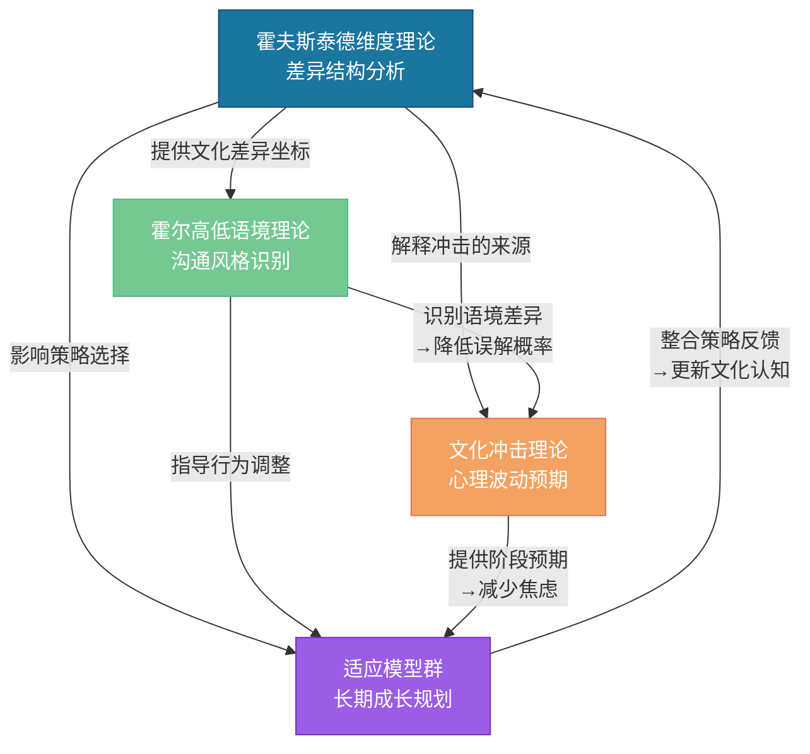
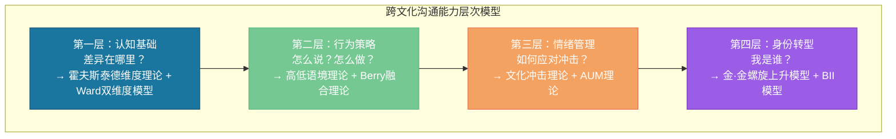

## 五、理论整合与实践意义

前面四节分别介绍了跨文化沟通领域的四大理论基石——霍夫斯泰德的文化维度理论、霍尔的高低语境文化理论、文化冲击理论，以及七大跨文化适应模型。每一种理论都从不同角度照亮了跨文化沟通这一复杂现象的某个侧面。但单独使用任何一种理论，都如同只带一把锤子去修理整台机器——你能解决一部分问题，但无法理解全局。

本节要做的，是将这四组理论编织成一张完整的认知之网：**它们各自回答什么问题？彼此之间如何互补？如何将理论转化为可执行的沟通策略？** 在此基础上，我们将深入探讨"文化智商"这一整合性能力框架，以及面对文化不断演变的现实，如何保持动态、开放的跨文化沟通视角。

### 5.1 四大理论的逻辑地图

#### 5.1.1 各理论回答的核心问题

跨文化沟通的知识体系可以被拆解为四个递进层次的问题。每一层问题对应一个核心理论：

| 层次 | 核心问题 | 对应理论 | 一句话概括 |
|:---:|----------|----------|------------|
| **第一层** | 文化差异在哪里？差异的结构是什么？ | 霍夫斯泰德文化维度理论 | 用六个可量化的维度定位任何两种文化之间的差异坐标 |
| **第二层** | 信息如何在不同文化中被编码和解码？ | 霍尔高低语境文化理论 | 沟通的有效性取决于你能否识别并适配对方的语境层级 |
| **第三层** | 进入新文化时，个体的心理会经历怎样的波动？ | 文化冲击理论 | 蜜月→挫折→调整→适应的情绪周期是可以预期和管理的 |
| **第四层** | 如何在新文化中实现长期的适应与身份成长？ | 跨文化适应模型群（Berry、Kim、Ward、AUM等） | 整合策略+螺旋上升+焦虑管理=可持续的跨文化成长路径 |

这四个层次构成了一个从"认知"到"沟通"到"体验"到"成长"的完整链条。如果缺少任何一环，跨文化沟通能力都是不完整的。

#### 5.1.2 理论间的互补关系

四大理论不是平行的，而是存在多条相互支撑的逻辑链：

**链路一：霍夫斯泰德 → 霍尔 = 从"知道差异"到"知道怎么说话"**

霍夫斯泰德告诉你"A文化权力距离高、集体主义"，但没有具体告诉你在这个文化里应该怎么说话。霍尔的高低语境理论补充了这一点：高权力距离+集体主义的文化通常是高语境文化——你需要"读空气"，需要理解言外之意，需要在关系建立之后才能谈正事。两个理论结合，你才能从抽象的"文化差异"落地到具体的"沟通策略"。

**链路二：霍夫斯泰德 + 霍尔 → 文化冲击理论 = 从"知道差异"到"理解为什么痛苦"**

文化冲击的本质是什么？是你在原有文化中习以为常的认知框架和行为模式在新文化中突然失效。霍夫斯泰德的维度差异越大（比如从个人主义文化到集体主义文化），冲击越深。霍尔的语境差异越大（比如从低语境的德国到高语境的日本），日常沟通中的挫败感越强。两个理论共同解释了文化冲击的强度来源。

**链路三：文化冲击理论 → 适应模型 = 从"理解痛苦"到"知道如何行动"**

文化冲击理论描述的是"你会经历什么"，适应模型回答的是"你应该怎么做"。金·金的螺旋上升模型将冲击重新定义为成长的催化剂；贝瑞的融合理论提供了策略选择的框架；AUM理论提供了管理焦虑的具体方法；Ward的双维度模型提供了监测适应状态的工具。没有冲击理论的预期管理，适应模型就失去了作用的对象。

**链路四：适应模型 → 霍夫斯泰德 = 从"行动"到"反馈"**

在适应过程中，你会不断获得新的文化观察和体验。这些体验反过来会更新你对文化维度的理解——你可能发现某个维度在实际中的表现与理论描述不同，或者发现某个你之前忽略的维度变得重要。这是一个持续的学习循环。

#### 5.1.3 整合分析案例

**案例：一位中国工程师被外派到日本东京工作**

让我们用四大理论的整合理论透镜，分析这位工程师可能面临的完整跨文化情境：

**第一步：用霍夫斯泰德维度定位差异坐标**

| 维度 | 中国得分 | 日本得分 | 差异幅度 | 预期影响 |
|------|:---:|:---:|:---:|----------|
| PDI（权力距离） | 80 | 54 | -26 | 日本的权力距离比中国低，但仍有明确的层级意识。注意：日本的等级更多基于年功序列（seniority）而非职位本身 |
| IDV（个人/集体） | 20 | 46 | +26 | 日本比中国更个人主义化，但仍然是集体主义文化。日本的"内/外"（uchi/soto）区分非常严格 |
| UAI（不确定性规避） | 30 | 92 | +62 | **最大差异**。日本的规则意识、流程标准化、风险规避远超中国，这是适应的核心挑战 |
| MAS（男性化） | 66 | 95 | +29 | 日本的竞争强度和工作投入度极高，注意过劳风险 |
| LTO（长期导向） | 87 | 88 | +1 | 几乎相同，双方都重视长期关系和持续投入 |
| IVR（放纵/克制） | 24 | 42 | +18 | 日本比中国略为放纵，但整体仍然克制 |

**结论**：最大差异在UAI（不确定性规避），这意味着这位工程师需要重点适应日本的规则文化——从文件格式到会议流程到邮件措辞，一切都有"正确的方式"。

**第二步：用霍尔理论分析沟通风格**

日本是典型的高语境文化。这意味着：

- 日本同事说"ちょっと難しいですね"（这个有点难呢）= "不行"
- 会议上长时间的沉默不是尴尬，而是在认真思考
- 初次见面的名片交换仪式（meishi koukan）有严格的双手递接、仔细阅读、放在桌上等步骤
- 拒绝邀请通常不会直接说"不"，而是说"考一下"或者"那天可能有安排"

中国也是高语境文化，所以表面上差距不大。但日本高语境的"编码规则"与中国不同——日本的含蓄更偏向于"不给人添麻烦"（迷惑をかけない），而中国的含蓄更偏向于"维护面子"。用中国式的含蓄去理解日本式的含蓄，可能产生误判。

**第三步：用文化冲击理论预判心理波动**

| 阶段 | 预期时间 | 预期表现 | 特殊风险 |
|------|----------|----------|----------|
| 蜜月期 | 第1-3个月 | 对日本的精致、秩序感、美食感到兴奋 | 可能低估实际挑战 |
| 挫折期 | 第3-8个月 | 对严格的规则文化感到窒息；语言障碍导致社交孤立；"过劳文化"的压力开始显现 | UAI差异（+62）可能导致极度挫败感 |
| 调整期 | 第8-14个月 | 开始理解规则背后的文化逻辑；找到同胞社区和部分日本朋友 | 可能出现"部分适应但深度疲惫"的停滞 |
| 适应期 | 第14个月后 | 发展出中日融合的工作风格；能够灵活切换文化框架 | 警惕"过度适应"——完全日本化后失去中国视角的优势 |

**第四步：用适应模型规划长期策略**

根据贝瑞的融合理论，推荐采用**整合策略**——保持中国文化根基的同时，有选择地吸收日本工作文化的优势。具体操作：

- **保持中国文化根基**（Berry的"保持原有文化"维度）：定期与中国家人朋友联络；保持中国式的关系网络；在适合的场合展现中国文化的创新和灵活性
- **积极学习日本文化**（Berry的"参与新文化"维度）：系统学习日语（不仅是语法，还包括敬语体系和商务日语）；理解日本的"读空气"文化；学习日本式的项目管理方法
- **管理焦虑**（AUM理论）：在UAI差异最大的领域（流程规则）主动降低不确定性——请一位日本同事做"文化导师"，遇到不确定的情境先咨询再行动
- **监测双维度适应**（Ward模型）：每月评估一次社会文化适应和心理适应。特别关注心理适应——日本的过劳文化可能在社会文化适应良好的情况下，悄悄侵蚀心理健康

### 5.2 理论整合的层次模型

四大理论的整合不仅是"叠加使用"，更需要理解它们在不同层次上的作用。以下模型将跨文化沟通能力分解为四个递进层次：

**第一层：认知基础** —— 你需要先"看到"差异，才能应对差异。霍夫斯泰德的六个维度提供了差异的坐标系，Ward的双维度模型让你知道"适应"包含社会文化技能和心理状态两个独立维度。这一层的核心输出是：**知道差异在哪里，知道适应的目标是什么**。

**第二层：行为策略** —— 知道差异之后，你需要具体的沟通行为指南。霍尔的高低语境理论告诉你"怎么说话"——直接还是间接、显性还是隐性、文字为主还是语境为主。贝瑞的融合理论告诉你"怎么定位自己"——保持多少原有文化、吸收多少新文化。这一层的核心输出是：**可执行的沟通行为策略**。

**第三层：情绪管理** —— 理论上知道怎么做，和在压力下实际能做到，是两回事。文化冲击理论让你预期情绪波动的到来（"我现在正处于挫折期，这是正常的"），AUM理论提供管理焦虑和不确定性的具体技术。这一层的核心输出是：**在困难时刻保持沟通能力的心理韧性**。

**第四层：身份转型** —— 最深层次的跨文化能力不是"学会了一套新的行为模式"，而是"成为了一个跨文化的人"。金·金的螺旋上升模型描述了这个过程，BII模型解释了为什么有些人能和谐地整合两种文化认同。这一层的核心输出是：**稳定的跨文化身份，能够在任何文化情境中自如运作**。

四个层次是递进的，但不是线性的——你不需要在第一层"完美"之后才能进入第二层。实际的跨文化成长是四个层次同时推进、相互促进的。但如果你发现某个层次出现了明显的短板，应该优先补齐那个层次。

### 5.3 文化智商（Cultural Intelligence, CQ）：整合性的能力框架

#### 5.3.1 什么是文化智商

"文化智商"（Cultural Intelligence, CQ）由克里斯托弗·厄利（Christopher Earley）和 Soon Ang 于2003年在《Cultural Intelligence: Individual Interactions across Cultures》一书中系统提出。CQ的概念诞生于一个实际需求：企业和组织需要一种可测量、可训练的指标来评估和发展员工的跨文化能力。如果说霍夫斯泰德理论回答的是"文化之间有什么差异"，那么CQ回答的是"一个人有多大能力去有效应对这些差异"。

CQ之所以成为跨文化能力领域的主流框架，是因为它解决了此前研究的三个痛点：

1. **碎片化问题**：此前的理论各自关注跨文化能力的某个侧面（知识、动机、技能），CQ将它们整合到一个统一框架中
2. **可测量性**：CQ开发了标准化的测量工具（CQS，Cultural Intelligence Scale），使得跨文化能力可以用数值进行量化评估
3. **可训练性**：CQ的四个维度都有明确的提升路径，不是"天赋"而是"可以培养的能力"

#### 5.3.2 CQ的四维度详解

CQ包含四个维度，每个维度对应跨文化能力的不同层面，也对应前面讨论的不同理论：

**维度一：元认知CQ（Metacognitive CQ）—— 做跨文化思考的思考者**

元认知CQ是你在跨文化互动**之前、之中、之后**有意识地反思和调整自己认知过程的能力。它是四个维度中最高阶的，也是最核心的。

| 低元认知CQ的表现 | 高元认知CQ的表现 |
|------------------|------------------|
| 不假思索地用自己的文化框架解释对方的行为 | 在解读对方行为前先暂停，问自己"这在他们的文化中可能意味着什么？" |
| 从不质疑自己的文化假设 | 持续检验自己的文化假设——"我以为对方在回避，但也许他们在表达尊重" |
| 犯了跨文化错误后归咎于对方 | 犯错后反思"我的哪个文化假设导致了这个误解？" |
| 用同一套沟通策略应对所有文化背景的人 | 根据对方的文化背景和个体特征调整策略 |

元认知CQ与AUM理论有直接对应关系——AUM理论中"管理不确定性"的核心机制就是元认知：你必须能够觉察自己的认知过程，才能识别和修正错误的文化假设。

**提升元认知CQ的实操方法：**

- **跨文化互动日志**：每次跨文化互动后花5分钟记录三个问题——(1) 这次互动中，我对对方行为做了什么假设？(2) 这些假设来自我自己的哪种文化框架？(3) 下次遇到类似情境，我可以怎样检验这些假设而非直接假定？
- **文化假设审计**：每月花30分钟回顾日志，寻找重复出现的文化假设模式。例如，如果你发现自己多次假设"对方的沉默=不同意"，这可能是一个需要修正的文化假设
- **角色互换思考**：在重要跨文化互动之前，花10分钟从对方的文化视角思考——"如果我是对方，我会怎么理解我即将说的话和做的事？"

**维度二：认知CQ（Cognitive CQ）—— 文化知识库**

认知CQ是你关于不同文化的知识储备——价值观、社会规范、法律制度、经济环境、宗教信仰、社交规则、沟通风格等。它对应霍夫斯泰德理论和霍尔理论提供的知识框架。

| 认知CQ的层次 | 内容 | 获取方式 |
|:---:|----------|----------|
| **基础知识** | 国家/地区的基本文化特征、宗教信仰、历史背景 | 书籍、纪录片、文化课程 |
| **理论知识** | 文化维度分数、高低语境特征、价值观体系 | 理论学习（本书所涵盖的内容） |
| **规范知识** | 具体的社交规则：称呼、送礼、餐桌礼仪、商务礼仪 | 文化指南、在线资源、专门的礼仪培训 |
| **经验知识** | 通过亲身经历积累的、关于特定文化的直觉和判断力 | 实际的跨文化互动和生活经历 |

**认知CQ的常见陷阱：**

- **知识错觉**：读了几本关于某文化的书，就认为自己"了解"了那个文化。书本知识是必要的起点，但真正的文化理解需要与实际经验不断校准
- **刻板印象化**：将文化知识当作"这个国家的人都这样"的刻板印象。文化知识应该是"假说"而非"结论"——它帮助你形成初始预期，但你必须对每个个体保持开放
- **知识滞后**：基于多年前获取的文化知识与当前现实脱节。中国年轻一代的价值观与十年前差异巨大，中东社会正在经历快速的现代化——文化知识需要持续更新

**维度三：动机CQ（Motivational CQ）—— 跨文化行动的内驱力**

动机CQ是你对参与跨文化互动的兴趣、自信和坚持意愿。它回答的问题是：**你有多大意愿去面对跨文化挑战？** 动机CQ对应贝瑞融合理论中"策略选择"的动机因素——是选择整合（需要高动机CQ）还是分离（低动机CQ的典型表现）。

动机CQ由三个子成分构成：

1. **内在兴趣**：你是否真的对其他文化感到好奇和着迷？这是最持久的动机来源
2. **自我效能感**：你是否相信自己能够有效应对跨文化挑战？过去的成功经验会增强自我效能感
3. **坚持意愿**：面对跨文化互动中的挫折和尴尬，你是否愿意继续尝试？

**提升动机CQ的实操方法：**

- **从兴趣出发**：如果你对日本动漫感兴趣，以此为切入点了解日本文化。兴趣驱动的学习比义务驱动的学习有效得多
- **渐进式挑战**：从低风险的跨文化互动开始（如在餐厅用英语点餐），逐步增加难度（如参加跨文化社交活动、做跨文化工作汇报）。每一次成功都会增强自我效能感
- **重新框架化失败**：将跨文化失误从"我搞砸了"重新定义为"我学到了"。金·金的螺旋上升模型提供了理论支撑——压力是成长的催化剂
- **寻找跨文化同伴**：加入跨文化交流社群，与有类似经历的人分享挑战和收获。看到他人从"菜鸟"成长为"高手"的过程，本身就是强大的动机来源

**维度四：行为CQ（Behavioral CQ）—— 灵活调整行为的能力**

行为CQ是你在跨文化情境中灵活调整语言行为和非语言行为的能力。它是其他三个维度的最终输出——你可能有了知识、有了动机、有了反思能力，但如果你在关键时刻无法调整自己的行为（语速、语调、身体距离、手势、面部表情、表达风格），所有内在能力都无法转化为实际效果。

| 行为CQ的子维度 | 具体内容 | 训练方法 |
|----------------|----------|----------|
| **语言行为调整** | 正式/非正式语体切换、直接/间接表达风格切换、语速和音量调整 | 与母语者对话练习、录音回放分析 |
| **非语言行为调整** | 眼神接触频率、身体距离、手势使用、面部表情控制 | 角色扮演、视频回放、跨文化肢体语言课程 |
| **表达风格切换** | 逻辑论证型vs叙事型、数据导向vs关系导向、个人表达vs集体表达 | 模拟不同文化场景的沟通练习 |
| **礼仪行为调整** | 问候方式、称呼习惯、送礼规则、餐桌礼仪 | 文化礼仪手册学习、观察当地人的行为模式 |

**行为CQ的关键挑战：**

行为CQ是四个维度中最"表面"的，但也是最需要实践积累的。你不可能仅通过阅读就学会日本式的鞠躬角度和递名片方式——你需要实际练习，需要在犯错中积累经验，需要从"刻意执行"到"自然流露"的转化过程。

#### 5.3.3 CQ四维度与四大理论的映射关系

| CQ维度 | 对应的核心理论 | 映射关系 |
|--------|---------------|----------|
| 元认知CQ | AUM理论（焦虑/不确定性管理） | 管理不确定性需要元认知——觉察自己的假设、监控自己的认知过程、根据反馈调整理解 |
| 认知CQ | 霍夫斯泰德维度理论 + 霍尔高低语境理论 | 文化知识的核心内容就是维度差异和沟通风格差异 |
| 动机CQ | Berry融合理论（策略选择） | 选择整合策略需要高动机CQ——兴趣、自信和坚持 |
| 行为CQ | 金·金综合理论（行为重构） | 螺旋上升模型中的"适应"具体体现在行为层面的调整能力 |

这种映射关系说明：CQ不是一个独立于传统理论的新理论，而是将四大理论的能力层面整合到了一个可测量、可发展的框架中。

#### 5.3.4 CQ的测量与评估

CQ可以通过标准化量表进行测量。最广泛使用的工具是**文化智力量表（CQS）**，由Ang等人于2007年发表。CQS包含20个题项，分别测量四个维度（每个维度5题）。以下是每个维度的典型题项（简化版），供读者进行自我评估：

**元认知CQ自测：**
1. 在与不同文化背景的人互动之前，我会思考自己的文化假设可能如何影响我对他们的看法
2. 在跨文化互动中，我会检查自己的理解是否准确
3. 当跨文化互动的结果与预期不同时，我会反思自己的判断过程

**认知CQ自测：**
1. 我了解不同文化的法律和经济体系
2. 我了解不同文化的价值观和宗教信仰
3. 我了解不同文化的社交规则和礼仪

**动机CQ自测：**
1. 我享受与不同文化背景的人互动
2. 我相信自己能够适应不同文化的社交规范
3. 面对跨文化互动中的困难，我会坚持而非退缩

**行为CQ自测：**
1. 我能够根据不同文化的情境调整自己的语速和语调
2. 我能够根据不同文化的情境调整自己的肢体语言
3. 我能够在不同文化情境中使用对方习惯的社交礼仪

**评分指南**：每个题项用1-7分自评（1=完全不符合，7=完全符合）。各维度平均分在5分以上表示该维度较强，3-5分表示需要提升，3分以下表示该维度是明显的短板。

#### 5.3.5 CQ提升的系统训练方案

提升CQ不是一蹴而就的事情，需要系统性的训练。以下是按时间线设计的12周训练方案：

**第1-3周：认知基础建设**

| 周次 | 重点 | 每日任务（15-30分钟） |
|:---:|------|----------------------|
| 第1周 | 理论框架 | 学习霍夫斯泰德六维度理论；查目标文化的维度分数；制作文化差异对照表 |
| 第2周 | 沟通风格 | 学习高低语境理论；收集目标文化的典型沟通案例；分析至少10个真实对话案例 |
| 第3周 | 文化规范 | 学习目标文化的核心社交规则（称呼、送礼、餐桌、会议、邮件）；观看该文化的影视作品并记录观察 |

**第4-6周：元认知能力建设**

| 周次 | 重点 | 每日任务（15-30分钟） |
|:---:|------|----------------------|
| 第4周 | 文化假设觉察 | 开始写跨文化互动日志；每天记录至少一个文化假设及其来源 |
| 第5周 | 视角切换练习 | 阅读目标文化作者写的文章或博客；尝试从该文化视角理解一个争议性话题 |
| 第6周 | 认知偏差识别 | 学习常见的跨文化认知偏差（民族中心主义、确认偏差、光环效应）；回顾之前的日志识别偏差模式 |

**第7-9周：动机和信心建设**

| 周次 | 重点 | 每日任务（15-30分钟） |
|:---:|------|----------------------|
| 第7周 | 低风险互动 | 与目标文化背景的人进行简单对话（问候、点餐、问路）；记录成功体验 |
| 第8周 | 中等风险互动 | 参加一个跨文化社交活动或语言交换聚会；主动发起至少3次对话 |
| 第9周 | 挑战性互动 | 尝试一个有挑战性的跨文化场景（如表达不同意见、处理误解）；事后进行深度反思 |

**第10-12周：行为能力打磨**

| 周次 | 重点 | 每日任务（15-30分钟） |
|:---:|------|----------------------|
| 第10周 | 语言行为调整 | 练习目标文化的沟通风格（直接/间接、正式/非正式）；录音回放对比 |
| 第11周 | 非语言行为调整 | 练习眼神接触、身体距离、手势、面部表情的文化适配；视频回放对比 |
| 第12周 | 综合演练 | 模拟一个完整的跨文化场景（如跨文化面试、跨文化谈判）；请跨文化经验丰富的导师给反馈 |

### 5.4 动态文化观：理论的局限与现实的复杂性

#### 5.4.1 为什么需要动态文化观

前面讨论的所有理论都有一个共同的局限：它们倾向于将文化视为**相对稳定**的特征集合。霍夫斯泰德的维度分数基于几十年前的数据，霍尔的高低语境分类基于20世纪中期的观察，甚至最新的CQ框架也主要描述的是"对已有文化差异的应对能力"。

但现实是：**文化在加速变化**。以下是推动文化变化的六大核心力量：

| 变化力量 | 影响机制 | 典型案例 |
|----------|----------|----------|
| **全球化** | 跨国企业、国际贸易、国际组织创造了大量跨文化接触点，使得文化边界日益模糊 | 中国的Z世代（1995-2010年出生）在个人主义维度上的得分显著高于父辈 |
| **互联网与社交媒体** | 信息传播打破了地理和文化的隔离，年轻人可以实时接触到全球文化 | 韩国流行文化（K-pop、韩剧）的全球传播深刻影响了东南亚年轻人的消费观和审美观 |
| **人口流动** | 大规模移民、留学、外派创造了越来越多的双文化/多文化个体 | 加拿大有超过20%的人口出生在国外，多伦多被称为"世界上最多元文化的城市" |
| **教育国际化** | 国际学校、海外留学、在线课程使得年轻一代在更早的阶段接触多元文化 | 中国留学生群体（超过60万人在海外学习）发展出了独特的"海归文化" |
| **经济结构转型** | 从农业社会到工业社会到知识经济社会的转型，根本性地改变了社会价值观 | 中国从"节俭是美德"到"消费升级"的转变，反映了LTO和IVR维度的变化 |
| **政治和社会运动** | 女性主义、LGBTQ+权利运动、环保运动等正在重塑许多文化的价值观 | 北欧国家的性别平等运动使得MAS维度的含义本身发生了变化 |

#### 5.4.2 个体差异大于文化群体差异

任何文化理论的一个根本性局限是：**它们描述的是群体趋势，而非个体特征。** 一个来自"高权力距离"文化的人可能非常平等开放，一个来自"低语境"文化的人可能非常含蓄委婉。

在实际的跨文化沟通中，你需要在两个极端之间找到平衡：

| 极端一：文化盲 | 平衡点：文化敏感的个体主义 | 极端二：文化决定论 |
|:---:|:---:|:---:|
| "我不看对方的文化背景，我只把他当作个人" | "我了解对方的文化背景作为起点假设，但我根据实际互动来调整" | "对方来自X文化，所以他一定是这样的" |
| **风险**：忽略了真实存在的文化差异，可能反复犯同样的错误 | **优势**：既利用了文化知识的预测力，又保持了对个体的开放性 | **风险**：把文化知识变成了刻板印象，忽视了个体的独特性 |

实操建议：

1. **将文化知识作为"初始假说"而非"最终判断"**。遇到一个日本人时，用高低语境理论形成初始预期（"他可能比较含蓄"），但在实际互动中保持开放——如果他非常直接，不要觉得"他不像日本人"，而是更新你的理解
2. **关注个体的文化混合度**。全球化时代的很多人是"文化混合体"——一个在美国留学5年的中国年轻人，可能在工作场景中表现出低语境+个人主义的特征，但在家庭场景中仍然保持高语境+集体主义的传统
3. **区分"文化驱动"和"个人驱动"的行为**。一个人的沉默可能是因为文化习惯（高语境文化中的"读空气"），也可能是因为个人性格（内向），或者当前情境（在思考一个复杂问题）。不要急于用文化来解释一切

#### 5.4.3 亚文化的复杂性

"中国文化"和"美国文化"这样的标签掩盖了巨大的内部差异。在运用文化理论时，必须考虑亚文化层次的差异：

**地域亚文化**：中国北方人的沟通风格比南方人更直接；美国东海岸的商务文化比西海岸更正式；意大利北部和南部在工作态度和时间观念上差异显著。

**代际亚文化**：中国的80后、90后、00后在个人主义/集体主义维度上呈现出明显的代际梯度。日本的"宽松世代"（ゆとり世代，1987年后出生）与前辈在竞争态度上差异显著。

**职业亚文化**：全球的程序员文化有相当高的同质性（开源精神、扁平化、技术导向），可能比国家文化差异更能预测一个中国程序员和一个硅谷程序员之间的沟通风格。

**教育亚文化**：受过高等教育的群体通常在个人主义、开放性、不确定性规避上与同文化的低教育群体有显著差异。

**宗教亚文化**：同一个国家内的不同宗教群体可能在价值观上有巨大差异。马来西亚的马来穆斯林、华人和印度裔在文化维度上的差异可能比某些国家间的差异还大。

#### 5.4.4 "第三文化"与"全球公民"现象

全球化催生了一种新的文化现象：**第三文化儿童（Third Culture Kids, TCK）** 和 **全球公民（Global Citizens）**。

第三文化儿童是在不同于父母文化（第一文化）的国家或地区长大的孩子。他们不属于父母的文化，也不完全属于成长地的文化，而是发展出了一种独特的"第三文化"——一种融合了多种文化元素的混合身份。研究估计，全球有数百万TCK，他们通常具有更高的跨文化敏感度和更强的文化切换能力，但也可能面临"哪里都不是家"的身份困惑。

更广泛地看，全球化催生了一个"全球公民"群体——他们可能在多个国家生活过、使用多种语言、在跨国团队中工作。对他们来说，国家文化的标签意义减弱，"跨文化能力"不再是"适应某一种特定文化"，而是"能够快速适应任何文化"。

这对传统跨文化理论的启示是：理论框架需要从"如何理解A文化vs B文化"扩展到"如何发展与任何文化高效互动的通用能力"。CQ框架在这个方向上迈出了重要一步，但仍有发展空间。

### 5.5 从理论到实践：跨文化沟通的整合作战框架

#### 5.5.1 TRIP模型：跨文化沟通的四步决策框架

基于四大理论的整合，我们提出一个简称为TRIP的跨文化沟通决策框架：

**T — Target（目标定位）：用霍夫斯泰德理论定位文化差异坐标**

在任何跨文化互动之前，花10分钟回答以下问题：
- 对方文化在六个维度上的大体位置在哪里？
- 最大的差异维度是什么？（通常2-3个维度是最关键的）
- 这些差异会如何影响当前的沟通场景？

**R — Route（路线选择）：用霍尔理论确定沟通风格路线**

根据语境差异确定你的沟通策略：
- 对方是高语境还是低语境？
- 你需要更多依赖显性沟通（明确的语言表达）还是隐性沟通（关系、语境、非语言信号）？
- 你应该如何调整自己的表达方式？

**I — Inner State（内在状态管理）：用文化冲击理论和AUM理论管理心理状态**

在互动过程中持续监控自己的心理状态：
- 我当前的焦虑水平如何？（AUM理论）
- 我是否正在经历文化冲击的某个阶段？（文化冲击理论）
- 我可以使用什么策略来降低焦虑和不确定性？

**P — Path Forward（长期路径规划）：用适应模型规划长期策略**

每次互动都是长期适应路径上的一个节点：
- 我采取的是什么适应策略？（Berry理论）
- 这次互动如何促进了我的螺旋上升？（Kim理论）
- 我在社会文化适应和心理适应两个维度上的发展是否均衡？（Ward模型）

#### 5.5.2 高频场景速查表

以下表格将四大理论的核心洞察压缩为高频跨文化场景的速查指南：

| 场景 | 霍夫斯泰德洞察 | 霍尔洞察 | 文化冲击/情绪管理 | 适应策略建议 |
|------|---------------|----------|-------------------|-------------|
| **初次见面** | 查PDI和IDV确定称呼方式和亲疏距离 | 查语境层级确定寒暄的长度和深度 | 蜜月期可能过于热情；挫折期可能过于退缩 | 保持适度的友好和好奇心，观察对方的反应再调整 |
| **提出异议** | 高PDI文化：私下、委婉；低PDI文化：直接、公开 | 高语境文化：暗示或通过第三方传达；低语境文化：明确陈述 | 焦虑来自"不确定这样说是否得体"——先了解该文化的异议表达规范 | 根据PDI和语境层级组合确定策略：高PDI+高语境=最间接；低PDI+低语境=最直接 |
| **谈判** | 查UAI确定对细节和规则的要求；查LTO确定时间框架预期 | 查语境层级确定谈判风格——高语境重关系，低语境重条款 | 挫折期可能对对方的"不按常理出牌"感到愤怒——提醒自己这是文化差异 | 初期投入时间建立关系（尤其高语境文化），中期聚焦差异维度最大的领域 |
| **冲突处理** | 查MAS确定竞争vs合作倾向；查IDV确定面子机制 | 高语境冲突通常不直接表达，低语境冲突倾向于正面对话 | 焦虑管理是关键——冲突场景最容易触发文化冲击的情绪反应 | Berry整合策略：保持自己的冲突处理方式的合理部分，学习对方方式的合理部分 |
| **团队协作** | 查PDI确定决策模式（集中vs分散）；查IDV确定个人贡献vs集体贡献的平衡 | 查语境层级确定会议沟通风格 | U型曲线谷底时团队协作最容易出问题——此时焦虑最高、能力最低 | AUM策略：在高焦虑时期主动降低不确定性（找文化导师、提前了解规则） |

#### 5.5.3 常见整合性误区与纠正

| 误区 | 为什么是错的 | 纠正方法 |
|------|-------------|----------|
| "我学了理论就够了" | 理论是地图，不是领土。知道高低语境理论不等于你能读懂一个日本人的沉默 | 理论学习之后必须进入实践。先在低风险场景中练习，逐步增加难度 |
| "对方的文化维度分数是X，所以他一定是这样的" | 维度分数是统计趋势，不是个人标签。个体差异、亚文化差异、情境差异都会影响实际行为 | 用文化知识形成初始假说，用实际观察来验证和修正 |
| "我要完全融入对方的文化" | Berry的实证研究表明，整合策略（保持+参与）优于同化策略（放弃+参与）。完全融入可能意味着失去你的文化优势 | 有选择地学习新文化的优势元素，同时保持你的文化根基 |
| "文化冲击说明我不适应" | 文化冲击是正常的、普遍的心理现象，是成长的必经阶段。金·金的理论明确指出：压力是成长的催化剂 | 预期冲击的到来，在挫折期提醒自己"这是螺旋上升的一部分" |
| "语境差异只存在于国家之间" | 同一国家的不同行业、不同代际、不同教育水平的群体之间也存在语境差异 | 在评估语境层级时，同时考虑国家文化、行业文化、组织文化和个人因素 |
| "我不会经历文化冲击，因为我去过很多国家" | 跨文化经历可以降低冲击的深度和持续时间，但不能完全消除。而且"适应疲劳"在多次跨文化经历后可能出现 | 不管有多少经验，都要保持对新文化环境的敬畏和学习态度 |
| "焦虑是坏事，我应该消除它" | AUM理论指出，适度的焦虑是跨文化互动的正常伴随物，完全无焦虑可能导致"过度自信"（低焦虑+高不确定性=最危险的状态） | 目标不是消除焦虑，而是将焦虑管理到可操作的水平——既足够警觉，又不被恐惧瘫痪 |

### 5.6 进阶：理论的前沿发展与新兴视角

#### 5.6.1 多元文化心智（Polycultural Mind）

传统跨文化理论关注的是"A文化vs B文化"的二元对立。但全球化时代越来越多的人同时接触多种文化——一个在上海工作的印度人，可能同时受到印度文化、中国文化、跨国公司文化和全球互联网文化的影响。

2010年，心理学家 Chi-Yue Chiu 和 Ying-Yi Hong 提出了"多元文化心智"（Polycultural Mind）的概念。与传统的"双文化身份"不同，多元文化心智强调的是：现代人不是在两种文化之间切换，而是同时拥有多种文化框架，能够根据情境灵活调用。

这一概念对CQ框架的启示是：未来的行为CQ可能不仅包括"在两种文化之间切换"的能力，还包括"同时激活多种文化框架"的能力。

#### 5.6.2 文化神经科学视角

fMRI（功能性磁共振成像）研究为跨文化能力提供了生物学层面的证据：

- **文化框架切换的神经基础**：研究发现，双文化个体在切换文化框架时，大脑的执行控制网络（前扣带回皮层和背外侧前额叶皮层）被激活。这与语言切换的神经机制有重叠，说明文化切换和语言切换共享部分认知资源
- **跨文化共情的神经机制**：fMRI研究表明，当人们看到与自己文化背景相似的人经历痛苦时，前脑岛和前扣带回的激活更强。但经过跨文化训练后，这种"内群体偏好"可以被减弱
- **文化学习的神经可塑性**：长期的跨文化经历可以改变大脑的默认文化框架处理方式。这意味着，从神经科学的角度看，"成为一个跨文化的人"不仅是心理层面的转变，也是大脑层面的重塑

#### 5.6.3 人工智能时代的跨文化沟通

AI翻译工具（如DeepL、Google Translate、ChatGPT）正在改变跨文化沟通的面貌。这一变化对理论框架提出了新问题：

- **语言障碍降低后，文化障碍是否自动降低？** 答案是否定的。AI可以准确翻译文字，但无法翻译语境——它无法告诉你"ちょっと難しい"在这个特定情境下意味着"绝对不行"还是"我需要考虑一下"
- **AI是否能替代CQ？** 在认知CQ层面（提供文化知识），AI已经非常强大。但在元认知CQ（反思自己的文化假设）、动机CQ（保持跨文化好奇心）和行为CQ（灵活调整非语言行为）层面，AI无法替代人的能力
- **远程工作的文化挑战**：疫情后远程工作的普及创造了新的跨文化沟通情境——你可能每天与5个不同国家的同事进行视频会议。这种"高频低深度"的跨文化互动，与传统的"低频高深度"外派经历，对CQ的要求有何不同？这是理论研究的新前沿

### 5.7 本节核心要点回顾

| 要点 | 关键内容 |
|------|----------|
| **四理论互补** | 霍夫斯泰德定位差异、霍尔指导沟通风格、文化冲击理论预期情绪波动、适应模型规划长期策略——四者缺一不可 |
| **四层次递进** | 认知基础→行为策略→情绪管理→身份转型，跨文化能力在四个层次同时推进 |
| **CQ是整合框架** | 元认知CQ（反思能力）、认知CQ（文化知识）、动机CQ（内驱力）、行为CQ（行为灵活性）——四维度可测量、可训练 |
| **动态文化观** | 文化在加速变化，个体差异大于群体差异，亚文化差异不可忽视，避免把理论当作刻板印象 |
| **TRIP决策框架** | Target（定位差异）→ Route（选择沟通路线）→ Inner State（管理心理状态）→ Path Forward（规划长期路径） |
| **理论是起点不是终点** | 最有效的跨文化沟通者，是那些既掌握理论框架，又对每个个体保持开放和好奇的人 |

***

