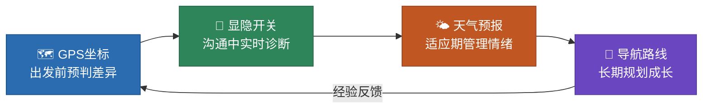
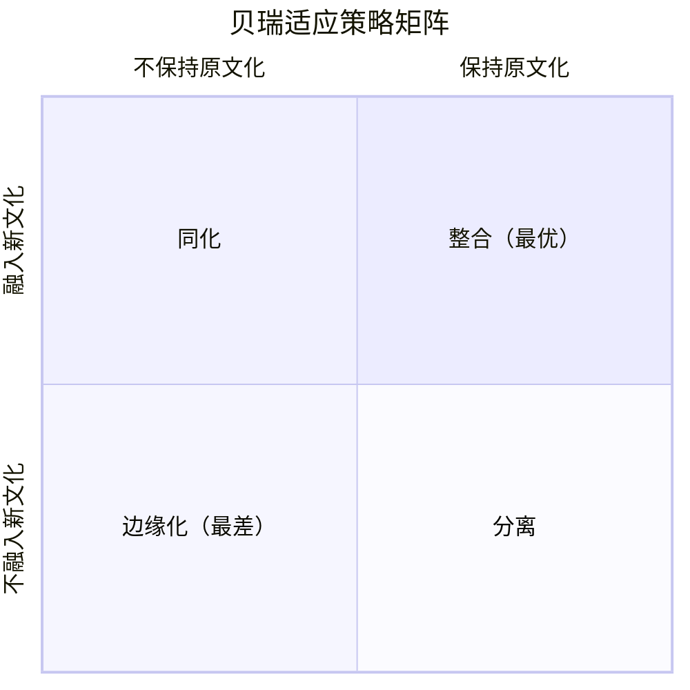
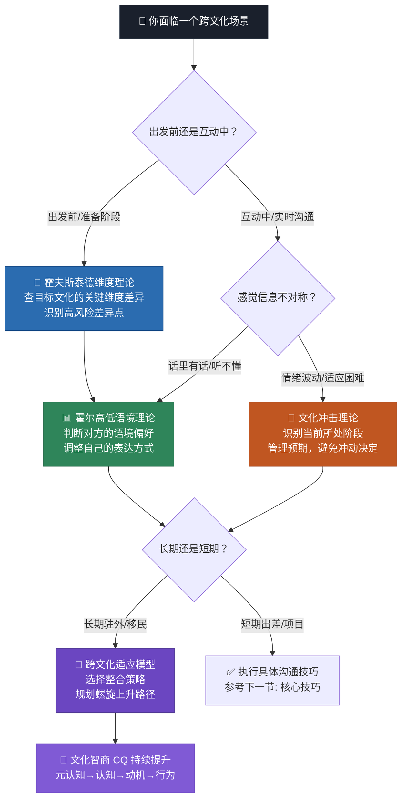

## 本节小结：理论基础的全景回顾与能力自检

本节用了六篇内容系统拆解了跨文化沟通的四大理论基石。在进入下一节的核心技巧之前，这篇小结承担三个任务：**第一**，帮你把分散的知识点压缩为可快速调用的心智模型；**第二**，提供一套自检工具让你知道自己的掌握程度和薄弱环节；**第三**，指出从"知道理论"到"用好理论"之间最容易踩的坑。

### 一、四大理论的"一句话心智模型"

记忆大量细节没有意义。每个理论你需要内化的只有一个核心隐喻——在真实场景中能条件反射式调用的那种。

| 理论 | 核心隐喻 | 一句话记忆 | 何时调用 |
|------|---------|-----------|---------|
| **霍夫斯泰德文化维度** | 文化的"GPS坐标" | 六个维度给每种文化定位，告诉你差异在哪个轴上最大 | 接触新文化**之前**做预判，识别高风险差异点 |
| **霍尔高低语境** | 信息的"显隐开关" | 高语境靠暗示和关系，低语境靠明说和文字 | 感觉"话里有话"或"说得太直"**之时**做诊断 |
| **文化冲击理论** | 情绪的"天气预报" | 蜜月→挫折→调整→适应是可以预期的四季轮回 | 在海外生活/工作中情绪低落**之际**做自我安抚 |
| **跨文化适应模型** | 成长的"导航路线" | 整合策略最优，螺旋上升才是常态 | 对长期跨文化生活做规划**之时**选策略 |

这四个隐喻构成了一个完整的行动链条：

### 二、知识速查卡片

以下是每个理论最核心的知识点压缩版。建议在实际跨文化场景中随用随查。

#### 2.1 霍夫斯泰德六维度速查

| 维度 | 低分端特征 | 高分端特征 | 沟通中最容易踩的坑 |
|------|-----------|-----------|-------------------|
| **权力距离（PDI）** | 平等协商，直呼其名 | 等级分明，使用尊称 | 低PDI者在高PDI文化中越级汇报被视为不尊重；高PDI者在低PDI文化中过度谦卑被视为缺乏主见 |
| **个人/集体主义（IDV）** | "我"为中心，个人成就 | "我们"为中心，群体和谐 | 个人主义者公开表扬某人会让团队其他人尴尬；集体主义者拒绝表态让个人主义者觉得不坦诚 |
| **不确定性规避（UAI）** | 接受模糊，灵活应变 | 需要规则，厌恶模糊 | 低UAI者给出模糊方案让高UAI者焦虑不安；高UAI者坚持流程让低UAI者觉得死板 |
| **男性化/女性化（MAS）** | 重视生活质量与合作 | 重视竞争成就与效率 | 高MAS文化的直接竞争风格在低MAS文化中被视为攻击性；低MAS文化的妥协风格在高MAS文化中被视为软弱 |
| **长期/短期导向（LTO）** | 关注当下结果 | 关注长远回报 | 短期导向者催促签合同让长期导向者觉得急功近利；长期导向者花时间建关系让短期导向者觉得浪费时间 |
| **放纵/克制（IVR）** | 自我约束，严肃节制 | 享受生活，表达自由 | 放纵文化中的幽默和情感表达在克制文化中被视为不专业；克制文化的冷淡在放纵文化中被视为不友好 |

**使用方式：** 在接触新的文化对象之前，花5分钟查阅该文化在六个维度上的大致得分（可参考 Hofstede Insights 官网 hofstede-insights.com），识别与自己文化差异最大的2-3个维度，把注意力集中在这几个维度上。

#### 2.2 高低语境判断清单

在实际沟通中，以下信号帮你快速判断对方的语境偏好：

**高语境信号（对方可能更依赖隐含信息）：**
- 沟通前花大量时间寒暄、建立关系
- 拒绝时不说"不"，而是说"这有点困难""我需要再考虑"
- 负面反馈通过第三方传达，或用非常委婉的方式
- 邮件/消息开头有大段问候和铺垫
- 会议中沉默不代表同意，可能是在表达不同意见
- "面子"是一个重要考量因素
- 非语言信号（表情、语气、身体语言）承载大量信息

**低语境信号（对方可能更依赖明确文字）：**
- 快速进入正题，寒暄简短
- 拒绝时直接说"不行""我不同意"
- 负面反馈当面给出，附具体理由
- 邮件开门见山，要点列在最前面
- 沉默意味着在思考，表达不同意见会直接说出来
- 书面记录和合同被视为最重要的依据
- 语言文字本身承载全部信息

**关键认知：** 高低语境不是非此即彼的标签，而是一个连续光谱。每个人在不同场景中会滑动——同一个日本人在写技术文档时可能是低语境的，在拒绝社交邀请时是高语境的。你要判断的不是"这个人是高语境还是低语境"，而是"**此刻这个场景中**，对方更依赖显性信息还是隐性信息"。

#### 2.3 文化冲击四阶段应对速查

| 阶段 | 典型时间 | 核心体验 | 最大的风险 | 应对要点 |
|------|---------|---------|-----------|---------|
| **蜜月期** | 0-3个月 | 兴奋、好奇、正面滤镜 | 过度乐观，忽视潜在问题 | 趁热情高时建立社交网络和生活基础 |
| **挫折期** | 3-6个月 | 疲惫、烦躁、想家、挑剔 | 冲动决定（辞职、退学、断绝社交） | **不在此阶段做重大人生决定**；找到1-2个可以倾诉的对象 |
| **调整期** | 6-12个月 | 理解增加、情绪稳定 | 停止在"够用就行"的舒适区 | 主动挑战更高难度的跨文化场景 |
| **适应期** | 1-2年+ | 灵活切换、双文化身份 | 忽略逆向文化冲击的准备 | 保持与母文化的连接，为回国做心理准备 |

**最容易被忽略的一点：逆向文化冲击。** 回国后你可能发现自己不适应了——觉得国内节奏太快或太慢、沟通太直接或太含蓄、社交规则变了。这不是你"变了"，而是你的参照系变了。提前预期这个阶段，能避免大量困惑和自我怀疑。

#### 2.4 贝瑞四种适应策略速查

| 策略 | 保持原文化 | 融入新文化 | 典型表现 | 适用情境 |
|------|-----------|-----------|---------|---------|
| **整合** | ✅ | ✅ | 在工作中遵循新文化规范，在家中保持母文化传统，能在两个世界间自如切换 | 东道主社会包容多元文化时的最优选择 |
| **同化** | ❌ | ✅ | 刻意淡化母文化特征，全面采纳新文化的行为方式 | 短期出差、需要快速融入单一文化环境时 |
| **分离** | ✅ | ❌ | 生活在"文化飞地"中，只在本族裔圈子里社交 | 临时旅居、不打算长期定居时 |
| **边缘化** | ❌ | ❌ | 既丢失了母文化认同，也无法融入新文化 | 这不是主动选择，而是被迫的结果，通常与最差的心理适应相关 |

### 三、CQ文化智商：四大理论的最终汇聚点

四大理论不是孤立的知识点，它们共同指向一个可训练的能力体系——**文化智商（Cultural Intelligence, CQ）**。CQ由Earley和Ang在2003年提出，包含四个维度：

| CQ维度 | 通俗定义 | 对应的理论基础 | 自评问题 |
|--------|---------|-------------|---------|
| **元认知CQ** | "我知道自己不知道什么" | 所有理论的基础 | 我是否在跨文化互动中主动觉察自己的文化假设？我是否会在互动后复盘？ |
| **认知CQ** | "我了解不同文化的运作方式" | 霍夫斯泰德+霍尔 | 我能否说出目标文化在关键维度上的特征？我是否了解其沟通风格偏好？ |
| **动机CQ** | "我愿意面对跨文化挑战" | 文化冲击理论+AUM理论 | 遇到跨文化挫折时我是退缩还是坚持？我是否主动寻求跨文化互动机会？ |
| **行为CQ** | "我能灵活调整自己的行为" | 跨文化适应模型 | 我能否根据对方的文化背景调整语速、音量、手势、表达方式？ |

**CQ的真正价值不是让你变成另一个人，而是让你在保持自我的同时，拥有更多"行为菜单"。** 一个高行为CQ的人不是在模仿对方的文化，而是在自己的行为选项中增加了来自其他文化的方式，然后根据场景灵活选择。

### 四、从"知道"到"用好"：最常见的五个应用错误

掌握理论知识只是第一步。以下五个错误是跨文化理论应用中最常见的陷阱，每个都附有具体场景和纠正方法。

#### 错误一：把维度分数当个人标签

**错误场景：** "日本的权力距离指数是54，所以日本人对权威的态度是……"然后用这个结论去预判每一个日本同事的行为。

**为什么错：** 维度分数描述的是一个国家几万人调查的**统计分布中心**，不是每个人的性格画像。日本的PDI=54意味着整体上比美国（40）更接受权力不平等，但日本有大量平等主义倾向的个体，尤其是在科技、创意等行业。

**纠正方式：** 把维度分数当作"初始假设"而非"最终结论"。在接触具体个体时，用实际观察来验证或推翻假设。正确的心理台词是"这个文化**倾向**于X，让我看看这个人是否符合"，而不是"这个文化**就是**X"。

#### 错误二：忽略文化内部的亚文化差异

**错误场景：** 用"中国文化"的笼统描述去理解来自深圳的95后创业者和来自甘肃县城的60后公务员。

**为什么错：** 一个国家内部的代际差异、地域差异、城乡差异、行业差异、教育水平差异，其幅度可能不亚于某些国家之间的差异。硅谷的技术团队和华尔街的金融团队虽同在美国，沟通风格可能截然不同。

**纠正方式：** 在使用文化维度理论时，始终追问三个过滤层：
1. **国家文化层**——这个国家整体倾向是什么？
2. **亚文化层**——这个人的地域/代际/行业/教育背景如何修正上述倾向？
3. **个人层**——这个具体的人在实际互动中表现出什么特征？

只做第一层就下结论，是最常见的偷懒方式。

#### 错误三：把"文化差异"当成所有沟通失败的挡箭牌

**错误场景：** 和外国同事沟通出了问题，第一反应是"文化差异嘛"，然后不再深究。

**为什么错：** 沟通失败的原因有很多——信息不完整、表达不清晰、情绪管理不当、缺乏专业背景、时间压力导致的草率——文化差异只是其中一种可能。如果你把所有失败都归因于文化差异，你就永远不会去改善那些真正需要改善的个人沟通能力。

**纠正方式：** 沟通失败时，按照以下顺序排查：
1. **信息因素**——我说清楚了吗？信息完整吗？对方确认理解了吗？
2. **关系因素**——我们之间的信任够不够？关系基础是否牢固？
3. **情境因素**——时间、场合、压力是否影响了沟通质量？
4. **个人因素**——我的情绪状态、表达能力、倾听质量是否有问题？
5. **文化因素**——以上都排除后，是否确实存在文化框架的差异？

**文化差异是最后一层归因，不是第一层。**

#### 错误四：过度泛化高低语境

**错误场景：** "中国人是高语境文化，所以跟中国人沟通不能太直接"——然后对所有中国人都用含蓄暗示的方式。

**为什么错：** 高低语境不仅因人而异，还因**场景**而异。同一个中国人在商务谈判中可能是高语境的（铺垫很长、拒绝委婉），但在写技术文档时是低语境的（要求精确、不接受模糊）。一个程序员向另一个程序员解释bug时，不管在哪个文化中都是低语境的。

**纠正方式：** 不要问"这个人是高语境还是低语境"，而是问"**这个场景中**信息更可能通过显性渠道还是隐性渠道传递"。场景特征（正式程度、关系深度、信息类型、时间压力）比文化标签更能预测语境水平。

#### 错误五：忽视数字时代对语境的压缩效应

**错误场景：** 用传统面对面交流的高低语境理论去理解Slack消息、邮件或视频会议中的沟通。

**为什么错：** 数字沟通环境天然地压缩了语境信息。文字消息丢失了语气、表情、身体语言；异步沟通丢失了即时反馈；视频会议虽然恢复了部分视觉信息，但仍然丢失了大量微妙的非语言线索。这意味着**在数字环境中，所有文化都被推向了更低语境的方向**——即使是来自极高语境文化的人，在纯文字沟通中也不得不更加明确地表达。

**纠正方式：** 在数字跨文化沟通中，主动增加显性信息的密度：
- 重要信息用文字明确表达，不要假设对方能"读出来"
- 在文字消息中增加情绪标记（emoji、语气词）来补偿丢失的非语言信息
- 有歧义时打电话或视频确认，不要在文字上来回猜测
- 对来自高语境文化的伙伴，给更多的解读时间，不要催促即时回复

### 五、理论速查：四组理论的关系全景图

当你在实际场景中需要同时调用多个理论时，以下关系图帮你快速定位应该先用哪个、再用哪个：

### 六、自检清单：你的理论掌握程度

在进入下一节之前，用以下清单评估自己对四大理论的掌握程度。每一项如果你能不回看内容就给出清晰回答，标记为✅；如果需要翻回去确认，标记为❌。目标是全部✅。

**霍夫斯泰德文化维度理论（共5项）：**
- [ ] 我能说出六个维度的名称和各自的高低端含义
- [ ] 我能举例说明每个维度如何影响具体沟通行为（比如权力距离如何影响称谓方式）
- [ ] 我知道维度分数是统计趋势而非个人标签，并能说出正确使用方式
- [ ] 我能说出至少2-3个文化在关键维度上的大致分数差异
- [ ] 我知道维度理论的局限性（亚文化差异、时代变化、个体变异）

**霍尔高低语境文化理论（共5项）：**
- [ ] 我能解释高语境和低语境的核心区别，并各举2-3个文化示例
- [ ] 我能说出高语境沟通的"五层结构"或至少三层
- [ ] 我能在实际对话中识别出对方处于高低语境光谱的什么位置
- [ ] 我知道数字时代如何改变了语境水平
- [ ] 我能说出高低语境文化在冲突处理、反馈方式、关系建立上的具体差异

**文化冲击理论（共5项）：**
- [ ] 我能说出文化冲击四阶段的名称、大致时间框架和核心体验
- [ ] 我能说出每个阶段的最大风险和应对策略
- [ ] 我知道逆向文化冲击的存在及其特征
- [ ] 我能区分U型曲线、W型曲线和Bennett六阶段模型的适用场景
- [ ] 我能为一个刚进入挫折期的朋友提供具体的、基于理论的建议

**跨文化适应模型（共5项）：**
- [ ] 我能说出贝瑞四种适应策略的名称和各自的"保持原文化/融入新文化"特征
- [ ] 我能解释金·金的"压力-适应-成长"螺旋模型的核心逻辑
- [ ] 我能区分社会文化适应和心理适应两个维度
- [ ] 我知道AUM理论如何管理跨文化焦虑和不确定性
- [ ] 我能说出文化智商（CQ）的四个维度及其对应的理论基础

**得分说明：**
- **20-25项✅：** 理论基础扎实，可以进入核心技巧学习
- **15-19项✅：** 基本掌握，建议重点复习标记❌的部分
- **10-14项✅：** 需要回头重读对应的理论详解章节
- **10项以下✅：** 建议从引言开始重新系统学习本节

### 七、三个深化理解的反思问题

知识只有经过反思才能内化。以下三个问题没有标准答案，但值得你花5分钟认真思考：

**反思一：你的默认文化操作系统是什么？**

每个人都在不知不觉中运行着一套"默认设置"。你在沟通中默认是直接还是含蓄？你默认是先谈事还是先谈关系？你默认异议应该当面提出还是私下沟通？花一分钟写下你的三个默认设置，然后想想这些默认值在另一种文化中会如何被解读。

**反思二：你经历过的最深的"文化错位感"是什么？**

回想一次你在跨文化场景中感到困惑、不舒服或被误解的经历。用四大理论去重新分析那次经历：当时差异发生在哪个维度上？信息是被高语境编码的还是低语境编码的？你当时处于文化冲击的哪个阶段？你采取了什么适应策略？这种"用理论重新解读经验"的练习，比读十遍理论更能加深理解。

**反思三：你在哪个CQ维度上最强，哪个最弱？**

元认知CQ（觉察自己的假设）、认知CQ（了解文化知识）、动机CQ（愿意面对挑战）、行为CQ（灵活调整行为）——你觉得自己在哪方面做得最好？哪方面最需要提升？下一节的核心技巧主要训练的是行为CQ，但如果你的元认知CQ不够强，你可能根本意识不到自己需要调整行为。

### 八、向下一节过渡：从"知"到"行"

四大理论给你的是**分析能力**——看到差异在哪里、理解信息如何传递、预判情绪如何波动、规划长期成长路径。但分析能力不等于行动能力。你可以精确地分析出"这是高语境沟通，我需要关注言外之意"，但如果你不知道具体该关注哪些信号、如何回应、如何调整自己的表达方式，分析就只是纸上谈兵。

下一节**"核心技巧"**要做的，就是把理论分析转化为可执行的沟通行为：

| 技巧领域 | 理论根基 | 你将学到什么 |
|---------|---------|------------|
| 文化敏感度培养 | 霍夫斯泰德+霍尔 | 如何在日常互动中保持文化觉察 |
| 语言调整策略 | 高低语境理论 | 如何根据对方的语境偏好调整表达方式 |
| 非语言行为适应 | 霍尔+文化冲击理论 | 如何理解和运用手势、空间、时间等非语言信号 |
| 跨文化信任建立 | 适应模型+CQ | 如何跨越文化壁垒建立深度信任 |
| 文化误解处理 | 所有理论综合 | 当误解已经发生时如何修复 |
| 跨文化沟通SMART原则 | 所有理论综合 | 一套可直接使用的跨文化沟通行动框架 |

理论是地图，技巧是行走的方法，实战才是真正的旅程。地图已经画好，行走的方法即将展开——下一节见。

***
